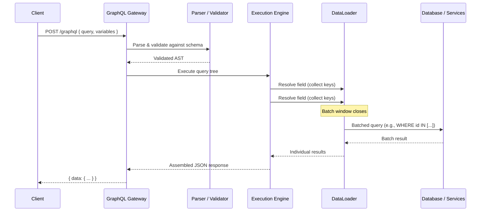
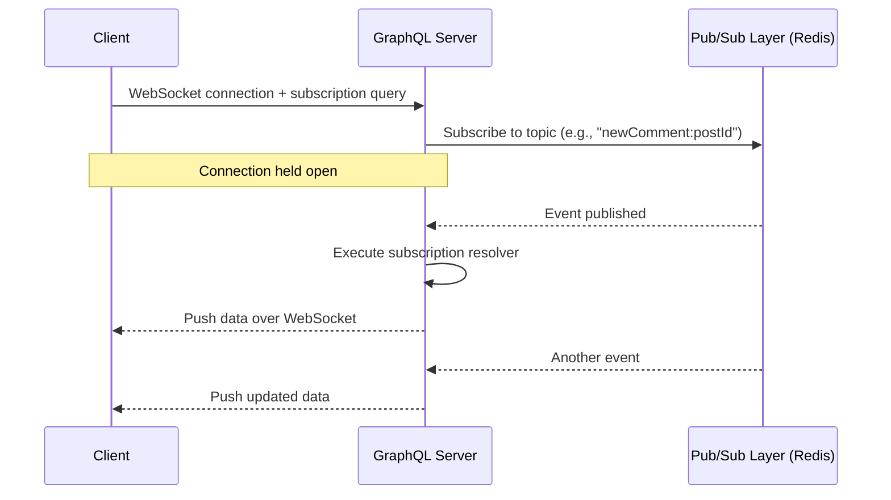

# GraphQL

## 1. Overview

GraphQL is a query language and runtime for APIs that lets the client define the exact shape of the data it needs. Unlike REST, where the server dictates the response structure via fixed endpoints, GraphQL exposes a single endpoint backed by a strongly typed schema. The client sends a query describing the fields it wants, and the server returns precisely that -- nothing more, nothing less. This eliminates the over-fetching and under-fetching problems that plague REST APIs in frontend-heavy applications.

GraphQL was developed internally at Facebook in 2012 and open-sourced in 2015. It is now governed by the GraphQL Foundation under the Linux Foundation.

## 2. Why It Matters

In modern product architectures, a single screen often requires data from multiple backend services. With REST, this means either making multiple round trips (under-fetching) or receiving bloated payloads with fields the client never uses (over-fetching). Both waste bandwidth, increase latency, and couple frontend evolution to backend API versioning.

GraphQL shifts payload control to the client. This is particularly valuable when:

- Mobile clients need minimal payloads over constrained networks
- Multiple frontend platforms (web, iOS, Android, TV) consume the same backend but need different data shapes
- Rapid product iteration demands API flexibility without backend redeployments

## 3. Core Concepts

- **Schema**: The contract between client and server. Defines types, fields, and relationships using the Schema Definition Language (SDL). The schema is the single source of truth for what the API can do.
- **Query**: A read operation. Clients specify exactly which fields they want, including nested relationships, in a single request.
- **Mutation**: A write operation (create, update, delete). Mutations follow the same syntax as queries but modify server-side state.
- **Subscription**: A persistent connection (typically over WebSockets) that pushes real-time updates to the client when specified data changes.
- **Resolver**: A function attached to each field in the schema. The resolver is responsible for fetching the data for that field from whatever backing data source it needs (database, microservice, cache).
- **Type System**: GraphQL enforces types (scalars, objects, enums, interfaces, unions) at the schema level, catching errors before execution.
- **Introspection**: Clients can query the schema itself to discover available types and fields. This powers tooling like GraphiQL and Apollo Studio.

## 4. How It Works

### Query Execution

1. The client sends a query document (a string) to the single GraphQL endpoint (typically `POST /graphql`).
2. The server parses the query, validates it against the schema, and builds an execution plan (an Abstract Syntax Tree).
3. The server walks the query tree depth-first, invoking the resolver function for each field.
4. Resolvers execute in parallel where possible (sibling fields) and return data that matches the requested shape.
5. The server assembles the result into a JSON response mirroring the query structure exactly.
6. If any resolver errors, the response includes both `data` (partial results) and `errors` (resolver-specific failures). This partial-failure design is intentional -- a failing avatar URL resolver should not prevent the post title from being returned.

### Over-Fetching and Under-Fetching Explained

**Over-fetching (REST problem)**: A REST endpoint `GET /users/123` returns all 40 fields of a user object (name, email, address, preferences, avatar, settings...) when the mobile client only needs `name` and `avatar`. The excess 38 fields waste bandwidth on every request. Multiply this across millions of mobile users on cellular networks and it becomes a real cost.

**Under-fetching (REST problem)**: To display a user's profile page with their 5 most recent posts and each post's comment count, REST requires:
1. `GET /users/123` -- user data
2. `GET /users/123/posts?limit=5` -- recent posts
3. `GET /posts/456/comments/count`, `GET /posts/457/comments/count`, ... (5 more requests)

That is 7 HTTP round trips. With GraphQL, this is a single query:

```graphql
query {
  user(id: "123") {
    name
    avatar
    posts(limit: 5) {
      title
      commentCount
    }
  }
}
```

One request. One response. The server resolves each field from whatever backend it needs.

### The N+1 Problem

The N+1 problem is the most critical performance pitfall in GraphQL. Consider a query that fetches a list of 50 posts, each with its author:

```graphql
query {
  posts(limit: 50) {
    title
    author {
      name
    }
  }
}
```

A naive implementation fires 1 query to fetch 50 posts, then 50 individual queries to fetch each author. That is 51 database calls for what should be 2.

### DataLoaders

DataLoaders solve the N+1 problem through two mechanisms:

- **Batching**: Instead of resolving each author individually, the DataLoader collects all author IDs requested within a single tick of the event loop, then issues a single `SELECT * FROM users WHERE id IN (...)` query.
- **Caching**: Within a single request, if the same author ID is resolved multiple times, the DataLoader returns the cached result from the first fetch.

DataLoaders are per-request (not global) to avoid stale data across different user contexts.

### Schema Design Principles

- **Graph-first modeling**: Design the schema around the domain graph, not around database tables or REST endpoints. A `User` type should expose `posts`, `followers`, and `settings` as fields regardless of which microservice owns them.
- **Nullable by default**: In GraphQL, fields are nullable unless explicitly marked with `!`. This is intentional -- a partial response is better than a total failure when one resolver errors.
- **Pagination via connections**: Use the Relay connection pattern (`edges`, `nodes`, `pageInfo`, `cursor`) rather than offset-based pagination for stable, efficient pagination over large datasets.
- **Input types for mutations**: Complex mutations should use dedicated `input` types rather than long argument lists. This improves readability and enables reuse across mutations.
- **Deprecation over removal**: GraphQL supports field-level `@deprecated` directives, allowing gradual migration without breaking existing clients. This is a significant advantage over REST API versioning.

### Persisted Queries

In production, sending the full query string on every request is wasteful and creates a security surface (arbitrary queries). Persisted queries solve this:

1. At build time, the client's queries are extracted and registered with the server, each receiving a unique hash ID.
2. At runtime, the client sends only the hash ID and variables.
3. The server looks up the full query by hash and executes it.

Benefits: reduced payload size (hash vs. full query string), server-side query allowlisting (prevents arbitrary queries), and enables HTTP GET requests for CDN caching.

### Query Complexity and Cost Analysis

To prevent resource abuse, production GraphQL servers assign a "cost" to each field based on its resolver complexity. A list field that fetches from a database might cost 10 points, while a scalar field costs 1. The server enforces a maximum cost per query (e.g., 1,000 points), rejecting overly complex queries before execution begins. This prevents a single malicious query like `{ users { friends { friends { friends { posts } } } } }` from consuming unbounded resources.

## 5. Architecture / Flow



### Subscription Flow



## 6. Types / Variants

### Operation Types

| Operation | Purpose | Transport | Idempotent |
|-----------|---------|-----------|------------|
| Query | Read data | HTTP POST | Yes |
| Mutation | Write data | HTTP POST | Depends on implementation |
| Subscription | Real-time updates | WebSocket (typically) | N/A (push-based) |

### Schema Design Patterns

| Pattern | Description | When to Use |
|---------|-------------|-------------|
| **Schema Stitching** | Merges multiple GraphQL schemas from different services into one gateway schema | Legacy migration; smaller teams |
| **Federation** (Apollo) | Each service owns a portion of the graph and declares how its types extend others. A gateway composes them at runtime. | Microservice architectures at scale |
| **Schema-first** | Write the SDL first, then implement resolvers | Strong contract-first teams |
| **Code-first** | Generate the schema from code annotations/decorators | Rapid iteration; TypeScript/Python shops |

### GraphQL vs REST vs gRPC

| Dimension | REST | GraphQL | gRPC |
|-----------|------|---------|------|
| Payload control | Server-defined | Client-defined | Server-defined (Protobuf) |
| Transport | HTTP/1.1+ | HTTP (single endpoint) | HTTP/2 |
| Data format | JSON | JSON | Binary (Protobuf) |
| Over-fetching | Common | Eliminated | N/A (binary schemas) |
| Real-time | Requires SSE/WS bolted on | Subscriptions built-in | Bidirectional streaming |
| Caching | HTTP caching (ETags, CDN) | Difficult (single endpoint, POST) | Not native |
| Best for | Public APIs, CRUD | Frontend-driven apps | Internal microservice calls |

## 7. Use Cases

- **Facebook / Meta**: The original creator. Facebook's mobile apps use GraphQL to minimize payload size over cellular networks, fetching precisely the fields needed for each screen.
- **GitHub API v4**: GitHub migrated from REST (v3) to GraphQL (v4) because clients needed deeply nested data (repos -> issues -> comments -> authors) that required numerous REST calls.
- **Shopify**: Exposes its entire commerce platform via GraphQL, enabling thousands of third-party apps to fetch exactly the product, order, and customer data they need.
- **Netflix (Federated Graph)**: Uses Apollo Federation to compose a single graph from hundreds of microservices, giving frontend teams a unified API surface.
- **Twitter / X**: Uses GraphQL for its web client, enabling the timeline to fetch tweet data, engagement counts, and author info in a single query.

## 8. Tradeoffs

| Advantage | Disadvantage |
|-----------|-------------|
| Eliminates over-fetching and under-fetching | HTTP caching is difficult (single POST endpoint) |
| Single endpoint simplifies client logic | Shifts query complexity to the server |
| Strong type system catches errors early | N+1 problem requires DataLoaders or careful design |
| Self-documenting via introspection | Authorization logic must be per-field, not per-endpoint |
| Subscriptions provide native real-time | Query complexity can be abused (deeply nested queries) |
| Frontend teams iterate without backend changes | Learning curve for teams accustomed to REST |

### Quantitative Considerations

- DataLoaders typically reduce database calls by 10-50x for nested queries
- Payload size reductions of 30-70% compared to equivalent REST responses (mobile apps)
- Federation adds 5-15ms of gateway overhead per request for query planning

## 9. Common Pitfalls

- **Ignoring the N+1 problem**: Without DataLoaders, GraphQL performance degrades catastrophically with nested queries. Every resolver that touches a database must be batched. This is the single most common production issue.
- **Unbounded query depth**: A malicious or careless client can request `user { friends { friends { friends { ... } } } }` recursively. Implement query depth limiting, query cost analysis, or persisted queries to cap resource consumption.
- **Treating GraphQL like REST**: Designing one-to-one mappings between GraphQL types and database tables defeats the purpose. The graph should model the domain, not the storage layer.
- **Global caching assumptions**: REST's HTTP caching (CDN, ETags) does not work out of the box with GraphQL's single POST endpoint. You need application-level caching (Apollo Client cache, Redis) or persisted queries with GET requests.
- **Monolithic resolvers**: Putting all logic in a single resolver creates the same coupling problems as a monolith. Use DataLoaders and service boundaries to keep resolvers thin.
- **Skipping authorization at the resolver level**: Relying on a gateway-level auth check is insufficient. Each resolver must enforce its own authorization rules, because a single query can span multiple security contexts.

## 10. Real-World Examples

- **Facebook**: Uses GraphQL to serve billions of requests daily. The mobile app fetches News Feed items with precisely the fields needed per card type (text post vs. video vs. link preview), reducing bandwidth by over 50% compared to their previous REST approach.
- **GitHub**: Their GraphQL API lets a single query fetch a repository, its last 10 issues, the first 5 comments on each issue, and the author of each comment. The equivalent REST flow required 1 + 10 + 50 = 61 HTTP requests.
- **Airbnb**: Adopted GraphQL to unify data from over 1,000 microservices behind a single graph, enabling frontend teams to ship features without waiting for backend endpoint creation.
- **The New York Times**: Uses GraphQL for its content delivery platform, allowing editors and apps to query articles, media assets, and metadata in flexible combinations.

### Federation Deep Dive (Apollo Federation)

In a microservices architecture, no single team owns the entire GraphQL schema. Apollo Federation allows each service to define its own portion of the graph:

1. **Subgraph definition**: Each microservice defines a subgraph schema. The User Service defines the `User` type. The Posts Service defines the `Post` type and extends `User` with a `posts` field.
2. **Entity references**: Services declare "entities" -- types that can be resolved across service boundaries using a key (e.g., `User` is an entity with key `id`). When the Posts Service needs to attach posts to a user, it references the User entity by ID.
3. **Gateway composition**: The Apollo Gateway fetches all subgraph schemas, composes them into a single "supergraph," and builds a query plan. When a client queries for a user with their posts, the gateway:
   a. Fetches the user from the User Service
   b. Extracts the user ID
   c. Sends the user ID to the Posts Service to resolve the `posts` field
   d. Assembles the combined result

**Performance implications**: Federation adds query-planning overhead (~5-15ms) and may require multiple inter-service calls per query. The gateway must be horizontally scaled and monitored for latency. Despite this overhead, Federation is the dominant pattern at companies with 10+ microservices because the alternative (a monolithic BFF -- Backend For Frontend -- that manually aggregates) is a maintenance nightmare.

### Error Handling Philosophy

GraphQL's error model is fundamentally different from REST:

- **REST**: A failing endpoint returns a 500 status code. The entire response is an error.
- **GraphQL**: A failing resolver returns `null` for that field, with an error entry in the `errors` array. The rest of the response is delivered normally.

This means a query fetching `user { name, avatar, settings }` will still return `name` and `settings` even if the avatar service is down. The client receives a partial result and can degrade gracefully (show a placeholder avatar). This is a deliberate design choice: in a distributed system, partial availability is better than total failure.

The implication for architects: **every nullable field is a potential degradation boundary**. Design the schema so that the most critical fields (user name, post text) are always resolvable from highly available services, while optional fields (avatar URL, recommendation widgets) can fail independently.

## 11. Related Concepts

- [REST API](rest-api.md) -- the traditional alternative; better for cacheable, public APIs
- [gRPC](grpc.md) -- binary protocol preferred for internal microservice communication
- [Real-Time Protocols](real-time-protocols.md) -- WebSockets (used by GraphQL subscriptions), SSE alternatives
- [Caching](../caching/caching.md) -- application-level caching strategies needed since HTTP caching is limited
- [API Gateway](../architecture/api-gateway.md) -- often hosts the GraphQL federation layer

### Performance Monitoring and Observability

Production GraphQL servers require field-level observability. Unlike REST, where each endpoint has its own latency metrics, GraphQL's single endpoint means you must trace performance at the resolver level:

- **Per-resolver latency**: Track the P50, P95, and P99 latency of each resolver function. A slow `User.avatar` resolver that takes 200ms will degrade every query that includes that field.
- **DataLoader batch efficiency**: Monitor the average batch size of each DataLoader. A batch size of 1 indicates the DataLoader is not batching (misconfigured or single-item queries). A batch size of 50 indicates effective batching.
- **Error rate per field**: Track which fields produce the most errors. A field with a 5% error rate may indicate an unstable downstream service.
- **Query depth and complexity distribution**: Monitor the actual depth and complexity of queries hitting the server. If a significant percentage of queries approach the complexity limit, the limit may need adjustment.
- **Cache hit rate (Apollo)**: Apollo Client and Apollo Server both support response caching. Track the hit rate to ensure caching is effective.

Tools like Apollo Studio, GraphQL Inspector, and custom Prometheus exporters provide this observability. Without it, debugging performance issues in a GraphQL API is like debugging a REST API with no per-endpoint metrics.

## 12. Source Traceability

| Concept | Source |
|---------|--------|
| Over-fetching / under-fetching, GraphQL vs REST vs gRPC | YouTube Report 9 (Section 3: API Design) |
| N+1 problem and DataLoaders | YouTube Report 9 (Section 3) |
| Schema-first design, subscriptions, resolvers | YouTube Report 8 (Section 8: Communication Protocols) |
| GraphQL as client-defined response shape | YouTube Report 5 (Section 8) |
| Federation and gateway composition | Concept Index (api-design/graphql.md entry) |
