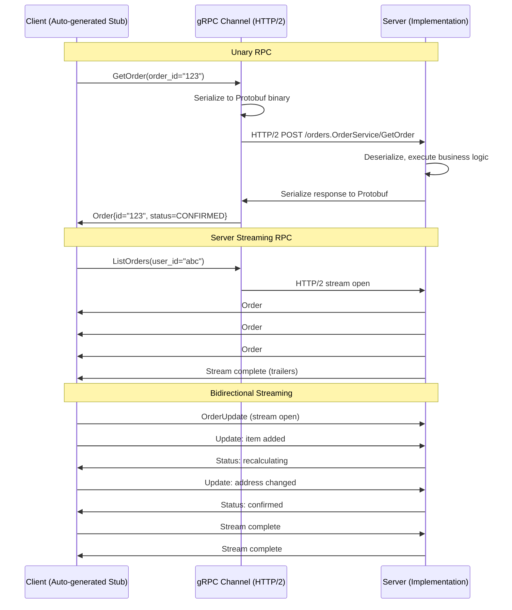
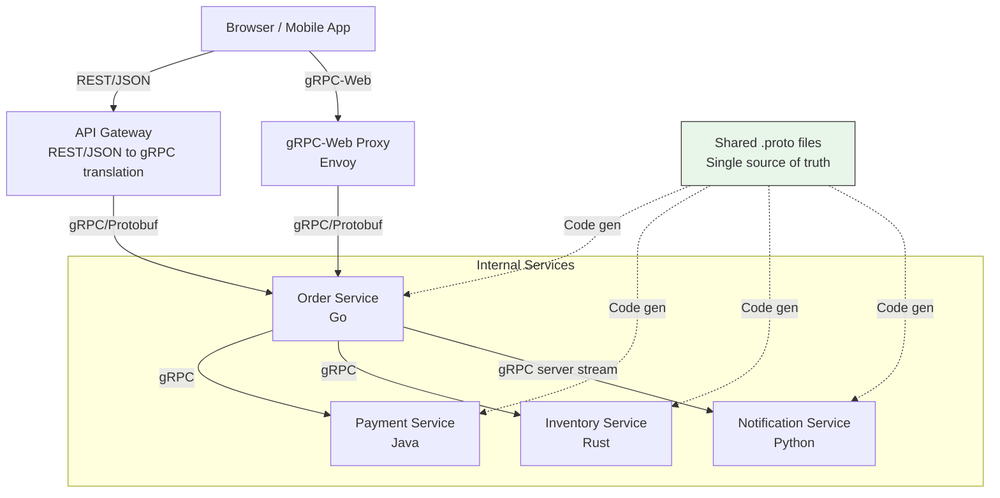

# gRPC

## 1. Overview

gRPC (Google Remote Procedure Call) is a high-performance, open-source RPC framework that uses **Protocol Buffers** for binary serialization and **HTTP/2** as its transport protocol. Unlike REST, which is resource-centric (you operate on nouns), gRPC is function-centric (you call remote procedures). You define service interfaces in a `.proto` file, and gRPC auto-generates client and server stubs in 10+ languages.

gRPC is the standard for inter-service communication in microservices architectures where performance matters. Protobuf's binary encoding is 5-10x smaller and faster to serialize/deserialize than JSON. HTTP/2 multiplexing eliminates head-of-line blocking and allows multiple concurrent RPCs over a single TCP connection. Bidirectional streaming enables real-time data flow patterns that REST simply cannot express.

The tradeoff is accessibility: gRPC is not natively supported by web browsers, making it a poor choice for public-facing APIs. It requires HTTP/2 (which some corporate proxies and firewalls block), and its binary format makes debugging harder than reading JSON. gRPC is the "kitchen shorthand" -- fast and efficient for the team that knows the language, but not the menu you hand to customers.

## 2. Why It Matters

- **Performance at scale**: In a microservices mesh where Service A calls Service B which calls Services C and D, the serialization and network overhead of each call compounds. gRPC's binary encoding and HTTP/2 multiplexing reduce per-call overhead by 5-10x compared to REST/JSON, directly impacting tail latency.
- **Strong typing and code generation**: The `.proto` schema is a single source of truth for the API contract. Auto-generated client and server code eliminates hand-written serialization, deserialization, and API client libraries -- a major source of bugs in REST integrations.
- **Streaming**: gRPC's four streaming modes (unary, server, client, bidirectional) enable patterns like real-time feeds, long-running operations, and bulk data transfer that require custom WebSocket implementations in REST.
- **Polyglot environments**: A `.proto` file generates correct, idiomatic code for Go, Java, Python, C++, Rust, JavaScript, and more. This is critical in large organizations where different teams use different languages.
- **Backward/forward compatibility**: Protocol Buffers' field numbering system allows schema evolution without breaking existing clients -- adding new fields is always safe if they are optional and use new field numbers.

## 3. Core Concepts

- **Protocol Buffers (Protobuf)**: A language-neutral, platform-neutral binary serialization format. Defines data structures and service interfaces in `.proto` files.
- **Service definition**: A `.proto` file that defines the RPC methods a service exposes, their request/response message types, and streaming behavior.
- **Message**: A structured data type defined in Protobuf. Each field has a name, type, and a unique **field number** (not a field name) that is used in the binary encoding.
- **Field number**: An integer tag assigned to each field in a message. The binary encoding uses field numbers, not names, which is why Protobuf is compact and why fields can be renamed without breaking compatibility.
- **Stub**: Auto-generated client code that provides method signatures matching the service definition. The developer calls the stub like a local function; the stub handles serialization, network transport, and deserialization.
- **Channel**: A connection to a gRPC server at a specific address. Channels manage connection pooling and load balancing.
- **Metadata**: Key-value pairs sent alongside RPCs (analogous to HTTP headers). Used for authentication tokens, tracing context, and request IDs.
- **Status codes**: gRPC defines its own status codes (OK, CANCELLED, INVALID_ARGUMENT, NOT_FOUND, PERMISSION_DENIED, INTERNAL, UNAVAILABLE, DEADLINE_EXCEEDED, etc.) separate from HTTP status codes.
- **Deadline/timeout**: Every gRPC call should specify a deadline. If the call does not complete by the deadline, it is cancelled. Deadlines propagate across service boundaries.

## 4. How It Works

### Protocol Buffers Encoding

A Protobuf message definition:

```protobuf
syntax = "proto3";

message Person {
  string user_name = 1;
  int64 favorite_number = 2;
  repeated string interests = 3;
}
```

**Binary encoding**:
- Each field is encoded as a **tag** (field_number << 3 | wire_type) followed by the **value**.
- Wire types: 0 = varint (int32, int64, bool), 2 = length-delimited (string, bytes, embedded messages), 5 = 32-bit fixed.
- Strings are stored as length-prefixed UTF-8. Integers use **variable-length encoding** (varint): small numbers use 1 byte, larger numbers use more bytes.
- Field **names** are not stored in the encoding -- only field numbers. This is why Protobuf is much smaller than JSON.

**Size comparison** for the same data:
| Format | Size |
|---|---|
| JSON (with whitespace) | 81 bytes |
| JSON (minified) | 66 bytes |
| MessagePack (binary JSON) | 66 bytes |
| Thrift BinaryProtocol | 59 bytes |
| Thrift CompactProtocol | 34 bytes |
| Protocol Buffers | 33 bytes |

Protobuf achieves ~2.5x compression over JSON by eliminating field names, using varint encoding for integers, and storing the schema externally.

### Service Definition and Code Generation

```protobuf
syntax = "proto3";

package orders;

service OrderService {
  // Unary RPC: single request, single response
  rpc GetOrder(GetOrderRequest) returns (Order);

  // Server streaming: single request, stream of responses
  rpc ListOrders(ListOrdersRequest) returns (stream Order);

  // Client streaming: stream of requests, single response
  rpc UploadOrders(stream Order) returns (UploadSummary);

  // Bidirectional streaming: both sides stream independently
  rpc OrderChat(stream OrderUpdate) returns (stream OrderStatus);
}

message GetOrderRequest {
  string order_id = 1;
}

message Order {
  string order_id = 1;
  string user_id = 2;
  repeated Item items = 3;
  OrderStatus status = 4;
  int64 created_at = 5;
}

message Item {
  string product_id = 1;
  int32 quantity = 2;
  int64 price_cents = 3;
}

enum OrderStatus {
  PENDING = 0;
  CONFIRMED = 1;
  SHIPPED = 2;
  DELIVERED = 3;
}
```

Running `protoc --go_out=. --go-grpc_out=. orders.proto` generates:
- **Message classes** with getters, setters, serialization, and deserialization methods.
- **Client stub** with typed method signatures matching the service definition.
- **Server interface** that the developer implements with business logic.

### HTTP/2 Transport

gRPC uses HTTP/2 as its transport layer, leveraging several key features:

- **Multiplexing**: Multiple RPCs share a single TCP connection. Each RPC is an independent HTTP/2 stream. No head-of-line blocking -- a slow RPC does not block fast ones.
- **Header compression (HPACK)**: HTTP/2 compresses headers using a shared dictionary, reducing overhead for repeated metadata (auth tokens, content types).
- **Flow control**: Per-stream and per-connection flow control prevents a fast producer from overwhelming a slow consumer.
- **Server push**: While gRPC does not use HTTP/2 server push directly, the multiplexing capability enables its streaming modes.

### Schema Evolution and Compatibility

Protobuf's field numbering system enables safe schema evolution:

**Adding a new field** (always safe):
```protobuf
message Order {
  string order_id = 1;
  string user_id = 2;
  // New field added with new field number
  string tracking_number = 6;  // Old clients ignore unknown fields
}
```

**Removing a field** (safe if done correctly):
```protobuf
message Order {
  string order_id = 1;
  // user_id removed -- old clients sending field 2 will be ignored
  // Reserve the field number to prevent accidental reuse
  reserved 2;
  reserved "user_id";
}
```

**Rules for compatibility**:
- Never change the field number of an existing field.
- Never reuse a field number (use `reserved`).
- Changing a field name is safe (names are not in the binary encoding).
- Changing between compatible types (int32 <-> int64) is safe.
- Adding new fields to a `oneof` is safe; removing existing ones is not.

### Four Streaming Modes

1. **Unary RPC**: Client sends one request, server returns one response. Equivalent to a REST call. Most common mode.

2. **Server streaming**: Client sends one request, server returns a stream of responses. Use case: subscribing to real-time updates (stock prices, order status changes), streaming large result sets without loading everything into memory.

3. **Client streaming**: Client sends a stream of messages, server returns one response after the stream completes. Use case: uploading a batch of records, aggregating sensor data from an IoT device.

4. **Bidirectional streaming**: Both client and server send streams of messages independently. Messages can be interleaved -- neither side needs to wait for the other. Use case: real-time chat, collaborative editing, interactive ML inference.

## 5. Architecture / Flow

### gRPC Service Communication



### gRPC in a Microservices Architecture



## 6. Types / Variants

### Serialization Formats Comparison

| Format | Origin | Encoding | Schema | Code Gen | Compatibility | Size |
|---|---|---|---|---|---|---|
| Protocol Buffers | Google | Binary (varint + tags) | .proto (mandatory) | 10+ languages | Field numbers | ~33 bytes* |
| Thrift | Facebook | Binary (compact/binary) | .thrift (mandatory) | 10+ languages | Field IDs | ~34 bytes* |
| Avro | Apache | Binary (no tags in data) | .avsc JSON schema | Java, Python, C | Schema resolution | ~32 bytes* |
| JSON | Douglas Crockford | Text (UTF-8) | JSON Schema (optional) | N/A | Field names | ~66 bytes* |
| MessagePack | Sadayuki Furuhashi | Binary JSON | None | Many languages | Field names | ~66 bytes* |

*For the same example record: `{userName: "Martin", favoriteNumber: 1337, interests: ["daydreaming", "hacking"]}`

**Key distinction**: Protobuf and Thrift embed field numbers in the data, allowing schema evolution via stable field IDs. Avro encodes no field information in the data at all -- the reader and writer schemas are resolved at read time, making it the most compact but requiring both schemas to be available.

### Streaming Mode Comparison

| Mode | Request | Response | Use Case | REST Equivalent |
|---|---|---|---|---|
| Unary | Single | Single | Standard request-response | Normal REST call |
| Server streaming | Single | Stream | Real-time feeds, large result sets | SSE, long polling |
| Client streaming | Stream | Single | Bulk upload, aggregation | Chunked upload |
| Bidirectional | Stream | Stream | Chat, collaborative editing | WebSockets |

### gRPC vs. REST Detailed Comparison

| Dimension | gRPC | REST |
|---|---|---|
| Serialization | Protobuf (binary, ~33 bytes) | JSON (text, ~66 bytes) |
| Transport | HTTP/2 (multiplexing, header compression) | HTTP/1.1 or HTTP/2 |
| Schema | Mandatory .proto (contract-first) | Optional OpenAPI (code-first common) |
| Code generation | Built-in, multi-language | Third-party tools (OpenAPI Generator) |
| Streaming | Native (4 modes) | Requires WebSockets or SSE |
| Browser support | Requires gRPC-Web proxy (Envoy) | Native |
| Caching | Not built-in (POST semantics) | Native HTTP caching (GET) |
| Debugging | Binary -- needs grpcurl or Postman | Text -- curl, browser, any HTTP tool |
| Performance | 5-10x faster serialization/deserialization | Baseline |
| Latency (connection setup) | 1 TCP connection, multiplexed | 1 TCP connection per request (HTTP/1.1) |
| Error handling | Rich status codes + error details proto | HTTP status codes + JSON body |
| Best for | Internal microservices, polyglot, streaming | Public APIs, browser clients, CRUD |

## 7. Use Cases

- **Netflix**: Uses gRPC for inter-service communication within their microservices mesh. The binary encoding and HTTP/2 multiplexing reduce latency across the hundreds of service calls required to render a single page.
- **Google**: Created Protobuf and gRPC. Used internally for virtually all inter-service communication across Google's fleet. Google Cloud APIs offer gRPC endpoints alongside REST.
- **Uber**: gRPC is the standard for new inter-service communication. The move from a Thrift-based RPC framework to gRPC reduced serialization overhead and simplified cross-language service development.
- **Dropbox**: Courier, their internal RPC framework, is built on gRPC. It handles millions of RPCs per second across their file sync, metadata, and notification services.
- **Square/Block**: Uses gRPC for communication between payment processing services where every millisecond of latency translates directly to revenue impact.
- **Slack**: Uses gRPC for backend service communication. Message delivery, channel operations, and presence updates flow through gRPC streams between services.

## 8. Tradeoffs

| Decision | Tradeoff |
|---|---|
| gRPC vs. REST for public APIs | gRPC is faster but inaccessible from browsers without a proxy. REST is universally supported. Use REST for public APIs; gRPC for internal services. |
| Protobuf vs. Avro | Protobuf has wider adoption, better tooling, and self-describing wire format. Avro is more compact (no field tags) but requires both schemas at read time -- ideal for Hadoop/Kafka ecosystems. |
| Strict schema vs. flexible schema | Protobuf enforces a schema that prevents malformed data but increases change management overhead (regenerate stubs for every .proto change). JSON APIs allow rapid iteration but defer data validation errors to runtime. |
| Streaming vs. unary | Streaming RPCs are powerful but complex to implement correctly (handling backpressure, errors mid-stream, reconnection). Use unary unless you genuinely need streaming semantics. |
| gRPC-Web vs. REST for browser clients | gRPC-Web requires an Envoy proxy and has limited streaming support (server streaming only, no bidirectional in browsers). REST is simpler for browser clients. |
| Single .proto repo vs. per-service protos | Monorepo for .proto files ensures consistency and simplifies dependency management but creates coupling between teams. Per-service protos provide independence but risk version skew. |

## 9. Common Pitfalls

- **Not setting deadlines**: Every gRPC call should have a deadline. Without one, a hung downstream service holds the connection open forever, eventually exhausting connection pools and causing cascading failure. Deadlines propagate -- if Service A has a 5s deadline and calls Service B, Service B should receive a shorter deadline (e.g., 4s) to allow time for A's processing.
- **Ignoring field number management**: Reusing a deleted field number with a different type causes silent data corruption. Always `reserve` removed field numbers and names.
- **Large messages**: gRPC has a default 4MB message size limit. Streaming large files as a single message will fail. Use client streaming to send chunks, or use pre-signed URLs for file transfer.
- **Exposing gRPC directly to browsers**: Browsers do not support HTTP/2 trailers, which gRPC requires for status codes. You need gRPC-Web with an Envoy proxy, or translate to REST at the API gateway.
- **Treating gRPC like REST**: gRPC is function-centric, not resource-centric. Designing gRPC services with CRUD method names (`CreateUser`, `GetUser`, `UpdateUser`, `DeleteUser`) misses the opportunity to design around domain operations (`PlaceOrder`, `CancelBooking`).
- **Not handling streaming errors**: In server streaming, the server may fail mid-stream. Clients must handle partial results and implement retry logic with cursor-based resumption.
- **Generating code once and checking it in**: Generated code should be regenerated from `.proto` files in CI/CD, not committed to source control. Committed generated code drifts out of sync with the schema.

## 10. Real-World Examples

- **Google Cloud APIs**: Offer both REST and gRPC interfaces. The gRPC interface consistently benchmarks 3-7x faster for data-intensive operations like BigQuery exports and Pub/Sub message consumption.
- **Envoy Proxy**: Istio's data plane proxy natively understands gRPC and provides automatic load balancing, circuit breaking, and observability for gRPC traffic. This makes gRPC a first-class citizen in service mesh architectures.
- **etcd**: The distributed key-value store used by Kubernetes uses gRPC for all client-server communication. Watch operations (monitoring key changes) use server streaming, enabling efficient real-time notifications.
- **CockroachDB**: Uses gRPC for inter-node communication in their distributed SQL database. The performance of consensus rounds (Raft protocol) is directly tied to RPC latency, making gRPC's efficiency critical.
- **Lyft**: Standardized on gRPC + Envoy for all inter-service communication. Their protobuf schema registry enforces backward compatibility checks in CI -- a PR that breaks compatibility is automatically rejected.

## 11. Related Concepts

- [REST API](rest-api.md) -- the text-based alternative; see comparison in Section 6
- [Real-Time Protocols](real-time-protocols.md) -- WebSockets and SSE provide streaming for REST; gRPC streaming is the native alternative
- [Microservices](../architecture/microservices.md) -- gRPC is the preferred inter-service communication protocol in microservices architectures
- [Message Queues](../messaging/message-queues.md) -- for async communication; gRPC is for synchronous RPC
- [Networking Fundamentals](../fundamentals/networking-fundamentals.md) -- HTTP/2, TCP, and transport-layer concepts that underpin gRPC (cross-link only; api-design covers application-layer design)

## 12. Source Traceability

- source/youtube-video-reports/8.md (Section 8: gRPC as "kitchen shorthand," Protocol Buffers, 5-10x faster than JSON, binary format)
- source/youtube-video-reports/9.md (Section 3: gRPC -- Protocol Buffers, compact binary format, eliminates HTTP overhead, standard for internal microservice communication)
- source/extracted/system-design-guide/ch12-design-and-implementation-of-system-components-api-security-.md (gRPC design principles: Protobuf, .proto files, code generation, HTTP/2, bidirectional streaming, comparison with REST across performance/ease of use/compatibility/streaming)
- source/extracted/ddia/ch05-encoding-and-evolution.md (Thrift and Protocol Buffers: binary encoding, field tags vs. field names, schema evolution with field numbers, size comparisons -- 33 bytes Protobuf vs. 66 bytes JSON)
