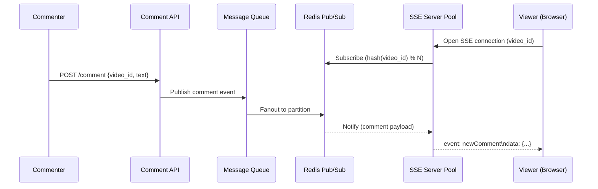
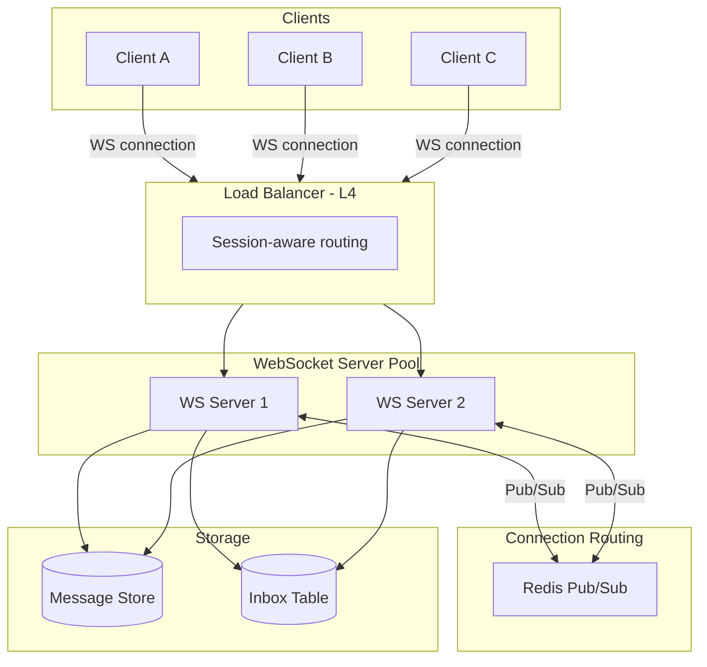
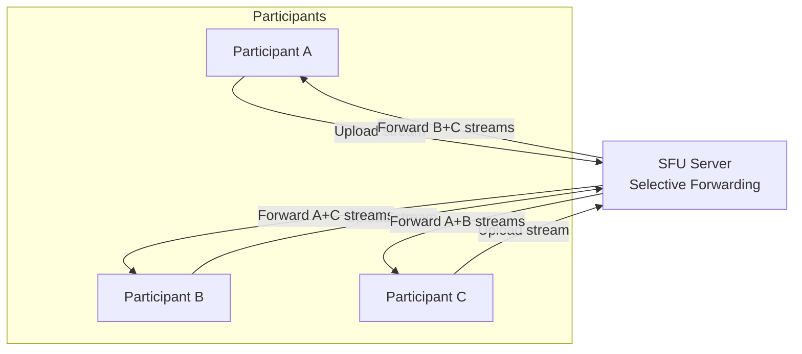

# Real-Time Protocols

## 1. Overview

Standard HTTP request-response fails the "200ms human perception" test for real-time interactivity. When users expect live updates -- chat messages, stock tickers, live comments, collaborative editing, or video calls -- the architecture must shift from client-initiated polling to server-initiated push or persistent bidirectional connections.

Real-time protocols span a spectrum from simple (long polling) to complex (WebRTC), each with distinct tradeoffs in latency, scalability, infrastructure cost, and firewall compatibility. Choosing the wrong protocol is one of the most expensive mistakes in system design because it is deeply embedded in the connection layer and painful to swap later.

## 2. Why It Matters

The business case for real-time communication is straightforward: user engagement correlates directly with perceived responsiveness. Facebook measured that live comment streams with sub-200ms latency generate 3-5x more engagement than those with perceptible delay. WhatsApp's "instant" message delivery is a core differentiator. Uber's real-time driver location tracking is fundamental to rider trust.

Beyond user experience, the protocol choice determines:
- **Infrastructure cost**: WebSocket connections are stateful and consume server memory; SSE connections are lighter but unidirectional
- **Scalability ceiling**: A single server can hold ~50,000-100,000 concurrent WebSocket connections before running out of file descriptors
- **Operational complexity**: WebSockets require sticky sessions or connection-aware routing; SSE works with standard HTTP infrastructure

## 3. Core Concepts

- **Short Polling**: The client repeatedly sends HTTP requests at fixed intervals (e.g., every 2 seconds). Simple but wasteful -- most responses return empty, yet each consumes a full HTTP round trip.
- **Long Polling**: The client sends a request and the server holds it open until new data is available or a timeout expires. More efficient than short polling, but still creates a new TCP connection per update cycle.
- **Server-Sent Events (SSE)**: A unidirectional, server-to-client stream over standard HTTP. The server pushes events down a persistent connection. The client receives them via the `EventSource` API. Built on HTTP/1.1 chunked transfer encoding.
- **WebSockets**: A full-duplex, bidirectional communication protocol. After an initial HTTP handshake (upgrade), the connection switches to the WebSocket protocol (`ws://` or `wss://`), enabling both client and server to send messages at any time.
- **WebRTC (Web Real-Time Communication)**: A peer-to-peer protocol suite for audio, video, and data channels. Uses ICE, STUN, and TURN for NAT traversal. Designed for low-latency media streaming directly between browsers.
- **HTTP/2 Server Push**: Allows the server to proactively send resources to the client before they are requested. Limited to resource preloading (CSS, JS) and not designed for arbitrary event streaming.

## 4. How It Works

### Long Polling

1. Client sends an HTTP request to the server.
2. Server holds the connection open (does not respond immediately).
3. When new data is available, the server sends the response and closes the connection.
4. Client immediately opens a new connection.
5. If the server timeout expires (e.g., 30 seconds), it returns an empty response and the client reconnects.

Long polling approximates push behavior without protocol changes. It works through all firewalls and proxies since it uses standard HTTP. The tradeoff is connection churn -- each response-reconnect cycle incurs TCP and TLS handshake overhead.

### Server-Sent Events (SSE)

1. Client opens a connection via `new EventSource('/stream')`.
2. Server responds with `Content-Type: text/event-stream` and keeps the connection open.
3. Server writes events in the SSE format:
   ```
   event: newComment
   data: {"userId": "123", "text": "Hello"}
   id: 42

   ```
4. Client receives events via the `onmessage` callback.
5. If the connection drops, the browser automatically reconnects and sends the `Last-Event-ID` header so the server can resume from where it left off.

SSE operates over standard HTTP, which means it passes through corporate firewalls, proxies, and CDNs without issue. This is its primary operational advantage over WebSockets.

### WebSockets

1. Client initiates an HTTP request with `Upgrade: websocket` and `Connection: Upgrade` headers.
2. Server responds with `101 Switching Protocols`, upgrading the connection.
3. Both sides can now send frames (text or binary) at any time over the persistent TCP connection.
4. Either side can send a close frame to terminate the connection.

The upgrade handshake is the vulnerability point: corporate firewalls, HTTP proxies, and some load balancers strip or reject the `Upgrade` header, breaking the connection. This is the "war story" reality that makes SSE the safer default for consumer-facing unidirectional streams.

### Connection Lifecycle and State Management

A critical operational concern for WebSocket and SSE architectures is connection state management at scale:

**Connection Registry**: When horizontally scaling WebSocket servers, the system must know which server holds which user's connection. Two approaches:
1. **Centralized Dispatcher (ZooKeeper/etcd)**: A coordination service maintains a global mapping of `user_id -> server_id`. When a message needs to reach User X, the system queries the registry to find the correct server. This introduces a consistency challenge -- the registry can become stale during server restarts.
2. **Pub/Sub (Redis)**: Each WebSocket server subscribes to topics relevant to its connected clients. When a message is published, Redis routes it to all subscribed servers. The subscribing server then pushes it to the appropriate local WebSocket connection. This eliminates the need for a centralized registry but requires efficient topic management.

**Connection Limits**: A single Linux server can hold ~50,000-100,000 concurrent WebSocket or SSE connections before exhausting file descriptors (each connection = 1 socket = 1 file descriptor). The theoretical limit is higher (the kernel can handle millions of file descriptors), but memory per connection (~4-8 KB for the socket buffer plus application state) becomes the practical constraint. At 100,000 connections * 8 KB = ~800 MB of socket buffer memory alone.

**Heartbeat and Keepalive**: Both WebSocket and SSE connections can silently die (client loses network, intermediate proxy times out). Servers must implement heartbeat mechanisms -- periodic ping/pong frames for WebSocket, comment events (`: keepalive\n\n`) for SSE -- to detect dead connections and reclaim resources. Without heartbeats, the server accumulates zombie connections that consume file descriptors and memory.

### WebRTC Architecture Models

WebRTC establishes peer-to-peer connections for media. In practice, pure peer-to-peer does not scale beyond 2-3 participants, so server-assisted topologies are used:

**Mesh (P2P)**:
Each participant connects directly to every other participant. For N participants, each peer maintains N-1 connections and encodes N-1 outbound streams. This is viable for 2-3 people but collapses at scale -- 10 participants require 90 connections across the group.

**MCU (Multipoint Control Unit)**:
A centralized server receives all participant streams, decodes them, mixes them into a single composite stream, re-encodes, and sends one stream to each participant. The client is lightweight but the server is CPU-intensive. Users cannot pin or resize individual participants because the video is pre-mixed.

**SFU (Selective Forwarding Unit)**:
The modern standard (Zoom, Google Meet, Microsoft Teams). The server receives each participant's stream and selectively forwards it to other participants without transcoding. The server acts as an intelligent router, not a mixer. Clients can render their own layout, pin speakers, and adjust quality. Server CPU cost is minimal (no transcoding), and bandwidth is the primary cost.

**SFU Optimization -- Simulcast**: To further reduce bandwidth, each participant encodes their video at 2-3 quality levels simultaneously (e.g., 720p, 360p, 180p). The SFU then selectively forwards the appropriate quality to each receiver:
- The active speaker's stream is forwarded at 720p to all participants.
- Thumbnail-sized participants receive the 180p stream.
- Participants who have their video tab in the background receive no video stream at all.
This dramatically reduces bandwidth: instead of forwarding N full-resolution streams to each participant, the SFU forwards a mix of resolutions based on viewport state.

### NAT Traversal (ICE, STUN, TURN)

WebRTC must establish direct connections between peers, but most devices sit behind NAT (Network Address Translation), which hides their true IP address. WebRTC uses the ICE (Interactive Connectivity Establishment) framework to negotiate connections:

1. **STUN (Session Traversal Utilities for NAT)**: The client contacts a STUN server to discover its public IP address and port mapping. If both peers can discover their public endpoints, they establish a direct P2P connection. This works for ~80% of connections.
2. **TURN (Traversal Using Relays around NAT)**: When direct connection fails (symmetric NAT, restrictive firewalls), traffic is relayed through a TURN server. The TURN server acts as a proxy, adding latency (~10-50ms) but guaranteeing connectivity. TURN is expensive because all media traffic flows through the server.
3. **ICE Candidate Gathering**: The client gathers multiple connection candidates (local IP, STUN-discovered IP, TURN relay) and tries them in order of preference (direct first, relay last). The fastest successful candidate wins.

## 5. Architecture / Flow

### SSE for Live Broadcasting (Facebook Live Comments)



### WebSocket Chat Architecture



### WebRTC SFU Topology



## 6. Types / Variants

### Protocol Comparison

| Protocol | Direction | Transport | Latency | Firewall-safe | Max Concurrent (per server) | Best For |
|----------|-----------|-----------|---------|---------------|---------------------------|----------|
| Short Polling | Client-pull | HTTP | High (interval-bound) | Yes | Unlimited (stateless) | Infrequent updates (seat maps) |
| Long Polling | Client-pull (held) | HTTP | Medium (per-cycle) | Yes | ~10,000 | Low-frequency updates; fallback |
| SSE | Server-push | HTTP | Low (~50ms) | Yes | ~50,000-100,000 | Live feeds, notifications, tickers |
| WebSocket | Bidirectional | WS/WSS | Very low (~10ms) | Sometimes blocked | ~50,000-100,000 | Chat, gaming, collaborative editing |
| WebRTC | P2P / via SFU | UDP/DTLS | Ultra-low (~20ms) | Requires TURN fallback | N/A (P2P) | Video/audio calls |

### WebRTC Topology Comparison

| Topology | Server CPU | Bandwidth (server) | Client CPU | Max Participants | Layout Flexibility |
|----------|-----------|-------------------|------------|------------------|-------------------|
| Mesh (P2P) | None | None | Very high (N-1 encode/decode) | 2-3 | Full (client-rendered) |
| MCU | Very high (decode + mix + re-encode) | N streams in, N streams out | Low (1 decode) | 20-50 | None (pre-mixed) |
| SFU | Low (forward only) | N streams in, N*(N-1) streams out | Medium (N-1 decode) | 50-500+ | Full (client-rendered) |

### Decision Guide

| Scenario | Recommended Protocol | Rationale |
|----------|---------------------|-----------|
| Live comments / news feed | SSE | Unidirectional server-to-client; firewall-safe; auto-reconnect |
| Chat / messaging | WebSocket | Bidirectional needed; low latency; persistent connection |
| Stock ticker / price updates | SSE | Unidirectional; high-frequency server push |
| Seat map availability | Long Polling | Low-frequency; simplest to implement |
| Video conferencing (2 people) | WebRTC Mesh | Direct P2P; lowest latency |
| Video conferencing (group) | WebRTC + SFU | Scalable; client controls layout |
| Collaborative document editing | WebSocket | Bidirectional; operational transforms require low-latency sync |
| IoT sensor telemetry | WebSocket or MQTT | Bidirectional; lightweight frames |

## 7. Use Cases

- **Facebook Live Comments**: Uses SSE to push comments to millions of concurrent viewers. The Pub/Sub layer is partitioned by `hash(video_id) % N` to prevent the "firehose" effect where a single server receives all global comments. This architecture achieved sub-200ms delivery for the "Chewbacca Mom" video with 180 million viewers.
- **WhatsApp**: Uses WebSocket connections for message delivery. The "inbox pattern" stores messages server-side until the recipient's device ACKs receipt, ensuring at-least-once delivery even when the recipient is offline.
- **Slack**: WebSocket connections for real-time message delivery within channels. Falls back to long polling when WebSocket connections are blocked by corporate firewalls.
- **Zoom**: Uses WebRTC with SFU topology. Each participant uploads one stream; the SFU selectively forwards streams based on the active speaker and client viewport, saving bandwidth by not forwarding streams the client is not displaying.
- **Google Meet**: SFU-based WebRTC. Adapts video quality per-participant based on network conditions using simulcast (encoding at multiple resolutions simultaneously).
- **Uber**: Long polling (historically) and WebSockets for real-time driver location updates on the rider map. The rider app receives location pings every 1-4 seconds.

## 8. Tradeoffs

| Factor | SSE | WebSocket | WebRTC (SFU) |
|--------|-----|-----------|--------------|
| Implementation complexity | Low | Medium | High |
| Infrastructure cost | Low (standard HTTP) | Medium (stateful connections) | High (media servers) |
| Firewall compatibility | Excellent | Problematic | Requires TURN fallback |
| Auto-reconnect | Built-in (browser `EventSource`) | Manual implementation required | ICE renegotiation |
| Binary data support | No (text only) | Yes (text + binary frames) | Yes (media + data channels) |
| Browser support | All modern browsers | All modern browsers | All modern browsers |
| Connection limit per domain | ~6 (HTTP/1.1) | ~6 at handshake, then unlimited | N/A |
| Load balancer requirements | Standard HTTP LB | Session-aware / L4 / sticky | Specialized media relay |

### SSE vs WebSocket: The Architect's Decision

The read-to-write ratio is the determining factor. If the ratio is 1000:1 (like a broadcast), SSE is strictly superior: it is simpler, passes through firewalls, auto-reconnects, and uses standard HTTP infrastructure. WebSockets are justified only when the client needs to send data frequently (chat, gaming, collaboration). The "war story" reality is that WebSockets break in production due to corporate firewalls stripping the `Upgrade` header, load balancers not supporting the protocol switch, and connection state making horizontal scaling harder.

## 9. Common Pitfalls

- **Defaulting to WebSockets for everything**: Engineers reach for WebSockets when SSE would suffice. If the client only needs to receive updates (live feed, notifications, dashboards), SSE is simpler, more reliable, and cheaper to operate.
- **Ignoring connection limits**: HTTP/1.1 browsers enforce ~6 concurrent connections per domain. Opening multiple SSE streams to the same domain can exhaust this limit. Use HTTP/2 (which multiplexes streams) or consolidate into a single event stream.
- **Forgetting reconnection handling for WebSockets**: SSE has built-in auto-reconnect with `Last-Event-ID`. WebSocket reconnection must be implemented manually, including exponential backoff, session resumption, and message replay for the gap period.
- **Not partitioning the Pub/Sub layer**: A single Redis Pub/Sub instance receiving all events creates a firehose bottleneck. Partition by entity ID (e.g., `hash(video_id) % N`) so each SSE/WS server only subscribes to the partitions relevant to its connected clients.
- **Stateful connection routing without session awareness**: When a WebSocket server goes down, all its connections are lost. Clients reconnect to a different server that has no knowledge of their state. Use a shared session store (Redis) or design for stateless reconnection using message offsets.
- **Choosing Mesh WebRTC for group calls**: Mesh topology works for 2-3 participants but becomes unusable at 5+. The bandwidth requirement grows quadratically. Always use SFU for group video.

## 10. Real-World Examples

- **Facebook Live Comments (SSE + Redis Pub/Sub)**: For the "Chewbacca Mom" video (180M views), Facebook used SSE connections with a partitioned Redis Pub/Sub layer. Comment servers subscribed only to partitions matching their connected viewers' video IDs via `hash(video_id) % N`, preventing any single server from being overwhelmed by global comment traffic.
- **WhatsApp (WebSocket + Inbox Pattern)**: Each device maintains a persistent WebSocket connection. Messages are stored in a per-user inbox table. The server pushes messages over the WebSocket and waits for an ACK. Unacknowledged messages are retried on reconnection, ensuring at-least-once delivery.
- **Zoom (WebRTC + SFU)**: Participants encode their video at 2-3 quality levels (simulcast). The SFU forwards the appropriate quality level to each receiver based on their available bandwidth and whether they are viewing the speaker in full screen or a thumbnail.
- **Slack (WebSocket with Long Polling Fallback)**: Primary transport is WebSocket for real-time messages. When corporate firewalls block the upgrade handshake, Slack automatically falls back to long polling, ensuring connectivity in restricted network environments.
- **Ticketmaster (Long Polling for Seat Maps)**: During high-traffic events, seat availability changes infrequently enough that long polling (holding the request for up to 30 seconds) is sufficient and avoids the infrastructure cost of persistent connections for millions of concurrent users.

### Protocol Selection Flowchart

When choosing a real-time protocol, follow this decision tree:

1. **Does the client need to send data frequently?**
   - No -> SSE or Long Polling
   - Yes -> WebSocket or WebRTC
2. **Is the data audio/video media?**
   - Yes -> WebRTC (low-latency, P2P or SFU)
   - No -> WebSocket (text/JSON messaging)
3. **Is the update frequency low (<1/minute)?**
   - Yes -> Long Polling (simplest infrastructure)
   - No -> SSE (persistent, server-push)
4. **Must the system work through corporate firewalls?**
   - Critical requirement -> SSE (standard HTTP) or Long Polling
   - Not a concern -> WebSocket is acceptable
5. **How many concurrent connections?**
   - <10,000 -> Any protocol; choose simplest
   - 10,000-1,000,000 -> SSE or WebSocket with horizontal scaling
   - >1,000,000 -> SSE preferred (simpler connection management, standard HTTP LB)

### Scaling Patterns for Millions of Connections

At the scale of Facebook Live (180M viewers) or WhatsApp (2B users), a single protocol is not enough -- the architecture must address connection fan-out:

1. **Tiered Pub/Sub**: User-facing connection servers subscribe to partitioned Redis Pub/Sub topics. An event published to a topic is received by all connection servers subscribed to that partition, which then push to their local connected clients. Partitioning by `hash(entity_id) % N` ensures each server subscribes only to relevant partitions.

2. **Connection Server Pools**: Separate pools for different workloads. Facebook Live Comments uses a dedicated pool of SSE servers separate from the main notification infrastructure. This prevents a viral live event from impacting the notification pipeline.

3. **Geographic Distribution**: Connection servers are deployed in multiple regions. A user in Tokyo connects to a Tokyo SSE server, which subscribes to a Tokyo-region Redis cluster. Global events (a celebrity's post) are replicated across regions via cross-region Kafka topics.

4. **Graceful Degradation**: Under extreme load, the system can shed connections by closing the oldest SSE streams or reducing the push frequency (e.g., batching comments into groups of 5 instead of pushing each individually). This trades latency for stability.

## 11. Related Concepts

- [Fan-Out](../patterns/fan-out.md) -- real-time protocols are the delivery mechanism for fan-out on write
- [Message Queues](../messaging/message-queues.md) -- Kafka/Redis Pub/Sub form the backend for SSE/WS event distribution
- [Redis](../caching/redis.md) -- Pub/Sub and connection registry for real-time servers
- [GraphQL](graphql.md) -- subscriptions use WebSockets for real-time updates
- [Video Streaming](../patterns/video-streaming.md) -- WebRTC for live, HLS/DASH for on-demand

## 12. Source Traceability

| Concept | Source |
|---------|--------|
| SSE vs WebSocket tradeoffs, firewall issues | YouTube Report 2 (Section 4), YouTube Report 3 (Section 5) |
| Facebook Live Comments architecture, hash partitioning | YouTube Report 2 (Section 6), YouTube Report 3 (Section 6) |
| Long polling, short polling, WebSocket mechanics | YouTube Report 4 (Section 5), YouTube Report 9 (Section 2) |
| WebRTC Mesh / MCU / SFU topologies | YouTube Report 4 (Section 5) |
| WhatsApp inbox pattern, ACK-based delivery | YouTube Report 5 (Section 4.3) |
| SSE connection scaling and Pub/Sub partitioning | YouTube Report 3 (Section 5) |
| Grokking: Long polling, WebSockets, SSE glossary | Grokking System Design (Glossary) |
