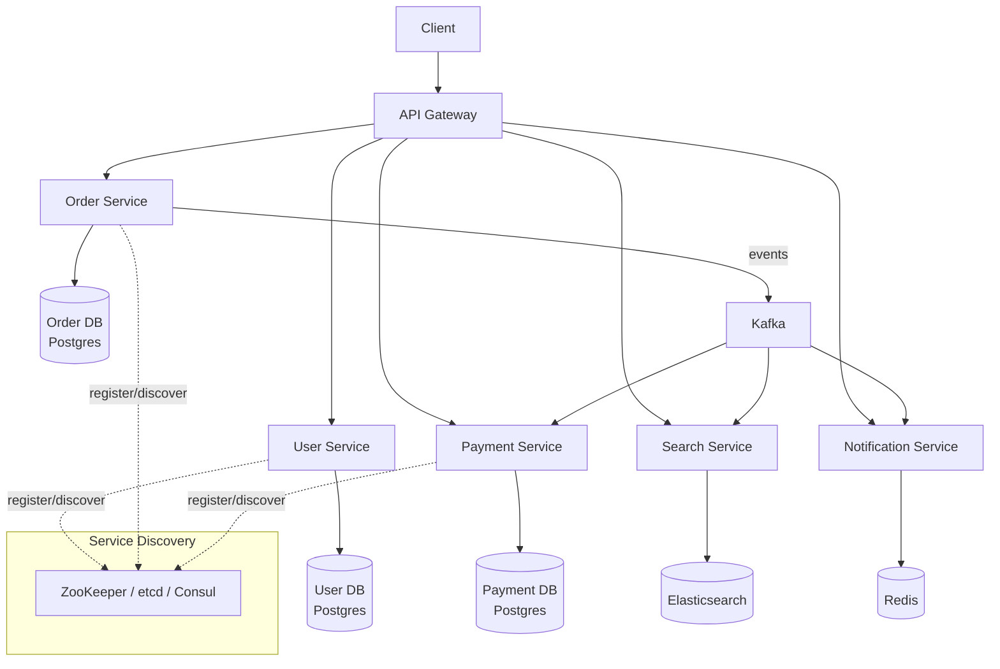
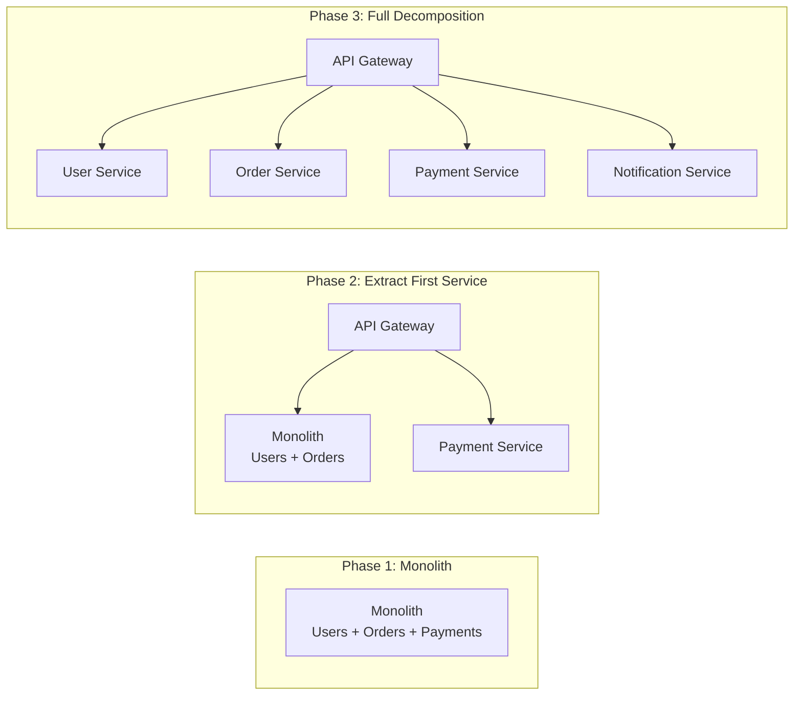

# Microservices

## 1. Overview

Microservices architecture decomposes a system into small, independently deployable services, each owning a specific business capability and its own data store. Each service runs in its own process, communicates over the network (typically HTTP/REST, gRPC, or async messaging), and can be developed, deployed, and scaled independently by a small team.

The critical thing a senior architect understands: microservices are not a goal -- they are a tool for managing organizational complexity. A monolith is the right starting point for most systems. You decompose into microservices when the monolith's deployment coupling, team coordination overhead, or scaling constraints become the bottleneck. Microservices trade deployment coupling for operational complexity. That trade-off is worth it only when you have the traffic, team size, and operational maturity to absorb the cost.

The history is instructive. Amazon mandated microservices in 2002 (the "Bezos API mandate"). Netflix decomposed their monolith starting in 2009 after a database corruption incident took down the entire site for three days. Both companies had the scale, traffic, and engineering talent to absorb the operational complexity. Companies that adopt microservices prematurely often end up with a "distributed monolith" -- all the complexity of microservices with none of the benefits.

## 2. Why It Matters

- **Independent deployment**: A bug fix in the notification service does not require redeploying the payment service. This reduces deployment risk and enables continuous delivery at scale.
- **Targeted scaling**: The search service handles 100x the traffic of the admin service. With microservices, you scale the search service to 50 instances while the admin service runs on 2. With a monolith, you scale everything together.
- **Technology flexibility**: The recommendation engine uses Python and TensorFlow; the order service uses Java and Postgres; the real-time chat uses Go and Redis. Each team picks the stack that fits their problem.
- **Fault isolation**: A memory leak in the image processing service does not crash the checkout service. The blast radius of failures is contained within service boundaries.
- **Organizational alignment**: Conway's Law in action. Small teams (two-pizza teams) own small services. This reduces coordination overhead and increases development velocity.
- **Resilience through redundancy**: Critical services can be deployed with multiple replicas across availability zones. If one instance fails, others handle the traffic. The blast radius of any single failure is limited to one service, not the entire application.

### The Monolith-First Principle

Martin Fowler's "Monolith First" advice is not a platitude -- it is based on hard-won experience:

1. **You do not know your domain boundaries yet.** In the first year of a product, the domain model changes weekly. Drawing service boundaries now means redrawing them every month.
2. **Refactoring is cheaper in a monolith.** Moving a function between modules is a rename. Moving a function between services requires API design, data migration, and deployment pipeline changes.
3. **Most startups fail from lack of product-market fit, not from scaling problems.** Investing in microservices before validating the product is premature optimization at the highest level.
4. **You can always decompose later.** A well-structured monolith with clear module boundaries can be split into services when the pressure warrants it. The inverse (merging microservices into a monolith) is much harder.

## 3. Core Concepts

- **Service Decomposition**: Breaking a monolith into services along business capability boundaries (orders, payments, users, inventory). Bounded contexts from Domain-Driven Design guide where to draw the lines.
- **Bounded Context**: A DDD concept where a specific domain model is internally consistent. Each microservice typically maps to one bounded context.
- **Independent Data Stores**: Each service owns its data and does not share databases with other services. This prevents schema coupling but requires explicit data synchronization.
- **API Contract**: The formal interface (REST endpoints, gRPC proto definitions, event schemas) between services. Changes must be backward compatible.
- **Service Mesh**: An infrastructure layer (Istio, Linkerd) that handles service-to-service communication concerns (mTLS, retries, circuit breaking, observability) via sidecar proxies.
- **Sidecar Pattern**: A helper container (e.g., Envoy) deployed alongside each service instance that intercepts network traffic to implement cross-cutting concerns transparently.

## 4. How It Works

### Monolith-First Strategy

The recommended approach for most new systems:

1. **Start with a monolith**: Build a well-structured modular monolith with clear internal boundaries between modules (orders, users, payments).
2. **Identify bottlenecks**: As traffic grows, identify which modules need independent scaling, independent deployment cycles, or different technology stacks.
3. **Extract incrementally**: Extract one service at a time, starting with the module that has the clearest boundary and the strongest scaling or deployment pressure.
4. **Strangler Fig pattern**: Route traffic through a gateway that can direct requests to either the monolith or the new service. Gradually migrate functionality until the monolith module is empty.

### Communication Patterns

**Synchronous (Request-Response)**:
- REST/HTTP: Simple, widely understood. Good for CRUD operations. Higher latency due to JSON parsing.
- gRPC: Binary serialization (Protobuf). 5-10x faster than REST JSON. Supports bidirectional streaming. Ideal for internal service-to-service calls.

**Asynchronous (Event-Driven)**:
- Message queues (Kafka, SQS): Producer publishes an event; consumer processes it when ready. Decouples services in time and availability.
- Pub/sub (SNS/SQS, Redis Pub/Sub): One event consumed by multiple independent services.
- See [Event-Driven Architecture](../messaging/event-driven-architecture.md) for detailed patterns.

### Data Consistency Across Services

Since each service owns its data, cross-service transactions require distributed coordination:

- **Saga pattern**: A sequence of local transactions with compensating actions for rollback. See [Distributed Transactions](../resilience/distributed-transactions.md).
- **Eventual consistency**: Accept that data across services will converge eventually. Design the UI to handle temporary inconsistency gracefully.
- **Event sourcing**: Services publish state-change events. Other services build local projections. See [Event Sourcing](../messaging/event-sourcing.md).

## 5. Architecture / Flow

### Microservices Architecture Overview

### Monolith to Microservices Migration

## 6. Types / Variants

### Service Discovery (Section)

In a microservices architecture with dynamic scaling, services need to find each other. Service discovery solves this: "Where is an instance of the Payment Service?"

**Client-Side Discovery**:
- The client queries a service registry to get available instances, then load-balances across them.
- Example: Netflix Eureka + Ribbon. The client library handles instance selection.

**Server-Side Discovery**:
- The client sends requests to a load balancer or gateway, which queries the registry and forwards the request.
- Example: AWS ELB with ECS service discovery. The infrastructure handles routing.

| Technology | Type | Consensus | Use Case |
|---|---|---|---|
| **ZooKeeper** | Centralized registry | ZAB protocol | Kafka broker coordination, leader election, distributed config |
| **etcd** | Distributed key-value store | Raft | Kubernetes service discovery, configuration storage |
| **Consul** | Service mesh + discovery | Raft | Multi-datacenter discovery, health checking, KV config |
| **Kubernetes DNS** | Built-in DNS | N/A (built into K8s) | Kubernetes-native service discovery via DNS names |

**ZooKeeper** was the original service discovery tool, used heavily by Kafka and Hadoop. It provides a hierarchical key-value store with strong consistency, watches (notifications on changes), and leader election. However, it is operationally complex and is being replaced in newer systems (Kafka is moving to KRaft, Kubernetes uses etcd).

**etcd** is the backbone of Kubernetes. It stores all cluster state (pod locations, service endpoints, config maps) and provides a watch API for real-time updates. Simpler to operate than ZooKeeper.

**Consul** adds a service mesh layer on top of discovery, with built-in health checking, multi-datacenter support, and a DNS interface for service lookups.

### Decomposition Strategies

| Strategy | Description | When to Use |
|---|---|---|
| **By business capability** | Each service maps to a business function (orders, payments, shipping) | Default approach for most systems |
| **By subdomain (DDD)** | Bounded contexts from domain modeling drive service boundaries | Complex domains with clear subdomains |
| **By data ownership** | Each service owns a specific data entity and its lifecycle | When data coupling is the primary concern |
| **Strangler Fig** | Incrementally extract from a monolith by routing through a gateway | Migrating existing monoliths |

## 7. Use Cases

- **Netflix**: Over 1,000 microservices handling 200+ million subscribers. Services include content encoding, recommendation, personalization, A/B testing, and billing. Each team owns and deploys their services independently.
- **Amazon**: The original poster child for microservices (circa 2002, the "Bezos API mandate"). Every team's data and functionality is exposed only via service APIs. This architecture enabled AWS to emerge as a platform business.
- **Uber**: Decomposed from a monolithic Python application into ~2,000 microservices. Services handle trip management, pricing, matching, payments, and fraud detection. Uber later consolidated some services to reduce operational overhead (demonstrating that decomposition can go too far).
- **Spotify**: Organized around "squads" (small teams) that own microservices. The music streaming, playlist management, search, and recommendation engines are all separate services with independent deployment cycles.

## 8. Tradeoffs

| Monolith | Microservices |
|---|---|
| Simple deployment (one artifact) | Complex deployment (CI/CD per service, container orchestration) |
| In-process function calls (nanoseconds) | Network calls between services (milliseconds + failure modes) |
| Single database, simple transactions | Distributed data, eventual consistency, saga complexity |
| Easy debugging (single process, stack trace) | Distributed tracing required (Jaeger, Zipkin) |
| Low operational overhead | High operational overhead (monitoring, logging, service mesh) |
| Tight coupling limits team autonomy | Loose coupling enables independent team velocity |
| Scales as a unit (wasteful) | Scales per service (efficient) |
| Single tech stack | Polyglot (freedom + fragmentation) |

## 9. Common Pitfalls

- **Premature decomposition**: Splitting into microservices before you understand the domain boundaries leads to services that are too chatty, too coupled, or drawn at the wrong boundaries. Start monolith, decompose when you have evidence.
- **Distributed monolith**: If every service call requires changes in three other services, you have a distributed monolith -- all the complexity of microservices with none of the benefits. This happens when services share databases or have circular dependencies.
- **Ignoring data consistency**: Replacing a database transaction with a cross-service HTTP call does not give you transactional guarantees. You need sagas, eventual consistency, or event sourcing. See [Distributed Transactions](../resilience/distributed-transactions.md).
- **Too many microservices**: Uber decomposed into ~2,000 services and later consolidated. Every service has operational overhead: deployment pipeline, monitoring, on-call rotation. Do not create a service for every function.
- **Shared databases**: Two services reading from the same database table are coupled through schema. Changes to the schema break both services. Each service must own its data.
- **Missing observability**: In a monolith, a single log file tells the story. In microservices, a single request might touch 10 services. Without distributed tracing (Jaeger, Zipkin, AWS X-Ray), debugging is nearly impossible.
- **Not defining API contracts formally**: If services communicate via informal, undocumented APIs, every change is a potential breaking change. Use OpenAPI specs for REST, .proto files for gRPC, and Avro/Protobuf schemas for event contracts. Enforce backward compatibility in CI.
- **Deploying all services on every change**: If a change in the Order Service triggers redeployment of all services, you have not achieved independent deployability. Each service must have its own CI/CD pipeline triggered only by changes to its own codebase.
- **Ignoring the network**: In a monolith, function calls are nanoseconds and never fail. In microservices, service calls are milliseconds, can time out, return errors, or deliver partial responses. Every inter-service call must handle failures (retries, circuit breakers, fallbacks).
- **Synchronous call chains**: Service A calls B, which calls C, which calls D. Latency accumulates. If any service in the chain is slow or down, the entire request fails. Use async messaging for non-critical paths.

## 10. Real-World Examples

- **Netflix**: Built Zuul (API gateway), Eureka (service discovery), Hystrix (circuit breaker), and Ribbon (client-side load balancing) as open-source components of their microservices platform. This toolkit became the foundation for Spring Cloud.
- **Amazon**: The 2002 mandate from Jeff Bezos: "All teams will henceforth expose their data and functionality through service interfaces. Anyone who doesn't do this will be fired." This led to the two-pizza team model and eventually to AWS.
- **Uber**: Started with a monolithic Python app ("Dispatch"). Decomposed into microservices as the company grew globally. Key lesson: they later introduced a "domain-oriented microservice architecture" (DOMA) to group related services into domains, reducing cross-team coordination overhead.
- **Airbnb**: Migrated from a Ruby on Rails monolith to microservices. Used the Strangler Fig pattern, routing traffic through an API gateway that gradually redirected endpoints from the monolith to new services.

### Service Communication Matrix

| Pattern | Latency | Coupling | Failure Handling | Best For |
|---|---|---|---|---|
| **Synchronous REST** | High (network + serialization) | Tight | Retry + circuit breaker | Simple CRUD, UI-facing |
| **Synchronous gRPC** | Medium (binary, HTTP/2) | Tight | Retry + circuit breaker | Internal service calls, streaming |
| **Async events (Kafka)** | Low for producer, variable for consumer | Loose | Retry from offset | Event-driven workflows, analytics |
| **Async queue (SQS)** | Low for producer, variable for consumer | Loose | Visibility timeout + DLQ | Task processing, decoupled jobs |
| **Request-reply via queue** | High (two async hops) | Medium | Correlation ID + timeout | When async is mandatory but response needed |

### Data Ownership and the Database-Per-Service Pattern

The most important (and most violated) microservices principle: each service owns its data.

**Why shared databases are toxic**:
- Schema changes in one service break another service.
- Performance of one service's queries affects another service's latency.
- No clear ownership means no clear accountability.
- Database connection pools are shared, creating resource contention.

**How to share data without sharing databases**:
- **API calls**: Service A queries Service B's API for the data it needs. Simple but introduces runtime coupling.
- **Event-based replication**: Service A publishes events; Service B consumes them and maintains a local copy. Eventually consistent but fully decoupled.
- **Data products (data mesh)**: Services expose curated datasets via a data catalog. Consumers access data through well-defined interfaces with SLAs.

### Organizational Patterns

Conway's Law: "Organizations which design systems are constrained to produce designs which are copies of the communication structures of these organizations."

This means your service boundaries will mirror your team boundaries. Use this intentionally:

- **Two-pizza teams**: Amazon's rule -- if a team cannot be fed by two pizzas, it is too large. Each two-pizza team owns one or more microservices.
- **Platform team**: A dedicated team owns shared infrastructure (API gateway, service mesh, observability, CI/CD). They build the platform that product teams deploy on.
- **Domain teams**: Teams organized around business domains (payments, search, recommendations) rather than technical layers (frontend, backend, database).

### Operational Requirements for Microservices

Microservices are not just a code architecture -- they are an operational model. Before decomposing, ensure you have:

- **CI/CD per service**: Each service needs its own build, test, and deployment pipeline. If you are deploying manually, you are not ready for microservices.
- **Container orchestration**: Kubernetes, ECS, or equivalent. Managing dozens of services on bare metal or VMs is impractical.
- **Centralized logging**: A single pane of glass (ELK, Datadog, Splunk) for logs across all services. Without this, debugging is impossible.
- **Distributed tracing**: Jaeger, Zipkin, or AWS X-Ray. A single request may touch 10 services -- you need to see the full trace.
- **Service mesh or API gateway**: Standardized handling of retries, circuit breaking, mTLS, and observability across all services.
- **On-call rotation per service**: Each team owns their service in production. If no one is on-call for a service, no one will fix it at 3 AM.

### Testing Strategies for Microservices

| Test Type | Scope | Speed | Confidence | Responsibility |
|---|---|---|---|---|
| **Unit tests** | Single function/class | Fast (ms) | Low (isolated) | Owning team |
| **Integration tests** | Service + its database | Medium (seconds) | Medium | Owning team |
| **Contract tests (Pact)** | API contract between two services | Fast (ms) | Medium-high | Both teams |
| **End-to-end tests** | Full request flow across services | Slow (minutes) | High | Platform/QA team |
| **Chaos tests** | Failure injection | Variable | Very high | SRE team |

**Contract testing** (using Pact or similar) is the most important testing pattern for microservices. It verifies that the consumer's expectations match the provider's API without requiring both services to be running. This catches integration issues early without the brittleness of end-to-end tests.

### When NOT to Use Microservices

- **Small team (< 10 engineers)**: The operational overhead of microservices exceeds the benefits. A well-structured monolith is faster to develop and easier to debug.
- **Early-stage product**: The domain model is still evolving. Drawing service boundaries too early results in incorrect decomposition that is expensive to fix.
- **Low traffic**: If a single server handles your load comfortably, the complexity of distributed systems is unjustified.
- **Lack of operational tooling**: Without CI/CD, container orchestration, centralized logging, and distributed tracing, microservices will be an operational nightmare.
- **Strong transactional requirements**: If most operations require atomic transactions across multiple entities, microservices force you into saga complexity that a single database transaction handles trivially.

## 11. Related Concepts

- [API Gateway](./api-gateway.md) -- the front door to a microservices architecture
- [Event-Driven Architecture](../messaging/event-driven-architecture.md) -- async communication between microservices
- [Distributed Transactions](../resilience/distributed-transactions.md) -- sagas for cross-service data consistency
- [Circuit Breaker](../resilience/circuit-breaker.md) -- preventing cascading failures between services
- [Serverless](./serverless.md) -- an alternative (or complement) to container-based microservices

### Microservices Migration Checklist

Before starting a monolith-to-microservices migration:

- [ ] **Domain model is stable**: Do you understand your bounded contexts? If the domain is still evolving, you will draw the wrong service boundaries.
- [ ] **CI/CD pipeline exists**: Can you deploy a single service independently? If not, build the pipeline first.
- [ ] **Observability stack is in place**: Centralized logging, distributed tracing, and monitoring must be operational before you add services.
- [ ] **Team structure supports ownership**: Each service needs a team that owns it in production. If you have one team deploying all services, you have a distributed monolith with extra steps.
- [ ] **API contract strategy defined**: Will services communicate via REST, gRPC, or events? How will you handle schema evolution? Define this before extracting the first service.
- [ ] **Data migration plan**: How will you split the shared database? Which tables move to which service? How will you handle foreign key relationships that cross service boundaries?
- [ ] **Rollback strategy**: If the extracted service fails, can you route traffic back to the monolith? The Strangler Fig pattern makes this possible.

### Service Size Guidelines

There is no universal answer to "how big should a microservice be?" but these heuristics help:

- **Two-pizza team scope**: A service should be maintainable by a team of 5-8 engineers. If it requires 20 engineers, it is too large. If it requires 1 engineer, it may be too small (insufficient bus factor).
- **Single bounded context**: A service should map to one bounded context from your domain model. If it crosses context boundaries, it will have internal coupling that defeats the purpose.
- **Independent deployment**: A service should be deployable without coordinating with other teams. If deploying Service A always requires deploying Service B simultaneously, they should probably be one service.
- **Meaningful SLA**: A service should have a clear owner, a clear SLA, and clear metrics. If you cannot articulate what the service does in one sentence, the boundary is wrong.

## 12. Source Traceability

- source/youtube-video-reports/2.md (monolith to microservices, API gateway mandate, service discovery)
- source/youtube-video-reports/3.md (microservices, API gateway vs reverse proxy)
- source/youtube-video-reports/6.md (Kubernetes, service discovery, observability)
- source/youtube-video-reports/8.md (microservices, REST/gRPC, circuit breaker)
- source/extracted/acing-system-design/ch08-common-services-for-functional-partitioning.md (service decomposition)
- source/extracted/system-design-guide/ch07-distributed-systems-building-blocks-dns-load-balancers-and-a.md (API gateway, service discovery)
