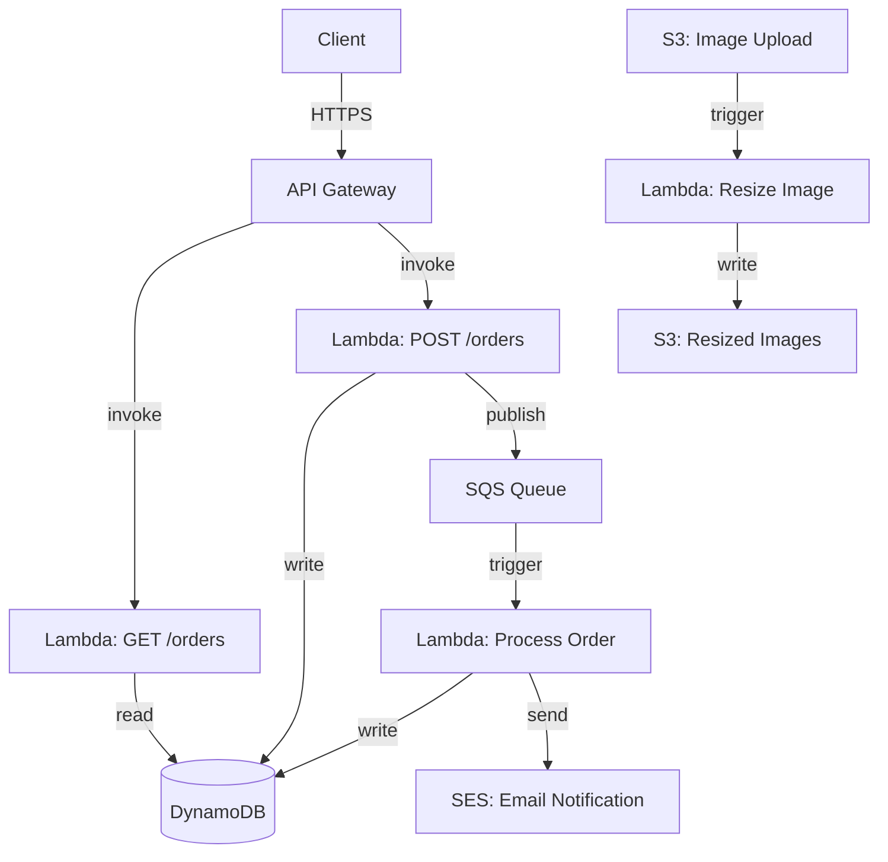
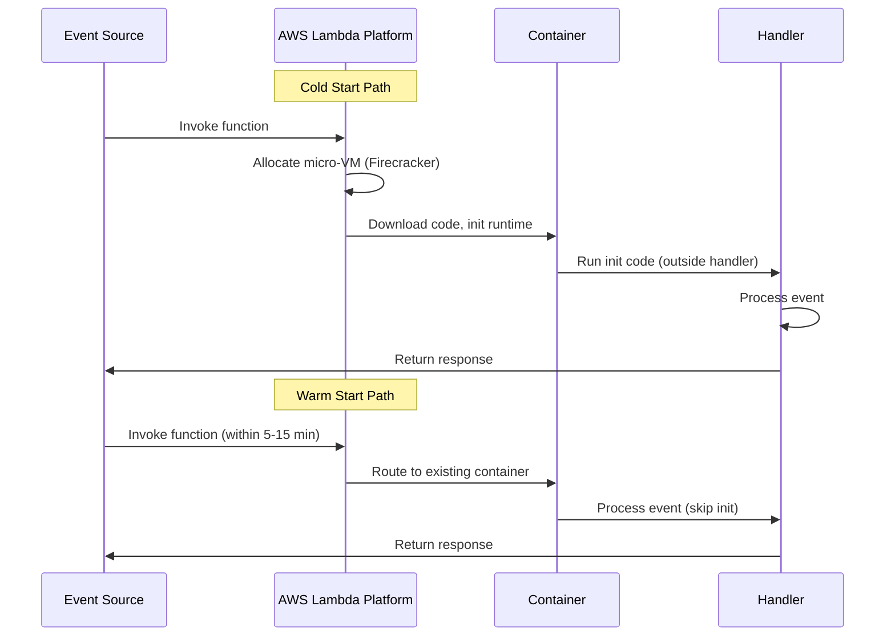

# Serverless

## 1. Overview

Serverless computing is an execution model where the cloud provider manages the infrastructure, automatically provisions compute capacity on demand, and charges only for actual execution time. You write a function, deploy it, and the provider handles everything else -- provisioning, scaling, patching, and decommissioning. AWS Lambda is the canonical example, but the serverless model extends beyond functions to databases (DynamoDB), queues (SQS), and API management (API Gateway).

The senior architect's perspective on serverless is nuanced: it delivers extraordinary speed-to-market and zero operational overhead for event-driven, bursty workloads. But it comes with a Faustian bargain -- vendor lock-in that deepens with every AWS service you adopt. Once your Lambda functions talk to SQS, API Gateway, DynamoDB, S3, Step Functions, and CloudWatch, migrating to another provider requires a near-total rewrite. Serverless is not "no servers" -- it is "not your servers, not your problem, and not your choice to leave."

The key insight: serverless is not about eliminating servers. It is about eliminating the operational burden of managing servers. You stop thinking about instance types, autoscaling policies, OS patches, and capacity planning. The cloud provider handles all of it, and your bill reflects actual usage rather than provisioned capacity. For teams where engineering time is more valuable than infrastructure cost (startups, small teams, prototype-phase products), this trade-off is enormously favorable.

## 2. Why It Matters

- **Zero infrastructure management**: No servers to provision, patch, or monitor. The provider handles OS updates, security patches, and capacity planning.
- **Pay-per-invocation**: You pay only when your code runs. A function that executes 1 million times per month at 128 MB for 200ms costs approximately $0.20. During off-hours, the cost is literally zero.
- **Automatic scaling**: Lambda scales from 0 to thousands of concurrent executions in seconds. No HPA configuration, no cluster management, no capacity planning.
- **Speed to market**: Deploy a production-ready API endpoint in minutes, not days. For startups and prototypes, this speed advantage is enormous.
- **Event-driven by nature**: Lambda functions are triggered by events -- S3 uploads, SQS messages, API Gateway requests, DynamoDB Streams, Kinesis records. This makes serverless a natural fit for event-driven architectures.

## 3. Core Concepts

- **Function as a Service (FaaS)**: The core serverless compute model. You deploy a function (code + handler) that is invoked in response to events. AWS Lambda, Google Cloud Functions, Azure Functions.
- **Cold Start**: The latency penalty when a function is invoked after being idle. The provider must allocate a container, download your code, initialize the runtime, and execute the handler. Cold starts range from 100ms (Python, Node.js) to 1-10 seconds (Java, .NET with large dependencies).
- **Warm Start**: Subsequent invocations reuse the existing container, avoiding initialization overhead. Latency is typically 1-10ms.
- **Provisioned Concurrency**: Pre-warming Lambda instances to eliminate cold starts for latency-sensitive workloads. You pay for the provisioned capacity whether or not it is used.
- **Invocation Model**: Synchronous (API Gateway -> Lambda -> response) or asynchronous (SQS -> Lambda, fire-and-forget with retry).
- **Execution Limits**: Lambda has a maximum execution time (15 minutes), memory (10 GB), deployment package size (250 MB unzipped), and concurrency limits (1,000 default, adjustable).
- **Vendor Lock-in Ecosystem**: The web of AWS services that Lambda depends on -- API Gateway for routing, SQS for queuing, DynamoDB for storage, S3 for static assets, CloudWatch for logs, Step Functions for orchestration, Route 53 for DNS. Each integration deepens the lock-in.

## 4. How It Works

### Lambda Execution Model

1. **Event source** triggers the function (API Gateway request, SQS message, S3 event, cron schedule).
2. **Cold start** (if no warm container exists): Provider allocates a micro-VM (Firecracker), loads the deployment package, initializes the runtime (Node.js, Python, Java, Go), and runs any initialization code outside the handler.
3. **Handler execution**: The function processes the event and returns a response.
4. **Container reuse**: The container stays warm for 5-15 minutes (varies by provider). Subsequent invocations skip initialization.
5. **Scale-out**: If concurrent requests exceed warm containers, new containers are provisioned. Lambda can scale to thousands of concurrent executions.

### Cold Start Breakdown

| Phase | Duration (typical) | Mitigation |
|---|---|---|
| Container allocation | 50-200ms | Provisioned concurrency |
| Runtime initialization | 50-500ms | Use lightweight runtimes (Node.js, Python) |
| Dependency loading | 100ms-5s | Minimize dependencies, use layers |
| Handler init code | Variable | Move expensive init outside the handler |
| **Total cold start** | **200ms-10s** | **Provisioned concurrency, keep functions warm** |

### The Vendor Lock-In Ecosystem

```
Lambda Function
  |-- Triggered by: API Gateway, SQS, S3, DynamoDB Streams, Kinesis, EventBridge
  |-- Reads from: DynamoDB, S3, RDS Proxy, ElastiCache
  |-- Writes to: DynamoDB, S3, SQS, SNS, Kinesis
  |-- Orchestrated by: Step Functions
  |-- Monitored by: CloudWatch, X-Ray
  |-- DNS: Route 53
  |-- Auth: Cognito
```

Each arrow is an integration point. Replacing any one of these requires code changes. Replacing all of them is a multi-quarter migration project.

## 5. Architecture / Flow

### Serverless API Architecture



### Cold Start vs. Warm Start



## 6. Types / Variants

### FaaS Patterns

| Pattern | Description | Example |
|---|---|---|
| **API Backend** | Lambda behind API Gateway serving REST/GraphQL | CRUD microservice |
| **Event Processor** | Lambda triggered by queue/stream events | SQS -> Lambda for order processing |
| **Scheduled Task** | Lambda triggered by cron (EventBridge) | Nightly data cleanup, report generation |
| **Stream Processor** | Lambda consuming Kinesis/DynamoDB Streams | Real-time analytics, CDC processing |
| **File Processor** | Lambda triggered by S3 uploads | Image resizing, video transcoding kickoff |
| **Orchestrated Workflow** | Step Functions coordinating multiple Lambdas | Multi-step order fulfillment |

### When to Use Serverless vs. Containers

| Dimension | Serverless (Lambda) | Containers (ECS/EKS/K8s) |
|---|---|---|
| **Traffic pattern** | Bursty, unpredictable, low baseline | Steady, high-throughput |
| **Execution duration** | < 15 minutes | Long-running processes |
| **Cold start tolerance** | Acceptable or mitigated | Not acceptable |
| **Operational capacity** | Small team, minimal DevOps | Dedicated platform team |
| **Cost at scale** | Expensive at sustained high RPS | More cost-effective at sustained load |
| **Vendor lock-in** | Deep (AWS ecosystem) | Portable (Kubernetes is multi-cloud) |
| **Local development** | Harder (SAM, LocalStack) | Native (Docker) |
| **State management** | Stateless (external state in DynamoDB) | Stateful containers possible |

**Rule of thumb**: If your function executes more than 1 million times per day at sustained load, containers are likely cheaper. If your traffic is bursty with long idle periods, serverless wins on cost.

## 7. Use Cases

- **Netflix**: Uses Lambda for media processing pipelines -- encoding validation, metadata extraction, and thumbnail generation triggered by S3 uploads. These are bursty, event-driven workloads that are perfect for serverless.
- **Coca-Cola**: Migrated vending machine telemetry processing to Lambda + Kinesis. Reduced infrastructure costs by 65% compared to EC2-based processing.
- **iRobot (Roomba)**: Uses Lambda to process IoT events from millions of connected vacuum cleaners. Traffic is extremely bursty (most vacuums run during specific hours) and scales to zero at night.
- **Capital One**: Uses Lambda for real-time fraud detection on credit card transactions. Each transaction triggers a Lambda function that evaluates risk models against DynamoDB data.
- **Startup MVP**: A three-person startup builds their entire backend on API Gateway + Lambda + DynamoDB. Zero servers to manage, costs under $50/month, and they can focus entirely on product development.

## 8. Tradeoffs

| Advantage | Disadvantage |
|---|---|
| Zero infrastructure management | Deep vendor lock-in (AWS ecosystem bind) |
| Pay only for execution time | Cold starts add 200ms-10s latency |
| Automatic scaling (0 to thousands) | 15-minute execution time limit |
| Fast deployment and iteration | Harder to debug locally |
| Built-in HA and fault tolerance | Limited compute (10 GB RAM max) |
| Event-driven integration with cloud services | Stateless model requires external state stores |
| Cost-effective for bursty/low traffic | Expensive at sustained high throughput |

## 9. Common Pitfalls

- **Ignoring cold starts in latency-sensitive paths**: If your API has a P99 latency SLA of 200ms, cold starts will violate it. Use provisioned concurrency for user-facing APIs or accept that the first request after idle will be slow.
- **Fat deployment packages**: A 200 MB Lambda package with unused dependencies takes seconds to initialize. Minimize dependencies, use Lambda layers for shared libraries, and prefer lightweight runtimes.
- **Not planning for vendor lock-in**: Every AWS service you integrate makes migration harder. If multi-cloud is a future requirement, abstract your storage, queuing, and API layers behind interfaces. Realistically, most teams accept the lock-in for the productivity gains.
- **Using Lambda for long-running tasks**: Lambda has a 15-minute timeout. Batch jobs, ML training, and video transcoding need containers (ECS, EKS) or Step Functions to break work into smaller steps.
- **Recursive Lambda invocations**: A Lambda writing to S3, which triggers another Lambda, which writes to S3, creates an infinite loop. Use dead-letter queues and invocation limits to prevent runaway costs.
- **Ignoring concurrency limits**: Lambda has a default concurrency limit of 1,000 per account per region. A traffic spike can exhaust this limit, throttling all functions in the account. Request limit increases proactively.
- **Treating Lambda like a microservice**: Lambda functions should be small, focused units of work. If you find yourself building a "Lambda monolith" with complex routing logic inside a single function, you are using the wrong tool.
- **Not setting reserved concurrency**: If one Lambda function consumes all 1,000 concurrent executions in your account, other Lambda functions are throttled. Use reserved concurrency to guarantee capacity for critical functions.
- **Synchronous chains of Lambdas**: Lambda A invokes Lambda B, which invokes Lambda C. This creates a synchronous chain with accumulated latency and compounding cold start risk. Use Step Functions or SQS to decouple.
- **Storing secrets in environment variables without encryption**: Lambda environment variables are visible in the AWS console. Use AWS Secrets Manager or SSM Parameter Store with encryption for sensitive values.
- **Not testing locally**: Deploying to AWS for every code change is slow and expensive. Use tools like SAM CLI, LocalStack, or Docker to test Lambda functions locally before deployment.

## 10. Real-World Examples

- **AWS Lambda at scale**: Lambda processes trillions of invocations per month across AWS customers. Internal AWS services like S3 event notifications and CloudWatch Logs use Lambda for event processing.
- **Netflix (media pipeline)**: Lambda functions handle encoding validation when new content is uploaded. The pipeline processes thousands of titles per day with zero provisioned infrastructure.
- **Fender (Play)**: The guitar lesson platform uses Lambda + DynamoDB for their API. Traffic is highly variable -- peaks during evenings and weekends, near-zero at 3 AM. Serverless saves 60% versus always-on infrastructure.
- **Thomson Reuters**: Processes financial data feeds through Lambda. Incoming market data triggers Lambda functions that normalize, enrich, and route the data to downstream analytics systems.

### Cost Analysis: Serverless vs. Containers

For a service processing 10 million requests/day at 200ms average duration with 256 MB memory:

**Lambda cost**:
- Compute: 10M * 0.2s * 256MB = 512,000 GB-seconds/day * $0.0000166667 = ~$8.53/day = ~$256/month
- Requests: 10M * $0.20/million = $2/day = ~$60/month
- **Total: ~$316/month**

**ECS Fargate (2 vCPU, 4 GB, 3 tasks)**:
- 3 tasks * $0.04048/vCPU/hour * 2 vCPU * 730 hours = ~$177/month
- 3 tasks * $0.004445/GB/hour * 4 GB * 730 hours = ~$39/month
- **Total: ~$216/month**

At this scale, containers are already cheaper. The crossover point depends on traffic patterns -- if those 10M requests are concentrated in 8 hours (bursty), Lambda scales to zero during the other 16 hours and may be cheaper. If traffic is steady, containers win.

### Serverless Ecosystem (AWS)

| Service | Role in Serverless Stack | Alternative (non-serverless) |
|---|---|---|
| **Lambda** | Compute | EC2, ECS, EKS |
| **API Gateway** | HTTP endpoint | ALB, Nginx |
| **DynamoDB** | Database | RDS, Aurora |
| **SQS** | Message queue | Kafka (MSK) |
| **SNS** | Pub/sub notifications | Kafka, EventBridge |
| **Step Functions** | Workflow orchestration | Temporal, Airflow |
| **S3** | Object storage | (No alternative -- S3 is universal) |
| **EventBridge** | Event routing | Custom event bus |
| **CloudWatch** | Monitoring | Prometheus, Datadog |
| **Cognito** | Authentication | Auth0, Keycloak |

Each integration deepens the lock-in. A Lambda function that uses API Gateway, SQS, DynamoDB, S3, and CloudWatch has five AWS-specific integration points that require rewriting for another cloud.

### Cold Start Mitigation Strategies

Cold starts are the primary operational concern with serverless. Here are the strategies ranked by effectiveness:

**1. Provisioned Concurrency** (most effective):
- Pre-warms a specified number of Lambda instances.
- Eliminates cold starts for up to the provisioned count.
- You pay for the provisioned capacity whether or not it is used.
- Best for latency-sensitive, user-facing APIs.

**2. Keep-warm pings**:
- A CloudWatch Events rule triggers the function every 5 minutes to keep it warm.
- Works for low-traffic functions but does not help during traffic spikes that exceed the warm instance count.
- A hack, not a solution -- but widely used.

**3. Lightweight runtimes**:
- Node.js and Python cold starts: 100-300ms.
- Java cold starts: 1-10 seconds (JVM initialization + class loading).
- Go cold starts: 50-100ms (compiled binary, no runtime initialization).
- If latency matters, avoid Java on Lambda unless you use GraalVM native images or SnapStart.

**4. Minimize deployment package size**:
- Remove unused dependencies. Use tree-shaking for Node.js.
- Use Lambda layers for shared libraries (AWS SDK, utility functions).
- For Java, use frameworks optimized for Lambda (Quarkus, Micronaut) instead of Spring Boot.

**5. Lambda SnapStart (Java only)**:
- Takes a snapshot of the initialized JVM after the first cold start.
- Subsequent cold starts restore from the snapshot instead of re-initializing.
- Reduces Java cold starts from seconds to ~200ms.

### Serverless Design Patterns

**Event Processing Pipeline**:
```
S3 Upload -> Lambda (validate) -> SQS -> Lambda (process) -> DynamoDB -> DynamoDB Streams -> Lambda (notify) -> SNS -> Email
```

**Fan-Out/Fan-In**:
```
API Gateway -> Lambda (coordinator) -> SQS (fan-out to N queues) -> N Lambdas (parallel processing) -> DynamoDB (collect results) -> Lambda (aggregate) -> Response
```

**Scheduled Data Pipeline**:
```
EventBridge (cron) -> Lambda (extract) -> S3 (raw data) -> Lambda (transform) -> S3 (clean data) -> Lambda (load) -> Redshift
```

### Monitoring Serverless Applications

Serverless changes what you monitor:

| Traditional Metric | Serverless Equivalent |
|---|---|
| CPU utilization | Duration (execution time) |
| Memory utilization | Memory used vs. allocated |
| Instance count | Concurrent executions |
| Network throughput | Invocation count |
| Disk I/O | N/A (no persistent disk) |
| Process health | Error rate, throttle count |

Key CloudWatch metrics for Lambda:
- **Invocations**: Total function calls.
- **Duration**: Execution time (billed in 1ms increments).
- **Errors**: Function errors (exceptions, timeouts).
- **Throttles**: Requests rejected due to concurrency limits.
- **ConcurrentExecutions**: Number of functions running simultaneously.
- **IteratorAge** (for stream sources): How far behind the Lambda is from the latest record in the stream.

## 11. Related Concepts

- [API Gateway](./api-gateway.md) -- the front door for serverless APIs (AWS API Gateway + Lambda)
- [Microservices](./microservices.md) -- serverless is an alternative deployment model for microservices
- [Event-Driven Architecture](../messaging/event-driven-architecture.md) -- Lambda is inherently event-driven
- [Autoscaling](../scalability/autoscaling.md) -- serverless is the ultimate auto-scaling: scale to zero, scale to thousands
- [Rate Limiting](../resilience/rate-limiting.md) -- API Gateway rate limiting protects Lambda from overload

### Serverless Anti-Patterns

- **The Lambda Monolith**: A single Lambda function with complex routing logic (its own URL router, middleware chain, and dozens of endpoints). This defeats the purpose of serverless. Split into one function per endpoint or use a framework like Express.js on Lambda sparingly.
- **The Chatty Lambda**: A Lambda function that makes 10 sequential HTTP calls to other services. Each call adds latency; any failure fails the entire function. Prefer parallel calls, batch APIs, or Step Functions for orchestration.
- **The Stateful Lambda**: Storing state in the Lambda's `/tmp` directory or global variables and expecting it to persist across invocations. Lambda containers are ephemeral. Use DynamoDB, S3, or ElastiCache for persistent state.
- **Lambda-to-Lambda**: Synchronously invoking one Lambda from another. This creates a chain where cold starts compound, timeouts cascade, and billing doubles. Use SQS or Step Functions to decouple.

## 12. Source Traceability

- source/youtube-video-reports/4.md (serverless, Lambda trap, vendor lock-in ecosystem, event sourcing)
- source/youtube-video-reports/6.md (Kubernetes vs serverless, traffic patterns)
- source/extracted/acing-system-design/ch03-a-walkthrough-of-system-design-concepts.md (serverless overview)
- source/extracted/system-design-guide/ch06-core-components-of-distributed-systems.md (FaaS, cloud computing)
