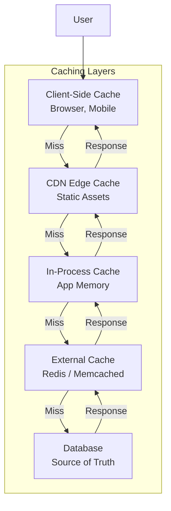
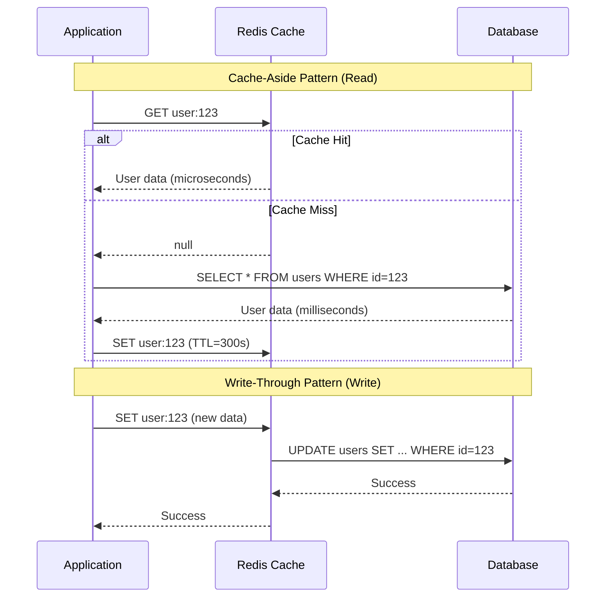

# Caching Strategies

## 1. Overview

Caching is the practice of storing copies of frequently accessed data in a faster storage medium --- typically RAM --- so that future requests can be served without hitting the slower, authoritative data source (database, disk, remote API). RAM access (~100 ns) is 10,000x faster than SSD access (~1 ms) and 100,000x faster than a cross-network database query (~10 ms). This speed difference is the fundamental reason caching exists.

Caching is not a single technique --- it is a layered strategy involving multiple levels (client, CDN, in-process, external) and multiple interaction patterns (cache-aside, read-through, write-through, write-back). Each layer and pattern makes a distinct tradeoff between latency, consistency, and complexity. A senior architect's job is to choose the right combination for their system's access patterns, consistency requirements, and failure modes.

This file covers caching **strategies, layers, and pitfalls** as general architectural patterns. For Redis-specific internals (data structures, commands, clustering), see [Redis](./redis.md). For CDN edge caching, see [CDN](./cdn.md).

## 2. Why It Matters

- **Latency reduction**: A cache hit serves data in microseconds instead of the milliseconds required for a database query. For user-facing APIs targeting P99 < 100 ms, caching is not optional.
- **Database protection**: Without caching, every page load hits the database. At 100K concurrent users, this saturates connection pools and CPU, causing cascading failures.
- **Cost reduction**: A single Redis node costing $500/month can absorb read load that would otherwise require 10 database read replicas.
- **Throughput scaling**: Caching decouples read throughput from database capacity. You can serve 1M reads/sec from a cache tier that fronts a database handling 10K writes/sec.

## 3. Core Concepts

- **Cache hit**: The requested data is found in the cache. Fast path.
- **Cache miss**: The requested data is not in the cache. Requires fetching from the source of truth.
- **TTL (Time to Live)**: The duration a cached entry remains valid before expiration. Short TTLs improve consistency; long TTLs reduce load.
- **Eviction policy**: The algorithm used to remove entries when the cache is full.
  - **LRU (Least Recently Used)**: Evicts the entry that has not been accessed for the longest time. Industry default.
  - **LFU (Least Frequently Used)**: Evicts the entry accessed the fewest times. Better for Zipfian distributions.
  - **FIFO**: Evicts the oldest entry regardless of access pattern.
- **Cache warming**: Pre-populating the cache at startup to avoid a "cold start" where every request is a miss.
- **Invalidation**: Removing or updating cached data when the source of truth changes.
- **Hot key**: A cache key that receives disproportionate traffic, potentially overwhelming a single cache node.
- **Cache stampede (thundering herd)**: When a hot key expires, thousands of concurrent requests simultaneously miss the cache and flood the database.

## 4. How It Works

### Read Patterns

**Cache-Aside (Lazy Loading)**

The application is responsible for managing the cache:

1. Application checks the cache for the requested key.
2. On **cache hit**: return cached data directly.
3. On **cache miss**: query the database, write the result to the cache, return data to the client.

This is the **industry default** pattern. The cache only contains data that has been requested at least once. The application controls when to write and invalidate.

**Read-Through**

The cache sits as a proxy between the application and the database:

1. Application requests data from the cache.
2. On **cache miss**: the cache itself fetches from the database, stores the result, and returns it.
3. The application never directly queries the database.

The difference from cache-aside: the cache is responsible for fetching missing data, not the application. This simplifies application code but requires the cache layer to understand the data source.

### Write Patterns

**Write-Through**

Every write goes to both the cache and the database synchronously:

1. Application writes to the cache.
2. Cache synchronously writes to the database.
3. Success is returned only after both writes complete.

**Tradeoff**: High consistency (cache and database are always in sync) at the cost of higher write latency (two writes per operation).

**Write-Back (Write-Behind)**

Writes go to the cache first; the database is updated asynchronously:

1. Application writes to the cache.
2. Cache acknowledges immediately.
3. Cache asynchronously flushes dirty entries to the database in batches.

**Tradeoff**: Lowest write latency and highest throughput, but **risk of data loss** if the cache fails before flushing to the database.

**Write-Around**

Writes go directly to the database, bypassing the cache:

1. Application writes to the database.
2. The cache is not updated.
3. On the next read, a cache miss triggers a fresh load from the database.

**Tradeoff**: Prevents "cache flooding" with data that may never be read, but the first read after a write is always a miss.

### Eviction Policies in Detail

When the cache is full, an eviction policy determines which entries to remove:

- **LRU (Least Recently Used)**: Maintains a doubly-linked list ordered by access time. On access, move the entry to the head. On eviction, remove from the tail. Implementation: a HashMap (O(1) lookup) + a doubly-linked list (O(1) move/remove). This is the most commonly used policy and the default in Redis (`allkeys-lru`).

- **LFU (Least Frequently Used)**: Tracks access count for each entry. Evicts the entry with the lowest count. Better for workloads with a stable set of hot keys, but requires more bookkeeping. Redis supports this as `allkeys-lfu`.

- **FIFO (First In, First Out)**: Evicts the oldest entry regardless of access frequency. Simple but ignores access patterns, so a frequently accessed entry can be evicted.

- **Random Eviction**: Evicts a random entry. Surprisingly effective in practice because it avoids the overhead of tracking access patterns, and for large caches, the probability of evicting a hot key is low.

- **TTL-based**: Entries expire after a configurable time-to-live. Not technically an eviction policy (it is time-driven, not space-driven), but in practice TTL and eviction work together: TTL handles staleness while eviction handles memory pressure.

In production, the combination of **LRU eviction + TTL expiration** covers the vast majority of use cases. LRU handles memory limits; TTL handles consistency requirements.

### Cache Warming

After a cache restart (deployment, failover, or crash), the cache is empty. Every request is a cache miss, causing a "thundering herd" of database queries that can overwhelm the backend. This is called the **cold start problem**.

Mitigation strategies:

1. **Pre-warm from database**: At startup, query the database for the top-N most frequently accessed keys and populate the cache before accepting traffic.
2. **Replicate from peer**: In a cache cluster, a restarting node can bootstrap its cache from a healthy peer.
3. **Gradual traffic shifting**: Use the load balancer to slowly ramp traffic to the restarted instance, giving the cache time to warm up organically.
4. **Persistent cache**: Redis RDB/AOF persistence allows a restarted instance to reload its cache from disk, though this is slower than serving from a warm cache.

### Cache Invalidation Strategies

| Strategy | Mechanism | Consistency | Complexity |
|---|---|---|---|
| **TTL-based expiration** | Entries expire after a fixed duration | Eventual (stale within TTL window) | Low |
| **Invalidate-on-write** | Application deletes cache entry when data changes | Strong (if done atomically) | Medium |
| **Event-driven invalidation** | CDC/message queue triggers cache invalidation | Near-real-time | High |
| **Versioned keys** | Append version number to cache key; increment on write | Strong | Medium |

## 5. Architecture / Flow

## 6. Types / Variants

### Four Caching Layers

| Layer | Location | Latency | Scope | Invalidation | Use Case |
|---|---|---|---|---|---|
| **Client-side** | Browser localStorage, mobile SQLite | 0 ms (local) | Per-device | Difficult (requires app update or push) | Offline access, user preferences |
| **CDN** | Edge servers worldwide | 1-50 ms | Geographic region | TTL or explicit purge | Static assets, media files |
| **In-process** | Application memory (HashMap) | ~100 ns | Per-instance | Cleared on restart; no cross-instance sync | Hot configuration, compiled templates |
| **External** | Redis, Memcached cluster | 0.5-2 ms (network hop) | Shared across all instances | TTL, explicit DELETE, pub/sub invalidation | Session data, query results, hot objects |

### Caching Strategy Comparison

| Pattern | Read Latency | Write Latency | Consistency | Data Loss Risk | Best For |
|---|---|---|---|---|---|
| **Cache-aside** | Fast (hit) / Slow (miss) | Database write speed | Eventual (TTL window) | None (DB is source of truth) | General-purpose default |
| **Read-through** | Fast (hit) / Slow (miss) | Database write speed | Eventual | None | Simplifying app code |
| **Write-through** | Fast (always cached) | Higher (two sync writes) | Strong | None | Read-heavy with consistency needs |
| **Write-back** | Fast (always cached) | Lowest (cache only) | Eventual | **Yes** (cache crash before flush) | Write-heavy, latency-sensitive |
| **Write-around** | Slow (first read is miss) | Database write speed | Eventual (until first read) | None | Write-heavy with infrequent reads |

### Co-located vs Standalone Cache

A critical architecture decision is whether the cache runs alongside the application or as an independent service:

**Co-located (in-process) cache**: The cache lives in the application's memory (e.g., a Java ConcurrentHashMap or Go sync.Map).
- **Advantage**: Zero network latency (function call instead of network hop).
- **Disadvantage**: Cache is lost on process restart. Each application instance has its own cache, leading to inconsistency across instances. Cache size is limited by the application's memory.

**Standalone (external) cache**: The cache is a separate service (Redis, Memcached) accessed over the network.
- **Advantage**: Shared by all application instances. Survives application restarts. Can be scaled independently.
- **Disadvantage**: Adds a network hop (~0.5-2 ms). Requires additional infrastructure.

**Recommendation**: Use in-process caching for hot configuration data and compiled templates (small, rarely changing data that benefits from zero-latency access). Use a standalone cache (Redis) for shared state --- sessions, query results, and application objects that must be consistent across instances.

### Request Coalescing (Singleflight)

When a popular cache key expires, hundreds of concurrent requests simultaneously miss the cache and query the database. **Request coalescing** (also called "singleflight") ensures only one request rebuilds the cache:

1. First request for key `X` misses the cache and begins fetching from the database.
2. Subsequent requests for key `X` during the fetch are **held** (blocked or queued) instead of making duplicate database queries.
3. When the first request completes and populates the cache, all held requests are served from the newly cached value.

This pattern reduces database load from O(concurrent_requests) to O(1) per cache miss event. In Go, the `singleflight` package provides this out of the box. In other languages, a distributed lock (Redis SETNX) with a short TTL can achieve the same effect.

## 7. Use Cases

- **Twitter home timeline**: Cache-aside pattern with Redis. Pre-computed timelines (fan-out on write) are stored in Redis. On cache miss, the timeline service rebuilds from the database.
- **Netflix session management**: External Redis cache stores user sessions across thousands of application instances. TTL-based expiration handles session cleanup.
- **TicketMaster event search**: Write-around during ticket inventory updates (writes go to database only). CDN caches non-personalized event search results for 30-60 seconds during high-traffic surges.
- **Dropbox file metadata**: In-process cache for recently accessed file metadata, backed by an external Redis layer for cross-instance consistency.
- **E-commerce product catalog**: Read-through cache with 5-minute TTL. Product pages are served from cache; inventory updates invalidate specific product keys via event-driven invalidation.

## 8. Tradeoffs

| Advantage | Disadvantage |
|---|---|
| 10,000x latency reduction (RAM vs disk) | Adds infrastructure complexity and cost |
| Protects database from read overload | Stale data risk within TTL window |
| Enables read throughput independent of DB capacity | Cache invalidation is "one of the two hard things in CS" |
| Can absorb traffic spikes that would crash the DB | Cold start after cache restart causes temporary DB overload |
| Reduces infrastructure costs at scale | Hot keys can overwhelm individual cache nodes |

## 9. Common Pitfalls

- **Cache stampede (thundering herd)**: When a popular cache key expires, thousands of requests simultaneously query the database. **Mitigation**: request coalescing (only one request rebuilds the cache; others wait), probabilistic early expiration (refresh before TTL), or cache warming.
- **Stale data served after writes**: The cache holds old data while the database has the new value. **Mitigation**: invalidate-on-write (delete the cache key in the same transaction as the database write), or use short TTLs.
- **Hot key problem**: A single cache key (e.g., a viral celebrity's profile) receives millions of requests, overwhelming the cache node that holds it. **Mitigation**: replicate the key across multiple cache nodes, use in-process caching as a fallback, or append random suffixes to distribute load. See [Redis hot key solutions](./redis.md).
- **Cache-database inconsistency on write**: Updating the cache and database in two separate operations can fail between the two, leaving them inconsistent. **Mitigation**: delete the cache key (don't update it) after the database write. On the next read, the cache will be populated with fresh data.
- **Over-caching**: Caching data that is rarely read wastes memory and increases eviction pressure on genuinely hot data. Cache only data with high read-to-write ratios.
- **Not monitoring cache hit rate**: A cache with a 50% hit rate is barely helping. Target >95% hit rate for production caches. Monitor miss rate, eviction rate, and memory usage.

## 10. Real-World Examples

- **Facebook**: Uses Memcached as the primary external caching layer, serving billions of cache requests per second across thousands of Memcached instances. Cache invalidation is event-driven via their internal pub/sub system (McRouter).
- **GitHub**: Uses Redis for job queues and Memcached for page fragment caching, reducing database load for the millions of repository pages served daily.
- **Airbnb**: Uses a multi-layered caching strategy: in-process caches for hot configuration, Redis for session data, and CDN for listing photos.
- **Pinterest**: Uses Memcached with cache-aside pattern for pin data, achieving >99% hit rate on their most accessed data.
- **Shopify**: Uses Redis caching extensively during flash sales to protect their MySQL backend from read storms.

## 11. Related Concepts

- [Redis](./redis.md) --- Redis-specific data structures, commands, and hot key solutions
- [CDN](./cdn.md) --- edge caching layer for static assets
- [Database Replication](../storage/database-replication.md) --- read replicas as an alternative to caching for read scaling
- [Rate Limiting](../resilience/rate-limiting.md) --- rate limiters often implemented on top of cache infrastructure
- [Consistent Hashing](../scalability/consistent-hashing.md) --- distributing cache keys across a cluster

## 12. Source Traceability

- source/youtube-video-reports/5.md (Consistency models, caching patterns)
- source/youtube-video-reports/7.md (Four caching layers, cache-aside, read-through, write-through, write-back, cache stampede, hot keys, cache warming)
- source/youtube-video-reports/8.md (Caching, CAP, cache-aside, read-through)
- source/extracted/system-design-guide/ch09-distributed-cache.md (LRU design, co-located vs standalone, eviction policies, distributed cache design)
- source/extracted/grokking/ch24-cache.md (Caching strategies)
- source/extracted/grokking/ch81-caching.md (Cache invalidation)
