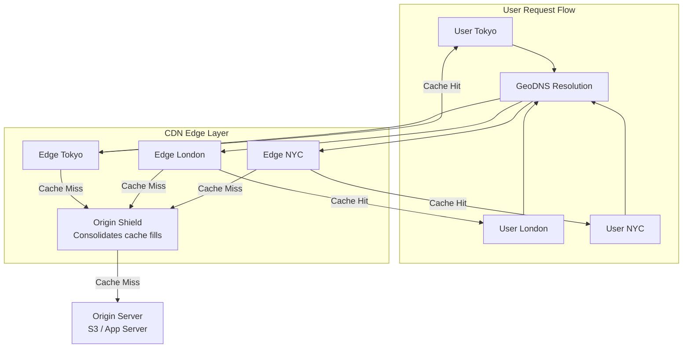
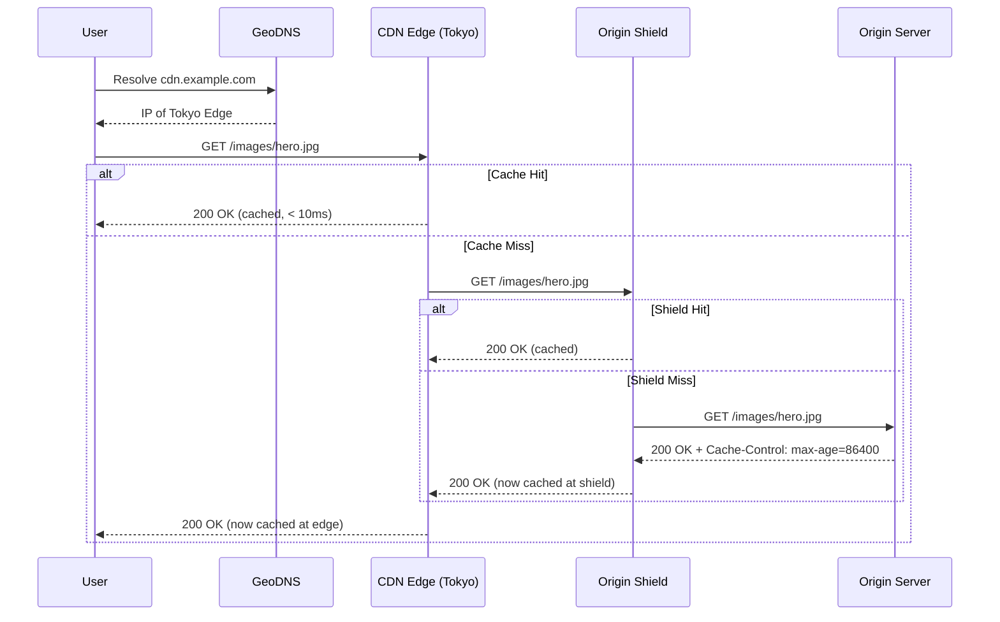

# Content Delivery Network (CDN)

## 1. Overview

A Content Delivery Network is a geographically distributed network of servers (edge locations) that caches and serves content from the location closest to the requesting user. Instead of every request traveling to a distant origin server, static assets --- images, videos, CSS, JavaScript, fonts --- are served from an edge server that may be on the same continent, in the same city, or even in the same ISP network as the user.

CDNs exist to solve a physics problem: the speed of light limits how fast a packet can travel across a fiber-optic cable. A request from Tokyo to a US-East origin server incurs ~200 ms of round-trip latency from network propagation alone, before the server even processes the request. A CDN edge node in Tokyo serves the same asset in under 10 ms.

Modern CDNs (CloudFront, Cloudflare, Akamai, Fastly) have evolved beyond simple static file caching to include edge computing, DDoS protection, WAF (Web Application Firewall), video streaming optimization, and API acceleration. But the core value proposition remains unchanged: **serve content from the nearest edge to minimize latency and offload traffic from the origin**.

## 2. Why It Matters

- **Latency reduction**: Serving static assets from a nearby edge server can reduce page load time by 50-80% for geographically distant users.
- **Origin offloading**: A CDN absorbs read traffic that would otherwise hit your origin servers. During a viral event, the CDN serves millions of requests while your origin handles a few cache-fill requests.
- **Scalability**: CDN capacity scales independently of your infrastructure. You do not need to provision additional servers for traffic spikes.
- **Availability**: If your origin goes down, the CDN continues serving cached content for the duration of the TTL.
- **SEO impact**: Search engines penalize slow-loading pages. A CDN-served page that loads in 1 second instead of 3 seconds directly improves search rankings and reduces bounce rates.
- **DDoS protection**: CDN edge networks absorb volumetric DDoS attacks before traffic reaches your origin.

## 3. Core Concepts

- **Edge location (PoP)**: A Point of Presence --- a data center in the CDN network that caches content. Major CDNs operate 200-300+ PoPs globally.
- **Origin server**: The authoritative source of content. When the CDN does not have a cached copy, it fetches from the origin.
- **Cache hit**: The CDN serves content directly from its edge cache without contacting the origin.
- **Cache miss**: The CDN does not have the content and must fetch it from the origin (or another CDN tier).
- **TTL (Time to Live)**: How long cached content remains valid at the edge. Set via `Cache-Control` headers (e.g., `max-age=86400` for 24 hours).
- **Cache invalidation / purge**: Explicitly removing content from all edge locations before TTL expiry. This is an expensive operation that propagates across hundreds of PoPs.
- **GeoDNS**: DNS resolution that returns the IP address of the nearest edge location based on the requester's geographic location.
- **Origin shield**: An intermediate caching layer between edge locations and the origin that consolidates cache-fill requests, reducing origin load.

## 4. How It Works

### Pull CDN (Origin Pull)

The CDN fetches content from the origin on demand:

1. User requests `cdn.example.com/images/hero.jpg`.
2. GeoDNS resolves to the nearest edge location.
3. Edge checks its local cache.
4. **Cache hit**: Return content directly (< 10 ms).
5. **Cache miss**: Edge fetches content from origin, caches it locally, returns to user.
6. Subsequent requests from the same region are served from cache until TTL expires.

Pull CDNs are the industry default. Content is cached lazily --- only when first requested. The origin does not need to know about the CDN's cache state.

### Push CDN (Origin Push)

The origin proactively uploads content to the CDN:

1. Origin pushes content to CDN storage endpoints.
2. CDN distributes content to edge locations.
3. Content is available at all edges before any user requests it.

Push CDNs are used for large, predictable content libraries (video catalogs, software updates) where you want content pre-positioned at all edges before launch.

### Cache Invalidation

When content changes at the origin, stale cached copies at edge locations must be removed:

| Method | Mechanism | Propagation Time | Cost |
|---|---|---|---|
| **TTL expiry** | Content naturally expires after `max-age` | Depends on TTL | Free |
| **Explicit purge** | API call to purge specific URL across all PoPs | Seconds to minutes | API call per purge |
| **Versioned URLs** | Append hash/version to filename: `hero.v2.jpg` or `hero.abc123.jpg` | Instant (new URL) | Build pipeline change |
| **Stale-while-revalidate** | Serve stale content while fetching fresh copy in background | Near-instant | Slight staleness |

**Versioned URLs (cache busting)** is the recommended approach for static assets. Because the URL changes with each content change, the old cached copy is never served --- the new URL is a cache miss that fetches fresh content.

### Authentication and Security

CDNs serving private content require authentication to prevent unauthorized access (hotlinking):

**Signed URLs**: The origin generates a time-limited URL containing a cryptographic signature. The CDN validates the signature before serving the content.
```
https://cdn.example.com/video/123.mp4?token=abc123&expires=1710850800
```

**Token-based authentication**: The CDN issues customers a secret key. The customer's application generates access tokens containing:
- The CDN URL the token is valid for
- An expiry timestamp
- Allowed IP ranges or countries
- A cryptographic signature using the secret key

The CDN validates the token on every request and rejects unauthorized access.

**Key rotation**: Secret keys are periodically rotated. During rotation, both old and new keys are valid for a transition period, ensuring uninterrupted service.

### Origin Shield

An origin shield is an additional caching tier between edge locations and the origin server. Without it, a cache miss at each of 300 PoPs results in 300 separate requests to the origin for the same asset. With an origin shield:

1. Edge locations with cache misses query the origin shield (a designated PoP) instead of the origin.
2. The origin shield either serves from its own cache or makes a single request to the origin.
3. The origin sees at most one request per asset, regardless of how many edge locations need it.

This is critical during cache invalidation events or when deploying new content, where all edge locations simultaneously experience cache misses.

### Static vs Dynamic Content

| Content Type | CDN Cacheability | TTL | Examples |
|---|---|---|---|
| **Static** | Always cacheable | Hours to months | Images, CSS, JS, fonts, videos |
| **Semi-static** | Cacheable with short TTL | Seconds to minutes | Search results, product listings, API responses |
| **Dynamic / Personalized** | Not cacheable at edge | 0 (no-cache) | User dashboards, shopping carts, authenticated APIs |

## 5. Architecture / Flow





## 6. Types / Variants

### Pull vs Push CDN

| Dimension | Pull CDN | Push CDN |
|---|---|---|
| **Content delivery** | Fetched on first request | Pre-uploaded to all edges |
| **Cache population** | Lazy (on-demand) | Eager (proactive) |
| **Origin load** | Higher initially (cache misses) | Lower (content pre-positioned) |
| **Best for** | Websites with unpredictable traffic patterns | Large static catalogs (video libraries, software updates) |
| **TTL management** | Critical (stale content if TTL too long) | Less critical (content is pushed when updated) |
| **Storage cost** | Lower (only caches requested content) | Higher (replicates full catalog) |
| **Example** | CloudFront, Cloudflare | AWS S3 Transfer Acceleration, Akamai NetStorage |

### Major CDN Providers

| Provider | Edge Locations | Key Features |
|---|---|---|
| **CloudFront (AWS)** | 400+ PoPs | Deep S3/Lambda@Edge integration |
| **Cloudflare** | 300+ PoPs | Integrated DDoS/WAF, Workers (edge compute) |
| **Akamai** | 4,100+ PoPs | Largest network, enterprise features |
| **Fastly** | 80+ PoPs | Real-time purge (< 150 ms), Compute@Edge |
| **Google Cloud CDN** | 150+ PoPs | GCP integration, Anycast IP |

### Multi-CDN Strategy

Large-scale services often use multiple CDN providers simultaneously:

- **Failover**: If CloudFront experiences an outage, DNS-level switching routes traffic to Cloudflare.
- **Performance optimization**: Route users to whichever CDN provides the lowest latency for their region.
- **Cost optimization**: Different CDNs have different pricing for different regions and traffic volumes.
- **Vendor negotiation**: Having multiple CDN contracts provides leverage during contract renewals.

Multi-CDN adds operational complexity (monitoring multiple providers, maintaining consistent cache behavior) but is standard practice for services like Netflix, Apple, and Microsoft that cannot tolerate CDN-level outages.

### CDN for API Acceleration

While CDNs are traditionally associated with static content, modern CDNs can accelerate dynamic API responses:

- **Connection reuse**: CDN edge nodes maintain persistent TCP connections (and TLS sessions) to the origin. The user's request terminates at the edge (short distance, fast), and the edge forwards it to the origin over a pre-established connection (no handshake overhead).
- **Route optimization**: CDN networks use optimized routing between edge and origin, avoiding congested internet backbone paths.
- **TCP optimization**: CDN edges use tuned TCP parameters (larger initial congestion windows, optimized buffer sizes) for faster data transfer.
- **Compression at the edge**: Gzip/Brotli compression is applied at the edge, reducing payload size without burdening the origin.

Cloudflare Argo and AWS CloudFront's Origin Request Policy are examples of this pattern. Even for non-cacheable API responses, the CDN provides measurable latency improvements.

## 7. Use Cases

- **Netflix (Open Connect)**: Operates its own CDN with dedicated appliances placed inside ISP networks. Video content is pre-positioned (push model) close to subscribers, reducing transit costs and improving playback quality.
- **Shopify**: Serves storefront assets (product images, theme CSS/JS) via CDN. During flash sales (e.g., Kylie Cosmetics launches), the CDN absorbs millions of concurrent requests that would otherwise overwhelm origin servers.
- **TicketMaster**: CDN caches non-personalized event search results for 30-60 seconds during on-sale events. Since search rankings are not personalized, this bypasses the backend entirely for millions of users.
- **GitHub Pages**: Static site hosting served entirely through CDN edge locations. The origin is an S3-like object store; the CDN handles all user-facing traffic.
- **Flickr**: Uses CDN for image delivery. The CDN architecture separates metadata (served by application) from binary assets (served by CDN from object storage).

## 8. Tradeoffs

| Advantage | Disadvantage |
|---|---|
| Dramatic latency reduction for global users | Cache invalidation propagation is slow (seconds to minutes) |
| Offloads read traffic from origin servers | Additional DNS lookup adds ~50 ms on first request |
| Auto-scales for traffic spikes | High unit costs for low traffic; hidden egress charges |
| DDoS protection at the edge | An additional point of failure in the request path |
| Improves SEO and user engagement | Vendor lock-in; migration between CDN providers is costly |
| Versioned URLs provide instant "invalidation" | Dynamic/personalized content cannot be cached |

## 9. Common Pitfalls

- **Setting TTLs too long**: A 30-day TTL on a CSS file means users see stale styles for a month after a deployment. **Mitigation**: Use versioned/fingerprinted filenames (`app.3f4a2b.css`) so every deployment creates a new URL.
- **Caching authenticated content**: If `Cache-Control` headers are not set correctly, a CDN may cache personalized responses and serve them to the wrong users. Always set `Cache-Control: private, no-store` for authenticated endpoints.
- **Purge storms**: Invalidating thousands of URLs simultaneously can overwhelm the CDN's purge API and cause cascading cache misses. Batch purges and stagger them over minutes.
- **Not using an origin shield**: Without an origin shield, every edge location independently fetches cache misses from the origin. With 300 PoPs, a single cache miss can turn into 300 origin requests. An origin shield consolidates these to a single request.
- **Ignoring CDN security**: CDN endpoints are public URLs. Without proper authentication (signed URLs, token auth), unauthorized users can hotlink your assets, consuming your bandwidth and budget.
- **Routing API traffic through CDN without thought**: Dynamic API responses that change per user should not be cached. Ensure your CDN configuration distinguishes between static assets and dynamic APIs.

## 10. Real-World Examples

- **Netflix Open Connect**: Netflix's custom CDN places hardware appliances (Open Connect Appliances) inside 1,000+ ISP networks globally. During peak hours, Open Connect serves 95%+ of Netflix traffic without it ever leaving the ISP's network.
- **Cloudflare at Discord**: Discord uses Cloudflare for DDoS protection and static asset delivery. Cloudflare's edge network absorbs attack traffic before it reaches Discord's infrastructure.
- **Akamai at Apple**: Apple uses Akamai for software update distribution. iOS updates (gigabytes each, served to billions of devices) are pre-positioned across Akamai's 4,100+ PoPs.
- **Amazon CloudFront + S3**: The standard architecture for serving web application assets. Static files are stored in S3, served through CloudFront with versioned filenames for instant cache busting.
- **Spotify**: Uses a CDN for music streaming. Audio files are cached at edge locations to minimize playback start time and reduce buffering.

## 11. Related Concepts

- [Caching Strategies](./caching.md) --- CDN as one layer in the multi-tier caching architecture
- [Object Storage](../storage/object-storage.md) --- S3 as the origin for CDN-served assets
- [Video Streaming](../patterns/video-streaming.md) --- adaptive bitrate streaming via CDN
- [Load Balancing](../scalability/load-balancing.md) --- CDN as a geographic load distribution layer
- [Networking Fundamentals](../fundamentals/networking-fundamentals.md) --- DNS, TCP, and the network stack underlying CDN

## 12. Source Traceability

- source/youtube-video-reports/2.md (S3 + CDN for media, edge caching)
- source/youtube-video-reports/3.md (TicketMaster CDN caching for search)
- source/youtube-video-reports/5.md (CDN for static content)
- source/youtube-video-reports/7.md (CDN as caching layer, geographic distribution)
- source/youtube-video-reports/8.md (CDN, caching layers)
- source/extracted/acing-system-design/ch16-design-a-content-distribution-network.md (CDN architecture, pull vs push, authentication, storage service, metadata service, multipart upload, cache invalidation, cross-datacenter replication)
- source/extracted/system-design-guide/ch09-distributed-cache.md (CDN as distributed cache use case)
