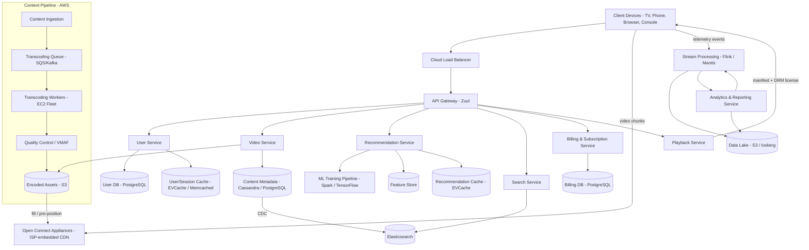
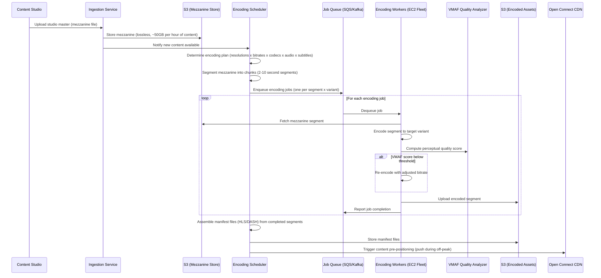

# Netflix

## 1. Overview

Netflix is a subscription-based video streaming platform serving 260M+ subscribers across 190+ countries. Users browse a catalog of 17,000+ titles, stream video on demand across a wide range of devices (smart TVs, phones, tablets, game consoles, browsers), and receive personalized content recommendations. Netflix accounts for approximately 15% of global downstream internet bandwidth during peak hours.

The core architectural challenges are:

1. **Content ingestion and transcoding pipeline** -- converting a single studio master into thousands of encoded variants (resolution x bitrate x codec x audio track x subtitle) in a massively parallel, fault-tolerant pipeline that processes petabytes of video data.
2. **Adaptive bitrate (ABR) streaming** -- dynamically adjusting video quality in real time based on each viewer's network conditions, device capabilities, and content complexity, while minimizing rebuffering and maximizing perceptual quality.
3. **Open Connect CDN** -- Netflix's proprietary CDN that places custom hardware appliances (Open Connect Appliances -- OCAs) directly inside ISP networks, caching the most popular content within a single network hop of the viewer.
4. **Recommendation engine** -- a sophisticated ML system that drives 80% of content watched on Netflix, operating a multi-stage pipeline across 17,000+ titles and 260M+ user profiles.
5. **Microservices architecture at extreme scale** -- 1,000+ microservices communicating via gRPC and async messaging, requiring mature service discovery, circuit breaking, and chaos engineering to maintain 99.99% availability.

Netflix's architecture is a canonical study in how to build a globally distributed, fault-tolerant streaming platform where every component -- from encoding to delivery to recommendation -- is designed for horizontal scale, graceful degradation, and continuous experimentation.

## 2. Requirements

### Functional Requirements
- Users can create accounts, manage multiple profiles per account, and set parental controls.
- Users can browse and search a catalog of movies, TV shows, and other video content.
- Users can stream video on demand with play, pause, seek, and resume functionality.
- Users can receive personalized content recommendations based on viewing history and preferences.
- Users can add titles to a watchlist and track viewing history across devices.
- Users can download select titles for offline viewing.
- Users can rate content, which feeds back into the recommendation model.
- The system supports multiple audio tracks, subtitles, and closed captions per title.

### Non-Functional Requirements
- **Scale**: 260M+ subscribers, 100M+ daily active viewers, peak concurrent streams exceeding 10M globally.
- **Storage**: 17,000+ titles encoded into thousands of variants each; total encoded library exceeds 100 PB.
- **Bandwidth**: Peak delivery of ~2 TB/s globally during evening hours.
- **Latency**: Video playback start in < 3 seconds (p99); UI page load in < 500ms (p99); recommendation refresh in < 200ms (p99).
- **Availability**: 99.99% uptime (four nines). Downtime during peak hours affects millions of active sessions simultaneously.
- **Streaming quality**: Zero rebuffering for 99%+ of playback sessions under normal network conditions. Seamless quality transitions during ABR adaptation.
- **Transcoding throughput**: New titles must be fully encoded (all variants) within 24 hours of ingestion. Emergency encodes (breaking news content, live events) in under 4 hours.
- **Consistency**: Eventual consistency acceptable for recommendations and viewing history sync. Strong consistency for billing, account state, and DRM license issuance.

## 3. High-Level Architecture



## 4. Core Design Decisions

### AWS for Control Plane, Open Connect for Data Plane
Netflix splits its architecture into two distinct planes. The **control plane** -- all business logic services (user management, recommendations, search, billing, playback session management) -- runs on AWS across multiple regions. The **data plane** -- the actual delivery of video bytes to viewers -- runs on Netflix's proprietary Open Connect CDN. This separation means that even if AWS experiences degradation, cached content on OCAs continues streaming. The control plane uses [microservices architecture](../architecture/microservices.md) with hundreds of independent services.

### Microservices with Zuul API Gateway
All client requests route through Zuul, Netflix's custom [API gateway](../architecture/api-gateway.md), which handles authentication, routing, rate limiting, canary testing, and request context propagation. Behind Zuul, 1,000+ microservices communicate via a mix of [gRPC](../api-design/grpc.md) for synchronous calls and [Kafka](../messaging/message-queues.md) for asynchronous event-driven workflows. [Service discovery](../architecture/microservices.md) is handled by Eureka, Netflix's homegrown service registry.

### Transcoding as a Massively Parallel Pipeline
Studio masters are ingested and split into short segments. Each segment is independently encoded across a fleet of thousands of EC2 instances, enabling massive parallelism. Encoding produces variants across multiple dimensions (resolution, bitrate, codec, audio, subtitles), resulting in thousands of files per title. The pipeline uses a [message queue](../messaging/message-queues.md) (SQS/Kafka) for job distribution and is designed for retry and idempotency -- if a worker fails mid-encode, the segment is re-queued and processed by another worker.

### Per-Title Encoding and VMAF
Rather than applying a fixed bitrate ladder to all content, Netflix pioneered per-title encoding. A static scene (talking heads) requires far fewer bits than an action sequence. Netflix uses VMAF (Video Multimethod Assessment Fusion), a perceptual quality metric, to determine the optimal bitrate for each scene at each resolution. This produces a content-specific bitrate ladder that maximizes quality per byte, reducing bandwidth consumption by 20%+ while maintaining equivalent perceptual quality.

### Open Connect CDN (Proprietary)
Rather than relying on third-party CDNs, Netflix built [Open Connect](../caching/cdn.md), a proprietary CDN consisting of thousands of custom hardware appliances (OCAs) deployed directly inside ISP data centers and at internet exchange points (IXPs). Each OCA stores up to 350TB of content. During off-peak hours, the most popular content is proactively pushed to OCAs (push-based CDN), so that during peak hours, 95%+ of traffic is served from within the viewer's own ISP network -- often a single network hop away.

### EVCache for Low-Latency Data Access
Netflix uses EVCache (a distributed Memcached-based [caching layer](../caching/caching.md)) extensively across all services. Recommendations, user profiles, viewing history, and session state are all cached in EVCache. The cache tier absorbs the vast majority of read traffic, keeping latency under 1ms for most data lookups and insulating backend databases from read load.

## 5. Deep Dives

### 5.1 Content Ingestion and Transcoding Pipeline

The transcoding pipeline is one of Netflix's most computationally intensive systems, consuming hundreds of thousands of CPU-hours per day.



**Encoding plan generation**: For a single title, the encoding scheduler determines the full matrix of variants. A typical movie might require:
- 10 resolution tiers (240p through 4K HDR)
- 3-5 bitrate levels per resolution (per-title optimization via VMAF)
- 2-3 codecs (H.264 for legacy devices, H.265/HEVC for modern devices, AV1 for bandwidth efficiency)
- 5-20 audio tracks (different languages, Dolby Atmos, stereo)
- 30+ subtitle tracks

This can produce 1,000+ encoded files per title. The total encoding work is distributed across thousands of EC2 instances that process segments in parallel, enabling a 2-hour movie to be fully encoded in under 24 hours.

**Fault tolerance**: Each encoding job is idempotent. If a worker crashes mid-encode, the job returns to the queue after a visibility timeout. The scheduler tracks job completion and only assembles the manifest after all segments for all variants are complete. A [dead-letter queue](../messaging/message-queues.md) captures persistently failing jobs for manual investigation.

**Per-title encoding**: The key insight is that not all content is equal. An animated film has smooth gradients that compress well; a live sports event has rapid motion that requires higher bitrates. Netflix's per-title encoding system:
1. Analyzes the mezzanine to characterize content complexity (motion, texture, scene changes).
2. Performs trial encodes at multiple bitrates for representative scenes.
3. Uses VMAF to score perceptual quality at each bitrate.
4. Selects the bitrate ladder that maximizes quality while minimizing file size.
5. This process saved Netflix an estimated 20% in bandwidth costs.

### 5.2 Adaptive Bitrate (ABR) Streaming

ABR streaming is the mechanism that enables seamless playback across wildly varying network conditions -- from fiber broadband to congested mobile networks.

Netflix uses [HTTP-based adaptive streaming protocols](../patterns/video-streaming.md) (primarily DASH with HLS fallback for Apple devices). Video content is segmented into small chunks (typically 2-4 seconds each), and each chunk is available in multiple quality levels (the bitrate ladder).

**How ABR works:**
1. The client requests the manifest file from the playback service. The manifest contains URLs for every chunk at every quality level.
2. Before playback begins, the client estimates initial bandwidth (using historical data or a small probe download) and selects an appropriate starting quality.
3. During playback, the client continuously monitors:
   - Download throughput of each chunk.
   - Buffer occupancy (seconds of video buffered ahead of the playback position).
   - Device capabilities (screen resolution, decoder support).
4. For each subsequent chunk, the client selects the quality level that maximizes perceptual quality without risking rebuffering. If bandwidth drops, the client downgrades quality; if bandwidth recovers, it upgrades.
5. Quality transitions are designed to be imperceptible -- the client ramps up gradually rather than jumping to maximum quality.

**Buffer-based ABR (Netflix's approach)**: Rather than relying solely on throughput estimation (which is noisy and reactive), Netflix's ABR algorithm is primarily buffer-based. The algorithm maps buffer occupancy to bitrate:
- Buffer < 5 seconds: select lowest bitrate (protect against rebuffer).
- Buffer 5-30 seconds: gradually increase bitrate.
- Buffer > 30 seconds: select highest sustainable bitrate.

This approach is more stable than throughput-based algorithms, producing fewer unnecessary quality oscillations.

**DRM integration**: Video chunks are encrypted using industry-standard DRM systems (Widevine for Android/Chrome, FairPlay for Apple, PlayReady for Windows/Xbox). The playback service issues time-limited DRM licenses that authorize decryption. License issuance requires strong consistency -- an expired subscriber must not receive a valid license.

### 5.3 Recommendation Engine

Netflix's recommendation engine is responsible for 80% of content discovered on the platform. It is a complex ML system operating at the intersection of user behavior data, content metadata, and real-time context.

**Architecture follows the [three-stage recommendation pipeline](../patterns/recommendation-engines.md):**

**Stage 1 -- Candidate Generation:**
Multiple candidate generators run in parallel:
- *Collaborative filtering*: Matrix factorization models identify users with similar taste profiles and surface content those similar users watched.
- *Content-based filtering*: Content features (genre, director, cast, mood tags, visual style) are encoded as [vector embeddings](../patterns/recommendation-engines.md). Content similar to what the user has watched is retrieved via approximate nearest neighbor (ANN) search.
- *Trending and popularity*: Recently popular titles in the user's region.
- *Because-you-watched (BYW)*: For each recently watched title, surface semantically similar titles.
- *Continue watching*: Titles with incomplete viewing sessions.
- Each generator returns ~100-500 candidates; combined pool: ~2,000-5,000 candidates per user.

**Stage 2 -- Ranking:**
A deep learning model scores each candidate by predicted engagement (probability of play, predicted watch duration, predicted rating). Features include:
- User features: viewing history, genre preferences, time-of-day viewing patterns, device type.
- Content features: genre, cast, release date, runtime, content maturity rating.
- Contextual features: day of week, time of day, session length, recently browsed titles.
- Cross features: user-content interaction history (has the user watched other titles by this director?).

The ranking model is trained on billions of user-content interaction events using distributed [batch processing (Spark)](../messaging/event-driven-architecture.md) and updated periodically.

**Stage 3 -- Reranking and Page Assembly:**
The ranked list is post-processed for:
- *Diversity*: Ensure the recommendations span multiple genres and content types.
- *Row assembly*: Netflix's UI is organized into rows ("Trending Now," "Because You Watched X," "Top 10 in Your Country"). Each row is populated from a different candidate generator, and the rows themselves are ranked by predicted engagement.
- *Artwork personalization*: Netflix selects which artwork (poster image) to show for each title based on the user's preferences. A user who watches romantic comedies may see a different poster for the same title than a user who watches action films.
- *Freshness and exploration*: A fraction of recommendations intentionally surface content the user might not have discovered otherwise, balancing exploitation (showing known-good content) with exploration (discovering new preferences).

**Training infrastructure**: The recommendation models are trained on Netflix's data platform, which processes petabytes of user behavior data. [Event-driven pipelines](../messaging/event-driven-architecture.md) capture every user interaction (play, pause, seek, browse, search, rate) as structured events. These events flow through [stream processing (Flink/Mantis)](../messaging/event-driven-architecture.md) for real-time feature computation and are landed in a data lake for batch model training.

**Serving latency**: Pre-computed recommendations are stored in EVCache ([distributed caching](../caching/caching.md)) and refreshed periodically (every few hours or on significant user activity). When a user opens the app, the recommendation service reads from cache, applies lightweight reranking (accounting for time-of-day and recently watched), and returns the personalized homepage in < 200ms.

### 5.4 Open Connect CDN

Open Connect is the engineering innovation that makes Netflix's scale economically viable. Delivering 2 TB/s of video via a third-party CDN would cost billions annually. By building its own CDN and embedding appliances inside ISP networks, Netflix controls the delivery path and dramatically reduces costs.

**OCA (Open Connect Appliance) hardware**: Custom-designed servers optimized for storage density and streaming throughput. A single OCA can store up to 350TB of content on high-density HDDs with SSD caching for hot content, and serve up to 100 Gbps of concurrent streaming traffic.

**Content placement strategy**:
- **Popularity-based pre-positioning**: During off-peak hours (typically 2 AM - 10 AM local time), OCAs pull the most popular content from the origin (S3). Netflix's popularity models predict which titles will be most-watched in each region and pre-fill OCAs accordingly.
- **Tiered caching**: Not all content fits on every OCA. The most popular ~20% of titles (which serve ~80% of traffic) are cached on all OCAs in a region. Less popular content is cached at IXP-level OCAs that serve multiple ISPs. The rarest content is served directly from S3 origin.
- **Fill optimization**: OCAs fill during off-peak hours to avoid competing with viewer traffic for ISP bandwidth. Fill traffic is carefully rate-limited and scheduled.

**Request routing**:
1. When a client requests a video stream, the playback service determines which OCA should serve the request.
2. The steering service considers: viewer location (ISP, city), OCA availability and load, network path quality (measured via continuous probing), and content availability on each OCA.
3. The client receives a ranked list of OCA URLs and begins streaming from the top choice.
4. If the selected OCA fails or becomes congested mid-stream, the client transparently fails over to the next OCA in the list.

**Scale**: Netflix operates 17,000+ OCAs across 6,000+ ISP and IXP locations in 190+ countries. During peak hours, OCAs serve 95%+ of all Netflix traffic -- meaning only 5% of video bytes traverse the broader internet.

## 6. Data Model

### User & Profile (PostgreSQL)
```
users:
  user_id        UUID PK
  email          VARCHAR UNIQUE
  password_hash  VARCHAR
  subscription_plan ENUM (basic, standard, premium)
  created_at     TIMESTAMP
  country        VARCHAR

profiles:
  profile_id     UUID PK
  user_id        UUID FK -> users
  name           VARCHAR
  avatar_url     VARCHAR
  maturity_level ENUM (kids, teen, adult)
  language       VARCHAR
  created_at     TIMESTAMP
```

### Content Metadata (Cassandra + PostgreSQL)
```
-- PostgreSQL for editorial/catalog metadata (small, relational)
titles:
  title_id       UUID PK
  type           ENUM (movie, tv_show)
  name           VARCHAR
  description    TEXT
  release_year   INTEGER
  maturity_rating VARCHAR
  genres         VARCHAR[]
  cast           VARCHAR[]
  directors      VARCHAR[]
  runtime_minutes INTEGER

episodes:
  episode_id     UUID PK
  title_id       UUID FK -> titles
  season_number  INTEGER
  episode_number INTEGER
  name           VARCHAR
  runtime_minutes INTEGER

-- Cassandra for high-volume encoding metadata (many variants per title)
content_metadata:
  title_id       UUID  (partition key)
  variant_id     UUID  (clustering key)
  resolution     VARCHAR (e.g., "1080p")
  bitrate_kbps   INTEGER
  codec          VARCHAR (e.g., "h265")
  audio_track    VARCHAR
  subtitle_track VARCHAR
  s3_path        VARCHAR
  file_size_bytes BIGINT
  vmaf_score     FLOAT
```

### Watch History (Cassandra)
```
watch_history:
  profile_id     UUID  (partition key)
  title_id       UUID  (clustering key, ordered by last_watched DESC)
  episode_id     UUID  (nullable, for TV shows)
  progress_pct   FLOAT
  last_watched   TIMESTAMP
```

### Watchlist (Cassandra)
```
watchlist:
  profile_id     UUID  (partition key)
  title_id       UUID  (clustering key)
  added_at       TIMESTAMP
```

### Ratings (Cassandra)
```
ratings:
  profile_id     UUID  (partition key)
  title_id       UUID  (clustering key)
  rating         ENUM (thumbs_up, thumbs_down)
  rated_at       TIMESTAMP
```

### Recommendation Cache (EVCache / Memcached)
```
Key:   recs:{profile_id}
Value: JSON array of ranked title_ids with row metadata
TTL:   6 hours (refreshed on significant user activity)
```

### Search Index (Elasticsearch)
```
Index: titles
Document: {
  title_id:       keyword,
  name:           text (analyzed, multi-language),
  description:    text (analyzed),
  genres:         keyword[],
  cast:           text[],
  directors:      text[],
  release_year:   integer,
  maturity_rating: keyword,
  popularity_score: float,
  region_availability: keyword[]
}

Sharding: hash(title_id)
```

## 7. Scaling Considerations

### Transcoding Pipeline Scaling
The transcoding pipeline is the most compute-intensive component. It scales horizontally by launching more EC2 instances (often Spot Instances for cost efficiency) when the encoding queue depth increases. Netflix processes thousands of encoding jobs concurrently. [Autoscaling](../scalability/autoscaling.md) policies monitor SQS/Kafka queue depth and adjust the worker fleet. Spot Instance interruptions are handled gracefully -- the interrupted job returns to the queue and is picked up by another worker. This pattern leverages [message queue guarantees](../messaging/message-queues.md) (at-least-once delivery with idempotent processing) for resilience.

### Microservices Scaling
Each of Netflix's 1,000+ microservices is independently deployable and scalable. Services are containerized and orchestrated via Titus (Netflix's container management platform, built on top of AWS). [Load balancing](../scalability/load-balancing.md) (Ribbon, a client-side load balancer) distributes requests across service instances. Critical services (playback, recommendations, user auth) are scaled to handle 10x their average traffic to absorb spikes.

### Open Connect Scaling
Adding capacity to Open Connect means deploying more OCAs into ISP data centers. Netflix works directly with ISPs to co-locate appliances. When a new market launches or an ISP's subscriber base grows, Netflix ships additional OCAs. The content placement system automatically adjusts popularity-based pre-positioning for the new capacity.

### Database Scaling
- **PostgreSQL** (users, billing, catalog): [Sharded](../scalability/sharding.md) by user_id for user tables; read replicas handle catalog queries. [Database replication](../storage/database-replication.md) provides HA with automatic leader failover.
- **Cassandra** (watch history, ratings, content metadata): Horizontally scaled by adding nodes. Partition keys are chosen to distribute load evenly -- `profile_id` for user-specific data, `title_id` for content-specific data. Tunable consistency (QUORUM for writes, ONE for reads) balances durability and latency.
- **EVCache**: Scaled by adding nodes to the cache cluster. [Consistent hashing](../scalability/consistent-hashing.md) distributes keys across nodes. Netflix runs EVCache in multiple availability zones with replication for fault tolerance.

### Peak Traffic Management
Netflix experiences highly predictable traffic patterns: viewership peaks between 7 PM - 11 PM local time, with the global peak around 9 PM EST (US evening). Strategies:
- **Pre-warming**: Infrastructure is scaled up before predicted peaks. [Feature flags](../resilience/feature-flags.md) disable non-critical features (recommendation model retraining, analytics batch jobs) during peak to free compute resources.
- **Graceful degradation**: If the recommendation service is slow, the client displays a cached or generic homepage rather than failing. The playback path has the highest priority -- all other services shed load before playback is affected.
- **Regional isolation**: Services are deployed in multiple AWS regions. A failure in one region does not affect others. Regional failover is automated via DNS-based routing.

## 8. Failure Modes & Mitigations

| Failure | Impact | Mitigation |
|---------|--------|------------|
| Transcoding worker crash | Encoding job for one segment stalls | Job returns to queue after visibility timeout; another worker picks it up; idempotent processing ensures no corruption |
| OCA failure | Viewers on that ISP experience buffering | Client auto-fails over to next OCA in ranked list; steering service removes failed OCA from routing; viewers may briefly downgrade quality |
| OCA content miss (title not cached) | Increased latency for that title on that ISP | OCA fetches from upstream IXP OCA or S3 origin; fill runs during next off-peak window to prevent recurrence |
| AWS region outage | Control plane services (auth, recommendations, playback session) degrade in affected region | Active-active multi-region deployment; DNS failover routes traffic to healthy region within seconds; OCAs continue serving cached streams independently |
| Recommendation service timeout | Homepage shows stale or generic recommendations | EVCache serves stale cached recommendations; generic "popular in your country" row is displayed as fallback; [circuit breaker](../resilience/circuit-breaker.md) prevents cascading failure |
| Kafka broker failure | Event processing (telemetry, encoding jobs) delayed | Kafka replication factor of 3; consumers auto-rebalance; encoding scheduler retries failed jobs |
| Cassandra node failure | Watch history writes/reads affected for some partition range | Cassandra's leaderless architecture routes to replica; hinted handoff catches up failed node on recovery |
| DRM license service failure | New playback sessions cannot start; existing sessions continue | DRM licenses have TTL (hours); active viewers are unaffected; [circuit breaker](../resilience/circuit-breaker.md) on license service fails fast; service is multi-region for HA |
| EVCache cluster failure | Read latency spikes as requests fall through to database | [Cache-aside](../caching/caching.md) pattern; database absorbs temporary load spike; cache rebuilds within minutes; services implement request coalescing to prevent [cache stampede](../caching/caching.md) |

### Chaos Engineering

Netflix pioneered chaos engineering with Chaos Monkey (randomly terminates production instances), Chaos Kong (simulates entire region failure), and other "Simian Army" tools. The philosophy is that failures are inevitable in distributed systems -- the only question is whether the system handles them gracefully. By continuously injecting failures in production, Netflix validates that:
- Circuit breakers trip correctly and recovery paths work.
- Service degradation is graceful (stale data over no data, reduced features over outage).
- Failover mechanisms (region, OCA, cache) operate within SLA bounds.
- No single service failure cascades into a platform-wide outage.

This proactive approach to resilience testing is built on [circuit breaker patterns](../resilience/circuit-breaker.md) and [feature flags](../resilience/feature-flags.md) that enable rapid kill-switch activation for degraded components.

## 9. Key Takeaways

- Separate the control plane (business logic on AWS) from the data plane (video delivery on Open Connect). This isolation means that cloud provider issues do not interrupt active streams.
- Build your own CDN when you are the CDN's largest customer. At Netflix's scale, a proprietary CDN that places servers inside ISP networks is both cheaper and higher quality than any third-party option.
- Per-title encoding with perceptual quality metrics (VMAF) optimizes the quality-per-byte tradeoff for each piece of content, saving 20%+ bandwidth compared to a static bitrate ladder.
- Adaptive bitrate streaming must be buffer-based, not just throughput-based, to minimize quality oscillations and rebuffering events.
- The three-stage recommendation pipeline (candidate generation, ranking, reranking) is the only tractable architecture for scoring billions of user-content combinations. Pre-computed recommendations in cache make the serving path fast.
- 80% of what users watch comes from recommendations, not search -- making the recommendation engine Netflix's most business-critical system after playback itself.
- Microservices require mature operational tooling: service discovery (Eureka), circuit breakers (Hystrix), client-side load balancing (Ribbon), API gateway (Zuul), and chaos engineering (Simian Army). Without this tooling, 1,000+ services become unmanageable.
- Chaos engineering is not optional at scale -- it is the only way to verify that failure modes are handled gracefully in production.
- Eventual consistency is acceptable for most read paths (recommendations, viewing history), but DRM license issuance and billing require strong consistency to prevent revenue leakage and piracy.
- Event-driven architecture with Kafka enables decoupled, independently scalable services for encoding, analytics, and recommendation model training.
- Spot Instances for transcoding workers provide massive cost savings; idempotent jobs and message queue retry semantics make Spot interruptions a non-issue.

## 10. Related Concepts

- [Video streaming (ABR, HLS, MPEG-DASH, transcoding, chunked delivery)](../patterns/video-streaming.md) -- core delivery mechanism
- [CDN (edge caching, content delivery, push vs. pull)](../caching/cdn.md) -- Open Connect architecture
- [Recommendation engines (three-stage pipeline, collaborative filtering, embeddings)](../patterns/recommendation-engines.md) -- personalization
- [Message queues (Kafka, SQS, consumer groups, DLQ, back-pressure)](../messaging/message-queues.md) -- encoding pipeline and event streaming
- [Event-driven architecture (pub/sub, stream processing, Flink)](../messaging/event-driven-architecture.md) -- analytics and ML pipelines
- [Microservices (service discovery, bounded contexts, independent deployment)](../architecture/microservices.md) -- service architecture
- [API gateway (Zuul, routing, rate limiting, auth)](../architecture/api-gateway.md) -- entry point
- [Circuit breaker (Hystrix, cascading failure prevention)](../resilience/circuit-breaker.md) -- resilience
- [Feature flags (canary releases, kill switches)](../resilience/feature-flags.md) -- operational control and chaos engineering
- [Caching strategies (cache-aside, EVCache, cache stampede prevention)](../caching/caching.md) -- data access optimization
- [Object storage (S3, mezzanine and encoded asset storage)](../storage/object-storage.md) -- media storage
- [SQL databases (PostgreSQL for users, billing, catalog)](../storage/sql-databases.md) -- structured data
- [Cassandra (watch history, content metadata, tunable consistency)](../storage/cassandra.md) -- high-write data
- [NoSQL databases (polyglot persistence)](../storage/nosql-databases.md) -- storage strategy
- [Search and indexing (Elasticsearch, CDC-based sync)](../patterns/search-and-indexing.md) -- content search
- [Sharding (hash-based partitioning)](../scalability/sharding.md) -- database scaling
- [Consistent hashing (EVCache distribution)](../scalability/consistent-hashing.md) -- cache scaling
- [Autoscaling (transcoding workers, microservices)](../scalability/autoscaling.md) -- elastic capacity
- [Load balancing (Ribbon, client-side LB)](../scalability/load-balancing.md) -- traffic distribution
- [Rate limiting (API protection)](../resilience/rate-limiting.md) -- abuse prevention
- [Distributed transactions (saga pattern for encoding pipeline)](../resilience/distributed-transactions.md) -- pipeline orchestration
- [Database replication (PostgreSQL HA, Cassandra leaderless)](../storage/database-replication.md) -- data durability
- [Back-of-envelope estimation](../fundamentals/back-of-envelope-estimation.md) -- capacity planning
- [Availability and reliability](../fundamentals/availability-reliability.md) -- SLA targets
- [Encryption (DRM, TLS)](../security/encryption.md) -- content protection
- [Monitoring (Prometheus, Grafana, Atlas)](../observability/monitoring.md) -- system health
- [Logging (centralized logging, distributed tracing)](../observability/logging.md) -- troubleshooting

## 11. Source Traceability

| Section | Source |
|---------|--------|
| Functional and non-functional requirements | System Design Guide ch18 (Netflix), Grokking (YouTube/Netflix chapters) |
| Data model (User, Profile, Movie, TVShow, Episode, WatchHistory, Watchlist, Rating, ContentMetadata) | System Design Guide ch18 (Entity relationship diagram) |
| Scale calculations (storage, bandwidth, encoding processing) | System Design Guide ch18 (Scale calculations section) |
| High-level architecture (microservices, API gateway, Video/User/Recommendation/Search services) | System Design Guide ch18 (High-level design, Figure 14.2) |
| Video Service (upload, encoding, streaming) | System Design Guide ch18 (Video Service low-level design, Figures 14.3-14.7) |
| Recommendation Service (generation flow, event recording, model training) | System Design Guide ch18 (Recommendation Service, Figures 14.11-14.14) |
| CDN architecture (content distribution, request routing, ABR) | System Design Guide ch18 (CDN section, Figures 14.15-14.17) |
| Adaptive bitrate streaming (HLS, MPEG-DASH, chunked delivery) | YouTube Report 7 (Section 6: Video streaming evolution, ABS), YouTube Report 4 (Section 5: Video) |
| Three-stage recommendation pipeline | YouTube Report 4 (Section 4: Recommendation engine, vector search, embeddings) |
| Microservices and service discovery | YouTube Report 2 (Section 2: API gateway, infrastructure maturity model), YouTube Report 5 (Section 2) |
| Cassandra for high-write workloads | YouTube Report 4 (Section 1: NoSQL), YouTube Report 7 (Section 2: Cassandra deep dive) |
| Caching strategies (EVCache, cache-aside) | YouTube Report 7 (Section 4: Caching architectures, cache stampede) |
| Sharding and consistent hashing | YouTube Report 4 (Section 3: Sharding), YouTube Report 7 (Section 3: Consistent hashing) |
| Circuit breaker and resilience patterns | YouTube Report 5 (Section 6: Reliability essentials), YouTube Report 8 (Section 6: Circuit breaker) |
| Video deduplication and thumbnails | Grokking ch124 (Video deduplication, thumbnail storage in Bigtable) |
| Traffic patterns (predictable spikes, pre-warming) | YouTube Report 4 (Section 6: Netflix as predictable spike example) |
| DRM and content security | System Design Guide ch18 (Content security and DRM section) |
| Chaos engineering | Expert domain knowledge (Netflix Simian Army, resilience engineering principles) |
| Per-title encoding and VMAF | Expert domain knowledge (Netflix Tech Blog, encoding optimization research) |
| Open Connect CDN architecture | Expert domain knowledge (Netflix Open Connect program, ISP-embedded appliances) |
