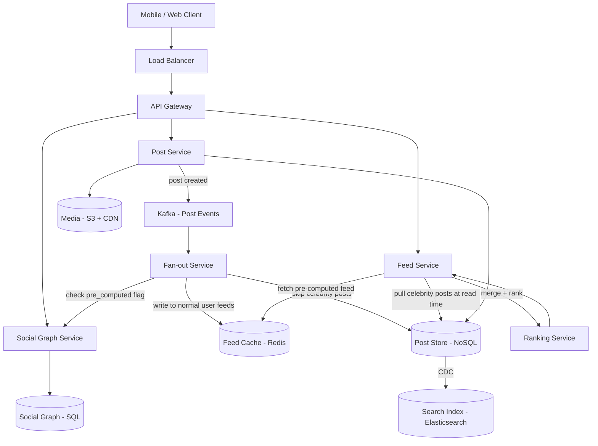
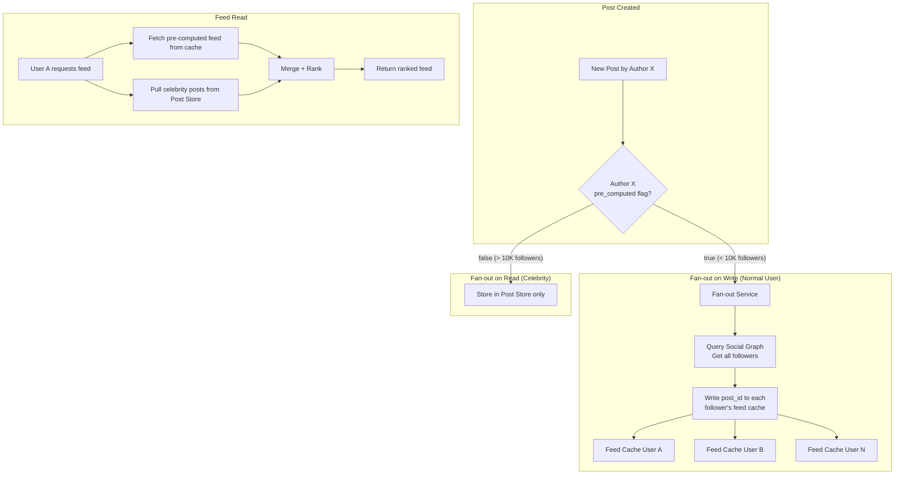

# News Feed

## 1. Overview

A news feed (as implemented by Facebook, Instagram, or LinkedIn) provides each user with a personalized, ranked stream of posts from friends, pages, and groups they follow. While structurally similar to Twitter's timeline, the news feed differs in two critical ways: posts are **ranked** (not purely chronological) and the social graph is typically **bidirectional** (friends, not followers), which changes the fan-out economics. The core architectural challenge is the hybrid fan-out problem -- using a `pre_computed` flag in the follow table to decide per-user whether to push posts into pre-built feeds or compute them at read time. For celebrity accounts, fan-out on read avoids the "write thunderstorm" of pushing a single post to 100 million inboxes. The news feed is also a canonical study in feed ranking, Count-Min Sketch for hot term detection, and the merge-at-read-time pattern.

## 2. Requirements

### Functional Requirements
- Users can create posts (text, images, links).
- Users can follow other users, pages, and groups.
- Users can view a personalized feed of posts from their connections.
- The feed is ranked by relevance (not purely chronological).
- Users can interact with posts (like, comment, share).
- The system supports hundreds of millions of concurrent users.

### Non-Functional Requirements
- **Scale**: 2B+ registered users, 500M+ DAU, 1B+ feed loads per day.
- **Latency**: Feed load in < 500ms (p99).
- **Availability**: 99.99% uptime. The feed is the primary surface of the application.
- **Consistency**: Eventual consistency is acceptable. A post appearing 5-10 seconds late in a friend's feed is tolerable.
- **Freshness**: New posts should appear in followers' feeds within 30 seconds for normal users.

## 3. High-Level Architecture



## 4. Core Design Decisions

### Hybrid Fan-out with Pre-computed Flag
The [hybrid fan-out](../patterns/fan-out.md) strategy is governed by a `pre_computed` flag on each user/page in the social graph:

- **Normal users** (`pre_computed = true`): When a user creates a post, the fan-out service writes the post reference to every follower's pre-built feed in Redis. At read time, the feed is a simple cache fetch -- O(1).
- **Celebrity/page accounts** (`pre_computed = false`): The post is stored only in the post store. At read time, the feed service identifies which celebrities the user follows and pulls their recent posts on-the-fly. These are merged with the pre-computed feed.

The threshold for flipping the flag is tunable -- typically accounts with >10K followers are marked as `pre_computed = false`.

### Feed Ranking (Not Chronological)
Unlike Twitter (which defaults to chronological), the news feed is **ranked by relevance**. The ranking service scores each candidate post based on:
- **Affinity**: How often the user interacts with the post author (likes, comments, profile visits).
- **Edge weight**: The type of interaction (comment > like > view).
- **Decay**: Post age -- recency matters, but a highly engaging post from 6 hours ago may outrank a bland post from 5 minutes ago.
- **Content type**: Videos and photos may receive a boost over text-only posts.

Ranking happens at read time, after the merge of pre-computed and celebrity posts. This allows the ranking model to incorporate real-time signals (current engagement counts) without recomputing the feed on every write.

### Count-Min Sketch for Hot Term Detection
For features like "trending topics" or search typeahead on the feed, the system uses a [Count-Min Sketch](../patterns/probabilistic-data-structures.md) to efficiently track the frequency of terms, hashtags, and URLs across all posts. The Count-Min Sketch:
- Uses constant memory (a few MB) regardless of the number of distinct terms.
- Provides approximate frequency counts with bounded error.
- Identifies "heavy hitters" (the top trending terms) without maintaining exact counts for every term.

Hot terms detected by the Count-Min Sketch are used to pre-warm the [search index](../patterns/search-and-indexing.md) cache and power trending topic modules.

### Social Graph in SQL
The social graph (who follows whom) is stored in [PostgreSQL](../storage/sql-databases.md). Friend relationships are bidirectional (unlike Twitter's unidirectional follows), so the graph is modeled as an undirected edge list. SQL is chosen because:
- The graph requires complex queries (mutual friends, friend-of-friend suggestions).
- ACID guarantees prevent inconsistent friend states (A follows B but B doesn't follow A).
- The graph changes infrequently compared to posts and feeds.

## 5. Deep Dives

### 5.1 The Pre-computed Flag and Fan-out Decision



**Why not fan-out on write for everyone?**

Consider a page with 100M followers posting once per hour:
- Fan-out on write: 100M Redis writes per post. At 1 post/hour: ~28K writes/sec sustained, just for one account.
- With thousands of popular accounts, this creates a continuous "write thunderstorm" that overwhelms the cache layer.

Fan-out on read for celebrities trades higher read-time latency (merging ~50 celebrity feeds) for dramatically lower write-time load.

### 5.2 Feed Generation at Read Time

When a user opens their feed:

1. **Fetch pre-computed feed**: `ZREVRANGE feed:{user_id} 0 499` from Redis. Returns up to 500 post IDs sorted by insertion time.
2. **Identify followed celebrities**: Query social graph for user's connections where `pre_computed = false`.
3. **Pull celebrity posts**: For each celebrity (typically < 50 per user), fetch their last N posts from the post store. This is a batch query, not N individual queries.
4. **Merge**: Combine pre-computed post IDs with celebrity post IDs into a single candidate list.
5. **Rank**: The ranking service scores each candidate using the affinity/edge-weight/decay model. The top 50 are selected for the initial page.
6. **Hydrate**: Batch-fetch full post content (text, media URLs, engagement counts) for the top 50 post IDs.
7. **Return**: Paginated feed with cursor-based pagination for infinite scroll.

**Latency budget:**
- Cache fetch: ~5ms
- Celebrity pull: ~20ms (parallel batch query)
- Merge + rank: ~30ms
- Hydration: ~40ms
- **Total: ~95ms** well within the 500ms p99 target.

### 5.3 Feed Ranking Model

The ranking model is a simplified version of a [recommendation engine](../patterns/recommendation-engines.md):

**Scoring formula (simplified):**
```
score = (affinity_weight * affinity_score)
      + (edge_weight * interaction_type_score)
      + (content_weight * content_type_score)
      - (decay_factor * hours_since_post)
```

**Affinity score** is computed offline in batch:
- For each user pair (A, B), count A's interactions with B's posts over the last 30 days.
- Normalize by the total interactions A performed.
- Store as a sparse matrix in Redis, keyed by `affinity:{user_a}:{user_b}`.

**Edge weights** by interaction type:
| Interaction | Weight |
|------------|--------|
| Comment    | 1.0    |
| Share      | 0.8    |
| Like       | 0.5    |
| Click      | 0.3    |
| View       | 0.1    |

**Decay**: A post's score decays by ~10% per hour. A highly engaging post (high affinity + many interactions) can overcome decay and appear in the feed hours after creation.

### 5.4 Trending Detection with Count-Min Sketch

The platform tracks trending topics in real time across billions of daily posts:

1. **Stream processing**: As posts are created, a [Flink](../messaging/event-driven-architecture.md) job extracts hashtags, mentioned entities, and URLs.
2. **Count-Min Sketch update**: Each extracted term is hashed into the Count-Min Sketch, incrementing the corresponding counters.
3. **Heavy hitter detection**: Periodically (every minute), the system queries the Count-Min Sketch for terms exceeding a threshold. These are the trending candidates.
4. **Verification**: Trending candidates are verified against the actual post store (to filter false positives from the sketch's inherent overcount).
5. **Surfacing**: Verified trending topics are pushed to the client for display in the "Trending" module and used to pre-warm the search index cache.

The Count-Min Sketch uses ~10MB of memory and can track millions of distinct terms with bounded error, making it far more efficient than maintaining exact counters for every term.

### 5.5 Back-of-Envelope Estimation

**Feed cache sizing:**
- 500M DAU, each feed stores 500 post IDs
- Each entry: 8 bytes (post_id) + 8 bytes (score) = 16 bytes
- Per user: 500 x 16 = 8KB
- Total: 500M x 8KB = 4TB of Redis cluster memory
- With Redis overhead (~2x): ~8TB across a Redis cluster of ~100 nodes

**Fan-out write volume:**
- 1B posts/day (across all users and pages)
- 95% from normal users (< 10K followers): 950M posts
- Average followers for normal user: 300
- Fan-out writes: 950M x 300 = 285B Redis writes/day
- QPS: 285B / 86,400 = ~3.3M writes/sec sustained
- This requires a substantial fan-out worker fleet (~100+ Kafka consumers)

**Celebrity pull at read time:**
- Average user follows 20 celebrity/page accounts
- 1B feed loads/day
- Celebrity pull queries: 1B x 20 = 20B post-store queries/day
- QPS: 20B / 86,400 = ~231K queries/sec
- Cached with 30-second TTL: effective QPS to post store drops by 100-1000x

**Ranking computation:**
- 1B feed loads/day, each scoring ~500 candidates
- Total scoring operations: 500B/day
- QPS: 500B / 86,400 = ~5.8M scoring ops/sec
- Each scoring operation: ~0.1ms (simple arithmetic on cached affinity scores)
- Ranking service fleet: ~50-100 stateless instances

### 5.6 Feed Freshness and Invalidation

When a new post is created by a normal user and fanned out to followers' caches, the cache entry must eventually be consumed. But what if a user has not opened the app in 3 days?

**Cache eviction strategy:**
- Each feed cache (Redis sorted set) is capped at 500 entries via `ZREMRANGEBYRANK`.
- When new posts are inserted, the oldest entries are automatically evicted.
- If a user opens the app after 3 days, the cache may contain posts from the last few hours only. For older posts, the feed service falls back to the post store, querying the user's social graph and fetching recent posts from followed accounts.

**Feed reconstruction on cache miss:**
1. Identify all followed accounts (social graph query).
2. For each followed account, fetch recent posts from the post store.
3. Merge and rank.
4. Populate the cache with the result for future reads.

This reconstruction is expensive (~500ms) but only occurs for users who have been inactive for an extended period. Active users always hit the pre-computed cache.

## 6. Data Model

### Post Store (NoSQL)
```
{
  post_id:        UUID (partition key),
  author_id:      UUID,
  text:           String,
  media_urls:     [String],
  hashtags:       [String],
  created_at:     Timestamp,
  like_count:     Integer,
  comment_count:  Integer,
  share_count:    Integer
}
```

### Social Graph (Postgres)
```sql
users:
  user_id          UUID PK
  display_name     VARCHAR
  pre_computed     BOOLEAN  -- fan-out strategy flag
  follower_count   INTEGER

follows:
  user_id          UUID FK -> users
  follows_id       UUID FK -> users
  created_at       TIMESTAMP
  PRIMARY KEY (user_id, follows_id)
  INDEX (follows_id, user_id)  -- reverse lookup for fan-out
```

### Feed Cache (Redis Sorted Set)
```
Key:   feed:{user_id}
Score: post timestamp (epoch ms) or fan-out insertion time
Value: post_id
Max size: 500 entries (older entries are evicted)
```

### Affinity Cache (Redis)
```
Key:   affinity:{user_a}:{user_b}
Value: float (0.0 to 1.0)
TTL:   24 hours (refreshed by nightly batch job)
```

### Trending Topics (Count-Min Sketch + Redis)
```
Key:   trending:current
Value: ordered list of { term, approximate_count }
TTL:   60 seconds (refreshed every minute)
```

### API Endpoints

```
GET /v1/feed?cursor={cursor}&limit={limit}
  Headers: Authorization: Bearer <token>
  Response: {
    posts: [{ post_id, author, text, media_urls, like_count, comment_count, created_at }],
    next_cursor: string
  }
  Latency target: < 500ms (p99)

POST /v1/posts
  Body: { text, media_ids: [string], tags: [string] }
  Response: { post_id, created_at }

POST /v1/posts/{post_id}/like
  Response: { like_count: integer }

GET /v1/trending?limit={N}
  Response: { terms: [{ term, count }] }
  Served from Redis with 60-second TTL

GET /v1/search?q={query}&cursor={cursor}
  Response: { posts: [Post], next_cursor }
  Served from Elasticsearch inverted index
```

### Feed Pagination Strategy

The feed uses **cursor-based pagination** rather than offset-based:
- The cursor is an opaque token encoding the last post's ranking score and timestamp.
- Subsequent requests return posts ranked below the cursor's score.
- This avoids the "shifting window" problem of offset pagination, where new posts push existing posts to different page numbers between requests.
- The cursor is valid for 24 hours. After expiration, the client fetches a fresh feed from the top.

## 7. Scaling Considerations

- **Fan-out service**: The highest write-volume component. Horizontally scaled via [Kafka consumer groups](../messaging/message-queues.md), with each consumer handling a partition of post events. For a post by a user with 1,000 followers, the fan-out generates 1,000 Redis writes -- handled by multiple consumers in parallel.
- **Feed cache**: [Redis cluster](../caching/redis.md) with 16,384 slots. Each user's feed is a sorted set capped at 500 entries (~4KB per user). For 500M DAU: ~2TB of feed cache. Hot users (those with many followers posting) create hot keys -- mitigated by random suffix sharding.
- **Post store**: [Sharded](../scalability/sharding.md) by post_id for even distribution. Celebrity posts are read frequently but are easily cacheable with short TTLs.
- **Social graph**: Read-heavy and relatively static. [Database replication](../storage/database-replication.md) with multiple read replicas handles the query volume. The graph is sharded by user_id.
- **Ranking service**: Stateless and horizontally scalable. Affinity scores are pre-computed in batch and cached in Redis, so the ranking service performs only lightweight computation at request time.

## 8. Failure Modes & Mitigations

| Failure | Impact | Mitigation |
|---------|--------|------------|
| Fan-out service lag | Posts appear delayed in followers' feeds | Kafka backlog is monitored; auto-scaling adds consumers during spikes |
| Feed cache (Redis) node failure | Feed reads fail for affected users | Redis cluster redistributes slots; [cache-aside](../caching/caching.md) fallback queries post store + social graph to reconstruct feed |
| Ranking service timeout | Feed returns unranked results | Graceful degradation: return chronologically sorted feed (pre-computed cache order) as fallback |
| Celebrity post goes viral | Massive read-time merge load | Cache celebrity post lists with 30-second TTL; reduce merge work for subsequent requests |
| Affinity batch job fails | Ranking uses stale affinity scores | Affinity cache has 24-hour TTL; stale scores are acceptable for one day |
| Count-Min Sketch overcount | Non-trending topic appears as trending | Verification step against actual post store filters false positives |

## 9. Key Takeaways

- The `pre_computed` flag is the architectural pivot that makes hybrid fan-out work. It is a per-user/per-page configuration, not a global setting, allowing the system to optimize on a case-by-case basis.
- Feed ranking transforms the news feed from a simple timeline into a personalized experience. The ranking model (affinity + edge weight + decay) runs at read time, enabling real-time signal incorporation.
- Count-Min Sketch enables trending topic detection at billions-of-posts scale with constant memory, trading bounded overcount for massive space efficiency.
- The celebrity vs. normal user dichotomy is the central design tension. Fan-out on write optimizes for the common case (normal users with < 10K followers); fan-out on read handles the exceptional case (celebrities) without write amplification.
- Feed generation is a multi-step pipeline: cache fetch -> celebrity pull -> merge -> rank -> hydrate. Each step is independently optimizable and cacheable.
- Eventual consistency is explicitly acceptable. Users tolerate a 5-30 second delay in seeing a friend's post in exchange for sub-500ms feed load times.

## 10. Related Concepts

- [Fan-out (read vs. write, hybrid, pre_computed flag)](../patterns/fan-out.md)
- [Redis (sorted sets for feed cache, affinity cache, trending cache)](../caching/redis.md)
- [Caching strategies (cache-aside fallback, TTL management)](../caching/caching.md)
- [Probabilistic data structures (Count-Min Sketch for trending)](../patterns/probabilistic-data-structures.md)
- [Search and indexing (inverted index for post search, CDC sync)](../patterns/search-and-indexing.md)
- [Recommendation engines (ranking model, affinity scoring)](../patterns/recommendation-engines.md)
- [Message queues (Kafka for post event streaming)](../messaging/message-queues.md)
- [SQL databases (social graph, ACID for friend relationships)](../storage/sql-databases.md)
- [Sharding (post store by post_id, social graph by user_id)](../scalability/sharding.md)
- [Database replication (read replicas for social graph)](../storage/database-replication.md)
- [NoSQL databases (post store for flexible document structure)](../storage/nosql-databases.md)
- [CDN (media delivery for post images/videos)](../caching/cdn.md)

## 11. Comparison with Related Feed Systems

| Aspect | News Feed (Facebook) | Twitter Timeline | TikTok For You Page | LinkedIn Feed |
|--------|---------------------|-----------------|--------------------|----|
| Fan-out model | Hybrid (pre_computed flag) | Hybrid (celebrity threshold) | Pure pull (algorithmic) | Hybrid |
| Ranking | ML-based (affinity + decay) | Chronological (default) | Deep learning (engagement prediction) | ML-based (professional relevance) |
| Content source | Friends + pages + groups | Followed accounts | All creators (no follow required) | Connections + companies |
| Social graph | Bidirectional (friends) | Unidirectional (follow) | N/A (content-based) | Bidirectional (connections) |
| Cache strategy | Redis sorted sets per user | Redis sorted sets per user | No per-user cache (computed) | Redis sorted sets per user |
| Trending | Count-Min Sketch | Count-Min Sketch | Proprietary ML | Count-Min Sketch |
| Feed size | 500 cached items per user | 200 cached items per user | Infinite (server-computed) | 300 cached items per user |

The fundamental difference between a social feed (Facebook, LinkedIn) and an interest-based feed (TikTok) is the **fan-out source**. Social feeds derive candidates from the explicit social graph (friends, follows), while interest-based feeds derive candidates from implicit behavioral signals (watch time, likes). TikTok does not need fan-out at all -- it computes each user's feed entirely from a recommendation model at request time, which is computationally expensive but produces the most engaging feed.

### Architectural Lessons

1. **The pre_computed flag is the architectural pivot**: Rather than applying a single fan-out strategy globally, the per-user flag allows the system to optimize for each user's impact on the system. This pattern is reusable in any system with heterogeneous entity sizes (e.g., small vs. large chat groups, regular vs. viral content).

2. **Ranking transforms a timeline into a product**: Chronological feeds are easy to build but produce mediocre engagement. The ranking model (affinity + edge weight + decay) makes the feed personalized and engaging, but adds read-time computation cost. The trade-off is worth it for high-engagement platforms.

3. **Count-Min Sketch for trending detection is a space-efficient alternative to exact counting**: Tracking exact counts for every hashtag and term across billions of posts would require terabytes of memory. The Count-Min Sketch provides bounded-error frequency estimation in constant memory.

4. **Feed reconstruction on cache miss is expensive but rare**: The system is optimized for the common case (active users with warm caches). Inactive users who return after days experience a slower first load while their cache is rebuilt, but this is an acceptable trade-off for keeping the active-user path fast.

## 12. Source Traceability

| Section | Source |
|---------|--------|
| Hybrid fan-out, pre_computed flag | YouTube Report 6 (Section 4.1), YouTube Report 2 (Section 5) |
| Celebrity vs. normal user paths | YouTube Report 6 (Section 2.1-2.2), YouTube Report 3 (Section 6) |
| Count-Min Sketch for hot terms | YouTube Report 6 (Section 4.2), YouTube Report 8 (Section 6) |
| Feed ranking (affinity, edge weight, decay) | Acing System Design Ch. 19, YouTube Report 6 (Section 4.1) |
| Fan-out on write/read mechanics | YouTube Report 2 (Section 4: Messaging and Pub/Sub Fan-out) |
| DynamoDB for feed storage alternative | YouTube Report 6 (Section 3: DynamoDB Deep Dive) |
| News feed requirements and HLD | Acing System Design Ch. 19 (Requirements, High-level Architecture) |
