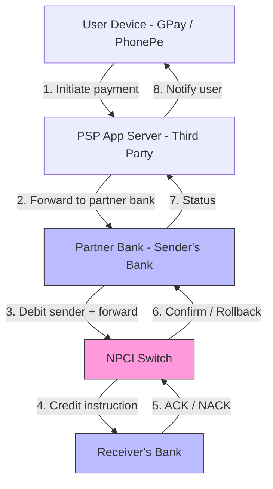
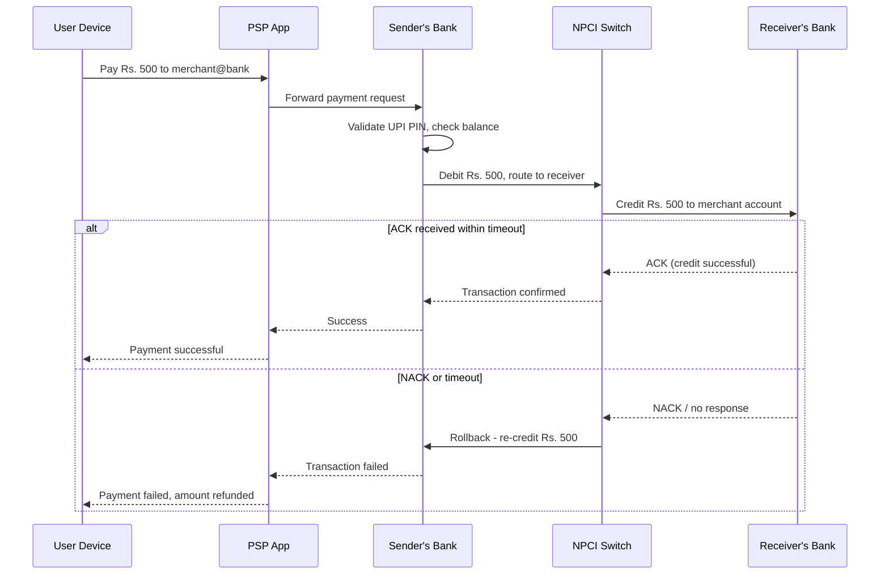

# UPI Payments

## 1. Overview

The Unified Payments Interface (UPI) is India's national real-time payment infrastructure, orchestrated by the National Payments Corporation of India (NPCI). It enables instant bank-to-bank transfers via a simple Virtual Payment Address (VPA), abstracting away the complexity of account numbers and IFSC codes. The architectural distinction of UPI lies in its **closed-loop ecosystem** -- third-party apps like Google Pay or PhonePe cannot communicate with NPCI directly. They must route through a licensed partner bank, creating a layered trust model that balances innovation (any app can build a UPI interface) with regulatory control (all transactions flow through the banking network). UPI is a canonical study in distributed transaction integrity, multi-party orchestration, and rollback on acknowledgment failure.

## 2. Requirements

### Functional Requirements
- Users can link their bank accounts via a VPA (e.g., `name@bankhandle`).
- Users can send money to another VPA (push / pay transaction).
- Users can request money from another VPA (pull / collect transaction).
- Users can check their account balance.
- Users receive transaction confirmations and failure notifications.
- Merchants can generate QR codes or deep links for payment collection.

### Non-Functional Requirements
- **Scale**: 10B+ transactions per month (as of 2024); peak throughput of 100K+ TPS.
- **Latency**: End-to-end transaction completion in < 5 seconds.
- **Availability**: 99.99% uptime. Payment failures erode trust irreversibly.
- **Consistency**: Strong consistency is non-negotiable. A debit without a corresponding credit is a catastrophic failure. Money must never be "lost in transit."
- **Security**: End-to-end [encryption](../security/encryption.md) in transit (TLS 1.3); multi-factor [authentication](../security/authentication-authorization.md) (device binding, UPI PIN).

## 3. High-Level Architecture



## 4. Core Design Decisions

### Closed-Loop Ecosystem via Partner Banks
NPCI operates a restricted network that only communicates with licensed banks. Third-party Payment Service Providers (PSPs) like Google Pay or PhonePe provide the user interface but **cannot directly touch the NPCI switch**. Every request must flow through a partner bank (e.g., Axis Bank for Google Pay, ICICI for PhonePe). This creates a trust boundary:

- The PSP handles user experience, authentication, and request initiation.
- The partner bank handles regulatory compliance, KYC, and NPCI communication.
- NPCI handles inter-bank routing and settlement.

This layered model is analogous to the [API gateway](../architecture/api-gateway.md) pattern at a national scale -- the partner bank acts as a gateway that validates, authenticates, and routes requests into the secure NPCI network.

### Virtual Payment Address (VPA)
The VPA (`user@bankhandle`) replaces the traditional account number + IFSC combination. It is a human-readable alias that maps to a specific bank account within the NPCI registry. This abstraction:
- Simplifies the user experience (no need to share account details).
- Enhances security (account numbers are never exposed to third parties).
- Enables portability (a user can change their underlying bank without changing their VPA).

### Push/Pull Transaction Model
UPI supports two transaction flows:
- **Push (Pay)**: Sender initiates and debits their account. Money flows from sender to receiver.
- **Pull (Collect)**: Receiver initiates a request. The sender's bank presents it for approval. Once approved, money flows from sender to receiver.

Both flows converge on the same NPCI switch for routing.

### Rollback on ACK Failure
The most critical architectural pattern is the acknowledgment-based rollback. In the push flow, NPCI debits the sender's bank first, then instructs the receiver's bank to credit. If the receiver's bank fails to acknowledge the credit within the timeout window, NPCI triggers an automatic rollback -- re-crediting the sender's account. This is a specific application of [compensating transactions within a saga pattern](../resilience/distributed-transactions.md).

## 5. Deep Dives

### 5.1 The Push Transaction Lifecycle



**Key timing guarantees:**
- The NPCI timeout for receiver bank acknowledgment is typically 30 seconds.
- If no response is received within this window, the system assumes failure and rolls back.
- The sender sees the amount restored in their account within minutes (though settlement may take up to 48 hours in edge cases).

### 5.2 Multi-Party Transaction Integrity

UPI's transaction integrity is achieved without a traditional [two-phase commit](../resilience/distributed-transactions.md) (which would require all parties to be synchronously available). Instead, it uses a **saga-like orchestrated pattern**:

1. **Debit phase**: Sender's bank debits the account and marks the transaction as "pending."
2. **Credit phase**: NPCI instructs receiver's bank to credit.
3. **Confirmation phase**: On ACK, both sides mark the transaction as "completed." On NACK/timeout, the compensating action (re-credit) fires automatically.

The NPCI switch acts as the **orchestrator** in this saga. It maintains the transaction state machine and is responsible for triggering compensating transactions on failure.

**Why not 2PC?** A two-phase commit requires all participants to hold locks until the coordinator confirms. In a system processing 100K+ TPS across thousands of bank nodes, holding distributed locks is impractical. The saga pattern with compensating transactions provides eventual consistency without the coordination overhead of 2PC.

### 5.3 VPA Resolution and Routing

When a user sends money to `merchant@axisbank`:

1. The PSP sends the VPA to the partner bank.
2. The partner bank forwards to NPCI.
3. NPCI resolves the VPA to identify the receiver's bank (the `@axisbank` handle maps to Axis Bank).
4. NPCI queries the receiver's bank to validate that the VPA is active and mapped to a valid account.
5. Once validated, the credit instruction is sent to the receiver's bank.

VPA resolution is essentially a **distributed directory lookup** maintained by NPCI. Each bank manages the VPA-to-account mapping for its own customers. NPCI maintains the handle-to-bank routing table.

### 5.4 Security and Authentication Layers

UPI employs defense-in-depth [authentication](../security/authentication-authorization.md):

1. **Device binding**: The UPI app is bound to a specific device + SIM combination. Transactions from unregistered devices are rejected. The binding is verified through a one-time SMS-based authentication during registration.
2. **UPI PIN**: A 4-6 digit PIN entered for every transaction. This is encrypted on-device using the bank's public key and decrypted only at the issuing bank -- the PSP and NPCI never see the plaintext PIN. This ensures that even a compromised PSP server cannot extract the user's PIN.
3. **Transaction signing**: Each request is digitally signed by the PSP and counter-signed by the bank, creating a non-repudiable audit trail. If a dispute arises, the cryptographic signatures prove which party initiated and approved the transaction.
4. **Encryption in transit**: All communication between PSP, bank, and NPCI uses [TLS 1.3](../security/encryption.md). Additionally, the NPCI network is a private, air-gapped network -- it is not accessible from the public internet.
5. **Transaction amount limits**: Per-transaction limits (typically Rs. 1,00,000 for P2P and Rs. 2,00,000 for merchant payments) and daily aggregate limits provide a safety net against compromised accounts.

### 5.5 The Pull (Collect) Transaction Flow

Unlike the push flow where the sender initiates, the pull flow is receiver-initiated:

1. A merchant generates a collect request (e.g., "Pay Rs. 500 to merchant@bank").
2. The request is routed through the merchant's PSP -> partner bank -> NPCI -> sender's bank.
3. The sender's bank presents the collect request as a notification on the sender's app.
4. The sender reviews and approves with their UPI PIN.
5. The sender's bank debits the sender and notifies NPCI.
6. NPCI instructs the merchant's bank to credit.
7. The standard ACK/rollback logic applies from this point.

**Key security concern**: Collect requests can be spoofed (fraudsters send fake "pay me" requests). The sender's app must clearly display the request source and amount, and the user must explicitly authenticate. Never auto-approve collect requests.

### 5.6 Reconciliation and Settlement

While individual transactions complete in seconds, the financial settlement between banks happens in batches:

1. **Real-time clearing**: NPCI records each transaction in real-time, updating a running net position between each bank pair.
2. **Hourly net settlement**: Every hour, NPCI calculates the net amount each bank owes or is owed by every other bank. If Axis Bank users sent Rs. 100Cr to HDFC Bank users and HDFC users sent Rs. 80Cr to Axis, the net settlement is Rs. 20Cr from Axis to HDFC.
3. **End-of-day reconciliation**: Banks independently reconcile their transaction logs against NPCI's ledger. Discrepancies trigger investigation and manual resolution.
4. **Dispute resolution**: If a sender's bank debited but the receiver's bank never credited (and the rollback also failed), the dispute enters an escalation path with NPCI arbitrating based on cryptographic transaction logs.

This multi-layered reconciliation ensures that money never permanently disappears, even when individual transactions fail at intermediate steps.

## 6. Data Model

### Transaction Record (at NPCI)
```
transaction_id:    UUID PK
sender_vpa:        VARCHAR
receiver_vpa:      VARCHAR
amount_paise:      BIGINT
currency:          ENUM('INR')
sender_bank_code:  VARCHAR
receiver_bank_code: VARCHAR
status:            ENUM('initiated', 'debited', 'credited', 'completed', 'failed', 'rolled_back')
initiated_at:      TIMESTAMP
completed_at:      TIMESTAMP (nullable)
failure_reason:    VARCHAR (nullable)
```

### VPA Registry (per bank)
```
vpa:              VARCHAR PK (e.g., user@bankhandle)
account_number:   VARCHAR (encrypted)
ifsc_code:        VARCHAR
user_id:          UUID FK
status:           ENUM('active', 'suspended', 'deleted')
created_at:       TIMESTAMP
```

### PSP Request Log
```
request_id:        UUID PK
psp_transaction_id: UUID
user_device_id:    VARCHAR
partner_bank_ref:  VARCHAR
npci_ref_id:       VARCHAR (nullable)
status:            ENUM('submitted', 'in_progress', 'success', 'failed')
created_at:        TIMESTAMP
```

### Bank Ledger Entry (per bank, per transaction)
```
ledger_entry_id:   UUID PK
transaction_id:    UUID FK
account_number:    VARCHAR (encrypted)
entry_type:        ENUM('debit', 'credit', 'reversal')
amount_paise:      BIGINT
balance_before:    BIGINT
balance_after:     BIGINT
created_at:        TIMESTAMP
```

### NPCI Routing Table
```
bank_handle:       VARCHAR PK (e.g., "axisbank", "icici")
bank_code:         VARCHAR
switch_endpoint:   VARCHAR
max_tps:           INTEGER
current_status:    ENUM('active', 'degraded', 'down')
last_health_check: TIMESTAMP
```

### API Endpoints (PSP to Partner Bank)

```
POST /upi/pay
  Body: { sender_vpa, receiver_vpa, amount, upi_pin_encrypted, device_fingerprint }
  Response: { transaction_id, status, timestamp }

POST /upi/collect
  Body: { requester_vpa, payer_vpa, amount, note }
  Response: { collect_request_id, status }

GET /upi/transaction/{transaction_id}
  Response: { transaction_id, status, amount, sender_vpa, receiver_vpa, timestamp }

GET /upi/balance
  Headers: Authorization + device_fingerprint
  Body: { vpa, upi_pin_encrypted }
  Response: { balance, last_updated }
```

All endpoints require mutual TLS authentication between the PSP and the partner bank. The UPI PIN is encrypted with the bank's public key and is opaque to the PSP server.

## 7. Scaling Considerations

### NPCI Switch Throughput
The NPCI switch is a centralized bottleneck by design (regulatory requirement). It scales through horizontal partitioning of transaction processing across multiple switch instances, routed by bank pair. The switch architecture is modeled as a high-availability active-active cluster with geographic redundancy across data centers.

At 100K+ TPS, the switch processes approximately 10B transactions/day. Each transaction involves at least 4 hops (PSP->bank->NPCI->bank) with sub-second latency targets. The switch maintains an in-memory transaction state machine for each active transaction, with persistent logging for audit and reconciliation.

### Bank Integration Variability
Each bank implements the UPI specification independently. Performance varies wildly -- large private banks (HDFC, ICICI) handle 10K+ TPS, while smaller banks struggle at 1K TPS. NPCI monitors per-bank latency and transaction success rates. Banks that consistently fail to meet SLAs face penalties and may have their throughput allocation reduced.

NPCI publishes a monthly "UPI Ecosystem Performance" report that ranks banks by transaction success rate and average response time, creating competitive pressure for improvement.

### PSP Scaling
PSP app servers are standard [horizontally scaled](../fundamentals/scaling-overview.md) stateless services behind [load balancers](../scalability/load-balancing.md). Google Pay, for example, handles hundreds of millions of users with a conventional [microservices](../architecture/microservices.md) architecture. The PSP's partner bank is the actual bottleneck, not the PSP app itself.

### Peak Handling
Festivals (Diwali), bill payment deadlines, and promotional campaigns (e.g., cashback offers) create massive spikes. NPCI pre-scales infrastructure for known events, and banks provision additional capacity:
- **Diwali peak**: Transaction volume can spike 3-5x above normal.
- **Month-end rent/EMI**: Predictable spike on 1st-5th of each month.
- **IPL cricket matches**: In-app betting and merchandise purchases create concentrated bursts.

### Settlement Efficiency
Net settlement dramatically reduces inter-bank transfer volume. If 1,000 banks each settled independently, there would be 1M bank-to-bank transfers. Net settlement reduces this to ~1,000 net transfers, with each bank paying or receiving a single net amount to/from NPCI's settlement account.

## 8. Back-of-Envelope Estimation

**Transaction throughput:**
- 10B transactions/month = ~333M transactions/day
- QPS average: 333M / 86,400 = ~3,858 TPS
- Peak (Diwali, 5x average): ~19,000 TPS
- NPCI switch must handle ~20K TPS at peak with < 1 second per transaction

**Transaction data volume:**
- Each transaction record: ~500 bytes (IDs, VPAs, amount, timestamps, signatures)
- Daily: 333M x 500B = ~167GB/day
- Monthly: ~5TB
- Annual (with all parties' copies): ~60TB across the ecosystem

**PSP app server load:**
- Google Pay: ~150M MAU in India
- Average 5 transactions/user/month = 750M transactions/month from GPay alone
- Peak hours (10am-2pm, 6pm-10pm): 60% of daily volume in 8 hours
- GPay peak QPS: ~3,500 TPS

**VPA resolution:**
- Each transaction requires 1-2 VPA resolutions (sender and receiver)
- 20K TPS x 2 = 40K VPA lookups/sec
- VPA registry must support 40K+ reads/sec (cacheable with short TTL)

**Latency budget per transaction:**
```
PSP app -> Partner bank:     50ms
Partner bank processing:     100ms
Partner bank -> NPCI:        50ms
NPCI switch processing:      100ms
NPCI -> Receiver bank:       50ms
Receiver bank processing:    200ms
Receiver bank -> NPCI (ACK): 50ms
NPCI -> Partner bank:        50ms
Partner bank -> PSP:         50ms
Total:                       ~700ms (well within 5-second target)
```

The 5-second SLA provides significant headroom for retries and slow bank responses. Most transactions complete in < 1 second.

## 9. Failure Modes & Mitigations

| Failure | Impact | Mitigation |
|---------|--------|------------|
| Receiver bank timeout | Sender debited but receiver not credited | NPCI auto-rollback triggers re-credit to sender within timeout window |
| NPCI switch overload | Transaction failures across all banks | Rate limiting per PSP/bank; graceful degradation with queued retries |
| PSP partner bank outage | Users of that PSP cannot transact | Users can switch PSP apps (VPA is bank-bound, not PSP-bound) |
| Double-debit due to retry | Sender charged twice | Idempotency via unique transaction_id; banks check for duplicate refs before processing |
| Network partition between NPCI and bank | Transaction state becomes ambiguous | Reconciliation batch jobs run every hour to detect and resolve mismatches |
| Device compromise | Unauthorized transactions | Device binding + UPI PIN + transaction limits + fraud detection ML models |
| Reconciliation mismatch | Bank and NPCI records disagree | Automated mismatch detection flags discrepancies; manual resolution with cryptographic proof from transaction signatures |
| PSP outage | Users cannot initiate transactions | Users switch to a different PSP app (the VPA is bank-bound, not PSP-bound); partner bank remains functional for direct access |
| Peak overload (Diwali) | Transaction timeouts increase | Pre-scaled infrastructure + per-PSP rate limiting + graceful queueing with retry |

## 10. Key Takeaways

- The closed-loop ecosystem (PSP -> Partner Bank -> NPCI -> Receiver Bank) is a regulatory-driven architectural pattern that separates innovation (PSP layer) from trust (banking layer). This is analogous to the [API gateway](../architecture/api-gateway.md) pattern at national infrastructure scale.
- VPA abstraction decouples the user-facing identifier from the underlying bank account, enabling portability and privacy. Users never need to share sensitive account details with anyone.
- Rollback on ACK failure implements a [saga pattern](../resilience/distributed-transactions.md) where NPCI is the orchestrator. This avoids the impracticality of distributed two-phase commits at 100K+ TPS.
- Strong consistency for financial transactions is achieved through compensating transactions (re-crediting on failure), not distributed locking. The system is designed so money is never "stuck" -- it either reaches the recipient or returns to the sender.
- Defense-in-depth security (device binding, UPI PIN, transaction signing, TLS) creates multiple barriers against compromise. No single layer's failure exposes the user.
- The centralized NPCI switch is a deliberate regulatory design choice that trades horizontal scalability for auditability, compliance, and centralized dispute resolution.
- Reconciliation at multiple levels (hourly net settlement, end-of-day bank reconciliation) ensures that even if individual transactions fail at intermediate steps, the financial system as a whole remains consistent.
- The PSP model enables rapid innovation (any company can build a UPI-compatible app) while maintaining regulatory control (all transactions flow through licensed banks). This separation of concerns is a key architectural insight applicable to any regulated domain.

## 11. Related Concepts

- [Distributed transactions (saga pattern, compensating transactions, 2PC comparison)](../resilience/distributed-transactions.md)
- [Encryption (TLS 1.3, encryption at rest and in transit)](../security/encryption.md)
- [Authentication and authorization (multi-factor auth, device binding)](../security/authentication-authorization.md)
- [API gateway (partner bank as a regulatory gateway)](../architecture/api-gateway.md)
- [Rate limiting (NPCI throttling per PSP/bank)](../resilience/rate-limiting.md)
- [Circuit breaker (handling bank outages gracefully)](../resilience/circuit-breaker.md)
- [Load balancing (PSP horizontal scaling)](../scalability/load-balancing.md)
- [Scaling overview (horizontal scaling of stateless PSP services)](../fundamentals/scaling-overview.md)

## 12. Comparison with Related Payment Systems

| Aspect | UPI (India) | ACH (US) | Card Networks (Visa/MC) | Mobile Wallets (PayPal) |
|--------|------------|----------|------------------------|----------------------|
| Settlement speed | Real-time | 1-3 business days | 1-2 business days | Instant (within wallet) |
| Intermediary | NPCI (centralized switch) | Federal Reserve | Visa/MC network | PayPal servers |
| Addressing | VPA (human-readable) | Account + routing number | Card number (PAN) | Email / phone |
| Cost | Free for consumers | $0.20-0.50 per transaction | 1.5-3% merchant fee | 2.9% + $0.30 |
| Offline capability | None | None | Contactless (NFC) | Limited |
| Security model | Device binding + UPI PIN | Account credentials | EMV chip + PIN | Password + 2FA |
| Consistency model | Saga with compensating txns | Batch processing | Authorization + settlement | Internal ledger |

UPI's most distinctive feature compared to Western payment systems is the combination of **real-time settlement** and **zero consumer cost**. The economic model is subsidized by the Indian government to drive financial inclusion, which is why transaction fees are not charged to consumers -- a fundamentally different approach from card networks that charge merchants 1.5-3% per transaction.

### Architectural Lessons for Other Regulated Domains

UPI's architecture offers transferable patterns for any regulated multi-party system:

1. **Gateway pattern at regulatory boundaries**: The partner bank acts as a gateway between the unregulated (PSP) and regulated (NPCI) domains. This pattern applies to healthcare (EHR gateways), securities trading (exchange gateways), and telecommunications (carrier interconnects).

2. **Saga over 2PC for high-throughput multi-party transactions**: At 100K+ TPS, holding distributed locks across multiple autonomous organizations (banks) is impractical. Compensating transactions (rollback on NACK) provide equivalent consistency without the coordination overhead.

3. **Layered reconciliation**: Real-time optimistic processing with periodic batch reconciliation is a pattern that scales to any domain where 100% real-time accuracy is impractical but eventual accuracy is mandatory.

4. **Centralized orchestrator with decentralized execution**: NPCI routes and orchestrates, but each bank processes transactions independently. This hybrid provides auditability (centralized logs) without creating a performance bottleneck (processing is distributed).

### Monitoring and Observability

UPI's monitoring stack must track transaction health across multiple autonomous organizations:

- **Success rate by bank pair**: If transactions from Axis Bank to HDFC suddenly drop below 95% success rate, NPCI triggers an investigation.
- **Latency percentiles per hop**: P50, P95, P99 latency for each segment (PSP->bank, bank->NPCI, NPCI->receiver bank, receiver bank ACK). This identifies which party is causing slowdowns.
- **Transaction volume anomaly detection**: Sudden spikes (DoS attack) or drops (system failure) trigger automated alerts.
- **Rollback rate tracking**: An increase in ACK-failure rollbacks may indicate receiver bank infrastructure issues.
- **Reconciliation mismatch rate**: The daily mismatch rate between banks and NPCI should be < 0.001%. Higher rates trigger mandatory investigation.

All monitoring data is shared between NPCI and participating banks via secure dashboards, creating transparency and accountability across the ecosystem.

NPCI also publishes a monthly "UPI Ecosystem Performance" report that ranks PSPs and banks by success rate, average response time, and downtime. This public accountability mechanism creates competitive pressure for infrastructure improvement across the ecosystem.

## 13. Source Traceability

| Section | Source |
|---------|--------|
| Closed-loop ecosystem, PSP model, VPA | YouTube Report 2 (Section 9), YouTube Report 3 (Section 6) |
| Push/pull transactions, ACK-based rollback | YouTube Report 2 (Section 9) |
| Partner bank requirement (app cannot talk to NPCI directly) | YouTube Report 3 (Section 6) |
| Transaction integrity and saga pattern | YouTube Report 4 (Section 3: 2PC and Saga), Acing System Design Ch. 7 |
| Payment system design patterns | Alex Xu Vol 2, Chapter 12 |
