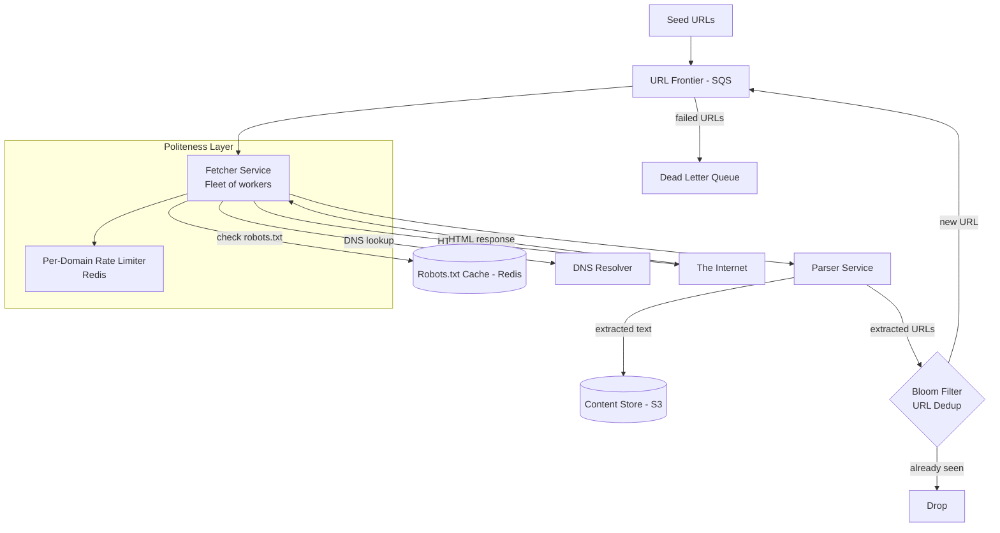
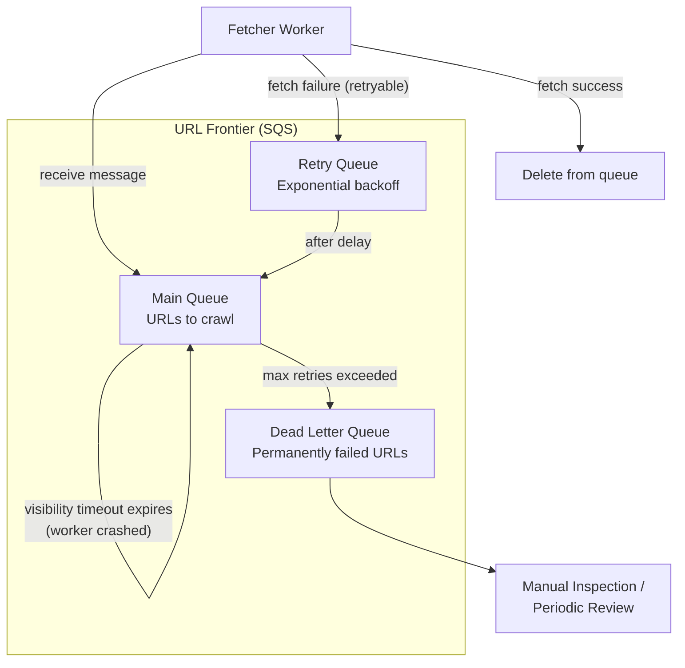

# Web Crawler

## 1. Overview

A web crawler is a system that systematically browses the internet, downloading web pages and extracting their content for indexing by a search engine. The scale is immense: crawling 10 billion pages in 5 days requires sustained throughput of ~23,000 pages per second. The core challenges are managing a massive URL frontier (the queue of URLs to crawl), enforcing politeness constraints (respecting `robots.txt` and per-domain rate limits), deduplicating billions of URLs without storing them all in memory, and handling the inevitable failures of a system that makes millions of outbound HTTP requests per day. A web crawler is a canonical study in URL frontier design, Bloom filter deduplication, SQS with exponential backoff, and bandwidth-driven capacity planning.

## 2. Requirements

### Functional Requirements
- Crawl web pages starting from a seed set of URLs.
- Extract text content, metadata, and outbound links from each page.
- Store crawled content for downstream indexing.
- Respect `robots.txt` directives and per-domain rate limits (politeness).
- Avoid re-crawling the same URL within a configurable window.
- Detect and skip duplicate or near-duplicate content.

### Non-Functional Requirements
- **Scale**: Crawl 10 billion pages in 5 days (~23,000 pages/sec sustained).
- **Bandwidth**: Average page size ~100KB. At 23K pages/sec: ~2.3 GB/sec = ~18.4 Gbps sustained.
- **Storage**: 10B pages x 100KB = 1PB of raw page content.
- **Fault tolerance**: Individual page fetch failures must not stall the crawler. Failed URLs retry with backoff.
- **Politeness**: Maximum 1 request per second per domain (configurable). Respect `robots.txt` exclusions.
- **Freshness**: Popular pages re-crawled every 24-48 hours; long-tail pages every 30 days.

## 3. High-Level Architecture



## 4. Core Design Decisions

### SQS as URL Frontier (Over Kafka)
The URL frontier is the central queue of URLs waiting to be crawled. [Amazon SQS](../messaging/message-queues.md) is preferred over Kafka for this use case because:

- **Visibility timeout**: When a worker picks up a URL, SQS hides it for a configurable duration. If the worker crashes without completing the fetch, the URL automatically reappears after the timeout. This is built-in retry logic.
- **Exponential backoff**: For URLs that fail repeatedly (server errors, timeouts), the visibility timeout increases exponentially (30s -> 2min -> 5min -> ...), preventing the crawler from hammering a broken server.
- **Dead Letter Queue (DLQ)**: After N failed attempts, the URL is moved to a DLQ for manual inspection, preventing permanently broken URLs from clogging the frontier.

Kafka would require manual implementation of retry topics, delay queues, and DLQ routing. SQS provides all of this natively.

### Bloom Filters for URL Deduplication
With 10 billion URLs to track, storing the full URL set in memory or a database is impractical. A [Bloom filter](../patterns/probabilistic-data-structures.md) provides space-efficient set membership testing:

- A Bloom filter with a 1% false positive rate uses ~9.6 bits per element.
- For 10B URLs: 9.6 x 10B = 96 billion bits = 12GB. This fits in memory on a single large instance.
- When a newly discovered URL is checked against the Bloom filter, it returns "definitely not seen" (safe to crawl) or "probably seen" (skip).
- The 1% false positive rate means ~100M valid URLs are incorrectly skipped -- acceptable for a web crawler that will re-crawl in the next cycle.

### Politeness via robots.txt and Domain Rate Limiting
Politeness is not optional -- aggressive crawling gets IP-blocked and violates web standards.

- **robots.txt**: Before crawling any page on a domain, the fetcher checks the cached `robots.txt` for that domain (cached in [Redis](../caching/redis.md) with a 24-hour TTL). Disallowed paths are skipped.
- **Per-domain rate limiting**: A [Redis-based rate limiter](../caching/redis.md) enforces a maximum request rate per domain (e.g., 1 request/second). The fetcher checks `domain_rate:{domain}` before issuing each request.

### Direct-to-S3 Content Storage
Crawled page content is stored in [S3](../storage/object-storage.md) for downstream indexing. Pages are keyed by a hash of the URL, enabling fast deduplication checks at the content level (two different URLs serving identical content).

## 5. Deep Dives

### 5.1 URL Frontier Design with SQS



**Visibility timeout strategy:**
- First attempt: 30-second visibility timeout.
- Second attempt: 2-minute timeout.
- Third attempt: 5-minute timeout.
- Fourth attempt: 15-minute timeout.
- Fifth attempt (final): Move to DLQ.

This [exponential backoff](../resilience/circuit-breaker.md) pattern prevents the crawler from overwhelming a temporarily down server and gives transient failures time to resolve.

### 5.2 Bandwidth Math and Capacity Planning

This is a critical [back-of-envelope estimation](../fundamentals/back-of-envelope-estimation.md) for the crawler design.

**Target**: 10 billion pages in 5 days.

**Pages per second:**
```
10,000,000,000 pages / (5 days x 86,400 sec/day)
= 10B / 432,000 sec
= ~23,148 pages/sec
```

**Bandwidth required:**
```
23,148 pages/sec x 100KB/page
= 2.3 GB/sec
= 18.4 Gbps sustained
```

**Network instances needed:**
A high-end cloud instance (e.g., AWS c5n.18xlarge) provides ~100 Gbps network bandwidth. However, real-world efficiency is ~30% due to DNS resolution overhead, TCP handshake latency, `robots.txt` checks, and per-domain rate limits.

```
Effective throughput per instance: 100 Gbps x 0.3 = 30 Gbps
Effective pages/sec per instance: 30 Gbps / (100KB x 8 bits/byte) = ~37,500 pages/sec

Theoretically, a single instance suffices. But real-world fetch latency
(~200ms per page including DNS) limits us:

Concurrent connections per instance: ~10,000 (practical limit)
Pages/sec per instance: 10,000 connections / 0.2 sec = ~50,000 pages/sec

Accounting for politeness delays and DNS: ~10,000 pages/sec per instance.
Instances needed: 23,148 / 10,000 = ~3-4 instances (rounded up to 4).
```

**DNS bottleneck mitigation**: DNS resolution adds ~50ms per new domain. The crawler maintains a local DNS cache in Redis and uses multiple DNS providers to avoid rate limiting by any single provider.

### 5.3 Content Deduplication

Beyond URL deduplication (Bloom filter), the crawler must also detect duplicate content served at different URLs (e.g., `www.example.com` and `example.com`, or URL parameters that don't change content).

**Strategy:**
1. After fetching a page, compute a SimHash or MinHash fingerprint of the content.
2. Compare the fingerprint against a store of previously seen fingerprints.
3. If the fingerprint matches an existing page (above a similarity threshold), mark the new URL as a duplicate and skip indexing.

This content-level deduplication complements URL-level Bloom filter deduplication and catches cases the Bloom filter cannot (same content, different URLs).

### 5.4 Crawl Prioritization

Not all URLs are equally valuable. The frontier implements priority-based scheduling:

- **High priority**: Homepage of major news sites, frequently updated pages.
- **Medium priority**: Interior pages of high-authority domains.
- **Low priority**: Deep-linked pages with few inbound references.

Priority is determined by:
- **PageRank-like score**: Pages with more inbound links are crawled more frequently.
- **Freshness signal**: Pages that change frequently (detected by comparing content fingerprints across crawls) are re-crawled more often.
- **Domain authority**: Established domains receive higher base priority.

SQS does not natively support priority queues, so the crawler uses multiple SQS queues (high/medium/low priority) with fetcher workers consuming from the high-priority queue first.

### 5.5 Fetcher Worker Architecture

Each fetcher worker runs an async I/O event loop (e.g., Python asyncio, Java NIO, or Go goroutines) to manage thousands of concurrent HTTP connections:

```
Fetcher Worker Process:
1. Pull batch of N URLs from SQS (N = 100-500)
2. For each URL in parallel:
   a. Check politeness: domain rate limiter in Redis
   b. If rate-limited, delay this URL (re-enqueue with visibility timeout)
   c. Check robots.txt cache in Redis
   d. If disallowed, skip URL and delete from SQS
   e. Resolve DNS (check local cache first)
   f. Issue HTTP GET with timeout (10 seconds)
   g. On success: forward response to parser service
   h. On failure: let SQS visibility timeout handle retry
3. Acknowledge processed messages in SQS (batch delete)
```

**Connection pooling**: Fetchers maintain persistent HTTP connection pools per domain, reusing TCP connections to avoid the overhead of repeated TLS handshakes. For domains being crawled repeatedly (which is common for large sites), connection reuse reduces fetch latency by ~100ms per request.

**User-Agent identification**: The crawler identifies itself via a custom User-Agent header (e.g., `MySearchBot/1.0`) and includes a URL pointing to a page that explains the crawler's purpose and provides an opt-out mechanism. This is both an ethical requirement and a practical one -- servers that cannot identify the crawler may block it.

### 5.6 URL Normalization

Before inserting a discovered URL into the Bloom filter or the frontier, the crawler normalizes it to prevent duplicate crawls of the same content at different URLs:

1. **Protocol normalization**: `http://` and `https://` versions of the same URL are treated as one.
2. **Trailing slash**: `example.com/path` and `example.com/path/` are canonicalized.
3. **Parameter sorting**: `?b=2&a=1` is sorted to `?a=1&b=2`.
4. **Fragment removal**: `#section1` is stripped (fragments are client-side only).
5. **Default port removal**: `:80` for HTTP and `:443` for HTTPS are stripped.
6. **Percent encoding normalization**: `%7E` is decoded to `~` where safe.

Normalization happens before the Bloom filter check, ensuring that URL variants do not bypass deduplication.

## 6. Data Model

### URL Frontier (SQS Message)
```json
{
  "url": "https://example.com/page",
  "domain": "example.com",
  "priority": "high",
  "depth": 3,
  "discovered_at": "2024-01-15T10:00:00Z",
  "retry_count": 0,
  "parent_url": "https://example.com/"
}
```

### Crawled Page (S3)
```
Key:    pages/{sha256(url)}
Value:  raw HTML content
Metadata:
  url:              String
  crawled_at:       Timestamp
  content_hash:     String (SimHash fingerprint)
  http_status:      Integer
  content_length:   Integer
```

### robots.txt Cache (Redis)
```
Key:   robots:{domain}
Value: parsed robots.txt rules (serialized)
TTL:   86400 (24 hours)
```

### Domain Rate Limiter (Redis)
```
Key:   domain_rate:{domain}
Value: last_request_timestamp
TTL:   2 seconds
```

### Bloom Filter (In-Memory)
```
Size:       12GB (for 10B URLs at 1% FP rate)
Hash functions: 7 (optimal for 1% FP rate)
Structure:  bit array with multiple hash projections
Persistence: checkpointed to disk every hour for crash recovery
```

### Crawl Metadata (Postgres or DynamoDB)
```
url_hash:          VARCHAR(64) PK (SHA-256 of normalized URL)
original_url:      TEXT
domain:            VARCHAR
last_crawled_at:   TIMESTAMP
content_hash:      VARCHAR(64) (SimHash fingerprint)
http_status:       INTEGER
page_size_bytes:   INTEGER
outbound_link_count: INTEGER
crawl_depth:       INTEGER
priority:          ENUM('high', 'medium', 'low')
retry_count:       INTEGER
```

### Parser Output (Kafka -> Downstream)
```
Topic: parsed_pages
Key:   url_hash
Value: {
  url:            string,
  title:          string,
  text_content:   string (extracted, cleaned),
  outbound_urls:  [string] (discovered links),
  meta_tags:      map<string, string>,
  language:       string,
  crawled_at:     timestamp,
  content_hash:   string
}
```

This parsed output feeds the downstream search indexing pipeline, which builds the inverted index used by the search engine's query service.

## 7. Scaling Considerations

### Fetcher Fleet
Horizontally scaled to 4-10 instances depending on target crawl rate. Each instance runs thousands of concurrent HTTP connections using async I/O. Instances are deployed in multiple availability zones to prevent a single-AZ failure from halting the entire crawl.

Fetcher instances are stateless -- they pull URLs from SQS and push results to S3. This means they can be run as spot instances (saving 60-80% on compute costs) with graceful handling of spot terminations (in-flight URLs automatically return to SQS after visibility timeout).

### URL Frontier (SQS)
SQS scales automatically -- no partition management needed. This is a key advantage over Kafka. SQS provides:
- Automatic message retention (up to 14 days).
- Built-in dead letter queue integration.
- No broker management or partition rebalancing.
- Pay-per-message pricing (cost-effective for bursty workloads).

The trade-off is that SQS provides at-least-once delivery (not exactly-once), which means a URL may be fetched twice in rare cases. This is acceptable for a crawler -- re-fetching a page is a minor waste, not a correctness problem.

### Bloom Filter Distribution
At 12GB, the Bloom filter fits on a single large instance (e.g., r5.4xlarge with 128GB RAM). For crawls exceeding 100B URLs, the filter can be distributed across a [Redis cluster](../caching/redis.md) with each node handling a range of hash values. Alternatively, multiple independent Bloom filters can be used (one per URL domain prefix), reducing the per-filter size.

### Content Storage
[S3](../storage/object-storage.md) scales to exabytes. No manual sharding required. Crawled pages are keyed by `sha256(normalized_url)`, providing natural distribution across S3's internal partitions.

Storage lifecycle policies move older crawl data to S3 Glacier after 30 days (reducing cost by 90%) and delete it entirely after 1 year (unless marked for long-term archival).

### DNS Resolution
Multiple DNS providers (Google DNS, Cloudflare, Route53) are used in rotation to avoid per-provider rate limits. A local DNS cache in Redis reduces lookup frequency by 90%+. DNS TTLs are respected -- entries expire and are re-resolved according to the authoritative server's TTL setting.

For domains with very short TTLs (e.g., CDN-backed domains that rotate IPs frequently), the crawler maintains a separate short-TTL cache that refreshes more aggressively.

## 8. Failure Modes & Mitigations

| Failure | Impact | Mitigation |
|---------|--------|------------|
| Fetcher worker crash | In-flight URLs lost for that worker | SQS visibility timeout auto-requeues the URL after timeout |
| Target server returns 5xx | Page not crawled | [Exponential backoff](../resilience/circuit-breaker.md) via SQS retry with increasing visibility timeout |
| Target server blocks crawler IP | Domain becomes uncrawlable | IP rotation; DLQ captures blocked domains for review |
| DNS provider rate limits crawler | DNS lookups fail | Multiple DNS providers; local DNS cache in Redis |
| Bloom filter false positive | Valid URL incorrectly skipped | Acceptable at 1% rate; URL will be discovered again in next crawl cycle |
| S3 write failure | Crawled content lost | Retry with exponential backoff; SQS message not deleted until S3 write confirmed |
| Bloom filter memory corruption | Massive dedup failures | Bloom filter is periodically checkpointed to disk; rebuild from URL log on corruption |

## 9. Key Takeaways

- SQS provides built-in visibility timeouts, exponential backoff, and DLQ -- all essential for a crawler's retry semantics. Kafka requires manual implementation of these patterns.
- Bloom filters enable O(1) URL deduplication for 10B+ URLs using only ~12GB of memory. The 1% false positive rate is an acceptable trade-off for a system that re-crawls periodically.
- Politeness is a hard constraint, not an optimization. Respecting `robots.txt` and per-domain rate limits prevents IP blocks and is ethically required.
- Bandwidth math drives architecture: 10B pages in 5 days requires ~18.4 Gbps sustained throughput, which dictates the fetcher fleet size (3-4 high-bandwidth instances).
- Content-level deduplication (SimHash) catches duplicates that URL-level deduplication (Bloom filter) misses, such as the same content served at multiple URLs.
- Priority-based crawling ensures the most valuable pages are always fresh, even when the crawler cannot keep up with the full URL frontier.

## 10. Related Concepts

- [Probabilistic data structures (Bloom filters for URL dedup)](../patterns/probabilistic-data-structures.md)
- [Message queues (SQS for URL frontier, visibility timeout, DLQ)](../messaging/message-queues.md)
- [Circuit breaker (exponential backoff with jitter for failed fetches)](../resilience/circuit-breaker.md)
- [Back-of-envelope estimation (bandwidth math, pages/sec, fleet sizing)](../fundamentals/back-of-envelope-estimation.md)
- [Object storage (S3 for crawled page content)](../storage/object-storage.md)
- [Redis (robots.txt cache, domain rate limiter, DNS cache)](../caching/redis.md)
- [Search and indexing (downstream inverted index for crawled content)](../patterns/search-and-indexing.md)
- [Rate limiting (per-domain politeness enforcement)](../resilience/rate-limiting.md)

## 11. Comparison with Related Data Pipeline Systems

| Aspect | Web Crawler | Ad Click Aggregator | ETL Pipeline |
|--------|------------|--------------------|-----------|
| Input source | The Internet (unbounded) | Kafka log streams (unbounded) | Databases / files (bounded) |
| Processing model | Pull (HTTP GET) | Stream (Flink windows) | Batch (Spark / Hadoop) |
| Queue technology | SQS (visibility timeout, DLQ) | Kafka (partitions, offsets) | N/A or workflow scheduler |
| Dedup mechanism | Bloom filter (URL-level) | click_id set (per window) | Primary key constraints |
| Failure handling | Exponential backoff + DLQ | Flink checkpoints + replay | Job retry at task level |
| Politeness constraint | robots.txt + domain rate limit | N/A | N/A |
| Output destination | S3 (raw pages) | Cassandra (aggregations) | Data warehouse |
| Scale metric | Pages/sec | Events/sec | Records/batch |

The web crawler is unique among data pipeline systems in that it **pulls data from external systems it does not control**. This introduces politeness constraints, DNS dependency, and unpredictable response times that do not exist in internal stream processing pipelines.

### Architectural Lessons

1. **SQS over Kafka for retry-heavy workloads**: When your processing pipeline has a high failure rate and needs built-in retry semantics (visibility timeout, exponential backoff, DLQ), SQS provides these out of the box. Kafka requires manual implementation of retry topics and delay queues.

2. **Bloom filters are the correct data structure when false positives are acceptable and false negatives are not**: For URL deduplication, a false positive (skipping a valid URL) wastes one URL -- the URL will be rediscovered in the next crawl cycle. A false negative (re-crawling a seen URL) wastes compute and may violate politeness constraints.

3. **Bandwidth math drives architecture**: The number of fetcher instances is not determined by CPU or memory, but by network bandwidth and the math of pages-per-second required to meet the crawl deadline. This is a pure [back-of-envelope estimation](../fundamentals/back-of-envelope-estimation.md) exercise that should be done before any component design.

4. **Politeness is a hard constraint, not a nice-to-have**: Ignoring `robots.txt` or exceeding per-domain rate limits results in IP blocks, legal action, and ethical violations. The politeness layer must be architecturally enforced (pre-fetch check), not left as a "nice to have" in the fetcher code.

5. **URL normalization prevents duplicate crawls at the source**: Without normalization, `http://example.com/path` and `http://example.com/path/` are treated as different URLs, wasting crawl capacity and storage. Normalize before deduplication.

6. **Content-level deduplication complements URL-level deduplication**: Two different URLs can serve identical content (e.g., `www.example.com` and `example.com`). SimHash fingerprinting catches these duplicates that URL-based Bloom filters miss.

7. **Multi-priority queues simulate priority scheduling in SQS**: Since SQS does not natively support message priorities, using separate queues for high/medium/low priority with preferential consumption achieves the same effect.

8. **Spot instances are ideal for stateless crawl workers**: Since fetchers are stateless (pull from SQS, push to S3), they can run on spot instances with 60-80% cost savings. In-flight URLs return to SQS on instance termination due to the visibility timeout mechanism.

9. **DNS caching is a critical optimization**: Without DNS caching, every page fetch requires a DNS lookup (~50ms). With caching, 90%+ of lookups are served from the local Redis cache in < 1ms, dramatically improving effective fetch throughput.

## 12. Source Traceability

| Section | Source |
|---------|--------|
| URL frontier, SQS vs Kafka, visibility timeout, DLQ | YouTube Report 6 (Section 2.3) |
| Bandwidth math, 10B pages in 5 days, instance sizing | YouTube Report 6 (Section 4.4) |
| Bloom filter for URL dedup | YouTube Report 6 (Section 5.1), YouTube Report 8 (Section 6) |
| Politeness (robots.txt, domain rate limiting) | YouTube Report 6 (Section 4.4) |
| DNS caching, multiple providers | YouTube Report 6 (Section 4.4, Section 5.3) |
| Crawl design patterns | Grokking (Web Crawler chapters), System Design Guide Ch. 15 |
