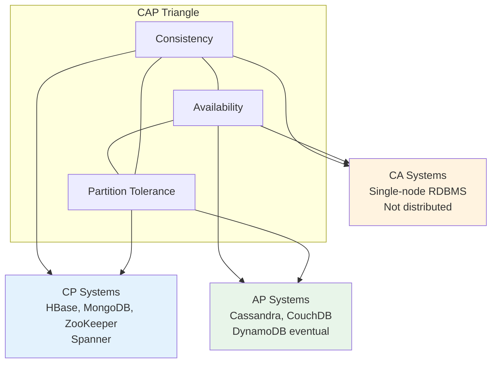
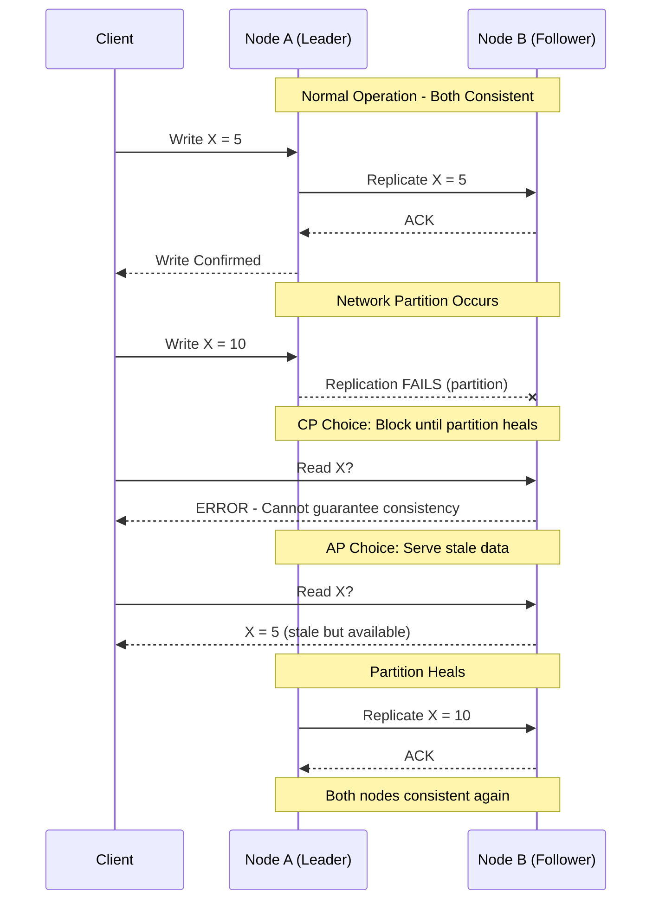
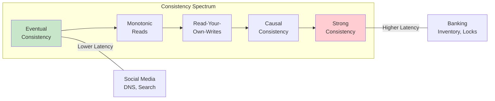

# CAP Theorem and Consistency Models

## 1. Overview

The CAP theorem, formulated by Eric Brewer in 2000 and proven by Gilbert and Lynch in 2002, states that a distributed data store can provide at most two of three guarantees simultaneously: Consistency, Availability, and Partition tolerance. Since network partitions are inevitable in any distributed system, the practical choice reduces to: during a partition, do you sacrifice consistency (AP) or availability (CP)?

This is not an academic curiosity -- it is the single most consequential architectural decision you make when designing a distributed system. It determines your database selection, your replication strategy, your user experience during failures, and ultimately your business risk profile. The choice between "being slightly wrong" and "being temporarily unavailable" is a business decision, not a technical preference.

## 2. Why It Matters

- **Every distributed system faces partitions.** Network cables get cut, data centers lose connectivity, cloud provider AZs become unreachable. Partitions are not "if" but "when."
- **The choice has business consequences.** Choosing AP for a banking system means potentially allowing double-spends. Choosing CP for a social media feed means users see error pages instead of slightly stale content. The cost of "wrong" vs. "unavailable" varies dramatically by domain.
- **It drives technology selection.** CP systems (traditional RDBMS with synchronous replication) and AP systems (Cassandra, DynamoDB in eventual consistency mode) are fundamentally different architectures. You cannot retrofit one into the other.
- **Consistency models exist on a spectrum.** The CAP theorem presents a binary choice during partitions, but in normal operation, you can choose from a rich spectrum of consistency models that trade latency for freshness.

## 3. Core Concepts

- **Consistency (C):** Every read receives the most recent write or an error. All nodes see the same data at the same time. Achieved by updating multiple nodes before allowing further reads.
- **Availability (A):** Every request receives a non-error response, without guarantee that it contains the most recent write. The system remains operational for every request.
- **Partition Tolerance (P):** The system continues to operate despite network partitions -- arbitrary message loss or delay between nodes. A partition-tolerant system can sustain any amount of network failure short of total network collapse.
- **Network Partition:** A break in communication between two or more nodes in a distributed system. During a partition, nodes cannot confirm whether other nodes have received updates.
- **CP System:** Sacrifices availability during partitions to maintain consistency. Returns errors or blocks rather than serving stale data. Examples: HBase, MongoDB (default), Zookeeper.
- **AP System:** Sacrifices consistency during partitions to maintain availability. Serves possibly stale data rather than returning errors. Examples: Cassandra, CouchDB, DynamoDB (eventual mode).
- **CA System:** Theoretically provides consistency and availability without partition tolerance. In practice, this only exists on a single node -- the moment you distribute data across a network, partitions become possible.

## 4. How It Works

### The Partition Scenario

Consider a distributed database with two nodes, Node A and Node B, that replicate data between them:

1. **Normal operation:** A write to Node A is replicated to Node B. Both nodes are consistent. Both are available. No partition exists.
2. **Partition occurs:** The network link between Node A and Node B is severed. Node A receives a write but cannot propagate it to Node B.
3. **The choice:**
   - **CP (Consistency):** Node B stops serving reads for the affected data until the partition heals and it can sync with Node A. The system is consistent but Node B is unavailable.
   - **AP (Availability):** Node B continues serving reads with its stale data. Both nodes are available but they are inconsistent -- a read to Node A returns the new value while a read to Node B returns the old value.

### PACELC: The Extended Model

The CAP theorem only describes behavior during partitions. PACELC (proposed by Daniel Abadi in 2010) extends it to cover normal operation:

**P**artition → **A**vailability vs. **C**onsistency
**E**lse (no partition) → **L**atency vs. **C**onsistency

| System | During Partition (PAC) | Normal Operation (ELC) |
|---|---|---|
| **Cassandra** | AP (serves stale data) | EL (low latency via async replication) |
| **MongoDB** | CP (primary elections, unavailable during failover) | EC (consistent reads from primary) |
| **DynamoDB** | AP (eventual consistency by default) | EL (fast reads) or EC (strongly consistent reads, 2x cost) |
| **Spanner** | CP (synchronous global replication) | EC (consistent, but higher latency due to TrueTime) |
| **PostgreSQL** | CP (single leader, blocks on partition) | EC (consistent reads from leader) |

PACELC reveals that even when there is no partition, you still trade latency for consistency. Systems like Cassandra that choose AP during partitions also choose low latency during normal operation -- it is a coherent philosophy of "fast and eventually correct."

### Consistency Models (The Spectrum)

Consistency is not binary. Between "perfectly consistent" and "eventually consistent" lies a rich spectrum:

| Model | Guarantee | Latency Impact | Use Case |
|---|---|---|---|
| **Strong Consistency (Linearizability)** | Every read returns the value of the most recent write. System behaves as if there is a single copy of the data. | High -- requires synchronous replication or consensus protocol | Banking, seat inventory, distributed locks |
| **Sequential Consistency** | All operations appear in some total order consistent with the order seen at each individual node. | Medium-High | Multi-processor systems |
| **Causal Consistency** | Operations that are causally related are seen by all nodes in the same order. Concurrent operations may be seen in different orders. | Medium | Social media comments (a reply must appear after the original) |
| **Read-Your-Own-Writes** | A user who performs a write will always see that write in subsequent reads, even if other users see stale data temporarily. | Low | Profile updates, settings changes |
| **Monotonic Reads** | Once a user reads a value, they will never see an older value in subsequent reads. | Low | News feeds, dashboards |
| **Eventual Consistency** | If no new writes are made, all replicas will eventually converge to the same value. No guarantee on timing. | Lowest | Social media posts, DNS propagation, search indexes |

### Tunable Consistency (Cassandra Model)

Cassandra allows per-query consistency tuning using quorum mechanics:

- **Replication Factor (RF):** Number of copies of each piece of data (typically 3).
- **Write Consistency Level (W):** Number of replicas that must acknowledge a write.
- **Read Consistency Level (R):** Number of replicas that must respond to a read.

**Rule:** If W + R > RF, you achieve strong consistency for that operation.

| Setting | W | R | Consistency | Availability | Use Case |
|---|---|---|---|---|---|
| **ANY/ONE** | 1 | 1 | Eventual | Maximum | Logging, metrics |
| **QUORUM/QUORUM** | 2 | 2 | Strong (W+R=4 > RF=3) | High | General purpose |
| **ALL/ONE** | 3 | 1 | Strong (W+R=4 > RF=3) | Lower (write fails if any replica down) | Write-critical data |
| **ONE/ALL** | 1 | 3 | Strong (W+R=4 > RF=3) | Lower (read fails if any replica down) | Read-critical data |

### Gossip Protocol (Decentralized State Management)

In leaderless distributed systems (Cassandra, Redis Cluster), nodes need to discover each other and detect failures without a central coordinator. The Gossip Protocol (also called Epidemic Protocol) solves this:

1. Every few seconds, each node selects a small random subset of other nodes (the "fan-out").
2. The node shares its state information (membership, health, load) with the selected peers.
3. Those peers merge the information with their own state and propagate it to their own random subsets.
4. Within O(log N) rounds, the entire cluster converges on a consistent view of the global state.

This "rumor spreading" mechanism provides:
- **No single point of failure:** No central coordinator (unlike ZooKeeper). Cross-link to [Microservices](../architecture/microservices.md) for centralized service discovery.
- **Scalability:** Communication overhead is O(N log N) rather than O(N^2) brute-force broadcasting.
- **Failure detection:** If a node stops gossiping, peers detect it and mark it as potentially failed (suspicion) before declaring it dead.

## 5. Architecture / Flow

## 6. Types / Variants

### System Classification by CAP Behavior

| System | Category | During Partition | Normal Operation | Notes |
|---|---|---|---|---|
| **PostgreSQL** (single leader) | CP | Writes blocked if leader unreachable | Strong consistency from leader | Read replicas offer eventual consistency |
| **MongoDB** (replica set) | CP | Primary election, brief unavailability | Strong consistency from primary | Configurable read preference |
| **Cassandra** | AP | Serves from available replicas | Tunable per query (ANY to ALL) | W + R > RF for strong consistency |
| **DynamoDB** | AP (default) | Eventually consistent reads | Configurable: eventual or strong | Strong reads cost 2x |
| **Redis Cluster** | AP | Continues serving from available nodes | Eventual via async replication | May lose writes during failover |
| **Google Spanner** | CP | Waits for consensus | Strong with higher latency | Uses TrueTime for global ordering |
| **CockroachDB** | CP | Waits for majority quorum | Serializable consistency | Inspired by Spanner |

### BASE vs. ACID

| Property | ACID (CP-aligned) | BASE (AP-aligned) |
|---|---|---|
| **Full Name** | Atomicity, Consistency, Isolation, Durability | Basically Available, Soft state, Eventually consistent |
| **Philosophy** | Correctness above all else | Availability above all else |
| **Write behavior** | All-or-nothing, synchronous | Best-effort, asynchronous propagation |
| **Read behavior** | Always sees latest committed state | May see stale state temporarily |
| **Use case** | Financial transactions, inventory | Social feeds, analytics, recommendations |
| **Database examples** | PostgreSQL, MySQL, Spanner | Cassandra, DynamoDB, CouchDB |

## 7. Use Cases

| System | Choice | Business Justification |
|---|---|---|
| **Ticketmaster** | CP (Strong Consistency) | Double-booking a seat is an unacceptable failure. Two users must never be assigned the same seat. The system must reject or block rather than serve stale inventory data. |
| **Facebook Live Comments** | AP (Eventual Consistency) | Users prioritize real-time engagement. Missing or slightly delayed comments are acceptable as long as the stream stays active. |
| **Banking / UPI Payments** | CP (Strong Consistency) | Spending the same money twice or losing a transaction is catastrophic. The NPCI payment system requires acknowledgment from the receiving bank before confirming a transaction. |
| **Tinder** | AP (Eventual Consistency) | A swipe appearing with a few milliseconds of delay is a fair trade for a responsive experience. The app relaxes consistency for the swipe history. |
| **Twitter Timeline** | AP (Eventual Consistency) with CP for critical paths | The timeline can tolerate eventual consistency (a tweet appearing seconds late). But the "like" counter on a tweet uses causal consistency to avoid confusion. |
| **Google Spanner** | CP with global availability | Google's advertising revenue requires both strong consistency and global availability. They invested in TrueTime (atomic clocks + GPS) to push the CAP boundary. |

## 8. Tradeoffs

| Trade-off | CP Choice | AP Choice |
|---|---|---|
| **User experience during partition** | Error pages, timeouts, retries | Stale data, possibly conflicting views |
| **Write latency** | Higher (synchronous replication) | Lower (async, acknowledge locally) |
| **Read latency** | Consistent but potentially higher | Fast from nearest replica |
| **Data correctness** | Guaranteed | Probabilistic (converges over time) |
| **Conflict resolution** | Prevented (locks, consensus) | Required (last-write-wins, vector clocks, CRDTs) |
| **Infrastructure cost** | Higher (consensus protocols, synchronized clocks) | Lower (simpler replication) |
| **Operational complexity** | Higher (managing consensus, failover) | Higher (managing conflicts, reconciliation) |

## 9. Common Pitfalls

- **Treating CAP as "pick any two."** You cannot avoid partition tolerance in a distributed system. The real choice is CP or AP during partitions. CA only exists on a single node.
- **Applying one consistency model globally.** Different data paths in the same system can (and should) use different consistency models. Your payment path needs strong consistency; your recommendation feed needs eventual consistency. Design per-path, not per-system.
- **Ignoring PACELC.** CAP only describes partition behavior. In normal operation, you still trade latency for consistency. A system that is CP during partitions but also high-latency during normal operation (Spanner) is very different from one that is CP but low-latency (single-region Postgres).
- **Confusing eventual consistency with "anything goes."** Eventual consistency guarantees convergence -- given enough time without new writes, all replicas will agree. It does not mean data is randomly wrong. The question is how long "eventually" takes and whether your application can tolerate the window.
- **Underestimating conflict resolution.** In AP systems, concurrent writes to the same key during a partition create conflicts. You need a resolution strategy: last-write-wins (simple but lossy), vector clocks (complex but correct), or CRDTs (application-specific but safe).
- **Not testing partition behavior.** Many teams choose AP or CP on paper but never test what actually happens during a network partition. Use chaos engineering tools to simulate partitions and verify that your system behaves as designed.

## 10. Real-World Examples

- **Amazon DynamoDB:** Offers tunable consistency per read operation. Default is eventually consistent (AP behavior) with the option for strongly consistent reads at 2x the read capacity cost. This per-request tunability lets applications use strong consistency only where needed.
- **Cassandra at Netflix:** Netflix uses Cassandra (AP) for its high-write workloads like viewing history and telemetry, accepting eventual consistency. For billing and account management, they use different storage that provides stronger guarantees.
- **Google Spanner:** The only production system that approaches "effectively CA" by using atomic clocks and GPS (TrueTime API) to provide globally synchronized timestamps, enabling strong consistency with very high (but not perfect) availability. This required Google to build custom hardware infrastructure.
- **MongoDB:** Defaults to CP behavior with primary elections during network partitions. When the primary is unreachable, the replica set holds an election -- during this window (typically seconds), writes are unavailable. Read preference can be configured to read from secondaries (AP behavior for reads).
- **Bitcoin / Blockchain:** An AP system -- the network continues processing transactions even during partitions (forks). Conflicts are resolved by the longest-chain-wins rule, providing eventual consistency with a probabilistic finality model.

## 11. Related Concepts

- [Availability and Reliability](./availability-reliability.md) -- the availability target that CAP trades against consistency
- [Sharding](../scalability/sharding.md) -- partitioning data across nodes where consistency models apply
- [Database Replication](../storage/database-replication.md) -- the replication strategies that implement consistency guarantees
- [Distributed Transactions](../resilience/distributed-transactions.md) -- 2PC and Saga patterns for cross-partition consistency
- [SQL Databases](../storage/sql-databases.md) -- ACID compliance as strong consistency
- [Cassandra](../storage/cassandra.md) -- tunable consistency in practice

## 12. Source Traceability

- source/youtube-video-reports/3.md -- CAP theorem, consistency needs comparison table, CP vs AP by use case
- source/youtube-video-reports/5.md -- CAP theorem, P99 as the metric that matters, consistency vs availability
- source/youtube-video-reports/7.md -- Strong vs eventual consistency, gossip protocol, BASE philosophy
- source/youtube-video-reports/8.md -- Consistency models (strong, eventual, causal, read-your-own-writes), Cassandra tunable consistency
- source/youtube-video-reports/9.md -- CAP theorem, consistency models, strong vs eventual
- source/extracted/grokking/ch267-cap-theorem.md -- CAP theorem definition, three guarantees explained
- source/extracted/ddia/ch11-consistency-and-consensus.md -- Consistency guarantees, linearizability, eventual consistency
- source/extracted/system-design-guide/ch05-distributed-systems-theorems-and-data-structures.md -- CAP theorem and distributed system theorems
