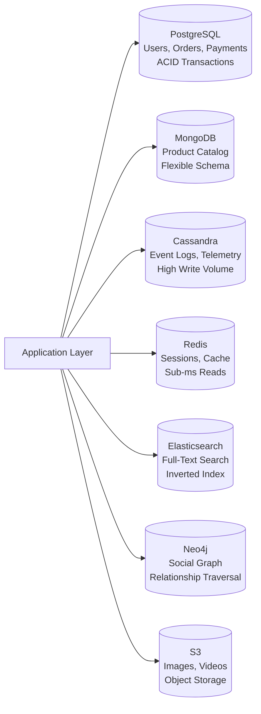

# Data Modeling

## 1. Overview

Data modeling is the process of defining the structure, relationships, and constraints of data within a system. It is the single most consequential decision in system design because it determines your performance ceiling, your scaling strategy, and the access patterns your application can serve efficiently. Every architectural choice downstream -- sharding strategy, indexing approach, caching layer, API contract -- is a direct consequence of how you model your data.

The senior architect's perspective: data modeling is not about drawing ER diagrams. It is about understanding how data will be written, how it will be read, and which of those operations dominates. In a relational (SQL) world, you model entities and relationships first, then derive queries from the schema. In a NoSQL world, you model queries first, then derive the schema from the access patterns. Getting this backwards is the single most common architectural mistake in distributed systems.

Martin Kleppmann captured this precisely in DDIA: "Data models are perhaps the most important part of developing software, because they have such a profound effect: not only on how the software is written, but also on how we think about the problem that we are solving." Each layer of a system hides the complexity of the layer below it by providing a clean data model -- from application objects, to database records, to bytes on disk, to electrical signals.

## 2. Why It Matters

- **Schema design dictates performance.** A denormalized document that serves a query in a single read will always outperform a normalized schema requiring five table joins. Conversely, a denormalized schema that must update the same data in twelve places will collapse under write amplification.
- **The wrong model creates permanent technical debt.** Migrating from a normalized relational schema to a denormalized NoSQL model -- or vice versa -- is a multi-quarter rewrite. Getting the model right early avoids years of fighting the storage engine.
- **Access patterns drive everything.** A system with a 1000:1 read-to-write ratio (like a news feed) demands a fundamentally different data model than a system with a 1:1000 write-to-read ratio (like IoT telemetry ingestion). The model must match the workload.
- **Interview differentiator.** In system design interviews, identifying entities, defining relationships, and choosing between normalization and denormalization within the first ten minutes signals senior-level thinking. Candidates who jump to "use DynamoDB" without articulating the data model fail.
- **Polyglot persistence is the norm.** Modern systems use multiple storage engines -- SQL for transactional data, document stores for flexible schemas, wide-column stores for high-velocity writes, graph databases for relationship traversal. The data model determines which engine serves each workload.

## 3. Core Concepts

- **Entity**: A real-world object represented in the data model -- User, Post, Order, Ticket, Product. Entities are the "nouns" of the system.
- **Relationship**: A connection between entities -- one-to-one (User to Profile), one-to-many (User to Posts), many-to-many (Users to Followers). Relationships drive join requirements.
- **Primary Key**: A unique, non-null identifier for each record. In SQL, typically a serial integer or UUID. In DynamoDB, the partition key (or partition key + sort key composite).
- **Foreign Key**: A column in one table that references the primary key of another table, enforcing referential integrity. Foreign keys prevent orphaned records but add write overhead.
- **Composite Key**: A key composed of two or more columns. In DynamoDB, this is the partition key + sort key combination that enables both even distribution and range queries within a partition.
- **Normalization**: Eliminating data duplication by decomposing tables into smaller, related tables. Each fact is stored in exactly one place. Reduces write anomalies at the cost of join overhead during reads.
- **Denormalization**: Deliberately duplicating data across records or tables to serve read queries without joins. Trades storage cost and write complexity for read performance.
- **Entity-Driven Modeling (SQL)**: Design the schema around entities and their relationships first. Queries are derived from the schema. This is the relational approach -- normalize first, denormalize only when performance demands it.
- **Query-Driven Modeling (NoSQL)**: Design the schema around the queries the application needs to execute. The schema is derived from access patterns. This is the Cassandra and DynamoDB approach -- denormalize by default, because cross-node joins are catastrophic.
- **Schema-on-Write vs. Schema-on-Read**: SQL databases enforce schema at write time (reject bad data). Document stores enforce schema at read time (accept anything, interpret later). The tradeoff is data integrity vs. flexibility.
- **Polyglot Persistence**: Using multiple database technologies within a single system, each optimized for its specific data shape and access pattern.
- **Embedding vs. Referencing**: In document databases, embedding stores related data within the same document (fast reads, data duplication). Referencing stores a pointer to another document (normalized, requires additional lookups).

## 4. How It Works

### The Data Modeling Decision Process

The process for modeling data in a system design context follows a disciplined sequence:

**Step 1: Identify Core Entities**
Extract the "nouns" from the functional requirements. For a Twitter-like system: User, Tweet, Follow, Like, Timeline. For TicketMaster: User, Event, Venue, Seat, Booking, Payment.

**Step 2: Define Relationships**
Map how entities connect. A User creates many Tweets (one-to-many). A User follows many Users (many-to-many via a Follow junction table). A Booking locks one Seat (one-to-one with temporal constraint).

**Step 3: Identify Access Patterns**
List every query the application must execute. "Get a user's timeline" (read-heavy, fan-out). "Record a swipe" (write-heavy, append-only). "Check seat availability" (read with strong consistency). Access patterns determine whether to normalize or denormalize.

**Step 4: Choose the Modeling Approach**
- If access patterns are **unknown or diverse**: start with a normalized relational model. SQL's flexible query optimizer handles ad-hoc queries.
- If access patterns are **known and fixed**: use query-driven modeling. Denormalize to serve each query from a single table or partition.
- If the system has **both**: use polyglot persistence. SQL for transactional writes, NoSQL for pre-computed read views.

**Step 5: Select the Storage Engine**
The data model dictates the engine. See [SQL Databases](../storage/sql-databases.md), [NoSQL Databases](../storage/nosql-databases.md), [DynamoDB](../storage/dynamodb.md), and [Cassandra](../storage/cassandra.md).

### Normalization in Practice

Normalization eliminates redundancy by decomposing tables. The key forms:

| Normal Form | Rule | Example Violation |
|---|---|---|
| **1NF** | Every column holds atomic values; no repeating groups | A "phone_numbers" column containing a comma-separated list |
| **2NF** | All non-key columns depend on the entire primary key | In an (OrderID, ProductID) table, "CustomerName" depends only on OrderID |
| **3NF** | No transitive dependencies; non-key columns depend only on the primary key | "CityName" depending on "ZipCode" rather than on "UserID" |

**Rule of thumb from DDIA**: If you are duplicating values that could be stored in just one place, the schema is not normalized. Using IDs instead of human-readable strings is the fundamental normalization technique -- the ID never needs to change even when the data it represents does.

### Denormalization in Practice

Denormalization deliberately reintroduces redundancy to eliminate joins:

| Strategy | Mechanism | When to Use |
|---|---|---|
| **Pre-computed joins** | Store the result of a join as a materialized column | Read-heavy workloads where join latency exceeds SLA |
| **Duplicated fields** | Copy frequently-accessed fields into child records | Avoiding a parent table lookup on every read |
| **Materialized views** | Database-maintained denormalized tables | Aggregation queries (counts, sums) that are expensive to compute |
| **Fan-out on write** | Pre-compute and store results at write time | News feed timelines (write once, read millions of times) |

The cost: every duplicated field must be updated everywhere when the source changes. If a user changes their display name and that name is denormalized into 50 million timeline entries, you have a massive background update job.

## 5. Architecture / Flow

### Entity-Driven vs. Query-Driven Modeling

```mermaid
flowchart TD
    subgraph EntityDriven["Entity-Driven Modeling (SQL)"]
        E1[Identify Entities] --> E2[Define Relationships]
        E2 --> E3[Normalize to 3NF]
        E3 --> E4[Write Schema DDL]
        E4 --> E5[Derive Queries from Schema]
        E5 --> E6{Performance OK?}
        E6 -->|Yes| E7[Ship It]
        E6 -->|No| E8[Denormalize Hot Paths]
        E8 --> E7
    end

    subgraph QueryDriven["Query-Driven Modeling (NoSQL)"]
        Q1[List All Access Patterns] --> Q2[Design Table Per Query]
        Q2 --> Q3[Choose Partition Key + Sort Key]
        Q3 --> Q4[Denormalize by Default]
        Q4 --> Q5[Add GSIs for Secondary Patterns]
        Q5 --> Q6[Ship It]
    end
```



### Polyglot Persistence Architecture



## 6. Types / Variants

### Data Modeling Approaches

| Approach | Philosophy | Best For | Database Examples |
|---|---|---|---|
| **Entity-Driven (Relational)** | Model entities first, derive queries from schema | Unknown access patterns, ACID requirements, complex joins | PostgreSQL, MySQL |
| **Query-Driven (Wide-Column)** | Model queries first, derive schema from access patterns | Known access patterns, high write throughput | Cassandra, HBase |
| **Document-Oriented** | Model data as self-contained documents | Hierarchical data, flexible schemas, one-to-many trees | MongoDB, CouchDB |
| **Key-Value** | Model data as simple key-to-value pairs | Caching, session storage, simple lookups | Redis, Memcached, DynamoDB (simple) |
| **Graph** | Model data as nodes and edges | Deep relationship traversal, social graphs, recommendation | Neo4j, Amazon Neptune |
| **Single-Table Design** | One DynamoDB table serves all access patterns via composite keys and GSIs | DynamoDB-native applications with well-known access patterns | DynamoDB |

### Document Embedding vs. Referencing

| Strategy | Mechanism | Pros | Cons |
|---|---|---|---|
| **Embedding** | Nest related data inside parent document | Single read, data locality, no joins | Duplication, document size limits, update complexity |
| **Referencing** | Store ID pointer to another document | Normalized, smaller documents, easier updates | Additional lookups, no join support in many NoSQL stores |

**When to embed**: The child data is always accessed with the parent (e.g., a blog post and its comments). The child data is small and bounded. The data is read far more than written.

**When to reference**: The child data is accessed independently. The child data is large or unbounded. The data is frequently updated.

### Single-Table Design (DynamoDB)

The DynamoDB single-table pattern stores multiple entity types in one table, using overloaded partition keys and sort keys to support diverse access patterns without table joins:

```
PK              | SK                | Data
USER#alice      | PROFILE           | {name: "Alice", email: "..."}
USER#alice      | POST#2024-01-15   | {title: "...", body: "..."}
USER#alice      | FOLLOW#bob        | {followedAt: "2024-01-10"}
POST#abc123     | COMMENT#001       | {author: "bob", text: "..."}
```

A single query on `PK = USER#alice` with a sort key prefix of `POST#` retrieves all of Alice's posts, sorted by date, without a join. GSIs enable additional access patterns (e.g., GSI with `SK` as the partition key to query all comments across posts).

## 7. Use Cases

- **E-commerce order system**: Normalized SQL for orders, payments, and inventory (ACID required for double-booking prevention). Denormalized product catalog in MongoDB for flexible attributes (size, color, material vary by category). Redis for session and cart data. See [SQL Databases](../storage/sql-databases.md).
- **Social media platform (Twitter)**: User profiles in PostgreSQL (structured, relational). Tweets as documents in a document store (flexible schema with media, hashtags, geo-tags). Pre-computed timelines in Redis or Cassandra (fan-out on write for normal users). Elasticsearch for tweet search.
- **IoT telemetry ingestion**: Cassandra for high-volume sensor writes (append-only, 100K+ writes/sec). Time-series downsampling for long-term storage. See [Cassandra](../storage/cassandra.md).
- **TicketMaster seat booking**: Strongly consistent SQL with row-level locking for seat inventory. Redis distributed locks with TTL for temporary seat reservations. The data model must enforce that exactly one user holds any seat at any time.
- **Messaging (WhatsApp)**: DynamoDB with partition key = conversation_id, sort key = timestamp for ordered message retrieval. GSI for per-user inbox queries. DynamoDB Streams for CDC to notification services. See [DynamoDB](../storage/dynamodb.md).

## 8. Tradeoffs

| Decision | Advantage | Disadvantage |
|---|---|---|
| Normalization | No data duplication, write consistency, smaller storage | Expensive joins, slower reads, complex queries |
| Denormalization | Fast reads, no joins, simpler queries | Data duplication, write amplification, consistency risk |
| Entity-driven modeling | Flexible querying, supports unknown access patterns | Join overhead at scale, harder to shard |
| Query-driven modeling | Optimized reads, natural sharding | Rigid access patterns, data duplication across tables |
| Embedding (documents) | Single read, data locality | Document bloat, update complexity, size limits |
| Referencing (documents) | Normalized, smaller documents | Additional lookups, no native joins |
| Single-table design (DynamoDB) | One table, fast lookups, reduced operational overhead | Steep learning curve, harder to evolve, complex key design |
| Polyglot persistence | Right tool for each job | Operational complexity, multiple systems to maintain and monitor |

## 9. Common Pitfalls

- **Modeling for the database, not the access pattern.** Designing a beautiful 3NF relational schema without understanding that the primary query requires joining seven tables across three shards. Always start with: "What queries does the application need to execute?"
- **Premature denormalization.** Denormalizing before measuring query performance. A well-indexed normalized schema often performs well enough. Denormalize only when joins are the proven bottleneck, not the assumed one.
- **Bad partition keys.** Using low-cardinality keys like `country` or `is_premium` in DynamoDB or Cassandra creates hot partitions. Good partition keys have high cardinality (user_id, device_id) and even distribution. See [Database Indexing](../storage/database-indexing.md).
- **Ignoring schema evolution.** Schemas change. Adding a column to a 500 million row Postgres table locks the table. Adding a field to a NoSQL document is free (schema-on-read), but old documents lack the field. Plan migration strategies from day one.
- **Storing blobs in relational databases.** Postgres packs data into 8KB pages. A 4MB image spans 500 pages, creating massive memory pressure and replication overhead. Store media in object storage (S3) and metadata (URLs, timestamps) in the database.
- **Circular foreign key dependencies.** Table A references Table B, which references Table A. This creates insertion order problems and makes migrations brittle. Break cycles with junction tables or nullable foreign keys.
- **Over-indexing.** Every index accelerates reads but penalizes writes. A table with twelve indexes will have slow inserts. Index only the columns that appear in WHERE, ORDER BY, and JOIN clauses of your hot queries. See [Database Indexing](../storage/database-indexing.md).
- **Ignoring the object-relational mismatch.** Application objects (nested, hierarchical) map awkwardly to flat relational tables. ORMs help but cannot eliminate the impedance mismatch entirely. If your data is naturally hierarchical (a resume, a product listing), consider a document model.
- **Single-table design without understanding access patterns.** DynamoDB single-table design is powerful but unforgiving. If you design the key schema before fully enumerating access patterns, you will paint yourself into a corner that requires a full data migration to escape.

## 10. Real-World Examples

### Twitter: The Hybrid Data Model

Twitter stores user profiles in a relational database (structured, queryable, supports joins for analytics). Tweets are stored in Manhattan (an internal document store functionally equivalent to MongoDB), because each tweet is a self-contained document with heterogeneous fields -- text, media IDs, hashtags, geo-tags, and retweet metadata. The timeline is a pre-computed denormalized view: when a normal user tweets, the system fans out the tweet to every follower's timeline cache (Cassandra/Redis). For celebrities with millions of followers, the system switches to fan-out on read to avoid write storms.

### DynamoDB: Query-Driven Modeling at Amazon

DynamoDB's single-table design exemplifies query-driven modeling. For a chat application: the partition key is `conversation_id` and the sort key is `timestamp`. This ensures all messages in a conversation are co-located on the same partition and physically sorted by time. A GSI with `user_id` as the partition key enables the "show all conversations for this user" query. The table stores Users, Messages, and Conversations as different item types in the same table, distinguished by sort key prefixes.

### Cassandra at Netflix: Write-Optimized Denormalization

Netflix uses Cassandra to handle millions of writes per second for telemetry data. The data model is entirely query-driven: each table is designed to answer exactly one query. If Netflix needs to query "all viewing events for user X in the last 7 days" and also "all viewing events for show Y in the last hour," those are two separate Cassandra tables with the same data stored in different partition/sort key configurations. Storage is cheap; cross-partition queries are not.

### LinkedIn Resume: The DDIA Case Study

Kleppmann's LinkedIn profile example illustrates the normalization vs. document model tradeoff. A resume has one-to-many relationships (user to positions, user to education, user to contact info) that form a tree structure. In a relational model, positions, education, and contacts live in separate tables with foreign keys to the users table. In a document model, the entire resume is a single JSON document with nested arrays. The document model wins on read locality (one query fetches everything), but loses when relationships become many-to-many (organizations as shared entities, recommendations linking users).

## 11. Related Concepts

- [SQL Databases](../storage/sql-databases.md) -- the canonical entity-driven modeling engine with ACID transactions
- [NoSQL Databases](../storage/nosql-databases.md) -- document, key-value, wide-column, and graph models for query-driven design
- [DynamoDB](../storage/dynamodb.md) -- single-table design, partition keys, sort keys, and GSI patterns
- [Cassandra](../storage/cassandra.md) -- wide-column query-driven modeling with tunable consistency
- [Database Indexing](../storage/database-indexing.md) -- B-trees, hash indexes, and specialized indexes that accelerate data retrieval
- [Sharding](../scalability/sharding.md) -- horizontal data distribution that depends on partition key design
- [Database Replication](../storage/database-replication.md) -- read replicas and consistency models shaped by the data model
- [CQRS](../messaging/cqrs.md) -- separating read and write models for optimal performance on both paths
- [Event Sourcing](../messaging/event-sourcing.md) -- append-only event logs as an alternative to mutable state

## 12. Source Traceability

- source/extracted/ddia/ch03-data-models-and-query-languages.md (relational vs. document model, normalization, impedance mismatch, many-to-one/many-to-many relationships, polyglot persistence)
- source/youtube-video-reports/4.md (SQL vs NoSQL decision matrix, object storage mechanics, metadata/data split)
- source/youtube-video-reports/5.md (polyglot persistence, SQL vs NoSQL by use case, indexing foreign keys)
- source/youtube-video-reports/7.md (DynamoDB primary key architecture, GSI vs LSI, single-table design, query-driven modeling)
- source/youtube-video-reports/8.md (normalization vs denormalization, entity-driven vs query-driven, B-tree indexing, Cassandra data model)
- source/youtube-video-reports/9.md (SQL vs NoSQL analogy, schema flexibility, caching and consistency)
- source/extracted/acing-system-design/ch06-scaling-databases.md (storage service types, normalization vs denormalization, database selection)
- source/extracted/system-design-guide/ch08-design-and-implementation-of-system-components-databases-and.md (database types, indexing strategies)
- source/extracted/grokking/ch263-high-level-differences-between-sql-and-nosql.md (SQL vs NoSQL comparison)
