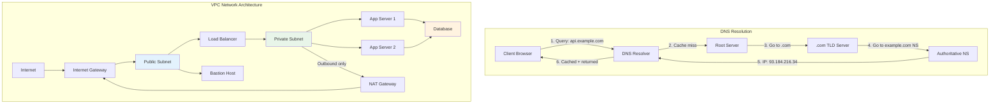
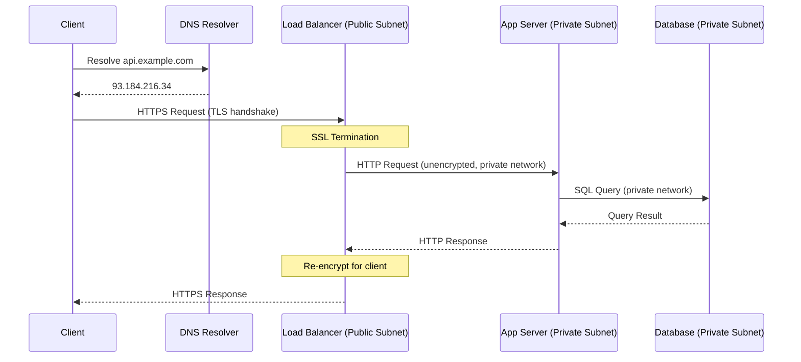

# Networking Fundamentals

## 1. Overview

Every distributed system sits on top of a network, and that network's behavior determines your system's latency floor, failure modes, and security posture. Networking is not an abstract topic for infrastructure teams to worry about -- it is a prerequisite for making defensible architectural decisions. When you choose between TCP and UDP, configure a subnet layout, or decide where to terminate SSL, you are making decisions that directly impact your application's performance, security, and cost.

This document covers the networking concepts a senior architect must command: DNS for name resolution, TCP/UDP for transport, the OSI model as a mental framework, subnets and NAT for network isolation, and the gateway architecture that connects private infrastructure to the public internet.

## 2. Why It Matters

- **Latency is network-bound.** The speed of light in fiber is ~200,000 km/s. A round trip from New York to London takes ~56ms at the physical layer alone. No amount of code optimization can eliminate network latency -- you can only reduce hops, cache closer to the user, and choose the right protocol.
- **Security is network-enforced.** Application-level security is necessary but insufficient. Backend services must reside in private subnets, unreachable from the public internet. Network isolation (subnets, NAT, security groups) is the first layer of defense.
- **Protocol choice determines capability.** TCP guarantees delivery but adds overhead. UDP sacrifices guarantees for speed. WebSockets enable bidirectional communication. Choosing the wrong protocol creates problems that cannot be fixed at the application layer.
- **DNS is a hidden dependency.** Every request your system makes begins with a DNS lookup. DNS outages (like the October 2021 Facebook outage) can take down your entire infrastructure even when every server is healthy.

## 3. Core Concepts

- **IP Address:** A unique numerical identifier for every device on a network. IPv4 (32-bit, ~4.3 billion addresses, nearly exhausted) and IPv6 (128-bit, effectively unlimited) are the two versions in use.
- **DNS (Domain Name System):** The internet's "phone book" -- translates human-readable domain names (e.g., api.example.com) into IP addresses (e.g., 172.217.22.14).
- **TCP (Transmission Control Protocol):** A connection-oriented, reliable transport protocol. Guarantees delivery, ordering, and integrity at the cost of overhead (handshakes, acknowledgments, retransmissions).
- **UDP (User Datagram Protocol):** A connectionless, unreliable transport protocol. No delivery guarantee, no ordering -- but minimal overhead, making it ideal for real-time applications.
- **OSI Model:** A seven-layer conceptual framework for understanding network communication. In practice, layers 3 (Network/IP), 4 (Transport/TCP/UDP), and 7 (Application/HTTP) are the most relevant for system design.
- **Subnet:** A logical subdivision of an IP network. Used to isolate groups of resources (public-facing vs. private) within a cloud VPC.
- **NAT (Network Address Translation):** Translates private IP addresses to public ones, allowing instances in private subnets to access the internet without being directly reachable from it.
- **IGW (Internet Gateway):** A bidirectional gateway that allows resources in public subnets to communicate with the internet.
- **Forward Proxy:** An intermediary that acts on behalf of the client, hiding the client's identity from the server.
- **Reverse Proxy:** An intermediary that acts on behalf of the server, hiding server identity and topology from the client. See [Load Balancing](../scalability/load-balancing.md) for detailed coverage.

## 4. How It Works

### DNS Resolution Flow

DNS resolution follows a hierarchical lookup process:

1. **Client query:** Browser or application queries the local DNS resolver (typically provided by the ISP or configured as 8.8.8.8 for Google Public DNS).
2. **Recursive resolver:** If the resolver does not have the answer cached, it queries the root name servers.
3. **Root servers:** Direct the resolver to the appropriate Top-Level Domain (TLD) server (e.g., .com, .org).
4. **TLD servers:** Direct the resolver to the authoritative name server for the specific domain.
5. **Authoritative server:** Returns the IP address for the requested domain.
6. **Caching:** The result is cached at each level with a TTL (Time to Live), typically 300 seconds. Subsequent queries for the same domain skip the full resolution chain.

**DNS Record Types:**

| Type | Purpose | Example |
|---|---|---|
| **A** | Maps domain to IPv4 address | api.example.com → 93.184.216.34 |
| **AAAA** | Maps domain to IPv6 address | api.example.com → 2606:2800:220:1:248:1893:25c8:1946 |
| **CNAME** | Alias one domain to another | www.example.com → example.com |
| **MX** | Mail server for the domain | example.com → mail.example.com |
| **NS** | Authoritative name server | example.com → ns1.example.com |
| **TXT** | Arbitrary text (often for verification) | example.com → "v=spf1 include:_spf.google.com" |

### TCP vs. UDP

| Characteristic | TCP | UDP |
|---|---|---|
| **Connection type** | Connection-oriented (3-way handshake: SYN, SYN-ACK, ACK) | Connectionless (fire and forget) |
| **Reliability** | Guaranteed delivery via acknowledgments and retransmission | No delivery guarantee |
| **Ordering** | Packets arrive in order (sequence numbers) | No ordering guarantee |
| **Error checking** | Checksums + retransmission | Checksums only (no retransmission) |
| **Flow control** | Yes (sliding window, congestion control) | No |
| **Overhead** | Higher (headers, handshakes, ACKs) | Lower (minimal headers) |
| **Latency** | Higher (handshake + ACK overhead) | Lower (no handshake) |
| **Use cases** | HTTP/HTTPS, file transfers, database connections, SSH | Video/audio streaming, gaming, DNS lookups, IoT telemetry |

**The Harry Potter analogy:** TCP ensures every "scene" of the movie arrives in order -- if a packet is lost, it is retransmitted, because watching the climax before the opening is unacceptable. UDP prioritizes being up-to-the-second in a live football broadcast -- minor glitches (dropped frames) are acceptable to maintain real-time experience.

### The OSI Model (Practical Focus)

| Layer | Name | Protocol/Tech | System Design Relevance |
|---|---|---|---|
| 7 | **Application** | HTTP, HTTPS, DNS, gRPC, WebSocket | API design, load balancing (L7), SSL termination |
| 6 | Presentation | SSL/TLS, compression | Encryption, data encoding |
| 5 | Session | TCP sessions, WebSocket sessions | Connection management |
| 4 | **Transport** | TCP, UDP | Load balancing (L4), connection reliability |
| 3 | **Network** | IP, ICMP, routing | Subnets, NAT, IGW, routing tables |
| 2 | Data Link | Ethernet, MAC addresses | Physical network segments |
| 1 | Physical | Cables, radio signals | Data center infrastructure |

For system design, layers 3 (Network), 4 (Transport), and 7 (Application) are where 95% of architectural decisions live. Layer 4 vs. Layer 7 load balancing is covered in detail in [Load Balancing](../scalability/load-balancing.md).

### Subnet Architecture and Network Isolation

In a production cloud environment (AWS VPC, GCP VPC, Azure VNet), you design a "Security-in-Depth" network:

**Public Subnet:**
- Contains resources that need direct internet access: load balancers, bastion hosts, NAT gateways.
- Has a route to the Internet Gateway (IGW).
- Resources have public IP addresses.

**Private Subnet:**
- Contains backend services, databases, and application servers.
- No direct internet access -- no route to IGW.
- Outbound internet access (for security patches, API calls) goes through a NAT Gateway.
- Inbound access only through the load balancer in the public subnet.

**Key Components:**

| Component | Direction | Cost | Purpose |
|---|---|---|---|
| **Internet Gateway (IGW)** | Bidirectional | Free | Connects public subnets to the internet |
| **NAT Gateway** | Outbound only | Paid (~$0.045/hr + data transfer) | Allows private subnet instances to reach the internet without being reachable from it |
| **Route Table** | N/A | Free | Defines where traffic is directed based on destination IP |
| **Security Group** | N/A | Free | Stateful firewall rules (allow/deny) at the instance level |
| **Network ACL** | N/A | Free | Stateless firewall rules at the subnet level |
| **Bastion Host / Jump Box** | Inbound | Instance cost | Secure entry point for SSH access to private instances |

### Proxy Types

**Forward Proxy (Client-side):**
- Sits between the client and the internet.
- The client knows it is using a proxy; the server does not know the client's real identity.
- Use cases: corporate internet filtering, geo-restriction bypass, anonymization (VPN).
- Analogy: An assistant going to the market on your behalf -- the shopkeeper sees the assistant, not you.

**Reverse Proxy (Server-side):**
- Sits between the internet and your servers.
- The client does not know which server processes the request; the server topology is hidden.
- Use cases: load balancing, SSL termination, caching, DDoS protection.
- Analogy: A receptionist at a company -- visitors interact with the receptionist, not individual employees.
- Detailed coverage in [Load Balancing](../scalability/load-balancing.md).

### SSL/TLS Termination

SSL/TLS encryption is computationally expensive. In a production architecture:

1. The client establishes a TLS connection with the load balancer or reverse proxy (at the edge).
2. The proxy terminates TLS -- decrypts the request and re-encrypts the response.
3. Traffic between the proxy and backend services travels unencrypted over the private network (or re-encrypted with cheaper mutual TLS for zero-trust architectures).

This offloads CPU-intensive cryptographic operations from application servers, allowing them to focus on business logic.

## 5. Architecture / Flow

## 6. Types / Variants

### Transport Protocol Selection Guide

| Application Type | Protocol | Justification |
|---|---|---|
| Web browsing (HTTP/HTTPS) | TCP | Reliability required -- every byte of HTML/CSS/JS must arrive correctly |
| File transfers (FTP, SCP) | TCP | Data integrity is critical -- a corrupted file is useless |
| Database connections | TCP | Queries and results must be delivered accurately and in order |
| Video streaming (live) | UDP (+ application-level recovery) | Real-time delivery matters more than perfect frames |
| Voice/Video calls (WebRTC) | UDP | Latency matters more than quality -- a 1-second delay is worse than a dropped frame |
| Online gaming | UDP | Real-time position updates must be fast; occasional packet loss is tolerable |
| DNS lookups | UDP (default) | Single small request/response; TCP overhead is unnecessary |
| IoT sensor data | UDP | High volume, small payloads, occasional loss acceptable |

### Cloud Network Gateway Comparison

| Gateway | Direction | Use Case | Cost |
|---|---|---|---|
| **IGW** | Bidirectional | Public subnets communicating with internet | Free |
| **NAT Gateway** | Outbound only | Private subnets accessing internet (patches, APIs) | ~$0.045/hr + $0.045/GB |
| **VPC Peering** | Bidirectional (inter-VPC) | Connecting two VPCs in same/different regions | Free (data transfer charges apply) |
| **Transit Gateway** | Multi-VPC hub | Connecting many VPCs and on-premise networks | ~$0.05/hr + $0.02/GB |
| **PrivateLink/Endpoint** | Inbound (service access) | Accessing AWS services without internet | Per-endpoint + data charges |

## 7. Use Cases

- **Netflix streaming:** Uses UDP-based protocols for video delivery (latency over reliability), TCP for account management and billing (reliability required). DNS with latency-based routing directs users to the nearest CDN edge location. Cross-link to [CDN](../caching/cdn.md).
- **AWS VPC architecture:** Production deployments at companies like Airbnb and Uber use multi-AZ VPC designs with public subnets for load balancers, private subnets for application and database tiers, and NAT gateways for outbound dependencies.
- **Cloudflare DNS:** Operates on the anycast network (1.1.1.1), resolving DNS queries from the geographically nearest point of presence. Average resolution time is under 15ms globally.
- **Google Maps:** Uses TCP for reliable tile delivery (map images must arrive completely) with aggressive client-side caching and CDN distribution to minimize perceived latency.

## 8. Tradeoffs

| Decision | Option A | Option B | Guidance |
|---|---|---|---|
| **TCP vs UDP** | TCP: reliable, ordered, higher latency | UDP: fast, no guarantees | TCP for data integrity (web, DB); UDP for real-time (streaming, gaming) |
| **Public vs Private subnet** | Public: direct internet access, simpler | Private: isolated, more secure | Always private for backend services; public only for edge (LB, bastion) |
| **NAT Gateway vs VPC Endpoint** | NAT: general internet access | VPC Endpoint: direct AWS service access, no internet traversal | Use VPC Endpoints for AWS services to save cost and improve security |
| **SSL at edge vs end-to-end** | Edge termination: simpler, faster | End-to-end: zero-trust, more secure | Edge termination for most cases; end-to-end for compliance-sensitive workloads |
| **Forward vs Reverse proxy** | Forward: client anonymization | Reverse: server protection, load distribution | Reverse proxy is standard for production server architecture |

## 9. Common Pitfalls

- **SSH directly into private instances.** Never expose SSH on private servers to the internet. Use a bastion host in a public subnet as the single, audited entry point. Better yet, use AWS SSM Session Manager to eliminate SSH entirely.
- **Ignoring DNS TTL during migrations.** When changing IP addresses (e.g., migrating to a new load balancer), the old IP remains cached at DNS resolvers worldwide for the duration of the TTL. Lower the TTL well before the migration, and raise it again after.
- **NAT Gateway as a bottleneck.** NAT Gateways have a throughput limit (~45 Gbps on AWS). High-traffic private subnets can saturate a single NAT Gateway. Deploy one per AZ and use proper routing.
- **Choosing UDP without application-level recovery.** Raw UDP drops packets silently. If your application cannot tolerate packet loss, you need either TCP or an application-level protocol that adds selective retransmission on top of UDP (like QUIC).
- **Security groups as the only defense.** Security groups are necessary but insufficient. Combine with Network ACLs (stateless, subnet-level), WAF (application-layer filtering), and VPC Flow Logs (audit trail).
- **DNS as a single point of failure.** The 2021 Facebook outage proved that a DNS misconfiguration can take down an entire global infrastructure. Use multiple DNS providers and monitor DNS health independently from application health.

## 10. Real-World Examples

- **Facebook October 2021 outage:** A BGP configuration change accidentally disconnected Facebook's authoritative DNS servers from the internet. Because every Facebook service (including internal tools used to fix the problem) depended on DNS, the blast radius was total and global. Recovery took over 6 hours because engineers could not remotely access internal systems.
- **Cloudflare 1.1.1.1:** Launched a globally distributed DNS resolver using anycast routing. Any query to 1.1.1.1 is automatically routed to the nearest Cloudflare data center, providing sub-15ms resolution worldwide.
- **AWS VPC design at scale:** Companies like Uber deploy across multiple VPCs with Transit Gateway connecting them. Each service tier (web, application, data) resides in its own subnet with precisely scoped security groups.
- **QUIC protocol (Google):** Google developed QUIC as a UDP-based transport protocol that provides TCP-like reliability with lower latency. It eliminates the TCP handshake overhead and supports connection migration (switching from Wi-Fi to cellular without dropping the connection). HTTP/3 is built on QUIC.

## 11. Related Concepts

- [Load Balancing](../scalability/load-balancing.md) -- L4/L7 load balancing, reverse proxy functionality
- [CDN](../caching/cdn.md) -- edge caching and geographic distribution built on DNS routing
- [API Gateway](../architecture/api-gateway.md) -- application-layer routing, SSL termination
- [Encryption](../security/encryption.md) -- TLS/SSL details for data in transit
- [Availability and Reliability](./availability-reliability.md) -- network redundancy as an availability mechanism
- [Scaling Overview](./scaling-overview.md) -- network architecture evolution with scale

## 12. Source Traceability

- source/youtube-video-reports/1.md -- Forward vs reverse proxy, load balancing algorithms
- source/youtube-video-reports/2.md -- 3-stage infrastructure maturity model, L4/L7 comparison
- source/youtube-video-reports/3.md -- L4 vs L7 load balancing, API gateway vs reverse proxy, complexity budget
- source/youtube-video-reports/5.md -- Network infrastructure, IGW vs NAT Gateway, subnets, OSI model, bastion hosts
- source/youtube-video-reports/9.md -- IP addressing, DNS, TCP vs UDP, forward/reverse proxies, OSI model, WebSockets
- source/extracted/system-design-guide/ch07-distributed-systems-building-blocks-dns-load-balancers-and-a.md -- DNS, load balancers, API gateways
- source/extracted/grokking/ch260-proxy-server-types.md -- Proxy types
- source/extracted/grokking/ch274-websockets.md -- WebSocket protocol
