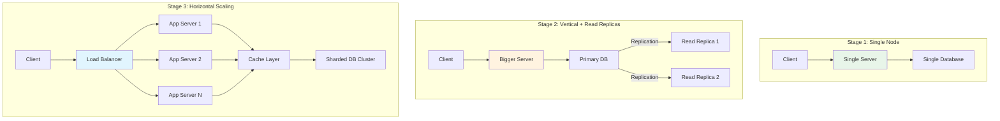
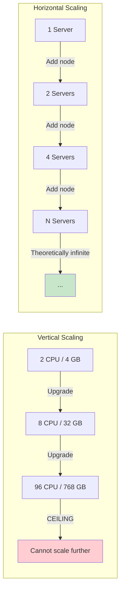

# Scaling Overview

## 1. Overview

Scaling is the capacity of a system to meet increasing demand -- more users, more data, more transactions -- without degrading performance. As a senior architect, you need to understand that scaling is not a single decision but a continuous strategy that evolves with your traffic profile. The choice between adding horsepower to a single machine (vertical) and distributing load across a fleet (horizontal) is a strategic decision about your system's ceiling, its resilience to failure, and your organization's operational maturity.

A scalable architecture avoids bottlenecks by balancing load across participating nodes. But performance of any system, no matter how well designed, eventually declines with size due to coordination costs, network overhead, and tasks that are inherently sequential. Your job is to push that inflection point as far out as your business requires.

## 2. Why It Matters

- **Traffic is unpredictable.** A viral moment can multiply your load 100x in minutes. If your only scaling strategy is "buy a bigger server," you will hit a physical ceiling and your system will crash.
- **Cost efficiency at scale.** Vertical scaling follows a non-linear cost curve -- doubling CPU/RAM often costs 3-4x more. Horizontal scaling leverages commodity hardware with linear cost growth.
- **Failure isolation.** A single powerful server is a single point of failure. A fleet of commodity servers provides graceful degradation -- losing one node out of fifty is a 2% capacity reduction, not a total outage.
- **Organizational scaling.** Horizontal architectures enable independent teams to own, deploy, and scale their services independently. This is the architectural foundation of microservices.

## 3. Core Concepts

- **Vertical Scaling (Scaling Up):** Augmenting a single node with more CPU, RAM, storage, or faster I/O. Simple to implement, maintains unified state, but has a hard physical ceiling and creates a catastrophic single point of failure.
- **Horizontal Scaling (Scaling Out):** Distributing load across a fleet of commodity servers. Theoretically infinite, provides redundancy, but requires load balancing, stateless design, and distributed coordination.
- **Elastic Scaling:** The ability to automatically add or remove capacity based on real-time demand. This is the cloud-native evolution of horizontal scaling. See [Autoscaling](../scalability/autoscaling.md).
- **Shared-Nothing Architecture:** Each node is independent and self-sufficient. No shared disk, no shared memory. This is the prerequisite for horizontal scaling -- any node can handle any request.
- **Stateless vs. Stateful Services:** Stateless services (where no session data is stored on the server) scale horizontally without coordination. Stateful services require session affinity, sticky sessions, or externalized state (e.g., Redis).

## 4. How It Works

### The Scaling Decision Tree

The decision to scale vertically or horizontally is not binary -- it is sequential:

1. **Start with a single node.** For most startups and early-stage products, a single well-provisioned server handles the load with minimal operational complexity.
2. **Scale vertically first.** When the single node approaches its limits (CPU > 80%, memory pressure, disk I/O saturation), upgrade the hardware. This is the cheapest operational decision because it requires zero architectural changes.
3. **Scale horizontally when vertical limits are reached.** When you hit the physical ceiling of available hardware (typically around 96 cores, 768 GB RAM for commodity, or ~70 TB storage for managed databases like RDS Postgres) or when a single point of failure is unacceptable, distribute the load.
4. **Scale specific bottlenecks.** Not everything needs to scale the same way. Your read path might need horizontal scaling (read replicas) while your write path might still be vertical (single leader).

### The Three-Stage Infrastructure Maturity Model

Infrastructure should evolve with traffic, not be over-engineered from day one:

| Stage | Traffic Profile | Architecture | Scaling Strategy |
|---|---|---|---|
| **Startup** | < 10K DAU | Single server or small cluster, API gateway handles routing/security | Vertical scaling, managed services |
| **Growth** | 10K - 10M DAU | Microservices with per-service load balancers, read replicas, caching layer | Horizontal scaling of stateless services, vertical for databases |
| **Enterprise** | > 10M DAU | Full stack: reverse proxy (edge), API gateway, global/local LBs, sharded databases, CDN | Horizontal scaling everywhere, auto-scaling, multi-region |

### Quantitative Thresholds

These are approximate breakpoints where architectural shifts become necessary:

| Metric | Vertical Ceiling | Horizontal Trigger |
|---|---|---|
| **Database storage** | ~70 TB (RDS Postgres max) | Shard when approaching 50-60 TB |
| **Write throughput** | ~10K writes/sec (single Postgres) | Shard or switch to distributed DB (Cassandra: 1M writes/sec) |
| **Read throughput** | ~50K reads/sec (single node + cache) | Add read replicas, caching layers |
| **Concurrent connections** | ~10K per server (typical web server) | Add servers behind load balancer |
| **Single request latency** | Cannot improve beyond hardware limits | Distribute geographically (CDN, multi-region) |

## 5. Architecture / Flow





## 6. Types / Variants

| Dimension | Vertical Scaling (Scaling Up) | Horizontal Scaling (Scaling Out) |
|---|---|---|
| **Description** | Augmenting a single node with superior CPU/RAM/storage | Distributing load across a fleet of commodity servers |
| **Cost curve** | Non-linear -- costs skyrocket near proprietary hardware limits | Linear -- commodity hardware at predictable cost per node |
| **Hardware limits** | Hard physical ceiling defined by single-chassis capacity | Theoretically infinite, limited by orchestration complexity |
| **Complexity** | Minimal -- unified state, simple deployment, no distributed coordination | Significant -- requires load balancing, stateless design, distributed data management |
| **Blast radius** | High -- single node failure = total system outage | Low -- single node failure = graceful degradation |
| **Downtime for scaling** | Often requires downtime (e.g., MySQL vertical scaling involves stopping the instance) | Zero downtime -- add nodes behind the load balancer |
| **State management** | Trivial -- all state on one machine | Complex -- state must be externalized or partitioned |
| **Examples** | MySQL (easy vertical scaling), upgrading RDS instance class | Cassandra, MongoDB (easy horizontal scaling by adding nodes) |

### Hybrid Scaling Patterns

In practice, most systems use both strategies simultaneously:

- **Database:** Vertical scaling for the primary (bigger instance) + horizontal scaling for reads (read replicas). When even the largest single primary is insufficient, add [Sharding](../scalability/sharding.md).
- **Application tier:** Horizontal scaling (stateless servers behind LB) from the start. This is the easiest layer to scale because app servers are inherently replaceable.
- **Cache:** Horizontal scaling via [Consistent Hashing](../scalability/consistent-hashing.md) across a Redis cluster. Each node owns a segment of the key space.
- **Message queues:** Horizontal scaling via partitions (Kafka topics with multiple partitions, SQS with multiple consumers).
- **CDN:** Horizontal scaling by definition -- edge nodes in 100+ geographic locations serving cached content. Cross-link to [CDN](../caching/cdn.md).

### Scaling by System Layer

Different layers of the system have different scaling characteristics and constraints:

| Layer | Vertical Path | Horizontal Path | Primary Constraint |
|---|---|---|---|
| **Load Balancer** | Upgrade to higher-tier LB | Multiple LBs with DNS round-robin | Connection limits, SSL termination CPU |
| **Application Server** | Bigger instance | More instances behind LB | Must be stateless; externalize session state |
| **Cache (Redis)** | Bigger instance with more RAM | Redis Cluster with hash slots | Hot key problem; see [Consistent Hashing](../scalability/consistent-hashing.md) |
| **Primary Database** | Bigger RDS instance | Sharding (last resort) | Write throughput, storage capacity |
| **Read Replicas** | N/A (already scaled vertically per replica) | Add more replicas | Replication lag |
| **Object Storage** | N/A (managed service) | Already horizontally scaled (S3) | Cost, not capacity |
| **Message Queue** | N/A (managed service) | Add partitions (Kafka) or use SQS | Consumer throughput per partition |

### Amdahl's Law and Scaling Limits

Amdahl's Law states that the maximum speedup of a system is limited by the fraction of the workload that cannot be parallelized:

```
Speedup = 1 / (S + (1-S)/N)
```

Where S is the fraction of work that is sequential and N is the number of processors (or servers).

If 5% of your workload is inherently sequential (e.g., a single-threaded database write path):
- 10 servers → 6.9x speedup (not 10x)
- 100 servers → 16.8x speedup (not 100x)
- 1000 servers → 19.6x speedup (not 1000x)

**Architectural implication:** Identify and minimize sequential bottlenecks before adding more servers. Adding servers to a system bottlenecked by a single-threaded component wastes money. Typical sequential bottlenecks include single-leader database writes, global locks, and consensus protocols.

### The Monolith-to-Microservices Transition

Scaling also implies organizational scaling. As teams grow beyond 8-10 engineers working on a single codebase, the coordination overhead of a monolith becomes the bottleneck:

| Phase | Architecture | Team Size | Deployment | Key Challenge |
|---|---|---|---|---|
| **Startup** | Monolith | 2-8 engineers | Single deploy, simple CI/CD | Feature velocity |
| **Growth** | Modular monolith | 8-30 engineers | Single deploy, increasing conflicts | Merge conflicts, test suite time |
| **Scale** | Microservices | 30+ engineers | Independent deploys per service | Service discovery, distributed tracing, data consistency |

The transition from monolith to microservices is itself a scaling strategy -- scaling the organization's ability to develop and deploy independently. It enables:
- **Independent deployment:** Each team deploys their service without coordinating with others.
- **Independent scaling:** The search service can scale to 50 instances while the settings service stays at 3.
- **Technology diversity:** The recommendation service can use Python/ML while the payment service uses Java/ACID.

Cross-link to [Microservices](../architecture/microservices.md) for detailed patterns.

## 7. Use Cases

- **Netflix:** Migrated from a single monolithic data center to a horizontally scaled microservices architecture on AWS. Each service scales independently based on its traffic profile. Pre-warms infrastructure for predictable spikes (movie releases).
- **Cassandra at Facebook:** Originally designed for the Facebook Inbox system, Cassandra provides easy horizontal scaling by adding nodes to the ring. Handles 1M+ writes/sec by distributing across commodity hardware.
- **MySQL at early Twitter:** Twitter initially scaled MySQL vertically, hitting painful limits. The eventual migration to a horizontally sharded architecture was one of the most complex infrastructure projects in social media history.
- **Hotstar (Disney+):** During cricket matches, traffic spikes to 12M+ concurrent users. Requires aggressive horizontal auto-scaling with pre-warming for predictable events and reactive scaling for unpredictable moments (e.g., a star player getting out).

## 8. Tradeoffs

| Factor | Vertical | Horizontal | Winner |
|---|---|---|---|
| **Initial simplicity** | Simple -- no distributed systems concerns | Complex -- requires LB, stateless design | Vertical |
| **Long-term cost** | Expensive at scale (non-linear pricing) | Cost-effective at scale (linear pricing) | Horizontal |
| **Failure resilience** | Single point of failure | Graceful degradation | Horizontal |
| **Data consistency** | Trivial (single node) | Complex (distributed transactions, replication lag) | Vertical |
| **Operational overhead** | Low (one box to manage) | High (fleet management, orchestration, monitoring) | Vertical |
| **Maximum throughput** | Bounded by single machine | Bounded by orchestration (effectively unlimited) | Horizontal |
| **Latency** | Lower (no network hops between services) | Higher (network hops, serialization overhead) | Vertical |

**The architect's rule of thumb:** Scale vertically until you cannot, then scale horizontally where you must. Do not distribute prematurely -- every network hop is a potential failure point and latency contributor.

## 9. Common Pitfalls

- **Premature horizontal scaling.** Adding Kubernetes, service mesh, and sharding before you have 1,000 users is engineering theater. Start simple. The operational cost of distributed systems is real and ongoing.
- **Ignoring stateful components.** Scaling stateless app servers is easy. Scaling databases, caches, and message brokers is hard. Plan your data tier scaling strategy explicitly.
- **Forgetting about the database.** Adding 10 app servers behind a load balancer while keeping a single database just moves the bottleneck. The database is almost always the first real scaling challenge.
- **Not testing at scale.** Load testing must happen before you need to scale, not during the incident. Establish your system's breaking point (e.g., 100 TPS) through empirical testing.
- **Over-provisioning.** Keeping 50 servers running for a workload that needs 5 is wasteful. Elastic scaling (auto-scaling) is the answer -- see [Autoscaling](../scalability/autoscaling.md).
- **Assuming linear scaling.** Adding 10x servers does not give you 10x throughput. Coordination overhead (distributed locks, consensus, network serialization) creates sub-linear returns. Amdahl's Law applies.

## 10. Real-World Examples

- **Instagram (early days):** Famously ran on a small number of well-provisioned servers. The team resisted premature scaling, keeping the architecture simple until traffic genuinely demanded it. They reached 25M users with a team of 6 engineers by making smart vertical scaling decisions.
- **Twitter's "Fail Whale" era:** Twitter's early vertical scaling strategy (single large MySQL instances) could not keep up with exponential growth. The repeated outages (symbolized by the "Fail Whale" error page) forced a multi-year migration to a horizontally scaled architecture with dedicated services for timeline, user, and tweet storage.
- **Amazon DynamoDB:** Built from the ground up for horizontal scaling. Uses consistent hashing to distribute data across partitions, automatically splitting and merging partitions as traffic changes. A customer never needs to think about individual servers.
- **Uber:** Moved from a monolithic Python application to a horizontally scaled microservices architecture with over 4,000 services. Each service scales independently, with dedicated databases and caching layers.

## 11. Related Concepts

- [Load Balancing](../scalability/load-balancing.md) -- the mechanism that makes horizontal scaling work
- [Autoscaling](../scalability/autoscaling.md) -- elastic scaling based on real-time metrics
- [Sharding](../scalability/sharding.md) -- horizontal scaling for databases
- [Consistent Hashing](../scalability/consistent-hashing.md) -- data distribution for horizontally scaled systems
- [Availability and Reliability](./availability-reliability.md) -- why horizontal scaling improves fault tolerance
- [Back-of-Envelope Estimation](./back-of-envelope-estimation.md) -- determining when to scale

## 12. Source Traceability

- source/youtube-video-reports/2.md -- Scaling paradigm evaluation table, 3-stage infrastructure maturity model
- source/youtube-video-reports/5.md -- Foundational metrics, system characteristics (scalability, reliability, availability)
- source/youtube-video-reports/7.md -- Scaling paradigms, vertical vs horizontal comparison
- source/youtube-video-reports/9.md -- Vertical vs horizontal scaling, scaling and traffic control
- source/extracted/grokking/ch237-scalability.md -- Scalability definition, horizontal vs vertical comparison
- source/extracted/acing-system-design/ch05-non-functional-requirements.md -- Scalability as NFR, vertical vs horizontal disadvantages
- source/extracted/ddia/ch02-reliable-scalable-and-maintainable-applications.md -- Scalability fundamentals
