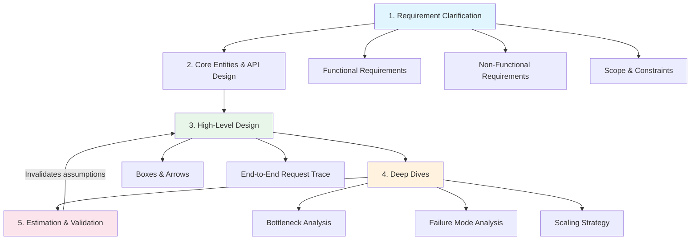
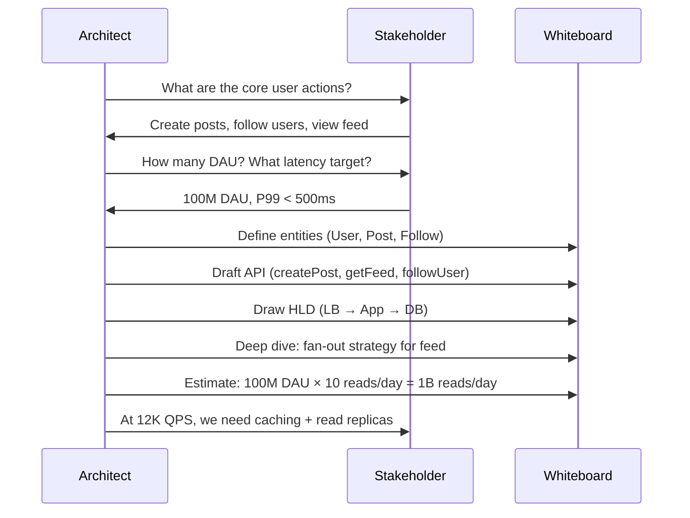

# System Design Framework

## 1. Overview

A system design framework is a repeatable methodology for translating ambiguous business requirements into defensible technical architecture. It is not a checklist to memorize -- it is a disciplined approach that prevents the two most common failure modes: premature optimization (jumping to billion-user scale before the core contract is satisfied) and aimless exploration (spending forty minutes on database schemas while ignoring the actual bottleneck).

In practice, whether you are leading a design review with your team or navigating a 50-minute interview, the framework ensures that every architectural decision traces back to a stated requirement, every trade-off is explicit, and the system evolves from a minimal working design toward production-grade resilience.

## 2. Why It Matters

Architecture without methodology is guesswork. The framework exists because:

- **Ambiguity kills projects.** A system designed without clear requirements will either be over-engineered (wasting capital) or under-engineered (collapsing under real traffic). Designing a globally distributed, strongly consistent database for a feature that only needs eventual consistency is not "planning for the future" -- it is burning money.
- **Trade-offs must be explicit.** Every addition to a system that improves scalability, consistency, or latency also increases complexity, cost, and operational burden. The framework forces you to name those trade-offs rather than hoping they resolve themselves.
- **Time is finite.** In both interviews and real sprint cycles, you cannot discuss everything. The framework provides a priority order that ensures the highest-impact decisions are made first.

## 3. Core Concepts

- **Functional Requirements (FRs):** The user-facing actions -- the "verbs" of the system. Examples: "create a tweet," "book a ticket," "swipe right on a profile." These define what the system does.
- **Non-Functional Requirements (NFRs):** The quality attributes -- the "adjectives." Examples: 99.99% availability, sub-300ms P99 latency, support for 100M DAU. These define how well the system does it.
- **Core Entities:** The "nouns" -- User, Post, Ticket, Order. These inform the data model and API contract.
- **API Contract:** The formal agreement between client and server. Whether RESTful endpoints or WebSocket channels, the API must be exhaustive enough to satisfy all functional requirements.
- **High-Level Design (HLD):** The initial end-to-end architecture -- boxes and arrows that prove the concept works, even if it has "warts."
- **Deep Dives:** Targeted analysis of bottlenecks, failure modes, and scaling challenges identified in the HLD.
- **Back-of-Envelope Estimation:** Quantitative math (QPS, storage, bandwidth) used as a design tool to validate or invalidate architectural choices. See [Back-of-Envelope Estimation](./back-of-envelope-estimation.md) for detailed methodology.

## 4. How It Works

The framework proceeds through five phases. Each phase produces artifacts that feed the next.

### Phase 1: Requirement Clarification (5-10 minutes)

Before a single component is drawn, the boundaries of the system must be strictly defined.

1. **Identify user categories and roles.** Who uses this system? Manual users vs. programmatic clients? Consumer vs. enterprise? List the roles (buyer, seller, viewer, admin).
2. **Extract functional requirements.** Brainstorm and scribble down the full list, then discuss. Do not enumerate one at a time -- you will miss requirements. Match each to a user story.
3. **Quantify non-functional requirements.** Every requirement needs a number. How many DAU? What P99 latency? What availability target? What consistency model? See [Availability and Reliability](./availability-reliability.md) for nines targets.
4. **Establish scope.** Ask: "Are there other user requirements?" Explicitly agree on what is in and out of scope. Do not let the interviewer (or stakeholder) do the thinking for you.
5. **State the CAP trade-off.** For distributed systems, declare upfront whether you favor Consistency or Availability during partitions. See [CAP Theorem](./cap-theorem.md).

**The Five-Minute Rule:** Failing to distinguish FRs from NFRs within the first five minutes is a critical failure. Without this clarity, you risk building "interesting but irrelevant" architectures.

### Phase 2: Core Entities and API Design (5 minutes)

1. Identify the primary entities (nouns) and their relationships.
2. Draft API endpoints -- pseudocode function signatures mapped to user stories.
3. Choose the communication pattern: REST for standard CRUD, WebSockets for bidirectional real-time, SSE for unidirectional streaming, gRPC for internal microservice calls.
4. Ensure every functional requirement has at least one API endpoint.

### Phase 3: High-Level Design (10-15 minutes)

Build the simplest end-to-end system that satisfies the functional requirements.

1. Draw a box for each user type, each service, and each data store.
2. Draw the connections (arrows) showing data flow.
3. Include the minimum infrastructure: load balancer, application server(s), primary data store.
4. Prove the concept works by tracing a single request through the entire system.

The HLD may have performance problems, single points of failure, or scaling limitations. That is acceptable -- it must prove correctness before you optimize.

### Phase 4: Deep Dives (15-20 minutes)

Proactively identify bottlenecks and failure modes in the HLD, then solve them.

Common deep-dive targets:
- **Read-heavy bottleneck:** Add caching layers, read replicas, CDN. Cross-link to [Caching](../caching/caching.md).
- **Write-heavy bottleneck:** Introduce message queues, async processing, write-back patterns.
- **Data volume:** Apply [Sharding](../scalability/sharding.md) with appropriate shard key design.
- **Hot spots / Celebrity problem:** Use compound shard keys, N-cache strategy, or hybrid fan-out. Cross-link to [Fan-out](../patterns/fan-out.md).
- **Single points of failure:** Add redundancy at every layer -- [Load Balancing](../scalability/load-balancing.md), database replication, multi-AZ deployment.
- **Consistency challenges:** Choose between strong and eventual consistency per data path. Cross-link to [CAP Theorem](./cap-theorem.md).

### Phase 5: Strategic Estimation and Validation

Use [Back-of-Envelope Estimation](./back-of-envelope-estimation.md) as a design tool, not a perfunctory ritual.

Example: For Facebook Post Search --
- Scale: 1B posts/day x 365 days x 10 years = 3.6 trillion posts
- Storage: 3.6T posts x 1 KB/post = 3.6 PB

That 3.6 PB figure immediately invalidates any standard relational database approach and dictates the move toward distributed blob storage and a highly sharded inverted index. The math drives the architecture.

## 5. Architecture / Flow

## 6. Types / Variants

| Framework Variant | Source | Key Differentiator |
|---|---|---|
| **Hello Interview Delivery Model** | YouTube Reports 5-6 | Emphasizes "math as a design tool" -- estimation drives pivots |
| **Acing System Design Flow** | Acing the System Design Interview (Tan) | Phases 1-4 with explicit diagram-first approach (C4 model) |
| **Grokking Step-by-Step** | Grokking System Design | Requirements → Estimation → HLD → Detailed Design → identify bottlenecks |
| **DDIA First-Principles** | Designing Data-Intensive Applications | Reliability → Scalability → Maintainability as the three pillars |

All variants converge on the same core: clarify requirements first, build simple, then deepen. The differences are in emphasis and ordering of estimation vs. design.

### Non-Functional Requirements Checklist

The following NFRs should be explicitly discussed at the start of every design. For each, state a target number or make a deliberate trade-off:

| NFR | Question to Ask | Typical Targets |
|---|---|---|
| **Scalability** | How many DAU? Peak concurrent users? | 1M, 10M, 100M, 1B |
| **Availability** | What nines target? | 99.9% (standard), 99.99% (high), 99.999% (critical) |
| **Latency** | What P99 target? | < 100ms (real-time), < 500ms (interactive), < 2s (acceptable) |
| **Consistency** | Strong or eventual? Per data path? | Strong for money/inventory, eventual for feeds/search |
| **Durability** | Can we lose data? | Zero data loss for financial; tolerable for analytics |
| **Throughput** | Read QPS? Write QPS? | Varies -- calculate from DAU |
| **Storage** | How much data over N years? | Calculate from record sizes and growth rates |
| **Cost** | Budget constraints? Cloud vs. on-prem? | Determine build vs. buy decisions |
| **Security** | Authentication model? Encryption requirements? | JWT/OAuth, TLS 1.3, encryption at rest |
| **Maintainability** | How complex is acceptable? Team size? | Simpler is better; complexity must be justified |

### The "Known Unknowns" Meta-Awareness

A technique that separates senior architects from staff-level engineers: explicitly identify the gaps in your own design before someone else does.

After completing the deep dives, step back and ask:
- "What have I not addressed?"
- "Where would this system fail under 10x the expected load?"
- "What happens if [dependency X] goes down?"
- "Are there any data consistency windows where a user could see incorrect state?"

Stating these known unknowns demonstrates architectural maturity and invites productive discussion rather than defensive responses.

## 7. Use Cases

- **Interview setting:** A 50-minute design session where you must move from ambiguity to a defensible architecture. The framework prevents "getting lost in the weeds" on any single component. Allocate time roughly as: requirements (5-10 min), entities + API (5 min), HLD (10-15 min), deep dives (15-20 min), wrap-up (5 min).
- **Architecture review:** A team evaluating a proposed system. The framework ensures the review covers requirements, trade-offs, bottlenecks, and failure modes systematically. Use it as a review checklist: "Did we state the NFRs? Did we identify the bottlenecks? Did we estimate storage?"
- **Greenfield project:** A startup building its first production system. The framework prevents over-engineering (you do not need Kafka on day one) while leaving clear extension points. Start with managed services (RDS, S3, CloudFront) and evolve.
- **Migration planning:** Moving from monolith to microservices. The framework identifies which functional requirements drive the decomposition and which NFRs constrain the timeline.
- **Capacity planning:** An operations team planning for next quarter's traffic. The estimation phase (Phase 5) provides the methodology for translating business projections into infrastructure requirements.
- **Post-incident review:** After an outage, trace back through the framework: "Did our NFRs account for this failure mode? Was this a known unknown we failed to address?"

## 8. Tradeoffs

| Decision Point | Option A | Option B | Guidance |
|---|---|---|---|
| Depth vs. Breadth | Deep dive into one component | Cover all components shallowly | Default to breadth first (prove E2E), then deep dive into 2-3 areas |
| Start simple vs. Start at scale | Build for current load | Build for 10x projected load | Start simple. Scale when the math demands it. |
| SQL vs. NoSQL | Relational with ACID | NoSQL with horizontal scale | Let the access pattern decide, not the technology hype |
| Consistency vs. Availability | Strong consistency (CP) | High availability (AP) | Depends on the cost of "being wrong" vs. "being unavailable" |
| Build vs. Buy | Custom infrastructure | Managed cloud services | Default to managed services; build custom only when managed cannot meet requirements |
| Synchronous vs. Asynchronous | Direct request-response | Message queue / event-driven | Synchronous for user-facing latency-sensitive paths; async for background processing |
| Monolith vs. Microservices | Single deployable unit | Independent services | Monolith for small teams (<10 engineers); microservices when org scaling demands it |
| Real-time vs. Batch | Process immediately | Process in batches | Real-time for user-visible actions; batch for analytics, ETL, reconciliation |

### The "Everything is a Tradeoff" Principle

The most important meta-insight from the Acing the System Design Interview source: there is almost never any characteristic of a system that is entirely positive and without tradeoffs. Any new addition to a system that improves scalability, consistency, or latency also increases complexity and cost and requires security, logging, monitoring, and alerting.

When you propose a solution, immediately state the trade-off:
- "Adding a cache reduces read latency from 50ms to 1ms, but introduces cache invalidation complexity and a stale data window."
- "Sharding the database increases write throughput by 10x, but makes cross-user queries expensive and eliminates foreign key constraints."
- "Using eventual consistency reduces write latency to 5ms, but means users may see stale data for up to 3 seconds."

This discipline distinguishes architects from engineers who propose solutions without acknowledging their costs.

## 9. Common Pitfalls

- **Jumping to solutions.** Drawing a Kafka cluster before stating requirements is the #1 failure mode. Every component must trace to a stated requirement.
- **Ignoring non-functional requirements.** A system that "works" but has no availability target, no latency SLA, and no capacity plan is not a design -- it is a prototype.
- **Over-engineering day one.** Investing in sharding, consistent hashing, and multi-region replication before you have 1,000 users is burning capital. Design for the current scale with clear extension points.
- **Treating estimation as ritual.** Back-of-envelope math is a design tool. If the numbers do not change your architecture, you are doing them wrong or doing them too late.
- **Forgetting observability.** A system without logging, monitoring, and alerting is a liability. Mention it even if you do not deep-dive it.
- **Not driving the discussion.** In interviews and design reviews, the architect must drive. Suggest topics, ask which direction to go, and identify your own "known unknowns" before someone else does.

## 10. Real-World Examples

- **Twitter:** The hybrid fan-out decision (fan-out on write for normal users, fan-out on read for celebrities) is a direct output of the framework: functional requirement (view timeline) + non-functional requirement (sub-second latency) + estimation (celebrity with 50M followers = 50M writes per tweet) = hybrid architecture.
- **Ticketmaster:** Strong consistency is the #1 NFR (no double-booking). This single requirement drives the entire architecture: two-phase booking, distributed locks with TTL, virtual waiting room for surge protection.
- **Facebook Post Search:** The 3.6 PB storage estimate (Phase 5) invalidated a relational approach and dictated the move to distributed inverted indexes with S3 backing. The math drove the architecture.
- **Netflix:** The infrastructure maturity model in practice -- started with a monolith, evolved to microservices with API gateway, per-service load balancers, and edge proxies as traffic demanded it.

## 11. Related Concepts

- [Back-of-Envelope Estimation](./back-of-envelope-estimation.md) -- quantitative validation of design decisions
- [Scaling Overview](./scaling-overview.md) -- vertical vs. horizontal scaling philosophy
- [Availability and Reliability](./availability-reliability.md) -- nines targets and SLA/SLO definitions
- [CAP Theorem](./cap-theorem.md) -- consistency vs. availability trade-off
- [Load Balancing](../scalability/load-balancing.md) -- traffic distribution as the first scaling mechanism
- [Sharding](../scalability/sharding.md) -- data partitioning as a deep-dive target

## 12. Source Traceability

- source/youtube-video-reports/3.md -- Requirements framework (FR vs NFR), five-minute rule
- source/youtube-video-reports/5.md -- Hello Interview delivery framework, math as design tool
- source/youtube-video-reports/6.md -- Hello Interview delivery model, estimation-driven pivots
- source/youtube-video-reports/7.md -- Final system design interview checklist
- source/youtube-video-reports/9.md -- Back-of-envelope estimation integration
- source/extracted/acing-system-design/ch04-a-typical-system-design-interview-flow.md -- Interview flow phases, requirement clarification methodology
- source/extracted/acing-system-design/ch05-non-functional-requirements.md -- NFR definitions and trade-offs
- source/extracted/grokking/ch01-system-design-interviews-a-step-by-step-guide.md -- Step-by-step interview guide
- source/extracted/ddia/ch02-reliable-scalable-and-maintainable-applications.md -- Reliability, scalability, maintainability pillars
