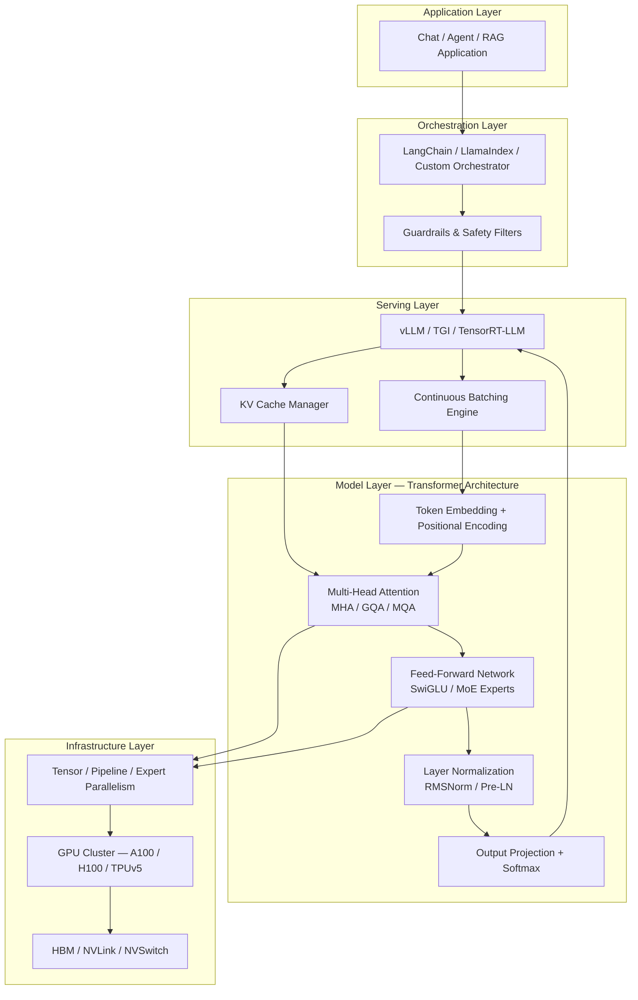
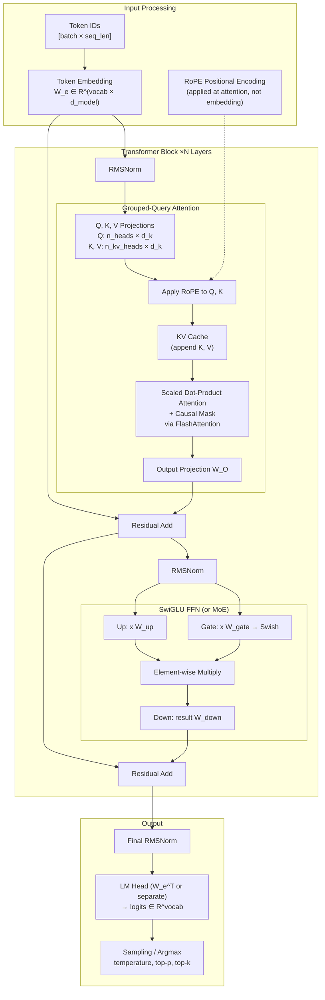
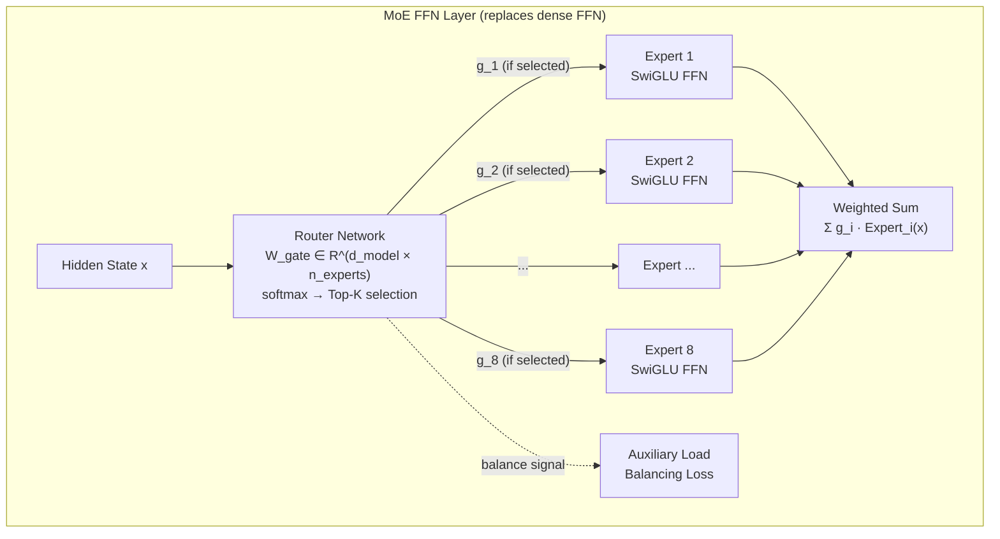

# Transformer Architecture

## 1. Overview

The Transformer architecture, introduced in *"Attention Is All You Need"* (Vaswani et al., 2017), is the foundational neural network architecture behind every modern large language model. It replaced recurrence and convolutions entirely with self-attention mechanisms, enabling fully parallel training across sequence positions and achieving superior performance on virtually all NLP benchmarks.

For AI system architects, the Transformer is not merely a model — it is the computational substrate that determines inference latency, memory requirements, parallelization strategy, and cost structure. Every decision downstream — KV cache sizing, tensor parallelism sharding, quantization strategy, batch scheduling — flows directly from the specific Transformer variant deployed. A Principal Architect who cannot reason about attention complexity, head configurations, and normalization choices cannot make informed infrastructure decisions.

**Key numbers that drive system design:**
- Self-attention is O(n²) in sequence length — this single fact motivates FlashAttention, sparse attention, context windowing, and most inference optimizations
- The KV cache grows linearly with sequence length and batch size, consuming 1–3 GB per request at 128K context on a 70B model
- Feed-forward networks account for ~67% of model parameters but only ~33% of inference latency (memory-bandwidth bound)
- A 70B parameter model requires ~140 GB in FP16, mandating multi-GPU deployment

---

## 2. Where It Fits in GenAI Systems

The Transformer architecture sits at Layer 0 of any Generative AI system. Every component above it — serving infrastructure, orchestration, retrieval, guardrails — is shaped by the architectural choices made within the Transformer itself.



**Upstream dependencies:** Tokenizer converts text to token IDs before the embedding layer. Positional encoding is injected at or after embedding.

**Downstream consumers:** The serving layer (vLLM, TGI, TensorRT-LLM) wraps the Transformer for batching, KV cache management, and memory optimization. The choice of attention variant (MHA vs. GQA) directly determines KV cache memory per request, which determines maximum batch size, which determines throughput and cost.

---

## 3. Core Concepts

### 3.1 Self-Attention Mechanism

Self-attention is the core operation that allows every token in a sequence to attend to every other token, computing a weighted combination of value vectors based on query-key compatibility scores.

**Scaled Dot-Product Attention:**

```
Attention(Q, K, V) = softmax(Q K^T / √d_k) V
```

Where:
- **Q** (Queries), **K** (Keys), **V** (Values) are linear projections of the input: Q = XW_Q, K = XW_K, V = XW_V
- **d_k** is the dimension of keys (typically d_model / n_heads)
- The **√d_k scaling** prevents softmax saturation — without it, dot products grow proportional to d_k, pushing softmax into regions with vanishing gradients
- The output is a weighted sum of V vectors, where weights are determined by Q-K compatibility

**Computational and memory complexity:**
- **Compute:** O(n² · d) where n = sequence length, d = head dimension
- **Memory:** O(n²) for the attention score matrix
- For a 128K context window with 128-dim heads: the attention matrix alone is 128K × 128K = 16.4 billion elements per head per layer

**Causal masking (decoder-only):** An upper-triangular mask is applied to the attention scores before softmax, ensuring token i can only attend to positions ≤ i. This is what makes autoregressive generation possible — each token is generated conditioned only on previous tokens.

**Why O(n²) drives everything:** At 4K context, attention compute is manageable. At 128K context, it is 1,024x larger. This quadratic scaling is the single most important architectural constraint and the reason FlashAttention, PagedAttention, sparse attention, sliding window attention, and context compression techniques exist as entire research areas.

### 3.2 Multi-Head Attention and Its Variants

Multi-head attention splits the d_model dimension into h parallel attention heads, each operating on a d_k = d_model / h subspace. The outputs are concatenated and projected.

```
MultiHead(Q, K, V) = Concat(head_1, ..., head_h) W_O
where head_i = Attention(Q W_Q^i, K W_K^i, V W_V^i)
```

This allows the model to jointly attend to information from different representation subspaces — one head might capture syntactic dependencies, another semantic similarity, another positional relationships.

#### Multi-Head Attention (MHA)

The original formulation. Each head has independent Q, K, and V projections.

- **KV cache per layer:** 2 × n_heads × d_k × seq_len × batch_size × bytes_per_element
- **Example (GPT-3 175B):** 96 heads, d_k = 128, 96 layers → at 4K context in FP16, KV cache = 2 × 96 × 128 × 4096 × 96 × 2 bytes ≈ 9.4 GB per sequence
- **Used by:** GPT-3, BLOOM-176B, LLaMA 2 7B/13B

#### Multi-Query Attention (MQA)

Shares a single K and V projection across all heads. Only Q has per-head projections.

- **KV cache reduction:** h× smaller (e.g., 96× for GPT-3-scale models)
- **Tradeoff:** 1–3% quality degradation on some benchmarks
- **Used by:** PaLM, PaLM-2, Falcon-40B, StarCoder

#### Grouped-Query Attention (GQA)

A compromise: groups of heads share K/V projections. If n_heads = 64 and n_kv_heads = 8, each group of 8 query heads shares one K/V head.

- **KV cache reduction:** n_heads / n_kv_heads × smaller (e.g., 8× for the above config)
- **Quality:** Within 0.5–1% of MHA on most benchmarks — virtually indistinguishable in practice
- **Used by:** LLaMA 2 70B (8 KV heads), LLaMA 3 all sizes, Mistral 7B (8 KV heads), Gemma, Qwen 2

| Variant | KV Heads | KV Cache Size (relative) | Quality Impact | Inference Throughput |
|---------|----------|--------------------------|----------------|---------------------|
| MHA | n_heads | 1× (baseline) | Baseline | 1× |
| GQA | n_groups (e.g., 8) | n_groups / n_heads (e.g., 1/8×) | −0.5 to 1% | 4–8× |
| MQA | 1 | 1 / n_heads (e.g., 1/96×) | −1 to 3% | 8–16× |

**Architectural decision:** GQA has become the de facto standard for all new production models ≥7B parameters. The quality-efficiency tradeoff is overwhelmingly favorable, and the KV cache savings directly translate to higher batch sizes and lower per-token serving cost.

### 3.3 Positional Encoding

Transformers are permutation-invariant by design — self-attention treats its input as a set, not a sequence. Positional encoding injects sequence order information.

#### Sinusoidal (Original Transformer)

```
PE(pos, 2i) = sin(pos / 10000^(2i/d_model))
PE(pos, 2i+1) = cos(pos / 10000^(2i/d_model))
```

- No learned parameters; theoretically can extrapolate to unseen lengths
- In practice, extrapolation is unreliable beyond training length
- Historically important but no longer used in production LLMs

#### Learned Absolute Embeddings

- A trainable embedding matrix E ∈ R^(max_seq_len × d_model) added to token embeddings
- **Hard length limit:** Cannot process sequences beyond max_seq_len from training
- **Used by:** GPT-2, GPT-3, BERT, original GPT-4 (rumored)

#### Rotary Position Embedding (RoPE)

The dominant modern approach. Encodes absolute position by rotating Q and K vectors in 2D subspaces:

```
f(x_m, m) = R_m · x_m, where R_m is a block-diagonal rotation matrix
    R_m = diag(R(m, θ_1), R(m, θ_2), ..., R(m, θ_{d/2}))
    R(m, θ_i) = [[cos(mθ_i), -sin(mθ_i)], [sin(mθ_i), cos(mθ_i)]]
```

**Key properties:**
- Encodes **relative** position through the dot product: q_m · k_n depends only on (m − n)
- The rotation angles θ_i form a geometric sequence, with lower frequencies capturing long-range and higher frequencies capturing local dependencies
- **Context extension** is achievable via Position Interpolation (PI) or NTK-aware scaling without full retraining — this is why LLaMA 2 (trained at 4K) could be extended to 32K–128K
- **Used by:** LLaMA 1/2/3, Mistral, Qwen, DeepSeek, Gemma, Falcon (newer versions), Phi, CodeLlama — essentially all modern open-weight models

#### ALiBi (Attention with Linear Biases)

Adds a distance-dependent linear bias directly to attention scores instead of modifying embeddings:

```
softmax(Q K^T / √d_k + m · [0, -1, -2, ..., -(n-1)])
```

Where m is a head-specific slope (geometric series from 2^(-8/n_heads) to 2^(-8)).

- Simpler than RoPE; no changes to Q/K computation
- Good extrapolation properties with zero-shot length generalization
- **Used by:** BLOOM-176B, MPT-7B/30B
- Less popular than RoPE due to slightly worse quality at the trained context length

| Method | Learned Params | Relative Position | Context Extension | Extrapolation | Adoption |
|--------|---------------|-------------------|-------------------|---------------|----------|
| Sinusoidal | None | No | None | Poor | Historical |
| Learned Absolute | max_len × d | No | None | Impossible | GPT-2/3, BERT |
| RoPE | None | Yes (via dot product) | PI, NTK scaling | Good with scaling | De facto standard |
| ALiBi | None | Yes (via bias) | Zero-shot | Good | BLOOM, MPT |

### 3.4 Encoder vs. Decoder vs. Encoder-Decoder

#### Encoder-Only (BERT, RoBERTa, DeBERTa)

- **Bidirectional attention:** Every token attends to all other tokens (no causal mask)
- Trained with Masked Language Modeling (MLM): predict randomly masked tokens
- Produces contextual representations; not generative
- **Use cases:** Classification, NER, sentence embeddings, reranking
- **System design note:** Still the best architecture for embedding models (e.g., BGE, E5, GTE)

#### Decoder-Only (GPT, LLaMA, Claude, Mistral, Gemini)

- **Causal (left-to-right) attention:** Token i attends only to tokens 1..i
- Trained with next-token prediction (autoregressive language modeling)
- Generates text token-by-token
- **Dominant paradigm:** Every major production LLM since GPT-3 is decoder-only

#### Encoder-Decoder (T5, BART, Whisper, Flan-T5)

- Encoder processes input bidirectionally; decoder generates output autoregressively with cross-attention to encoder states
- **Use cases:** Translation, summarization, speech-to-text (Whisper), structured extraction
- Cross-attention adds a separate Q (from decoder) × K, V (from encoder) attention per layer

#### Why Decoder-Only Won

1. **Simpler training objective:** Next-token prediction scales cleanly with compute (Chinchilla scaling laws)
2. **Unified interface:** Same architecture for all tasks via prompting — no need for task-specific heads
3. **Emergent abilities:** In-context learning, chain-of-thought, and instruction following emerge naturally from scale
4. **KV cache efficiency:** Only one set of KV states to manage (no encoder states + decoder states)
5. **Scaling empirics:** Google's UL2 paper and Meta's research showed decoder-only matches encoder-decoder quality at equivalent compute with simpler infrastructure

### 3.5 Feed-Forward Networks (FFN)

Each Transformer layer contains a position-wise FFN applied independently to every token. In the original Transformer:

```
FFN(x) = max(0, x W_1 + b_1) W_2 + b_2
```

With d_ff = 4 × d_model (e.g., d_model = 4096 → d_ff = 16384 for a 7B model).

**Parameter distribution:** The FFN contains ~67% of parameters in a standard Transformer layer. For GPT-3 (d_model = 12288, d_ff = 49152): each FFN layer has 2 × 12288 × 49152 ≈ 1.2B parameters, vs. ~600M for attention.

#### SwiGLU Activation

The dominant modern FFN variant, proposed by Shazeer (2020):

```
SwiGLU(x) = (x W_1 ⊙ Swish(x W_gate)) W_2
```

Where Swish(x) = x · σ(βx) and ⊙ is element-wise multiplication. SwiGLU uses three weight matrices instead of two but with reduced d_ff (typically d_ff = 8/3 × d_model rounded to nearest multiple of 256) to keep parameter count constant.

- **Quality improvement:** Consistent 0.5–1% improvement across benchmarks vs. ReLU/GELU
- **Used by:** LLaMA 1/2/3, Mistral, Gemma, Qwen, PaLM, Phi — essentially all modern LLMs
- **System design impact:** Three matrices instead of two changes tensor parallelism sharding patterns

### 3.6 Layer Normalization

#### Post-LN (Original Transformer)

LayerNorm is applied **after** the residual addition:
```
x = LayerNorm(x + Sublayer(x))
```
- Suffers from training instability at large scale — gradients through residual path are distorted by normalization
- Requires careful learning rate warmup
- Largely abandoned for LLM training

#### Pre-LN (GPT-2 onwards)

LayerNorm is applied **before** the sublayer:
```
x = x + Sublayer(LayerNorm(x))
```
- Clean gradient flow through the residual path (identity connection from input to output)
- Dramatically more stable training — enables training 100B+ models without gradient explosion
- **Used by:** GPT-2, GPT-3, BLOOM, Falcon, most models before 2023

#### RMSNorm (Root Mean Square Layer Normalization)

A simplified variant that removes the mean-centering step:
```
RMSNorm(x) = x / RMS(x) · γ, where RMS(x) = √(1/d · Σx_i²)
```
- ~10–15% faster than full LayerNorm (eliminates mean computation and subtraction)
- Comparable quality in practice
- **Used by:** LLaMA 1/2/3, Mistral, Gemma, Qwen, PaLM-2 — the modern standard

### 3.7 Mixture of Experts (MoE)

MoE replaces the dense FFN with multiple "expert" FFN sub-networks and a gating/routing mechanism that selects a sparse subset of experts for each token.

#### Architecture

```
MoE(x) = Σ_{i ∈ TopK} g_i(x) · Expert_i(x)
where g(x) = TopK(softmax(x W_gate))
```

- **Total parameters** = n_experts × expert_params (large model capacity)
- **Active parameters** per token = K × expert_params (efficient compute)
- Typical configurations: 8 experts with top-2 routing (Mixtral), 64 experts with top-2 (DeepSeek-V2), 16 experts with top-2 (likely GPT-4)

#### Routing Mechanisms

| Router Type | Description | Used By |
|-------------|-------------|---------|
| Token-choice Top-K | Each token selects its top-K experts via softmax gating | Mixtral, Switch Transformer |
| Expert-choice | Each expert selects its top-K tokens (better load balance) | Expert Choice (Zhou et al.) |
| Shared + routed | Some experts are always active (shared), others are routed | DeepSeek-V2 |

#### Load Balancing

Without explicit balancing, routing collapses — a few "popular" experts handle most tokens while others remain idle. Solutions:
- **Auxiliary load-balancing loss:** Penalizes uneven expert utilization (standard approach, used by Mixtral)
- **Expert capacity factor:** Each expert has a max number of tokens it can process per batch; overflow tokens are dropped or sent to a default expert
- **Jitter noise:** Random noise added to gating logits during training to encourage exploration

#### Mixtral 8×7B Deep Dive

- **8 experts**, each ~7B-equivalent FFN, **top-2 routing** per token
- **Total parameters:** ~46.7B
- **Active parameters per token:** ~12.9B (2 experts × ~6.4B FFN + shared attention)
- **Attention layers are NOT sparse** — only FFN layers use MoE
- Matches or exceeds LLaMA 2 70B on most benchmarks at 2.5× less compute per token
- **32K context window**, GQA, SwiGLU, RoPE, RMSNorm, sliding window attention
- **Apache 2.0 license** — fully open

#### System Design Implications of MoE

- **Memory:** Must load ALL expert parameters into memory, even though only K are active per token → Mixtral requires ~94 GB in FP16, same as a dense ~47B model in terms of memory but with throughput closer to a ~13B model
- **Expert parallelism:** Experts can be sharded across GPUs — each GPU holds a subset of experts, with all-to-all communication for token routing
- **Batch efficiency:** Different tokens in a batch route to different experts, creating irregular computation patterns that reduce GPU utilization
- **Quantization:** Infrequently used experts can be quantized more aggressively than popular ones

### 3.8 The O(n²) Problem and Its Consequences

The quadratic scaling of attention with sequence length is the central architectural tension in Transformer-based systems. Here is a concrete analysis of how it manifests:

| Context Length | Attention FLOPs (relative) | KV Cache (70B, FP16, per seq) | Practical Impact |
|---------------|---------------------------|-------------------------------|------------------|
| 2K | 1× | ~0.3 GB | Batch of 32 fits one A100 80GB |
| 4K | 4× | ~0.6 GB | Standard GPT-3 context |
| 32K | 256× | ~4.8 GB | Max batch ~12 on A100 |
| 128K | 4,096× | ~19 GB | Max batch 2–3 on A100 |
| 1M | 250,000× | ~150 GB | Requires multi-GPU even for single sequence |

**Mitigation strategies (covered in related topics):**
- **FlashAttention:** Fuses attention computation to avoid materializing the O(n²) attention matrix in HBM; reduces memory from O(n²) to O(n) while maintaining exact computation
- **Sliding window attention:** Limits attention to a local window (e.g., 4096 tokens in Mistral), reducing to O(n × w) but losing global context
- **Sparse attention:** Various patterns (local + global, strided, etc.) that reduce to O(n√n) or O(n log n)
- **Linear attention:** Approximations that achieve O(n) but with quality degradation
- **KV cache compression:** Quantize, evict, or merge old KV cache entries

---

## 4. Architecture

### 4.1 Canonical Decoder-Only Transformer (Modern LLM)



### 4.2 MoE Variant (Mixtral-style)



### 4.3 Architecture Comparison Table

| Model | Params | Layers | d_model | Heads | KV Heads | d_ff | Attention | Pos. Enc. | Norm | FFN Act. | Vocab | Context |
|-------|--------|--------|---------|-------|----------|------|-----------|-----------|------|----------|-------|---------|
| GPT-3 175B | 175B | 96 | 12288 | 96 | 96 (MHA) | 49152 | MHA | Learned | Pre-LN | GELU | 50257 | 2K |
| LLaMA 2 7B | 6.7B | 32 | 4096 | 32 | 32 (MHA) | 11008 | MHA | RoPE | RMSNorm | SwiGLU | 32000 | 4K |
| LLaMA 2 70B | 70B | 80 | 8192 | 64 | 8 (GQA) | 28672 | GQA | RoPE | RMSNorm | SwiGLU | 32000 | 4K |
| LLaMA 3 8B | 8B | 32 | 4096 | 32 | 8 (GQA) | 14336 | GQA | RoPE | RMSNorm | SwiGLU | 128000 | 8K |
| LLaMA 3 70B | 70B | 80 | 8192 | 64 | 8 (GQA) | 28672 | GQA | RoPE | RMSNorm | SwiGLU | 128000 | 8K |
| LLaMA 3.1 405B | 405B | 126 | 16384 | 128 | 8 (GQA) | 53248 | GQA | RoPE | RMSNorm | SwiGLU | 128000 | 128K |
| Mistral 7B | 7.3B | 32 | 4096 | 32 | 8 (GQA) | 14336 | GQA + SWA | RoPE | RMSNorm | SwiGLU | 32000 | 32K* |
| Mixtral 8×7B | 46.7B (12.9B active) | 32 | 4096 | 32 | 8 (GQA) | 14336 | GQA + MoE | RoPE | RMSNorm | SwiGLU | 32000 | 32K |
| BLOOM 176B | 176B | 70 | 14336 | 112 | 112 (MHA) | 57344 | MHA | ALiBi | Pre-LN | GELU | 250680 | 2K |
| Falcon 40B | 40B | 60 | 8192 | 64 | 1 (MQA) | 32768 | MQA | RoPE | Pre-LN | GELU | 65024 | 2K |
| Gemma 2 27B | 27B | 46 | 4608 | 32 | 16 (GQA) | 36864 | GQA + SWA/Global | RoPE | RMSNorm | GeGLU | 256000 | 8K |
| Claude family | Undisclosed | — | — | — | — | — | Undisclosed | Undisclosed | — | — | — | Up to 1M |
| Gemini family | Undisclosed (rumored MoE) | — | — | — | — | — | Undisclosed | Undisclosed | — | — | — | Up to 2M |
| GPT-4 | Undisclosed (rumored ~1.8T MoE, ~220B active) | — | — | — | — | — | Undisclosed | Undisclosed | — | — | — | 128K |

\* Mistral 7B uses sliding window attention with a 4096-token window but supports 32K context via the rolling buffer mechanism.

---

## 5. Design Patterns

### Pattern 1: GQA + RoPE + RMSNorm + SwiGLU (The Modern Standard)

**When to use:** Building or fine-tuning any new dense model above 1B parameters.

This is the converged recipe used by LLaMA 3, Mistral, Gemma 2, Qwen 2, Phi-3, and DeepSeek-V2 (for the attention portion). It represents the "best known configuration" as of 2025.

- GQA with 8 KV heads provides near-MHA quality with 4–8× KV cache reduction
- RoPE enables post-training context extension via PI or NTK-aware scaling
- RMSNorm is ~10–15% faster than LayerNorm with no quality loss
- SwiGLU provides consistent quality gains over GELU/ReLU

### Pattern 2: Dense-to-MoE Upcycling

**When to use:** Converting a trained dense model into a more efficient MoE model.

Copy the FFN weights from a trained dense checkpoint into multiple experts (with slight noise perturbation), add a randomly initialized router, and continue training. This has been shown to recover MoE-level performance with significantly less training than training MoE from scratch.

- **Example:** Mistral likely used this approach when creating Mixtral from Mistral 7B
- **Tradeoff:** Cheaper than training MoE from scratch but may not reach optimal expert specialization

### Pattern 3: Sliding Window + Global Attention Hybrid

**When to use:** Serving long-context applications where most information is local, but occasional global reasoning is needed.

Alternate between layers with sliding window attention (cheap, O(n × w)) and layers with full global attention (expensive, O(n²)). Gemma 2 uses this pattern — every other layer is sliding window.

- **Memory savings:** ~50% reduction in KV cache vs. all-global
- **Quality:** Minimal degradation on long-context tasks because information propagates through global layers
- **Implementation:** Straightforward in vLLM/TensorRT-LLM with per-layer attention configuration

### Pattern 4: Progressive Layer Dropping (Training Efficiency)

**When to use:** Pre-training very large models where training cost dominates.

Randomly drop entire Transformer layers during training (similar to dropout but at the layer level). Lower layers are dropped less frequently than upper layers (progressive schedule). At inference, all layers are used.

- **Compute savings:** 20–25% training FLOP reduction with <1% quality loss
- **Used by:** Some internal Google and Meta training runs

### Pattern 5: Shared Embedding / LM Head

**When to use:** Reducing parameter count in models where vocabulary is large.

Tie the token embedding matrix and the final LM head (output projection) — they share the same weight matrix W_e. The LM head computes logits as hidden_state × W_e^T.

- **Parameter savings:** For vocab = 128K, d_model = 4096: saves ~500M parameters
- **Used by:** LLaMA, GPT-2, T5, most modern models
- **Not used by:** Some models keep them separate for better output quality (GPT-3 uses a separate LM head)

---

## 6. Implementation Approaches

### 6.1 From-Scratch Implementation Stack

| Component | Library/Tool | Notes |
|-----------|-------------|-------|
| Model definition | PyTorch (nn.Module) or JAX/Flax | PyTorch dominant in open-source; JAX used by Google (PaLM, Gemini) |
| Attention kernel | FlashAttention-2 (Tri Dao) | Fused CUDA kernel; 2–4× faster and memory-efficient; integrated into PyTorch 2.0+ via `torch.nn.functional.scaled_dot_product_attention` |
| Distributed training | FSDP (PyTorch), DeepSpeed ZeRO, Megatron-LM | FSDP for <100B; Megatron-LM for 100B+ with 3D parallelism |
| Mixed precision | BF16 (preferred on A100/H100) or FP16 + loss scaling | BF16 has wider dynamic range, eliminating need for loss scaling |
| Optimizer | AdamW with cosine LR schedule | Standard for all modern LLM training |
| Data loading | Streaming from object storage (S3/GCS) | TokenBatch-level sharding across data-parallel ranks |

### 6.2 Key Implementation Details

**FlashAttention integration:**
```python
# PyTorch 2.0+ native path
from torch.nn.functional import scaled_dot_product_attention

# Automatically selects FlashAttention-2 when available
# Falls back to memory-efficient attention or math implementation
output = scaled_dot_product_attention(
    query, key, value,
    attn_mask=causal_mask,
    is_causal=True,  # uses causal mask optimization
    scale=1.0 / math.sqrt(d_k)
)
```

**RoPE implementation (simplified):**
```python
def apply_rotary_pos_emb(q, k, cos, sin):
    # q, k: [batch, heads, seq_len, d_k]
    # Reshape to pairs for rotation
    q_rot = (q * cos) + (rotate_half(q) * sin)
    k_rot = (k * cos) + (rotate_half(k) * sin)
    return q_rot, k_rot

def rotate_half(x):
    x1, x2 = x.chunk(2, dim=-1)
    return torch.cat((-x2, x1), dim=-1)
```

**GQA KV expansion for attention computation:**
```python
# n_heads=32, n_kv_heads=8 → each KV head serves 4 query heads
# Expand KV heads to match query heads for attention computation
key = key.repeat_interleave(n_heads // n_kv_heads, dim=1)
value = value.repeat_interleave(n_heads // n_kv_heads, dim=1)
# Now key, value are [batch, n_heads, seq_len, d_k]
# vLLM and TensorRT-LLM handle this expansion inside fused kernels
```

### 6.3 Serving Frameworks and Their Transformer Optimizations

| Framework | Key Optimizations | Best For |
|-----------|-------------------|----------|
| **vLLM** | PagedAttention (OS-style virtual memory for KV cache), continuous batching, speculative decoding | General production serving, highest flexibility |
| **TensorRT-LLM** (NVIDIA) | Fused kernels, INT8/FP8 quantization, in-flight batching, MoE parallelism | Maximum throughput on NVIDIA GPUs |
| **TGI** (Hugging Face) | FlashAttention, continuous batching, tensor parallelism, GPTQ/AWQ quantization | Easy deployment, HuggingFace ecosystem |
| **SGLang** | RadixAttention (prefix caching via radix tree), compressed FSM for structured generation | Structured output, multi-turn, high cache hit rate |
| **llama.cpp / GGML** | CPU inference, aggressive quantization (Q4_K_M, Q5_K_M), Metal/CUDA acceleration | Edge/desktop deployment, low-resource |

---

## 7. Tradeoffs

### Attention Variant Selection

| Decision Factor | MHA | GQA | MQA |
|----------------|-----|-----|-----|
| Quality (benchmarks) | Highest | −0.5–1% | −1–3% |
| KV Cache Memory | Highest (1×) | Medium (1/4–1/8×) | Lowest (1/n_heads×) |
| Inference Throughput | Lowest | 4–8× higher | 8–16× higher |
| Training Compute | Baseline | Slightly less | Less |
| When to Choose | Research, small models | **Default for production** | Extreme latency constraints |

### Positional Encoding Selection

| Decision Factor | Learned Absolute | RoPE | ALiBi |
|----------------|-----------------|------|-------|
| Context Extension | Impossible | PI/NTK scaling | Zero-shot extrapolation |
| Quality at Trained Length | Good | Best | Slightly below RoPE |
| Implementation Complexity | Simplest | Moderate | Simple |
| Memory Overhead | Embedding table | None | None |
| When to Choose | Never (legacy) | **Default for new models** | Simple extrapolation needs |

### Dense vs. MoE

| Decision Factor | Dense | MoE |
|----------------|-------|-----|
| Quality per Active FLOP | Lower | Higher (more total knowledge) |
| Memory Requirement | params × bytes | Same (all experts loaded) |
| Inference Latency per Token | Predictable | Variable (routing overhead) |
| Training Stability | Stable | Requires load balancing tricks |
| GPU Utilization | High (regular compute) | Lower (irregular, all-to-all comm) |
| Quantization Simplicity | Uniform | Non-uniform (expert frequency varies) |
| When to Choose | <100B or serving-constrained | Frontier models, high quality/compute ratio |

### Normalization Selection

| Decision Factor | Post-LN | Pre-LN | RMSNorm |
|----------------|---------|--------|---------|
| Training Stability | Poor at scale | Good | Good |
| Inference Speed | Baseline | Baseline | ~10–15% faster |
| Quality | Potentially higher ceiling | Good | Equivalent to Pre-LN |
| When to Choose | Never for LLMs | Legacy models | **Default for new models** |

---

## 8. Failure Modes

### 8.1 Training Failures

| Failure Mode | Symptom | Root Cause | Mitigation |
|-------------|---------|------------|------------|
| **Loss spikes** | Sudden loss increase during training | Large gradient norms, bad data batch, numerical instability | Gradient clipping (typically max_norm=1.0), BF16 instead of FP16, data quality filtering |
| **Training divergence** | Loss goes to NaN | Post-LN instability, learning rate too high, FP16 overflow | Switch to Pre-LN + RMSNorm, warmup schedule, BF16 |
| **Expert collapse (MoE)** | 1–2 experts handle >80% of tokens | Insufficient load balancing loss weight | Increase auxiliary loss coefficient, use expert-choice routing, add jitter noise |
| **Representation collapse** | All token representations converge to similar vectors | Over-regularization, normalization issues | Monitor cosine similarity between layer representations; reduce dropout |

### 8.2 Inference Failures

| Failure Mode | Symptom | Root Cause | Mitigation |
|-------------|---------|------------|------------|
| **OOM on long context** | CUDA OOM at inference | KV cache exceeds GPU memory | PagedAttention (vLLM), KV cache quantization, reduce max batch size |
| **Context length degradation** | Garbage output beyond trained context length | Positional encoding cannot extrapolate | RoPE + PI/NTK scaling, or use ALiBi model; never exceed tested context length |
| **Lost in the middle** | Model ignores information placed in middle of long context | Attention bias toward beginning and end of sequence | Place critical information at start or end; use retrieval to reduce context length |
| **Repetition loops** | Output degenerates into repeated phrases | High-probability tokens create feedback loops | Repetition penalty, frequency penalty, temperature >0, nucleus sampling |
| **Quantization quality collapse** | Major quality degradation after quantization | Outlier activations in certain channels/layers | Use SmoothQuant/GPTQ/AWQ with per-channel scaling; keep attention in higher precision; use FP8 on H100 |
| **MoE routing instability at inference** | Inconsistent outputs across runs | Routing decisions are sensitive to batch composition | Use deterministic routing (no jitter at inference), ensure consistent tokenization |

### 8.3 Architecture-Level Failures

| Failure Mode | Symptom | Root Cause | Mitigation |
|-------------|---------|------------|------------|
| **Attention sink** | First token receives disproportionate attention regardless of content | Model uses first position as a "dump" for unneeded attention mass | StreamingLLM (keep first few tokens in KV cache always); architecture-level fix requires retraining |
| **Head redundancy** | Multiple attention heads learn identical patterns | Insufficient head diversity | Head pruning post-training; GQA inherently addresses this by design |

---

## 9. Optimization Techniques

### 9.1 Attention Optimizations

| Technique | Mechanism | Speedup | Memory Savings | Exactness |
|-----------|-----------|---------|---------------|-----------|
| **FlashAttention-2** | Tiling + recomputation; avoids materializing n×n matrix in HBM | 2–4× | O(n²) → O(n) | Exact |
| **FlashAttention-3** (H100) | Exploits H100 TMA, FP8 tensor cores, warp specialization | 1.5–2× over FA-2 | Same as FA-2 | Exact |
| **Sliding Window Attention** | Attention limited to window of w tokens | O(n²) → O(nw) | Proportional | Approximate |
| **Multi-Query/Grouped-Query** | Fewer KV heads | 1× (compute same) | KV cache 4–96× smaller | Exact (different model) |
| **Ring Attention** | Distribute sequence across devices; each device computes local attention and passes KV shards in a ring | Enables arbitrary context length | Memory proportional to per-device chunk | Exact |

### 9.2 Weight Optimizations

| Technique | Mechanism | Memory Savings | Quality Impact |
|-----------|-----------|---------------|----------------|
| **FP16 / BF16** | Half-precision weights | 2× vs FP32 | Negligible |
| **INT8 (W8A8)** | 8-bit weights and activations | 2× vs FP16 | <1% degradation |
| **INT4 (GPTQ/AWQ)** | 4-bit weight-only quantization | 4× vs FP16 | 1–3% degradation |
| **FP8 (H100)** | Native FP8 tensor core support | 2× vs FP16, faster compute | <0.5% degradation |
| **Pruning** | Remove low-magnitude weights | Variable (30–50% sparsity typical) | Requires fine-tuning to recover |

### 9.3 KV Cache Optimizations

| Technique | Mechanism | Memory Savings |
|-----------|-----------|---------------|
| **PagedAttention (vLLM)** | Non-contiguous KV cache blocks, like OS virtual memory | Eliminates fragmentation (~60–90% utilization vs ~50% naive) |
| **KV Cache Quantization** | Quantize cached K/V to INT8 or FP8 | 2× per request |
| **Token Merging/Eviction** | Evict low-attention-score KV entries or merge similar tokens | Variable (up to 4× with quality degradation) |
| **Prefix Caching** | Share KV cache for common prompt prefixes (system prompts) | Proportional to shared prefix length |
| **Cross-Layer KV Sharing** | Share KV cache across adjacent layers | 2× or more (experimental) |

### 9.4 Parallelism Strategies for Large Transformers

| Strategy | What It Shards | Communication | When to Use |
|----------|---------------|---------------|-------------|
| **Tensor Parallelism (TP)** | Attention heads and FFN columns/rows across GPUs within a node | AllReduce per layer (NVLink bandwidth) | Single-node, large models (70B on 4–8 GPUs) |
| **Pipeline Parallelism (PP)** | Layers across nodes | Point-to-point (micro-batches) | Multi-node training/inference |
| **Expert Parallelism (EP)** | MoE experts across GPUs | All-to-all (tokens routed to expert-holding GPUs) | MoE models (Mixtral, GPT-4) |
| **Sequence Parallelism (SP)** | Sequence dimension for non-attention operations | AllGather / ReduceScatter | Very long sequences |
| **Data Parallelism (DP)** | Batch across GPUs | AllReduce on gradients | Training (always used alongside other strategies) |

---

## 10. Real-World Examples

### Meta — LLaMA 3.1 405B

Meta trained LLaMA 3.1 405B on a cluster of 16,384 H100 GPUs using 4D parallelism (TP=8, PP=16, CP=4, DP=128). The model uses 126 Transformer layers with GQA (128 query heads, 8 KV heads), RoPE, RMSNorm, and SwiGLU. Training consumed ~30.84M GPU-hours on 15.6T tokens. The architecture represents the current pinnacle of dense Transformer scaling. Meta open-sourced the weights under a permissive license, enabling the entire ecosystem to build on it.

**System design lesson:** Dense 405B models require 8× H100 (80 GB) for FP16 inference or 4× H100 with INT8 quantization. This makes them impractical for many production use cases compared to 70B or MoE alternatives.

### Mistral AI — Mixtral 8×7B and 8×22B

Mistral demonstrated that MoE architectures can deliver frontier-model quality at a fraction of the serving cost. Mixtral 8×7B matches LLaMA 2 70B benchmarks while using only ~13B active parameters per token — meaning it can be served on 2× A100 80GB in FP16 with throughput comparable to a 13B dense model. The combination of GQA, sliding window attention, and sparse MoE makes it one of the most cost-efficient models available.

**System design lesson:** MoE models offer the best quality-per-dollar ratio for inference but require careful expert parallelism and load-aware batching. The memory footprint is determined by total parameters (46.7B), but compute cost is determined by active parameters (12.9B).

### Google DeepMind — Gemini 1.5 Pro

Gemini 1.5 Pro achieved a breakthrough 1M-token context window (extended to 2M in some configurations). While the architecture is not fully disclosed, it is widely reported to use a MoE architecture with efficient attention mechanisms. The model maintains high recall on "needle-in-a-haystack" tests even at extreme context lengths. Google's TPUv5 infrastructure, with its high-bandwidth inter-chip interconnect (ICI), is purpose-built for the all-to-all communication patterns required by MoE and long-context attention.

**System design lesson:** 1M+ context windows are technically achievable but require specialized infrastructure. The KV cache at 1M tokens is enormous — practical deployment requires KV cache compression, distributed KV storage, or ring attention across multiple accelerators.

### NVIDIA — TensorRT-LLM Serving

NVIDIA's TensorRT-LLM compilation framework applies architecture-aware optimizations to Transformer models: fused multi-head attention kernels, FP8 quantization exploiting H100 Transformer Engine, in-flight batching that mixes prefill and decode phases, and paged KV cache. For a LLaMA 2 70B model on 4× H100, TensorRT-LLM achieves 2–3× higher throughput than naive PyTorch serving through these Transformer-specific optimizations.

### BigScience — BLOOM 176B

BLOOM is notable as the largest open-source model trained with ALiBi positional encoding and MHA (no GQA). It was trained on 46 languages using 384 A100 80GB GPUs over ~3.5 months. The choice of ALiBi was motivated by zero-shot length extrapolation needs for multilingual data. However, the lack of GQA means BLOOM's KV cache is 14× larger per sequence than an equivalently-sized GQA model, making it expensive to serve — a lesson that influenced subsequent model designs.

---

## 11. Related Topics

- **[LLM Landscape](02-llm-landscape.md):** Model-specific architecture choices and how they map to the components described here
- **[KV Cache Management](../02-llm-architecture/04-kv-cache.md):** Deep dive into the KV cache, which is entirely determined by the attention variant (MHA/GQA/MQA) and context length discussed in Sections 3.2 and 3.8
- **[Context Scaling](../02-llm-architecture/05-context-scaling.md):** Techniques for extending context windows, which build on the positional encoding foundations in Section 3.3
- **[Model Parallelism](../02-llm-architecture/06-model-parallelism.md):** Tensor, pipeline, and expert parallelism strategies for distributing the Transformer components described in Section 4
- **[Quantization](../02-llm-architecture/03-quantization.md):** Weight and activation quantization techniques applied to the Transformer layers described in Sections 3.2, 3.5, and 3.7
- **[Model Serving](../02-llm-architecture/01-model-serving.md):** Serving frameworks and their Transformer-specific optimizations (FlashAttention, PagedAttention, continuous batching)
- **[Tokenization](03-tokenization.md):** The tokenization pipeline that feeds token IDs into the Transformer's embedding layer

---

## 12. Source Traceability

| Concept | Primary Source | Year |
|---------|---------------|------|
| Transformer architecture | Vaswani et al., "Attention Is All You Need" | 2017 |
| Multi-Query Attention | Shazeer, "Fast Transformer Decoding: One Write-Head is All You Need" | 2019 |
| Grouped-Query Attention | Ainslie et al., "GQA: Training Generalized Multi-Query Transformer Models from Multi-Head Checkpoints" | 2023 |
| RoPE | Su et al., "RoFormer: Enhanced Transformer with Rotary Position Embedding" | 2021 |
| ALiBi | Press et al., "Train Short, Test Long: Attention with Linear Biases Enables Input Length Generalization" | 2022 |
| SwiGLU | Shazeer, "GLU Variants Improve Transformer" | 2020 |
| RMSNorm | Zhang & Sennrich, "Root Mean Square Layer Normalization" | 2019 |
| Mixture of Experts (modern) | Fedus et al., "Switch Transformers: Scaling to Trillion Parameter Models with Simple and Efficient Sparsity" | 2022 |
| Mixtral 8×7B | Jiang et al., "Mixtral of Experts" (Mistral AI) | 2024 |
| FlashAttention | Dao et al., "FlashAttention: Fast and Memory-Efficient Exact Attention with IO-Awareness" | 2022 |
| FlashAttention-2 | Dao, "FlashAttention-2: Faster Attention with Better Parallelism and Work Partitioning" | 2023 |
| LLaMA 2 | Touvron et al., "LLaMA 2: Open Foundation and Fine-Tuned Chat Models" (Meta) | 2023 |
| LLaMA 3 | Meta AI, "The LLaMA 3 Herd of Models" | 2024 |
| GPT-3 | Brown et al., "Language Models are Few-Shot Learners" | 2020 |
| Position Interpolation | Chen et al., "Extending Context Window of Large Language Models via Positional Interpolation" | 2023 |
| Chinchilla scaling | Hoffmann et al., "Training Compute-Optimal Large Language Models" | 2022 |
| DeepSeek-V2 MoE | DeepSeek AI, "DeepSeek-V2: A Strong, Economical, and Efficient Mixture-of-Experts Language Model" | 2024 |
| PagedAttention | Kwon et al., "Efficient Memory Management for Large Language Model Serving with PagedAttention" | 2023 |
