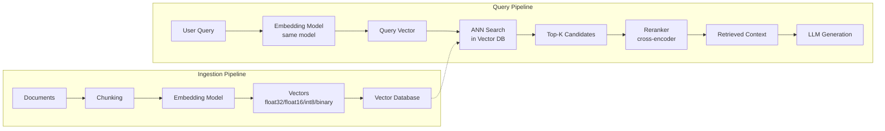
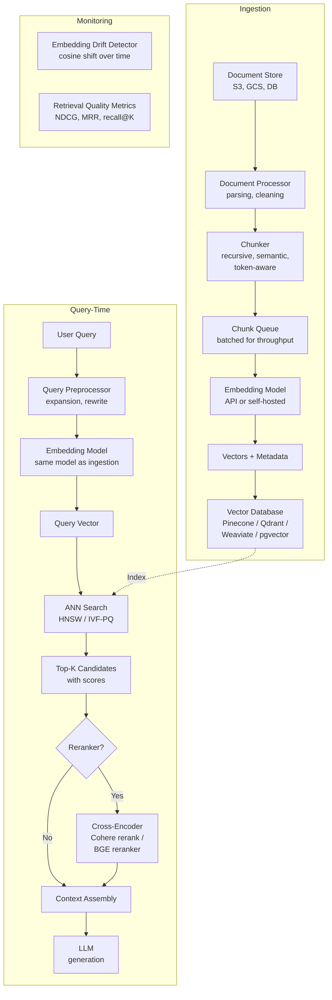
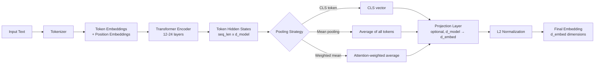

# Embeddings

## 1. Overview

Embeddings are dense, fixed-dimensional vector representations of text (or other modalities) in a continuous space where geometric proximity encodes semantic similarity. They are the bridge between discrete language and the mathematical operations that power retrieval, classification, clustering, and generation in GenAI systems. Every RAG pipeline, every semantic search system, and every vector database is built on top of embeddings.

For a principal architect, embeddings are a foundational infrastructure decision with direct cost, latency, and quality implications. The choice of embedding model determines retrieval accuracy. The choice of dimensionality determines storage cost and search speed. The choice of distance metric determines ranking behavior. The choice of quantization determines the tradeoff between memory footprint and recall. These decisions compound across billions of documents and millions of queries.

Embeddings are distinct from the internal representations within a language model (hidden states). This document covers embedding models --- dedicated models trained to produce representations optimized for similarity comparison --- not the internal embeddings of transformer layers. For transformer internals, see [Transformers](./01-transformers.md).

## 2. Where It Fits in GenAI Systems

Embeddings sit at the center of the retrieval stack that powers RAG, semantic search, recommendation, and classification systems. They are produced by embedding models and consumed by vector databases and similarity computation layers.



Embeddings are involved in three distinct system flows:
- **Offline ingestion**: Documents are chunked and embedded once, then stored. This is a batch workload where throughput matters more than latency.
- **Online query**: User queries are embedded in real-time. This is latency-sensitive (target: <50ms for embedding, <100ms for search).
- **Fine-tuning/evaluation**: Embedding quality is measured on benchmarks or domain-specific evaluation sets, driving model selection.

## 3. Core Concepts

### 3.1 Evolution of Text Embeddings

**Generation 1: Static word embeddings (2013--2017)**

- **Word2Vec** (Mikolov et al., 2013): Trained a shallow neural network to predict words from context (CBOW) or context from words (Skip-gram). Produced one vector per word. Captured analogies (`king - man + woman = queen`). Limitations: one vector per word regardless of context ("bank" in "river bank" vs "bank account" gets the same vector), out-of-vocabulary words have no representation.

- **GloVe** (Pennington et al., 2014): Factorized the word co-occurrence matrix to produce word vectors. Similar quality to Word2Vec but trained on global statistics rather than local windows. Still one-vector-per-word.

- **FastText** (Bojanowski et al., 2017): Extended Word2Vec with character n-gram subword information. Handles morphological variations and rare/unseen words by composing subword vectors.

**Generation 2: Contextual embeddings (2018--2020)**

- **ELMo** (Peters et al., 2018): Bi-directional LSTM producing context-dependent word representations. Same word gets different vectors in different sentences.

- **BERT** (Devlin et al., 2019): Transformer-based bidirectional encoder. CLS token output or mean-pooled token outputs used as sentence embeddings. Dramatically better than static embeddings for downstream tasks. But BERT was not trained for similarity --- using raw BERT embeddings for cosine similarity performs poorly.

- **Sentence-BERT (SBERT)** (Reimers and Gurevych, 2019): Fine-tuned BERT with siamese/triplet networks for sentence-level similarity. The first practical sentence embedding model for production retrieval. Enabled efficient semantic search via bi-encoder architecture.

**Generation 3: Production embedding models (2022--present)**

- **Instructor** (Su et al., 2022): Task-specific embeddings via natural language instructions prepended to the input.
- **E5** (Wang et al., 2022): "EmbEddings from bidirEctional Encoder rEpresentations" --- trained with contrastive learning on large-scale text pairs.
- **BGE** (Xiao et al., 2023): BAAI General Embedding --- strong open-source models trained with RetroMAE + contrastive learning.
- **Nomic Embed** (Nussbaum et al., 2024): Open-source, open-weights, fully auditable. Nomic Embed v1.5 supports variable dimensions via Matryoshka training.
- **OpenAI text-embedding-3** (2024): Proprietary API models with native Matryoshka support and dramatically reduced pricing.
- **Cohere Embed v3** (2023): Multi-stage training with compression-aware objectives. Supports int8 and binary quantization natively.
- **Voyage AI** (2024): Domain-specialized embedding models (voyage-code-3 for code, voyage-law-2 for legal).
- **BGE-M3** (Chen et al., 2024): Multi-lingual, multi-granularity, multi-functionality. Supports dense, sparse, and multi-vector retrieval in a single model.
- **Jina Embeddings v3** (2024): 8192-token context, task-specific LoRA adapters, Matryoshka support.

### 3.2 Embedding Dimensions

The dimensionality of the embedding vector is a critical design parameter that directly affects quality, cost, and performance.

| Model | Dimensions | Context Length | MTEB Score (avg) |
|-------|-----------|---------------|------------------|
| OpenAI text-embedding-3-small | 1536 (native), 512 (reduced) | 8,191 tokens | ~62.3 |
| OpenAI text-embedding-3-large | 3072 (native), 256--3072 (variable) | 8,191 tokens | ~64.6 |
| Cohere embed-v3.0 (English) | 1024 | 512 tokens | ~64.5 |
| BGE-large-en-v1.5 | 1024 | 512 tokens | ~64.2 |
| BGE-M3 | 1024 | 8,192 tokens | ~68.0 (multilingual) |
| E5-mistral-7b-instruct | 4096 | 32,768 tokens | ~66.6 |
| Nomic Embed v1.5 | 768 (native), 64--768 (variable) | 8,192 tokens | ~62.3 |
| Voyage AI voyage-3 | 1024 | 32,000 tokens | ~67.3 |
| Jina Embeddings v3 | 1024 (native), 32--1024 (variable) | 8,192 tokens | ~65.5 |
| GTE-Qwen2-7B-instruct | 3584 | 32,768 tokens | ~70.2 |
| all-MiniLM-L6-v2 | 384 | 256 tokens | ~56.3 |

**Dimensional quality curve**: Quality does not scale linearly with dimensions. Going from 384 to 768 dimensions typically yields a 3--5% MTEB improvement. Going from 1024 to 3072 yields only 1--3%. Going from 3072 to 4096 yields <1%. The marginal returns diminish sharply, but the storage and compute costs scale linearly.

**Storage cost at scale**: For 100 million vectors:
- 384-dim float32: 384 x 4 bytes = 1.5 KB/vector = **150 GB**
- 1024-dim float32: 1024 x 4 bytes = 4 KB/vector = **400 GB**
- 3072-dim float32: 3072 x 4 bytes = 12 KB/vector = **1.2 TB**

### 3.3 Matryoshka Representation Learning (MRL)

Matryoshka embeddings (Kusupati et al., 2022) are a training technique where the model learns to pack the most important information into the first dimensions of the vector. Named after Russian nesting dolls, the key property is that truncating the vector to any prefix (first 256 dims, first 512 dims, etc.) produces a valid embedding with graceful quality degradation.

**How it works**:
- During training, the loss function is computed at multiple dimensionalities simultaneously (e.g., 64, 128, 256, 512, 1024).
- The model learns to place the most discriminative features in the lowest-indexed dimensions.
- At inference time, you choose the dimensionality based on your quality-cost tradeoff.

**Practical impact**:
- OpenAI text-embedding-3-large at 256 dims outperforms text-embedding-ada-002 at 1536 dims on MTEB, while using 6x less storage.
- Nomic Embed v1.5 at 256 dims retains ~95% of the quality of the full 768-dim vector.
- Enables tiered retrieval: use low-dim embeddings for coarse recall (fast, cheap), then rerank with full-dim embeddings or a cross-encoder.

**Architectural implication**: MRL eliminates the need to choose a fixed dimensionality at ingestion time. You can store full-dimension vectors and truncate at query time, or store reduced vectors to save space with the option to re-embed at full dimensionality later.

### 3.4 Embedding Quantization

Quantization compresses embedding vectors by reducing the numerical precision of each dimension, trading off a small quality reduction for significant storage and search speed gains.

**Binary quantization (1-bit)**:
- Each dimension is reduced to a single bit: 1 if the value is >= 0, 0 otherwise.
- Compression: 32x vs float32 (1 bit vs 32 bits per dimension).
- 1024-dim float32 vector (4 KB) becomes 128 bytes.
- Similarity computation uses Hamming distance (bitwise XOR + popcount), which is extremely fast on modern CPUs (SIMD instructions).
- Quality loss: 5--15% recall drop depending on the embedding model and dataset. Models with higher dimensionality tolerate binary quantization better.
- Cohere Embed v3 was explicitly trained with binary quantization in mind, minimizing quality loss.

**Scalar quantization (INT8)**:
- Each float32 dimension is linearly mapped to an 8-bit integer (0--255).
- Compression: 4x vs float32.
- Quality loss: 1--3% recall drop, often negligible in practice.
- Supported natively by Qdrant, Weaviate, Milvus, and Pinecone.

**Float16 (half precision)**:
- Each float32 dimension stored as float16.
- Compression: 2x.
- Quality loss: negligible (<0.1% recall impact).
- Default in many vector databases for GPU-accelerated search.

**Product Quantization (PQ)**:
- Divides the vector into sub-vectors, clusters each sub-vector, and stores the cluster ID instead of the full sub-vector.
- Compression: 16--64x depending on configuration.
- Quality loss: 5--20%, highly dependent on data distribution and number of sub-quantizers.
- Used as a second-stage compression in IVF-PQ indexes (Faiss, Milvus).

**Quantization strategy in production**:

| Stage | Quantization | Purpose |
|-------|-------------|---------|
| Coarse retrieval (top-1000) | Binary (1-bit) | Maximum speed, minimum memory |
| Refined retrieval (top-100) | INT8 | Good speed, acceptable quality |
| Final reranking (top-20) | Float32 or cross-encoder | Maximum quality |

This cascaded approach is used by systems handling billions of vectors where a full float32 search is infeasible.

### 3.5 Similarity Metrics

The choice of distance/similarity function determines how vectors are compared during retrieval.

**Cosine similarity**: `cos(a, b) = (a . b) / (||a|| * ||b||)`
- Measures the angle between vectors, ignoring magnitude.
- Range: [-1, 1] where 1 = identical direction, 0 = orthogonal, -1 = opposite.
- The default choice for text embeddings because most embedding models normalize their outputs to unit length.
- When vectors are normalized, cosine similarity equals dot product.

**Dot product (inner product)**: `dot(a, b) = sum(a_i * b_i)`
- Measures both directional similarity and magnitude.
- Faster to compute than cosine (no normalization step).
- Preferred when the model output is already L2-normalized (effectively equivalent to cosine similarity in that case).
- Used by HNSW indexes in most vector databases.

**Euclidean distance (L2)**: `L2(a, b) = sqrt(sum((a_i - b_i)^2))`
- Measures the straight-line distance between two points.
- Sensitive to magnitude differences.
- Preferred for embeddings where magnitude carries information (some image embeddings, certain graph embeddings).
- For normalized vectors: L2 distance is a monotonic function of cosine similarity, so rankings are identical.

**Choosing a metric**:
- If the embedding model documentation specifies a metric, use that metric. Using the wrong metric can reduce recall by 10--30%.
- OpenAI, Cohere, BGE, E5, and most modern text embedding models are trained with cosine similarity.
- Matryoshka embeddings and binary-quantized embeddings work best with cosine/dot product.

### 3.6 Bi-Encoder vs Cross-Encoder Architecture

Understanding this distinction is critical for designing retrieval systems.

**Bi-encoder** (embedding model):
- Encodes query and document independently into fixed-size vectors.
- Similarity is computed via vector dot product/cosine.
- Advantage: Documents are embedded once (offline) and stored. Queries are embedded in real-time. Retrieval is a nearest-neighbor search, which can be done in milliseconds over billions of vectors with ANN indexes.
- Disadvantage: No cross-attention between query and document tokens --- the model cannot capture fine-grained token-level interactions.

**Cross-encoder** (reranker):
- Takes the query and document as a single concatenated input.
- Produces a relevance score (not a vector).
- Advantage: Full cross-attention between query and document tokens. Significantly more accurate than bi-encoders for relevance scoring.
- Disadvantage: Must be run for every (query, document) pair. At 100ms per pair, scoring 1000 candidates takes 100 seconds. Not feasible for first-stage retrieval.

**Production pattern**: Bi-encoder for recall (retrieve top-100 from millions), cross-encoder for precision (rerank top-100 to top-10). This is the standard two-stage retrieval architecture.

### 3.7 Instruction-Tuned Embeddings

Modern embedding models accept a task-specific instruction prefix that adapts the embedding for different use cases without separate models.

**Example** (E5 / BGE format):
- **For retrieval queries**: `"Instruct: Retrieve relevant documents for this question\nQuery: What is tokenization?"`
- **For document indexing**: `"passage: Tokenization is the process of converting text into tokens..."`
- **For classification**: `"Instruct: Classify the sentiment of this review\nQuery: The product was terrible"`
- **For clustering**: `"Instruct: Identify the topic of this passage\nQuery: The Federal Reserve raised interest rates..."`

The instruction prefix activates different representational pathways in the model, producing embeddings optimized for the downstream task. Using the wrong instruction (or no instruction when one is expected) degrades quality by 5--15% on relevant benchmarks.

### 3.8 Fine-Tuning Embeddings for Domain-Specific Tasks

Off-the-shelf embedding models are trained on general web text. For specialized domains (medical, legal, financial, code), fine-tuning can improve retrieval quality by 10--30%.

**Training data requirements**:
- **Positive pairs**: (query, relevant document) pairs. Minimum ~1,000 pairs for meaningful improvement; 10,000--100,000 for strong results.
- **Hard negatives**: Documents that are superficially similar to the query but not relevant. Mining hard negatives is the most impactful step --- naive random negatives provide weak training signal.
- **In-batch negatives**: Other documents in the same batch serve as negatives. Larger batch sizes = more negatives = better contrastive learning.

**Fine-tuning approaches**:

| Approach | Data Required | Quality Gain | Compute Cost |
|----------|--------------|-------------|-------------|
| Full fine-tune (all parameters) | 50K--500K pairs | Highest | 1--8 GPU-hours (base model dependent) |
| LoRA fine-tune | 10K--100K pairs | High | 0.5--2 GPU-hours |
| Adapter layers only | 5K--50K pairs | Moderate | 0.1--0.5 GPU-hours |
| Prompt tuning (instruction only) | 1K--10K pairs | Low--Moderate | Minutes |

**Critical pitfall**: Fine-tuning an embedding model changes the vector space. All previously embedded documents must be re-embedded with the fine-tuned model. There is no way to "update" existing vectors --- the entire corpus must be re-indexed. This makes fine-tuning a significant operational decision for large corpora.

### 3.9 MTEB Benchmark

The Massive Text Embedding Benchmark (MTEB) is the standard evaluation framework for embedding models. It covers 8 task categories across 56+ datasets.

**MTEB task categories**:

| Category | What It Measures | Example Datasets |
|----------|-----------------|-----------------|
| Retrieval | Can the model find relevant documents? | MS MARCO, TREC, NFCorpus |
| STS (Semantic Textual Similarity) | Do similar sentences get similar vectors? | STS Benchmark, SICK-R |
| Classification | Can embeddings separate classes? | Amazon Reviews, Tweet Eval |
| Clustering | Do embeddings group related texts? | ArXiv, Reddit clustering |
| Pair Classification | Can it detect paraphrases/entailment? | PAWS, QQP |
| Reranking | Can it reorder candidates by relevance? | AskUbuntu, StackOverflow |
| Summarization | Do summary embeddings match document embeddings? | SummEval |
| Bitext Mining | Can it match translations across languages? | BUCC, Tatoeba |

**How to interpret MTEB scores**:
- The overall MTEB score is an average across all tasks. A model with a high overall score may underperform on specific tasks.
- For RAG, prioritize the **Retrieval** category score (especially NDCG@10 on MS MARCO and BEIR).
- For classification/clustering use cases, prioritize those specific category scores.
- Models >67 overall are considered state-of-the-art (as of early 2025). Models >60 are production-viable.
- The leaderboard is available at https://huggingface.co/spaces/mteb/leaderboard.

**Caveats**:
- MTEB is English-centric. For multilingual evaluation, use MTEB-multilingual or task-specific benchmarks.
- Leaderboard scores are self-reported. Some models may overfit to MTEB datasets.
- Domain-specific performance (medical, legal) is not captured by MTEB. Always evaluate on your own data.

### 3.10 Late Interaction Models (ColBERT)

ColBERT (Khattab and Zaharia, 2020) represents a middle ground between bi-encoders and cross-encoders:

- Each token in the query and document gets its own embedding vector (multi-vector representation).
- Similarity is computed via MaxSim: for each query token, find the maximum similarity to any document token, then sum across query tokens.
- Documents are still independently embeddable (offline), but storage is proportional to document length (not fixed-size).
- ColBERTv2 applies quantization and centroid-based compression to make storage practical.

**When to use ColBERT**: When bi-encoder retrieval quality is insufficient but cross-encoder reranking is too slow (e.g., very large candidate sets where reranking 1000+ documents per query is prohibitive). ColBERT achieves 90--95% of cross-encoder quality at 100x the speed.

## 4. Architecture

### Embedding Pipeline for a RAG System



### Embedding Model Internal Architecture



## 5. Design Patterns

### Pattern 1: Two-Stage Retrieval (Bi-Encoder + Cross-Encoder)

The standard production retrieval architecture:

1. **Stage 1 (Recall)**: Bi-encoder embeds the query. ANN search retrieves top-100 candidates from the vector database. Latency target: <50ms.
2. **Stage 2 (Precision)**: Cross-encoder reranks the top-100 candidates by computing fine-grained relevance scores. Latency target: <200ms for the batch.

This is used by virtually every production RAG system. The bi-encoder handles scale (millions/billions of documents), and the cross-encoder handles nuance (distinguishing marginally relevant from highly relevant).

### Pattern 2: Hybrid Retrieval (Dense + Sparse)

Combine dense embeddings with sparse representations (BM25, SPLADE) for robust retrieval:

- Dense embeddings excel at semantic similarity ("What causes headaches?" matches "Cephalalgia etiology").
- Sparse retrieval excels at exact keyword matching ("error code 0x80004005" must match exactly).
- Fusion via Reciprocal Rank Fusion (RRF) or learned weighted combination.

BGE-M3 produces both dense and sparse representations in a single forward pass, eliminating the need for a separate sparse retrieval system.

### Pattern 3: Matryoshka Funnel Retrieval

Exploit variable-dimension embeddings for a multi-stage retrieval funnel:

1. **Pre-filter**: Use low-dim embeddings (64 or 128 dims) stored in a fast, compact index for coarse retrieval (top-1000). This index fits entirely in RAM even for billion-scale corpora.
2. **Refine**: Recompute similarity using medium-dim embeddings (512 dims) for the top-1000 candidates.
3. **Final rank**: Use full-dim embeddings (1024+ dims) or a cross-encoder for the top-50.

This requires storing the full-dimension vectors but building the primary ANN index on truncated vectors. Storage overhead is manageable because the truncated index is much smaller than a full-dimension index.

### Pattern 4: Embedding Versioning and Migration

When upgrading embedding models (e.g., from text-embedding-ada-002 to text-embedding-3-small), the entire corpus must be re-embedded. Production patterns:

- **Blue-green re-indexing**: Build a new vector index with the new model while the old index serves traffic. Switch over atomically when the new index is complete and validated.
- **Shadow scoring**: Run both models in parallel, log retrieval results from both, and compare quality metrics before committing to the switch.
- **Incremental migration**: For very large corpora, migrate in batches over days/weeks. Queries during migration search both indexes and merge results.

### Pattern 5: Multi-Tenant Embedding Isolation

For SaaS platforms with multiple tenants sharing a vector database:

- **Namespace isolation**: Each tenant's vectors are stored in a separate namespace/partition (Pinecone namespaces, Qdrant collections, Weaviate tenants). Queries are scoped to the tenant's namespace.
- **Metadata filtering**: All vectors share one index but include tenant_id in metadata. Queries apply a pre-filter. Less isolated but more efficient for many small tenants.
- **Dedicated indexes**: Each tenant gets their own index. Maximum isolation, highest operational cost.

### Pattern 6: Late Chunking

A recently emerging pattern (2024) where the document is first passed through the embedding model's transformer as a whole (or in large overlapping windows), and then the token-level representations are pooled into chunk-level embeddings post-hoc. This preserves cross-chunk context that is lost in traditional chunk-then-embed pipelines. Jina AI's "Late Chunking" paper formalized this approach. The tradeoff is higher embedding cost (the full document must be processed in one pass) for better chunk-level embedding quality.

## 6. Implementation Approaches

### Self-Hosted vs API-Based Embedding

| Factor | API (OpenAI, Cohere, Voyage) | Self-Hosted (HuggingFace, TEI) |
|--------|-------|------------|
| Latency | 50--200ms (network + compute) | 5--20ms (local GPU) |
| Throughput | Rate-limited (3,000--10,000 RPM) | Limited by GPU count |
| Cost at 100M docs | $13--130 (one-time embed) | $500--2000 (GPU rental) |
| Cost at 1B docs | $130--1300 (one-time embed) | $5,000--20,000 (GPU rental) |
| Ongoing query cost | $0.02--0.13 per 1M tokens | Fixed GPU cost |
| Data privacy | Data sent to third party | Data stays on-premises |
| Model updates | Provider-managed | Self-managed |
| Operational burden | None | Model serving infrastructure |

**Decision heuristic**: Use API-based embeddings when corpus size < 10M documents and data can leave your network. Self-host when corpus > 100M documents, queries are latency-sensitive (<10ms), or data sovereignty is required.

### Embedding Serving Infrastructure

For self-hosted deployment:

- **HuggingFace Text Embeddings Inference (TEI)**: Production-ready Rust-based server with dynamic batching, token-based queuing, Prometheus metrics. Supports ONNX and CUDA backends. The recommended choice for most self-hosted deployments.
- **Infinity**: Open-source embedding server with support for multiple models simultaneously, dynamic batching, and OpenAI-compatible API.
- **Triton Inference Server**: NVIDIA's general-purpose model server. Supports ensemble pipelines (tokenizer + model + pooling as a DAG). Best for organizations already using Triton.
- **vLLM**: Primarily for generative models, but supports embedding models with the `--task embedding` flag. Good when you want a single serving stack for both generation and embedding.

### Embedding at Scale: Batch Processing

For large-scale corpus embedding (10M+ documents):

```
# Pseudocode for batch embedding pipeline
1. Read documents from source (S3, database, filesystem).
2. Chunk documents (target: 256--512 tokens per chunk for most embedding models).
3. Batch chunks (batch_size = 256--1024, depending on model and GPU memory).
4. Embed batches on GPU cluster (or via API with rate limiting and retry).
5. Write vectors to staging store (Parquet files on S3, or staging vector DB collection).
6. Bulk load vectors into production vector database.
7. Validate: run a held-out query set and compare retrieval metrics to baseline.
```

**Throughput benchmarks** (single A100 80GB, batch_size=256):
- all-MiniLM-L6-v2 (384-dim): ~5,000 passages/sec
- BGE-large-en-v1.5 (1024-dim): ~1,500 passages/sec
- E5-mistral-7b-instruct (4096-dim): ~200 passages/sec

At 1,500 passages/sec, embedding 100M passages takes ~18.5 hours on a single A100. Parallelizing across 8 GPUs reduces this to ~2.3 hours.

### Evaluation on Your Own Data

Never rely solely on MTEB scores. Evaluate embedding models on your specific use case:

1. **Curate a gold set**: 100--500 queries with labeled relevant documents from your domain.
2. **Embed the corpus** with each candidate model.
3. **Measure retrieval metrics**: Recall@10, Recall@50, NDCG@10, MRR.
4. **Test with and without reranking**: A model with lower recall@100 but higher recall@10 may be preferable if you plan to rerank.
5. **Measure latency and cost**: Embed 10K documents and 1K queries, measure wall-clock time and API cost.
6. **Test at reduced dimensions**: If using Matryoshka models, compare quality at 256, 512, and full dimensions.

## 7. Tradeoffs

### Embedding Model Selection

| Criterion | Small (384-dim, MiniLM) | Medium (1024-dim, BGE/Cohere) | Large (3072-dim, OpenAI large) | XL (4096-dim, E5-mistral-7b) |
|-----------|--------|---------|---------|----------|
| MTEB Retrieval | ~49 | ~55--59 | ~57--60 | ~58--61 |
| Embedding latency (per query) | <5ms | 10--20ms | 20--50ms (API) | 50--100ms |
| Storage per 1M vectors (float32) | 1.5 GB | 4 GB | 12 GB | 16 GB |
| Search speed (HNSW, 10M vectors) | <5ms | <10ms | <20ms | <25ms |
| Multilingual quality | Poor | Good (BGE-M3) | Good | Moderate |
| Cost to embed 1M passages (API) | N/A (self-host only) | $0.10 (Cohere) | $0.13 (OpenAI large) | N/A (self-host only) |
| Best for | Prototyping, edge | Production RAG | Maximum quality | Research, specialized |

### Quantization Strategy

| Quantization | Compression vs float32 | Recall Loss | Search Speedup | Memory Savings | Best For |
|-------------|----------------------|-------------|---------------|---------------|----------|
| None (float32) | 1x | 0% | Baseline | Baseline | <10M vectors, quality-critical |
| Float16 | 2x | <0.1% | ~1.2x | 2x | Default for GPU-accelerated search |
| INT8 scalar | 4x | 1--3% | ~2x | 4x | 10M--1B vectors, good quality |
| Binary (1-bit) | 32x | 5--15% | ~10--40x | 32x | Coarse retrieval stage, >1B vectors |
| Product Quantization | 16--64x | 5--20% | ~5--10x | 16--64x | Billion-scale with IVF-PQ |

### Self-Hosted vs API Embedding

| Factor | API | Self-Hosted |
|--------|-----|-------------|
| Best for | Small-to-medium corpus, fast iteration | Large corpus, latency-sensitive, data-sensitive |
| Embedding cost at scale | Linear with volume | Fixed (GPU infrastructure) |
| Operational complexity | None | Container orchestration, GPU management, model updates |
| Latency floor | ~50ms (network) | ~5ms (local inference) |
| Data sovereignty | No (data leaves your VPC) | Yes |
| Model lock-in | Vendor-specific | Any HuggingFace model |

### Distance Metric Selection

| Metric | Normalized Vectors | Unnormalized Vectors | Compute Cost | Index Support |
|--------|-------------------|---------------------|-------------|--------------|
| Cosine similarity | Equivalent to dot product | Preferred (magnitude-invariant) | Moderate (normalization step) | Universal |
| Dot product | Equivalent to cosine | Sensitive to magnitude | Lowest | Universal (default in HNSW) |
| Euclidean (L2) | Monotonic with cosine | Preferred when magnitude matters | Moderate | Universal |
| Hamming distance | N/A | N/A (binary vectors only) | Extremely low | Binary indexes |

## 8. Failure Modes

### Embedding Model-Document Mismatch

**Symptom**: Retrieval quality is poor despite high MTEB scores for the chosen model.
**Cause**: The embedding model was trained on general web text but the corpus is domain-specific (medical, legal, financial). General models underperform on specialized terminology, abbreviations, and document structures.
**Detection**: Low recall@10 on domain-specific evaluation queries. Semantic similarity scores cluster near 0.5 instead of showing clear separation between relevant and irrelevant.
**Mitigation**: Fine-tune the embedding model on domain-specific pairs. Alternatively, use a domain-specific model (Voyage AI voyage-law-2, PubMedBERT for medical).

### Dimension Mismatch Between Index and Query

**Symptom**: Vector database returns errors or garbage results.
**Cause**: The ingestion pipeline used a different model (or different Matryoshka truncation) than the query pipeline. A 768-dim vector cannot be compared against a 1024-dim index.
**Detection**: Explicit errors from the vector database, or suspiciously random retrieval results.
**Mitigation**: Pin the model version and dimensionality in configuration. Include model metadata (name, version, dimensions) in the vector database collection metadata. Validate on startup.

### Embedding Drift After Model Update

**Symptom**: Retrieval quality degrades after updating the embedding model, even though the new model scores higher on MTEB.
**Cause**: The new model produces vectors in a different space. Existing vectors in the database were produced by the old model. Old and new vectors are not comparable.
**Detection**: Sudden drop in retrieval metrics after model update. Cosine similarity distributions shift.
**Mitigation**: Re-embed the entire corpus when changing models. Use blue-green re-indexing (Pattern 4 above). Never mix vectors from different models in the same index.

### Context Window Truncation

**Symptom**: Long documents are poorly represented; relevant information at the end of chunks is lost.
**Cause**: The embedding model truncates input beyond its context window (e.g., 512 tokens for BGE-large, 8192 tokens for text-embedding-3). Content beyond the window is silently discarded.
**Detection**: Chunks that exceed the model's context window. Monitor input length distributions during embedding.
**Mitigation**: Choose chunk sizes that fit within the embedding model's context window. For long documents, use a model with a larger context window (text-embedding-3 supports 8191 tokens, voyage-3 supports 32K). Alternatively, use hierarchical embedding (embed chunks, then embed chunk summaries).

### Stale Embeddings

**Symptom**: Search returns outdated or deleted documents.
**Cause**: Documents were updated or deleted in the source system but the corresponding vectors were not updated in the vector database.
**Detection**: Discrepancy between document store and vector database record counts. User reports of irrelevant results for recently updated content.
**Mitigation**: Implement a CDC (change data capture) pipeline from the document store to the embedding pipeline. Mark vectors with a timestamp and document version. Run periodic reconciliation jobs.

### Pooling Strategy Mismatch

**Symptom**: Embedding quality is much lower than benchmark scores suggest.
**Cause**: Using the wrong pooling strategy (e.g., CLS pooling when the model expects mean pooling, or vice versa). BERT uses CLS pooling; most modern embedding models use mean pooling.
**Detection**: Unexpectedly low cosine similarity between clearly similar texts.
**Mitigation**: Always check the model card for the correct pooling strategy. Use the model's official inference code or the `sentence-transformers` library, which handles pooling automatically.

## 9. Optimization Techniques

### Embedding Cost Reduction

1. **Matryoshka truncation**: Use reduced dimensions (256 or 512) for the primary index. Only use full dimensions for reranking. Saves 2--4x on storage and speeds up ANN search proportionally.

2. **INT8 quantization**: Apply scalar quantization to stored vectors. 4x memory reduction with <3% recall loss. Most vector databases support this natively.

3. **Batch embedding**: Embed documents in large batches (256--1024) instead of one at a time. API providers offer batch endpoints at reduced pricing (OpenAI batch API: 50% discount). Self-hosted models achieve higher GPU utilization with larger batches.

4. **Cache embeddings for repeated queries**: In systems with recurring queries (e.g., analytics dashboards, monitoring), cache the query embedding to avoid re-computing it.

5. **Model distillation**: Distill a large embedding model (E5-mistral-7b) into a smaller one (384-dim MiniLM) on your domain-specific data. Retains 90--95% quality at 10x lower inference cost.

### Retrieval Quality Improvement

1. **Query expansion**: Append related terms to the query before embedding. LLM-generated query expansions ("Also known as: X, Y, Z") improve recall by 5--15%.

2. **Hypothetical Document Embedding (HyDE)**: Use an LLM to generate a hypothetical answer to the query, then embed the hypothetical answer instead of the query. The hypothesis is closer to the document space than the question, improving retrieval. Tradeoff: adds an LLM call (~200ms) before the embedding step.

3. **Hard negative mining**: When fine-tuning, mine hard negatives from your own corpus using the current model's top-100 results minus the true positives. Retrain with these hard negatives to push the decision boundary.

4. **Late interaction / multi-vector**: Use ColBERT-style multi-vector retrieval for queries where single-vector retrieval consistently fails (e.g., multi-hop queries, complex boolean conditions).

5. **Instruction tuning**: Use the correct task prefix for instruction-tuned models. Switching from no instruction to the correct instruction can improve NDCG@10 by 5--15%.

### Search Speed Optimization

1. **Pre-filtering before ANN**: Apply metadata filters (date range, category, tenant_id) before the vector search, not after. Most vector databases support pre-filtering to reduce the search space.

2. **HNSW parameter tuning**: Increase `ef_construction` (build time) for better index quality. Tune `ef_search` (query time) for the recall-latency tradeoff. Typical values: `ef_construction=200`, `ef_search=64--256`.

3. **Quantized indexes**: Build HNSW indexes on quantized vectors (INT8 or binary) for faster distance computation and smaller memory footprint. Use rescoring with full-precision vectors for the final ranking.

4. **GPU-accelerated search**: For very large indexes (>100M vectors) with low-latency requirements, use GPU-accelerated FAISS (IVF-PQ on GPU) or Milvus with GPU support. GPU search is 10--100x faster than CPU for large indexes.

## 10. Real-World Examples

### OpenAI --- text-embedding-3 and Matryoshka Pricing

OpenAI released text-embedding-3-small and text-embedding-3-large in January 2024, replacing text-embedding-ada-002. Key innovations: native Matryoshka support (users can request any dimension from 256 to 3072), and a 5x price reduction ($0.13/1M tokens for small, down from $0.10/1M for ada-002 at lower quality). The large model at 256 dimensions outperforms ada-002 at 1536 dimensions, meaning customers get better quality at 6x lower storage cost. OpenAI's pricing model charges per input token regardless of output dimension, making Matryoshka truncation a free optimization. This pricing structure incentivized the industry to adopt variable-dimension embeddings.

### Cohere --- Embed v3 with Native Quantization

Cohere's Embed v3 (released late 2023) was the first major embedding model explicitly trained for binary quantization. The model uses a compression-aware training objective that minimizes the quality gap between float32 and binary representations. In Cohere's benchmarks, Embed v3 with binary quantization retains ~90% of the float32 retrieval quality while achieving 32x compression --- meaning 1 billion vectors that would require 4 TB in float32 fit in 125 GB with binary quantization. Cohere also supports int8 quantization (4x compression, <2% quality loss). This training-time optimization for downstream quantization represents a design philosophy shift: instead of quantizing as a post-hoc compression step, build quantization awareness into the model itself.

### Pinecone --- Serverless Vector Search at Scale

Pinecone's serverless architecture separates storage from compute for vector search. Embeddings are stored on blob storage (S3/GCS) and loaded into compute nodes on demand. This enables cost-effective scaling to billions of vectors because customers pay for storage (cheap) separately from query compute (expensive). Pinecone supports sparse-dense hybrid retrieval, where both BM25 sparse vectors and dense embeddings are stored and queried in a unified index. For customers embedding with OpenAI or Cohere, Pinecone offers integrated embedding (embed + index in one API call), reducing pipeline complexity. Pinecone's metadata filtering applies pre-filter before ANN search, critical for multi-tenant SaaS architectures.

### Weaviate --- Hybrid Search with Embedded Vectorizer

Weaviate integrates embedding model serving directly into the database. Users configure a vectorizer module (e.g., `text2vec-openai`, `text2vec-cohere`, `text2vec-transformers`) and Weaviate handles embedding automatically during ingestion and query. This eliminates the need for a separate embedding service. Weaviate's hybrid search combines BM25 and vector search with configurable alpha (0 = pure BM25, 1 = pure vector). In production deployments at companies like Instabase and Stack Overflow, this alpha parameter is tuned per use case based on A/B test results.

### BGE-M3 --- Multi-Functionality for Multilingual Production

BGE-M3 from BAAI (Beijing Academy of Artificial Intelligence) produces three types of representations in a single forward pass: dense embeddings (1024-dim), sparse/lexical embeddings (for hybrid retrieval), and multi-vector embeddings (ColBERT-style token-level). This eliminates the need to run separate models for dense retrieval, sparse retrieval, and ColBERT. BGE-M3 supports 100+ languages and achieves state-of-the-art results on multilingual retrieval benchmarks. Companies deploying multilingual RAG systems (especially in Asia-Pacific markets) have adopted BGE-M3 as a single-model solution that reduces serving complexity from three model endpoints to one.

## 11. Related Topics

**GenAI foundations**:
- [Transformers](./01-transformers.md) --- embedding models are transformer encoders; understanding attention, pooling, and positional encoding is essential
- [Tokenization](./03-tokenization.md) --- tokenizer determines what subword units the embedding model operates on; context window limits are measured in tokens
- [LLM Landscape](./02-llm-landscape.md) --- some LLMs (E5-mistral-7b, GTE-Qwen2) are repurposed as embedding models

**Vector infrastructure**:
- [Vector Databases](../05-vector-search/02-vector-databases.md) --- storage and retrieval infrastructure for embedding vectors
- [ANN Algorithms](../05-vector-search/03-ann-algorithms.md) --- HNSW, IVF, PQ algorithms that power similarity search over embeddings
- [Hybrid Search](../05-vector-search/04-hybrid-search.md) --- combining dense embeddings with sparse retrieval (BM25, SPLADE)

**RAG pipeline**:
- [RAG Pipeline](../04-rag/01-rag-pipeline.md) --- embeddings are the retrieval backbone of every RAG system
- [Chunking](../04-rag/03-chunking.md) --- chunk size must match embedding model context window; embedding quality depends on chunk quality
- [Retrieval and Reranking](../04-rag/04-retrieval-reranking.md) --- bi-encoder (embedding) + cross-encoder (reranking) architecture

**Performance and cost**:
- [Cost Optimization](../11-performance/03-cost-optimization.md) --- embedding dimension, quantization, and model selection directly affect cost
- [Latency Optimization](../11-performance/01-latency-optimization.md) --- embedding latency is part of the end-to-end RAG latency budget
- [Semantic Caching](../11-performance/02-semantic-caching.md) --- uses embedding similarity to detect duplicate queries

**Fine-tuning and model selection**:
- [Fine-Tuning](../03-model-strategies/02-fine-tuning.md) --- techniques for adapting embedding models to domain-specific data
- [Model Selection](../03-model-strategies/01-model-selection.md) --- framework for choosing between embedding model options

**Traditional system design**:
- [Search and Indexing](../../traditional-system-design/11-patterns/05-search-and-indexing.md) --- traditional full-text search complements embedding-based semantic search
- [Recommendation Engines](../../traditional-system-design/11-patterns/03-recommendation-engines.md) --- embeddings power item-item and user-item similarity in recommendation systems

## 12. Source Traceability

| Concept | Primary Source |
|---------|---------------|
| Word2Vec | Mikolov et al. "Efficient Estimation of Word Representations in Vector Space." arXiv:1301.3781, 2013. |
| GloVe | Pennington, Socher, Manning. "GloVe: Global Vectors for Word Representation." EMNLP 2014. |
| Sentence-BERT | Reimers, Gurevych. "Sentence-BERT: Sentence Embeddings using Siamese BERT-Networks." EMNLP 2019. |
| Matryoshka Representation Learning | Kusupati et al. "Matryoshka Representation Learning." NeurIPS 2022. |
| ColBERT | Khattab, Zaharia. "ColBERT: Efficient and Effective Passage Search via Contextualized Late Interaction over BERT." SIGIR 2020. |
| E5 | Wang et al. "Text Embeddings by Weakly-Supervised Contrastive Pre-training." arXiv:2212.03533, 2022. |
| BGE | Xiao et al. "C-Pack: Packaged Resources To Advance General Chinese Embedding." arXiv:2309.07597, 2023. |
| BGE-M3 | Chen et al. "BGE M3-Embedding: Multi-Lingual, Multi-Functionality, Multi-Granularity Text Embeddings Through Self-Knowledge Distillation." arXiv:2402.03216, 2024. |
| MTEB Benchmark | Muennighoff et al. "MTEB: Massive Text Embedding Benchmark." EACL 2023. |
| OpenAI text-embedding-3 | OpenAI Blog. "New embedding models and API updates." January 2024. |
| Cohere Embed v3 | Cohere Documentation. "Embed v3." 2023. |
| Nomic Embed | Nussbaum et al. "Nomic Embed: Training a Reproducible Long Context Text Embedder." arXiv:2402.01613, 2024. |
| Voyage AI | Voyage AI Documentation. https://docs.voyageai.com/, 2024. |
| HyDE | Gao et al. "Precise Zero-Shot Dense Retrieval without Relevance Labels." ACL 2023. |
| Late Chunking | Jina AI. "Late Chunking in Long-Context Embedding Models." 2024. |
| Product Quantization | Jegou, Douze, Schmid. "Product Quantization for Nearest Neighbor Search." IEEE TPAMI, 2011. |
