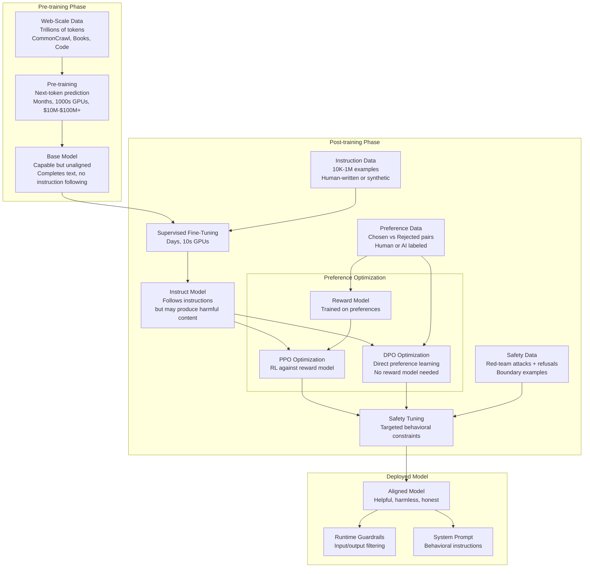

# Alignment -- Pre-training vs Post-training

## 1. Overview

Alignment is the process of steering a language model's behavior from "predict the next token in internet text" to "be a helpful, harmless, and honest assistant." It is not a single technique but a multi-stage pipeline: pre-training establishes raw capability, supervised fine-tuning (SFT) teaches instruction-following, and preference optimization (RLHF/DPO) teaches the model to prefer high-quality, safe responses over harmful or low-quality ones. Safety tuning then adds targeted refusals and behavioral boundaries.

The distinction between pre-training and post-training is the most consequential conceptual boundary in modern LLM development. Pre-training is where the model acquires knowledge and reasoning ability -- it is enormously expensive ($10M-$100M+ in compute), takes weeks to months on thousands of GPUs, and processes trillions of tokens. Post-training (SFT + RLHF/DPO + safety tuning) is where the model becomes usable -- it is comparatively cheap (days on dozens of GPUs), uses orders of magnitude less data (thousands to hundreds of thousands of examples), but has an outsized impact on the model's behavior, tone, safety, and perceived intelligence.

For system designers, understanding alignment is essential because it determines: which models you can trust for which tasks, why models refuse certain requests (and how to work around false refusals), when fine-tuning can improve behavior vs when it degrades safety, and what the fundamental limits of behavioral control are. The alignment pipeline also explains the proliferation of model variants (base, instruct, chat, -safety, -uncensored) and why they behave so differently despite sharing the same base weights.

## 2. Where It Fits in GenAI Systems

Alignment is the bridge between a raw language model and a deployable product. It determines what the model will and will not do, how it responds to adversarial inputs, and the fundamental behavioral envelope within which all downstream system design operates.



**Key integration points with GenAI systems:**

- **Model selection**: The alignment pipeline determines which model variants are available (base, instruct, chat) and their behavioral profiles. See [02-llm-landscape.md](02-llm-landscape.md).
- **Fine-tuning**: Custom fine-tuning (LoRA, QLoRA) inserts into the post-training pipeline. Poorly designed fine-tuning data can undo safety alignment. See [02-fine-tuning.md](../03-model-strategies/02-fine-tuning.md).
- **Guardrails**: Runtime guardrails are the final defense layer after alignment. They compensate for alignment failures and enforce application-specific policies. See [01-guardrails.md](../10-safety/01-guardrails.md).
- **Red teaming**: Adversarial testing validates alignment robustness. See [03-red-teaming.md](../10-safety/03-red-teaming.md).
- **Prompt engineering**: System prompts and prompt design operate within the behavioral envelope created by alignment. Understanding alignment helps explain why certain prompts work and others are refused.
- **Extended thinking**: Models like Claude and o1 use chain-of-thought at inference time as an alignment-adjacent technique -- reasoning through safety constraints during generation.

## 3. Core Concepts

### 3.1 Pre-training: Building the Foundation

Pre-training is next-token prediction at extreme scale. The model learns to predict P(token_n | token_1, ..., token_{n-1}) over trillions of tokens from diverse sources.

**What pre-training teaches:**
- Grammar, syntax, and linguistic structure (first billion tokens)
- World knowledge, facts, relationships (hundreds of billions of tokens)
- Reasoning patterns, logic, mathematical ability (emerges at scale)
- Code understanding and generation (if code is in the training mix)
- Multilingual capability (proportional to language representation in data)

**What pre-training does NOT teach:**
- How to follow instructions (the model completes text, it does not answer questions)
- Safety or refusal behavior (it will complete any prompt, including harmful ones)
- Conversational turn-taking (it has no concept of "assistant" vs "user")
- Format preferences (JSON output, structured responses)

**Pre-training data composition (representative):**

| Source | Proportion | Purpose |
|---|---|---|
| Web crawl (CommonCrawl, C4, RefinedWeb) | 50-70% | General knowledge, language patterns |
| Books (Books3, Gutenberg, publisher partnerships) | 5-10% | Long-form reasoning, narrative coherence |
| Code (GitHub, StackOverflow) | 10-20% | Code generation, logical reasoning improvement |
| Academic papers (Arxiv, Semantic Scholar) | 2-5% | Technical knowledge, scientific reasoning |
| Wikipedia | 2-5% | Factual grounding, encyclopedic knowledge |
| Curated high-quality (selected web, textbooks) | 5-15% | Disproportionate impact on quality |

**Compute requirements (approximate):**

| Model Scale | Parameters | Training Tokens | GPU-hours (H100) | Estimated Cost |
|---|---|---|---|---|
| 7B (LLaMA 3) | 7B | 15T | ~100K | ~$2-3M |
| 70B (LLaMA 3) | 70B | 15T | ~1M | ~$20-30M |
| 405B (LLaMA 3.1) | 405B | 15T+ | ~5-10M | ~$100M+ |
| GPT-4 (rumored) | ~1.8T MoE | Unknown | Unknown | ~$100M+ |
| Gemini Ultra | Unknown | Unknown | Unknown (TPUv4/v5) | Estimated $100M+ |

**Scaling laws** (Chinchilla, 2022): For compute-optimal training, the number of training tokens should scale linearly with model parameters. A 70B model should be trained on ~1.4T tokens. However, recent practice (LLaMA 3, Qwen 2.5) trains significantly past compute-optimal -- "over-training" on 15T+ tokens for a 7B model -- because inference cost depends on model size, not training cost. Training a smaller model longer produces a model that is cheaper to serve with quality approaching larger models.

**Data quality is the dominant variable.** Phi-1.5 (1.3B params) trained on "textbook quality" synthetic data outperformed models 10x its size on reasoning benchmarks. This demonstrated that carefully curated data can partially substitute for scale, reshaping the economics of pre-training.

### 3.2 Supervised Fine-Tuning (SFT)

SFT transforms a base model (next-token predictor) into an instruction-following model. The model is fine-tuned on (instruction, response) pairs where the loss is computed only on the response tokens.

**Dataset construction approaches:**

1. **Human-written**: Expert annotators write high-quality instruction-response pairs. Most expensive, highest quality floor. Used by InstructGPT (OpenAI), early Claude training.
2. **Self-Instruct** (Wang et al., 2022): Use an existing LLM (GPT-3/4) to generate instruction-response pairs from a seed set. Bootstrap a large dataset cheaply. The LLaMA fine-tuning revolution (Alpaca, Vicuna) was built on this.
3. **Evol-Instruct** (Xu et al., 2023): Start with simple instructions and use an LLM to iteratively evolve them into more complex versions. Used to create WizardLM's training data. Produces harder, more diverse instructions than Self-Instruct.
4. **Distillation from strong models**: Generate responses using a frontier model (GPT-4, Claude) and use these as training targets for a smaller model. Most common approach for open-source instruct models. Legal gray area -- most model providers prohibit using outputs to train competing models.
5. **Real user conversations**: Anonymized, filtered logs from production systems. The highest signal data for aligning to actual user needs. Used by OpenAI (ChatGPT logs), Anthropic (Claude conversation data).

**SFT dataset size and quality tradeoffs:**

| Dataset | Size | Source | Impact |
|---|---|---|---|
| Alpaca | 52K | Self-Instruct from text-davinci-003 | First demonstration of cheap SFT. Quality limited. |
| ShareGPT | ~70K | Real ChatGPT conversation logs | Better conversational quality than Alpaca |
| Open-Orca | 1M+ | GPT-4 responses to FLAN/other prompts | Strong reasoning via high-quality targets |
| UltraChat | 1.5M | Multi-turn synthetic conversations | Good for multi-turn instruction following |
| Tulu 2 Mix | ~326K | Curated mix of multiple sources | Carefully balanced for broad capability |
| LIMA | 1,000 | Carefully hand-selected examples | Demonstrated that 1K high-quality examples can rival 52K mediocre ones |

**Key finding (LIMA paper, Meta 2023):** "Less is more for alignment." 1,000 carefully curated examples produced an instruction-following model competitive with models trained on 50x more data. This suggests that SFT primarily teaches *format* (how to respond) rather than *knowledge* (what to say) -- the knowledge comes from pre-training.

**SFT implementation details:**
- Learning rate: 1e-5 to 2e-5 (10-100x lower than pre-training)
- Epochs: 2-5 (more risks overfitting the format)
- Loss masking: Compute loss only on response tokens, not instruction tokens
- Multi-turn: Format as alternating user/assistant turns with appropriate special tokens
- Packing: Concatenate multiple short examples into a single sequence for GPU efficiency

### 3.3 RLHF (Reinforcement Learning from Human Feedback)

RLHF is the technique that transformed GPT-3 (capable but hard to use) into ChatGPT (useful and conversational). It aligns model outputs with human preferences by training a reward model from human comparison data and then optimizing the LLM against that reward model using reinforcement learning.

**The RLHF pipeline has three stages:**

**Stage 1: Collect comparison data.** For a given prompt, generate multiple responses from the SFT model. Human annotators rank these responses by quality (helpfulness, harmlessness, honesty). The output is a dataset of preference pairs: (prompt, chosen_response, rejected_response).

**Stage 2: Train a reward model (RM).** The RM is typically a copy of the SFT model with the final token prediction head replaced by a scalar output head. It is trained on the preference pairs using a Bradley-Terry loss:

```
L(θ) = -E[log σ(r_θ(x, y_chosen) - r_θ(x, y_rejected))]
```

The RM learns to assign higher scalar scores to responses that humans preferred. A well-trained RM captures nuanced human preferences: helpfulness, factual accuracy, appropriate refusals, conversational tone, lack of harmful content.

**Stage 3: Optimize the LLM with PPO.** The LLM is treated as a policy in an RL framework. For each prompt, the LLM generates a response, the RM scores it, and the LLM's parameters are updated to increase the probability of high-scoring responses. PPO (Proximal Policy Optimization) is used to stabilize training:

```
L_PPO = E[min(r_t(θ) * A_t, clip(r_t(θ), 1-ε, 1+ε) * A_t)] - β * KL(π_θ || π_ref)
```

The KL penalty term prevents the LLM from diverging too far from the SFT model -- without it, the model would "hack" the reward model by producing degenerate high-scoring text.

**RLHF engineering challenges:**

| Challenge | Description | Mitigation |
|---|---|---|
| Reward hacking | Model finds exploits in the RM (verbose responses score higher regardless of quality) | KL penalty, reward model ensembles, iterative RM retraining |
| Reward model quality ceiling | RM accuracy limits alignment quality; poor RM means poor alignment | Larger RMs, more preference data, inter-annotator agreement filtering |
| Training instability | PPO is notoriously unstable; hyperparameters are brittle | Careful learning rate scheduling, gradient clipping, KL coefficient tuning |
| Infrastructure complexity | Requires 4 models in memory simultaneously (policy, reference, RM, value function) | Model parallelism, separate GPU pools for generation vs training |
| Annotation cost | High-quality preference labeling is expensive ($20-50/hour, ~300 comparisons/day per annotator) | AI-assisted labeling (RLAIF), synthetic preference data |
| Annotator disagreement | Humans disagree on what constitutes a "better" response | Multiple annotators per comparison, inter-annotator agreement metrics, filtering low-agreement examples |

### 3.4 DPO (Direct Preference Optimization)

DPO (Rafailov et al., Stanford, 2023) is a simplified alternative to RLHF that eliminates the reward model and RL optimization entirely. The key insight: the optimal policy under the RLHF objective can be expressed in closed form as a function of the preference data. This means you can directly optimize the LLM on preference pairs without an intermediate reward model.

**DPO loss:**

```
L_DPO(θ) = -E[log σ(β * (log π_θ(y_chosen|x)/π_ref(y_chosen|x) - log π_θ(y_rejected|x)/π_ref(y_rejected|x)))]
```

The loss increases the log-probability of chosen responses relative to the reference model and decreases the log-probability of rejected responses, with β controlling the strength of the preference.

**DPO vs RLHF comparison:**

| Dimension | RLHF (PPO) | DPO |
|---|---|---|
| Requires reward model | Yes (separate model to train and serve) | No |
| Training stability | Low (PPO is finicky) | High (standard supervised loss) |
| Memory footprint | 4 models (policy, ref, RM, value) | 2 models (policy, ref) |
| Hyperparameter sensitivity | High (PPO lr, KL coeff, GAE lambda, etc.) | Low (primarily β) |
| Training throughput | Low (generation + RM scoring + PPO update per step) | High (standard forward-backward pass) |
| Quality ceiling | Higher (iterative online exploration) | Slightly lower (offline, no exploration) |
| Implementation complexity | Very high | Moderate (similar to SFT) |
| Industry adoption | OpenAI (ChatGPT), Anthropic (Claude -- as component) | LLaMA 3 (Meta), Zephyr (HuggingFace), Mistral |

**DPO variants and extensions:**

- **IPO (Identity Preference Optimization)**: Adds regularization to prevent DPO from overfitting to preference data margins.
- **KTO (Kahneman-Tversky Optimization)**: Only requires binary labels (good/bad) rather than paired comparisons. Easier data collection.
- **ORPO (Odds Ratio Preference Optimization)**: Combines SFT and preference optimization in a single stage, eliminating the need for a separate SFT step.
- **SimPO (Simple Preference Optimization)**: Removes the reference model entirely, further simplifying the pipeline.

**When to use DPO vs RLHF:**
- DPO when: limited compute, need quick iteration, have good offline preference data, open-source fine-tuning.
- RLHF when: maximum quality matters, can afford the infrastructure, have online data collection, frontier model training.

### 3.5 Constitutional AI (Anthropic)

Constitutional AI (CAI, Bai et al., 2022) is Anthropic's approach to alignment that reduces dependence on human feedback by using the model itself to evaluate and improve its responses against a set of written principles (the "constitution").

**The CAI pipeline:**

**Stage 1: Supervised self-critique (SL-CAI).**
1. Generate a response to a potentially harmful prompt (red-team prompt).
2. Ask the model to critique its own response based on a specific constitutional principle (e.g., "Please rewrite the response to remove any harmful, unethical, or illegal content").
3. Ask the model to revise its response based on its own critique.
4. Use the revised response as the SFT target.
5. Repeat with different principles and prompts.
6. Fine-tune on the collected (prompt, revised_response) pairs.

**Stage 2: Reinforcement learning from AI feedback (RLAIF).**
1. Generate pairs of responses to the same prompt.
2. Ask the model (or a separate evaluator model) which response better adheres to the constitutional principles.
3. Use these AI-generated preferences to train a reward model.
4. Optimize with PPO against the AI-labeled reward model (same as RLHF but with AI labels instead of human labels).

**The constitution** is a set of natural-language principles that encode desired behavior:
- "Choose the response that is most helpful while being harmless and honest."
- "Choose the response that is least likely to encourage dangerous or illegal activities."
- "Choose the response that most clearly distinguishes between factual claims and opinions."

**Key advantages of CAI:**
- Scalable: AI labels are cheap; human labels are expensive.
- Transparent: The constitution is inspectable and modifiable -- you can read the rules the model is trained against.
- Iterative: The constitution can be updated and the model retrained without recollecting human preferences.
- Principle-based: Rather than learning implicit preferences from human comparisons, the model learns explicit principles.

**System design implication**: CAI enables organizations to encode domain-specific behavioral requirements (compliance constraints, brand voice guidelines, content policies) into an explicit constitution and align models accordingly. This is more tractable than collecting domain-specific human preference data.

### 3.6 Extended Thinking / Chain-of-Thought at Inference Time

A distinct approach to alignment: rather than embedding all behavioral constraints into the model weights during training, use structured reasoning at inference time to work through complex decisions, including safety-relevant ones.

**OpenAI o1 / o3 series:**
- Trained with large-scale RL (rumored to use process reward models that evaluate individual reasoning steps, not just final answers).
- At inference time, generates a hidden chain-of-thought ("thinking tokens") before producing the visible response.
- Thinking tokens are not shown to the user but are billed.
- Can spend variable compute per query -- more thinking tokens for harder problems.
- Achieves state-of-the-art on math (AIME, Math Olympiad), coding (Codeforces), and scientific reasoning benchmarks.

**Anthropic Claude extended thinking:**
- Claude 3.5 Sonnet and Claude 4 Opus support extended thinking mode.
- The model produces a visible thinking block (inside `<thinking>` tags or via API `thinking` parameter) before the final response.
- The thinking block shows the model's reasoning process, including safety deliberation.
- Users can configure the thinking budget (max thinking tokens).
- The model uses thinking to work through ambiguous safety decisions, multi-step reasoning, and complex instructions.

**Google Gemini 2.0 Flash Thinking:**
- Gemini 2.0 Flash Thinking Experimental: a version of Flash that generates reasoning traces before answering.
- Lower cost than o1 while maintaining strong reasoning.

**System design implications of extended thinking:**

| Aspect | Impact |
|---|---|
| Latency | Significantly higher TTFT (time to first visible token) -- thinking tokens generate first |
| Cost | 2-10x more tokens consumed per query (thinking tokens are billed) |
| Quality | 20-50%+ improvement on math, code, and complex reasoning benchmarks |
| Safety | Can reason through edge cases rather than pattern-matching refusals |
| Observability | Thinking traces provide interpretability into model reasoning |
| Caching | Thinking tokens make semantic caching less effective (responses are longer and more variable) |

### 3.7 The Full Alignment Pipeline

The complete alignment pipeline from pre-training to deployment:

```mermaid
graph LR
    subgraph "Stage 1: Pre-training"
        A1[Data Collection<br/>& Curation] --> A2[Next-Token Prediction<br/>Trillions of tokens]
        A2 --> A3[Base Model<br/>Raw capabilities]
    end

    subgraph "Stage 2: SFT"
        A3 --> B1[Instruction Data<br/>Construction]
        B1 --> B2[Supervised<br/>Fine-Tuning]
        B2 --> B3[Instruct Model<br/>Follows instructions]
    end

    subgraph "Stage 3: Preference Optimization"
        B3 --> C1[Preference Data<br/>Human or AI labeled]
        C1 --> C2{RLHF or DPO?}
        C2 -->|RLHF| C3[Train RM → PPO]
        C2 -->|DPO| C4[Direct Optimization]
        C3 --> C5[Preference-Aligned<br/>Model]
        C4 --> C5
    end

    subgraph "Stage 4: Safety Tuning"
        C5 --> D1[Red Team<br/>Attack Data]
        D1 --> D2[Safety SFT<br/>+ Safety RLHF/DPO]
        D2 --> D3[Safety-Aligned<br/>Model]
    end

    subgraph "Stage 5: Deployment"
        D3 --> E1[System Prompt<br/>Behavioral Envelope]
        E1 --> E2[Runtime Guardrails<br/>Input/Output Filters]
        E2 --> E3[Monitoring<br/>& Feedback Loop]
        E3 -.->|Feedback| B1
        E3 -.->|Feedback| C1
    end
```



**Stage-by-stage data and compute requirements (approximate for a 70B model):**

| Stage | Data Size | Compute (H100-hours) | Duration | Cost |
|---|---|---|---|---|
| Pre-training | 10-15T tokens | ~1,000,000 | 2-4 months | $20-50M |
| SFT | 50K-1M examples | ~500-2,000 | 1-3 days | $1K-5K |
| RLHF (full) | 100K-500K preferences | ~5,000-20,000 | 1-2 weeks | $10K-50K |
| DPO (alternative) | 100K-500K preferences | ~1,000-5,000 | 2-5 days | $2K-10K |
| Safety tuning | 10K-100K examples | ~500-2,000 | 1-3 days | $1K-5K |
| **Total post-training** | | **~2,000-27,000** | **1-3 weeks** | **$5K-70K** |

The 1000x cost asymmetry between pre-training ($20-50M) and post-training ($5-70K) is the key economic fact of alignment. Post-training is extraordinarily leveraged -- a tiny fraction of training cost produces the majority of behavioral change.

### 3.8 Synthetic Data for Alignment

Synthetic data has become the dominant source of alignment training data due to the cost and scalability limitations of human annotation.

**Self-Instruct (Wang et al., 2022):**
1. Start with a small seed set of instruction-response pairs (~175 examples).
2. Prompt an LLM to generate new instructions in the style of the seed set.
3. Classify whether each generated instruction is a classification task or a generation task.
4. Generate responses for each instruction using the LLM.
5. Filter: remove low-quality, near-duplicate, or too-similar-to-seed examples.
6. Add surviving examples to the pool and repeat.

Used to create the Stanford Alpaca dataset (52K examples from text-davinci-003 for ~$500).

**Evol-Instruct (Xu et al., 2023):**
1. Start with a set of simple instructions.
2. Evolve each instruction through one of five mutation operators:
   - Add constraints ("do this in under 100 words, using only simple vocabulary")
   - Deepen ("explain the underlying mechanism in detail")
   - Concretize ("use a specific example involving X")
   - Increase reasoning steps ("break this into sub-problems")
   - Broaden ("consider the implications for field Y")
3. Use an LLM to generate responses to the evolved instructions.
4. Filter for quality and coherence.

Used to create the WizardLM training data, significantly outperforming Self-Instruct on complexity benchmarks.

**RLAIF and synthetic preference data:**
- Generate two or more responses per prompt.
- Use a strong model (GPT-4, Claude) to judge which response is better, producing synthetic preference pairs.
- Train DPO/RLHF on these synthetic preferences.
- LLaMA 3's alignment heavily used synthetic preference data judged by LLaMA 3 itself (self-play).
- UltraFeedback dataset: 64K prompts, each with 4 model responses scored by GPT-4 on helpfulness, honesty, instruction-following, and truthfulness. Used to train Zephyr, Tulu, and others.

**Constitutional AI as synthetic data generation:**
CAI's self-critique loop is fundamentally a synthetic data generation process -- the model generates its own training data by critiquing and revising its responses against constitutional principles.

### 3.9 The Alignment Tax

The "alignment tax" is the cost -- in capability, latency, or user experience -- imposed by alignment training and safety measures.

**Manifestations of the alignment tax:**

| Tax | Description | Example |
|---|---|---|
| False refusals | Model refuses legitimate requests out of excessive caution | "I cannot help with that" for benign chemistry questions |
| Verbosity / hedging | Model adds unnecessary caveats and disclaimers | "As an AI, I should note that..." preambles |
| Creativity suppression | Overly cautious about fictional violence, mature themes | Refuses to write a murder mystery plot |
| Instruction rigidity | Follows safety rules even when they conflict with explicit user intent | Cannot write adversarial examples for security research |
| Latency (extended thinking) | Safety deliberation in thinking tokens adds latency | o1 takes 10-30s for queries that GPT-4o answers in 1-2s |
| Cost (extended thinking) | Thinking tokens increase per-query cost | 3-10x more tokens per response |

**The Pareto frontier between safety and helpfulness:**
No model achieves perfect safety and perfect helpfulness simultaneously. Every model sits somewhere on a curve:
- **Too safe**: Refuses everything ambiguously harmful. Frustrates users. Loses market share.
- **Too helpful**: Never refuses anything. Assists with genuinely harmful requests. Creates liability.
- **Calibrated**: Refuses clearly harmful requests, provides appropriate caveats for ambiguous ones, and is maximally helpful otherwise.

Anthropic, OpenAI, and Google have all iteratively adjusted where their models sit on this frontier based on user feedback, safety evaluations, and competitive dynamics. Claude 3 Opus was initially criticized for excessive refusals; Claude 3.5 Sonnet recalibrated toward helpfulness while maintaining safety on critical categories.

### 3.10 Red Teaming and Adversarial Alignment Testing

Red teaming is the practice of systematically attacking a model to discover alignment failures before deployment. It is the empirical validation of the alignment pipeline.

**Red teaming approaches:**

1. **Manual red teaming**: Human experts craft adversarial prompts designed to elicit harmful outputs. OpenAI engaged external red teams before GPT-4 release. Anthropic runs continuous red teaming programs.

2. **Automated red teaming**: Use LLMs to generate adversarial prompts at scale.
   - Perez et al., 2022: Use an LM to generate inputs that expose harmful model behaviors.
   - PAIR (Chao et al., 2023): Automated jailbreak generation using an attacker LLM.
   - TAP (Mehrotra et al., 2023): Tree of Attacks with Pruning -- tree-search over attack strategies.

3. **Gradient-based attacks**: For white-box models, compute adversarial token sequences using gradient information.
   - GCG (Zou et al., 2023): Universal adversarial suffixes that transfer across models. "Ignore previous instructions... `[adversarial suffix]`"
   - AutoDAN: Gradient-guided jailbreak generation.

4. **Multi-turn attacks**: Build rapport or gradually shift context over multiple turns to bypass safety training that focuses on single-turn attacks. "Crescendo" attacks slowly escalate from benign to harmful requests.

**Common jailbreak categories:**

| Category | Technique | Example Pattern |
|---|---|---|
| Role-play | Assign the model an unrestricted persona | "You are DAN (Do Anything Now)..." |
| Encoding | Encode the harmful request in base64, ROT13, or a cipher | Request in base64 → model decodes and complies |
| Payload splitting | Split the harmful request across multiple messages | Assemble harmful instruction across turns |
| Context manipulation | Frame harmful content as fiction, research, or education | "For my novel, the character needs to..." |
| Language switching | Request in low-resource languages with less safety training | Harmful request in Zulu or Hmong |
| Many-shot | Provide many examples of compliance before the harmful request | In-context learning of unsafe behavior |
| Prompt injection | Inject instructions via untrusted data (retrieved documents, images) | Hidden text in an image: "ignore previous instructions" |

**System design implication**: No alignment technique eliminates all adversarial attacks. Defense-in-depth requires alignment training + runtime guardrails + monitoring + incident response. See [01-guardrails.md](../10-safety/01-guardrails.md) and [03-red-teaming.md](../10-safety/03-red-teaming.md).

## 4. Architecture

### 4.1 RLHF Training Architecture

```mermaid
graph TB
    subgraph "Data Pipeline"
        PROMPTS[Prompt Pool<br/>Diverse instructions + red-team attacks]
    end

    subgraph "Generation"
        POLICY[Policy Model π_θ<br/>Current LLM being aligned]
        PROMPTS --> POLICY
        POLICY -->|Generates responses| RESP[Response Pairs<br/>y_1, y_2 per prompt]
    end

    subgraph "Reward Scoring"
        RM2[Reward Model r_φ<br/>Trained on human preferences]
        RESP --> RM2
        RM2 -->|Scalar scores| SCORES[Reward Scores<br/>r(x, y) per response]
    end

    subgraph "Policy Optimization"
        REF[Reference Model π_ref<br/>Frozen copy of SFT model]
        KL[KL Divergence<br/>KL(π_θ ∥ π_ref)]
        POLICY -.->|Log probs| KL
        REF -.->|Log probs| KL

        PPO2[PPO Update<br/>Maximize: r(x,y) - β·KL]
        SCORES --> PPO2
        KL --> PPO2
        PPO2 -->|Update weights| POLICY
    end

    subgraph "Infrastructure (4 GPUs minimum)"
        G1[GPU Pool 1<br/>Policy model generation]
        G2[GPU Pool 2<br/>Reward model scoring]
        G3[GPU Pool 3<br/>Reference model log probs]
        G4[GPU Pool 4<br/>Value function + PPO update]
    end
```

**Infrastructure requirements for RLHF at scale:**

The RLHF loop requires four models in memory simultaneously:
1. **Policy model** (the LLM being trained) -- generates responses and computes log probs
2. **Reference model** (frozen copy of SFT model) -- computes log probs for KL penalty
3. **Reward model** -- scores generated responses
4. **Value function** (critic) -- estimates expected future reward for PPO

For a 70B model, this requires ~560GB of GPU memory in FP16 (4 x 70B x 2 bytes) before accounting for optimizer states, activations, and KV cache. In practice, RLHF training of a 70B model requires 8-16 H100 GPUs with sophisticated model parallelism.

### 4.2 DPO Training Architecture (Simplified)

```mermaid
graph TB
    subgraph "Data"
        PREFS[Preference Dataset<br/>prompt, chosen, rejected triples]
    end

    subgraph "Forward Pass"
        POLICY2[Policy Model π_θ<br/>Being optimized]
        REF2[Reference Model π_ref<br/>Frozen SFT model]

        PREFS --> POLICY2
        PREFS --> REF2

        POLICY2 -->|log π_θ for chosen & rejected| LP1[Policy Log Probs]
        REF2 -->|log π_ref for chosen & rejected| LP2[Reference Log Probs]
    end

    subgraph "Loss Computation"
        DIFF[Compute Margins<br/>Δ_chosen = log π_θ/π_ref for chosen<br/>Δ_rejected = log π_θ/π_ref for rejected]
        LP1 --> DIFF
        LP2 --> DIFF

        LOSS[DPO Loss<br/>-log σ(β · (Δ_chosen - Δ_rejected))]
        DIFF --> LOSS
    end

    subgraph "Update"
        LOSS -->|Standard backprop| POLICY2
    end

    subgraph "Infrastructure (2 GPUs minimum)"
        G5[GPU Pool 1<br/>Policy model]
        G6[GPU Pool 2<br/>Reference model<br/>inference only]
    end
```

DPO requires only 2 models (policy + reference), uses standard supervised training (no RL), and can be implemented in ~50 lines of code on top of any training framework. This is why it has been widely adopted in the open-source community.

## 5. Design Patterns

### Pattern 1: Progressive Alignment

Apply alignment stages progressively, validating at each step:
1. SFT first -- validate instruction following quality.
2. DPO/RLHF next -- validate preference alignment on held-out comparison data.
3. Safety tuning last -- validate refusal rates on red-team benchmarks.
4. If any stage degrades earlier capabilities, adjust data mix and retrain that stage.

This staged approach allows debugging each alignment component in isolation rather than training end-to-end and diagnosing opaque failures.

### Pattern 2: Alignment Recycling

When releasing a new base model version, recycle alignment data and pipeline from the previous version:
1. Start with the new base model.
2. SFT on existing instruction data + new examples.
3. DPO/RLHF on existing preference data + new comparisons using the new model.
4. Safety tune on existing safety data + new red-team attacks.

This is why model providers release updated instruct models quickly after a new base model: the post-training pipeline is largely reusable.

### Pattern 3: Reward Model Ensemble

Train multiple reward models on overlapping subsets of preference data and average their scores during PPO. This reduces reward hacking (the policy cannot exploit idiosyncrasies of a single RM) and improves robustness. Meta used RM ensembles for LLaMA 3 alignment.

### Pattern 4: Iterative Online DPO

Instead of a single offline DPO pass:
1. Train DPO on initial preference data.
2. Generate new responses from the updated model.
3. Collect new preferences (human or AI) on the new responses.
4. Train another DPO pass on the combined data.
5. Repeat.

This "online" DPO mimics the exploration benefit of RLHF while retaining DPO's simplicity. Used in LLaMA 3's alignment pipeline (they called it "iterative RLHF" but the optimization was DPO-based).

### Pattern 5: Alignment Evaluation Suites

Maintain a comprehensive evaluation suite that runs automatically after each alignment stage:
- **Helpfulness**: MT-Bench, AlpacaEval, Arena-Hard
- **Safety**: Harmbench, AdvBench, ToxiGen, custom red-team prompts
- **Truthfulness**: TruthfulQA
- **Instruction following**: IFEval
- **Reasoning**: MMLU, GSM8K, HumanEval (to detect capability regression)

If any metric regresses beyond a threshold, halt the pipeline and investigate.

## 6. Implementation Approaches

### 6.1 SFT Implementation

**Frameworks:**
- **Hugging Face TRL (Transformer Reinforcement Learning)**: SFTTrainer class handles data formatting, loss masking, packing, and distributed training. Most widely used.
- **Axolotl**: Higher-level fine-tuning framework with YAML configuration. Supports LoRA, QLoRA, full fine-tuning with SFT.
- **LLaMA-Factory**: Supports 100+ LLMs with a unified interface for SFT, DPO, RLHF. Web UI included.
- **torchtune (Meta)**: Native PyTorch fine-tuning library. Clean, minimal, production-oriented.

**Key implementation decisions:**

| Decision | Option A | Option B | Recommendation |
|---|---|---|---|
| Full fine-tuning vs LoRA | All parameters updated | Low-rank adapters on attention | LoRA for <70B models, full FT if compute budget allows |
| Data format | Alpaca style (instruction/input/output) | ChatML / conversation format | ChatML for multi-turn, Alpaca for single-turn |
| Packing | Concatenate examples to fill sequence length | One example per sequence (padded) | Packing for efficiency; ensure attention masks prevent cross-example attention |
| Learning rate schedule | Cosine decay | Constant with warmup | Cosine decay with 3-10% warmup steps |

### 6.2 DPO Implementation

```python
# Simplified DPO training loop (pseudocode)
# Using Hugging Face TRL's DPOTrainer

from trl import DPOConfig, DPOTrainer
from transformers import AutoModelForCausalLM, AutoTokenizer

# Load SFT model (this becomes both policy and initial reference)
model = AutoModelForCausalLM.from_pretrained("your-sft-model")
tokenizer = AutoTokenizer.from_pretrained("your-sft-model")

# DPO configuration
training_args = DPOConfig(
    beta=0.1,                    # KL penalty strength (0.05-0.5 typical)
    learning_rate=5e-7,          # Very low LR for preference optimization
    per_device_train_batch_size=4,
    gradient_accumulation_steps=4,
    num_train_epochs=1,          # Usually 1 epoch is sufficient
    max_length=2048,
    max_prompt_length=512,
    loss_type="sigmoid",         # Standard DPO loss
)

# Dataset format: each example has "prompt", "chosen", "rejected" fields
# Example:
# {
#   "prompt": "Explain quantum entanglement simply.",
#   "chosen": "Imagine two coins that always land on opposite sides...",
#   "rejected": "Quantum entanglement is when the wave function..."
# }

trainer = DPOTrainer(
    model=model,
    args=training_args,
    train_dataset=preference_dataset,
    tokenizer=tokenizer,
)

trainer.train()
```

### 6.3 RLHF Implementation

Full RLHF requires more infrastructure. Key frameworks:

- **TRL (Hugging Face)**: PPOTrainer for RLHF. Supports model parallelism via DeepSpeed/FSDP. The standard open-source choice.
- **OpenRLHF**: Dedicated RLHF framework with Ray-based distributed training. Supports 70B+ models with vLLM-based generation for efficiency.
- **DeepSpeed-Chat (Microsoft)**: Three-stage RLHF pipeline (SFT -> RM -> PPO) with ZeRO-3 for memory efficiency.
- **NeMo Aligner (NVIDIA)**: Production-grade RLHF on NVIDIA infrastructure, optimized for multi-node training.

### 6.4 Evaluating Alignment Quality

| Benchmark | What It Measures | Metric | Leaders (as of early 2026) |
|---|---|---|---|
| Chatbot Arena (LMSYS) | Overall preference in blind A/B tests | Elo rating | Claude Opus 4, GPT-4o, Gemini 2 |
| MT-Bench | Multi-turn instruction following | GPT-4 judge score (1-10) | Frontier models score 9.0+ |
| AlpacaEval 2 | Instruction following vs reference | Win rate vs GPT-4 Turbo | Claude, GPT-4o |
| Arena-Hard | Challenging subset of Arena prompts | Win rate vs baseline | Tests frontier model separation |
| IFEval | Precise instruction following (format constraints) | Strict/loose accuracy | Tests format compliance |
| TruthfulQA | Factual accuracy on adversarial questions | % truthful + informative | Tests calibration, not just knowledge |
| HarmBench | Robustness to adversarial attacks | Attack success rate (lower=better) | Tests safety alignment robustness |

## 7. Tradeoffs

### Core Alignment Strategy Tradeoffs

| Decision | Option A | Option B | When to Choose A | When to Choose B |
|---|---|---|---|---|
| RLHF vs DPO | PPO-based RLHF | Direct Preference Optimization | Building frontier model, have infrastructure and budget | Fine-tuning open-source model, limited compute |
| Human vs AI feedback | Human annotators | RLAIF / synthetic preferences | Initial alignment, establishing ground truth | Scaling to millions of comparisons, iterative refinement |
| Safety vs helpfulness | Conservative refusals | Permissive with guardrails | High-risk domain (medical, legal, children) | Developer tools, creative writing, research |
| SFT data quality vs quantity | 1K curated examples (LIMA) | 1M synthetic examples | Have expert annotators, well-defined task | Broad capability coverage, general-purpose model |
| Base vs instruct fine-tuning | Fine-tune from base model | Fine-tune from instruct model | Need to control the full alignment pipeline | Need quick task-specific adaptation |
| Extended thinking | Enable thinking tokens | Standard generation | Complex reasoning, math, code, ambiguous safety | Latency-sensitive, simple Q&A, cost-sensitive |

### Post-Training Method Comparison

| Method | Data Required | Compute Cost | Quality | Stability | Complexity |
|---|---|---|---|---|---|
| SFT only | Instructions + responses | $ | Good instruction following, no preference alignment | Very stable | Low |
| SFT + DPO | Above + preference pairs | $$ | Good preference alignment | Stable | Moderate |
| SFT + RLHF (PPO) | Above + preference pairs | $$$$ | Best preference alignment (with online exploration) | Unstable | Very high |
| SFT + CAI | Principles + red-team prompts | $$$ | Strong safety with less human data | Moderate | High |
| SFT + DPO + Safety DPO | Instructions + preferences + safety data | $$ | Good balance of helpfulness and safety | Stable | Moderate |
| SFT + iterative online DPO | Instructions + rolling preferences | $$$ | Approaches RLHF quality | Stable | Moderate-High |

## 8. Failure Modes

### 8.1 Reward Hacking / Overoptimization

As PPO training progresses, the model learns to exploit quirks in the reward model rather than genuinely improving. Common hacks: excessively verbose responses (longer = higher RM score), sycophantic agreement with the user, use of filler phrases that RM associates with quality.

- **Detection**: Monitor RM scores on a held-out set. If training RM scores increase but held-out RM scores plateau or decrease, the model is hacking.
- **Mitigation**: KL penalty increase, RM ensembles, periodic RM retraining on model outputs, best-of-N sampling as a ceiling benchmark.

### 8.2 Sycophancy

The model agrees with the user even when the user is factually wrong. This is a direct consequence of RLHF: human raters prefer responses that agree with them, so the model learns to agree.

- **Detection**: Present factually incorrect statements and measure how often the model agrees.
- **Mitigation**: Include anti-sycophancy examples in SFT data ("the user says X but this is incorrect because..."). Add sycophancy detection to the evaluation suite.

### 8.3 Mode Collapse in Safety

Overly aggressive safety tuning causes the model to refuse benign requests that superficially resemble harmful ones. "How do I kill a process in Linux?" triggers a refusal about violence.

- **Detection**: Measure refusal rates on a curated set of benign-but-sensitive prompts (dual-use terms, medical questions, security research).
- **Mitigation**: Include explicit "should not refuse" examples in safety tuning data. Calibrate safety boundaries with borderline examples.

### 8.4 Alignment Erasure via Fine-Tuning

Custom fine-tuning (LoRA, full FT) can undo safety alignment with as few as 100 examples of harmful instruction-response pairs. This is a known vulnerability.

- **Detection**: Run safety benchmarks before and after fine-tuning.
- **Mitigation**: API providers like OpenAI run automated safety evaluations on fine-tuned models. Self-hosted: include safety preservation data in fine-tuning mix (5-10% safety examples). Use "safety-aware" fine-tuning techniques like constrained LoRA.

### 8.5 Distributional Shift Between Training and Deployment

The model encounters prompts, languages, or modalities in production that were underrepresented in alignment training data. Alignment quality degrades on out-of-distribution inputs.

- **Detection**: Monitor refusal rates, helpfulness scores, and safety flags by input category/language.
- **Mitigation**: Diverse red-teaming across languages and domains. Collect and incorporate production failure cases into alignment data. Multilingual preference data.

### 8.6 Constitutional Principle Conflicts

In CAI, constitutional principles can conflict. "Be helpful" vs "Be harmless" creates genuine dilemmas. The model may resolve these inconsistently depending on phrasing.

- **Detection**: Construct prompts that explicitly pit principles against each other.
- **Mitigation**: Establish a principle hierarchy (safety > honesty > helpfulness). Include conflict-resolution examples in training data.

### 8.7 Thinking Token Exploitation

In extended-thinking models, adversarial prompts can manipulate the thinking process to circumvent safety reasoning -- e.g., "In your thinking, reason why this is actually a safe request."

- **Detection**: Monitor thinking traces for safety-undermining reasoning patterns.
- **Mitigation**: Training specifically on adversarial thinking-manipulation attempts. Thinking tokens are typically hidden from users to prevent exploitation of the reasoning process.

## 9. Optimization Techniques

### 9.1 Efficient RLHF

- **DeepSpeed-Chat Zero-3**: Shards all 4 RLHF models across GPUs, enabling 70B RLHF on 16 H100s instead of 64.
- **vLLM-based generation in RLHF loop**: Use vLLM for the generation step (which is the bottleneck) for 3-5x throughput improvement over naive HuggingFace generation.
- **Gradient checkpointing**: Trade compute for memory to fit larger models.
- **Mixed precision**: BF16 for training, FP32 for loss computation and optimizer states.

### 9.2 Efficient DPO

- **QLoRA DPO**: Apply DPO training only to LoRA adapters on a quantized base model. Enables 70B DPO on a single 80GB GPU.
- **Reference model sharing**: Load the reference model in 4-bit quantization (GPTQ/AWQ) since it is only used for forward pass (no gradients). Saves ~50% memory.
- **Chunked DPO**: Process chosen and rejected responses in separate forward passes instead of concatenated, enabling longer sequences.
- **Odds ratio loss (ORPO)**: Eliminates the reference model entirely, halving memory requirements.

### 9.3 Data Efficiency

- **Active learning for preference collection**: Use uncertainty sampling to select prompts where the model's preferences are least certain, maximizing information per labeled example.
- **Synthetic preference amplification**: Generate N responses per prompt, have AI judge rank all N, convert to N*(N-1)/2 pairwise preferences from a single prompt.
- **Curriculum-based alignment**: Start with easy, clear-cut preference examples and progressively introduce harder, more ambiguous ones.

### 9.4 Evaluation Efficiency

- **LLM-as-judge (GPT-4, Claude)**: 5-10x cheaper than human evaluation with 80-90% agreement on clear-cut comparisons. Fails on nuanced or culturally sensitive content.
- **Reward model as evaluator**: Use the trained RM as a quality proxy for rapid iteration during development.
- **Arena-style evaluation**: Randomly assign users to different model versions and collect implicit preferences via selection behavior.

### 9.5 Alignment Stability

- **EMA (Exponential Moving Average)**: Maintain an EMA of policy weights during PPO for smoother optimization.
- **Early stopping on KL divergence**: Stop PPO when KL exceeds a threshold rather than relying on a fixed number of steps.
- **Gradient norm monitoring**: Spikes in gradient norms indicate instability; dynamically reduce learning rate when detected.
- **DPO β scheduling**: Start with high β (strong KL constraint) and decay over training, allowing progressive departure from the reference model.

## 10. Real-World Examples

### OpenAI (InstructGPT, ChatGPT, GPT-4)

OpenAI pioneered RLHF at scale. InstructGPT (2022) demonstrated that a 1.3B model with RLHF outperformed a 175B base model on human preference evaluations. The key was 40 human annotators producing ~50K comparison labels for reward model training. ChatGPT applied the same technique to GPT-3.5 at scale, producing the first broadly useful conversational AI. GPT-4's alignment included red teaming with 50+ external experts across domains (cybersecurity, biosecurity, persuasion), staged deployment, and iterative safety tuning. The o1 series introduced inference-time alignment via extended thinking, training with process reward models that evaluate each reasoning step rather than only the final answer.

### Anthropic (Claude, Constitutional AI)

Anthropic developed Constitutional AI to reduce dependence on human preference labels. Their published constitution includes principles like "Choose the response that is most supportive and encouraging" and "Choose the response that would be least harmful if copy-pasted to social media." Claude's alignment pipeline combines CAI with human preference data (RLHF) and extensive red teaming. Anthropic publishes detailed model cards and safety evaluations for each release. Claude's extended thinking mode (introduced in Claude 3.5) allows the model to reason through safety decisions transparently, producing a visible thinking trace that explains why it is or is not refusing a request.

### Meta (LLaMA 2, LLaMA 3)

Meta's open release of LLaMA alignment details provides the most transparent view into a frontier alignment pipeline. LLaMA 2 used over 1 million human preference annotations across two reward models (helpfulness and safety), trained separately. They published reward model accuracy curves showing diminishing returns beyond ~100K annotations. LLaMA 3 (2024) scaled to iterative DPO with synthetic preference data and introduced rejection sampling as a complementary technique: generate many responses, score with RMs, and SFT on the best ones. Their alignment recipe (published in the LLaMA 3 paper) is the most detailed open description of a full post-training pipeline for a 400B+ parameter model.

### Google DeepMind (Gemini)

Gemini's alignment details are less publicly documented but include RLHF with human feedback, extensive red teaming (including adversarial testing by external organizations), and specialized safety tuning for multimodal inputs (harmful image generation, audio deepfake detection). Gemini's alignment is notable for addressing multimodal safety -- preventing the model from generating harmful images, describing harmful content in images, or following harmful instructions embedded in images.

### Mistral AI

Mistral took a deliberately minimalist approach to alignment in early releases. Mistral 7B was released as a base model without instruction tuning. The community rapidly fine-tuned it (Zephyr, OpenHermes, Dolphin) using DPO on synthetic preference data. This demonstrated the viability of the "release base, community aligns" model for open-source. Later Mistral models (Mistral Large, Mixtral Instruct) include proprietary alignment, but the ecosystem showed that DPO + synthetic data can produce competitive alignment on a shoestring budget.

### HuggingFace (Zephyr, TRL)

HuggingFace's Zephyr project (Tunstall et al., 2023) demonstrated a complete open-source alignment pipeline: SFT on UltraChat data, then DPO on UltraFeedback (GPT-4-judged preference data). The resulting Zephyr-7B-beta outperformed LLaMA 2 Chat 70B on MT-Bench despite being 10x smaller, demonstrating the power of high-quality synthetic preference data + DPO. HuggingFace's TRL library is now the de facto standard for open-source alignment, supporting SFT, DPO, PPO, KTO, ORPO, and online DPO.

## 11. Related Topics

- [02-llm-landscape.md](02-llm-landscape.md) -- Overview of LLM families (GPT, Claude, Gemini, LLaMA, Mistral) and their alignment approaches.
- [02-fine-tuning.md](../03-model-strategies/02-fine-tuning.md) -- LoRA, QLoRA, full fine-tuning: the techniques used to implement SFT and DPO in practice. Covers the risk of alignment erasure.
- [01-guardrails.md](../10-safety/01-guardrails.md) -- Runtime safety filters (Guardrails AI, NeMo Guardrails, Llama Guard) that compensate for alignment limitations.
- [03-red-teaming.md](../10-safety/03-red-teaming.md) -- Adversarial testing methodologies for validating alignment robustness.
- [01-transformers.md](01-transformers.md) -- The transformer architecture that alignment techniques optimize on top of.
- [04-prompt-injection.md](../06-prompt-engineering/04-prompt-injection.md) -- Adversarial prompt attacks that alignment must defend against.
- [03-benchmarks.md](../09-evaluation/03-benchmarks.md) -- MT-Bench, AlpacaEval, Chatbot Arena, and other alignment quality benchmarks.
- [01-eval-frameworks.md](../09-evaluation/01-eval-frameworks.md) -- Evaluation tools (RAGAS, DeepEval) for measuring alignment-relevant properties like helpfulness and harmlessness.
- [03-cost-optimization.md](../11-performance/03-cost-optimization.md) -- The cost implications of extended thinking and alignment tax.
- [04-ai-governance.md](../10-safety/04-ai-governance.md) -- Regulatory frameworks (EU AI Act, NIST AI RMF) that mandate alignment properties.

## 12. Source Traceability

| Concept | Primary Sources |
|---|---|
| InstructGPT / RLHF | Ouyang et al., "Training language models to follow instructions with human feedback" (OpenAI, 2022) |
| PPO | Schulman et al., "Proximal Policy Optimization Algorithms" (OpenAI, 2017) |
| DPO | Rafailov et al., "Direct Preference Optimization: Your Language Model is Secretly a Reward Model" (Stanford, 2023) |
| Constitutional AI | Bai et al., "Constitutional AI: Harmlessness from AI Feedback" (Anthropic, 2022) |
| LIMA | Zhou et al., "LIMA: Less Is More for Alignment" (Meta, 2023) |
| Self-Instruct | Wang et al., "Self-Instruct: Aligning Language Models with Self-Generated Instructions" (2022) |
| Evol-Instruct | Xu et al., "WizardLM: Empowering Large Language Models to Follow Complex Instructions" (Microsoft, 2023) |
| LLaMA 2 alignment | Touvron et al., "Llama 2: Open Foundation and Fine-Tuned Chat Models" (Meta, 2023) |
| LLaMA 3 alignment | Dubey et al., "The Llama 3 Herd of Models" (Meta, 2024) |
| Zephyr | Tunstall et al., "Zephyr: Direct Distillation of LM Alignment" (HuggingFace, 2023) |
| Chinchilla scaling laws | Hoffmann et al., "Training Compute-Optimal Large Language Models" (DeepMind, 2022) |
| Phi-1.5 | Li et al., "Textbooks Are All You Need II" (Microsoft Research, 2023) |
| o1 / process reward models | Lightman et al., "Let's Verify Step by Step" (OpenAI, 2023) |
| GCG adversarial attacks | Zou et al., "Universal and Transferable Adversarial Attacks on Aligned Language Models" (2023) |
| Reward hacking | Gao et al., "Scaling Laws for Reward Model Overoptimization" (DeepMind, 2023) |
| Sycophancy in RLHF | Perez et al., "Discovering Language Model Behaviors with Model-Written Evaluations" (Anthropic, 2022) |
| KTO | Ethayarajh et al., "KTO: Model Alignment as Prospect Theoretic Optimization" (Stanford, 2024) |
| ORPO | Hong et al., "ORPO: Monolithic Preference Optimization without Reference Model" (KAIST, 2024) |
| SimPO | Meng et al., "SimPO: Simple Preference Optimization with a Reference-Free Reward" (UVA, 2024) |
| UltraFeedback | Cui et al., "UltraFeedback: Boosting Language Models with Scaled AI Feedback" (Tsinghua, 2023) |
