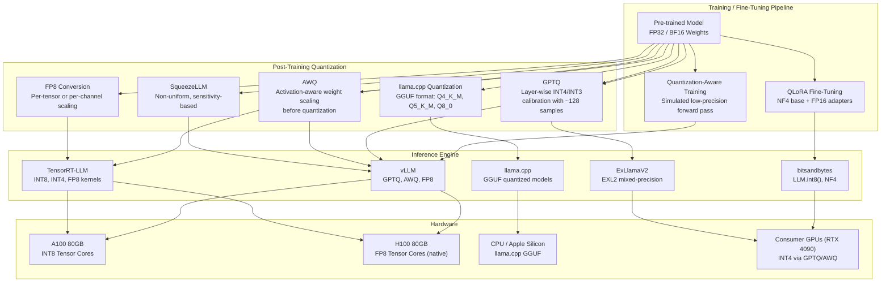
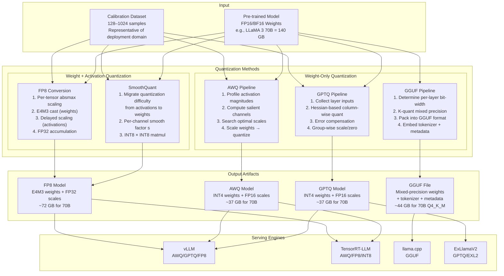
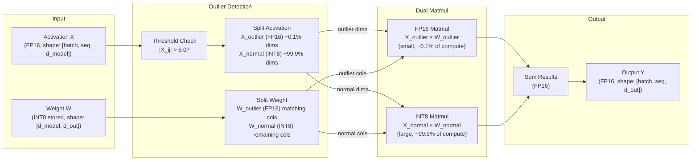

# Quantization for LLM Inference

## 1. Overview

Quantization is the process of reducing the numerical precision of a model's weights (and optionally activations) from higher-bit representations (FP32, FP16) to lower-bit formats (INT8, INT4, FP8, NF4). For large language models, quantization is not an optional optimization — it is frequently the only way to make deployment feasible. A 70B-parameter model requires ~140 GB in FP16, exceeding the memory of any single GPU. Quantize it to INT4 and it fits in ~35 GB — a single A100 80GB with room for KV cache and batch processing.

For Principal AI Architects, quantization decisions cascade through every layer of the serving stack: they determine GPU count, maximum batch size, throughput ceiling, latency floor, and cost per token. A poorly chosen quantization scheme either wastes GPU memory (over-provisioning with FP16 when INT8 suffices) or destroys model quality (naive INT4 on sensitive layers). The engineering discipline is selecting the right precision for the right component on the right hardware.

**Key numbers that drive system design:**
- FP16 to INT8 quantization: ~2x memory reduction, 1.5–2x throughput improvement, <1% quality loss on most benchmarks
- FP16 to INT4 quantization: ~4x memory reduction, 2–3x throughput improvement, 1–5% quality loss depending on method
- FP8 on H100: native hardware support, ~2x throughput over FP16 with negligible quality loss
- QLoRA fine-tuning: enables fine-tuning a 65B model on a single 48GB GPU
- Quantizing from FP32 to FP16 is effectively lossless for LLMs — FP32 inference provides no measurable benefit

---

## 2. Where It Fits in GenAI Systems

Quantization sits at the intersection of the model layer and the serving infrastructure layer. It is applied either as a post-training compression step (PTQ) or integrated into the training/fine-tuning process (QAT, QLoRA). The quantized model is then consumed by the inference engine, which must support the specific quantized format.



**Upstream dependencies:** The base model's architecture (number of layers, hidden dimension, attention heads) determines quantization group sizes and sensitivity patterns. Tokenizer and vocabulary are unaffected by quantization.

**Downstream consumers:** The inference engine must support the specific quantized format. KV cache precision is an independent decision — you can run INT4 weights with FP16 KV cache. Continuous batching schedulers use the quantized model's memory footprint to calculate maximum batch size.

**Cross-references:** [Model Serving](01-model-serving.md) | [GPU Compute](02-gpu-compute.md) | [Fine-Tuning](../03-model-strategies/02-fine-tuning.md) | [Cost Optimization](../11-performance/03-cost-optimization.md)

---

## 3. Core Concepts

### 3.1 Precision Formats

Understanding the numerical formats is prerequisite to understanding quantization methods.

#### FP32 (32-bit Floating Point)
- **Layout:** 1 sign + 8 exponent + 23 mantissa bits
- **Range:** ~1.2 × 10^-38 to ~3.4 × 10^38
- **Use in LLMs:** Training master weights, optimizer states (Adam). Never used for inference — provides no quality benefit over FP16/BF16 and doubles memory
- **Memory:** 4 bytes per parameter. A 70B model = 280 GB

#### FP16 (Half Precision)
- **Layout:** 1 sign + 5 exponent + 10 mantissa bits
- **Range:** ~6.1 × 10^-5 to 65504
- **Use in LLMs:** Standard inference precision, mixed-precision training (compute in FP16, accumulate in FP32)
- **Memory:** 2 bytes per parameter. A 70B model = 140 GB
- **Limitation:** Limited dynamic range causes overflow/underflow in some training scenarios (gradient scaling required)

#### BF16 (Brain Floating Point)
- **Layout:** 1 sign + 8 exponent + 7 mantissa bits
- **Range:** Same as FP32 (~1.2 × 10^-38 to ~3.4 × 10^38) but with less precision
- **Use in LLMs:** Preferred training format on modern hardware (A100+). Same dynamic range as FP32 eliminates need for loss scaling. Google TPUs natively support BF16
- **Memory:** 2 bytes per parameter. Same as FP16
- **Tradeoff:** Slightly less precise than FP16 (7 vs. 10 mantissa bits) but the wider dynamic range matters more for training stability

#### FP8 (8-bit Floating Point)
- **Two variants:**
  - **E4M3:** 1 sign + 4 exponent + 3 mantissa. Higher precision, smaller range. Used for weights and activations in forward pass
  - **E5M2:** 1 sign + 5 exponent + 2 mantissa. Lower precision, wider range. Used for gradients in backward pass
- **Hardware:** Native Tensor Core support on H100 (Hopper architecture), MI300X (AMD). Not supported on A100
- **Use in LLMs:** Fastest inference on H100 with negligible quality loss. NVIDIA's FP8 recipe uses per-tensor scaling factors (stored in FP32) to map weight/activation distributions into FP8 range
- **Memory:** 1 byte per parameter. A 70B model = 70 GB
- **Key insight:** FP8 preserves floating-point semantics (unlike INT8), making it more robust for outlier-sensitive layers

#### INT8 (8-bit Integer)
- **Layout:** 8-bit signed integer, range -128 to 127 (or unsigned 0–255)
- **Use in LLMs:** Weight quantization with symmetric or asymmetric scaling. Activation quantization (harder — requires calibration data to determine scale). Used by LLM.int8(), SmoothQuant, TensorRT-LLM
- **Memory:** 1 byte per parameter. Same as FP8
- **Challenge:** LLM activations contain outlier features (channels with magnitudes 10–100x larger than others). Naive per-tensor INT8 quantization destroys these outliers and collapses quality. Solutions: per-channel quantization, mixed-precision decomposition, or SmoothQuant's mathematically equivalent transformation

#### INT4 (4-bit Integer)
- **Layout:** 4-bit integer, range -8 to 7 (signed) or 0–15 (unsigned)
- **Use in LLMs:** Weight-only quantization (activations stay in FP16). The sweet spot for memory-constrained deployment — 4x reduction from FP16
- **Memory:** 0.5 bytes per parameter. A 70B model = ~35 GB (plus quantization metadata overhead, typically 0.5–2 GB)
- **Challenge:** Only 16 distinct values per group. Quality preservation requires careful group-wise scaling, outlier handling, or non-uniform quantization

#### NF4 (4-bit NormalFloat)
- **Layout:** 4-bit with non-uniform quantization levels optimally spaced for normally distributed weights
- **Introduced by:** QLoRA paper (Dettmers et al., 2023)
- **Key insight:** Neural network weights follow an approximately normal distribution. NF4 places quantization levels at the quantiles of a standard normal distribution, yielding theoretically optimal information density for 4-bit representation
- **Use:** QLoRA fine-tuning (base model in NF4, LoRA adapters in BF16/FP16)

### 3.2 Post-Training Quantization (PTQ)

PTQ compresses a pre-trained model after training completes, without modifying the training process. It requires only a small calibration dataset (typically 128–1024 samples) to estimate activation ranges and weight sensitivity.

#### GPTQ (GPT Quantization)

GPTQ (Frantar et al., 2022) applies layer-wise quantization by solving a second-order optimization problem that minimizes the output reconstruction error for each linear layer.

**Algorithm:**
1. Feed calibration data through the model, collecting layer inputs
2. For each linear layer, quantize weights column-by-column using Optimal Brain Quantization (OBQ), which considers the Hessian (second-order information) of the quantization error
3. After quantizing each column, update remaining unquantized columns to compensate for the quantization error introduced
4. Use group-wise quantization (typically groups of 128 weights share a scale/zero-point) for finer granularity

**Characteristics:**
- Produces weight-only quantization (INT4/INT3/INT2), activations computed in FP16
- Quantization takes 1–4 hours for a 70B model on a single GPU
- Well-supported across vLLM, HuggingFace Transformers, ExLlamaV2
- Group size of 128 is the de facto standard — smaller groups improve quality but increase metadata overhead
- GPTQ-quantized models are available on HuggingFace Hub (TheBloke and others have quantized most popular models)

**Quality (LLaMA 2 70B, perplexity on WikiText-2):**
- FP16 baseline: 3.12
- GPTQ-INT4 (g128): 3.21 (+0.09, ~2.9% relative)
- GPTQ-INT3 (g128): 3.87 (+0.75, ~24% relative — significant degradation)

#### AWQ (Activation-Aware Weight Quantization)

AWQ (Lin et al., 2023) observes that only ~1% of weight channels are "salient" — those corresponding to large activation magnitudes — and protecting these channels preserves most of the model's quality.

**Algorithm:**
1. Profile activations on calibration data to identify channels with large activation magnitudes
2. Compute per-channel scaling factors that multiply weights before quantization and divide activations after, effectively protecting salient channels by scaling them into a higher-precision range before uniform quantization
3. Search for optimal scaling factors using a grid search that minimizes output MSE
4. Apply standard group-wise INT4 quantization after scaling

**Characteristics:**
- Consistently outperforms GPTQ at the same bit-width on quality metrics
- Faster quantization than GPTQ (no Hessian computation)
- The scaling transformation is mathematically equivalent (preserves the same output), so it requires no changes to the model architecture
- First-class support in vLLM (preferred over GPTQ for production)
- TensorRT-LLM integration provides fused AWQ kernels with significant speedup

**Quality (LLaMA 2 70B, perplexity on WikiText-2):**
- FP16 baseline: 3.12
- AWQ-INT4 (g128): 3.17 (+0.05, ~1.6% relative — better than GPTQ)

#### SqueezeLLM

SqueezeLLM (Kim et al., 2023) takes a fundamentally different approach: non-uniform quantization with sensitivity-based bit allocation.

**Algorithm:**
1. Compute sensitivity of each weight using Fisher information (approximated via squared gradients on calibration data)
2. Identify outlier weights (high sensitivity, high magnitude) and store them separately in a sparse matrix at full precision
3. Apply k-means clustering to the remaining weights to find optimal non-uniform quantization centroids for each group
4. Store weights as indices into the centroid lookup table

**Characteristics:**
- Achieves better quality than GPTQ/AWQ at ultra-low bit-widths (3-bit, 2-bit)
- Higher quantization cost (k-means per group is expensive)
- Less hardware-friendly: lookup table dequantization is slower than linear dequantization
- Less ecosystem support than GPTQ/AWQ

### 3.3 bitsandbytes / LLM.int8() — Mixed-Precision Decomposition

LLM.int8() (Dettmers et al., 2022) was the first method to enable INT8 inference for LLMs without quality degradation, solving the outlier feature problem.

**The outlier problem:** In Transformer models at scale (>6.7B parameters), certain hidden state dimensions consistently produce activation values 10–100x larger than others. These "emergent outlier features" appear in ~0.1% of dimensions but contain critical information. Naive INT8 quantization clips these outliers, destroying model quality.

**Mixed-precision decomposition algorithm:**
1. Identify outlier dimensions: any dimension where any activation exceeds a threshold (default 6.0)
2. Decompose the matrix multiplication into two parts:
   - Outlier dimensions: computed in FP16 (preserving full precision for the ~0.1% of sensitive dimensions)
   - Non-outlier dimensions: computed in INT8 (the remaining ~99.9%)
3. Sum the two partial results

**Memory and performance:**
- ~2x memory reduction (nearly all weights stored as INT8)
- ~15–25% slower than pure FP16 due to the decomposition overhead and separate matmul paths
- Zero quality degradation (equivalent to FP16 output within numerical precision)
- Available via `model = AutoModelForCausalLM.from_pretrained(model_name, load_in_8bit=True)`

**Practical limitation:** The runtime decomposition makes LLM.int8() slower than purpose-built INT8 quantization methods like SmoothQuant. It is best suited for memory-constrained prototyping rather than high-throughput production serving.

### 3.4 GGUF Format and llama.cpp Quantization

GGUF (GPT-Generated Unified Format) is the binary model format used by llama.cpp. It packages quantized weights, tokenizer, and metadata into a single file that can be memory-mapped for efficient CPU and GPU inference.

**Quantization types and their characteristics:**

| GGUF Type | Bits/Weight | Method | Relative Quality | Memory (7B) | Memory (70B) | Best For |
|-----------|-------------|--------|-----------------|-------------|--------------|----------|
| Q2_K | 2.6 | K-quant, mixed 2/3-bit | Very poor | ~2.5 GB | ~25 GB | Extreme memory constraint |
| Q3_K_M | 3.4 | K-quant, mixed 3/4-bit | Poor–Fair | ~3.3 GB | ~33 GB | Experimentation |
| Q4_0 | 4.0 | Uniform 4-bit, no k-quant | Fair | ~3.8 GB | ~38 GB | Legacy, replaced by Q4_K_M |
| Q4_K_M | 4.8 | K-quant, mixed 4/5-bit, attention layers get higher precision | Good | ~4.4 GB | ~44 GB | Consumer GPUs, best 4-bit |
| Q5_K_M | 5.7 | K-quant, mixed 5/6-bit | Very Good | ~5.0 GB | ~50 GB | Quality-focused consumer |
| Q6_K | 6.6 | K-quant, 6-bit uniform | Excellent | ~5.5 GB | ~55 GB | Near-lossless |
| Q8_0 | 8.0 | Uniform 8-bit | Near-lossless | ~7.2 GB | ~72 GB | Quality-critical, sufficient memory |
| F16 | 16.0 | Half precision baseline | Reference | ~13.5 GB | ~140 GB | Baseline comparison |

**K-quant (importance-based mixed precision):**
K-quant methods (identified by `_K_` in the name) assign different bit-widths to different layers and tensor types based on their importance:
- Attention Q/K/V projections and output projections: higher precision (more sensitive to quantization)
- Feed-forward network layers: lower precision (more redundant, tolerates aggressive quantization)
- First and last layers: higher precision (embedding and unembedding are sensitive)

**Key advantage of GGUF/llama.cpp:** Runs efficiently on CPUs and Apple Silicon using NEON/AVX2 SIMD instructions. A Q4_K_M 7B model runs at ~30 tokens/second on an M2 MacBook Pro. GPU offloading via Metal/CUDA allows hybrid CPU+GPU execution for models that don't fully fit in VRAM.

### 3.5 QLoRA: Quantized Low-Rank Adaptation

QLoRA (Dettmers et al., 2023) combines three innovations to enable fine-tuning of large models on consumer hardware:

**Innovation 1: NF4 Quantization**
The base model is quantized to NF4 (4-bit NormalFloat). NF4 is information-theoretically optimal for normally distributed data — it places the 16 quantization levels at the quantiles of N(0, 1), so each level represents an equal probability mass.

**Innovation 2: Double Quantization**
The quantization constants (scale factors for each 64-weight block) are themselves quantized to 8-bit. This saves ~0.37 bits per parameter — seemingly small, but on a 65B model it saves ~3 GB.

- First quantization: weights quantized per block of 64, producing one FP32 scale per block
- Second quantization: the FP32 scales are grouped (256 scales per group) and quantized to FP8, with a single FP32 scale per group of scales

**Innovation 3: Paged Optimizers**
Uses NVIDIA unified memory to page optimizer states between GPU and CPU. When GPU memory runs low during fine-tuning (due to gradient spikes from long sequences), optimizer states are automatically paged to CPU and back.

**Memory breakdown (65B model, QLoRA fine-tuning):**

| Component | Precision | Memory |
|-----------|-----------|--------|
| Base model weights | NF4 + double quant | ~33 GB |
| LoRA adapters (rank 64, all linear layers) | BF16 | ~1.5 GB |
| Activations (batch 1, 512 seq) | BF16 | ~4 GB |
| Optimizer states (AdamW, LoRA params only) | FP32 | ~6 GB |
| **Total** | | **~44.5 GB** |

This fits on a single A100 40GB with gradient checkpointing, or comfortably on a single A100 80GB or A6000 48GB.

**Quality:** QLoRA matches full-precision fine-tuning quality on standardized benchmarks. The Guanaco-65B model fine-tuned with QLoRA achieved 99.3% of ChatGPT's quality on the Vicuna benchmark while using only 48 hours of training on a single GPU.

### 3.6 FP8 Inference on H100

NVIDIA's Hopper architecture (H100) introduces native FP8 Tensor Core support, making FP8 the optimal inference precision on this hardware.

**How FP8 quantization works:**
1. **Per-tensor scaling:** Each weight tensor and activation tensor gets an FP32 scaling factor that maps its value distribution into the FP8 representable range
2. **Delayed scaling (dynamic):** For activations, scaling factors are computed from the maximum absolute value of the previous iteration's tensor (since the current iteration's activations aren't yet known). This avoids an extra pass at the cost of one iteration of stale scaling
3. **E4M3 for forward pass:** Weights and activations use E4M3 (4 exponent, 3 mantissa bits) for maximum precision
4. **E5M2 for backward pass:** Gradients use E5M2 (5 exponent, 2 mantissa bits) for wider range to accommodate gradient value distributions
5. **FP32 accumulation:** Matrix multiplication results accumulate in FP32 before being cast back to FP8 or BF16

**Performance on H100:**
- ~2x throughput vs. FP16/BF16 inference (H100 delivers 3958 TFLOPS FP8 vs. 1979 TFLOPS FP16)
- Negligible quality degradation (<0.1% on most benchmarks)
- Supported by TensorRT-LLM, vLLM (via FP8 weight-only or FP8 KV cache), and FasterTransformer
- FP8 KV cache is especially impactful: halves KV cache memory vs. FP16, enabling 2x batch size or 2x context length at the same memory budget

### 3.7 Quantization Calibration and Group Size

**Calibration data:** PTQ methods require a small calibration dataset to estimate activation statistics and optimize quantization parameters. Typical recommendations:
- GPTQ: 128 samples of 2048 tokens from a representative dataset (C4, RedPajama, or domain-specific data)
- AWQ: 128 samples suffice; relatively insensitive to calibration data choice
- SmoothQuant: 512 samples recommended for migration strength tuning

**Group size:** Weights are quantized in groups that share a single scale (and optionally zero-point). Smaller groups provide finer-grained scaling but increase metadata overhead.

| Group Size | Scale Overhead (INT4) | Quality Impact | Memory Overhead |
|------------|----------------------|----------------|-----------------|
| Per-tensor (1 group) | Negligible | Significant degradation | None |
| 128 (standard) | +0.5 bits/weight effective | Good — standard choice | ~3% |
| 64 | +1 bit/weight effective | Very good | ~6% |
| 32 | +2 bits/weight effective | Excellent | ~12.5% |

The industry has converged on group size 128 as the default for INT4 quantization — it provides the best balance of quality preservation and overhead.

---

## 4. Architecture

### 4.1 Quantization Pipeline Architecture



### 4.2 Mixed-Precision Decomposition (LLM.int8())



---

## 5. Design Patterns

### Pattern 1: Progressive Quantization Ladder (Production Rollout)

**When to use:** Rolling out a model from development to production, optimizing cost iteratively.

1. **Development:** FP16/BF16 — full precision for evaluation baselines
2. **Staging:** FP8 (if H100 available) or INT8 — first cost reduction with near-zero quality loss
3. **Production v1:** AWQ-INT4 — aggressive memory reduction enabling batch size scaling
4. **Production v2 (edge):** GGUF Q4_K_M — for edge devices, on-prem CPU servers, or Apple Silicon

At each step, run your evaluation suite and confirm quality degradation is within your SLA (e.g., <2% degradation on your task-specific benchmark).

### Pattern 2: Precision-Heterogeneous Serving

**When to use:** Deploying the same model for both latency-sensitive and throughput-sensitive workloads.

- **Low-latency path (chat, interactive):** FP8 on H100 — maximize tokens/second per request
- **High-throughput path (batch, offline):** INT4 AWQ on A100 — maximize tokens/second per GPU dollar by fitting larger batches

Use the same base model with different quantized artifacts, served by separate vLLM instances behind a routing layer.

### Pattern 3: QLoRA + Merge + GPTQ (Fine-Tune-and-Deploy Pipeline)

**When to use:** Fine-tuning a large model on limited hardware and deploying the fine-tuned result efficiently.

1. QLoRA fine-tune with NF4 base + BF16 adapters
2. Merge LoRA adapters back into the base model (dequantize base to FP16, add LoRA delta, save as FP16)
3. Apply GPTQ or AWQ to the merged FP16 model for production serving
4. Serve with vLLM or TensorRT-LLM

**Critical detail:** Never serve the QLoRA model directly in NF4 — the NF4 format is optimized for fine-tuning (backpropagation through frozen base) not inference throughput. Always merge and re-quantize with an inference-optimized method.

### Pattern 4: Speculative Decoding with Asymmetric Quantization

**When to use:** Reducing latency for autoregressive generation while preserving quality.

- Draft model: aggressively quantized (INT4 or Q3_K_M) version of a small model
- Verification model: lightly quantized (FP8 or INT8) large model
- The draft model proposes K tokens in parallel; the verification model accepts/rejects in a single forward pass
- Aggressive quantization on the draft model is acceptable because rejected tokens are free (cost is only the verification pass)

---

## 6. Implementation Approaches

### 6.1 GPTQ with AutoGPTQ

```python
from transformers import AutoModelForCausalLM, AutoTokenizer
from auto_gptq import AutoGPTQForCausalLM, BaseQuantizeConfig

model_name = "meta-llama/Llama-3-70B"

# 1. Load model in FP16
tokenizer = AutoTokenizer.from_pretrained(model_name)
model = AutoModelForCausalLM.from_pretrained(
    model_name, torch_dtype=torch.float16, device_map="auto"
)

# 2. Configure quantization
quantize_config = BaseQuantizeConfig(
    bits=4,
    group_size=128,           # Standard group size
    desc_act=True,            # Activation order (slightly better quality, slower)
    damp_percent=0.01,        # Dampening for Hessian stability
    sym=True,                 # Symmetric quantization
)

# 3. Prepare calibration data (128 samples, 2048 tokens each)
calibration_data = [
    tokenizer(sample, return_tensors="pt", max_length=2048, truncation=True)
    for sample in load_calibration_samples(n=128)
]

# 4. Quantize (1-4 hours for 70B on single A100)
model = AutoGPTQForCausalLM.from_pretrained(model_name, quantize_config)
model.quantize(calibration_data)
model.save_quantized("./llama3-70b-gptq-int4")
```

### 6.2 AWQ with vLLM

```python
# Quantize with autoawq
from awq import AutoAWQForCausalLM

model = AutoAWQForCausalLM.from_pretrained("meta-llama/Llama-3-70B")
tokenizer = AutoTokenizer.from_pretrained("meta-llama/Llama-3-70B")

quant_config = {
    "zero_point": True,
    "q_group_size": 128,
    "w_bit": 4,
    "version": "GEMM"    # GEMM for batch inference, GEMV for single-request
}

model.quantize(tokenizer, quant_config=quant_config)
model.save_quantized("./llama3-70b-awq-int4")

# Serve with vLLM (single command)
# vllm serve ./llama3-70b-awq-int4 \
#   --quantization awq \
#   --max-model-len 8192 \
#   --tensor-parallel-size 2 \
#   --gpu-memory-utilization 0.9
```

### 6.3 QLoRA Fine-Tuning with bitsandbytes + PEFT

```python
from transformers import AutoModelForCausalLM, BitsAndBytesConfig
from peft import LoraConfig, get_peft_model, prepare_model_for_kbit_training

# NF4 quantization config with double quantization
bnb_config = BitsAndBytesConfig(
    load_in_4bit=True,
    bnb_4bit_quant_type="nf4",            # NormalFloat4
    bnb_4bit_use_double_quant=True,       # Double quantization
    bnb_4bit_compute_dtype=torch.bfloat16 # Compute in BF16
)

model = AutoModelForCausalLM.from_pretrained(
    "meta-llama/Llama-3-70B",
    quantization_config=bnb_config,
    device_map="auto"
)
model = prepare_model_for_kbit_training(model)

# LoRA config targeting all linear layers
lora_config = LoraConfig(
    r=64,                     # Rank
    lora_alpha=16,            # Scaling factor
    target_modules=["q_proj", "k_proj", "v_proj", "o_proj",
                    "gate_proj", "up_proj", "down_proj"],
    lora_dropout=0.05,
    bias="none",
    task_type="CAUSAL_LM"
)

model = get_peft_model(model, lora_config)
# Trainable params: ~160M (0.23% of 70B)
# Total memory: ~44 GB — fits on single A100 80GB
```

### 6.4 FP8 Inference with TensorRT-LLM

```python
# Convert model to TensorRT-LLM FP8 engine
# trtllm-build \
#   --model_dir ./llama3-70b-hf \
#   --output_dir ./llama3-70b-trt-fp8 \
#   --dtype float16 \
#   --quantization fp8 \
#   --tp_size 4 \
#   --max_batch_size 64 \
#   --max_input_len 4096 \
#   --max_output_len 2048

# Calibrate FP8 scaling factors
# python quantize.py \
#   --model_dir ./llama3-70b-hf \
#   --output_dir ./llama3-70b-fp8-scales \
#   --dtype float16 \
#   --qformat fp8 \
#   --calib_size 512
```

### 6.5 llama.cpp GGUF Quantization

```bash
# Convert HuggingFace model to GGUF F16
python convert_hf_to_gguf.py ./llama3-70b-hf --outtype f16 --outfile llama3-70b-f16.gguf

# Quantize to Q4_K_M (best general-purpose 4-bit)
./llama-quantize llama3-70b-f16.gguf llama3-70b-Q4_K_M.gguf Q4_K_M

# Serve with llama.cpp server
./llama-server \
  -m llama3-70b-Q4_K_M.gguf \
  --n-gpu-layers 60 \        # Offload 60 of 80 layers to GPU
  --ctx-size 8192 \
  --parallel 4 \              # 4 concurrent requests
  --port 8080
```

---

## 7. Tradeoffs

### 7.1 Method Comparison Table

| Method | Precision | Quality Loss (70B, PPL) | Memory (70B) | Throughput vs FP16 | Quantization Time (70B) | Hardware Required | Ecosystem Support |
|--------|-----------|------------------------|--------------|-------------------|------------------------|-------------------|-------------------|
| FP16 (baseline) | 16-bit | 0% (reference) | 140 GB | 1.0x | N/A | 2× A100 80GB | Universal |
| FP8 | 8-bit float | <0.1% | 70 GB | ~2.0x (H100 only) | Minutes | 1× H100 80GB | TRT-LLM, vLLM |
| LLM.int8() | 8-bit int (mixed) | ~0% | 72 GB | 0.8–0.85x | Minutes | 1× A100 80GB | bitsandbytes |
| SmoothQuant INT8 | 8-bit int (W+A) | <0.5% | 70 GB | ~1.7x | ~1 hour | 1× A100 80GB | TRT-LLM |
| GPTQ INT4 | 4-bit int (W) | ~3% | 37 GB | ~2.2x | 2–4 hours | 1× A100 80GB | vLLM, ExLlama |
| AWQ INT4 | 4-bit int (W) | ~1.5% | 37 GB | ~2.5x | 1–2 hours | 1× A100 80GB | vLLM, TRT-LLM |
| GGUF Q4_K_M | ~4.8-bit (mixed) | ~2% | 44 GB | ~1.5x (CPU) | ~30 min | CPU / Apple Silicon | llama.cpp |
| GGUF Q8_0 | 8-bit | <0.5% | 72 GB | ~1.2x (CPU) | ~15 min | CPU / Apple Silicon | llama.cpp |
| NF4 (QLoRA) | 4-bit NF | ~1% (fine-tune only) | 35 GB | N/A (training) | N/A | 1× A100 48GB+ | bitsandbytes |

### 7.2 Decision Matrix: Choosing a Quantization Method

| Scenario | Recommended Method | Reasoning |
|----------|--------------------|-----------|
| Production serving on H100 | FP8 | Native hardware support, near-zero quality loss, 2x throughput |
| Production serving on A100, quality-sensitive | AWQ INT4 or SmoothQuant INT8 | Best quality/size tradeoff, excellent vLLM support |
| Production serving on A100, throughput-sensitive | AWQ INT4 via TRT-LLM | Fused kernels maximize throughput |
| Consumer GPU deployment (RTX 3090/4090) | GPTQ INT4 or AWQ INT4 via ExLlamaV2 | Fits 70B in ~40 GB with split across 2 GPUs |
| CPU / Apple Silicon deployment | GGUF Q4_K_M via llama.cpp | Only option for CPU-efficient inference |
| Mobile / embedded edge | GGUF Q3_K_M or Q2_K | Extreme memory constraint acceptance |
| Fine-tuning on limited hardware | QLoRA (NF4 + double quant) | Fine-tune 70B on single 48–80 GB GPU |
| Quality-critical application (medical, legal) | FP8 or INT8 (avoid INT4) | Minimize quality degradation risk |
| Research / prototyping | bitsandbytes load_in_4bit | Easiest to use, one line of code |

### 7.3 Quality vs. Compression Frontier

| Bits per Weight | Approx. Memory Reduction | Typical Quality Range | Recommendation |
|-----------------|--------------------------|----------------------|----------------|
| 16 (FP16/BF16) | 1x (baseline) | Reference | Development baseline |
| 8 (FP8/INT8) | 2x | 99–100% of baseline | Production safe for all use cases |
| 4–5 (INT4/NF4) | 3–4x | 95–99% of baseline | Production safe for most use cases after validation |
| 3 | ~5x | 85–95% of baseline | Edge/mobile only, task-specific validation required |
| 2 | ~8x | 70–90% of baseline | Research interest, not production-ready |

---

## 8. Failure Modes

### 8.1 Outlier Channel Collapse (INT8/INT4 Naive Quantization)
**Symptom:** Model produces incoherent or repetitive output despite seemingly successful quantization.
**Root cause:** Naive per-tensor quantization clips emergent outlier features in Transformer activations. These outliers carry critical information — their destruction causes attention patterns to collapse.
**Detection:** Compare perplexity on a held-out set. If perplexity increases >5%, outlier collapse is likely.
**Mitigation:** Use AWQ (scales salient channels), LLM.int8() (mixed-precision decomposition), or SmoothQuant (migrates outlier difficulty to weights).

### 8.2 Calibration Data Mismatch
**Symptom:** Quantized model performs well on general benchmarks but poorly on domain-specific tasks.
**Root cause:** Calibration data used for PTQ does not match the deployment data distribution. Activation ranges and outlier patterns differ between domains.
**Detection:** Compare quantized model quality on calibration-domain data vs. deployment-domain data.
**Mitigation:** Use domain-representative calibration data. Even 128 samples from the target domain dramatically improve quality. If calibration data is unavailable, use a diverse general corpus (RedPajama, C4).

### 8.3 Group Size Mismatch with Hardware Kernels
**Symptom:** Quantized model runs but without expected speedup — slower than FP16 in some cases.
**Root cause:** The quantized format's group size does not align with the serving engine's optimized kernel tile sizes. For example, GPTQ with `desc_act=True` (activation reordering) defeats kernel fusion in some backends.
**Detection:** Profile serving throughput with and without quantization. If quantized is slower, kernel compatibility is the issue.
**Mitigation:** Use the serving engine's recommended quantization settings. For vLLM: AWQ with group_size=128, no activation reordering. For TensorRT-LLM: follow NVIDIA's quantization recipe scripts.

### 8.4 KV Cache Precision Mismatch
**Symptom:** Model quality degrades during long-context generation despite weights being properly quantized.
**Root cause:** KV cache is also quantized (FP8 or INT8) but certain long-context tasks are sensitive to KV cache precision. Attention scores computed from low-precision cached keys/values accumulate errors over long sequences.
**Detection:** Quality degradation that worsens with sequence length.
**Mitigation:** Use FP16 KV cache even with quantized weights. The memory cost of FP16 KV cache is often acceptable if weight quantization has freed sufficient memory.

### 8.5 Quantization-Induced Repetition
**Symptom:** Quantized model enters repetition loops more frequently than the FP16 baseline, especially at lower temperatures.
**Root cause:** Quantization reduces the effective entropy of the output logit distribution. When the top logits are close in value, quantization noise can collapse them to the same quantized value, creating deterministic loops.
**Mitigation:** Slightly increase temperature (e.g., from 0.7 to 0.8) for quantized models. Apply repetition penalty. Use higher-precision quantization (INT8 instead of INT4) if repetition is persistent.

### 8.6 Silent Quality Degradation in Multi-Turn
**Symptom:** Single-turn quality is acceptable but multi-turn conversation quality degrades faster with quantized model than FP16.
**Root cause:** Small per-token errors from quantization compound over multi-turn conversations where the model conditions on its own previously generated (slightly degraded) output.
**Detection:** Evaluate multi-turn quality explicitly, not just single-turn perplexity.
**Mitigation:** Use higher precision for system-critical deployments. Periodically "reset" context by summarizing conversation history rather than carrying the full raw context.

---

## 9. Optimization Techniques

### 9.1 Mixed-Precision by Layer Sensitivity

Not all layers are equally sensitive to quantization. The optimal strategy assigns higher precision to sensitive layers and lower precision to robust ones.

**Sensitivity ranking (most to least sensitive):**
1. Embedding and unembedding (lm_head) layers — contain the vocabulary mapping, highly sensitive
2. First and last Transformer blocks — handle input/output interface
3. Attention Q/K projections — small errors distort attention patterns
4. Attention V/O projections — moderate sensitivity
5. Feed-forward gate/up/down projections — most redundant, least sensitive

**ExLlamaV2's EXL2 format** automates this: it runs a per-layer sensitivity measurement and allocates bits per layer to hit a target average bit-width while minimizing total quality loss. A 4.0-bpw EXL2 model typically outperforms a uniform GPTQ 4-bit model because it uses 5–6 bits on sensitive layers and 3 bits on robust ones.

### 9.2 Activation-Aware Calibration

**SmoothQuant** migrates quantization difficulty from activations (hard to quantize due to outliers) to weights (easy to quantize, normally distributed).

For a linear layer Y = XW:
1. Compute a per-channel smoothing factor: `s_j = max(|X_j|)^α / max(|W_j|)^(1-α)` where α is the migration strength (typically 0.5)
2. Transform: `Y = (X diag(s)^-1) (diag(s) W) = X_smooth W_smooth`
3. X_smooth has smaller per-channel range (easier to quantize to INT8)
4. W_smooth has slightly larger range (still easy to quantize)
5. Both X and W can now use INT8 with per-tensor quantization, enabling INT8×INT8 GEMM on Tensor Cores

### 9.3 Quantized KV Cache

Quantizing the KV cache independently from model weights provides additional memory savings:

- **FP8 KV cache:** 2x reduction vs FP16. Supported by vLLM and TensorRT-LLM on H100. Minimal quality impact — attention softmax "smooths out" small quantization errors in keys/values
- **INT8 KV cache:** 2x reduction vs FP16. Works on A100. Slightly more quality impact than FP8 but generally acceptable
- **INT4 KV cache:** 4x reduction. Active research area (KIVI, KVQuant). Quality impact is noticeable on needle-in-a-haystack tasks but acceptable for general conversation

**Impact on maximum batch size:**
For a 70B model with GQA (8 KV heads), 80 layers, head_dim=128, at 4096 context:
- FP16 KV cache per request: 2 × 80 × 8 × 128 × 4096 × 2 bytes = 1.34 GB
- FP8 KV cache per request: 0.67 GB
- INT4 KV cache per request: 0.34 GB

On a 2×A100 80GB system with 37 GB AWQ-INT4 weights, ~120 GB available for KV cache:
- FP16 KV cache: max ~89 concurrent requests
- FP8 KV cache: max ~179 concurrent requests (2x)
- INT4 KV cache: max ~352 concurrent requests (4x)

### 9.4 Kernel Fusion for Quantized Operations

The key to achieving real speedup from quantization (not just memory savings) is fused dequantize-compute kernels:

- **Dequantize-GEMM fusion:** Instead of dequantizing INT4 weights to FP16 in a separate kernel, then running FP16 GEMM, a fused kernel reads INT4 weights, dequantizes on-the-fly in registers, and feeds directly into the Tensor Core GEMM. This eliminates a memory roundtrip
- **Marlin kernels** (used by vLLM for GPTQ/AWQ): Achieve near-peak INT4 throughput on A100/H100 by optimally tiling the dequantization and GEMM operations
- **AWQ GEMM vs GEMV kernels:** GEMM variant is optimal for batch sizes >1 (throughput). GEMV variant is optimal for batch size 1 (latency). vLLM automatically selects the appropriate kernel

### 9.5 Weight Sparsity + Quantization (Compound Compression)

Combining structured sparsity with quantization provides multiplicative compression:
- 2:4 structured sparsity (50% of weights zeroed in a specific pattern supported by A100/H100 Sparse Tensor Cores): ~2x speedup
- INT8 quantization: ~2x memory reduction
- Combined: ~4x compression, ~3–4x throughput improvement with ~2–5% quality loss

NVIDIA's ASP (Automatic Sparsity) tool can induce 2:4 sparsity during fine-tuning, followed by INT8/FP8 quantization for deployment.

---

## 10. Real-World Examples

### 10.1 TheBloke / HuggingFace Community Quantization

TheBloke (Tom Jobbins) quantized hundreds of open-weight models in GPTQ, AWQ, and GGUF formats, creating the de facto distribution channel for quantized models on HuggingFace Hub. This work demonstrated that:
- AWQ consistently outperforms GPTQ at the same bit-width for most models
- Q4_K_M is the optimal GGUF format for most consumer deployments
- Community-scale quantization with standardized calibration data produces reproducible results
- Model cards with perplexity benchmarks established the standard for quantized model evaluation

### 10.2 Meta (LLaMA 3.1 Quantization Recipes)

Meta's release of LLaMA 3.1 405B included official guidance on quantization:
- FP8 quantization on H100 as the recommended production format (405B fits on a single 8×H100 node in FP8)
- SpinQuant: Meta's custom quantization method that applies learned rotation matrices to weights before quantization, reducing outlier sensitivity. Achieves INT4 quantization of LLaMA 3.1 with less quality degradation than GPTQ
- Meta's internal deployment uses FP8 on their custom-designed Grand Teton (H100) clusters
- Published benchmarks showing <1% quality loss with FP8 on all evaluation tasks

### 10.3 NVIDIA (TensorRT-LLM FP8 Pipeline)

NVIDIA's TensorRT-LLM provides the most optimized quantized inference pipeline for NVIDIA GPUs:
- FP8 is the flagship quantization format on H100, achieving ~2x throughput vs. FP16 on MLPerf Inference v4.0 benchmarks
- AWQ INT4 kernels for A100 deployment, with Marlin-style fused dequantize-GEMM
- SmoothQuant INT8 for weight+activation quantization on A100
- Used in production by NVIDIA NIM (NVIDIA Inference Microservices) — the default deployment path for enterprise LLM inference
- MLPerf Inference v4.0 results: LLaMA 2 70B FP8 on 8×H100 delivered 13,000+ tokens/second (offline scenario)

### 10.4 Ollama / llama.cpp (Consumer and Edge Deployment)

Ollama, built on llama.cpp, has popularized quantized model deployment on consumer hardware:
- Default quantization is Q4_0 or Q4_K_M, enabling 7B models on laptops with 8GB RAM
- Supports GPU offloading via Metal (Apple), CUDA (NVIDIA), and ROCm (AMD)
- 70B models run on Apple M2 Ultra (192 GB unified memory) at ~8 tokens/second in Q4_K_M
- Downloads pre-quantized GGUF models, abstracting quantization from end users
- Powers local AI applications for millions of developers and privacy-conscious users

### 10.5 Together AI / Fireworks AI (API Providers)

Inference API providers use quantization as a core cost optimization strategy:
- Together AI serves quantized variants of open models (LLaMA, Mistral, Mixtral) at lower price points
- Fireworks AI uses FP8 on H100 as their standard serving precision, passing savings to customers as lower per-token pricing
- Both providers offer "quantized" and "full precision" API tiers, with pricing reflecting the infrastructure cost difference (~2x for INT4 vs FP16)
- Fireworks reported 3–4x cost reduction by moving from FP16 to FP8 on H100 for their LLaMA 3 deployments

---

## 11. Related Topics

- **[Model Serving](01-model-serving.md):** Quantized models are consumed by serving engines (vLLM, TensorRT-LLM, llama.cpp) that must support the specific quantized format. The serving engine's kernel library determines actual throughput
- **[GPU Compute](02-gpu-compute.md):** Hardware determines which quantization formats are accelerated (INT8 Tensor Cores on A100, FP8 Tensor Cores on H100, NEON/AVX on CPU)
- **[Fine-Tuning](../03-model-strategies/02-fine-tuning.md):** QLoRA uses NF4 quantization to enable parameter-efficient fine-tuning on limited hardware. QAT integrates quantization into the training process
- **[Cost Optimization](../11-performance/03-cost-optimization.md):** Quantization is the single largest lever for reducing inference cost — 2–4x GPU memory reduction translates directly to 2–4x cost reduction per token
- **[KV Cache Management](04-kv-cache.md):** KV cache quantization (FP8/INT8) is an independent optimization that compounds with weight quantization for maximum memory efficiency
- **[Transformers](../01-foundations/01-transformers.md):** Understanding attention head configuration (MHA vs. GQA vs. MQA) determines which weight tensors are quantized and their relative importance

---

## 12. Source Traceability

| Concept | Primary Source | Year |
|---------|---------------|------|
| GPTQ | Frantar et al., "GPTQ: Accurate Post-Training Quantization for Generative Pre-trained Transformers" | 2022 |
| AWQ | Lin et al., "AWQ: Activation-aware Weight Quantization for LLM Compression and Acceleration" | 2023 |
| SqueezeLLM | Kim et al., "SqueezeLLM: Dense-and-Sparse Quantization" | 2023 |
| LLM.int8() | Dettmers et al., "LLM.int8(): 8-bit Matrix Multiplication for Transformers at Scale" | 2022 |
| QLoRA | Dettmers et al., "QLoRA: Efficient Finetuning of Quantized Language Models" | 2023 |
| SmoothQuant | Xiao et al., "SmoothQuant: Accurate and Efficient Post-Training Quantization for Large Language Models" | 2022 |
| NF4 / Double Quantization | Dettmers et al. (same as QLoRA paper) | 2023 |
| FP8 Training/Inference | Micikevicius et al., "FP8 Formats for Deep Learning" (NVIDIA) | 2022 |
| SpinQuant | Liu et al., "SpinQuant: LLM Quantization with Learned Rotations" (Meta) | 2024 |
| K-quant (GGUF) | llama.cpp project, Georgi Gerganov et al. | 2023 |
| ExLlamaV2 / EXL2 | turboderp, ExLlamaV2 project | 2023 |
| Marlin Kernels | IST Austria / Neural Magic, "Marlin: Mixed-Precision Auto-Regressive Parallel INference" | 2024 |
| KIVI (KV cache quantization) | Liu et al., "KIVI: A Tuning-Free Asymmetric 2bit Quantization for KV Cache" | 2024 |
| Attention Sink | Xiao et al., "Efficient Streaming Language Models with Attention Sinks" | 2023 |
