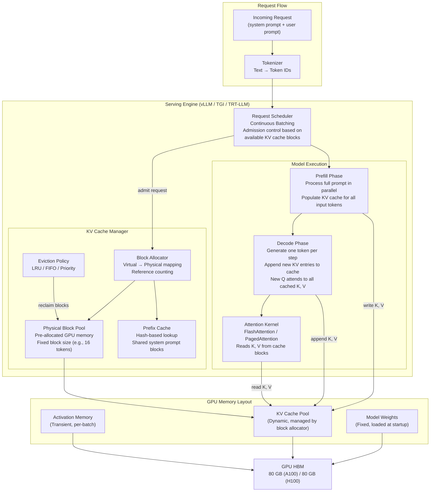
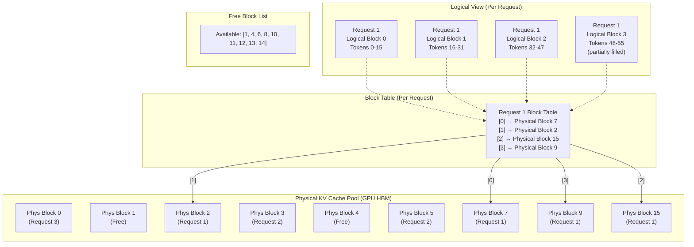
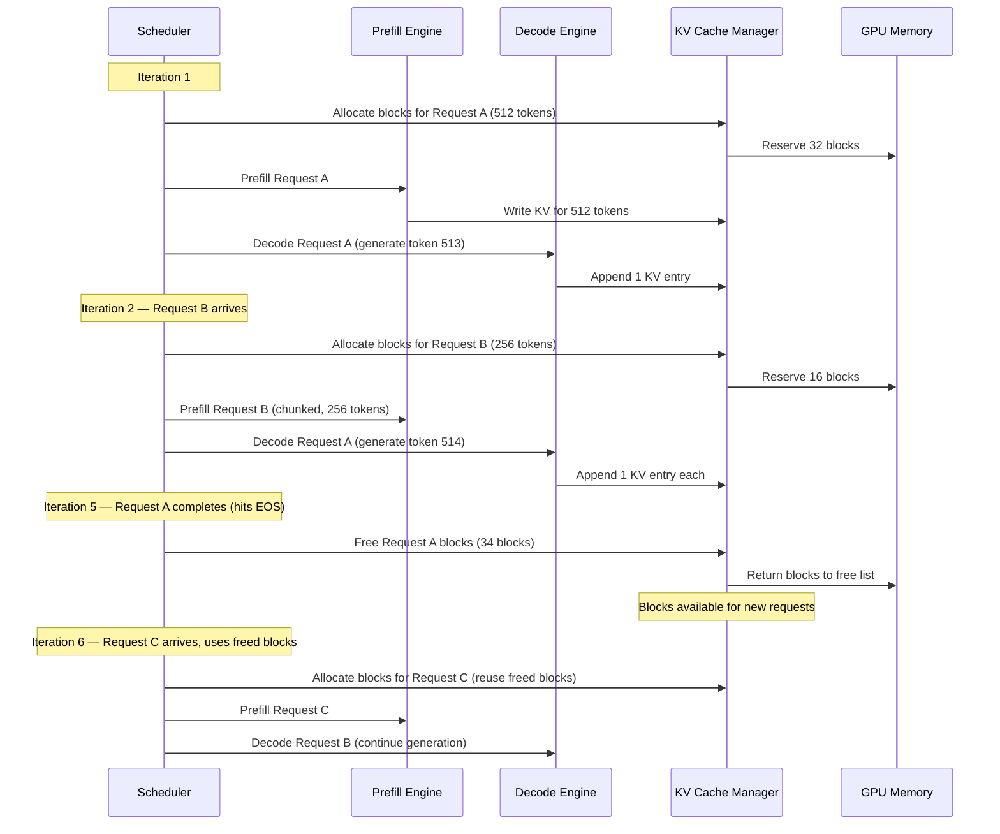
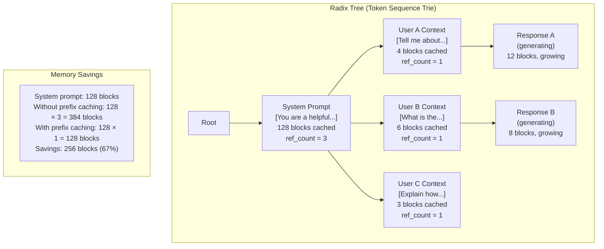

# KV Cache Management

## 1. Overview

The KV (Key-Value) cache is the mechanism that eliminates redundant computation during autoregressive generation in Transformer-based language models. Without a KV cache, generating each new token would require recomputing attention over the entire preceding sequence — an O(n^2) operation that makes generation prohibitively slow. With a KV cache, each new token's generation requires only O(n) attention computation (the new query attends to all cached keys/values), making autoregressive generation practical at scale.

For Principal AI Architects, the KV cache is not a background implementation detail — it is the single largest variable memory consumer in an LLM serving system and the primary bottleneck that determines maximum batch size, maximum context length, and ultimately throughput and cost per token. On a production serving cluster, the KV cache typically consumes 2–10x more GPU memory than the model weights themselves (at high batch sizes and long contexts). Every architectural decision in the serving stack — batching strategy, memory allocation, request scheduling, preemption policy — revolves around KV cache management.

**Key numbers that drive system design:**
- A LLaMA 3 70B model (GQA, 8 KV heads) at 8K context in FP16: KV cache = ~1.3 GB per request
- The same model at 128K context: KV cache = ~21 GB per request — more than the model weights in INT4
- vLLM's PagedAttention reduced KV cache waste from ~60–80% (pre-allocation fragmentation) to <4% (paged allocation)
- Prefix caching for shared system prompts can reduce KV cache memory by 30–70% for applications with standardized prefixes
- FP8 KV cache quantization doubles effective batch size with <0.5% quality impact

---

## 2. Where It Fits in GenAI Systems

The KV cache sits at the heart of the serving layer, mediating between the attention computation inside the model and the memory management system of the inference engine. It is created during the prefill phase (processing the input prompt) and extended during each decode step (generating new tokens).



**Upstream dependencies:** The model architecture determines KV cache dimensions — number of layers, number of KV heads (MHA vs. GQA vs. MQA), head dimension, and the positional encoding scheme (RoPE allows cache reuse across context-extended requests).

**Downstream consumers:** The continuous batching scheduler uses KV cache availability as the primary admission control signal. The preemption manager reclaims KV cache from lower-priority requests when memory is exhausted. Autoscaling systems use KV cache utilization as a scaling signal.

**Cross-references:** [Transformers](../01-foundations/01-transformers.md) | [Model Serving](01-model-serving.md) | [GPU Compute](02-gpu-compute.md) | [Context Scaling](05-context-scaling.md) | [Latency Optimization](../11-performance/01-latency-optimization.md)

---

## 3. Core Concepts

### 3.1 Why the KV Cache Exists

In autoregressive generation, the model generates one token at a time, each conditioned on all previously generated tokens. At each step, the self-attention mechanism computes:

```
Attention(Q, K, V) = softmax(Q K^T / sqrt(d_k)) V
```

Without caching, generating the t-th token requires:
1. Computing Q, K, V projections for all t tokens
2. Computing the full t x t attention matrix
3. Total work per step: O(t * d_model) for projections + O(t^2 * d_k) for attention
4. Total work for n tokens: O(n^3 * d_k) — cubic in sequence length

With KV caching:
1. At step t, only compute Q, K, V for the new token (position t)
2. Append the new K and V to the cache (K_cache[t] = k_t, V_cache[t] = v_t)
3. Compute attention: q_t attends to K_cache[0:t] and V_cache[0:t]
4. Work per step: O(d_model) for projection + O(t * d_k) for attention
5. Total work for n tokens: O(n^2 * d_k) — quadratic (same as one forward pass over the full sequence)

The KV cache converts generation from O(n^3) to O(n^2), trading compute for memory.

### 3.2 KV Cache Memory Formula

The exact memory required for KV cache is:

```
KV_cache_bytes = 2 × num_layers × num_kv_heads × head_dim × seq_len × batch_size × bytes_per_param
```

Where:
- **2**: one for K, one for V
- **num_layers**: number of Transformer decoder layers
- **num_kv_heads**: number of key/value heads (= num_heads for MHA, < num_heads for GQA, = 1 for MQA)
- **head_dim**: dimension per attention head (typically d_model / num_heads)
- **seq_len**: current sequence length (grows during generation)
- **batch_size**: number of concurrent sequences
- **bytes_per_param**: 2 for FP16/BF16, 1 for FP8/INT8, 0.5 for INT4

**Concrete examples:**

| Model | Layers | KV Heads | head_dim | KV Cache / token / request (FP16) | 4K Context | 32K Context | 128K Context |
|-------|--------|----------|----------|----------------------------------|------------|-------------|--------------|
| LLaMA 3 8B | 32 | 8 | 128 | 128 KB | 0.5 GB | 4.0 GB | 16.0 GB |
| LLaMA 3 70B | 80 | 8 | 128 | 320 KB | 1.3 GB | 10.0 GB | 40.0 GB |
| LLaMA 3.1 405B | 126 | 8 | 128 | 504 KB | 2.0 GB | 15.8 GB | 63.0 GB |
| Mistral 7B (GQA) | 32 | 8 | 128 | 128 KB | 0.5 GB | 4.0 GB | 16.0 GB |
| GPT-3 175B (MHA) | 96 | 96 | 128 | 4.7 MB | 18.9 GB | 151.0 GB | 604.0 GB |

**Key insight from the table:** MHA models (GPT-3) have KV cache 12x larger than GQA models (LLaMA 3 70B) with similar parameter counts. This is why every modern model uses GQA or MQA — the KV cache reduction is essential for production batch sizes.

### 3.3 PagedAttention (vLLM)

PagedAttention, introduced by the vLLM project (Kwon et al., 2023), applies operating system virtual memory concepts to KV cache management.

**The problem with pre-allocated KV cache:**
Before PagedAttention, serving systems pre-allocated contiguous memory for each request's KV cache at the maximum possible sequence length. For a system supporting 4096-token sequences:
- A request that generates only 100 tokens still reserves memory for 4096 tokens
- Average utilization: 20–40% (most requests are much shorter than the maximum)
- Fragmentation: even with partial requests, contiguous allocation creates external fragmentation
- Result: 60–80% of KV cache memory is wasted

**PagedAttention solution:**

1. **Block-based allocation:** KV cache memory is divided into fixed-size blocks (default: 16 tokens per block). Each block holds the K and V vectors for 16 consecutive tokens across all layers and heads.

2. **Virtual-to-physical mapping:** Each request has a block table mapping logical block indices to physical block locations. Blocks need not be contiguous in GPU memory — the block table provides indirection.

3. **On-demand allocation:** Blocks are allocated only when needed (as the sequence grows). A 100-token sequence uses ceil(100/16) = 7 blocks, not the maximum.

4. **Copy-on-write for parallel sampling:** When beam search or parallel sampling requires multiple sequences sharing a common prefix, the shared prefix blocks are referenced (not copied). Only when a sequence diverges is the block copied — exactly like OS copy-on-write.

5. **Block-level preemption:** When memory pressure occurs, the scheduler can preempt a request by freeing its blocks. The block table is preserved, and blocks are recomputed when the request resumes.

**PagedAttention custom kernel:**
The attention kernel is modified to traverse the block table rather than reading a contiguous KV buffer:
```
for each query token q:
    for each block in block_table[request]:
        load K_block, V_block from physical_block_address
        compute partial attention: score = q @ K_block^T / sqrt(d_k)
        accumulate weighted V contributions
    apply softmax normalization across all blocks
```

**Memory efficiency results:**
- Pre-allocated: ~20–40% KV cache utilization
- PagedAttention: ~96–98% KV cache utilization
- Net effect: 2–4x more concurrent requests at the same GPU memory budget
- vLLM reported 2–4x throughput improvement over HuggingFace Transformers and 24x over naive generation

### 3.4 Continuous Batching

Traditional static batching groups requests into a batch and processes them together until all requests in the batch complete. Shorter requests pad and wait for the longest request to finish — wasting GPU cycles.

**Continuous batching** (also called iteration-level or in-flight batching) treats each decode iteration independently:

1. **Iteration-level scheduling:** At each decode step, the scheduler can:
   - Add new requests (that have completed prefill) to the running batch
   - Remove completed requests (that have hit EOS or max_length)
   - Preempt lower-priority requests to free KV cache for higher-priority ones

2. **Prefill-decode interleaving strategies:**
   - **Chunked prefill:** Break long prefills into chunks (e.g., 512 tokens) and interleave chunks with decode steps. Prevents a single long-prompt prefill from blocking all decode iterations (head-of-line blocking)
   - **Prefill-decode separation:** Dedicate some GPU SMs to prefill and others to decode (Sarathi-Serve approach). Prevents prefill compute from starving decode latency
   - **Disaggregated prefill:** Run prefill on separate GPU instances from decode (Splitwise / DistServe approach). Prefill is compute-bound; decode is memory-bandwidth-bound — they have different optimal hardware configurations

3. **KV cache interaction:** Continuous batching requires dynamic KV cache allocation — new blocks are allocated as requests join, freed as they complete. PagedAttention is the enabling technology.

**Throughput impact:**
- Static batching: GPU utilization ~30–50% (idle during padding)
- Continuous batching: GPU utilization ~70–90%
- Continuous batching + PagedAttention: ~85–95%

### 3.5 Prefix Caching

Many LLM applications use standardized system prompts that are identical across all requests:

```
System: You are a helpful customer service agent for Acme Corp. Follow these guidelines: ...
[2000 tokens of system prompt]
User: [unique user message]
```

Without prefix caching, the 2000-token system prompt is processed and cached separately for every request. With prefix caching, the KV cache blocks for the shared prefix are computed once, stored, and reused across requests.

**Implementation approaches:**

**Hash-based prefix matching (vLLM Automatic Prefix Caching):**
1. Hash each block's token content: `hash(tokens[block_start:block_end])`
2. Store computed KV cache blocks indexed by content hash
3. When a new request arrives, hash its token blocks and look up matches
4. Matched blocks are referenced (not recomputed), with reference counting for lifecycle management
5. Unmatched blocks are computed normally and added to the cache

**Radix tree (SGLang RadixAttention):**
1. Maintain a radix tree (prefix tree) of all cached token sequences
2. New requests traverse the tree to find the longest matching prefix
3. Reuse all KV cache blocks along the matched path
4. Compute only the suffix

**Memory savings example:**
- System prompt: 2000 tokens, 8K context window, LLaMA 3 70B
- Without prefix caching: 2000/8000 = 25% of KV cache memory per request is "wasted" on redundant system prompt computation
- With prefix caching: system prompt KV is computed once and shared, saving ~25% memory and ~25% prefill time per request
- At 100 concurrent requests: saves ~32 GB of KV cache memory (LLaMA 3 70B, FP16)

**Multi-turn conversation optimization:**
Prefix caching also benefits multi-turn conversations where each turn includes the full conversation history. The KV cache for all previous turns is already computed and can be reused — only the new user message and assistant response need fresh computation.

### 3.6 KV Cache Compression

When KV cache memory is the bottleneck, compression techniques reduce per-request memory at the cost of some quality.

#### Quantized KV Cache (FP8 / INT8 / INT4)

KV cache values can be quantized independently of model weights:

| KV Cache Precision | Memory per Token (70B GQA) | Quality Impact | Hardware Support |
|-------------------|---------------------------|----------------|-----------------|
| FP16 (baseline) | 320 KB | Reference | Universal |
| FP8 | 160 KB | <0.5% degradation | H100 (native), A100 (via vLLM) |
| INT8 | 160 KB | <1% degradation | A100, H100 |
| INT4 (KIVI) | 80 KB | 1–3% degradation | Software emulated |
| INT2 (KIVI) | 40 KB | 3–8% degradation | Software emulated |

**Implementation:** vLLM supports FP8 KV cache via the `--kv-cache-dtype fp8` flag. TensorRT-LLM supports both FP8 and INT8 KV cache. Quantization is applied per-block with per-block scaling factors.

#### Sliding Window Attention

Used by Mistral 7B: each layer's attention only accesses the most recent W tokens (e.g., W = 4096). The KV cache for tokens older than the window is discarded.

- **Memory:** O(W) per layer instead of O(seq_len)
- **Information propagation:** Information from early tokens propagates through layers — layer L has access to tokens from position max(0, t - L*W) through the cascading effect of stacked sliding windows
- **Limitation:** Cannot directly attend to arbitrary early positions. For tasks requiring precise long-range retrieval (needle-in-a-haystack), sliding window alone is insufficient

#### Token Eviction (H2O, Scissorhands)

Selectively evict low-importance tokens from the KV cache based on attention patterns:

**Heavy Hitter Oracle (H2O):**
1. Track cumulative attention scores for each cached token position
2. Tokens that consistently receive high attention (heavy hitters) are retained
3. Tokens with low cumulative attention are evicted
4. Keep the most recent W tokens unconditionally (recent context is always relevant)
5. Keep the top-K heavy hitters regardless of position

**Result:** Maintains ~95% of full-cache quality with only 20% of the KV cache budget on long-context tasks.

### 3.7 Attention Sink

Xiao et al. (2023) discovered that Transformer models allocate disproportionately high attention to the very first few tokens in a sequence, regardless of their semantic content. These "attention sinks" serve as a numerical anchor for the softmax distribution.

**StreamingLLM approach:**
1. Always keep the first K tokens (attention sinks, typically K = 4) in the KV cache
2. Apply sliding window for recent tokens (most recent W tokens)
3. Evict tokens between position K and position (current - W)

```
KV cache layout: [sink_0, sink_1, sink_2, sink_3, ..., evicted, ..., recent_W-3, recent_W-2, recent_W-1, recent_W]
```

**Why it works:** Without the initial sink tokens, the softmax attention distribution becomes unstable when the sliding window moves past the original start of the sequence. The sink tokens provide a "garbage collector" for attention mass that the model needs to distribute somewhere. Removing them causes perplexity to explode; keeping just 4 tokens stabilizes generation for arbitrarily long sequences.

**Use case:** Streaming applications where the model generates indefinitely (real-time transcription, continuous monitoring, infinite conversation). Without attention sinks, a sliding-window-only approach degrades after the window moves past the original tokens.

### 3.8 Multi-Query vs. Grouped-Query Attention Impact on Cache Size

The choice of attention variant directly determines KV cache size per request:

```
MHA:  num_kv_heads = num_heads          → full-size KV cache
GQA:  num_kv_heads = num_heads / G      → 1/G size KV cache  (G = group size)
MQA:  num_kv_heads = 1                  → 1/num_heads size KV cache
```

**Concrete comparison (70B-scale model, 64 attention heads, 80 layers, head_dim=128, 8K context, FP16):**

| Variant | KV Heads | KV Cache / Request | Max Batch (80 GB free) | Quality Impact |
|---------|----------|-------------------|----------------------|----------------|
| MHA | 64 | 10.5 GB | 7 | Reference |
| GQA-8 (8 groups) | 8 | 1.3 GB | 61 | <0.5% degradation |
| GQA-4 (4 groups) | 4 | 0.66 GB | 121 | ~1% degradation |
| MQA | 1 | 0.16 GB | 500 | 1–3% degradation |

**Industry convergence:** GQA with 8 KV heads has become the standard for models >13B parameters (LLaMA 3, Mistral, Gemma 2, Qwen 2). It provides an 8x KV cache reduction with negligible quality loss.

### 3.9 Memory Planning: Calculating Maximum Batch Size

The maximum batch size for a given deployment is determined by:

```
Available_KV_memory = Total_GPU_memory - Model_weights - Activation_memory - System_overhead
Max_batch_size = Available_KV_memory / KV_cache_per_request
KV_cache_per_request = 2 × layers × kv_heads × head_dim × max_seq_len × bytes_per_param
```

**Worked example: LLaMA 3 70B on 2x A100 80GB with AWQ INT4 weights, FP16 KV cache, 8K context:**

| Component | Memory |
|-----------|--------|
| Total GPU memory | 2 x 80 = 160 GB |
| AWQ INT4 model weights | 37 GB |
| Activation memory (peak, batch-dependent) | ~3 GB (estimated at batch=64) |
| CUDA/system overhead | ~5 GB |
| **Available for KV cache** | **~115 GB** |
| KV cache per request (FP16, 8K) | 2 x 80 x 8 x 128 x 8192 x 2 = 2.68 GB |
| **Max batch size** | **floor(115 / 2.68) = 42 requests** |

**With FP8 KV cache:**

| Component | Memory |
|-----------|--------|
| Available for KV cache | ~115 GB |
| KV cache per request (FP8, 8K) | 1.34 GB |
| **Max batch size** | **floor(115 / 1.34) = 85 requests (2x improvement)** |

**Practical adjustment:** Real deployments set `gpu_memory_utilization` to 0.85–0.95 (vLLM default: 0.9) to leave headroom for CUDA memory fragmentation and activation spikes. Additionally, not all requests reach maximum context length — vLLM's PagedAttention allocates blocks dynamically, so average batch size is typically 1.5–3x the worst-case calculation above.

---

## 4. Architecture

### 4.1 PagedAttention Memory Layout



### 4.2 Continuous Batching with KV Cache Lifecycle



### 4.3 Prefix Caching Architecture (RadixAttention)



---

## 5. Design Patterns

### Pattern 1: Tiered KV Cache (Hot/Warm/Cold)

**When to use:** Serving applications with variable request lifetimes and context reuse (multi-turn chat, agent loops).

- **Hot tier (GPU HBM):** Active requests currently generating tokens. Full-speed attention access.
- **Warm tier (CPU DRAM or secondary GPU):** Paused requests (user typing, tool execution). KV cache offloaded to CPU. Resume by copying blocks back to GPU (100–500ms latency).
- **Cold tier (Disk/NVMe):** Long-idle sessions (minutes). KV cache serialized to disk. Resume by reloading and copying (1–5s latency), or recompute from prompt if faster.

This enables supporting thousands of concurrent "sessions" while only keeping hundreds of active requests in GPU memory.

### Pattern 2: Disaggregated Prefill and Decode

**When to use:** High-throughput production deployments where prefill and decode have different resource profiles.

- **Prefill nodes:** GPU-compute-bound (matrix multiplications over full prompt). Optimize for FLOPS. High batch size, high utilization. Can use less GPU memory (shorter KV cache lifetime — transfer after prefill).
- **Decode nodes:** Memory-bandwidth-bound (single-token attention against large KV cache). Optimize for memory bandwidth. KV cache is the dominant resource.
- **KV cache transfer:** After prefill completes, the KV cache is transferred from the prefill node to the decode node over NVLink/InfiniBand. Transfer cost: ~1.3 GB for 70B at 8K context → ~100ms over 100 Gbps InfiniBand.

**Advantage:** Optimal hardware utilization — no single node must be provisioned for both compute-heavy prefill and memory-heavy decode.

**Implementations:** Splitwise (Microsoft), DistServe (Zhong et al.), Mooncake (Moonshot AI).

### Pattern 3: Speculative Prefill with KV Cache Prediction

**When to use:** Real-time chat applications where minimizing time-to-first-token (TTFT) is critical.

1. Before the user submits their next message, predict likely prefixes (e.g., common follow-up patterns)
2. Speculatively compute KV cache for predicted prefixes
3. When the actual request arrives, match against speculative caches
4. On hit: skip prefill for the matched prefix, saving 100–500ms TTFT
5. On miss: discard speculative cache, run normal prefill

**Effective when:** The application has predictable request patterns (form-based chat, guided workflows).

### Pattern 4: Multi-Turn KV Cache Persistence

**When to use:** Chat applications with multi-turn conversations.

Instead of reprocessing the entire conversation history for each turn:
1. After each assistant response, persist the full KV cache for the conversation
2. On the next user turn, load the persisted KV cache and compute only the new user message + assistant response
3. Cache invalidation: if the system prompt changes or conversation is edited, invalidate from the first modified position

**Savings:** In a 10-turn conversation at 8K context, avoid re-prefilling ~6K tokens on the 10th turn, saving ~75% prefill time.

### Pattern 5: KV Cache-Aware Autoscaling

**When to use:** Cloud deployments with variable traffic patterns.

Scale inference replicas based on KV cache utilization rather than just GPU compute utilization:
- **Scale-up signal:** KV cache block pool > 85% utilized AND request queue growing
- **Scale-down signal:** KV cache block pool < 30% utilized for > 5 minutes
- **Anti-thrashing:** Minimum 2-minute cooldown between scaling events

Traditional GPU utilization metrics miss the case where the GPU is idle (decode is memory-bandwidth-bound) but the KV cache pool is full (cannot admit new requests). KV cache utilization directly measures serving capacity.

---

## 6. Implementation Approaches

### 6.1 vLLM PagedAttention Configuration

```python
from vllm import LLM, SamplingParams

# Configure KV cache management
llm = LLM(
    model="meta-llama/Llama-3-70B-Instruct",
    tensor_parallel_size=2,           # Shard model across 2 GPUs
    gpu_memory_utilization=0.90,      # 90% of GPU memory for model + KV cache
    max_model_len=8192,               # Maximum sequence length (determines block pool size)
    block_size=16,                    # Tokens per KV cache block (default)
    swap_space=4,                     # GB of CPU memory for swapped-out KV blocks
    enable_prefix_caching=True,       # Enable automatic prefix caching
    kv_cache_dtype="fp8",             # FP8 KV cache (halves memory, ~2x batch size)
    quantization="awq",              # INT4 weights for model
    # enforce_eager=False,            # Use CUDA graphs for decode (default)
)

# With these settings on 2x A100 80GB:
# - Model weights (AWQ INT4): ~37 GB
# - Available for KV cache (FP8): ~107 GB
# - KV cache per request (FP8, 8K): ~1.34 GB
# - Max concurrent requests: ~80
```

### 6.2 Memory Planning Calculator

```python
def calculate_kv_cache_memory(
    num_layers: int,
    num_kv_heads: int,
    head_dim: int,
    seq_len: int,
    batch_size: int,
    dtype_bytes: float = 2.0,  # 2.0 for FP16, 1.0 for FP8, 0.5 for INT4
) -> dict:
    """Calculate KV cache memory requirements."""

    # Per-token KV size across all layers
    kv_per_token = 2 * num_layers * num_kv_heads * head_dim * dtype_bytes

    # Per-request KV cache
    kv_per_request = kv_per_token * seq_len

    # Total KV cache for batch
    kv_total = kv_per_request * batch_size

    return {
        "kv_per_token_bytes": kv_per_token,
        "kv_per_token_kb": kv_per_token / 1024,
        "kv_per_request_gb": kv_per_request / (1024**3),
        "kv_total_gb": kv_total / (1024**3),
    }

def max_batch_size(
    total_gpu_memory_gb: float,
    model_weight_gb: float,
    activation_overhead_gb: float,
    system_overhead_gb: float,
    num_layers: int,
    num_kv_heads: int,
    head_dim: int,
    max_seq_len: int,
    kv_dtype_bytes: float = 2.0,
    utilization: float = 0.90,
) -> int:
    """Calculate maximum batch size given GPU memory constraints."""
    usable_memory_gb = (total_gpu_memory_gb * utilization
                        - model_weight_gb
                        - activation_overhead_gb
                        - system_overhead_gb)

    kv_per_request_gb = (2 * num_layers * num_kv_heads * head_dim
                         * max_seq_len * kv_dtype_bytes) / (1024**3)

    return int(usable_memory_gb / kv_per_request_gb)

# Example: LLaMA 3 70B AWQ on 2x A100 80GB
result = max_batch_size(
    total_gpu_memory_gb=160,     # 2x A100 80GB
    model_weight_gb=37,          # AWQ INT4
    activation_overhead_gb=3,
    system_overhead_gb=5,
    num_layers=80,
    num_kv_heads=8,              # GQA
    head_dim=128,
    max_seq_len=8192,
    kv_dtype_bytes=1.0,          # FP8 KV cache
    utilization=0.90,
)
# Result: 72 concurrent requests
```

### 6.3 TensorRT-LLM KV Cache Configuration

```python
# TensorRT-LLM builder configuration for KV cache optimization
# trtllm-build \
#   --model_dir ./llama3-70b-hf \
#   --output_dir ./llama3-70b-trt \
#   --max_batch_size 64 \
#   --max_input_len 4096 \
#   --max_seq_len 8192 \
#   --paged_kv_cache enable \                    # PagedAttention
#   --tokens_per_block 64 \                       # Block size (TRT default: 64)
#   --kv_cache_type paged \
#   --use_paged_context_fmha enable \            # Flash-style paged attention
#   --kv_cache_quant_mode int8 \                 # INT8 KV cache
#   --tp_size 2 \                                 # Tensor parallel
#   --enable_chunked_context \                    # Chunked prefill
#   --max_num_tokens 8192                         # Max tokens per iteration
```

### 6.4 Monitoring KV Cache Utilization

```python
# vLLM exposes KV cache metrics via Prometheus
# Key metrics to monitor:

# 1. KV cache utilization (fraction of blocks in use)
# vllm:gpu_cache_usage_perc  — target: 0.60–0.85
# Above 0.85: risk of preemption; scale up or reduce max_seq_len
# Below 0.30: over-provisioned; scale down

# 2. Number of preempted requests
# vllm:num_preemption_total — target: 0 in steady state
# Persistent preemption indicates insufficient KV cache capacity

# 3. Prefix cache hit rate
# vllm:prefix_cache_hit_rate — target: >0.5 for shared-prefix workloads
# Low hit rate suggests prefix diversity is too high for caching to help

# 4. Block allocation latency
# Track time to allocate new blocks — spikes indicate fragmentation

# Prometheus alert rules:
# alert: KVCacheNearFull
#   expr: vllm:gpu_cache_usage_perc > 0.90
#   for: 1m
#   labels:
#     severity: warning
#   annotations:
#     summary: "KV cache utilization above 90% — preemption likely"

# alert: HighPreemptionRate
#   expr: rate(vllm:num_preemption_total[5m]) > 1
#   for: 2m
#   labels:
#     severity: critical
#   annotations:
#     summary: "Requests being preempted — KV cache capacity insufficient"
```

---

## 7. Tradeoffs

### 7.1 KV Cache Precision Tradeoffs

| KV Precision | Memory / Token (70B) | Max Batch (80 GB free, 8K ctx) | Quality Impact | Hardware Support | Best For |
|-------------|---------------------|-------------------------------|----------------|-----------------|----------|
| FP16 | 320 KB | 30 | Reference | Universal | Quality-critical (medical, legal) |
| BF16 | 320 KB | 30 | Equivalent to FP16 | A100, H100 | Training-adjacent serving |
| FP8 | 160 KB | 60 | <0.5% | H100 (native), A100 (vLLM) | Production on H100 |
| INT8 | 160 KB | 60 | <1% | A100, H100 | Production on A100 |
| INT4 | 80 KB | 120 | 1–3% | Software only | High-batch, short-context |

### 7.2 Block Size Tradeoffs

| Block Size (tokens) | Internal Fragmentation | Block Table Overhead | Kernel Efficiency | Best For |
|---------------------|----------------------|---------------------|-------------------|----------|
| 8 | Very low (~3%) | High (many blocks) | Lower (many small reads) | Short sequences (<512 tokens) |
| 16 (vLLM default) | Low (~5%) | Moderate | Good | General purpose |
| 32 | Moderate (~8%) | Low | Better (fewer, larger reads) | Long sequences, high throughput |
| 64 (TRT-LLM default) | Higher (~12%) | Very low | Best (maximizes memory bandwidth) | TRT-LLM production |
| 128 | High (~15%) | Minimal | Best for decode | Very long context (128K+) |

### 7.3 Preemption Strategy Tradeoffs

| Strategy | Latency Impact (Preempted Request) | Memory Recovery Speed | Implementation Complexity |
|----------|-----------------------------------|----------------------|--------------------------|
| Swap to CPU | High (100–500ms to resume) | Fast (blocks freed immediately) | Moderate (async copy engine) |
| Recompute | Very high (full prefill re-run) | Fast (blocks freed immediately) | Low |
| Block-level eviction (partial) | Low (lose only evicted context) | Partial (only evicted blocks freed) | High (quality-aware eviction) |
| Request killing | Immediate (request fails) | Instant | Low (but poor user experience) |

### 7.4 Prefix Caching vs. No Prefix Caching

| Dimension | No Prefix Caching | Prefix Caching Enabled |
|-----------|-------------------|----------------------|
| Memory overhead | None | ~5–10% for cache index structures |
| Prefill latency (shared prefix) | Full recomputation | Near-zero for cached prefix |
| Memory utilization | Independent per request | Shared blocks reduce total memory |
| Block eviction complexity | Simple (free on completion) | Reference counting, LRU eviction |
| Best when | All requests have unique prompts | Standardized system prompts, multi-turn |
| Worst when | N/A | Every request has a unique prefix (cache never hits) |

---

## 8. Failure Modes

### 8.1 KV Cache OOM (Out of Memory)

**Symptom:** Requests fail with CUDA out-of-memory errors or are preempted despite apparent availability.
**Root cause:** KV cache memory exhausted due to: (a) too many concurrent requests, (b) requests with unexpectedly long output sequences, (c) memory leak in block allocator.
**Detection:** Monitor `vllm:gpu_cache_usage_perc`. Alert at >90%.
**Mitigation:**
- Set conservative `max_model_len` to cap per-request KV allocation
- Implement request admission control that rejects new requests when block pool is >85% full
- Enable CPU swap space as overflow buffer
- Use FP8 KV cache to double effective capacity
- Scale horizontally (add GPU instances)

### 8.2 Prefix Cache Thrashing

**Symptom:** Prefix cache hit rate is near zero despite enabling prefix caching. Memory used for cached blocks provides no benefit.
**Root cause:** Request prefixes are too diverse — each request has a unique prefix, so cached blocks are evicted before they can be reused.
**Detection:** Monitor prefix cache hit rate. If < 5% over an extended period, thrashing is occurring.
**Mitigation:** Disable prefix caching if hit rate is persistently low (saves memory and block management overhead). Standardize system prompts across request types. Group similar requests to the same serving instance to increase cache locality.

### 8.3 Head-of-Line Blocking from Long Prefills

**Symptom:** Time-to-first-token (TTFT) spikes for short requests when long-context requests arrive.
**Root cause:** A 128K-token prefill occupies the GPU for several seconds, blocking all pending decode iterations (each decode step for existing requests stalls).
**Detection:** TTFT P99 spikes correlated with long-context request arrivals.
**Mitigation:**
- Enable chunked prefill (break long prefills into 512–2048 token chunks, interleave with decode)
- Disaggregate prefill and decode to separate GPU pools
- Set per-request prefill length limits with a queue for oversized requests

### 8.4 KV Cache Corruption from Preemption Race Conditions

**Symptom:** Generated text contains non-sequiturs or context from other requests after a preemption event.
**Root cause:** Bug in block allocator where a preempted request's blocks are freed and reallocated to a new request while the original request's decode kernel still holds a stale block table pointer.
**Detection:** This is a serving engine bug (rare in mature systems like vLLM). Detectable by comparing outputs with and without preemption enabled.
**Mitigation:** Use stable, tested versions of serving engines. Enable memory fencing between preemption and reallocation. Report to engine maintainers with reproduction steps.

### 8.5 Incorrect Memory Planning Leading to Under-Utilization

**Symptom:** GPU memory utilization is consistently low (~50%) but throughput is also low.
**Root cause:** `max_model_len` set to a very long context (e.g., 128K) but most requests use only 2–4K tokens. The block pool pre-allocates based on the maximum, reserving too few blocks (each block covers a small fraction of 128K) and admitting too few requests.
**Detection:** Compare average sequence length vs. `max_model_len`. If avg/max < 0.1, memory planning is suboptimal.
**Mitigation:** Set `max_model_len` closer to actual usage (e.g., P99 sequence length). Use separate deployments for long-context and short-context workloads. PagedAttention's on-demand allocation helps but the block pool size is still pre-determined by max_model_len.

### 8.6 Multi-GPU KV Cache Synchronization Overhead

**Symptom:** Throughput does not scale linearly with the number of GPUs under tensor parallelism.
**Root cause:** Under tensor parallelism, KV cache is partitioned across GPUs (each GPU stores a subset of KV heads). All-reduce operations synchronize attention outputs, but block allocation must be coordinated — all GPUs must agree on which logical blocks map to which physical blocks.
**Detection:** Profile inter-GPU communication patterns. Excessive synchronization in the block allocator.
**Mitigation:** Ensure block allocation decisions are made by a single coordinator (the scheduler), not distributed. Use pipeline parallelism for very large models (partitions layers, not heads — each GPU has its own independent block pool for its layers).

---

## 9. Optimization Techniques

### 9.1 FlashAttention Integration with Paged KV Cache

FlashAttention's tiled computation naturally composes with PagedAttention's block-based layout:

1. FlashAttention processes attention in tiles (blocks of queries × blocks of keys)
2. PagedAttention stores KV in blocks indexed by a block table
3. FlashPagedAttention (used in vLLM, FlashInfer): the FlashAttention kernel traverses the block table to load K/V tiles from non-contiguous physical blocks, computing attention with the same O(1) extra memory as standard FlashAttention

**Performance:** FlashPagedAttention achieves ~90–95% of the throughput of FlashAttention with contiguous memory, while enabling the memory efficiency of paged allocation. The overhead comes from indirect memory access through the block table.

### 9.2 CUDA Graphs for Decode

During decode, each iteration runs the same computation graph (one token through the entire model, attending to the KV cache). CUDA Graphs capture this computation graph and replay it without CPU-side kernel launch overhead:

- **Without CUDA Graphs:** Each decode step incurs ~0.1–0.5ms of CPU-side overhead for kernel launches
- **With CUDA Graphs:** Overhead drops to ~0.01ms, captured graph is replayed in one GPU launch
- **Limitation:** CUDA Graphs require fixed tensor shapes. Changing batch size (from continuous batching) requires re-capturing the graph. vLLM pre-captures graphs for common batch sizes and pads to the nearest pre-captured size

### 9.3 Speculative Decoding with KV Cache Sharing

Speculative decoding uses a small draft model to propose K tokens, then the large target model verifies them in parallel. KV cache optimization:

1. Draft model has its own (much smaller) KV cache
2. Target model processes all K proposed tokens in a single forward pass (like a mini-prefill)
3. If all K tokens are accepted, the target model's KV cache is extended by K entries — K times fewer cache append operations
4. If token j is rejected, the target model's KV cache is extended by j entries and the draft model's cache is truncated to position j

**KV cache benefit:** Each accepted speculative step saves (K-1) individual decode iterations worth of KV cache append operations and attention computations.

### 9.4 Multi-LoRA Serving with Shared KV Cache

When serving multiple LoRA-fine-tuned variants of the same base model:

1. The base model's KV cache computation is identical across all LoRA variants (LoRA typically applies to Q/K/V projections but the base K/V values are the same if LoRA rank is applied additively)
2. Optimization: compute base K/V once and cache it, then apply LoRA delta on top
3. vLLM supports multi-LoRA serving where different requests in the same batch use different LoRA adapters but share the base model's compute and KV cache infrastructure

### 9.5 Token-Level KV Cache Reuse in Agent Loops

LLM agent systems (ReAct, function calling) involve multiple LLM calls with overlapping context:

```
Call 1: [system] [user] [thought_1] [action_1]
Call 2: [system] [user] [thought_1] [action_1] [observation_1] [thought_2] [action_2]
Call 3: [system] [user] [thought_1] [action_1] [observation_1] [thought_2] [action_2] [observation_2] ...
```

Each call is a prefix of the next. With prefix caching enabled, Call 2 reuses the entire KV cache from Call 1, computing only [observation_1] [thought_2] [action_2]. This converts O(n^2) total prefill work (across all agent steps) into O(n) — each token is prefilled exactly once.

**SGLang** explicitly optimizes for this pattern with its RadixAttention prefix cache and fork/join primitives for tree-structured LLM call patterns.

---

## 10. Real-World Examples

### 10.1 vLLM (UC Berkeley / vLLM Project)

vLLM introduced PagedAttention and transformed LLM serving efficiency:
- Reported 2–4x throughput improvement over HuggingFace TGI and 24x over naive HuggingFace generation
- PagedAttention reduced KV cache waste from ~60% to <4%
- Adopted as the de facto open-source LLM serving engine, used by Anyscale, Databricks, and numerous startups
- Automatic prefix caching added in v0.3.0, reducing TTFT by 30–70% for shared-prefix workloads
- FP8 KV cache support added in v0.4.0, doubling effective batch size on H100
- Chunked prefill (v0.4.1) eliminated head-of-line blocking for mixed-length workloads

### 10.2 Anthropic (Claude Production Serving)

While Anthropic does not disclose implementation details, their support for extremely long context windows (up to 1M tokens for Claude Opus 4) implies sophisticated KV cache management:
- 1M-token context on a 70B+-scale model would require hundreds of GB of KV cache in FP16, necessitating aggressive KV cache compression, multi-node KV distribution, or attention architecture innovations
- Claude's ability to process long documents with low latency suggests prefix caching and efficient KV reuse for the system prompt and retrieval augmentation
- The pricing structure (higher per-token cost for input vs. output) reflects the real infrastructure cost: input tokens require prefill (compute-bound) while output tokens require decode with KV cache (memory-bound)

### 10.3 NVIDIA TensorRT-LLM

NVIDIA's production inference engine implements state-of-the-art KV cache management:
- Paged KV cache with configurable block sizes (default 64 tokens)
- INT8 and FP8 KV cache quantization with per-block scaling
- In-flight batching (continuous batching) with iteration-level request management
- Used by NVIDIA NIM for enterprise deployments
- MLPerf Inference benchmarks demonstrate optimal KV cache utilization across A100 and H100 clusters
- Supported KV cache features: chunked context (chunked prefill), context FMHA (Flash-style paged attention), and block reuse for beam search

### 10.4 SGLang (Stanford / LMSYS)

SGLang introduced RadixAttention for structured KV cache reuse:
- RadixAttention maintains a radix tree of all cached sequences, enabling O(1) prefix matching
- Particularly effective for agent workloads where LLM is called repeatedly with growing context
- Reported 5x throughput improvement over vLLM on multi-turn agent benchmarks
- Fork/join primitives allow tree-structured generation (e.g., tree-of-thought) to share KV cache at branch points
- Automatic KV cache garbage collection using reference counting on the radix tree

### 10.5 Moonshot AI (Mooncake / Kimi)

Moonshot AI's Kimi chatbot supports 2M-token context windows with production-grade latency:
- Published the Mooncake architecture: disaggregated prefill/decode with KV cache transfer over RDMA
- Prefill cluster computes KV cache and transfers it to decode cluster via high-bandwidth interconnect
- KV cache stored in a distributed KV store (not just GPU memory) enabling cache persistence and sharing across nodes
- Reported 525% improvement in throughput-optimal goodput compared to baseline vLLM on their long-context workload
- Demonstrates that at extreme context lengths (>100K), KV cache management is the dominant engineering challenge, not model compute

---

## 11. Related Topics

- **[Transformers](../01-foundations/01-transformers.md):** The attention mechanism's Q/K/V structure creates the KV cache. Attention variant (MHA/GQA/MQA) determines cache size per request
- **[Model Serving](01-model-serving.md):** The serving engine manages KV cache lifecycle through PagedAttention, continuous batching, and prefix caching
- **[GPU Compute](02-gpu-compute.md):** GPU HBM capacity and memory bandwidth are the physical constraints on KV cache size and access speed. NVLink bandwidth determines KV cache transfer speed in tensor-parallel and disaggregated setups
- **[Context Scaling](05-context-scaling.md):** Long-context models (128K+) stress KV cache management to its limits. Techniques like sliding window, attention sinks, and context compression directly interact with KV cache sizing
- **[Latency Optimization](../11-performance/01-latency-optimization.md):** TTFT is determined by prefill time (compute-bound). Inter-token latency is determined by decode time (memory-bandwidth-bound due to KV cache reads). Both are directly influenced by KV cache management decisions
- **[Quantization](03-quantization.md):** KV cache can be independently quantized (FP8/INT8) to double effective batch size. This is orthogonal to and composable with weight quantization

---

## 12. Source Traceability

| Concept | Primary Source | Year |
|---------|---------------|------|
| PagedAttention / vLLM | Kwon et al., "Efficient Memory Management for Large Language Model Serving with PagedAttention" | 2023 |
| Continuous Batching | Yu et al., "Orca: A Distributed Serving System for Transformer-Based Generative Models" | 2022 |
| FlashAttention | Dao et al., "FlashAttention: Fast and Memory-Efficient Exact Attention with IO-Awareness" | 2022 |
| FlashAttention-2 | Dao, "FlashAttention-2: Faster Attention with Better Parallelism and Work Partitioning" | 2023 |
| RadixAttention / SGLang | Zheng et al., "SGLang: Efficient Execution of Structured Language Model Programs" | 2023 |
| Attention Sinks / StreamingLLM | Xiao et al., "Efficient Streaming Language Models with Attention Sinks" | 2023 |
| H2O (Heavy-Hitter Oracle) | Zhang et al., "H2O: Heavy-Hitter Oracle for Efficient Generative Inference of Large Language Models" | 2023 |
| Splitwise (Disaggregated Serving) | Patel et al., "Splitwise: Efficient Generative LLM Inference Using Phase Splitting" (Microsoft) | 2024 |
| DistServe | Zhong et al., "DistServe: Disaggregating Prefill and Decoding for Goodput-optimized Large Language Model Serving" | 2024 |
| Mooncake | Liu et al., "Mooncake: A KVCache-centric Disaggregated Architecture for LLM Serving" (Moonshot AI) | 2024 |
| KIVI (KV Cache Quantization) | Liu et al., "KIVI: A Tuning-Free Asymmetric 2bit Quantization for KV Cache" | 2024 |
| Sarathi-Serve (Chunked Prefill) | Agrawal et al., "Taming Throughput-Latency Tradeoff in LLM Inference with Sarathi-Serve" | 2024 |
| Multi-Query Attention | Shazeer, "Fast Transformer Decoding: One Write-Head is All You Need" | 2019 |
| Grouped-Query Attention | Ainslie et al., "GQA: Training Generalized Multi-Query Transformer Models from Multi-Head Checkpoints" | 2023 |
| Sliding Window Attention | Beltagy et al., "Longformer" (concept); Mistral AI (production implementation) | 2020 / 2023 |
| Scissorhands | Liu et al., "Scissorhands: Exploiting the Persistence of Importance Hypothesis for LLM KV Cache Compression" | 2023 |
