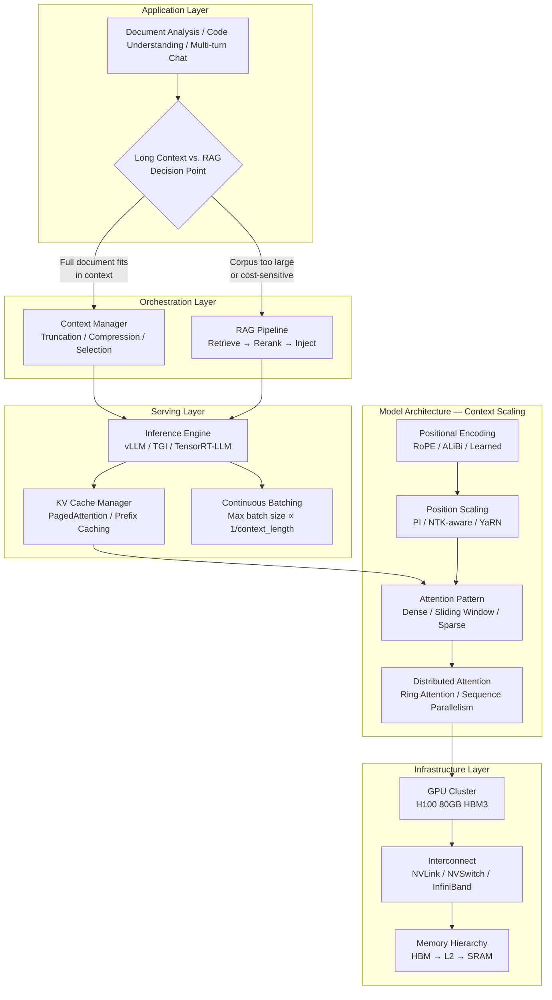
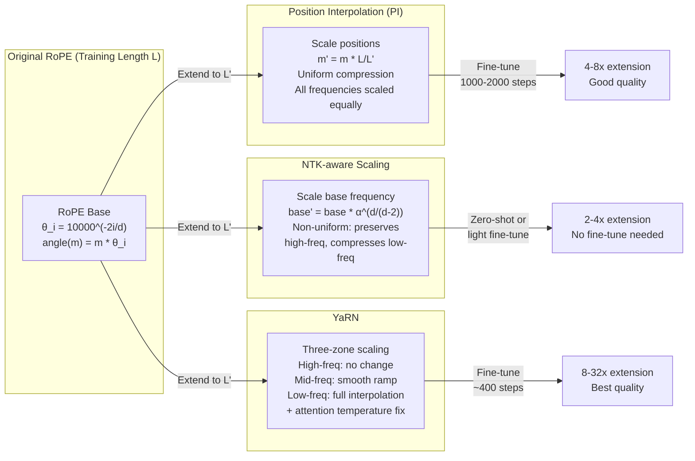
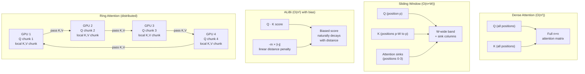
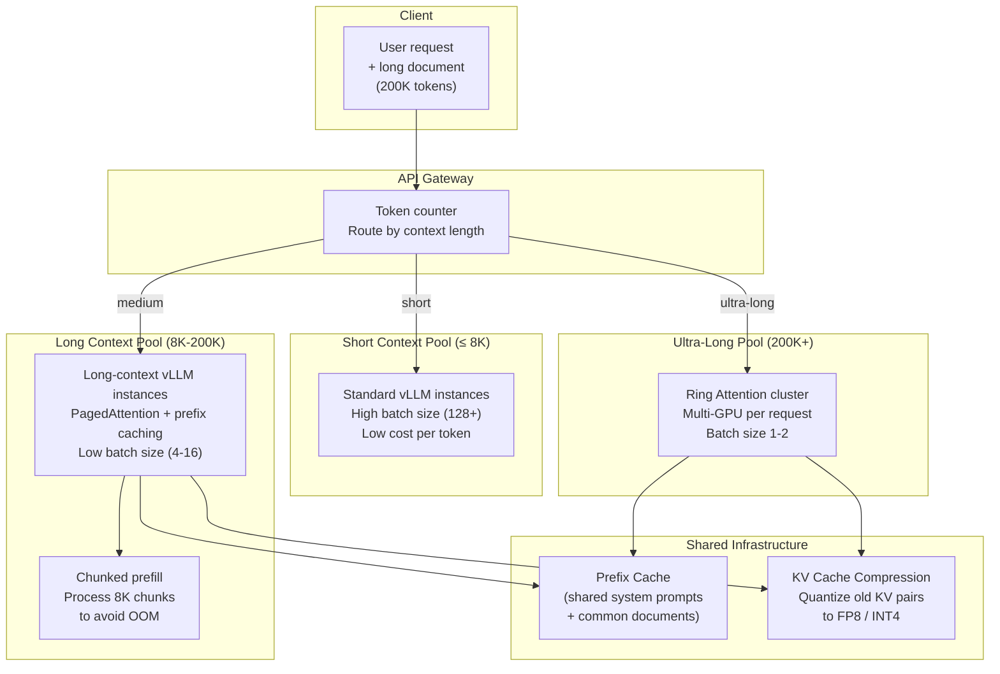

# Context Window Scaling

## 1. Overview

Context window scaling is the set of architectural techniques that allow Transformer-based LLMs to process input sequences far beyond their original training length. The context window — the maximum number of tokens a model can attend to in a single forward pass — is one of the most consequential architectural parameters in any GenAI system. It determines whether a model can analyze an entire codebase in one pass, maintain coherent multi-turn conversations over hours, summarize a 500-page legal contract, or reason across a full patient medical history.

The fundamental challenge is the quadratic scaling of self-attention. Standard dense attention computes an n x n score matrix where n is the sequence length, making both compute and memory O(n^2). At 4K tokens this is manageable; at 128K tokens compute is 1,024x larger; at 1M tokens it is 62,500x larger. Every context scaling technique is, at its core, an attempt to tame this quadratic explosion — either by modifying how positional information is encoded (so a model trained at 4K can generalize to 128K), by sparsifying the attention pattern (so not all n^2 pairs are computed), or by distributing the computation across multiple devices.

**Key numbers that drive system design:**
- Self-attention FLOPs scale as O(n^2 * d) — doubling context length quadruples attention compute
- KV cache memory grows linearly: a 70B GQA model with 8 KV heads at 128K context requires ~10 GB KV cache per sequence in FP16
- At 1M token context, the attention score matrix alone for a single head is 1M x 1M = 1 trillion elements
- Needle-in-a-haystack retrieval accuracy degrades significantly in the "lost in the middle" zone (positions 25-75% of context) for many models
- Current frontier: Gemini 1.5 Pro at 2M tokens, Claude at 1M tokens (as of early 2026)

**Why this matters for architects:** The choice of context scaling strategy determines serving infrastructure costs (GPU memory, compute), maximum batch size (KV cache competes with batching for HBM), retrieval architecture (long context vs. RAG vs. hybrid), and user experience (latency of first-token for long prompts). A Principal Architect must understand these techniques to make informed decisions about model selection, infrastructure sizing, and retrieval architecture.

---

## 2. Where It Fits in GenAI Systems

Context window scaling operates at the intersection of the model architecture layer and the serving infrastructure layer. Positional encoding extensions (RoPE scaling, ALiBi) are embedded within the model weights and attention computation. Attention pattern modifications (sliding window, sparse attention) change the compute graph. Distributed approaches (Ring Attention) span the infrastructure layer. And the decision of whether to use long context or RAG is an application-layer architectural choice that flows directly from the capabilities and costs of context scaling.



**Upstream dependencies:** Tokenizer determines actual token count for a given text (a 500-page PDF might be 200K-400K tokens depending on tokenizer vocabulary). The transformer architecture's attention mechanism (see [01-transformers.md](../01-foundations/01-transformers.md)) is where all context scaling techniques are applied.

**Downstream consumers:** The KV cache manager (see [04-kv-cache.md](04-kv-cache.md)) must handle the dramatically larger cache sizes that long-context models produce. The RAG pipeline (see [01-rag-pipeline.md](../04-rag/01-rag-pipeline.md)) competes with and complements long-context approaches. The context manager (see [03-context-management.md](../06-prompt-engineering/03-context-management.md)) sits above, deciding how to fill the available window.

---

## 3. Core Concepts

### 3.1 Positional Encoding Foundations

Transformers are permutation-invariant without positional information — the self-attention operation treats its inputs as an unordered set. Positional encodings inject sequence order. The choice of positional encoding determines whether and how a model can generalize to lengths beyond its training distribution.

**Absolute Learned Positions (GPT-2/3 style):** A learned embedding table of shape (max_positions, d_model). Token at position i gets embedding P[i] added to its token embedding. Hard length limit — no P[4097] exists if trained with max_positions=4096. Cannot extrapolate at all.

**Sinusoidal Positions (original Transformer):** Fixed sinusoidal functions of different frequencies. Theoretically allows extrapolation, but in practice models struggle beyond ~2x training length because the model has never seen those activation patterns during training.

**Rotary Position Embeddings (RoPE):** The dominant method in modern LLMs (LLaMA, Mistral, Qwen, Gemma, Phi). Rather than adding positional information to embeddings, RoPE rotates query and key vectors in 2D subspaces by angles proportional to position. For a query/key pair at positions m and n, the attention score naturally depends on the relative distance (m - n) through the rotation angle difference.

The rotation for dimension pair (2i, 2i+1) at position m is:

```
θ_i = base^(-2i/d)     where base = 10000 (original)
rotation angle = m * θ_i
```

This creates a spectrum of frequencies — low-dimensional pairs rotate quickly (capturing local patterns), high-dimensional pairs rotate slowly (capturing global structure). The key insight: attention scores between positions m and n depend only on (m - n), making RoPE a relative positional encoding despite being applied to individual vectors.

**Why RoPE enables extension:** Because the positional information is encoded as rotation frequencies rather than learned lookup entries, we can mathematically modify these frequencies to cover longer ranges without retraining from scratch. This is the foundation of PI, NTK-aware scaling, and YaRN.

### 3.2 Position Interpolation (PI)

**The problem:** A model trained with RoPE at max position 4096 has learned attention patterns for rotation angles in [0, 4096 * θ_i]. If you feed position 8192, the rotation angles are outside the trained distribution, and attention scores become unreliable.

**The PI solution (Chen et al., 2023):** Instead of extrapolating to larger angles, interpolate the position indices so they fit within the original range. For target length L' and training length L:

```
position_scaled = position * (L / L')
```

To extend from 4K to 32K: divide all position indices by 8, so position 32000 maps to effective position 4000. The model sees rotation angles it has encountered during training.

**Why it works:** The model's internal representations are well-calibrated for the original angular range. Interpolation preserves this calibration at the cost of reduced positional resolution (positions that were 1 apart are now 0.125 apart).

**Fine-tuning requirement:** PI typically requires 1000-2000 steps of continued pre-training on longer sequences to recalibrate. Without fine-tuning, the compressed position granularity causes noticeable quality degradation.

**Limitations:**
- All frequency components are scaled uniformly — low-frequency dimensions (which already rotate slowly) become even slower, potentially losing the ability to distinguish nearby positions
- The uniform compression means local positional resolution degrades proportionally to the extension factor
- Works well for moderate extensions (4-8x) but degrades for very large extensions (32x+)

### 3.3 NTK-aware RoPE Scaling

**The insight (bloc97, 2023):** Not all RoPE frequency components should be scaled equally. High-frequency components encode local positional information (nearby token relationships) and should be preserved. Low-frequency components encode global position and can be spread across longer ranges.

NTK-aware scaling modifies the base frequency of RoPE rather than scaling position indices:

```
base' = base * α^(d/(d-2))

where α = target_length / training_length
```

This effectively scales different frequency components by different amounts — high-frequency dimensions are barely changed (preserving local resolution), while low-frequency dimensions are compressed more (extending global range). The name comes from the Neural Tangent Kernel (NTK) framework, which provides theoretical justification for why this non-uniform scaling preserves model behavior better than uniform PI.

**Advantages over PI:**
- No fine-tuning required for moderate extensions (2-4x) — works "out of the box"
- Better preservation of local positional resolution
- More graceful degradation at extreme extensions

**Dynamic NTK scaling:** A variant where the scaling factor adjusts dynamically based on the actual sequence length being processed. When processing a 2K sequence in a model with 128K capability, there is no need to scale at all. The base is only modified when the sequence exceeds the original training length. This is the default in many inference frameworks.

### 3.4 YaRN (Yet another RoPE extensioN)

YaRN (Peng et al., 2023) is the most sophisticated RoPE extension method and combines multiple insights:

**Component 1 — NTK-aware interpolation:** Uses the NTK-aware base frequency modification as its foundation, but applies it as an interpolation (like PI) rather than extrapolation.

**Component 2 — Frequency-dependent scaling:** Divides RoPE dimensions into three groups:
- **High-frequency dimensions** (wavelength < original training length): No scaling. These dimensions already complete multiple full rotations within the training length and are well-extrapolated.
- **Low-frequency dimensions** (wavelength > original training length): Full PI-style interpolation. These dimensions have not completed even one full rotation during training and must be compressed.
- **Medium-frequency dimensions**: Smooth interpolation between the two extremes using a ramp function.

**Component 3 — Attention scaling:** Applies a temperature correction to attention logits. When positions are interpolated, attention scores change magnitude. YaRN compensates with a scaling factor:

```
attention_score = (Q @ K^T) / √d_k * (1 / temperature_correction)
```

This correction factor is derived from the information entropy change caused by interpolation.

**Results:** YaRN achieves state-of-the-art perplexity on extended contexts with only ~400 steps of fine-tuning (vs. 1000-2000 for PI). It has been adopted by the LLaMA 3.1 and Qwen 2.5 families for their 128K context extensions.

### 3.5 Sliding Window Attention (SWA)

Instead of every token attending to all previous tokens, each token attends only to the W most recent tokens (a fixed-size local window).

**Complexity:** O(n * W) instead of O(n^2) — linear in sequence length for fixed window size W.

**Information propagation:** With a window size W and L layers, information from position 0 can reach position L*W through the stacking of layers. Mistral 7B uses W=4096 with 32 layers, giving a theoretical receptive field of 131,072 tokens despite the 4096-token per-layer window.

**Attention Sink phenomenon (Xiao et al., 2023):** In practice, autoregressive models learn to allocate disproportionate attention to the first few tokens (positions 0-3) regardless of their content. These "attention sinks" serve as a global accumulator. Naive sliding window attention that drops these initial tokens suffers severe quality degradation. The solution: always keep the first k tokens (typically k=4) in the attention window, even as the window slides.

```
Effective window for position p:
  attend_to = {0, 1, 2, 3} ∪ {p-W+1, p-W+2, ..., p}
```

**Rolling KV cache (Mistral approach):** The KV cache is implemented as a circular buffer of size W. When the buffer is full, the oldest entries are overwritten. This provides O(1) memory regardless of sequence length (plus the small fixed set of attention sink positions).

**Hybrid sliding window + global attention (Gemma 2, Jamba):** Alternate between SWA layers and full global attention layers. This combines the efficiency of SWA for most layers with the global reasoning capability of full attention at selected layers. Gemma 2 27B uses this pattern: even-numbered layers use SWA (W=4096), odd-numbered layers use full global attention.

### 3.6 ALiBi (Attention with Linear Biases)

ALiBi (Press et al., 2022) takes a fundamentally different approach: it does not modify token embeddings at all. Instead, it adds a static, non-learned linear bias to attention scores based on the distance between query and key positions:

```
attention_score(i, j) = q_i · k_j - m * |i - j|
```

Where m is a head-specific slope. Different heads use different slopes (geometrically spaced), giving each head a different "effective attention range" — some heads are very local (steep penalty), others are nearly global (gentle penalty).

**Key properties:**
- **No learned positional parameters** — the biases are entirely static
- **Naturally extrapolates** — the linear penalty continues to work at any length
- **Head specialization** — with slopes like {1/2, 1/4, 1/8, ..., 1/2^h}, the model naturally develops local and global attention heads
- **Used by:** BLOOM-176B, MPT-7B/30B (MosaicML)

**Limitations:**
- Performance typically slightly below RoPE-based models on tasks requiring precise long-range position discrimination
- Less adopted than RoPE in the post-LLaMA era — most 2024-2026 models use RoPE variants
- The linear bias assumption may not match the true positional importance distribution for all tasks

### 3.7 Ring Attention

Ring Attention (Liu et al., 2023) distributes the attention computation for very long sequences across multiple GPUs arranged in a logical ring topology. It is not a positional encoding technique but a distributed computation strategy for scaling to extreme context lengths.

**Mechanism:**
1. Partition the input sequence of length n into P chunks of length n/P, one per GPU
2. Each GPU holds the Q (query) block for its chunk locally and keeps it fixed
3. K and V blocks are passed around the ring — each GPU sends its K,V to the next GPU and receives K,V from the previous GPU
4. After P-1 communication steps, every GPU has computed attention scores against all K,V positions
5. The softmax normalization is computed incrementally using the online softmax trick (maintaining running max and sum statistics)

**Communication pattern:** Each GPU sends/receives one K,V block per step. With P GPUs and per-GPU block size n/P, total communication per GPU = (P-1) * 2 * (n/P) * d * bytes = O(n * d) — linear in sequence length, independent of the number of GPUs.

**Key insight — overlapping compute and communication:** Each GPU computes attention against the currently-held K,V block while simultaneously sending that block to the next GPU. With careful scheduling, communication is entirely hidden behind computation for large enough block sizes.

**Scaling:** Ring Attention enables processing sequences of length P * L_single, where L_single is the maximum context that fits in a single GPU. With 8 H100 GPUs (80 GB HBM each), a model that handles 128K per GPU could process 1M tokens. Google Research used a variant to enable Gemini's 2M-token context.

### 3.8 Memory and Compute Scaling Analysis

Understanding the precise scaling behavior is essential for infrastructure planning.

**Attention compute (FLOPs per layer):**

| Component | FLOPs | At 4K | At 128K | At 1M |
|-----------|-------|-------|---------|-------|
| QKV projection | 6 * n * d^2 | 6 * 4K * d^2 | 6 * 128K * d^2 | 6 * 1M * d^2 |
| Attention scores (Q @ K^T) | 2 * n^2 * d | 32M * d | 32G * d | 2T * d |
| Attention output (scores @ V) | 2 * n^2 * d | 32M * d | 32G * d | 2T * d |
| Output projection | 2 * n * d^2 | 2 * 4K * d^2 | 2 * 128K * d^2 | 2 * 1M * d^2 |

At 128K context, attention compute is 1,024x the 4K case. At 1M, it is 62,500x.

**KV cache memory (per sequence, FP16, GQA with g KV heads, d_k head dim, L layers):**

```
KV_cache = 2 * g * d_k * seq_len * L * 2 bytes
```

| Model | KV Heads | d_k | Layers | At 4K | At 128K | At 1M |
|-------|----------|-----|--------|-------|---------|-------|
| LLaMA 3 8B | 8 | 128 | 32 | 128 MB | 4 GB | 32 GB |
| LLaMA 3 70B | 8 | 128 | 80 | 320 MB | 10 GB | 80 GB |
| LLaMA 3.1 405B | 8 | 128 | 126 | 504 MB | 15.75 GB | 126 GB |

At 1M context, the KV cache for a single LLaMA 3 70B sequence (80 GB) exceeds the HBM of a single H100. This is precisely why Ring Attention and KV cache compression techniques are required for frontier context lengths.

**Batch size impact:** GPU HBM is shared between model weights, KV cache, and activations. For a 70B model on 4x H100:
- Model weights (FP16): ~140 GB (spread across 4 GPUs = 35 GB/GPU)
- Available per-GPU HBM for KV cache: ~45 GB
- At 4K context: KV cache per sequence = 80 MB → max batch size ~560
- At 128K context: KV cache per sequence = 2.5 GB/GPU → max batch size ~18
- At 1M context: KV cache per sequence = 20 GB/GPU → max batch size 2

This inverse relationship between context length and batch size is the primary economic argument for RAG over long context in cost-sensitive deployments.

### 3.9 Needle-in-a-Haystack Evaluation

The Needle-in-a-Haystack (NIAH) test (Kamradt, 2023) is the standard benchmark for evaluating context window utilization quality. A unique fact (the "needle") is inserted at a specific position within a long document (the "haystack"), and the model is asked to retrieve it.

**Test matrix:** Vary both (a) total context length and (b) needle placement depth (0-100% of context), creating a 2D heatmap of retrieval accuracy.

**Key findings across models:**
- **"Lost in the middle" effect (Liu et al., 2023):** Many models exhibit a U-shaped retrieval curve — high accuracy when the needle is near the beginning or end of the context, but degraded accuracy in the middle (25-75% depth). This suggests models develop attention biases toward recency and primacy positions.
- **GPT-4 Turbo (128K):** Shows degradation beyond ~64K tokens, with accuracy dropping to 60-70% at extreme depths in the middle of very long contexts
- **Claude 3.5 Sonnet / Claude 3 Opus (200K):** Near-perfect retrieval across full context, including middle positions — one of the first models to largely solve NIAH
- **Gemini 1.5 Pro (1M/2M):** Maintains high accuracy up to 1M tokens, with minor degradation at 2M in specific depth ranges
- **LLaMA 3.1 405B (128K):** Strong retrieval up to ~100K, some degradation in the 100-128K range in middle positions

**Beyond NIAH:** NIAH tests only single-fact retrieval. More challenging benchmarks include:
- **Multi-needle:** Multiple facts scattered throughout the context, model must aggregate them
- **RULER (Hsieh et al., 2024):** Tests multi-hop reasoning, aggregation, and tracing across long contexts
- **InfiniteBench (Zhang et al., 2024):** Real-world long-context tasks including book summarization, code debugging across large codebases

### 3.10 Long Context vs. RAG: Architectural Decision Framework

This is one of the most consequential architectural decisions in GenAI system design.

**When long context wins:**
- The entire relevant corpus fits within the context window (< 1M tokens)
- Tasks require holistic understanding (summarization, style analysis, cross-referencing)
- Latency budget allows for long-context prefill time
- The corpus changes per-request (each user uploads a different document)
- Reasoning chains span the entire document (legal contract analysis, code review)

**When RAG wins:**
- Corpus is too large for any context window (enterprise knowledge bases with millions of documents)
- Cost-sensitive: RAG retrieves only relevant chunks, avoiding paying for processing irrelevant tokens
- Low-latency requirements: retrieving 5 relevant passages (2K tokens) is far faster than processing 500K tokens
- The corpus is relatively stable and can be pre-indexed
- Updates are frequent — re-embedding a few documents is cheaper than maintaining long-context caches

**Hybrid approach (emerging best practice):** Use RAG for initial retrieval and filtering, then stuff retrieved context into a moderate-length window (8K-32K) for synthesis. Alternatively, use long context for the highest-value use cases (complex reasoning) and RAG for simpler lookup tasks.

---

## 4. Architecture

### 4.1 RoPE Extension Techniques Compared



### 4.2 Attention Pattern Strategies



### 4.3 End-to-End Long Context Serving Architecture



---

## 5. Design Patterns

### Pattern 1: Progressive Context Extension (Train Short, Extend Long)

**When to use:** Building a model that needs long-context capability without paying the full cost of long-context pre-training.

Train the model at a short context length (4K-8K) where self-attention compute is cheap and data mixing is well-understood. Then apply RoPE extension (YaRN) and fine-tune on a small amount of long-context data (1-5% of pre-training tokens) to extend to the target length.

- **LLaMA 3.1 approach:** Pre-trained at 8K, extended to 128K using a continued pre-training phase with progressively increasing context lengths (8K -> 16K -> 32K -> 128K)
- **Cost savings:** Long-context pre-training would cost ~16x more in FLOPs (128K/8K = 16, but quadratic attention makes it worse). Extension fine-tuning costs <5% of full pre-training
- **Quality tradeoff:** Extended models typically score 5-15% lower on long-context benchmarks compared to models trained natively at long context

### Pattern 2: Tiered Context Architecture

**When to use:** Serving diverse workloads with varying context length requirements.

Deploy separate serving pools for different context length tiers, each optimized differently:
- **Tier 1 (0-8K):** Maximum batch size, standard PagedAttention, highest throughput per GPU
- **Tier 2 (8K-64K):** Moderate batch size, chunked prefill, prefix caching for common system prompts
- **Tier 3 (64K-256K):** Low batch size, aggressive KV cache quantization (FP8), tensor parallelism across 2-4 GPUs per request
- **Tier 4 (256K+):** Ring Attention or sequence parallelism, 4-8 GPUs per request, batch size 1-2

The API gateway routes requests based on input token count. This avoids the "long context penalty" where a 1K-token request is served by infrastructure sized for 128K.

### Pattern 3: Prefix Caching for Repeated Long Contexts

**When to use:** Multiple requests share a common long prefix (system prompt + uploaded document, analyzed by multiple queries).

Cache the KV states for the shared prefix and reuse them across requests. For a 100K-token document analyzed by 50 different user queries:
- **Without prefix caching:** 50 * 100K = 5M tokens of prefill compute
- **With prefix caching:** 100K tokens prefilled once, 50 queries only compute for their unique suffix
- **Savings:** ~98% compute reduction for the prefill phase

Implementation: vLLM's automatic prefix caching matches incoming prompts against cached KV blocks using a hash-based radix tree. TensorRT-LLM provides similar functionality via its KV cache reuse manager.

### Pattern 4: Hybrid Long-Context + RAG

**When to use:** The user corpus is too large for any context window, but critical reasoning tasks require cross-document understanding.

Architecture: RAG retrieves the top-N most relevant documents (e.g., 10 documents, each 5K tokens = 50K total). These are stuffed into a long-context model (128K window) along with the query and system prompt. The model synthesizes across all retrieved documents with full attention.

This pattern is used by Anthropic's Claude for Projects, Google's NotebookLM, and Microsoft's Copilot for M365. It combines RAG's ability to search across millions of documents with long context's ability to reason across multiple retrieved passages simultaneously.

---

## 6. Implementation Approaches

### 6.1 Implementing YaRN Extension in Practice

Most inference frameworks support RoPE scaling natively. In vLLM:

```python
# vLLM configuration for YaRN-extended LLaMA
from vllm import LLM

llm = LLM(
    model="meta-llama/Meta-Llama-3.1-70B-Instruct",
    rope_scaling={
        "type": "yarn",
        "factor": 16.0,        # 8K * 16 = 128K target
        "original_max_position_embeddings": 8192,
    },
    max_model_len=131072,
    tensor_parallel_size=4,     # 4x H100 for 70B model
    gpu_memory_utilization=0.92,
)
```

For HuggingFace Transformers:

```python
from transformers import AutoModelForCausalLM, AutoConfig

config = AutoConfig.from_pretrained("meta-llama/Meta-Llama-3.1-70B-Instruct")
config.rope_scaling = {
    "type": "yarn",
    "factor": 16.0,
    "original_max_position_embeddings": 8192,
    "attention_factor": 0.1,  # YaRN temperature correction
    "beta_fast": 32,           # High-frequency boundary
    "beta_slow": 1,            # Low-frequency boundary
}
model = AutoModelForCausalLM.from_pretrained(
    "meta-llama/Meta-Llama-3.1-70B-Instruct",
    config=config,
    torch_dtype=torch.bfloat16,
    device_map="auto",
)
```

### 6.2 Implementing Sliding Window Attention with Attention Sinks

```python
def sliding_window_attention_with_sinks(
    query, key, value,
    window_size: int = 4096,
    n_sink_tokens: int = 4,
):
    """
    Attention with sliding window + attention sink tokens.
    query, key, value: (batch, heads, seq_len, head_dim)
    """
    seq_len = query.shape[2]

    # For each query position, determine which key positions to attend to
    # Always include sink tokens [0, n_sink_tokens)
    # Plus the local window [pos - window_size + 1, pos]

    # Build causal + windowed + sink attention mask
    mask = torch.full((seq_len, seq_len), float('-inf'))
    for i in range(seq_len):
        # Sink tokens — always attend
        mask[i, :n_sink_tokens] = 0.0
        # Local window — attend to recent tokens
        window_start = max(n_sink_tokens, i - window_size + 1)
        mask[i, window_start:i+1] = 0.0

    scores = torch.matmul(query, key.transpose(-2, -1)) / math.sqrt(head_dim)
    scores = scores + mask.unsqueeze(0).unsqueeze(0)  # broadcast over batch, heads
    attn_weights = torch.softmax(scores, dim=-1)
    return torch.matmul(attn_weights, value)
```

### 6.3 Ring Attention (Simplified)

```python
import torch
import torch.distributed as dist

def ring_attention_step(
    q_local,    # (batch, heads, chunk_len, head_dim) — fixed on this GPU
    k_block,    # (batch, heads, chunk_len, head_dim) — rotated
    v_block,    # (batch, heads, chunk_len, head_dim) — rotated
    running_max, running_sum, running_output,
    rank, world_size,
):
    """One step of Ring Attention with online softmax."""
    # Compute local attention scores
    scores = torch.matmul(q_local, k_block.transpose(-2, -1)) / math.sqrt(d_k)

    # Online softmax update (numerically stable incremental softmax)
    block_max = scores.max(dim=-1, keepdim=True).values
    new_max = torch.maximum(running_max, block_max)

    # Rescale previous accumulations
    correction = torch.exp(running_max - new_max)
    running_output = running_output * correction
    running_sum = running_sum * correction

    # Add current block contribution
    exp_scores = torch.exp(scores - new_max)
    running_output += torch.matmul(exp_scores, v_block)
    running_sum += exp_scores.sum(dim=-1, keepdim=True)
    running_max = new_max

    # Async send k_block, v_block to next GPU in ring
    send_rank = (rank + 1) % world_size
    recv_rank = (rank - 1) % world_size
    k_recv = torch.empty_like(k_block)
    v_recv = torch.empty_like(v_block)

    dist.isend(k_block, dst=send_rank)
    dist.isend(v_block, dst=send_rank)
    dist.irecv(k_recv, src=recv_rank)
    dist.irecv(v_recv, src=recv_rank)
    dist.barrier()

    return k_recv, v_recv, running_max, running_sum, running_output
```

### 6.4 Infrastructure Sizing Calculator

```python
def estimate_long_context_resources(
    model_params_b: float,      # Billions of parameters
    kv_heads: int,              # Number of KV heads (GQA)
    head_dim: int,              # Dimension per head
    num_layers: int,
    context_length: int,        # Target context length in tokens
    batch_size: int,
    precision_bytes: int = 2,   # FP16 = 2, FP8 = 1
    gpu_hbm_gb: float = 80.0,  # H100 = 80 GB
):
    """Estimate GPU requirements for long-context serving."""
    # Model weights
    model_mem_gb = model_params_b * 2 / 1  # FP16: 2 bytes per param, in GB

    # KV cache per sequence
    kv_per_seq_bytes = 2 * kv_heads * head_dim * context_length * num_layers * precision_bytes
    kv_per_seq_gb = kv_per_seq_bytes / (1024**3)

    # Total KV cache
    total_kv_gb = kv_per_seq_gb * batch_size

    # Activation memory (rough estimate: ~2x one layer's activations)
    activation_gb = batch_size * context_length * head_dim * kv_heads * 8 * 2 / (1024**3)

    total_gb = model_mem_gb + total_kv_gb + activation_gb
    min_gpus = math.ceil(total_gb / (gpu_hbm_gb * 0.90))  # 90% utilization

    return {
        "model_memory_gb": model_mem_gb,
        "kv_cache_per_seq_gb": kv_per_seq_gb,
        "total_kv_cache_gb": total_kv_gb,
        "total_memory_gb": total_gb,
        "min_gpus_h100": min_gpus,
        "max_batch_at_target_context": int(
            (min_gpus * gpu_hbm_gb * 0.9 - model_mem_gb) / kv_per_seq_gb
        ),
    }
```

---

## 7. Tradeoffs

### 7.1 RoPE Extension Method Selection

| Criterion | Position Interpolation (PI) | NTK-aware Scaling | YaRN |
|-----------|---------------------------|-------------------|------|
| **Extension range** | 4-8x reliable | 2-4x zero-shot, 8x with fine-tune | 8-32x with fine-tune |
| **Fine-tuning required** | Yes (1000-2000 steps) | No for moderate extension | Yes but minimal (~400 steps) |
| **Local position resolution** | Degraded uniformly | Preserved for high frequencies | Best preservation |
| **Implementation complexity** | Simple (multiply positions) | Moderate (modify base) | Complex (3 zones + temperature) |
| **Framework support** | Universal | Most frameworks | vLLM, HF Transformers, llama.cpp |
| **Quality at 8x extension** | Good with fine-tuning | Moderate without fine-tuning | Best with fine-tuning |
| **Best use case** | Quick extension, moderate range | Zero-shot extension needed | Maximum quality at long range |

### 7.2 Attention Pattern Strategy

| Criterion | Dense Attention | Sliding Window | ALiBi | Ring Attention |
|-----------|----------------|----------------|-------|----------------|
| **Compute complexity** | O(n^2 * d) | O(n * W * d) | O(n^2 * d) | O(n^2 * d / P) per GPU |
| **Memory per layer** | O(n^2) | O(n * W) | O(n^2) | O(n^2 / P^2) per GPU |
| **KV cache size** | Full (all positions) | Fixed (window W) | Full (all positions) | Full (distributed) |
| **Global reasoning** | Full | Through layer stacking only | Full (with decay) | Full |
| **Max practical length** | ~128K (single GPU) | Unlimited (fixed memory) | ~128K (single GPU) | Millions (multi-GPU) |
| **Quality at extreme length** | Best (if fits in memory) | Degrades without global layers | Good with extrapolation | Best (same as dense) |
| **Hardware requirement** | Single GPU (up to limit) | Single GPU | Single GPU | Multi-GPU cluster |
| **Used by** | GPT-4, Claude, LLaMA | Mistral, Gemma 2 | BLOOM, MPT | Gemini (variant) |

### 7.3 Long Context vs. RAG Decision Matrix

| Factor | Long Context Preferred | RAG Preferred |
|--------|----------------------|---------------|
| **Corpus size** | < 1M tokens | > 1M tokens, potentially unlimited |
| **Task type** | Holistic understanding, summarization | Fact lookup, specific question answering |
| **Latency budget** | Seconds acceptable | Milliseconds needed |
| **Cost sensitivity** | Low (enterprise, high-value) | High (consumer, high-volume) |
| **Corpus stability** | Changes per request | Relatively stable, pre-indexed |
| **Reasoning complexity** | Multi-hop across full document | Single-hop or focused retrieval |
| **Accuracy requirement** | Need full context for completeness | Precision over recall acceptable |
| **Infrastructure** | Large GPU allocation per request | Smaller GPU + vector DB |
| **Token cost (relative)** | 10-100x higher per query | 1x baseline |

---

## 8. Failure Modes

### 8.1 Lost in the Middle

**Symptom:** Model fails to retrieve or reason about information placed in the middle 25-75% of a long context, despite correctly handling information at the beginning and end.

**Root cause:** Attention patterns develop primacy and recency biases during training. The U-shaped attention distribution means tokens in the middle receive disproportionately low attention weight.

**Mitigation:** Use models that have been specifically trained with long-context data and attention pattern regularization. Reorder important information to the beginning or end of the context. Use multi-pass strategies where different orderings are tried. Claude 3+ and Gemini 1.5+ have largely mitigated this failure mode through training improvements.

### 8.2 Context Window Overflow Degradation

**Symptom:** Model begins producing incoherent, repetitive, or hallucinated output when the actual token count exceeds the effective context window, even if the nominal window is larger.

**Root cause:** RoPE extension techniques have an effective range beyond which quality degrades — a model extended from 4K to 128K via YaRN may work well at 100K but degrade at 120K+. The nominal max_position_embeddings does not guarantee quality at all positions.

**Mitigation:** Test with needle-in-a-haystack at the actual target length. Apply a safety margin (use at most 80-90% of the nominal window). Monitor perplexity on long-context validation sets.

### 8.3 KV Cache OOM During Prefill

**Symptom:** Out-of-memory error when processing the prompt (prefill phase) of a very long input, even though the model nominally supports that context length.

**Root cause:** During prefill, the full attention matrix for the entire prompt must be computed. For a 200K-token prompt, this matrix is 200K x 200K per head = 40 billion elements per head. Even with FlashAttention (which tiles the computation), intermediate states can exceed memory.

**Mitigation:** Chunked prefill — process the prompt in chunks of 8K-16K tokens, building the KV cache incrementally. vLLM supports this via `--enable-chunked-prefill`. TensorRT-LLM uses a similar paged KV cache builder.

### 8.4 Attention Sink Eviction in Sliding Window

**Symptom:** Model with sliding window attention produces nonsensical output after the context exceeds the window size, despite working correctly for shorter inputs.

**Root cause:** The first few tokens (attention sinks) were evicted from the KV cache when the sliding window rolled past them. The model relies on these tokens as "default" attention targets for maintaining output coherence.

**Mitigation:** Always retain attention sink tokens (positions 0-3) in the KV cache, separate from the sliding window. StreamingLLM (Xiao et al., 2023) formalized this fix.

### 8.5 Prefill Latency Blow-Up

**Symptom:** Time-to-first-token (TTFT) scales quadratically with prompt length, making very long prompts impractical for interactive use cases.

**Root cause:** Prefill requires computing attention across the full prompt, which is O(n^2). A 128K prompt takes ~1,024x longer to prefill than a 4K prompt (partially mitigated by FlashAttention's memory-efficient compute, but FLOPs remain quadratic).

**Mitigation:** Prefix caching (avoid re-computing KV for shared prefixes). Background prefill (start processing the document before the user asks a question). Speculative prefill (predict likely queries and pre-compute). Chunked prefill with interleaved decode (serve other requests between prefill chunks to maintain responsiveness).

### 8.6 Quality Degradation Beyond Effective Training Length

**Symptom:** Model was trained at 8K and extended to 128K via YaRN, but perplexity increases steadily beyond 32K and text quality drops noticeably beyond 64K despite the 128K nominal limit.

**Root cause:** RoPE extension fine-tuning was insufficient (too few steps, too little long-context training data), or the extension ratio exceeds the method's reliable range.

**Mitigation:** Validate with perplexity measurements at target lengths before deployment. Increase fine-tuning data and steps if degradation is observed. Consider progressive extension (4K -> 16K -> 64K -> 128K) rather than a single jump. Use a model natively trained at the target length if quality is critical.

---

## 9. Optimization Techniques

### 9.1 FlashAttention for Long Contexts

FlashAttention (Dao et al., 2022, 2023) is the single most important optimization for long-context attention. It reduces memory from O(n^2) to O(n) by tiling the computation and never materializing the full attention matrix:

- **FlashAttention-2:** 2-4x speedup over FlashAttention-1 through better work partitioning across GPU thread blocks. The standard for all modern inference engines.
- **FlashAttention-3 (Hopper):** Exploits H100-specific features (TMA async copies, warp specialization, FP8 tensor cores) for up to 1.5-2x additional speedup.
- **Impact on long context:** Without FlashAttention, 128K context is impractical on a single GPU due to the 128K x 128K attention matrix (32 GB for FP16 for a single layer, single head). With FlashAttention, it fits in ~O(n) memory.

### 9.2 KV Cache Compression

For long contexts, the KV cache becomes the dominant memory consumer. Compression techniques:

- **KV cache quantization:** Quantize cached K and V tensors to FP8 or INT4. Reduces memory by 2-4x with minimal quality impact on long-context tasks (the slight quantization error is amortized over many tokens).
- **Token dropping / eviction:** Identify and evict KV entries for tokens with consistently low attention weights. H2O (Heavy-Hitter Oracle) retains only the "heavy hitter" tokens that receive high attention. Can reduce KV cache by 5-10x on some tasks.
- **Grouped KV compression:** Merge KV entries for consecutive tokens in older parts of the context using learned compression functions. Recent tokens retain full-resolution KV, distant tokens use compressed representations.

### 9.3 Chunked Prefill with Decode Interleaving

Processing a 200K-token prompt monopolizes the GPU for seconds, stalling all other requests. Chunked prefill breaks the prompt into 8K-16K chunks and interleaves decode steps for other active requests between chunks:

- **TTFT impact:** Increases TTFT for the long prompt by ~20-30% (overhead of interleaving)
- **System throughput:** Dramatically improves — other requests are not blocked during long prefill
- **Implementation:** Standard in vLLM (v0.4+), Sarathi-Serve, TensorRT-LLM

### 9.4 Speculative Prefill and Background Processing

For document analysis use cases, start prefilling the document KV cache as soon as the document is uploaded, before the user submits a query. When the query arrives, only the query tokens need prefill — the document KV cache is ready.

- **Architecture:** Separate "prefill workers" that build KV caches into a shared cache store. "Decode workers" load the cached KV and only process the query suffix.
- **Cache invalidation:** Hash-based matching on prefix token sequences. If the system prompt or document changes, the cache is invalidated.

### 9.5 Context Compression and Distillation

For extremely long inputs that exceed even the maximum context window:

- **LLMLingua / LongLLMLingua:** Use a small auxiliary model to identify and remove low-information tokens from the prompt, compressing it by 2-10x with minimal information loss.
- **Gisting (Mu et al., 2023):** Train the model to compress a long prefix into a small number of "gist" tokens that capture the essential information. A 100K-token document might be distilled into 256 gist tokens.
- **Hierarchical summarization:** Summarize chunks, then summarize the summaries. Loses detail but enables reasoning over arbitrarily long documents.

---

## 10. Real-World Examples

### 10.1 Google Gemini 1.5 Pro (2M Token Context)

Google's Gemini 1.5 Pro holds the frontier for publicly available context length at 2M tokens. Key architectural choices:
- **MoE architecture:** Reduces active parameters per token, partially offsetting the increased compute from long attention
- **Ring Attention variant:** Distributes attention computation across TPU pods to handle the extreme sequence lengths
- **Multimodal long context:** Processes up to 2 hours of video or entire codebases as native input
- **NIAH performance:** Maintains >99% retrieval accuracy up to 1M tokens, with minor degradation in specific depth ranges at 2M tokens
- **Use cases:** Google's NotebookLM uses Gemini's long context to analyze uploaded research papers, podcasts, and websites holistically

### 10.2 Anthropic Claude (200K-1M Token Context)

Anthropic's Claude models have progressively extended their context windows:
- **Claude 3 Opus/Sonnet/Haiku (200K):** One of the first models to demonstrate near-perfect NIAH across the full 200K window, including middle positions, largely solving the "lost in the middle" problem
- **Claude 3.5 Sonnet (200K):** Maintained the quality while reducing latency for long-context processing
- **Claude Opus 4 (1M):** Extended to 1M tokens with maintained quality, using undisclosed positional encoding and attention optimizations
- **Projects feature:** Allows users to upload large document sets into a persistent context, leveraging prefix caching to amortize prefill cost across multiple queries
- **Architecture insight:** Claude's consistent NIAH performance suggests training-time optimizations (attention regularization, long-context data curation) rather than just positional encoding tricks

### 10.3 Meta LLaMA 3.1 (128K Context, Open Weights)

LLaMA 3.1 is the reference open-weight model for context extension:
- **Extension approach:** Trained at 8K, extended to 128K using progressive context length increase during continued pre-training with modified RoPE (likely a YaRN variant based on the config)
- **RoPE configuration:** base frequency of 500,000 (vs. standard 10,000), combined with scaling factor adjustments per frequency band
- **Training data:** ~800B tokens of long-context data during the extension phase, including synthetic long documents and concatenated short documents
- **Practical ceiling:** Community benchmarks show strong performance up to ~100K tokens, with gradual degradation in the 100-128K range on reasoning-intensive tasks
- **Ecosystem impact:** All major inference engines (vLLM, TGI, TensorRT-LLM, llama.cpp) support LLaMA 3.1's 128K context natively

### 10.4 Mistral (Sliding Window Architecture)

Mistral pioneered the production use of sliding window attention:
- **Mistral 7B:** Window size W=4096 with 32 layers, enabling processing of 32K+ tokens with fixed KV cache memory
- **Rolling buffer:** Circular KV cache of size W — memory is O(W) regardless of sequence length, making it ideal for streaming and long-running conversation applications
- **Attention sinks:** Retains initial tokens to prevent quality degradation when the window rolls past the beginning
- **Mistral Large (128K):** Later models expanded to full attention with large native context, but the sliding window approach remains influential for efficiency-focused deployments

### 10.5 Magic.dev (Long Context for Code)

Magic.dev built a code-focused AI assistant with claimed 3.5M+ token context windows specifically for codebase understanding:
- **Use case:** Ingest entire repositories (100K+ lines of code) for code generation, refactoring, and bug detection
- **Architecture:** Custom long-context model with proprietary attention modifications optimized for code structure
- **Funding context:** Raised $320M+ based on the premise that long context eliminates the need for RAG in code-centric applications

---

## 11. Related Topics

- **[Transformer Architecture](../01-foundations/01-transformers.md):** Foundation architecture where all context scaling techniques are applied. RoPE, attention mechanisms, and layer structure.
- **[KV Cache Management](04-kv-cache.md):** Context length directly determines KV cache size, which determines batch size, throughput, and memory requirements. Compression techniques are critical enablers for long context.
- **[RAG Pipeline](../04-rag/01-rag-pipeline.md):** The primary alternative (and complement) to long context for handling information beyond the context window. The long-context-vs-RAG decision is one of the most important architectural choices.
- **[Context Management](../06-prompt-engineering/03-context-management.md):** Application-layer strategies for deciding what to include in the context window — truncation, summarization, selection policies.
- **[GPU Compute and Memory](02-gpu-compute.md):** HBM capacity and bandwidth directly constrain maximum context length. FlashAttention exploits GPU memory hierarchy.
- **[Model Parallelism](06-model-parallelism.md):** Ring Attention is a form of sequence parallelism. Tensor parallelism is often combined with context scaling for large models at long context.

---

## 12. Source Traceability

| Concept | Primary Source | Year |
|---------|---------------|------|
| Rotary Position Embeddings (RoPE) | Su et al., "RoFormer: Enhanced Transformer with Rotary Position Embedding" | 2021 |
| Position Interpolation (PI) | Chen et al., "Extending Context Window of Large Language Models via Positional Interpolation" | 2023 |
| NTK-aware RoPE scaling | bloc97, "NTK-Aware Scaled RoPE" (Reddit/GitHub) | 2023 |
| YaRN | Peng et al., "YaRN: Efficient Context Window Extension of Large Language Models" | 2023 |
| ALiBi | Press et al., "Train Short, Test Long: Attention with Linear Biases Enables Input Length Generalization" | 2022 |
| Sliding Window Attention | Beltagy et al., "Longformer: The Long-Document Transformer"; Jiang et al., "Mistral 7B" | 2020; 2023 |
| Attention Sinks / StreamingLLM | Xiao et al., "Efficient Streaming Language Models with Attention Sinks" | 2023 |
| Ring Attention | Liu et al., "Ring Attention with Blockwise Transformers for Near-Infinite Context" | 2023 |
| FlashAttention | Dao et al., "FlashAttention: Fast and Memory-Efficient Exact Attention with IO-Awareness" | 2022 |
| FlashAttention-2 | Dao, "FlashAttention-2: Faster Attention with Better Parallelism and Work Partitioning" | 2023 |
| Lost in the Middle | Liu et al., "Lost in the Middle: How Language Models Use Long Contexts" | 2023 |
| Needle in a Haystack | Greg Kamradt, "Needle in a Haystack - Pressure Testing LLMs" | 2023 |
| RULER benchmark | Hsieh et al., "RULER: What's the Real Context Size of Your Long-Context Language Models?" | 2024 |
| H2O KV eviction | Zhang et al., "H2O: Heavy-Hitter Oracle for Efficient Generative Inference of Large Language Models" | 2023 |
| LLMLingua | Jiang et al., "LLMLingua: Compressing Prompts for Accelerated Inference of Large Language Models" | 2023 |
| Gisting | Mu et al., "Learning to Compress Prompts with Gist Tokens" | 2023 |
| Gemini 1.5 Pro | Google DeepMind, "Gemini 1.5: Unlocking multimodal understanding across millions of tokens of context" | 2024 |
| LLaMA 3.1 | Meta AI, "The Llama 3 Herd of Models" | 2024 |
