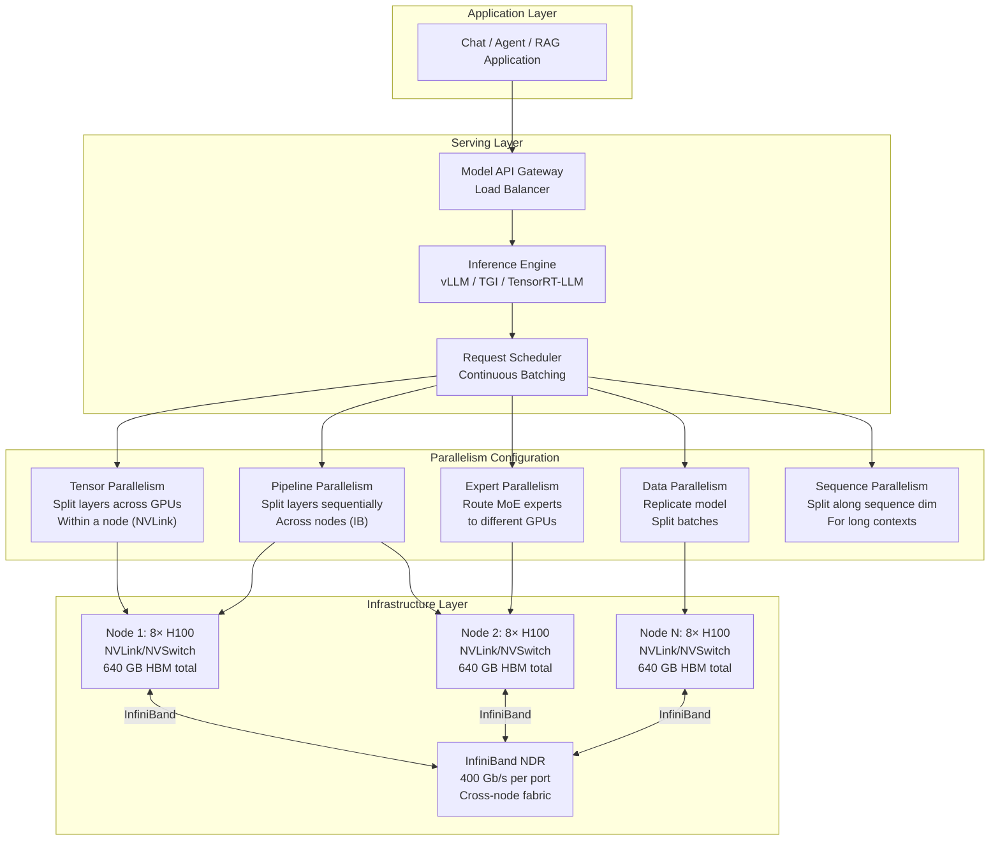
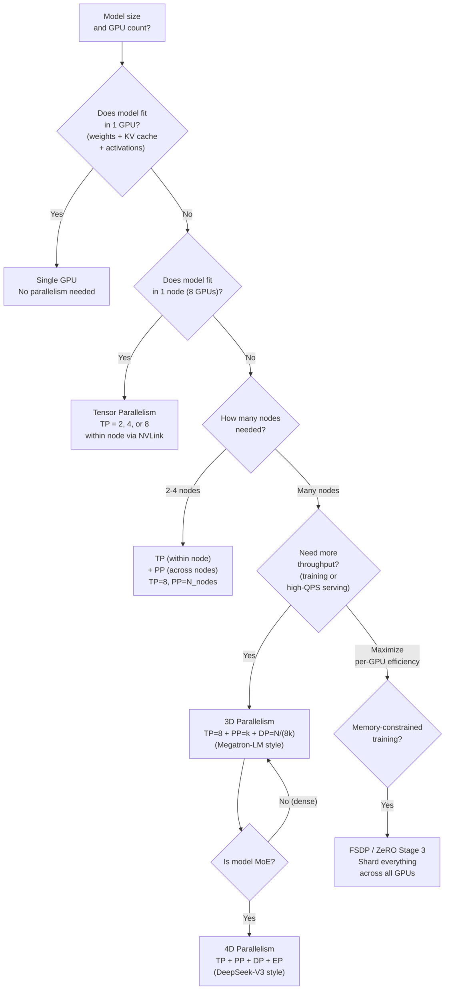
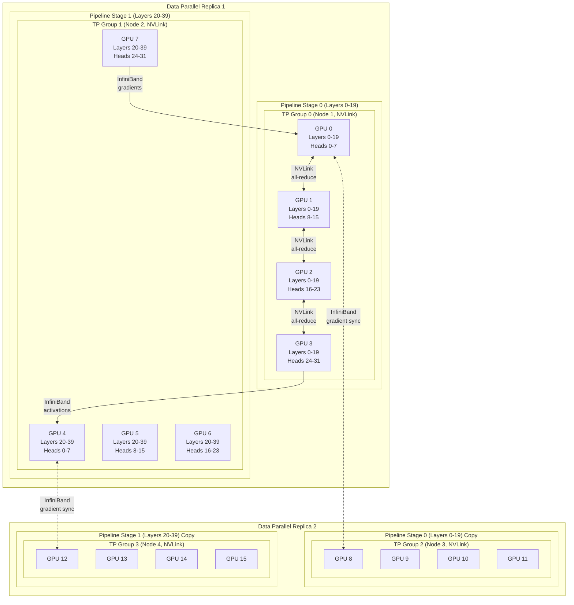
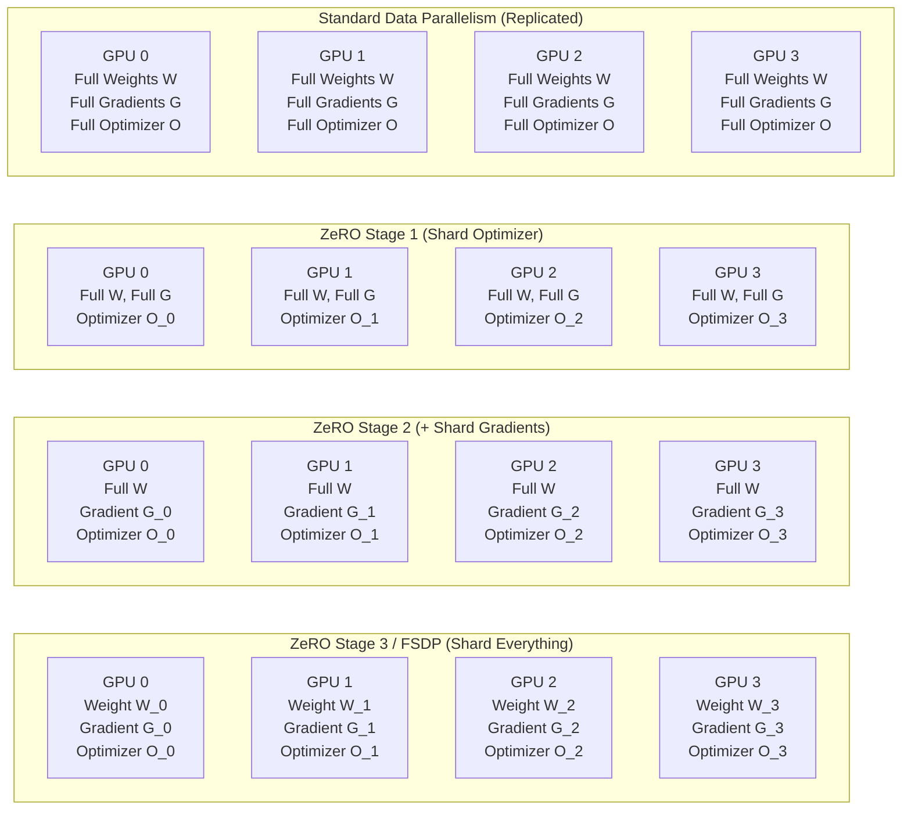

# Model Parallelism

## 1. Overview

Model parallelism is the set of techniques for distributing a neural network's computation, memory, and communication across multiple accelerators (GPUs/TPUs) when a single device cannot hold the entire model or when throughput requirements demand multi-device execution. It is the foundational infrastructure pattern that makes training and serving large language models physically possible.

The arithmetic is unforgiving: a LLaMA 70B model requires ~140 GB in FP16 just for weights — nearly double the 80 GB HBM of an H100. A LLaMA 3.1 405B model requires ~810 GB. GPT-4 (rumored ~1.8T MoE, ~220B active parameters) requires multiple terabytes when accounting for all expert weights. During training, optimizer states (Adam maintains two additional copies of every parameter) and gradients triple the memory requirement. No single device exists that can hold these models, let alone process them efficiently.

Model parallelism is not a single technique but a taxonomy of complementary strategies, each splitting the computation along a different dimension — across tensor operations (Tensor Parallelism), across layers (Pipeline Parallelism), across data samples (Data Parallelism), across mixture-of-expert routing (Expert Parallelism), or across the sequence length (Sequence Parallelism). Production systems combine these into "3D parallelism" or "4D parallelism" configurations, and the choice of combination directly determines training throughput, serving latency, hardware utilization, and infrastructure cost.

**Key numbers that drive system design:**
- Model weights: ~2 bytes/param (FP16/BF16), ~1 byte/param (FP8/INT8), ~0.5 byte/param (INT4)
- Training memory per parameter (Adam, FP16 mixed precision): ~16 bytes (2 weights + 2 gradients + 4 optimizer state for FP32 master weights + 4 first moment + 4 second moment)
- NVLink bandwidth (H100): 900 GB/s bidirectional per GPU (NVSwitch full bisection)
- InfiniBand NDR bandwidth: 400 Gb/s (50 GB/s) per port — ~18x slower than NVLink
- Communication-to-compute ratio determines which parallelism strategies are viable over which interconnects

**Why this matters for architects:** The parallelism configuration determines the number and type of GPUs needed, the interconnect topology required, the achievable throughput and latency, and ultimately the dollar cost of training or serving a model. A misconfigured parallelism strategy can leave 50-70% of GPU compute idle, turning a $10M training run into a $30M training run for the same result.

---

## 2. Where It Fits in GenAI Systems

Model parallelism operates at the intersection of the model architecture layer and the infrastructure layer. It is transparent to application-layer components (RAG pipelines, agents, chat interfaces) but determines the serving layer's throughput, latency, and cost characteristics.



**Upstream dependencies:** The model architecture (see [transformers.md](../01-foundations/transformers.md)) — specifically the number of attention heads, layer count, hidden dimension, and whether MoE is used — determines which parallelism strategies are feasible and how to partition.

**Downstream consumers:** The serving engine (vLLM, TGI, TensorRT-LLM) implements the parallelism strategy and exposes it as a simple configuration parameter. The training framework (Megatron-LM, DeepSpeed, FSDP) provides the parallelism primitives. The infrastructure provisioning system must allocate the right GPU topology (see [gpu-compute.md](gpu-compute.md), [training-infrastructure.md](../03-model-strategies/training-infrastructure.md)).

---

## 3. Core Concepts

### 3.1 Tensor Parallelism (TP)

Tensor Parallelism splits individual layer computations (matrix multiplications) across multiple GPUs. Each GPU holds a shard of the weight matrix and computes a partial result. An all-reduce or all-gather collective combines the partial results.

**Splitting the MLP (Feed-Forward Network):**

For a feed-forward layer Y = GeLU(X @ A) @ B where A is (d_model, d_ff) and B is (d_ff, d_model):

- **Column-parallel (first linear):** Split A column-wise across N GPUs. GPU i holds A_i of shape (d_model, d_ff/N). Each GPU computes GeLU(X @ A_i) independently — no communication needed because GeLU is element-wise.
- **Row-parallel (second linear):** Split B row-wise across N GPUs. GPU i holds B_i of shape (d_ff/N, d_model). Each GPU computes its partial output Y_i = activation_i @ B_i. An **all-reduce** (sum) across GPUs produces the final Y.

**Splitting Multi-Head Attention:**

Attention heads are naturally parallelizable — each head operates independently until the output projection.
- Distribute attention heads evenly across GPUs (GPU i handles heads [i*h/N, (i+1)*h/N))
- Each GPU computes Q, K, V projections and attention for its local heads
- The output projection is row-parallel, requiring one all-reduce per layer

**Communication cost per layer:**
- Two all-reduce operations per transformer block (one for attention output projection, one for MLP second linear)
- Each all-reduce transmits a tensor of shape (batch * seq_len, d_model) — about 2 * batch * seq_len * d_model * bytes
- For TP=8 on H100 with NVSwitch (900 GB/s bidirectional), the all-reduce for a 70B model (d_model=8192, batch*seq=4096) takes ~0.07 ms — negligible relative to compute

**Why NVLink is required:** All-reduce happens twice per layer, so the communication latency is on the critical path. With 80 layers (LLaMA 70B), that is 160 all-reduce operations per forward pass. InfiniBand (50 GB/s) would make this ~18x slower than NVLink, often exceeding the compute time itself. **TP should only be used within a single NVLink-connected node.**

**Maximum TP degree:** Limited by the number of attention heads (must be divisible) and the number of NVLink-connected GPUs (typically 4 or 8 within a node). TP=8 is the practical maximum on DGX H100 (8 GPUs per node with NVSwitch).

### 3.2 Pipeline Parallelism (PP)

Pipeline Parallelism assigns different groups of consecutive layers to different GPUs (or groups of GPUs). GPU 0 handles layers 0-19, GPU 1 handles layers 20-39, etc. The activation outputs of one stage become the inputs of the next.

**The bubble problem:** In naive pipeline execution, only one GPU is active at a time — GPU 0 computes the forward pass for layers 0-19, then sits idle while GPU 1 processes layers 20-39, and so on. The backward pass reverses the dependency. This "pipeline bubble" wastes most of the available compute.

**Micro-batching (GPipe approach):** Split the mini-batch into M micro-batches. GPU 0 processes micro-batch 1, then while GPU 1 processes micro-batch 1's activations, GPU 0 starts on micro-batch 2. With enough micro-batches, all pipeline stages are active simultaneously.

**Bubble overhead:**

```
Bubble fraction = (P - 1) / (P - 1 + M)

where P = number of pipeline stages, M = number of micro-batches
```

With P=4 stages and M=32 micro-batches, bubble = 3/35 = 8.6%. With M=4, bubble = 3/7 = 43%. **M >> P is required for efficiency.**

**1F1B (One-Forward-One-Backward) schedule:** Instead of running all forward passes then all backward passes, interleave them:
1. "Warm-up" phase: progressive forward passes fill the pipeline
2. "Steady state": alternate one forward and one backward micro-batch
3. "Cool-down" phase: drain the remaining backward passes

This reduces peak memory from O(M * activation_size) to O(P * activation_size) because fewer micro-batches have live activations simultaneously.

**Interleaved 1F1B (Megatron-LM):** Assign non-consecutive layers to each GPU (GPU 0 gets layers {0-9, 40-49}, GPU 1 gets {10-19, 50-59}, etc.). This creates a virtual pipeline with more stages but smaller chunks, reducing bubble overhead by approximately V× (where V = number of virtual stages per GPU) at the cost of increased communication.

**Communication cost:** Only the activation tensor at each pipeline stage boundary must be transmitted — shape (batch, seq_len, d_model). This is a point-to-point send/recv between adjacent stages, much less bandwidth-intensive than all-reduce. **PP works well over InfiniBand** because:
- Communication is point-to-point, not collective
- Each stage boundary transmits one activation tensor, not per-layer weight shards
- The latency can be overlapped with computation on other micro-batches

### 3.3 Data Parallelism (DP)

Data Parallelism is the simplest and most widely used form: replicate the entire model on each GPU (or group of GPUs), split the training batch across replicas, and synchronize gradients after each step.

**Standard DP (AllReduce):**
1. Each replica processes a different data shard
2. Compute local gradients
3. All-reduce gradients across all replicas (each replica gets the averaged gradient)
4. Each replica updates its local weights identically

**Communication cost:** One all-reduce of the full gradient tensor per step = O(model_params * bytes). For a 70B model in FP16: 140 GB of gradient data all-reduced per step. With ring all-reduce, each GPU sends/receives 2 * 140 GB / N data, where N is the number of GPUs.

**Scaling efficiency:** DP scales nearly linearly with GPU count because the compute-to-communication ratio improves with batch size (more compute per step, same communication). But:
- Each GPU must hold the full model — impossible if the model doesn't fit in one GPU
- Gradient all-reduce for very large models saturates interconnect bandwidth
- Large global batch sizes (N * local_batch) can degrade convergence (learning rate scheduling becomes critical)

### 3.4 Fully Sharded Data Parallelism (FSDP)

FSDP (Zhao et al., 2023, PyTorch implementation of ideas from ZeRO) eliminates DP's memory redundancy by sharding model weights, gradients, and optimizer states across GPUs instead of replicating them.

**Mechanism:**
1. **Before forward pass:** All-gather the required weight shard from all GPUs to reconstruct the full layer weights. Compute the layer forward. Discard the non-local weight shards immediately.
2. **Before backward pass:** All-gather the weight shard again (or keep in memory if budget allows). Compute gradients. Reduce-scatter gradients so each GPU holds only its gradient shard.
3. **Optimizer step:** Each GPU updates only its local shard of parameters and optimizer states.

**Memory savings per GPU:**

| Component | Standard DP | FSDP |
|-----------|------------|------|
| Model weights | Full model | 1/N of model |
| Gradients | Full model | 1/N of model |
| Optimizer states | Full model | 1/N of model |
| **Total per GPU** | **~16 bytes/param** | **~16/N bytes/param + communication buffers** |

For a 70B model with N=64 GPUs: Standard DP needs ~1,120 GB per GPU (impossible). FSDP needs ~17.5 GB per GPU for parameters + optimizer states, plus temporary buffers for all-gathered weights.

**Communication overhead:** FSDP requires 3x the communication of standard DP (all-gather before forward, all-gather before backward, reduce-scatter after backward) — but the per-GPU memory reduction is so dramatic that it enables training models that would otherwise be impossible.

**Sharding strategies (PyTorch FSDP):**
- `FULL_SHARD`: Shard weights, gradients, and optimizer states (maximum memory savings)
- `SHARD_GRAD_OP`: Shard gradients and optimizer states only (weights remain replicated — less communication)
- `NO_SHARD`: Standard DP (no sharding)

### 3.5 DeepSpeed ZeRO (Zero Redundancy Optimizer)

DeepSpeed ZeRO (Rajbhandari et al., 2020) is the intellectual precursor to FSDP and remains widely used via the DeepSpeed library. It defines three progressive stages of memory optimization:

**ZeRO Stage 1 — Optimizer State Partitioning:**
- Shard only optimizer states (Adam's first and second moments + FP32 master weights) across GPUs
- Weights and gradients remain replicated
- Memory reduction: ~4x (optimizer states dominate — 12 of 16 bytes/param in mixed-precision Adam)
- Communication: Same as standard DP (gradient all-reduce only)
- **When to use:** Model fits in GPU memory for forward/backward but not for optimizer states

**ZeRO Stage 2 — Add Gradient Partitioning:**
- Shard optimizer states + gradients
- Weights remain replicated
- Memory reduction: ~8x
- Communication: Replace all-reduce with reduce-scatter (each GPU only receives its gradient shard) — actually slightly less total communication than Stage 1
- **When to use:** Model fits for forward pass but not for backward + optimizer

**ZeRO Stage 3 — Add Parameter Partitioning:**
- Shard everything: optimizer states + gradients + weights
- Equivalent to FSDP's FULL_SHARD
- Memory reduction: ~N× (linear in GPU count)
- Communication: All-gather weights before each forward and backward layer (3x standard DP communication)
- **When to use:** Model does not fit on a single GPU even for forward pass

**ZeRO-Infinity (Stage 3 + Offloading):**
- Offload shards to CPU RAM or NVMe SSDs when not in use
- Enables training models that exceed aggregate GPU memory
- Extreme latency penalty from PCIe transfers — practical only for very large models with no alternative
- Theoretical: train a 1T parameter model on a single DGX node by spilling to CPU RAM and NVMe

### 3.6 Expert Parallelism (EP)

Expert Parallelism is specific to Mixture-of-Experts (MoE) models. Instead of replicating all experts on every GPU, different experts are assigned to different GPUs. Tokens are routed to the GPU holding their target expert via all-to-all communication.

**Mechanism:**
1. Router network runs on all GPUs, determining which expert(s) each token should visit
2. All-to-all communication shuffles tokens — each GPU sends tokens destined for remote experts and receives tokens destined for its local experts
3. Each GPU computes its local expert(s) on the received tokens
4. Reverse all-to-all returns results to the originating GPUs

**Communication pattern:** All-to-all is fundamentally different from all-reduce:
- **All-reduce:** Every GPU sends/receives the same amount of data (load-balanced by construction)
- **All-to-all:** Data volume depends on routing decisions — if one expert is "popular," its GPU receives disproportionately many tokens

**Load balancing challenge:** MoE models use auxiliary loss terms to encourage balanced expert utilization, but perfect balance is never achieved. An expert imbalance of 20% means some GPUs are idle 20% of the time, directly reducing throughput.

**Scaling:** EP degree typically equals the number of experts. Mixtral 8x7B with EP=8 places one expert per GPU. DeepSeek-V2 with 160 experts might use EP=8 with 20 experts per GPU, or EP=16 with 10 experts per GPU.

**Combined with TP:** For large experts, each expert can itself be tensor-parallelized. DeepSeek-V3 uses EP combined with TP within each expert group.

### 3.7 Sequence Parallelism (SP)

Sequence Parallelism splits the computation along the sequence dimension. It is particularly relevant for long-context models where the sequence dimension dominates memory.

**Megatron-LM Sequence Parallelism (SP for non-attention layers):**

In standard TP, the attention and MLP computations are split across GPUs, but the LayerNorm and dropout operations are replicated (each GPU holds the full activation tensor for these operations). Sequence Parallelism partitions the sequence dimension for these replicated operations:
- After the TP all-reduce in the attention block, scatter the output along the sequence dimension
- Each GPU applies LayerNorm and dropout to its sequence shard
- Before the next TP operation, all-gather to reconstruct the full sequence

**Memory savings:** Eliminates the activation memory replication for LayerNorm and dropout, which can be ~30% of total activation memory at long context lengths.

**Ring Attention (SP for attention):**

As described in [context-scaling.md](context-scaling.md), Ring Attention distributes the attention computation itself across GPUs by partitioning Q, K, V along the sequence dimension and passing K,V blocks around a ring topology. This enables sequence lengths proportional to the number of GPUs.

**DeepSpeed Ulysses:**

Splits the attention computation along the sequence dimension using all-to-all communication:
1. Each GPU holds a sequence chunk of Q, K, V
2. All-to-all reshuffles so each GPU holds full sequences but only a subset of attention heads
3. Each GPU computes attention for its local heads on the full sequence
4. All-to-all reshuffles back to the original sequence partitioning

Compared to Ring Attention, Ulysses uses all-to-all (bulk exchange) rather than ring-passing, which can be more efficient on fully-connected topologies (NVSwitch) but less efficient on ring topologies.

### 3.8 3D Parallelism (TP + PP + DP Combined)

Production LLM training combines multiple parallelism strategies in a hierarchical configuration optimized for the network topology:

**Innermost: Tensor Parallelism (TP)** — within a single NVLink-connected node (8 GPUs). Requires the highest bandwidth (all-reduce on critical path). NVLink provides 900 GB/s.

**Middle: Pipeline Parallelism (PP)** — across a small number of nodes connected by high-bandwidth InfiniBand. Point-to-point activation transfer is tolerable over IB (50 GB/s per port).

**Outermost: Data Parallelism (DP)** — across many nodes. Gradient all-reduce is infrequent (once per step) and can be overlapped with backward computation.

**Example: Training LLaMA 3.1 405B on 16,384 H100 GPUs:**
```
Total GPUs: 16,384
TP = 8  (within each node, 8 GPUs per node via NVLink)
PP = 16 (16 pipeline stages across 16 nodes)
DP = 128 (128 data-parallel replicas)

Per-node: 8 GPUs handle 1 pipeline stage (TP=8)
Per pipeline: 16 nodes × 8 GPUs = 128 GPUs for one full model
Number of replicas: 16,384 / 128 = 128 DP replicas
```

**4D Parallelism (adding EP):** For MoE models, Expert Parallelism adds a fourth dimension. DeepSeek-V3 (671B total, 37B active) reportedly used TP + PP + DP + EP across its training cluster.

### 3.9 Interconnect Requirements

The interconnect hierarchy is the physical constraint that shapes all parallelism decisions:

| Interconnect | Bandwidth | Latency | Topology | Used For |
|-------------|-----------|---------|----------|----------|
| **NVLink (H100)** | 900 GB/s bidirectional | ~1 μs | Full bisection via NVSwitch | TP (all-reduce, critical path) |
| **NVLink (B200)** | 1800 GB/s bidirectional | ~1 μs | Full bisection via NVSwitch | TP (higher TP degrees) |
| **PCIe Gen5** | 128 GB/s bidirectional | ~1-2 μs | Point-to-point | CPU-GPU data transfer, ZeRO offload |
| **InfiniBand NDR** | 400 Gb/s (50 GB/s) per port | ~1-2 μs | Fat-tree / Clos | PP (point-to-point), DP (all-reduce) |
| **InfiniBand NDR (8-port)** | 400 GB/s aggregate | ~1-2 μs | Multi-rail | DP all-reduce, EP all-to-all |
| **RoCE v2** | 200 Gb/s (25 GB/s) | ~2-5 μs | Leaf-spine Ethernet | Budget DP clusters |
| **EFA (AWS)** | 3200 Gbps aggregate | ~10-20 μs | AWS custom | Cloud training (p5 instances) |

**Rule of thumb:** If the parallelism strategy requires collective communication on the critical path of every layer (TP, SP), it needs NVLink. If communication is point-to-point or infrequent (PP, DP), InfiniBand suffices. EP's all-to-all falls in between — it works over InfiniBand but benefits significantly from NVLink when expert count per GPU is low.

---

## 4. Architecture

### 4.1 Parallelism Strategy Decision Tree



### 4.2 3D Parallelism Layout (Megatron-LM Style)



### 4.3 FSDP / ZeRO Sharding Visualization



---

## 5. Design Patterns

### Pattern 1: Inference TP-Only (Small-to-Medium Models)

**When to use:** Serving models that fit within a single node (up to ~405B in FP8 on 8x H100).

Use Tensor Parallelism within a single NVLink-connected node. No pipeline parallelism (avoids bubble overhead and simplifies scheduling). This is the default for most inference deployments.

- **7B model:** TP=1 (single GPU) or TP=2 (for higher throughput)
- **70B model:** TP=4 (FP16) or TP=2 (INT4/FP8 quantized)
- **405B model:** TP=8 (FP8) on a single DGX H100 node
- **Implementation:** vLLM `--tensor-parallel-size`, TensorRT-LLM `--tp_size`
- **Latency:** Minimal overhead from NVLink all-reduce — typically <5% vs. theoretical single-GPU latency

### Pattern 2: TP + PP for Cross-Node Inference

**When to use:** Models too large for a single node, or when serving latency requires distributing compute across more GPUs than a single node provides.

- **Example:** LLaMA 3.1 405B in FP16 (~810 GB) requires 2 nodes. TP=8 within each node, PP=2 across nodes.
- **Latency impact:** PP adds activation transfer latency at each stage boundary. At PP=2, this is one InfiniBand round-trip (~20-40 μs) plus activation transfer time. For autoregressive decoding (small activations per step), this is minimal. For prefill (large activation tensors), it is more significant.
- **Implementation:** vLLM `--tensor-parallel-size 8 --pipeline-parallel-size 2`, TensorRT-LLM supports similar configurations

### Pattern 3: FSDP for Fine-Tuning Large Models

**When to use:** Full fine-tuning (not LoRA) of a model that doesn't fit in a single GPU's memory with full optimizer states.

FSDP is the standard approach for fine-tuning 7B-70B models on 4-8 GPU setups. It eliminates the need for model-parallelism expertise — the framework handles sharding automatically.

```python
# PyTorch FSDP configuration for LLaMA 70B fine-tuning
from torch.distributed.fsdp import (
    FullyShardedDataParallel as FSDP,
    MixedPrecision,
    ShardingStrategy,
)

mp_policy = MixedPrecision(
    param_dtype=torch.bfloat16,
    reduce_dtype=torch.bfloat16,
    buffer_dtype=torch.bfloat16,
)

model = FSDP(
    model,
    sharding_strategy=ShardingStrategy.FULL_SHARD,  # ZeRO-3 equivalent
    mixed_precision=mp_policy,
    auto_wrap_policy=transformer_auto_wrap_policy,
    device_id=torch.cuda.current_device(),
    limit_all_gathers=True,  # Limit concurrent all-gathers for memory
)
```

- **Memory per GPU (70B, FULL_SHARD, 8 GPUs):** ~140 GB / 8 = 17.5 GB for sharded weights, plus ~2-4 GB for activation checkpointing = ~20 GB — fits comfortably in an H100
- **Throughput:** ~60-70% of theoretical peak due to communication overhead (3x DP communication)
- **Alternative:** DeepSpeed ZeRO Stage 3 provides equivalent functionality with different APIs and additional features (ZeRO-Infinity for NVMe offloading)

### Pattern 4: EP + TP for MoE Serving

**When to use:** Serving large MoE models (Mixtral, DeepSeek-V3, likely GPT-4).

MoE models have a unique characteristic: total parameters are large (requiring many GPUs to hold), but active parameters per token are small (only top-K experts fire). Expert Parallelism places each expert on a separate GPU, and tokens are routed via all-to-all communication.

- **Mixtral 8x7B (46.7B total, 12.9B active):** EP=8 (one expert per GPU), optionally with TP=2 within each expert for higher throughput
- **DeepSeek-V3 (671B total, 37B active, 256 experts):** EP=32 or 64 with multiple experts per GPU, combined with TP for the shared attention layers
- **Key consideration:** All-to-all communication for token routing must be fast. Expert load imbalance causes GPU idle time. A routing imbalance of 20% reduces throughput by up to 20%.

### Pattern 5: Heterogeneous Parallelism for Training

**When to use:** Large-scale pre-training runs on 1000+ GPUs.

The Megatron-LM "3D parallelism" approach matches each parallelism dimension to the appropriate interconnect tier:
- TP=8 on NVLink (within node) — highest bandwidth for critical-path communication
- PP=8-16 across tightly connected nodes — moderate bandwidth for point-to-point activation transfer
- DP=remaining GPUs across the cluster — gradient sync overlapped with computation

**Concrete example (Meta's LLaMA 3.1 405B training):**
- 16,384 H100 GPUs across 2,048 nodes
- TP=8, PP=16, DP=128
- Training throughput: ~3.8 × 10^23 FLOPs total over ~54 days
- MFU (Model FLOPs Utilization): ~38-43% of theoretical peak (typical for large-scale training)

---

## 6. Implementation Approaches

### 6.1 Megatron-LM (NVIDIA)

The reference implementation for 3D parallelism in large-scale training:

```python
# Megatron-LM training configuration for a 70B model
# on 256 GPUs (32 nodes × 8 GPUs/node)

TENSOR_MODEL_PARALLEL_SIZE=8      # Within node (NVLink)
PIPELINE_MODEL_PARALLEL_SIZE=4    # Across 4 nodes
DATA_PARALLEL_SIZE=8              # 256 / (8 * 4) = 8 DP replicas

MICRO_BATCH_SIZE=1
GLOBAL_BATCH_SIZE=1024             # 8 DP × 128 micro-batches
NUM_MICRO_BATCHES=$((GLOBAL_BATCH_SIZE / MICRO_BATCH_SIZE / DATA_PARALLEL_SIZE))
# 128 micro-batches — pipeline bubble = 3 / (3 + 128) ≈ 2.3%

python -m torch.distributed.launch \
    --nproc_per_node=8 \
    --nnodes=32 \
    pretrain_gpt.py \
    --tensor-model-parallel-size $TENSOR_MODEL_PARALLEL_SIZE \
    --pipeline-model-parallel-size $PIPELINE_MODEL_PARALLEL_SIZE \
    --num-layers 80 \
    --hidden-size 8192 \
    --num-attention-heads 64 \
    --num-query-groups 8 \
    --seq-length 8192 \
    --micro-batch-size $MICRO_BATCH_SIZE \
    --global-batch-size $GLOBAL_BATCH_SIZE \
    --bf16 \
    --use-flash-attn \
    --sequence-parallel \
    --use-rotary-position-embeddings \
    --overlap-grad-reduce \
    --overlap-param-gather
```

Key Megatron-LM features:
- **`--sequence-parallel`**: Enables SP for LayerNorm/dropout between TP all-reduces
- **`--overlap-grad-reduce`**: Overlaps gradient all-reduce with backward computation
- **`--overlap-param-gather`**: Overlaps FSDP-style parameter gathering with forward computation
- **Interleaved PP schedule**: Automatically enabled when virtual pipeline stages > 1

### 6.2 DeepSpeed ZeRO Configuration

```python
# DeepSpeed ZeRO Stage 3 config for 70B model fine-tuning
{
    "bf16": {"enabled": true},
    "zero_optimization": {
        "stage": 3,
        "offload_optimizer": {
            "device": "cpu",           # Offload optimizer to CPU RAM
            "pin_memory": true
        },
        "offload_param": {
            "device": "none"            # Keep params on GPU (use "cpu" for ZeRO-Infinity)
        },
        "overlap_comm": true,           # Overlap communication with compute
        "contiguous_gradients": true,
        "sub_group_size": 1e9,
        "reduce_bucket_size": "auto",
        "stage3_prefetch_bucket_size": "auto",
        "stage3_param_persistence_threshold": "auto",
        "stage3_max_live_parameters": 1e9,
        "stage3_max_reuse_distance": 1e9,
        "stage3_gather_16bit_weights_on_model_save": true
    },
    "gradient_accumulation_steps": 16,
    "gradient_clipping": 1.0,
    "steps_per_print": 10,
    "train_micro_batch_size_per_gpu": 1,
    "wall_clock_breakdown": true
}
```

### 6.3 vLLM Inference Parallelism

```python
from vllm import LLM, SamplingParams

# LLaMA 3.1 405B serving with TP + PP
llm = LLM(
    model="meta-llama/Meta-Llama-3.1-405B-Instruct",
    tensor_parallel_size=8,      # 8 GPUs within node
    pipeline_parallel_size=2,    # 2 nodes (16 GPUs total)
    dtype="bfloat16",
    gpu_memory_utilization=0.92,
    max_model_len=131072,
    enable_chunked_prefill=True,
    max_num_batched_tokens=32768,
)

# For Mixtral with Expert Parallelism (handled automatically by vLLM)
llm_moe = LLM(
    model="mistralai/Mixtral-8x7B-Instruct-v0.1",
    tensor_parallel_size=8,      # Experts distributed across 8 GPUs
    dtype="bfloat16",
    gpu_memory_utilization=0.90,
)
```

### 6.4 Infrastructure Sizing Calculator

```python
def plan_parallelism(
    model_params_b: float,
    num_layers: int,
    num_attn_heads: int,
    num_kv_heads: int,
    hidden_size: int,
    num_experts: int = 1,       # 1 = dense model
    is_training: bool = True,
    gpus_per_node: int = 8,
    gpu_hbm_gb: float = 80.0,
    precision_bytes: float = 2.0,  # BF16 = 2, FP8 = 1
):
    """Recommend parallelism configuration."""
    # Memory calculations
    weight_mem_gb = model_params_b * precision_bytes  # in GB

    if is_training:
        # Mixed precision training with Adam: ~16 bytes/param
        per_param_bytes = 16
        total_mem_gb = model_params_b * per_param_bytes
    else:
        total_mem_gb = weight_mem_gb

    single_gpu_fits = total_mem_gb < gpu_hbm_gb * 0.85
    single_node_fits = total_mem_gb < gpus_per_node * gpu_hbm_gb * 0.85

    if single_gpu_fits:
        return {
            "tp": 1, "pp": 1, "dp": "as many as available",
            "total_gpus_min": 1,
            "strategy": "Single GPU or pure DP",
        }

    # Determine TP degree (must divide attention heads)
    tp = 1
    for candidate in [8, 4, 2]:
        if (num_attn_heads % candidate == 0 and
            num_kv_heads % candidate == 0 and
            candidate <= gpus_per_node):
            if weight_mem_gb / candidate < gpu_hbm_gb * 0.7:
                tp = candidate
                break

    # Determine PP degree
    if not single_node_fits or (is_training and total_mem_gb > gpus_per_node * gpu_hbm_gb * 0.5):
        pp = max(1, math.ceil(total_mem_gb / (gpus_per_node * gpu_hbm_gb * 0.7)))
        # PP must divide num_layers
        while num_layers % pp != 0 and pp < num_layers:
            pp += 1
    else:
        pp = 1

    # Expert Parallelism for MoE
    ep = min(num_experts, gpus_per_node) if num_experts > 1 else 1

    min_gpus = tp * pp

    result = {
        "tp": tp,
        "pp": pp,
        "ep": ep,
        "dp": "remaining GPUs / (tp * pp)",
        "total_gpus_min": min_gpus,
        "nodes_min": math.ceil(min_gpus / gpus_per_node),
        "strategy": [],
    }

    if tp > 1:
        result["strategy"].append(f"TP={tp} within node (NVLink)")
    if pp > 1:
        result["strategy"].append(f"PP={pp} across {result['nodes_min']} nodes (InfiniBand)")
    if ep > 1:
        result["strategy"].append(f"EP={ep} for {num_experts} experts")
    if is_training:
        result["strategy"].append("DP for remaining GPUs (gradient sync overlapped)")
        result["strategy"].append("Consider FSDP/ZeRO-3 if memory-constrained")

    return result
```

---

## 7. Tradeoffs

### 7.1 Parallelism Strategy Comparison

| Criterion | Tensor Parallel (TP) | Pipeline Parallel (PP) | Data Parallel (DP) | FSDP / ZeRO-3 | Expert Parallel (EP) |
|-----------|---------------------|----------------------|-------------------|----------------|---------------------|
| **What is split** | Layer operations (weight matrices) | Layers (sequentially) | Data (batch) | Weights + grads + optimizer | MoE experts |
| **Communication** | All-reduce per layer (critical path) | Point-to-point activations | Gradient all-reduce (once/step) | 3x DP communication | All-to-all per MoE layer |
| **Interconnect required** | NVLink (must) | InfiniBand (sufficient) | InfiniBand (sufficient) | InfiniBand (sufficient) | NVLink (preferred) |
| **Max practical degree** | 4-8 (GPU count in node) | 8-64 (limited by bubble) | 100s-1000s | 100s-1000s | Number of experts |
| **Memory savings** | ~TP× per GPU | ~PP× per GPU | None (replicated) | ~N× per GPU | Distributes expert weights |
| **Compute overhead** | <5% (NVLink) | 5-15% (bubbles) | <3% | 10-20% (extra comm) | 5-15% (load imbalance) |
| **Latency impact (inference)** | Minimal | Adds stage boundary latency | None (independent replicas) | N/A (training) | All-to-all routing latency |
| **Best for** | Single-node large models | Cross-node model distribution | Scaling throughput | Memory-constrained training | MoE models |

### 7.2 Training Framework Decision

| Factor | Megatron-LM | DeepSpeed ZeRO | PyTorch FSDP |
|--------|------------|----------------|--------------|
| **3D parallelism** | Native, battle-tested | ZeRO + PP + TP (via Megatron integration) | TP (torch.distributed.tensor_parallel), no native PP |
| **Ease of setup** | Complex (custom model code required) | Moderate (config-driven) | Simplest (decorator-based) |
| **MoE support** | Yes (Megatron-Core) | Yes (DeepSpeed MoE) | Limited (third-party extensions) |
| **Offloading** | No | ZeRO-Infinity (CPU + NVMe) | CPU offload (experimental) |
| **Throughput at scale** | Highest (optimized schedules) | High (within 5-10% of Megatron) | Moderate (less optimized overlap) |
| **Community/ecosystem** | NVIDIA-centric | Microsoft-backed, broad adoption | PyTorch native, growing adoption |
| **Best for** | Large-scale pre-training (100+ GPUs) | Fine-tuning, moderate-scale training | Fine-tuning, PyTorch-native workflows |

### 7.3 Serving Parallelism vs. Throughput

| Model Size | Quantization | TP Degree | GPUs | Approx. Throughput (tokens/s) | Latency (ms/token) |
|------------|-------------|-----------|------|------------------------------|-------------------|
| 7B | FP16 | 1 | 1× H100 | 2500-3500 | ~12 |
| 7B | INT4 (AWQ) | 1 | 1× H100 | 4000-5500 | ~8 |
| 70B | FP16 | 4 | 4× H100 | 800-1200 | ~25 |
| 70B | INT4 (AWQ) | 2 | 2× H100 | 1000-1500 | ~18 |
| 70B | FP8 | 2 | 2× H100 | 1200-1800 | ~15 |
| 405B | FP8 | 8 | 8× H100 | 300-500 | ~50 |
| 405B | FP16 | 8+PP2 | 16× H100 | 250-400 | ~60 |
| Mixtral 8x7B | FP16 | 8 (EP) | 8× H100 | 1500-2500 | ~15 |

Note: Throughput assumes continuous batching with moderate batch size. Actual numbers vary with prompt length, generation length, and framework.

---

## 8. Failure Modes

### 8.1 NVLink Saturation Under High TP Degree

**Symptom:** GPU utilization drops to 40-60% despite high request load when running TP=8 on a 70B model.

**Root cause:** At TP=8, each all-reduce involves 8 GPUs and occurs 160 times per forward pass (2 per layer × 80 layers). With small batch sizes (common at long context), the all-reduce payload is small but frequent, leading to latency-dominated communication that cannot saturate NVLink bandwidth but still stalls compute.

**Mitigation:** Reduce TP degree and use quantization instead (TP=4 with FP8 instead of TP=8 with FP16). Increase batch size to amortize communication overhead. Use TP=4 + PP=2 for cross-node deployment instead of TP=8 on a single node.

### 8.2 Pipeline Bubble Thrashing

**Symptom:** Training throughput with PP=16 and small micro-batch count is 40-60% of expected, with GPUs spending more time idle than computing.

**Root cause:** Pipeline bubble = (P-1)/(P-1+M). With PP=16 and M=20 micro-batches, bubble = 15/35 = 43%. Nearly half the compute is wasted.

**Mitigation:** Increase micro-batch count (M >> P, ideally M > 4P). Use interleaved 1F1B scheduling (Megatron-LM's virtual pipeline stages) to reduce effective bubble. Consider reducing PP degree by using more aggressive quantization to fit in fewer stages.

### 8.3 FSDP All-Gather Timeout

**Symptom:** Training hangs or crashes with timeout errors during the all-gather phase of FSDP forward pass.

**Root cause:** One or more GPUs are slower (thermal throttling, ECC error recovery, network congestion), causing the collective operation to stall. In a 1000-GPU cluster, the probability of at least one GPU experiencing a transient issue is high.

**Mitigation:** Set appropriate NCCL timeout values (NCCL_TIMEOUT). Use NCCL watchdog to detect and report stuck ranks. Implement elastic training (restart from checkpoint, excluding failed nodes). Use FSDP's `limit_all_gathers=True` to reduce the number of concurrent collective operations.

### 8.4 Expert Load Imbalance in MoE

**Symptom:** With EP=8 on Mixtral, some GPUs are consistently 20-30% more utilized than others, leading to idle time on under-utilized GPUs.

**Root cause:** The router network does not perfectly balance tokens across experts. Some experts become "popular" for common token patterns, receiving disproportionate load.

**Mitigation:** Increase the auxiliary load-balancing loss coefficient during training. Use capacity factors to cap the maximum number of tokens an expert can process (overflow tokens are dropped or sent to a default expert). At serving time, use expert replication — place popular experts on multiple GPUs.

### 8.5 Cross-Node Gradient Desynchronization

**Symptom:** Model trained with DP across many nodes produces slightly different weights on different replicas, leading to divergent behavior.

**Root cause:** Floating-point non-determinism in all-reduce operations across many nodes. Different reduction orders produce different rounding errors. Over many steps, these accumulate.

**Mitigation:** Use deterministic reduction algorithms (at the cost of throughput). Periodically broadcast weights from rank 0 to all replicas to resynchronize. In practice, minor desynchronization is tolerable — models converge despite small per-replica differences.

### 8.6 OOM During Activation Checkpointing with PP

**Symptom:** Out-of-memory during backward pass despite activation checkpointing being enabled.

**Root cause:** With pipeline parallelism, multiple micro-batches have live activations simultaneously (waiting for backward propagation). Even with checkpointing, the peak activation memory is O(PP_degree * per_stage_activations), not O(1).

**Mitigation:** Use the 1F1B schedule (which limits in-flight micro-batches to PP_degree) instead of the fill-drain schedule (which has all M micro-batches in flight). Reduce micro-batch size. Enable more aggressive activation checkpointing (recompute more layers).

---

## 9. Optimization Techniques

### 9.1 Communication-Computation Overlap

The single most impactful optimization for all parallelism strategies is overlapping communication with computation:

**DP gradient overlap:** Begin all-reducing gradients for layer L as soon as its backward pass completes, while layer L-1 is still computing backward. By the time the final layer's backward finishes, earlier layers' gradients are already synchronized.

**FSDP parameter prefetch:** Start all-gathering weights for layer L+1 during the forward computation of layer L. When layer L finishes, layer L+1's weights are already available.

**PP micro-batch overlap:** While GPU 0 processes micro-batch k+1 forward, GPU 1 processes micro-batch k forward. The pipeline keeps all stages busy once warmed up.

**Megatron-LM `--overlap-grad-reduce` and `--overlap-param-gather`:** These flags enable the above overlaps and can improve throughput by 15-25% compared to non-overlapped execution.

### 9.2 Quantization-Aware Parallelism

Quantizing model weights from FP16 to FP8 or INT4 reduces memory by 2-4x, directly reducing the number of GPUs needed and the degree of parallelism required:

| Model | FP16 Memory | FP8 Memory | INT4 Memory | FP16 TP | FP8 TP | INT4 TP |
|-------|-------------|------------|-------------|---------|--------|---------|
| LLaMA 3 70B | 140 GB | 70 GB | 35 GB | TP=4 | TP=2 | TP=1 |
| LLaMA 3.1 405B | 810 GB | 405 GB | 203 GB | TP=8, PP=2 | TP=8 | TP=4 |

Fewer GPUs = lower latency (less communication), lower cost, and simpler infrastructure. The quality tradeoff depends on the quantization method — GPTQ, AWQ, and FP8 maintain near-FP16 quality for most tasks.

### 9.3 Tensor Parallelism + Sequence Parallelism Fusion

Megatron-LM's sequence parallelism eliminates redundant LayerNorm and dropout computation across TP ranks:

- Without SP: Each TP rank holds the full (batch, seq_len, d_model) activation tensor for LayerNorm
- With SP: Each TP rank holds (batch, seq_len/TP, d_model) — TP× memory reduction for these operations
- Communication: Replaces one all-reduce with one reduce-scatter + one all-gather (same total bytes, but distributes memory)

For a 70B model at 128K context with TP=8: SP saves ~4 GB of activation memory per GPU, often the difference between fitting and not fitting a particular batch size.

### 9.4 Selective Activation Checkpointing

Instead of checkpointing every layer (which minimizes memory but doubles compute), selectively checkpoint layers based on their activation memory footprint:

- **Attention layers at long context:** The QKV activations consume O(batch * seq_len * d_model * 3) memory. Checkpointing these and recomputing during backward saves the most memory per layer.
- **MLP layers:** Intermediate activations are large (d_ff is typically 3-4x d_model). Worth checkpointing.
- **LayerNorm:** Tiny activation memory. Not worth checkpointing (recompute cost exceeds memory benefit).

Megatron-LM supports `--recompute-granularity selective` which automatically makes these decisions.

### 9.5 Inference-Specific: Disaggregated Prefill and Decode

For serving, the prefill phase (processing the input prompt) and decode phase (generating tokens) have very different compute profiles:
- **Prefill:** Compute-bound (large matrix multiplications), benefits from higher TP for faster TTFT
- **Decode:** Memory-bandwidth-bound (small per-token operations), benefits from batching rather than higher TP

Disaggregated serving (Splitwise, DistServe) uses different parallelism configurations for each phase:
- Prefill workers: TP=8, process prompts as fast as possible
- Decode workers: TP=2 or TP=4, maximize batch size for throughput
- KV cache is transferred from prefill workers to decode workers via high-bandwidth interconnect

This can improve overall throughput by 1.5-2x compared to unified workers that use the same TP for both phases.

---

## 10. Real-World Examples

### 10.1 Meta LLaMA 3.1 405B Training

Meta trained the largest openly documented dense LLM to date:
- **Infrastructure:** 16,384 H100 GPUs across 2,048 nodes, connected by a 3-tier InfiniBand fabric (RoCE within rack, NDR between racks, NDR400 at spine)
- **Parallelism:** TP=8 (within node), PP=16 (across 16 nodes per pipeline), DP=128 (128 model replicas)
- **Training throughput:** ~3.8 × 10^25 FLOPs total, running for ~54 days
- **MFU:** ~38-43% — typical for large-scale 3D parallelism configurations (theoretical peak is ~1,979 PFLOPS for 16K H100s; achieved ~780-850 PFLOPS sustained)
- **Reliability:** Experienced ~466 job interruptions during the 54-day run. Checkpointing every 10 minutes with async checkpointing to distributed storage. Recovery from checkpoint takes ~5 minutes.
- **Key innovation:** Extensive communication overlap and selective activation checkpointing to maximize GPU utilization despite the complex parallelism configuration

### 10.2 DeepSeek-V3 (671B MoE, 37B Active)

DeepSeek's V3 model demonstrated efficient training of a massive MoE model:
- **Infrastructure:** 2,048 H800 GPUs (NVIDIA's China-export variant of H100, with NVLink but reduced FP64)
- **Parallelism:** TP + EP + PP combined. 256 experts distributed across GPUs using expert parallelism, with tensor parallelism for the shared attention layers and pipeline parallelism across nodes.
- **FP8 training:** One of the first production models trained primarily in FP8 precision, reducing memory by 2x and increasing compute throughput by ~1.5x on H800 tensor cores
- **Training cost:** Reportedly ~$5.6M in GPU hours — an order of magnitude cheaper than comparable models, attributed to the efficient MoE architecture and FP8 training
- **Auxiliary-loss-free load balancing:** Novel expert routing that avoids the quality-degrading auxiliary loss used in prior MoE models, instead using a bias term that is adjusted dynamically

### 10.3 NVIDIA Megatron-Turing NLG 530B

NVIDIA and Microsoft's joint 530B dense model was a landmark in 3D parallelism:
- **Infrastructure:** 4,480 A100 GPUs (560 DGX A100 nodes)
- **Parallelism:** TP=8, PP=35, DP=16 — one of the first demonstrations of 3D parallelism at massive scale
- **Key contribution:** The Megatron-LM framework itself, which introduced the TP + PP + DP combination and the interleaved 1F1B pipeline schedule. Now the standard framework used by NVIDIA, Meta, and others for large-scale training.
- **Pipeline bubble optimization:** Interleaved schedule reduced bubble from ~15% (standard 1F1B at PP=35) to ~5% using virtual pipeline stages

### 10.4 Google PaLM 540B / Gemini Training on TPUs

Google's large model training uses a TPU-centric approach:
- **Infrastructure:** TPU v4 pods with 6,144 chips for PaLM; TPU v5p pods for Gemini
- **Parallelism:** TPU pods use a custom mesh topology. Google's approach combines data parallelism (across pod slices) with "model parallelism" (within pod slices) using XLA's SPMD (Single Program Multiple Data) partitioner
- **Key difference from GPU approach:** TPUs are connected via a custom 3D torus interconnect (ICI - Inter-Chip Interconnect) with ~400 GB/s bidirectional bandwidth, similar to NVLink bandwidth. This means TP-style communication is efficient across a much larger group of chips (128-256 chips vs. 8 GPUs with NVLink)
- **JAX/XLA ecosystem:** Parallelism is specified declaratively through tensor sharding annotations rather than explicit communication primitives. The XLA compiler generates the all-reduce and all-gather operations automatically.

### 10.5 Inference at Scale: Fireworks AI, Together AI, Anyscale

Major inference providers demonstrate parallelism in production serving:
- **Fireworks AI:** Serves 70B+ models using TP=4 on A100/H100 clusters. Custom batching scheduler that optimizes batch composition for TP communication efficiency.
- **Together AI:** Offers API access to open models (LLaMA, Mixtral) with claimed high throughput. Uses FlashAttention + TP + continuous batching. Mixtral 8x7B served with EP=8 across a single DGX node.
- **Anyscale (Ray Serve):** Uses Ray's distributed framework to manage TP and PP across heterogeneous GPU pools. Pioneered TP-aware request routing where requests are co-located with their TP group to minimize cross-node traffic.

---

## 11. Related Topics

- **[Transformer Architecture](../01-foundations/transformers.md):** The model architecture being parallelized. Attention head count, layer count, and hidden dimension determine valid TP/PP configurations.
- **[GPU Compute and Memory](gpu-compute.md):** HBM capacity, compute throughput, and memory bandwidth are the physical constraints that necessitate parallelism. H100 vs. A100 vs. TPU characteristics determine achievable MFU.
- **[Training Infrastructure](../03-model-strategies/training-infrastructure.md):** Cluster topology, interconnect fabric, job scheduling, and checkpointing systems that support parallelized training.
- **[Model Serving](../02-llm-architecture/model-serving.md):** Inference engines (vLLM, TGI, TensorRT-LLM) that implement TP/PP for serving. Continuous batching, PagedAttention, and prefill/decode disaggregation interact with parallelism choices.
- **[Context Window Scaling](context-scaling.md):** Ring Attention and sequence parallelism are forms of model parallelism applied to the sequence dimension. Long context increases memory pressure, which may require higher TP/PP degrees.
- **[KV Cache Management](kv-cache.md):** KV cache is distributed across TP ranks. PagedAttention must coordinate across GPUs. KV cache compression reduces memory pressure, potentially enabling lower TP degrees.

---

## 12. Source Traceability

| Concept | Primary Source | Year |
|---------|---------------|------|
| Tensor Parallelism (Megatron-LM) | Shoeybi et al., "Megatron-LM: Training Multi-Billion Parameter Language Models Using Model Parallelism" | 2019 |
| Pipeline Parallelism (GPipe) | Huang et al., "GPipe: Efficient Training of Giant Neural Networks using Pipeline Parallelism" | 2019 |
| Pipeline Parallelism (PipeDream) | Narayanan et al., "PipeDream: Generalized Pipeline Parallelism for DNN Training" | 2019 |
| 3D Parallelism (Megatron-LM v2) | Narayanan et al., "Efficient Large-Scale Language Model Training on GPU Clusters Using Megatron-LM" | 2021 |
| Interleaved 1F1B Schedule | Narayanan et al., "Efficient Large-Scale Language Model Training on GPU Clusters Using Megatron-LM" | 2021 |
| Sequence Parallelism | Korthikanti et al., "Reducing Activation Recomputation in Large Transformer Models" | 2022 |
| ZeRO (Stages 1-3) | Rajbhandari et al., "ZeRO: Memory Optimizations Toward Training Trillion Parameter Models" | 2020 |
| ZeRO-Infinity | Rajbhandari et al., "ZeRO-Infinity: Breaking the GPU Memory Wall for Extreme Scale Deep Learning" | 2021 |
| FSDP (PyTorch) | Zhao et al., "PyTorch FSDP: Experiences on Scaling Fully Sharded Data Parallel" | 2023 |
| Expert Parallelism (GShard) | Lepikhin et al., "GShard: Scaling Giant Models with Conditional Computation and Automatic Sharding" | 2020 |
| Switch Transformer | Fedus et al., "Switch Transformers: Scaling to Trillion Parameter Models with Simple and Efficient Sparsity" | 2022 |
| DeepSpeed Ulysses | Jacobs et al., "DeepSpeed Ulysses: System Optimizations for Enabling Training of Extreme Long Sequence Transformer Models" | 2023 |
| Ring Attention | Liu et al., "Ring Attention with Blockwise Transformers for Near-Infinite Context" | 2023 |
| Splitwise (disaggregated serving) | Patel et al., "Splitwise: Efficient Generative LLM Inference Using Phase Splitting" | 2024 |
| DistServe | Zhong et al., "DistServe: Disaggregating Prefill and Decoding for Goodput-optimized Large Language Model Serving" | 2024 |
| LLaMA 3.1 training | Meta AI, "The Llama 3 Herd of Models" | 2024 |
| DeepSeek-V3 | DeepSeek AI, "DeepSeek-V3 Technical Report" | 2024 |
| Megatron-Turing NLG 530B | Smith et al., "Using DeepSpeed and Megatron to Train Megatron-Turing NLG 530B" | 2022 |
| PaLM | Chowdhery et al., "PaLM: Scaling Language Modeling with Pathways" | 2022 |
