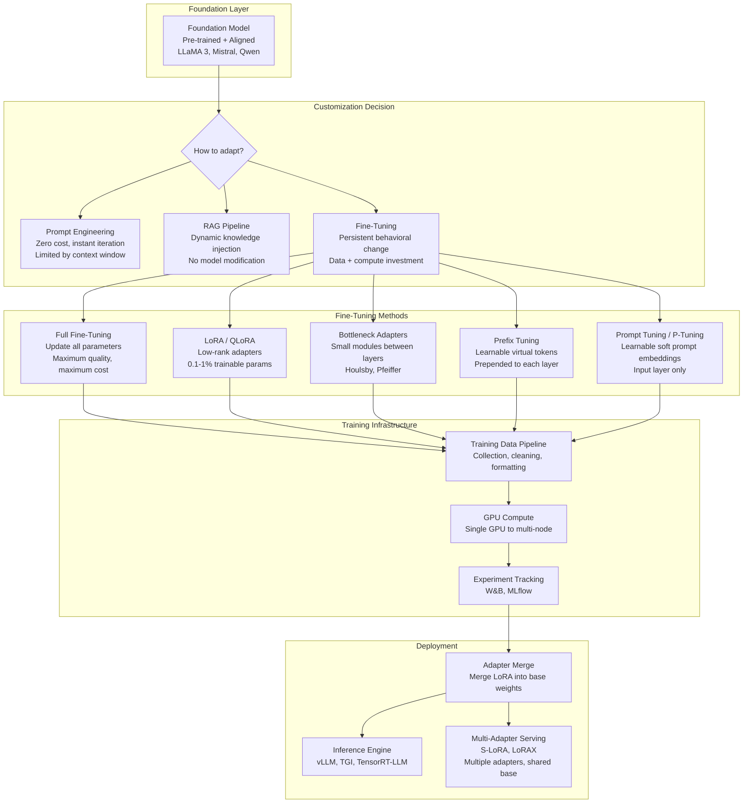
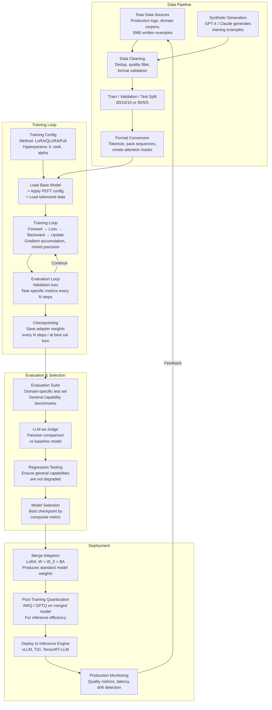
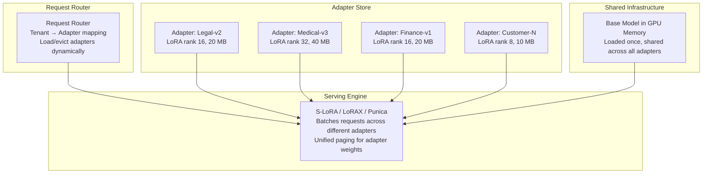

# Fine-Tuning Approaches

## 1. Overview

Fine-tuning is the process of continuing training on a pre-trained language model using task-specific or domain-specific data to specialize its behavior. It is the primary mechanism for adapting a general-purpose foundation model into a domain expert, instruction follower, or task-specific engine. For Principal AI Architects, fine-tuning represents the most consequential model customization decision: it determines the boundary between what the model can do out of the box and what it can do after investment in data, compute, and iteration.

The fine-tuning landscape has shifted dramatically since 2023. Full fine-tuning -- updating every parameter in the model -- remains the gold standard for quality but is economically infeasible for most organizations when applied to models above 13B parameters. Parameter-efficient fine-tuning (PEFT) methods, led by LoRA and QLoRA, have democratized model adaptation by reducing GPU requirements by 10-100x while preserving 95-100% of full fine-tuning quality. This has moved the bottleneck from compute to data quality: the dominant factor in fine-tuning outcomes is no longer how many GPUs you have, but how good your training data is.

**Key numbers that drive system design:**
- Full fine-tuning a 70B model: 8-16x A100 80GB GPUs, ~$10K-$50K per run, days of training
- QLoRA fine-tuning a 70B model: 1x A100 80GB GPU, ~$200-$1,000 per run, hours of training
- LoRA rank 16 on a 7B model: adds ~0.1% trainable parameters, matches full fine-tuning on most benchmarks
- Dataset quality threshold: 1,000 high-quality examples often outperform 50,000 mediocre ones (LIMA finding)
- Fine-tuning teaches format and style; it does not inject new factual knowledge reliably (RAG is better for that)
- A poorly constructed fine-tuning dataset can degrade the model's general capabilities (catastrophic forgetting) and undo safety alignment

---

## 2. Where It Fits in GenAI Systems

Fine-tuning sits between the foundation model (pre-trained, possibly aligned) and the serving infrastructure. It is the primary customization point where organizations inject domain expertise, behavioral preferences, and task specialization into a model. Fine-tuning outputs are consumed by inference engines, which serve the adapted model to end users.



**Upstream dependencies:** The base model's architecture, size, and alignment state determine which fine-tuning methods are feasible and what data is needed. A well-aligned instruct model (e.g., LLaMA 3.1 Instruct) requires less fine-tuning data to adapt than a base model.

**Downstream consumers:** The fine-tuned model (or its adapters) are consumed by inference engines. LoRA adapters can be served separately via multi-adapter frameworks (S-LoRA, LoRAX, Punica), enabling one base model to serve hundreds of fine-tuned variants with shared GPU memory.

**Cross-references:** [Model Selection](01-model-selection.md) | [Alignment](../01-foundations/06-alignment.md) | [Quantization](../02-llm-architecture/03-quantization.md) | [Training Infrastructure](04-training-infrastructure.md)

---

## 3. Core Concepts

### 3.1 Full Fine-Tuning

Full fine-tuning updates every parameter in the model. It is conceptually identical to continued pre-training but uses a task-specific dataset, lower learning rate, and far fewer training steps.

**When full fine-tuning is justified:**
- Pre-training a model from scratch or continuing pre-training on a new domain corpus (code, medical, legal)
- Training a model with fewer than 3B parameters where PEFT overhead is not worth the complexity
- Maximum quality is required and compute budget is not a constraint
- The fine-tuning dataset is very large (millions of examples) and the domain is substantially different from the pre-training distribution

**Memory requirements for full fine-tuning (AdamW optimizer, mixed precision):**

| Component | Per-Parameter Cost | 7B Model | 70B Model |
|---|---|---|---|
| Model weights (BF16) | 2 bytes | 14 GB | 140 GB |
| Gradients (BF16) | 2 bytes | 14 GB | 140 GB |
| Optimizer states (FP32 momentum + variance) | 8 bytes | 56 GB | 560 GB |
| Activations (varies with batch/seq) | Variable | 10-50 GB | 50-200 GB |
| **Total** | ~12+ bytes/param | **94-134 GB** | **890-1040 GB** |

A 7B model requires at minimum 2x A100 80GB. A 70B model requires at minimum 16x A100 80GB with ZeRO Stage 3 or FSDP. This is why PEFT methods dominate practical fine-tuning.

**Full fine-tuning hyperparameters (standard ranges):**
- Learning rate: 1e-5 to 5e-5 (10-100x lower than pre-training)
- Warmup: 3-10% of total steps
- Weight decay: 0.01-0.1
- Batch size: 32-128 (effective, via gradient accumulation)
- Epochs: 1-5 (more than 5 almost always overfits)
- Sequence length: match the deployment use case (2048-8192 typical)

### 3.2 LoRA: Low-Rank Adaptation

LoRA (Hu et al., 2021) is the dominant parameter-efficient fine-tuning method. It freezes the pre-trained model weights and injects small trainable low-rank matrices into each target layer. The core insight: the weight updates during fine-tuning have a low intrinsic rank -- they can be approximated by the product of two small matrices without significant quality loss.

**Mathematical formulation:**

For a pre-trained weight matrix W_0 of dimension d x k, LoRA decomposes the weight update as:

```
W = W_0 + (alpha/r) * B * A
```

Where:
- A is a d x r matrix (initialized from a random Gaussian)
- B is a r x k matrix (initialized to zero, so the adapter starts as identity)
- r is the rank (typically 8-64, much smaller than d which is 4096-8192)
- alpha is a scaling factor that controls the magnitude of the adaptation
- The ratio alpha/r determines the effective learning rate scaling of the adapter

**Rank selection guidelines:**

| Rank (r) | Trainable Params (7B) | Use Case | Quality vs Full FT |
|---|---|---|---|
| 4 | ~2.4M (0.03%) | Simple format adaptation, style transfer | 90-95% |
| 8 | ~4.8M (0.07%) | Single-task specialization, classification | 95-98% |
| 16 | ~9.6M (0.13%) | General instruction tuning, moderate domain shift | 97-99% |
| 32 | ~19.2M (0.27%) | Large domain shift, complex multi-task | 98-100% |
| 64 | ~38.4M (0.54%) | Maximum quality, domain pre-training style | ~100% |
| 128 | ~76.8M (1.08%) | Diminishing returns in most cases | ~100% |

**Alpha scaling:** The alpha parameter controls the magnitude of the LoRA update relative to the frozen weights. Common practice:
- Set alpha = 2 * rank (e.g., r=16, alpha=32). This gives a scaling factor of 2.0.
- Set alpha = rank (scaling factor 1.0) for more conservative adaptation.
- Higher alpha means larger updates -- useful when the target domain differs significantly from pre-training.
- When alpha/r is too large, training becomes unstable (loss spikes). When too small, the adapter cannot learn meaningful adaptations.

**Target modules:** Which layers to apply LoRA to significantly affects quality and parameter count.

| Target Strategy | Modules | Relative Quality | Param Count |
|---|---|---|---|
| Attention only (Q, V) | q_proj, v_proj | Good (original paper) | Lowest |
| Attention all | q_proj, k_proj, v_proj, o_proj | Better | 2x attention-only |
| Attention + MLP | All attention + gate_proj, up_proj, down_proj | Best | 3-4x attention-only |
| All linear layers | Everything including embed/lm_head | Marginal improvement | Highest |

The current best practice (validated by QLoRA paper and HuggingFace PEFT benchmarks) is to apply LoRA to all linear layers in attention and MLP blocks. The marginal cost of including MLP layers is small relative to the quality improvement, especially for domain adaptation.

**LoRA training configuration (typical):**
```python
from peft import LoraConfig

lora_config = LoraConfig(
    r=16,                          # rank
    lora_alpha=32,                 # alpha = 2 * r
    target_modules=[               # all linear layers
        "q_proj", "k_proj", "v_proj", "o_proj",
        "gate_proj", "up_proj", "down_proj"
    ],
    lora_dropout=0.05,             # regularization
    bias="none",                   # do not train biases
    task_type="CAUSAL_LM"
)
```

### 3.3 QLoRA: Quantized Low-Rank Adaptation

QLoRA (Dettmers et al., 2023) combines LoRA with aggressive quantization of the base model to enable fine-tuning of large models on a single consumer or professional GPU. It layers three innovations on top of LoRA.

**Innovation 1: NF4 (4-bit NormalFloat) base model quantization.**
Neural network weights are approximately normally distributed. NF4 places its 16 quantization levels at the quantiles of a standard normal distribution, so each bin contains equal probability mass. This is information-theoretically optimal for normally distributed data -- it minimizes expected quantization error under a Gaussian prior.

**Innovation 2: Double quantization.**
Each block of 64 weights gets an FP32 scaling factor (4 bytes per 64 weights = 0.5 bits/weight overhead). Double quantization quantizes these scaling factors to 8-bit, reducing the overhead to 0.127 bits/weight. For a 70B model, this saves ~3 GB of memory.

**Innovation 3: Paged optimizers.**
Uses NVIDIA Unified Memory to automatically page optimizer states between GPU and CPU when GPU memory is exhausted. This prevents OOM crashes during training on long sequences that cause activation memory spikes.

**QLoRA memory breakdown:**

| Component | 7B Model | 13B Model | 70B Model |
|---|---|---|---|
| Base model (NF4 + double quant) | ~3.5 GB | ~6.5 GB | ~35 GB |
| LoRA adapters (rank 16, BF16) | ~0.08 GB | ~0.15 GB | ~0.8 GB |
| Activations (batch 1, 2048 seq) | ~2 GB | ~4 GB | ~12 GB |
| Optimizer states (AdamW, LoRA only) | ~0.3 GB | ~0.6 GB | ~3.2 GB |
| **Total** | **~5.9 GB** | **~11.3 GB** | **~51 GB** |

A 7B model fine-tunes on a single RTX 3090/4090 (24 GB). A 70B model fine-tunes on a single A100 80GB. This is the enabling breakthrough that made fine-tuning accessible to individual developers and small teams.

**Quality comparison (Guanaco benchmark, Dettmers et al.):**
- QLoRA 65B (single 48GB GPU, 24 hours): 99.3% of ChatGPT quality on Vicuna benchmark
- QLoRA 33B: 97.8% of ChatGPT quality
- Full fine-tuning 7B (8x A100s): comparable to QLoRA 7B on matched benchmarks

The key finding: QLoRA's quantization of the base model introduces negligible quality degradation because the LoRA adapters are trained in full precision (BF16) and compensate for any quantization artifacts.

### 3.4 Adapters (Bottleneck and Parallel)

Adapters predate LoRA and remain relevant for specific use cases, particularly multi-task serving where many task-specific modules share a single backbone.

**Bottleneck Adapters (Houlsby et al., 2019):**
Insert small bottleneck modules after each Transformer sub-layer (attention and FFN). Each adapter consists of:
1. Down-projection: d_model -> d_bottleneck (e.g., 4096 -> 64)
2. Non-linearity (ReLU or GELU)
3. Up-projection: d_bottleneck -> d_model

The adapter adds a residual connection around itself, so when initialized near zero, the model starts identical to the pre-trained model. Typical bottleneck dimension: 32-256, adding 0.5-4% parameters per task.

**Parallel Adapters (He et al., 2022):**
Instead of inserting adapters sequentially after each sub-layer, parallel adapters run alongside the frozen Transformer layers and their outputs are summed. This avoids adding latency to the critical path (sequential adapters add serial computation) and has been shown to converge faster.

**Adapters vs LoRA:**

| Dimension | Bottleneck Adapters | LoRA |
|---|---|---|
| Architecture change | Adds new layers | Modifies existing layers |
| Inference latency | Slightly higher (extra layers) | None (merge into base weights) |
| Multi-task serving | Natural (swap adapter modules) | Natural (swap A, B matrices) |
| Merge into base | Not straightforward | Trivial (W = W_0 + BA) |
| Quality at same param budget | Comparable | Slightly better on most benchmarks |
| Ecosystem support | AdapterHub (limited updates) | HuggingFace PEFT, LitGPT (active) |

LoRA has largely superseded adapters for most use cases due to the merge advantage (zero inference overhead) and stronger ecosystem support. Adapters remain useful in research and in frameworks built around the adapter paradigm.

### 3.5 Prefix Tuning, Prompt Tuning, and P-Tuning

These methods prepend learnable continuous vectors to the model's input or hidden states, keeping all model parameters frozen.

**Prompt Tuning (Lester et al., 2021):**
- Prepends k learnable "soft prompt" vectors (each of dimension d_model) to the input embedding layer only
- Typical k: 20-100 tokens
- Trainable parameters: k * d_model (e.g., 100 * 4096 = 409,600 -- extremely small)
- Works well for large models (175B+) where it approaches full fine-tuning quality, but significantly underperforms on smaller models (<10B)
- Use case: multi-tenant SaaS where each customer gets a personalized soft prompt (kilobytes of storage per customer)

**Prefix Tuning (Li and Liang, 2021):**
- Prepends learnable prefix vectors to the key-value pairs in every attention layer, not just the input
- Prefix vectors are parameterized through a smaller feed-forward network (reparameterization) during training for stability, then the feed-forward network is discarded and the computed prefix vectors are used directly at inference
- More expressive than prompt tuning because it influences every layer's attention computation
- Trainable parameters: 2 * num_layers * k * d_model (2 because both keys and values get prefixes)

**P-Tuning v2 (Liu et al., 2022):**
- Similar to prefix tuning but adds learnable prompts to every layer of the Transformer and optimizes them jointly
- Designed specifically to close the gap between prompt-based methods and full fine-tuning on smaller models
- Achieves competitive performance with LoRA on NLU tasks (classification, NER, QA)

**Practical position:** Prompt tuning and prefix tuning are largely superseded by LoRA for generative tasks. They remain relevant for:
1. Extremely parameter-constrained scenarios (soft prompts are kilobytes vs LoRA's megabytes)
2. Multi-tenant serving with thousands of customer-specific adaptations
3. NLU/classification tasks where prefix tuning v2 is competitive

### 3.6 Dataset Construction

Dataset quality is the single most important factor in fine-tuning outcomes. A small dataset of well-constructed examples consistently outperforms large datasets of mediocre examples.

**Data formats for instruction fine-tuning:**

Standard instruction format (Alpaca style):
```json
{
  "instruction": "Summarize the following clinical trial report.",
  "input": "<clinical trial text>",
  "output": "<concise summary following specific formatting requirements>"
}
```

Conversational format (ShareGPT / ChatML style):
```json
{
  "conversations": [
    {"role": "system", "content": "You are a senior radiologist reviewing imaging reports."},
    {"role": "user", "content": "Review this chest X-ray report and flag any inconsistencies."},
    {"role": "assistant", "content": "<detailed review with specific findings>"}
  ]
}
```

**Dataset size guidelines:**

| Dataset Size | Sufficient For | Quality Requirement |
|---|---|---|
| 100-500 | Format/style adaptation (tone, output structure) | Must be perfect -- every example matters |
| 1,000-5,000 | Single-task specialization (classification, extraction) | Very high -- manual review of all examples |
| 5,000-20,000 | Multi-task domain adaptation (e.g., medical assistant) | High -- sample-level review + statistical quality checks |
| 20,000-100,000 | Broad capability development (general instruction tuning) | Moderate -- automated filtering + spot checks |
| 100,000+ | Pre-training style domain adaptation | Standard -- corpus-level filtering (dedup, quality scoring) |

**Data quality checklist:**
1. **Correctness:** Every output must be factually correct and complete. A single wrong example can teach the model to hallucinate confidently.
2. **Consistency:** Formatting, tone, and level of detail should be consistent across examples. Inconsistent data teaches inconsistent behavior.
3. **Diversity:** Cover the full range of expected inputs -- different lengths, difficulties, edge cases. A model trained only on easy examples will fail on hard ones.
4. **Decontamination:** Remove examples that overlap with evaluation benchmarks. Fine-tuning on test data produces inflated metrics that do not reflect real performance.
5. **Safety:** Ensure the dataset does not contain examples that would undo safety alignment (harmful instructions with compliant responses).
6. **Length distribution:** Match the expected input/output length distribution at inference time. If the model will generate 500-token responses in production, training on 50-token responses will produce truncated outputs.

**Synthetic data generation:** Using a stronger model (GPT-4, Claude) to generate training data for a smaller model is the most common and effective approach. Key practices:
- Generate diverse inputs using seed examples + LLM-powered variation
- Filter outputs using a combination of automated quality checks (length, format, keyword presence) and LLM-as-judge scoring
- Validate a random sample manually (10-20% for small datasets, 1-5% for large)
- Track the generation model and prompt in metadata for reproducibility

### 3.7 Training Hyperparameters

**Learning rate** is the most sensitive hyperparameter. Too high causes catastrophic forgetting (the model loses pre-trained capabilities); too low wastes compute without learning.

| Method | Learning Rate Range | Notes |
|---|---|---|
| Full fine-tuning | 1e-5 to 5e-5 | Lower end for larger models |
| LoRA | 1e-4 to 3e-4 | Higher because only adapter params are updated |
| QLoRA | 1e-4 to 3e-4 | Same as LoRA |
| Prompt tuning | 3e-2 to 3e-1 | Much higher -- small parameter space |

**Epochs and overfitting:**
- 1-3 epochs is typical for fine-tuning. With small datasets (<5K examples), even 1 epoch may overfit.
- Monitor validation loss -- if it increases while training loss decreases, you are overfitting.
- With LoRA, overfitting manifests as the model parroting training examples verbatim. Increase LoRA dropout (0.05-0.1) or reduce rank.

**Batch size:**
- Larger effective batch sizes (32-128) generally produce more stable training.
- Use gradient accumulation to achieve large effective batch sizes on limited GPU memory.
- For QLoRA on a single GPU: micro-batch size 1-4, gradient accumulation steps 8-32.

**Sequence length:**
- Must cover the longest examples in the training data (or truncate/filter them).
- Longer sequences consume quadratically more attention memory (unless using FlashAttention).
- Common practice: 2048 for simple tasks, 4096-8192 for complex generation.

### 3.8 Evaluation During Training

**Validation loss** is necessary but not sufficient. A model can have low validation loss while generating poor outputs (especially if the validation set is not representative).

**Task-specific evaluation metrics:**

| Task Type | Metrics | Evaluation Method |
|---|---|---|
| Classification | Accuracy, F1, precision/recall | Hold-out test set, stratified |
| Extraction (NER, IE) | Entity-level F1, exact match | Annotated test set |
| Summarization | ROUGE, BERTScore, human eval | Reference summaries + LLM-as-judge |
| Code generation | pass@k, HumanEval, MBPP | Execution-based evaluation |
| Open-ended generation | LLM-as-judge, MT-Bench, AlpacaEval | Pairwise comparison against baseline |
| Domain QA | Accuracy, exact match, human eval | Domain-specific test suite |

**LLM-as-judge** is the most practical automated evaluation for open-ended generation. Use a strong frontier model (GPT-4, Claude Opus) to compare outputs from the fine-tuned model against a baseline, scoring on dimensions like helpfulness, accuracy, and formatting. Key considerations:
- Use pairwise comparisons (A vs B) rather than absolute scoring (more reliable)
- Randomize presentation order (LLMs have positional bias)
- Run each comparison 2-3 times and take majority vote
- Calibrate against human judgments on a small sample

### 3.9 When NOT to Fine-Tune

Fine-tuning is expensive, slow to iterate, and introduces risk (catastrophic forgetting, safety degradation). It should be a last resort after cheaper alternatives have been exhausted.

**Decision tree:**

1. **Can prompt engineering solve it?** If the model can produce acceptable outputs with few-shot examples and system prompt instructions, fine-tuning is unnecessary. Test with 5-10 diverse inputs before deciding.

2. **Can RAG solve it?** If the issue is that the model lacks specific knowledge (product catalogs, internal documentation, recent events), RAG injects that knowledge at inference time without model modification. RAG is cheaper, faster to iterate, and does not risk degrading other capabilities.

3. **Is the problem behavioral (not knowledge-based)?** Fine-tuning excels at changing how the model responds, not what it knows. Examples where fine-tuning adds value:
   - Consistent output formatting (always return valid JSON with specific schema)
   - Domain-specific language and tone (legal writing, medical reporting)
   - Complex multi-step reasoning patterns specific to a domain
   - Reducing verbosity or increasing conciseness
   - Following complex instructions that cannot be captured in a prompt

4. **Do you have sufficient high-quality data?** Without at least 500-1,000 high-quality examples, fine-tuning is unlikely to produce reliable improvements. If you have fewer examples, invest in prompt engineering or data collection first.

---

## 4. Architecture

### 4.1 Fine-Tuning Pipeline Architecture



### 4.2 Multi-Adapter Serving Architecture



S-LoRA (Sheng et al., 2023) enables serving thousands of LoRA adapters on a single GPU cluster. The base model is loaded once, and adapter weights are stored in a unified memory pool with dynamic loading/eviction based on request patterns. Requests using different adapters can be batched together -- the base model computation is shared, and adapter-specific computations are applied per-request. This reduces per-tenant GPU cost by 100-1000x compared to deploying separate model instances.

---

## 5. Design Patterns

### Pattern 1: Progressive Refinement
Start with prompt engineering, graduate to few-shot RAG, then fine-tune only when cheaper methods hit a quality ceiling. Each stage produces evaluation data that informs the next.

**Implementation:** Build an evaluation suite first. Measure baseline (zero-shot) → few-shot → RAG-augmented. Only invest in fine-tuning if the gap between current performance and target is large and behavioral (not knowledge-based).

### Pattern 2: Teacher-Student Fine-Tuning
Use a frontier model (GPT-4, Claude Opus) to generate high-quality training data, then fine-tune a smaller, cheaper model on that data. The smaller model learns to mimic the teacher's behavior at a fraction of the inference cost.

**Implementation:** Generate 5K-50K examples using the teacher model. Filter for quality using the teacher itself as a judge. Fine-tune a 7B-13B model with LoRA. Validate that the student achieves >90% of teacher quality on the evaluation suite. Deploy the student for high-volume, cost-sensitive traffic.

### Pattern 3: Domain Adapter Stacking
Train separate LoRA adapters for orthogonal capabilities (domain knowledge, output format, language), then compose them at inference time by summing the low-rank updates.

**Caveat:** Adapter composition quality degrades when adapters were not trained to be composable. In practice, training a single adapter on combined data usually outperforms composition of independently trained adapters.

### Pattern 4: Continuous Fine-Tuning Pipeline
Treat fine-tuning as a continuous process, not a one-time event. As production data accumulates, periodically retrain adapters on expanded datasets. Version adapters alongside the base model.

**Implementation:** Production feedback (user ratings, corrections, A/B test results) flows into a data pipeline. Monthly (or triggered by data volume threshold), a new adapter version is trained, evaluated against the current production adapter on the test suite, and deployed if it improves.

### Pattern 5: Safety-Preserving Fine-Tuning
Fine-tune with a mix of domain-specific data and safety-relevant data to prevent safety alignment degradation. Include 5-10% "safety anchoring" examples from the original alignment dataset alongside domain data.

**Implementation:** Acquire or generate safety-relevant examples (harmful prompt → appropriate refusal). Mix into the training data at a fixed ratio. Evaluate safety metrics (refusal rate on red-team prompts, jailbreak resistance) alongside task metrics. Reject any adapter that degrades safety beyond a threshold.

---

## 6. Implementation Approaches

### Approach 1: HuggingFace PEFT + TRL (Most Common)

The standard open-source stack for LoRA/QLoRA fine-tuning.

```python
from transformers import AutoModelForCausalLM, AutoTokenizer, BitsAndBytesConfig
from peft import LoraConfig, get_peft_model, prepare_model_for_kbit_training
from trl import SFTTrainer, SFTConfig

# QLoRA: 4-bit base model
bnb_config = BitsAndBytesConfig(
    load_in_4bit=True,
    bnb_4bit_quant_type="nf4",
    bnb_4bit_compute_dtype=torch.bfloat16,
    bnb_4bit_use_double_quant=True,
)

model = AutoModelForCausalLM.from_pretrained(
    "meta-llama/Llama-3.1-8B-Instruct",
    quantization_config=bnb_config,
    device_map="auto",
    attn_implementation="flash_attention_2",
)

model = prepare_model_for_kbit_training(model)

peft_config = LoraConfig(
    r=16, lora_alpha=32, lora_dropout=0.05,
    target_modules=["q_proj","k_proj","v_proj","o_proj",
                     "gate_proj","up_proj","down_proj"],
    bias="none", task_type="CAUSAL_LM",
)

training_args = SFTConfig(
    output_dir="./output",
    per_device_train_batch_size=2,
    gradient_accumulation_steps=16,
    learning_rate=2e-4,
    num_train_epochs=3,
    bf16=True,
    logging_steps=10,
    eval_strategy="steps",
    eval_steps=100,
    save_strategy="steps",
    save_steps=100,
    max_seq_length=4096,
)

trainer = SFTTrainer(
    model=model,
    train_dataset=train_dataset,
    eval_dataset=eval_dataset,
    peft_config=peft_config,
    args=training_args,
    tokenizer=tokenizer,
)
trainer.train()
```

### Approach 2: Axolotl (Configuration-Driven)

Axolotl wraps the HuggingFace stack in a YAML-driven interface, reducing boilerplate. Popular for quick experimentation.

```yaml
base_model: meta-llama/Llama-3.1-8B-Instruct
model_type: LlamaForCausalLM
load_in_4bit: true
adapter: qlora
lora_r: 16
lora_alpha: 32
lora_target_linear: true
datasets:
  - path: ./data/train.jsonl
    type: sharegpt
sequence_len: 4096
micro_batch_size: 2
gradient_accumulation_steps: 16
learning_rate: 2e-4
num_epochs: 3
optimizer: paged_adamw_8bit
bf16: true
flash_attention: true
eval_steps: 100
save_steps: 100
```

### Approach 3: Cloud Managed Fine-Tuning

For teams that want to avoid infrastructure management.

| Provider | Service | Supported Methods | Pricing Model |
|---|---|---|---|
| OpenAI | Fine-tuning API | Full FT (GPT-4o-mini, GPT-4o) | Per training token + per inference token |
| Google | Vertex AI Tuning | Full FT, adapter tuning (Gemini) | Per training hour + per prediction |
| AWS | Bedrock Custom Models | Full FT, continued pre-training | Per training token |
| Together AI | Fine-tuning API | LoRA, full FT (open-source models) | Per GPU-hour |
| Anyscale / Ray | Ray Train | Any method (bring your code) | Per GPU-hour (self-managed or managed) |

**Tradeoff:** Managed services trade control for convenience. You cannot inspect intermediate checkpoints, customize the training loop, or use cutting-edge methods (e.g., DoRA, NEFT) until the provider adds support. For production workloads requiring maximum control, self-hosted fine-tuning on rented GPUs (Lambda Labs, RunPod, Vast.ai) is often preferred.

---

## 7. Tradeoffs

### Fine-Tuning Method Selection

| Criterion | Full Fine-Tuning | LoRA | QLoRA | Prompt Tuning |
|---|---|---|---|---|
| Quality ceiling | Highest | Very high (97-100%) | Very high (95-100%) | Moderate-High (model size dependent) |
| GPU memory (7B) | ~100 GB (multi-GPU) | ~16 GB (single GPU) | ~6 GB (single GPU) | ~14 GB (single GPU) |
| GPU memory (70B) | ~1 TB (multi-node) | ~160 GB (multi-GPU) | ~51 GB (single GPU) | ~140 GB (multi-GPU) |
| Training speed | Slowest | Fast | Fast (slightly slower than LoRA due to dequant) | Fastest |
| Inference overhead | None | None (after merge) | None (after merge + requant) | Slight (extra tokens) |
| Multi-tenant serving | Expensive (separate model per tenant) | Efficient (shared base + small adapters) | Efficient (same as LoRA after merge) | Very efficient (kilobyte-sized prompts) |
| Risk of catastrophic forgetting | Highest | Low | Low | Lowest |
| Ecosystem maturity | Mature | Mature (PEFT, LitGPT) | Mature (PEFT + bitsandbytes) | Moderate |

### Customization Strategy Selection

| Criterion | Prompt Engineering | RAG | Fine-Tuning | RAG + Fine-Tuning |
|---|---|---|---|---|
| Time to deploy | Hours | Days | Weeks | Weeks-Months |
| Ongoing maintenance | Low (prompt versioning) | Medium (index updates) | Medium (periodic retraining) | High |
| Knowledge freshness | Static (in prompt) | Dynamic (live retrieval) | Static (in weights) | Dynamic |
| Behavioral change | Limited (follows instructions) | Limited (adds context) | Deep (modifies model behavior) | Deep + Dynamic |
| Cost per query | Low-Medium (long prompts) | Medium (retrieval + generation) | Low (smaller model, shorter prompts) | Medium |
| Data requirement | None | Documents/knowledge base | 500+ labeled examples | Both |
| Best for | Simple formatting, few-shot tasks | Knowledge-intensive QA | Style, format, domain behavior | Production systems needing both |

---

## 8. Failure Modes

### 8.1 Catastrophic Forgetting
**Symptom:** The fine-tuned model excels on the target task but loses general capabilities (cannot do math, forgets common knowledge, produces incoherent text on out-of-domain inputs).
**Cause:** Learning rate too high, too many epochs, dataset too narrow.
**Mitigation:** Lower learning rate, fewer epochs, mix general-purpose data (5-10%) into the training set, use LoRA (inherently resistant because most weights are frozen).

### 8.2 Safety Alignment Degradation
**Symptom:** The fine-tuned model complies with harmful requests it would previously refuse.
**Cause:** Fine-tuning data contains examples where the model complies with inappropriate requests, or the fine-tuning process overwrites safety-trained parameters.
**Mitigation:** Include safety-relevant examples in the training mix, evaluate with red-team prompts before deployment, use LoRA on attention layers only (avoid modifying safety-critical parameters).

### 8.3 Overfitting to Training Distribution
**Symptom:** Excellent performance on training-like inputs, poor performance on novel inputs. The model may memorize and regurgitate training examples verbatim.
**Cause:** Dataset too small, too many epochs, insufficient diversity.
**Mitigation:** Increase dataset diversity, add LoRA dropout, reduce epochs, use validation loss + task metrics jointly.

### 8.4 Format Collapse
**Symptom:** The model produces outputs in a rigid format that does not generalize. For example, always starting responses with "Here is" or always producing exactly 3 bullet points.
**Cause:** Overly uniform output formatting in training data.
**Mitigation:** Vary output formats in training data (different lengths, structures, styles). Include a variety of instruction types.

### 8.5 Evaluation-Training Mismatch
**Symptom:** Validation loss decreases but task performance does not improve (or even degrades).
**Cause:** Validation set is not representative of the deployment distribution, or next-token-prediction loss does not correlate with the actual quality metric.
**Mitigation:** Build task-specific evaluation suites that mirror production queries. Use LLM-as-judge and execution-based metrics alongside validation loss.

### 8.6 Adapter Rank Mismatch
**Symptom:** LoRA fine-tuning produces weak adaptations that do not change model behavior meaningfully.
**Cause:** Rank too low for the magnitude of the domain shift, or alpha/r ratio too small.
**Mitigation:** Increase rank (start at 16, try 32 or 64 for large domain shifts). Increase alpha proportionally. Ensure target modules include MLP layers.

---

## 9. Optimization Techniques

### 9.1 FlashAttention for Training
Enable FlashAttention 2 to reduce memory consumption of the attention computation from O(n^2) to O(n) and improve training throughput by 1.5-2x. Critical for sequence lengths above 2048.

### 9.2 Gradient Checkpointing
Trade compute for memory by recomputing activations during the backward pass instead of storing them. Reduces activation memory by ~60-70% at the cost of ~30% slower training. Essential for QLoRA on large models.

### 9.3 Sequence Packing
Concatenate multiple short training examples into a single sequence (separated by EOS tokens) to maximize GPU utilization. Without packing, short examples waste the remaining sequence length as padding. Packing can improve training throughput by 2-5x on datasets with variable-length examples.

### 9.4 NEFTune (Noisy Embeddings)
Add uniform noise to input embeddings during training (NEFTune, Jain et al., 2023). Surprisingly, this simple regularization technique improves conversational quality by 5-15% on AlpacaEval, at zero cost. Noise magnitude alpha=5 is a good default.

### 9.5 DoRA (Weight-Decomposed Low-Rank Adaptation)
DoRA (Liu et al., 2024) decomposes weight updates into magnitude and direction components, applying LoRA only to the direction. This more closely mimics full fine-tuning's learning dynamics and consistently outperforms standard LoRA by 1-3% on benchmarks with the same parameter budget.

### 9.6 Hyperparameter Search
Use Bayesian optimization (Optuna, W&B Sweeps) over learning rate, rank, alpha, and dropout. A well-tuned LoRA configuration can outperform a poorly tuned full fine-tuning setup. Focus the search on learning rate (most sensitive) and rank (most impactful for quality).

### 9.7 Data Curriculum
Order training examples from easy to hard (curriculum learning). Train on simple, clear examples first, then introduce complex, ambiguous ones. This improves convergence speed and sometimes final quality, especially on datasets with high variance in difficulty.

---

## 10. Real-World Examples

### Bloomberg: BloombergGPT
Bloomberg trained a 50B parameter model from scratch on a mix of financial data (363B tokens) and general data (345B tokens). The model outperformed general-purpose models on financial NLP tasks (sentiment analysis, NER for financial entities, news classification) while maintaining competitive general performance. In hindsight, Bloomberg acknowledged that fine-tuning an existing open-source model would have been more cost-effective -- the $2M+ training cost was difficult to justify given the subsequent release of LLaMA and Mistral models that could be fine-tuned for a fraction of the cost.

### Replit: Code-Specific Fine-Tuning
Replit fine-tuned CodeLLaMA models using LoRA on their corpus of user-generated code and coding interactions. The fine-tuned models power Replit's code completion and code generation features. By fine-tuning rather than training from scratch, Replit reduced iteration cycles from months to days and could rapidly adapt to new programming languages and frameworks.

### Intuit: Domain-Adapted Tax Assistant
Intuit fine-tuned LLMs for their TurboTax assistant using a combination of tax code documentation, IRS publications, and curated Q&A pairs. The fine-tuned model outperformed prompt-engineered GPT-4 on domain-specific tax questions while running on smaller, cheaper infrastructure. They used QLoRA to iterate rapidly on adapter versions during tax season.

### Hugging Face: Zephyr
Hugging Face produced Zephyr-7B by fine-tuning Mistral 7B using a combination of distilled SFT data (UltraChat, generated by GPT-3.5) and DPO with AI-generated preference data (UltraFeedback). Zephyr-7B-beta matched or exceeded much larger models on MT-Bench, demonstrating that the combination of high-quality synthetic data and efficient fine-tuning can produce surprisingly capable small models.

### Anyscale: Managed Fine-Tuning at Scale
Anyscale offers managed fine-tuning on Ray, serving enterprise customers who need to fine-tune open-source models on proprietary data without building infrastructure. Their platform supports LoRA, QLoRA, and full fine-tuning across model sizes from 7B to 70B, with experiment tracking and evaluation integrated. They report typical customer fine-tuning runs completing in 2-8 hours on their managed GPU clusters.

---

## 11. Related Topics

- **[Model Selection](01-model-selection.md):** Choosing the right base model is prerequisite to fine-tuning. The base model's architecture, size, and alignment state determine fine-tuning feasibility and expected outcomes.
- **[Alignment](../01-foundations/06-alignment.md):** Fine-tuning interacts with alignment -- it can enhance or degrade safety properties. Understanding the alignment pipeline is essential for safe fine-tuning.
- **[Quantization](../02-llm-architecture/03-quantization.md):** QLoRA depends on NF4 quantization. Post-fine-tuning, the merged model is typically quantized (AWQ, GPTQ) for efficient serving.
- **[Training Infrastructure](04-training-infrastructure.md):** Full fine-tuning at scale requires distributed training infrastructure (DeepSpeed, FSDP). QLoRA reduces infrastructure requirements to a single GPU.
- **[Model Distillation](03-distillation.md):** Distillation is a related but distinct technique -- the teacher-student paradigm can replace or complement fine-tuning.
- **[Cost Optimization](../11-performance/03-cost-optimization.md):** Fine-tuning enables deploying smaller, cheaper models that match the quality of larger models on specific tasks, directly reducing inference costs.

---

## 12. Source Traceability

| Concept | Primary Source | Year |
|---|---|---|
| LoRA | Hu et al., "LoRA: Low-Rank Adaptation of Large Language Models" | 2021 |
| QLoRA | Dettmers et al., "QLoRA: Efficient Finetuning of Quantized LLMs" | 2023 |
| Bottleneck Adapters | Houlsby et al., "Parameter-Efficient Transfer Learning for NLP" | 2019 |
| Prefix Tuning | Li and Liang, "Prefix-Tuning: Optimizing Continuous Prompts for Generation" | 2021 |
| Prompt Tuning | Lester et al., "The Power of Scale for Parameter-Efficient Prompt Tuning" | 2021 |
| P-Tuning v2 | Liu et al., "P-Tuning v2: Prompt Tuning Can Be Comparable to Fine-tuning" | 2022 |
| DoRA | Liu et al., "DoRA: Weight-Decomposed Low-Rank Adaptation" | 2024 |
| NEFTune | Jain et al., "NEFTune: Noisy Embeddings Improve Instruction Finetuning" | 2023 |
| LIMA (Less Is More) | Zhou et al., "LIMA: Less Is More for Alignment" (Meta) | 2023 |
| S-LoRA | Sheng et al., "S-LoRA: Serving Thousands of Concurrent LoRA Adapters" | 2023 |
| Alpaca | Taori et al., Stanford Alpaca | 2023 |
| Self-Instruct | Wang et al., "Self-Instruct: Aligning LMs with Self-Generated Instructions" | 2022 |
| BloombergGPT | Wu et al., "BloombergGPT: A Large Language Model for Finance" | 2023 |
| Zephyr | Tunstall et al., "Zephyr: Direct Distillation of LM Alignment" (HuggingFace) | 2023 |
