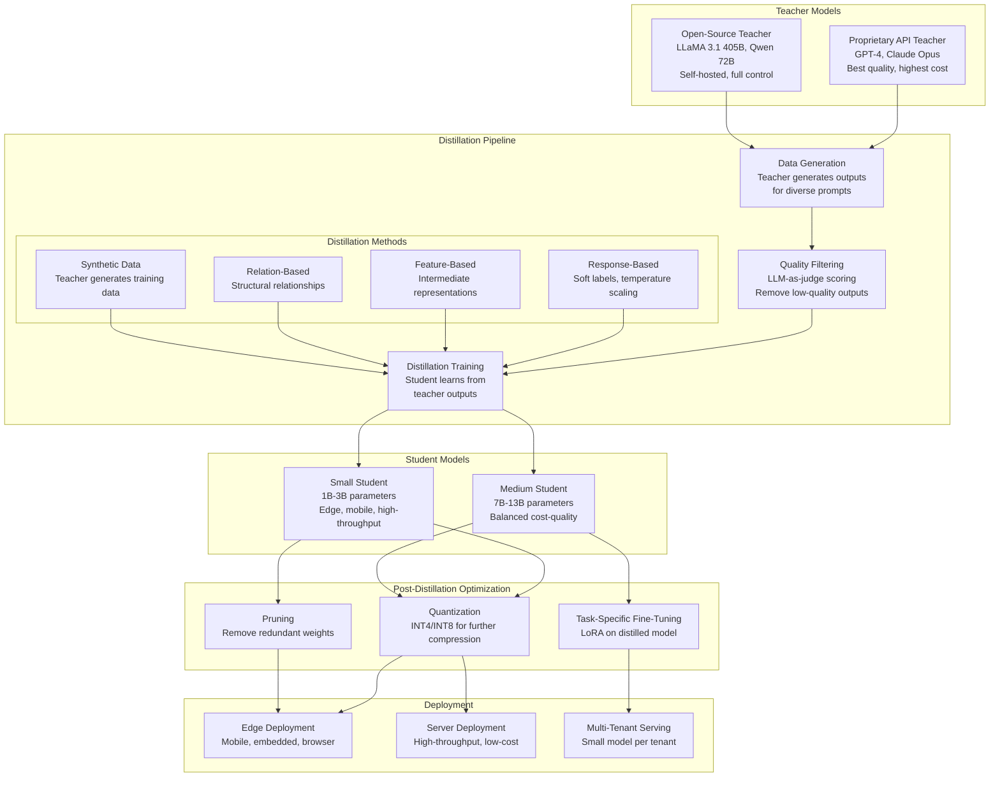
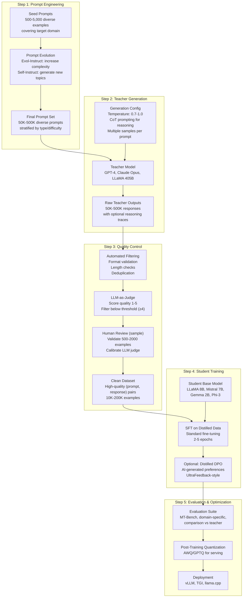
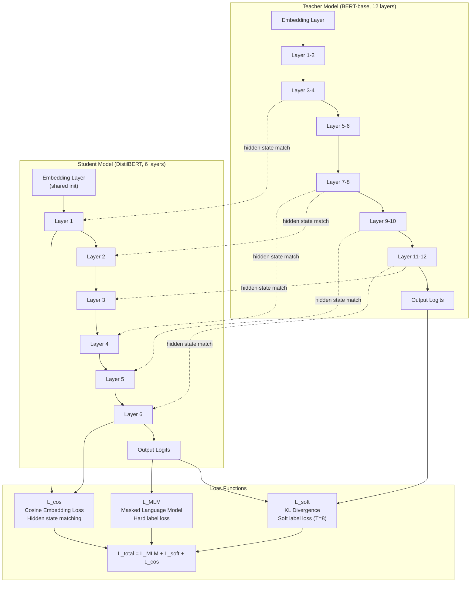

# Model Distillation

## 1. Overview

Model distillation is the process of transferring knowledge from a large, expensive "teacher" model to a smaller, cheaper "student" model. The student learns to approximate the teacher's behavior -- not just its final answers, but its full output distribution, intermediate representations, and relational structure -- enabling deployment of models that are 5-100x smaller and faster with 80-95%+ of the teacher's quality. For Principal AI Architects, distillation is the primary technique for bridging the gap between what frontier models can do and what production cost/latency budgets allow.

The core insight behind distillation is that a trained model's soft probability distribution over outputs contains far more information than hard labels alone. When a teacher model assigns 70% probability to the correct answer and 20% to a plausible alternative, that 20% signal -- the "dark knowledge" -- teaches the student about the structure of the problem space: which answers are similar, which mistakes are reasonable, and how confident to be. Training on soft labels is equivalent to training on exponentially more hard-labeled data.

Distillation has become the dominant strategy in the GenAI ecosystem for producing cost-effective production models. Nearly every successful open-source instruct model (Alpaca, Vicuna, Zephyr, Orca, Phi) was created by distilling from a stronger model. The technique is so effective that it has raised legal and ethical questions: OpenAI, Anthropic, and Google prohibit using their model outputs to train competing models, yet the practice is widespread and arguably the primary mechanism by which open-source models have closed the quality gap with proprietary frontier models.

**Key numbers that drive system design:**
- DistilBERT: 40% smaller, 60% faster, retains 97% of BERT's performance
- Zephyr-7B (distilled from GPT-3.5 + UltraFeedback): matches or exceeds 70B models on MT-Bench
- Phi-3-mini (3.8B, trained on synthetic data from GPT-4): outperforms LLaMA-2 7B on most benchmarks
- Orca 2 (13B, distilled from GPT-4 with reasoning traces): matches GPT-4 on specific reasoning tasks
- Typical distillation cost: 10-100x cheaper than training the teacher model
- Quality retention: 80-95% of teacher quality at 10-50x smaller model size, depending on task

---

## 2. Where It Fits in GenAI Systems

Distillation sits in the model development pipeline between the teacher model (a large, expensive model, either proprietary API or self-hosted) and the deployment target (a small, efficient model for production). It produces models that can be further optimized through quantization and pruning for maximum efficiency.



**Upstream dependencies:** A high-quality teacher model is prerequisite. The teacher's quality ceiling determines the student's quality ceiling. The distillation dataset (prompts used to generate teacher outputs) determines the student's capability distribution.

**Downstream consumers:** The distilled model feeds into the same serving pipeline as any other model: quantization, format conversion, and deployment to inference engines. Distilled models are frequently further fine-tuned with LoRA for task-specific adaptation.

**Cross-references:** [Fine-Tuning](02-fine-tuning.md) | [Quantization](../02-llm-architecture/03-quantization.md) | [Alignment](../01-foundations/06-alignment.md) | [Model Selection](01-model-selection.md)

---

## 3. Core Concepts

### 3.1 The Teacher-Student Framework

The teacher-student framework is the foundational paradigm for all distillation methods. A pre-trained, high-capacity teacher model generates training signal that a smaller student model learns from. The key advantage over training the student from scratch is that the teacher provides richer supervision -- not just what the answer is, but how certain the model is, which alternatives are plausible, and (in feature-based distillation) what internal representations are useful.

**Why distillation works better than training on hard labels:**

Consider a classification task where the teacher assigns probabilities:
- Cat: 0.70, Dog: 0.20, Fox: 0.08, Wolf: 0.02

Hard label training: the student learns only "this is a cat." It receives zero signal about the visual similarity between cats and dogs or between foxes and wolves.

Soft label training: the student learns that this is probably a cat, but it looks somewhat like a dog, slightly like a fox, and barely like a wolf. This relational information is the "dark knowledge" that Hinton et al. identified as the primary value of distillation. The student effectively receives training signal about every class on every example, rather than signal about only the correct class.

**For LLMs, the principle extends to the vocabulary distribution.** When a teacher LLM generates the next token, its probability distribution over the entire vocabulary (50K-150K tokens) encodes rich information about which tokens are plausible continuations and how they relate to each other. This is vastly more informative than a single correct token.

### 3.2 Response-Based Distillation (Soft Labels)

Response-based distillation trains the student to match the teacher's output probability distribution, typically using a combination of the standard cross-entropy loss (against hard labels) and a KL divergence loss (against the teacher's soft labels).

**The distillation loss:**

```
L_distill = α * L_CE(y_hard, p_student) + (1-α) * T² * KL(softmax(z_teacher/T) || softmax(z_student/T))
```

Where:
- L_CE is the standard cross-entropy loss with hard labels
- KL is the KL divergence between teacher and student soft distributions
- T is the temperature (higher T makes distributions softer, revealing more dark knowledge)
- α balances hard-label learning and soft-label learning
- z_teacher and z_student are logits (pre-softmax outputs)
- T² scaling compensates for the gradient magnitude reduction caused by high temperature

**Temperature scaling:**

| Temperature T | Effect on Distribution | Use Case |
|---|---|---|
| T = 1 | Standard softmax, peaked distribution | Baseline, equivalent to standard training if teacher is confident |
| T = 2-5 | Moderately smoothed, reveals secondary preferences | General-purpose distillation, good default range |
| T = 10-20 | Very smooth, near-uniform over plausible tokens | Maximum dark knowledge transfer, may lose sharpness on easy examples |
| T = 0.5 | Sharper than standard, amplifies teacher's top choices | When teacher is uncertain and you want student to commit more |

**Typical configuration for LLM distillation:**
- Temperature: T = 2-4 (higher for diverse tasks, lower for focused tasks)
- Alpha: 0.5-0.7 (balance hard and soft labels)
- The hard label loss prevents the student from drifting too far from correct answers when the teacher is wrong

**Practical challenge for API-based teachers:** Most proprietary API models (GPT-4, Claude) do not expose full logit distributions -- they return only sampled tokens or top-k log probabilities. This limits response-based distillation to:
1. **Top-k approximation:** Use the top-k (typically k=5-20) log probabilities returned by the API and approximate the remaining distribution.
2. **Sampled response distillation:** Generate multiple responses per prompt (via temperature sampling) and train the student on all of them, weighted by their quality. This approximates the soft distribution through sampling.
3. **Hard label distillation:** Simply train the student on the teacher's generated text as if they were hard labels. This is the most common approach in practice (Alpaca, Vicuna, Orca).

### 3.3 Feature-Based Distillation

Feature-based distillation trains the student to match the teacher's intermediate representations (hidden states, attention patterns) at corresponding layers, not just the final output distribution.

**Mechanism:**
For each training example, extract the teacher's hidden states at selected layers. Train the student with an additional loss term that minimizes the distance between student and teacher hidden states:

```
L_feature = Σ_l  ||f(h_student^l) - h_teacher^g(l)||²
```

Where:
- h_student^l is the student's hidden state at layer l
- h_teacher^g(l) is the teacher's hidden state at the corresponding layer g(l)
- f is a projection layer that maps student hidden dimension to teacher hidden dimension (since the student is typically smaller)
- g(l) maps student layers to teacher layers (e.g., student layer 6 → teacher layer 12)

**Layer mapping strategies:**
1. **Uniform mapping:** Map every k-th teacher layer to corresponding student layers (e.g., for 12-layer student from 24-layer teacher: student layer 1 → teacher layer 2, student layer 2 → teacher layer 4, etc.)
2. **Last-layer only:** Match only the final hidden states. Simpler, less effective.
3. **Learned mapping:** Train a small attention-based mapper that selects which teacher layers are most informative for each student layer.

**Advantages of feature-based distillation:**
- Provides stronger training signal than response-only distillation (signal at every layer, not just the output)
- The student learns useful intermediate representations, not just how to produce the right output
- Particularly effective when teacher and student architectures differ significantly

**Disadvantages:**
- Requires access to teacher's intermediate representations (impossible with API-based teachers)
- Projection layers add complexity and introduce an alignment problem (what does it mean for student layer 6 to "match" teacher layer 12?)
- Computational overhead: must run teacher forward pass and store intermediate states

**Key example: DistilBERT** (Sanh et al., HuggingFace, 2019):
- Teacher: BERT-base (12 layers, 110M params)
- Student: DistilBERT (6 layers, 66M params, 40% smaller)
- Method: Initialize student with every other teacher layer. Train with triple loss: masked language modeling loss + soft label distillation loss + cosine embedding loss (match hidden states)
- Result: 97% of BERT's performance on GLUE benchmark, 60% faster inference

### 3.4 Relation-Based Distillation

Relation-based distillation captures the structural relationships between data points or between layers, rather than matching individual representations.

**Types of relational knowledge:**

1. **Instance-level relations:** The pairwise similarity structure between examples in a batch. If the teacher's hidden states for examples A and B are similar (cosine similarity 0.9), the student should also produce similar representations for A and B. Typically implemented using a Gram matrix loss:
```
L_relation = ||G_teacher - G_student||²
where G = H * H^T (Gram matrix of hidden states)
```

2. **Layer-level relations:** The relationships between a model's own layers. If the teacher's layer 5 and layer 10 representations are correlated in a specific way, the student should exhibit similar inter-layer structure.

3. **Attention transfer:** Match the teacher's attention patterns (attention weights) at corresponding layers. The student learns to "attend to the same things" as the teacher.

**When relation-based distillation helps:**
- When the teacher and student have very different architectures (different hidden dimensions, different number of attention heads) where direct feature matching is awkward
- When the task requires structural understanding (document understanding, code analysis) where relational structure is more important than specific representations
- As a complement to response-based and feature-based methods (combined loss)

### 3.5 Synthetic Data Distillation

Synthetic data distillation is the dominant distillation paradigm in the LLM era. Rather than matching the teacher's distributions or representations, the teacher generates a large corpus of high-quality training data that the student is trained on using standard supervised fine-tuning.

**The process:**

1. **Prompt collection:** Assemble a diverse set of prompts covering the target capability distribution. Sources: existing instruction datasets (FLAN, Super-NaturalInstructions), self-generated prompts (Self-Instruct), domain-specific prompt templates, evolved prompts (Evol-Instruct).

2. **Teacher generation:** Feed each prompt to the teacher and collect the response. Optionally: generate multiple responses per prompt, use chain-of-thought prompting to elicit reasoning traces, vary temperature to get diverse responses.

3. **Quality filtering:** Not all teacher outputs are good. Filter using:
   - LLM-as-judge: use the teacher itself (or another model) to rate response quality
   - Heuristic filters: length, format validation, keyword presence
   - Execution-based filters (for code): does the generated code pass tests?
   - Human review on a sample

4. **Student training:** Standard supervised fine-tuning (SFT) on the filtered synthetic data.

**Why this works despite being "just SFT on synthetic data":**
- The teacher's responses encode its reasoning patterns, knowledge, and instruction-following behavior
- The student learns to mimic these patterns, effectively absorbing the teacher's capabilities
- Diverse, high-quality prompts ensure broad capability coverage
- The teacher handles the hardest part (generating correct, well-formatted responses); the student just needs to learn the pattern

**Scaling laws for synthetic data distillation:**
- Quality > quantity: 10K excellent examples beat 100K mediocre ones
- Diversity matters: prompts must cover the full distribution of expected inputs
- Reasoning traces help: including the teacher's chain-of-thought (CoT) reasoning in the training data teaches the student to reason, not just to produce answers
- Difficulty curriculum: training on progressively harder examples improves final quality

### 3.6 Case Studies

#### DistilBERT (HuggingFace, 2019)
**Context:** BERT was the dominant NLU model but too large/slow for production.
**Method:** Feature-based distillation from BERT-base (110M) to a 6-layer student (66M). Triple loss: MLM + soft labels (T=8) + cosine embedding loss on hidden states.
**Result:** 40% smaller, 60% faster, 97% of BERT's GLUE score. Became the standard for production BERT deployment.
**Lesson:** For encoder models, feature-based distillation with careful initialization (every-other-layer) is highly effective.

#### Alpaca (Stanford, 2023)
**Context:** LLaMA-7B was a strong base model but could not follow instructions.
**Method:** Synthetic data distillation from text-davinci-003 (GPT-3.5). Self-Instruct generated 52K instruction-response pairs. Standard SFT on LLaMA-7B.
**Result:** A 7B instruction-following model that was "qualitatively similar to text-davinci-003" on informal evaluation. Cost: <$500 in API calls + a few hours of training.
**Lesson:** Even a modest amount of synthetic data from a strong teacher can transform a base model into a useful assistant. Sparked the open-source instruction tuning revolution.

#### Vicuna (LMSYS, 2023)
**Context:** Improving on Alpaca with better data.
**Method:** Distilled from ChatGPT conversations (ShareGPT dataset: ~70K real user conversations with ChatGPT). SFT on LLaMA-13B.
**Result:** 90% of ChatGPT quality on MT-Bench (per GPT-4-as-judge). Significantly better than Alpaca. Demonstrated that real conversation data > synthetic instruction data.
**Lesson:** Data distribution matters as much as data size. Real conversations are more diverse and natural than Self-Instruct outputs.

#### Orca / Orca 2 (Microsoft, 2023)
**Context:** Previous distilled models learned to mimic teacher answers but not teacher reasoning.
**Method:** "Explanation tuning" -- prompted GPT-4 to provide step-by-step reasoning traces with its answers. Trained Orca-13B on these reasoning traces, not just final answers. Orca 2 further refined this with "cautious reasoning" -- teaching the student when to use different reasoning strategies.
**Result:** Orca 2 13B matched GPT-4 on specific reasoning benchmarks and significantly outperformed other 13B models. Demonstrated that distilling reasoning processes, not just answers, produces much stronger students.
**Lesson:** The format of teacher outputs matters enormously. Reasoning traces transfer better than bare answers.

#### Zephyr (HuggingFace, 2023)
**Context:** Combining distillation with preference optimization.
**Method:** Two-stage pipeline: (1) Distilled SFT -- trained Mistral-7B on UltraChat (synthetic GPT-3.5 conversations). (2) Distilled DPO -- applied DPO using UltraFeedback (GPT-4-judged preference pairs, no human annotation).
**Result:** Zephyr-7B-beta matched or exceeded 70B models on MT-Bench. First 7B model to achieve this. Total training cost: ~$500 in GPU compute.
**Lesson:** Combining distilled SFT data with distilled preference data (AI feedback, not human feedback) is remarkably effective. The entire pipeline avoids human annotation.

#### Phi Series (Microsoft, 2023-2024)
**Context:** Can very small models compete with much larger ones if trained on the right data?
**Method:** Trained on "textbook quality" synthetic data generated by GPT-4. Phi-1 (1.3B) for code, Phi-1.5 (1.3B) for reasoning, Phi-2 (2.7B) general, Phi-3 (3.8B) general. Data curation and generation is the key innovation.
**Result:** Phi-3-mini (3.8B) outperformed LLaMA-2 7B on most benchmarks and competed with LLaMA-2 13B. Demonstrated that data quality can partially compensate for model size.
**Lesson:** Synthetic data distillation with extreme curation can produce surprisingly capable small models. This reshapes the cost equation for deploying LLMs.

### 3.7 When to Distill vs Quantize vs Prune

Distillation, quantization, and pruning are complementary techniques for model compression. Each reduces cost along different dimensions.

| Technique | What It Reduces | Quality Impact | Inference Speedup | Effort |
|---|---|---|---|---|
| Distillation | Model size (fewer parameters) | Moderate (80-95% retained) | Large (5-50x, from using smaller architecture) | High (need teacher, data, training) |
| Quantization | Precision (fewer bits per parameter) | Low (95-99% retained) | Moderate (2-4x) | Low (post-training, automated) |
| Pruning | Redundant parameters (set weights to zero) | Low-Moderate (90-97% retained) | Moderate (1.5-3x, hardware dependent) | Moderate (structured pruning is better but harder) |
| Distillation + Quantization | Both size and precision | Moderate (75-92% retained) | Very large (10-200x) | Highest |

**Decision framework:**

```
Need >5x inference speedup?
├── YES → Distillation (produce a smaller model architecture)
│   └── Then also quantize the distilled model for additional 2-4x
└── NO → Need 2-4x speedup?
    ├── YES → Quantization (INT4/INT8 on existing model)
    └── NO → Need marginal improvement?
        └── Pruning or quantization-aware training
```

**When to distill:**
- Target deployment has strict latency or cost constraints (edge, mobile, high-throughput server)
- A strong teacher model is available (frontier API or large self-hosted model)
- Sufficient compute and time for distillation training (days, not minutes)
- The task domain is well-defined (diverse prompt set can be constructed)

**When to quantize instead:**
- Need quick compression with minimal effort (PTQ takes hours, not days)
- Acceptable quality at the same architecture size
- Hardware supports efficient quantized inference (INT4 on GPU, GGUF on CPU)

**When to prune instead:**
- The model has known redundancy (many near-zero weights after training)
- Structured pruning can remove entire attention heads or FFN neurons
- Combined with fine-tuning to recover quality after pruning

### 3.8 Quality-Efficiency Pareto Frontier

The Pareto frontier maps the tradeoff between model quality (task performance) and efficiency (inference cost or latency). Distillation's goal is to push the frontier -- producing models that achieve higher quality at any given efficiency level than would be possible by simply training a small model from scratch.

**Empirical Pareto frontier (approximate, instruction-following tasks, early 2026):**

| Model | Parameters | Quality (MT-Bench, 0-10) | Relative Inference Cost | How Achieved |
|---|---|---|---|---|
| GPT-4o | ~200B+ (MoE, est.) | 9.2 | 100x | Pre-training + RLHF |
| Claude 3.5 Sonnet | ~70B (est.) | 9.0 | 60x | Pre-training + CAI |
| LLaMA 3.1 70B Instruct | 70B | 8.5 | 30x | Pre-training + SFT + DPO |
| Qwen 2.5 72B Instruct | 72B | 8.6 | 30x | Pre-training + SFT + DPO |
| Zephyr-7B-beta | 7B | 7.3 | 3x | **Distilled** (SFT + DPO from GPT-3.5/4 data) |
| Phi-3-mini-128k | 3.8B | 7.0 | 1.5x | **Distilled** (synthetic data from GPT-4) |
| LLaMA 3.1 8B Instruct | 8B | 7.1 | 3x | Pre-training + SFT + DPO |
| Gemma 2 2B | 2B | 5.5 | 1x | Pre-training + distillation from Gemini |

The distilled models (Zephyr, Phi-3) are above the frontier that would be predicted by model size alone -- they achieve quality levels typically associated with 3-10x larger models. This is the value of distillation: it shifts the Pareto curve.

---

## 4. Architecture

### 4.1 End-to-End Distillation Pipeline



### 4.2 Feature-Based Distillation Architecture (Encoder Models)



---

## 5. Design Patterns

### Pattern 1: Two-Stage Distillation (SFT + DPO)
Stage 1: Distill the teacher's instruction-following behavior via SFT on teacher-generated responses. Stage 2: Distill the teacher's preference ranking via DPO on teacher-judged preference pairs. This is the Zephyr recipe and is the most effective known method for creating strong small instruction-following models.

**Implementation:** Generate 100K+ (prompt, teacher_response) pairs for SFT. Generate preference pairs by having the teacher (or a judge model) compare response pairs (can be from different generation temperatures or from the SFT student vs teacher). Apply DPO. Total cost: $500-$5,000.

### Pattern 2: Reasoning Trace Distillation
Prompt the teacher to show its reasoning (chain-of-thought) and include the full reasoning trace in the training data. The student learns not just what answer to produce but how to reason toward it. This is the Orca recipe.

**Implementation:** Use prompts like "Think step by step before answering. Show your reasoning." Collect the full teacher response including reasoning. Train the student on the full response (reasoning + answer). At inference time, the student produces reasoning traces that improve answer quality.

### Pattern 3: Progressive Distillation
Distill in stages: 405B → 70B → 13B → 7B → 3B. Each stage uses the previous stage's model as the teacher. This avoids the large capacity gap problem (a 3B model struggles to learn from a 405B model directly because the gap is too large).

**When to use:** When the target model is very small (1-3B) and the teacher is very large (70B+). Each intermediate distillation step reduces the capacity gap, making knowledge transfer more effective.

### Pattern 4: Task-Specific Distillation
Instead of distilling general capabilities, focus on a specific task (e.g., SQL generation, medical coding, legal contract analysis). Generate prompts and teacher responses only for the target task. This produces a smaller model that matches the teacher on the target task while being 10-50x cheaper.

**Implementation:** Build a task-specific prompt set (5K-50K prompts). Generate teacher responses. Filter aggressively for task correctness (execution tests for code, domain expert review for medical/legal). SFT on the filtered data. The resulting model may outperform the teacher on the specific task (because the student is optimized for it, while the teacher is a generalist).

### Pattern 5: Online Distillation
Rather than generating a static dataset from the teacher, use the teacher dynamically during training. For each training batch, the student generates a response, the teacher generates a response, and the student is trained to match the teacher's response (or a blend of teacher and ground truth). This avoids the distribution shift problem (static datasets become stale as the student improves).

**When to use:** When compute budget allows running the teacher during training (typically with a self-hosted teacher). More expensive but produces higher quality, especially for complex reasoning tasks.

---

## 6. Implementation Approaches

### Approach 1: Synthetic Data Distillation with OpenAI API

```python
import openai
import json
from concurrent.futures import ThreadPoolExecutor

def generate_teacher_response(prompt: str, model: str = "gpt-4o") -> dict:
    """Generate a teacher response with chain-of-thought."""
    response = openai.chat.completions.create(
        model=model,
        messages=[
            {"role": "system", "content": "You are a helpful expert. Think step by step."},
            {"role": "user", "content": prompt}
        ],
        temperature=0.7,
        max_tokens=2048,
    )
    return {
        "prompt": prompt,
        "response": response.choices[0].message.content,
        "model": model,
        "tokens": response.usage.total_tokens,
    }

def filter_by_quality(examples: list[dict], judge_model: str = "gpt-4o") -> list[dict]:
    """Use LLM-as-judge to filter low-quality teacher outputs."""
    filtered = []
    for ex in examples:
        score = judge_quality(ex["prompt"], ex["response"], model=judge_model)
        if score >= 4:  # keep only high-quality (4-5 out of 5)
            filtered.append(ex)
    return filtered

# Generate 50K examples in parallel
with ThreadPoolExecutor(max_workers=50) as executor:
    raw_data = list(executor.map(generate_teacher_response, prompts))

# Filter for quality
clean_data = filter_by_quality(raw_data)

# Save in SFT format
with open("distillation_data.jsonl", "w") as f:
    for ex in clean_data:
        f.write(json.dumps({
            "conversations": [
                {"role": "user", "content": ex["prompt"]},
                {"role": "assistant", "content": ex["response"]}
            ]
        }) + "\n")
```

### Approach 2: Logit-Based Distillation (Self-Hosted Teacher)

```python
import torch
from transformers import AutoModelForCausalLM, AutoTokenizer

teacher = AutoModelForCausalLM.from_pretrained("meta-llama/Llama-3.1-70B-Instruct",
                                                device_map="auto", torch_dtype=torch.bfloat16)
student = AutoModelForCausalLM.from_pretrained("meta-llama/Llama-3.1-8B",
                                                device_map="auto", torch_dtype=torch.bfloat16)

def distillation_loss(student_logits, teacher_logits, labels, temperature=3.0, alpha=0.5):
    """Combined hard-label and soft-label distillation loss."""
    # Hard label loss (standard cross-entropy)
    hard_loss = torch.nn.functional.cross_entropy(
        student_logits.view(-1, student_logits.size(-1)),
        labels.view(-1),
        ignore_index=-100
    )

    # Soft label loss (KL divergence with temperature scaling)
    teacher_probs = torch.nn.functional.softmax(teacher_logits / temperature, dim=-1)
    student_log_probs = torch.nn.functional.log_softmax(student_logits / temperature, dim=-1)
    soft_loss = torch.nn.functional.kl_div(
        student_log_probs, teacher_probs, reduction="batchmean"
    ) * (temperature ** 2)

    return alpha * hard_loss + (1 - alpha) * soft_loss
```

### Approach 3: Zephyr-Style Two-Stage Pipeline

```bash
# Stage 1: Distilled SFT
# Train on UltraChat (synthetic GPT-3.5 conversations)
accelerate launch \
    --num_processes 4 \
    train_sft.py \
    --model_name mistralai/Mistral-7B-v0.1 \
    --dataset_name HuggingFaceH4/ultrachat_200k \
    --output_dir ./sft_output \
    --num_train_epochs 1 \
    --per_device_train_batch_size 4 \
    --learning_rate 2e-5

# Stage 2: Distilled DPO
# Align using UltraFeedback (AI-judged preference pairs)
accelerate launch \
    --num_processes 4 \
    train_dpo.py \
    --model_name ./sft_output \
    --dataset_name HuggingFaceH4/ultrafeedback_binarized \
    --output_dir ./dpo_output \
    --beta 0.1 \
    --num_train_epochs 1 \
    --per_device_train_batch_size 2 \
    --learning_rate 5e-7
```

---

## 7. Tradeoffs

### Distillation Method Selection

| Criterion | Response-Based (Soft Labels) | Feature-Based | Synthetic Data (SFT) | Two-Stage (SFT + DPO) |
|---|---|---|---|---|
| Teacher access required | Full logits | Intermediate states | API responses only | API responses + judge |
| Works with API teachers | Limited (top-k logprobs only) | No | Yes | Yes |
| Implementation complexity | Moderate | High | Low | Moderate |
| Quality ceiling | High (full distribution) | High (rich signal) | Moderate (hard labels) | Highest (behavior + preference) |
| Compute cost | High (teacher forward pass per step) | Very high (store intermediates) | Low (one-time generation) | Low-Moderate |
| Best for | Self-hosted teacher, encoder models | Encoder models (BERT, T5) | Decoder LLMs, API teachers | Decoder LLMs, instruction following |

### Distillation vs Alternative Compression

| Criterion | Distillation | Quantization | Pruning | Distillation + Quantization |
|---|---|---|---|---|
| Size reduction | 5-50x (architectural) | 2-4x (precision) | 1.5-5x (sparsity) | 10-200x |
| Quality retention | 80-95% | 95-99% | 90-97% | 75-92% |
| Effort | High (data + training) | Low (automated PTQ) | Moderate | Highest |
| Latency improvement | Large (smaller model) | Moderate (fewer bits) | Moderate (fewer ops) | Very large |
| Works without retraining | No | Yes (PTQ) | Partially (magnitude pruning) | No |
| Best for | Deploying to edge/mobile, reducing serving cost | Quick deployment optimization | Research, specialized hardware | Maximum compression |

### Student Model Size Selection

| Student Size | Teacher Quality Retained | Inference Cost vs 70B Teacher | Best For |
|---|---|---|---|
| 1B-3B | 60-75% | 20-50x cheaper | Edge, mobile, embedded, browser (WebLLM) |
| 7B-8B | 75-90% | 8-15x cheaper | General server deployment, moderate latency |
| 13B | 85-95% | 4-8x cheaper | High-quality server deployment |
| 30B-34B | 90-97% | 2-3x cheaper | When quality is critical, cost is secondary |

---

## 8. Failure Modes

### 8.1 Capacity Gap Failure
**Symptom:** Student quality is far below teacher despite large training dataset. Student struggles with complex reasoning tasks the teacher handles easily.
**Cause:** The student model is too small to absorb the teacher's knowledge. A 1B model cannot learn the reasoning patterns of a 405B model regardless of training data.
**Mitigation:** Use a larger student. Implement progressive distillation (intermediate teacher). Focus on a narrower task domain where the capacity gap matters less.

### 8.2 Distribution Mismatch
**Symptom:** Student performs well on distillation evaluation but poorly on production traffic.
**Cause:** The prompts used to generate teacher data do not represent the actual production distribution. The student learns to handle the distillation prompts but fails on the different patterns seen in production.
**Mitigation:** Use production traffic samples (or representative synthetic versions) as distillation prompts. Include diverse edge cases. Evaluate on production-representative test sets, not just distillation-aligned benchmarks.

### 8.3 Teacher Error Propagation
**Symptom:** Student confidently produces incorrect outputs in specific domains where the teacher also makes mistakes.
**Cause:** The student inherits the teacher's errors and biases because it treats teacher outputs as ground truth.
**Mitigation:** Quality filtering of teacher outputs (LLM-as-judge, execution tests, domain expert review). Mix teacher-generated data with verified ground truth data. Ensemble multiple teachers to reduce individual teacher biases.

### 8.4 Mode Collapse in Synthetic Data
**Symptom:** Student produces repetitive, formulaic responses. Lacks the diversity and creativity of the teacher.
**Cause:** Teacher was called with low temperature, producing homogeneous outputs. Or the prompt set was too narrow, covering limited scenarios.
**Mitigation:** Use higher generation temperature (0.7-1.0) for teacher. Generate multiple responses per prompt with different temperatures. Ensure prompt set covers diverse formats, topics, and difficulty levels.

### 8.5 Safety Alignment Loss
**Symptom:** Distilled student model does not refuse harmful requests that the teacher would refuse.
**Cause:** Safety behavior is not well-captured in synthetic data (teacher may not have been prompted with harmful inputs), or the student model does not have sufficient capacity to maintain both task capability and safety constraints.
**Mitigation:** Include safety-relevant examples (harmful prompt with appropriate refusal) in the distillation data. Apply safety tuning (separate SFT or DPO) after distillation. Test with red-team prompts before deployment.

### 8.6 Reasoning Shortcut Learning
**Symptom:** Student produces correct answers on benchmarks but for wrong reasons. Fails on slightly rephrased or modified versions of questions.
**Cause:** Student learned surface-level patterns (keyword matching, format heuristics) rather than actual reasoning.
**Mitigation:** Include reasoning traces in training data (Orca approach). Evaluate with adversarial/counterfactual test cases. Use diverse phrasings of the same question in the distillation prompt set.

---

## 9. Optimization Techniques

### 9.1 Prompt Diversity Engineering
The quality of the distillation prompt set is the strongest lever for student quality. Invest heavily in prompt diversity:
- Use Self-Instruct to generate novel prompts from seed examples
- Use Evol-Instruct to increase difficulty and complexity
- Sample from multiple domains, languages, and formats
- Include adversarial and edge-case prompts
- Track prompt coverage across a capability taxonomy

### 9.2 Multi-Response Generation and Selection
For each prompt, generate 3-5 teacher responses at different temperatures (0.3, 0.7, 1.0). Score each response with an LLM judge. Select the best response. This produces higher-quality training data at ~3-5x the API cost -- typically a worthwhile tradeoff.

### 9.3 Chain-of-Thought Augmentation
Even if the final use case does not require reasoning traces, including CoT reasoning in the distillation data improves student quality on reasoning-heavy tasks by 10-20%. The student can be trained to produce reasoning internally (via extended thinking) or to omit it (by training on both CoT and direct-answer formats).

### 9.4 Data Mixing with Verified Examples
Mix teacher-generated synthetic data with verified high-quality data (human-annotated, execution-tested, domain-expert-reviewed). A ratio of 80% synthetic + 20% verified typically outperforms 100% synthetic. The verified examples anchor the student and prevent teacher error propagation.

### 9.5 Iterative Distillation
Run multiple rounds of distillation. After the first round, use the distilled student to generate responses, have the teacher evaluate them, and create preference data from the comparison. This "online" signal (the teacher evaluating the student's actual outputs) is more targeted than static data generation.

### 9.6 Task-Specific Distillation with Execution Feedback
For code generation, SQL, and other executable tasks: generate teacher outputs, execute them, and only include examples that pass execution tests. This produces perfect training signal (every example is verified correct), eliminating teacher error propagation for executable tasks.

### 9.7 Quantize the Distilled Model
After distillation, quantize the student model (AWQ, GPTQ, or GGUF) for an additional 2-4x compression with <2% quality loss. A distilled 7B model quantized to INT4 is approximately 3.5 GB -- small enough for consumer GPUs, Apple Silicon laptops, and even some mobile devices.

---

## 10. Real-World Examples

### HuggingFace: Zephyr and SmolLM
HuggingFace's Zephyr-7B demonstrated that a complete distillation pipeline (distilled SFT + distilled DPO) can produce a 7B model matching 70B-class performance on MT-Bench. The entire pipeline cost approximately $500 in compute and used zero human annotation. HuggingFace subsequently released SmolLM (135M-1.7B), a family of very small models trained on high-quality synthetic data, targeting edge and embedded deployment.

### Microsoft: Orca and Phi Families
Microsoft Research produced two influential distillation families. Orca demonstrated "explanation tuning" -- distilling reasoning traces from GPT-4, not just answers -- enabling a 13B model to match GPT-4 on specific benchmarks. The Phi series (1.3B-14B) demonstrated that synthetic data from GPT-4, curated for "textbook quality," can produce surprisingly capable small models. Phi-3-mini is deployed in production at Microsoft for cost-sensitive scenarios within the Copilot ecosystem.

### Apple: OpenELM and On-Device Models
Apple developed OpenELM (270M-3B) and proprietary on-device models using distillation from larger models. These models run on-device on iPhones and Macs for features like text prediction, summarization, and Siri enhancement. On-device deployment requires extremely small models (1-3B), making distillation the only viable approach for achieving acceptable quality at these scales.

### Google: Gemma Distillation from Gemini
Google's Gemma 2 family (2B, 9B, 27B) was explicitly described as distilled from larger Gemini models. The Gemma 2 2B model used "knowledge distillation from a much larger teacher model" to achieve quality that significantly exceeds what would be expected from a 2B model trained from scratch. This represents a major cloud provider publicly embracing distillation as a core model development strategy.

### Databricks (MosaicML): DBRX Distillation
Databricks used distillation techniques as part of their DBRX training pipeline, generating synthetic training data from stronger models to supplement their curated data mix. Their managed fine-tuning platform also enables enterprise customers to distill proprietary models by generating training data from frontier APIs and fine-tuning smaller open-source models on the results.

---

## 11. Related Topics

- **[Fine-Tuning](02-fine-tuning.md):** Distillation often uses fine-tuning (SFT, DPO) as its training mechanism. The student is "fine-tuned" on teacher-generated data. All fine-tuning techniques (LoRA, QLoRA) apply to distillation training.
- **[Quantization](../02-llm-architecture/03-quantization.md):** Quantization is complementary to distillation. Distillation reduces model size (architecture), quantization reduces precision. Applied together, they achieve maximum compression (e.g., distilled 7B quantized to INT4 = ~3.5 GB).
- **[Alignment](../01-foundations/06-alignment.md):** Distillation can transfer alignment properties (instruction following, safety refusals) from teacher to student. The Zephyr DPO stage explicitly distills preference alignment.
- **[Model Selection](01-model-selection.md):** Distilled models expand the model selection palette. A distilled 7B model may be the optimal choice for a use case where the only alternatives were an expensive frontier API or an underpowered raw 7B base model.
- **[Training Infrastructure](04-training-infrastructure.md):** Distillation training uses the same infrastructure as fine-tuning, typically at moderate scale (1-8 GPUs for days).

---

## 12. Source Traceability

| Concept | Primary Source | Year |
|---|---|---|
| Knowledge Distillation | Hinton et al., "Distilling the Knowledge in a Neural Network" (Google) | 2015 |
| DistilBERT | Sanh et al., "DistilBERT, a distilled version of BERT" (HuggingFace) | 2019 |
| Self-Instruct | Wang et al., "Self-Instruct: Aligning Language Models with Self-Generated Instructions" | 2022 |
| Alpaca | Taori et al., Stanford Alpaca: An Instruction-following LLaMA Model | 2023 |
| Vicuna | Chiang et al., "Vicuna: An Open-Source Chatbot Impressing GPT-4" (LMSYS) | 2023 |
| Orca | Mukherjee et al., "Orca: Progressive Learning from Complex Explanation Traces of GPT-4" (Microsoft) | 2023 |
| Orca 2 | Mitra et al., "Orca 2: Teaching Small Language Models How to Reason" (Microsoft) | 2023 |
| Zephyr | Tunstall et al., "Zephyr: Direct Distillation of LM Alignment" (HuggingFace) | 2023 |
| Phi-1 | Gunasekar et al., "Textbooks Are All You Need" (Microsoft) | 2023 |
| Phi-3 | Abdin et al., "Phi-3 Technical Report" (Microsoft) | 2024 |
| Evol-Instruct | Xu et al., "WizardLM: Empowering Large Language Models to Follow Complex Instructions" | 2023 |
| UltraChat | Ding et al., "Enhancing Chat Language Models by Scaling High-quality Instructional Conversations" | 2023 |
| UltraFeedback | Cui et al., "UltraFeedback: Boosting Language Models with High-quality Feedback" | 2023 |
| Gemma 2 | Google DeepMind, "Gemma 2: Improving Open Language Models at a Practical Size" | 2024 |
| OpenELM | Mehta et al., "OpenELM: An Efficient Language Model Family with Open Training and Inference Framework" (Apple) | 2024 |
| FitNets (Feature-Based) | Romero et al., "FitNets: Hints for Thin Deep Nets" | 2015 |
| Attention Transfer | Zagoruyko and Komodakis, "Paying More Attention to Attention" | 2017 |
| Relational KD | Park et al., "Relational Knowledge Distillation" | 2019 |
