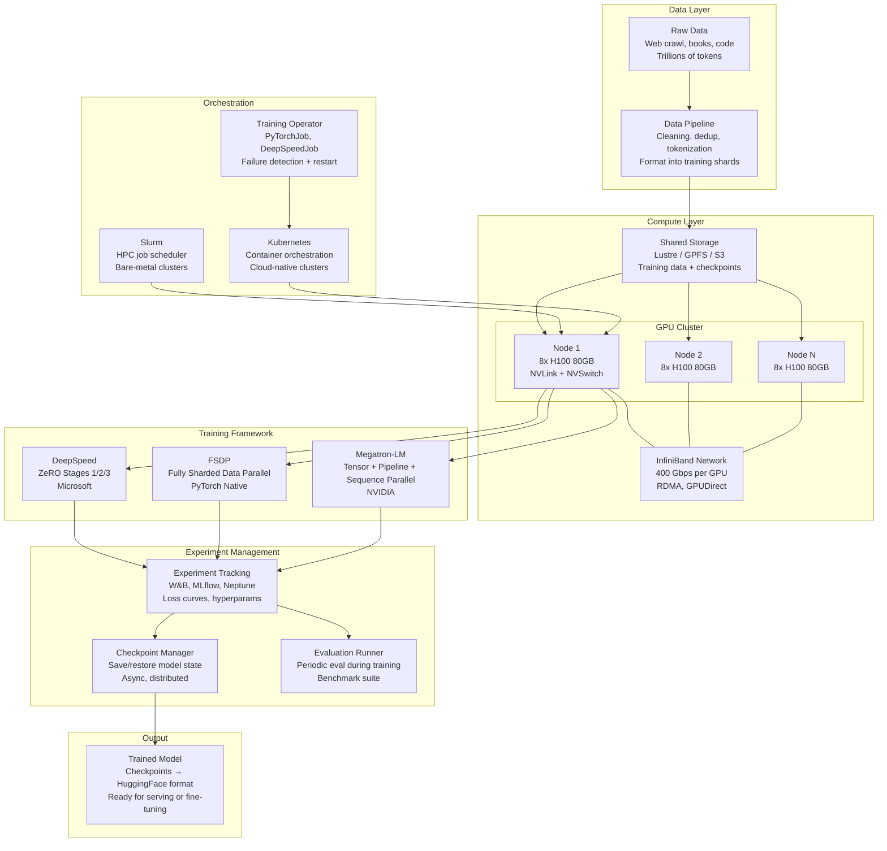
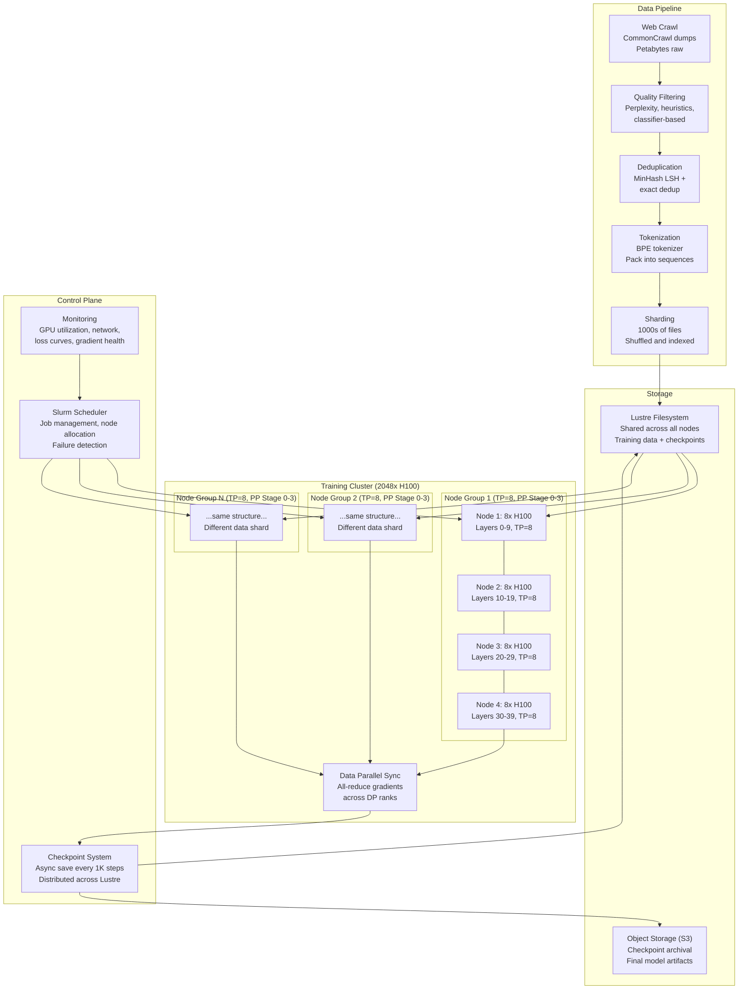
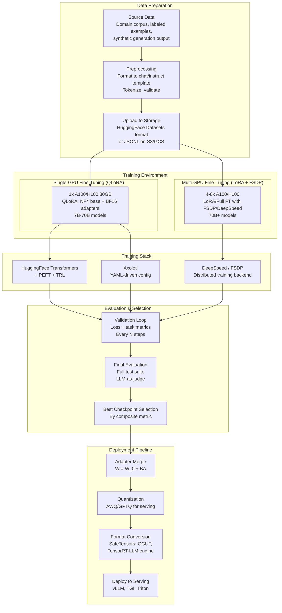

# Training Infrastructure

## 1. Overview

Training infrastructure is the hardware, software, and orchestration layer that enables training and fine-tuning of large language models. For Principal AI Architects, training infrastructure decisions determine whether a training run succeeds or fails, how much it costs, and how long it takes. A misconfigured distributed training setup can waste hundreds of thousands of dollars in GPU-hours while producing a diverged or corrupted model. A well-architected training pipeline with proper fault tolerance can recover from hardware failures mid-run without losing progress.

The scale of modern LLM training is difficult to overstate. Training a 70B-parameter model on 15 trillion tokens requires approximately 1 million H100 GPU-hours -- that is 1,000 GPUs running continuously for 6 weeks, consuming ~$20-30M in compute. Training a 405B model costs $50M-$100M+. At these scales, training infrastructure is not just an engineering concern but a financial one: a 10% improvement in training efficiency saves millions of dollars.

The infrastructure landscape has converged on a few key frameworks (DeepSpeed, FSDP, Megatron-LM), orchestration systems (Slurm, Kubernetes), and supporting tools (experiment tracking, checkpointing, data pipelines). Understanding when and how to use each is critical for both pre-training and fine-tuning at scale.

**Key numbers that drive infrastructure decisions:**
- Single H100 GPU: ~$2-3/hour (cloud), 3958 TFLOPS FP8, 80 GB HBM3
- Single A100 GPU: ~$1.50-2/hour (cloud), 624 TFLOPS BF16, 80 GB HBM2e
- Pre-training 7B model: ~100K H100 GPU-hours, $200K-$500K, 1-2 weeks on 256 GPUs
- Pre-training 70B model: ~1M H100 GPU-hours, $2M-$5M, 4-8 weeks on 2,048 GPUs
- Pre-training 405B model: ~5-10M H100 GPU-hours, $50M-$100M+, 3-6 months on 16,384 GPUs
- Fine-tuning (LoRA) 70B model: 1 GPU, 4-24 hours, $10-$100
- GPU failure rate at scale: ~0.1-1% per day per GPU in a 10,000 GPU cluster. Without fault tolerance, a training run on 1,000 GPUs will encounter a failure approximately every 1-10 days
- Network bandwidth requirement: 400 Gbps InfiniBand per GPU for efficient data-parallel training at 1,000+ GPU scale

---

## 2. Where It Fits in GenAI Systems

Training infrastructure is the foundation layer that produces trained models. It sits upstream of everything else in the GenAI stack -- every model that is deployed, served, and used in production was produced by a training pipeline. Training infrastructure encompasses GPU clusters, distributed training frameworks, data pipelines, experiment tracking, and orchestration.



**Upstream dependencies:** Training data (quality, quantity, format) and model architecture (parameter count, layer configuration) determine infrastructure requirements. The data pipeline must produce tokenized, shuffled, sharded data that can be streamed to GPUs without I/O bottlenecks.

**Downstream consumers:** The trained model (checkpoints) is consumed by the fine-tuning pipeline (for further adaptation), quantization pipeline (for compression), and serving infrastructure (for deployment).

**Cross-references:** [Model Parallelism](../02-llm-architecture/06-model-parallelism.md) | [GPU Compute](../02-llm-architecture/02-gpu-compute.md) | [Fine-Tuning](02-fine-tuning.md) | [Distillation](03-distillation.md)

---

## 3. Core Concepts

### 3.1 DeepSpeed ZeRO (Zero Redundancy Optimizer)

DeepSpeed ZeRO (Rajbhandari et al., Microsoft, 2020) eliminates memory redundancy in data-parallel training by partitioning optimizer states, gradients, and parameters across GPUs. In standard data parallelism, every GPU holds a full copy of the model, optimizer states, and gradients -- meaning 75%+ of GPU memory is redundant. ZeRO removes this redundancy through three progressive stages.

**ZeRO Stage 1: Optimizer State Partitioning**
- Partitions optimizer states (momentum and variance in AdamW) across data-parallel GPUs
- Each GPU stores only 1/N of the optimizer states (where N = number of GPUs)
- Gradients and model parameters remain replicated on all GPUs
- Memory reduction: ~4x on optimizer states (from 12 bytes/param to ~4 bytes/param per GPU)
- Communication: same as standard data parallelism (all-reduce on gradients)
- Best for: moderate model sizes (7B-13B) where optimizer states are the memory bottleneck

**Memory per GPU (70B model, 64 GPUs):**

| Component | Standard DDP | ZeRO Stage 1 |
|---|---|---|
| Parameters (BF16) | 140 GB | 140 GB |
| Gradients (BF16) | 140 GB | 140 GB |
| Optimizer states (FP32) | 560 GB | 560/64 = 8.75 GB |
| **Total** | **840 GB** | **~289 GB** |

**ZeRO Stage 2: Gradient Partitioning**
- Partitions both optimizer states and gradients across GPUs
- Each GPU computes gradients for all parameters but only retains 1/N of them after the reduce-scatter
- Memory reduction: ~8x on optimizer + gradient memory
- Communication: reduce-scatter (same volume as all-reduce, slightly different pattern)
- Best for: 13B-70B models, most commonly used stage for fine-tuning

**Memory per GPU (70B model, 64 GPUs):**

| Component | Standard DDP | ZeRO Stage 2 |
|---|---|---|
| Parameters (BF16) | 140 GB | 140 GB |
| Gradients (BF16) | 140 GB | 140/64 = 2.19 GB |
| Optimizer states (FP32) | 560 GB | 560/64 = 8.75 GB |
| **Total** | **840 GB** | **~151 GB** |

**ZeRO Stage 3: Parameter Partitioning**
- Partitions everything: optimizer states, gradients, and model parameters
- Each GPU stores only 1/N of all components
- During forward/backward pass, parameters are gathered on-demand (all-gather before each layer, discard after)
- Memory reduction: linear with GPU count -- a 70B model on 64 GPUs uses ~13 GB per GPU for model state
- Communication: 1.5x the volume of standard data parallelism (extra all-gather for parameters)
- Best for: very large models (70B+) or memory-constrained hardware

**Memory per GPU (70B model, 64 GPUs):**

| Component | Standard DDP | ZeRO Stage 3 |
|---|---|---|
| Parameters (BF16) | 140 GB | 140/64 = 2.19 GB |
| Gradients (BF16) | 140 GB | 140/64 = 2.19 GB |
| Optimizer states (FP32) | 560 GB | 560/64 = 8.75 GB |
| **Total** | **840 GB** | **~13 GB** |

This is how a 70B model's training state fits on a cluster of GPUs with 80 GB each. The remaining memory is available for activations (which can be further reduced with activation checkpointing).

**ZeRO-Infinity: Offloading to CPU and NVMe**
- Extends ZeRO Stage 3 by offloading partitioned state to CPU memory (DRAM) and NVMe SSDs
- Enables training models that exceed aggregate GPU memory by using the CPU-GPU memory hierarchy
- Tradeoff: significantly slower due to CPU-GPU data transfer and NVMe I/O
- Use case: training very large models on limited GPU hardware (e.g., a single 8-GPU node training a 70B model by offloading to 1TB CPU RAM)
- Practical impact: 2-10x slowdown vs pure GPU training, but enables training that would otherwise be impossible

**DeepSpeed configuration (ZeRO Stage 3):**
```json
{
  "zero_optimization": {
    "stage": 3,
    "offload_optimizer": {"device": "none"},
    "offload_param": {"device": "none"},
    "overlap_comm": true,
    "contiguous_gradients": true,
    "sub_group_size": 1e9,
    "reduce_bucket_size": "auto",
    "stage3_prefetch_bucket_size": "auto",
    "stage3_param_persistence_threshold": "auto",
    "stage3_max_live_parameters": 1e9,
    "stage3_max_reuse_distance": 1e9
  },
  "bf16": {"enabled": true},
  "gradient_accumulation_steps": 8,
  "gradient_clipping": 1.0,
  "train_micro_batch_size_per_gpu": 1,
  "wall_clock_breakdown": false
}
```

### 3.2 FSDP (Fully Sharded Data Parallel)

FSDP (PyTorch, 2022) is PyTorch's native answer to DeepSpeed ZeRO Stage 3. It shards model parameters, gradients, and optimizer states across data-parallel workers, gathering parameters on-demand during forward and backward passes.

**FSDP vs DeepSpeed ZeRO:**

| Dimension | DeepSpeed ZeRO | PyTorch FSDP |
|---|---|---|
| Origin | Microsoft Research | Meta / PyTorch Core |
| Integration | Separate library, wraps PyTorch | Native PyTorch (torch.distributed.fsdp) |
| Sharding | ZeRO Stages 1/2/3, configurable | Full sharding (equivalent to ZeRO-3), configurable |
| Offloading | CPU + NVMe (ZeRO-Infinity) | CPU offloading (limited NVMe support) |
| Mixed precision | Custom implementation | Native PyTorch AMP integration |
| Activation checkpointing | Integrated | PyTorch native (checkpoint_wrapper) |
| Composability | External to PyTorch, can conflict with other PyTorch features | Native, composes with torch.compile, DTensor |
| Ecosystem | HuggingFace Accelerate, many research repos | HuggingFace Accelerate, TorchTitan, LitGPT |
| Maturity | More mature, battle-tested at extreme scale | Rapidly maturing, Meta uses FSDP2 for LLaMA training |
| Debugging | DeepSpeed-specific tooling | Standard PyTorch debugging tools |

**FSDP2 (PyTorch 2.x):** The next-generation FSDP built on DTensor, providing per-parameter sharding (vs per-module in FSDP1), better composability with torch.compile, and more efficient memory management. Meta used FSDP2 (via TorchTitan) for LLaMA 3 training.

**When to choose FSDP vs DeepSpeed:**
- **FSDP** when: you want native PyTorch integration, are using torch.compile, or are building on Meta's training stack (TorchTitan). Preferred for new projects.
- **DeepSpeed** when: you need ZeRO-Infinity (NVMe offloading), have existing DeepSpeed configs, or need DeepSpeed-specific features (MoE training support, curriculum learning integration).

### 3.3 Megatron-LM (NVIDIA)

Megatron-LM is NVIDIA's framework for training very large language models (100B+ parameters). It provides three complementary parallelism strategies that can be composed.

**Tensor Parallelism (TP):**
- Splits individual weight matrices across GPUs within a node
- For a linear layer W of shape [d_in, d_out], TP splits along the output dimension: GPU 0 holds W[:, :d_out/TP], GPU 1 holds W[:, d_out/TP:2*d_out/TP], etc.
- Requires high-bandwidth interconnect (NVLink within a node: 900 GB/s on H100)
- Typical TP degree: 2, 4, or 8 (matching GPUs per node)
- Reduces per-GPU memory linearly but adds all-reduce communication per layer

**Pipeline Parallelism (PP):**
- Splits model layers across GPUs (or groups of GPUs)
- GPU 0 holds layers 0-9, GPU 1 holds layers 10-19, etc.
- Introduces pipeline bubbles (GPUs idle while waiting for activations from previous stages)
- Micro-batching reduces bubble overhead: split a batch into micro-batches that flow through the pipeline
- Bubble fraction ≈ (PP-1) / (micro_batches + PP - 1). With PP=8 and 32 micro-batches: 7/39 ≈ 18% overhead
- Useful for models too large for TP alone (TP is limited to intra-node, PP spans nodes)

**Sequence Parallelism (SP):**
- Splits the sequence dimension across TP ranks for operations that are not parallelized by TP (LayerNorm, Dropout)
- Without SP, these operations are replicated across all TP ranks, wasting memory
- SP eliminates this redundancy, saving activation memory proportional to the TP degree
- Always used in combination with TP

**Context Parallelism (CP):**
- Splits long sequences across GPUs for attention computation
- Uses Ring Attention or similar algorithms to compute attention across distributed sequence chunks
- Enables training on very long sequences (100K+ tokens) that would not fit in a single GPU's memory
- Communication: each GPU sends KV chunks to neighbors in a ring pattern

**Megatron-LM parallelism composition:**

For a 405B model on 16,384 H100 GPUs:
- TP=8 (within each 8-GPU node, using NVLink)
- PP=16 (across 16 pipeline stages, using InfiniBand)
- DP=128 (128-way data parallelism, ZeRO Stage 1, using InfiniBand)
- Total: 8 * 16 * 128 = 16,384 GPUs

**When to use Megatron-LM:**
- Pre-training models >100B parameters
- Need maximum training throughput (Megatron-LM achieves the highest MFU -- Model FLOPS Utilization -- of any framework)
- Have NVIDIA GPU infrastructure with NVLink and InfiniBand
- Teams with deep distributed systems expertise (Megatron-LM has a steep learning curve)

### 3.4 Training Data Pipelines

The data pipeline must produce a continuous stream of tokenized, shuffled training data at a rate that matches or exceeds GPU consumption. A data pipeline bottleneck means GPUs sit idle, wasting expensive compute.

**Pipeline stages:**

**Stage 1: Collection**
- Web crawl (CommonCrawl): download, extract text, language filter
- Domain-specific sources: APIs (GitHub, arXiv), partnerships (publishers), internal data
- Scale: trillions of raw tokens, petabytes of raw data

**Stage 2: Cleaning**
- Quality filtering: perplexity scoring (using a smaller language model), heuristic filters (document length, symbol ratio, repetition), classifier-based filtering (trained on "high quality" vs "low quality" examples)
- Deduplication: exact dedup (hash-based), near-dedup (MinHash / SimHash at document level), URL dedup
- PII removal: regex patterns for emails, phone numbers, SSNs; NER-based person name detection
- Toxic content removal: classifier-based filtering using toxicity models
- Scale: trillions of tokens reduced to hundreds of billions after filtering

**Stage 3: Deduplication (detailed)**
Deduplication is critical -- training on duplicate data wastes compute and can cause memorization. Modern approaches:

| Method | Granularity | Technique | Compute Cost | Effectiveness |
|---|---|---|---|---|
| URL dedup | Document | Hash URL, remove duplicates | Very low | Catches exact reposts |
| Exact dedup | Document/paragraph | SHA-256 hash of normalized text | Low | Catches exact copies |
| MinHash LSH | Document | Locality-sensitive hashing on n-gram shingles | Moderate | Catches near-duplicates (>80% Jaccard similarity) |
| Suffix array | Substring | Find repeated substrings of length >N | High | Catches copied paragraphs within otherwise unique documents |
| SemDedup | Document | Embedding similarity clustering | Very high | Catches semantically similar but textually different documents |

**Stage 4: Tokenization**
- Apply the model's tokenizer (BPE, SentencePiece, Tiktoken) to convert text to token IDs
- Pack documents into fixed-length sequences (typically 2048 or 4096 tokens), separated by EOS tokens
- Create binary files for efficient streaming (NumPy memmap, Apache Arrow, or Megatron's indexed dataset format)

**Stage 5: Sharding and Shuffling**
- Divide the tokenized corpus into shards (thousands of files, each containing millions of tokens)
- Shuffle at multiple levels: shard order, document order within shards
- Ensure each data-parallel rank sees different data (deterministic seeding based on rank + epoch)

**Data pipeline tools:**
- **Datatrove** (HuggingFace): End-to-end pipeline for web crawl processing, used for FineWeb dataset
- **Dolma** (AI2): Data pipeline toolkit, used for OLMo training data
- **RedPajama** (Together AI): Pipeline for reproducing LLaMA-style training data
- **NeMo Data Curator** (NVIDIA): GPU-accelerated deduplication and quality filtering

### 3.5 Distributed Training Orchestration

**Slurm (Simple Linux Utility for Resource Management):**
The dominant job scheduler for HPC clusters used in LLM training. Slurm manages GPU allocation, job scheduling, and inter-node communication setup.

```bash
#!/bin/bash
#SBATCH --job-name=llama-70b-pretrain
#SBATCH --nodes=32
#SBATCH --ntasks-per-node=8
#SBATCH --gpus-per-node=8
#SBATCH --cpus-per-task=12
#SBATCH --mem=1024G
#SBATCH --time=168:00:00
#SBATCH --partition=gpu
#SBATCH --exclusive

export MASTER_ADDR=$(scontrol show hostnames $SLURM_JOB_NODELIST | head -n1)
export MASTER_PORT=29500

srun torchrun \
    --nnodes=$SLURM_NNODES \
    --nproc-per-node=8 \
    --rdzv-backend=c10d \
    --rdzv-endpoint=$MASTER_ADDR:$MASTER_PORT \
    train.py \
    --model-size 70b \
    --data-path /shared/data/tokenized \
    --checkpoint-dir /shared/checkpoints
```

**Kubernetes + Training Operators:**
For cloud-native infrastructure, Kubernetes with training operators (PyTorchJob, DeepSpeedJob from Kubeflow) manages distributed training.

Advantages over Slurm:
- Better integration with cloud providers (GKE, EKS, AKS)
- Dynamic scaling and resource management
- Container-based reproducibility
- Integration with MLOps tooling (Kubeflow, MLflow, Argo)

Disadvantages vs Slurm:
- Higher networking overhead (pod-to-pod networking is slower than bare-metal InfiniBand)
- More complex setup for high-performance training
- Less mature for very large-scale training (10,000+ GPU)

**Hybrid:** Many organizations use Slurm for large-scale pre-training (bare-metal, InfiniBand) and Kubernetes for fine-tuning and experimentation (cloud, flexible).

### 3.6 Compute Cost Estimates

**Pre-training cost breakdown (H100 GPUs, cloud pricing at ~$2.50/GPU-hour):**

| Model Size | Parameters | Training Tokens | GPU Config | Wall Time | GPU-Hours | Estimated Cost |
|---|---|---|---|---|---|---|
| 1B | 1B | 2T | 64x H100 | ~3 days | ~5K | $12K-$25K |
| 7B | 7B | 15T | 256x H100 | ~2 weeks | ~86K | $200K-$500K |
| 13B | 13B | 15T | 512x H100 | ~2 weeks | ~170K | $400K-$1M |
| 70B | 70B | 15T | 2,048x H100 | ~6 weeks | ~2M | $5M-$10M |
| 405B | 405B | 15T+ | 16,384x H100 | ~3 months | ~30M | $50M-$100M+ |

**Fine-tuning cost breakdown:**

| Method | Model Size | GPU Config | Wall Time | Cost |
|---|---|---|---|---|
| QLoRA | 7B | 1x A100 40GB | 2-4 hours | $3-$8 |
| QLoRA | 70B | 1x A100 80GB | 8-24 hours | $12-$48 |
| LoRA (FP16) | 7B | 1x A100 80GB | 1-3 hours | $2-$6 |
| LoRA (FP16) | 70B | 4x A100 80GB | 4-12 hours | $24-$96 |
| Full FT | 7B | 4x A100 80GB | 4-8 hours | $24-$64 |
| Full FT | 70B | 16x A100 80GB | 2-7 days | $1.2K-$5.4K |

**Cost optimization levers:**
1. **Spot/preemptible instances:** 60-80% cost reduction, but requires robust checkpointing (instances can be terminated at any time)
2. **Reserved instances:** 30-50% cost reduction for committed usage
3. **Cloud provider selection:** Lambda Labs, CoreWeave, and Vast.ai typically offer 30-50% lower GPU pricing than AWS/GCP/Azure
4. **Training efficiency:** Higher MFU (Model FLOPS Utilization) means fewer GPU-hours. Target MFU: 40-55% for standard setups, 55-65% for highly optimized (Megatron-LM)
5. **Mixed-precision training:** BF16 compute with FP32 accumulation provides 2x throughput vs FP32

### 3.7 Checkpointing and Fault Tolerance

At scale, hardware failures are not exceptional events but routine occurrences. A 1,000-GPU cluster with a 0.1% daily failure rate per GPU will lose a GPU approximately every day. Without fault tolerance, training must restart from the beginning.

**Checkpointing strategies:**

| Strategy | Description | Overhead | Recovery Time |
|---|---|---|---|
| Synchronous full checkpoint | All ranks save full model + optimizer state | 5-15 min per checkpoint, training paused | Fast (reload and resume) |
| Asynchronous checkpoint | Checkpointing runs in background while training continues | 1-2% throughput reduction | Fast |
| Sharded checkpoint | Each rank saves only its shard (ZeRO-3/FSDP) | Faster save (parallel I/O) | Requires same number of ranks to reload (or resharding) |
| Incremental checkpoint | Save only delta from previous checkpoint | Small saves after first full save | Requires full checkpoint + all deltas |

**Checkpoint frequency tradeoffs:**
- Too frequent: high I/O overhead, slows training (especially with slow shared filesystem)
- Too infrequent: lose more work when failures occur
- Typical: every 500-2,000 training steps, plus at end of each epoch
- At large scale: async checkpointing every 1,000 steps (~30-60 minutes of training)

**Fault tolerance mechanisms:**

1. **Elastic training (torch.distributed.elastic / torchrun):** Automatically detects node failures and restarts training with the remaining healthy nodes. The training run continues with fewer GPUs (effective batch size decreases) until the failed node is replaced.

2. **Redundant computation:** In pipeline parallelism, compute each pipeline stage on two sets of GPUs. If one fails, the other takes over. Doubles GPU cost but provides instant failover.

3. **Checkpoint-based recovery:** The standard approach. When a failure is detected, the orchestrator kills the job, replaces the failed node, and restarts from the last checkpoint. Total downtime: 5-30 minutes (node replacement + checkpoint loading).

4. **In-memory redundancy (DeepSpeed):** Keep a copy of each shard's state on a partner GPU. If a GPU fails, its partner has the data. Avoids filesystem I/O for recovery.

**Practical checkpoint storage:**
- Large models produce massive checkpoints: a 70B model's full checkpoint (params + optimizer + gradients) is ~1.2 TB
- Shared filesystem (Lustre, GPFS) must sustain high write throughput from all ranks simultaneously
- Cloud object storage (S3, GCS) is cheaper but slower; use for long-term archival, not frequent checkpointing
- Best practice: checkpoint to fast local NVMe first, then async copy to shared/cloud storage

### 3.8 Experiment Tracking

**Weights & Biases (W&B):**
The dominant experiment tracking platform for LLM training. Tracks loss curves, learning rate schedules, gradient norms, evaluation metrics, hyperparameters, GPU utilization, and system metrics.

Key features for LLM training:
- Distributed training support: aggregate metrics from all ranks
- Large-scale visualization: millions of data points per run
- Artifact versioning: track datasets and checkpoints as versioned artifacts
- Sweeps: distributed hyperparameter search
- Reports: shareable analysis documents
- Pricing: free for individuals, paid for teams ($50/user/month for Standard)

**MLflow:**
Open-source experiment tracking with strong enterprise support (Databricks). Tracks parameters, metrics, and artifacts. MLflow Model Registry provides model versioning and staging.

Key advantages over W&B:
- Self-hosted (no data egress, important for regulated industries)
- Free and open-source
- Strong Databricks integration
- Model Registry for production model management

Key disadvantages vs W&B:
- Less polished UI for real-time training monitoring
- Fewer built-in integrations with training frameworks
- Less community adoption in the LLM training community

**Neptune:**
Cloud-hosted experiment tracking focused on enterprise use cases. Strong metadata management, comparison views, and collaboration features.

**Practical integration (W&B + HuggingFace Trainer):**
```python
from transformers import TrainingArguments

training_args = TrainingArguments(
    output_dir="./output",
    report_to="wandb",
    run_name="llama-70b-lora-r16-medical",
    logging_steps=10,
    # W&B automatically tracks: loss, learning rate, gradient norm,
    # GPU memory, throughput, eval metrics
)
# W&B run is automatically initialized and tracked
```

---

## 4. Architecture

### 4.1 Large-Scale Pre-Training Architecture



### 4.2 Fine-Tuning Infrastructure Architecture



---

## 5. Design Patterns

### Pattern 1: Two-Phase Training Pipeline
Separate pre-training from post-training into distinct infrastructure pipelines. Pre-training uses bare-metal HPC clusters with Slurm, InfiniBand, and Megatron-LM for maximum throughput. Post-training (SFT + RLHF/DPO) uses smaller Kubernetes-based clusters with DeepSpeed/FSDP for flexibility and rapid iteration. This reflects the different optimization priorities: pre-training optimizes for throughput (tokens/second), post-training optimizes for iteration speed (experiments/day).

### Pattern 2: Checkpoint-First Fault Tolerance
Design the training pipeline around the assumption that failures will occur. Implement async checkpointing from day one. Store checkpoints on both fast local storage (for quick reload) and durable cloud storage (for archival). Test recovery from checkpoint before starting long training runs. Monitor checkpoint integrity with hash verification.

### Pattern 3: Staged Infrastructure Scaling
Start fine-tuning experiments on a single GPU with QLoRA. Once the approach is validated, scale to multi-GPU LoRA with FSDP for faster iteration and higher quality. Only invest in full fine-tuning infrastructure when PEFT methods demonstrably underperform. This staged approach prevents over-investing in infrastructure before the approach is proven.

### Pattern 4: Data Pipeline Decoupling
Decouple the data pipeline from the training pipeline. The data pipeline runs asynchronously, producing tokenized data shards that are consumed by the training pipeline via streaming. This ensures the training pipeline is never blocked by data processing and allows independent scaling and iteration of each pipeline.

### Pattern 5: Reproducible Training Environments
Use containers (Docker) with pinned dependency versions for all training runs. Track the exact container image, code commit, data version, and config file for every experiment. This enables reproducing any past experiment exactly, which is critical for debugging training failures and for compliance/audit requirements.

---

## 6. Implementation Approaches

### Approach 1: DeepSpeed + HuggingFace Accelerate

The most common stack for fine-tuning at moderate scale (1-64 GPUs).

```python
# accelerate_config.yaml
compute_environment: LOCAL_MACHINE
distributed_type: DEEPSPEED
deepspeed_config:
  deepspeed_multinode_launcher: standard
  zero_optimization:
    stage: 2
    offload_optimizer_device: none
    offload_param_device: none
  gradient_accumulation_steps: 8
  gradient_clipping: 1.0
  train_micro_batch_size_per_gpu: 1
  bf16:
    enabled: true
num_machines: 1
num_processes: 8
```

Launch: `accelerate launch --config_file accelerate_config.yaml train.py`

### Approach 2: TorchTitan (Meta's Training Framework)

Meta's reference implementation for large-scale training, used for LLaMA 3. Built on FSDP2, DTensor, and torch.compile.

```python
# torchtitan config (TOML)
[model]
name = "llama3"
flavor = "70B"

[training]
steps = 100000
compile = true

[parallelism]
dp_shard = 64      # FSDP sharding
dp_replicate = 1
tp = 8             # Tensor parallelism
pp = 4             # Pipeline parallelism

[checkpoint]
interval = 1000
async_mode = "async"
```

TorchTitan provides native torch.compile integration, achieving 5-15% speedup through kernel fusion. It is the reference for how to build a training pipeline using modern PyTorch primitives.

### Approach 3: NeMo Framework (NVIDIA)

NVIDIA's end-to-end training framework built on Megatron-LM, optimized for NVIDIA GPU clusters.

Key capabilities:
- Megatron-LM parallelism (TP+PP+DP+SP+CP) pre-configured for common model sizes
- Data pipeline tools (NeMo Data Curator) for web-scale data processing
- Integrated experiment tracking and model management
- Pre-built recipes for LLaMA, Mistral, Gemma, and other architectures
- NeMo-Aligner for RLHF/DPO training

Best for: organizations with NVIDIA DGX infrastructure and enterprise support contracts.

### Approach 4: Cloud Managed Training

| Service | Provider | Strengths | Limitations |
|---|---|---|---|
| SageMaker Training | AWS | Deep AWS integration, spot instance support | Limited to AWS GPUs, less flexible than self-managed |
| Vertex AI Training | Google Cloud | TPU support, GKE integration | GCP lock-in |
| Azure ML | Microsoft | DeepSpeed integration (natural fit), Azure GPU access | Azure-specific |
| Lambda Cloud | Lambda Labs | Cheapest H100s (~$2/hr), simple GPU VMs | No managed training -- you manage everything |
| CoreWeave | CoreWeave | GPU-native cloud, InfiniBand networking | Smaller provider, less enterprise tooling |
| RunPod | RunPod | Cheapest spot GPUs, Serverless GPU option | Less reliable than major clouds |

---

## 7. Tradeoffs

### Distributed Training Framework Selection

| Criterion | DeepSpeed ZeRO | PyTorch FSDP | Megatron-LM |
|---|---|---|---|
| Setup complexity | Moderate (config file) | Moderate (API-based) | High (requires understanding TP+PP+DP) |
| Maximum training scale | 10,000+ GPUs | 10,000+ GPUs (Meta uses for LLaMA) | 100,000+ GPUs (designed for maximum scale) |
| Training throughput (MFU) | 35-50% | 40-55% (with torch.compile) | 50-65% (highest, optimized kernels) |
| Offloading (CPU/NVMe) | Excellent (ZeRO-Infinity) | Limited (CPU only) | Not supported |
| HuggingFace integration | Excellent (Accelerate) | Excellent (Accelerate) | Moderate (NeMo wrapper) |
| Fine-tuning suitability | Excellent | Excellent | Overkill for fine-tuning |
| Pre-training suitability | Good | Good (used for LLaMA 3) | Best (designed for this) |
| Debugging ease | Moderate | Good (native PyTorch tools) | Difficult |

### Orchestration Selection

| Criterion | Slurm | Kubernetes | Managed Service |
|---|---|---|---|
| Networking performance | Best (bare-metal InfiniBand) | Good (RDMA plugin available) | Varies |
| Setup complexity | Moderate (well-documented for HPC) | High (need GPU operators, network plugins) | Low |
| Elastic scaling | Limited (static allocation) | Good (node auto-scaling) | Best |
| Failure recovery | Manual (resubmit job) | Better (pod restart policies) | Automatic |
| Multi-tenancy | Good (partition-based) | Excellent (namespace isolation) | Excellent |
| Best for | Pre-training on dedicated hardware | Fine-tuning at moderate scale, cloud | Teams without infra expertise |

### Checkpointing Strategy

| Criterion | Synchronous | Asynchronous | Offloaded (CPU→S3) |
|---|---|---|---|
| Training throughput impact | 5-15% (pauses training) | 1-2% (background copy) | <1% (fully background) |
| Recovery speed | Fast (checkpoint on fast storage) | Fast | Slow (download from S3) |
| Storage cost | High (fast filesystem is expensive) | High | Low (S3 is cheap) |
| Implementation complexity | Low | Moderate | Moderate |
| Data loss on failure | Up to 1 checkpoint interval | Up to 1 checkpoint interval | Up to 1 checkpoint interval |

---

## 8. Failure Modes

### 8.1 Training Loss Divergence
**Symptom:** Loss suddenly spikes to infinity or NaN, training cannot recover.
**Cause:** Learning rate too high, data corruption (malformed samples), gradient explosion from outlier samples, numerical instability in mixed-precision training.
**Mitigation:** Gradient clipping (max norm 1.0), learning rate warmup, data validation pipeline, BF16 (wider dynamic range than FP16), save checkpoints frequently enough to roll back to before the spike.

### 8.2 GPU Memory OOM (Out of Memory)
**Symptom:** CUDA out of memory error, training crashes.
**Cause:** Batch size too large, activation memory exceeding GPU capacity (especially on long sequences), memory fragmentation.
**Mitigation:** Reduce micro-batch size, enable activation checkpointing, increase ZeRO stage, use gradient accumulation, enable FlashAttention (reduces activation memory from O(n^2) to O(n)).

### 8.3 Communication Bottleneck
**Symptom:** GPU utilization is low (20-40%) despite large batch sizes. Training throughput does not scale linearly with GPU count.
**Cause:** Network bandwidth insufficient for the communication pattern. Common when using InfiniBand-less networking or when tensor parallelism is used across nodes (should only be used within a node).
**Mitigation:** Ensure InfiniBand for inter-node communication. Keep TP within a single node (NVLink). Use gradient accumulation to reduce all-reduce frequency. Overlap communication with computation (DeepSpeed and FSDP do this automatically).

### 8.4 Data Pipeline Starvation
**Symptom:** GPU utilization periodically drops to 0% while waiting for data. Training throughput is inconsistent.
**Cause:** Data pipeline cannot produce tokenized batches fast enough. Common with on-the-fly tokenization or slow shared filesystem.
**Mitigation:** Pre-tokenize all data offline. Use memory-mapped files or streaming datasets. Ensure sufficient DataLoader workers. Use fast local storage (NVMe) for frequently accessed data.

### 8.5 Checkpoint Corruption
**Symptom:** Training cannot resume from checkpoint -- shape mismatch, missing keys, NaN values in restored state.
**Cause:** Checkpointing interrupted by failure, filesystem corruption, mismatch between saving and loading parallelism config.
**Mitigation:** Verify checkpoint integrity after saving (hash comparison). Keep at least 2 recent checkpoints (if latest is corrupt, fall back to previous). Use atomic writes (write to temp file, rename on success). Store checkpoint metadata (parallelism config, step number, data position).

### 8.6 Silent Data Corruption
**Symptom:** Training completes but model quality is poor. Loss curve looks normal but evaluation metrics are bad.
**Cause:** Data pipeline bug that produces incorrect labels, truncated sequences, or misaligned instruction/response pairs. Data contamination with evaluation data.
**Mitigation:** Validate data pipeline output by manually inspecting 50-100 samples before training. Run sanity checks: sequence lengths, token distributions, response/instruction ratios. Decontaminate against evaluation benchmarks.

### 8.7 Node Failure During Training
**Symptom:** One or more nodes become unresponsive. NCCL timeout errors. Training hangs or crashes.
**Cause:** GPU hardware failure, memory error, network partition, OS crash.
**Mitigation:** Elastic training (torchrun with --max-restarts). Health monitoring on all nodes. Automatic job resubmission from latest checkpoint. Spare node pool for hot replacement.

---

## 9. Optimization Techniques

### 9.1 Maximizing Model FLOPS Utilization (MFU)
MFU measures what fraction of the GPU's theoretical peak FLOPS is actually used for useful computation. Typical MFU:
- Naive implementation: 20-30%
- Optimized (FlashAttention, torch.compile): 40-55%
- Highly optimized (Megatron-LM, custom kernels): 55-65%
- Theoretical maximum (accounting for communication): ~70-75%

Key optimizations:
- FlashAttention 2/3: fused attention kernel, reduces memory I/O
- torch.compile: fuses element-wise operations, reduces kernel launch overhead
- Optimal parallelism configuration: minimize communication relative to computation
- Large batch sizes: more computation per communication round

### 9.2 Communication-Computation Overlap
Overlap gradient all-reduce with the backward pass of subsequent layers. While GPU computes gradients for layer N, it simultaneously sends gradients for layer N+1 over the network. DeepSpeed and FSDP implement this automatically, but tuning bucket sizes affects effectiveness.

### 9.3 Activation Checkpointing
Instead of storing all intermediate activations during the forward pass (for use in the backward pass), recompute them on-the-fly during the backward pass. Trades ~33% extra compute for ~60-70% activation memory reduction. Critical for training large models on limited GPU memory.

**Selective checkpointing:** Only checkpoint the most memory-intensive layers (attention layers with O(n^2) activation size) while retaining activations for cheaper layers (FFN, LayerNorm). This provides most of the memory savings with less compute overhead than full checkpointing.

### 9.4 Mixed-Precision Training
Use BF16 for compute and FP32 for accumulation. On H100, use FP8 for matrix multiplications with BF16 for sensitive operations. The throughput benefit is 2x (BF16 vs FP32) or 4x (FP8 vs FP32) with minimal quality impact.

### 9.5 Efficient Data Loading
- Pre-tokenize all data into memory-mapped binary formats
- Use multiple DataLoader workers (4-8 per GPU)
- Prefetch next batch while current batch is being processed
- Use local NVMe for frequently accessed data, shared filesystem only for cold data
- Stream data instead of loading entire dataset into memory

### 9.6 Learning Rate Scheduling
- Cosine decay with warmup is the standard for pre-training
- Warmup: 0.5-2% of total steps (prevents early divergence)
- WSD (Warmup-Stable-Decay): newer schedule used by MiniCPM, warms up, holds constant, then decays. Allows checkpointing at the end of the stable phase and creating multiple decay branches
- For fine-tuning: linear decay or constant with cosine decay at the end

### 9.7 Gradient Accumulation
Simulate large effective batch sizes on limited GPU memory by accumulating gradients over multiple micro-batches before performing an optimizer step. The effective batch size = micro_batch_size * gradient_accumulation_steps * num_GPUs. This is mathematically equivalent to training with the full batch (assuming no BatchNorm, which LLMs do not use).

---

## 10. Real-World Examples

### Meta: LLaMA 3 Training Infrastructure
Meta trained LLaMA 3.1 405B on a cluster of 16,384 H100 GPUs using a custom training stack built on FSDP2 (TorchTitan), with 4D parallelism (TP=8, PP=16, CP=8, DP=16). They achieved ~38-43% MFU on 405B training. The training data pipeline processed 15 trillion tokens through a multi-stage filtering pipeline. They reported 466 job interruptions during the 54-day training run of 405B, with a mean recovery time of ~40 minutes per interruption. The training infrastructure included custom NCCL modifications for improved all-reduce performance and automatic health monitoring that detected and replaced failing nodes.

### Google DeepMind: Gemini Training on TPUs
Google trained Gemini models on TPU v4 and v5 pods, using their custom Jax/Pax training framework. TPU pods provide high-bandwidth interconnect (ICI: Inter-Chip Interconnect) that enables efficient tensor parallelism across hundreds of chips. Google's training infrastructure is vertically integrated: custom hardware (TPU), custom interconnect (ICI), custom framework (Jax/Pax), and custom orchestration (Borg). This vertical integration enables training efficiency that is difficult to replicate on commodity hardware.

### Mistral AI: Efficient Training at Startup Scale
Mistral AI trained their 7B and 8x7B (Mixtral) models on relatively modest infrastructure compared to Meta and Google. Mixtral 8x7B was trained on a cluster of NVIDIA A100 GPUs using a Megatron-LM-based training pipeline. They demonstrated that architectural innovation (Mixture of Experts) can reduce training compute requirements while maintaining competitive quality. Their infrastructure investment was estimated at $10-20M, a fraction of Meta's or Google's.

### EleutherAI / AI2: Open-Source Training at Scale
AI2 trained OLMo (Open Language Model) using the Dolma dataset pipeline and a custom training framework on AMD MI250X GPUs. The entire training pipeline -- data, code, weights, evaluation -- was released publicly. EleutherAI's GPT-NeoX framework (based on Megatron-LM) has been used by dozens of research groups to train models up to 20B parameters on multi-node GPU clusters.

### Databricks: MosaicML Training Platform
Databricks (via MosaicML acquisition) offers a managed training platform that handles distributed training orchestration, checkpointing, and fault tolerance. Their Composer library provides optimized training recipes and their DBRX model was trained using their own infrastructure. They demonstrated training a 7B model for ~$1,000 and a 13B model for ~$5,000 on their optimized stack, significantly below typical costs through careful engineering of MFU and data pipeline efficiency.

---

## 11. Related Topics

- **[Model Parallelism](../02-llm-architecture/06-model-parallelism.md):** Detailed treatment of tensor, pipeline, data, and sequence parallelism -- the building blocks of distributed training.
- **[GPU Compute](../02-llm-architecture/02-gpu-compute.md):** GPU architecture, memory hierarchy, and compute capabilities that determine training performance.
- **[Fine-Tuning](02-fine-tuning.md):** Fine-tuning consumes training infrastructure, typically at smaller scale than pre-training.
- **[Distillation](03-distillation.md):** Training smaller models from larger teacher models -- a use case for training infrastructure.
- **[Quantization](../02-llm-architecture/03-quantization.md):** QLoRA fine-tuning depends on quantization for memory efficiency during training.
- **[Model Serving](../02-llm-architecture/01-model-serving.md):** The trained model must be converted to a serving format and deployed on inference infrastructure.

---

## 12. Source Traceability

| Concept | Primary Source | Year |
|---|---|---|
| DeepSpeed ZeRO | Rajbhandari et al., "ZeRO: Memory Optimizations Toward Training Trillion Parameter Models" (Microsoft) | 2020 |
| ZeRO-Infinity | Rajbhandari et al., "ZeRO-Infinity: Breaking the GPU Memory Wall for Extreme Scale Deep Learning" | 2021 |
| FSDP | Zhao et al., "PyTorch FSDP: Experiences on Scaling Fully Sharded Data Parallel" (Meta) | 2023 |
| Megatron-LM | Shoeybi et al., "Megatron-LM: Training Multi-Billion Parameter Language Models Using Model Parallelism" (NVIDIA) | 2019 |
| Megatron-LM v2 | Narayanan et al., "Efficient Large-Scale Language Model Training on GPU Clusters Using Megatron-LM" | 2021 |
| LLaMA 3 Training | Meta AI, "The Llama 3 Herd of Models" (training infrastructure details) | 2024 |
| TorchTitan | Meta PyTorch Team, TorchTitan: Training framework for LLaMA 3 | 2024 |
| FlashAttention | Dao et al., "FlashAttention: Fast and Memory-Efficient Exact Attention with IO-Awareness" | 2022 |
| FlashAttention-2 | Dao, "FlashAttention-2: Faster Attention with Better Parallelism and Work Partitioning" | 2023 |
| Chinchilla Scaling | Hoffmann et al., "Training Compute-Optimal Large Language Models" (DeepMind) | 2022 |
| Datatrove | HuggingFace, "Datatrove: Large-scale data processing" | 2024 |
| Dolma | Soldaini et al., "Dolma: An Open Corpus of Three Trillion Tokens" (AI2) | 2024 |
| OLMo | Groeneveld et al., "OLMo: Accelerating the Science of Language Models" (AI2) | 2024 |
| MosaicML Composer | Databricks, MosaicML Composer training library | 2023 |
| NeMo Framework | NVIDIA, NeMo: Toolkit for Conversational AI and LLM Training | 2023-present |
| Weights & Biases | Biewald, "Experiment Tracking with Weights and Biases" | 2020 |
| MLflow | Zaharia et al., "Accelerating the Machine Learning Lifecycle with MLflow" (Databricks) | 2018 |
