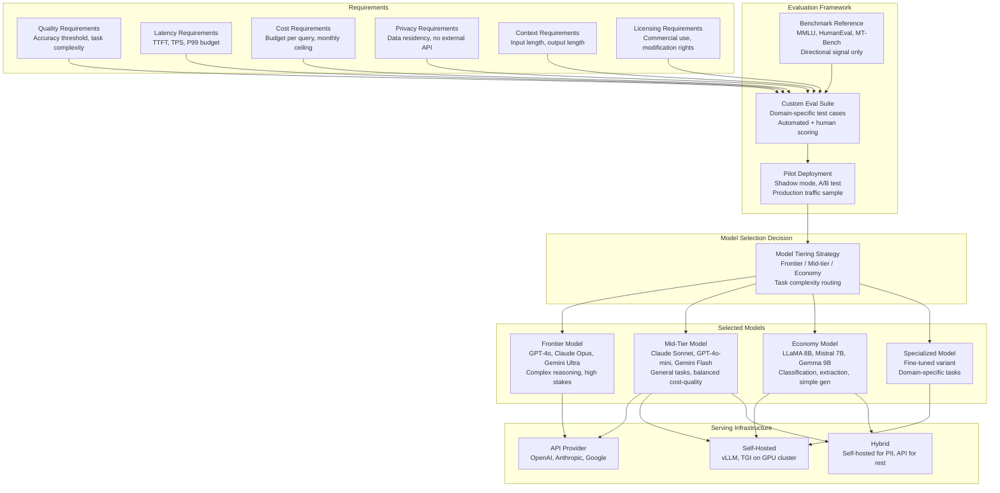
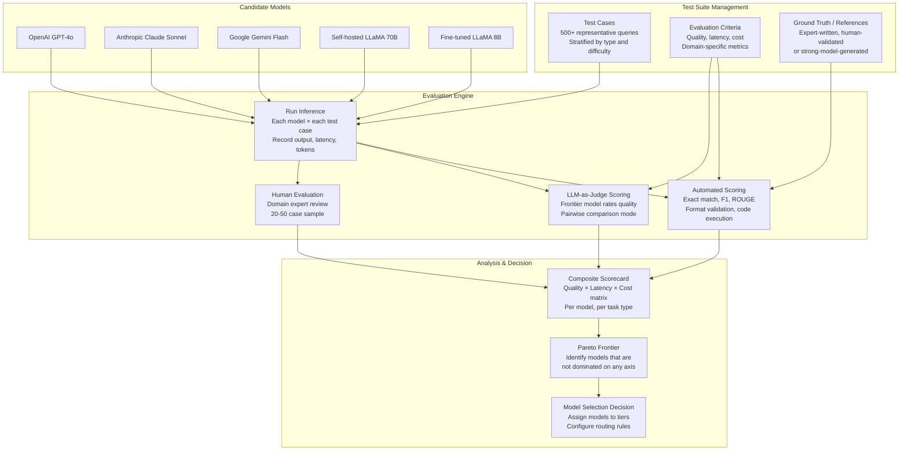
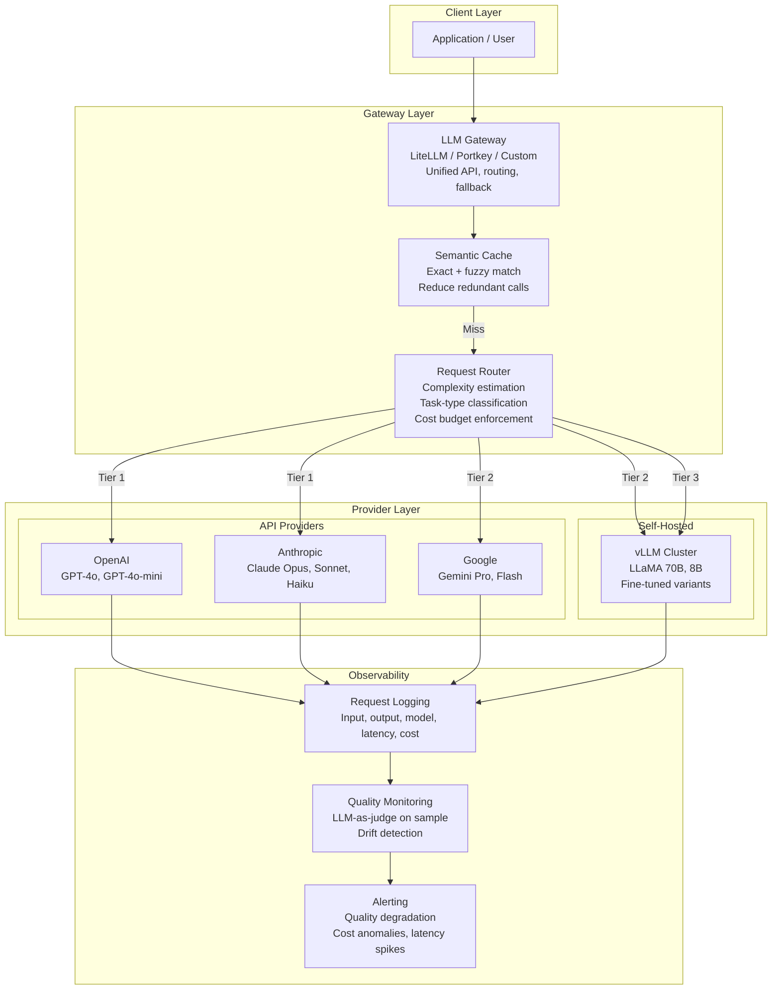

# Model Selection Criteria

## 1. Overview

Model selection is the architectural decision with the highest cost-quality leverage in any GenAI system. Choosing the wrong model can mean overpaying by 10-100x for equivalent quality, or deploying a model that is fundamentally incapable of the target task regardless of prompt engineering investment. For Principal AI Architects, model selection is not a one-time decision but an ongoing strategy that must account for a rapidly shifting landscape: new models release monthly, pricing changes quarterly, and the quality frontier advances continuously.

The core tension is a multi-dimensional optimization across cost, latency, quality, context length, licensing, privacy, and vendor risk. No single model wins on all dimensions. The architectural response is a tiered model strategy -- routing different request types to different models based on complexity, sensitivity, and cost tolerance -- combined with an evaluation framework that makes model swaps low-risk and data-driven.

**Key numbers that frame the decision space (as of early 2026):**
- GPT-4o: ~$2.50/$10.00 per 1M input/output tokens, ~500ms TTFT, state-of-the-art on most benchmarks
- Claude 3.5 Sonnet / Claude 4 Opus: $3/$15 per 1M tokens (Opus), strong reasoning and safety
- Gemini 2.0 Flash: ~$0.10/$0.40 per 1M tokens, competitive quality at 10-25x lower cost than frontier
- LLaMA 3.1 70B (self-hosted on 2x A100): ~$0.30-$0.80 per 1M tokens (amortized), zero data egress, full control
- LLaMA 3.1 8B (self-hosted on 1x A100): ~$0.05-$0.15 per 1M tokens, sufficient for classification and extraction
- The gap between the cheapest and most expensive option for equivalent quality can be 50-200x
- Benchmarks (MMLU, HumanEval, MT-Bench) correlate with real-world task performance at r=0.4-0.7 -- useful directionally, unreliable for final selection

---

## 2. Where It Fits in GenAI Systems

Model selection is an upstream architectural decision that constrains every downstream component: prompt design (must fit within the model's context window and instruction-following capability), serving infrastructure (GPU type and count), latency budget (model size determines generation speed), cost envelope (per-token pricing or GPU amortization), and privacy posture (API vs self-hosted).



**Upstream dependencies:** Business requirements (accuracy thresholds, latency SLAs, compliance constraints) and the nature of the task (classification vs open-ended generation vs code) are the primary inputs.

**Downstream consumers:** Every component of the GenAI stack is affected: prompt templates are model-specific (different models respond differently to the same prompt), RAG chunk sizing depends on context window, serving infrastructure depends on model size, and cost monitoring depends on pricing model.

**Cross-references:** [LLM Landscape](../01-foundations/llm-landscape.md) | [Fine-Tuning](fine-tuning.md) | [Model Routing](../11-performance/model-routing.md) | [Cost Optimization](../11-performance/cost-optimization.md)

---

## 3. Core Concepts

### 3.1 The Multi-Dimensional Selection Framework

Model selection requires simultaneous optimization across dimensions that frequently conflict.

**Dimension 1: Quality**
Quality is task-specific. A model that excels at creative writing may be mediocre at structured data extraction. The only reliable quality signal is evaluation on your specific task distribution.

Quality sub-dimensions:
- **Instruction adherence:** Does the model follow complex, multi-part instructions precisely?
- **Factual accuracy:** Does the model provide correct information and avoid hallucinations?
- **Reasoning depth:** Can the model handle multi-step logical reasoning, mathematical proofs, code debugging?
- **Domain expertise:** How well does the model perform on domain-specific terminology and concepts?
- **Output structure:** Can the model reliably produce structured outputs (JSON, XML, specific formats)?
- **Multilingual capability:** Performance on non-English tasks (varies dramatically across models).
- **Safety and refusals:** Does the model appropriately refuse harmful requests without over-refusing legitimate ones?

**Dimension 2: Latency**
Latency has two components:
- **Time to first token (TTFT):** Dominated by prompt processing time. Scales with input length and model size.
- **Time per output token (TPOT) / Tokens per second (TPS):** Dominated by the autoregressive generation loop. Determines user-perceived generation speed.

| Model Tier | Typical TTFT | Typical TPS | Use Case |
|---|---|---|---|
| Frontier API (GPT-4o, Claude Opus) | 200-800ms | 30-80 tok/s | Complex reasoning, high-stakes |
| Mid-tier API (GPT-4o-mini, Gemini Flash) | 100-300ms | 80-150 tok/s | General tasks |
| Self-hosted 70B (2x A100, vLLM) | 300-1000ms | 20-50 tok/s | Privacy-sensitive, high-volume |
| Self-hosted 8B (1x A100, vLLM) | 50-200ms | 80-200 tok/s | Low-latency, high-throughput |
| Self-hosted 8B (quantized, 1x L4) | 100-400ms | 40-100 tok/s | Cost-optimized |
| Edge (3B, quantized, mobile) | 200-1000ms | 10-30 tok/s | Offline, on-device |

**Dimension 3: Cost**
Cost models differ fundamentally between API and self-hosted.

API pricing (representative, early 2026):

| Provider | Model | Input (per 1M tokens) | Output (per 1M tokens) | Context Window |
|---|---|---|---|---|
| OpenAI | GPT-4o | $2.50 | $10.00 | 128K |
| OpenAI | GPT-4o-mini | $0.15 | $0.60 | 128K |
| OpenAI | o3-mini | $1.10 | $4.40 | 200K |
| Anthropic | Claude Opus 4 | $15.00 | $75.00 | 200K |
| Anthropic | Claude Sonnet 4 | $3.00 | $15.00 | 200K |
| Anthropic | Claude Haiku 3.5 | $0.80 | $4.00 | 200K |
| Google | Gemini 2.0 Pro | $1.25 | $5.00 | 2M |
| Google | Gemini 2.0 Flash | $0.10 | $0.40 | 1M |
| Mistral | Mistral Large | $2.00 | $6.00 | 128K |
| Mistral | Mistral Small | $0.10 | $0.30 | 128K |

Self-hosted cost (approximate, fully loaded including GPU lease, networking, engineering):

| Model | GPU Config | Monthly GPU Cost | Throughput | Effective Cost per 1M tokens |
|---|---|---|---|---|
| LLaMA 3.1 8B (INT4) | 1x L4 24GB | ~$400 | ~500K tok/hr | ~$0.05-$0.10 |
| LLaMA 3.1 8B (FP16) | 1x A10G | ~$700 | ~800K tok/hr | ~$0.06-$0.12 |
| LLaMA 3.1 70B (INT4) | 2x A100 80GB | ~$6,000 | ~200K tok/hr | ~$0.40-$0.80 |
| LLaMA 3.1 70B (FP8) | 2x H100 80GB | ~$12,000 | ~500K tok/hr | ~$0.30-$0.60 |
| LLaMA 3.1 405B (FP8) | 8x H100 80GB | ~$48,000 | ~100K tok/hr | ~$3.00-$6.00 |

**Critical insight:** Self-hosting is economically viable only at sustained high utilization (>50% GPU utilization). At low utilization, API pricing wins because you pay per token, not per hour. The crossover point varies by model size, but for a 70B model, self-hosting typically breaks even at ~5-10M tokens/day.

**Dimension 4: Context Length**
Context window sizes vary dramatically and constrain what the model can process in a single request.

| Model | Context Window | Effective at Full Window? |
|---|---|---|
| GPT-4o | 128K | Good up to ~64K, degrades on needle-in-haystack beyond |
| Claude 3.5 Sonnet | 200K | Strong up to ~150K, industry-leading long-context |
| Gemini 2.0 Pro | 2M | Good for retrieval, reasoning degrades past ~500K |
| LLaMA 3.1 70B | 128K | Trained on 128K, good up to ~100K with RoPE scaling |
| Mistral Large | 128K | Good up to ~64K |
| Command R+ | 128K | Optimized for RAG with long context |

**Key nuance:** Advertised context length is not effective context length. Most models show degraded performance (missed information, lower reasoning quality) well before hitting the token limit. Always test with your actual data at the lengths you need.

**Dimension 5: Licensing and Privacy**

| Model Family | License | Commercial Use | Modification | Data Privacy |
|---|---|---|---|---|
| GPT-4o, o3 | Proprietary API | Yes (via API TOS) | No | Data sent to OpenAI servers |
| Claude Opus/Sonnet | Proprietary API | Yes (via API TOS) | No | Data sent to Anthropic servers |
| Gemini | Proprietary API | Yes (via API TOS) | No | Data sent to Google servers |
| LLaMA 3.1 | Meta Community License | Yes (with conditions) | Yes | Full control (self-hosted) |
| Mistral | Apache 2.0 (small), Commercial (large) | Yes | Yes (Apache models) | Full control (self-hosted) |
| Qwen 2.5 | Apache 2.0 / Qwen License | Yes | Yes | Full control (self-hosted) |
| Gemma 2 | Google Gemma License | Yes (with restrictions) | Yes | Full control (self-hosted) |
| DeepSeek V3 | MIT | Yes | Yes | Full control (self-hosted) |

For regulated industries (healthcare, finance, government), self-hosted open-source models are often the only option. The LLaMA Community License requires compliance with Meta's acceptable use policy and has a 700M monthly active user threshold for additional licensing.

### 3.2 Prompt Engineering vs Fine-Tuning vs RAG Decision Tree

The most common architectural mistake is jumping to fine-tuning when prompt engineering or RAG would suffice.

**Decision framework:**

```
Is the model's knowledge insufficient?
├── YES → Is the knowledge dynamic (changes frequently)?
│   ├── YES → RAG (retrieval-augmented generation)
│   └── NO → Is the knowledge corpus small (<50 pages)?
│       ├── YES → Long-context prompting (stuff it in the prompt)
│       └── NO → RAG (too large for prompt, but static)
└── NO → Is the model's behavior/format wrong?
    ├── YES → Can few-shot prompting fix it?
    │   ├── YES → Prompt engineering (cheapest, fastest)
    │   └── NO → Is the behavior change complex/consistent?
    │       ├── YES → Fine-tuning (persistent behavioral change)
    │       └── NO → Structured output mode / constrained decoding
    └── NO → The model is sufficient. Optimize prompts and ship.
```

**When each approach wins:**

| Approach | Wins When | Fails When |
|---|---|---|
| Prompt engineering | Task is well-defined, few-shot examples fit in context, rapid iteration needed | Complex multi-step formatting, very domain-specific behavior |
| RAG | Need factual knowledge the model lacks, knowledge changes over time | Need behavioral change, knowledge is implicit (not retrievable) |
| Fine-tuning | Need persistent behavioral change, consistent output format, domain-specific language/reasoning | Need factual knowledge (fine-tuning does not reliably inject facts), limited training data |
| RAG + Fine-tuning | Production system needs both domain behavior and dynamic knowledge | Overkill for simple tasks, high maintenance burden |

### 3.3 Model Tiering Strategy

A production system should rarely use a single model. The optimal architecture routes different request types to different models based on complexity and cost sensitivity.

**Three-tier architecture:**

| Tier | Model Class | Use Cases | Cost Profile |
|---|---|---|---|
| Tier 1: Frontier | GPT-4o, Claude Opus, Gemini Ultra | Complex reasoning, ambiguous queries, high-stakes decisions, content requiring human-level quality | $10-$75 per 1M output tokens |
| Tier 2: Balanced | Claude Sonnet, GPT-4o-mini, Gemini Flash, LLaMA 70B | General Q&A, summarization, standard generation, moderate complexity | $0.30-$15 per 1M output tokens |
| Tier 3: Economy | LLaMA 8B, Mistral 7B, Gemma 9B, fine-tuned small models | Classification, extraction, simple reformatting, embeddings, routing decisions | $0.05-$0.60 per 1M output tokens |

**Routing strategies:**
1. **Complexity-based routing:** Use a small classifier (or the economy model itself) to estimate query complexity, then route to the appropriate tier. Input features: query length, presence of domain keywords, question type (factual vs reasoning).
2. **Cascading:** Start with the cheapest model. If confidence is low (measured by log-probability, self-consistency, or a quality checker), escalate to a more expensive model.
3. **Task-type routing:** Deterministic routing based on the task type (e.g., classification always goes to Tier 3, creative writing always goes to Tier 1).
4. **Hybrid:** Combine task-type routing with cascading for ambiguous cases.

**Cost impact of tiering:** Organizations that implement tiering typically reduce LLM costs by 40-70% with <5% quality degradation on aggregate metrics, because 60-80% of production traffic is simple enough for Tier 3 models.

### 3.4 Benchmarks vs Real-World Performance

Public benchmarks are necessary but insufficient for model selection.

**Major benchmarks and what they measure:**

| Benchmark | What It Measures | Reliability for Selection |
|---|---|---|
| MMLU (Massive Multitask Language Understanding) | Broad knowledge across 57 subjects | Moderate -- saturating, contamination concerns |
| HumanEval / MBPP | Python code generation | High for coding use cases |
| MT-Bench | Multi-turn conversation quality (LLM-as-judge) | Moderate -- biased toward verbose responses |
| MATH / GSM8K | Mathematical reasoning | High for math-specific use cases |
| AlpacaEval 2.0 | Instruction following quality (LLM-as-judge) | Moderate -- length bias, style bias |
| IFEval | Strict instruction following (verifiable constraints) | High -- objective, hard to game |
| GPQA (Diamond) | Expert-level science questions | High -- genuine difficulty |
| LMSYS Chatbot Arena | Human preference in head-to-head comparisons | Highest -- real users, blind comparison |

**Why benchmarks mislead:**
1. **Contamination:** Training data may include benchmark questions. Models score higher than their actual capability.
2. **Distribution mismatch:** Benchmarks test academic knowledge; your use case is domain-specific.
3. **Metric gaming:** Models can be optimized for benchmark metrics (e.g., verbosity on AlpacaEval) at the expense of real-world utility.
4. **Saturation:** Top models score within 1-2% of each other on popular benchmarks, making differentiation impossible.

**The only reliable evaluation is your own eval suite** built on representative samples of your production distribution.

### 3.5 Building Your Own Evaluation Suite

**Step 1: Collect representative test cases.**
- Sample 100-500 real or realistic queries from your production distribution.
- Include edge cases, adversarial inputs, and queries at the boundary of the model's expected capability.
- Stratify by difficulty, topic, and expected output type.

**Step 2: Define evaluation criteria.**
- Task-specific metrics: accuracy, F1, exact match, BLEU/ROUGE (for summarization), pass@k (for code).
- LLM-as-judge scoring: use a frontier model to rate outputs on helpfulness, accuracy, formatting, safety.
- Human evaluation: for a subset (20-50 cases), have domain experts rate outputs.

**Step 3: Automate evaluation.**
- Build a pipeline that runs every candidate model against the test suite and produces a scorecard.
- Include latency and cost measurements alongside quality scores.
- Version the test suite -- as you add cases, track score trends over time.

**Step 4: Composite scoring.**
Create a weighted composite score that reflects your priorities:
```
Score = w_quality * quality_score + w_latency * latency_score + w_cost * cost_score
```
Where weights reflect business priorities (e.g., healthcare: w_quality=0.7, w_latency=0.1, w_cost=0.2).

### 3.6 Vendor Lock-In and Multi-Model Strategy

**Lock-in vectors:**
1. **Prompt format lock-in:** Prompts optimized for one model may not work well on another. System prompts, few-shot formats, and tool-use schemas differ across providers.
2. **API feature lock-in:** Provider-specific features (OpenAI function calling, Anthropic tool use, Google grounding) create dependency.
3. **Fine-tuning lock-in:** A fine-tuned model on one provider's API cannot be exported or moved.
4. **Data pipeline lock-in:** Integration with provider-specific logging, evaluation, and monitoring tools.

**Mitigation strategies:**
1. **Abstraction layer:** Use a unified LLM gateway (LiteLLM, Portkey, or custom) that normalizes API differences. All model calls go through a single interface.
2. **Provider-agnostic prompts:** Write prompts that work across models. Avoid model-specific tricks. Test every prompt against 2-3 models.
3. **Open-source fallback:** Maintain the ability to self-host an open-source model (LLaMA, Mistral) as a fallback if a provider raises prices, degrades quality, or has an extended outage.
4. **Multi-provider deployment:** Route traffic across multiple providers for resilience. If OpenAI has an outage, automatically failover to Anthropic or self-hosted.
5. **Portable fine-tuning:** Fine-tune open-source models (not proprietary API models) so adapters are fully under your control.

---

## 4. Architecture

### 4.1 Model Selection Evaluation Pipeline



### 4.2 Multi-Model Serving Architecture



---

## 5. Design Patterns

### Pattern 1: Evaluation-First Model Selection
Build the evaluation suite before evaluating any model. Define quality criteria, collect test cases, and set up automated scoring. Then run every candidate model through the same evaluation. This prevents the common anti-pattern of selecting a model based on vibes or marketing and rationalizing the choice post-hoc.

### Pattern 2: Cascading Model Calls
Start with the cheapest model. If the output quality is below a threshold (measured by confidence scores, self-consistency, or a lightweight quality classifier), retry with a more expensive model. This naturally optimizes cost while maintaining a quality floor. Typical implementations route 60-80% of traffic to the cheap model.

### Pattern 3: Model-Specific Prompt Optimization
After selecting models for each tier, optimize prompts per model. Different models respond differently to the same prompt. A prompt that produces excellent results with Claude may produce mediocre results with GPT-4o. Maintain a prompt registry keyed by (task, model) pairs.

### Pattern 4: Shadow Evaluation
When evaluating a new model for potential deployment, run it in shadow mode: send a copy of production traffic to the new model but do not serve its outputs to users. Compare quality, latency, and cost against the current production model on real traffic. This provides the highest-fidelity evaluation signal.

### Pattern 5: Periodic Re-Evaluation Cadence
Schedule quarterly model re-evaluations. The model landscape shifts rapidly -- a model that was optimal 6 months ago may be dominated by a cheaper, better alternative. Maintain a "model selection pipeline" that can be re-run with a single command against the latest model versions.

---

## 6. Implementation Approaches

### Approach 1: LiteLLM (Unified Gateway)

LiteLLM provides a unified interface across 100+ LLM providers, normalizing API differences.

```python
import litellm

# Same interface, different providers
response_openai = litellm.completion(
    model="gpt-4o",
    messages=[{"role": "user", "content": "Analyze this contract..."}]
)

response_anthropic = litellm.completion(
    model="claude-3-5-sonnet-20241022",
    messages=[{"role": "user", "content": "Analyze this contract..."}]
)

response_self_hosted = litellm.completion(
    model="openai/llama-3.1-70b",  # vLLM with OpenAI-compatible API
    api_base="http://vllm-cluster:8000/v1",
    messages=[{"role": "user", "content": "Analyze this contract..."}]
)
```

### Approach 2: Custom Evaluation Harness

```python
import json
from dataclasses import dataclass

@dataclass
class EvalResult:
    model: str
    test_case_id: str
    output: str
    latency_ms: float
    input_tokens: int
    output_tokens: int
    cost_usd: float
    quality_score: float  # 0-1, from LLM-as-judge
    task_metric: float    # task-specific (accuracy, F1, etc.)

def evaluate_model(model_name: str, test_suite: list[dict]) -> list[EvalResult]:
    results = []
    for case in test_suite:
        start = time.time()
        response = litellm.completion(model=model_name, messages=case["messages"])
        latency = (time.time() - start) * 1000

        quality = llm_as_judge(
            query=case["messages"][-1]["content"],
            response=response.choices[0].message.content,
            reference=case.get("reference"),
            criteria=case["eval_criteria"]
        )

        results.append(EvalResult(
            model=model_name,
            test_case_id=case["id"],
            output=response.choices[0].message.content,
            latency_ms=latency,
            input_tokens=response.usage.prompt_tokens,
            output_tokens=response.usage.completion_tokens,
            cost_usd=calculate_cost(model_name, response.usage),
            quality_score=quality,
            task_metric=case["metric_fn"](response.choices[0].message.content)
        ))
    return results

def generate_scorecard(all_results: dict[str, list[EvalResult]]) -> pd.DataFrame:
    """Generate a comparison scorecard across all models."""
    rows = []
    for model, results in all_results.items():
        rows.append({
            "Model": model,
            "Avg Quality": np.mean([r.quality_score for r in results]),
            "Avg Task Metric": np.mean([r.task_metric for r in results]),
            "P50 Latency (ms)": np.percentile([r.latency_ms for r in results], 50),
            "P99 Latency (ms)": np.percentile([r.latency_ms for r in results], 99),
            "Avg Cost ($/query)": np.mean([r.cost_usd for r in results]),
            "Total Cost ($/1K queries)": sum(r.cost_usd for r in results) / len(results) * 1000,
        })
    return pd.DataFrame(rows).sort_values("Avg Quality", ascending=False)
```

### Approach 3: Model Routing with Complexity Estimation

```python
class ModelRouter:
    def __init__(self):
        self.complexity_model = load_classifier("query-complexity-v2")
        self.model_tiers = {
            "simple": "openai/llama-3.1-8b",       # Tier 3
            "moderate": "gemini-2.0-flash",          # Tier 2
            "complex": "claude-3-5-sonnet-20241022", # Tier 1
        }

    def route(self, messages: list[dict], task_type: str = None) -> str:
        if task_type in ["classification", "extraction", "reformatting"]:
            return self.model_tiers["simple"]

        complexity = self.complexity_model.predict(messages[-1]["content"])
        return self.model_tiers[complexity]

    def cascade(self, messages: list[dict], quality_threshold: float = 0.8):
        for tier in ["simple", "moderate", "complex"]:
            response = litellm.completion(
                model=self.model_tiers[tier], messages=messages
            )
            confidence = estimate_confidence(response)
            if confidence >= quality_threshold:
                return response, tier
        return response, "complex"  # fallback to best model
```

---

## 7. Tradeoffs

### API vs Self-Hosted

| Criterion | API (OpenAI, Anthropic, Google) | Self-Hosted (vLLM, TGI) |
|---|---|---|
| Setup time | Minutes | Days-Weeks |
| Ops burden | None (provider manages) | Significant (GPU management, scaling, monitoring) |
| Data privacy | Data leaves your infrastructure | Full control, no data egress |
| Compliance (HIPAA, SOC2) | Depends on provider BAA | Full control over compliance posture |
| Cost at low volume | Cheapest (pay per token) | Expensive (idle GPU cost) |
| Cost at high volume | Expensive (per-token adds up) | Cheapest (amortized GPU cost) |
| Latency control | Limited (provider-determined) | Full control (batching, hardware, optimization) |
| Model choice | Limited to provider catalog | Any open-source model, any version |
| Fine-tuning | Limited methods, locked to provider | Full flexibility (LoRA, full FT, any method) |
| Redundancy | Provider manages (but outages happen) | You manage (multi-region, failover) |
| Rate limits | Provider-imposed | You decide |

### Frontier vs Economy Model

| Criterion | Frontier (GPT-4o, Claude Opus) | Economy (LLaMA 8B, Gemini Flash) |
|---|---|---|
| Reasoning quality | Highest | Moderate (sufficient for simple tasks) |
| Cost per query | 50-200x higher | Baseline |
| Latency | Higher TTFT | Lower TTFT |
| Throughput | Lower (limited by API rate limits) | Higher (self-hosted, no rate limits) |
| Reliability | Provider SLA (99.9%) | Self-managed SLA |
| Appropriate tasks | Complex reasoning, ambiguous queries, high-stakes | Classification, extraction, routing, reformatting |

### Single Model vs Multi-Model

| Criterion | Single Model | Multi-Model (Tiered) |
|---|---|---|
| Architecture complexity | Simple | Complex (routing logic, multiple integrations) |
| Cost efficiency | Suboptimal (overpaying for simple tasks or underperforming on complex ones) | Optimal (right model for right task) |
| Prompt maintenance | One set of prompts | Multiple prompt sets (per model) |
| Failure modes | Single point of failure | More failure points but better resilience (failover across providers) |
| Debugging | Simple (one model's behavior to understand) | Complex (which model handled which request?) |
| Recommended for | MVPs, low-volume, single-task | Production systems, high-volume, diverse tasks |

---

## 8. Failure Modes

### 8.1 Benchmark Overfit Selection
**Symptom:** Model scores highest on public benchmarks but underperforms on production traffic.
**Cause:** Model was optimized for benchmark distributions (or contaminated with benchmark data) that do not match your use case.
**Mitigation:** Always evaluate on your own domain-specific test suite. Use benchmarks only as a first-pass filter, never as the final selection criterion.

### 8.2 Cost Explosion from Model Sprawl
**Symptom:** Monthly LLM costs grow exponentially as teams independently adopt different models without coordination.
**Cause:** No centralized model selection process. Each team picks what is familiar or what marketing promotes.
**Mitigation:** Establish a model selection committee or process. Maintain an approved model catalog with cost estimates. Require justification for new model adoption.

### 8.3 Provider Outage Cascade
**Symptom:** System downtime because the sole LLM provider has an outage.
**Cause:** Single-provider dependency with no fallback.
**Mitigation:** Multi-provider architecture with automatic failover. Maintain at least one self-hosted fallback for critical paths.

### 8.4 Quality Regression from Provider Update
**Symptom:** Production quality drops after a provider silently updates their model.
**Cause:** Providers routinely update models (GPT-4 has been updated multiple times with different behavior) without clear versioning.
**Mitigation:** Pin to specific model versions (e.g., `gpt-4o-2024-11-20`). Run automated evaluation on a schedule to detect quality drift. Alert when quality scores drop below threshold.

### 8.5 Latency Surprise from Context Length
**Symptom:** P99 latency spikes when users submit long inputs.
**Cause:** Model latency scales with input length, and the system does not enforce or warn about input length limits.
**Mitigation:** Implement input length limits. For long inputs, use summarization or chunking before sending to the model. Profile latency at various input lengths during evaluation.

### 8.6 Over-Refusal from Safety-Tuned Models
**Symptom:** The model refuses legitimate requests that happen to touch sensitive topics (medical, legal, security).
**Cause:** Safety alignment is too aggressive for the use case. Common with Claude and GPT-4 on medical and security topics.
**Mitigation:** Use system prompts that explicitly authorize domain-appropriate discussions. Evaluate refusal rates on legitimate domain queries. Consider models with configurable safety thresholds or fine-tuned variants.

---

## 9. Optimization Techniques

### 9.1 Prompt Caching
OpenAI, Anthropic, and Google offer prompt caching (automatic or explicit) that reduces cost and latency for repeated system prompts. With a long system prompt (e.g., 4K tokens), caching can reduce input token costs by 50-90% and TTFT by 50-80% on subsequent requests.

### 9.2 Batching and Throughput Optimization
For self-hosted models, use continuous batching (vLLM, TGI) to maximize GPU utilization. For API providers, use batch APIs (OpenAI Batch API: 50% cost reduction, 24-hour SLA) for non-latency-sensitive workloads.

### 9.3 Structured Output Mode
Use constrained decoding (OpenAI JSON mode, Anthropic tool use, vLLM guided decoding) to guarantee valid output formats. This eliminates retry loops caused by malformed outputs, reducing effective cost and latency.

### 9.4 Token Optimization
- Compress prompts: remove redundant instructions, use abbreviations in few-shot examples.
- Limit output length: set max_tokens to the expected response length (prevents runaway generation).
- Use chat format efficiently: minimize system prompt length, avoid repeating context.
- Measure tokens per query: track input and output token distributions to identify optimization opportunities.

### 9.5 Semantic Caching
Cache model responses keyed by semantic similarity of the input (not just exact match). For use cases with repetitive queries (customer support, FAQ), semantic caching can reduce model calls by 20-40% with negligible quality impact. Tools: GPTCache, Redis with vector search, custom embedding-based cache.

### 9.6 Speculative Decoding
For self-hosted models, use speculative decoding: a small draft model generates candidate tokens, and the large target model verifies them in a single forward pass. This can improve generation speed by 2-3x without quality loss. Supported in vLLM and TensorRT-LLM.

---

## 10. Real-World Examples

### Stripe: Multi-Model Strategy for Payment Intelligence
Stripe uses multiple LLMs across their product suite. GPT-4-class models handle complex fraud analysis and merchant support queries that require deep reasoning. Smaller fine-tuned models handle high-volume classification tasks (transaction categorization, risk scoring). Stripe built an internal evaluation framework that benchmarks every model update against their production distribution before deployment.

### Notion: Model Routing for AI Assistant
Notion's AI assistant uses model routing to balance cost and quality. Simple tasks (summarization, reformatting) are routed to cheaper models, while complex tasks (writing assistance, analysis) use frontier models. This tiered approach reduced their LLM costs by approximately 60% while maintaining user satisfaction scores.

### Cursor: Multi-Provider Resilience for Code Generation
Cursor (AI code editor) integrates with multiple LLM providers (OpenAI, Anthropic, Google) and allows users to select models. They maintain provider-agnostic prompts and automatically failover between providers during outages. Their evaluation framework tests code completion quality across all supported models on a continuous basis.

### Walmart: Self-Hosted for Privacy and Scale
Walmart deployed self-hosted LLMs for internal applications (employee Q&A, inventory analysis, supplier communication) where data privacy requirements preclude sending data to external APIs. They run LLaMA-based models on their internal GPU infrastructure, achieving per-query costs significantly below API pricing at their scale (millions of queries per day).

### Airbnb: Evaluation-Driven Model Selection
Airbnb built an internal evaluation platform that benchmarks candidate models against task-specific test suites derived from production traffic. When evaluating a model change, they run the candidate in shadow mode against live traffic for 1-2 weeks, comparing quality scores, latency, and cost before making the switch. This data-driven approach has prevented multiple quality regressions that would have occurred with benchmark-only evaluation.

---

## 11. Related Topics

- **[LLM Landscape](../01-foundations/llm-landscape.md):** Comprehensive overview of available models, their capabilities, and architectural differences. Foundation for the selection decision.
- **[Fine-Tuning](fine-tuning.md):** When off-the-shelf models are insufficient, fine-tuning creates specialized variants. Model selection determines the base model for fine-tuning.
- **[Model Routing](../11-performance/model-routing.md):** Implements the multi-model tiering strategy at runtime, routing requests to the appropriate model based on complexity, cost, and task type.
- **[Cost Optimization](../11-performance/cost-optimization.md):** Model selection is the single largest lever for cost optimization. A 10x cheaper model that is "good enough" dominates all other cost optimizations.
- **[Model Serving](../02-llm-architecture/model-serving.md):** Self-hosted model selection determines serving infrastructure requirements.
- **[Distillation](distillation.md):** Distillation creates smaller models that approximate larger ones, expanding the model selection palette.

---

## 12. Source Traceability

| Concept | Primary Source | Year |
|---|---|---|
| MMLU Benchmark | Hendrycks et al., "Measuring Massive Multitask Language Understanding" | 2020 |
| HumanEval | Chen et al., "Evaluating Large Language Models Trained on Code" (OpenAI) | 2021 |
| MT-Bench / Chatbot Arena | Zheng et al., "Judging LLM-as-a-Judge with MT-Bench and Chatbot Arena" (LMSYS) | 2023 |
| AlpacaEval | Li et al., "AlpacaEval: An Automatic Evaluator of Instruction-following Models" | 2023 |
| IFEval | Zhou et al., "Instruction-Following Evaluation for Large Language Models" (Google) | 2023 |
| GPQA | Rein et al., "GPQA: A Graduate-Level Google-Proof Q&A Benchmark" | 2023 |
| Chinchilla Scaling Laws | Hoffmann et al., "Training Compute-Optimal Large Language Models" (DeepMind) | 2022 |
| LLaMA 3 | Meta AI, "LLaMA 3: Open Foundation and Fine-Tuned Chat Models" | 2024 |
| GPT-4 Technical Report | OpenAI, "GPT-4 Technical Report" | 2023 |
| Claude Model Card | Anthropic, Claude Model Documentation | 2024 |
| Gemini Technical Report | Google DeepMind, "Gemini: A Family of Highly Capable Multimodal Models" | 2023 |
| Mixtral / Mistral Models | Mistral AI, Technical Blog Posts and Model Cards | 2023-2024 |
| Qwen 2.5 | Alibaba Cloud, Qwen Technical Reports | 2024 |
| LiteLLM | BerriAI, LiteLLM Documentation | 2023-present |
| S-LoRA | Sheng et al., "S-LoRA: Serving Thousands of Concurrent LoRA Adapters" | 2023 |
| Speculative Decoding | Leviathan et al., "Fast Inference from Transformers via Speculative Decoding" | 2023 |
