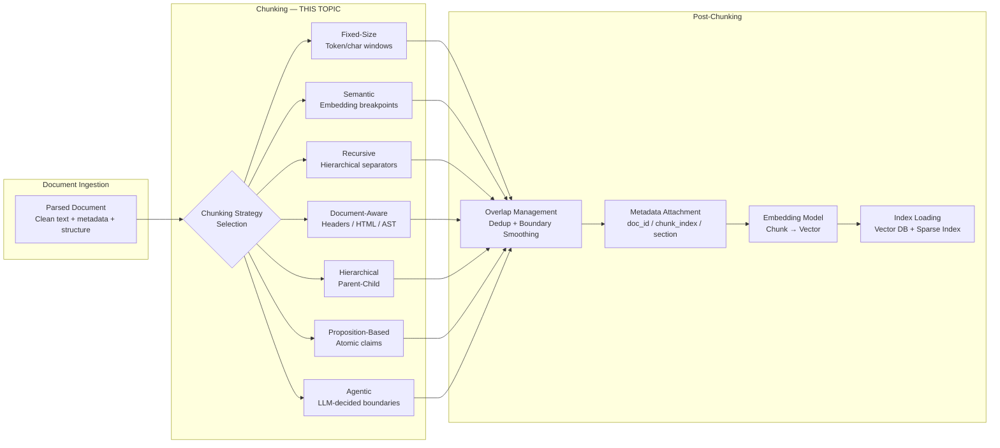
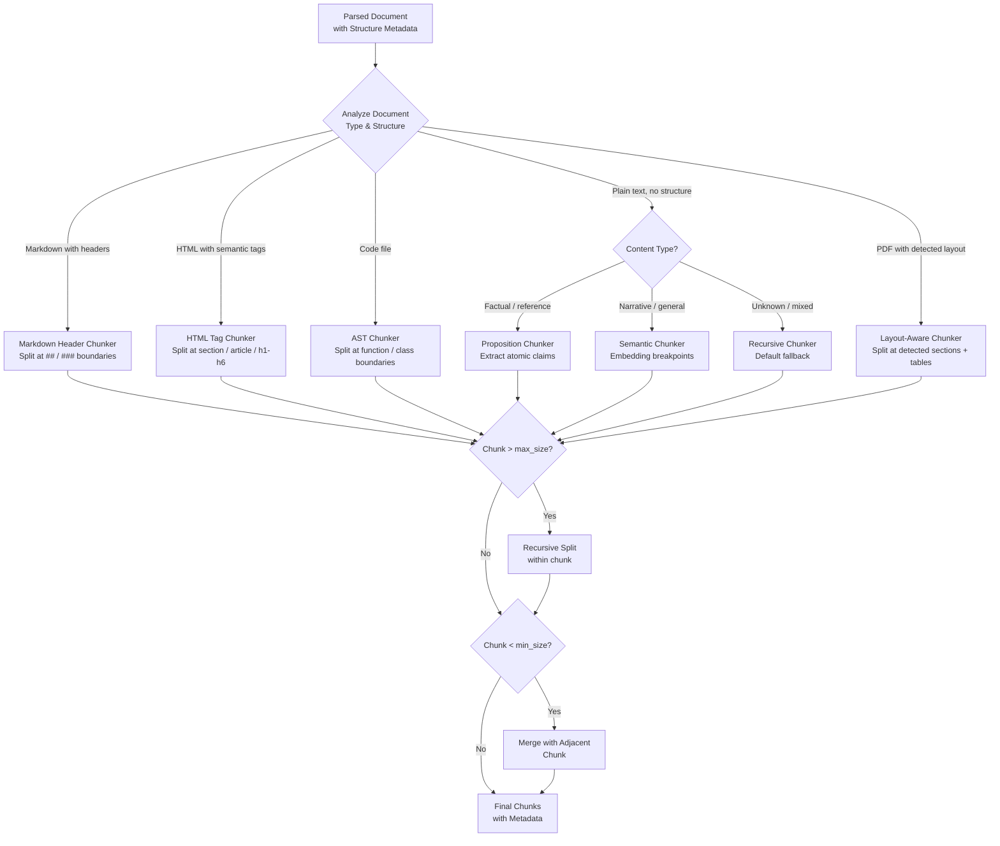
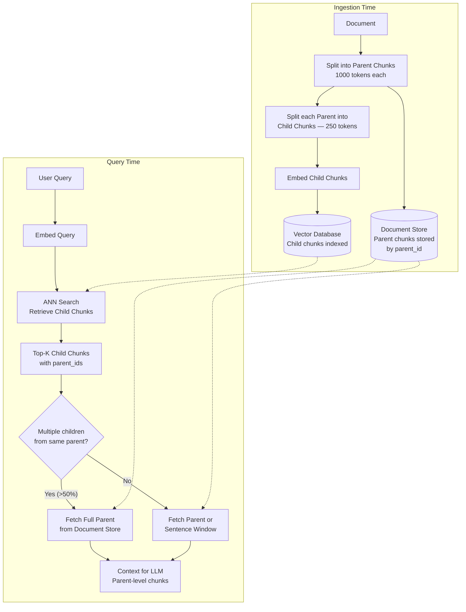

# Chunking Strategies

## 1. Overview

Chunking is the process of splitting parsed documents into smaller, semantically coherent units (chunks) that serve as the atomic retrieval units in a RAG system. It is the single most underestimated design decision in RAG --- a bad chunking strategy can reduce retrieval recall by 30--50%, and no amount of reranking or query transformation can recover information that was destroyed at the chunking boundary.

For Principal AI Architects, chunking is a multi-dimensional optimization problem. The chunk size must be small enough for the embedding model to produce a focused, meaningful vector representation (large chunks produce diluted embeddings), yet large enough to contain sufficient context for the LLM to generate a useful answer from a single chunk. The chunk boundaries must respect semantic coherence (don't split a paragraph mid-sentence or a code function mid-block), and the overlap between chunks must balance deduplication overhead against the risk of losing information at boundaries.

**Key numbers that drive chunking decisions:**
- Embedding model context windows: 256 tokens (MiniLM) to 8,192 tokens (Jina v3, BGE-M3) to 32,768 tokens (E5-mistral-7b)
- Optimal chunk size for retrieval (empirical): 200--500 tokens for factoid Q&A, 500--1,000 tokens for summarization, 100--200 tokens for code
- Chunk overlap: 10--20% of chunk size is the common range (e.g., 50--100 tokens overlap for a 500-token chunk)
- Impact of chunk size on recall@10: Reducing chunk size from 1,000 to 250 tokens improves recall by 15--25% on factoid benchmarks but degrades it by 5--10% on summarization benchmarks
- Embedding quality degradation: Chunks longer than the model's context window are truncated, silently losing information
- Storage overhead from overlap: 10% overlap adds ~10% more chunks (and therefore ~10% more storage and embedding cost)

The field has evolved from simple fixed-size splitting to sophisticated strategies where the LLM itself decides chunk boundaries. This document covers the full spectrum, from the simplest approach to production-grade hierarchical chunking systems.

---

## 2. Where It Fits in GenAI Systems

Chunking sits between document parsing (upstream) and embedding + indexing (downstream). It is the transformation layer that converts clean, parsed text into retrieval-ready units.

Chunking interacts with these adjacent systems:
- **Document ingestion** (upstream): The parser determines what structural information is available for chunking (headers, paragraphs, HTML tags, code AST nodes). See [Document Ingestion](./document-ingestion.md).
- **Embedding model** (downstream): The chunk must fit within the embedding model's context window. Chunk size relative to model capacity determines embedding quality. See [Embeddings](../01-foundations/embeddings.md).
- **RAG pipeline** (downstream consumer): The chunk is the unit of retrieval and the unit of context assembly. Chunk size and quality directly impact faithfulness and relevance. See [RAG Pipeline](./rag-pipeline.md).
- **Retrieval & reranking** (downstream): Rerankers score (query, chunk) pairs. If the chunk is too small, the reranker lacks context. If too large, the reranker's signal is diluted. See [Retrieval & Reranking](./retrieval-reranking.md).
- **Context management** (downstream): The number and size of chunks that fit in the LLM context window depend on chunk size decisions made here. See [Context Management](../06-prompt-engineering/context-management.md).

---

## 3. Core Concepts

### 3.1 Fixed-Size Chunking

The simplest approach: split text into chunks of a fixed number of tokens (or characters) with optional overlap.

**Parameters:**
- `chunk_size`: Number of tokens per chunk. Typical range: 100--1,000 tokens.
- `chunk_overlap`: Number of tokens shared between consecutive chunks. Typical range: 0--20% of chunk_size.
- `length_function`: Token counter (tiktoken, sentencepiece) or character counter. Always use token counts matching the embedding model's tokenizer.

**Algorithm:**
1. Tokenize the document.
2. Slide a window of `chunk_size` tokens across the document, advancing by `chunk_size - chunk_overlap` tokens each step.
3. Each window is a chunk.

**When to use:**
- As a baseline. Every RAG system should start with fixed-size chunking (500 tokens, 50-token overlap) and measure retrieval quality before investing in more sophisticated strategies.
- When the corpus is homogeneous and unstructured (plain text without headers, tables, or code).
- When development speed matters more than retrieval optimization.

**Limitations:**
- Chunks break mid-sentence, mid-paragraph, even mid-word (if using character counts).
- No awareness of semantic boundaries. A chunk may contain the end of one topic and the beginning of another, producing a diluted embedding.
- No awareness of document structure. A section header may be at the end of one chunk, separated from the section content at the start of the next.

**Practical tip:** Always split at sentence boundaries, even within a fixed-size strategy. Accumulate sentences until the chunk size is reached, then start a new chunk. This prevents mid-sentence breaks at trivial additional cost.

### 3.2 Recursive Chunking

The default strategy in LangChain and the most commonly used approach in production RAG systems. It applies a hierarchy of separators, attempting to split at the most semantically meaningful boundary first.

**Default separator hierarchy (for plain text):**
1. `"\n\n"` (paragraph breaks)
2. `"\n"` (line breaks)
3. `" "` (spaces / word boundaries)
4. `""` (character-level, last resort)

**Algorithm:**
1. Attempt to split the text using the first separator (`"\n\n"`).
2. For each resulting piece:
   - If the piece fits within `chunk_size`, it becomes a chunk.
   - If the piece exceeds `chunk_size`, recursively split it using the next separator in the hierarchy.
3. Continue until all pieces fit within `chunk_size`.

**Language-specific separators:**

| Language | Separator Hierarchy |
|----------|-------------------|
| Markdown | `"\n## "`, `"\n### "`, `"\n#### "`, `"\n\n"`, `"\n"`, `" "` |
| Python | `"\nclass "`, `"\ndef "`, `"\n\n"`, `"\n"`, `" "` |
| HTML | `"<h1"`, `"<h2"`, `"<div"`, `"<p"`, `"\n\n"`, `"\n"`, `" "` |
| LaTeX | `"\n\\section"`, `"\n\\subsection"`, `"\n\n"`, `"\n"`, `" "` |

**Advantages:**
- Respects document structure better than fixed-size. Prefers to break at paragraph boundaries.
- Simple to implement and configure.
- Works reasonably well across all document types.

**Limitations:**
- Still rule-based. The separator hierarchy is a heuristic, not a learned model.
- Doesn't understand semantics. Two paragraphs about the same topic will be split if their combined length exceeds `chunk_size`.
- Separator hierarchy must be manually configured per document type.

### 3.3 Semantic Chunking

Uses embedding similarity to detect topic transitions within the document. Chunks are formed by grouping consecutive sentences that are semantically similar.

**Algorithm (LlamaIndex `SemanticSplitterNodeParser`):**
1. Split the document into sentences.
2. Embed each sentence (or a sliding window of sentences).
3. Compute cosine similarity between consecutive sentence embeddings.
4. Identify breakpoints where similarity drops below a threshold (the topic changed).
5. Group sentences between breakpoints into chunks.

**Threshold tuning:**
- **Percentile-based** (recommended): Set the breakpoint threshold at the Nth percentile of all consecutive similarities. E.g., the 10th percentile: split at the 10% least similar transitions.
- **Fixed threshold**: Split whenever similarity drops below 0.5 (or another fixed value). Sensitive to embedding model and content type.
- **Standard deviation**: Split when similarity drops more than 2 standard deviations below the mean. Adaptive to the document's natural variation.

**Advantages:**
- Chunks align with semantic boundaries. Each chunk is about one coherent topic.
- Adaptive chunk sizes: small chunks for dense, topic-switching content; large chunks for extended discussions of a single topic.
- No need for explicit document structure (works on plain text).

**Limitations:**
- Requires embedding every sentence during ingestion (expensive for large corpora).
- Embedding quality for individual sentences is lower than for paragraphs (short texts embed poorly).
- Threshold is sensitive to the embedding model and domain. Requires tuning.
- Can produce very small chunks (single sentences) or very large chunks (entire sections) without additional constraints.
- Does not respect structural boundaries (a heading followed by its content may be split if the heading's embedding is different from the content).

**Production tip:** Combine semantic chunking with min/max chunk size constraints. If a semantically-determined chunk is smaller than 100 tokens, merge it with the next chunk. If it exceeds 1,000 tokens, apply recursive splitting within the chunk.

### 3.4 Document-Aware Chunking

Exploits the explicit structural signals present in formatted documents: Markdown headers, HTML tags, code syntax trees, LaTeX sections.

**Markdown-header chunking:**
- Split at `#`, `##`, `###` boundaries.
- Each section (header + content until the next header of equal or higher level) is a chunk.
- If a section exceeds `chunk_size`, apply recursive splitting within the section.
- Metadata: Attach the section header hierarchy as metadata (e.g., `["Chapter 3", "3.2 Architecture", "3.2.1 Components"]`).
- This metadata enables section-level filtering at query time.

**HTML-tag chunking:**
- Split at semantic HTML tags: `<article>`, `<section>`, `<h1>`--`<h6>`, `
`.
- Preserve HTML structure in metadata.
- Strip non-content tags (nav, footer, sidebar) before chunking.

**Code AST chunking:**
- Parse code into an Abstract Syntax Tree (AST).
- Chunk at function/method/class boundaries.
- Each function is a chunk, with metadata: file path, class name, function name, signature, docstring.
- If a function exceeds `chunk_size`, split at logical blocks (loops, conditionals).
- For Python: `ast` module. For JavaScript/TypeScript: `@babel/parser` or `tree-sitter`. For multi-language: `tree-sitter` bindings.

**Advantages:**
- Chunks aligned with the author's intended structure. Sections, paragraphs, and functions are natural semantic units.
- Rich metadata for filtering and attribution.
- No ML models required. Pure parsing.

**Limitations:**
- Requires structured documents. Plain text with no formatting yields no structural signals.
- Structure may not align with semantic boundaries. A long section about multiple subtopics will be one chunk.
- Format-specific implementation required for each document type.

### 3.5 Parent-Child (Hierarchical) Chunking

A two-level chunking strategy that decouples retrieval granularity from generation context.

**Concept:**
- **Child chunks** (small, 100--200 tokens): Indexed and used for retrieval. Small size produces focused embeddings.
- **Parent chunks** (large, 500--2,000 tokens): Stored but not indexed. When a child chunk is retrieved, the corresponding parent chunk is returned to the LLM.

**Why this works:**
- Retrieval precision improves with smaller chunks (the embedding captures a specific idea, not a diluted mix of topics).
- Generation quality improves with larger chunks (the LLM has sufficient context to understand the information, including surrounding sentences and paragraphs).
- Parent-child decouples these two competing requirements.

**Implementation approaches:**

**Approach 1: Overlapping windows**
- Parent chunks: 1,000 tokens, no overlap.
- Child chunks: 250 tokens, derived from the parent (4 children per parent).
- Metadata: Each child stores `parent_id`. At retrieval time, look up the parent by ID.

**Approach 2: Auto-merging (LlamaIndex)**
- Index child chunks. At retrieval time, if multiple children from the same parent are retrieved, automatically merge them and return the parent.
- Threshold: If >50% of a parent's children are retrieved, return the full parent.
- This is LlamaIndex's `AutoMergingRetriever`.

**Approach 3: Sentence window**
- Index individual sentences (very small chunks, ~20--50 tokens).
- At retrieval time, return a window of N sentences around the matched sentence (e.g., 5 sentences before + the matched sentence + 5 sentences after).
- Produces highly focused retrieval with adequate generation context.

**Tradeoff:**
- Storage: 2--5x more chunks (all children + all parents, or children with windowed expansion).
- Latency: Additional lookup to fetch parent after retrieval (typically <10ms from document store).
- Quality: 10--20% improvement in answer quality on benchmarks where small chunks improve retrieval precision (Anthropic internal evaluations, LlamaIndex benchmarks).

### 3.6 Proposition-Based Chunking

Decomposes documents into atomic, self-contained propositions (claims/facts) rather than contiguous text spans.

**Concept (Chen et al., 2023 --- "Dense X Retrieval"):**
- Extract atomic propositions from the document: factual statements that are self-contained and independently verifiable.
- Each proposition is a chunk.
- Example: From "Apple released the iPhone 15 in September 2023, featuring a USB-C port and the A17 Pro chip," extract:
  1. "Apple released the iPhone 15 in September 2023."
  2. "The iPhone 15 features a USB-C port."
  3. "The iPhone 15 uses the A17 Pro chip."

**Extraction methods:**
- **LLM-based**: Prompt an LLM: "Decompose the following text into a list of atomic, self-contained factual propositions. Each proposition should be understandable without context from the other propositions."
- **NLI-based**: Use a natural language inference model to identify and extract individual claims.

**Advantages:**
- Each chunk is maximally focused. The embedding represents exactly one fact.
- Retrieval precision is extremely high for factoid questions.
- Deduplication is natural: identical propositions from different sources are exact or near-exact duplicates.

**Limitations:**
- Expensive to generate: Requires an LLM call for every passage (~$0.001--0.01 per passage at GPT-4o-mini pricing).
- Loses context: Propositions are stripped of surrounding context. The LLM may not have enough information to generate a comprehensive answer from propositions alone.
- Doesn't work for all content types: Narrative text, argumentative essays, and code don't decompose cleanly into atomic propositions.
- Dramatically increases chunk count: A 500-token passage may yield 10--20 propositions. Storage and embedding costs scale accordingly.

**Production pattern:** Use proposition-based chunking for factual reference material (FAQs, product specs, knowledge bases). Use larger chunks for narrative content. Combine both in a multi-representation index.

### 3.7 Agentic Chunking

The LLM decides chunk boundaries by reading the document and determining where meaningful topic transitions occur.

**Approach:**
1. Feed the document to an LLM (or process it section by section).
2. Prompt: "Read the following text and split it into semantically coherent chunks. Each chunk should cover one distinct topic or concept. Output the text of each chunk."
3. The LLM returns the chunked text.

**Advantages:**
- Highest semantic coherence. The LLM understands the content and can make nuanced boundary decisions that no rule-based or embedding-based approach can match.
- Handles complex documents with subtle topic transitions, mixed content types, and implicit structure.

**Limitations:**
- Extremely expensive: An LLM call for every document (at $0.01--0.10 per page for GPT-4o, a 1M-page corpus costs $10K--100K just for chunking).
- Slow: LLM inference at 30--60 tokens/s means a 10-page document takes 10--30 seconds to chunk.
- Non-deterministic: Different runs may produce different chunks. This complicates incremental updates and deduplication.
- Overkill for most use cases: Recursive or semantic chunking achieves 90% of the quality at 1% of the cost.

**When justified:**
- Small, high-value corpora (legal contracts, medical records, financial filings) where chunking quality directly impacts downstream decision-making.
- Documents with unusual structure that defeat rule-based approaches.

### 3.8 Late Chunking (Jina AI, 2024)

A fundamentally different approach: embed the full document first, then chunk the embeddings post-hoc.

**Traditional approach:**
1. Chunk the document into text segments.
2. Embed each text segment independently.
3. Each chunk's embedding only reflects its own content.

**Late chunking approach:**
1. Pass the full document through a long-context embedding model (e.g., Jina Embeddings v3 with 8,192-token context).
2. Obtain token-level embeddings for the entire document (each token has a contextual embedding that reflects the full document).
3. Chunk the token embeddings by applying the same boundary decisions (fixed-size, semantic, etc.) to the embedding sequence.
4. Pool (mean pool) the token embeddings within each chunk to produce the chunk embedding.

**Why this matters:**
- In traditional chunking, a sentence like "He was the CEO of the company" produces an embedding that doesn't know who "He" is or which company. The coreference information is lost because chunking happened before embedding.
- In late chunking, the token embeddings for "He" and "company" already incorporate information from earlier in the document (through the transformer's attention mechanism). The chunk embedding retains this contextual information.

**Empirical results (Jina, 2024):**
- Late chunking improves retrieval quality by 5--15% on benchmarks where coreference and document-level context matter.
- Minimal impact on benchmarks where chunks are self-contained (e.g., Wikipedia paragraphs).

**Limitations:**
- Requires a long-context embedding model. Short-context models (256--512 tokens) can't process full documents.
- The entire document must fit in the embedding model's context window. Documents longer than 8K tokens must be split into windows with overlap.
- Computationally more expensive: Embedding the full document is slower than embedding individual chunks (attention is quadratic in sequence length, though FlashAttention mitigates this).
- Limited tooling: Only Jina's library natively supports late chunking as of early 2025.

### 3.9 Chunk Size Impact on Retrieval Quality

Chunk size is the most impactful single parameter in a RAG system. The relationship between chunk size and quality is not monotonic --- it depends on the query type.

**Empirical findings (aggregated from LlamaIndex, Weaviate, Pinecone benchmarks):**

| Chunk Size (tokens) | Factoid Q&A Recall@10 | Summarization Quality | Embedding Specificity | Context Efficiency |
|---------------------|----------------------|----------------------|----------------------|-------------------|
| 100 | High (85--90%) | Low | Very high (focused) | Poor (need many chunks) |
| 250 | High (82--88%) | Medium | High | Good |
| 500 | Medium-High (75--83%) | Medium-High | Medium | Good |
| 1,000 | Medium (65--75%) | High | Low (diluted) | Excellent |
| 2,000 | Low (55--65%) | Medium-High | Very low | Excellent |

**Key insight:** There is no universally optimal chunk size. The best chunk size depends on:
- **Query type**: Factoid questions benefit from small chunks (focused retrieval). Summarization benefits from large chunks (sufficient context).
- **Embedding model**: Models with longer context windows (8K tokens) tolerate larger chunks better than short-context models (512 tokens).
- **Content density**: Dense technical text benefits from smaller chunks. Conversational text can use larger chunks.
- **Downstream LLM**: Models with strong in-context learning (GPT-4o, Claude) can synthesize from many small chunks. Weaker models need larger, self-contained chunks.

**Production recommendation:** Start with 400--500 tokens with 50-token overlap. Evaluate on your specific queries and content. Adjust based on RAGAS metrics (context precision, context recall, faithfulness).

### 3.10 Chunk Overlap Strategies

Overlap between consecutive chunks ensures that information at chunk boundaries is not lost.

**Why overlap matters:**
- Without overlap, a sentence that spans two chunks is split. Neither chunk's embedding captures the full sentence. A query matching that sentence may fail to retrieve either chunk.
- With overlap, boundary sentences appear in both chunks, ensuring at least one chunk captures the full context.

**Overlap parameters:**
- **Overlap size**: Typically 10--20% of chunk size. For a 500-token chunk, 50--100 tokens of overlap.
- **Overlap content**: Can be token-based (last N tokens of the previous chunk) or sentence-based (last 1--2 sentences).

**Deduplication with overlap:**
- Overlap creates near-duplicate content across chunks. If both overlapping chunks are retrieved, the LLM sees the same text twice.
- Mitigation 1: After retrieval, detect overlapping regions between adjacent chunks and deduplicate in the context assembly step.
- Mitigation 2: Use embedding similarity to detect overlap at retrieval time (overlapping chunks will have high similarity). Keep only the more relevant one.

**Zero-overlap strategies:**
- When using parent-child chunking, overlap is unnecessary because the parent provides the boundary context.
- When using semantic chunking, chunks split at topic boundaries where overlap would mix topics.
- When embedding models have long context windows (8K+ tokens), larger chunks reduce the number of boundaries where information is lost.

---

## 4. Architecture

### 4.1 Chunking Decision Architecture

### 4.2 Hierarchical (Parent-Child) Chunking Architecture

---

## 5. Design Patterns

### Pattern 1: Recursive Chunking with Sentence Boundaries (Recommended Default)
- **When**: General-purpose RAG. You don't know the optimal strategy yet.
- **How**: Recursive splitter with `chunk_size=500`, `chunk_overlap=50`, split at sentence boundaries.
- **Why**: Balances simplicity, speed, and quality. Easy to implement, fast to run, produces reasonable results across all content types.
- **Upgrade path**: Measure RAGAS metrics. If context recall is low, try smaller chunks. If faithfulness is low, try semantic or document-aware chunking.

### Pattern 2: Document-Aware + Recursive Fallback (Structured Documents)
- **When**: Corpus contains Markdown, HTML, or code with reliable structural markup.
- **How**: Split at structural boundaries (headers, sections, functions). If any resulting chunk exceeds `max_size`, apply recursive splitting within that chunk. If below `min_size`, merge with the next chunk.
- **Benefit**: Chunks align with the author's intended structure. Section metadata enables precise filtering.

### Pattern 3: Hierarchical Parent-Child (High-Quality RAG)
- **When**: You need both precise retrieval and rich generation context. Willing to accept 2--5x more storage.
- **How**: Index small child chunks (200 tokens) for retrieval. Store large parent chunks (1,000 tokens). At retrieval time, return the parent when a child matches.
- **Implementation**: LlamaIndex `AutoMergingRetriever` or custom with parent_id metadata.

### Pattern 4: Multi-Strategy Index (Enterprise RAG)
- **When**: Corpus contains multiple document types with different characteristics.
- **How**: Route documents to different chunking strategies based on type:
  - Code files: AST chunking.
  - Markdown docs: Header-based chunking.
  - PDFs with tables: Table-aware chunking (tables as separate chunks in Markdown format).
  - Plain text: Recursive chunking.
  - FAQs / knowledge bases: Proposition-based chunking.
- All chunks go into the same vector index with a `chunk_strategy` metadata field.

### Pattern 5: Proposition + Context Window (Maximum Precision)
- **When**: Factoid Q&A system where precision matters more than coverage.
- **How**: Extract propositions (atomic claims) from every document. Index propositions. At retrieval time, when a proposition matches, return the proposition plus a window of surrounding original text (3--5 sentences around the source sentence).
- **Benefit**: Extremely precise retrieval (the proposition embedding perfectly matches the query) combined with adequate generation context (the surrounding text).
- **Cost**: LLM-based proposition extraction adds $0.001--0.01 per passage.

### Pattern 6: Adaptive Chunk Size (Query-Time Optimization)
- **When**: System handles diverse query types (factoid, summarization, comparison, multi-hop).
- **How**: Index at multiple granularities simultaneously:
  - Fine-grained: 200-token chunks for factoid queries.
  - Coarse-grained: 1,000-token chunks for summarization queries.
  - A query classifier routes to the appropriate index.
- **Tradeoff**: 2x storage and embedding cost for multi-granularity indexing.

---

## 6. Implementation Approaches

### 6.1 LangChain Chunking

LangChain provides `TextSplitter` implementations.

**Key splitters:**
- `RecursiveCharacterTextSplitter`: The default. Recursive splitting with configurable separators. Set `chunk_size` and `chunk_overlap` in characters or tokens (with `from_tiktoken_encoder` for token-based).
- `MarkdownHeaderTextSplitter`: Splits Markdown at header boundaries. Each chunk includes the header hierarchy as metadata.
- `HTMLHeaderTextSplitter`: Splits HTML at header tags.
- `LatexTextSplitter`: Splits LaTeX at section/subsection boundaries.
- `PythonCodeTextSplitter`, `JavaScriptTextSplitter`: Language-specific recursive splitters.
- `SemanticChunker` (experimental): Embedding-based semantic splitting.

**Practical usage pattern:**
1. Choose a primary splitter based on document type (Markdown → `MarkdownHeaderTextSplitter`, code → language-specific splitter, etc.).
2. Chain with `RecursiveCharacterTextSplitter` as a secondary splitter for chunks that exceed `max_size`.
3. Set `chunk_size=500`, `chunk_overlap=50` as defaults. Tune based on evaluation.

### 6.2 LlamaIndex Chunking

LlamaIndex uses `NodeParser` implementations that produce `Node` objects (chunks with metadata and relationships).

**Key node parsers:**
- `SentenceSplitter`: Default. Splits at sentence boundaries, respects `chunk_size` and `chunk_overlap`.
- `SemanticSplitterNodeParser`: Embedding-based semantic chunking with configurable breakpoint threshold.
- `MarkdownNodeParser`: Splits Markdown documents, preserving header hierarchy as metadata.
- `HTMLNodeParser`: Splits HTML documents at semantic tag boundaries.
- `CodeSplitter`: Uses tree-sitter for AST-based code chunking.
- `HierarchicalNodeParser`: Produces parent and child nodes at multiple granularities. Used with `AutoMergingRetriever`.
- `SentenceWindowNodeParser`: Each node is a single sentence, but at retrieval time, a window of surrounding sentences is returned.

**Production recommendation:** LlamaIndex's node parsers produce richer metadata than LangChain's splitters (parent-child relationships, previous/next node references). Prefer LlamaIndex for hierarchical chunking workflows.

### 6.3 Unstructured Chunking

Unstructured provides chunking that is aware of the parsed element types (Title, NarrativeText, Table, ListItem).

**Key strategies:**
- `chunk_by_title`: Groups elements under each Title element into a chunk. Respects document structure naturally.
- `max_characters`: Maximum chunk size. If a title-based chunk exceeds this, it's split further.
- `combine_text_under_n_chars`: Merge small chunks below this threshold with the next chunk.
- `multipage_sections`: Whether sections can span page boundaries.

**Advantage:** Chunking is informed by the parsing stage. Tables are kept as separate chunks. Code blocks are preserved. Headers are used as natural boundaries.

### 6.4 Custom Chunking Pipeline

For production systems, a custom chunking pipeline provides maximum control.

**Recommended architecture:**
1. **Structure detection**: Identify document structure (headers, paragraphs, tables, code blocks, lists) from the parser output.
2. **Section extraction**: Group content into sections based on detected structure.
3. **Per-section chunking**: Apply the appropriate chunking strategy per section:
   - Narrative sections: Recursive splitting at 500 tokens.
   - Tables: Keep as single chunks (Markdown format). If the table exceeds `max_size`, split by rows.
   - Code blocks: AST-based splitting if parseable, otherwise recursive splitting.
   - Lists: Keep complete list items together.
4. **Size enforcement**: Apply min/max size constraints with merge/split.
5. **Metadata attachment**: doc_id, chunk_index, section_hierarchy, content_type, source_url.
6. **Overlap injection**: Add configurable overlap between adjacent chunks within the same section (not across sections).

---

## 7. Tradeoffs

### Chunking Strategy Selection

| Decision | Option A | Option B | Key Tradeoff |
|----------|----------|----------|--------------|
| Strategy | Fixed-size (simple) | Semantic (ML-based) | Speed + determinism vs. semantic coherence (5--10% quality gain) |
| Strategy | Recursive (rule-based) | Document-aware (structure-based) | Generality vs. quality on structured docs (requires parser support) |
| Strategy | Single-level chunks | Hierarchical parent-child | Simplicity + less storage vs. 10--20% answer quality improvement |
| Strategy | Text chunks | Proposition-based | Low cost vs. maximum retrieval precision (10x more chunks, LLM cost) |

### Parameter Tuning

| Decision | Option A | Option B | Key Tradeoff |
|----------|----------|----------|--------------|
| Chunk size | Small (200 tokens) | Large (1,000 tokens) | Retrieval precision vs. generation context sufficiency |
| Overlap | None (0%) | 20% | Storage/dedup simplicity vs. boundary information retention |
| Min size | No minimum | 100-token minimum | More granular chunks vs. avoiding micro-chunks with poor embeddings |
| Max size | Match embedding model context | Smaller (e.g., 500) | Maximum context per chunk vs. focused embeddings |

### System-Level Tradeoffs

| Decision | Option A | Option B | Key Tradeoff |
|----------|----------|----------|--------------|
| Granularity | Single granularity | Multi-granularity index | 1x storage/cost vs. query-type-specific optimization |
| Chunking time | Pre-compute all chunks | Late chunking (Jina) | Simpler pipeline vs. better embeddings for context-dependent text |
| Table handling | Inline (part of text chunk) | Separate table chunks | Simplicity vs. table-specific retrieval and representation |
| Code handling | Treat as text | AST-based chunking | No code parser dependency vs. function-level precision |

---

## 8. Failure Modes

| Failure Mode | Symptom | Root Cause | Mitigation |
|-------------|---------|------------|------------|
| **Mid-sentence split** | Retrieved chunks have incomplete sentences; LLM hallucinates the rest | Fixed-size chunking without sentence boundary awareness | Always split at sentence boundaries; use sentence-level accumulation |
| **Chunk too large** | Embedding is diluted, retrieval misses specific facts | Chunk exceeds optimal size for embedding model (>512 tokens on a 512-token model) | Enforce max chunk size matching embedding model context; monitor average chunk size |
| **Chunk too small** | Retrieved chunk lacks context; LLM can't generate useful answer | Over-aggressive splitting; proposition-based on short text | Set min chunk size; use parent-child or sentence window pattern |
| **Table destruction** | Table split across chunks; neither chunk is useful | Table exceeds max chunk size and is split by text splitter | Detect tables and keep as single chunks; use Markdown table format |
| **Code function split** | Half a function in one chunk, other half in next | Text-based chunking on code files | Use AST-based chunking for code; fall back to function-boundary splitting |
| **Context window overflow** | Chunk exceeds embedding model context window; content silently truncated | Chunk size in tokens exceeds model's max_seq_length | Tokenize and validate chunk length matches the embedding model's tokenizer |
| **Overlap duplication** | Same information appears in multiple retrieved chunks; wastes context budget | High chunk overlap (>20%) without deduplication | Post-retrieval deduplication; reduce overlap; use parent-child instead |
| **Header orphaning** | Section header is in one chunk, section content starts in the next chunk | Chunking splits right after a header | Include headers in the next chunk, not the previous; document-aware chunking |
| **Metadata loss** | Chunks lack source attribution; can't trace back to original document | Chunking pipeline doesn't propagate metadata from parser | Attach doc_id, chunk_index, section_hierarchy, source_url at chunking time |
| **Stale chunks after re-ingestion** | Old chunks coexist with new chunks from the same document | Upsert logic doesn't delete old chunks when document is re-chunked with different boundaries | Delete all chunks for a doc_id before re-inserting; use versioned chunk IDs |

---

## 9. Optimization Techniques

### 9.1 Chunk Size Tuning

- **Empirical sweep**: Evaluate retrieval quality (RAGAS context recall, context precision) across chunk sizes [128, 256, 384, 512, 768, 1024] on a held-out set of 50--100 representative queries.
- **Per-content-type sizing**: After the sweep, set different chunk sizes for different content types (code: 200 tokens, narrative: 500 tokens, tables: keep whole).
- **Dynamic sizing**: Use semantic chunking with min/max constraints to let the content determine the chunk size within a range.

### 9.2 Retrieval-Aware Chunking

- **Query-aware chunk optimization**: Analyze the most common query patterns. If users frequently ask about specific fields (prices, dates, specifications), ensure those fields appear in self-contained chunks rather than being split across boundaries.
- **Retrieval failure analysis**: When retrieval fails (relevant documents exist but aren't retrieved), check if the failure is due to a chunking issue (information split across chunks, chunk too large to match query).
- **A/B testing**: Run parallel indexes with different chunking strategies. Route a fraction of traffic to each and compare RAGAS metrics.

### 9.3 Storage and Performance

- **Chunk deduplication**: After chunking, compute content hashes. Skip embedding and indexing for exact-duplicate chunks. Save 5--15% of embedding cost on corpora with redundant content.
- **Lazy re-chunking**: When re-ingesting a document, compare the new parsed text hash against the stored hash. If unchanged, skip re-chunking and re-embedding entirely.
- **Parallel chunking**: Chunk documents in parallel (multiprocessing pool). Chunking is CPU-bound and embarrassingly parallel.
- **Chunk compression**: For very large indexes, compress chunk text in the document store (LZ4 or zstd). Decompress only when a chunk is retrieved for context assembly.

### 9.4 Quality Monitoring

- **Chunk quality metrics**: Track average chunk size, min/max chunk size, chunk size standard deviation, percentage of chunks below min_size or above max_size.
- **Embedding quality proxy**: Compute intra-chunk cosine similarity (embed the first and second halves of each chunk separately; high similarity suggests coherence). Low similarity chunks may span topic boundaries.
- **Retrieval coverage analysis**: For a test set of queries with known relevant passages, measure whether the relevant passage is contained within a single chunk (ideal) or split across chunks (boundary issue).

---

## 10. Real-World Examples

### LlamaIndex
- **Role**: The primary open-source framework for RAG chunking. Provides the most comprehensive set of chunking strategies.
- **Key innovations**: `HierarchicalNodeParser` for parent-child chunking, `SemanticSplitterNodeParser` for embedding-based semantic chunking, `SentenceWindowNodeParser` for fine-grained retrieval with window expansion. `AutoMergingRetriever` that automatically merges child nodes into parents at retrieval time.
- **Impact**: LlamaIndex's benchmarks demonstrated that hierarchical chunking with auto-merging improves answer quality by 10--20% over fixed-size chunking on their evaluation suite.

### Pinecone
- **Research**: Published extensive benchmarks on chunk size impact (2023--2024). Tested chunk sizes from 100 to 2,000 tokens across multiple embedding models and query types.
- **Key finding**: 256--512 tokens is optimal for most use cases. Below 256, chunks lack sufficient context for meaningful embeddings. Above 512, embedding specificity degrades.
- **Product integration**: Pinecone's managed RAG product (Pinecone Assistant) uses recursive chunking with 500-token defaults.

### Jina AI
- **Innovation**: Late chunking (2024). Embed the full document first, then chunk the embeddings. Retains cross-chunk contextual information (coreference, document-level semantics).
- **Results**: 5--15% improvement on retrieval benchmarks where document-level context matters (long documents with many cross-references).
- **Product**: Jina Embeddings v3 (8,192-token context) is designed for late chunking. Jina Segmenter API provides production-ready semantic chunking.

### Weaviate
- **Research**: Published comparisons of fixed-size, recursive, and semantic chunking strategies on enterprise document corpora.
- **Key finding**: Document-aware chunking (respecting headers and sections) outperforms fixed-size chunking by 8--12% on their enterprise search benchmark.
- **Product**: Weaviate's managed service includes built-in chunking with configurable strategies.

### Unstructured.io
- **Innovation**: Element-aware chunking that respects parsed document structure. Tables, code blocks, and images are kept as separate chunks rather than being split by a text-based chunker.
- **Key pattern**: `chunk_by_title` groups content under each detected title element, producing chunks that align with the document's natural sections.

### Anthropic (Claude Documentation RAG)
- **Approach**: Uses Markdown-header-based chunking for technical documentation (API docs, guides). Each section (defined by Markdown headers) is a chunk. Large sections are recursively split at paragraph boundaries.
- **Key pattern**: Metadata includes the full header hierarchy path, enabling section-level filtering. "Show me the rate limiting section of the API docs" is a metadata filter, not a semantic search.

---

## 11. Related Topics

- **[RAG Pipeline Architecture](./rag-pipeline.md)**: Chunking is a critical upstream decision that shapes the entire RAG pipeline's behavior.
- **[Document Ingestion](./document-ingestion.md)**: Parsing quality determines what structural information is available for chunking.
- **[Embeddings](../01-foundations/embeddings.md)**: Chunk size must align with the embedding model's context window and strengths.
- **[Retrieval & Reranking](./retrieval-reranking.md)**: The chunk is the unit of retrieval. Chunk quality directly impacts retrieval precision and recall.
- **[Context Management](../06-prompt-engineering/context-management.md)**: Chunk size and count determine how much context the LLM receives and at what cost.
- **[Vector Databases](../05-vector-search/vector-databases.md)**: Chunk count determines vector count, which determines storage cost and search latency.

---

## 12. Source Traceability

| Concept | Primary Source |
|---------|---------------|
| Recursive text splitting | LangChain documentation, "Text Splitters" |
| Semantic chunking | LlamaIndex, "SemanticSplitterNodeParser" documentation; Greg Kamradt, "5 Levels of Text Splitting," 2023 |
| Proposition-based chunking | Chen et al., "Dense X Retrieval: What Retrieval Granularity Should We Use?," 2023 |
| Late chunking | Jina AI, "Late Chunking: Contextual Chunk Embeddings Using Long-Context Embedding Models," 2024; Guenther et al., arXiv 2024 |
| Hierarchical / parent-child chunking | LlamaIndex, "Auto-Merging Retriever" documentation; LlamaIndex evaluation benchmarks |
| Chunk size benchmarks | Pinecone, "Chunking Strategies for LLM Applications," 2024; Weaviate blog, "Impact of Chunk Size on RAG," 2024 |
| Lost-in-the-middle (motivates chunk ordering) | Liu et al., "Lost in the Middle: How Language Models Use Long Contexts," TACL 2024 |
| AST-based code chunking | tree-sitter documentation; LlamaIndex `CodeSplitter` |
| Unstructured chunking | Unstructured.io documentation, "Chunking" |
| Markdown header chunking | LangChain, "MarkdownHeaderTextSplitter"; LlamaIndex, "MarkdownNodeParser" |
| Agentic chunking | Kamradt, "5 Levels of Text Splitting," 2023 (Level 5: Agentic) |
| Sentence window retrieval | LlamaIndex, "SentenceWindowNodeParser" documentation |
