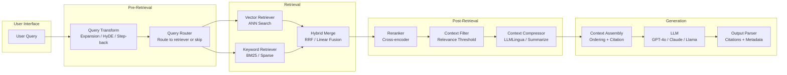
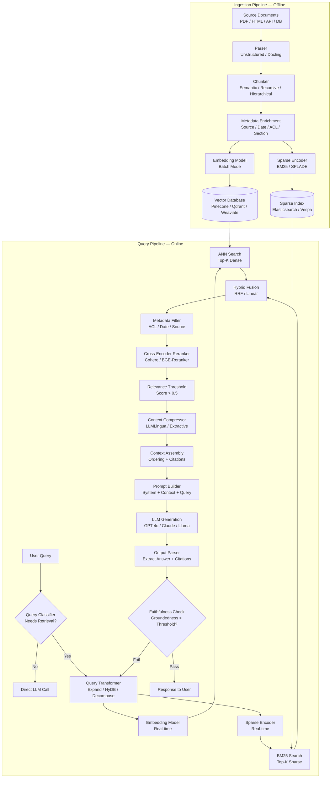
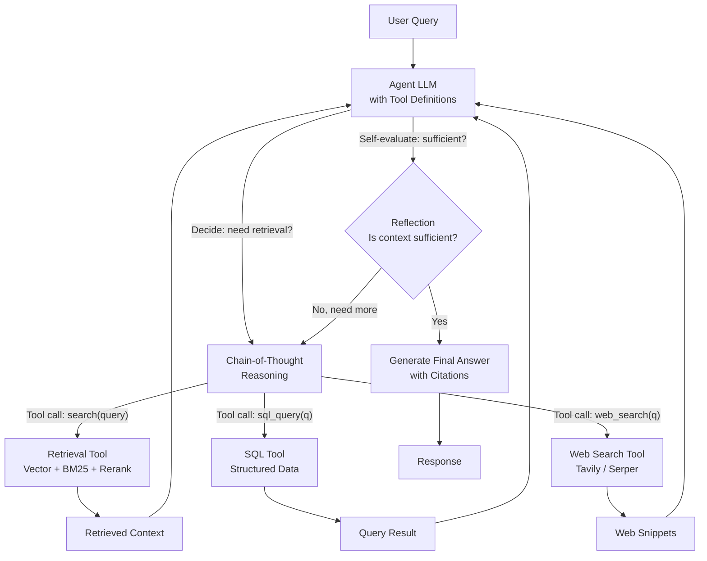

# RAG Pipeline Architecture

## 1. Overview

Retrieval-Augmented Generation (RAG) is the dominant architecture for grounding LLM outputs in external knowledge. Rather than relying solely on parametric memory (weights learned during training), RAG retrieves relevant documents at inference time and injects them into the LLM's context window, enabling factual, up-to-date, and attributable responses without retraining the model.

For Principal AI Architects, RAG is not a single technique --- it is an architectural pattern with at least four generations of increasing sophistication. The naive "retrieve and stuff" approach from 2023 has evolved into modular, agentic systems where the LLM orchestrates multi-step retrieval, self-evaluates context quality, and adaptively decides whether retrieval is even necessary. The architecture you choose determines your system's accuracy, latency, cost, and maintainability.

**Key numbers that shape RAG design decisions:**
- Embedding + retrieval latency: 50--200ms (bi-encoder + ANN search over 10M vectors)
- Reranking latency: 20--100ms for top-20 candidates (cross-encoder on GPU)
- LLM generation with 4K context: 200--800ms TTFT, 30--60 tokens/s decode (GPT-4o class)
- Context window utilization: models lose 10--25% recall for information placed in the middle of long contexts (lost-in-the-middle effect, Liu et al., 2024)
- RAG accuracy (RAGAS faithfulness) on enterprise corpora: 60--75% for naive RAG, 80--90% for advanced RAG with reranking and query transformation
- Cost: RAG with retrieval + GPT-4o generation costs ~$5--15/1K queries (depending on context size); fine-tuning a 70B model on the same data costs $10K--100K upfront

RAG competes with two alternatives: fine-tuning (embedding knowledge into weights) and long-context stuffing (dumping entire corpora into extended context windows). The decision between them is not binary --- production systems frequently combine all three. This document covers the full RAG design space, from naive single-pass pipelines to agentic multi-turn retrieval systems.

---

## 2. Where It Fits in GenAI Systems

RAG sits at the orchestration layer between the user-facing application and the LLM inference engine. It coordinates between the retrieval stack (embedding models, vector databases, rerankers) and the generation stack (prompt assembly, LLM serving, output parsing).

RAG interacts with these adjacent systems:
- **Document ingestion pipeline** (upstream): Converts raw documents into chunked, embedded, indexed content. Changes here propagate to retrieval quality. See [Document Ingestion](./document-ingestion.md).
- **Chunking layer** (upstream): Determines the granularity of retrieval units. See [Chunking Strategies](./chunking.md).
- **Vector database** (infrastructure): Stores and serves embeddings for ANN search. See [Vector Databases](../05-vector-search/vector-databases.md).
- **Embedding models** (infrastructure): Produce the vector representations. See [Embeddings](../01-foundations/embeddings.md).
- **Reranking models** (inline): Cross-encoders that re-score retrieved candidates. See [Retrieval & Reranking](./retrieval-reranking.md).
- **Evaluation framework** (feedback loop): Measures faithfulness, relevance, and hallucination rates. See [Eval Frameworks](../09-evaluation/eval-frameworks.md).

---

## 3. Core Concepts

### 3.1 RAG Generations: From Naive to Agentic

The field has evolved through four distinct architectural generations, each addressing limitations of the prior.

**Generation 1: Naive RAG (2023)**

The original pattern from Lewis et al. (2020), popularized by LangChain and LlamaIndex. A single-pass pipeline:

1. Embed the user query.
2. Retrieve top-K chunks via ANN search.
3. Stuff all chunks into a prompt template.
4. Generate a response.

Limitations that drove evolution:
- **Query-document mismatch**: User queries are often short, vague, or conversational ("What did we decide about the migration?"), while indexed documents are declarative statements. The embedding similarity between them is weak.
- **Noise in retrieved context**: Top-K retrieval returns chunks by embedding similarity, not by relevance to the query's actual intent. Irrelevant chunks dilute the signal and increase hallucination risk.
- **Lost-in-the-middle**: LLMs attend unevenly to context --- information at the beginning and end of the context window is recalled well, but information in the middle is often ignored (Liu et al., 2024). Naive RAG stuffs chunks in arbitrary order.
- **No retrieval decision**: Every query triggers retrieval, even when the LLM already knows the answer or when the query is a greeting.

**Generation 2: Advanced RAG (2024)**

Adds pre-retrieval optimization, hybrid retrieval, reranking, and context processing:

- **Pre-retrieval**: Query expansion, HyDE, step-back prompting, query decomposition.
- **Retrieval**: Hybrid search (dense + sparse), multi-index queries, metadata filtering.
- **Post-retrieval**: Cross-encoder reranking, relevance filtering, context compression, citation injection.

This is the current production standard for most enterprise RAG deployments.

**Generation 3: Modular RAG (2024--2025)**

Decomposes the pipeline into pluggable, independently configurable components with runtime routing. Key innovations:

- **Component abstraction**: Each stage (query transform, retriever, reranker, generator) has a standardized interface. Components can be swapped without changing the pipeline.
- **Runtime routing**: A lightweight classifier or rule engine routes queries to different pipeline configurations based on query type (factoid vs. analytical vs. conversational).
- **Feedback loops**: Generation quality is evaluated, and the results feed back into retrieval parameters (adaptive K, threshold tuning).

**Generation 4: Agentic RAG (2025)**

The LLM itself becomes the orchestrator, deciding dynamically:
- Whether to retrieve at all (self-RAG, Asai et al., 2023).
- What to retrieve (generating search queries, selecting indexes).
- When to retrieve again (multi-turn retrieval based on intermediate reasoning).
- Whether the retrieved context is sufficient (self-reflection and re-query).

Agentic RAG collapses the distinction between the RAG pipeline and the agent loop. The LLM uses retrieval as a tool, invoked through function calling, with the agent framework managing the retrieve-reason-retrieve cycle.

### 3.2 Pre-Retrieval Optimization

The quality of RAG output is bounded by the quality of retrieval, and retrieval quality is bounded by the quality of the query representation.

**Query Expansion**

Generates multiple reformulations of the user query and retrieves against each, merging results:
- LLM-based: "Generate 3 alternative phrasings of this question that would match relevant documents."
- Produces a broader recall set, reducing the risk of missing relevant documents due to vocabulary mismatch.
- Cost: 1 additional LLM call (~100--300ms). Retrieval runs in parallel across expanded queries.

**Hypothetical Document Embedding (HyDE)** (Gao et al., 2022)

Instead of embedding the short query, the LLM generates a hypothetical answer to the query, and that answer is embedded. The hypothesis is closer in embedding space to the actual documents than the query itself.
- Works well for knowledge-intensive questions where the query is short but the answer is a paragraph.
- Failure mode: If the LLM hallucinates a wrong hypothesis, retrieval will find documents matching the hallucination, not the truth. Mitigated by generating multiple hypotheses and diversifying.

**Step-Back Prompting** (Zheng et al., 2023)

Generates a more abstract version of the query to retrieve broader context:
- Original: "What was OpenAI's revenue in Q3 2025?"
- Step-back: "What is OpenAI's financial performance and business model?"
- Retrieves higher-level context that may contain the specific answer, useful when the corpus doesn't contain the exact phrasing.

**Query Decomposition**

Splits complex multi-part questions into sub-queries, retrieves for each, then synthesizes:
- "Compare the RAG approaches of Notion and Glean" becomes:
  1. "What is Notion's RAG architecture?"
  2. "What is Glean's RAG architecture?"
- Each sub-query retrieves independently; results are assembled before generation.

**Routing / Adaptive Retrieval**

Not all queries need retrieval. A classifier (or the LLM itself) decides:
- Factual questions about external knowledge: retrieve.
- Conversational follow-ups referencing prior turns: use conversation history, possibly retrieve.
- General knowledge questions the LLM knows well: skip retrieval (saves latency and cost).
- Self-RAG (Asai et al., 2023) trains the LLM to emit special tokens indicating when retrieval is needed.

### 3.3 Retrieval Strategies

**Dense retrieval (bi-encoder)**
- Embed query and documents into the same vector space. Retrieve via ANN search (HNSW, IVF).
- Strengths: Semantic understanding, handles paraphrases and synonyms.
- Weaknesses: Poor at exact keyword matching, entity names, codes, IDs. Struggles with negation and compositional queries.

**Sparse retrieval (BM25 / SPLADE)**
- BM25: Classic term-frequency-based scoring. No model needed. Excellent for exact keyword matching.
- SPLADE (Formal et al., 2021): Learned sparse representations --- a neural model that outputs a sparse vector over the vocabulary. Combines the precision of keyword matching with some semantic understanding.
- Strengths: Exact match, entity names, rare terms, zero-shot generalization across domains.
- Weaknesses: Vocabulary mismatch, no semantic similarity.

**Hybrid retrieval**
- Run both dense and sparse retrieval, then merge results.
- **Reciprocal Rank Fusion (RRF)**: `score(d) = sum(1 / (k + rank_i(d)))` across retrieval methods. Simple, parameter-free (except k, typically 60), and surprisingly effective.
- **Linear combination**: `score(d) = alpha * dense_score(d) + (1 - alpha) * sparse_score(d)`. Requires tuning alpha per dataset.
- Empirically, hybrid retrieval with RRF improves recall@10 by 5--15% over dense-only on heterogeneous corpora (Pinecone, Weaviate benchmarks).

**Multi-vector retrieval (ColBERT)**
- Represents query and document as sets of token-level embeddings. Relevance is computed via MaxSim: for each query token, find the maximum similarity to any document token, then sum.
- Far more expressive than single-vector bi-encoders. Approaches cross-encoder quality at bi-encoder speed.
- ColBERTv2 (Santhanam et al., 2022) adds aggressive compression (residual quantization) to make storage feasible.
- RAGatouille library makes ColBERT accessible in production RAG pipelines.

### 3.4 Post-Retrieval Processing

**Reranking**

Cross-encoder rerankers re-score retrieved candidates by jointly attending to query and document tokens:
- Cohere Rerank (rerank-v3.5): API-based, multilingual, best-in-class for general use.
- BGE-Reranker-v2-m3: Open-source, multilingual, 568M parameters.
- Jina Reranker v2: Open-source, 137M parameters, fast.
- Flashrank: Lightweight open-source reranker optimized for speed.

Reranking typically improves NDCG@10 by 10--25% over embedding-only retrieval.

**Relevance Filtering**

After reranking, apply a score threshold to remove low-relevance chunks:
- Eliminates noise that would otherwise dilute the context.
- Threshold must be calibrated per reranker model and domain. A fixed threshold (e.g., 0.5) is a starting point; production systems tune on labeled data.
- Alternatively, filter by a minimum number of "high-confidence" chunks (e.g., keep at most 5 chunks with score > 0.7).

**Context Compression**

When retrieved context exceeds the LLM's effective window or when cost is a concern:
- **LLMLingua** (Jiang et al., 2023): Compresses context by 2--5x with minimal quality loss by removing redundant tokens using a small model's perplexity scores.
- **Extractive summarization**: Select the most relevant sentences from each chunk.
- **LLM-based summarization**: Use a smaller, faster LLM to summarize chunks before passing to the primary LLM. Adds latency but reduces generation cost.

**Deduplication**

Multiple chunks may contain overlapping or near-identical content (especially with chunk overlap or redundant source documents):
- Embedding-similarity deduplication: Remove chunks with cosine similarity > 0.95 to already-selected chunks.
- This prevents the LLM from seeing the same information multiple times, which wastes context budget and can cause repetitive outputs.

### 3.5 Context Assembly

Context assembly is the final step before generation: ordering, formatting, and annotating the retrieved chunks into the prompt.

**The Lost-in-the-Middle Problem**

Liu et al. (2024) demonstrated that LLMs recall information at the beginning and end of the context window significantly better than information in the middle. For a 20-document context:
- Documents at positions 1--3: ~90% recall.
- Documents at positions 8--12: ~55% recall.
- Documents at positions 18--20: ~85% recall.

**Ordering strategies:**
- **Relevance-first**: Place the most relevant chunk first. Simple, works well for short contexts.
- **Relevance at edges**: Place the most relevant chunks at the beginning and end, less relevant in the middle. Optimizes for the U-shaped attention curve.
- **Reverse chronological**: For time-sensitive queries, place the most recent information first.
- **Grouped by source**: Cluster chunks from the same document together to maintain coherence.

**Citation injection:**
- Assign each chunk a reference ID (e.g., `[1]`, `[2]`) in the prompt.
- Instruct the LLM: "When using information from the provided sources, cite the source using its reference ID."
- Post-process: Validate that cited reference IDs exist and that the cited content actually supports the claim.
- Perplexity AI, You.com, and Bing Chat all use citation-injection patterns.

**Context window budgeting:**
- Reserve tokens: system prompt (~200--500 tokens), user query (~50--200), retrieved context (variable), generation headroom (~500--2000 for the answer).
- Production formula: `max_context_chunks = (model_context_window - system_prompt_tokens - query_tokens - generation_headroom) / avg_chunk_tokens`.
- At 500 tokens/chunk and 4K generation headroom in a 128K-context model, you can fit ~240 chunks. In practice, more context is not always better --- quality degrades past ~20--30 chunks due to noise accumulation.

### 3.6 RAG Evaluation: RAGAS and Beyond

Evaluation is the single most underinvested area in production RAG systems. RAGAS (Retrieval Augmented Generation Assessment, Es et al., 2023) defines the standard metrics.

**Component metrics (retrieval):**
- **Context Precision**: What fraction of the retrieved chunks are actually relevant to the query? High precision = low noise.
- **Context Recall**: What fraction of the information needed to answer the query is present in the retrieved chunks? High recall = complete retrieval.

**End-to-end metrics (generation):**
- **Faithfulness**: Is the generated answer supported by the retrieved context? Measures hallucination. Computed by decomposing the answer into atomic claims and checking each against the context.
- **Answer Relevance**: Does the generated answer actually address the user's question? A faithful but off-topic answer scores low here.

**Additional production metrics:**
- **Citation accuracy**: Do the cited sources actually support the claims they're attached to?
- **Latency breakdown**: Time spent in each pipeline stage (query transform, retrieval, reranking, generation). Identify bottlenecks.
- **Cost per query**: Embedding API calls + LLM input tokens + LLM output tokens. Track as context size varies.
- **Groundedness** (Anthropic): Fraction of output claims that are grounded in either the context or well-established facts.

**Evaluation frameworks:**
- RAGAS: Open-source Python library. Reference-free evaluation using LLM-as-judge for faithfulness and relevance.
- DeepEval: Open-source, adds hallucination detection and toxicity metrics.
- TruLens: Tracks RAG pipeline traces with per-component evaluation.
- Braintrust: Production-grade evaluation platform with human-in-the-loop support.
- Patronus AI: Enterprise hallucination detection and RAG evaluation.

### 3.7 RAG vs Fine-Tuning vs Long-Context: Decision Framework

These three approaches to knowledge injection are complementary, not competing.

| Dimension | RAG | Fine-Tuning | Long-Context Stuffing |
|-----------|-----|-------------|----------------------|
| **Knowledge freshness** | Real-time (index updates in minutes) | Static (retraining required) | Real-time (just stuff the document) |
| **Factual grounding** | High (explicit retrieval + citation) | Low (knowledge is implicit in weights) | Medium (entire doc in context) |
| **Hallucination control** | Good (verifiable against source) | Poor (no source to check) | Medium (source is present but may be ignored) |
| **Setup cost** | Medium (ingestion pipeline, vector DB) | High ($10K--100K for training) | Low (just concatenate) |
| **Per-query cost** | Medium (retrieval + generation) | Low (generation only) | High (very long context = high token cost) |
| **Corpus size** | Unlimited (millions of docs) | Limited by training data budget | Limited by context window (128K--1M tokens) |
| **Latency** | Higher (retrieval overhead) | Lowest | Medium (long prefill) |
| **Best for** | Dynamic, large-scale knowledge bases | Style/behavior/domain adaptation | Small, static corpora (<100 pages) |

**When to combine:**
- RAG + fine-tuning: Fine-tune the model to follow domain-specific formatting/style, use RAG for factual grounding. Common in enterprise deployments (e.g., Bloomberg used a fine-tuned model with RAG for financial Q&A).
- RAG + long-context: Stuff a few key reference documents in the system prompt (long-context) and retrieve specific chunks for the user's query (RAG). Google's NotebookLM takes this approach.
- All three: Fine-tuned domain model, long-context system instructions, RAG for dynamic knowledge. This is the emerging pattern for high-stakes enterprise applications.

---

## 4. Architecture

### 4.1 Advanced RAG Reference Architecture

### 4.2 Agentic RAG Architecture

In agentic RAG, the LLM makes all routing decisions via tool calls. The retrieval pipeline is exposed as a tool, alongside other data sources (SQL databases, APIs, web search). The agent iterates until it judges the context is sufficient.

---

## 5. Design Patterns

### Pattern 1: Naive RAG (Baseline)
- **When**: Prototyping, small corpora (<10K chunks), non-critical applications.
- **How**: Embed query, top-K ANN search, stuff into prompt, generate.
- **Latency**: ~500ms total.
- **Limitation**: 60--70% faithfulness on heterogeneous enterprise corpora.

### Pattern 2: Hybrid Retrieval + Reranking (Production Baseline)
- **When**: Most production deployments. First pattern to try before adding complexity.
- **How**: Dense + sparse retrieval, RRF fusion, cross-encoder reranking, top-N with threshold.
- **Latency**: ~700--1200ms total.
- **Improvement**: 10--20% faithfulness gain over naive RAG.

### Pattern 3: Multi-Hop RAG
- **When**: Complex questions requiring synthesis from multiple documents or reasoning chains.
- **How**: Decompose query into sub-queries, retrieve for each, synthesize intermediate answers, retrieve again based on intermediate results.
- **Example**: "How does Company X's data privacy policy compare to GDPR requirements?"
  1. Retrieve Company X's privacy policy.
  2. Retrieve GDPR requirements.
  3. Generate comparison with citations from both.
- **Latency**: 2--5 seconds (multiple retrieval + generation rounds).

### Pattern 4: Parent-Child Retrieval
- **When**: Documents have hierarchical structure (manuals, legal documents, technical specs).
- **How**: Index small child chunks for precise retrieval. When a child matches, return the parent chunk (larger context) to the LLM.
- **Benefit**: Combines retrieval precision (small chunks match well) with generation quality (LLM gets sufficient context).
- **Implementation**: LlamaIndex `AutoMergingRetriever`, custom parent-ID metadata.

### Pattern 5: CRAG (Corrective RAG)
- **When**: High-stakes applications where retrieval failures are costly.
- **How**: After retrieval, a lightweight evaluator scores the relevance of retrieved documents. If relevance is low, the system falls back to web search or query reformulation before generation.
- **Paper**: Yan et al. (2024), "Corrective Retrieval Augmented Generation."

### Pattern 6: Self-RAG
- **When**: You want the LLM to decide adaptively whether and how to retrieve.
- **How**: Fine-tune the LLM to emit special tokens: `[Retrieve]` (trigger retrieval), `[IsRel]` (is context relevant?), `[IsSup]` (is response supported?), `[IsUse]` (is response useful?).
- **Benefit**: Eliminates unnecessary retrieval for questions the model can answer from parametric memory.
- **Paper**: Asai et al. (2023), "Self-RAG: Learning to Retrieve, Generate, and Critique."

### Pattern 7: Graph RAG
- **When**: Queries require reasoning over entity relationships, especially global summarization queries over large corpora.
- **How**: Build a knowledge graph from the corpus (entities + relationships). At query time, retrieve relevant subgraphs and feed them to the LLM alongside text chunks.
- **Implementation**: Microsoft GraphRAG (open-source) builds hierarchical community summaries. LlamaIndex PropertyGraphIndex extracts and queries knowledge graphs.

---

## 6. Implementation Approaches

### 6.1 Framework Comparison

| Framework | Strengths | Weaknesses | Best For |
|-----------|----------|------------|----------|
| **LlamaIndex** | Most RAG-specific abstractions (node parsers, response synthesizers, query engines). Strong indexing primitives. | Opinionated abstractions can fight you at scale. | RAG-first applications, complex retrieval pipelines |
| **LangChain** | Broadest ecosystem, most integrations. LCEL for composable chains. | Abstraction overhead, fast-changing API. | Multi-tool agents that include RAG as one capability |
| **Haystack (deepset)** | Pipeline-as-DAG architecture, type-safe components. | Smaller community, fewer integrations. | Production NLP pipelines with strict typing |
| **Verba (Weaviate)** | Turnkey RAG with Weaviate backend. | Tightly coupled to Weaviate. | Quick Weaviate-based RAG deployment |
| **RAGFlow** | Open-source, document-understanding-first RAG with visual chunking. | Newer project, less battle-tested. | Document-heavy RAG with complex layouts |
| **Custom** | Full control, no abstraction tax. | Higher engineering effort. | Large-scale production where framework overhead is unacceptable |

### 6.2 Production Deployment Checklist

1. **Ingestion**: Batch ingestion pipeline with idempotent processing. Incremental updates (upsert, not full re-index). Source deduplication. Metadata tagging for ACL enforcement.
2. **Retrieval**: Hybrid dense + sparse. Reranking with cross-encoder. Metadata filters for multi-tenancy. Relevance threshold tuning on evaluation set.
3. **Generation**: System prompt with retrieval instructions and citation format. Output parsing for structured citation extraction. Streaming response delivery.
4. **Evaluation**: RAGAS metrics in CI/CD. Regression tests on curated query-answer pairs. Human evaluation on a rotating sample. Latency and cost dashboards.
5. **Observability**: Trace every query through the pipeline (retrieval scores, reranker scores, generation tokens). LangSmith, Arize Phoenix, or custom telemetry.
6. **Guardrails**: Input filtering (PII, prompt injection). Output filtering (hallucination detection, toxicity). Fallback responses when retrieval confidence is low.

### 6.3 Multi-Tenancy in RAG

Enterprise RAG must enforce data isolation between tenants (customers, departments, security classifications):

- **Namespace isolation**: Vector databases (Pinecone, Qdrant) support namespaces. Each tenant's data is stored and queried in its own namespace. Simple, strong isolation.
- **Metadata filtering**: Store `tenant_id` as metadata on every chunk. Apply a mandatory metadata filter on every query: `filter={"tenant_id": "tenant_123"}`. Simpler to manage, but relies on the database's filter implementation for security.
- **Separate indexes**: One vector index per tenant. Strongest isolation, highest operational overhead. Necessary for regulatory compliance in some domains (healthcare, finance).

---

## 7. Tradeoffs

### Retrieval Strategy Tradeoffs

| Decision | Option A | Option B | Key Tradeoff |
|----------|----------|----------|--------------|
| Retrieval type | Dense only | Hybrid (dense + sparse) | Simplicity vs. 5--15% recall improvement |
| Reranking | Skip | Cross-encoder reranking | 50--100ms latency vs. 10--25% NDCG improvement |
| Query transformation | None | HyDE / expansion | 100--300ms latency + LLM cost vs. better recall for vague queries |
| Context compression | None | LLMLingua / extractive | Simplicity vs. cost reduction on long contexts |
| Chunk count | Few (3--5) | Many (15--30) | Precision-focused vs. recall-focused (noise risk increases) |
| Adaptive retrieval | Always retrieve | Classify first | Complexity vs. latency reduction for non-retrieval queries |

### Architectural Tradeoffs

| Decision | Option A | Option B | Key Tradeoff |
|----------|----------|----------|--------------|
| Architecture | Deterministic pipeline | Agentic (LLM-orchestrated) | Predictability + latency vs. flexibility + accuracy on complex queries |
| Evaluation | Offline batch eval | Online per-query evaluation | Cost vs. real-time quality control |
| Framework | LlamaIndex/LangChain | Custom implementation | Development speed vs. production control |
| Index strategy | Single hybrid index | Multiple specialized indexes | Simplicity vs. optimized retrieval per content type |
| Embedding model | API (OpenAI, Cohere) | Self-hosted (BGE, E5) | Zero ops vs. cost at scale + data privacy |
| Reranker | API (Cohere Rerank) | Self-hosted (BGE-Reranker) | Quality + simplicity vs. latency + cost at scale |

---

## 8. Failure Modes

### 8.1 Retrieval Failures

| Failure Mode | Symptom | Root Cause | Mitigation |
|-------------|---------|------------|------------|
| **Empty retrieval** | No relevant chunks returned | Query-document vocabulary mismatch; poor embedding model for domain | Hybrid retrieval (BM25 catches keyword matches); domain-adapted embeddings |
| **Low-relevance retrieval** | Chunks returned but not useful | Chunks too large (diluted meaning) or too small (missing context) | Tune chunk size; add reranking with score threshold |
| **Stale results** | Outdated information returned | Ingestion pipeline lag; no freshness signal | Timestamp metadata + recency boost; streaming ingestion |
| **ACL violation** | User sees content they shouldn't | Metadata filter not enforced or bypassed | Mandatory filter injection at query layer; namespace isolation |
| **Index drift** | Retrieval quality degrades over time | Embedding model updated but index not re-embedded | Version embedding model IDs; re-index on model change |

### 8.2 Generation Failures

| Failure Mode | Symptom | Root Cause | Mitigation |
|-------------|---------|------------|------------|
| **Hallucination despite context** | LLM fabricates facts not in retrieved docs | LLM over-relies on parametric memory; irrelevant context confuses it | Stronger system prompt; faithfulness check; remove low-score chunks |
| **Lost-in-the-middle** | LLM ignores relevant context in middle positions | Attention distribution bias | Relevance-based ordering (best at edges); reduce total context |
| **Citation hallucination** | LLM cites sources that don't exist or don't support the claim | LLM generates plausible but incorrect citation IDs | Post-generation citation validation; structured output with source IDs |
| **Refusal to answer** | "I don't have enough information" despite relevant context | Over-cautious system prompt; context not explicitly answering the question | Tune system prompt; include "use the context to reason and infer" instruction |
| **Repetitive output** | LLM restates the same fact from multiple overlapping chunks | Chunk deduplication not performed | Deduplicate chunks above similarity threshold before assembly |

### 8.3 System-Level Failures

| Failure Mode | Symptom | Root Cause | Mitigation |
|-------------|---------|------------|------------|
| **Latency spike** | P99 latency exceeds SLA | Reranker cold start; vector DB slow under load; LLM provider throttling | Warm reranker instances; autoscale vector DB; LLM provider fallback |
| **Cost explosion** | Monthly costs 3--5x projected | Unbounded context size; unnecessary retrieval; over-generous top-K | Context budget caps; adaptive retrieval; monitor tokens/query |
| **Cascading failure** | System down when embedding API is down | Hard dependency on external API for query embedding | Local embedding model fallback; circuit breaker pattern |

---

## 9. Optimization Techniques

### 9.1 Latency Optimization

- **Parallel retrieval**: Run dense and sparse retrieval concurrently (not sequentially). Saves 50--100ms.
- **Embedding caching**: Cache query embeddings for repeated/similar queries. Use a semantic cache (GPTCache) that returns cached answers for semantically similar queries.
- **Reranker batching**: Batch all (query, chunk) pairs in a single reranker forward pass rather than scoring one at a time.
- **Streaming generation**: Start streaming the LLM response as soon as the first token is generated. The user perceives lower latency even if total generation time is unchanged.
- **Speculative retrieval**: Begin retrieval based on partial query input (for chat interfaces with real-time typing).
- **Prefix caching**: If the system prompt + retrieved context is identical across requests (common in multi-turn conversations on the same topic), leverage prefix caching in the LLM serving layer (vLLM, SGLang).

### 9.2 Quality Optimization

- **Retrieval fusion tuning**: Sweep the alpha parameter in hybrid retrieval or the k parameter in RRF on a held-out evaluation set.
- **Reranker model selection**: Test multiple rerankers (Cohere, BGE, Jina) on your domain. Performance varies by 5--15% across domains.
- **Dynamic top-K**: Instead of fixed K, use the reranker score distribution to select K. If the top-3 chunks all score >0.9 and the rest are <0.4, return only 3.
- **Query-specific chunk size**: For factoid queries, retrieve small chunks (200 tokens). For summarization queries, retrieve large chunks (800 tokens) or full sections.
- **Iterative refinement**: If faithfulness check fails, automatically reformulate the query and retry retrieval (CRAG pattern). Limit to 2--3 iterations.

### 9.3 Cost Optimization

- **Tiered model routing**: Use a cheap, fast model (GPT-4o-mini, Claude Haiku) for simple queries. Route complex queries to expensive models (GPT-4o, Claude Opus). Classification cost << generation cost.
- **Context compression**: LLMLingua 2 compresses context by 2--5x with <2% quality loss. At $10/M input tokens, compressing from 4K to 1.5K tokens saves $2.50 per 1K queries.
- **Embedding model selection**: Open-source models (BGE, E5) running on a $1/hr GPU can embed at 1000 docs/sec, replacing $0.10/M token API calls.
- **Caching**: Semantic caching with a 30--50% hit rate halves your LLM API costs.
- **Adaptive retrieval**: Skip retrieval for 20--40% of queries (greetings, follow-ups, general knowledge), saving embedding + retrieval + reranking cost.

---

## 10. Real-World Examples

### Perplexity AI
- **Architecture**: Agentic RAG with web search as the primary retrieval source. Query decomposition, multi-source retrieval (web, academic papers, news), cross-encoder reranking, streaming generation with inline citations.
- **Scale**: Handles millions of queries/day. Models served on custom GPU infrastructure. Multiple model backends (Perplexity's own fine-tuned models, GPT-4o, Claude).
- **Key innovation**: Real-time web retrieval combined with academic search. Citation-first UI where every claim links to a source.

### Glean
- **Architecture**: Enterprise search + RAG over corporate data (Slack, Confluence, Google Drive, Jira, email). Hybrid retrieval with learned sparse + dense models. Per-user ACL enforcement via identity-aware metadata filtering.
- **Scale**: Indexes millions of documents per enterprise customer. Sub-second retrieval with reranking.
- **Key innovation**: Identity-aware RAG --- retrieval results are filtered by the querying user's actual permissions across all connected data sources.

### Notion AI
- **Architecture**: RAG over the user's workspace. Content is chunked at the block level (Notion's native content unit). Embedding model generates per-block vectors. Retrieval is scoped to the user's workspace with permission filtering.
- **Scale**: Processes billions of blocks across millions of workspaces. Workspace-scoped indexes for data isolation.
- **Key innovation**: Block-level chunking aligned with the product's native data model. Q&A, summarization, and writing assistance all share the same RAG pipeline.

### Amazon Rufus
- **Architecture**: Product-aware RAG for e-commerce Q&A. Retrieves from product catalogs, customer reviews, and community Q&A. Hybrid retrieval with product-specific metadata (category, brand, specifications).
- **Scale**: Hundreds of millions of products. Real-time retrieval during the shopping experience.
- **Key innovation**: Domain-specific RAG that combines structured product data with unstructured reviews and Q&A.

### Anthropic Claude with Citations
- **Architecture**: Claude's citation feature enables document-grounded RAG where the model outputs exact character-span citations into the source documents provided in context.
- **Key innovation**: Character-level citation granularity. The model doesn't just cite "Document 3" but points to the exact substring in Document 3 that supports each claim. This enables UI-level highlighting of source passages.

---

## 11. Related Topics

- **[Document Ingestion](./document-ingestion.md)**: How raw documents are parsed, cleaned, and prepared for the RAG pipeline.
- **[Chunking Strategies](./chunking.md)**: How documents are split into retrieval units --- directly determines retrieval quality.
- **[Retrieval & Reranking](./retrieval-reranking.md)**: Deep dive into retrieval algorithms, reranker architectures, and hybrid search.
- **[Vector Databases](../05-vector-search/vector-databases.md)**: Infrastructure for storing and querying embeddings at scale.
- **[Embeddings](../01-foundations/embeddings.md)**: The vector representations that power dense retrieval.
- **[Eval Frameworks](../09-evaluation/eval-frameworks.md)**: How to measure and monitor RAG quality in production.
- **[Context Scaling](../02-llm-architecture/context-scaling.md)**: Long-context models as an alternative or complement to RAG.
- **[Multimodal RAG](./multimodal-rag.md)**: Extending RAG to images, tables, and other non-text modalities.
- **[Enterprise Search](../13-case-studies/enterprise-search.md)**: Full-stack enterprise search systems that build on RAG.

---

## 12. Source Traceability

| Concept | Primary Source |
|---------|---------------|
| RAG (original) | Lewis et al., "Retrieval-Augmented Generation for Knowledge-Intensive NLP Tasks," NeurIPS 2020 |
| Lost-in-the-middle | Liu et al., "Lost in the Middle: How Language Models Use Long Contexts," TACL 2024 |
| HyDE | Gao et al., "Precise Zero-Shot Dense Retrieval without Relevance Labels," 2022 |
| Self-RAG | Asai et al., "Self-RAG: Learning to Retrieve, Generate, and Critique through Self-Reflection," ICLR 2024 |
| CRAG | Yan et al., "Corrective Retrieval Augmented Generation," 2024 |
| RAGAS | Es et al., "RAGAS: Automated Evaluation of Retrieval Augmented Generation," 2023 |
| Step-back prompting | Zheng et al., "Take a Step Back: Evoking Reasoning via Abstraction in Large Language Models," ICLR 2024 |
| ColBERTv2 | Santhanam et al., "ColBERTv2: Effective and Efficient Retrieval via Lightweight Late Interaction," NAACL 2022 |
| SPLADE | Formal et al., "SPLADE: Sparse Lexical and Expansion Model for First Stage Ranking," SIGIR 2021 |
| LLMLingua | Jiang et al., "LLMLingua: Compressing Prompts for Accelerated Inference of Large Language Models," EMNLP 2023 |
| Microsoft GraphRAG | Edge et al., "From Local to Global: A Graph RAG Approach to Query-Focused Summarization," 2024 |
| Modular RAG | Gao et al., "Modular RAG: Transforming RAG Systems into LEGO-like Reconfigurable Frameworks," 2024 |
| Reciprocal Rank Fusion | Cormack et al., "Reciprocal Rank Fusion Outperforms Condorcet and Individual Rank Learning Methods," SIGIR 2009 |
