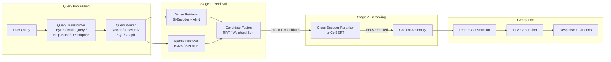
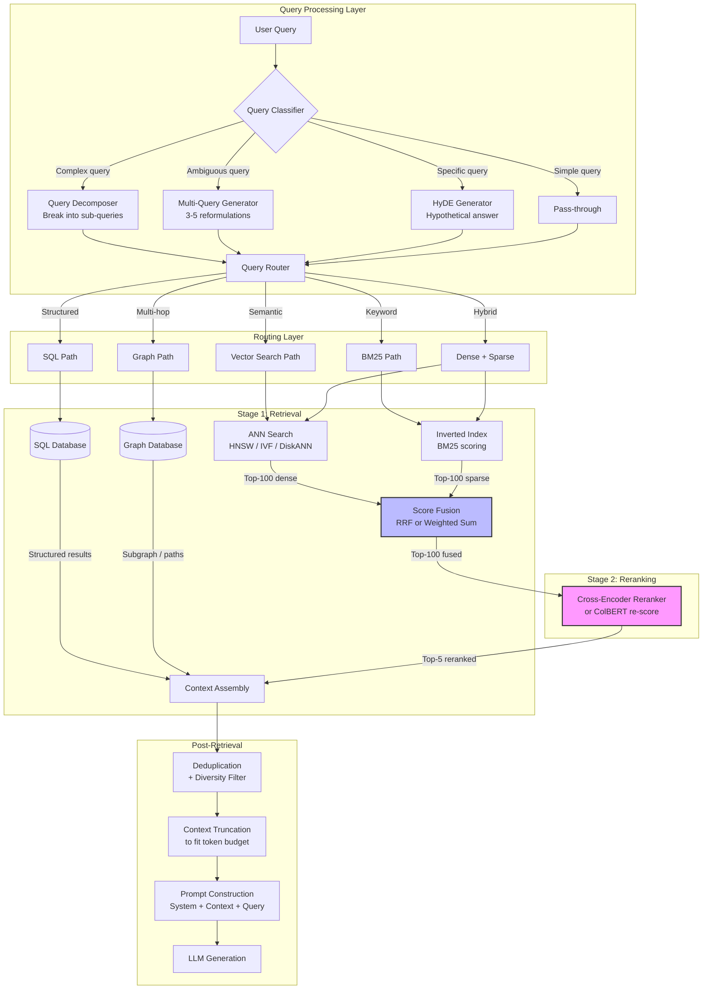

# Retrieval and Reranking

## 1. Overview

Retrieval and reranking is the two-stage process that determines which context a large language model sees during generation. In a RAG pipeline, the quality of the final answer is bounded by the quality of retrieval --- if the right passages never reach the LLM's context window, no amount of prompt engineering can compensate. Retrieval fetches a broad candidate set from a corpus; reranking narrows and reorders those candidates with a more expensive, more accurate model before they enter the generation prompt.

The retrieval stage is fundamentally a tradeoff between recall and latency. Dense retrieval (bi-encoder embeddings + approximate nearest neighbor search) captures semantic similarity but misses lexical signals. Sparse retrieval (BM25, TF-IDF) captures exact keyword matches but lacks semantic understanding. Hybrid search combines both, and Reciprocal Rank Fusion (RRF) is the most common merging strategy. The first stage retrieves 50--200 candidates in under 100ms for production workloads at scale.

The reranking stage applies a cross-encoder or late-interaction model to re-score the candidate set. Cross-encoders jointly attend over query-passage pairs, enabling fine-grained token-level interaction that bi-encoders cannot achieve. The cost: cross-encoders are O(n) in the number of candidates (each pair requires a forward pass), so they are only applied to the top-k results from the first stage. This two-stage design --- cheap-but-broad retrieval followed by expensive-but-precise reranking --- is the dominant architecture in production RAG systems at companies like Cohere, Google, and Microsoft.

Beyond retrieval and reranking, query transformation techniques (HyDE, multi-query, step-back prompting, query decomposition) reshape the user's query before it reaches the retrieval stack, often improving recall by 10--30% on complex queries. Query routing determines which retrieval backend handles a given query --- vector search, keyword search, SQL, or graph --- based on query characteristics.

## 2. Where It Fits in GenAI Systems

Retrieval and reranking sit between the user query and the LLM generation step. They are the critical path that determines context quality.



**Integration points across the GenAI stack:**

- **Vector databases** ([vector-databases.md](../05-vector-search/vector-databases.md)): Store dense embeddings and serve ANN queries. The retrieval stage is constrained by the index type (HNSW, IVF, DiskANN) and the distance metric (cosine, dot product, L2) configured in the vector store.
- **Embedding models** ([embeddings.md](../01-foundations/embeddings.md)): The bi-encoder model used for dense retrieval is an embedding model. Model choice (dimension, context length, domain specialization) directly determines retrieval quality. Query and document must use the same model.
- **RAG pipeline** ([rag-pipeline.md](./rag-pipeline.md)): Retrieval and reranking are components within the broader RAG orchestration, which also handles chunking, context assembly, prompt construction, and response post-processing.
- **Evaluation frameworks** ([eval-frameworks.md](../09-evaluation/eval-frameworks.md)): Retrieval quality is measured with recall@k, NDCG, MRR, and precision@k. These metrics drive model selection and parameter tuning.
- **Agent architectures** ([agent-architecture.md](../07-agents/agent-architecture.md)): Agents invoke retrieval as a tool. Query routing often determines whether the agent should query a vector store, a knowledge graph, a SQL database, or the web.

## 3. Core Concepts

### 3.1 Dense Retrieval

Dense retrieval encodes queries and documents into fixed-dimensional vectors using a bi-encoder (two independent encoder forward passes), then retrieves the nearest vectors by approximate nearest neighbor (ANN) search.

**Bi-encoder architecture:**

1. A query encoder produces `q = Encoder_Q(query)` as a d-dimensional vector.
2. A document encoder produces `d_i = Encoder_D(doc_i)` for every document in the corpus (offline).
3. At query time, compute `similarity(q, d_i)` for all documents using ANN search. Common metrics: cosine similarity, dot product, or L2 distance.
4. Return top-k candidates ranked by similarity score.

In most modern embedding models, `Encoder_Q` and `Encoder_D` share weights (symmetric bi-encoder). Some models use asymmetric encoders where the query encoder is smaller for latency reasons, while the document encoder is larger for quality.

**Key properties:**

- Documents are encoded offline and indexed once. Query encoding is the only online computation beyond ANN search.
- Encoding is independent: each document is encoded without seeing the query, and the query is encoded without seeing any document. This is the fundamental limitation --- no cross-attention between query and document tokens.
- Embedding similarity captures semantic meaning ("automobile insurance" matches "car coverage") but can miss lexical specifics ("error code XJ-4502" will not match if the exact string was not seen during training).
- Typical latency: 5--30ms for embedding (depending on model size and batch size), 5--50ms for ANN search over 10M+ vectors.

**Leading bi-encoder models (as of early 2026):**

| Model | Dimensions | Context | MTEB Avg | Notes |
|-------|-----------|---------|----------|-------|
| OpenAI text-embedding-3-large | 3072 | 8,191 | ~64.6 | Matryoshka support, API-only |
| Cohere embed-v4 | 1024 | 512 | ~66.1 | Native int8/binary quantization |
| Voyage AI voyage-3-large | 1024 | 32,000 | ~67.2 | Long-context specialist |
| BGE-M3 | 1024 | 8,192 | ~63.4 | Dense + sparse + multi-vector |
| Jina Embeddings v3 | 1024 | 8,192 | ~65.5 | Task-specific LoRA adapters |
| Nomic Embed v2 | 768 | 8,192 | ~62.8 | Open-source, open-weights |
| GTE-Qwen2-7B | 4096 | 131,072 | ~70.2 | LLM-based encoder, very large |

### 3.2 Sparse Retrieval

Sparse retrieval represents queries and documents as high-dimensional sparse vectors where each dimension corresponds to a term in the vocabulary. Non-zero entries indicate term presence and importance.

**BM25 (Best Matching 25):**

BM25 is the dominant sparse retrieval algorithm. It scores a document `D` against a query `Q` as:

```
BM25(Q, D) = Σ IDF(qi) * [f(qi, D) * (k1 + 1)] / [f(qi, D) + k1 * (1 - b + b * |D|/avgdl)]
```

Where:
- `f(qi, D)` = term frequency of query term `qi` in document `D`
- `|D|` = document length, `avgdl` = average document length
- `k1` (typically 1.2) = term frequency saturation parameter
- `b` (typically 0.75) = document length normalization parameter
- `IDF(qi)` = inverse document frequency, penalizing common terms

BM25 excels at exact term matching, entity names, part numbers, error codes, and any query where the user knows the precise vocabulary. It is extremely fast (inverted index lookup) and requires no GPU.

**SPLADE (Sparse Lexical and Expansion Model):**

SPLADE is a learned sparse model that produces sparse vectors where dimensions correspond to vocabulary terms, but the weights are learned rather than computed from term statistics. SPLADE can expand queries by assigning non-zero weights to terms not present in the input --- for example, a query about "car insurance" might also get weight on "automobile," "vehicle," and "coverage." This bridges the vocabulary mismatch problem while maintaining the efficiency of sparse retrieval via inverted indices.

**TF-IDF vs BM25:** TF-IDF uses raw term frequency multiplied by inverse document frequency. BM25 adds term frequency saturation (diminishing returns for repeated terms) and document length normalization. BM25 is strictly superior in practice and has replaced TF-IDF in all modern search systems.

### 3.3 Hybrid Search

Hybrid search combines dense and sparse retrieval to capture both semantic and lexical signals. The premise: dense retrieval has high recall for semantic queries ("what causes high blood pressure") while sparse retrieval has high recall for keyword-specific queries ("lisinopril 10mg side effects"). Neither alone achieves optimal recall across query types.

**Reciprocal Rank Fusion (RRF):**

RRF is the most widely used fusion algorithm. Given ranked lists from multiple retrievers, the fused score for document `d` is:

```
RRF(d) = Σ 1 / (k + rank_i(d))
```

Where `rank_i(d)` is the rank of document `d` in the i-th retriever's result list, and `k` is a constant (typically 60) that mitigates the impact of high rankings from a single source.

RRF advantages:
- Score-agnostic: does not require normalization of scores across retrievers.
- Simple to implement and interpret.
- Robust to the case where one retriever returns far more results than another.

**Weighted linear combination (alternative to RRF):**

```
score(d) = α * dense_score(d) + (1 - α) * sparse_score(d)
```

Requires score normalization (min-max or z-score) across retrievers. The weight `α` is tuned per domain --- semantic-heavy corpora may use `α = 0.7`, keyword-heavy corpora may use `α = 0.3`. Less robust than RRF in practice but allows fine-grained control.

**Hybrid search support by vector database:**

| Database | BM25 Native | RRF Support | Hybrid API | Notes |
|----------|------------|-------------|------------|-------|
| Weaviate | Yes (BM25F) | Yes | Single query, `hybrid` parameter with alpha | Built-in fusion |
| Qdrant | Yes (full-text) | Yes | `query.hybrid` API | Configurable fusion |
| Pinecone | Yes (sparse-dense) | Yes | Single `query` with sparse + dense | Sparse values in vector |
| Elasticsearch | Yes (native) | Yes | `rrf` retriever (8.14+) | Also supports kNN + BM25 |
| Vespa | Yes (native) | Yes | `rank-profile` with hybrid | Most configurable |
| Milvus | Yes (2.4+) | Yes | `AnnSearchRequest` + `RRFRanker` | Multi-vector search |
| pgvector + pg_search | pgvector + ParadeDB | Manual | Requires SQL join | Less integrated |

### 3.4 Cross-Encoder Reranking

A cross-encoder takes a (query, document) pair as a single input and produces a relevance score. Unlike bi-encoders, the query and document tokens attend to each other through all transformer layers --- enabling fine-grained token-level interaction.

**Why cross-encoders are more accurate than bi-encoders:**

- **Full cross-attention**: In a bi-encoder, the query representation is computed independently of the document. The only interaction is a single dot product between two fixed-length vectors. A cross-encoder jointly processes `[CLS] query [SEP] document [SEP]` through the entire transformer stack, allowing every query token to attend to every document token at every layer. This enables capturing complex relevance patterns like negation ("not related to cancer" should not match cancer documents), conditional relevance ("Python, not the snake"), and multi-aspect matching.
- **No information bottleneck**: The bi-encoder compresses an entire document into a single vector (e.g., 768 or 1024 dimensions). The cross-encoder operates on the full token sequence, retaining all information until the final classification layer.
- **Typical accuracy gap**: On MS MARCO passage ranking, cross-encoders achieve MRR@10 of ~0.39--0.42, while bi-encoders achieve ~0.33--0.37. On BEIR benchmarks, the gap is 5--15% NDCG@10 depending on the domain.

**Why cross-encoders cannot replace bi-encoders for first-stage retrieval:**

- Each (query, document) pair requires a separate forward pass. For a corpus of 10M documents, this means 10M forward passes per query --- infeasible in real-time.
- Cross-encoders are used only to re-score the top-k candidates (typically 20--100) returned by the first-stage retriever.

**Leading cross-encoder rerankers:**

| Reranker | Architecture | Max Input | Latency (top-100) | Key Feature |
|----------|-------------|-----------|-------------------|-------------|
| Cohere Rerank v3.5 | API (proprietary) | 4,096 tokens | ~150--300ms | Multi-lingual, highest commercial quality |
| Jina Reranker v2 | Open weights | 8,192 tokens | ~100--200ms | Long-context, fine-tunable |
| BGE Reranker v2.5 (BAAI) | Open weights | 8,192 tokens | ~80--180ms | Multiple sizes (base/large) |
| bge-reranker-v2-m3 | Open weights | 8,192 tokens | ~100--200ms | Multi-lingual, multi-granularity |
| mixedbread mxbai-rerank | Open weights | 512 tokens | ~60--120ms | Compact, efficient |
| Voyage Rerank 2 | API (proprietary) | 32,000 tokens | ~200--400ms | Long-context specialist |
| flashrank | Distilled, tiny | 512 tokens | ~10--30ms | CPU-friendly, latency-optimized |

### 3.5 ColBERT: Late Interaction

ColBERT (Contextualized Late Interaction over BERT) is a retrieval model that sits between bi-encoders and cross-encoders in both accuracy and efficiency. It stores per-token embeddings for documents (not a single vector) and computes fine-grained token-level similarity at query time.

**How ColBERT works:**

1. **Offline**: Each document is encoded into a matrix of token embeddings: `D = [d_1, d_2, ..., d_n]` where `d_i` is the embedding for the i-th token. These are stored (typically 128 dimensions per token, compressed with residual quantization).
2. **Online**: The query is encoded into token embeddings: `Q = [q_1, q_2, ..., q_m]`.
3. **Late interaction scoring**: For each query token, find its maximum similarity to any document token, then sum across query tokens:
   ```
   S(Q, D) = Σ_{i=1}^{m} max_{j=1}^{n} sim(q_i, d_j)
   ```
   This is called "MaxSim" --- each query token matches its best-matching document token, capturing fine-grained term-level relevance.

**ColBERT vs alternatives:**

| Property | Bi-Encoder | ColBERT | Cross-Encoder |
|----------|-----------|---------|---------------|
| Document representation | Single vector | Token-level vectors | No precomputation |
| Query-time interaction | Dot product | MaxSim (per-token) | Full cross-attention |
| Storage per document | 1 vector (768--4096d) | ~150 vectors (128d each) | N/A |
| Accuracy (BEIR NDCG@10) | 0.45--0.52 | 0.49--0.55 | 0.52--0.58 |
| Latency (1M docs) | 10--50ms | 50--200ms | Infeasible |
| Can be first-stage retriever | Yes | Yes (with PLAID engine) | No |

**ColBERTv2 and PLAID:**
ColBERTv2 introduced residual compression and denoised supervision, reducing storage by 6--10x. The PLAID engine enables efficient candidate generation from ColBERT indices by using centroid-based pruning, making ColBERT viable as both a retriever and a reranker for collections of 10M+ documents.

**RAGatouille**: An open-source library that wraps ColBERTv2 for easy integration into RAG pipelines. Provides a simple Python API: `RAGPretrainedModel.from_pretrained("colbert-ir/colbertv2.0")`.

### 3.6 Query Transformation

Query transformation reshapes the user's original query before retrieval to improve recall. Users ask vague, incomplete, or complex questions; transformation bridges the gap between user intent and retrieval-friendly queries.

**HyDE (Hypothetical Document Embeddings):**

1. Given a query, ask the LLM to generate a hypothetical answer (without retrieval).
2. Embed the hypothetical answer instead of the original query.
3. Retrieve documents similar to the hypothetical answer.

Rationale: The hypothetical answer is closer in embedding space to real relevant documents than the short query is. On NQ (Natural Questions), HyDE improves recall@20 by 10--15% over direct query embedding. Trade-off: one additional LLM call per query (100--500ms latency, plus token cost).

**Multi-query retrieval:**

1. Given a query, ask the LLM to generate 3--5 alternative phrasings of the same question.
2. Retrieve candidates for each alternative query.
3. Merge results via RRF or union with deduplication.

This casts a wider net, catching relevant documents that match different phrasings. Effective for ambiguous queries where the user might express intent in multiple ways.

**Step-back prompting:**

1. Given a specific query ("Why did my Kubernetes pod crash with OOMKilled?"), generate a more general "step-back" question ("How does Kubernetes handle out-of-memory conditions for pods?").
2. Retrieve for both the original and step-back query.
3. Merge results.

Effective for queries that are too specific for the corpus. The step-back query retrieves foundational context that helps the LLM reason.

**Query decomposition:**

1. Given a complex multi-part query ("Compare the latency and cost of running Llama-3 on A100 vs H100 GPUs with 4-bit quantization"), decompose into sub-queries:
   - "Llama-3 inference latency A100 4-bit quantization"
   - "Llama-3 inference latency H100 4-bit quantization"
   - "Llama-3 inference cost A100 vs H100"
2. Retrieve separately for each sub-query.
3. Merge all results and pass the combined context to the LLM.

Essential for multi-hop questions where a single retrieval pass cannot capture all required information.

### 3.7 Query Routing

Query routing directs different queries to different retrieval backends based on the query's characteristics. Not all queries are best served by vector search.

**Router types:**

| Router Type | How It Works | Pros | Cons |
|-------------|-------------|------|------|
| **Keyword-based** | Regex or keyword detection ("SQL", "table", "graph") | Simple, predictable, no latency | Brittle, misses intent |
| **Classifier-based** | Trained classifier (logistic regression, small BERT) on labeled query → backend mapping | Fast (<10ms), learnable, no LLM cost | Requires training data, rigid categories |
| **LLM-based** | Prompt the LLM: "Given this query, which backend should handle it: vector_search, sql_query, graph_query, web_search?" | Flexible, handles novel query types | Adds 200--500ms latency, costs tokens |
| **Embedding similarity** | Embed the query, compare to prototype embeddings for each backend | Fast, no training data needed | Requires good prototype examples |

**Common routing targets:**

- **Vector store**: Semantic, open-ended questions about unstructured content.
- **BM25/keyword index**: Exact match queries, entity lookups, code identifiers.
- **SQL/structured database**: Questions about metrics, counts, aggregations.
- **Knowledge graph**: Multi-hop relationship queries, entity-relationship questions.
- **Web search**: Questions about recent events or information outside the corpus.

### 3.8 Retrieval Evaluation Metrics

Evaluating retrieval quality requires measuring both the completeness and the ordering of results.

**Recall@k**: Of all relevant documents in the corpus, what fraction appears in the top-k results?

```
Recall@k = |relevant ∩ top-k| / |relevant|
```

The single most important retrieval metric. If recall@k is low, the reranker has no relevant documents to promote. Typical targets: recall@10 >= 0.85, recall@100 >= 0.95 for production RAG.

**Precision@k**: Of the top-k results, what fraction is relevant?

```
Precision@k = |relevant ∩ top-k| / k
```

Less commonly used in RAG because the reranker handles precision. More relevant for systems where the top-k is directly shown to the user (search UIs).

**NDCG@k (Normalized Discounted Cumulative Gain)**: Measures ranking quality, giving more credit for relevant documents ranked higher. Uses graded relevance judgments (0 = irrelevant, 1 = marginally relevant, 2 = relevant, 3 = highly relevant).

```
DCG@k = Σ_{i=1}^{k} (2^{rel_i} - 1) / log2(i + 1)
NDCG@k = DCG@k / IDCG@k
```

NDCG is the standard metric for reranker evaluation and leaderboard benchmarks (BEIR, MTEB retrieval).

**MRR (Mean Reciprocal Rank)**: The average of `1/rank` of the first relevant result across queries. Useful when you only care about the single best result.

```
MRR = (1/|Q|) * Σ 1/rank_i
```

**Metric selection by use case:**

| Use Case | Primary Metric | Target | Rationale |
|----------|---------------|--------|-----------|
| RAG context quality | Recall@10, Recall@20 | >= 0.85 | LLM needs the right passages in context |
| Search UI ranking | NDCG@10 | >= 0.55 | Users see ranked list, ordering matters |
| Single-answer QA | MRR | >= 0.70 | Only the first correct answer matters |
| Reranker comparison | NDCG@10 on BEIR | >= 0.52 | Standard benchmark for reranker quality |
| E2E RAG quality | Answer correctness + faithfulness | Domain-specific | Retrieval metrics alone are insufficient |

## 4. Architecture

The full retrieval-reranking pipeline with all optimization stages:



**Latency budget for a production RAG query (target: <2 seconds end-to-end):**

| Stage | Latency | Notes |
|-------|---------|-------|
| Query transformation | 100--500ms | One LLM call (if needed); skip for simple queries |
| Query embedding | 5--30ms | Bi-encoder forward pass |
| ANN search | 10--50ms | HNSW over 10M vectors |
| BM25 search | 5--20ms | Inverted index lookup |
| Score fusion (RRF) | <1ms | Simple rank arithmetic |
| Cross-encoder reranking | 100--300ms | 50--100 candidates, batched |
| Context assembly | <5ms | String concatenation |
| LLM generation | 500--2000ms | Depends on output length, model size |
| **Total** | **~800--2500ms** | |

## 5. Design Patterns

### Pattern 1: Matryoshka Retrieval Funnel

Use Matryoshka embeddings (models that produce useful embeddings at multiple dimensions) to build a multi-stage retrieval funnel.

1. **First pass**: Search with 256-dimensional (truncated) embeddings over the full corpus. Fast, low memory, catches the broadest set. Retrieve top-500.
2. **Second pass**: Re-score top-500 with full 1024-dimensional embeddings. More accurate, prune to top-50.
3. **Third pass**: Cross-encoder reranking on top-50. Return top-5.

This pattern reduces ANN search time by 3--4x (smaller vectors = faster comparisons) while maintaining final-stage accuracy. Supported by OpenAI text-embedding-3, Nomic Embed v1.5+, and Jina v3.

### Pattern 2: Retrieve-and-Rerank with Fallback

The primary path uses dense retrieval + reranking. If the reranker's top score is below a confidence threshold, fall back to BM25 retrieval (which catches keyword-specific queries the dense model misses), rerank again, and merge.

```
if max(reranker_scores) < 0.3:
    bm25_results = bm25_search(query, top_k=50)
    reranked_bm25 = reranker.rerank(query, bm25_results)
    final = merge_by_rrf(reranked_dense, reranked_bm25)
```

This avoids the cost of always running hybrid search while catching the failure modes of pure dense retrieval.

### Pattern 3: Adaptive Retrieval Depth

Dynamically adjust top-k based on query complexity. Simple factual queries need fewer candidates; complex multi-aspect queries need more.

```
complexity = classify_query_complexity(query)  # simple / medium / complex
top_k_map = {"simple": 20, "medium": 50, "complex": 150}
candidates = retrieve(query, top_k=top_k_map[complexity])
reranked = reranker.rerank(query, candidates, top_n=5)
```

Reduces average reranking latency by 40--60% (most queries are simple).

### Pattern 4: Parent-Child Retrieval

Embed and retrieve on small chunks (256--512 tokens) for precision, but pass the parent chunk (1024--2048 tokens) or full document section to the LLM for context completeness.

- **Retrieve on child**: High retrieval precision because small chunks have focused semantics.
- **Pass parent to LLM**: The LLM gets surrounding context, avoiding mid-sentence cutoffs and providing broader understanding.

This requires maintaining a parent-child mapping in your chunk metadata. LlamaIndex calls this `AutoMergingRetriever`; LangChain calls it `ParentDocumentRetriever`.

### Pattern 5: Cached Reranking

For high-traffic RAG systems with repetitive query patterns, cache reranker results keyed by `(query_hash, candidate_doc_ids_hash)`. Cross-encoder reranking is the most expensive stage; caching eliminates it for repeated or near-duplicate queries.

Typical cache hit rates in enterprise search: 15--40% depending on query diversity. Redis or Memcached with a TTL of 1--24 hours depending on corpus update frequency.

## 6. Implementation Approaches

### 6.1 Minimal Hybrid Search + Reranking with Python

```python
# Pseudocode for hybrid retrieval + cross-encoder reranking
from sentence_transformers import SentenceTransformer, CrossEncoder
from rank_bm25 import BM25Okapi
import numpy as np

# Initialize models
bi_encoder = SentenceTransformer("BAAI/bge-base-en-v1.5")
cross_encoder = CrossEncoder("BAAI/bge-reranker-v2-m3")
bm25 = BM25Okapi(tokenized_corpus)

# Dense retrieval
query_embedding = bi_encoder.encode(query)
dense_scores = cosine_similarity(query_embedding, doc_embeddings)
dense_top100 = np.argsort(dense_scores)[-100:][::-1]

# Sparse retrieval
sparse_scores = bm25.get_scores(tokenize(query))
sparse_top100 = np.argsort(sparse_scores)[-100:][::-1]

# RRF fusion
def rrf_fusion(ranked_lists, k=60):
    scores = defaultdict(float)
    for ranked_list in ranked_lists:
        for rank, doc_id in enumerate(ranked_list):
            scores[doc_id] += 1.0 / (k + rank + 1)
    return sorted(scores, key=scores.get, reverse=True)

fused_top100 = rrf_fusion([dense_top100, sparse_top100])

# Cross-encoder reranking
pairs = [(query, documents[doc_id]) for doc_id in fused_top100[:100]]
rerank_scores = cross_encoder.predict(pairs)
reranked = sorted(zip(fused_top100[:100], rerank_scores),
                  key=lambda x: x[1], reverse=True)
top5 = [doc_id for doc_id, score in reranked[:5]]
```

### 6.2 Production Deployment Considerations

**Reranker deployment:**

- **API-based** (Cohere Rerank, Voyage Rerank): Simplest to deploy. Pay per query. Latency depends on network round-trip + provider's inference time. Good for < 100 QPS.
- **Self-hosted GPU** (BGE Reranker, Jina Reranker): Run on a GPU-backed inference server (vLLM, Triton, TGI). Necessary for > 100 QPS or for data that cannot leave the network. A single A10G can handle ~200 reranking requests/second (batch size 32, 100 candidates per request).
- **CPU-optimized** (flashrank, ONNX-exported small rerankers): For latency-sensitive workloads that cannot afford GPU cost. 3--5x slower per request than GPU, but scales horizontally on commodity hardware.

**Batching strategy for cross-encoders:**

Cross-encoder reranking is embarrassingly parallel: all (query, candidate) pairs for a single request can be batched into one GPU forward pass. Batch all 100 pairs together rather than processing sequentially. This reduces per-query latency from ~1500ms (sequential) to ~150ms (batched).

### 6.3 Using Cohere Rerank API

```python
import cohere

co = cohere.ClientV2("YOUR_API_KEY")

results = co.rerank(
    model="rerank-v3.5",
    query="What is the capital of the United States?",
    documents=candidate_documents,  # list of strings
    top_n=5,
    return_documents=True,
)

for result in results.results:
    print(f"Score: {result.relevance_score:.4f} | {result.document.text[:100]}")
```

### 6.4 ColBERT with RAGatouille

```python
from ragatouille import RAGPretrainedModel

# Initialize ColBERTv2
colbert = RAGPretrainedModel.from_pretrained("colbert-ir/colbertv2.0")

# Index documents (offline)
colbert.index(
    collection=documents,
    index_name="my_index",
    max_document_length=256,
    split_documents=True,
)

# Retrieve (online)
results = colbert.search(query="How does RLHF work?", k=10)
```

## 7. Tradeoffs

### Retrieval Strategy Selection

| Criteria | Dense Only | Sparse Only | Hybrid (RRF) | ColBERT |
|----------|-----------|-------------|---------------|---------|
| **Semantic queries** | Excellent | Poor | Excellent | Excellent |
| **Keyword/entity queries** | Poor | Excellent | Good | Good |
| **Storage cost** | Medium (1 vec/doc) | Low (inverted index) | Medium-High | High (N vecs/doc) |
| **Query latency** | 15--50ms | 5--20ms | 20--60ms | 50--200ms |
| **Implementation complexity** | Low | Low | Medium | High |
| **GPU required (query-time)** | No (ANN is CPU) | No | No | Depends on index size |
| **Best for** | General RAG | Log search, code search | Production RAG (default) | High-accuracy retrieval |

### Reranker Selection

| Criteria | No Reranker | Cross-Encoder (API) | Cross-Encoder (Self-Hosted) | ColBERT Reranking |
|----------|------------|--------------------|-----------------------------|-------------------|
| **Accuracy uplift** | Baseline | +10--20% NDCG | +10--20% NDCG | +5--12% NDCG |
| **Latency added** | 0ms | 150--400ms (network) | 80--200ms (local) | 50--150ms |
| **Cost** | None | $1--2 per 1000 queries | GPU hosting cost | GPU hosting cost |
| **Data privacy** | N/A | Data leaves network | Data stays local | Data stays local |
| **Max candidates** | N/A | 1000 (API limit) | GPU memory bound | GPU memory bound |
| **Best for** | Low-latency, cost-sensitive | Quick start, < 100 QPS | High QPS, privacy-sensitive | Balance of speed + accuracy |

### Query Transformation Selection

| Technique | When to Use | Latency Cost | Quality Impact | Risk |
|-----------|------------|-------------|----------------|------|
| **None (pass-through)** | Simple factual queries | 0ms | Baseline | None |
| **HyDE** | Short, vague queries | 300--800ms | +10--15% recall | Hallucinated hypothesis misleads retrieval |
| **Multi-query** | Ambiguous queries | 300--800ms | +5--12% recall | Dilutes results if reformulations diverge |
| **Step-back** | Overly specific queries | 200--500ms | +8--15% recall | Step-back may be too generic |
| **Decomposition** | Multi-hop, complex queries | 500--1500ms | +15--25% recall | Sub-queries may miss cross-cutting context |

## 8. Failure Modes

### 8.1 Embedding Drift

**Problem**: The embedding model is updated (new version, fine-tuned) but existing document embeddings in the vector store are from the old model. Query embeddings from the new model are in a different vector space, causing retrieval quality to collapse.

**Symptoms**: Sudden drop in recall@k after model update. Irrelevant results despite good queries.

**Mitigation**: Always re-embed the entire corpus when changing embedding models. Use model versioning in the vector store (separate collections per model version). Blue-green deployment: index with the new model while serving from the old, then swap.

### 8.2 Domain Vocabulary Mismatch

**Problem**: The embedding model was trained on general text but the corpus contains domain-specific terminology (medical codes, legal citations, internal product names). Dense retrieval fails because these terms have poor embeddings.

**Symptoms**: BM25 dramatically outperforms dense retrieval on domain-specific queries.

**Mitigation**: Use hybrid search (dense + BM25) as the default. Fine-tune the embedding model on domain-specific data. Use SPLADE for learned sparse expansion that bridges vocabulary gaps.

### 8.3 Reranker Latency Spike

**Problem**: The cross-encoder reranker becomes a latency bottleneck under load, especially when candidate documents are long (close to the model's max input length).

**Symptoms**: P99 latency exceeds SLA. Timeout errors under high QPS.

**Mitigation**: Truncate documents to the reranker's optimal input length (typically 256--512 tokens, not the full max). Reduce the candidate count sent to the reranker (50 instead of 100). Use a faster reranker (flashrank, quantized models) for latency-sensitive paths. Implement reranker result caching.

### 8.4 Over-Retrieval of Semantically Similar but Irrelevant Content

**Problem**: Dense retrieval returns documents that are semantically similar to the query but not actually relevant. For example, a query about "Python memory management" retrieves documents about "Java memory management" because the embeddings are close.

**Symptoms**: High recall@k but low precision. LLM generates answers using wrong-domain context.

**Mitigation**: Cross-encoder reranking is the primary defense (it catches these cases). Additionally, use metadata filtering (restrict to the correct domain/product/version) before or during retrieval. Hybrid search also helps because BM25 will rank "Python" mentions higher.

### 8.5 Query Transformation Hallucination

**Problem**: When using HyDE, the LLM generates a hypothetical answer that is factually wrong or off-topic. The embedding of this wrong answer retrieves irrelevant documents, degrading results compared to using the original query.

**Symptoms**: Recall drops on queries where HyDE is applied, particularly for niche or technical topics where the LLM has weak knowledge.

**Mitigation**: Use HyDE selectively (only when the original query is short/vague, not for specific technical queries). Always retrieve for both the original query and the HyDE-transformed query, then merge results. Monitor HyDE hit rate: if HyDE results are rarely in the top-5 after reranking, disable it for that query class.

### 8.6 RRF Rank Collision

**Problem**: RRF treats ranks as the input signal, discarding score magnitudes. If one retriever has very high confidence in its top result (score 0.98) and the other is uncertain (score 0.51), RRF treats both first-place results equally.

**Mitigation**: Use weighted RRF that assigns higher weight to retrievers known to be better for certain query types. Alternatively, use normalized score fusion instead of RRF when score calibration is reliable.

## 9. Optimization Techniques

### 9.1 Embedding Quantization for Retrieval Speed

Quantize dense embeddings from float32 to int8 or binary to reduce memory and speed up ANN search. Binary quantization reduces storage by 32x and enables Hamming distance computation (bitwise XOR + popcount) instead of floating-point dot products.

Pipeline: Retrieve top-1000 with binary embeddings (fast), re-score top-1000 with float32 embeddings (accurate), rerank top-50 with cross-encoder. Cohere embed-v4 and OpenAI text-embedding-3 support native binary quantization via Matryoshka training.

### 9.2 Speculative Reranking

Rerank a small candidate set first (top-20) with a fast/cheap reranker. If the top score exceeds a confidence threshold, return immediately. Only if the top score is low, expand to a larger candidate set (top-100) and rerank with a higher-quality (more expensive) reranker. This reduces average reranking cost by 50--70% for easy queries.

### 9.3 Prefetch and Cache Query Embeddings

In conversational RAG, the same user often asks follow-up questions on related topics. Cache query embeddings for the session (keyed by query text hash) to avoid redundant bi-encoder calls. Also prefetch embeddings for predicted follow-up queries (e.g., if the user asked about "RLHF", precompute embeddings for "PPO vs DPO" and "reward model training").

### 9.4 SPLADE for Learned Sparse Retrieval

Replace BM25 with SPLADE in the hybrid pipeline. SPLADE learns term importance weights and performs vocabulary expansion, bridging the gap between sparse and dense retrieval. On BEIR benchmarks, SPLADE V2 achieves NDCG@10 within 2--3% of dense retrieval while maintaining inverted-index efficiency.

### 9.5 Two-Tower Reranker Distillation

Distill a cross-encoder reranker into a bi-encoder by training the bi-encoder on (query, document, cross-encoder score) triples. The distilled bi-encoder produces better embeddings than the original (because it was trained on reranker-quality labels), effectively baking reranking knowledge into the retrieval stage. This can eliminate the reranking step entirely for latency-sensitive applications, at a 3--5% accuracy cost.

### 9.6 Prefetching with GPU-Accelerated ANN

For ultra-low-latency retrieval (<10ms), use GPU-accelerated ANN search (NVIDIA cuVS/RAFT, Milvus GPU, Faiss GPU). These achieve 5--10x throughput improvement over CPU-based HNSW for large vector collections (100M+). The tradeoff is GPU cost and the requirement to fit the index in GPU memory.

## 10. Real-World Examples

### Cohere (Enterprise RAG Platform)

Cohere's Compass product uses a three-stage pipeline: (1) hybrid retrieval with their embed-v4 model (dense + sparse in a single model) against a customer's corpus, (2) Rerank v3.5 cross-encoder to reorder candidates, (3) Command R+ for generation. Their reranker is consistently among the top performers on BEIR. Key insight: Cohere trains rerankers on diverse multilingual data, making their reranker the go-to choice for non-English corpora. Cohere reports 15--25% answer accuracy improvement from adding reranking to their pipeline.

### Perplexity AI (Answer Engine)

Perplexity combines web search (via Bing/Google APIs) with custom dense retrieval over cached web pages. Their pipeline: (1) query transformation (multi-query + step-back for complex questions), (2) parallel retrieval from web search APIs and internal index, (3) cross-encoder reranking, (4) Sonar model for generation with inline citations. Perplexity's system must balance freshness (live web results) with retrieval quality (reranked cached results). They use aggressive caching of reranked results for trending queries, and their query routing determines when to hit live search vs. cached indices.

### Elasticsearch (Hybrid Search Infrastructure)

Elasticsearch 8.14+ introduced native RRF fusion as a first-class retriever. Their architecture: (1) BM25 over the traditional inverted index, (2) kNN search over dense vectors stored alongside text, (3) RRF fusion of both result lists in a single query. Elasticsearch powers hybrid search at LinkedIn (people search + content search), Uber (rider-driver matching with semantic + keyword components), and thousands of enterprises. Their learning-to-rank plugin enables reranking with custom features (BM25 score, vector similarity, freshness, popularity) combined via gradient-boosted trees.

### Pinecone (Vector Database with Reranking)

Pinecone's serverless architecture supports sparse-dense hybrid vectors natively. A single query sends both a dense vector and sparse values (term weights), and Pinecone fuses the results internally. In 2024, Pinecone acquired a reranking capability and integrated it into their query pipeline, allowing users to add reranking without deploying a separate model. Their customers (Notion, Shopify, Instacart) use this for production RAG with sub-200ms end-to-end retrieval + reranking latency.

### Microsoft (Bing + Copilot)

Bing's search stack uses a multi-stage retrieval funnel: (1) sparse retrieval (BM25 variant) for initial candidate generation from 100B+ web pages, (2) dense retrieval with a fine-tuned bi-encoder for semantic matching, (3) a custom cross-encoder reranker based on DeBERTa for final ranking. Microsoft Copilot's RAG pipeline (used in Microsoft 365 Copilot) applies similar principles: retrieve from the user's SharePoint/OneDrive/email corpus using hybrid search, rerank, and generate. Copilot processes 1B+ queries per day across enterprise tenants.

## 11. Related Topics

- [RAG Pipeline](./rag-pipeline.md) --- End-to-end RAG architecture that orchestrates retrieval, reranking, and generation.
- [Vector Databases](../05-vector-search/vector-databases.md) --- Storage and ANN search infrastructure that powers the dense retrieval stage.
- [Hybrid Search](../05-vector-search/hybrid-search.md) --- Deep dive into dense-sparse fusion strategies beyond RRF.
- [Embedding Models](../01-foundations/embeddings.md) --- The bi-encoder models that produce vectors for dense retrieval.
- [Evaluation Frameworks](../09-evaluation/eval-frameworks.md) --- Frameworks for measuring retrieval and end-to-end RAG quality.
- [GraphRAG](./graphrag.md) --- Knowledge graph-based retrieval for multi-hop and relationship-aware queries.
- [Multimodal RAG](./multimodal-rag.md) --- Retrieval and reranking extended to images, tables, audio, and video.
- [Model Routing](../11-performance/model-routing.md) --- Routing strategies for directing queries to the appropriate retrieval backend.

## 12. Source Traceability

| Concept | Primary Sources |
|---------|----------------|
| Bi-encoder retrieval (DPR) | Karpukhin et al., "Dense Passage Retrieval for Open-Domain Question Answering," EMNLP 2020 |
| BM25 | Robertson & Zaragoza, "The Probabilistic Relevance Framework: BM25 and Beyond," Foundations and Trends in IR, 2009 |
| SPLADE | Formal et al., "SPLADE v2: Sparse Lexical and Expansion Model for Information Retrieval," SIGIR 2022 |
| Reciprocal Rank Fusion | Cormack et al., "Reciprocal Rank Fusion Outperforms Condorcet and Individual Rank Learning Methods," SIGIR 2009 |
| Cross-encoder reranking | Nogueira & Cho, "Passage Re-ranking with BERT," arXiv:1901.04085, 2019 |
| ColBERT | Khattab & Zaharia, "ColBERT: Efficient and Effective Passage Search via Contextualized Late Interaction over BERT," SIGIR 2020 |
| ColBERTv2 + PLAID | Santhanam et al., "ColBERTv2: Effective and Efficient Retrieval via Lightweight Late Interaction," NAACL 2022 |
| HyDE | Gao et al., "Precise Zero-Shot Dense Retrieval without Relevance Labels," ACL 2023 |
| Step-back prompting | Zheng et al., "Take a Step Back: Evoking Reasoning via Abstraction in Large Language Models," ICLR 2024 |
| Multi-query retrieval | LangChain documentation, "MultiQueryRetriever"; LlamaIndex "SubQuestionQueryEngine" |
| BGE Reranker | Xiao et al., "C-Pack: Packaged Resources To Advance General Chinese Embedding," arXiv:2309.07597, 2023 |
| Cohere Rerank | Cohere documentation, "Rerank endpoint," https://docs.cohere.com/reference/rerank |
| BEIR benchmark | Thakur et al., "BEIR: A Heterogeneous Benchmark for Zero-shot Evaluation of Information Retrieval Models," NeurIPS 2021 |
| NDCG, MRR, Recall@k | Manning et al., "Introduction to Information Retrieval," Cambridge University Press, 2008 |
