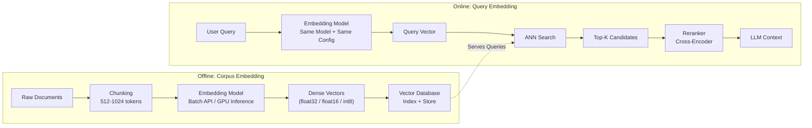
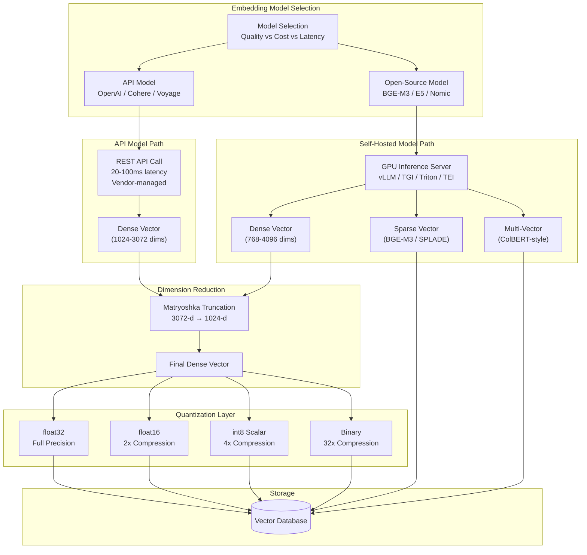

# Embedding Models

## 1. Overview

Embedding models are specialized neural networks trained to map text (or other modalities) into fixed-dimensional vector spaces where geometric proximity encodes semantic similarity. They are distinct from the internal representations of generative LLMs --- embedding models are explicitly optimized for similarity comparison via contrastive training objectives, not for next-token prediction. Every vector search system, RAG pipeline, and semantic retrieval layer depends on the quality, dimensionality, cost, and latency characteristics of its embedding model.

For a Principal AI Architect, embedding model selection is a compounding decision. The model determines retrieval quality (measured via MTEB benchmarks and domain-specific evaluation), storage cost (proportional to dimensionality and data type), search latency (higher dimensions mean slower ANN traversal), and operational coupling (switching models requires full corpus re-embedding, which at billion-scale costs days and thousands of dollars in compute). Choosing the wrong model at the start creates technical debt that grows linearly with corpus size.

**Key numbers that shape embedding model decisions:**

- OpenAI text-embedding-3-small: 1536-d, $0.02/1M tokens, ~0.5 ms/query (API), MTEB avg ~62.3
- OpenAI text-embedding-3-large: 3072-d (reducible to 256--3072), $0.13/1M tokens, MTEB avg ~64.6
- Cohere Embed v3 (English): 1024-d, $0.10/1M tokens, MTEB avg ~64.5
- BGE-M3: 1024-d, open-source, MTEB avg ~62+ (varies by task), supports dense+sparse+multi-vector
- E5-Mistral-7B-Instruct: 4096-d, open-source, MTEB avg ~66.6 (highest open-source at release)
- Corpus re-embedding cost: 100M documents x 512 tokens avg x $0.02/1M tokens = $1,024 for OpenAI small
- Corpus re-embedding time: 100M documents at 1000 docs/sec throughput = ~28 hours

---

## 2. Where It Fits in GenAI Systems

Embedding models sit at the boundary between unstructured text and the mathematical structures (vector databases, ANN indexes) that enable efficient retrieval. They are invoked in two distinct paths:



**Critical constraint**: The query embedding model MUST be identical (same model, same version, same dimensionality settings) to the corpus embedding model. Mixing models produces vectors in incompatible spaces --- cosine similarity between them is meaningless.

**Integration with adjacent systems:**

- **Vector databases** ([02-vector-databases.md](./02-vector-databases.md)): The model's output dimensionality and data type determine index configuration, memory requirements, and supported quantization strategies.
- **ANN algorithms** ([03-ann-algorithms.md](./03-ann-algorithms.md)): Higher dimensions increase the curse-of-dimensionality effect, making ANN search less efficient. Matryoshka dimension reduction directly affects ANN performance.
- **Hybrid search** ([04-hybrid-search.md](./04-hybrid-search.md)): Some embedding models (BGE-M3, SPLADE) produce both dense and sparse vectors, enabling native hybrid search without separate BM25 infrastructure.
- **RAG pipeline** ([../04-rag/01-rag-pipeline.md](../04-rag/01-rag-pipeline.md)): Embedding quality is the single largest determinant of RAG retrieval accuracy. A 5% recall improvement at the embedding stage compounds through reranking and generation.
- **Retrieval and reranking** ([../04-rag/04-retrieval-reranking.md](../04-rag/04-retrieval-reranking.md)): Bi-encoder embeddings are the first stage; cross-encoder rerankers are the second stage. The embedding model determines the quality ceiling of the candidate set.
- **Embeddings foundations** ([../01-foundations/04-embeddings.md](../01-foundations/04-embeddings.md)): Conceptual foundations of vector representations, distance metrics, and the evolution from Word2Vec to modern models.

---

## 3. Core Concepts

### 3.1 OpenAI text-embedding-3 Family

OpenAI's third-generation embedding models (released January 2024) introduced two key innovations: dramatically reduced pricing and native Matryoshka dimension support.

**text-embedding-3-small:**
- Native dimensionality: 1536
- Matryoshka support: Reduce to any dimension (256, 512, 1024, etc.) via the `dimensions` API parameter. The model is trained with Matryoshka Representation Learning (MRL) so that leading dimensions carry the most information.
- Context length: 8,191 tokens
- Pricing: $0.02/1M tokens (~67% reduction from ada-002)
- MTEB average: ~62.3 (all tasks), ~44.0 (retrieval-only tasks)
- Distance metric: Cosine (vectors are normalized)
- Use case: Cost-sensitive workloads, high-volume embeddings, applications where 512-d reduced vectors are acceptable

**text-embedding-3-large:**
- Native dimensionality: 3072
- Matryoshka support: Reduce to any dimension (256--3072). At 1024-d, it outperforms text-embedding-3-small at 1536-d.
- Context length: 8,191 tokens
- Pricing: $0.13/1M tokens
- MTEB average: ~64.6 (all tasks), ~49.0 (retrieval-only tasks)
- Use case: Quality-critical workloads, enterprise search, legal/medical retrieval

**Matryoshka Representation Learning (MRL):**
During training, the model is simultaneously optimized for the full dimension and for truncated prefixes (first 256-d, first 512-d, etc.). This means you can embed at 3072-d, store 1024-d (truncated), and still retain most of the quality. The key insight: reducing text-embedding-3-large from 3072 to 1024 dimensions loses only ~1--2% MTEB score, but reduces storage and search cost by 3x. This is strictly better than using text-embedding-3-small at 1536-d for most workloads.

### 3.2 Cohere Embed v3

Cohere's Embed v3 (released November 2023) is a commercial embedding API with a focus on compression-aware training and multilingual support.

**Key features:**
- Dimensionality: 1024 (English), 1024 (multilingual)
- Context length: 512 tokens
- Input types: `search_document`, `search_query`, `classification`, `clustering`. Specifying the input type during embedding aligns the vector space for the task --- this is critical for quality. Omitting the type or using the wrong type degrades recall by 5--15%.
- Native quantization: Embed v3 is trained with compression-aware objectives, meaning it produces embeddings that retain quality under int8 and binary quantization. Cohere reports <1% quality loss with int8 (4x compression) and <5% with binary (32x compression) on their benchmarks.
- Multilingual: 100+ languages in a single model. Queries in one language retrieve documents in another.
- Pricing: $0.10/1M tokens (search type)
- MTEB average: ~64.5 (English)

**Compression-aware training**: Unlike models where quantization is applied post-hoc (and degrades quality unpredictably), Cohere trains the model to produce embeddings whose quality is robust to quantization. The model learns to spread information across dimensions such that discretization preserves ranking order. This is a significant architectural advantage for cost-sensitive deployments.

### 3.3 BGE-M3

BGE-M3 (published by BAAI, 2024) is an open-source model that unifies three retrieval modalities in a single model:

**Multi-lingual**: 100+ languages, competitive with language-specific models.

**Multi-granularity**: Supports inputs from short queries (5 tokens) to long documents (8192 tokens) with a context window of 8192 tokens.

**Multi-functionality**: A single forward pass produces three types of output:
1. **Dense embedding** (1024-d): Standard bi-encoder output from the [CLS] token. Used for dense ANN search.
2. **Sparse embedding**: Learned sparse vector (SPLADE-like). Each token gets a weight indicating its importance. The output is a sparse vector over the vocabulary (~250K dimensions, but only ~50--200 non-zero entries). Used for lexical matching without BM25 infrastructure.
3. **Multi-vector (ColBERT-style)**: Per-token embeddings (sequence_length x 1024). Used for late-interaction scoring (MaxSim) where query tokens interact with document tokens individually.

This is transformative for architecture simplification: a single model replaces the dense embedding model + BM25 index + optional ColBERT reranker. Hybrid search becomes a single-model operation rather than a multi-system orchestration.

**Limitations**: Hosting a 560M-parameter model in-house requires GPU infrastructure. Throughput is lower than smaller models (~200--500 docs/sec on A100 for dense-only, lower with multi-vector). The sparse and multi-vector outputs increase storage and index complexity.

### 3.4 E5-Mistral-7B-Instruct

E5-Mistral-7B-Instruct (Wang et al., 2024) is an instruction-following embedding model built on the Mistral-7B decoder-only architecture.

**Key innovations:**
- **Decoder-only architecture for embeddings**: Most embedding models are encoder-only (BERT-based). E5-Mistral uses a causal decoder, taking the last token's hidden state as the embedding (with a learned projection). This leverages the larger model capacity and instruction-following capabilities of decoder models.
- **Instruction-based task specification**: Prefix the input with a natural language instruction: `"Instruct: Retrieve documents about machine learning\nQuery: what is gradient descent"`. The model adapts its embedding space based on the instruction.
- **Dimensionality**: 4096 (Mistral-7B hidden size). Higher than most commercial models, which increases storage cost but also information capacity.
- **MTEB performance**: ~66.6 average, the highest among open-source models at release. Particularly strong on retrieval tasks.
- **Limitations**: 7B parameters requires a full GPU for inference (~14 GB VRAM in float16). Latency is 10--50x higher than BERT-based models (1--5 ms vs. 50--200 ms per query). Not viable for real-time query embedding without optimization (quantization, batching, distillation).

### 3.5 Nomic Embed

Nomic Embed (Nussbaum et al., 2024) is a fully open-source, open-weights, open-data embedding model.

**Key features:**
- **Nomic Embed Text v1.5**: 768-d native, Matryoshka support (64--768-d), 8192-token context.
- **Full transparency**: Training data, training code, model weights, and evaluation code are all publicly available. Critical for regulated industries that need auditability.
- **Matryoshka training**: Like OpenAI text-embedding-3, supports dimension reduction. At 256-d, it retains ~95% of the 768-d quality.
- **Performance**: Competitive with OpenAI text-embedding-3-small at a fraction of the cost (self-hosted). MTEB average ~62+ depending on dimension.
- **Nomic Atlas**: Companion visualization platform for exploring embedding spaces at scale.
- **Licensing**: Apache-2.0. No usage restrictions.

### 3.6 Voyage AI

Voyage AI produces domain-specialized embedding models optimized for specific verticals.

**Model lineup:**
- **voyage-3**: General-purpose, 1024-d, 32K token context. Competitive with text-embedding-3-large.
- **voyage-3-lite**: Lightweight general-purpose, 512-d, 32K context. Cost-optimized.
- **voyage-code-3**: Optimized for code search (code-to-code, query-to-code). Trained on code-specific pairs including docstrings, comments, function names, and code bodies. Outperforms general models by 10--20% on code retrieval benchmarks.
- **voyage-law-2**: Optimized for legal document retrieval. Trained on legal corpora (case law, statutes, contracts).
- **voyage-finance-2**: Optimized for financial document retrieval (earnings reports, SEC filings, financial news).
- Pricing: $0.06/1M tokens (voyage-3), $0.02/1M tokens (voyage-3-lite)

**When to choose Voyage**: If your retrieval domain is highly specialized (code, legal, finance), domain-specific models consistently outperform general-purpose models. The quality gap is largest on domain-specific jargon, abbreviations, and reasoning patterns.

### 3.7 Jina Embeddings v3

Jina Embeddings v3 (released 2024) is an open-weights model with task-specific adaptation via LoRA.

**Key features:**
- **Task LoRA adapters**: The base model has shared weights. Task-specific LoRA adapters (lightweight parameter modules) are activated based on the task type: `retrieval.query`, `retrieval.passage`, `text-matching`, `classification`, `separation`. This is similar to Cohere's input types but implemented via adapter modules rather than training-time conditioning.
- **Dimensionality**: 1024 native, Matryoshka support for lower dimensions.
- **Context length**: 8192 tokens.
- **Late interaction support**: Can produce multi-vector (ColBERT-style) outputs for late-interaction reranking.
- **Multilingual**: 89 languages.
- **Licensing**: CC-BY-NC-4.0 (non-commercial). Commercial license available from Jina AI.

### 3.8 MTEB Benchmark

The Massive Text Embedding Benchmark (MTEB) is the standard benchmark for comparing embedding models across diverse tasks.

**Task categories (8 total):**

| Task Category | # Datasets | What It Measures | Example Dataset |
|---|---|---|---|
| Retrieval | 15 | Bi-encoder recall/NDCG for passage retrieval | MS MARCO, NQ, BEIR |
| STS (Semantic Textual Similarity) | 10 | Correlation between predicted and human similarity scores | STS Benchmark |
| Classification | 12 | Accuracy of embeddings for text classification (kNN or linear probe) | Amazon Reviews |
| Clustering | 11 | Cluster quality (V-measure) when using embeddings for k-means | ArXiv Clustering |
| Pair Classification | 3 | Binary classification of text pairs (paraphrase, entailment) | Twitter URL Paraphrase |
| Reranking | 4 | Reranking quality (MAP) of candidates | AskUbuntu, SciDocs |
| Summarization | 1 | Correlation between embedding similarity and human summary scores | SummEval |
| BitextMining | 1 | Accuracy of cross-lingual sentence matching | BUCC |

**How to interpret MTEB scores:**

- The "average" score across all tasks is the most commonly cited, but it can be misleading. A model scoring 65 average may score 48 on retrieval and 80 on STS --- and for RAG, only retrieval matters.
- **For RAG systems**: Focus on the Retrieval subset (NDCG@10 on BEIR). This is the most predictive metric for real-world retrieval quality.
- **For classification**: Focus on Classification and Clustering subsets.
- **For semantic search**: Retrieval + STS combined.

**MTEB limitations:**
- English-dominated. Multilingual evaluation requires MTEB extensions (MTEB-multilingual) or separate benchmarks.
- Datasets are public, so models can overfit (train on test data). Some models show suspiciously high scores on specific datasets.
- Does not measure latency, cost, or operational characteristics. A 7B-parameter model scoring 66 is not comparable to a 100M-parameter model scoring 63 for production deployment.
- Retrieval benchmarks use short queries and passages. Long-document retrieval performance is not well-captured.

### 3.9 Fine-Tuning Embeddings

When off-the-shelf models underperform on your domain (common in legal, medical, financial, and proprietary domains), fine-tuning is the primary lever.

**Contrastive learning objective:**
The standard training objective for embedding fine-tuning is InfoNCE (contrastive loss). Given a query q, a positive passage p+, and N negative passages p-, minimize:

`L = -log(exp(sim(q, p+) / tau) / sum(exp(sim(q, p_i) / tau)))`

where `sim` is cosine similarity and `tau` is a temperature parameter (typically 0.01--0.05). This pushes the query closer to its positive and away from negatives in the embedding space.

**Triplet loss**: An older alternative. Given (anchor, positive, negative), minimize `max(0, sim(anchor, negative) - sim(anchor, positive) + margin)`. Less effective than InfoNCE for most tasks because it considers only one negative per step.

**Hard negative mining:**
The quality of negatives determines training effectiveness. Random negatives are too easy --- the model learns nothing from them. Hard negatives are passages that are topically related but not the correct answer. Sources of hard negatives:
1. **BM25 negatives**: Run BM25 on the query, take top results that are not the positive. These are lexically similar but semantically different.
2. **In-batch negatives**: Use other queries' positives as negatives within the same batch. Scale: batch size of 512 provides 511 negatives per query.
3. **ANN-mined negatives**: Embed the corpus with the current model checkpoint, retrieve nearest neighbors that are not positives. Re-mine every few epochs as the model improves.

**Practical fine-tuning recipe:**
1. Start with a strong base model (BGE-base, Nomic Embed, E5-base).
2. Curate 10K--100K (query, positive_passage) pairs from your domain. Quality matters more than quantity.
3. Mine hard negatives using BM25 + the base model's embeddings.
4. Fine-tune with InfoNCE loss, batch size 128--512 (larger batches = more in-batch negatives), learning rate 1e-5 to 5e-5, 3--10 epochs.
5. Evaluate on a held-out test set using Recall@10 and NDCG@10.
6. Expected improvement: 5--20% recall improvement on domain-specific queries. Diminishing returns beyond 100K training pairs for most domains.

**Sentence Transformers library**: The standard framework for embedding fine-tuning. Provides `MultipleNegativesRankingLoss` (InfoNCE), `TripletLoss`, hard negative mining utilities, and MTEB evaluation integration.

### 3.10 Selection Criteria Decision Framework

The embedding model selection process balances five dimensions:

**Quality**: Measured by MTEB retrieval score (NDCG@10 on BEIR) or, preferably, evaluation on your own domain data. Off-the-shelf benchmarks are necessary but not sufficient --- always evaluate on representative queries from your production workload.

**Cost**: Total cost = embedding cost (per-token API pricing or self-hosted GPU cost) x corpus size + per-query embedding cost x query volume. For a 100M document corpus with 1M queries/day, the ongoing query cost often dominates corpus embedding cost within months.

**Latency**: Query embedding latency adds directly to search latency. BERT-based models (< 500M parameters): 1--5 ms on GPU. 7B-parameter models: 50--200 ms on GPU. API models: 20--100 ms including network round-trip.

**Dimensionality**: Determines vector storage cost and ANN search speed. Each dimension costs 4 bytes (float32), 2 bytes (float16), or 0.125 bytes (binary) per vector. At 1B vectors, the difference between 256-d and 3072-d is 767 GB vs. 11.4 TB in float32.

**Language support**: Monolingual English models (OpenAI, E5) vs. multilingual models (Cohere, BGE-M3, Jina). Multilingual models may sacrifice 1--3% English quality for cross-lingual capability.

---

## 4. Architecture

The following diagram shows how embedding model choice propagates through the retrieval system architecture:



**Embedding inference infrastructure for self-hosted models:**

For production self-hosted embedding, the dominant deployment options are:

1. **Hugging Face Text Embeddings Inference (TEI)**: Purpose-built for embedding model serving. Supports continuous batching, dynamic padding, flash attention, and ONNX/TensorRT backends. Optimized for throughput: 1000--5000 docs/sec on A100 for BERT-base class models.

2. **Triton Inference Server**: NVIDIA's general-purpose inference server. Supports model ensembles (tokenizer + model in a pipeline), dynamic batching, and multi-GPU. More complex to configure than TEI but more flexible.

3. **vLLM**: Primarily for generative models but supports embedding mode for decoder-based embedding models (E5-Mistral). PagedAttention provides memory-efficient inference for large models.

4. **Sentence Transformers + FastAPI**: Simple but not production-optimized. No continuous batching, no dynamic padding. Suitable for prototyping only.

---

## 5. Design Patterns

### Pattern 1: Dual-Model Hybrid Embedding

Use a lightweight model (text-embedding-3-small, 512-d reduced) for the initial dense retrieval candidate set, and a heavyweight model (text-embedding-3-large, 3072-d) for reranking or second-stage scoring. Reduces storage and search cost while preserving quality. This is the embedding analog of the retrieval-reranking two-stage pattern.

### Pattern 2: Matryoshka Progressive Retrieval

Store full-dimension vectors (3072-d). At query time, search first at 256-d (fast, approximate) to get top-100 candidates, then rescore at full 3072-d to get final top-10. Analogous to quantized search with rescoring, but operates in the dimension axis rather than the precision axis.

### Pattern 3: Domain-Adapted Base + Task LoRA

Fine-tune a base embedding model on your domain corpus (contrastive learning on domain-specific pairs). Then train task-specific LoRA adapters for different retrieval tasks (code search, Q&A, document similarity). At query time, activate the appropriate adapter based on query routing. Jina v3 implements this natively; you can replicate it with any base model using PEFT/LoRA.

### Pattern 4: Embedding Versioning and A/B Testing

Maintain multiple embedding versions (model_v1, model_v2) in parallel indexes. Route a percentage of queries to each version and measure retrieval quality metrics (click-through rate, RAGAS faithfulness, user satisfaction). Only cut over to the new model when metrics confirm improvement. Prevents regressions from model updates.

### Pattern 5: Chunking-Aware Embedding

Different embedding models handle different input lengths optimally. Match your chunking strategy to the model's sweet spot: 256 tokens for models with 512-token context (Cohere Embed v3), 512--1024 tokens for models with 8192-token context (BGE-M3, Jina v3). Overly long chunks dilute the embedding signal; overly short chunks lose context.

---

## 6. Implementation Approaches

### Approach 1: API-First (OpenAI / Cohere / Voyage)

Best for teams without GPU infrastructure. Call the embedding API during ingestion and query time. Use batching (up to 2048 inputs per OpenAI call) for ingestion throughput. Implement retry with exponential backoff for rate limits. Cache query embeddings for repeated queries.

```python
# OpenAI embedding with Matryoshka dimension reduction
from openai import OpenAI
client = OpenAI()

response = client.embeddings.create(
    model="text-embedding-3-large",
    input=["Your query or document text"],
    dimensions=1024  # Matryoshka reduction from 3072
)
vector = response.data[0].embedding  # List[float] of length 1024
```

### Approach 2: Self-Hosted with TEI

Deploy Hugging Face TEI on GPU instances for full control over cost, latency, and data privacy.

```bash
# Deploy BGE-M3 with TEI (Docker)
docker run --gpus all -p 8080:80 \
  ghcr.io/huggingface/text-embeddings-inference:latest \
  --model-id BAAI/bge-m3 \
  --max-client-batch-size 256 \
  --max-batch-tokens 131072
```

At ~$3/hour for an A10G instance, self-hosted BGE-M3 processes ~2000 docs/sec at 512-token average length. For a 100M document corpus, this is ~14 hours and ~$42 in compute --- compared to ~$1,024 for OpenAI text-embedding-3-small API.

### Approach 3: Fine-Tuned Model for Domain Specificity

When off-the-shelf models yield <80% recall on your domain evaluation set, fine-tune.

```python
from sentence_transformers import SentenceTransformer, InputExample
from sentence_transformers.losses import MultipleNegativesRankingLoss

# Load base model
model = SentenceTransformer("BAAI/bge-base-en-v1.5")

# Training data: (query, positive_passage) pairs
train_examples = [
    InputExample(texts=["what is HIPAA compliance?",
                        "HIPAA requires covered entities to implement..."]),
    # ... 10K-100K pairs
]

# InfoNCE loss with in-batch negatives
train_loss = MultipleNegativesRankingLoss(model=model)

model.fit(
    train_objectives=[(train_dataloader, train_loss)],
    epochs=5,
    warmup_steps=100,
    evaluation_steps=500,
)
```

---

## 7. Tradeoffs

### Model Selection Decision Table

| Scenario | Recommended Model | Rationale |
|---|---|---|
| General-purpose RAG, low budget | OpenAI text-embedding-3-small (512-d) | Cheapest API, Matryoshka to 512-d, good enough for most |
| Quality-critical enterprise RAG | OpenAI text-embedding-3-large (1024-d) | Best API quality, Matryoshka to 1024-d balances cost/quality |
| Multilingual retrieval | Cohere Embed v3 or BGE-M3 | 100+ languages, cross-lingual retrieval |
| Code search | Voyage voyage-code-3 | Domain-specific, 10-20% better on code retrieval |
| Legal / finance | Voyage voyage-law-2 / voyage-finance-2 | Domain-specific training data |
| Data sovereignty / air-gapped | BGE-M3 or Nomic Embed (self-hosted) | Open-source, no data leaves your network |
| Highest open-source quality | E5-Mistral-7B-Instruct | MTEB ~66.6, but requires GPU |
| Hybrid dense+sparse in one model | BGE-M3 | Single model produces dense, sparse, multi-vector |
| Full auditability required | Nomic Embed | Open data, open code, open weights (Apache-2.0) |
| Prototype / experimentation | Chroma default (all-MiniLM-L6-v2) | Fast, free, sufficient for validation |

### Dimension vs. Quality vs. Cost Tradeoffs

| Model | Dimensions | Storage/1M vecs | MTEB Retrieval (NDCG@10) | API Cost/1M tokens |
|---|---|---|---|---|
| text-embedding-3-small (native) | 1536 | 5.7 GB | ~44.0 | $0.02 |
| text-embedding-3-small (reduced) | 512 | 1.9 GB | ~42.5 | $0.02 |
| text-embedding-3-large (native) | 3072 | 11.4 GB | ~49.0 | $0.13 |
| text-embedding-3-large (reduced) | 1024 | 3.8 GB | ~47.8 | $0.13 |
| Cohere Embed v3 | 1024 | 3.8 GB | ~47.0 | $0.10 |
| Cohere Embed v3 (int8) | 1024 | 0.95 GB | ~46.5 | $0.10 |
| Cohere Embed v3 (binary) | 1024 | 0.12 GB | ~44.0 | $0.10 |
| BGE-M3 (dense) | 1024 | 3.8 GB | ~46.5 | Self-hosted |
| E5-Mistral-7B | 4096 | 15.3 GB | ~52.0 | Self-hosted |
| Nomic Embed v1.5 | 768 | 2.9 GB | ~42.0 | Self-hosted |

*Storage calculated as float32. Actual storage with index overhead is 1.5--2x.*

---

## 8. Failure Modes

### 8.1 Model Version Mismatch

**Symptom**: Retrieval quality degrades silently after a model update. **Cause**: The API provider updates the model version (even minor versions can shift the embedding space). Documents embedded with v1 are searched with v2 queries. **Mitigation**: Pin model versions explicitly. Store the model version as metadata per collection. Re-embed the corpus when switching versions. Monitor recall metrics continuously.

### 8.2 Input Type Mismatch (Cohere)

**Symptom**: Cohere Embed v3 returns poor retrieval results. **Cause**: Documents embedded with `input_type="search_document"` but queries embedded without specifying `input_type="search_query"` (or vice versa). The model applies different transformations for each type. **Mitigation**: Always specify input_type. Validate in integration tests.

### 8.3 Truncation Silently Drops Context

**Symptom**: Long documents are partially embedded. The embedding captures only the first 512 or 8192 tokens, missing critical content in the tail. **Cause**: All embedding models have a maximum context length. Content beyond this is silently truncated. **Mitigation**: Chunk documents to fit within the model's context window. Measure token count before embedding. Log truncation events.

### 8.4 Dimensionality Mismatch After Matryoshka Reduction

**Symptom**: Vector database rejects upsert or search returns garbage. **Cause**: Corpus embedded at 1024-d but query embedded at 1536-d (or vice versa). Matryoshka dimension must be specified identically at embed-time for both corpus and queries. **Mitigation**: Store dimension configuration alongside model version. Enforce at the application layer.

### 8.5 Embedding Model Latency Spike Under Load

**Symptom**: Query latency spikes during high-traffic periods. **Cause**: Embedding API rate limits (OpenAI: 3M tokens/min for tier 4), or self-hosted GPU saturation. Query embedding is on the critical path --- every additional millisecond adds to user-facing latency. **Mitigation**: Pre-compute and cache embeddings for common queries. Implement client-side request queuing. For self-hosted: auto-scale GPU instances based on queue depth.

---

## 9. Optimization Techniques

### 9.1 Matryoshka Dimension Selection

Systematically benchmark your retrieval quality at multiple dimensions (256, 512, 768, 1024, 1536, 3072) on your actual evaluation set. Find the "elbow point" where further dimension reduction drops recall below your threshold. Typical finding: 1024-d retains 97--99% of 3072-d quality for OpenAI large.

### 9.2 Embedding Caching

Cache query embeddings using a Redis or Memcached layer keyed on (model_version, input_text_hash, dimensions). Hit rates of 15--40% are common for search systems with repeated or similar queries. Saves both latency and API cost.

### 9.3 Batch Embedding with Async Processing

For corpus embedding, use async batching to maximize API throughput:
- OpenAI: 2048 inputs per batch, target 3M tokens/min
- Cohere: 96 inputs per batch
- Self-hosted TEI: configure `--max-client-batch-size` for GPU saturation

Use async HTTP clients (httpx, aiohttp) with 10--50 concurrent requests for API calls.

### 9.4 Mixed-Precision Storage

Embed in float32 (highest fidelity), then store in float16 (halves storage, <0.1% recall loss). For search, use scalar or binary quantized copies (fast approximate search) with float16 originals for rescoring.

### 9.5 Late Chunking for Long-Context Models

For models with 8192-token context (BGE-M3, Jina v3), embed the full document first (up to context limit), then extract per-chunk embeddings from the intermediate representations. This preserves cross-chunk context that independent chunk embedding loses. Requires model access at the hidden-state level (not available via API).

### 9.6 Prefix Tuning for Task Adaptation

Add task-specific prefixes to inputs without fine-tuning the model: `"Represent this document for retrieval: "` (E5 convention) or `"search_query: "` (BGE convention). Costs zero compute, improves recall by 2--5% on most models that were trained with prefix conventions.

---

## 10. Real-World Examples

### Notion AI (OpenAI Embeddings)

Notion embeds workspace content using OpenAI text-embedding-3-small for cost efficiency at scale (billions of chunks across millions of workspaces). They use Matryoshka dimension reduction to 512-d to reduce Pinecone storage costs while maintaining acceptable retrieval quality for their Q&A feature.

### Cohere-Powered Enterprise Search (Oracle, Jasper)

Oracle Cloud Infrastructure (OCI) integrates Cohere Embed v3 for enterprise document search. The compression-aware int8 embeddings reduce storage costs by 4x, which is critical when indexing enterprise content at petabyte scale. Jasper uses Cohere embeddings for their AI writing assistant's reference retrieval.

### GitHub Copilot (Voyage Code Embeddings)

GitHub Copilot's retrieval system (used for workspace-aware suggestions) leverages code-optimized embedding models for code search. Domain-specific models like Voyage's code embeddings provide higher recall on code retrieval tasks than general-purpose models, enabling more relevant context for code generation.

### Wikipedia Semantic Search (BGE-M3 at Wikimedia)

Wikimedia explored BGE-M3 for multilingual semantic search across Wikipedia's 60M+ articles in 300+ languages. The multi-functionality (dense + sparse in one model) simplifies the architecture by eliminating the need for separate BM25 and dense retrieval systems per language.

### Supabase Vector (pgvector + Multiple Embedding Providers)

Supabase's vector offering supports multiple embedding providers (OpenAI, Cohere, HuggingFace) through their Edge Functions. Users choose the embedding model based on their quality/cost tradeoff. pgvector stores the resulting vectors alongside relational data, enabling SQL-based hybrid queries.

---

## 11. Related Topics

- [Embeddings](../01-foundations/04-embeddings.md) --- foundational concepts of vector representations, distance metrics, and the evolution from Word2Vec
- [Vector Databases](./02-vector-databases.md) --- storage and indexing infrastructure that consumes embeddings
- [ANN Algorithms](./03-ann-algorithms.md) --- the search algorithms that operate over embedding vectors
- [Hybrid Search](./04-hybrid-search.md) --- combining dense embeddings with sparse representations
- [Retrieval and Reranking](../04-rag/04-retrieval-reranking.md) --- the two-stage pattern where embeddings drive the first stage
- [RAG Pipeline](../04-rag/01-rag-pipeline.md) --- end-to-end architecture where embedding quality determines retrieval accuracy

---

## 12. Source Traceability

| Claim / Data Point | Source |
|---|---|
| OpenAI text-embedding-3 pricing and dimensions | OpenAI API documentation and pricing page (January 2024 release) |
| Matryoshka Representation Learning | Kusupati et al., "Matryoshka Representation Learning" (NeurIPS 2022) |
| Cohere Embed v3 compression-aware training | Cohere blog, "Introducing Embed v3" (November 2023) |
| BGE-M3 multi-functionality | Chen et al., "BGE M3-Embedding: Multi-Lingual, Multi-Functionality, Multi-Granularity" (2024) |
| E5-Mistral-7B-Instruct | Wang et al., "Improving Text Embeddings with Large Language Models" (2024) |
| Nomic Embed open-source details | Nussbaum et al., "Nomic Embed: Training a Reproducible Long Context Text Embedder" (2024) |
| Voyage AI model lineup | Voyage AI documentation (voyageai.com/models) |
| Jina Embeddings v3 LoRA adapters | Jina AI blog, "Jina Embeddings v3" (2024) |
| MTEB benchmark task categories | Muennighoff et al., "MTEB: Massive Text Embedding Benchmark" (EACL 2023) |
| InfoNCE loss formulation | Oord et al., "Representation Learning with Contrastive Predictive Coding" (2018) |
| Sentence Transformers fine-tuning | Reimers and Gurevych, "Sentence-BERT" (EMNLP 2019); sentence-transformers library documentation |
| MTEB scores for individual models | MTEB leaderboard (huggingface.co/spaces/mteb/leaderboard), accessed 2024. Scores are approximate and may shift. |
