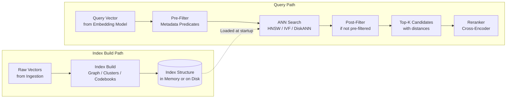
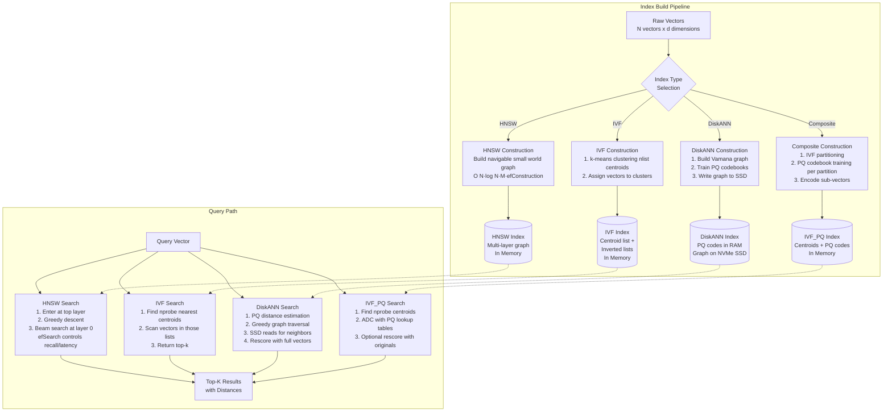
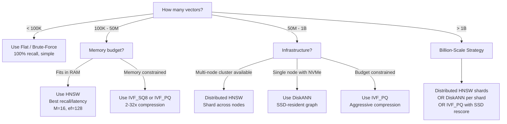

# Approximate Nearest Neighbor Algorithms

## 1. Overview

Approximate Nearest Neighbor (ANN) algorithms are the computational engines inside every vector database. They solve a fundamental problem: given a query vector and a corpus of N vectors in d-dimensional space, find the k most similar vectors without comparing against every vector in the corpus. Exact nearest neighbor search (brute-force) is O(N*d) per query --- at 100M vectors and 1024 dimensions, that is 100 billion floating-point operations per query, yielding multi-second latency. ANN algorithms trade a small amount of accuracy (recall) for orders-of-magnitude speedup, achieving sub-millisecond to single-digit-millisecond latency at billion scale.

For a Principal AI Architect, ANN algorithm selection is a multi-objective optimization across six dimensions: recall (what fraction of true top-k results are returned), query latency (p50, p95, p99), memory consumption (determines infrastructure cost), index build time (determines re-indexing cadence), update mutability (can you add/delete without rebuilding), and the interaction with filtering (how metadata predicates affect search quality). These dimensions have hard tradeoffs --- there is no algorithm that wins on all axes.

**Key numbers that anchor ANN decisions:**

- HNSW (1M vectors, 1536-d): 1--5 ms query latency, 95--99% recall@10, ~12 GB memory (float32 + graph)
- IVF_FLAT (1M vectors, 1536-d, nprobe=32): 5--15 ms query latency, 92--97% recall@10, ~6 GB memory
- IVF_PQ (1M vectors, 1536-d, 64 subvectors): 3--10 ms query latency, 85--93% recall@10, ~0.5 GB memory
- HNSW (1B vectors, 1536-d, distributed): 10--50 ms query latency, 92--97% recall@10, ~12 TB aggregate memory
- DiskANN (1B vectors, 128-d, single node, SSD): 3--10 ms query latency, 95--99% recall@10, ~64 GB RAM + SSD
- Brute-force (1M vectors, 1536-d): 50--200 ms query latency, 100% recall, ~6 GB memory, no build time

---

## 2. Where It Fits in GenAI Systems

ANN algorithms operate inside the vector database during the query path. They are invoked after the query vector is produced by the embedding model and before results are passed to the reranker. The algorithm is the critical path between "query vector exists" and "top-k candidates are returned."



**Adjacent system dependencies:**

- **Embedding models** ([embedding-models.md](./embedding-models.md)): The dimensionality and distribution of embeddings affect algorithm performance. Higher dimensions make all ANN methods less efficient (curse of dimensionality). Models with near-unit-norm vectors (normalized embeddings) enable angular distance metrics that some algorithms exploit.
- **Vector databases** ([vector-databases.md](./vector-databases.md)): Each database exposes a subset of ANN algorithms. Your database choice constrains your algorithm choice. Milvus supports the broadest set; pgvector supports only HNSW and IVFFlat.
- **Hybrid search** ([hybrid-search.md](./hybrid-search.md)): ANN search is the dense retrieval component of hybrid search. The algorithm must interact with metadata filtering and sparse retrieval fusion.
- **Latency optimization**: ANN query latency is often the largest component of end-to-end search latency after LLM generation.

---

## 3. Core Concepts

### 3.1 HNSW (Hierarchical Navigable Small World)

HNSW (Malkov and Yashunin, 2018) is the dominant ANN algorithm in production vector databases. It builds a multi-layer graph where each node is a vector and edges connect nearby vectors. Search starts at the top layer (sparse, long-range connections) and progressively descends to lower layers (dense, short-range connections), performing greedy graph traversal at each level.

**Construction algorithm:**

1. For each new vector, assign it a random layer level `l` drawn from an exponential distribution: `l = floor(-ln(random()) * mL)` where `mL = 1/ln(M)`.
2. Starting from the entry point at the top layer, greedily traverse to the nearest node at each layer above `l`.
3. At layer `l` and all layers below, insert the vector and connect it to the `M` nearest neighbors found during traversal. The candidate set at each layer is built using a dynamic list of size `efConstruction`.
4. Bidirectional edges: if inserting a connection would cause a node to exceed `M_max` connections (2*M at layer 0), prune the weakest connection.

**Search algorithm:**

1. Start at the entry point (top layer).
2. At each layer above the query's insertion layer, greedily traverse to the nearest node (beam width = 1).
3. At layer 0, perform a beam search with beam width = `efSearch`. Maintain a dynamic candidate list and a result list. Expand the nearest unvisited candidate, evaluate its neighbors, update both lists.
4. Return the top-k results from the result list.

**Parameters:**

| Parameter | Typical Range | Effect |
|---|---|---|
| `M` | 8--64 (default 16) | Max connections per node per layer. Higher M = better recall, more memory, slower build. Each connection costs ~8 bytes (4-byte node ID + 4-byte distance). Memory overhead: ~M * 2 * 8 bytes/vector at layer 0. |
| `efConstruction` | 64--512 (default 128) | Candidate list size during index construction. Higher = better graph quality, slower build. Affects recall ceiling --- a poorly built graph cannot be compensated by higher efSearch. |
| `efSearch` | 32--512 (default 64) | Candidate list size during query. Higher = better recall, higher latency. This is the primary query-time tuning knob. Linear relationship: 2x efSearch ≈ 2x latency, +1--3% recall. |

**Memory model:**
- Vector storage: `N * d * sizeof(float)` (e.g., 1M * 1536 * 4 = 5.7 GB)
- Graph overhead: ~`N * M * 2 * 8` bytes at layer 0, plus ~`N * M * 8 / ln(M)` bytes for upper layers. For M=16, ~256 bytes/vector. At 1M vectors: ~256 MB.
- Total for 1M vectors at 1536-d: ~6.0 GB. At 100M: ~600 GB. At 1B: ~6 TB.

**Strengths**: Highest recall at any given latency budget. Mutable --- supports incremental inserts and deletes without full rebuild. Widely implemented in every major vector database.

**Weaknesses**: High memory (entire graph + vectors must fit in RAM for optimal performance). Build time is O(N * log(N) * M * efConstruction). Filtered search can degrade recall if filters are highly selective (the graph was built without filter awareness).

### 3.2 IVF (Inverted File Index)

IVF partitions the vector space into clusters using k-means, then during search only examines vectors in the nearest clusters.

**Construction:**

1. **Coarse quantizer training**: Run k-means on the full dataset (or a representative sample) to produce `nlist` centroids. Typical nlist: `sqrt(N)` to `4*sqrt(N)`. For 1M vectors: 1000--4000 centroids.
2. **Assignment**: Assign each vector to its nearest centroid. Store vectors in inverted lists (one list per centroid).

**Search:**

1. Compute distances from the query vector to all `nlist` centroids.
2. Select the `nprobe` nearest centroids.
3. Scan all vectors in those `nprobe` inverted lists.
4. Return the global top-k across all scanned vectors.

**Parameters:**

| Parameter | Typical Range | Effect |
|---|---|---|
| `nlist` | 256--65536 | Number of clusters. More clusters = smaller lists = faster search but more centroid comparisons and higher risk of missing nearby clusters. |
| `nprobe` | 1--256 (default 8) | Number of clusters to search. Higher nprobe = better recall, higher latency. nprobe=nlist is brute-force. |

**Recall vs. nprobe**: At nprobe=1, recall is typically 40--60%. At nprobe=32, recall reaches 90--97%. At nprobe=128, recall reaches 97--99%. The relationship is logarithmic --- doubling nprobe yields diminishing recall improvements.

**Strengths**: Lower memory than HNSW (no graph structure). Fast build (k-means + assignment). Well-understood, theoretically grounded.

**Weaknesses**: Immutable --- inserting new vectors requires either re-clustering or appending to existing lists (which degrades quality as the cluster distribution shifts). Lower recall than HNSW at the same latency budget. Sensitive to data distribution (skewed clusters degrade performance).

### 3.3 PQ (Product Quantization)

Product Quantization compresses vectors by decomposing them into sub-vectors and encoding each sub-vector with a codebook index.

**Construction:**

1. Split each d-dimensional vector into `m` sub-vectors of dimension `d/m`. Typical: d=1536, m=64, sub-dimension=24.
2. For each sub-vector position, train a k-means codebook with `k_sub` centroids (typically 256, stored as uint8). This creates `m` codebooks, each with 256 entries of dimension `d/m`.
3. Encode each vector as `m` uint8 codes (one per sub-vector). Storage per vector: `m` bytes (e.g., 64 bytes for m=64 vs. 6144 bytes for float32).

**Search (Asymmetric Distance Computation --- ADC):**

1. For the query vector, precompute the distance from each query sub-vector to all 256 centroids in the corresponding codebook. This produces an `m x 256` lookup table.
2. For each compressed vector (m uint8 codes), look up the precomputed distances and sum them. Total cost per vector: `m` table lookups + `m-1` additions.
3. This is dramatically faster than computing full float32 distances.

**Compression ratio**: Original vector (d floats, 4d bytes) compressed to m bytes. For d=1536, m=64: compression ratio = 96x. For m=128: 48x.

**Recall impact**: PQ introduces quantization error. More sub-vectors (higher m) = lower compression but higher recall. Typical recall@10: 85--93% for aggressive compression, 93--97% for moderate compression.

### 3.4 ScaNN (Scalable Nearest Neighbors)

ScaNN (Guo et al., 2020) is Google's ANN library introducing **anisotropic vector quantization**.

**Key insight**: Standard quantization (PQ, k-means) minimizes reconstruction error uniformly in all directions. But for nearest neighbor search, errors in the direction of the query matter more than errors perpendicular to it. A vector quantized to a centroid that is slightly closer to the query is worse than one that is slightly farther but in the correct direction.

**Anisotropic quantization**: Modifies the quantization loss function to penalize errors along the query direction more heavily. During codebook training, centroids are pulled toward the direction that preserves inner product ordering rather than minimizing L2 reconstruction error.

**Architecture**: ScaNN uses a multi-stage pipeline:
1. **Partitioning**: Coarse-grained partitioning (similar to IVF).
2. **Anisotropic quantization**: Compressed representations within each partition.
3. **Rescoring**: Optional final stage with original vectors for top candidates.

**Performance**: On benchmarks (ann-benchmarks.com), ScaNN consistently achieves the best recall-vs-QPS tradeoff for inner product search, outperforming HNSW at high recall (>95%) by 1.5--3x in throughput.

**Availability**: Open-source (Apache-2.0, google-research/scann). Available in Milvus as the SCANN index type. Not available in Qdrant, Pinecone, or pgvector.

### 3.5 DiskANN

DiskANN (Subramanya et al., 2019) is Microsoft's SSD-based ANN algorithm designed for billion-scale search on a single machine.

**Key insight**: HNSW requires the entire graph and all vectors in RAM, which is prohibitively expensive at billion scale (6+ TB). DiskANN stores the full-precision graph on SSD and keeps only a compressed representation (PQ codes) in RAM for distance estimation. The graph traversal reads neighbor lists from SSD, using the PQ codes to guide which SSD reads to make.

**Architecture:**

1. **Build**: Construct a Vamana graph (a variant of the navigable small world graph optimized for out-of-core access) on the full dataset. Store the graph on SSD.
2. **PQ codes in RAM**: Train PQ codes for all vectors. Keep these in RAM (~5--10 bytes/vector). At 1B vectors: ~5--10 GB RAM.
3. **Search**: Use PQ codes for approximate distance computation to guide greedy graph traversal. When traversing to a candidate, read its actual neighbor list from SSD (single random read, ~100 us on NVMe). Final scoring uses full-precision vectors read from SSD.

**Performance at 1B vectors (128-d):**
- RAM: 32--64 GB (PQ codes + metadata)
- SSD: ~128 GB (graph + vectors)
- Query latency: 3--10 ms (95th percentile) with NVMe SSD
- Recall@10: 95--99%
- Build time: 10--24 hours on a single machine

**Strengths**: Billion-scale on a single machine (~$500/month cloud instance instead of $10K+/month for RAM-resident HNSW cluster). Recall competitive with HNSW.

**Weaknesses**: Requires NVMe SSD (not network-attached storage). SSD wear from random reads limits lifespan under high QPS. Updates require merge-based approaches (not true online mutability). Latency is higher than in-memory HNSW (3--10 ms vs 1--3 ms).

**Availability**: Open-source (Microsoft/DiskANN). Available in Milvus (DISKANN index type). Available in Azure AI Search. Not available in Qdrant, Pinecone, Weaviate, or pgvector.

### 3.6 Composite Indexes

Composite indexes combine partitioning, quantization, and graph techniques for multi-objective optimization.

**IVF + PQ (IVF_PQ):**
Partition the space with IVF, then compress vectors within each partition using PQ. Reduces memory dramatically while maintaining reasonable recall. Search: probe `nprobe` clusters, compute approximate distances using PQ codes. Used in FAISS (Facebook AI Similarity Search) and Milvus.

- Memory: `N * m` bytes for PQ codes + centroid storage. At 1B vectors, m=64: ~64 GB.
- Recall: 80--90% at nprobe=32, m=64.
- Latency: 5--20 ms at 1B vectors.

**IVF + SQ (IVF_SQ8):**
IVF partitioning with scalar quantization (float32 to uint8 per dimension). Less aggressive than PQ, higher recall, more memory. Each vector stored as `d` uint8 values.

- Memory: `N * d` bytes. At 1B vectors, d=1536: ~1.4 TB.
- Recall: 90--97% at nprobe=32.

**HNSW + PQ:**
Build an HNSW graph using PQ-compressed vectors for distance estimation during traversal. Store original vectors separately for rescoring. Reduces HNSW memory by the PQ compression ratio while maintaining graph navigation quality.

- Memory: HNSW graph + PQ codes + optional full vectors for rescoring.
- Recall: 92--97% with rescoring.
- Used in: Qdrant (HNSW with PQ), Milvus (experimental).

**HNSW + SQ:**
HNSW graph with scalar quantized vectors. Less compression than PQ but simpler and faster. Qdrant's scalar quantization mode.

### 3.7 Recall vs. Latency vs. Memory: Benchmark Data

The following table summarizes typical performance characteristics on the SIFT-1M benchmark (128-d, 1M vectors, L2 distance). Higher-dimensional production workloads (1024-d, 1536-d) show similar relative rankings but higher absolute latencies and memory usage.

| Algorithm | Recall@10 | QPS (single thread) | Memory | Build Time |
|---|---|---|---|---|
| Brute-force | 100% | 50--100 | 512 MB | 0 |
| HNSW (M=16, ef=128) | 99.1% | 1,000--3,000 | 760 MB | 5 min |
| HNSW (M=16, ef=64) | 97.8% | 2,500--6,000 | 760 MB | 5 min |
| HNSW (M=16, ef=32) | 94.2% | 5,000--10,000 | 760 MB | 5 min |
| IVF_FLAT (nlist=1024, nprobe=32) | 96.5% | 800--2,000 | 520 MB | 1 min |
| IVF_FLAT (nlist=1024, nprobe=8) | 87.3% | 3,000--6,000 | 520 MB | 1 min |
| IVF_PQ (nlist=1024, nprobe=32, m=32) | 88.1% | 5,000--12,000 | 40 MB | 3 min |
| ScaNN (partitions=1024, reorder=200) | 98.5% | 4,000--10,000 | 200 MB | 2 min |
| DiskANN (R=64, L=100) | 98.8% | 2,000--5,000 | 64 MB RAM + SSD | 30 min |

*Numbers from ann-benchmarks.com and published papers. Actual production numbers vary with hardware, dimensionality, and data distribution.*

### 3.8 Index Build Time and Update Strategies

**Immutable indexes (IVF, PQ, ScaNN):**
These indexes are built on a static dataset. Inserting new vectors requires either:
1. **Append to existing clusters**: Add vectors to the nearest cluster without re-training centroids. Works for small additions (<10% of corpus) but degrades quality as cluster distribution shifts.
2. **Full rebuild**: Re-run k-means clustering and PQ training on the updated dataset. Time: minutes to hours depending on corpus size.
3. **Delta index**: Maintain a small mutable index (HNSW or flat) for recent inserts. Periodically merge into the main IVF index. Search queries both indexes and merges results.

**Mutable indexes (HNSW, DiskANN):**
HNSW supports true incremental inserts --- new vectors are connected to the existing graph without rebuilding. Deletes are handled by marking nodes as deleted and skipping them during traversal (lazy deletion). However:
- Graph quality degrades over time with many inserts/deletes (dead nodes fragment the graph, new inserts may have suboptimal connections).
- Periodic rebuilding (e.g., weekly) restores optimal graph quality.
- DiskANN supports merge-based updates: new vectors are indexed in a delta, periodically merged with the main index.

**Production strategy**: Use HNSW for workloads with frequent updates (<1-hour freshness requirement). Use IVF_PQ for large, batch-updated corpora where daily rebuilds are acceptable. Use DiskANN for billion-scale with weekly refresh cadence.

### 3.9 Billion-Scale Search

At billion-scale (>1B vectors), no single-node in-memory index is practical for HNSW (requires >6 TB RAM at 1536-d). Three strategies:

**Strategy 1: Distributed HNSW (sharding)**
Partition the corpus across N shards (machines), each holding a subset of vectors with its own HNSW index. A query coordinator fans out the query to all shards, each returns local top-k, the coordinator merges to global top-k.
- Shard count: `total_memory / per_machine_memory`. For 1B vectors at 1536-d float32 + HNSW overhead (~7 TB): 14 shards at 512 GB RAM each.
- Latency: determined by the slowest shard (tail latency). Over-provisioning reduces tail effects.
- Used by: Pinecone, Weaviate, Qdrant (distributed mode).

**Strategy 2: DiskANN (single node)**
Store the graph on NVMe SSD. Dramatically reduces cost for lower QPS workloads.
- Cost: ~$500/month (single large instance with NVMe) vs. ~$7K/month (14-shard HNSW cluster).
- Tradeoff: higher per-query latency (5--10 ms vs. 1--3 ms), lower QPS ceiling.
- Used by: Azure AI Search, Milvus.

**Strategy 3: IVF_PQ with tiered storage**
Coarse IVF partitioning + PQ compression in RAM, with full vectors on SSD for rescoring. Extremely memory-efficient. Total RAM: ~64 GB for 1B vectors.
- Recall: 85--92% without rescoring, 92--97% with SSD-based rescoring.
- Build time: hours to days for codebook training on 1B vectors.
- Used by: FAISS deployments at Meta, Google (ScaNN).

**Strategy 4: Hierarchical / tiered indexes**
Build a coarse index (IVF with 10K centroids) over cluster representatives. At query time, identify the top-10 clusters, then search fine-grained HNSW indexes within those clusters. Combines the efficiency of IVF routing with the quality of HNSW search.

---

## 4. Architecture

The following diagram shows how different ANN algorithms are composed in a production vector search system:



**Algorithm selection flow for production systems:**



---

## 5. Design Patterns

### Pattern 1: Two-Stage ANN + Rescore

Use a fast, low-memory index (IVF_PQ or binary quantized HNSW) to retrieve an over-sampled candidate set (top-100 or top-200), then rescore against full-precision vectors stored separately (on SSD or in a secondary store). Recovers 3--8% recall that quantization loses, at a cost of one additional memory access per candidate.

### Pattern 2: Adaptive efSearch

Instead of a fixed efSearch for all queries, adapt based on confidence. If the top-1 result's distance is far below a threshold (high confidence), return immediately. If results are clustered (low separation), increase efSearch dynamically to improve discrimination. This reduces average latency while maintaining recall on hard queries.

### Pattern 3: Pre-Built Per-Tenant Indexes

For multi-tenant systems with per-tenant data, build separate HNSW indexes per tenant. Avoids the filtered search degradation problem entirely (no filters needed). Trade memory overhead (per-index fixed cost) for predictable recall. Effective when tenant count is moderate (<10K) and per-tenant vector count is significant (>10K).

### Pattern 4: Delta Index + Periodic Merge

Maintain a small mutable HNSW index (delta) for real-time inserts. Serve queries against both the main immutable index (IVF_PQ) and the delta index, merging results. Periodically (daily/weekly) rebuild the main index incorporating the delta. Balances freshness against build cost.

### Pattern 5: Dimensionality Reduction Before Indexing

Apply Matryoshka truncation or PCA to reduce embedding dimensions before indexing. A 3072-d vector reduced to 768-d builds a 4x smaller HNSW graph that searches 2--3x faster. Combine with full-dimension rescoring for the final top-k. The ANN stage only needs to identify a good candidate set, not produce perfect rankings.

---

## 6. Implementation Approaches

### Approach 1: FAISS (Facebook AI Similarity Search)

FAISS is the reference implementation for most ANN algorithms. Written in C++ with Python bindings. Supports: Flat, IVF_FLAT, IVF_PQ, IVF_SQ8, PQ, HNSW, ScaNN-like quantization. Used internally at Meta for recommendation and search systems.

```python
import faiss
import numpy as np

d = 1536  # dimension
n = 1_000_000  # corpus size

# Build HNSW index
index = faiss.IndexHNSWFlat(d, 32)  # M=32
index.hnsw.efConstruction = 128
index.add(vectors)  # np.float32 array of shape (n, d)

# Search
index.hnsw.efSearch = 64
distances, ids = index.search(query_vector, k=10)
```

```python
# Build IVF_PQ index for memory efficiency
nlist = 4096  # clusters
m = 64  # PQ sub-vectors
quantizer = faiss.IndexFlatL2(d)
index = faiss.IndexIVFPQ(quantizer, d, nlist, m, 8)  # 8 bits per code
index.train(training_vectors)  # requires representative sample
index.add(vectors)
index.nprobe = 32
distances, ids = index.search(query_vector, k=10)
```

### Approach 2: Database-Native Index Configuration

Most production systems configure ANN through the vector database's API rather than using FAISS directly.

```python
# Qdrant: HNSW with scalar quantization
from qdrant_client import QdrantClient
from qdrant_client.models import (
    VectorParams, Distance, HnswConfigDiff,
    ScalarQuantization, ScalarQuantizationConfig, ScalarType,
    QuantizationSearchParams, SearchParams
)

client = QdrantClient("localhost", port=6333)
client.create_collection(
    collection_name="documents",
    vectors_config=VectorParams(
        size=1536, distance=Distance.COSINE
    ),
    hnsw_config=HnswConfigDiff(
        m=16,
        ef_construct=128,
        full_scan_threshold=10000  # brute-force below this size
    ),
    quantization_config=ScalarQuantization(
        scalar=ScalarQuantizationConfig(
            type=ScalarType.INT8,
            quantile=0.99,  # clip outliers
            always_ram=True  # keep quantized in RAM
        )
    )
)

# Search with quantization oversampling
results = client.search(
    collection_name="documents",
    query_vector=query_vec,
    limit=10,
    search_params=SearchParams(
        hnsw_ef=128,
        quantization=QuantizationSearchParams(
            rescore=True,  # rescore with original vectors
            oversampling=3.0  # retrieve 3x candidates before rescore
        )
    )
)
```

### Approach 3: pgvector HNSW Tuning

```sql
-- Create HNSW index with tuned parameters
SET maintenance_work_mem = '4GB';  -- more memory = faster build
CREATE INDEX ON documents
USING hnsw (embedding vector_cosine_ops)
WITH (m = 24, ef_construction = 200);

-- Tune search-time recall
SET hnsw.ef_search = 100;  -- default is 40

-- Check index size
SELECT pg_size_pretty(pg_relation_size('documents_embedding_idx'));
```

---

## 7. Tradeoffs

### Algorithm Selection Decision Table

| Requirement | Best Algorithm | Why |
|---|---|---|
| Highest recall at any cost | HNSW (high M, high ef) | Graph structure provides best recall/latency curve |
| Lowest memory footprint | IVF_PQ | 32--96x compression via product quantization |
| Real-time inserts + search | HNSW | True incremental insert without rebuild |
| Billion-scale, single node | DiskANN | SSD-resident, ~32 GB RAM for 1B vectors |
| Billion-scale, lowest latency | Distributed HNSW | Parallel search across shards, 1--5 ms |
| Inner product search | ScaNN | Anisotropic quantization optimized for IP |
| Batch-updated corpus | IVF_PQ or IVF_SQ8 | Fast rebuild, good compression |
| Simple ops, PostgreSQL | HNSW (pgvector) | No new infrastructure, SQL integration |

### Memory vs. Recall vs. Latency (1M vectors, 1536-d)

| Configuration | Memory | Recall@10 | p50 Latency | Mutable |
|---|---|---|---|---|
| HNSW (M=16, ef=128) | ~12 GB | 98.5% | 2 ms | Yes |
| HNSW + SQ (int8) | ~4 GB | 97.5% | 1.5 ms | Yes |
| HNSW + BQ (binary) | ~1 GB | 93.0% | 0.8 ms | Yes |
| IVF_FLAT (nprobe=32) | ~6.5 GB | 96.0% | 8 ms | No |
| IVF_PQ (m=64, nprobe=32) | ~0.3 GB | 89.0% | 4 ms | No |
| IVF_SQ8 (nprobe=32) | ~2.0 GB | 94.5% | 5 ms | No |

---

## 8. Failure Modes

### 8.1 efConstruction Too Low (HNSW)

**Symptom**: Recall plateaus below target even with high efSearch. **Cause**: The graph was built with efConstruction too low (e.g., 32), creating a poorly connected structure. No amount of search-time effort can find paths that do not exist in the graph. **Mitigation**: Rebuild the index with higher efConstruction (128--256). Monitor recall during build by evaluating against a test set.

### 8.2 Stale IVF Clusters

**Symptom**: Recall degrades over time as new data is appended to an IVF index without re-clustering. **Cause**: Cluster centroids were trained on the original data distribution. New data may belong to regions without nearby centroids, causing it to be assigned to distant clusters that queries never probe. **Mitigation**: Rebuild clusters periodically (weekly or when >20% new data). Or use HNSW instead for mutable workloads.

### 8.3 Filter-Induced Recall Collapse

**Symptom**: Queries with metadata filters return far fewer than k results, or results are irrelevant. **Cause**: In post-filter architectures, HNSW returns top-k candidates, then the filter eliminates most of them. If the filter is highly selective (matches <1% of vectors), most candidates are discarded. **Mitigation**: Use pre-filter architectures (Qdrant, Pinecone). Or increase the initial retrieval size (fetch 100x, filter, return top-k).

### 8.4 PQ Codebook Mismatch

**Symptom**: Recall after PQ compression is much worse than expected. **Cause**: PQ codebooks were trained on a non-representative sample, or the embedding distribution has shifted since training (e.g., after embedding model update). **Mitigation**: Retrain codebooks on a representative sample of the current corpus. Evaluate recall before deploying updated codebooks.

### 8.5 DiskANN SSD Bottleneck

**Symptom**: Query latency spikes under load. **Cause**: DiskANN performs random SSD reads during traversal. High QPS saturates SSD IOPS. Consumer NVMe: ~100K random read IOPS. At 50 reads/query, max QPS is ~2000. **Mitigation**: Use enterprise NVMe with higher IOPS. Reduce graph degree (fewer reads per hop). Add RAM cache for frequently accessed graph regions.

---

## 9. Optimization Techniques

### 9.1 HNSW Parameter Tuning Protocol

1. **Fix M and efConstruction during build** (expensive to change): Start with M=16, efConstruction=128. If recall@10 < 95%, try M=32, efConstruction=256.
2. **Tune efSearch at query time** (free to change): Binary search for the minimum efSearch that meets your recall target. Start at 64, measure recall on a test set, increase/decrease.
3. **Latency budget allocation**: If your total search budget is 10 ms and you need 2 ms for metadata filtering + network, your HNSW budget is 8 ms. Find the maximum efSearch that fits within 8 ms.

### 9.2 SIMD and Vectorized Distance Computation

Modern ANN implementations use SIMD instructions (AVX-512, ARM NEON) for distance computation. Ensure your deployment uses optimized builds:
- FAISS: compiled with AVX-512 support on Intel CPUs yields 2--4x speedup on distance computation.
- Qdrant: Rust's autovectorization + explicit SIMD in distance functions.
- pgvector: v0.7.0+ uses SIMD for distance functions. Verify with `EXPLAIN ANALYZE`.

### 9.3 Quantization-Aware Training for PQ

If using IVF_PQ, train codebooks on a representative sample (at least 10x the number of centroids). For 256 codebook entries per sub-vector and 64 sub-vectors, train on at least 256K representative vectors. Training on too few vectors produces degenerate codebooks.

### 9.4 Segment and Shard Sizing

For distributed HNSW, each shard should hold 1M--50M vectors. Fewer vectors per shard means higher per-shard recall but more fan-out overhead. More vectors per shard means lower coordinator overhead but higher per-shard latency. Benchmark with your workload to find the sweet spot.

### 9.5 Prefetch and Caching for DiskANN

Configure the OS page cache and use `madvise(MADV_RANDOM)` for the graph file. Pre-warm the cache with the most commonly accessed graph regions (top layers, high-degree nodes). This can halve DiskANN latency for skewed query distributions where some graph regions are hot.

### 9.6 Parallel Index Build

For HNSW, use multi-threaded construction (FAISS `omp_set_num_threads`, Qdrant auto-threading). On a 32-core machine, parallel build is 8--12x faster than single-threaded. For Milvus, use GPU index nodes to accelerate IVF and PQ training by 10--50x.

---

## 10. Real-World Examples

### Meta (FAISS at Exabyte Scale)

Meta uses FAISS across Facebook, Instagram, and WhatsApp for recommendation, content search, and abuse detection. Their deployment includes IVF_PQ indexes over tens of billions of vectors, with custom GPU-accelerated training pipelines for codebook optimization. FAISS was originally developed at Meta Research and remains the most performance-tested ANN library at extreme scale.

### Microsoft (DiskANN in Azure AI Search)

Microsoft deploys DiskANN as the backend for Azure AI Search's vector search capability. This enables billion-scale search for enterprise customers on cost-effective infrastructure (NVMe SSDs rather than massive RAM clusters). The Azure Cognitive Search team contributed to the original DiskANN paper and continues to optimize it for cloud deployment.

### Google (ScaNN in Vertex AI)

Google uses ScaNN internally for Google Search, YouTube recommendations, and Google Ads retrieval. The anisotropic quantization technique was developed for inner product search in recommendation systems where the query and item embeddings have different distributions. ScaNN is exposed to customers through Vertex AI Vector Search (formerly Matching Engine).

### Spotify (HNSW for Music Recommendation)

Spotify uses HNSW-based indexes (via Vespa and custom infrastructure) for real-time music recommendation. User taste profiles and track embeddings are stored in HNSW indexes. The mutable nature of HNSW is critical: new tracks are added continuously and must be searchable within minutes of release.

### Airbnb (Listing Search with Filtered HNSW)

Airbnb uses vector search with heavy metadata filtering (location, dates, price, amenities) for listing recommendations. The interaction between HNSW search and complex filters drove their evaluation of pre-filter vs. post-filter architectures. They ultimately adopted a pre-filter approach where HNSW traversal is constrained to vectors matching the filter predicates.

---

## 11. Related Topics

- [Vector Databases](./vector-databases.md) --- the systems that implement and expose ANN algorithms
- [Embedding Models](./embedding-models.md) --- the models that produce the vectors indexed by ANN algorithms
- [Hybrid Search](./hybrid-search.md) --- combining ANN (dense) search with sparse retrieval
- [Retrieval and Reranking](../04-rag/retrieval-reranking.md) --- the two-stage pattern where ANN is the first stage
- [Embeddings](../01-foundations/embeddings.md) --- foundational concepts of vector representations and distance metrics
- [Quantization](../02-llm-architecture/quantization.md) --- related compression techniques for model weights (analogous concepts)

---

## 12. Source Traceability

| Claim / Data Point | Source |
|---|---|
| HNSW algorithm | Malkov and Yashunin, "Efficient and robust approximate nearest neighbor using Hierarchical Navigable Small World graphs" (IEEE TPAMI, 2018) |
| DiskANN algorithm and benchmarks | Subramanya et al., "DiskANN: Fast Accurate Billion-point Nearest Neighbor Search on a Single Node" (NeurIPS 2019) |
| ScaNN anisotropic quantization | Guo et al., "Accelerating Large-Scale Inference with Anisotropic Vector Quantization" (ICML 2020) |
| Product Quantization | Jegou et al., "Product Quantization for Nearest Neighbor Search" (IEEE TPAMI, 2011) |
| IVF (Inverted File) | Jegou et al., "Searching in one billion vectors" (IEEE TPAMI, 2011) |
| FAISS library | Johnson et al., "Billion-scale similarity search with GPUs" (IEEE TBD, 2019); github.com/facebookresearch/faiss |
| SIFT-1M benchmark numbers | ann-benchmarks.com (Aumuller et al., 2020) |
| Memory calculations for HNSW | Derived from M parameter, graph structure, and vector storage (consistent with FAISS and Qdrant documentation) |
| Qdrant quantization options | Qdrant documentation, "Quantization" section (qdrant.tech/documentation) |
| Milvus index types | Milvus documentation, "Index types" (milvus.io/docs) |
| pgvector HNSW support | pgvector GitHub, v0.5.0 changelog |
| Spotify HNSW usage | Public engineering blog posts and conference talks (Spotify Engineering, 2023) |
| Airbnb filtered search | Public engineering blog, "Improving Search with Vector Embeddings" (Airbnb Engineering, 2023) |
