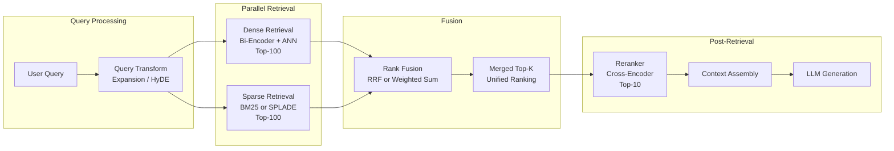
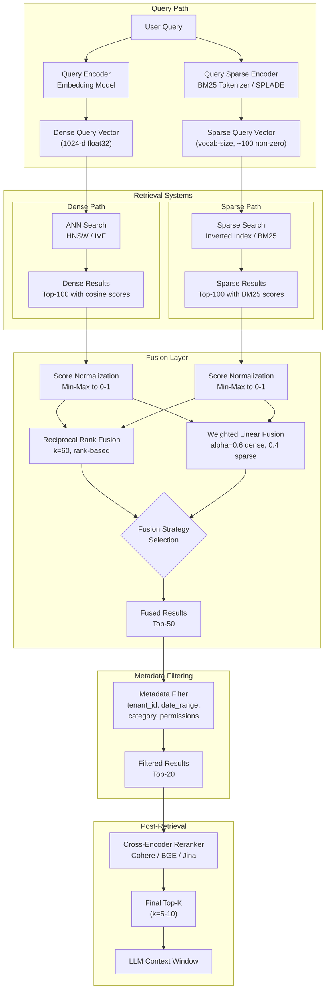
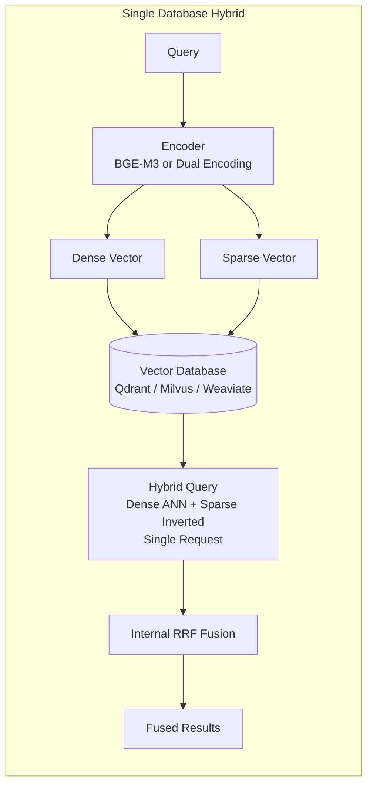

# Hybrid Search

## 1. Overview

Hybrid search combines dense (semantic) retrieval with sparse (lexical) retrieval to produce a unified ranked result set that captures both meaning and exact keyword matches. Dense retrieval excels at understanding intent, synonyms, and paraphrased queries. Sparse retrieval excels at exact term matching, rare identifiers, proper nouns, acronyms, and domain-specific jargon. Neither alone is sufficient for production-quality retrieval --- hybrid search fuses both to cover the failure modes of each.

For a Principal AI Architect, hybrid search is not a theoretical improvement --- it is a measured, consistent lift. Benchmarks across BEIR, MS MARCO, and enterprise corpora show that hybrid (dense + BM25) outperforms dense-only by 5--15% NDCG@10 on average, with the largest gains on out-of-domain and entity-heavy queries. The architectural question is how to implement it: parallel retrieval with rank fusion, learned sparse models that replace BM25, pre-filtering vs. post-filtering with metadata, or unified models that produce both dense and sparse representations. Each approach has different infrastructure, latency, and quality implications.

**Key numbers that shape hybrid search decisions:**

- Dense-only recall@10 on BEIR (average across 18 datasets): 45--52% (depending on model)
- BM25-only recall@10 on BEIR: 35--45%
- Hybrid (dense + BM25, RRF fusion) recall@10 on BEIR: 50--60% (+5--15% over dense-only)
- Hybrid improvement is largest on entity-heavy datasets (DBPedia: +20%) and smallest on semantic-heavy datasets (NFCorpus: +2%)
- RRF fusion overhead: <1 ms (rank merging, no distance computation)
- BM25 query latency (Elasticsearch, 10M documents): 5--20 ms
- SPLADE sparse encoding latency: 5--15 ms per query (GPU), 30--100 ms (CPU)
- End-to-end hybrid search latency: max(dense_latency, sparse_latency) + fusion_latency = 10--30 ms

---

## 2. Where It Fits in GenAI Systems

Hybrid search sits at the retrieval stage of the RAG pipeline, between query processing and reranking. It replaces the single-retriever pattern (dense-only) with a multi-retriever pattern that fuses results before reranking.



**Integration with adjacent systems:**

- **Vector databases** ([vector-databases.md](./vector-databases.md)): Some databases (Weaviate, Qdrant, Milvus, Pinecone) support hybrid search natively --- both dense and sparse retrieval in a single query. Others require an external sparse retrieval system.
- **Embedding models** ([embedding-models.md](./embedding-models.md)): Dense retrieval quality is bounded by the embedding model. Some models (BGE-M3) produce both dense and sparse representations, enabling single-model hybrid search.
- **ANN algorithms** ([ann-algorithms.md](./ann-algorithms.md)): Dense retrieval uses ANN search. The ANN algorithm interacts with metadata filtering, which is related to but distinct from hybrid search fusion.
- **Retrieval and reranking** ([../04-rag/retrieval-reranking.md](../04-rag/retrieval-reranking.md)): Hybrid search produces the candidate set for reranking. Better hybrid candidates lead to better reranked results.
- **RAG pipeline** ([../04-rag/rag-pipeline.md](../04-rag/rag-pipeline.md)): Hybrid search is a component within the broader RAG orchestration.

---

## 3. Core Concepts

### 3.1 Why Hybrid: Complementary Failure Modes

Dense and sparse retrieval fail on different types of queries. Understanding these failure modes is essential for justifying hybrid search infrastructure.

**Dense retrieval failures:**
- **Exact identifiers**: Query "error code E-4012" --- dense models encode the semantic concept of "error code" but may not match the specific identifier "E-4012" because it was rare or absent in training data.
- **Proper nouns**: Query "Dr. Raghunath Ananthapadmanabhan's paper" --- dense models may not distinguish this specific name from similar names.
- **Abbreviations and acronyms**: Query "HIPAA BAA requirements" --- if the embedding model did not see "BAA" (Business Associate Agreement) frequently in training, the embedding may not capture its domain-specific meaning.
- **Negation**: Query "models that do NOT use attention" --- dense models often struggle with negation, embedding the positive concept and ignoring "NOT."
- **Rare domain terms**: Highly specialized terminology (medical codes, legal statute numbers, chemical compounds) may be out-of-distribution for general embedding models.

**Sparse retrieval (BM25) failures:**
- **Synonyms**: Query "automobile insurance" does not match documents containing "car insurance" --- BM25 requires exact lexical overlap.
- **Paraphrasing**: Query "how to prevent overfitting" does not match "techniques for regularization" despite semantic equivalence.
- **Intent understanding**: Query "why is the sky blue" retrieves documents containing those words but may miss documents that explain Rayleigh scattering without using those exact terms.
- **Cross-lingual**: BM25 cannot match a query in English with a document in Spanish. Dense multilingual models handle this natively.

**Hybrid covers both**: By fusing dense and sparse results, hybrid search retrieves documents that match semantically (dense) AND documents that match lexically (sparse). The fusion ensures that a document highly ranked by either system appears in the final results.

### 3.2 Reciprocal Rank Fusion (RRF)

RRF (Cormack, Clarke, and Butt, 2009) is the most widely used rank fusion method in production hybrid search. It is parameter-free (or nearly so), robust across diverse datasets, and trivial to implement.

**Formula:**

For each document d in the union of result lists from n retrieval systems:

`RRF_score(d) = sum over i of (1 / (k + rank_i(d)))`

where `rank_i(d)` is the rank of document d in the i-th retrieval system's result list, and `k` is a constant (typically 60). If document d does not appear in system i's results, it is assigned a rank of infinity (contributing 0 to the sum).

**Why k=60?**
The constant k controls how much the fusion rewards top-ranked results vs. lower-ranked results. With k=60, the score difference between rank 1 and rank 2 is small (~1.6%), while the difference between rank 1 and rank 100 is large (~60%). This makes RRF robust to ranking noise --- a document at rank 5 in one system and rank 10 in another is not dramatically different from rank 3 and rank 7. The value 60 was empirically determined in the original paper and has held up across diverse benchmarks.

**Example:**

| Document | Dense Rank | BM25 Rank | RRF Score (k=60) |
|---|---|---|---|
| Doc A | 1 | 5 | 1/61 + 1/65 = 0.0318 |
| Doc B | 3 | 1 | 1/63 + 1/61 = 0.0323 |
| Doc C | 2 | -- | 1/62 + 0 = 0.0161 |
| Doc D | -- | 2 | 0 + 1/62 = 0.0161 |
| Doc E | 7 | 3 | 1/67 + 1/63 = 0.0308 |

Final ranking: Doc B > Doc A > Doc E > Doc C = Doc D.

Note that Doc B wins because it is ranked highly by both systems. Doc C and Doc D each appear in only one system and are ranked lower. This is the power of RRF --- it naturally boosts documents that multiple systems agree are relevant.

**Advantages of RRF:**
- No tuning required (k=60 works well across datasets).
- Score-agnostic: only ranks matter, so it works when combining systems with incompatible score distributions (cosine similarity vs. BM25 TF-IDF scores).
- Trivial implementation: sort, merge, compute.

**Disadvantages:**
- Equal weighting of all retrieval systems. If dense retrieval is much better than sparse on your data, RRF does not exploit this.
- Does not use score magnitudes, which can contain useful signal (a cosine similarity of 0.95 vs. 0.51 both at rank 1 are treated identically).

### 3.3 Linear Combination / Weighted Fusion

An alternative to RRF that uses normalized scores rather than ranks.

**Formula:**

`hybrid_score(d) = alpha * dense_score(d) + (1 - alpha) * sparse_score(d)`

where `alpha` is a weight in [0, 1] that controls the balance between dense and sparse signals.

**Score normalization is critical.** Dense scores (cosine similarity: [-1, 1]) and sparse scores (BM25: [0, ~25+]) are on different scales. Without normalization, one system dominates. Common normalization approaches:
- **Min-max normalization**: Map each system's scores to [0, 1] based on the min and max scores in the current result set.
- **Z-score normalization**: Subtract mean, divide by standard deviation.
- **Rank-based normalization**: Convert scores to ranks, then normalize ranks to [0, 1].

**Alpha tuning:**
- `alpha = 0.5`: Equal weight (good default).
- `alpha = 0.7`: Dense-heavy. Better for semantic queries, multilingual, paraphrase-heavy.
- `alpha = 0.3`: Sparse-heavy. Better for entity-heavy, acronym-heavy, domain-specific terminology.
- Optimal alpha varies by dataset and query type. Tune on a representative evaluation set.

**Weaviate's implementation:** Weaviate's `hybrid` operator supports both `fusionType: "rankedFusion"` (RRF) and `fusionType: "relativeScoreFusion"` (weighted linear combination with min-max normalization). The `alpha` parameter controls the dense-vs-sparse weight.

**Pinecone's implementation:** Pinecone supports sparse-dense hybrid search with an `alpha` parameter that weights the dense score vs. the sparse score. Sparse vectors are stored alongside dense vectors in the same index.

### 3.4 SPLADE: Learned Sparse Representations

SPLADE (SParse Lexical AnD Expansion model) replaces traditional BM25 with a learned sparse representation that addresses BM25's vocabulary mismatch problem.

**How SPLADE works:**

1. Pass the input text through a BERT-based encoder.
2. For each token in the vocabulary (30K--50K tokens), predict a weight indicating its relevance to the input. Most weights are zero (sparse).
3. The output is a sparse vector over the vocabulary space: `{token_id: weight, ...}` with typically 50--300 non-zero entries.

**Key innovation: vocabulary expansion.** BM25 only matches exact terms. SPLADE can assign non-zero weight to terms that do NOT appear in the input text. For the query "automobile insurance," SPLADE may produce a sparse vector with non-zero weights for both "automobile" and "car" --- even though "car" does not appear in the query. This is because the BERT encoder understands that "car" is related to "automobile" and assigns it a weight.

**SPLADE variants:**
- **SPLADE v2**: Original model with separate query and document encoders.
- **SPLADE++**: Distilled from a cross-encoder teacher for higher quality. Adds efficiency constraints (L1 regularization) to control sparsity.
- **SPLADE-v3**: Further improvements in efficiency and quality.

**Performance (BEIR benchmark):**
- SPLADE alone: NDCG@10 ~48--52 (competitive with dense-only retrieval).
- Dense + SPLADE hybrid: NDCG@10 ~53--58 (consistently better than dense + BM25 hybrid).
- SPLADE replaces BM25 with a strictly better sparse representation, but requires GPU inference (5--15 ms/query on GPU).

**SPLADE in production architecture:**
SPLADE sparse vectors can be stored in vector databases that support sparse vectors (Qdrant, Milvus, Pinecone). This enables native hybrid search (dense + SPLADE) within a single database, eliminating the need for a separate Elasticsearch/BM25 system.

### 3.5 Pre-Filtering vs. Post-Filtering vs. Hybrid Filtering

Metadata filtering (restricting search to a subset of vectors based on scalar predicates) interacts with hybrid search in architecturally significant ways.

**Pre-filtering:**
Apply the metadata filter BEFORE ANN search. Only vectors matching the filter are considered during graph traversal (HNSW) or cluster scanning (IVF).

- **Pros**: Guarantees all results satisfy the filter. No wasted computation on filtered-out vectors.
- **Cons**: If the filter is very selective (matches <1% of vectors), the HNSW graph becomes disconnected (most neighbors are filtered out), degrading recall. The search effectively becomes closer to brute-force over the filtered subset.
- **Who implements it**: Qdrant (HNSW traversal with payload filter), Pinecone (pre-filter on metadata), Weaviate (filter-first for selective filters).

**Post-filtering:**
Run ANN search on the full (unfiltered) corpus, retrieve top-K, then apply the metadata filter to discard non-matching results.

- **Pros**: ANN search quality is unaffected by the filter. Simple implementation.
- **Cons**: If the filter discards most candidates, you may end up with fewer than k results. Over-fetching (retrieve 10x candidates, filter, return top-k) mitigates this but wastes computation.
- **Who implements it**: Simple implementations, pgvector (SQL WHERE applied after vector index scan).

**Hybrid filtering (adaptive):**
Estimate the filter selectivity (what fraction of vectors match). If selectivity is high (>10% match), use pre-filtering. If selectivity is low (<10%), use post-filtering with over-fetching. Some systems implement this automatically.

- **Who implements it**: Milvus (adaptive strategy), Weaviate (automatic selection between filtered and unfiltered HNSW based on estimated selectivity).

**Filter types in practice:**

| Filter Type | Example | Implementation |
|---|---|---|
| Equality | `tenant_id = "acme"` | Bitmap or hash index on payload field |
| Range | `price BETWEEN 10 AND 100` | Sorted index on numeric field |
| Set membership | `category IN ["tech", "science"]` | Bitmap per value |
| Geo-spatial | `location WITHIN 10km of (lat, lon)` | Geo index (R-tree or geohash) |
| Full-text | `content CONTAINS "machine learning"` | Inverted index on text field |
| Boolean combination | `tenant_id = "acme" AND price < 100` | Predicate pushdown with AND/OR |

### 3.6 Architecture: Parallel vs. Sequential

**Parallel retrieval + fusion (dominant pattern):**

```
Query → [Dense ANN search] ──→ Rank Fusion → Reranker → LLM
      → [Sparse BM25 search] ─┘
```

Both retrievers run simultaneously. Results are fused (RRF or weighted). This minimizes latency (limited by the slower retriever, not the sum). The fusion step is <1 ms.

**Sequential: retrieve then filter:**

```
Query → Dense ANN search → BM25 rescore of top-K → Reranker → LLM
```

Dense search produces candidates, then BM25 scores those candidates for lexical overlap, and scores are combined. Lower infrastructure cost (no separate BM25 index), but the candidate set is limited to what dense retrieval found --- BM25 cannot surface documents that dense search missed.

**Unified model (BGE-M3):**

```
Query → BGE-M3 → [Dense vector] + [Sparse vector] → Hybrid search in single DB → Reranker → LLM
```

A single model produces both representations. Simplest architecture, no separate BM25 system. Quality depends on BGE-M3's sparse output being competitive with dedicated BM25/SPLADE (it is, on most benchmarks).

### 3.7 BM25 Implementation Options

**Elasticsearch / OpenSearch:**
Full-featured text search engines. BM25 with sophisticated tokenization, analyzers, stemming, and stopwords. Operational complexity: 3+ node cluster, JVM tuning, shard management. Overkill if BM25 is the only use case.

**Apache Lucene (direct):**
The library underneath Elasticsearch. Can be used directly in Java/Kotlin applications. Lower overhead than a full Elasticsearch cluster.

**In-database BM25:**
- **Weaviate**: Built-in BM25 module. No separate infrastructure. Tokenization and scoring within Weaviate's engine.
- **Milvus**: Supports sparse vectors. BM25 scores can be computed externally and stored as sparse vectors, or Milvus's built-in full-text search (2024+) can be used.
- **pgvector + tsvector**: PostgreSQL has native full-text search (tsvector/tsquery) that implements a BM25-like scoring function. Combined with pgvector, this enables hybrid search in a single database.

**Lightweight alternatives:**
- **BM25s (Python library)**: Pure-Python BM25 implementation. Suitable for small corpora (<1M documents) and prototyping.
- **Tantivy**: Rust-based full-text search library (Lucene equivalent). Used internally by Qdrant for full-text payload indexes.

### 3.8 Evaluation: Does Hybrid Actually Beat Dense-Only?

The answer is nuanced. Hybrid search provides a consistent but variable improvement that depends on the query type, domain, and evaluation dataset.

**BEIR benchmark results (18 datasets, NDCG@10):**

| Method | Avg NDCG@10 | Best Domains | Worst Domains |
|---|---|---|---|
| BM25 | 43.8 | Signal-1M, TREC-COVID | ArguAna, SCIDOCS |
| Dense (text-embedding-3-large) | 49.0 | ArguAna, SCIDOCS | BioASQ, Signal-1M |
| Hybrid (Dense + BM25, RRF) | 53.5 | Broad improvement across most | ArguAna (dense already dominant) |
| Hybrid (Dense + SPLADE, RRF) | 55.8 | All domains | None consistently worse |

**Key observations:**

1. **Hybrid always helps or is neutral.** There is no dataset in BEIR where hybrid (dense + BM25) is significantly worse than the better of dense-only or BM25-only. The downside risk is minimal.
2. **The gain is largest on entity-heavy and out-of-domain datasets.** DBPedia (+15--20% over dense-only), Signal-1M (+10--15%), BioASQ (+8--12%). These are datasets where exact term matching is critical.
3. **The gain is smallest on datasets where dense retrieval is already strong.** ArguAna (+1--2%), NFCorpus (+2--3%). These are datasets with highly semantic queries where BM25 adds little.
4. **SPLADE > BM25 as the sparse component.** Replacing BM25 with SPLADE in the hybrid system adds another 2--4% NDCG@10 on average, because SPLADE's vocabulary expansion captures more lexical relationships.
5. **Reranking after hybrid is still essential.** Hybrid search improves the candidate pool quality, but cross-encoder reranking adds another 3--8% NDCG@10 on top.

**Enterprise evaluation (non-public, general patterns):**
On enterprise corpora (internal documentation, knowledge bases, support tickets), hybrid search typically provides a 10--20% improvement over dense-only. The gain is amplified by:
- Domain-specific jargon and acronyms (common in enterprise).
- Product names, error codes, and identifiers (exact match critical).
- Mixed query types (some users search semantically, others use keywords).

---

## 4. Architecture

The following diagram shows the full architecture of a production hybrid search system with multiple fusion strategies:



**Unified hybrid search architecture (single vector database):**



---

## 5. Design Patterns

### Pattern 1: BM25 as Safety Net

Deploy dense retrieval as the primary path. Run BM25 in parallel as a safety net that catches exact-match queries (error codes, product IDs, proper nouns) that dense search misses. Use RRF to merge. Monitor the "BM25-only" hit rate (documents that appear in BM25 results but not in dense results) to quantify the safety net's value. Typically 5--15% of queries have at least one BM25-unique document in the top-10.

### Pattern 2: SPLADE-First Hybrid

Replace BM25 entirely with SPLADE for the sparse component. Store SPLADE sparse vectors in the same vector database as dense vectors (Qdrant, Milvus, Pinecone). Eliminates the Elasticsearch dependency. Requires GPU for SPLADE inference at query time (~5--15 ms per query) or pre-computation for the corpus.

### Pattern 3: BGE-M3 Unified Hybrid

Use BGE-M3 to produce both dense and sparse representations from a single model forward pass. Store both in a vector database that supports multi-vector. At query time, one encoding call produces both query representations. Simplest hybrid architecture with competitive quality. Ideal for teams without Elasticsearch expertise.

### Pattern 4: Alpha-per-Query Routing

Instead of a fixed alpha for all queries, classify each query as "semantic" or "keyword" and route accordingly:
- Keyword queries (detected by: short length, contains identifiers, contains quotes): alpha=0.3 (sparse-heavy).
- Semantic queries (detected by: natural language question, conversational): alpha=0.8 (dense-heavy).
- Ambiguous: alpha=0.5.

A lightweight classifier (logistic regression on query features) can route queries with >85% accuracy.

### Pattern 5: Progressive Hybrid Retrieval

1. First, run dense-only retrieval (fastest path).
2. If the top result's score is above a confidence threshold, return immediately (no sparse search needed).
3. If below threshold, trigger sparse retrieval in parallel, fuse results, and rerank.
This reduces average latency (most queries are handled by dense-only) while maintaining quality on hard queries.

---

## 6. Implementation Approaches

### Approach 1: Weaviate Native Hybrid

Weaviate provides built-in hybrid search that fuses BM25 and dense retrieval in a single query.

```graphql
{
  Get {
    Documents(
      hybrid: {
        query: "HIPAA compliance requirements for BAA"
        alpha: 0.6
        fusionType: rankedFusion
      }
      where: {
        path: ["tenant_id"]
        operator: Equal
        valueText: "acme-corp"
      }
      limit: 20
    ) {
      content
      _additional {
        score
        explainScore
      }
    }
  }
}
```

### Approach 2: Qdrant Dense + Sparse Hybrid

Qdrant supports named vectors, allowing dense and sparse vectors in the same collection.

```python
from qdrant_client import QdrantClient
from qdrant_client.models import (
    PointStruct, SparseVector, NamedSparseVector,
    SearchRequest, Prefetch, FusionQuery, Fusion
)

client = QdrantClient("localhost", port=6333)

# Hybrid search with RRF fusion
results = client.query_points(
    collection_name="documents",
    prefetch=[
        Prefetch(
            query=dense_query_vector,  # dense ANN search
            using="dense",
            limit=100,
        ),
        Prefetch(
            query=SparseVector(
                indices=sparse_indices,  # SPLADE or BM25 sparse vector
                values=sparse_values,
            ),
            using="sparse",
            limit=100,
        ),
    ],
    query=FusionQuery(fusion=Fusion.RRF),  # RRF fusion
    limit=20,
)
```

### Approach 3: pgvector + tsvector (PostgreSQL Hybrid)

Combine pgvector's HNSW with PostgreSQL's native full-text search for a zero-infrastructure hybrid approach.

```sql
-- Table with both vector and tsvector columns
CREATE TABLE documents (
    id BIGSERIAL PRIMARY KEY,
    content TEXT NOT NULL,
    embedding vector(1024),
    content_tsv tsvector GENERATED ALWAYS AS (to_tsvector('english', content)) STORED
);

-- Indexes
CREATE INDEX ON documents USING hnsw (embedding vector_cosine_ops) WITH (m = 16, ef_construction = 128);
CREATE INDEX ON documents USING gin (content_tsv);

-- Hybrid search with RRF-like fusion in SQL
WITH dense_results AS (
    SELECT id, content,
           ROW_NUMBER() OVER (ORDER BY embedding <=> $1::vector) AS dense_rank
    FROM documents
    WHERE tenant_id = $2
    ORDER BY embedding <=> $1::vector
    LIMIT 100
),
sparse_results AS (
    SELECT id, content,
           ROW_NUMBER() OVER (ORDER BY ts_rank_cd(content_tsv, plainto_tsquery('english', $3)) DESC) AS sparse_rank
    FROM documents
    WHERE tenant_id = $2 AND content_tsv @@ plainto_tsquery('english', $3)
    LIMIT 100
),
fused AS (
    SELECT COALESCE(d.id, s.id) AS id,
           COALESCE(d.content, s.content) AS content,
           COALESCE(1.0 / (60 + d.dense_rank), 0) +
           COALESCE(1.0 / (60 + s.sparse_rank), 0) AS rrf_score
    FROM dense_results d
    FULL OUTER JOIN sparse_results s ON d.id = s.id
)
SELECT id, content, rrf_score
FROM fused
ORDER BY rrf_score DESC
LIMIT 10;
```

### Approach 4: Elasticsearch BM25 + Pinecone Dense (External Fusion)

For systems already running Elasticsearch, add Pinecone for dense search and fuse externally in the application layer.

```python
import asyncio
from elasticsearch import AsyncElasticsearch
from pinecone import Pinecone

async def hybrid_search(query: str, query_vector: list[float], k: int = 10):
    # Parallel retrieval
    dense_task = asyncio.create_task(
        pinecone_index.query(vector=query_vector, top_k=100, namespace="prod")
    )
    sparse_task = asyncio.create_task(
        es_client.search(
            index="documents",
            body={"query": {"match": {"content": query}}, "size": 100}
        )
    )

    dense_results, sparse_results = await asyncio.gather(dense_task, sparse_task)

    # RRF fusion
    scores = {}
    k_rrf = 60
    for rank, match in enumerate(dense_results.matches):
        scores[match.id] = scores.get(match.id, 0) + 1 / (k_rrf + rank + 1)
    for rank, hit in enumerate(sparse_results["hits"]["hits"]):
        doc_id = hit["_id"]
        scores[doc_id] = scores.get(doc_id, 0) + 1 / (k_rrf + rank + 1)

    # Sort by RRF score
    ranked = sorted(scores.items(), key=lambda x: x[1], reverse=True)
    return ranked[:k]
```

---

## 7. Tradeoffs

### Fusion Method Decision Table

| Scenario | Recommended Fusion | Rationale |
|---|---|---|
| No evaluation data available | RRF (k=60) | Robust default, no tuning needed |
| Domain-specific evaluation set available | Weighted linear (tune alpha) | Alpha optimization can gain 2--5% over RRF |
| Mixed query types (keyword + semantic) | RRF + per-query alpha routing | Different queries need different weights |
| Latency-critical (<10 ms total) | Single-system hybrid (Weaviate/Qdrant) | Avoids cross-system network hop |
| Already running Elasticsearch | External RRF (ES + vector DB) | Leverage existing BM25 infrastructure |
| Greenfield system | BGE-M3 unified or SPLADE + dense | Avoid Elasticsearch dependency |

### Sparse Retrieval Method Decision Table

| Method | Quality (NDCG@10) | Latency | Infrastructure | When to Choose |
|---|---|---|---|---|
| BM25 (Elasticsearch) | Baseline | 5--20 ms | ES cluster (3+ nodes) | Already running ES, need mature text search features |
| BM25 (Weaviate built-in) | Baseline | <5 ms (co-located) | None (in Weaviate) | Using Weaviate, want simplicity |
| BM25 (pgvector + tsvector) | Baseline | 5--15 ms | None (in PostgreSQL) | Already on PostgreSQL, <10M docs |
| SPLADE | +3--5% over BM25 | 5--15 ms (GPU) | GPU for encoding | Maximum quality, have GPU budget |
| BGE-M3 sparse | +1--3% over BM25 | Same as dense (single model) | GPU for BGE-M3 | Want single-model simplicity |

### Architecture Complexity Tradeoffs

| Architecture | Components | Operational Complexity | Quality | Latency |
|---|---|---|---|---|
| Dense-only (no hybrid) | 1 vector DB | Low | Baseline | 5--15 ms |
| Weaviate native hybrid | 1 Weaviate cluster | Low | +5--10% | 10--20 ms |
| Qdrant dense + SPLADE | 1 Qdrant + GPU for SPLADE | Medium | +8--15% | 10--25 ms |
| Pinecone + Elasticsearch + app fusion | 2 managed services + app logic | High | +5--10% | 15--30 ms |
| BGE-M3 unified + Qdrant | 1 GPU + 1 Qdrant | Medium | +8--12% | 10--20 ms |

---

## 8. Failure Modes

### 8.1 Score Distribution Mismatch in Weighted Fusion

**Symptom**: Weighted fusion produces results dominated by one retrieval system, ignoring the other. **Cause**: Score distributions differ wildly. BM25 scores range from 0 to 25+; cosine similarity ranges from 0 to 1. Without normalization, BM25 dominates the sum even with alpha=0.9 for dense. **Mitigation**: Always normalize scores before weighted fusion. Min-max normalization within each result set is the simplest approach. Or use RRF, which is score-agnostic.

### 8.2 Empty Sparse Results for Semantic Queries

**Symptom**: Hybrid search returns only dense results for conversational or paraphrased queries. **Cause**: BM25 returns zero results when no query terms appear in any document (extreme vocabulary mismatch). RRF degrades to dense-only. **Mitigation**: This is expected behavior and is acceptable --- RRF naturally handles the asymmetry. Monitor the "sparse-empty" rate. If it exceeds 30%, consider SPLADE (which expands vocabulary) or query expansion before BM25.

### 8.3 Stale BM25 Index

**Symptom**: Newly ingested documents appear in dense search but not in hybrid (BM25 component returns stale results). **Cause**: The BM25 index (Elasticsearch) is updated asynchronously and lags behind the vector database. **Mitigation**: Ensure both indexes are updated in the same ingestion pipeline. Use transactional semantics or monitor index lag. For Weaviate/Qdrant native hybrid, this is not an issue (both indexes are updated atomically).

### 8.4 RRF Over-Penalizing Single-Source Documents

**Symptom**: Highly relevant documents that appear in only one retrieval system are ranked lower than mediocre documents that appear in both. **Cause**: RRF rewards cross-system agreement. A document at dense rank 1 but absent from BM25 scores 1/61 = 0.0164. A document at dense rank 30 and BM25 rank 30 scores 1/90 + 1/90 = 0.0222. **Mitigation**: Use a larger initial retrieval set (top-200 from each system) so that more documents appear in both lists. Or use weighted fusion instead of RRF when one system is significantly more reliable than the other.

### 8.5 Metadata Filter Interaction with Hybrid

**Symptom**: Hybrid search with strict metadata filters returns no results or low-quality results. **Cause**: The metadata filter eliminates most candidates after fusion, leaving too few results. Dense and sparse retrievers may return different documents, and the intersection after filtering can be very small. **Mitigation**: Apply metadata filters within each retrieval system (pre-filter) rather than after fusion. Both dense ANN search and BM25 search should be scoped to the filtered subset.

---

## 9. Optimization Techniques

### 9.1 Alpha Tuning Protocol

1. Prepare an evaluation set: 200+ (query, relevant_document_ids) pairs from your domain.
2. Run dense-only retrieval. Compute NDCG@10 and Recall@10.
3. Run sparse-only retrieval. Compute the same metrics.
4. Run hybrid at alpha = 0.0, 0.1, 0.2, ..., 1.0. Plot NDCG@10 vs. alpha.
5. Select the alpha that maximizes NDCG@10 on a validation split.
6. Typical finding: optimal alpha is 0.5--0.7 (dense-weighted) for general RAG, 0.3--0.5 for entity-heavy domains.

### 9.2 SPLADE Compression for Low-Latency Sparse Search

SPLADE sparse vectors can have 100--300 non-zero entries. For faster search, apply a top-k sparsification: keep only the top-50 entries by weight. This reduces inverted index scanning by 2--6x with <2% quality loss.

### 9.3 Caching Fusion Results

For high-QPS systems with repeated queries (search engines, chatbots), cache the fused result set (after fusion, before reranking). Cache key: (query_text_hash, filter_hash). TTL: minutes to hours depending on corpus update frequency. Hit rates of 10--30% are common, saving both retrieval and fusion compute.

### 9.4 Asynchronous Parallel Retrieval

Ensure dense and sparse retrieval run truly in parallel (async I/O, not sequential). In Python, use `asyncio.gather()` with async clients for both systems. The latency of hybrid search should be `max(dense_latency, sparse_latency)`, not the sum.

### 9.5 BM25 Tokenizer Tuning

Default BM25 tokenizers often perform poorly on domain-specific text. Customize:
- **Custom analyzers**: Add domain-specific synonyms (e.g., "k8s" = "kubernetes"), stopwords, and stemming rules.
- **n-gram tokenization**: For code search, use character n-grams (3--5 characters) to match partial identifiers.
- **Language-specific analyzers**: Use the correct language analyzer for non-English corpora. A German analyzer with compound word splitting dramatically improves BM25 on German text.

### 9.6 Monitoring Hybrid vs. Dense-Only Improvement

Continuously measure the "hybrid uplift" --- the percentage of queries where hybrid search's top-1 result differs from dense-only's top-1 result. If this drops below 5%, the sparse component is not contributing value and you can consider removing it to reduce infrastructure cost. If it exceeds 20%, the sparse component is highly valuable and you should invest in improving it (SPLADE, better tokenization).

---

## 10. Real-World Examples

### Cohere RAG (Hybrid Search as Default)

Cohere's RAG product uses hybrid search by default for all customer deployments. Dense retrieval with Cohere Embed v3 is combined with BM25 over the same corpus, fused with a proprietary weighted fusion method. Cohere reports that hybrid consistently outperforms dense-only across their customer base, with the largest improvements on technical documentation and enterprise knowledge bases.

### Vespa at Spotify and Yahoo

Vespa (open-source search engine from Yahoo) natively supports hybrid search with configurable rank profiles that combine dense ANN, BM25, and machine-learned features. Spotify uses Vespa for podcast and music search where combining semantic understanding (dense) with metadata matching (sparse) is critical. Yahoo uses Vespa for web search and advertising retrieval at billion scale.

### Azure AI Search (Hybrid + Semantic Ranker)

Microsoft's Azure AI Search provides built-in hybrid search that combines BM25 with dense vector search (using Azure OpenAI embeddings). Their "Semantic Ranker" acts as a reranker on top of hybrid results. Microsoft reports that the full pipeline (hybrid retrieval + semantic reranking) improves NDCG@10 by 15--25% over BM25-only on enterprise search benchmarks.

### Pinecone Hybrid Search (Sparse-Dense Vectors)

Pinecone's hybrid search stores sparse and dense vectors in the same index. The alpha parameter controls fusion. Production customers in e-commerce use this for product search where semantic understanding of user intent (dense) must be combined with exact product attribute matching (sparse). Pinecone reports that customers enabling hybrid search see 10--30% improvement in click-through rates over dense-only.

### Weaviate at Instabase and Morningstar

Instabase uses Weaviate's native hybrid search for intelligent document processing. Morningstar uses Weaviate for financial research search where analyst queries mix natural language ("companies with strong ESG profiles") with exact financial terms ("P/E ratio below 15"). The hybrid alpha is tuned per query category: semantic-heavy for research questions, sparse-heavy for quantitative filters.

---

## 11. Related Topics

- [Retrieval and Reranking](../04-rag/retrieval-reranking.md) --- the two-stage pattern where hybrid search produces the candidate set
- [Vector Databases](./vector-databases.md) --- infrastructure that implements hybrid search natively or serves the dense component
- [Embedding Models](./embedding-models.md) --- models that produce dense vectors, and in some cases (BGE-M3) sparse vectors
- [ANN Algorithms](./ann-algorithms.md) --- algorithms powering the dense retrieval component
- [RAG Pipeline](../04-rag/rag-pipeline.md) --- the end-to-end architecture where hybrid search is a retrieval strategy
- [Embeddings](../01-foundations/embeddings.md) --- foundational concepts of dense vector representations

---

## 12. Source Traceability

| Claim / Data Point | Source |
|---|---|
| RRF formula and k=60 constant | Cormack, Clarke, and Butt, "Reciprocal Rank Fusion outperforms Condorcet and individual Rank Learning Methods" (SIGIR 2009) |
| BEIR benchmark results (BM25 vs. dense vs. hybrid) | Thakur et al., "BEIR: A Heterogeneous Benchmark for Zero-shot Evaluation of Information Retrieval Models" (NeurIPS 2021 Datasets & Benchmarks); supplemented by reproduction results from Weaviate and Qdrant blogs |
| SPLADE algorithm | Formal et al., "SPLADE: Sparse Lexical and Expansion Model for First Stage Ranking" (SIGIR 2021) |
| SPLADE++ distillation | Formal et al., "From Distillation to Hard Negative Sampling: Making Sparse Neural IR Models More Effective" (SIGIR 2022) |
| BGE-M3 multi-functionality | Chen et al., "BGE M3-Embedding" (2024) |
| Hybrid search +5--15% improvement claim | Aggregated from BEIR reproduction, Weaviate benchmarks, and Qdrant blog evaluations (2023--2024) |
| Weaviate hybrid search API | Weaviate documentation, "Hybrid Search" section (v1.25+) |
| Qdrant hybrid search API | Qdrant documentation, "Hybrid Search" with Prefetch and Fusion |
| Pinecone hybrid search | Pinecone documentation, "Hybrid Search" (sparse-dense vectors) |
| Azure AI Search hybrid benchmarks | Microsoft documentation, "Hybrid Search" in Azure AI Search (2024) |
| Vespa at Spotify | Vespa blog and Spotify engineering presentations (2023) |
| Cohere RAG hybrid default | Cohere documentation, "RAG with Cohere" (2024) |
