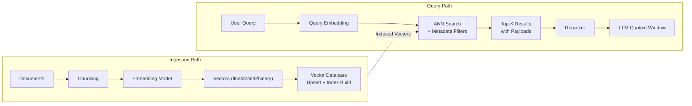
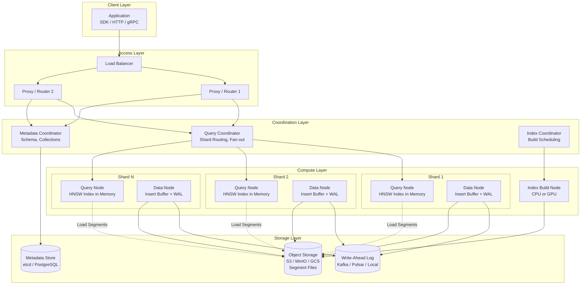

# Vector Databases

## 1. Overview

Vector databases are purpose-built storage systems optimized for indexing, storing, and querying high-dimensional vector embeddings at scale. They are the infrastructure backbone of every semantic search, RAG, recommendation, and similarity-based system in the GenAI stack. Unlike relational databases that operate on exact-match predicates over structured columns, vector databases perform approximate nearest neighbor (ANN) search across continuous vector spaces --- returning the k most similar items to a query vector in sub-linear time.

For a Principal AI Architect, the vector database decision is a multi-dimensional optimization across: managed vs. self-hosted operations, scalability ceiling, filtering capability, hybrid search support, cost model, multi-tenancy architecture, and ecosystem integration. This is not a commodity choice --- the differences between Pinecone, Weaviate, Milvus, Qdrant, Chroma, and pgvector are architecturally significant and affect retrieval quality, operational overhead, and total cost of ownership at production scale.

**Key numbers that shape vector database decisions:**

- 1M vectors at 1536 dimensions (float32): ~5.7 GB raw storage, ~8--12 GB with HNSW index overhead
- ANN search latency (HNSW, 1M vectors, 1536-d): 1--10 ms at 95th percentile
- ANN search latency (HNSW, 100M vectors, 1536-d, distributed): 10--50 ms p95
- Billion-scale search (DiskANN or IVF+PQ with sharding): 20--100 ms p95
- Index build time (HNSW, 1M vectors): 2--15 minutes depending on M and efConstruction
- Metadata filtering overhead: 0--5x latency increase depending on pre-filter vs. post-filter architecture
- Managed pricing (Pinecone Serverless): ~$0.33/1M reads, ~$0.08/GB/month storage
- Self-hosted cost (Qdrant/Milvus on 3-node cluster, 100M vectors): $2K--5K/month cloud compute

---

## 2. Where It Fits in GenAI Systems

Vector databases sit at the intersection of the ingestion pipeline (where embeddings are written) and the retrieval pipeline (where embeddings are queried). They serve both offline batch writes and online real-time reads with fundamentally different performance profiles.



**Adjacent system integration points:**

- **Embedding models** ([embedding-models.md](./embedding-models.md)): The dimensionality, data type, and distance metric of the embeddings determine index configuration. Switching embedding models requires re-indexing the entire corpus.
- **ANN algorithms** ([ann-algorithms.md](./ann-algorithms.md)): The index type (HNSW, IVF, DiskANN) is a configuration choice within the vector database. Not all databases support all index types.
- **Hybrid search** ([hybrid-search.md](./hybrid-search.md)): Some vector databases natively support sparse vectors and BM25 alongside dense search. Others require external keyword search systems.
- **RAG pipeline** ([../04-rag/rag-pipeline.md](../04-rag/rag-pipeline.md)): The vector database is the primary retrieval backend for RAG. Query latency, filtering capability, and result metadata directly affect RAG quality and speed.
- **Retrieval and reranking** ([../04-rag/retrieval-reranking.md](../04-rag/retrieval-reranking.md)): The vector database produces the initial candidate set that the reranker refines.

---

## 3. Core Concepts

### 3.1 Pinecone

Pinecone is a fully managed vector database available in two deployment modes: **Serverless** and **Pod-based**.

**Serverless (2024--present):**
Pinecone's serverless architecture separates compute from storage using a disaggregated design built on object storage (S3-compatible) with a tiered caching layer. Queries are served by stateless compute pods that fetch index segments on demand. This eliminates idle compute costs --- you pay per read/write operation and per GB stored.

- **Pricing model**: $0.33/1M read units, $2.00/1M write units, $0.08/GB/month storage. A read unit equals one query against one namespace. Write units scale with vector dimensionality.
- **Namespaces**: Logical partitions within an index. Used for multi-tenancy (one namespace per tenant). Queries are scoped to a single namespace, enabling efficient tenant isolation without separate indexes.
- **Metadata filtering**: Supports typed metadata fields (string, number, boolean, string arrays) with filter expressions evaluated during search. Uses a pre-filter architecture --- the ANN search only traverses vectors that match the filter.
- **Sparse-dense hybrid**: Supports sparse vectors alongside dense vectors in the same index for hybrid search (as of 2024). Sparse and dense scores are combined with a weighted sum controlled by an `alpha` parameter.
- **Limitations**: No self-hosted option, no custom index parameters (Pinecone manages HNSW tuning internally), maximum 20K metadata bytes per vector, 20K dimensions maximum.

**Pod-based (legacy):**
Dedicated pods with provisioned compute. Available in s1 (storage-optimized), p1 (performance-optimized), and p2 (lowest latency) tiers. Pods are sized by replica count and pod type. More predictable latency than serverless, but higher cost at low utilization. Being phased in favor of serverless for new workloads.

### 3.2 Weaviate

Weaviate is an open-source (BSD-3-Clause) vector database written in Go, designed for hybrid search and multi-modal data.

**Key architectural features:**

- **Hybrid search native**: Weaviate implements BM25, dense vector search, and a hybrid mode that fuses both using configurable alpha-weighted fusion or RRF. No external search engine required.
- **Modules architecture**: Vectorization, generative, and reranking modules plug in at the schema level. `text2vec-openai`, `text2vec-cohere`, `generative-openai`, `reranker-cohere` etc. Documents can be auto-vectorized on insert --- no external embedding pipeline needed.
- **Multi-tenancy**: Native multi-tenancy at the class (collection) level. Each tenant gets an isolated HNSW index stored on its own segment. Tenants can be individually activated/deactivated (offloaded to cold storage). This enables efficient multi-tenant SaaS: 100K+ tenants on a single cluster, with inactive tenants consuming only object storage.
- **HNSW + flat index**: Supports HNSW (default) and flat (brute-force) indexes. Flat is useful for small collections (<10K vectors) where HNSW overhead is unnecessary.
- **Replication and sharding**: Supports sharding across nodes for horizontal scalability and replication for read throughput and fault tolerance. Configurable per class.
- **GraphQL + REST + gRPC APIs**: Query interface uses GraphQL with `nearVector`, `nearText`, `bm25`, and `hybrid` operators.
- **Weaviate Cloud (WCD)**: Fully managed SaaS offering. Sandbox (free, 14-day), Standard, and Enterprise tiers.

### 3.3 Milvus

Milvus is an open-source (Apache-2.0) distributed vector database designed for billion-scale workloads with GPU acceleration.

**Architecture:**

Milvus 2.x uses a disaggregated architecture with four component types:
1. **Access layer (Proxy)**: Stateless request routing, load balancing, query parsing.
2. **Coordinator services**: Query Coordinator (manages search nodes), Data Coordinator (manages data flow), Index Coordinator (manages index builds), Root Coordinator (DDL operations).
3. **Worker nodes**: Query Nodes (serve searches), Data Nodes (handle inserts and persist to object storage), Index Nodes (build indexes offline).
4. **Storage layer**: Object storage (S3/MinIO) for segments, etcd for metadata, message queue (Pulsar/Kafka) for write-ahead log.

This architecture enables independent scaling of search, indexing, and storage. Query nodes can scale horizontally for read throughput. Index builds run on dedicated nodes (including GPU nodes) without impacting search latency.

- **GPU-accelerated indexing**: Milvus supports GPU-based index building (GPU_IVF_FLAT, GPU_IVF_PQ, GPU_BRUTE_FORCE) via NVIDIA RAFT. Reduces index build time by 10--50x for large collections.
- **Index types**: HNSW, IVF_FLAT, IVF_SQ8, IVF_PQ, SCANN, DiskANN, FLAT, BIN_FLAT, BIN_IVF_FLAT, GPU variants. The broadest index selection of any vector database.
- **Dynamic schema**: Collections can have dynamic fields added without schema migration.
- **Partition key**: Automatic data partitioning by a scalar field for efficient filtered search (similar to Pinecone namespaces).
- **Zilliz Cloud**: Fully managed Milvus service with additional enterprise features (RBAC, data isolation, auto-scaling, dedicated compute). Pricing based on compute units (CU) consumed.
- **Limitations**: Operational complexity for self-hosted deployments (requires etcd, MinIO/S3, message queue). Kubernetes operator (Milvus Operator) simplifies but does not eliminate this.

### 3.4 Qdrant

Qdrant is an open-source (Apache-2.0) vector search engine written in Rust, emphasizing performance, filtering, and quantization.

**Key differentiators:**

- **Rust-based engine**: Memory-safe, no garbage collection pauses, predictable latency. Single binary deployment with no external dependencies (embedded RocksDB for persistence).
- **Advanced filtering**: Payload indexes on scalar fields support full predicate pushdown during HNSW traversal. Filters are applied during graph traversal, not as post-processing. This means filtered queries have similar latency to unfiltered queries, even with high-cardinality filters.
- **Quantization options**:
  - **Scalar quantization (SQ)**: float32 to int8. 4x memory reduction, ~1--5% recall loss.
  - **Product quantization (PQ)**: Sub-vector codebook compression. 8--32x memory reduction, ~2--10% recall loss. Configurable segment size.
  - **Binary quantization (BQ)**: float32 to 1-bit per dimension. 32x memory reduction. Works well for high-dimensional models (>= 1024-d) like OpenAI text-embedding-3-large. Recall degradation is model-dependent --- OpenAI embeddings with BQ lose ~3--5% recall, lower-dimensional models lose more.
  - **Oversampling + rescoring**: Quantized search retrieves an oversampled candidate set (e.g., 4x), then rescores against original float32 vectors for final ranking. Recovers most recall loss.
- **Multi-vector support**: A single point can hold multiple named vectors with independent distance metrics. Enables storing title embeddings and content embeddings in the same record.
- **Sparse vectors**: Native sparse vector support for hybrid search (dense + sparse in the same collection).
- **Qdrant Cloud**: Managed clusters on AWS, GCP, Azure. Hybrid cloud option deploys the data plane in your VPC with the control plane managed by Qdrant.

### 3.5 Chroma

Chroma is a lightweight, open-source (Apache-2.0) embedding database designed for developer-friendly local and small-scale usage.

- **Embedded mode**: Runs in-process as a Python library. No server setup. `pip install chromadb` and start querying. Uses SQLite + DuckDB (early versions) or SQLite + custom storage (v0.4+) for persistence.
- **Client-server mode**: Chroma Server runs as an HTTP service (FastAPI) with the same API surface. Docker deployment available.
- **Auto-embedding**: Pass raw text, and Chroma calls a configured embedding function (OpenAI, Sentence Transformers, Cohere, etc.) automatically.
- **Metadata filtering**: Supports `where` clauses on metadata fields and `where_document` clauses on document content.
- **Index**: Uses HNSW (via hnswlib) as the sole index type. No IVF, PQ, or DiskANN.
- **Limitations**: Not designed for production-scale workloads (>10M vectors). No native distributed mode, no replication, no sharding. No binary or product quantization. Primarily used for prototyping, development, and small-scale applications (<1M vectors).
- **Strengths**: Lowest barrier to entry. Ideal for LLM application prototyping with LangChain/LlamaIndex. Active open-source community.

### 3.6 pgvector

pgvector is a PostgreSQL extension that adds vector similarity search to an existing PostgreSQL database.

- **Operational simplicity**: If you already run PostgreSQL, you add vector search without deploying a new system. Vectors are columns in regular tables. SQL joins, transactions, ACID guarantees, backup/restore, connection pooling --- everything works.
- **Index types**:
  - **IVFFlat**: Inverted file index with flat (uncompressed) vectors in each bucket. Requires clustering (training) on existing data. Faster build, but recall degrades if data distribution changes significantly after index creation.
  - **HNSW**: Hierarchical navigable small world graph. Better recall than IVFFlat, more memory intensive, slower build. Added in pgvector 0.5.0. Recommended for most workloads.
- **Distance metrics**: L2 (Euclidean), inner product, cosine, L1 (Manhattan), Hamming, Jaccard (binary).
- **Quantization**: As of pgvector 0.7.0, supports halfvec (float16), bit (binary vectors), and sparsevec (sparse vectors). Combined with HNSW, halfvec reduces memory by ~2x with minimal recall loss.
- **Limitations**: Single-node PostgreSQL is the scalability ceiling. At >10M vectors, query latency may exceed acceptable thresholds without careful tuning. No native distributed sharding (though Citus/pgvector integration exists). Index build is single-threaded and can take hours for large datasets. Not competitive with purpose-built systems at billion-scale.
- **When to choose pgvector**: Your team already operates PostgreSQL, vector count is under 10M, you need transactional consistency between vectors and relational data, and you want to minimize infrastructure sprawl.

### 3.7 Comparison Matrix

| Capability | Pinecone | Weaviate | Milvus | Qdrant | Chroma | pgvector |
|---|---|---|---|---|---|---|
| **License** | Proprietary | BSD-3 | Apache-2.0 | Apache-2.0 | Apache-2.0 | PostgreSQL License |
| **Language** | Unknown (managed) | Go | Go/C++ | Rust | Python | C |
| **Max dimensions** | 20,000 | 65,535 | 32,768 | 65,535 | Unlimited* | 16,000 |
| **HNSW** | Yes (internal) | Yes | Yes | Yes | Yes | Yes |
| **IVF** | No | No | Yes | No | No | Yes (IVFFlat) |
| **DiskANN** | No | No | Yes | No | No | No |
| **GPU indexing** | No | No | Yes | No | No | No |
| **Product quantization** | No | No | Yes | Yes | No | No |
| **Binary quantization** | No | Yes | Yes | Yes | No | Yes (bit type) |
| **Scalar quantization** | No | No | Yes | Yes | No | Yes (halfvec) |
| **Native sparse vectors** | Yes | No (BM25 only) | Yes | Yes | No | Yes (sparsevec) |
| **Hybrid search** | Yes (sparse+dense) | Yes (BM25+dense) | Yes (sparse+dense) | Yes (sparse+dense) | No | Manual (SQL) |
| **Metadata filtering** | Pre-filter | Pre-filter | Post/Pre-filter | Pre-filter (HNSW) | Post-filter | SQL WHERE |
| **Multi-tenancy** | Namespaces | Native (class-level) | Partition key | Collection/Payload | Collection-per | Schema/RLS |
| **Distributed** | Yes (managed) | Yes | Yes | Yes | No | No (single-node) |
| **Replication** | Yes (managed) | Yes | Yes | Yes (Raft) | No | PostgreSQL streaming |
| **Managed cloud** | Pinecone Cloud | Weaviate Cloud | Zilliz Cloud | Qdrant Cloud | No | Neon, Supabase, RDS |
| **Self-hosted** | No | Yes | Yes | Yes | Yes | Yes |
| **Billion-scale** | Yes | With sharding | Yes (DiskANN/GPU) | With sharding | No | No |

*Chroma inherits hnswlib limits; practical ceiling is memory-bound.

### 3.8 Architecture Patterns

**Embedded**: The database runs in-process. No network calls. Lowest latency, simplest deployment, but limited to single-process and single-machine. Used for prototyping and edge deployments. Examples: Chroma (embedded mode), Qdrant (embedded mode via `qdrant-client` with local path), SQLite+pgvector via DuckDB.

**Client-server**: A dedicated server process manages the index and serves queries over HTTP/gRPC. Multiple application instances connect as clients. Supports concurrent reads, persistence, and basic operational features. Examples: Chroma server, Qdrant standalone, Weaviate standalone.

**Distributed**: Multiple nodes form a cluster with sharding (horizontal data partitioning) and replication (data redundancy for fault tolerance and read scaling). A coordinator manages shard routing and query fan-out. Examples: Milvus, Weaviate (multi-node), Qdrant (distributed mode with Raft consensus).

**Managed cloud**: The vendor operates the distributed system. You interact through an API. No infrastructure management. Examples: Pinecone (serverless/pods), Zilliz Cloud (managed Milvus), Weaviate Cloud, Qdrant Cloud.

### 3.9 Multi-Tenancy Approaches

Multi-tenancy in vector databases is a critical design decision for SaaS applications. The three dominant patterns, in order of increasing isolation:

**Pattern 1: Metadata filtering (lowest isolation)**
All tenants share a single collection/index. Each vector has a `tenant_id` metadata field. Queries include a filter on `tenant_id`. Advantages: simple, no per-tenant overhead. Disadvantages: noisy neighbor risk (one tenant's large dataset slows everyone), no per-tenant resource control, filter overhead on every query.

**Pattern 2: Namespace / partition per tenant (medium isolation)**
Each tenant gets a logical partition within a shared physical index. Pinecone namespaces and Milvus partition keys implement this pattern. Advantages: query scoping is built-in, better performance isolation than metadata filtering, moderate management overhead. Disadvantages: shared physical resources, tenant count limited by partition management overhead.

**Pattern 3: Collection per tenant (highest isolation)**
Each tenant gets a dedicated collection with its own HNSW index. Weaviate's native multi-tenancy implements this with the ability to offload inactive tenants to cold storage. Advantages: full data isolation, per-tenant performance guarantees, per-tenant scaling. Disadvantages: higher memory overhead (each HNSW index has a base cost), management complexity at >10K tenants.

**Decision guidance**: Use metadata filtering for <100 tenants with similar data sizes. Use namespace/partition for 100--10K tenants. Use collection-per-tenant with tenant activation/deactivation for >10K tenants (Weaviate's sweet spot). For regulated industries requiring strict data isolation, collection-per-tenant or dedicated clusters are necessary.

---

## 4. Architecture

The following diagram shows the internal architecture of a distributed vector database (generalized from Milvus, Qdrant distributed, and Weaviate multi-node):



**Write path**: Client sends vectors to a Proxy. The Proxy assigns a shard based on the collection's sharding key (hash-based or custom). The Data Node buffers the write, appends to the WAL, and periodically flushes segments to object storage. The Index Coordinator detects new sealed segments and schedules index builds on Index Nodes.

**Read path**: Client sends a query to a Proxy. The Query Coordinator fans out the query to all relevant shard Query Nodes. Each Query Node performs ANN search on its local HNSW index, applies metadata filters, and returns local top-k results. The Query Coordinator merges results (global top-k) and returns them to the client.

**Index build path**: The Index Coordinator monitors segment sizes. When a segment exceeds a threshold, it schedules an index build on an Index Node (optionally GPU-accelerated). The built index is written to object storage and loaded by Query Nodes on the next segment refresh cycle.

---

## 5. Design Patterns

### Pattern 1: Polyglot Retrieval

Use different vector databases for different workloads within the same system. Example: pgvector for the user profile store (small, transactional, needs SQL joins), Pinecone Serverless for the document search corpus (large, read-heavy, managed), Qdrant for the real-time recommendation engine (low-latency, needs complex filtering).

### Pattern 2: Tiered Storage

Hot vectors in an in-memory HNSW index, warm vectors in quantized (SQ/BQ) indexes, cold vectors on disk (DiskANN) or offloaded to object storage. Weaviate's tenant offloading and Milvus's segment tiering implement this natively. Reduces memory cost by 5--20x for long-tail data.

### Pattern 3: Write-Behind with Embedding Queue

Decouple document ingestion from index updates. New documents are embedded and published to a message queue (Kafka, SQS). A consumer process batch-upserts vectors into the database. This absorbs write spikes and enables replay on failure. Critical for systems ingesting >1K documents/minute.

### Pattern 4: Shadow Indexing for Model Migration

When switching embedding models, build a parallel index with the new model while the old index continues serving queries. Once the new index is fully built and validated (recall benchmarks pass), atomically swap the query path. Avoids downtime during embedding model upgrades.

### Pattern 5: Read Replicas with Stale Tolerance

Deploy read replicas for high-QPS workloads. Accept that replicas may lag the primary by seconds to minutes. For RAG workloads, this staleness is usually acceptable (documents are not real-time). Reduces p99 latency by distributing query load.

---

## 6. Implementation Approaches

### Approach 1: Start with pgvector, Graduate Later

Begin with pgvector if your corpus is <5M vectors and you already run PostgreSQL. This avoids a new operational dependency. Configure HNSW index with appropriate `m` (16 default) and `ef_construction` (64 default). Monitor query latency as corpus grows. When p95 exceeds your SLA, migrate to a purpose-built system.

```sql
-- pgvector HNSW index creation
CREATE EXTENSION vector;

CREATE TABLE documents (
    id BIGSERIAL PRIMARY KEY,
    content TEXT NOT NULL,
    embedding vector(1536),
    tenant_id UUID NOT NULL,
    created_at TIMESTAMPTZ DEFAULT NOW()
);

-- HNSW index with cosine distance
CREATE INDEX ON documents
USING hnsw (embedding vector_cosine_ops)
WITH (m = 16, ef_construction = 128);

-- Query with metadata filter
SELECT id, content, 1 - (embedding <=> $1::vector) AS similarity
FROM documents
WHERE tenant_id = $2
ORDER BY embedding <=> $1::vector
LIMIT 10;
```

### Approach 2: Managed Serverless for Rapid Scaling

Use Pinecone Serverless or Qdrant Cloud for workloads where you need to go from zero to production without managing infrastructure. Ideal for startups and teams without dedicated infrastructure engineers. Trade higher per-query cost for zero operational overhead.

### Approach 3: Self-Hosted Distributed for Cost Control

Deploy Milvus or Qdrant on Kubernetes for large-scale workloads (>100M vectors) where managed pricing becomes prohibitive. Use the Milvus Operator or Qdrant Helm chart. Requires Kubernetes expertise and ongoing operational investment. Typical team: 0.5--1 SRE dedicated to the vector infrastructure.

---

## 7. Tradeoffs

### Database Selection Decision Table

| Scenario | Recommended | Rationale |
|---|---|---|
| Prototype / hackathon | Chroma | Zero setup, in-process, pip install |
| <5M vectors, already on PostgreSQL | pgvector | No new infra, SQL joins, ACID |
| 5M--100M vectors, no ops team | Pinecone Serverless | Managed, pay-per-use, minimal ops |
| 5M--100M vectors, need hybrid search | Weaviate Cloud or Qdrant Cloud | Native BM25 (Weaviate) or sparse vectors (Qdrant) |
| >100M vectors, cost-sensitive | Milvus self-hosted | GPU indexing, DiskANN, full control |
| >100M vectors, complex filtering | Qdrant self-hosted | Pre-filter HNSW, binary quantization |
| >10K tenants SaaS | Weaviate | Native multi-tenancy with tenant offloading |
| Regulated / air-gapped | Milvus or Qdrant self-hosted | On-premise, no data leaving your network |

### Index Type Tradeoffs

| Index | Build Time | Memory | Query Latency | Recall@10 | Mutable? |
|---|---|---|---|---|---|
| HNSW | Slow (hours at 1B) | High (full vectors + graph) | 1--5 ms | 95--99% | Yes (incremental) |
| IVF_FLAT | Medium | Medium (centroids + full vectors) | 5--20 ms | 90--98% | No (rebuild on insert) |
| IVF_PQ | Medium | Low (centroids + codes) | 10--30 ms | 85--95% | No |
| DiskANN | Very slow | Low (SSD-resident) | 5--15 ms | 92--97% | Limited |
| Flat (brute-force) | None | Full vectors only | O(n), slow at scale | 100% | Yes |

---

## 8. Failure Modes

### 8.1 Embedding Model Mismatch

**Symptom**: Query results are irrelevant despite correct data in the database. **Cause**: Query embeddings generated with a different model (or model version) than document embeddings. Cosine similarity between mismatched embedding spaces is meaningless. **Mitigation**: Store the model identifier as collection metadata. Validate at query time that the query model matches the index model. Block queries on mismatch.

### 8.2 Index Not Built / Partially Built

**Symptom**: Newly inserted vectors are not returned in search results. **Cause**: In systems like Milvus, vectors are stored in unsealed segments that are not indexed. Search over unsealed segments uses brute-force, which may be skipped for performance or may return with higher latency. **Mitigation**: Monitor segment seal and index build completion. Milvus provides `get_index_build_progress()`. Set alerts on index build lag.

### 8.3 Filter Cardinality Explosion

**Symptom**: Queries with metadata filters become extremely slow. **Cause**: Post-filter architectures (or poorly optimized pre-filter) degrade when the filter is highly selective (matches <1% of vectors). The ANN search returns candidates, then most are discarded by the filter, requiring multiple re-searches. **Mitigation**: Use databases with HNSW-integrated pre-filtering (Qdrant, Pinecone). Or use partitioning (separate indexes per filter value) for high-cardinality filter fields.

### 8.4 Noisy Neighbor in Shared Indexes

**Symptom**: One tenant's query latency spikes when another tenant ingests a large batch. **Cause**: Shared HNSW index locks, shared memory pressure, or shared compute. **Mitigation**: Collection-per-tenant isolation, or use managed services with resource quotas.

### 8.5 Recall Degradation After Quantization

**Symptom**: Search quality drops after enabling binary or product quantization. **Cause**: Quantization compresses vectors, introducing approximation error. The effect varies by model --- high-dimensional models with near-unit-norm vectors (e.g., OpenAI embeddings) tolerate binary quantization well; lower-dimensional models do not. **Mitigation**: Always benchmark recall@10 before and after quantization on your actual data. Use oversampling (retrieve 4--10x candidates with quantized search, rescore with original vectors).

---

## 9. Optimization Techniques

### 9.1 Right-Size Your Dimensions

Use Matryoshka-capable models (OpenAI text-embedding-3, Nomic Embed) and reduce dimensions to the minimum that meets your recall target. Reducing from 1536 to 512 dimensions cuts memory by 3x and improves search speed by 1.5--2x with only ~1--3% recall loss on most benchmarks.

### 9.2 Quantization Cascade

Apply scalar quantization first (float32 to float16: 2x savings, <1% recall loss). If more compression is needed, try binary quantization with oversampling (32x savings, 2--5% recall loss recoverable via rescoring). Product quantization as a last resort for billion-scale (8--32x savings, requires careful tuning).

### 9.3 Batch Upserts

Never upsert vectors one at a time. Batch upserts (100--1000 vectors per call) reduce network overhead and enable the database to optimize segment writes. Milvus and Qdrant show 10--50x throughput improvement with batching.

### 9.4 Payload Index Tuning

Create payload (metadata) indexes only on fields you actually filter on. Each payload index consumes memory and slows writes. In Qdrant, use `keyword` type for low-cardinality strings, `integer` for numeric ranges, `geo` for geographic queries.

### 9.5 Connection Pooling and Client-Side Caching

For high-QPS workloads, maintain persistent gRPC connections (not HTTP/1.1). Cache frequently repeated queries client-side with a TTL. Embedding the same query twice produces identical vectors --- cache at the embedding layer too.

### 9.6 Segment Tuning (Milvus)

In Milvus, segment size determines how often segments are sealed and indexed. Default is 512 MB. For workloads with frequent small writes, reduce to 128 MB for faster searchability. For batch-heavy workloads, increase to 1 GB for better index efficiency.

---

## 10. Real-World Examples

### Notion AI (Pinecone)

Notion uses Pinecone to power semantic search across user workspaces. Each workspace maps to a Pinecone namespace, providing multi-tenant isolation. Documents (pages, databases, comments) are chunked and embedded with an internal embedding model. Queries embed the user's natural language question and search within the workspace namespace. The low-latency managed service allows Notion to serve AI search results in <200ms without a dedicated vector infrastructure team.

### Shopify (Qdrant)

Shopify uses Qdrant for product similarity search and recommendation across millions of merchant catalogs. The complex filtering requirements (price range, category, availability, merchant-specific metadata) make Qdrant's pre-filter HNSW architecture a strong fit. Binary quantization is used for the product image embedding index to reduce memory footprint at catalog scale.

### Uber (Milvus)

Uber deploys Milvus for internal semantic search across engineering documentation, code search, and operational runbook retrieval. The distributed architecture handles billions of vectors across multiple use cases on shared infrastructure. GPU-accelerated indexing via Zilliz Cloud reduces index build times when embedding models are upgraded.

### Supabase (pgvector)

Supabase provides pgvector as a built-in feature for all PostgreSQL databases on their platform. Developers store embeddings alongside their application data (users, orders, content) in the same database. SQL joins between vector similarity results and relational data (e.g., "find similar products that are in stock and in the user's price range") are a natural fit.

### Weaviate at Instabase

Instabase uses Weaviate to power document understanding and retrieval for enterprise customers. The module architecture allows them to swap embedding models per customer without changing application code. Multi-tenancy enables strict data isolation between enterprise accounts.

---

## 11. Related Topics

- [ANN Algorithms](./ann-algorithms.md) --- the index algorithms that vector databases implement internally
- [Embedding Models](./embedding-models.md) --- the models that produce the vectors stored in these databases
- [Hybrid Search](./hybrid-search.md) --- combining dense and sparse retrieval, often within the vector database
- [RAG Pipeline](../04-rag/rag-pipeline.md) --- the end-to-end retrieval-augmented generation architecture
- [Retrieval and Reranking](../04-rag/retrieval-reranking.md) --- the two-stage search pattern that consumes vector database results
- [Embeddings](../01-foundations/embeddings.md) --- foundational concepts of vector representations

---

## 12. Source Traceability

| Claim / Data Point | Source |
|---|---|
| Pinecone serverless pricing | Pinecone pricing page (2024); may change |
| Weaviate multi-tenancy architecture | Weaviate documentation, "Multi-tenancy" section (v1.25+) |
| Milvus 2.x disaggregated architecture | Milvus Architecture Overview (milvus.io/docs) |
| Qdrant binary quantization recall | Qdrant blog, "Binary Quantization" (2024); benchmarks on OpenAI embeddings |
| pgvector HNSW support | pgvector GitHub changelog, v0.5.0 release |
| pgvector halfvec support | pgvector GitHub changelog, v0.7.0 release |
| Notion AI using Pinecone | Pinecone case study, "Notion" (pinecone.io/customers) |
| Uber using Milvus | Zilliz case study and Milvus community presentations |
| HNSW memory overhead estimate | Based on M=16 graph structure: ~16 * 2 levels * 8 bytes per link per vector |
| DiskANN billion-scale benchmarks | Subramanya et al., "DiskANN: Fast Accurate Billion-point Nearest Neighbor Search on a Single Node" (NeurIPS 2019) |
| Shopify and Qdrant | Qdrant blog and case studies (2024) |
| Supabase pgvector | Supabase documentation, "AI & Vectors" section |
