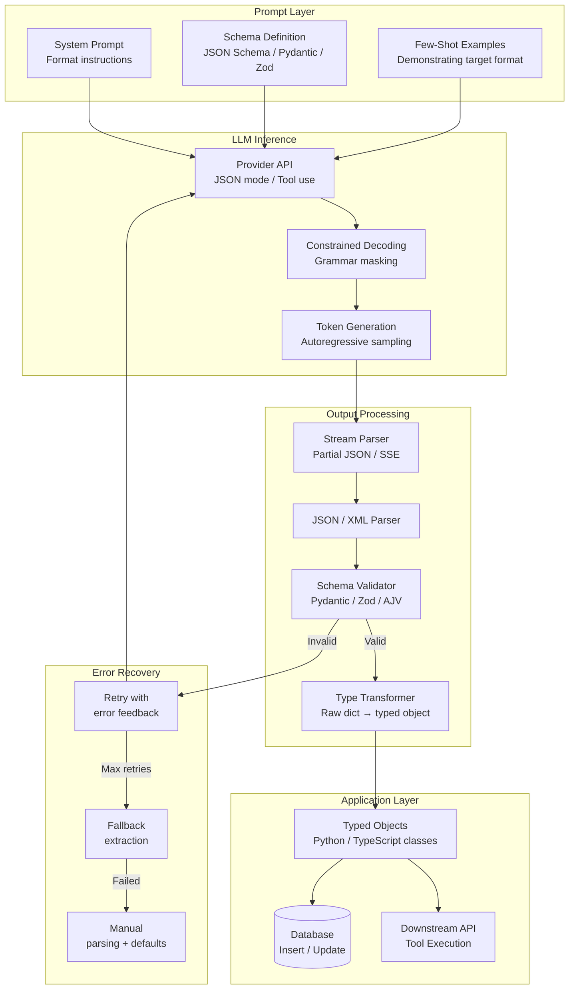
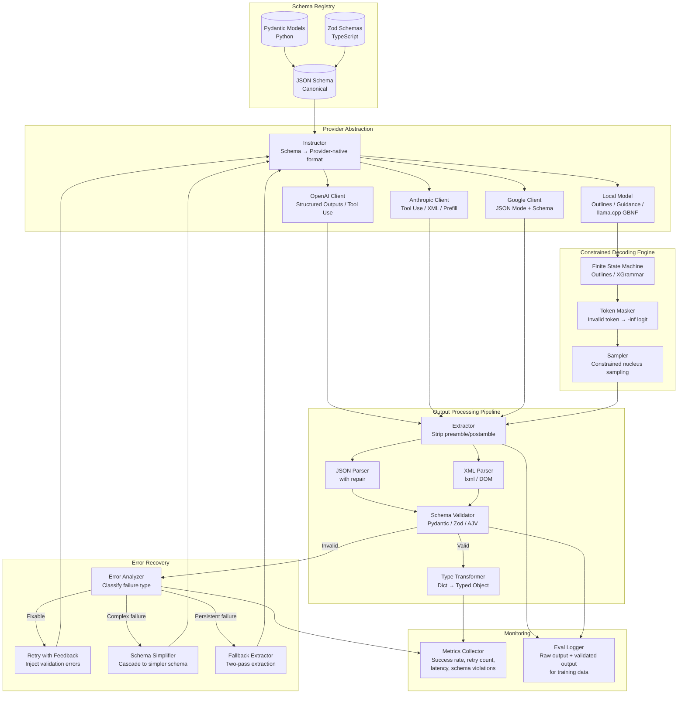
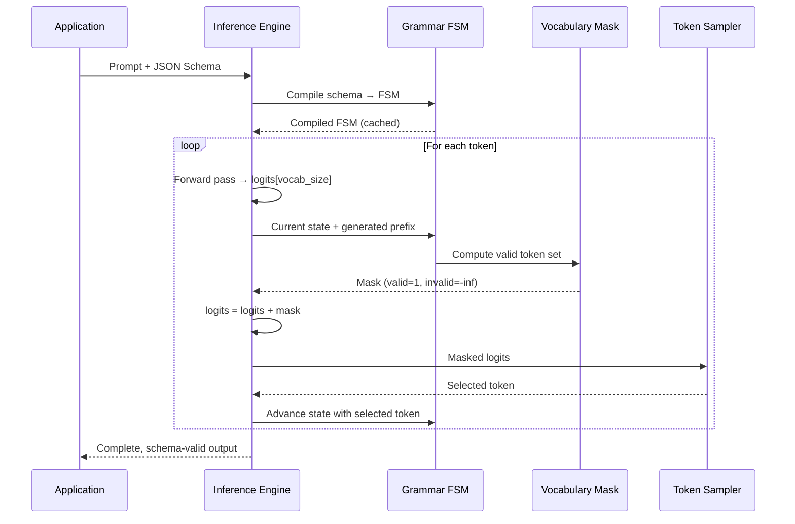

# Structured Output

## 1. Overview

Structured output is the discipline of constraining LLM generation to produce machine-parseable, schema-conforming responses. While LLMs generate free-form natural language by default, production systems require deterministic data structures --- JSON objects, function call arguments, XML documents, typed records --- that downstream code can process without brittle regex parsing or error-prone heuristic extraction.

For Principal AI Architects, structured output is a critical reliability layer. The difference between a system that "usually returns valid JSON" and one that guarantees schema-conforming output determines whether you can build reliable pipelines on top of LLM inference. The field has evolved from fragile prompt-based approaches ("Please respond in JSON") to provider-native constrained decoding that mathematically guarantees valid output at the token-sampling level.

**Key numbers that shape structured output decisions:**
- JSON mode reliability (prompt-only, no enforcement): 85--95% valid JSON across models and tasks
- JSON mode reliability (OpenAI `response_format: json_object`): ~99.5% valid JSON
- JSON mode reliability (OpenAI Structured Outputs with schema): ~99.9% schema-conforming JSON
- Function calling reliability (GPT-4o, single tool): >99% valid arguments
- Constrained decoding (grammar-based, e.g., outlines/guidance): 100% syntactically valid (by construction)
- Latency overhead of constrained decoding: 5--15% slower than unconstrained generation
- Schema validation failure rate with Instructor + retries (max 3): <0.1% after retries
- Streaming partial JSON parsing: adds 10--50ms per chunk for incremental validation

The structured output stack has three layers, from weakest to strongest guarantee:
1. **Prompt-level**: Instruct the model to produce a specific format. No enforcement.
2. **API-level**: Provider-native JSON mode, function calling, tool use. Statistical enforcement.
3. **Decoding-level**: Grammar-constrained generation that masks invalid tokens. Mathematical enforcement.

Production systems typically combine all three: prompt instructions set the intent, API-level features provide high-reliability defaults, and validation + retry handles the remaining edge cases.

---

## 2. Where It Fits in GenAI Systems

Structured output sits at the boundary between LLM inference and application logic. It transforms the model's probabilistic text generation into deterministic data structures that integrate with typed programming languages, databases, APIs, and downstream services.



Structured output interacts with these adjacent systems:
- **Prompt design patterns** (upstream): The prompt establishes the schema contract and provides format examples. See [Prompt Patterns](./01-prompt-patterns.md).
- **Tool use / function calling** (co-located): Tool use is the primary structured output mechanism for agent systems. See [Tool Use](../07-agents/02-tool-use.md).
- **Agent architecture** (consumer): Agents depend on reliable structured output for tool dispatch, state management, and multi-step planning. See [Agent Architecture](../07-agents/01-agent-architecture.md).
- **Orchestration frameworks** (infrastructure): LangChain, LlamaIndex, and Semantic Kernel all provide structured output abstractions. See [Orchestration Frameworks](../08-orchestration/01-orchestration-frameworks.md).
- **Evaluation frameworks** (quality gate): Output schema conformance is a measurable eval metric. See [Eval Frameworks](../09-evaluation/01-eval-frameworks.md).

---

## 3. Core Concepts

### 3.1 JSON Mode

JSON mode instructs the provider to constrain model output to valid JSON. The enforcement happens at the API / serving layer, not just through prompting.

**OpenAI JSON Mode:**

Two levels of enforcement:
1. **Basic JSON mode** (`response_format: {"type": "json_object"}`): Guarantees syntactically valid JSON but does not enforce a specific schema. The model can return any valid JSON structure.
2. **Structured Outputs** (`response_format: {"type": "json_schema", "json_schema": {...}}`): Guarantees output conforms to a specific JSON Schema, including required fields, types, enums, and nested structures. Introduced in August 2024.

Implementation mechanism: OpenAI uses constrained decoding internally. During token sampling, tokens that would produce invalid JSON (given the current generation state) are masked with -infinity logits. This guarantees validity without post-hoc validation.

Limitations:
- The schema must be expressible in JSON Schema. Recursive schemas have limited support.
- Maximum schema complexity: OpenAI enforces a depth limit and maximum number of properties.
- First request with a new schema has additional latency (~1--2s) for schema compilation.
- `additionalProperties` must be set to `false` for strict mode.
- All fields must be listed as `required` (use nullable types for optional fields).

**Anthropic JSON Output:**

Anthropic does not have a dedicated JSON mode API flag. Instead, Claude models are trained to follow JSON format instructions with high reliability when:
1. The system prompt specifies JSON output format.
2. The prompt includes the JSON Schema or Pydantic model definition.
3. The assistant message is prefilled with `{` (the API allows setting the beginning of the assistant's response).

Prefill technique:
```python
response = client.messages.create(
    model="claude-opus-4-20250514",
    messages=[
        {"role": "user", "content": "Extract entities from: ..."},
        {"role": "assistant", "content": "{"}  # Prefill forces JSON start
    ],
)
# Response continues from "{" with the rest of the JSON
```

Reliability: ~97--99% valid JSON with prefill + clear schema in prompt. Lower than OpenAI's constrained decoding but sufficient for most use cases when combined with validation + retry.

**Google Gemini JSON Mode:**

Gemini supports `response_mime_type: "application/json"` with an optional `response_schema` parameter. Similar to OpenAI's structured outputs, the schema constrains the output. Gemini also supports enum-constrained outputs for classification tasks.

### 3.2 Function Calling / Tool Use

Function calling (OpenAI terminology) and tool use (Anthropic terminology) allow models to output structured arguments for predefined functions, which the application then executes.

**Schema definition:**

Tools are defined as JSON Schema objects describing the function name, description, and parameter schema:

```json
{
  "type": "function",
  "function": {
    "name": "get_weather",
    "description": "Get the current weather for a given location.",
    "parameters": {
      "type": "object",
      "properties": {
        "location": {
          "type": "string",
          "description": "City name, e.g., 'San Francisco, CA'"
        },
        "unit": {
          "type": "string",
          "enum": ["celsius", "fahrenheit"],
          "description": "Temperature unit"
        }
      },
      "required": ["location"]
    }
  }
}
```

**Multi-tool selection:**

When multiple tools are available, the model selects the appropriate tool(s) based on the user's request. The model returns a tool call object specifying which function to invoke and with what arguments. Key behaviors:
- **Single tool selection**: The model chooses the most appropriate tool from the available set.
- **Parallel tool calls**: The model can request multiple tool calls in a single response (e.g., get weather for three cities simultaneously). Supported by OpenAI (since late 2023) and Anthropic.
- **Sequential tool calls**: The model calls one tool, receives the result, then decides whether to call another. This is the standard agent loop pattern.
- **Tool choice enforcement**: `tool_choice: "auto"` lets the model decide; `tool_choice: {"type": "function", "function": {"name": "get_weather"}}` forces a specific tool; `tool_choice: "required"` forces the model to call at least one tool.

**Reliability characteristics:**

| Provider | Single Tool Accuracy | Multi-Tool Accuracy | Parallel Calls | Notes |
|---|---|---|---|---|
| OpenAI GPT-4o | >99% | ~97% | Yes | Best-in-class tool selection |
| Anthropic Claude Opus/Sonnet | >98% | ~96% | Yes | Strong at complex argument construction |
| Google Gemini Pro | >97% | ~94% | Yes | Improving rapidly with each release |
| Open-source (Llama 3 70B) | ~93% | ~85% | Limited | Requires careful prompt engineering |

**Failure modes specific to tool use:**
- **Hallucinated tool names**: The model invents a tool that doesn't exist. Mitigated by strict tool-name validation.
- **Incorrect argument types**: The model provides a string where an integer is expected. Mitigated by schema validation.
- **Missing required arguments**: The model omits required fields. More common with complex schemas (5+ parameters).
- **Argument hallucination**: The model fabricates plausible-sounding but incorrect argument values (e.g., making up a file path that doesn't exist).

### 3.3 Constrained Decoding

Constrained decoding is the strongest guarantee for structured output. It modifies the token sampling process itself so that only tokens that produce valid output (according to a grammar or schema) can be selected.

**How it works:**

At each generation step, the decoder:
1. Computes logits for all tokens in the vocabulary.
2. Determines which tokens are valid given the current output prefix and the target grammar/schema.
3. Masks invalid tokens by setting their logits to -infinity.
4. Samples from the remaining valid tokens.

This guarantees that every generated sequence is valid by construction --- there is no need for post-hoc validation or retry.

**Grammar-based generation:**

Define the target output format as a formal grammar (typically context-free, expressed in EBNF or regex):

```ebnf
root   ::= "{" ws "\"name\":" ws string "," ws "\"age\":" ws number "," ws "\"city\":" ws string "}" ws
string ::= "\"" [a-zA-Z0-9 ]+ "\""
number ::= [0-9]+
ws     ::= [ \t\n]*
```

The grammar constrains token selection at every step. When the decoder has generated `{"name": "Alice", "a`, the only valid next tokens are those that continue `"age"`.

**Libraries and frameworks:**

| Library | Language | Backend | Mechanism | Production-Ready |
|---|---|---|---|---|
| Outlines | Python | vLLM, Transformers, llama.cpp | Regex/JSON Schema → finite-state machine | Yes |
| Guidance | Python | Transformers, llama.cpp | Template-based constraint language | Yes |
| llama.cpp GBNF | C++ | llama.cpp | GBNF grammar → token masking | Yes |
| LMQL | Python | Transformers, OpenAI | Query language with constraints | Experimental |
| SGLang | Python | SGLang runtime | Regex-based constrained generation | Yes |
| XGrammar | C++/Python | vLLM, TensorRT-LLM, SGLang | Pushdown-automaton grammar engine | Yes |

**Outlines (by .txt, formerly dottxt):**

Outlines is the most widely adopted constrained decoding library. It compiles JSON Schema or regex patterns into a finite-state machine (FSM) at initialization time, then uses the FSM to compute valid token masks during generation.

```python
import outlines

model = outlines.models.transformers("meta-llama/Llama-3-70B-Instruct")

# JSON Schema constraint
schema = {
    "type": "object",
    "properties": {
        "name": {"type": "string"},
        "age": {"type": "integer", "minimum": 0, "maximum": 150},
        "skills": {"type": "array", "items": {"type": "string"}}
    },
    "required": ["name", "age", "skills"]
}

generator = outlines.generate.json(model, schema)
result = generator("Extract person info from: Alice is 30 and knows Python and Rust.")
# Guaranteed to conform to schema
```

**Performance overhead:**

Constrained decoding adds 5--15% latency overhead compared to unconstrained generation. The overhead comes from:
1. **Grammar compilation** (one-time): 100ms--5s depending on schema complexity. Cached across requests.
2. **Token masking per step**: 0.1--1ms to compute the valid token set. Negligible for large models where the forward pass takes 10--50ms per token.
3. **Reduced effective vocabulary**: Masking tokens can slightly degrade output quality because the model's "preferred" token may be invalid, forcing it to the next-best valid token. In practice, the quality impact is minimal for well-designed schemas.

### 3.4 Schema Enforcement

Schema enforcement validates that LLM output conforms to a predefined data model. Unlike constrained decoding (which prevents invalid output), schema enforcement validates output after generation and triggers retries on failure.

**Pydantic (Python):**

The de facto standard for schema enforcement in Python LLM applications:

```python
from pydantic import BaseModel, Field
from typing import List, Optional
from enum import Enum

class Severity(str, Enum):
    CRITICAL = "critical"
    HIGH = "high"
    MEDIUM = "medium"
    LOW = "low"

class Vulnerability(BaseModel):
    cwe_id: str = Field(description="CWE identifier, e.g., CWE-79")
    title: str = Field(description="Brief vulnerability title")
    severity: Severity
    line_numbers: List[int] = Field(description="Affected line numbers")
    remediation: str = Field(description="Recommended fix")

class SecurityReport(BaseModel):
    file_path: str
    vulnerabilities: List[Vulnerability]
    overall_risk: Severity
    summary: str
    reviewed_at: Optional[str] = None
```

Pydantic provides:
- Type validation (string, int, float, bool, enum, nested objects, arrays).
- Constraint validation (min/max values, string patterns, array length).
- Automatic JSON Schema generation (`SecurityReport.model_json_schema()`).
- Clear error messages that can be fed back to the LLM for retry.

**Zod (TypeScript):**

The TypeScript equivalent, used in Vercel AI SDK, tRPC, and most Node.js LLM applications:

```typescript
import { z } from "zod";

const VulnerabilitySchema = z.object({
  cwe_id: z.string().regex(/^CWE-\d+$/),
  title: z.string().min(5).max(200),
  severity: z.enum(["critical", "high", "medium", "low"]),
  line_numbers: z.array(z.number().int().positive()),
  remediation: z.string(),
});

const SecurityReportSchema = z.object({
  file_path: z.string(),
  vulnerabilities: z.array(VulnerabilitySchema),
  overall_risk: z.enum(["critical", "high", "medium", "low"]),
  summary: z.string(),
});
```

**JSON Schema (language-agnostic):**

JSON Schema is the interchange format. Both Pydantic and Zod can generate and validate against JSON Schema. Provider APIs (OpenAI Structured Outputs, Gemini response_schema) accept JSON Schema directly. Using JSON Schema as the canonical schema definition ensures consistency across:
- The LLM prompt (schema is included as part of the instructions or tool definition).
- The provider API configuration (schema constrains generation).
- The application validation layer (schema validates the parsed output).

### 3.5 Instructor Library

Instructor (by Jason Liu) wraps LLM provider clients with automatic schema enforcement, retry logic, and validation. It bridges the gap between "ask the model for JSON" and "get a validated typed object."

**How it works:**

1. Define a Pydantic model for the desired output.
2. Wrap the LLM client with Instructor.
3. Call the client with the Pydantic model as the `response_model` parameter.
4. Instructor:
   a. Injects the JSON Schema into the prompt/tool definition.
   b. Parses the model's output.
   c. Validates against the Pydantic model.
   d. If validation fails, feeds the error message back to the model and retries (up to `max_retries`).

```python
import instructor
from openai import OpenAI
from pydantic import BaseModel

client = instructor.from_openai(OpenAI())

class ExtractedEntity(BaseModel):
    name: str
    entity_type: str
    confidence: float

entities = client.chat.completions.create(
    model="gpt-4o",
    response_model=list[ExtractedEntity],
    messages=[
        {"role": "user", "content": "Extract entities from: Apple CEO Tim Cook announced..."}
    ],
    max_retries=3,
)
# entities is a list[ExtractedEntity], validated and typed
```

**Provider support:**

Instructor supports OpenAI, Anthropic, Google Gemini, Mistral, Cohere, LiteLLM, and Ollama. Under the hood, it uses each provider's best available structured output mechanism:
- OpenAI: JSON mode or Structured Outputs (tool use).
- Anthropic: Tool use with schema definition.
- Google: JSON mode with response_schema.
- Open-source (via Ollama/LiteLLM): Prompt-based with JSON mode when available.

**Retry mechanism:**

When validation fails, Instructor constructs a retry prompt that includes:
1. The original request.
2. The model's invalid response.
3. The specific validation errors (e.g., "Field 'age' expected integer, got string '25'").
4. An instruction to fix the errors.

This feedback loop resolves 95%+ of validation failures within 1--2 retries. The remaining failures are typically caused by the model being fundamentally unable to produce the required information (e.g., the source text doesn't contain the requested data).

### 3.6 XML Output Mode

Anthropic's Claude models have native affinity for XML-structured output, owing to XML being heavily represented in their training data and explicitly used in their prompting conventions.

**When XML is preferable to JSON:**
- **Mixed content**: XML naturally handles text interspersed with metadata: `<citation source="doc1">The revenue grew by 15%</citation>`. JSON requires awkward nesting for inline annotations.
- **Hierarchical extraction with free-text fields**: XML's open/close tags make it easier for the model to produce long free-text sections within a structure.
- **Prompt injection resistance**: XML delimiters (`<user_input>`, `</user_input>`) are harder to accidentally generate in user content than JSON structural characters (`{`, `}`, `"`).
- **Streaming**: XML's tag-based structure makes it easier to parse incrementally --- you can process a `<result>` element as soon as its closing tag arrives, without waiting for the entire response.

**Claude XML conventions:**
```
<analysis>
  <finding severity="high">
    <title>SQL Injection in login endpoint</title>
    <description>The login handler concatenates user input directly
    into a SQL query without parameterization.</description>
    <location file="auth.py" line="42"/>
    <remediation>Use parameterized queries via SQLAlchemy ORM.</remediation>
  </finding>
  <finding severity="medium">
    ...
  </finding>
  <summary>2 vulnerabilities found. 1 high severity.</summary>
</analysis>
```

**Limitations:**
- No XML equivalent of OpenAI's Structured Outputs (no grammar-enforced XML generation).
- XML parsing is more complex than JSON parsing in most languages.
- No standardized XML Schema support in LLM provider APIs.
- Less ecosystem tooling compared to JSON (Pydantic, Zod, etc.).

### 3.7 Output Parsing and Validation Pipelines

Production systems implement multi-stage output processing pipelines that handle the gap between "model output" and "validated application data."

**Pipeline stages:**

```
Raw Output → Extraction → Parsing → Validation → Transformation → Application
```

1. **Extraction**: Isolate the structured portion from surrounding text. Models often produce preamble ("Sure, here's the JSON:") or postamble ("Let me know if you need changes.") around the structured content. Extraction strips this using:
   - Regex: Find the first `{` and last `}` (JSON) or first `<root>` and last `</root>` (XML).
   - Delimiters: Instruct the model to wrap output in code fences (` ```json ... ``` `).
   - Provider-native: JSON mode / tool use already returns pure structured content.

2. **Parsing**: Convert the raw string to a language-native data structure.
   - JSON: `json.loads()` (Python), `JSON.parse()` (JS). Handle common JSON errors: trailing commas, single quotes, unescaped newlines.
   - XML: `lxml.etree.fromstring()` (Python), DOM parser (JS).

3. **Validation**: Check that the parsed structure conforms to the expected schema.
   - Pydantic `model_validate()`, Zod `.parse()`, AJV (JSON Schema for JS).
   - Collect all validation errors, not just the first one, for the retry feedback.

4. **Transformation**: Convert the validated generic structure into typed application objects.
   - Pydantic and Zod do this automatically.
   - Custom transformations: date string → datetime object, enum string → enum value, nested ID → resolved object.

5. **Logging and monitoring**: Log the raw output, parsed structure, validation result, and any retry attempts for debugging and eval dataset construction.

### 3.8 Error Recovery: Malformed Output Retry Strategies

Even with provider-level JSON mode, outputs can fail validation (correct JSON but wrong schema). Retry strategies are essential.

**Strategy 1: Direct retry with error feedback (most common)**

Feed the validation errors back to the model:
```
Your previous response was invalid. Errors:
- Field "age": expected integer, got string "twenty-five"
- Field "skills": expected array, got null
- Missing required field: "email"

Please fix these errors and respond again with valid JSON matching the schema.
```

Success rate: ~95% on first retry, ~99% after two retries.

**Strategy 2: Incremental fixing**

Instead of regenerating the entire output, ask the model to fix specific fields:
```
The following fields in your JSON response need correction:
- "age": Convert "twenty-five" to the integer 25.
- "skills": Provide as an array of strings, not null.
- Add the missing "email" field.

Return ONLY the corrected JSON.
```

More token-efficient for large outputs with few errors.

**Strategy 3: Fallback extraction**

If the model consistently fails to produce valid structured output, fall back to a simpler extraction approach:
1. Generate free-text output (no format constraints).
2. Use a second LLM call (or the same model with a simpler schema) to extract the structured data from the free text.
3. Validate the extracted structure.

This two-pass approach is more expensive but handles cases where the model struggles with complex schemas.

**Strategy 4: Schema simplification cascade**

If the full schema fails, try progressively simpler schemas:
1. Full schema with nested objects and arrays.
2. Flattened schema with no nesting.
3. Key-value pairs only.
4. Free text with regex extraction.

Each level sacrifices information richness for reliability.

### 3.9 Streaming Structured Output

Streaming structured output delivers partial results to the client before the full response is complete. This is critical for user-facing applications where perceived latency matters.

**Challenges:**
- JSON is not streamable by default. A partial JSON string (`{"name": "Ali`) is invalid and cannot be parsed.
- The client needs to process partial data (e.g., render a table row before all rows are generated).
- Validation can only happen on complete objects or complete fields.

**Approaches:**

**Partial JSON parsing:**

Libraries like `partial-json-parser` (npm) and `json_repair` (Python) parse incomplete JSON by inferring missing closing tokens:
- Input: `{"name": "Alice", "age": 30, "skills": ["Py`
- Parsed: `{"name": "Alice", "age": 30, "skills": ["Py"]}`
- The client gets progressively more complete data as tokens stream in.

**JSON Lines / NDJSON streaming:**

Structure the output as newline-delimited JSON objects:
```
{"id": 1, "name": "Alice", "score": 95}
{"id": 2, "name": "Bob", "score": 87}
{"id": 3, "name": "Charlie", "score": 92}
```

Each line is independently parseable. The client processes each line as soon as it arrives. This pattern works best for list-type outputs (search results, extracted entities, log entries).

**Server-Sent Events (SSE) with structured chunks:**

OpenAI and Anthropic APIs stream responses via SSE. For function calls, OpenAI streams the function arguments as partial JSON:
```
data: {"choices": [{"delta": {"tool_calls": [{"function": {"arguments": "{\"lo"}}]}}]}
data: {"choices": [{"delta": {"tool_calls": [{"function": {"arguments": "cation"}}]}}]}
data: {"choices": [{"delta": {"tool_calls": [{"function": {"arguments": "\": \"SF"}}]}}]}
```

The client accumulates the argument string and parses when complete.

**Vercel AI SDK streaming objects:**

The Vercel AI SDK (`ai` package) provides `streamObject()` which combines provider streaming with Zod schema validation:
```typescript
import { streamObject } from "ai";
import { openai } from "@ai-sdk/openai";
import { z } from "zod";

const { partialObjectStream } = await streamObject({
  model: openai("gpt-4o"),
  schema: z.object({
    name: z.string(),
    analysis: z.string(),
    score: z.number(),
  }),
  prompt: "Analyze this text: ...",
});

for await (const partial of partialObjectStream) {
  // partial is a progressively complete typed object
  // { name: "Alice" } → { name: "Alice", analysis: "The text..." } → ...
  updateUI(partial);
}
```

---

## 4. Architecture

### 4.1 Structured Output System Architecture



### 4.2 Constrained Decoding Token Flow



---

## 5. Design Patterns

### 5.1 Pattern: Schema-as-Code with Generation

**Problem**: Keeping the schema definition in sync across the prompt, the provider API, and the application validation layer.

**Solution**: Define the schema once in code (Pydantic/Zod) and derive everything from it:
1. **Pydantic model** is the single source of truth.
2. `model.model_json_schema()` generates the JSON Schema for the provider API.
3. The same Pydantic model validates the parsed output.
4. Field descriptions in the Pydantic model become the field descriptions in the LLM prompt.

This eliminates schema drift --- a change to the Pydantic model automatically propagates to the prompt, the API configuration, and the validation layer.

### 5.2 Pattern: Defensive Parsing with Graceful Degradation

**Problem**: Even with constrained decoding, edge cases (network interruption during streaming, model hitting max_tokens mid-JSON) can produce incomplete output.

**Solution**: Implement a parsing pipeline that degrades gracefully:
1. Try strict JSON parsing.
2. If it fails, try JSON repair (`json_repair` library --- fixes trailing commas, missing quotes, truncated values).
3. If repair fails, try partial JSON extraction (find the largest valid JSON substring).
4. If extraction fails, try regex-based field extraction as a last resort.
5. Log the failure for analysis and return a partial result with explicit `null` fields for missing data.

The key is to never throw an unrecoverable error to the application. Always return a typed object, even if some fields are `None`.

### 5.3 Pattern: Tool-Use Schema Escalation

**Problem**: Complex schemas with 10+ fields and nested objects have higher failure rates than simple schemas.

**Solution**: Decompose complex extraction into multiple tool calls:
1. Define a "coarse extraction" tool with 3--5 top-level fields.
2. For each complex nested field, define a separate "detail extraction" tool.
3. The model first calls the coarse tool, then calls detail tools as needed.

This reduces per-call schema complexity and improves reliability, at the cost of additional LLM calls.

### 5.4 Pattern: Parallel Schema Validation with First-Pass Wins

**Problem**: Different models may produce the same semantic content in slightly different structures (e.g., date as ISO string vs. Unix timestamp).

**Solution**: Define multiple Pydantic models (variants) for the same logical schema, with different type coercions. Validate the output against all variants in parallel. Use the first variant that passes validation, applying its specific type transformations. This handles model-to-model format variability without per-model code paths.

### 5.5 Pattern: Contract Testing for LLM Outputs

**Problem**: Schema changes in the application layer can silently break LLM output compatibility.

**Solution**: Implement contract tests that:
1. Define a set of representative prompts + expected schema.
2. Run them against the LLM (or a cached set of LLM responses) in CI.
3. Validate that outputs conform to the current schema.
4. Fail the build if any contract test breaks.

This catches regressions when schemas evolve and when models are upgraded.

---

## 6. Implementation Approaches

### 6.1 OpenAI Structured Outputs

```python
from openai import OpenAI
from pydantic import BaseModel
from typing import List

class Step(BaseModel):
    explanation: str
    output: str

class Solution(BaseModel):
    steps: List[Step]
    final_answer: str

client = OpenAI()
response = client.beta.chat.completions.parse(
    model="gpt-4o-2024-08-06",
    messages=[
        {"role": "system", "content": "You are a math tutor. Solve step by step."},
        {"role": "user", "content": "Solve 8x + 7 = -23"},
    ],
    response_format=Solution,
)
solution = response.choices[0].message.parsed
# solution is a Solution object, validated and typed
```

### 6.2 Anthropic Tool Use for Structured Output

```python
import anthropic
import json

client = anthropic.Anthropic()
response = client.messages.create(
    model="claude-sonnet-4-20250514",
    max_tokens=1024,
    tools=[
        {
            "name": "extract_entities",
            "description": "Extract named entities from text.",
            "input_schema": {
                "type": "object",
                "properties": {
                    "entities": {
                        "type": "array",
                        "items": {
                            "type": "object",
                            "properties": {
                                "name": {"type": "string"},
                                "type": {"type": "string", "enum": ["person", "org", "location"]},
                                "confidence": {"type": "number"}
                            },
                            "required": ["name", "type", "confidence"]
                        }
                    }
                },
                "required": ["entities"]
            }
        }
    ],
    tool_choice={"type": "tool", "name": "extract_entities"},
    messages=[
        {"role": "user", "content": "Extract entities: Tim Cook announced Apple's new office in Austin."}
    ],
)

# Extract the tool call result
for block in response.content:
    if block.type == "tool_use":
        entities = block.input  # Already parsed dict conforming to schema
```

### 6.3 Outlines Constrained Decoding

```python
import outlines

model = outlines.models.transformers("meta-llama/Llama-3.1-70B-Instruct")

# From Pydantic model
from pydantic import BaseModel
from typing import List

class Entity(BaseModel):
    name: str
    entity_type: str
    confidence: float

class ExtractionResult(BaseModel):
    entities: List[Entity]
    source_text_length: int

generator = outlines.generate.json(model, ExtractionResult)
result = generator(
    "Extract entities from: Tim Cook announced Apple's new office in Austin, Texas."
)
# result is an ExtractionResult instance --- guaranteed valid
```

### 6.4 Instructor with Retry and Validation Hooks

```python
import instructor
from openai import OpenAI
from pydantic import BaseModel, field_validator
from typing import List

client = instructor.from_openai(OpenAI())

class ReviewAnalysis(BaseModel):
    sentiment: str
    score: float
    key_phrases: List[str]
    summary: str

    @field_validator("score")
    @classmethod
    def score_must_be_valid(cls, v):
        if not 0.0 <= v <= 1.0:
            raise ValueError(f"Score must be between 0 and 1, got {v}")
        return v

    @field_validator("sentiment")
    @classmethod
    def sentiment_must_be_valid(cls, v):
        allowed = {"positive", "negative", "neutral", "mixed"}
        if v.lower() not in allowed:
            raise ValueError(f"Sentiment must be one of {allowed}, got {v}")
        return v.lower()

analysis = client.chat.completions.create(
    model="gpt-4o",
    response_model=ReviewAnalysis,
    max_retries=3,  # Instructor retries with error feedback
    messages=[
        {"role": "user", "content": "Analyze this review: 'Great product but shipping was slow.'"}
    ],
)
# analysis.sentiment == "mixed", analysis.score in [0, 1], etc.
```

### 6.5 Streaming Structured Output (Vercel AI SDK)

```typescript
import { streamObject } from "ai";
import { openai } from "@ai-sdk/openai";
import { z } from "zod";

const AnalysisSchema = z.object({
  summary: z.string().describe("One-sentence summary"),
  sentiment: z.enum(["positive", "negative", "neutral"]),
  topics: z.array(z.string()).describe("Key topics discussed"),
  confidence: z.number().min(0).max(1),
});

export async function POST(req: Request) {
  const { text } = await req.json();

  const result = await streamObject({
    model: openai("gpt-4o"),
    schema: AnalysisSchema,
    prompt: `Analyze this text: ${text}`,
  });

  return result.toTextStreamResponse();
}
```

---

## 7. Tradeoffs

### 7.1 Structured Output Mechanism Comparison

| Mechanism | Validity Guarantee | Schema Support | Latency Overhead | Provider Lock-in | Cost | Setup Complexity |
|---|---|---|---|---|---|---|
| Prompt-only ("respond in JSON") | 85--95% | None (best-effort) | None | None | 1x | Minimal |
| JSON mode (provider API) | ~99.5% | Basic type constraints | Minimal | Moderate | 1x | Low |
| Structured Outputs (OpenAI) | ~99.9% | Full JSON Schema | 5--10% + schema compile | High (OpenAI only) | 1x | Medium |
| Function calling / Tool use | >99% | Full JSON Schema per tool | Minimal | Moderate | 1x | Medium |
| Constrained decoding (Outlines) | 100% (by construction) | Full JSON Schema + regex | 5--15% | None (local models) | 1x | High (requires local infra) |
| Instructor + retries | >99.9% (after retries) | Pydantic/Zod models | +retry latency (rare) | Low (multi-provider) | 1--1.1x (retries) | Low |

### 7.2 Schema Complexity vs. Reliability

| Schema Complexity | Example | Success Rate (GPT-4o) | Success Rate (Llama 3 70B) | Recommendation |
|---|---|---|---|---|
| Flat, 3--5 fields | `{"name": str, "age": int, "city": str}` | >99.9% | >98% | Any mechanism works |
| Flat, 10+ fields | 10 typed fields with enums | ~99.5% | ~94% | Use provider JSON mode |
| Nested, 2 levels | Object with array of objects | ~99% | ~90% | Use Structured Outputs or Instructor |
| Deeply nested, 3+ levels | 3+ levels of nesting, arrays of arrays | ~97% | ~80% | Decompose into multiple calls |
| Recursive schemas | Tree structures, linked lists | ~90% | ~65% | Use constrained decoding or flatten |

### 7.3 JSON vs. XML vs. YAML Tradeoff

| Format | Parsing Reliability | Streaming Support | Ecosystem Tooling | Model Affinity | Human Readability |
|---|---|---|---|---|---|
| JSON | Highest (provider support) | Moderate (partial parsing) | Excellent (Pydantic, Zod, AJV) | High (all models) | Moderate |
| XML | Good (tag matching) | Good (incremental tag parsing) | Good (lxml, DOM parsers) | High (Claude), Moderate (others) | Moderate |
| YAML | Lower (indentation-sensitive) | Poor (indentation breaks) | Good (PyYAML, js-yaml) | Moderate | Highest |
| Markdown tables | Low (irregular formatting) | Poor | Limited | High (all models) | Highest |

---

## 8. Failure Modes

### 8.1 Truncated JSON from Max Tokens

**Symptom**: Valid JSON structure but abruptly cut off, resulting in invalid JSON.

**Cause**: The model hits `max_tokens` before completing the JSON structure. Common with large arrays or deeply nested objects.

**Mitigation**:
- Set `max_tokens` generously (2--3x the expected output size).
- Use the `finish_reason` field from the API response: if it's `"length"` instead of `"stop"`, the output was truncated.
- Implement JSON repair: add missing closing brackets/braces based on the open structure.
- For large array outputs, use JSON Lines (one object per line) so each line is independently valid.

### 8.2 Schema Hallucination

**Symptom**: The model produces valid JSON but with fields not in the schema, or with renamed fields (e.g., `"full_name"` instead of `"name"`).

**Cause**: The model "improves" upon the requested schema based on its training distribution. It has seen many JSON schemas and may default to common field names.

**Mitigation**: Use constrained decoding or OpenAI Structured Outputs, which prevent hallucinated fields by construction. With prompt-only approaches, include `"Do not add any fields not specified in the schema"` and validate strictly with `additionalProperties: false`.

### 8.3 Nested Escape Failures

**Symptom**: JSON contains unescaped special characters (newlines, quotes, backslashes) in string fields, causing parse errors.

**Cause**: The model generates content with special characters (e.g., code snippets, quotes from text) and fails to escape them properly within the JSON string context.

**Mitigation**: Use `json.loads()` with `strict=False` (Python) to be more lenient. Apply regex-based escape fixups before parsing. Use a JSON repair library as the first parsing attempt.

### 8.4 Type Coercion Failures

**Symptom**: The model returns `"25"` (string) instead of `25` (integer), or `"true"` instead of `true`.

**Cause**: The model treats the output as text and may not distinguish between JSON types strictly, especially for fields where the value could plausibly be either type.

**Mitigation**: Use Pydantic's `coerce_numbers_to_str=False` with strict mode, or implement custom validators that coerce types. Zod's `.coerce` method handles this explicitly: `z.coerce.number()` accepts `"25"` and converts to `25`.

### 8.5 Empty or Default-Value Stuffing

**Symptom**: The model fills required fields with placeholder values (`"N/A"`, `"unknown"`, `""`, `0`) when the source text doesn't contain the information.

**Cause**: The schema requires the field but the source doesn't contain the data. The model invents a placeholder rather than producing an error.

**Mitigation**: Use `Optional` types / nullable fields for data that may not be present. Validate that non-null values are semantically meaningful (not just `"N/A"`). Include instructions: "If the information is not present in the source text, set the field to null."

### 8.6 Streaming Parse Ambiguity

**Symptom**: Partial JSON chunk is ambiguous --- `{"status": "in` could continue as `"in_progress"` or `"invalid"`.

**Cause**: Partial JSON cannot be validated until the value is complete.

**Mitigation**: Process complete JSON values only. Buffer streaming chunks until a complete key-value pair is received (i.e., until the next comma or closing bracket). Use partial JSON parsers that explicitly mark incomplete values as `undefined`.

---

## 9. Optimization Techniques

### 9.1 Schema Compilation Caching

Constrained decoding requires compiling schemas into finite-state machines. This compilation can take 100ms--5s for complex schemas. Cache compiled FSMs across requests:
- **Outlines**: Automatically caches compiled FSMs in memory. Share the generator object across requests.
- **OpenAI**: First request with a new schema incurs compilation latency; subsequent requests are cached.
- **vLLM + Outlines**: The FSM cache persists across requests to the same model instance.

### 9.2 Minimal Schema Design

Smaller schemas produce more reliable output. Design principles:
- Only require fields you actually need. Every additional field is a potential failure point.
- Use flat structures when possible. A flat object with 5 fields is more reliable than a nested object with 2 levels of 3 fields each, even though they carry the same information.
- Use enums aggressively. `"severity": {"type": "string", "enum": ["high", "medium", "low"]}` is far more reliable than `"severity": {"type": "string"}`, which might produce "High", "HIGH", "critical", etc.
- Prefer arrays of simple types over arrays of objects when the object has only 1--2 fields.

### 9.3 Schema-Aware Prompt Design

The prompt and schema must reinforce each other:
- Include the field descriptions from the schema in the prompt's instruction section.
- Provide one complete example of a valid output that conforms to the schema.
- If using Pydantic, include `model.model_json_schema()` in the system prompt so the model sees the exact schema it must produce.
- For complex schemas, describe each field's purpose and expected content in the system prompt, not just the field name and type.

### 9.4 Batch Validation and Aggregation

For workloads that extract structured data from many documents:
- Batch extraction requests and validate results in aggregate.
- Track per-field failure rates to identify which schema fields are problematic.
- Use per-field failure rates to prioritize schema simplification or prompt improvement.
- Example: If `"confidence"` fails validation in 8% of responses (model returns string instead of float), add a Pydantic validator that coerces strings to floats, or add an explicit example in the prompt.

### 9.5 Model-Specific Format Optimization

Different models have different format affinities:
- **GPT-4o / GPT-4o-mini**: Strongest JSON affinity. Use Structured Outputs for maximum reliability.
- **Claude Opus/Sonnet**: Strong XML and JSON affinity. Use tool use for JSON; use XML with prefill for mixed-content extraction.
- **Gemini**: Good JSON mode support. Use `response_schema` for enforcement.
- **Llama 3 / Mistral**: JSON reliability varies by size and fine-tune variant. Use constrained decoding (Outlines) for guaranteed output.
- **Small models (<7B)**: Schema-following ability drops significantly. Always use constrained decoding for production use.

### 9.6 Output Size Estimation and Token Budgeting

Estimate the output size to set `max_tokens` appropriately:
- Average JSON size per schema field: 15--50 tokens (field name + value + formatting).
- Array items: 20--100 tokens each depending on complexity.
- Formula: `estimated_tokens = num_fields * 30 + num_array_items * 50 + reasoning_overhead`.
- Set `max_tokens = estimated_tokens * 2.5` to provide headroom.
- Monitor `finish_reason` in production to detect truncation and adjust the multiplier.

---

## 10. Real-World Examples

### 10.1 OpenAI --- Structured Outputs and Function Calling

OpenAI introduced Structured Outputs in August 2024 as the gold standard for schema-conforming JSON generation. Their implementation uses constrained decoding internally, compiling JSON Schemas into token masks. The Assistants API uses function calling as its primary structured output mechanism, with tools defined as JSON Schema objects. ChatGPT's plugin system (now GPT Actions) relies entirely on function calling schemas to interface with external APIs. OpenAI reports that Structured Outputs reduce schema validation failures to <0.1% compared to ~5% with JSON mode alone.

### 10.2 Anthropic --- Tool Use and XML Conventions

Anthropic's Claude models use tool use as the primary structured output mechanism for API integrations. The tool use implementation accepts JSON Schema for input parameters and returns validated JSON objects. Claude's training makes it uniquely strong at XML-structured output, which Anthropic leverages for features like artifact generation in Claude.ai (code, documents, and visualizations are wrapped in XML tags for parsing). Enterprise customers like Notion use Claude's tool use to extract structured metadata from documents.

### 10.3 Vercel --- AI SDK and Streaming Objects

Vercel's AI SDK (`ai` package) provides the `streamObject()` and `generateObject()` primitives used by thousands of Next.js applications. The SDK integrates Zod schema validation with provider-level structured output support (OpenAI Structured Outputs, Anthropic tool use, Google JSON mode). The `streamObject()` function delivers partial typed objects to React components during streaming, enabling instant UI updates. v0.dev, Vercel's AI-powered UI generator, uses `streamObject()` extensively to generate React component code within a structured schema that separates code, dependencies, and metadata.

### 10.4 Instructor --- Cross-Provider Schema Enforcement

Instructor (by Jason Liu) is used in production by companies including Zapier, Weights & Biases, and numerous YC startups for structured extraction from LLM outputs. Instructor's key innovation is the retry-with-feedback loop: when Pydantic validation fails, the validation errors are injected into the next prompt, achieving >99.9% schema conformance after retries. Instructor supports 10+ LLM providers through a unified interface, making it the most portable structured output solution.

### 10.5 Outlines (by .txt) --- Grammar-Constrained Generation for Local Models

Outlines provides 100% schema-valid output for locally hosted models by compiling JSON Schema into finite-state machines that mask invalid tokens during generation. It is integrated into vLLM (the most widely used open-source inference engine) and Hugging Face Text Generation Inference (TGI). Companies running local models (for data privacy, cost, or latency reasons) depend on Outlines to achieve API-level structured output reliability without sending data to external providers. The library handles complex schemas including nested objects, arrays, enums, and constrained string patterns.

---

## 11. Related Topics

- **[Prompt Design Patterns](./01-prompt-patterns.md)**: Prompt patterns establish the instructions and examples that guide format compliance. Structured output mechanisms enforce what prompts can only request.
- **[Tool Use](../07-agents/02-tool-use.md)**: Function calling / tool use is both a structured output mechanism and an agent capability. The schema definition and validation patterns are shared.
- **[Agent Architecture](../07-agents/01-agent-architecture.md)**: Agents depend on reliable structured output for tool dispatch, plan execution, and state management. Schema failures in agent loops cause cascading errors.
- **[Orchestration Frameworks](../08-orchestration/01-orchestration-frameworks.md)**: LangChain, LlamaIndex, Semantic Kernel, and Haystack all provide structured output abstractions that wrap the mechanisms described here.
- **[Eval Frameworks](../09-evaluation/01-eval-frameworks.md)**: Schema conformance rate is a measurable metric in eval pipelines. Eval datasets with expected schemas test structured output reliability.
- **[Model Serving](../02-llm-architecture/01-model-serving.md)**: Constrained decoding requires integration with the serving layer (vLLM, TGI, SGLang). Schema compilation and FSM caching are serving-layer concerns.

---

## 12. Source Traceability

| Concept | Primary Source | Year |
|---|---|---|
| OpenAI JSON mode | OpenAI API documentation, "New JSON mode" blog post | 2023 |
| OpenAI Structured Outputs | OpenAI, "Introducing Structured Outputs in the API" | 2024 |
| OpenAI function calling | OpenAI, "Function calling and other API updates" | 2023 |
| Anthropic tool use | Anthropic, "Tool use (function calling)" documentation | 2024 |
| Gemini JSON mode / response_schema | Google, Gemini API documentation | 2024 |
| Constrained decoding (formal grammars) | Willard & Louf, "Efficient Guided Generation for Large Language Models" (Outlines paper) | 2023 |
| Outlines library | .txt (formerly dottxt), github.com/outlines-dev/outlines | 2023 |
| Guidance library | Microsoft, github.com/guidance-ai/guidance | 2023 |
| Instructor library | Jason Liu, github.com/jxnl/instructor | 2023 |
| XGrammar | Chen et al., "XGrammar: Flexible and Efficient Structured Generation Engine for Large Language Models" | 2024 |
| SGLang | Zheng et al., "SGLang: Efficient Execution of Structured Language Model Programs" | 2024 |
| LMQL | Beurer-Kellner et al., "Prompting Is Programming: A Query Language for Large Language Models" | 2023 |
| Pydantic | Samuel Colvin, pydantic.dev | 2017 |
| Zod | Colin McDonnell, zod.dev | 2020 |
| JSON Schema specification | json-schema.org, IETF drafts | 2009-- |
| Vercel AI SDK | Vercel, sdk.vercel.ai | 2023 |
| Nucleus sampling (top-p) | Holtzman et al., "The Curious Case of Neural Text Degeneration" | 2020 |
| Partial JSON parsing | Various open-source implementations (partial-json-parser, json_repair) | 2023 |
