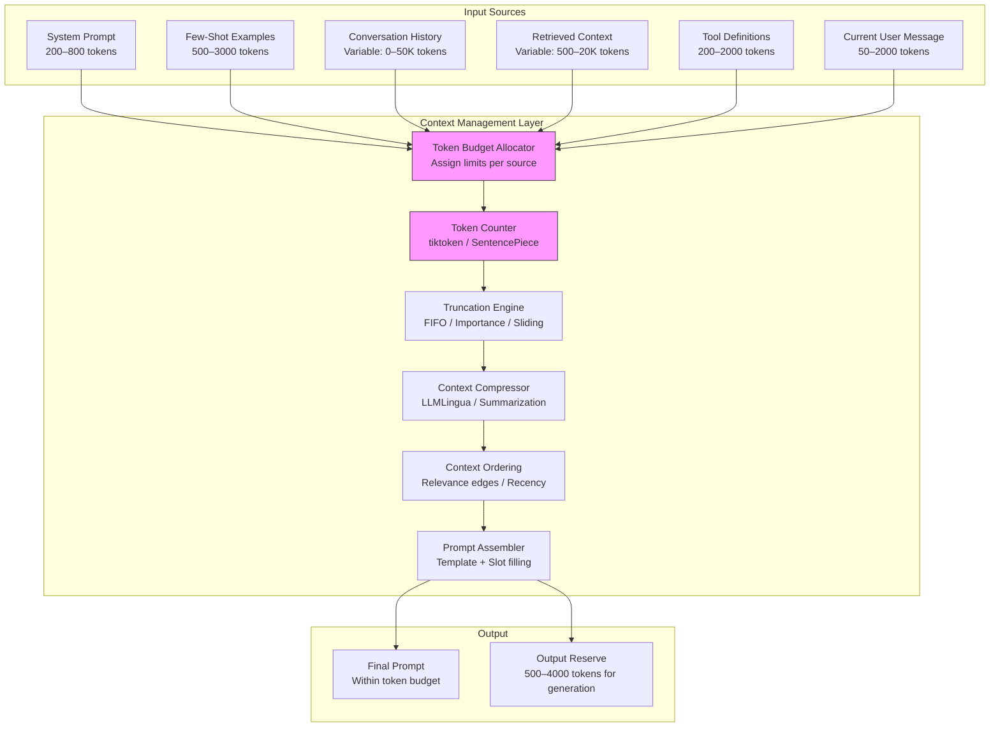
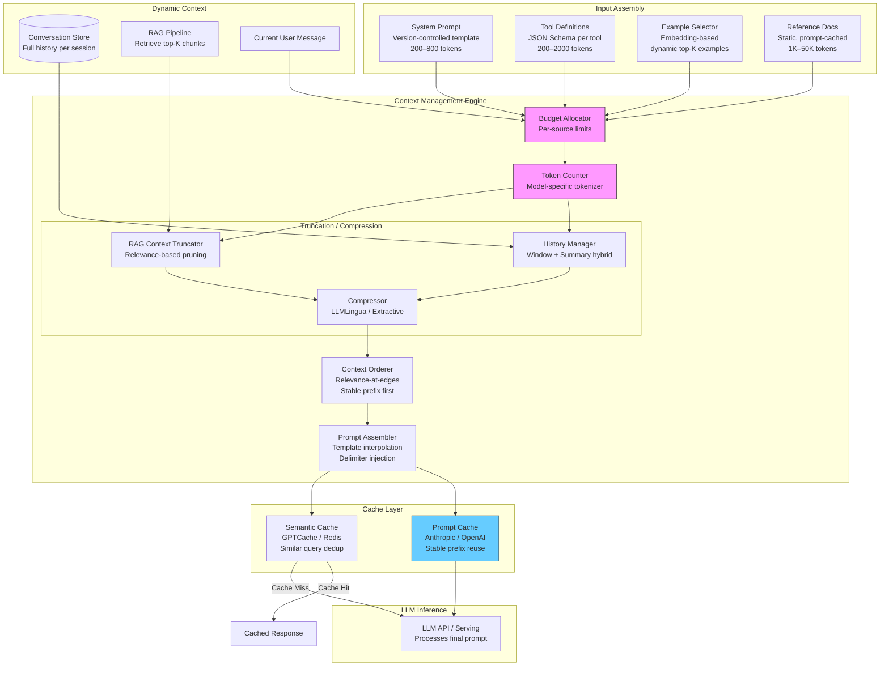
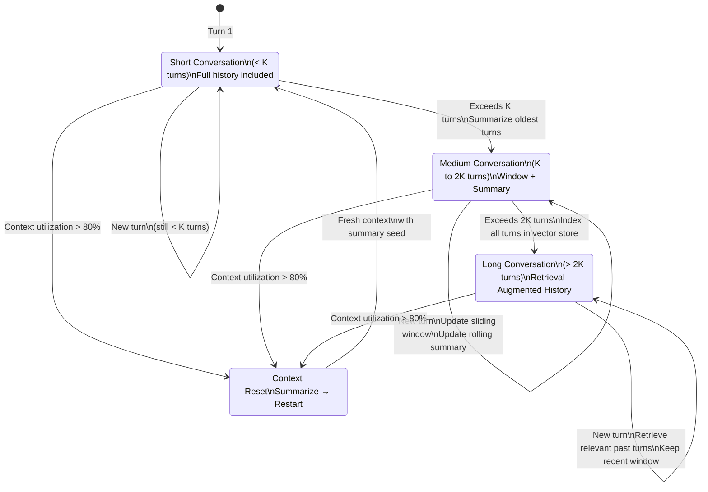
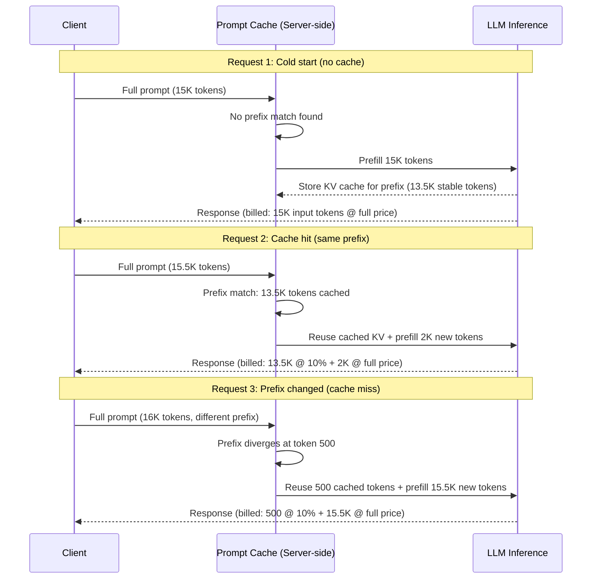

# Context Window Management

## 1. Overview

Context window management is the discipline of allocating, optimizing, and controlling the finite token budget available to an LLM at inference time. Every token that enters the context window has an opportunity cost --- it displaces another token that could have provided more value. For Principal AI Architects, context management is not a prompt engineering nicety; it is a resource allocation problem with direct, quantifiable impact on output quality, latency, and cost.

The context window is the LLM's entire working memory. Unlike a traditional database query where data is fetched as needed, an LLM must receive all relevant information upfront in a single contiguous token sequence. This fundamental constraint means that context management is the primary lever for controlling LLM behavior at inference time --- more impactful than temperature, top-p, or even model selection in many scenarios.

**Key numbers that shape context management decisions:**
- Context window sizes (2025): GPT-4o: 128K tokens, Claude 3.5/4: 200K tokens, Gemini 1.5 Pro: 2M tokens, Llama 3.1: 128K tokens, Mistral Large: 128K tokens
- Token-to-word ratio: ~1.3 tokens/word for English (GPT-4 tokenizer), ~2--4 tokens/word for CJK languages, ~1.5--2.5 tokens/word for code
- Cost per token (input): GPT-4o: $2.50/M, Claude Sonnet: $3/M, Claude Opus: $15/M, GPT-4o-mini: $0.15/M, Llama 3.1 70B (self-hosted): ~$0.30/M
- Prompt caching discount: Anthropic: 90% discount on cached tokens, OpenAI: 50% discount, Google: 75% discount
- Context utilization sweet spot: Models perform best when context is 20--60% of the window. Beyond 80%, quality degrades measurably (lost-in-the-middle effect, attention dilution)
- Prefill latency: Roughly linear in context length --- 128K tokens of context adds 2--8 seconds TTFT depending on hardware and model

The core tension in context management: more context provides more information for the model to reason over, but excessive context introduces noise, increases cost, adds latency, and can paradoxically degrade output quality. The architect's job is to maximize signal-to-noise ratio within the token budget.

---

## 2. Where It Fits in GenAI Systems

Context management sits between the application logic layer and the LLM inference layer. It is the final assembly step that transforms raw inputs (system instructions, user messages, retrieved documents, conversation history, examples) into the actual token sequence the model processes.



Context management interacts with these adjacent systems:
- **Tokenization** (foundation): Token counting is the metrological basis of context management. See [Tokenization](../01-foundations/03-tokenization.md).
- **Prompt patterns** (peer): Few-shot examples, chain-of-thought, and other patterns consume context budget. See [Prompt Patterns](./01-prompt-patterns.md).
- **RAG pipeline** (upstream): RAG determines how much retrieved context competes for the context budget. See [RAG Pipeline](../04-rag/01-rag-pipeline.md).
- **Context scaling** (infrastructure): Long-context model architectures expand the budget but introduce new tradeoffs. See [Context Scaling](../02-llm-architecture/05-context-scaling.md).
- **Cost optimization** (downstream): Token usage is the primary cost driver. Context management directly controls cost. See [Cost Optimization](../11-performance/03-cost-optimization.md).
- **Semantic caching** (optimization): Caching frequent prompt prefixes reduces redundant token processing. See [Semantic Caching](../11-performance/02-semantic-caching.md).
- **KV cache** (infrastructure): The context window's runtime representation. Understanding KV cache helps explain why context length affects latency. See [KV Cache](../02-llm-architecture/04-kv-cache.md).

---

## 3. Core Concepts

### 3.1 Token Counting: The Foundation

Accurate token counting is the prerequisite for all context management. Tokens are not words, not characters, not bytes --- they are model-specific subword units determined by the tokenizer used during model training.

**Tokenizer libraries by model family:**

| Model Family | Tokenizer | Library | Vocab Size | Avg Tokens/Word (English) |
|---|---|---|---|---|
| GPT-4, GPT-4o | cl100k_base | tiktoken | 100,277 | 1.3 |
| GPT-4o (updated) | o200k_base | tiktoken | 200,019 | 1.1 |
| Claude (all versions) | Claude tokenizer | anthropic-tokenizer | ~100K | 1.3 |
| Llama 3 / 3.1 | Llama 3 tokenizer | tiktoken-compatible | 128,256 | 1.2 |
| Llama 2 | SentencePiece BPE | sentencepiece | 32,000 | 1.5 |
| Mistral / Mixtral | SentencePiece BPE | sentencepiece | 32,768 | 1.4 |
| Gemini | SentencePiece | sentencepiece | 256,000 | 1.1 |

**Critical implementation detail**: Token counts vary by tokenizer. The same text tokenized with cl100k_base (GPT-4) and the Llama 2 tokenizer can differ by 15--40%. When building multi-model applications that route to different backends, count tokens with the target model's tokenizer, not a generic approximation.

**Token counting in practice:**
```python
import tiktoken

# GPT-4 / GPT-4o
enc = tiktoken.encoding_for_model("gpt-4o")
token_count = len(enc.encode(text))

# For chat messages (includes message framing overhead)
def count_chat_tokens(messages, model="gpt-4o"):
    enc = tiktoken.encoding_for_model(model)
    tokens = 0
    for msg in messages:
        tokens += 4  # message framing: <|im_start|>role\n...content<|im_end|>\n
        tokens += len(enc.encode(msg["content"]))
        tokens += len(enc.encode(msg["role"]))
    tokens += 2  # assistant reply priming
    return tokens
```

**Chat message framing overhead**: Each message in a chat-format prompt includes metadata tokens (role markers, delimiters). For OpenAI's chat format, this is approximately 4 tokens per message. For a 50-turn conversation, that is 200 tokens of pure overhead. For Anthropic's format, the overhead is similar.

**Estimation heuristics (when exact counting is too slow):**
- English text: `tokens ~= words * 1.3` (within 10% for typical content)
- Code: `tokens ~= characters / 3.5` (varies by language; Python is more token-efficient than Java)
- JSON: `tokens ~= characters / 3` (verbose due to punctuation and key repetition)
- Quick pre-check: If you need a fast, approximate check before doing exact counting, use character length / 4 as a rough upper bound for English.

### 3.2 Context Budget Allocation

Context budget allocation is the process of dividing the total context window across competing demands. This is a resource allocation problem that must be solved for every request.

**The budget equation:**

```
available_context = model_context_window - output_reserve
usable_context = available_context - system_prompt - tool_definitions - message_framing

Remaining budget allocation:
  conversation_history_budget = usable_context * history_fraction
  retrieved_context_budget = usable_context * retrieval_fraction
  few_shot_budget = usable_context * examples_fraction
  user_message_budget = usable_context * user_fraction
```

**Output reserve:** Always reserve tokens for the model's response. This is the `max_tokens` parameter in API calls. Undersizing the output reserve causes truncated responses. Oversizing it wastes budget that could have held useful input context.

| Use Case | Recommended Output Reserve |
|---|---|
| Classification / extraction | 50--200 tokens |
| Short-form Q&A | 200--500 tokens |
| Summarization | 500--1500 tokens |
| Long-form generation (reports, articles) | 2000--4000 tokens |
| Code generation | 1000--4000 tokens |
| Conversational (multi-turn chat) | 500--1000 tokens |

**Budget allocation strategies by application type:**

| Application | System Prompt | History | Retrieved Context | Examples | User Input |
|---|---|---|---|---|---|
| RAG Q&A | 5--10% | 0% | 60--80% | 5--10% | 5--10% |
| Multi-turn chat | 5--10% | 40--60% | 0% | 0--5% | 10--20% |
| RAG + chat | 5--10% | 20--30% | 30--50% | 0--5% | 5--10% |
| Agentic (tool use) | 10--15% | 15--25% | 20--30% | 0% | 5--10% |
| Few-shot classification | 5% | 0% | 0% | 70--85% | 5--10% |
| Document analysis | 5--10% | 0% | 70--85% | 0--5% | 5% |

### 3.3 Truncation Strategies

When content exceeds its allocated budget, truncation determines which content to keep and which to discard.

**FIFO (First-In, First-Out):**
- Remove the oldest messages from conversation history first.
- Simple and deterministic. Works well when recent context is more relevant than historical context.
- Failure mode: Loses important early context (the user's initial question, key constraints stated early in the conversation, the system's first response that established context).

**LIFO (Last-In, First-Out):**
- Remove the most recent messages first. Rarely used for conversation history but sometimes used for retrieved context (keep the most generally relevant documents, discard the latest additions).
- Appropriate when the earliest context is the most authoritative.

**Sliding Window:**
- Keep the first N tokens (anchored beginning) + last M tokens (sliding end), discard the middle.
- Preserves the system prompt and initial context (beginning) plus the most recent turns (end).
- Exploits the U-shaped attention pattern (lost-in-the-middle): models attend best to the beginning and end of the context.
- Production implementation: Always preserve the system prompt (first message) and the last 3--5 turns. Everything in between is the truncation target.

**Importance-Based Truncation:**
- Score each message or chunk by relevance to the current query, then truncate lowest-scoring content.
- Relevance can be measured by embedding similarity between the chunk and the current user message.
- More expensive (requires embedding each candidate) but significantly better at preserving signal.
- Best for long conversations where the user's current question is topically different from earlier turns.

**Hierarchical Truncation:**
- Truncate at different granularities depending on the budget pressure:
  1. First, remove few-shot examples (if present and not critical).
  2. Then, compress retrieved context (summarize or reduce top-K).
  3. Then, summarize older conversation history.
  4. Finally, truncate the system prompt to an abbreviated version.
- Each level is a progressively more aggressive intervention, activated only when the prior level is insufficient.

### 3.4 Conversation History Management

Managing conversation history is the most complex aspect of context management because conversations are unbounded in length while context windows are not.

**Strategy 1: Full History**
- Include the complete conversation (all turns) in every request.
- Maximum context fidelity. The model has access to everything said.
- Feasible only for short conversations (under ~30 turns) on models with large context windows.
- Cost scales linearly with conversation length. A 100-turn conversation on GPT-4o with an average of 500 tokens/turn costs ~$0.125 in input tokens per turn --- and this cost is paid on every subsequent turn.

**Strategy 2: Sliding Window (Fixed-K Turns)**
- Keep the last K turns (e.g., K=10) plus the system prompt.
- Simple, predictable cost and latency.
- The model "forgets" everything older than K turns. Users who reference earlier context get incoherent responses.
- Best for: Task-oriented conversations where context beyond the recent exchange is rarely needed (e.g., customer support with short session scope).

**Strategy 3: Summarization (Progressive Compression)**
- Periodically summarize older conversation history and replace the full turns with the summary.
- Implementation: After every N turns (e.g., N=5), summarize turns 1--N into a paragraph, then carry the summary forward as a "conversation context" block. When turns N+1 through 2N accumulate, summarize them together with the prior summary.
- Tradeoff: Summaries lose detail. The user says "go back to what you said about the database" and the model has only a one-sentence summary that mentions "database schema discussed" without the specific details.
- Summarization cost: One additional LLM call every N turns. Use a fast, cheap model (GPT-4o-mini, Claude Haiku) for summarization.

**Strategy 4: Hybrid (Window + Summary)**
- Combine a full window of recent turns (last K turns) with a rolling summary of older turns.
- The model has full detail for recent context and compressed context for historical reference.
- This is the production standard for long-running conversational applications.

```
[System Prompt]
[Summary of turns 1-45: "User discussed requirements for a recommendation engine.
Key decisions: use collaborative filtering, PostgreSQL for metadata, Pinecone for
vectors. Open question: batch vs real-time inference."]
[Full turn 46]
[Full turn 47]
[Full turn 48]
[Full turn 49]
[Full turn 50 - current user message]
```

**Strategy 5: Retrieval-Augmented History**
- Index all conversation turns in a vector store. When the user asks a question, retrieve the most relevant past turns (by embedding similarity) rather than including all recent turns.
- Best for: Long conversations (100+ turns) where the user frequently references specific earlier exchanges.
- Implementation: Embed each turn as it occurs. At each new turn, retrieve the top-K most relevant prior turns and include them as context alongside the last 3--5 turns.
- Limitation: Adds retrieval latency (~50--100ms). May miss relevant turns if the embedding similarity doesn't capture conversational callbacks ("go back to what we discussed earlier").

### 3.5 Context Compression Techniques

Context compression reduces the token count of content while preserving its semantic value. This is distinct from truncation (which removes content entirely) --- compression retains all information in a more compact form.

**LLMLingua (Jiang et al., 2023) and LLMLingua-2 (Pan et al., 2024):**
- Uses a small language model (e.g., GPT-2, LLaMA-7B) to score the "importance" of each token based on perplexity. Low-importance tokens (predictable given context) are removed.
- Compression ratios: 2x--5x with <5% quality degradation on downstream tasks.
- LLMLingua-2 improves on the original with a dedicated token classification model trained specifically for compression, achieving better quality at the same compression ratio.
- Latency: 20--100ms for compression (small model inference). This must be faster than the latency savings from reducing context length, or it is counterproductive.
- Best for: Compressing retrieved documents in RAG pipelines where the raw retrieved text contains significant redundancy.

**Extractive summarization:**
- Select the most relevant sentences from the source text rather than generating new text.
- Methods: TextRank (graph-based), embedding-based (select sentences most similar to the query), BM25-based (select sentences with highest keyword overlap with the query).
- Preserves exact wording (useful for citation/attribution).
- Compression ratio: 3x--10x depending on aggressiveness.
- No LLM call required (fast, cheap).

**Abstractive summarization (LLM-based):**
- Use a smaller, faster LLM to generate a concise summary of the source text.
- Better quality than extractive for narrative content. Worse for technical content where exact details matter.
- Cost: One additional LLM call per document/chunk. Use the cheapest model that maintains acceptable quality.
- Latency: 100--500ms per summary.

**Semantic deduplication:**
- When multiple retrieved chunks contain overlapping or redundant information, remove the duplicates.
- Implementation: Compute pairwise embedding similarity for all retrieved chunks. If similarity > 0.90, keep only the highest-ranked chunk.
- Compression ratio depends on corpus redundancy. Typical: 10--30% reduction in retrieved context size.

**Structured format conversion:**
- Convert verbose prose into structured formats (tables, bullet points, key-value pairs) that convey the same information in fewer tokens.
- Example: A 500-token paragraph describing a product's specifications becomes a 150-token table.
- Can be done by an LLM or by rule-based extraction for structured source data.

### 3.6 Long-Context Models vs. RAG: Decision Framework

The availability of models with 128K--2M token context windows raises the question: do we still need RAG, or can we just dump everything into the context?

**When long-context wins over RAG:**
- Corpus size fits in the window (under ~500 pages / 200K tokens for Gemini 1.5 Pro).
- The entire corpus is relevant to every query (e.g., analyzing a single legal contract, summarizing a meeting transcript).
- Latency sensitivity is low (prefilling a 200K-token context takes 3--8 seconds).
- The corpus is static and updated infrequently (no ingestion pipeline needed).
- Query patterns are diverse and unpredictable (hard to build a retrieval system that handles all query types).

**When RAG wins over long-context:**
- Corpus size exceeds the context window (millions of documents).
- Only a small fraction of the corpus is relevant to any given query (high selectivity).
- Latency matters --- RAG with 5 chunks is faster than long-context with the full corpus.
- Cost matters --- processing 200K input tokens per request at $2.50/M costs $0.50/request. RAG with 3K tokens costs $0.0075/request. That is a 67x cost difference.
- The corpus is updated frequently (RAG can index new documents in seconds; long-context requires re-uploading the full corpus).
- Attribution/citation is required (RAG provides explicit source chunks; long-context makes attribution harder).

**Cost comparison (concrete example):**

| Approach | Input Tokens | Cost/Query (GPT-4o) | Latency (TTFT) |
|---|---|---|---|
| RAG (5 chunks x 500 tokens) | 3,500 | $0.009 | 200--400ms |
| RAG (20 chunks x 500 tokens) | 11,000 | $0.028 | 300--600ms |
| Long-context (full 100-page doc) | 50,000 | $0.125 | 1--3s |
| Long-context (full 500-page corpus) | 200,000 | $0.500 | 3--8s |

**The hybrid approach (emerging best practice):**
- Use long-context for "always-relevant" reference material (system instructions, product documentation, style guides) that applies to every request.
- Use RAG for large, dynamic corpora where only a fraction is relevant per query.
- The long-context portion is prompt-cached (90% cost reduction on Anthropic), making it nearly free after the first request.

### 3.7 Prompt Caching

Prompt caching is an inference optimization that avoids reprocessing identical prompt prefixes across requests. It is a game-changing feature for context management because it decouples context length from cost for repeated prefixes.

**How it works (Anthropic implementation):**
1. The first request with a long prompt is processed normally. The KV cache (attention key-value pairs) for the prompt prefix is stored server-side.
2. Subsequent requests that share the same prefix (exact token-level match) reuse the cached KV pairs, skipping the prefill computation.
3. Cached tokens are billed at 10% of the normal input token price (90% discount).
4. Cache has a TTL (typically 5 minutes of inactivity on Anthropic, varies by provider).

**How it works (OpenAI implementation):**
1. Automatic caching of prompt prefixes (no explicit API parameter needed).
2. Matching is done on the longest common prefix of the token sequence.
3. Cached tokens are billed at 50% of normal input token price.
4. Minimum cacheable prefix: 1024 tokens.

**How it works (Google implementation):**
1. Explicit "context caching" API where you define a cache object with content and a TTL.
2. Cached content is billed at a reduced rate (75% discount in preview pricing).
3. Cache TTL is user-configurable (minimum 1 minute).

**Designing for cache-friendly prompts:**
- **Prefix stability**: The cacheable portion must be an exact prefix of the prompt. Any change in the prefix invalidates the cache for everything after the change point.
- **Ordering principle**: Put the most stable content first (system prompt, tool definitions, few-shot examples, reference documents) and the most variable content last (conversation history, current user message, retrieved context).

```
[STABLE PREFIX - cached]
  System prompt (500 tokens)
  Tool definitions (1000 tokens)
  Few-shot examples (2000 tokens)
  Reference document (10000 tokens)
[VARIABLE SUFFIX - not cached]
  Conversation history (variable)
  Retrieved context (variable)
  Current user message (variable)
```

- With this ordering and a 13,500-token stable prefix on Anthropic, the caching saves $0.030/request at standard pricing. Over 1M requests/month, that is $30,000/month in savings.

**Cache hit rate optimization:**
- Monitor cache hit rates. If below 50%, the prefix is changing too frequently.
- Common cache-busting mistakes: Including timestamps, request IDs, or random salts in the system prompt. Including dynamic retrieved context before static reference documents.
- For multi-turn conversations: The conversation history grows with each turn, but the prefix (system prompt + tools + examples) remains stable. The prefix is cached; only the incremental new tokens are billed at full price.

### 3.8 Token Optimization Techniques

Beyond structural strategies, individual prompt engineering techniques reduce token consumption without losing information.

**Concise prompting:**
- Remove filler words, redundant instructions, and verbose formatting.
- "Please provide a detailed and comprehensive answer to the following question, making sure to include all relevant details and examples" (25 tokens) -> "Answer with details and examples:" (6 tokens). Same outcome, 76% fewer tokens.
- System prompts tend to accumulate cruft over iterations. Regularly audit and trim.

**Structured format selection:**
- JSON is verbose (keys are repeated, quotes and braces add tokens).
- YAML is 15--25% more token-efficient than JSON for the same data.
- Markdown tables are 20--40% more efficient than prose for tabular data.
- Custom delimited formats can be 30--50% more efficient than JSON: `name|age|city\nAlice|30|NYC` vs `[{"name": "Alice", "age": 30, "city": "NYC"}]`.

**Abbreviation and compression:**
- For repetitive content (e.g., many similar records), define abbreviations: "In the following data, C=Customer, O=Order, D=Date."
- Removes redundancy in structured data without losing information.
- The model can reliably interpret defined abbreviations.

**Prompt template optimization:**
- Measure the token count of your prompt template (the static parts). Optimize aggressively --- these tokens are paid on every request.
- A 100-token reduction in the system prompt saves $0.25/M requests at $2.50/M tokens. At 10M requests/month, that is $2,500/month.

**Example pruning (for few-shot prompts):**
- More examples are not always better. Empirically, 3--5 well-chosen examples match or exceed 10+ mediocre examples for most classification and extraction tasks.
- Select examples that maximize coverage of edge cases and output format diversity.
- Use an embedding-based example selector to dynamically choose the most relevant examples for each query (instead of using the same fixed set for every query).

### 3.9 Multi-Turn Context Carry-Over

Multi-turn conversations introduce unique context management challenges because the state accumulates across turns.

**Carry-over strategies:**

**Full carry-over (stateless server pattern):**
- Every API call includes the full conversation history. The LLM server is stateless.
- Maximum simplicity. No server-side state management.
- Cost grows quadratically with conversation length (each turn includes all prior turns, and there are N turns).
- Total tokens processed for an N-turn conversation: `sum(i=1..N) of (system + i * avg_turn_size) = N * system + avg_turn_size * N*(N+1)/2`

**Delta carry-over (stateful server pattern):**
- The server maintains the KV cache across turns. Each new API call sends only the new user message.
- Dramatically lower cost (only the new tokens are processed, not the full history).
- Requires stateful inference infrastructure (vLLM with session management, Anthropic's multi-turn conversation API).
- If the session is interrupted (server restart, timeout), the full history must be re-sent.

**Context reset patterns:**
- **Hard reset**: Clear all history. Use when the user explicitly changes topic or the conversation becomes unproductive.
- **Soft reset**: Summarize the current conversation and start fresh with the summary as the opening context. Preserves key decisions and context while freeing budget.
- **Triggered reset**: Automatically reset when context utilization exceeds a threshold (e.g., 80% of the window). Summarize before resetting.

**Thread forking:**
- In agentic systems, a single conversation may spawn multiple parallel threads (e.g., researching two options simultaneously). Each thread needs its own context.
- Implementation: Maintain a context tree where each branch has its own history. The root (shared context) is the system prompt and initial user request. Each branch adds its own turn history.
- When branches reconverge, summarize each branch and include both summaries in the merged context.

---

## 4. Architecture

### 4.1 Context Management Reference Architecture



### 4.2 Conversation History Management State Machine



### 4.3 Prompt Caching Token Flow



---

## 5. Design Patterns

### 5.1 Layered Context Pattern

Organize the prompt into layers of decreasing stability, optimizing for prompt caching:

```
Layer 1 (most stable):  System prompt + behavioral instructions
Layer 2 (stable):       Tool definitions, output schema
Layer 3 (semi-stable):  Reference documents, few-shot examples
Layer 4 (per-session):  Conversation summary, session metadata
Layer 5 (per-turn):     Recent turns, retrieved context, user message
```

Each layer changes less frequently than the one below it. The cache boundary is drawn between the most stable layers and the variable ones.

### 5.2 Budget Envelope Pattern

Define strict token budgets ("envelopes") per context source and enforce them at assembly time:

```python
BUDGET = {
    "system_prompt": 600,
    "tool_definitions": 1500,
    "few_shot_examples": 2000,
    "conversation_history": 8000,
    "retrieved_context": 6000,
    "user_message": 1000,
    "output_reserve": 2000,
}
# Total: 21,100 tokens (fits in any 32K+ model)

def enforce_budget(content: dict, budget: dict) -> dict:
    """Truncate each content source to fit its budget."""
    result = {}
    for source, text in content.items():
        max_tokens = budget.get(source, 0)
        result[source] = truncate_to_tokens(text, max_tokens)
    return result
```

This prevents any single source from monopolizing the context window. The budgets are tuned per application based on empirical quality testing.

### 5.3 Adaptive Budget Pattern

Dynamically reallocate budget based on the current request's needs:

- If the user's message is short (50 tokens), reallocate the unused user_message budget to retrieved_context.
- If no few-shot examples are needed (the task is well-specified), reallocate the examples budget to conversation history.
- If the conversation is only 3 turns long, the history budget is underutilized --- reallocate to retrieved context.

This requires a budget optimizer that runs before prompt assembly:

```python
def optimize_budget(request, base_budget):
    budget = base_budget.copy()
    user_tokens = count_tokens(request.user_message)
    history_tokens = count_tokens(request.history)

    # Reclaim unused user message budget
    user_surplus = max(0, budget["user_message"] - user_tokens)
    budget["retrieved_context"] += user_surplus
    budget["user_message"] = user_tokens

    # Reclaim unused history budget
    history_surplus = max(0, budget["conversation_history"] - history_tokens)
    budget["retrieved_context"] += history_surplus
    budget["conversation_history"] = history_tokens

    return budget
```

### 5.4 Progressive Summarization Pattern

Implement a tiered summarization strategy for conversation history:

1. **Tier 1 (recent)**: Last 5 turns --- full verbatim text.
2. **Tier 2 (medium)**: Turns 6--20 --- key points extracted (bullet-point summary per turn).
3. **Tier 3 (old)**: Turns 21+ --- rolling paragraph summary.

As the conversation progresses, content migrates from Tier 1 to Tier 2 to Tier 3. Each migration is a compression event.

### 5.5 Context-Aware RAG Budget Pattern

Dynamically adjust the number of retrieved chunks based on available context budget after accounting for higher-priority content:

```python
def compute_rag_budget(model_context, system_tokens, history_tokens,
                        user_tokens, output_reserve):
    available = model_context - system_tokens - history_tokens - user_tokens - output_reserve
    avg_chunk_tokens = 400
    max_chunks = available // avg_chunk_tokens
    # Cap at a reasonable maximum to avoid noise
    return min(max_chunks, 20)
```

---

## 6. Implementation Approaches

### 6.1 Full Context Manager Implementation

```python
from dataclasses import dataclass, field
from typing import List, Optional
import tiktoken

@dataclass
class ContextSource:
    name: str
    content: str
    priority: int        # lower = higher priority (kept during truncation)
    max_tokens: int
    compressible: bool = True

@dataclass
class ContextBudget:
    model_context_window: int
    output_reserve: int
    sources: List[ContextSource] = field(default_factory=list)

class ContextManager:
    def __init__(self, model: str = "gpt-4o"):
        self.encoder = tiktoken.encoding_for_model(model)

    def count_tokens(self, text: str) -> int:
        return len(self.encoder.encode(text))

    def truncate_text(self, text: str, max_tokens: int) -> str:
        tokens = self.encoder.encode(text)
        if len(tokens) <= max_tokens:
            return text
        return self.encoder.decode(tokens[:max_tokens])

    def assemble(self, budget: ContextBudget) -> str:
        available = budget.model_context_window - budget.output_reserve

        # Sort by priority (lower number = higher priority)
        sources = sorted(budget.sources, key=lambda s: s.priority)

        # Phase 1: Allocate to each source within its max_tokens
        allocated = {}
        remaining = available
        for source in sources:
            tokens = self.count_tokens(source.content)
            alloc = min(tokens, source.max_tokens, remaining)
            allocated[source.name] = self.truncate_text(source.content, alloc)
            remaining -= self.count_tokens(allocated[source.name])

        # Phase 2: Redistribute surplus from under-budget sources
        for source in sources:
            actual = self.count_tokens(allocated[source.name])
            surplus = source.max_tokens - actual
            if surplus > 0:
                remaining += surplus

        # Phase 3: Expand lower-priority compressible sources into surplus
        for source in reversed(sources):
            if remaining <= 0:
                break
            actual = self.count_tokens(allocated[source.name])
            full = self.count_tokens(source.content)
            if full > actual:
                expansion = min(full - actual, remaining)
                new_limit = actual + expansion
                allocated[source.name] = self.truncate_text(
                    source.content, new_limit
                )
                remaining -= expansion

        return allocated
```

### 6.2 Conversation History Manager

```python
class ConversationHistoryManager:
    def __init__(self, context_manager: ContextManager,
                 window_size: int = 10,
                 summary_model: str = "gpt-4o-mini"):
        self.cm = context_manager
        self.window_size = window_size
        self.summary_model = summary_model
        self.full_history: List[dict] = []
        self.rolling_summary: str = ""

    def add_turn(self, role: str, content: str):
        self.full_history.append({"role": role, "content": content})

    def get_context(self, max_tokens: int) -> str:
        recent = self.full_history[-self.window_size:]
        recent_text = "\n".join(
            f"{t['role']}: {t['content']}" for t in recent
        )
        recent_tokens = self.cm.count_tokens(recent_text)

        if recent_tokens <= max_tokens and not self.rolling_summary:
            return recent_text

        # Include summary + recent window
        summary_budget = max_tokens - recent_tokens - 50  # 50 token buffer
        if summary_budget > 0 and self.rolling_summary:
            summary = self.cm.truncate_text(
                self.rolling_summary, summary_budget
            )
            return f"[Previous context summary]: {summary}\n\n[Recent conversation]:\n{recent_text}"

        # Budget too tight: truncate recent window
        return self.cm.truncate_text(recent_text, max_tokens)

    async def update_summary(self, client):
        """Summarize turns outside the window into the rolling summary."""
        old_turns = self.full_history[:-self.window_size]
        if len(old_turns) < 5:
            return

        old_text = "\n".join(
            f"{t['role']}: {t['content']}" for t in old_turns[-10:]
        )
        response = await client.messages.create(
            model=self.summary_model,
            max_tokens=500,
            system="Summarize this conversation segment concisely. "
                   "Preserve key decisions, facts, and open questions.",
            messages=[{"role": "user", "content": old_text}]
        )
        new_summary = response.content[0].text

        if self.rolling_summary:
            # Merge with existing summary
            merge_response = await client.messages.create(
                model=self.summary_model,
                max_tokens=500,
                system="Merge these two conversation summaries into one "
                       "concise summary, preserving all key information.",
                messages=[{"role": "user",
                          "content": f"Earlier summary:\n{self.rolling_summary}\n\n"
                                     f"New summary:\n{new_summary}"}]
            )
            self.rolling_summary = merge_response.content[0].text
        else:
            self.rolling_summary = new_summary
```

### 6.3 Prompt Cache Optimizer

```python
class PromptCacheOptimizer:
    """Orders prompt components to maximize cache hit rates."""

    STABILITY_ORDER = [
        "system_prompt",          # Most stable (changes on deployment)
        "tool_definitions",       # Stable (changes on feature release)
        "reference_documents",    # Semi-stable (changes on doc update)
        "few_shot_examples",      # Semi-stable (may rotate per task type)
        "conversation_summary",   # Per-session
        "conversation_history",   # Per-turn (grows each turn)
        "retrieved_context",      # Per-turn (changes per query)
        "user_message",           # Per-turn (always different)
    ]

    def assemble_cache_friendly(self, components: dict) -> list:
        """Return components ordered for maximum prefix caching."""
        ordered = []
        for source_name in self.STABILITY_ORDER:
            if source_name in components and components[source_name]:
                ordered.append({
                    "source": source_name,
                    "content": components[source_name]
                })
        return ordered

    def estimate_cache_savings(self, components: dict,
                                 price_per_m_tokens: float,
                                 cache_discount: float = 0.9,
                                 requests_per_day: int = 100000) -> dict:
        """Estimate daily cost savings from prompt caching."""
        stable_tokens = 0
        variable_tokens = 0

        # Assume everything above conversation_history is cacheable
        cache_boundary = "conversation_summary"
        in_cache = True

        enc = tiktoken.encoding_for_model("gpt-4o")
        for source_name in self.STABILITY_ORDER:
            if source_name == cache_boundary:
                in_cache = False
            content = components.get(source_name, "")
            tokens = len(enc.encode(content)) if content else 0
            if in_cache:
                stable_tokens += tokens
            else:
                variable_tokens += tokens

        full_cost = (stable_tokens + variable_tokens) * price_per_m_tokens / 1e6 * requests_per_day
        cached_cost = (stable_tokens * (1 - cache_discount) + variable_tokens) * price_per_m_tokens / 1e6 * requests_per_day

        return {
            "stable_tokens": stable_tokens,
            "variable_tokens": variable_tokens,
            "daily_cost_without_cache": full_cost,
            "daily_cost_with_cache": cached_cost,
            "daily_savings": full_cost - cached_cost,
            "monthly_savings": (full_cost - cached_cost) * 30,
        }
```

---

## 7. Tradeoffs

### 7.1 History Management Strategy Selection

| Strategy | Memory Fidelity | Cost per Turn | Latency per Turn | Implementation Complexity | Best For |
|---|---|---|---|---|---|
| Full history | Perfect | High (grows linearly) | High (grows linearly) | Lowest | Short conversations (<20 turns) |
| Sliding window (K turns) | Recent only | Fixed | Fixed | Low | Task-oriented, short sessions |
| Summarization | Compressed, lossy | Medium (+summary call) | Medium (+summary latency) | Medium | Long conversations, cost-sensitive |
| Window + Summary (hybrid) | Good (recent detail + old summary) | Medium | Medium | Medium | General-purpose, production standard |
| Retrieval-augmented | Good for referenced topics | Medium (+retrieval) | Medium (+retrieval) | High | Very long conversations (100+ turns) |

### 7.2 Compression Technique Selection

| Technique | Compression Ratio | Quality Loss | Latency Added | Cost Added | Best For |
|---|---|---|---|---|---|
| LLMLingua / LLMLingua-2 | 2--5x | <5% on benchmarks | 20--100ms | Small model inference | RAG context compression |
| Extractive summarization | 3--10x | Moderate (misses context) | 5--20ms | Minimal (no LLM) | Long documents, citation-needed |
| Abstractive (LLM) summary | 5--20x | Low for narrative, high for technical | 100--500ms | 1 LLM call | Conversation history compression |
| Semantic deduplication | 1.1--1.4x | Negligible | 10--50ms | Embedding calls | Redundant RAG results |
| Format conversion | 1.5--3x | Negligible if done well | 10--50ms | Optional LLM call | Structured/tabular data |
| Prompt trimming | 1.1--1.5x | None | None | None | System prompt optimization |

### 7.3 Long-Context vs. RAG Decision Matrix

| Dimension | Long-Context | RAG | Hybrid |
|---|---|---|---|
| Corpus under 100K tokens | Preferred | Unnecessary overhead | Overkill |
| Corpus 100K--500K tokens | Viable, expensive | Good | Recommended |
| Corpus over 500K tokens | Infeasible (exceeds window) | Required | RAG + long-context reference docs |
| Latency-critical (<500ms TTFT) | Poor (long prefill) | Good | RAG for query, cache for reference |
| Cost-critical | Poor ($0.10--0.50/query) | Good ($0.005--0.03/query) | Best of both with caching |
| Full-corpus reasoning needed | Excellent | Poor (retriever may miss) | Use long-context for core docs |
| Dynamic corpus (daily updates) | Requires re-upload | Index updates in seconds | RAG for dynamic, cache for static |
| Attribution / citation needed | Hard (no chunk boundaries) | Natural (retrieved chunks cited) | RAG chunks provide citations |

### 7.4 Prompt Caching Provider Comparison

| Feature | Anthropic | OpenAI | Google |
|---|---|---|---|
| Discount on cached tokens | 90% | 50% | 75% |
| Minimum cacheable prefix | 1024 tokens (Sonnet), 2048 (Haiku) | 1024 tokens | 32,768 tokens |
| Cache TTL | 5 min (auto-extend on use) | Automatic (undocumented) | User-configurable (min 1 min) |
| Cache control | Explicit (cache_control breakpoint) | Automatic (prefix matching) | Explicit (CachedContent API) |
| Write cost | 25% surcharge on first write | None | Storage cost per hour |
| Multi-turn benefit | High (conversation prefix cached) | High (automatic) | Moderate (requires explicit setup) |
| Best for | Long system prompts, reference docs | General use, low-effort | Very large context caching |

---

## 8. Failure Modes

### 8.1 Context Overflow (Silent Truncation)

**Symptom**: The model produces outputs that ignore parts of the input, particularly instructions or constraints mentioned in the middle of the prompt.

**Root cause**: The assembled prompt exceeds the model's context window, and the API silently truncates from the end (or the model's attention degrades for middle content). Some APIs return an error; others truncate silently.

**Mitigation**: Always compute the total token count before sending the request. Enforce the budget equation strictly. Add a validation step that rejects prompts exceeding `model_context_window - output_reserve`. Log when truncation is triggered so the issue is visible.

### 8.2 Lost-in-the-Middle

**Symptom**: The model answers questions accurately when relevant information is at the beginning or end of the context, but fails when the information is in the middle.

**Root cause**: The U-shaped attention pattern (Liu et al., 2024). Transformers attend more strongly to tokens at the beginning and end of the sequence. Information at positions 30--70% of the context window is recalled 20--35% less often than information at the edges.

**Mitigation**: Use relevance-at-edges ordering --- place the most important content at the beginning and end of the context. Break long context into smaller, focused chunks. Use shorter contexts with higher relevance rather than longer contexts with noise.

### 8.3 Summary Drift

**Symptom**: After many summarization cycles, the rolling summary diverges from what actually happened in the conversation. The model references decisions or facts that were distorted through repeated summarization.

**Root cause**: Each summarization pass is lossy. Over 10+ cycles, small errors compound. The summarizer drops nuance, merges distinct topics, and introduces its own phrasing that drifts from the original.

**Mitigation**: Periodically validate summaries against the full history (using an LLM to compare). Limit summarization depth --- keep the last 2--3 summaries and the full recent window rather than a single endlessly-recompressed summary. Store full conversation history externally (database) even if only summaries are sent to the LLM.

### 8.4 Cache Busting

**Symptom**: Prompt caching hit rate is near 0% despite having stable system prompts.

**Root cause**: Dynamic content is placed before stable content in the prompt. Any change in the prefix invalidates the cache for everything after it. Common culprits: timestamps in the system prompt, per-request IDs, rotating canary tokens, or dynamic retrieved context placed before static reference documents.

**Mitigation**: Audit the prompt ordering. Move all dynamic content to the end of the prompt. Remove timestamps, request IDs, and other per-request dynamic values from the stable prefix. Monitor cache hit rates as a first-class metric.

### 8.5 Tokenizer Mismatch

**Symptom**: Token count estimates are wrong, leading to context overflow or under-utilization.

**Root cause**: Using the wrong tokenizer for the target model. The same text produces different token counts with different tokenizers. Using `tiktoken` for a Llama model or `sentencepiece` for a GPT model produces incorrect counts.

**Mitigation**: Always use the model-specific tokenizer. When routing requests to multiple models, count tokens for the specific target model. Maintain a tokenizer registry that maps model names to the correct tokenizer.

### 8.6 Few-Shot Budget Bloat

**Symptom**: Few-shot examples consume 50--80% of the context window, leaving insufficient room for the actual task input.

**Root cause**: Too many examples, or examples that are too verbose. A common mistake is including 10+ examples "for safety" when 3--5 would suffice.

**Mitigation**: Benchmark with varying numbers of examples to find the diminishing-returns threshold. Use dynamic example selection (pick the 3 most relevant examples per query) instead of a static set of 10. Compress examples by removing unnecessary detail while preserving the structural pattern.

---

## 9. Optimization Techniques

### 9.1 Latency Optimization

- **Prompt caching**: The single highest-impact latency optimization. A 13K-token cached prefix saves 1--3 seconds of TTFT compared to full prefill. Design prompts for cache friendliness (Section 3.7).
- **Parallel context preparation**: While waiting for RAG retrieval, prepare the conversation history, count tokens, and select few-shot examples in parallel. Overlap I/O with computation.
- **Pre-tokenization**: Tokenize the static portions of the prompt template at startup. Cache the token IDs. At request time, only tokenize the dynamic portions and concatenate.
- **Streaming with early context assembly**: Begin assembling the prompt as soon as the user message arrives. Start retrieval immediately. Assemble retrieved context as chunks arrive (don't wait for all chunks).
- **Context compression as a latency trade**: LLMLingua adds 20--100ms but can reduce prefill time by 200--500ms for very long contexts. Net positive for contexts >10K tokens.

### 9.2 Quality Optimization

- **Relevance-at-edges ordering**: Place the highest-relevance retrieved chunks at position 1 (beginning) and position N (end). Place the lowest-relevance chunks in the middle. This compensates for the lost-in-the-middle effect.
- **Dynamic budget reallocation**: When the query is simple and the retrieved context is short, expand the few-shot budget. When the query is complex, expand the retrieved context budget. Adapt per request.
- **Example diversity selection**: When selecting few-shot examples, maximize diversity (cover different edge cases, output formats, reasoning patterns) rather than maximizing similarity to the query.
- **Context quality scoring**: After assembling the context, score it for relevance to the current query (using a lightweight classifier or embedding similarity). If below a threshold, trigger additional retrieval or expand the history window.

### 9.3 Cost Optimization

- **Prompt caching ROI**: For applications with stable prefixes, prompt caching provides 40--85% cost reduction on input tokens. Calculate the ROI based on your cache hit rate and the price difference between cached and non-cached tokens.
- **Model-aware token optimization**: Larger vocabularies (o200k_base for GPT-4o, Gemini's 256K vocab) produce fewer tokens for the same text. Routing to models with more efficient tokenizers reduces cost per character.
- **Tiered compression**: Apply lightweight compression (deduplication, format conversion) to all requests. Apply expensive compression (LLMLingua, abstractive summarization) only when context exceeds a cost threshold.
- **Output reserve right-sizing**: Over-reserving output tokens does not increase cost (you're billed for actual tokens generated, not the max_tokens limit on most APIs), but under-reserving causes truncated outputs that require re-generation (doubling cost).
- **Batch-level optimization**: For batch workloads, sort requests by prompt similarity to maximize cache reuse across requests.

### 9.4 Monitoring and Tuning

- **Token utilization tracking**: Monitor the fraction of the context window actually used per request. If utilization is consistently below 30%, you are over-provisioning the model size (a smaller, cheaper model would suffice). If consistently above 85%, truncation is likely degrading quality.
- **Cache hit rate monitoring**: Track cache hit rate daily. Investigate drops --- they indicate prompt changes that broke prefix stability.
- **Compression quality monitoring**: Periodically compare model outputs with and without compression on the same queries. If quality degrades by >5% on your evaluation metrics, reduce compression aggressiveness.
- **Budget allocation A/B testing**: Run A/B tests with different budget allocations (e.g., 60/20/20 vs. 40/40/20 for retrieved context / history / other) and measure impact on output quality and user satisfaction.

---

## 10. Real-World Examples

### Anthropic Claude (Prompt Caching and Context Usage)

- **Architecture**: Claude's prompt caching allows developers to mark cache breakpoints in the prompt. Content before the breakpoint is cached server-side and reused across requests. Cache TTL is 5 minutes, auto-extended on each cache hit.
- **Context management strategy**: Claude supports 200K tokens of context. Anthropic's own applications use a layered approach: system prompt + reference documents (cached) + conversation history (incremental) + user message.
- **Key innovation**: Explicit cache control gives developers fine-grained control over what is cached. The 90% discount on cached tokens makes it economically viable to include large reference documents (50K+ tokens) in every request.
- **Impact**: Customers report 50--80% cost reduction and 2--3x TTFT improvement for applications with stable prompts.

### ChatGPT (OpenAI Context Management)

- **Architecture**: GPT-4o has a 128K-token context window with automatic prompt caching. OpenAI's system manages context for 100M+ weekly active users across conversation threads of variable length.
- **History management**: ChatGPT uses a combination of full history (for short conversations) and summarization (for long conversations). The "memory" feature extracts persistent facts from conversations and stores them externally, injecting them into the system prompt for future sessions.
- **Key innovation**: The "memory" feature is a form of long-term context management that transcends individual conversations. Instead of carrying forward full conversation history, it extracts structured facts (user preferences, key decisions, biographical data) and injects them as system prompt context.
- **Scale**: Handles billions of messages per day. Context management decisions directly impact infrastructure cost at this scale.

### Google NotebookLM

- **Architecture**: NotebookLM processes user-uploaded documents (PDFs, Google Docs, web pages) as long-context input. The entire "notebook" of source documents is included in the context window using Gemini 1.5 Pro's 2M-token capacity.
- **Context management strategy**: Pure long-context approach (no RAG). All source documents are concatenated and provided to the model on every query. This is viable because the corpus is user-defined and typically under 500K tokens.
- **Key innovation**: Demonstrates the "long-context instead of RAG" pattern for bounded corpora. Audio overview feature generates podcast-style summaries that require reasoning over the full document set.
- **Tradeoff**: High per-query cost (processing hundreds of thousands of tokens per request), justified by the product's premium positioning and the quality advantage of full-corpus reasoning.

### Cursor (AI Code Editor)

- **Architecture**: Cursor manages context for AI-assisted code editing across entire codebases that far exceed any model's context window. Uses a combination of RAG (code search over the repository), explicit file inclusion (user-selected files), and intelligent context pruning.
- **Context management strategy**: Budget allocation prioritizes the currently open file, referenced files (imports, call sites), user-selected context, and RAG-retrieved code snippets. A context engine dynamically assembles the most relevant code context per query.
- **Key innovation**: Codebase-aware context management that understands code structure (AST, import graphs, symbol references) to select the most relevant context. Goes beyond naive text similarity.
- **Scale**: Manages context across codebases with millions of lines of code, fitting relevant context into 128K-token windows.

### Glean (Enterprise AI)

- **Architecture**: Glean processes queries across enterprise corpora (Slack, Confluence, Drive, Jira, email) using RAG with strict context management to handle hundreds of millions of documents per customer.
- **Context management strategy**: Retrieves top-K documents with reranking, applies per-user permission filtering (which may reduce K), compresses retrieved context, and assembles a prompt within a fixed budget. Different prompt templates have different budget allocations depending on the query type (Q&A, summarization, action generation).
- **Key innovation**: Identity-aware context budgeting --- the same query from different users may have different context compositions because permission filtering removes different documents. The budget allocator dynamically adjusts retrieved context volume based on what passes the permission filter.

---

## 11. Related Topics

- **[Tokenization](../01-foundations/03-tokenization.md)**: The foundation of token counting --- understanding BPE, SentencePiece, and vocabulary design.
- **[Prompt Patterns](./01-prompt-patterns.md)**: Few-shot, chain-of-thought, and other patterns that consume context budget and must be managed.
- **[RAG Pipeline](../04-rag/01-rag-pipeline.md)**: Retrieved context is typically the largest variable consumer of the context budget.
- **[Context Scaling](../02-llm-architecture/05-context-scaling.md)**: Long-context architectures (RoPE scaling, ring attention) that expand the budget.
- **[Cost Optimization](../11-performance/03-cost-optimization.md)**: Context management is the primary lever for controlling inference cost.
- **[Semantic Caching](../11-performance/02-semantic-caching.md)**: Caching entire responses for semantically similar queries, complementing prompt-level caching.
- **[KV Cache](../02-llm-architecture/04-kv-cache.md)**: The runtime data structure that represents context --- understanding it explains why context length affects latency and memory.
- **[Model Serving](../02-llm-architecture/01-model-serving.md)**: Serving infrastructure that implements prompt caching and manages KV cache memory.

---

## 12. Source Traceability

| Concept | Primary Source |
|---------|---------------|
| Lost-in-the-middle | Liu et al., "Lost in the Middle: How Language Models Use Long Contexts," TACL 2024 |
| LLMLingua | Jiang et al., "LLMLingua: Compressing Prompts for Accelerated Inference of Large Language Models," EMNLP 2023 |
| LLMLingua-2 | Pan et al., "LLMLingua-2: Data Distillation for Efficient and Faithful Task-Agnostic Prompt Compression," ACL Findings 2024 |
| tiktoken | OpenAI, "tiktoken: Fast BPE tokenizer for use with OpenAI models," open-source library, 2022 |
| SentencePiece | Kudo and Richardson, "SentencePiece: A simple and language independent subword tokenizer and detokenizer for Neural Text Processing," EMNLP 2018 |
| Prompt caching (Anthropic) | Anthropic, "Prompt Caching," API documentation, 2024 |
| Prompt caching (OpenAI) | OpenAI, "Prompt Caching," API documentation, 2024 |
| Context caching (Google) | Google, "Context Caching," Gemini API documentation, 2024 |
| GPTCache | Zilliz, "GPTCache: An open-source semantic cache for LLM applications," 2023 |
| Gemini 1.5 long context | Google DeepMind, "Gemini 1.5: Unlocking multimodal understanding across millions of tokens of context," 2024 |
| Many-shot in-context learning | Agarwal et al., "Many-Shot In-Context Learning," Google DeepMind, 2024 |
| Conversation summarization patterns | LangChain documentation, "Conversation Summary Memory," 2023 |
| Cursor context engine | Cursor, "How Cursor Works," engineering blog, 2024 |
| NotebookLM architecture | Google Labs, "NotebookLM," product documentation, 2024 |
