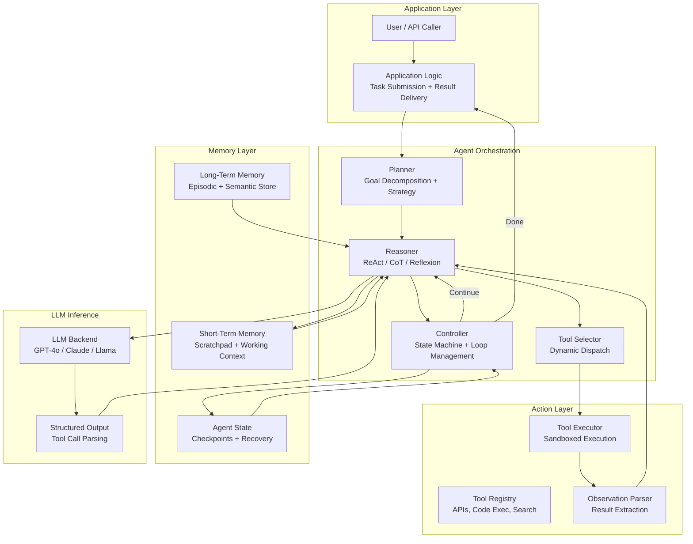
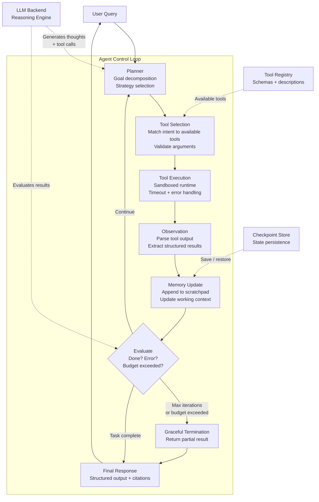
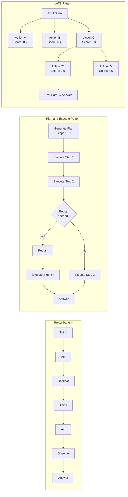

# Agent Architecture Patterns

## 1. Overview

Agent architecture defines how an LLM-based system autonomously reasons, plans, acts, and learns across multi-step tasks. Unlike single-turn prompt-response interactions, agents maintain state across iterations, select and execute tools, observe outcomes, and adapt their strategy --- all within a control loop that the architect must design, bound, and monitor.

For Principal AI Architects, agent architecture is the highest-leverage design decision in autonomous AI systems. The choice between ReAct, Plan-and-Execute, LATS, and Reflexion determines not just task performance but cost profile, latency budget, debuggability, and failure blast radius. A poorly chosen architecture burns tokens in unproductive loops; a well-chosen one solves complex tasks in fewer iterations with auditable intermediate reasoning.

**Key numbers that shape agent architecture decisions:**
- Average iterations per task (ReAct on HotpotQA): 3--7 steps, 1500--5000 tokens total
- Average iterations per task (Plan-and-Execute on ALFWorld): 8--15 steps, 3000--10000 tokens
- LATS branching factor: 2--5 children per node, tree depth 3--8, total token cost 5--20x single-path ReAct
- Token cost per agent run (GPT-4o class, moderate task): $0.02--0.15; complex multi-tool tasks: $0.50--5.00
- Agent success rate on SWE-bench Lite (2025): 40--55% for best single-agent systems, 55--70% for multi-agent
- Latency per iteration: 500ms--3s (tool execution dominates over LLM inference for most tools)
- Failure recovery overhead: replanning adds 1--3 iterations (~2000--6000 tokens)
- Cost of runaway agents: unbounded without explicit caps; production incidents have exceeded $500/run

Agent architectures compete along three axes: task accuracy, cost efficiency, and controllability. Simple ReAct loops excel at straightforward tool-use tasks with minimal overhead. Plan-and-Execute architectures handle complex multi-step tasks by amortizing planning cost. Tree-search methods like LATS maximize accuracy on hard tasks at significant cost. Reflexion adds learning across episodes. This document covers the full design space, from single-step reactive agents to self-improving cognitive architectures.

---

## 2. Where It Fits in GenAI Systems

Agent architecture sits at the orchestration layer, above the LLM inference engine and below the application interface. It coordinates between the reasoning engine (the LLM), the action layer (tools and APIs), and the memory layer (conversation history, episodic memory, knowledge bases).



Agent architecture interacts with these adjacent systems:
- **Tool use / function calling** (downstream): Agents express actions through tool calls. Tool design directly constrains what agents can do. See [Tool Use](./02-tool-use.md).
- **Multi-agent systems** (extension): Complex tasks decompose across specialized agents. See [Multi-Agent Systems](./04-multi-agent.md).
- **Memory systems** (infrastructure): Agents need working memory (scratchpad), episodic memory (past experiences), and semantic memory (knowledge). See [Memory Systems](./03-memory-systems.md).
- **Prompt engineering** (upstream): Agent system prompts define persona, constraints, and output format. See [Prompt Patterns](../06-prompt-engineering/01-prompt-patterns.md).
- **Orchestration frameworks** (implementation): LangGraph, CrewAI, AutoGen, and others provide agent runtime primitives. See [Orchestration Frameworks](../08-orchestration/01-orchestration-frameworks.md).
- **Structured output** (co-located): Agents depend on reliable structured output for tool dispatch and state serialization. See [Structured Output](../06-prompt-engineering/02-structured-output.md).

---

## 3. Core Concepts

### 3.1 The Agent Loop: Perceive-Reason-Act

Every agent architecture implements a variant of the perceive-reason-act cycle from classical AI, adapted for LLM-based reasoning:

1. **Perceive**: Ingest the current state --- user query, tool observations, memory contents, environment signals.
2. **Reason**: The LLM processes the accumulated context to decide what to do next --- think, act, or terminate.
3. **Act**: Execute the chosen action (tool call, sub-query, memory write, or final response).
4. **Update**: Integrate the action's result back into the agent's state for the next iteration.

The critical design decisions are:
- **What goes into the LLM context at each step** (context management)?
- **How does the LLM decide between thinking and acting** (reasoning strategy)?
- **When does the loop terminate** (stopping criteria)?
- **What happens when something goes wrong** (error recovery)?

### 3.2 ReAct (Reason + Act)

ReAct (Yao et al., 2023) interleaves reasoning traces with actions in a single LLM generation. At each step, the model produces a thought (free-form reasoning), an action (tool call), and then receives an observation (tool result). This three-phase cycle repeats until the model generates a final answer.

**The ReAct Loop:**

```
Step 1:
  Thought: I need to find the population of Tokyo to answer this question.
  Action: search("Tokyo population 2025")
  Observation: Tokyo's population is approximately 13.96 million (city proper).

Step 2:
  Thought: Now I need to find the population of New York City for comparison.
  Action: search("New York City population 2025")
  Observation: NYC's population is approximately 8.26 million.

Step 3:
  Thought: Tokyo (13.96M) is larger than NYC (8.26M) by about 5.7 million.
  Action: finish("Tokyo has a larger population than New York City, with approximately 13.96 million compared to NYC's 8.26 million.")
```

**Why ReAct works:**
- The explicit thought trace forces the model to articulate its reasoning before acting, reducing impulsive tool calls.
- Observations ground subsequent reasoning in factual tool outputs rather than parametric hallucinations.
- The trace is fully auditable --- every decision is logged with its rationale.

**When to use ReAct:**
- Tasks requiring 2--10 tool calls with straightforward sequential logic.
- Fact-finding, data lookup, simple calculations, Q&A with retrieval.
- When auditability of reasoning is important.
- When latency budget allows sequential LLM calls (each step = 1 LLM call + 1 tool call).

**Limitations:**
- No upfront planning. The agent reasons myopically --- each step only considers the immediate next action.
- Poor at tasks requiring long-horizon planning or backtracking.
- Reasoning can drift: after several steps, the model may lose track of the original goal.
- No mechanism for learning from past mistakes within the same episode (contrast with Reflexion).

**Implementation pattern:**

```python
# Simplified ReAct loop
messages = [system_prompt, user_query]
for step in range(max_iterations):
    response = llm.chat(messages, tools=available_tools)
    if response.has_tool_call:
        result = execute_tool(response.tool_call)
        messages.append(response)          # assistant message with tool call
        messages.append(tool_result(result))  # tool observation
    else:
        return response.content  # final answer
raise MaxIterationsExceeded()
```

### 3.3 Plan-and-Execute

Plan-and-Execute (Wang et al., 2023) separates planning from execution into two distinct phases. A planner LLM generates a complete step-by-step plan upfront. An executor LLM (or the same model) executes each step. After each step, a replanner evaluates whether the plan needs modification.

**Phase 1 --- Plan:**
```
Task: "Write a market analysis report comparing three cloud providers."

Plan:
1. Research AWS market share and recent developments
2. Research Azure market share and recent developments
3. Research GCP market share and recent developments
4. Compare pricing models across the three providers
5. Analyze strengths and weaknesses of each
6. Synthesize findings into a structured report
```

**Phase 2 --- Execute + Replan:**
- Execute step 1, observe results.
- Evaluate: is the plan still valid? If step 1 revealed that Oracle Cloud is now #3, replan to include Oracle instead of GCP.
- Continue execution with the updated plan.

**When to use Plan-and-Execute:**
- Tasks requiring 5+ steps with complex dependencies.
- Tasks where early decisions constrain later options (research, report generation, code refactoring).
- When the cost of replanning is small relative to the cost of wasted execution.
- When you want human review of the plan before execution begins.

**Architecture variants:**

| Variant | Planner | Executor | Replanner | Best For |
|---------|---------|----------|-----------|----------|
| Static Plan | Strong model (GPT-4o, Claude Opus) | Same or weaker model | None | Simple linear tasks |
| Adaptive Plan | Strong model | Same model | After every N steps | Research, analysis |
| Hierarchical Plan | Strong model (high-level) | Weaker model (step-level) | Strong model (on failure) | Cost-sensitive complex tasks |
| Human-in-the-Loop Plan | Strong model | Same model | Human approval at checkpoints | High-stakes tasks |

**Advantages over ReAct:**
- The full plan is visible and auditable before any action is taken.
- Enables parallel execution of independent steps (steps 1, 2, 3 above can run concurrently).
- Better at maintaining coherence across many steps because the plan provides a persistent scaffold.

**Limitations:**
- Upfront planning cost: the planning step uses significant tokens and adds latency before the first action.
- Plans can be wrong: the model may plan based on incorrect assumptions. Replanning mitigates this but adds cost.
- Overhead is wasted on simple tasks that ReAct handles in 2--3 steps.

### 3.4 LATS (Language Agent Tree Search)

LATS (Zhou et al., 2024) applies Monte Carlo Tree Search (MCTS) principles to agent reasoning. Instead of following a single reasoning path (ReAct) or a single plan (Plan-and-Execute), LATS explores a tree of possible action sequences, using self-evaluation to guide search toward promising branches.

**MCTS-Adapted Algorithm:**

1. **Selection**: Starting from the root (initial state), traverse the tree using UCT (Upper Confidence bounds applied to Trees) to select the most promising node to expand. UCT balances exploitation (high-value nodes) with exploration (less-visited nodes).

2. **Expansion**: At the selected node, generate N candidate next actions (N = branching factor, typically 2--5). Each candidate becomes a child node.

3. **Simulation**: For each candidate, the LLM generates a self-evaluation score --- a heuristic estimate of how likely this path is to lead to task completion. This replaces the random rollout of classical MCTS.

4. **Backpropagation**: Propagate the evaluation score up the tree. Nodes on paths with higher cumulative scores are preferred in future selection steps.

5. **Reflection**: When a path fails (dead end or low score), the LLM generates a reflection explaining why it failed. This reflection is added to the context for future expansions from sibling or parent nodes, preventing the same mistake.

**When to use LATS:**
- Hard reasoning tasks where the first attempt is often wrong (math, code generation, complex planning).
- Tasks where self-evaluation is reliable (the model can tell good solutions from bad ones).
- When accuracy matters more than cost (competitive benchmarks, high-stakes decisions).
- When you can afford 5--20x the token cost of a single ReAct run.

**Cost analysis for a typical LATS run:**
- Branching factor 3, depth 5 = up to 3^5 = 243 leaf nodes (in practice, pruning keeps it to 20--50 explored nodes).
- Each node = 1 LLM call for action generation + 1 LLM call for evaluation = ~500--1500 tokens.
- Total: 10,000--75,000 tokens per task vs. 2,000--5,000 for ReAct.
- At GPT-4o pricing ($2.50/M input, $10/M output): $0.10--1.50 per task.

**Key insight**: LATS converts compute (tokens) into accuracy. For tasks where a single attempt succeeds 40% of the time, LATS with 20 explored paths can achieve 80%+ by finding the best path among many candidates. This is the "inference-time compute scaling" principle --- spending more tokens at inference time to match or exceed the quality of a larger model.

### 3.5 Reflexion

Reflexion (Shinn et al., 2023) adds self-evaluation and episodic memory to agent architectures. After completing a task (successfully or not), the agent reflects on its performance, generates a verbal critique, and stores this reflection in episodic memory. On subsequent attempts or similar tasks, the agent retrieves relevant reflections to avoid repeating mistakes.

**The Reflexion Cycle:**

1. **Act**: Execute a task using any base architecture (ReAct, Plan-and-Execute).
2. **Evaluate**: Assess the outcome. Was the task completed correctly? What went wrong?
3. **Reflect**: Generate a natural language self-critique: "I failed because I searched for the wrong entity. Next time, I should verify the entity name before searching."
4. **Store**: Save the reflection in episodic memory, indexed by task type or context.
5. **Retry**: On the next attempt, retrieve relevant reflections and prepend them to the agent's context.

**Episodic memory structure:**

```python
reflection = {
    "task_id": "task_042",
    "task_type": "code_generation",
    "attempt": 2,
    "outcome": "failed",
    "error": "TypeError: list indices must be integers, not str",
    "reflection": "I used a dictionary key access pattern on a list. "
                  "I need to check the data structure type before accessing elements. "
                  "The API returns a list of dicts, not a dict of lists.",
    "timestamp": "2025-03-15T10:30:00Z"
}
```

**When to use Reflexion:**
- Tasks with binary or easily verifiable success criteria (code passes tests, answer matches ground truth).
- Iterative improvement scenarios where the agent gets multiple attempts.
- When you want to build a learning agent that improves across episodes without retraining.
- When the cost of reflection (1 additional LLM call per episode) is justified by the improvement in subsequent attempts.

**Performance characteristics:**
- On HumanEval (code generation): base GPT-4 achieves 67% pass@1; with Reflexion, 88% pass@1 after 3 attempts.
- On AlfWorld (embodied reasoning): ReAct achieves 75% success; Reflexion achieves 97% after 12 episodes of reflection.
- Token cost per reflection: 200--500 tokens for the critique + retrieval overhead.

### 3.6 Cognitive Architectures

Cognitive architectures provide a comprehensive framework for agent design, inspired by human cognitive science. They go beyond individual reasoning patterns to define how perception, reasoning, action, and learning interact as an integrated system.

**The Cognitive Loop:**

```
Perception → Working Memory → Reasoning → Decision → Action → Learning → Perception
```

**Key components:**

| Component | Function | Implementation |
|-----------|----------|---------------|
| Perception | Ingest and interpret inputs (text, images, tool outputs) | Input parsers, multimodal encoders |
| Working Memory | Hold active context, intermediate results, current goals | Context window, scratchpad, state dict |
| Long-Term Memory | Store persistent knowledge and past experiences | Vector DB, episodic memory, knowledge graph |
| Reasoning | Analyze, plan, evaluate options | LLM chain-of-thought, MCTS, symbolic rules |
| Decision | Select action from available options | Tool selection via function calling |
| Action | Execute the selected action | Tool execution, API calls, code execution |
| Learning | Update memories and policies based on outcomes | Reflexion, fine-tuning, RLHF |
| Metacognition | Monitor and regulate the reasoning process itself | Confidence estimation, strategy switching |

**Notable cognitive architectures for LLM agents:**

- **CoALA** (Sumers et al., 2024): Cognitive Architectures for Language Agents. Provides a formal framework decomposing agents into memory (working + long-term), action space (internal reasoning + external tools), and a decision-making procedure. Maps existing agents (ReAct, Reflexion, Voyager) onto this taxonomy.
- **LIDA** (Franklin et al.): Learning Intelligent Distribution Agent. Classical cognitive architecture adapted for LLMs. Perception → attention → action selection → learning, with a global workspace for integrating information across modules.
- **ACT-R / Soar adaptations**: Classical symbolic architectures (production rules, chunking) augmented with LLM-based reasoning modules for flexible natural language processing.

### 3.7 Agent Control Flow

Agent control flow defines how actions are sequenced, parallelized, and conditionally branched within the agent loop.

**Sequential control flow:**
- Default mode. Each step completes before the next begins.
- Used when: step N's output is required as step N+1's input.
- Latency: sum of all step latencies. Cost: sum of all step costs.

**Parallel control flow:**
- Multiple independent actions execute simultaneously.
- Used when: steps are independent (e.g., searching multiple sources, making independent API calls).
- Requires: the agent or orchestrator to identify independence (no data dependencies between steps).
- Implementation: OpenAI parallel tool calls, LangGraph parallel branches, asyncio gather.
- Latency: max of parallel step latencies. Cost: same total, but wall-clock time reduced.

**Conditional control flow:**
- The agent branches based on intermediate results.
- Used when: different outcomes require different follow-up actions.
- Implementation: the LLM's tool choice serves as the branch condition, or an explicit router selects the next step.
- Example: "If the search returns no results, try a broader query. If it returns results, proceed to analysis."

**Loop control flow:**
- The agent repeats a sequence until a condition is met.
- Used when: iterative refinement is needed (e.g., code generation → test → fix → test).
- Danger: unbounded loops. Always pair with stopping criteria (Section 3.9).

**State machine control flow:**
- The agent operates as a finite state machine with defined states and transitions.
- Used when: the task has well-known phases with predictable transitions.
- Implementation: LangGraph's `StateGraph`, explicit state enums.
- Example states: `PLANNING → RESEARCHING → DRAFTING → REVIEWING → DONE`.

```python
# LangGraph state machine example
from langgraph.graph import StateGraph, END

workflow = StateGraph(AgentState)
workflow.add_node("plan", plan_step)
workflow.add_node("research", research_step)
workflow.add_node("draft", draft_step)
workflow.add_node("review", review_step)

workflow.add_edge("plan", "research")
workflow.add_edge("research", "draft")
workflow.add_conditional_edges("review", should_revise,
    {"revise": "draft", "approve": END})
workflow.set_entry_point("plan")
```

### 3.8 State Management

Agent state encompasses everything the agent needs to resume execution at any point: conversation history, tool outputs, intermediate results, current plan, and loop counters.

**State components:**

| Component | Size | Persistence | Recovery Strategy |
|-----------|------|-------------|-------------------|
| Conversation history | Grows with turns, 1K--100K tokens | In-memory + durable log | Replay from log |
| Current plan | 200--2000 tokens | In-memory, serialized | Re-derive from history |
| Working memory / scratchpad | 500--5000 tokens | In-memory | Re-derive from history |
| Tool call history | 100--500 tokens per call | Durable log | Replay idempotent calls |
| Loop counters / iteration state | Bytes | In-memory | Checkpoint |
| Error state | Variable | In-memory | Checkpoint |

**Checkpointing strategies:**

1. **After every step**: Maximum recoverability, highest overhead. Suitable for long-running agents (>10 minutes) or expensive tasks. LangGraph provides built-in checkpointing to SQLite/Postgres.
2. **After phase transitions**: Checkpoint when the agent moves between major phases (e.g., planning → execution). Balances recovery granularity with overhead.
3. **On error**: Checkpoint before retrying, enabling rollback if the retry fails. Critical for non-idempotent tool calls (e.g., database writes, API mutations).

**Recovery patterns:**

- **Replay recovery**: Re-execute the agent from the last checkpoint, replaying tool calls. Requires tools to be idempotent or the system to skip already-completed actions.
- **Resumption recovery**: Load the checkpointed state directly and continue from the next step. Faster but requires complete state serialization.
- **Re-planning recovery**: Discard the current plan, summarize progress so far, and generate a new plan from the current state. Most robust but expensive.

### 3.9 Stopping Criteria

Stopping criteria prevent agents from running indefinitely, burning tokens, or entering degenerate loops. Every production agent requires multiple overlapping stopping criteria.

**Maximum iteration limit:**
- Hard cap on the number of agent steps. Typical values: 10--25 for simple tasks, 50--100 for complex tasks.
- When hit: the agent returns its best partial result with a disclaimer, or escalates to a human.
- Non-negotiable in production. Every agent must have this.

**Confidence threshold:**
- The agent self-assesses its confidence in the current answer. If confidence exceeds a threshold (e.g., "I am highly confident this is correct"), the agent terminates.
- Implementation: Ask the LLM to rate its confidence (1--10) in the final response. Terminate if >= 8.
- Weakness: LLMs are poorly calibrated --- they often report high confidence even when wrong. Use as a soft signal, not a sole criterion.

**Tool failure limits:**
- Track consecutive tool failures. After N consecutive failures (typically 2--3), the agent should replan or terminate rather than continuing to call failing tools.
- Prevents infinite retry loops when a service is down or the agent is calling tools with invalid arguments.

**Token budget:**
- Track cumulative token usage across all LLM calls in the agent run. Terminate when budget is exceeded.
- Typical budgets: 10K--50K tokens for simple tasks, 100K--500K for complex tasks.
- Enables cost control at the per-request level.

**Time budget:**
- Wall-clock time limit for the entire agent run. Typical values: 30s for interactive use, 5--30 minutes for background tasks.
- Implementation: deadline propagation through the agent loop with timeout on each tool call.

**Cycle detection:**
- Detect when the agent is repeating the same actions. Compare the last N tool calls --- if the same tool is called with the same arguments 2--3 times consecutively, the agent is stuck.
- Response: force the agent to replan or try a different approach, or terminate.

**Convergence detection:**
- For iterative refinement tasks (code generation, writing), detect when successive revisions produce diminishing changes. If the diff between revision N and N+1 is below a threshold, terminate.

### 3.10 Cost Control

Agent cost is dominated by LLM API calls. Each iteration = 1+ LLM calls + tool execution costs. Without explicit controls, agent costs can be 10--100x a single prompt-response exchange.

**Budget enforcement:**

```python
class AgentBudget:
    def __init__(self, max_tokens=50000, max_dollars=1.00,
                 max_iterations=20, max_wall_time_seconds=120):
        self.max_tokens = max_tokens
        self.max_dollars = max_dollars
        self.max_iterations = max_iterations
        self.max_wall_time = max_wall_time_seconds
        self.used_tokens = 0
        self.used_dollars = 0.0
        self.iterations = 0
        self.start_time = time.time()

    def check(self):
        if self.used_tokens > self.max_tokens:
            raise BudgetExceeded("token_limit")
        if self.used_dollars > self.max_dollars:
            raise BudgetExceeded("cost_limit")
        if self.iterations > self.max_iterations:
            raise BudgetExceeded("iteration_limit")
        if time.time() - self.start_time > self.max_wall_time:
            raise BudgetExceeded("time_limit")
```

**Cost reduction strategies:**

| Strategy | Token Savings | Accuracy Impact | Implementation Complexity |
|----------|--------------|-----------------|--------------------------|
| Tiered models (plan with strong, execute with weak) | 40--60% | 5--15% drop on complex steps | Medium |
| Context window pruning (summarize old steps) | 30--50% | 5--10% drop if aggressive | Medium |
| Early termination on high confidence | 20--40% | Minimal if calibrated | Low |
| Caching repeated tool calls | 10--30% | None | Low |
| Parallel tool calls (reduces wall time, not tokens) | 0% tokens, 30--60% latency | None | Low--Medium |
| Smaller context window (limit history to last N steps) | 20--40% | 10--20% drop on long tasks | Low |

**Model tiering for agents:**
- **Planner/Reasoner**: Use the strongest available model (Claude Opus, GPT-4o). Planning quality determines the entire run's efficiency.
- **Executor**: Use a mid-tier model (Claude Sonnet, GPT-4o-mini) for straightforward tool-calling steps.
- **Evaluator/Reflector**: Use the strong model again --- evaluation quality is critical for correct termination.
- **Summarizer**: Use the cheapest model (Claude Haiku, GPT-4o-mini) for context compression between steps.

### 3.11 Single-Agent vs. Multi-Agent Decision Framework

The choice between a single agent and a multi-agent system is a critical architectural decision with cascading implications for complexity, cost, and reliability.

| Factor | Single Agent | Multi-Agent |
|--------|-------------|-------------|
| Task complexity | Linear, sequential tasks | Tasks with natural role decomposition |
| Context window pressure | All reasoning in one context | Distributed across specialized contexts |
| Latency | Lower (no inter-agent communication) | Higher (coordination overhead) |
| Cost | Lower (fewer total LLM calls) | Higher (duplication + coordination) |
| Debuggability | Easier (single trace) | Harder (distributed traces, race conditions) |
| Failure blast radius | Entire task fails | Partial failure possible, harder to recover |
| Scalability | Bounded by single model's capability | Can scale by adding specialist agents |
| Implementation complexity | Low | High (message passing, state sync, deadlock prevention) |

**Decision heuristic:**
- Start with a single agent. Only move to multi-agent when:
  1. The task has **clearly separable sub-tasks** with different tool/knowledge requirements.
  2. The single agent's **context window is exhausted** by the combined reasoning.
  3. You need **different model capabilities** for different sub-tasks (e.g., code generation vs. writing vs. data analysis).
  4. You need **human-like role specialization** (e.g., researcher, writer, reviewer).

- Stay with a single agent when:
  1. The task is sequential and each step depends on the previous.
  2. The total context fits comfortably in one model's window.
  3. Debugging and reliability are paramount.
  4. You are early in development and need to iterate quickly.

---

## 4. Architecture

### 4.1 Core Agent Loop Architecture



### 4.2 Architecture Pattern Comparison



---

## 5. Design Patterns

### 5.1 The Scratchpad Pattern

The agent maintains an explicit scratchpad --- a structured working memory section within the prompt --- that accumulates intermediate results, partial answers, and notes across iterations.

**Implementation:** Add a `<scratchpad>` section to the system prompt. After each step, the agent writes key observations and partial results to the scratchpad. The full scratchpad is included in every subsequent LLM call.

**Benefits:**
- Prevents the agent from losing track of intermediate results as the conversation history grows.
- Provides a structured place for the agent to organize its reasoning.
- Enables context pruning: old conversation turns can be dropped while preserving the scratchpad summary.

### 5.2 The Guardrail Pattern

Wrap the agent loop with pre-execution and post-execution guardrails that validate actions before they are taken and results after they are returned.

**Pre-execution guardrails:**
- Validate tool call arguments against the tool schema.
- Check that the tool call is on the allow-list for this agent's permissions.
- Rate-limit tool calls (max N calls per minute to any external API).
- Block dangerous operations (file deletion, database drops, production API writes).

**Post-execution guardrails:**
- Validate tool results against expected schemas.
- Check for PII in tool results before logging.
- Verify that the agent's proposed final answer doesn't violate content policies.

### 5.3 The Observer Pattern

Insert an independent observer (a separate LLM call or rule-based system) that monitors the agent's behavior and can intervene.

**Use cases:**
- Detect looping behavior and force the agent to try a different approach.
- Monitor for policy violations (e.g., the agent attempting to access unauthorized resources).
- Track cost accumulation and trigger warnings or shutdowns.
- Evaluate output quality at each step and flag degradation.

### 5.4 The Tool Retry with Backoff Pattern

When a tool call fails, the agent should not blindly retry with the same arguments. Instead:

1. Parse the error message from the tool.
2. Include the error in the next LLM call: "The search API returned a rate limit error. Wait and try again, or try an alternative approach."
3. The LLM decides whether to retry (possibly with modified arguments), try a different tool, or proceed without the tool's output.
4. Apply exponential backoff for rate-limited APIs.

### 5.5 The Progressive Summarization Pattern

As the agent's conversation history grows, older turns consume context budget without proportional value. Progressive summarization compresses old turns while preserving essential information.

**Implementation:**
- After every N steps (e.g., 5), summarize steps 1--N into a concise paragraph.
- Replace the original detailed turns with the summary.
- Keep the last M steps (e.g., 3) in full detail for recency.
- Use the weakest/cheapest model for summarization to minimize cost.

**Tradeoff:** Every summarization step loses some information. Critical details (specific numbers, tool outputs) may be lost. Mitigate by marking certain facts as "must preserve" in the scratchpad.

### 5.6 The Human-in-the-Loop Pattern

For high-stakes tasks, insert human approval checkpoints at critical decision points.

**Checkpoint triggers:**
- Before irreversible actions (sending emails, making purchases, deploying code).
- When the agent's confidence is low (self-reported or detected via behavioral signals).
- At plan approval (Plan-and-Execute: show the plan before execution begins).
- When cost exceeds a threshold (e.g., "This task will require ~$2 in API calls. Proceed?").

---

## 6. Implementation Approaches

### 6.1 Framework-Based Implementation

**LangGraph (LangChain)**
- State graph abstraction: define agent as a directed graph of nodes (functions) and edges (transitions).
- Built-in checkpointing (SQLite, Postgres), human-in-the-loop, streaming.
- Best for: complex agents with conditional branching, state machines, multi-agent workflows.
- Tradeoff: steep learning curve, verbose for simple agents.

**CrewAI**
- Role-based agent definition: agents have roles, goals, backstories, and tools.
- Sequential and hierarchical task execution.
- Best for: multi-agent workflows with clear role decomposition.
- Tradeoff: opinionated abstractions, less flexible for novel architectures.

**OpenAI Assistants API**
- Managed agent runtime with built-in tool use, code interpreter, and file search.
- Thread-based state management with automatic context truncation.
- Best for: rapid prototyping, OpenAI-only deployments.
- Tradeoff: vendor lock-in, limited control over agent behavior.

**Anthropic Claude Agent SDK / Computer Use**
- Tool use with Claude's native structured output.
- Agentic coding with extended thinking.
- Best for: Claude-based agents, agentic coding tasks.
- Tradeoff: Anthropic-only, evolving APIs.

### 6.2 Custom Implementation

For maximum control, implement the agent loop directly:

```python
class Agent:
    def __init__(self, llm, tools, budget, system_prompt):
        self.llm = llm
        self.tools = {t.name: t for t in tools}
        self.budget = budget
        self.system_prompt = system_prompt
        self.scratchpad = []
        self.messages = [{"role": "system", "content": system_prompt}]

    def run(self, user_query: str) -> str:
        self.messages.append({"role": "user", "content": user_query})

        for iteration in range(self.budget.max_iterations):
            self.budget.check()  # Raises BudgetExceeded if limits hit

            response = self.llm.chat(
                messages=self.messages,
                tools=[t.schema for t in self.tools.values()],
            )
            self.budget.used_tokens += response.usage.total_tokens

            if not response.tool_calls:
                return response.content  # Final answer

            # Execute tool calls (potentially in parallel)
            tool_results = []
            for tool_call in response.tool_calls:
                tool = self.tools[tool_call.function.name]
                try:
                    result = tool.execute(tool_call.function.arguments)
                    tool_results.append(success_result(tool_call.id, result))
                except ToolError as e:
                    tool_results.append(error_result(tool_call.id, str(e)))

            self.messages.append(response)  # Assistant message
            self.messages.extend(tool_results)  # Tool results

            # Progressive summarization every N steps
            if iteration > 0 and iteration % 5 == 0:
                self._summarize_old_steps()

        return self._graceful_termination()
```

### 6.3 Testing and Evaluation

**Unit testing agents is hard** because behavior is non-deterministic. Strategies:

- **Tool mocking**: Replace real tools with deterministic mocks that return fixed outputs. Test the agent's reasoning logic independently of tool behavior.
- **Trajectory evaluation**: Record agent trajectories (sequence of thoughts, actions, observations) on a test set. Evaluate whether the trajectory is reasonable, not just whether the final answer is correct.
- **Benchmark suites**: SWE-bench (code), WebArena (web tasks), GAIA (general assistant tasks), HotpotQA (multi-hop reasoning).
- **Regression testing**: Record golden trajectories. When the agent architecture changes, compare new trajectories against golden ones for behavioral drift.

---

## 7. Tradeoffs

### 7.1 Architecture Selection

| Architecture | Accuracy (Hard Tasks) | Token Cost | Latency | Debuggability | Implementation Effort |
|-------------|----------------------|------------|---------|---------------|----------------------|
| ReAct | Medium | Low (1x) | Low (sequential) | High (linear trace) | Low |
| Plan-and-Execute | Medium--High | Medium (1.5--2x) | Medium (plan + execute) | High (plan visible) | Medium |
| LATS | High | Very High (5--20x) | High (tree exploration) | Low (branching paths) | High |
| Reflexion | High (across episodes) | Medium (1.5x per episode) | Low per attempt, high cumulative | Medium (reflections auditable) | Medium |
| Custom Cognitive | Variable | Variable | Variable | Low (complex interactions) | Very High |

### 7.2 State Management

| Strategy | Recovery Speed | Storage Cost | Implementation Complexity | Data Staleness Risk |
|----------|---------------|--------------|--------------------------|---------------------|
| No checkpointing | N/A (restart from scratch) | Zero | Zero | N/A |
| Per-step checkpoint | Instant | High (full state per step) | Medium | None |
| Per-phase checkpoint | Fast (replay within phase) | Medium | Medium | Low |
| On-error checkpoint | Moderate (re-derive recent state) | Low | Low | Medium |
| Event-sourced (log replay) | Slow (replay all events) | Medium (append-only log) | High | None |

### 7.3 Context Management

| Strategy | Token Efficiency | Information Loss | Complexity |
|----------|-----------------|-----------------|------------|
| Full history (no pruning) | Low (grows linearly) | None | Zero |
| Sliding window (last N turns) | Medium | Loses old context | Low |
| Progressive summarization | High | Some detail loss | Medium |
| Scratchpad + summary | High | Minimal (key facts preserved) | Medium |
| RAG over history | High | Retrieval-dependent | High |

---

## 8. Failure Modes

### 8.1 Infinite Loop / Action Repetition

**Symptom**: The agent calls the same tool with identical arguments repeatedly, or alternates between two actions without making progress.

**Root cause**: The LLM fails to recognize that its approach is not working, often because the error message is not informative enough or the model's attention is lost in a long context.

**Mitigation**: Cycle detection (compare last N tool calls), maximum consecutive-failure limit, forced replanning after 2--3 identical calls.

### 8.2 Goal Drift

**Symptom**: Over many iterations, the agent gradually shifts focus away from the original user query, pursuing tangentially related sub-tasks.

**Root cause**: Each iteration adds context that can dilute the original goal. The model attends to recent context more than the original query.

**Mitigation**: Restate the original goal in every LLM call (append to system prompt or as a reminder). Use a scratchpad that explicitly tracks the primary objective.

### 8.3 Tool Misuse

**Symptom**: The agent calls tools with invalid arguments, calls the wrong tool for the task, or interprets tool results incorrectly.

**Root cause**: Ambiguous tool descriptions, overlapping tool functionality, or insufficient examples in the tool schema.

**Mitigation**: Clear, unambiguous tool descriptions. Few-shot examples of correct tool use in the system prompt. Schema validation before execution. Error feedback loop (include the error in the next LLM call).

### 8.4 Context Window Exhaustion

**Symptom**: The agent's performance degrades after many iterations as the conversation history exceeds the model's effective context window. The model starts ignoring tool results or producing incoherent responses.

**Root cause**: Linear growth of context with each iteration. A 10-step agent with 500 tokens per step uses 5000 tokens of history, plus system prompt and tool schemas.

**Mitigation**: Progressive summarization, sliding window, scratchpad pattern. Monitor per-step response quality and trigger summarization proactively.

### 8.5 Cost Explosion

**Symptom**: A single agent run costs 10--100x more than expected, typically discovered after the fact.

**Root cause**: Missing budget limits, LATS-style exploration without branching factor caps, or error loops that retry expensive operations.

**Mitigation**: Mandatory budget object with token, dollar, iteration, and time limits. Per-request cost tracking and alerting. Hard circuit breakers that cannot be overridden by the agent.

### 8.6 Non-Deterministic Failures

**Symptom**: The agent succeeds on a task sometimes but fails other times with identical inputs.

**Root cause**: LLM temperature > 0, tool response variability (web search results change), race conditions in parallel tool execution.

**Mitigation**: Temperature 0 for reproducibility (note: not perfectly deterministic even at 0 with some providers). Deterministic tool mocks for testing. Retry with reflection for production reliability.

### 8.7 Cascading Tool Failures

**Symptom**: A tool fails early in the plan, and the agent proceeds with missing or incorrect data, leading to compounding errors in subsequent steps.

**Root cause**: The agent treats tool failures as soft errors and continues with partial information rather than replanning.

**Mitigation**: Classify tool calls as `critical` (must succeed for plan to work) vs. `optional` (nice to have). On critical tool failure, force a replan. On optional tool failure, note the gap and proceed with degraded quality.

---

## 9. Optimization Techniques

### 9.1 Inference-Time Compute Scaling

The principle behind LATS and related methods: spend more tokens at inference time to improve accuracy, trading cost for quality.

**Best-of-N sampling**: Generate N independent responses to the same query, then select the best one using a verifier (LLM judge, unit tests, heuristic). Simple, embarrassingly parallel, and surprisingly effective.
- N=3--5 typically improves pass@1 by 10--20% on coding tasks.
- Cost: N x single-response cost.

**Beam search over actions**: Maintain top-K action sequences at each step. Prune low-scoring paths. More structured than best-of-N but harder to implement.

**Iterative refinement**: Generate a draft, critique it, improve it. Repeat. Works well for writing and code. 2--3 iterations typically capture most of the improvement; diminishing returns after that.

### 9.2 Context Window Optimization

**Key principle**: The agent's context window is its most precious resource. Every token in the context competes for the model's attention.

- **Tool schema pruning**: Only include schemas for tools relevant to the current step. If the agent is in the "research" phase, exclude "file_write" and "deploy" tools.
- **Observation truncation**: Truncate long tool outputs (e.g., web pages, large API responses) to the most relevant section. Use a fast extraction pass (regex, xpath, or a cheap LLM call) before including in context.
- **History compression**: Replace detailed old turns with summaries. Keep the last 2--3 turns in full.
- **Structured state over conversational history**: Instead of relying on the raw conversation history, maintain a structured state dict that the agent updates after each step. The state dict is more compact and directly accessible.

### 9.3 Latency Optimization

- **Parallel tool execution**: When the agent issues multiple tool calls, execute them concurrently. OpenAI's parallel function calling, Anthropic's parallel tool use, and LangGraph's parallel branches all support this.
- **Speculative execution**: While waiting for a tool result, speculatively generate the next reasoning step assuming a likely tool outcome. If the assumption is correct, save one round trip. If incorrect, discard and regenerate.
- **Streaming**: Stream agent reasoning to the user as it happens. Even if total latency is the same, perceived latency drops dramatically when the user sees intermediate progress.
- **Model selection**: Use faster models (Claude Haiku, GPT-4o-mini) for simple steps. Use larger models only for planning and evaluation steps.

### 9.4 Reliability Optimization

- **Deterministic tool wrappers**: Wrap non-deterministic tools (web search, API calls) with caching and retry logic. Same query within a time window returns the cached result.
- **Graceful degradation**: When the agent cannot complete the task within budget, return the best partial result with an explanation of what remains undone. Never return nothing.
- **Self-consistency voting**: Run the agent N times in parallel on the same task. If N/2+ converge on the same answer, return it with high confidence. Expensive but maximizes reliability for critical tasks.
- **Structured error handling**: Every tool call should return a typed result that distinguishes success, expected failure (e.g., "no results found"), and unexpected failure (e.g., timeout). The agent's behavior should differ for each case.

---

## 10. Real-World Examples

### Devin (Cognition)
- **Architecture**: Multi-step agent for software engineering tasks. Plan-and-Execute with replanning. Operates in a sandboxed development environment with shell, editor, and browser tools.
- **Key design choices**: Long-running agent (minutes to hours per task). Full IDE environment as the action space. Checkpointing at every major code change. Human-in-the-loop for plan approval on complex tasks.
- **Performance**: 13.86% on SWE-bench at launch (2024), improved significantly in subsequent versions. Demonstrated that agentic approaches outperform single-shot code generation on real-world GitHub issues.

### Claude Code (Anthropic)
- **Architecture**: Agentic coding assistant using Claude with extended thinking, tool use (file read/write, bash execution, search), and iterative refinement. Operates as an interactive agent in the developer's terminal.
- **Key design choices**: ReAct-style loop with tool use. The developer's entire repository is the action space. Streaming intermediate reasoning to the user. Cost-aware --- tracks token usage and enables budget controls.
- **Scale**: Used by thousands of developers for real-world coding tasks including refactoring, debugging, and feature implementation across large codebases.

### ChatGPT with Code Interpreter / Advanced Data Analysis (OpenAI)
- **Architecture**: ReAct agent with a sandboxed Python execution environment. The model writes Python code, executes it, observes results (including plots and tables), and iterates.
- **Key design choices**: Tool = Python interpreter with file I/O. The agent sees stdout, stderr, and rendered outputs. Automatic retry on code errors (the agent reads the traceback and fixes the code). Session-persistent filesystem for multi-step data processing.
- **Scale**: Hundreds of millions of users. The agent handles everything from simple calculations to complex data analysis pipelines.

### AutoGPT / BabyAGI (Open Source)
- **Architecture**: Early (2023) autonomous agent architectures. AutoGPT: ReAct with persistent memory and self-prompting. BabyAGI: task queue with Plan-and-Execute.
- **Key lessons**: Demonstrated both the potential and the failure modes of unbounded agents. AutoGPT frequently entered infinite loops, burned tokens on unproductive exploration, and failed to converge. These failures directly motivated the cost control, stopping criteria, and guardrail patterns described in this document.
- **Legacy**: Inspired the modern agent framework ecosystem (LangGraph, CrewAI, etc.) by demonstrating what works and what doesn't.

### Cursor / GitHub Copilot Workspace
- **Architecture**: Agentic coding assistants that plan code changes across multiple files. Cursor: agent mode with ReAct loop, file search, and code editing tools. Copilot Workspace: Plan-and-Execute with human-in-the-loop plan review.
- **Key design choices**: The action space is the codebase (read, write, search, run tests). Plans are presented as natural-language specifications before code generation. Iterative refinement based on test results.
- **Scale**: Millions of developers. Cursor processes ~400K completions per day; Copilot has 1.8M+ paying subscribers.

---

## 11. Related Topics

- **[Tool Use and Function Calling](./02-tool-use.md)**: How agents express and execute actions through tool calls --- the action primitive of every agent architecture.
- **[Multi-Agent Systems](./04-multi-agent.md)**: Extending single-agent patterns to teams of specialized agents with coordination protocols.
- **[Memory Systems](./03-memory-systems.md)**: Working memory, episodic memory, and semantic memory architectures that enable agents to learn and maintain context.
- **[Prompt Patterns](../06-prompt-engineering/01-prompt-patterns.md)**: System prompt design for agents, including role definition, constraint specification, and output formatting.
- **[Orchestration Frameworks](../08-orchestration/01-orchestration-frameworks.md)**: LangGraph, CrewAI, AutoGen, and other frameworks that implement agent runtime primitives.
- **[Structured Output](../06-prompt-engineering/02-structured-output.md)**: Reliable tool call parsing and state serialization that agents depend on.
- **[Context Management](../06-prompt-engineering/03-context-management.md)**: Managing the LLM's context window across many agent iterations.
- **[Evaluation Frameworks](../09-evaluation/01-eval-frameworks.md)**: Benchmarks and metrics for measuring agent performance (SWE-bench, WebArena, GAIA).

---

## 12. Source Traceability

| Concept | Primary Source |
|---------|---------------|
| ReAct | Yao et al., "ReAct: Synergizing Reasoning and Acting in Language Models," ICLR 2023 |
| Plan-and-Execute | Wang et al., "Plan-and-Solve Prompting: Improving Zero-Shot Chain-of-Thought Reasoning by Large Language Models," ACL 2023 |
| LATS | Zhou et al., "Language Agent Tree Search Unifies Reasoning Acting and Planning in Language Models," ICML 2024 |
| Reflexion | Shinn et al., "Reflexion: Language Agents with Verbal Reinforcement Learning," NeurIPS 2023 |
| CoALA | Sumers et al., "Cognitive Architectures for Language Agents," TMLR 2024 |
| Toolformer | Schick et al., "Toolformer: Language Models Can Teach Themselves to Use Tools," NeurIPS 2023 |
| Self-RAG (agent-integrated) | Asai et al., "Self-RAG: Learning to Retrieve, Generate, and Critique through Self-Reflection," ICLR 2024 |
| Voyager | Wang et al., "Voyager: An Open-Ended Embodied Agent with Large Language Models," NeurIPS 2023 |
| SWE-bench | Jimenez et al., "SWE-bench: Can Language Models Resolve Real-World GitHub Issues?," ICLR 2024 |
| WebArena | Zhou et al., "WebArena: A Realistic Web Environment for Building Autonomous Agents," ICLR 2024 |
| MCTS (original) | Kocsis & Szepesvari, "Bandit Based Monte-Carlo Planning," ECML 2006 |
| Inference-time compute scaling | Snell et al., "Scaling LLM Test-Time Compute Optimally Can Be More Effective Than Scaling Model Parameters," 2024 |
| AutoGPT | Richards, "Auto-GPT: An Autonomous GPT-4 Experiment," GitHub, 2023 |
| BabyAGI | Nakajima, "BabyAGI," GitHub, 2023 |