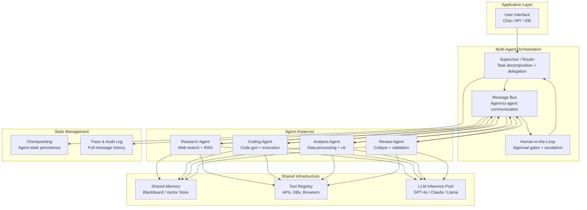
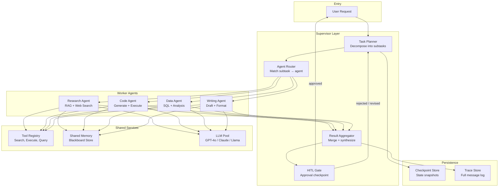
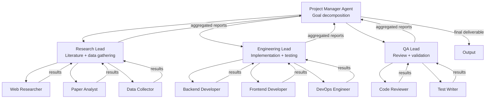

# Multi-Agent Systems

## 1. Overview

Multi-agent systems (MAS) decompose complex tasks into subtasks handled by specialized LLM-powered agents that coordinate through structured communication protocols. Rather than a single monolithic prompt or chain-of-thought, MAS architectures assign distinct roles, tools, and memory scopes to individual agents, enabling emergent capabilities that exceed what any single agent can achieve — parallel reasoning across subproblems, adversarial self-critique, and dynamic task decomposition that adapts to runtime conditions.

For Principal AI Architects, multi-agent design is the critical scaling frontier. Single-agent systems hit a ceiling when tasks require heterogeneous expertise (a coding task that also needs database queries and web research), when latency budgets demand parallel execution, or when reliability requires redundant verification. Multi-agent architectures address these constraints but introduce coordination overhead, failure propagation complexity, and cost amplification that must be carefully managed.

**Key numbers that shape multi-agent design decisions:**
- Single agent with tool use: 3–15 LLM calls per task, 5–60s latency, $0.01–0.50 per task (GPT-4o class)
- Multi-agent with 3–5 agents: 10–80 LLM calls per task, 15–300s latency, $0.05–5.00 per task
- Agent-to-agent message passing overhead: 50–200ms per handoff (serialization + routing + context assembly)
- Supervisor pattern overhead: 1 additional LLM call per delegation + 1 per result aggregation
- Human-in-the-loop approval gate: adds 30s–24h depending on urgency and workflow integration
- Consensus via debate (2–3 agents, 3 rounds): 6–9 additional LLM calls, 2–5x cost increase, 10–30% accuracy improvement on reasoning benchmarks
- Cost multiplier of multi-agent vs. single-agent: typically 3–10x for equivalent tasks, justified when accuracy or capability gains exceed the cost delta

Multi-agent competes with three alternatives: single-agent with tools (simpler, cheaper, limited by context window and tool diversity), chain-of-thought prompting (no parallelism, no role specialization), and hardcoded pipeline orchestration (no adaptive task decomposition). Production systems often blend these — a multi-agent backbone with single-agent leaves for simple subtasks and hardcoded pipelines for deterministic steps.

---

## 2. Where It Fits in GenAI Systems

Multi-agent systems sit at the highest orchestration layer, above individual agent runtimes and below the application interface. They coordinate multiple agent instances, each of which interacts independently with LLM inference, tools, and memory stores.



Multi-agent systems interact with these adjacent components:
- **Agent architecture** (foundation): Each agent within the MAS is itself a ReAct/tool-use agent with its own prompt, memory, and tool access. See [Agent Architecture](./01-agent-architecture.md).
- **Tool use** (capability): Agents invoke tools independently; the MAS layer coordinates which agents have access to which tools. See [Tool Use](./02-tool-use.md).
- **Orchestration frameworks** (runtime): Frameworks like LangGraph, AutoGen, and CrewAI provide the primitives for agent coordination. See [Orchestration Frameworks](../08-orchestration/01-orchestration-frameworks.md).
- **Memory systems** (state): Shared memory enables inter-agent context transfer; per-agent memory maintains role-specific context. See [Memory Systems](./03-memory-systems.md).
- **Evaluation** (quality): Multi-agent outputs require evaluation of both individual agent quality and system-level coordination effectiveness. See [Eval Frameworks](../09-evaluation/01-eval-frameworks.md).

---

## 3. Core Concepts

### 3.1 Coordination Topologies

The topology of agent communication is the most consequential architectural choice in MAS design. It determines latency, fault tolerance, debuggability, and cost.

#### Supervisor Pattern (Star Topology)

A central orchestrator agent receives the user request, decomposes it into subtasks, delegates each to a specialized worker agent, collects results, and synthesizes a final response.

**Mechanics:**
1. Supervisor receives user input and reasons about task decomposition.
2. Supervisor selects worker agents based on task type (routing table or LLM-based classification).
3. Each worker executes independently, returning structured results.
4. Supervisor aggregates results, resolves conflicts, and generates the final output.

**Strengths:**
- Single point of control simplifies debugging and tracing.
- Supervisor maintains global context — understands the full task and can redirect if subtasks fail.
- Easy to add human-in-the-loop at the supervisor level.
- Clean separation of concerns: workers do not need to understand the full task.

**Weaknesses:**
- Supervisor is a single point of failure and a bottleneck — all communication routes through it.
- Supervisor's context window accumulates results from all workers; at 5+ workers with substantial output, context pressure becomes severe.
- Supervisor requires strong reasoning capability — cheap models fail as supervisors even when they work fine as workers.
- Sequential delegation (supervisor → worker → supervisor) adds 2 LLM calls of overhead per subtask.

**When to use:** Most production multi-agent deployments (80%+ by current adoption). Best when tasks decompose cleanly into 2–6 independent subtasks, when you need reliable tracing and audit logs, and when a single entity must maintain authority over the final output.

#### Hierarchical Agents (Tree Topology)

Extends the supervisor pattern into a management hierarchy: a top-level manager delegates to team leads, who in turn manage specialist workers. Each layer handles a different granularity of task decomposition.

**Mechanics:**
1. Top-level manager decomposes the high-level goal into major workstreams.
2. Mid-level leads receive workstreams and further decompose into atomic tasks.
3. Workers execute atomic tasks and report to their lead.
4. Leads aggregate worker outputs and report to the manager.
5. Manager synthesizes the final result.

**Depth vs. breadth tradeoff:**
- **2-level hierarchy (manager → workers):** Equivalent to the supervisor pattern. Good for up to ~8 workers.
- **3-level hierarchy (manager → leads → workers):** Required when tasks have natural categorical decomposition. Example: a research report system where the manager assigns sections, section leads assign subsections, and writers produce paragraphs.
- **4+ levels:** Rarely justified. Each level adds latency (2 LLM calls), cost, and information loss through summarization.

**Information compression at boundaries:** Each level of the hierarchy acts as an information bottleneck. A lead summarizes the combined output of 3–5 workers into a condensed report for the manager. This compression is necessary (the manager cannot process all raw worker output within a single context window) but lossy. Critical details can be dropped if leads are not carefully prompted to preserve them.

**When to use:** Complex projects with natural hierarchical decomposition (report writing, codebase-wide refactoring, multi-domain research). Justified when the task requires 10+ agents and the supervisor pattern would exceed context window limits.

#### Peer-to-Peer (Mesh Topology)

Agents communicate directly with each other without a central coordinator. Each agent maintains awareness of other agents' capabilities and can send messages to any peer.

**Mechanics:**
1. An initiating agent broadcasts the task or sends targeted requests to specific peers.
2. Peers respond with their contributions, ask clarifying questions, or delegate to other peers.
3. Communication continues until a termination condition is met (consensus, iteration limit, quality threshold).

**Key challenges:**
- **No single source of truth:** Without a coordinator, there is no authoritative view of task status or final output. Agents can pursue conflicting strategies.
- **Message explosion:** In an N-agent mesh, potential communication pairs grow as O(N²). Without routing discipline, agents waste tokens on redundant exchanges.
- **Termination:** How do peers agree the task is done? Requires explicit consensus protocols.
- **Debuggability:** Tracing is difficult when messages flow freely between all agents.

**When to use:** Creative brainstorming, adversarial debate, and scenarios where central coordination would introduce bottleneck bias. Uncommon in production due to reliability concerns. Most practical "peer-to-peer" systems actually implement a constrained variant with designated message channels.

### 3.2 Framework-Specific Architectures

#### AutoGen (Microsoft)

AutoGen models multi-agent systems as conversations between `ConversableAgent` instances. The core abstraction is the **group chat** — agents take turns speaking in a shared conversation thread, guided by a `GroupChatManager` that selects the next speaker.

**Key primitives:**
- `ConversableAgent`: Base class for all agents. Each has a system message (role definition), an LLM configuration, and a code execution environment.
- `AssistantAgent`: A ConversableAgent configured to use LLM for responses. Default: responds to messages with LLM-generated text or function calls.
- `UserProxyAgent`: Represents the human user. Can auto-execute code, request human input, or act autonomously.
- `GroupChat`: A shared conversation where multiple agents interact. Supports round-robin, random, or LLM-based speaker selection.
- `GroupChatManager`: Orchestrates the group chat — selects next speaker, manages termination conditions, enforces max rounds.

**Speaker selection strategies:**
- **Round-robin:** Agents speak in fixed order. Predictable but inflexible.
- **LLM-based:** The GroupChatManager uses an LLM call to select the next speaker based on conversation context. Adds latency but enables dynamic turn-taking.
- **Manual/role-based:** Custom functions determine speaker order based on task state.

**Code execution model:** AutoGen natively supports code execution through `UserProxyAgent` with Docker-based sandboxing. The assistant generates code, the UserProxy executes it, and the result is fed back into the conversation. This creates a generate-execute-debug loop within the multi-agent conversation.

**Architecture choice:** AutoGen 0.4 (2025) introduces an event-driven architecture replacing the monolithic conversation loop, with `AgentChat` for high-level orchestration and `Core` runtime for low-level message passing. This enables distributed agents across processes.

#### CrewAI

CrewAI models multi-agent systems through the metaphor of a crew with roles, tasks, and processes. Each agent is assigned a specific role with a backstory, goal, and set of tools.

**Key primitives:**
- `Agent`: Defined by role (e.g., "Senior Data Analyst"), goal, backstory, tools, and LLM. The backstory provides persona context that shapes the agent's behavior.
- `Task`: A unit of work with a description, expected output format, assigned agent, and optional context from other tasks.
- `Crew`: The ensemble of agents and tasks, configured with a process type and optional manager.
- `Process`: Execution strategy — sequential (tasks execute in order, outputs chain), hierarchical (a manager agent delegates and aggregates).

**Process types:**
- **Sequential:** Tasks execute in linear order. Task N receives the output of Task N-1 as context. Simple and predictable. Best for pipeline-style workflows.
- **Hierarchical:** A manager agent receives all tasks, decides delegation order, assigns agents, reviews outputs, and requests revisions. The manager is auto-created by CrewAI using a capable LLM (GPT-4 class recommended).
- **Consensual (experimental):** Agents discuss and reach agreement before proceeding. Not yet production-stable.

**Task delegation:** In hierarchical mode, the manager can delegate tasks to agents different from the default assignment, reassign after failure, and inject feedback loops. The delegation decision is an LLM call, so manager model quality matters.

**Memory integration:** CrewAI supports short-term (conversation within crew execution), long-term (persisted across executions via embeddings), and entity memory (extracted entities and relationships). Long-term memory enables crews to improve over repeated executions of similar tasks.

#### LangGraph

LangGraph models multi-agent systems as stateful, cyclic directed graphs where nodes are agents (or functions) and edges define transition logic. It is the most flexible framework, directly exposing the state machine underneath agent coordination.

**Key primitives:**
- `StateGraph`: The core orchestration primitive. Defines a typed state schema that flows through the graph and is modified by each node.
- `Node`: A function or agent that receives state, performs computation, and returns state updates. Can be an LLM call, tool invocation, or pure function.
- `Edge`: Connects nodes. **Conditional edges** branch based on state (e.g., route to "researcher" if state.needs_research is True).
- `Checkpointer`: Persists graph state at each step, enabling replay, human-in-the-loop interrupts, and fault recovery.
- `interrupt()` / `Command`: Pause graph execution for human review, then resume with human input injected into state.

**Multi-agent pattern in LangGraph:**

LangGraph does not have a built-in "agent" abstraction at the multi-agent level — instead, each agent is a subgraph or a node that runs its own ReAct loop. Coordination is expressed through the graph structure:

```
Supervisor Node → Conditional Edge → Agent A Subgraph → Supervisor Node (loop)
                                    → Agent B Subgraph → Supervisor Node (loop)
                                    → Finish Edge → END
```

**State management:** The graph state is a shared, typed dictionary (typically a TypedDict or Pydantic model). State updates use a **reducer pattern** — each node returns partial state updates that are merged into the global state using configurable reducers (replace, append, merge). This avoids race conditions when multiple agents update state.

**Checkpointing and time travel:** Every state transition is persisted. This enables:
- **Resume after failure:** Restart from the last successful node instead of re-executing the entire graph.
- **Human-in-the-loop:** Interrupt before a sensitive node (e.g., code execution), present state to a human, resume with modifications.
- **Replay and debugging:** Step through the graph execution history node by node.
- **Branching:** Fork from a historical state to explore alternative execution paths.

**When to use LangGraph over AutoGen/CrewAI:** When you need fine-grained control over agent coordination logic, when the workflow has cycles and conditional routing that cannot be expressed as linear chains, when checkpointing and human-in-the-loop are requirements, or when you need to mix agent nodes with deterministic function nodes in the same graph.

### 3.3 Agent Communication Patterns

#### Message Passing

Agents exchange structured messages through a shared bus or direct channels. Each message includes sender, recipient, content, and metadata (timestamps, message type, correlation ID).

**Structured message format (typical):**
```json
{
  "from": "research_agent",
  "to": "supervisor",
  "type": "task_result",
  "correlation_id": "task-42",
  "content": "Found 3 relevant papers on multi-agent debate...",
  "metadata": {
    "tokens_used": 2340,
    "tool_calls": ["arxiv_search", "web_browse"],
    "confidence": 0.85
  }
}
```

Message passing preserves full context between agents but requires careful attention to message size — each message consumed by a receiving agent occupies context window tokens.

#### Shared Memory (Blackboard Pattern)

Agents read from and write to a shared memory store rather than passing messages directly. The blackboard holds the evolving state of the task, and agents contribute by updating specific sections.

**Blackboard architecture:**
- **Blackboard store:** A structured document (JSON, database rows, or vector store entries) accessible to all agents.
- **Knowledge sources:** Each agent is a knowledge source that monitors the blackboard for conditions relevant to its expertise and contributes updates.
- **Control component:** A scheduler or event system that decides which agent acts next based on blackboard state.

**Advantages over message passing:**
- Agents are decoupled — they do not need to know about each other, only about the blackboard schema.
- Information is deduplicated in the blackboard rather than repeated across messages.
- New agents can be added without modifying existing agents' communication logic.

**Disadvantages:**
- Concurrent writes require conflict resolution (last-writer-wins, merge strategies, or locking).
- Agents must poll the blackboard or rely on an event system for notifications.
- Debugging requires inspecting blackboard state diffs rather than message traces.

#### Artifact Passing

A pragmatic hybrid where agents pass structured artifacts (code files, documents, data frames) rather than natural language messages. The artifact is the shared state, and each agent transforms it.

This pattern is dominant in code generation multi-agent systems: a planner agent produces a specification, a coder agent produces code, a reviewer agent annotates the code with issues, and the coder revises. The artifact (code + annotations) flows through the pipeline.

### 3.4 Consensus Mechanisms

When multiple agents produce outputs for the same task, the system must decide how to combine or select among them.

#### Voting

Multiple agents independently solve the same problem. The final answer is selected by majority vote.

- **Best-of-N:** Generate N independent responses and select the most common one. Works well for tasks with verifiable answers (math, code, factual questions).
- **Weighted voting:** Agents' votes are weighted by their historical accuracy on similar tasks.
- **Confidence-weighted:** Agents report confidence scores; high-confidence votes count more.

Cost: N × single-agent cost. Typically N = 3–5.

#### Debate

Agents argue for and against positions in structured rounds. A judge agent (or the supervisor) evaluates arguments and selects the winning position.

**Protocol:**
1. Agent A proposes answer X with reasoning.
2. Agent B critiques X and proposes alternative Y with reasoning.
3. Agent A rebuts B's critique and optionally revises X.
4. (Optional) Additional rounds.
5. Judge agent evaluates both positions and selects the final answer.

Debate is particularly effective for reasoning tasks where the correct answer requires considering counterarguments. Du et al. (2023) showed that multi-agent debate improves factual accuracy by 10–30% on challenging benchmarks compared to single-agent chain-of-thought.

#### Critique-and-Refine

A producer agent generates output, and a critic agent evaluates it against quality criteria. The producer revises based on the critique, iterating until the critic approves or an iteration limit is reached.

**Termination strategies:**
- **Critic approval:** The critic returns "approved" or a quality score above threshold.
- **Max iterations:** Hard limit (typically 2–4 rounds) to prevent infinite loops.
- **Diminishing returns:** Stop when the delta between iterations falls below a threshold.
- **Cost budget:** Stop when cumulative token usage exceeds a budget.

### 3.5 Human-in-the-Loop Integration

Human-in-the-loop (HITL) is essential for production multi-agent systems where autonomous execution carries risk — financial transactions, customer communications, code deployment, or any action with irreversible consequences.

**Approval gates:** Execution pauses at designated points (before tool execution, before final output delivery, before external API calls) and presents the pending action to a human for approval, rejection, or modification.

**Escalation triggers:** Agents autonomously detect situations requiring human intervention:
- Confidence below threshold.
- Tool call failure after N retries.
- Output flagged by safety classifiers.
- Cost accumulation exceeding budget.
- Agent loop detected (same actions repeating).

**Feedback integration:** Human corrections are fed back into the agent's context, and optionally into long-term memory for future task improvement. In LangGraph, human input is injected into the graph state via `Command(resume=...)`, allowing the graph to continue from exactly where it paused.

**Latency implications:** HITL gates convert real-time agent execution into an asynchronous workflow. The system must persist full agent state (checkpointing), notify the human via appropriate channels (Slack, email, dashboard), and resume cleanly after minutes to hours of delay. This requires the orchestration framework to support durable execution — LangGraph's checkpointing, Temporal workflows, or similar state management.

---

## 4. Architecture

### 4.1 Supervisor-Based Multi-Agent Architecture



### 4.2 LangGraph Multi-Agent State Machine

```mermaid
statediagram-v2
    [*] --> Supervisor
    Supervisor --> ResearchAgent: needs_research
    Supervisor --> CodeAgent: needs_code
    Supervisor --> AnalysisAgent: needs_analysis
    Supervisor --> HumanReview: needs_approval
    Supervisor --> Synthesize: all_complete

    ResearchAgent --> Supervisor: research_done
    CodeAgent --> Supervisor: code_done
    AnalysisAgent --> Supervisor: analysis_done
    HumanReview --> Supervisor: human_approved
    HumanReview --> Supervisor: human_revised

    Synthesize --> [*]
```

### 4.3 Hierarchical Multi-Agent Architecture



---

## 5. Design Patterns

### 5.1 Supervisor with Dynamic Replanning

The supervisor does not commit to a fixed task decomposition upfront. After each worker completes, the supervisor re-evaluates remaining work based on intermediate results and may add, modify, or remove remaining subtasks.

**Implementation:** Maintain a `task_queue` in graph state. After each worker completion, the supervisor node re-reads the queue, inspects accumulated results, and emits an updated queue. This handles tasks where the scope emerges from initial research.

### 5.2 Map-Reduce Agents

A parallelizable pattern for tasks that can be split into independent chunks:
1. **Map phase:** The supervisor splits input (e.g., a long document) into N chunks and dispatches N identical worker agents in parallel.
2. **Reduce phase:** Results from all workers are aggregated by a reducer agent that synthesizes, deduplicates, and resolves conflicts.

Best for: document summarization, codebase analysis, large-scale data extraction. Cost scales linearly with N but latency is determined by the slowest worker.

### 5.3 Generator-Critic Loop

A two-agent cycle:
1. **Generator** produces output (code, text, analysis).
2. **Critic** evaluates output against quality criteria and produces structured feedback.
3. **Generator** revises based on feedback.
4. Loop until critic approves or max iterations reached.

This pattern subsumes "reflection" and "self-critique" patterns, with the advantage that the critic can be a different model, have different tools, or use a specialized evaluation prompt.

### 5.4 Specialist Pool with Routing

A router agent examines each incoming request and dispatches to the most appropriate specialist from a pool. Specialists are agents with narrow, deep expertise and task-specific tools.

**Routing strategies:**
- **Intent classification:** An LLM classifier maps the request to a specialist category.
- **Embedding similarity:** Embed the request and compare against specialist description embeddings.
- **Rule-based:** Keyword or regex matching for deterministic routing (fastest, least flexible).
- **Hierarchical:** Route to a category first, then to a specialist within that category.

### 5.5 Competitive Agents (Tournament)

Multiple agents independently attempt the same task. Results are evaluated (by a judge agent, by tests, or by metric), and the best output is selected. This is a form of best-of-N sampling at the agent level.

**When it outperforms single-agent:** Tasks with high variance in output quality (creative writing, complex code generation, research synthesis). The cost is N× but the expected quality is the maximum of N samples rather than the mean.

---

## 6. Implementation Approaches

### 6.1 LangGraph Supervisor Implementation

```python
from langgraph.graph import StateGraph, MessagesState, START, END
from langgraph.types import Command

# State includes messages and a next_agent field
class MultiAgentState(MessagesState):
    next_agent: str
    task_queue: list[dict]
    results: dict[str, str]

def supervisor_node(state: MultiAgentState) -> Command:
    """Supervisor decides which agent to invoke next."""
    response = llm.invoke([
        SystemMessage(content=SUPERVISOR_PROMPT),
        *state["messages"]
    ])
    # Parse the supervisor's routing decision
    decision = parse_routing(response)
    if decision.action == "delegate":
        return Command(
            goto=decision.target_agent,
            update={"next_agent": decision.target_agent}
        )
    elif decision.action == "finish":
        return Command(goto=END, update={"messages": [response]})

def research_agent(state: MultiAgentState) -> Command:
    """Research agent with RAG and web search tools."""
    result = research_chain.invoke(state["messages"])
    return Command(
        goto="supervisor",
        update={
            "messages": [AIMessage(content=result, name="researcher")],
            "results": {**state["results"], "research": result}
        }
    )

# Build the graph
graph = StateGraph(MultiAgentState)
graph.add_node("supervisor", supervisor_node)
graph.add_node("researcher", research_agent)
graph.add_node("coder", code_agent)
graph.add_node("analyst", analysis_agent)
graph.add_edge(START, "supervisor")

# Compile with checkpointing for HITL
app = graph.compile(checkpointer=MemorySaver())
```

### 6.2 CrewAI Hierarchical Implementation

```python
from crewai import Agent, Task, Crew, Process

researcher = Agent(
    role="Senior Research Analyst",
    goal="Find comprehensive, accurate information on the topic",
    backstory="You are an expert researcher with 20 years...",
    tools=[search_tool, arxiv_tool, web_scraper],
    llm=ChatOpenAI(model="gpt-4o"),
    verbose=True
)

writer = Agent(
    role="Technical Writer",
    goal="Produce clear, structured documentation",
    backstory="You are a principal technical writer...",
    tools=[markdown_tool],
    llm=ChatOpenAI(model="gpt-4o"),
)

reviewer = Agent(
    role="Quality Assurance Reviewer",
    goal="Ensure accuracy, completeness, and clarity",
    backstory="You are a meticulous reviewer...",
    llm=ChatOpenAI(model="gpt-4o"),
)

research_task = Task(
    description="Research {topic} comprehensively...",
    expected_output="A structured research brief with sources",
    agent=researcher
)

write_task = Task(
    description="Write a detailed technical document...",
    expected_output="A polished markdown document",
    agent=writer,
    context=[research_task]  # receives research output
)

review_task = Task(
    description="Review the document for accuracy...",
    expected_output="Approved document or revision requests",
    agent=reviewer,
    context=[write_task]
)

crew = Crew(
    agents=[researcher, writer, reviewer],
    tasks=[research_task, write_task, review_task],
    process=Process.hierarchical,  # manager auto-created
    manager_llm=ChatOpenAI(model="gpt-4o"),
    memory=True,  # enables long-term memory
    verbose=True
)

result = crew.kickoff(inputs={"topic": "multi-agent systems"})
```

### 6.3 AutoGen Group Chat Implementation

```python
from autogen import ConversableAgent, GroupChat, GroupChatManager

researcher = ConversableAgent(
    name="Researcher",
    system_message="You are a research specialist...",
    llm_config={"model": "gpt-4o"},
)

coder = ConversableAgent(
    name="Coder",
    system_message="You are a senior software engineer...",
    llm_config={"model": "gpt-4o"},
    code_execution_config={"work_dir": "workspace", "use_docker": True},
)

critic = ConversableAgent(
    name="Critic",
    system_message="You critically evaluate proposals...",
    llm_config={"model": "gpt-4o"},
)

user_proxy = ConversableAgent(
    name="User",
    human_input_mode="TERMINATE",  # ask human only at termination
    max_consecutive_auto_reply=0,
)

group_chat = GroupChat(
    agents=[user_proxy, researcher, coder, critic],
    messages=[],
    max_round=15,
    speaker_selection_method="auto",  # LLM-based speaker selection
)

manager = GroupChatManager(
    groupchat=group_chat,
    llm_config={"model": "gpt-4o"},
)

user_proxy.initiate_chat(manager, message="Build a web scraper for...")
```

---

## 7. Tradeoffs

### 7.1 Topology Selection

| Factor | Supervisor | Hierarchical | Peer-to-Peer |
|---|---|---|---|
| **Latency** | Medium (serial delegation) | High (multi-level serial) | Low (parallel) |
| **Cost** | Moderate (supervisor overhead) | High (multiple managers) | Variable (message explosion risk) |
| **Debuggability** | High (single trace path) | Medium (tree trace) | Low (mesh trace) |
| **Fault tolerance** | Low (supervisor SPOF) | Medium (isolated subtrees) | High (no SPOF) |
| **Max agents** | 5–8 effective | 20–50 with 3 levels | 3–5 practical |
| **Task types** | Most general-purpose | Complex multi-domain | Debate, brainstorming |
| **Context pressure** | High on supervisor | Distributed across leads | Distributed |
| **Human-in-the-loop** | Easy (single gate) | Medium (multiple gate points) | Hard (no natural gate) |

### 7.2 Framework Selection

| Factor | LangGraph | AutoGen | CrewAI |
|---|---|---|---|
| **Flexibility** | Highest (arbitrary graphs) | High (custom agents) | Medium (opinionated) |
| **Learning curve** | Steep (graph + state design) | Medium (conversation model) | Low (role metaphor) |
| **Checkpointing** | Built-in, first-class | Manual | Limited |
| **Human-in-the-loop** | Native (interrupt/resume) | Via UserProxyAgent | Via manager delegation |
| **Streaming** | Token-level streaming | Limited | Limited |
| **Distributed execution** | Via LangGraph Platform | Via autogen-core runtime | Not natively |
| **Production readiness** | High (LangSmith ecosystem) | Medium (active redesign) | Medium |
| **Best for** | Complex stateful workflows | Conversational multi-agent | Rapid prototyping |

### 7.3 Multi-Agent vs. Single-Agent

| Factor | Single Agent | Multi-Agent |
|---|---|---|
| **Cost per task** | 1x | 3–10x |
| **Latency** | Low | 3–10x higher (sequential) or 1.5–3x (parallel) |
| **Accuracy on complex tasks** | Degrades with task complexity | Scales with specialization |
| **Debugging** | Simple (one trace) | Complex (multi-trace correlation) |
| **Context window pressure** | All context in one window | Distributed across agents |
| **Reliability** | Single point of failure is the LLM | Multiple failure points + coordination failures |
| **When justified** | Tasks within single-domain, <10 tool calls | Cross-domain tasks, >10 tool calls, verification needed |

---

## 8. Failure Modes

### 8.1 Infinite Delegation Loops

**Symptom:** The supervisor delegates to an agent, receives results, but re-delegates the same task because it is not satisfied, creating an unbounded loop.

**Root cause:** Ambiguous completion criteria in the supervisor prompt; results that partially satisfy the task but trigger re-evaluation.

**Mitigation:**
- Hard max-iteration limits per subtask (typically 3–5 revisions).
- Track delegation history in state and detect repeated patterns.
- Explicit completion criteria in the supervisor prompt ("consider the research complete when X, Y, Z are addressed").

### 8.2 Context Window Exhaustion

**Symptom:** The supervisor accumulates outputs from multiple agents and exceeds its context window, leading to truncated context, lost information, or API errors.

**Root cause:** Worker outputs are verbose; each delegation round adds to the supervisor's message history.

**Mitigation:**
- Require workers to return structured, concise outputs (JSON with specific fields, not free-form text).
- Summarize intermediate results before feeding to supervisor.
- Use a separate aggregation step that processes worker outputs in a fresh context window.
- Implement sliding window on supervisor message history, preserving only the latest N exchanges.

### 8.3 Cascade Failure

**Symptom:** One agent's failure produces garbage output that propagates through the system, causing downstream agents to produce progressively worse results.

**Root cause:** No intermediate validation; downstream agents trust upstream output uncritically.

**Mitigation:**
- Validate each agent's output against a schema before passing to the next agent.
- Implement circuit breakers: if an agent's output fails validation 3 times, escalate to human or abort.
- The supervisor should inspect worker outputs for basic quality before aggregating.

### 8.4 Role Confusion

**Symptom:** Agents drift from their assigned roles — the research agent starts writing code, the coder starts philosophizing.

**Root cause:** Overly broad system prompts; context contamination from other agents' messages in shared conversations.

**Mitigation:**
- Precise, narrow system prompts with explicit scope boundaries ("You ONLY perform research. You NEVER write code.").
- Isolate agent contexts — avoid sharing full conversation history across agents; instead, pass only the relevant subtask description and required context.
- Use structured output schemas that constrain the response format.

### 8.5 Consensus Deadlock

**Symptom:** In debate or voting patterns, agents cannot reach agreement — votes are split, critiques are circular, or debate rounds repeat the same arguments.

**Root cause:** Agents are equally confident in conflicting positions; no tie-breaking mechanism.

**Mitigation:**
- Implement a tiebreaker: escalate to a stronger model, invoke human judgment, or default to a designated agent's position.
- Set a maximum number of debate rounds (3 is typical).
- Use a judge agent that is distinct from the debaters.

### 8.6 Cost Runaway

**Symptom:** A multi-agent task that was expected to cost $0.50 costs $50 due to excessive agent interactions, retries, and expanded scope.

**Root cause:** No budget enforcement; agents autonomously expand the task scope or enter retry loops.

**Mitigation:**
- Token budget per agent per task, enforced by the orchestration layer.
- Total task budget with hard cutoff.
- Cost tracking in graph state, visible to the supervisor.
- Alert and pause (HITL) when cost exceeds 2x expected budget.

---

## 9. Optimization Techniques

### 9.1 Model Tiering

Assign different model tiers to different agent roles based on reasoning requirements:
- **Supervisor / Manager:** GPT-4o, Claude Sonnet 3.5+, or equivalent. Requires strong reasoning for task decomposition and result synthesis.
- **Specialist workers:** GPT-4o-mini, Claude Haiku 3.5, or fine-tuned smaller models. Sufficient for focused, well-scoped subtasks.
- **Critic / Reviewer:** Same tier as supervisor. Evaluation requires reasoning comparable to generation.

Cost reduction: 40–70% by using mini models for workers while maintaining quality through supervisor oversight. The key insight is that workers receive well-scoped prompts with clear instructions, which smaller models handle well; the supervisor faces the hardest reasoning task (decomposition, evaluation, synthesis) and justifies the premium model.

### 9.2 Parallel Execution

Execute independent subtasks in parallel rather than sequentially. In LangGraph, this is achieved by having conditional edges fan out to multiple nodes simultaneously. In CrewAI, independent tasks without context dependencies execute in parallel in hierarchical mode.

**Latency reduction:** From O(N × agent_latency) to O(max(agent_latencies)) for N independent subtasks. In practice, 2–4x latency reduction for tasks with 3–5 parallelizable subtasks.

### 9.3 Early Termination

Not all subtasks need to complete before the supervisor can synthesize a response. Implement partial-result aggregation where the supervisor can produce output once critical subtasks complete, even if optional subtasks are still running or have failed.

### 9.4 Context Compression Between Agents

Apply context compression at every agent boundary:
- **Structured output:** Workers return JSON schemas, not free text. Forces conciseness and parseability.
- **Summary chains:** A lightweight summarization step between worker output and supervisor input.
- **Selective context:** Pass only the fields relevant to the next agent, not the entire output.

### 9.5 Caching and Memoization

Cache agent outputs keyed by (agent_role, input_hash). If the same subtask is requested again (common in retry loops or similar user queries), return the cached result. This is particularly effective for research agents whose outputs are reusable across similar tasks.

### 9.6 Adaptive Agent Count

Start with the minimum number of agents (often 2: a doer and a reviewer). Add agents dynamically based on task complexity detected during execution. A simple heuristic: if the supervisor's task decomposition produces more than K subtasks, spawn specialist agents; otherwise, handle with a single generalist agent.

---

## 10. Real-World Examples

### 10.1 ChatGPT Deep Research (OpenAI)

OpenAI's Deep Research feature uses multi-agent orchestration internally. A planning agent decomposes a research question into search queries, multiple retrieval agents gather information from web sources in parallel, and a synthesis agent produces a comprehensive report. The system executes 50–100+ tool calls per research session, takes 5–30 minutes, and produces reports that would take a human researcher hours. The supervisor pattern is evident in the user-visible "thinking" trace showing task decomposition and parallel retrieval.

### 10.2 Devin (Cognition Labs)

Devin is an autonomous software engineering agent that internally uses a multi-agent architecture with specialized sub-agents for planning, coding, browser interaction, and terminal execution. The planner decomposes a software engineering task into steps, the coder writes code, the executor runs tests, and a review loop checks results. This is a hierarchical pattern where the planner acts as a manager coordinating specialized workers. Devin's architecture demonstrates that production multi-agent systems require deep tool integration (IDE, terminal, browser) alongside agent coordination.

### 10.3 AutoGen Studio (Microsoft)

Microsoft's AutoGen framework, used internally for research copilots and enterprise automation, provides a visual interface for configuring multi-agent teams. Internal case studies show multi-agent teams of 3–5 AutoGen agents outperforming single agents by 15–30% on complex research synthesis tasks. The group chat paradigm — where agents contribute to a shared conversation thread — is their primary coordination mechanism, with LLM-based speaker selection as the default routing strategy.

### 10.4 CrewAI Production Deployments

CrewAI is used by enterprises including Oracle, Deloitte, and Accenture for automated report generation, competitive analysis, and customer support workflows. A typical deployment uses 3–5 agents in a sequential process: researcher → analyst → writer → reviewer. CrewAI's role-based metaphor makes it accessible to non-engineers configuring agent teams through a no-code interface, while the hierarchical process mode handles dynamic delegation for complex tasks.

### 10.5 Claude's Extended Thinking with Tool Use (Anthropic)

While not a multi-agent system in the traditional sense, Claude's extended thinking with multi-step tool use demonstrates the supervisor pattern internalized within a single model. The model decomposes tasks, executes multiple tool calls in sequence, self-evaluates intermediate results, and revises its approach — behaviors that in other architectures require multiple distinct agents. This suggests a convergence where sufficiently capable single models subsume simple multi-agent patterns, pushing multi-agent architectures toward scenarios requiring true parallelism or heterogeneous model capabilities.

---

## 11. Related Topics

- [Agent Architecture](./01-agent-architecture.md) — Single-agent design patterns (ReAct, function calling) that form the building blocks of multi-agent systems.
- [Tool Use](./02-tool-use.md) — How individual agents within a MAS invoke external tools and APIs.
- [Orchestration Frameworks](../08-orchestration/01-orchestration-frameworks.md) — LangGraph, AutoGen, CrewAI, and other runtime environments for multi-agent coordination.
- [Memory Systems](./03-memory-systems.md) — Working, short-term, and long-term memory architectures that enable inter-agent context sharing.
- [Context Management](../06-prompt-engineering/03-context-management.md) — Managing context window utilization, critical when supervisors accumulate multi-agent outputs.
- [Eval Frameworks](../09-evaluation/01-eval-frameworks.md) — Evaluating multi-agent system quality, including coordination effectiveness.

---

## 12. Source Traceability

| Concept | Primary Source |
|---|---|
| Multi-agent debate | Du et al., "Improving Factuality and Reasoning in Language Models through Multiagent Debate" (2023) |
| AutoGen framework | Wu et al., "AutoGen: Enabling Next-Gen LLM Applications via Multi-Agent Conversation" (Microsoft, 2023) |
| CrewAI framework | Moura, "CrewAI: Framework for orchestrating role-playing AI agents" (2024) |
| LangGraph multi-agent | LangGraph documentation, "Multi-agent Systems" (LangChain, 2024–2025) |
| Self-RAG / adaptive retrieval | Asai et al., "Self-RAG: Learning to Retrieve, Generate, and Critique through Self-Reflection" (2023) |
| Supervisor pattern | Chase, "Multi-Agent Supervisor" tutorial (LangChain blog, 2024) |
| Blackboard architecture | Hayes-Roth, "A Blackboard Architecture for Control" (1985), adapted for LLM agents by Park et al. (2023) |
| Generative agents simulation | Park et al., "Generative Agents: Interactive Simulacra of Human Behavior" (Stanford, 2023) |
| Agent communication protocols | Wooldridge, "An Introduction to MultiAgent Systems" (2009), foundational MAS theory |
| Lost-in-the-middle | Liu et al., "Lost in the Middle: How Language Models Use Long Contexts" (2024) |
