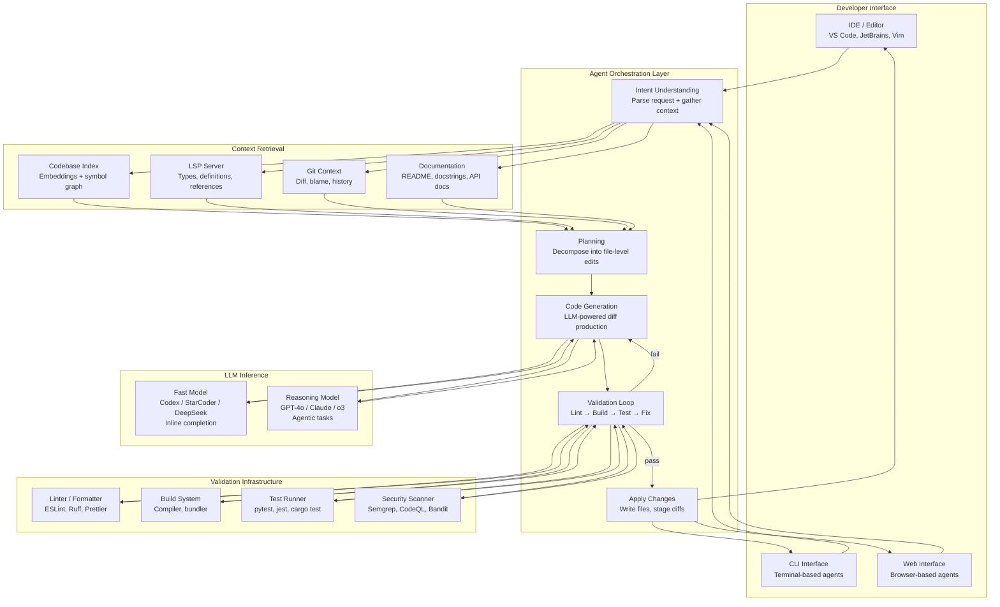

# Code Generation Agents

## 1. Overview

Code generation agents are autonomous or semi-autonomous systems that use LLMs to understand developer intent, generate code, validate results, and iterate toward correct implementations. They extend simple code completion (predict the next token) into full agentic workflows — reading existing code, planning changes across multiple files, executing tests, interpreting errors, and revising until the task is complete.

For Principal AI Architects, code agents represent the highest-stakes application of agentic AI: the generated output is executable, errors have immediate consequences (broken builds, security vulnerabilities, data loss), and the codebase context required for accurate generation is far larger than any context window. The architecture of a code agent must solve four hard problems simultaneously: context gathering (which code is relevant?), generation (what code to produce?), validation (is the code correct?), and integration (how does it fit into the existing codebase?).

**Key numbers that shape code agent design:**
- Average codebase size for enterprise projects: 100K–10M lines of code, far exceeding any context window
- Fill-in-the-Middle (FIM) completion latency: 50–200ms for Codex/StarCoder class models (fast enough for keystroke-level suggestions)
- Agentic code generation (multi-step): 30s–15min per task depending on complexity and iteration count
- Code suggestion acceptance rate: 25–35% for inline completions (GitHub Copilot), 60–80% for agentic multi-step tasks with human review
- Context window utilization: a typical code change touches 3–15 files, requiring 5K–50K tokens of context for accurate generation
- Test-driven validation: running a test suite adds 5–60s per iteration, but reduces error rates by 40–70% compared to generate-only workflows
- Token cost per coding task: $0.01–0.10 for inline completion, $0.10–5.00 for agentic multi-file changes (GPT-4o / Claude Sonnet class)
- Security incident rate: 5–15% of LLM-generated code contains at least one security vulnerability (Pearce et al., 2022), necessitating static analysis gates

Code agents compete with three alternatives: manual coding (slowest but most precise), template/scaffold generators (fast but inflexible), and fine-tuned code models without agency (fast completion but no multi-step reasoning). Production code agents increasingly combine all approaches — using fine-tuned models for fast completions and frontier reasoning models for complex agentic tasks.

---

## 2. Where It Fits in GenAI Systems

Code generation agents sit between the developer interface (IDE, CLI, browser) and the LLM inference layer, orchestrating a feedback loop that includes code context retrieval, generation, and validation.



Code agents interact with these adjacent systems:
- **Agent architecture** (foundation): Code agents implement ReAct/tool-use patterns, with tools specialized for code operations (file read/write, terminal execution, LSP queries). See [Agent Architecture](./agent-architecture.md).
- **Tool use** (capability): The agent's tool set defines its capability boundary — file I/O, shell execution, browser, API calls. See [Tool Use](./tool-use.md).
- **Copilot architecture** (deployment): Production code agents are deployed as IDE extensions, CLI tools, or cloud services with specific latency and UX requirements. See [Copilot Architecture](../13-case-studies/copilot-architecture.md).
- **Eval frameworks** (quality): Code agent quality is measured through pass@k, SWE-bench, and task-specific benchmarks. See [Eval Frameworks](../09-evaluation/eval-frameworks.md).
- **Memory systems** (context): Code agents use codebase indexing as a form of semantic memory and conversation history as short-term memory. See [Memory Systems](./memory-systems.md).

---

## 3. Core Concepts

### 3.1 Code Context Gathering

The quality of code generation is bounded by the quality of context provided to the LLM. A code agent that generates a function without knowing the types it should accept, the patterns used elsewhere in the codebase, or the test expectations will produce code that is syntactically valid but semantically wrong.

#### Context Sources (Ranked by Impact)

**1. Current file and cursor position:** The immediate editing context. For inline completion, the prefix (code before cursor) and suffix (code after cursor) provide the strongest signal. For agentic tasks, the full file provides structural context (imports, class hierarchy, function signatures).

**2. Open files and recent edits:** Files the developer has recently viewed or edited are probabilistically relevant. Most code tasks involve changes correlated across 2–5 files (a function and its tests, an API endpoint and its client, a component and its styles).

**3. Import graph and dependencies:** Following import statements from the current file reveals directly related modules. The transitive closure of the import graph (depth 2–3) captures the relevant "neighborhood" of the codebase. Cursor and Copilot both use import-based expansion to gather context.

**4. LSP (Language Server Protocol) data:** LSP provides machine-accurate information that embeddings cannot:
- **Type definitions:** Exact parameter types, return types, interface shapes.
- **Go-to-definition:** The implementation of any referenced symbol.
- **Find references:** All call sites of a function — critical for understanding how code is used.
- **Diagnostics:** Current type errors, warnings, and linting issues.
- **Symbol outline:** The structure of a file (classes, functions, methods) without the implementation bodies.

LSP data is the highest-precision context source but requires a running language server, which adds complexity and limits language support to those with mature LSP implementations.

**5. Git context:** Recent git diffs show what has changed recently (likely relevant to the current task). Git blame reveals who wrote specific code (useful for understanding intent). The git log provides the history of changes to specific files. Git diff between the current branch and main shows the scope of the current work.

**6. File tree and project structure:** The directory layout reveals architectural patterns (monorepo structure, package organization, test file locations). File names alone carry substantial information — `user_service.py`, `test_user_service.py`, `user_schema.sql` immediately suggest relationships.

**7. Codebase-wide embeddings:** For large codebases, embedding-based search enables retrieval of relevant code beyond the immediate import graph. The query (current task description or code context) is embedded and matched against a pre-computed index of all code files/functions.

#### Context Retrieval Architectures

**Greedy expansion (Copilot approach):** Start from the cursor position and greedily expand outward — current file → open tabs → imports → related files — until the token budget is filled. Priority is determined by proximity (closer = more likely relevant). Fast but can miss distant-but-relevant files.

**Codebase indexing (Cursor approach):** Pre-index the entire codebase using embeddings. At query time, embed the user request + current file context, retrieve the top-K most relevant code chunks from the index, and inject them into the prompt. More accurate for cross-cutting tasks but requires upfront indexing (minutes for large codebases).

**Map-reduce (Aider approach):** Build a "repository map" — a compressed representation of the entire codebase consisting of file names, function/class signatures, and docstrings (no implementation bodies). This map fits within a context window even for large codebases. The LLM reads the map to identify relevant files, then the agent retrieves only those files in full.

### 3.2 Fill-in-the-Middle (FIM)

FIM is the training objective that enables inline code completion. Standard autoregressive language models are trained to predict the next token given all previous tokens (left-to-right). FIM models are trained to predict the middle of a sequence given the prefix and suffix.

**Training transformation:**

Given a code snippet: `def add(a, b):\n    return a + b\n`

Standard autoregressive: predict each token left-to-right.

FIM: Split into prefix, middle, suffix at a random point:
```
Prefix:  "def add(a, b):\n    "
Middle:  "return a + b"
Suffix:  "\n"

Training input:  <PRE> def add(a, b):\n     <SUF> \n <MID>
Training target: return a + b
```

The model learns to condition on both prefix AND suffix, enabling accurate completion that is consistent with code that comes after the cursor position — essential for inserting code into existing files.

**FIM in practice:**
- Models: StarCoder 2, DeepSeek Coder, Code Llama, and all Copilot-backend models support FIM.
- Token format varies by model: `<fim_prefix>`, `<fim_suffix>`, `<fim_middle>` (StarCoder) vs. `<PRE>`, `<SUF>`, `<MID>` (Code Llama).
- The suffix window is typically 256–1024 tokens — enough to capture the next few lines/function signatures after the cursor.
- FIM is used for inline completion; agentic code generation uses standard autoregressive generation with the full codebase context in the prompt.

**Why FIM matters architecturally:** Without FIM, the model can only "see" code before the cursor. With FIM, it can see the function signature below, the type annotation on the next line, or the test assertion it needs to satisfy. This bidirectional context reduces hallucinated types, wrong variable names, and structurally inconsistent code.

### 3.3 Product Architectures

#### GitHub Copilot (GitHub / Microsoft)

**Architecture layers:**
1. **IDE extension** (VS Code, JetBrains, Neovim): Captures keystrokes, cursor position, open file context, and language-specific metadata.
2. **Context assembly:** Extracts prefix (code before cursor), suffix (code after cursor), and neighbor files (open tabs, imports, recently accessed files). Context budget: ~6K–8K tokens for inline completion, up to 128K for Copilot Chat / Agent mode.
3. **Proxy service:** Client sends context to GitHub's proxy, which routes to the appropriate model (Codex for completion, GPT-4o for chat, Claude for agent tasks).
4. **Model inference:** FIM completion for inline suggestions, autoregressive generation for chat, agentic loop for Copilot Workspace / Agent tasks.
5. **Post-processing:** Filter duplicates, check against public code (optional), format according to language conventions, truncate at a logical boundary (end of function, end of block).

**Copilot Workspace (agentic mode):**
Given a GitHub Issue, Copilot Workspace generates a plan (which files to modify and how), produces multi-file diffs, runs validation (tests, linting), and creates a pull request. This is a full agentic loop: plan → implement → validate → revise → submit.

**Latency budget:** Inline completion must return within 300ms to feel responsive. Chat can tolerate 1–3s TTFT. Agent mode runs for minutes.

#### Cursor (Anysphere)

**Architecture layers:**
1. **Forked VS Code editor:** Cursor is a custom VS Code fork with deep integration of AI capabilities at the editor level (not just an extension).
2. **Codebase indexing:** On project open, Cursor indexes the full codebase using embeddings. The index is stored locally and updated incrementally as files change. This enables semantic search across the entire project.
3. **Context assembly:** Cursor's "Composer" mode gathers context from: user request, codebase index search results, open files, terminal output, LSP diagnostics, and @-referenced files/docs.
4. **Multi-file editing:** Cursor generates edits across multiple files simultaneously, presenting a diff view for each file. The user reviews and accepts/rejects per-file.
5. **Agent mode:** Cursor Agent runs a full agentic loop — reads code, proposes edits, runs terminal commands (build, test), reads output, and iterates. It can autonomously install dependencies, fix type errors, and run tests.

**Key differentiator:** Codebase indexing. While Copilot relies primarily on open-tab context, Cursor retrieves relevant code from anywhere in the project based on semantic similarity. This is critical for large monorepos where the relevant code may not be in any open tab.

**Tab completion model:** Cursor uses a custom speculative-decoding approach where a small, fast model generates multi-line completions and a separate model verifies/corrects them. This enables longer completions (multi-line, multi-cursor) with low latency.

#### Devin (Cognition Labs)

**Architecture:**
Devin is a fully autonomous software engineering agent that operates in a sandboxed cloud environment with access to a browser, terminal, and code editor.

1. **Task understanding:** Devin receives a natural language task (from a Slack message, GitHub issue, or direct input) and decomposes it into a plan.
2. **Environment:** Devin operates within a cloud VM with a full development environment — shell access, code editor (custom), web browser (for documentation, Stack Overflow, API docs), and file system.
3. **Planning and execution:** A planner agent decomposes the task into steps. An executor agent carries out each step using tools (shell commands, file edits, browser navigation). A reviewer agent evaluates intermediate results.
4. **Multi-tool integration:** Devin can install dependencies, read documentation, write and edit code, run tests, debug failures, commit changes, and open pull requests — the complete inner loop of software development.
5. **Long-running execution:** Devin tasks run asynchronously, taking minutes to hours. The user receives updates and can intervene or redirect.

**Key architectural insight:** Devin's power comes not from a superior LLM but from deep tool integration. The agent can recover from errors by reading stack traces, searching documentation, and trying alternative approaches — behaviors that require a rich tool environment, not just a better model.

#### Claude Code (Anthropic)

**Architecture:**
Claude Code is a CLI-based agentic coding tool that runs in the developer's terminal.

1. **Terminal interface:** Claude Code operates as a REPL in the terminal, with access to the local filesystem and shell.
2. **Tool set:** File read/write, shell command execution, file search (glob, grep), web search, and sub-agent spawning. The tool set is minimal by design — Claude Code relies on the model's reasoning to orchestrate tools rather than embedding complex logic in the tool layer.
3. **Context gathering:** Uses file search (glob patterns, grep) and file reading to gather context on demand rather than pre-indexing. The model decides which files to read based on the task description and its progressive understanding of the codebase.
4. **Agentic loop:** Claude Code runs a ReAct-style loop — reason about the task, use a tool, observe the result, repeat. For complex tasks, it may spawn sub-agents to handle independent subtasks in parallel.
5. **Permission model:** Tool calls require user approval by default (with configurable auto-approval for read-only operations). This human-in-the-loop gate prevents destructive actions.
6. **Extended thinking:** Claude's extended thinking capability enables multi-step planning before tool execution, reducing the number of tool calls by front-loading reasoning.

**Key differentiator:** Model-driven context discovery. Rather than pre-indexing the codebase, Claude Code uses the model's reasoning to progressively discover relevant code through search and read operations. This avoids indexing overhead and works immediately on any codebase but requires more LLM calls for context gathering.

#### Aider

**Architecture:**
Aider is an open-source CLI-based code editing agent, designed for git-aware, diff-based editing.

1. **Repository map:** Aider constructs a "repo map" — a compressed view of the entire repository showing file paths, function signatures, and class definitions (without implementation bodies). This map uses tree-sitter for language-aware parsing. The map typically fits in 4K–16K tokens even for large repositories.
2. **Map-reduce context:** The LLM reads the repo map to identify which files are relevant to the task, then Aider retrieves only those files in full. This two-step approach (map → select → retrieve) is more token-efficient than embedding-based search for many tasks.
3. **Diff-based editing:** Aider prompts the model to produce edits as search-and-replace blocks or unified diffs, not complete file rewrites. This is more token-efficient and less error-prone for partial edits.
4. **Git integration:** Every edit is automatically committed to git. If the edit breaks something, the user can easily revert. The commit message is auto-generated from the conversation context.
5. **Multi-model support:** Aider supports any LLM through a common interface (OpenAI, Anthropic, local models via Ollama). It includes model-specific edit format selection — some models work better with unified diff format, others with search-replace blocks.

**Key differentiator:** The repo map / map-reduce approach. By giving the model a bird's-eye view of the entire codebase, Aider enables accurate file selection without embedding infrastructure. The tree-sitter-based parsing produces language-aware maps that capture code structure rather than raw text.

### 3.4 The Validation Loop: Generate → Lint → Test → Fix

The validation loop is what separates code agents from code completion. Completion generates and hopes; agents generate, validate, and iterate.

**Loop stages:**

1. **Generate:** The LLM produces code edits (new code, modifications, or diffs).
2. **Lint / Format:** Run language-specific linters (ESLint, Ruff, Clippy) and formatters (Prettier, Black, rustfmt). Catches syntax errors, style violations, and common mistakes. Latency: <2s.
3. **Type Check:** Run the type checker (TypeScript `tsc`, Python `mypy`/`pyright`, Rust `cargo check`). Catches type mismatches, missing imports, and interface violations. Latency: 2–10s.
4. **Build:** Compile the project (if applicable). Catches linker errors, dependency issues, and build configuration problems. Latency: 5–60s.
5. **Test:** Run the relevant test suite (unit tests, integration tests). Catches behavioral errors — the code compiles but does not do the right thing. Latency: 5–120s.
6. **Security scan:** Run SAST tools (Semgrep, CodeQL, Bandit). Catches security vulnerabilities (SQL injection, XSS, path traversal, hardcoded credentials). Latency: 10–60s.
7. **Fix:** If any stage fails, feed the error output back to the LLM with the original code. The LLM diagnoses the error and produces a revised edit. Return to step 2.

**Iteration limits:** Production agents cap the fix loop at 3–5 iterations. Beyond that, the agent escalates to the human with a summary of the issue and attempted fixes. Unbounded fix loops risk cost runaway and increasingly divergent code.

**Selective test execution:** Running the full test suite on every iteration is expensive. Smarter agents identify which tests are affected by the current change (using test dependency graphs or heuristic file-to-test mapping) and run only those. Latency reduction: 5–20x.

### 3.5 Speculative Editing

Speculative editing generates multiple candidate edits in parallel, potentially across multiple files, before any human review. The candidates are ranked by likelihood of correctness (using heuristics, test results, or model confidence), and the best candidate is presented to the user.

**Multi-cursor speculation (Cursor):** When the user accepts a completion at one location, Cursor predicts that similar edits are needed at related locations (other call sites, test files, documentation) and pre-generates those edits. The user "tabs" through related locations, accepting or rejecting each.

**Parallel file editing:** For tasks that require changes across N files, generate all N edits in parallel rather than sequentially. This requires the agent to plan the full set of changes upfront (what changes in each file), then execute generation in parallel, then validate the combined result. Latency reduction: from O(N × generation_time) to O(generation_time) + O(validation_time).

**Speculative decoding at the model level:** A small, fast "draft" model generates a long completion, then a larger "verifier" model checks each token. Tokens that the verifier agrees with are accepted instantly; disagreements trigger regeneration from the verifier. This enables longer completions at near-draft-model latency with near-verifier-model quality.

### 3.6 Security: Sandboxing, Permissions, and Code Review Gates

Code agents execute in environments where they can read files, write files, run shell commands, install packages, and potentially access the network. The security model must contain the blast radius of both LLM errors and adversarial exploitation.

**Sandboxing approaches:**
- **Containerized execution (Devin, Copilot Workspace):** The agent operates in a Docker container or cloud VM with resource limits. Network access is controlled. The agent cannot escape the container.
- **Permission-gated execution (Claude Code):** Each tool call requires explicit user approval. Destructive operations (file write, shell command) are gated; read-only operations can be auto-approved.
- **Workspace isolation:** The agent can only access files within the project workspace. System files, credentials, and other projects are inaccessible.
- **Network restrictions:** Agent internet access is controlled — some deployments allow web search and documentation access but block arbitrary network requests.

**Code review gates:**
- **Diff review before apply:** All code changes are presented as diffs for human review before being written to disk or committed.
- **Static analysis gate:** Generated code must pass SAST checks before being applied. Blocks common vulnerability patterns.
- **Secret detection:** Scan generated code for hardcoded secrets, API keys, and credentials. Block commits that contain them.
- **License compliance:** Check generated code against a license database to flag potential copyleft or patent issues.

---

## 4. Architecture

### 4.1 End-to-End Code Agent Architecture

```mermaid
flowchart TB
    subgraph "Developer Input"
        NL[Natural Language Task<br/>"Add pagination to the API"]
        ISSUE[GitHub Issue / PR Comment]
        INLINE[Inline Edit Request<br/>Cursor position + intent]
    end

    subgraph "Context Assembly"
        PARSE[Intent Parser<br/>Extract task scope + constraints]
        CTX_SEARCH[Context Search<br/>Codebase index + LSP + git]
        REPO_MAP[Repository Map<br/>File tree + symbol outline]
        CTX_RANK[Context Ranker<br/>Relevance scoring + budget fitting]
    end

    subgraph "Planning"
        DECOMPOSE[Task Decomposition<br/>Break into file-level changes]
        DEP_ORDER[Dependency Ordering<br/>Which files change first]
        PLAN_OUT[Edit Plan<br/>File → change description map]
    end

    subgraph "Generation"
        PROMPT[Prompt Assembly<br/>System + context + plan + instruction]
        LLM_CALL[LLM Generation<br/>Produce code diffs]
        DIFF_PARSE[Diff Parser<br/>Extract structured edits]
    end

    subgraph "Validation Loop"
        APPLY_TEMP[Apply to Temp Workspace]
        LINT_CHECK[Lint + Format Check]
        TYPE_CHECK[Type Check<br/>tsc / mypy / cargo check]
        TEST_RUN[Test Execution<br/>Affected tests only]
        SEC_SCAN[Security Scan<br/>Semgrep / CodeQL]
        ERROR_PARSE[Error Parser<br/>Extract actionable diagnostics]
    end

    subgraph "Human Review"
        DIFF_VIEW[Diff View<br/>Per-file accept / reject]
        APPROVAL[Approval Gate<br/>Apply or request revision]
    end

    subgraph "Apply"
        WRITE_FILES[Write Files to Disk]
        GIT_COMMIT[Git Commit<br/>Auto-generated message]
        PR_CREATE[PR Creation<br/>Optional]
    end

    NL & ISSUE & INLINE --> PARSE
    PARSE --> CTX_SEARCH & REPO_MAP
    CTX_SEARCH & REPO_MAP --> CTX_RANK
    CTX_RANK --> DECOMPOSE
    DECOMPOSE --> DEP_ORDER --> PLAN_OUT
    PLAN_OUT --> PROMPT --> LLM_CALL --> DIFF_PARSE

    DIFF_PARSE --> APPLY_TEMP --> LINT_CHECK --> TYPE_CHECK --> TEST_RUN --> SEC_SCAN

    SEC_SCAN -->|all pass| DIFF_VIEW
    LINT_CHECK -->|fail| ERROR_PARSE
    TYPE_CHECK -->|fail| ERROR_PARSE
    TEST_RUN -->|fail| ERROR_PARSE
    SEC_SCAN -->|fail| ERROR_PARSE
    ERROR_PARSE -->|retry ≤ 3| PROMPT

    DIFF_VIEW --> APPROVAL
    APPROVAL -->|approved| WRITE_FILES --> GIT_COMMIT --> PR_CREATE
    APPROVAL -->|revision requested| PARSE
    ERROR_PARSE -->|retry > 3| DIFF_VIEW
```

### 4.2 Inline Completion Architecture (FIM Pipeline)

```mermaid
flowchart LR
    subgraph "IDE Client"
        KS[Keystroke Event]
        DEBOUNCE[Debounce<br/>300–500ms idle]
        CTX_EXT[Context Extractor<br/>Prefix + Suffix + Neighbors]
    end

    subgraph "Completion Service"
        CACHE_CHK[Cache Check<br/>Prefix hash lookup]
        FIM_PROMPT[FIM Prompt Assembly<br/>PRE + SUF + MID format]
        MODEL[Code Model<br/>StarCoder / DeepSeek / Codex]
        POST[Post-Processing<br/>Truncate + format + dedup]
    end

    subgraph "Response"
        GHOST[Ghost Text Overlay<br/>Inline suggestion]
        ACCEPT[Tab to Accept<br/>Insert completion]
        NEXT[Multi-Suggestion Cycle<br/>Alt+] for alternatives]
    end

    KS --> DEBOUNCE --> CTX_EXT
    CTX_EXT --> CACHE_CHK
    CACHE_CHK -->|hit| POST
    CACHE_CHK -->|miss| FIM_PROMPT --> MODEL --> POST
    POST --> GHOST --> ACCEPT
    GHOST --> NEXT
```

---

## 5. Design Patterns

### 5.1 Plan-Then-Execute

The agent first produces a high-level plan describing which files to modify and what changes to make, then executes the plan step by step. The plan is reviewed by the user before execution begins.

**Advantages:**
- The user can catch misunderstandings before any code is generated, saving tokens and time.
- The plan provides a natural checkpoint for complex tasks.
- Decomposed steps are easier for the LLM to execute correctly than a monolithic "do everything at once" instruction.

**Implementation:** Copilot Workspace, Devin, and Claude Code all implement this pattern. The plan is typically a numbered list of file-level changes with descriptions. Aider's repo map serves a similar purpose — the model "plans" by identifying relevant files before editing.

### 5.2 Diff-Based Editing

Instead of regenerating entire files, the agent produces targeted edits as search-and-replace blocks or unified diffs. This pattern is more token-efficient, less error-prone (the model does not need to reproduce unchanged code perfectly), and produces cleaner version control history.

**Edit formats (ranked by reliability):**
1. **Search-and-replace blocks:** Most reliable. The model specifies the exact text to find and the exact replacement. Fails gracefully if the search text is not found (rather than silently producing wrong code).
2. **Unified diff:** Standard `---/+++` diff format. Works well with models trained on git diffs. Can be ambiguous with line number offsets.
3. **Whole file rewrite:** Simplest for the model but most token-expensive and most error-prone (the model may subtly change code it was supposed to leave untouched).

Aider dynamically selects the edit format based on the model — GPT-4o works well with search-replace, some smaller models are more reliable with whole file output.

### 5.3 Test-Driven Agent Loop

Write or identify the test first, then generate code to pass the test. This inverts the typical generate-then-test pattern:

1. **Identify or write tests:** If tests exist for the target functionality, gather them. If not, generate tests from the task specification.
2. **Run tests to establish baseline:** Confirm that the relevant tests currently fail (for new features) or pass (for refactoring).
3. **Generate code to pass tests:** The LLM receives the failing tests as context and generates code to make them pass.
4. **Validate:** Run the tests. If they pass, the task is complete. If not, feed failures back to the LLM.

This pattern is directly applicable to SWE-bench-style tasks where the expected behavior is defined by test cases.

### 5.4 Repository Map + Selective Retrieval

Build a compressed map of the entire repository (file paths + symbol signatures) that fits within the context window. Use the map for planning-level reasoning (which files to edit), then retrieve only the identified files in full for generation.

**Two-phase approach:**
1. **Phase 1 (map reading):** LLM reads the repo map + task description → outputs a list of relevant file paths.
2. **Phase 2 (code editing):** LLM reads the full content of selected files + task description → outputs code edits.

This pattern trades 1 additional LLM call for 50–90% reduction in context window usage compared to stuffing the entire codebase.

### 5.5 Parallel Multi-File Generation

For tasks requiring changes across N independent files, generate all N in parallel:
1. **Plan:** Decompose into file-level changes with explicit interfaces between files (function signatures, type definitions).
2. **Anchor files first:** Generate shared interface files (types, schemas, API contracts) first.
3. **Parallel generation:** Generate implementation files in parallel, each receiving the shared interfaces as context.
4. **Integration validation:** Run full build + test suite on the combined result.

Latency reduction: N× for the generation phase. Requires strong planning to define interfaces accurately upfront.

---

## 6. Implementation Approaches

### 6.1 Aider-Style Repo Map Implementation

```python
import tree_sitter

def build_repo_map(repo_path: str) -> str:
    """Build a compressed repository map using tree-sitter parsing.

    Output format per file:
    path/to/file.py:
      class ClassName:
        def method_name(self, param: Type) -> ReturnType
      def function_name(param: Type) -> ReturnType
    """
    map_lines = []
    for file_path in iter_source_files(repo_path):
        language = detect_language(file_path)
        parser = tree_sitter.Parser(language)
        tree = parser.parse(read_bytes(file_path))

        symbols = extract_symbols(tree.root_node)  # classes, functions, signatures
        if symbols:
            map_lines.append(f"\n{relative_path(file_path, repo_path)}:")
            for symbol in symbols:
                indent = "  " * symbol.depth
                map_lines.append(f"{indent}{symbol.signature}")

    return "\n".join(map_lines)

def identify_relevant_files(repo_map: str, task: str) -> list[str]:
    """Use LLM to identify which files need editing."""
    response = llm.invoke(f"""Given this repository map and task,
    list the file paths that need to be read or modified.

    Repository map:
    {repo_map}

    Task: {task}

    Return only file paths, one per line.""")
    return parse_file_list(response.content)
```

### 6.2 Validation Loop Implementation

```python
MAX_FIX_ITERATIONS = 3

async def validate_and_fix(edits: list[Edit], context: CodeContext) -> Result:
    """Run validation loop: lint → type check → test → fix."""

    for iteration in range(MAX_FIX_ITERATIONS + 1):
        # Apply edits to temporary workspace
        workspace = create_temp_workspace(context.repo_path)
        apply_edits(workspace, edits)

        # Stage 1: Lint
        lint_result = await run_lint(workspace, context.language)
        if lint_result.errors:
            if iteration < MAX_FIX_ITERATIONS:
                edits = await fix_errors(edits, lint_result.errors, "lint", context)
                continue
            return Result(status="lint_failure", errors=lint_result.errors, edits=edits)

        # Stage 2: Type check
        type_result = await run_type_check(workspace, context.language)
        if type_result.errors:
            if iteration < MAX_FIX_ITERATIONS:
                edits = await fix_errors(edits, type_result.errors, "type_check", context)
                continue
            return Result(status="type_failure", errors=type_result.errors, edits=edits)

        # Stage 3: Run affected tests
        affected_tests = identify_affected_tests(edits, context.test_map)
        test_result = await run_tests(workspace, affected_tests)
        if test_result.failures:
            if iteration < MAX_FIX_ITERATIONS:
                edits = await fix_errors(edits, test_result.failures, "test", context)
                continue
            return Result(status="test_failure", errors=test_result.failures, edits=edits)

        # Stage 4: Security scan
        sec_result = await run_security_scan(workspace, edits)
        if sec_result.vulnerabilities:
            if iteration < MAX_FIX_ITERATIONS:
                edits = await fix_errors(edits, sec_result.vulnerabilities, "security", context)
                continue
            return Result(status="security_failure", errors=sec_result.vulnerabilities, edits=edits)

        # All checks passed
        return Result(status="success", edits=edits, iterations=iteration)

async def fix_errors(edits: list[Edit], errors: list[str], stage: str, context: CodeContext) -> list[Edit]:
    """Feed errors back to LLM for fixing."""
    error_context = format_errors(errors, stage)
    response = await llm.ainvoke(f"""The following {stage} errors occurred after applying your edits:

    {error_context}

    Original edits:
    {format_edits(edits)}

    Relevant code context:
    {context.relevant_code}

    Please provide corrected edits that fix these errors.""")
    return parse_edits(response.content)
```

### 6.3 FIM Completion Service

```python
from dataclasses import dataclass

@dataclass
class CompletionRequest:
    prefix: str      # code before cursor
    suffix: str      # code after cursor
    language: str
    file_path: str
    neighbors: list[str]  # content of related open files

@dataclass
class CompletionResponse:
    completion: str
    confidence: float
    stop_reason: str  # "end_of_line", "end_of_block", "max_tokens"

class FIMCompletionService:
    def __init__(self, model: str = "deepseek-coder-v2"):
        self.model = model
        self.cache = LRUCache(maxsize=1000)

    async def complete(self, request: CompletionRequest) -> CompletionResponse:
        # Check cache (prefix hash → completion)
        cache_key = hash(request.prefix[-500:] + request.suffix[:200])
        if cached := self.cache.get(cache_key):
            return cached

        # Assemble FIM prompt
        prompt = self._assemble_fim_prompt(request)

        # Generate completion
        response = await self.model.generate(
            prompt=prompt,
            max_tokens=256,
            temperature=0.0,  # deterministic for inline completion
            stop=["\n\n", "```", "\nclass ", "\ndef "],  # stop at block boundaries
        )

        # Post-process: truncate at logical boundary, format
        completion = self._post_process(response.text, request.language)

        result = CompletionResponse(
            completion=completion,
            confidence=response.avg_logprob,
            stop_reason=response.stop_reason
        )
        self.cache.put(cache_key, result)
        return result

    def _assemble_fim_prompt(self, request: CompletionRequest) -> str:
        # Include neighbor context as comments before the FIM tokens
        neighbor_context = "\n".join(
            f"// Related file context:\n{n[:1000]}"
            for n in request.neighbors[:3]
        )
        return (
            f"{neighbor_context}\n"
            f"<fim_prefix>{request.prefix}<fim_suffix>"
            f"{request.suffix}<fim_middle>"
        )
```

---

## 7. Tradeoffs

### 7.1 Code Agent Product Comparison

| Factor | GitHub Copilot | Cursor | Devin | Claude Code | Aider |
|---|---|---|---|---|---|
| **Interface** | IDE extension | Custom IDE (VS Code fork) | Web + Slack | CLI (terminal) | CLI (terminal) |
| **Context strategy** | Greedy expansion | Codebase indexing | Full environment | On-demand search | Repo map + selective |
| **Autonomy level** | Low (suggestions) to Medium (workspace) | Medium (composer) to High (agent) | High (autonomous) | Medium-High (approval gates) | Medium (human confirms) |
| **Multi-file editing** | Limited (workspace mode) | Native | Native | Native | Native |
| **Validation loop** | Workspace only | Agent mode | Built-in | Tool-based | Manual (user runs tests) |
| **Indexing required** | No | Yes (local) | No (cloud env) | No | No (uses repo map) |
| **Cost model** | Subscription ($10–39/mo) | Subscription ($20/mo+) | Subscription ($500/mo) | Usage-based (API cost) | Usage-based (BYO API key) |
| **Open source** | No | No | No | No | Yes (Apache 2.0) |
| **Best for** | Inline completion + chat | Multi-file editing in IDE | Autonomous task execution | CLI-native developers | Git-centric workflows |

### 7.2 Context Gathering Strategy

| Strategy | Token Efficiency | Retrieval Accuracy | Setup Overhead | Latency | Codebase Size Limit |
|---|---|---|---|---|---|
| **Greedy expansion** | Low (grabs nearby, not relevant) | Medium | None | <100ms | Any |
| **Codebase indexing** | High (semantic retrieval) | High | Minutes (initial index) | 50–200ms | 10M+ LOC |
| **Repo map + selective** | High (two-phase) | High | Seconds (tree-sitter parse) | 1 LLM call overhead | 1M+ LOC |
| **LSP-based** | Highest (precise symbols) | Highest | Language server required | 10–100ms | Any |
| **Manual @-mention** | Perfect (human selected) | Perfect | Human effort | None | Any |

### 7.3 Edit Format Selection

| Format | Token Cost | Error Rate | Partial Edit Support | Model Compatibility |
|---|---|---|---|---|
| **Search-and-replace** | Low (only changed blocks) | Low (exact match validation) | Excellent | GPT-4o, Claude, strong models |
| **Unified diff** | Medium (context lines + changes) | Medium (line number ambiguity) | Good | Models trained on git diffs |
| **Whole file rewrite** | High (entire file output) | High (silent mutations) | Poor (must output everything) | Any model |

---

## 8. Failure Modes

### 8.1 Phantom Code References

**Symptom:** The agent generates code that references functions, classes, or modules that do not exist in the codebase.

**Root cause:** The LLM hallucinates plausible-sounding API names based on training data. Without sufficient codebase context (actual import paths, function signatures), the model invents them.

**Mitigation:**
- LSP-based context gathering — provide actual available symbols.
- Codebase index search for relevant existing code before generation.
- Type checking in the validation loop catches undefined references.
- Repo map gives the model awareness of what actually exists.

### 8.2 Silent Semantic Errors

**Symptom:** Generated code compiles, passes linting, and even passes existing tests, but has a subtle behavioral error (wrong business logic, off-by-one, incorrect edge case handling).

**Root cause:** Validation catches syntax and type errors but cannot catch semantic errors without test coverage for the specific behavior. The LLM generates plausible code that satisfies structural constraints but misunderstands the intent.

**Mitigation:**
- Test-driven agent loop: write tests before generating code.
- Human code review as the final gate (diff view with semantic review, not just skim).
- Require the agent to explain its implementation rationale, making reasoning errors visible.
- Property-based testing for edge case coverage.

### 8.3 Context Window Poisoning by Irrelevant Code

**Symptom:** The agent's generation quality degrades because the context window is filled with irrelevant code from poor retrieval.

**Root cause:** Codebase index retrieval returns semantically similar but logically irrelevant code (e.g., a differently named function with similar embedding to the query). This irrelevant context distracts the LLM and leads to confused generation.

**Mitigation:**
- Combine embedding search with structural filters (same package, same module, import-reachable).
- Reranking step after initial retrieval using a cross-encoder or LLM-based relevance judgment.
- Token budget limits on retrieved context — better to have less context than wrong context.
- Allow the model to discard retrieved context it judges irrelevant.

### 8.4 Unbounded Edit Scope Creep

**Symptom:** The agent starts modifying files outside the intended scope — reformatting unrelated code, "improving" untouched functions, or cascading changes through the dependency graph.

**Root cause:** The LLM interprets the task broadly and applies changes to related-but-out-of-scope code. Without explicit scope constraints, the model optimizes for global consistency rather than minimal change.

**Mitigation:**
- Explicit scope in the prompt: "Modify ONLY the following files: ..."
- Diff review before apply — reject out-of-scope changes.
- Aider's approach: the model declares which files it wants to edit, and the user approves the file list before any editing begins.
- Git-based scope: only allow changes in files already modified in the current branch.

### 8.5 Infinite Fix Loop

**Symptom:** The validation loop cycles between "fix lint error" → "introduce type error" → "fix type error" → "break test" → "fix test" → "introduce lint error" → repeat.

**Root cause:** The LLM's fix for one error introduces a new error. Each iteration explores a different point in the error space without converging.

**Mitigation:**
- Hard iteration limit (3–5 attempts).
- Accumulate ALL error context across iterations — show the model what it tried and what failed.
- On iteration 3+, switch to a more capable model (escalation).
- Present the original code + all failed attempts to the human for manual resolution.

### 8.6 Security Vulnerabilities in Generated Code

**Symptom:** Generated code contains SQL injection, XSS, path traversal, hardcoded credentials, or insecure deserialization patterns.

**Root cause:** LLMs are trained on public code that frequently contains security anti-patterns. Without explicit security constraints, the model reproduces common vulnerable patterns.

**Mitigation:**
- SAST scanning as a mandatory validation stage (Semgrep rules, CodeQL queries).
- Security-specific instructions in the system prompt: "Never use string concatenation for SQL queries. Always use parameterized queries."
- Pre-defined secure patterns for common operations (auth, database, file I/O, crypto) injected as context.
- Dependency scanning for known vulnerabilities in auto-installed packages.

---

## 9. Optimization Techniques

### 9.1 Speculative Decoding for Inline Completion

Use a small, fast draft model (7B parameters) to generate multi-token completions, then verify with a larger model. Tokens where both models agree are accepted; disagreements trigger regeneration from the larger model.

**Performance gain:** 2–4x speedup in tokens/second with <1% quality degradation. Critical for inline completion where 300ms latency is the upper bound.

### 9.2 Incremental Codebase Indexing

After the initial full codebase index, update only changed files. Monitor file system events (inotify, FSEvents) and re-embed only modified files. For a typical development session with 10–50 file changes, incremental re-indexing takes <1s vs. minutes for full re-indexing.

### 9.3 Prompt Caching for Multi-Turn Agent Loops

In agentic coding sessions, the system prompt and codebase context are largely unchanged between iterations. Use API-level prompt caching (Anthropic's prompt caching, OpenAI's server-side caching) to avoid re-processing static context tokens.

**Cost reduction:** 50–90% on cached prefix tokens. For a 50K token context where 40K tokens are cached, the effective cost drops by 80%.

### 9.4 Affected Test Detection

Instead of running the full test suite, identify which tests are affected by the current code change:
- **Import graph analysis:** If file A changed, find all test files that import from A (directly or transitively).
- **Test mapping:** Maintain a mapping from source files to their test files based on naming convention or configuration.
- **Coverage-based:** Use historical code coverage data to identify which tests exercise the changed code paths.

**Latency reduction:** Running 5 affected tests (2s) vs. full suite of 500 tests (120s) — 60x speedup.

### 9.5 Multi-File Parallel Generation with Interface Anchoring

For tasks requiring changes across N files:
1. Generate shared interface definitions first (types, schemas, API contracts).
2. Fan out: generate each file's implementation in parallel, with the shared interfaces as context.
3. Validate the combined result.

**Latency:** O(2 × generation_time) instead of O(N × generation_time) for N files. The 2× accounts for the sequential interface generation step followed by the parallel implementation step.

### 9.6 Smart Diff Truncation for Error Context

When feeding validation errors back to the LLM, include only the relevant portion of the error output — not the full test suite output or compiler log. Parse structured error messages and include only the error type, location, message, and relevant stack frame.

**Token savings:** Full test output can be 10K+ tokens; parsed error context is typically 200–500 tokens per error. This leaves more context budget for code and allows the model to focus on the actual issue.

---

## 10. Real-World Examples

### 10.1 GitHub Copilot (GitHub / Microsoft)

GitHub Copilot is the most widely deployed code agent, with 15M+ users as of early 2025. The product has evolved through three architectural generations:
- **Gen 1 (2022):** Inline completion only, powered by Codex (GPT-3.5 class). FIM-based, limited context.
- **Gen 2 (2023–2024):** Copilot Chat added conversational code generation powered by GPT-4. Multi-file context through open tabs.
- **Gen 3 (2025):** Copilot Workspace (agentic, plan-then-execute for issues), multi-model support (GPT-4o, Claude, Gemini), and Copilot Agent (autonomous code generation with validation).

Key metric: Copilot generates ~46% of all code for developers who use it (GitHub internal data, 2024). Acceptance rate for inline suggestions: ~30%.

### 10.2 Cursor (Anysphere)

Cursor has become the primary IDE for many AI-native developers, with rapid growth in 2024–2025. Its key architectural innovation is the codebase index — a locally computed embedding index of the entire project that enables semantic retrieval of relevant code for any task. Cursor's "Composer" mode generates multi-file edits from natural language instructions, and its agent mode can autonomously run terminal commands, read output, and iterate. Cursor also pioneered multi-cursor speculative editing — predicting related changes across multiple locations and letting the user tab through them.

### 10.3 Devin (Cognition Labs)

Devin is the first widely publicized autonomous software engineering agent, capable of completing full software engineering tasks from issue to pull request without human intervention. On the SWE-bench benchmark (resolving real GitHub issues), Devin achieved ~14% unassisted resolution rate at launch (2024), with subsequent improvements. The architecture — a sandboxed cloud environment with browser, terminal, and editor — has become the reference pattern for autonomous code agents. Key learning: autonomy requires deep tool integration and robust error recovery, not just a better LLM.

### 10.4 Claude Code (Anthropic)

Claude Code is Anthropic's CLI-based agentic coding tool, notable for its model-driven context discovery approach. Rather than pre-indexing the codebase, Claude Code uses the model's reasoning to decide which files to read, using tools like grep and glob to search the codebase. This approach works immediately on any codebase without setup. Claude Code's permission model — requiring explicit approval for write operations — is a reference implementation for human-in-the-loop security in code agents. Its extended thinking capability enables multi-step planning that reduces unnecessary tool calls.

### 10.5 Amazon Q Developer (AWS)

Amazon Q Developer (evolved from CodeWhisperer) integrates code generation with AWS-specific knowledge, enabling generation of infrastructure-as-code (CloudFormation, CDK, Terraform) alongside application code. Its agentic capabilities include autonomous code transformation (Java 8 → 17 upgrades, .NET Framework → .NET Core) that can process entire codebases. Key differentiator: enterprise-focused security features including code scanning, secrets detection, and license attribution for generated code.

### 10.6 Aider (Open Source)

Aider is the most popular open-source code editing agent, demonstrating that effective code agents do not require proprietary infrastructure. Its repo map approach (tree-sitter-based codebase summary) achieves competitive code editing quality without embedding infrastructure. Aider's benchmarking framework for code editing agents has become a community standard, and its model-adaptive edit format selection (different output formats for different LLMs) has influenced the design of commercial products. Key metric: Aider scores competitively with commercial products on the Aider code editing benchmark, despite being a single-developer open-source project.

---

## 11. Related Topics

- [Agent Architecture](./agent-architecture.md) — Foundational agent patterns (ReAct, function calling) used by code agents.
- [Tool Use](./tool-use.md) — Tool design for code agents: file I/O, shell execution, LSP queries, browser.
- [Copilot Architecture](../13-case-studies/copilot-architecture.md) — Deployment patterns for code assistance products (IDE extension, CLI, cloud).
- [Eval Frameworks](../09-evaluation/eval-frameworks.md) — Benchmarks for code agents: SWE-bench, HumanEval, MBPP, Aider benchmark.
- [Memory Systems](./memory-systems.md) — Codebase indexing as semantic memory; conversation history for multi-turn coding sessions.
- [Multi-Agent Systems](./multi-agent.md) — Multi-agent patterns in code agents (planner + coder + reviewer).
- [Context Management](../06-prompt-engineering/context-management.md) — Token budgeting strategies for code context.

---

## 12. Source Traceability

| Concept | Primary Source |
|---|---|
| GitHub Copilot architecture | Chen et al., "Evaluating Large Language Models Trained on Code" (Codex paper, OpenAI, 2021); GitHub Copilot documentation (2024–2025) |
| Fill-in-the-Middle | Bavarian et al., "Efficient Training of Language Models to Fill in the Middle" (OpenAI, 2022) |
| Cursor architecture | Anysphere engineering blog posts; Cursor documentation (2024–2025) |
| Devin architecture | Cognition Labs, "Introducing Devin" (2024); SWE-bench evaluation results |
| Claude Code | Anthropic, "Claude Code" documentation (2025) |
| Aider architecture | Gauthier, "Aider: AI pair programming in your terminal" (2023–2025); aider.chat documentation |
| SWE-bench benchmark | Jimenez et al., "SWE-bench: Can Language Models Resolve Real-World GitHub Issues?" (2024) |
| Security of LLM-generated code | Pearce et al., "Asleep at the Keyboard? Assessing the Security of GitHub Copilot's Code Contributions" (2022) |
| Speculative decoding | Leviathan et al., "Fast Inference from Transformers via Speculative Decoding" (2023) |
| Tree-sitter parsing | Brunsfeld et al., tree-sitter documentation (GitHub, 2018–present) |
| Repository map concept | Gauthier, "Aider repository map" documentation (2024) |
| Amazon Q Developer | AWS documentation, "Amazon Q Developer" (2024–2025) |
| Lost-in-the-middle | Liu et al., "Lost in the Middle: How Language Models Use Long Contexts" (2024) |
