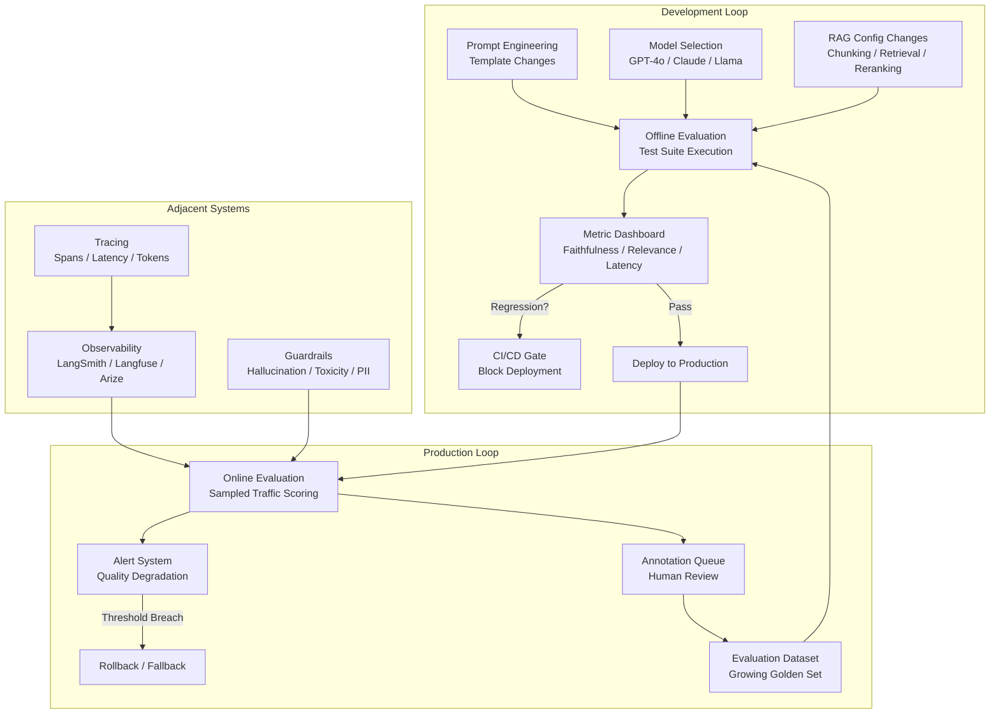
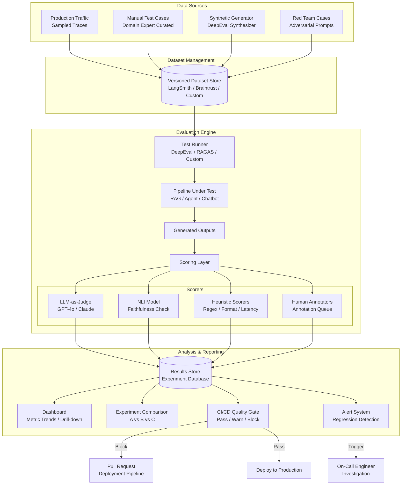
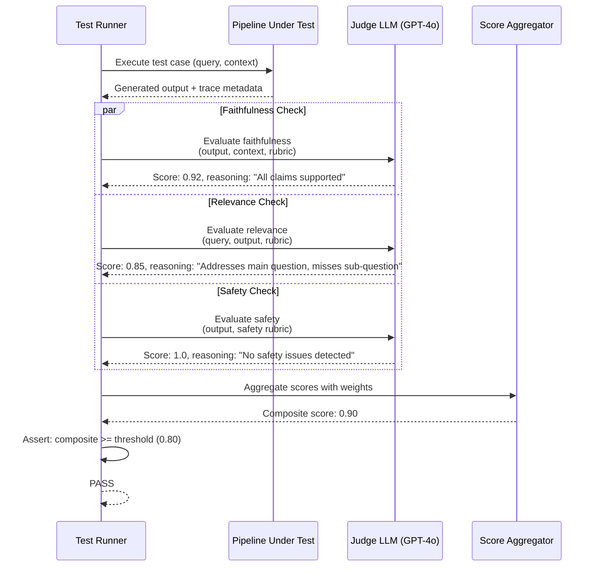

# LLM Evaluation Frameworks

## 1. Overview

Evaluation is the single most consequential engineering discipline in production LLM systems --- yet it remains the most underinvested. Unlike traditional ML, where metrics like accuracy, precision, and recall are well-understood and deterministic, LLM outputs are open-ended, stochastic, and multidimensional. A customer-facing chatbot that scores 92% on an internal benchmark can still produce embarrassing hallucinations in production because the benchmark didn't cover the failure modes that matter.

For Principal AI Architects, the evaluation challenge is architectural, not just methodological. You must design evaluation systems that are:
1. **Automated enough** to run in CI/CD on every prompt change, model swap, or retrieval configuration update.
2. **Sensitive enough** to detect regressions that human spot-checking would miss (e.g., a 3% drop in faithfulness after a reranker change).
3. **Aligned enough** with actual user satisfaction that optimizing the metrics improves the product.

**Key numbers that shape evaluation architecture decisions:**
- Human annotation cost: $0.50--$5.00 per judgment (depending on domain complexity and annotator expertise)
- Inter-annotator agreement on open-ended quality: Cohen's kappa 0.4--0.7 (moderate to substantial)
- LLM-as-judge correlation with human preference: 0.80--0.90 for GPT-4-class judges (Zheng et al., 2023)
- LLM-as-judge cost: $0.01--0.05 per evaluation (GPT-4o), $0.001--0.005 (GPT-4o-mini)
- RAGAS faithfulness evaluation latency: 2--5 seconds per sample (includes claim decomposition + NLI)
- Minimum test set size for statistical significance at p < 0.05: 200--400 samples for detecting a 5% difference
- Time to build a production eval pipeline from scratch: 2--6 engineering weeks

The evaluation landscape has consolidated around several frameworks, each with distinct architectural philosophies: RAGAS for RAG-specific metrics, DeepEval for comprehensive CI/CD integration, LangSmith for tracing-centric evaluation, Braintrust for experiment management, Patronus AI for enterprise guardrail evaluation, and TruLens for feedback-function-based pipelines. No single framework covers every need --- production systems typically combine 2--3 tools.

---

## 2. Where It Fits in GenAI Systems

Evaluation sits at the feedback loop layer of any GenAI system. It connects development-time quality assurance (offline eval) with production-time quality monitoring (online eval), creating a closed loop that drives continuous improvement.



Evaluation interacts with these adjacent systems:
- **RAG pipeline** (upstream): Evaluation metrics like faithfulness and context precision directly measure RAG quality. Changes to chunking, retrieval, or reranking are validated through evaluation. See [RAG Pipeline](../04-rag/01-rag-pipeline.md).
- **Hallucination detection** (downstream): Hallucination metrics are a subset of evaluation. Dedicated detection systems run both offline (eval) and online (guardrails). See [Hallucination Detection](./02-hallucination-detection.md).
- **LLM observability** (runtime): Observability platforms capture the traces and metadata that evaluation scores are attached to. See [LLM Observability](./04-llm-observability.md).
- **Benchmarks** (calibration): Public benchmarks provide an external reference point for model capability, while custom eval suites measure task-specific performance. See [Benchmarks](./03-benchmarks.md).
- **Guardrails** (safety): Safety evaluations (toxicity, PII, prompt injection) overlap with guardrail systems. Eval frameworks measure guardrail effectiveness; guardrails enforce it in production.

---

## 3. Core Concepts

### 3.1 RAGAS: The Standard for RAG Evaluation

RAGAS (Retrieval Augmented Generation Assessment, Es et al., 2023) defines four foundational metrics that decompose RAG quality into independently measurable components. Understanding their computation mechanics is essential for interpreting results and debugging failures.

**Faithfulness**

Measures whether the generated answer is factually consistent with the retrieved context. This is the primary hallucination detection metric for RAG systems.

Computation:
1. **Claim decomposition**: The LLM extracts atomic claims from the generated answer. Example: "Paris is the capital of France and has a population of 2.1 million" becomes ["Paris is the capital of France", "Paris has a population of 2.1 million"].
2. **NLI verification**: Each claim is checked against the retrieved context using Natural Language Inference. The LLM classifies each claim as "supported", "contradicted", or "not mentioned".
3. **Score**: `faithfulness = (number of supported claims) / (total number of claims)`.

Failure modes:
- **Over-decomposition**: Trivial claims inflate the numerator. "The answer is yes" decomposes to a single claim that is often trivially supported.
- **Under-decomposition**: Complex claims that bundle multiple facts mask partial hallucinations.
- **NLI errors**: The judge LLM itself may make errors in entailment classification, especially for domain-specific content. Using a stronger judge model (GPT-4o over GPT-4o-mini) reduces this but increases cost.

Production target: 0.85+ for enterprise applications, 0.90+ for regulated domains (healthcare, finance, legal).

**Answer Relevance**

Measures whether the generated answer addresses the user's question. A faithful answer that doesn't address the question scores low.

Computation:
1. From the generated answer, the LLM generates N hypothetical questions that the answer would be a good response to.
2. Compute cosine similarity between each generated question's embedding and the original question's embedding.
3. Score: average cosine similarity across the N generated questions.

This is a clever indirect measurement --- if the answer is relevant, the questions it could answer should be similar to the original question. However, it can be gamed by verbose answers that restate the question.

**Context Precision**

Measures whether the retrieved context is relevant to the question. High precision means low noise in the retrieved chunks.

Computation:
1. For each retrieved chunk, the LLM judges whether it is relevant to the question.
2. Compute precision at each rank position k: `precision@k = (relevant items in top-k) / k`.
3. Score: average precision across all rank positions (MAP-like formulation).

This metric depends on having ground-truth relevance labels or using LLM-as-judge for relevance, which introduces its own error rate.

**Context Recall**

Measures whether the retrieved context contains all the information needed to answer the question. Requires a reference answer.

Computation:
1. Decompose the reference answer into atomic statements.
2. For each statement, check whether any retrieved chunk supports it.
3. Score: `context_recall = (number of supported statements) / (total statements)`.

This metric requires a ground-truth reference answer, making it more expensive to compute at scale but more reliable than reference-free metrics.

### 3.2 DeepEval: CI/CD-Native Evaluation

DeepEval is designed as a testing framework for LLMs, modeled after pytest. It provides 14+ metrics and treats evaluation as a first-class engineering discipline with test assertions, CI/CD integration, and regression detection.

**Metric catalog (as of v1.x):**

| Metric | Category | Reference-Free? | Computation Method |
|--------|----------|-----------------|-------------------|
| Faithfulness | RAG | Yes | Claim decomposition + NLI (similar to RAGAS) |
| Answer Relevancy | RAG | Yes | Question generation + embedding similarity |
| Contextual Precision | RAG | No | Ranked relevance of retrieved context |
| Contextual Recall | RAG | No | Coverage of reference answer by context |
| Hallucination | RAG | Yes | Contradiction detection between output and context |
| Toxicity | Safety | Yes | Multi-classifier ensemble |
| Bias | Safety | Yes | Demographic bias detection |
| G-Eval | General | No | LLM-as-judge with chain-of-thought scoring |
| Summarization | Task-Specific | No | Alignment + coverage scoring |
| Knowledge Retention | Conversational | No | Multi-turn consistency checking |
| Conversation Relevancy | Conversational | Yes | Turn-level relevance scoring |
| Tool Correctness | Agents | No | Function call parameter validation |
| Task Completion | Agents | No | End-to-end success verification |
| SQL Evaluation | Code | No | Query equivalence checking |

**Synthetic test generation**: DeepEval generates synthetic test cases from your documents using the `Synthesizer` class:
1. Feed source documents (your RAG corpus).
2. The synthesizer generates diverse question-answer pairs with varying difficulty: simple factual, multi-hop reasoning, conditional, comparative.
3. Generated test sets can be filtered and human-validated before use.
4. This solves the cold-start problem --- you can bootstrap an evaluation suite from your corpus without manual annotation.

**CI/CD integration pattern**:
```
# deepeval test run
pytest test_llm.py --deepeval
# Runs evaluation suite, asserts thresholds, fails CI on regression
```

Each test case is a `LLMTestCase` with input, actual_output, expected_output (optional), retrieval_context (optional), and configurable metric thresholds. Tests fail if any metric drops below the threshold, blocking deployment.

### 3.3 LangSmith: Tracing-Centric Evaluation

LangSmith (by LangChain) takes a tracing-first approach: every LLM call is captured as a trace with full input/output/metadata, and evaluations are scored against these traces.

**Core evaluation workflow:**
1. **Dataset creation**: Curate input-output pairs from production traces (annotation queues) or manual construction.
2. **Evaluator definition**: Write custom evaluators (Python functions) or use built-in LLM-as-judge evaluators.
3. **Experiment execution**: Run a dataset through a pipeline version, producing scored traces.
4. **Comparison**: Side-by-side experiment comparison showing metric deltas across pipeline versions.

**Annotation queues**: Production traces are routed to human annotators through priority queues. Annotators label quality dimensions (correctness, helpfulness, safety) using configurable rubrics. This creates a continuous flywheel: production data flows into evaluation datasets, improving coverage over time.

**Online evaluation**: LangSmith can run evaluators on sampled production traffic in real-time, scoring a configurable percentage of requests. This enables drift detection without manual review.

**Key architectural advantage**: Because LangSmith captures the full trace (including intermediate retrieval results, chain-of-thought, tool calls), evaluators can score any component, not just the final output. You can evaluate retrieval quality, reranker effectiveness, and generation quality independently within a single trace.

### 3.4 Braintrust: Experiment-Driven Evaluation

Braintrust focuses on the experiment workflow: compare multiple pipeline configurations systematically.

**Core abstractions:**
- **Logging**: Structured logging of LLM calls with inputs, outputs, metadata, and scores.
- **Scoring**: Built-in scorers (factuality, relevance, SQL correctness) plus custom scorer functions. Scorers return 0--1 scores.
- **Experiments**: A named run of a pipeline over a dataset. Experiments are versioned and comparable.
- **Prompt playground**: Interactive prompt iteration with side-by-side comparison.
- **Datasets**: Versioned collections of input-output pairs with metadata.

**Workflow:**
1. Define a task function (your LLM pipeline).
2. Create or load a dataset.
3. Run an experiment: Braintrust executes the task on every dataset row and applies scorers.
4. Compare experiments: Dashboard shows metric distributions, per-sample diffs, and statistical significance.

Braintrust differentiates itself through proxy-based logging: you route your OpenAI/Anthropic API calls through Braintrust's proxy, which transparently captures all request/response data without code changes. This makes integration nearly zero-effort for teams already using these APIs.

### 3.5 Patronus AI: Enterprise Guardrail Evaluation

Patronus AI specializes in evaluating safety and reliability dimensions that general-purpose eval frameworks underserve.

**Evaluator catalog:**
- **Hallucination detection (Lynx model)**: Fine-tuned NLI model specifically for RAG hallucination detection. Claims to outperform GPT-4 on hallucination classification benchmarks. Available as API.
- **Toxicity evaluation**: Multi-dimensional toxicity scoring (hate speech, harassment, self-harm, sexual content, violence) with configurable severity thresholds.
- **PII detection**: Named entity recognition for PII categories (SSN, credit cards, phone numbers, emails, addresses) with both regex and ML-based detection.
- **Custom evaluators**: Define domain-specific evaluation criteria in natural language. Patronus translates them into scorable evaluators using LLM-as-judge with custom rubrics.

**Enterprise differentiators:**
- SOC 2 compliance and data residency options.
- Batch evaluation APIs for large-scale offline eval.
- Integration with CI/CD and model registries.
- Detailed failure attribution reports showing why specific outputs failed.

### 3.6 TruLens: Feedback Functions for RAG

TruLens introduces the concept of "feedback functions" --- modular, composable functions that score any aspect of an LLM application's behavior.

**Core feedback functions:**
- **Groundedness**: Decomposes the response into claims and checks each against the retrieved context. Similar to RAGAS faithfulness but with configurable decomposition granularity.
- **Context Relevance**: Scores how relevant each retrieved chunk is to the input query. Can identify which specific chunks contributed vs. added noise.
- **Answer Relevance**: Scores whether the final answer addresses the user's question.
- **Harmfulness / Toxicity**: Safety-oriented feedback functions using LLM-as-judge.

**Architecture**: TruLens wraps your LLM application (LangChain chain, LlamaIndex query engine, or custom function) in a recorder. The recorder intercepts all intermediate steps, stores them, and applies feedback functions to score each step. Results are visualized in a Streamlit dashboard.

**Tracing granularity**: TruLens can score individual retrieval results, reranker decisions, and generation steps independently. This pinpoints failures to specific pipeline components --- e.g., "retrieval was relevant but the LLM ignored the most relevant chunk."

### 3.7 LLM-as-Judge: Architecture and Calibration

Using a strong LLM (GPT-4, Claude, Gemini) to evaluate weaker LLM outputs is now the dominant automated evaluation approach. Understanding its mechanics, biases, and calibration is critical.

**Architecture:**

The judge LLM receives a structured evaluation prompt containing:
1. The evaluation criteria (rubric).
2. The input query.
3. The output to evaluate.
4. Optionally: the reference answer and/or retrieved context.
5. A scoring instruction (Likert scale, binary pass/fail, or continuous 0--1).

**Prompting strategies for judges:**
- **Single-point grading**: Score one output in isolation against a rubric. Simple but susceptible to scale bias (judges tend toward the middle of the scale).
- **Pairwise comparison**: Present two outputs and ask which is better. More reliable for relative quality but can't produce absolute scores. Used by Chatbot Arena and MT-Bench.
- **Reference-guided grading**: Provide a gold reference answer and ask the judge to compare the output against it. More consistent but requires reference answers.
- **Chain-of-thought grading**: Instruct the judge to reason step-by-step before assigning a score. Reduces scoring errors by 10--15% (Zheng et al., 2023).

**Known biases and mitigations:**

| Bias | Description | Mitigation |
|------|-------------|------------|
| Position bias | Prefers the first response in pairwise comparison | Evaluate both orderings and average |
| Verbosity bias | Prefers longer, more detailed responses | Explicitly instruct to penalize unnecessary verbosity |
| Self-enhancement bias | GPT-4 rates GPT-4 outputs higher than Claude outputs | Use a different model family as judge than the one being evaluated |
| Sycophancy bias | Agrees with whatever framing the prompt suggests | Use neutral, non-leading evaluation prompts |
| Leniency bias | Gives high scores too frequently | Calibrate with known-bad examples; force distribution |

**Calibration procedure:**
1. Collect 100--200 examples with human quality judgments.
2. Run LLM-as-judge on the same examples.
3. Compute agreement metrics: Cohen's kappa, Spearman correlation, accuracy on binary pass/fail.
4. If agreement < 0.7 kappa, revise the evaluation prompt, add rubric examples, or switch to pairwise comparison.
5. Re-evaluate periodically as the distribution of outputs changes (prompt or model updates can shift the calibration).

### 3.8 Human Evaluation: The Ground Truth

Automated metrics are proxies. Human evaluation remains the gold standard for subjective quality dimensions (helpfulness, naturalness, trustworthiness) and for calibrating automated metrics.

**Annotation guideline design:**
- Define each quality dimension with concrete examples of each score level. Ambiguous guidelines produce unreliable annotations.
- Include boundary cases: examples that are "on the edge" between adjacent score levels.
- Specify what to do when annotators are unsure (skip, flag, default score).

**Inter-annotator agreement (IAA):**
- Measure: Cohen's kappa (2 annotators), Fleiss' kappa (3+ annotators), or Krippendorff's alpha.
- Target: kappa > 0.6 for most quality dimensions. kappa < 0.4 indicates the dimension is too subjective or the guidelines are ambiguous.
- For complex dimensions (e.g., "helpfulness" for open-ended queries), expect lower IAA. Decompose into more specific sub-dimensions if kappa is too low.

**Likert scales:**
- 5-point scales are standard: 1 (very poor) to 5 (excellent).
- Binary (pass/fail) is more reliable but less informative.
- 3-point scales (bad/acceptable/good) balance reliability and informativeness.
- Always anchor scales with examples. "A score of 4 means the response is correct and helpful with minor style issues."

**Annotation workforce:**
- **Domain experts**: Required for specialized domains (medical, legal, financial). More expensive ($5--20/judgment) but higher quality.
- **Trained crowdworkers**: Suitable for general-purpose evaluation after training and qualification tests. $0.50--2.00/judgment.
- **Internal QA team**: Best for proprietary applications. Build institutional knowledge of edge cases.

### 3.9 Evaluation Methodology: Test Set Construction and Statistical Rigor

**Test set construction:**

| Approach | Description | When to Use |
|----------|-------------|-------------|
| Manual curation | Domain experts write test cases | High-stakes, small test sets (50--200 samples) |
| Production sampling | Sample and annotate real user queries | Captures real distribution, reveals long-tail failures |
| Synthetic generation | LLM generates test cases from source docs | Bootstrap initial test set, augment coverage |
| Adversarial generation | Red-team prompts targeting known weaknesses | Stress-testing specific failure modes |
| Stratified sampling | Ensure coverage of query types, topics, difficulty | Balanced evaluation across dimensions |

**Test set characteristics:**
- **Size**: 200--500 samples for reliable regression detection (5% difference at p < 0.05). 1,000+ for fine-grained metric analysis across subgroups.
- **Diversity**: Cover all query types your system handles --- factual, analytical, conversational, multi-hop, out-of-scope, adversarial.
- **Versioning**: Version-control test sets. Track additions, removals, and modifications. Never modify a test case after it has been used in an evaluation --- add new cases instead.
- **Contamination**: Never let test set examples appear in few-shot prompts, fine-tuning data, or RAG indexes. Rotate test sets periodically.

**Statistical significance:**
- Use paired bootstrap resampling or McNemar's test for comparing two systems on the same test set.
- Report confidence intervals, not just point estimates. A faithfulness score of 0.87 +/- 0.03 is far more informative than just 0.87.
- For A/B tests with human judges: account for annotator variance using mixed-effects models.
- Beware of multiple comparisons: when evaluating N metrics across M configurations, apply Bonferroni correction or use the Benjamini-Hochberg procedure to control false discovery rate.

### 3.10 CI/CD Integration: Automated Eval Pipelines

**Architecture of a CI/CD evaluation pipeline:**

1. **Trigger**: A PR changes a prompt template, model configuration, retrieval parameter, or evaluation test case.
2. **Execution**: CI runner executes the evaluation suite against the current test set using the modified pipeline.
3. **Scoring**: Each test case is scored across all configured metrics (faithfulness, relevance, latency, cost).
4. **Comparison**: Results are compared against the baseline (main branch scores or last known-good deployment).
5. **Quality gate**: If any metric regresses beyond a configurable threshold (e.g., faithfulness drops > 2%), the PR is blocked.
6. **Reporting**: Results are posted as a PR comment with metric tables, per-sample diffs for failures, and links to detailed traces.

**Quality gate configuration:**

| Metric | Warning Threshold | Block Threshold | Rationale |
|--------|-------------------|-----------------|-----------|
| Faithfulness | > 2% drop | > 5% drop | Hallucination is the highest-risk failure |
| Answer Relevance | > 3% drop | > 7% drop | Relevance is important but more tolerant |
| Latency (p95) | > 20% increase | > 50% increase | Performance regression detection |
| Cost per query | > 15% increase | > 30% increase | Budget guardrail |
| Toxicity (any) | > 0 new failures | > 0 new failures | Zero-tolerance for safety regressions |

**Practical considerations:**
- **Cost management**: LLM-as-judge evaluation costs $0.01--0.05 per sample. A 500-sample test suite costs $5--25 per run. Use GPT-4o-mini for fast iteration and GPT-4o for final gate checks.
- **Parallelization**: Run evaluations in parallel across test cases. A 500-sample suite with 5 metrics takes ~10--20 minutes sequentially but ~2--5 minutes with 20x parallelism.
- **Caching**: Cache LLM outputs for identical inputs across runs. Prompt template changes invalidate the cache; model or retrieval changes require full re-evaluation.
- **Flakiness**: LLM evaluations have inherent variance. Run critical evaluations 3 times and take the majority vote or median score. Flag test cases with high variance for manual review.

---

## 4. Architecture

### 4.1 End-to-End Evaluation Platform Architecture



### 4.2 LLM-as-Judge Evaluation Flow



---

## 5. Design Patterns

### Pattern 1: Offline Regression Suite (Development-Time Eval)
- **When**: Every PR that modifies prompts, model configuration, or retrieval parameters.
- **How**: Run a curated test suite (200--500 cases) through the modified pipeline. Compare metrics against the baseline. Block deployment if metrics regress beyond thresholds.
- **Tools**: DeepEval (pytest-native), RAGAS (programmatic), Braintrust (experiment comparison).
- **Latency**: 2--10 minutes depending on test set size and parallelism.
- **Limitation**: Only covers known scenarios. Production traffic may include query types not in the test set.

### Pattern 2: Online Evaluation (Production-Time Scoring)
- **When**: Continuously in production to detect quality drift, model degradation, or distribution shift.
- **How**: Sample 1--10% of production traffic. Run LLM-as-judge evaluators asynchronously on sampled traces. Alert on metric degradation.
- **Tools**: LangSmith (online evaluators), Langfuse (scoring API), Arize Phoenix (drift detection).
- **Cost**: At 5% sampling on 10K daily queries, 500 evaluations/day at $0.02/eval = $10/day.
- **Limitation**: Asynchronous --- detects problems minutes to hours after they occur, not in real-time.

### Pattern 3: Human-in-the-Loop Evaluation Flywheel
- **When**: Establishing ground truth, calibrating automated metrics, evaluating subjective quality dimensions.
- **How**: Route sampled production traces to annotation queues. Domain experts label quality dimensions using standardized rubrics. Annotated examples feed back into the evaluation dataset and are used to calibrate LLM-as-judge metrics.
- **Tools**: LangSmith (annotation queues), Label Studio, Argilla.
- **Cadence**: Continuous --- annotate 50--100 samples per week for steady improvement.

### Pattern 4: Adversarial Evaluation (Red-Teaming)
- **When**: Pre-launch safety evaluation, quarterly security audits, after significant model or prompt changes.
- **How**: Generate adversarial test cases targeting known failure modes: prompt injection, hallucination-inducing queries, toxicity elicitation, PII extraction, jailbreaks.
- **Tools**: Patronus AI (automated adversarial eval), Garak (open-source red-teaming), custom red team.
- **Frequency**: Pre-launch (mandatory), quarterly (recommended), after any model swap.

### Pattern 5: A/B Evaluation (Pairwise Comparison)
- **When**: Deciding between two model versions, prompt variants, or pipeline configurations.
- **How**: Run both configurations on the same test set. Use LLM-as-judge pairwise comparison (MT-Bench style) or human side-by-side evaluation. Apply statistical tests (bootstrap, Bradley-Terry) to determine the winner.
- **Tools**: Braintrust (experiment comparison), LangSmith (experiments), custom.
- **Statistical rigor**: Require 200+ comparisons for reliable results. Report win/loss/tie ratios with confidence intervals.

### Pattern 6: Component-Level Evaluation (Decomposed Pipeline Eval)
- **When**: Debugging performance regressions or optimizing individual pipeline components.
- **How**: Evaluate each pipeline stage independently: retrieval quality (precision@K, recall@K, NDCG), reranker effectiveness (NDCG improvement), generation quality (faithfulness, relevance), and end-to-end quality. Attribute failures to specific components.
- **Tools**: TruLens (per-component feedback), RAGAS (component metrics), custom.
- **Benefit**: Pinpoints whether a regression is caused by retrieval, reranking, or generation.

---

## 6. Implementation Approaches

### 6.1 Framework Comparison

| Framework | Core Philosophy | Metrics | CI/CD | Human Eval | Open Source | Pricing |
|-----------|----------------|---------|-------|------------|-------------|---------|
| **RAGAS** | RAG-specific metrics, reference-free | 4 core + extensible | Via pytest | No | Yes (Apache 2.0) | Free |
| **DeepEval** | pytest-native LLM testing | 14+ built-in | Native (pytest) | No | Yes (Apache 2.0) | Free (cloud dashboard paid) |
| **LangSmith** | Tracing + evaluation + annotation | Custom + LLM-as-judge | Via API | Annotation queues | No (proprietary) | Free tier, then usage-based |
| **Braintrust** | Experiment management + comparison | Built-in + custom | Via API | Manual review | Partially (SDK open) | Free tier, then usage-based |
| **Patronus AI** | Enterprise safety + guardrail eval | Hallucination, toxicity, PII | Via API | No | No (proprietary) | Enterprise pricing |
| **TruLens** | Feedback functions on traces | Groundedness, relevance | Via pytest | No | Yes (MIT) | Free |

### 6.2 Recommended Stack by Use Case

| Use Case | Primary Framework | Supporting Tools | Rationale |
|----------|------------------|------------------|-----------|
| RAG quality evaluation | RAGAS + DeepEval | LangSmith for tracing | RAGAS metrics are the standard; DeepEval adds CI/CD |
| Full LLM application eval | DeepEval | Braintrust for experiments | DeepEval covers the broadest metric set with pytest integration |
| Enterprise safety evaluation | Patronus AI | DeepEval for non-safety metrics | Patronus specializes in safety; supplement for other dimensions |
| Experiment comparison | Braintrust | RAGAS for metric computation | Braintrust excels at A/B experiments and prompt iteration |
| Tracing-first development | LangSmith | RAGAS for offline eval | LangSmith unifies tracing and evaluation in one platform |
| Open-source-only constraint | RAGAS + TruLens + DeepEval | Langfuse for tracing | Full eval capability with no vendor lock-in |

### 6.3 Building a Production Evaluation Pipeline (Step-by-Step)

**Phase 1: Bootstrap (Week 1--2)**
1. Generate a synthetic test set from your corpus using DeepEval Synthesizer (200+ cases).
2. Implement RAGAS faithfulness and answer relevance as the initial automated metrics.
3. Run manually and establish baseline scores.

**Phase 2: CI/CD Integration (Week 2--3)**
4. Wrap the evaluation suite in pytest with DeepEval assertions.
5. Configure CI to run on every PR that modifies prompt templates or retrieval config.
6. Set quality gates: block on faithfulness regression > 5%.

**Phase 3: Human Calibration (Week 3--4)**
7. Set up an annotation queue (LangSmith or Argilla).
8. Have domain experts annotate 100--200 samples.
9. Compute correlation between automated metrics and human judgments. Adjust thresholds.

**Phase 4: Production Monitoring (Week 4--6)**
10. Deploy online evaluation on 5% of production traffic.
11. Build dashboards for metric trends, latency, and cost.
12. Configure alerts for metric degradation.

---

## 7. Tradeoffs

### Evaluation Strategy Tradeoffs

| Decision | Option A | Option B | Key Tradeoff |
|----------|----------|----------|--------------|
| Evaluation method | LLM-as-judge | Human evaluation | Cost + speed vs. reliability on subjective dimensions |
| Test set source | Synthetic generation | Manual curation | Coverage + speed vs. quality + domain alignment |
| Evaluation frequency | Every PR (CI/CD) | Nightly batch | Fast feedback vs. cost reduction |
| Judge model | GPT-4o | GPT-4o-mini | Accuracy vs. 10x cost reduction |
| Metric scope | End-to-end only | Component + end-to-end | Simplicity vs. failure attribution |
| Reference answers | Reference-free eval | Reference-guided eval | Lower annotation cost vs. more reliable scoring |
| Sampling rate (prod) | 1% of traffic | 10% of traffic | Cost savings vs. faster drift detection |

### Framework Selection Tradeoffs

| Decision | Option A | Option B | Key Tradeoff |
|----------|----------|----------|--------------|
| Framework | Single integrated platform (LangSmith) | Best-of-breed composition | Simplicity vs. flexibility + depth |
| Deployment | Cloud-hosted (LangSmith, Braintrust) | Self-hosted (Langfuse, RAGAS) | Zero ops vs. data sovereignty + cost at scale |
| Metrics | Standard metrics (RAGAS 4) | Custom domain metrics | Speed to deploy vs. alignment with business objectives |
| Annotation | Internal team | Crowd annotators | Institutional knowledge vs. scale + cost |

---

## 8. Failure Modes

### 8.1 Metric-Output Misalignment
**Symptom**: Automated metrics show improvement, but user satisfaction declines.
**Cause**: Metrics don't capture dimensions that users care about (e.g., response style, level of detail, actionability). Goodhart's Law: when a metric becomes a target, it ceases to be a good metric.
**Mitigation**: Periodically validate automated metrics against human evaluations. Include user feedback (thumbs up/down) as a complementary signal. Build task-specific metrics beyond generic faithfulness/relevance.

### 8.2 Test Set Contamination
**Symptom**: Evaluation scores are consistently high, but production quality is mediocre.
**Cause**: Test cases have leaked into few-shot prompt examples, fine-tuning data, or RAG indexes. The model memorizes the answers rather than reasoning about them.
**Mitigation**: Maintain strict separation between test sets and training/prompt data. Rotate test sets quarterly. Use held-out "canary" test cases that are never shared.

### 8.3 LLM-as-Judge Failures
**Symptom**: Automated evaluation passes outputs that humans would flag, or blocks outputs that humans would approve.
**Cause**: Judge LLM has biases (verbosity, position, self-enhancement) or lacks domain expertise.
**Mitigation**: Calibrate against human judgments. Monitor judge agreement rates. Use pairwise comparison instead of single-point grading for relative evaluations. Rotate judge models.

### 8.4 Insufficient Test Coverage
**Symptom**: Evaluation passes, but production failures cluster in specific query types not represented in the test set.
**Cause**: Test set is biased toward easy or common queries. Long-tail failure modes (adversarial, ambiguous, multi-hop, domain-specific) are underrepresented.
**Mitigation**: Stratify test sets by query type, difficulty, and topic. Add production failures to the test set (regression tests). Periodically audit coverage.

### 8.5 Flaky Evaluations
**Symptom**: The same pipeline version produces different evaluation scores across runs, causing inconsistent CI/CD gates.
**Cause**: LLM output variance (temperature > 0), LLM-as-judge variance, non-deterministic retrieval (ANN search), or timing-dependent failures.
**Mitigation**: Set temperature to 0 for both the pipeline under test and the judge LLM during evaluation. Run critical evaluations 3 times and take the median. Increase test set size to reduce statistical noise.

### 8.6 Evaluation Cost Explosion
**Symptom**: Evaluation pipeline costs more than the production system it evaluates.
**Cause**: Large test sets, expensive judge models (GPT-4o), high evaluation frequency (every commit), multiple metrics requiring separate judge calls.
**Mitigation**: Use tiered evaluation --- GPT-4o-mini for fast PR checks, GPT-4o for final gate checks. Cache judge results for unchanged test cases. Reduce evaluation frequency for stable components.

---

## 9. Optimization Techniques

### 9.1 Evaluation Speed Optimization
- **Parallel execution**: Run all test cases in parallel with async API calls. A 500-case suite with 3-second per-eval latency takes ~25 minutes sequentially but ~3 minutes with 100x parallelism.
- **Tiered evaluation**: Run fast heuristic checks (format, length, keyword presence) first. Only run expensive LLM-as-judge evaluation on samples that pass heuristic checks.
- **Incremental evaluation**: Only evaluate test cases affected by the change. If a prompt template changed, re-evaluate all. If a retrieval parameter changed, only re-evaluate test cases that exercise retrieval.
- **Judge model optimization**: Use GPT-4o-mini for development iterations and GPT-4o for release gates. Correlation between GPT-4o-mini and GPT-4o scores is ~0.85--0.90 for well-calibrated rubrics.

### 9.2 Evaluation Quality Optimization
- **Multi-judge ensemble**: Run 3 different judge prompts and take the majority vote. Reduces individual judge bias but increases cost 3x. Use selectively for high-stakes metrics.
- **Rubric engineering**: Spend time crafting detailed rubrics with examples. A well-engineered rubric can improve judge agreement by 15--25% (similar to improving annotation guidelines for humans).
- **Claim-level attribution**: Instead of scoring the entire output, decompose into claims and score each claim. This provides finer-grained feedback and catches partial hallucinations that output-level scoring misses.
- **Dynamic difficulty calibration**: Track per-test-case variance across runs. Remove or rework test cases with high variance (they are unreliable signals).

### 9.3 Test Set Optimization
- **Active learning for test set construction**: Run evaluation on a large pool of candidate test cases. Identify cases where the model fails or produces high-variance scores. Add these to the curated test set preferentially. This builds a maximally informative test set.
- **Stratified sampling**: Ensure test set proportionally represents query types, topics, and difficulty levels. Over-represent failure-prone categories (adversarial, multi-hop, out-of-scope).
- **Drift-aware updates**: Periodically compare production query distribution to test set distribution. Add test cases that cover emerging query patterns.

---

## 10. Real-World Examples

### Notion AI (RAG Evaluation at Scale)
Notion uses a multi-layered evaluation approach for its AI-powered Q&A and writing assistant. They combine RAGAS-style automated evaluation for faithfulness with custom relevance metrics tailored to workspace context. Their evaluation suite runs in CI on every prompt change. Notion reported investing more engineering time in evaluation infrastructure than in the RAG pipeline itself, a pattern common in mature AI product teams.

### Anthropic (Constitutional AI Evaluation)
Anthropic's evaluation infrastructure for Claude uses extensive human evaluation with calibrated annotator pools, combined with automated harmlessness and helpfulness scoring. Their "red team" evaluation process systematically probes for safety failures. They publish model cards with detailed evaluation methodology, demonstrating that evaluation transparency is itself a product differentiator. Anthropic's work on constitutional AI pioneered using AI feedback (RLAIF) as a scalable alternative to human annotation.

### Databricks (MosaicML Evaluation Pipeline)
Databricks/MosaicML built a production evaluation pipeline for their foundation model training. They run over 30 benchmarks (MMLU, HumanEval, HellaSwag, and custom domain-specific suites) in CI/CD for every model checkpoint. Their evaluation infrastructure can process thousands of test cases per hour across multiple GPU nodes. The pipeline automatically detects capability regressions and flags checkpoints that degrade on specific task categories.

### Vectara (Hallucination Evaluation Model, HHEM)
Vectara developed the Hughes Hallucination Evaluation Model (HHEM), a cross-encoder model specifically trained to detect hallucinations in RAG outputs. They open-sourced the model and published a hallucination leaderboard ranking LLMs by their tendency to hallucinate. HHEM achieves over 87% accuracy on hallucination classification, outperforming generic NLI models. Vectara integrated HHEM directly into their RAG platform as a real-time quality check.

### LinkedIn (LLM Evaluation at Enterprise Scale)
LinkedIn built a custom evaluation framework for their AI-powered features (messaging suggestions, job recommendations, feed ranking with LLMs). They combine automated evaluation with large-scale A/B testing, using Elo-style rating systems to compare model versions. Their evaluation infrastructure handles millions of evaluation pairs per week and integrates with their existing experimentation platform.

---

## 11. Related Topics

- [Hallucination Detection and Mitigation](./02-hallucination-detection.md) --- Detection-specific metrics and methods that feed into evaluation pipelines.
- [LLM Observability](./04-llm-observability.md) --- Tracing and monitoring infrastructure that evaluation systems depend on.
- [LLM Benchmarks](./03-benchmarks.md) --- Public benchmarks for model-level evaluation; complements task-specific evaluation.
- [RAG Pipeline Architecture](../04-rag/01-rag-pipeline.md) --- The primary system being evaluated; evaluation metrics shape RAG design decisions.
- [Guardrails and Safety](../10-safety/01-guardrails.md) --- Runtime safety enforcement that evaluation validates.
- [Prompt Patterns](../06-prompt-engineering/01-prompt-patterns.md) --- Prompt engineering changes are the most frequent trigger for evaluation.

---

## 12. Source Traceability

| Concept | Primary Source |
|---------|---------------|
| RAGAS metrics (faithfulness, relevance, precision, recall) | Es et al., "RAGAS: Automated Evaluation of Retrieval Augmented Generation" (2023); ragas.io documentation |
| LLM-as-judge methodology and biases | Zheng et al., "Judging LLM-as-a-Judge with MT-Bench and Chatbot Arena" (2023) |
| DeepEval framework and metrics | DeepEval documentation (docs.confident-ai.com); Confident AI |
| LangSmith evaluation workflows | LangSmith documentation (docs.smith.langchain.com) |
| Braintrust experiment management | Braintrust documentation (braintrustdata.com/docs) |
| Patronus AI evaluators | Patronus AI documentation (patronus.ai/docs); Lynx hallucination model paper |
| TruLens feedback functions | TruLens documentation (trulens.org) |
| Human evaluation methodology and IAA | Artstein & Poesio, "Inter-Coder Agreement for Computational Linguistics" (2008) |
| Statistical significance in NLP evaluation | Dror et al., "The Hitchhiker's Guide to Testing Statistical Significance in NLP" (2018) |
| Evaluation pipeline CI/CD patterns | Braintrust, DeepEval, and LangSmith best practices documentation |
| HHEM hallucination evaluation model | Vectara, "Hughes Hallucination Evaluation Model" (2023); open-sourced on HuggingFace |
