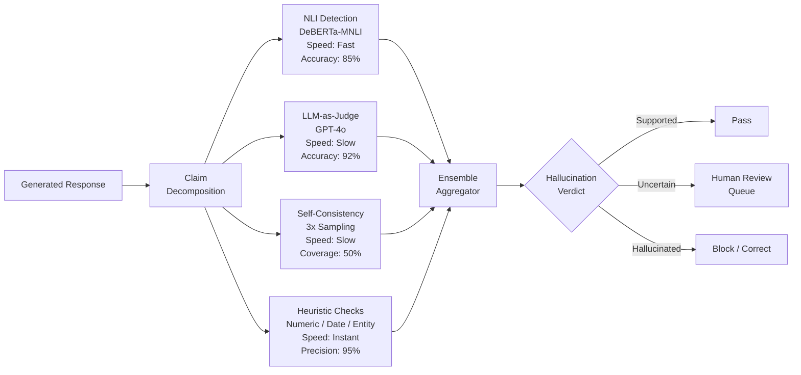

# Hallucination Detection and Mitigation

## 1. Overview

Hallucination is the most consequential failure mode in production LLM systems. A hallucinated response is one where the model generates text that is plausible-sounding but factually incorrect, unsupported by provided context, or entirely fabricated. In retrieval-augmented generation (RAG) systems, hallucination undermines the core value proposition: users expect answers grounded in their data, not confident-sounding fiction.

For Principal AI Architects, hallucination is not a single problem --- it is a family of failure modes with distinct causes, detection methods, and mitigation strategies. A medical AI that fabricates a drug dosage is a categorically different failure from a chatbot that attributes a quote to the wrong person. The detection and mitigation architecture must be tailored to the risk profile of the application.

**Key numbers that shape hallucination detection design:**
- Hallucination rates in RAG systems: 5--15% of responses contain at least one unsupported claim (GPT-4o class models with naive RAG)
- With advanced mitigation (reranking + constrained generation + post-hoc verification): 1--5%
- NLI-based detection accuracy: 80--90% for claim-level verification (cross-encoder NLI models)
- LLM-as-judge hallucination detection: 85--93% accuracy (GPT-4o, well-calibrated prompts)
- Vectara HHEM model accuracy: 87%+ on hallucination classification
- Self-consistency detection: catches 40--60% of hallucinations via answer-level disagreement
- Latency overhead for post-generation verification: 1--3 seconds per response (claim decomposition + NLI)
- Citation verification accuracy: 70--85% (checking whether cited sources actually support claims)

Hallucination detection is inherently a precision-recall tradeoff: aggressive detection catches more hallucinations (high recall) but also flags more correct outputs as hallucinated (low precision, false positives), frustrating users with unnecessary hedging or refusals. The architecture must be tuned to the application's risk tolerance.

---

## 2. Where It Fits in GenAI Systems

Hallucination detection operates at three layers: pre-generation (mitigation through better retrieval and prompting), inline (constrained generation), and post-generation (verification and correction). These layers are complementary, not alternatives.

```mermaid
flowchart TB
    subgraph "Pre-Generation Mitigation"
        QT[Query Transformation<br/>Reduce ambiguity] --> RET[High-Quality Retrieval<br/>Hybrid + Reranking]
        RET --> FILTER[Relevance Filtering<br/>Remove noisy context]
        FILTER --> PROMPT[Grounding Prompt<br/>"Only use provided sources"]
    end

    subgraph "Inline Detection"
        PROMPT --> LLM[LLM Generation<br/>with Constraints]
        LLM --> CITE[Citation Generation<br/>Inline Source Attribution]
        LLM --> CONF[Confidence Signals<br/>Verbalized Uncertainty]
    end

    subgraph "Post-Generation Verification"
        CITE --> DECOMP[Claim Decomposition<br/>Extract Atomic Claims]
        DECOMP --> NLI[NLI Verification<br/>Entailment Check vs. Context]
        DECOMP --> CITE_CHECK[Citation Verification<br/>Does source support claim?]
        NLI --> SCORE[Faithfulness Score<br/>0.0 -- 1.0]
        CITE_CHECK --> SCORE

        SCORE --> GATE{Score >= Threshold?}
        GATE -->|Pass| DELIVER[Deliver Response<br/>to User]
        GATE -->|Fail: Partial| HEDGE[Hedge Uncertain Claims<br/>Add Caveats]
        GATE -->|Fail: Severe| REGEN[Regenerate<br/>or Refuse]
    end

    subgraph "Feedback Loop"
        DELIVER --> USER_FB[User Feedback<br/>Thumbs Down / Flag]
        USER_FB --> DATASET[(Hallucination Examples<br/>Growing Test Set)]
        DATASET --> EVAL[Evaluation Pipeline<br/>Regression Testing]
    end
```

Hallucination detection interacts with these adjacent systems:
- **RAG pipeline** (upstream): Retrieval quality is the primary determinant of hallucination rate. Poor retrieval forces the LLM to generate from parametric memory, increasing hallucination risk. See [RAG Pipeline](../04-rag/01-rag-pipeline.md).
- **Retrieval and reranking** (upstream): Reranking reduces noise in retrieved context, directly lowering hallucination rates. See [Retrieval & Reranking](../04-rag/04-retrieval-reranking.md).
- **Evaluation frameworks** (measurement): Hallucination metrics (RAGAS faithfulness, DeepEval hallucination) are computed by evaluation frameworks. See [Eval Frameworks](./01-eval-frameworks.md).
- **Guardrails** (enforcement): Runtime guardrails enforce hallucination thresholds in production. See [Guardrails](../10-safety/01-guardrails.md).
- **LLM observability** (monitoring): Observability platforms track hallucination rates over time and alert on degradation. See [LLM Observability](./04-llm-observability.md).

---

## 3. Core Concepts

### 3.1 Taxonomy of Hallucinations

Understanding the different types of hallucination is essential because each type has different detection methods and mitigation strategies.

**Intrinsic hallucination (Contradiction)**

The generated output directly contradicts information in the provided source context.

Example:
- Context: "The company was founded in 2015 and has 500 employees."
- Output: "The company, founded in 2012, employs over 1,000 people."

Detection: NLI-based methods excel here because the contradiction is explicit. A cross-encoder NLI model can classify the relationship between the claim and the context as "entailment", "neutral", or "contradiction".

Risk level: Highest. The user has evidence (the source) that the LLM is wrong, destroying trust.

**Extrinsic hallucination (Fabrication)**

The generated output contains information that is neither supported nor contradicted by the provided context --- the model has fabricated additional "facts" from its parametric memory.

Example:
- Context: "The quarterly revenue was $50M."
- Output: "The quarterly revenue was $50M, representing a 15% year-over-year increase." (the YoY comparison is not in the context)

Detection: Harder than intrinsic hallucination. NLI classifies these as "neutral" (not entailed), which requires the system to treat "neutral" as a hallucination signal in high-fidelity settings. This is where claim-level verification becomes essential.

Risk level: High in regulated domains, medium in general use. Users may find the additional information helpful even if it's fabricated, creating a dangerous feedback loop where fabricated details are accepted as true.

**Factual hallucination (Wrong world knowledge)**

The generated output contains claims that are factually incorrect based on world knowledge, regardless of the provided context. This occurs when the model's parametric memory is outdated, incorrect, or confused.

Example:
- Query: "Who won the 2024 Nobel Prize in Physics?"
- Output: "The 2024 Nobel Prize in Physics was awarded to [wrong person]."

Detection: Requires external fact-checking against a knowledge base or search engine. The provided context may not cover the claim, so NLI against the context is insufficient.

Risk level: Domain-dependent. Critical in medical, legal, and financial applications. Less critical when the system is explicitly RAG-grounded and users understand the answer comes from provided documents.

**Semantic hallucination (Subtle distortion)**

The generated output preserves the general topic and some facts from the source but subtly distorts the meaning through:
- Incorrect attribution (assigns a quote or statistic to the wrong entity)
- Temporal distortion (mixes up time periods)
- Causal inversion (reverses cause and effect)
- Scope expansion (generalizes a specific finding beyond its scope)

Example:
- Context: "A 2023 study of 200 patients showed that Drug X reduced symptoms by 30%."
- Output: "Drug X has been proven to reduce symptoms by 30% in large-scale clinical trials." (exaggerates scope and certainty)

Detection: Most challenging type. Requires fine-grained semantic comparison between claims and sources. Simple NLI models often miss these. Multi-step claim decomposition + targeted NLI improves detection.

### 3.2 Detection Methods

#### NLI-Based Detection (Natural Language Inference)

The most established detection method. A cross-encoder NLI model classifies whether a claim is entailed by, contradicted by, or neutral with respect to the source context.

**Architecture:**
1. **Claim decomposition**: Break the generated response into atomic claims. Each claim should be a single, verifiable statement.
   - Input: "Paris, the capital of France, has a population of 2.1 million and is known for the Eiffel Tower."
   - Claims: ["Paris is the capital of France", "Paris has a population of 2.1 million", "Paris is known for the Eiffel Tower"]
2. **Pairwise NLI**: For each claim, run NLI against each retrieved context chunk.
   - Model: `microsoft/deberta-large-mnli`, `cross-encoder/nli-deberta-v3-large`, or Vectara HHEM.
   - Output: entailment probability, contradiction probability, neutral probability.
3. **Aggregation**: A claim is "supported" if any context chunk entails it with probability > threshold (typically 0.7). A claim is "hallucinated" if no chunk entails it and no chunk contradicts it (extrinsic) or if any chunk contradicts it (intrinsic).
4. **Response-level score**: `faithfulness = supported_claims / total_claims`.

**Performance characteristics:**
- Latency: 20--50ms per claim-context pair (GPU inference). 1--3 seconds total for a typical response (5--10 claims, 5--10 context chunks).
- Accuracy: 80--90% for binary hallucination detection (supported vs. not supported).
- Failure mode: NLI models struggle with domain-specific terminology, numerical reasoning, and multi-hop inferences.

#### Claim Decomposition + Verification

An extension of NLI-based detection that addresses multi-step reasoning and complex claims.

**Architecture:**
1. **Decomposition (LLM-based)**: Use GPT-4o or Claude to decompose the response into atomic, independently verifiable claims. The decomposition prompt must handle:
   - Coreference resolution: "He won the award" becomes "John Smith won the award."
   - Implicit claims: "The fastest algorithm" implies "This algorithm is faster than all other algorithms."
   - Conditional claims: "If X, then Y" should be decomposed into two verification targets.
2. **Evidence retrieval**: For each claim, retrieve the most relevant evidence from the context (or from an external knowledge base for factual hallucination detection).
3. **Verification (NLI or LLM-as-judge)**: Check each claim against its evidence. LLM-as-judge verification is more flexible than NLI models for complex claims but slower and more expensive.
4. **Aggregation with severity weighting**: Weight hallucination severity by the claim's importance. A hallucinated date is less severe than a hallucinated medical dosage.

#### Self-Consistency Detection

Exploit the stochastic nature of LLM generation: if the model is confident about a fact, it will produce consistent answers across multiple samplings. Inconsistency signals potential hallucination.

**Architecture:**
1. Generate N responses (typically 3--5) to the same query with temperature > 0.
2. Extract key claims from each response.
3. Check cross-response consistency: claims that appear in most responses are likely correct; claims that appear in only one response are suspect.
4. Flag inconsistent claims for additional verification.

**Strengths:**
- No external verifier needed --- uses the model's own uncertainty as a signal.
- Catches cases where the model is "making things up" differently each time.

**Limitations:**
- If the model consistently hallucinates the same wrong fact (common for well-known misconceptions in training data), self-consistency will not detect it.
- Adds N-1 additional LLM calls per query, increasing cost and latency by Nx.
- Does not work well with deterministic (temperature=0) generation.

#### Grounding Validation

Specifically designed for RAG systems, grounding validation checks whether generated claims are traceable to the retrieved source documents.

**Architecture:**
1. **Citation extraction**: Parse the generated response for inline citations (e.g., [1], [2]) or source references.
2. **Citation verification**: For each cited source, check whether the cited passage actually supports the claim it's attached to. Uses NLI or LLM-as-judge.
3. **Uncited claim detection**: Identify claims in the response that have no citation. These are candidates for fabrication from parametric memory.
4. **Source attribution scoring**: Compute what fraction of claims are properly cited and verified.

**Failure modes:**
- The LLM generates plausible-looking citations that don't match actual sources (citation hallucination).
- The LLM cites a source but distorts its content (misattribution).
- The LLM generates a correct fact from parametric memory but doesn't cite it because it's not in the context (correct but ungrounded).

### 3.3 Factual Consistency Scoring Methods

Beyond NLI, several automated metrics measure factual consistency:

**ROUGE-L / ROUGE-1**
- Measures n-gram overlap between generated output and source context.
- Cheap and fast but shallow: high ROUGE doesn't guarantee factual consistency (the model can rearrange words to create false claims), and low ROUGE doesn't guarantee hallucination (the model may correctly paraphrase).
- Use as a fast pre-filter, not as a primary hallucination detector.

**BERTScore**
- Computes token-level semantic similarity between generated output and source context using BERT embeddings.
- Better than ROUGE for paraphrased content but still measures surface similarity, not factual entailment.
- F1 BERTScore > 0.85 correlates moderately with faithfulness but has many false negatives.

**NLI Entailment Score**
- The probability that the source context entails the generated claim, from a trained NLI model.
- Most directly measures factual consistency.
- State-of-the-art models: DeBERTa-v3-large-MNLI, Vectara HHEM, TRUE (Google).

**FActScore (Min et al., 2023)**
- Decomposes biographical text into atomic facts and verifies each against a knowledge source (Wikipedia).
- Originally designed for evaluating factuality in long-form text generation.
- Metric: fraction of atomic facts that are supported by the knowledge source.
- The gold standard for factuality evaluation in research but requires a reliable knowledge source for verification.

**SelfCheckGPT (Manakul et al., 2023)**
- Uses self-consistency across multiple samples as a hallucination signal.
- No external knowledge needed --- entirely reference-free.
- Variants: SelfCheckGPT-BERTScore (compare sample similarity), SelfCheckGPT-NLI (cross-sample NLI), SelfCheckGPT-Prompt (LLM-based consistency check).

### 3.4 Citation Generation and Verification

Citation is both a mitigation strategy (encourages grounding) and a detection mechanism (enables verification).

**Citation generation approaches:**

| Approach | Description | Pros | Cons |
|----------|-------------|------|------|
| Prompt-instructed | System prompt instructs: "Cite sources using [1], [2]" | Simple, works with any LLM | Inconsistent citation quality, citation hallucination |
| Fine-tuned | Model trained on citation-annotated data | More reliable citations | Requires fine-tuning data |
| Post-hoc attribution | Separate model adds citations after generation | Decouples generation from attribution | Added latency, may not match LLM's actual reasoning |
| Retrieval-anchored | Each generated sentence must be anchored to a retrieved chunk | Strongest grounding guarantee | May over-constrain generation, reduce fluency |

**Citation verification pipeline:**
1. Parse generated output to extract (claim, citation_id) pairs.
2. Retrieve the cited source text.
3. Run NLI: does the source entail the claim?
4. Classification:
   - **Verified**: Source entails the claim (correct citation).
   - **Misattributed**: Source does not entail the claim (wrong citation, right claim).
   - **Fabricated citation**: Citation ID doesn't map to any source.
   - **Unsupported**: Claim has no citation and is not entailed by any source.

### 3.5 Confidence Calibration

LLMs are notoriously poorly calibrated --- they express high confidence even when wrong. Improving calibration helps users assess response reliability.

**Verbalized confidence:**
- Prompt the LLM to express its confidence: "Rate your confidence in this answer from 1--10 and explain why."
- Research shows verbalized confidence has moderate correlation (r = 0.3--0.5) with actual accuracy, but can be improved with:
  - Chain-of-thought reasoning before confidence assessment.
  - Calibration training (few-shot examples of correct confidence assignments).
  - Decomposed confidence (per-claim confidence rather than per-response).

**Token-level probability analysis:**
- Use log-probabilities from the LLM to identify low-confidence tokens.
- Tokens with high entropy (low probability assigned to any single token) signal uncertainty.
- Limitation: Not available from all API providers (OpenAI provides logprobs, Anthropic does not as of early 2025).

**Ensemble-based calibration:**
- Generate multiple responses and measure agreement.
- Higher agreement correlates with higher accuracy.
- Compute a calibration curve: bin responses by predicted confidence, measure actual accuracy in each bin, adjust the confidence mapping to flatten the calibration curve.

### 3.6 Hallucination Benchmarks

| Benchmark | Focus | Size | Evaluation Method |
|-----------|-------|------|------------------|
| **HaluEval** (Li et al., 2023) | QA, summarization, dialogue hallucination | 35K samples | Binary classification: hallucinated vs. correct |
| **TruthfulQA** (Lin et al., 2022) | Questions where LLMs commonly hallucinate | 817 questions | Multi-choice + open-ended; measures informativeness + truthfulness |
| **FActScore** (Min et al., 2023) | Biographical fact verification | 500+ biographies | Per-atomic-fact verification against Wikipedia |
| **SummEval** (Fabbri et al., 2021) | Summarization consistency | 1,600 summaries | Human + automated consistency scoring |
| **BEGIN** (Dziri et al., 2022) | Knowledge-grounded dialogue | 8,000+ dialogues | Entailment-based faithfulness scoring |
| **FELM** (Chen et al., 2023) | Fine-grained factual error localization | 847 responses | Per-segment error annotation across 5 domains |

### 3.7 Post-Generation Fact-Checking Pipelines

For high-stakes applications, a dedicated fact-checking pipeline processes every response before delivery.

**Architecture:**

```
Response --> Claim Decomposition --> Evidence Retrieval --> Claim Verification --> Response Annotation
```

**Step 1: Claim Decomposition**
- LLM extracts atomic claims from the response.
- Filter out subjective opinions, hedged statements ("may", "might"), and meta-statements ("Based on the context...").
- Typical response yields 3--15 atomic claims.

**Step 2: Evidence Retrieval**
- For each claim, search the RAG corpus (same retrieval pipeline used for generation, or a dedicated verification index).
- Optionally, search external knowledge bases (Wikipedia, domain databases) for factual hallucination detection.
- Retrieve top-3 evidence passages per claim.

**Step 3: Claim Verification**
- Run NLI (cross-encoder) or LLM-as-judge to classify each claim as supported/unsupported/contradicted.
- For numerical claims, apply exact-match verification where possible.
- For temporal claims, verify date consistency.

**Step 4: Response Annotation**
- **Fully supported**: Deliver the response as-is.
- **Partially supported**: Annotate unsupported claims with hedging language ("This information could not be verified against the provided sources") or remove them.
- **Contradicted**: Correct the claim using the evidence, or refuse to answer and explain the contradiction.

---

## 4. Architecture

### 4.1 Production Hallucination Detection and Mitigation Pipeline

```mermaid
flowchart TB
    subgraph "Pre-Generation Layer"
        QUERY[User Query] --> QT[Query Transform<br/>Reduce Ambiguity]
        QT --> RETRIEVE[Hybrid Retrieval<br/>Dense + Sparse + Rerank]
        RETRIEVE --> REL_FILTER{Relevance Score<br/>>= 0.5?}
        REL_FILTER -->|No Relevant Docs| REFUSE[Refuse or Escalate<br/>"I don't have information on this"]
        REL_FILTER -->|Yes| CTX_PREP[Context Preparation<br/>Dedup + Order + Cite IDs]
    end

    subgraph "Generation Layer"
        CTX_PREP --> PROMPT[Grounding Prompt<br/>"Answer ONLY from sources.<br/>Cite with brackets.<br/>Say 'I don't know' if unsure."]
        PROMPT --> LLM[LLM Generation<br/>Temperature = 0]
        LLM --> RAW[Raw Response<br/>with Citations]
    end

    subgraph "Post-Generation Verification"
        RAW --> DECOMP[Claim Decomposer<br/>Extract Atomic Claims]
        DECOMP --> CLAIMS[Claims List<br/>5--15 per response]

        CLAIMS --> NLI_CHECK[NLI Verifier<br/>DeBERTa / HHEM]
        CLAIMS --> CITE_CHECK[Citation Verifier<br/>Source vs. Claim Match]

        NLI_CHECK --> SCORE_AGG[Score Aggregator]
        CITE_CHECK --> SCORE_AGG

        SCORE_AGG --> FAITH{Faithfulness<br/>>= 0.85?}
        FAITH -->|High Confidence| DELIVER[Deliver Response]
        FAITH -->|Medium 0.6--0.85| HEDGE[Hedge Uncertain Claims<br/>Add Caveats + Warnings]
        FAITH -->|Low < 0.6| REGEN[Regenerate with<br/>Stricter Constraints]
        REGEN --> LLM
    end

    subgraph "Monitoring & Feedback"
        DELIVER --> LOG[Log to Observability<br/>Faithfulness Score + Trace]
        HEDGE --> LOG
        LOG --> DASHBOARD[Hallucination Dashboard<br/>Rate Trends + Drill-down]
        LOG --> ALERT{Rate > 10%?}
        ALERT -->|Yes| ONCALL[Page On-Call<br/>Investigate Regression]
    end
```

### 4.2 Multi-Strategy Detection Architecture



---

## 5. Design Patterns

### Pattern 1: Retrieve-Ground-Verify (Standard RAG Hallucination Mitigation)
- **When**: Default pattern for all production RAG systems.
- **How**: (1) Retrieve with high-quality hybrid search + reranking. (2) Ground the LLM with explicit instructions to use only retrieved context. (3) Verify the response post-generation with NLI or LLM-as-judge.
- **Hallucination reduction**: 50--70% reduction compared to ungrounded generation.
- **Latency overhead**: 1--3 seconds for post-generation verification.

### Pattern 2: Cite-then-Verify (Citation-Centric Detection)
- **When**: Applications where source attribution is a product requirement (legal research, medical Q&A, compliance).
- **How**: Instruct the LLM to cite sources for every claim. Post-process to verify each citation. Reject or hedge claims with invalid citations.
- **Benefit**: Provides verifiable audit trail. Users can check sources themselves.
- **Risk**: Citation hallucination --- the LLM generates plausible but fabricated citation IDs. Mitigate by constraining citation IDs to the actual source list in the prompt.

### Pattern 3: Self-Reflection Loop (Self-RAG / CRAG)
- **When**: High-stakes applications where false confidence is costly; complex queries where single-pass generation is unreliable.
- **How**: After initial generation, the LLM evaluates its own response: "Does this response faithfully represent the provided sources? Are there any claims I'm uncertain about?" If uncertainty is detected, the system retrieves additional context and regenerates.
- **Latency**: 2--4x the single-pass generation time.
- **Paper basis**: Self-RAG (Asai et al., 2023), CRAG (Yan et al., 2024).

### Pattern 4: Claim-Level Confidence Surfacing
- **When**: Applications where partial accuracy is acceptable and users benefit from knowing which claims are uncertain.
- **How**: Decompose the response into claims. Score each claim. Display confidence indicators (color coding, confidence badges, or explicit hedging language) to the user.
- **UX**: "Based on the provided documents, the project deadline is March 15 [High Confidence]. The estimated budget appears to be $2.5M [Medium Confidence --- only one source mentions this]."

### Pattern 5: Multi-Model Verification (Cross-Check)
- **When**: Highest-stakes applications (medical advice, legal guidance, financial analysis).
- **How**: Generate the response with one model. Verify claims using a different model family (e.g., generate with Claude, verify with GPT-4o). Different model families have different hallucination patterns, so cross-checking catches single-model blind spots.
- **Cost**: 2x or more generation cost. Reserve for critical applications.

### Pattern 6: Constrained Generation (Reduce Hallucination at Source)
- **When**: Structured output tasks where the answer space is bounded (extracting specific fields, choosing from options, yes/no with citation).
- **How**: Use structured output (JSON schema, function calling) to constrain what the LLM can generate. Force the model to select from retrieved values rather than generating freely.
- **Example**: Instead of "What is the contract value?" (open-ended), use function calling: `extract_contract_value(amount: float, currency: str, source_page: int)` where amount must come from the retrieved context.

---

## 6. Implementation Approaches

### 6.1 Detection Tool Comparison

| Tool / Model | Type | Detection Method | Latency | Accuracy | Open Source |
|-------------|------|-----------------|---------|----------|-------------|
| **Vectara HHEM** | Cross-encoder model | NLI fine-tuned for hallucination | ~30ms/pair (GPU) | 87%+ | Yes (HuggingFace) |
| **DeBERTa-v3-large-MNLI** | Cross-encoder model | General NLI | ~20ms/pair (GPU) | 82--88% | Yes |
| **Patronus Lynx** | Specialized model | Fine-tuned hallucination classifier | ~50ms/pair (API) | 90%+ (claimed) | No (API) |
| **RAGAS Faithfulness** | Framework metric | LLM-based claim decomposition + NLI | 2--5s/sample | 85--90% | Yes |
| **DeepEval Hallucination** | Framework metric | LLM-based contradiction detection | 2--5s/sample | 85--90% | Yes |
| **TruLens Groundedness** | Feedback function | LLM-based claim-context matching | 2--5s/sample | 83--88% | Yes |
| **SelfCheckGPT** | Method | Multi-sample consistency | Nx generation time | 70--80% | Yes |
| **GPT-4o as Judge** | LLM-as-judge | Custom verification prompt | 1--3s/sample | 90--93% | No (API) |

### 6.2 Implementation Decision Tree

```
Is this a RAG system?
├── Yes
│   ├── Do you have source context for every response?
│   │   ├── Yes --> NLI-based detection (HHEM / DeBERTa) + Citation verification
│   │   └── No --> Self-consistency + External fact-checking
│   └── What is your risk tolerance?
│       ├── Low (medical, legal, financial) --> Multi-model verification + Human review queue
│       ├── Medium (enterprise Q&A) --> NLI verification + LLM-as-judge
│       └── High (chatbot, creative) --> Lightweight NLI + confidence thresholds
└── No (open-domain generation)
    ├── Factual claims important? --> External fact-checking (search + NLI)
    └── Creative/conversational? --> Self-consistency + toxicity checks only
```

### 6.3 Mitigation Strategy Priority Order

For maximum hallucination reduction per engineering effort:

1. **Improve retrieval quality** (highest impact, no latency cost): Better chunking, hybrid search, reranking, relevance filtering. Typically reduces hallucination by 30--50%.
2. **Grounding prompts** (high impact, no latency cost): Explicit instructions to use only provided context, say "I don't know" when unsure, cite sources.
3. **Temperature = 0** (medium impact, no cost): Reduces variability and random fabrication.
4. **Post-generation NLI verification** (medium impact, 1--3s latency): Catches remaining hallucinations. Can be async for non-blocking UX.
5. **Citation generation + verification** (medium impact, moderate complexity): Creates verifiable responses and enables automated checking.
6. **Self-reflection loops** (high impact, 2--4x latency): For critical queries, the quality improvement justifies the latency.
7. **Multi-model cross-checking** (highest accuracy, highest cost): Reserve for applications where hallucination has severe consequences.

---

## 7. Tradeoffs

### Detection Strategy Tradeoffs

| Decision | Option A | Option B | Key Tradeoff |
|----------|----------|----------|--------------|
| Detection method | NLI model (HHEM/DeBERTa) | LLM-as-judge (GPT-4o) | Speed + cost ($0.001/check) vs. accuracy + flexibility ($0.02/check) |
| Detection granularity | Response-level | Claim-level | Speed vs. precision in identifying which claims are problematic |
| Detection timing | Synchronous (block response) | Asynchronous (log + alert) | User safety vs. latency impact |
| False positive handling | Refuse on uncertain | Hedge with caveats | Safety vs. user experience (over-refusal frustrates users) |
| Self-consistency | Skip | 3--5 samples | Cost + latency vs. catching consistent-looking hallucinations |
| Verification scope | Retrieved context only | Context + external KB | Speed vs. catching factual hallucinations beyond the corpus |

### Mitigation Strategy Tradeoffs

| Decision | Option A | Option B | Key Tradeoff |
|----------|----------|----------|--------------|
| Generation constraint | Free-form generation | Structured output / constrained | Fluency + flexibility vs. hallucination reduction |
| Retrieval threshold | Low (include borderline chunks) | High (strict relevance) | Recall (more information available) vs. precision (less noise) |
| Refusal behavior | Refuse if uncertain | Always attempt an answer | Safety vs. helpfulness |
| Citation requirement | Optional | Mandatory for all claims | User experience vs. verifiability |
| Temperature | 0 (deterministic) | 0.3--0.7 (some creativity) | Consistency vs. diversity and naturalness |

---

## 8. Failure Modes

### 8.1 Confident Hallucination
**Symptom**: The model generates entirely fabricated information with high confidence, no hedging, and plausible-looking citations.
**Cause**: Strong language model priors override weak context signals. Particularly common when retrieved context is tangentially related but doesn't contain the answer.
**Mitigation**: Enforce "I don't know" behavior when retrieval confidence is low. Train or fine-tune the model on examples of appropriate refusal. Use high-threshold relevance filtering to prevent noisy context from reaching the LLM.

### 8.2 Citation Hallucination
**Symptom**: The model generates citation markers (e.g., [1], [2]) that don't correspond to actual sources, or cites a real source but misrepresents its content.
**Cause**: The model has learned the pattern of citing sources but treats citation IDs as stylistic elements rather than semantic pointers.
**Mitigation**: Constrain citation IDs to only those present in the prompt. Post-process to verify every citation. Use retrieval-anchored generation where each sentence must link to a specific chunk.

### 8.3 Partial Hallucination
**Symptom**: The response is mostly correct but contains one or two fabricated details embedded in otherwise accurate content.
**Cause**: The model fills in gaps in the context with parametric knowledge, blending retrieved facts with generated ones seamlessly.
**Mitigation**: Claim-level decomposition and verification (not just response-level scoring). Per-claim confidence indicators in the UI.

### 8.4 Hallucination Cascade in Multi-Turn
**Symptom**: An early hallucination in a conversation is treated as fact in subsequent turns, creating compounding errors.
**Cause**: The conversation history contains the hallucination, and the model treats its own prior output as authoritative context.
**Mitigation**: Re-ground every turn against the source documents, not just the conversation history. Apply verification to each turn before adding it to the context.

### 8.5 Adversarial Hallucination Induction
**Symptom**: Deliberately crafted queries trick the model into hallucinating specific false information.
**Cause**: Prompt injection or adversarial queries that exploit model biases (e.g., "Tell me about the famous 1987 Supreme Court case Smith v. Jones" when no such case exists --- the model invents details).
**Mitigation**: Input validation to detect adversarial patterns. High-threshold verification that refuses to generate when no supporting context is found. Adversarial test cases in the evaluation suite.

### 8.6 Detection False Positives (Over-Refusal)
**Symptom**: The hallucination detection system flags correct outputs as hallucinated, causing the system to refuse or hedge unnecessarily. Users find the system unhelpfully cautious.
**Cause**: NLI model misclassifies correct paraphrases as "neutral" (not entailed). Overly strict thresholds. Domain-specific terminology not in the NLI model's training data.
**Mitigation**: Calibrate detection thresholds on domain-specific data. Use claim-level detection (more precise than response-level). Implement a human review queue for borderline cases. Track user satisfaction alongside hallucination metrics.

---

## 9. Optimization Techniques

### 9.1 Detection Speed Optimization
- **Tiered detection**: Run fast heuristic checks first (entity matching, date consistency, numeric extraction). Only run expensive NLI or LLM-as-judge on claims that pass heuristic checks.
- **Batched NLI inference**: Process multiple claim-context pairs in a single GPU batch. Reduces per-claim latency from 30ms to ~5ms at batch sizes of 16--32.
- **Model distillation**: Distill a large NLI model (DeBERTa-large) into a smaller model (DeBERTa-base or MiniLM) for 3--5x speedup with ~2--3% accuracy loss.
- **Async verification**: For non-blocking UX, deliver the response immediately and run verification asynchronously. If hallucination is detected, send a correction notification.

### 9.2 Detection Accuracy Optimization
- **Domain-specific NLI fine-tuning**: Fine-tune the NLI model on domain-specific hallucination examples. Even 500--1,000 labeled examples significantly improve accuracy in specialized domains (legal, medical, financial).
- **Multi-model ensemble**: Combine NLI model scores with LLM-as-judge scores. Take the union of detected hallucinations (high recall) or the intersection (high precision) depending on risk tolerance.
- **Claim decomposition refinement**: Use domain-specific decomposition rules. For numerical claims, extract the number and unit for exact matching. For temporal claims, extract dates for calendar validation.
- **Calibrated thresholds**: Tune the entailment probability threshold per domain on a labeled validation set. The optimal threshold varies significantly across domains (0.6 for informal Q&A vs. 0.85 for medical).

### 9.3 Mitigation Effectiveness Optimization
- **Retrieval quality investment**: Every 10% improvement in retrieval recall@10 translates to approximately 5--8% reduction in hallucination rate. This is typically the highest-ROI optimization.
- **Prompt engineering for grounding**: Test multiple grounding prompt variants. The difference between a good and bad grounding prompt can be 10--20% in faithfulness. Key elements: explicit refusal instruction, citation requirement, context-only constraint, example of correct refusal.
- **Adaptive response length**: Shorter responses hallucinate less. For factual queries, instruct the model to be concise. Reserve long-form generation for queries where the context supports detailed answers.
- **Confidence-gated detail**: Allow the model to provide detailed answers for high-confidence claims and brief answers for low-confidence claims, rather than uniformly hedging.

---

## 10. Real-World Examples

### Perplexity AI (Citation-Grounded Search)
Perplexity built their product around citation-grounded generation as the primary hallucination mitigation strategy. Every claim in their responses is linked to a specific web source. They implemented a multi-stage pipeline: web search, content extraction, relevance filtering, generation with mandatory citation, and post-generation citation verification. Their architecture demonstrates that citation can be both a user-facing feature and a hallucination detection mechanism. When the verification layer detects unsupported claims, the system either removes them or hedges with uncertainty language.

### Vectara (HHEM and Hallucination Leaderboard)
Vectara developed the Hughes Hallucination Evaluation Model (HHEM), a cross-encoder specifically trained on hallucination detection for RAG. They open-sourced the model on HuggingFace and maintain a public Hallucination Leaderboard ranking LLMs by their tendency to hallucinate in RAG settings. Their approach demonstrated that purpose-built hallucination detection models outperform general-purpose NLI models. HHEM is integrated into Vectara's RAG platform as a real-time quality gate, blocking responses that fall below a configurable faithfulness threshold.

### Google (Attributed QA and SAFE)
Google Research published the Search-Augmented Factuality Evaluator (SAFE), which uses a multi-step process: decompose the response into individual facts, generate search queries for each fact, evaluate whether search results support the fact. SAFE demonstrated superhuman fact-checking accuracy at 1/20th the cost of human annotators. Google applies similar principles in their Bard/Gemini products, where the "Google It" button allows users to verify claims against search results. Their production system combines multiple detection signals: NLI-based verification, search-based fact-checking, and self-consistency checks.

### Anthropic (Constitutional AI and Honest Responses)
Anthropic's approach to hallucination mitigation is architectural, built into the model training process itself through Constitutional AI (CAI). They train Claude to express uncertainty appropriately, refuse to answer when it lacks confidence, and distinguish between information from provided context versus parametric knowledge. Their RLHF (Reinforcement Learning from Human Feedback) training specifically penalizes confident hallucination. At inference time, Claude's system prompts reinforce grounding behavior, and Anthropic's evaluation infrastructure continuously monitors hallucination rates across model versions.

### Glean (Enterprise Knowledge Grounding)
Glean's enterprise search and AI assistant implements a defense-in-depth hallucination mitigation strategy. They combine: (1) enterprise-grade retrieval across all connected data sources (Slack, Google Drive, Confluence, etc.), (2) permission-aware context filtering (users only see answers grounded in documents they have access to), (3) mandatory source attribution with clickable links to original documents, and (4) confidence scoring that determines whether to answer, hedge, or refuse. Their architecture demonstrates that in enterprise RAG, access control and hallucination prevention are deeply intertwined.

---

## 11. Related Topics

- [LLM Evaluation Frameworks](./01-eval-frameworks.md) --- Hallucination metrics are a core component of evaluation; frameworks provide the infrastructure for measuring them.
- [RAG Pipeline Architecture](../04-rag/01-rag-pipeline.md) --- Retrieval quality is the primary lever for reducing hallucination in RAG systems.
- [Retrieval & Reranking](../04-rag/04-retrieval-reranking.md) --- Reranking directly reduces hallucination by improving context quality.
- [Guardrails and Safety](../10-safety/01-guardrails.md) --- Runtime hallucination detection is a guardrail; this document covers the detection methods.
- [LLM Observability](./04-llm-observability.md) --- Monitoring hallucination rates in production requires observability infrastructure.
- [LLM Benchmarks](./03-benchmarks.md) --- TruthfulQA, HaluEval, and FActScore are the primary hallucination benchmarks.

---

## 12. Source Traceability

| Concept | Primary Source |
|---------|---------------|
| Hallucination taxonomy (intrinsic, extrinsic) | Ji et al., "Survey of Hallucination in Natural Language Generation" (2023) |
| NLI-based faithfulness detection | Honovich et al., "TRUE: Re-evaluating Factual Consistency Evaluation" (2022) |
| Claim decomposition + verification | Min et al., "FActScore: Fine-grained Atomic Evaluation of Factual Precision" (2023) |
| Self-consistency detection | Wang et al., "Self-Consistency Improves Chain of Thought Reasoning" (2023); Manakul et al., "SelfCheckGPT" (2023) |
| SelfCheckGPT variants | Manakul et al., "SelfCheckGPT: Zero-Resource Black-Box Hallucination Detection" (2023) |
| Self-RAG | Asai et al., "Self-RAG: Learning to Retrieve, Generate, and Critique" (2023) |
| Corrective RAG (CRAG) | Yan et al., "Corrective Retrieval Augmented Generation" (2024) |
| RAGAS faithfulness metric | Es et al., "RAGAS: Automated Evaluation of Retrieval Augmented Generation" (2023) |
| Vectara HHEM | Vectara, "Hughes Hallucination Evaluation Model" (2023); HuggingFace model card |
| TruthfulQA benchmark | Lin et al., "TruthfulQA: Measuring How Models Mimic Human Falsehoods" (2022) |
| HaluEval benchmark | Li et al., "HaluEval: A Large-Scale Hallucination Evaluation Benchmark" (2023) |
| FActScore benchmark | Min et al., "FActScore: Fine-grained Atomic Evaluation of Factual Precision" (2023) |
| Google SAFE | Wei et al., "Long-form Factuality in Large Language Models" (2024) |
| Confidence calibration | Kadavath et al., "Language Models (Mostly) Know What They Know" (2022) |
| Citation generation patterns | Gao et al., "Enabling Large Language Models to Generate Text with Citations" (2023) |
| Constitutional AI for honesty | Bai et al., "Constitutional AI: Harmlessness from AI Feedback" (2022) |
