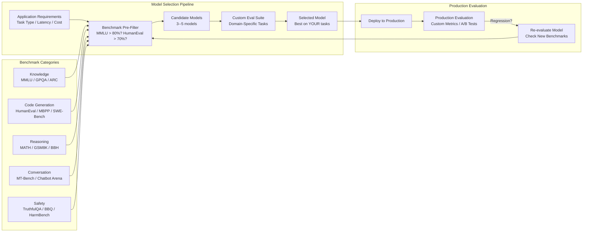
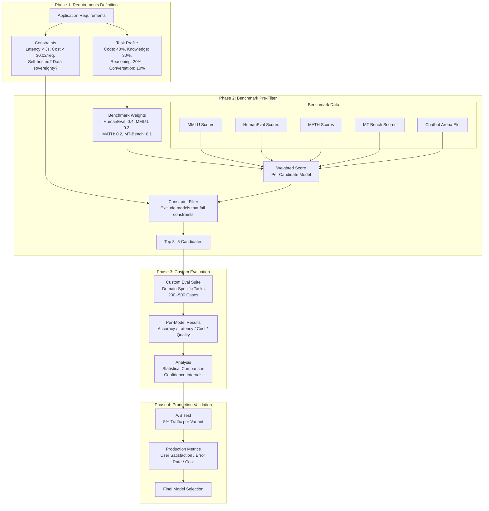
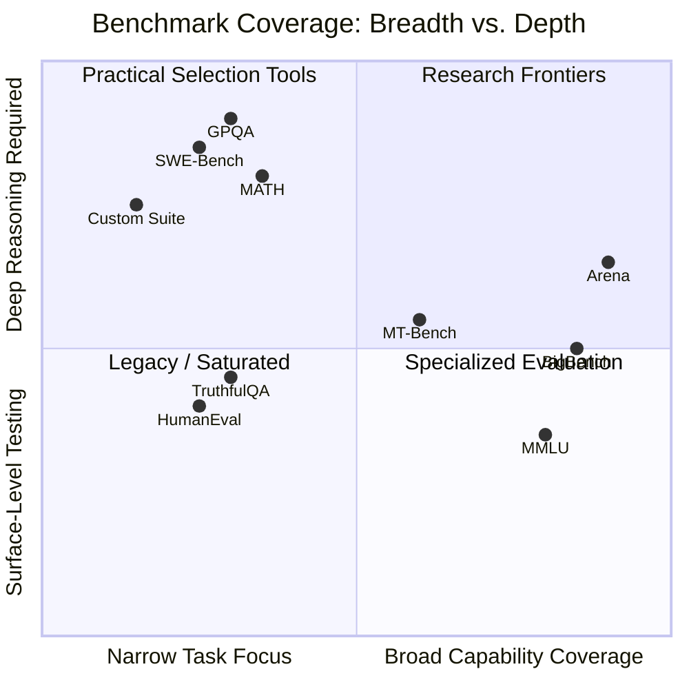

# LLM Benchmarks

## 1. Overview

LLM benchmarks are standardized evaluation tasks designed to measure model capabilities across dimensions such as reasoning, knowledge, coding, mathematics, and conversation quality. They serve as the common language for comparing models --- when a model card says "achieves 90.2% on MMLU," every practitioner understands the claim's scope and significance. However, benchmarks are simultaneously indispensable and deeply flawed: they are necessary for model selection and progress tracking, but they systematically fail to predict real-world application performance.

For Principal AI Architects, the critical skill is not memorizing benchmark scores but understanding what each benchmark actually measures, how it can be gamed or contaminated, and how to bridge the gap between benchmark performance and production performance. A model that tops the MMLU leaderboard may underperform a lower-ranked model on your specific enterprise task because MMLU measures breadth of knowledge, not depth in your domain.

**Key numbers that shape benchmark-related decisions:**
- MMLU accuracy range (leading models, early 2025): 85--92% (GPT-4o, Claude 3.5 Sonnet, Gemini 1.5 Pro)
- MMLU accuracy range (open-weight models): 75--85% (Llama 3.1 70B, Mixtral 8x22B, Qwen2 72B)
- HumanEval pass@1 (leading models): 85--95%
- MT-Bench average score (leading models): 8.5--9.2 out of 10
- Chatbot Arena Elo spread between top-10 models: ~50 Elo points (statistically significant but practically small)
- Benchmark-to-production correlation: r = 0.4--0.6 for general-purpose tasks, r = 0.1--0.3 for domain-specific tasks
- Estimated benchmark contamination in top models: 5--15% of common benchmarks appear in training data (various studies)
- Time from benchmark release to saturation: 6--18 months for most benchmarks (leading models approach ceiling)
- Custom eval suite development cost: 2--6 engineering weeks for a domain-specific 500-case suite

The benchmark landscape is evolving from static, multiple-choice knowledge tests toward dynamic, open-ended evaluations (Chatbot Arena, live coding challenges, agentic task benchmarks). This shift reflects the recognition that real-world LLM performance is about judgment, instruction-following, and tool use --- not just factual recall.

---

## 2. Where It Fits in GenAI Systems

Benchmarks inform two key architectural decisions: model selection (which model to use for which task) and capability validation (can the model handle the reasoning complexity your application requires). They sit upstream of production evaluation, providing a pre-filter before you invest in building application-specific evaluation suites.

Benchmarks connect to these adjacent systems:
- **Evaluation frameworks** (downstream): Evaluation frameworks implement the tooling that runs benchmark tests and custom evaluations. See [Eval Frameworks](./01-eval-frameworks.md).
- **Model selection** (consumer): Benchmark scores are the primary input to model selection decisions. See [Model Selection](../03-model-strategies/01-model-selection.md).
- **LLM landscape** (context): Understanding the LLM landscape requires interpreting benchmark results across model families. See [LLM Landscape](../01-foundations/02-llm-landscape.md).
- **LLM observability** (production): Production performance metrics complement benchmark scores, revealing where benchmarks predict well and where they diverge. See [LLM Observability](./04-llm-observability.md).

---

## 3. Core Concepts

### 3.1 MMLU (Massive Multitask Language Understanding)

MMLU (Hendrycks et al., 2021) is the most widely cited knowledge benchmark, testing a model's breadth of knowledge across 57 academic subjects spanning STEM, humanities, social sciences, and professional domains.

**Structure:**
- 15,908 four-choice multiple-choice questions.
- 57 subjects: abstract algebra, anatomy, astronomy, business ethics, clinical knowledge, college biology/chemistry/mathematics/physics, computer science, econometrics, electrical engineering, global facts, high school biology/chemistry/geography/government/macroeconomics/mathematics/microeconomics/physics/psychology/statistics/US history/world history, human aging, human sexuality, international law, jurisprudence, logical fallacies, machine learning, management, marketing, medical genetics, miscellaneous, moral disputes, moral scenarios, nutrition, philosophy, prehistory, professional accounting/law/medicine/psychology, public relations, security studies, sociology, US foreign policy, virology, world religions.
- Difficulty ranges from high school to professional level.
- Few-shot evaluation: typically 5-shot (model sees 5 examples per subject before answering).

**What it actually measures:**
- Breadth of factual knowledge encoded in model weights.
- Ability to parse multiple-choice questions and select the correct option.
- Domain-specific knowledge retention from pre-training data.

**What it does NOT measure:**
- Reasoning depth beyond what multiple-choice format requires.
- Multi-step problem solving (most questions are single-step recall or application).
- Open-ended generation quality, instruction following, or conversational ability.
- Performance on tasks that require combining knowledge across subjects.

**Limitations and criticisms:**
- **Format bias**: Models optimized for multiple-choice (through instruction tuning on multiple-choice data) can inflate scores without genuine understanding. Some models learn to exploit statistical patterns in answer choices (e.g., answer "C" is slightly more likely to be correct in certain subjects).
- **Saturation**: Leading models (GPT-4o, Claude 3.5 Sonnet, Gemini 1.5 Pro) score 85--92%, leaving little room for differentiation. Improvements from 89% to 91% are within noise margins for many subjects.
- **Contamination**: MMLU questions have been publicly available since 2021. It is increasingly likely that training data for newer models contains MMLU questions or very similar content, inflating scores.
- **Cultural/language bias**: Questions are English-only and reflect US/Western academic curricula. Performance on MMLU does not predict multilingual or cross-cultural knowledge.

**MMLU-Pro (2024)**: An updated version addressing MMLU's limitations:
- 10 answer choices instead of 4 (reduces random guessing advantage from 25% to 10%).
- Harder questions requiring more reasoning.
- Reduced contamination through new question generation.
- Leading models score 10--15% lower on MMLU-Pro than on MMLU.

### 3.2 HumanEval (Code Generation)

HumanEval (Chen et al., 2021) is the standard benchmark for evaluating LLM code generation ability, published by OpenAI alongside Codex.

**Structure:**
- 164 hand-crafted Python programming problems.
- Each problem provides a function signature and docstring.
- The model generates the function body.
- Evaluation: the generated code is executed against hidden unit tests. A solution passes if it produces correct output for all test cases.

**Metrics:**
- **pass@1**: Fraction of problems solved correctly on the first attempt (temperature=0). The headline metric.
- **pass@k**: Fraction of problems solved correctly in at least one of k attempts (temperature > 0). Measures the model's ability to generate diverse solutions, at least one of which is correct.
- **pass@10**: Commonly reported; shows the upper bound of what the model can produce with sampling.

**Current scores (early 2025):**
- GPT-4o: ~92% pass@1
- Claude 3.5 Sonnet: ~93% pass@1
- Gemini 1.5 Pro: ~87% pass@1
- Llama 3.1 70B: ~80% pass@1
- GPT-4o-mini: ~87% pass@1

**Limitations:**
- **Problem difficulty**: Most HumanEval problems are LeetCode easy/medium level. They test basic algorithm implementation, not real-world software engineering (debugging, understanding large codebases, API design, testing).
- **Contamination**: HumanEval problems are widely circulated. Models may have been trained on solutions to these exact problems.
- **Python only**: Does not evaluate code generation in other languages.
- **Single-function scope**: Real-world code generation involves multi-file projects, dependency management, and integration with existing code.

**Extended benchmarks:**
- **MBPP** (Austin et al., 2021): 974 crowd-sourced Python problems. Broader coverage but lower quality than HumanEval.
- **HumanEval+** (Liu et al., 2024): Adds 80x more test cases per problem, reducing false positives from under-tested solutions.
- **SWE-Bench** (Jimenez et al., 2024): Tests the ability to resolve real GitHub issues in real repositories. Far more realistic than HumanEval but much harder to evaluate consistently. Leading models solve 20--40% of SWE-Bench Lite issues.
- **LiveCodeBench** (Jain et al., 2024): Uses newly released competitive programming problems to avoid contamination. Updated monthly.

### 3.3 MT-Bench (Multi-Turn Conversation Quality)

MT-Bench (Zheng et al., 2023) evaluates conversational AI quality through multi-turn dialogues scored by an LLM judge.

**Structure:**
- 80 multi-turn questions across 8 categories: writing, roleplay, extraction, reasoning, math, coding, knowledge I (STEM), knowledge II (humanities/social science).
- Each question has two turns: an initial prompt and a follow-up that builds on the first turn.
- The model's responses are scored by GPT-4 as judge on a 1--10 scale.

**Evaluation protocol:**
1. The model generates responses to both turns.
2. GPT-4 reads the conversation and assigns a score (1--10) for each turn.
3. Scores are averaged across all questions and turns.

**Scoring characteristics:**
- Top models score 8.5--9.2.
- The scoring distribution is compressed: the difference between rank 1 and rank 10 is often < 1 point on the 10-point scale.
- Category-level analysis reveals meaningful differences: a model might excel at coding (9.5) but struggle with math (7.0).

**Strengths:**
- Tests multi-turn conversation ability, which single-turn benchmarks miss.
- Uses LLM-as-judge, enabling automated evaluation of open-ended responses.
- Categories cover diverse real-world use cases.

**Limitations:**
- **Judge bias**: GPT-4 as judge has known biases (verbosity preference, position bias, self-enhancement). Using GPT-4 to judge GPT-4 outputs creates circular evaluation.
- **Small test set**: Only 80 questions. Statistical noise is high --- a single bad response can shift the average by 0.1 points.
- **No reference answers**: The judge scores based on its own judgment, not against a gold standard. This makes scores less reproducible.
- **Score ceiling**: Leading models are approaching the ceiling (9+), reducing the benchmark's discriminative power.

### 3.4 Chatbot Arena (LMSYS Elo Rating)

Chatbot Arena, operated by LMSYS, is the most credible evaluation of real-world LLM preference through crowdsourced pairwise comparison.

**Architecture:**
1. A user submits a prompt on the Chatbot Arena website.
2. Two anonymous models generate responses side-by-side.
3. The user votes for which response they prefer (or declares a tie).
4. Elo ratings are updated based on the vote (a win against a higher-rated model earns more points than a win against a lower-rated model).
5. Model identities are revealed after voting to prevent brand bias.

**Key properties:**
- **Live, dynamic evaluation**: New models are added continuously. The leaderboard reflects current user preferences, not static test results.
- **Diverse user population**: Prompts come from real users with real needs, covering a broader distribution than curated benchmarks.
- **Preference-based**: Measures what users actually prefer, not what a rubric defines as "correct."
- **Statistical robustness**: Hundreds of thousands of votes. Elo ratings have tight confidence intervals for well-tested models.

**Current Elo rankings (approximate, early 2025):**
- GPT-4o, Claude 3.5 Sonnet, Gemini 1.5 Pro: Top tier (~1280--1300 Elo)
- GPT-4o-mini, Claude 3 Haiku, Gemini 1.5 Flash: Mid tier (~1200--1230 Elo)
- Llama 3.1 70B, Mixtral 8x22B: Open-weight tier (~1170--1200 Elo)

**Strengths:**
- Most ecologically valid benchmark --- measures real user preference on real prompts.
- Resistant to contamination (new prompts are constantly generated by users).
- Pairwise comparison is more reliable than absolute scoring.
- Reveals user preference dimensions that curated benchmarks miss (tone, formatting, helpfulness, refusal behavior).

**Limitations:**
- **Population bias**: Chatbot Arena users skew toward tech-savvy individuals. Preferences may not represent enterprise users, domain experts, or non-English speakers.
- **Prompt distribution**: Heavily weighted toward coding, creative writing, and general Q&A. Underrepresents enterprise use cases (document analysis, data extraction, regulatory compliance).
- **Length bias**: Users tend to prefer longer, more detailed responses, which may not align with enterprise preferences for concise answers.
- **No task-specific breakdowns**: A single Elo rating aggregates performance across all task types. A model that excels at coding but is mediocre at analysis has a single aggregate score that hides both.

### 3.5 GPQA (Graduate-Level Science Questions)

GPQA (Rein et al., 2023) tests advanced scientific reasoning at a level that challenges domain experts.

**Structure:**
- 448 multiple-choice questions in biology, physics, and chemistry.
- Written by domain experts (PhD students and researchers).
- **Diamond subset**: 198 questions where non-expert PhDs scored < 34% (near random guessing), while expert PhDs scored ~65%. These are genuinely hard.
- Four-choice format.

**Why it matters:**
- Tests the upper bound of model reasoning capability in specialized domains.
- The Diamond subset provides a ceiling that current models haven't approached (leading models score 40--55%, significantly below expert performance).
- Useful for evaluating whether a model can serve as a research assistant in STEM domains.

**Current scores (approximate):**
- GPT-4o: ~50% on Diamond
- Claude 3.5 Sonnet: ~55% on Diamond
- Human experts: ~65% on Diamond
- Non-expert PhDs: ~34% on Diamond (near random)

### 3.6 MATH (Mathematical Reasoning)

MATH (Hendrycks et al., 2021) evaluates mathematical problem-solving from high school competition level through undergraduate mathematics.

**Structure:**
- 12,500 problems across 7 subjects: Prealgebra, Algebra, Number Theory, Counting and Probability, Geometry, Intermediate Algebra, Precalculus.
- 5 difficulty levels (1 = easy, 5 = AMC/AIME competition level).
- Free-form answer generation (not multiple choice).
- Evaluation: exact match of the final numerical or symbolic answer (using equivalence checking).

**Current scores (approximate):**
- GPT-4o: ~76% (up from ~42% for GPT-4 at launch)
- Claude 3.5 Sonnet: ~71%
- Leading open models (Qwen2-Math): ~65--70%
- Human (average AMC participant): ~55--60%

**Why it matters for architects:**
- Mathematical reasoning correlates with general reasoning capability.
- If your application requires numerical analysis, data interpretation, or logical reasoning, MATH performance is a meaningful predictor.
- The gap between difficulty levels reveals where models break down: most models score > 90% on Level 1 but < 30% on Level 5.

**Limitation**: The free-form answer format means evaluation relies on answer equivalence checking, which can have false negatives (a correct answer expressed differently is marked wrong). Also, getting the right final answer doesn't guarantee the reasoning chain is correct --- the model may arrive at the correct answer through flawed reasoning.

### 3.7 BigBench (Beyond the Imitation Game)

BigBench (Srivastava et al., 2022) is a collaborative benchmark with 204 tasks designed to test capabilities that other benchmarks miss, including tasks that probe emergent abilities.

**Structure:**
- 204 tasks contributed by 444 authors across 132 institutions.
- Tasks range from simple pattern matching to complex reasoning, calibration, social understanding, and creative problem-solving.
- **BIG-Bench Hard (BBH)**: A curated subset of 23 tasks that are particularly challenging for language models. Used more frequently than the full BigBench in model evaluations.

**Notable tasks in BBH:**
- **Boolean expressions**: Evaluate logical expressions ("True and False or True").
- **Causal judgment**: Determine causality from narratives.
- **Date understanding**: Reason about dates and time relationships.
- **Disambiguation QA**: Resolve ambiguous references.
- **Geometric shapes**: Reason about spatial relationships.
- **Hyperbaton**: Identify correct adjective ordering ("big red ball" vs. "red big ball").
- **Navigate**: Follow navigation instructions.
- **Penguins in a table**: Reason over structured data presented as natural language.
- **Snarks**: Identify sarcasm.
- **Sports understanding**: Determine plausibility of sports-related claims.

**Emergent abilities**: BigBench was central to the "emergent abilities" debate --- the observation that some capabilities appear abruptly at certain model scales. Wei et al. (2022) showed that performance on some BigBench tasks was near-random below a certain model size and suddenly jumped. This has been contested (Schaeffer et al., 2023 argue the effect is an artifact of nonlinear evaluation metrics), but the finding influenced scaling law research.

### 3.8 Custom Evaluation Suites: Why Generic Benchmarks Aren't Enough

**The problem:**
Generic benchmarks test general capabilities, but production applications need specific capabilities. A model that scores 90% on MMLU may:
- Score 50% on questions about your specific product documentation.
- Fail to follow your exact output format requirements.
- Hallucinate when the required information isn't in its training data.
- Perform poorly in your domain's specialized terminology.

**When to build a custom eval suite:**

| Scenario | Generic Benchmarks Sufficient? | Custom Suite Needed? |
|----------|-------------------------------|---------------------|
| General-purpose chatbot | Mostly (MT-Bench, Arena) | Light (format, tone) |
| Enterprise RAG (specific domain) | Pre-filter only | Yes (domain questions, retrieval quality) |
| Code generation (specific language/framework) | Pre-filter only | Yes (your codebase, your patterns) |
| Medical/legal/financial AI | Insufficient | Mandatory (domain accuracy, safety) |
| Multi-language application | Insufficient | Yes (per-language evaluation) |
| Agent with tool use | Insufficient | Yes (tool selection, parameter accuracy) |

**Building a custom eval suite:**

1. **Define evaluation dimensions**: What does "good" mean for your application? Decompose into measurable dimensions: factual accuracy, format compliance, completeness, conciseness, safety, latency.

2. **Collect seed examples**: Start with 50--100 examples from domain experts representing your core use cases. Include:
   - Easy cases (the model should always get right).
   - Hard cases (edge cases, ambiguous queries, multi-step reasoning).
   - Out-of-scope cases (the model should refuse or redirect).
   - Adversarial cases (attempts to break the system).

3. **Generate synthetic test cases**: Use LLM-based synthesis to expand the seed set to 200--500 cases. Human-review a sample to ensure quality.

4. **Define metrics and thresholds**: For each dimension, define a metric and a minimum acceptable score. Example: factual accuracy >= 90%, format compliance >= 95%, out-of-scope refusal >= 80%.

5. **Automate evaluation**: Implement automated scoring (LLM-as-judge, regex checks, unit tests) for CI/CD integration. Reserve human evaluation for periodic validation.

6. **Version and maintain**: Version-control the test suite. Add new cases when production failures are discovered. Re-calibrate thresholds when models or applications change.

### 3.9 Benchmark Contamination

Benchmark contamination occurs when benchmark test examples (or very similar content) appear in the model's training data, inflating scores without genuine capability improvement.

**Types of contamination:**

| Type | Description | Severity |
|------|-------------|----------|
| **Direct contamination** | Exact benchmark questions appear in training data | Highest --- scores are meaningless |
| **Indirect contamination** | Paraphrased or similar questions appear in training data | High --- inflates scores 5--15% |
| **Reasoning contamination** | Solution strategies for benchmark types are in training data | Medium --- model learns heuristics rather than reasoning |
| **Format contamination** | Model is fine-tuned on similar multiple-choice format | Low --- inflates format-specific benchmarks |

**Evidence of contamination:**
- Several studies (Jacovi et al., 2023; Oren et al., 2024) have demonstrated that portions of popular benchmarks appear in common training corpora (Common Crawl, The Pile).
- Models frequently achieve higher scores on older benchmarks (more time for contamination) than on newer ones.
- Performance on "canary" questions (newly created, guaranteed uncontaminated) is systematically lower than on established benchmark questions.

**Contamination detection methods:**
- **N-gram overlap analysis**: Check if benchmark questions appear verbatim or near-verbatim in known training corpora.
- **Membership inference**: Train a classifier to determine if a specific example was in the training set based on the model's output distribution.
- **Temporal analysis**: Compare performance on questions published before vs. after the model's training data cutoff. Higher performance on pre-cutoff questions suggests contamination.
- **Canary questions**: Create new, unpublished questions in the same style. Performance gap between published and canary questions indicates contamination.

**Mitigation strategies:**
- **Use newer benchmarks**: Benchmarks released after the model's training data cutoff are less likely to be contaminated. LiveCodeBench, GPQA Diamond, and Chatbot Arena are relatively contamination-resistant.
- **Build custom eval suites**: Your proprietary test cases cannot be in the model's training data.
- **Use held-out evaluation**: Never publish your complete evaluation suite. Maintain private held-out test sets.
- **Dynamic benchmarks**: Chatbot Arena and LiveCodeBench are dynamic --- new data is continuously generated, making contamination infeasible at scale.

### 3.10 The Benchmark-to-Production Gap

The most important concept for architects: benchmark scores do not reliably predict production performance for specific applications.

**Why the gap exists:**

| Factor | Benchmark Assumption | Production Reality |
|--------|---------------------|-------------------|
| **Input distribution** | Curated, well-formed questions | Messy, ambiguous, domain-specific queries |
| **Task format** | Standardized (multiple choice, code completion) | Open-ended, multi-step, multi-modal |
| **Context** | Minimal or controlled context | Large, noisy, potentially irrelevant context (RAG) |
| **Evaluation** | Automated, deterministic | Subjective, multi-dimensional |
| **Error tolerance** | Binary (right/wrong) | Gradient (partially correct, mostly helpful) |
| **Interaction** | Single turn or scripted multi-turn | Dynamic, user-controlled conversations |
| **Safety** | Not assessed (except TruthfulQA) | Critical (hallucination, toxicity, PII leakage) |
| **Latency/cost** | Not measured | Core constraints |

**How to bridge the gap:**

1. **Use benchmarks as pre-filters, not final decisions**: Narrow the candidate set using benchmark scores (e.g., "MMLU > 80%, HumanEval > 70%"), then evaluate finalists on your custom suite.

2. **Weight benchmarks by relevance**: If your application is code-heavy, weight HumanEval/SWE-Bench over MMLU. If it's knowledge-heavy, weight MMLU/GPQA. If it's conversational, weight MT-Bench/Arena.

3. **Test on your actual data**: The only reliable predictor of production performance is evaluation on your actual queries, your actual retrieval corpus, and your actual user expectations.

4. **A/B test in production**: Deploy candidate models to a small percentage of traffic and measure real user satisfaction metrics.

5. **Track benchmark-production correlation**: Over time, measure which benchmarks best predict your application's performance. Use this to calibrate future model selection.

---

## 4. Architecture

### 4.1 Model Selection Pipeline Using Benchmarks

### 4.2 Benchmark Coverage Map

---

## 5. Design Patterns

### Pattern 1: Benchmark-Weighted Model Selection
- **When**: Selecting a primary model for a new application.
- **How**: Define your task profile (percentage breakdown across task types). Assign benchmarks to each task type. Compute a weighted composite score per model. Use the top-3 as candidates for custom evaluation.
- **Example**: A legal AI application weights MMLU (legal subject) 30%, reasoning (GPQA) 30%, conversation (MT-Bench) 20%, safety (TruthfulQA) 20%.
- **Limitation**: Benchmark weights are subjective. Validate the selection with custom evaluation.

### Pattern 2: Contamination-Aware Evaluation
- **When**: You suspect a model's benchmark scores are inflated by training data contamination.
- **How**: (1) Compare performance on the benchmark vs. a custom suite with similar questions but guaranteed uncontaminated. (2) Check performance on newer benchmarks (post-training-cutoff). (3) Use dynamic benchmarks (Chatbot Arena, LiveCodeBench).
- **Signal**: If the model scores 90% on MMLU but 70% on your custom knowledge questions of similar difficulty, contamination is likely.

### Pattern 3: Progressive Evaluation Funnel
- **When**: Evaluating multiple models with limited budget.
- **How**: Stage 1: Filter by public benchmark scores (free, instant). Stage 2: Evaluate top-5 on a small custom suite (50 cases, low cost). Stage 3: Evaluate top-2 on the full custom suite (500 cases). Stage 4: A/B test the winner against the current production model.
- **Benefit**: Minimizes evaluation cost while maintaining rigor. Each stage eliminates candidates before investing in more expensive evaluation.

### Pattern 4: Continuous Benchmark Monitoring
- **When**: Production applications that need to stay current with the evolving model landscape.
- **How**: Set up automated weekly or monthly checks of new model releases against your benchmark pre-filter criteria. When a new model passes the pre-filter, automatically queue it for custom evaluation.
- **Tools**: Hugging Face Open LLM Leaderboard (automated), Chatbot Arena (continuous), custom scripts that pull scores from model cards.

### Pattern 5: Domain-Specific Benchmark Construction
- **When**: Your domain is not well-covered by existing benchmarks (specialized engineering, niche legal, specific medical subspecialties).
- **How**: (1) Have domain experts write 200--500 questions spanning difficulty levels. (2) Include distractors that require domain knowledge to avoid. (3) Validate inter-annotator agreement on the questions. (4) Use as your primary model selection criterion.
- **Cost**: 2--6 weeks of domain expert time. Amortized over every model selection decision.

### Pattern 6: Capability-Gated Deployment
- **When**: Different application features require different capability levels.
- **How**: Map each feature to the benchmark dimensions it depends on. Set minimum capability thresholds per feature. A model must pass all feature-relevant thresholds to be deployed for that feature. Different models may serve different features.
- **Example**: Code generation feature requires HumanEval > 85%. Knowledge QA requires MMLU > 80%. Summarization requires MT-Bench writing > 8.0.

---

## 6. Implementation Approaches

### 6.1 Running Benchmarks

| Benchmark | Evaluation Framework | Runtime | Cost |
|-----------|---------------------|---------|------|
| MMLU | lm-evaluation-harness (EleutherAI), Helm (Stanford) | 2--8 hours (API model), 1--4 hours (local GPU) | $50--200 (API tokens) |
| HumanEval | OpenAI evalsg, BigCode evaluation harness | 30--60 min | $10--30 (API) |
| MT-Bench | FastChat (LMSYS) | 1--2 hours (includes GPT-4 judging) | $20--50 (API) |
| MATH | lm-evaluation-harness | 2--4 hours | $30--100 (API) |
| GPQA | lm-evaluation-harness | 30--60 min | $10--30 (API) |
| BigBench Hard | lm-evaluation-harness, BigBench repository | 2--6 hours | $50--150 (API) |
| Chatbot Arena | LMSYS web platform (cannot self-administer) | N/A | Free (crowdsourced) |
| Custom Suite | DeepEval, RAGAS, Braintrust, custom scripts | 30 min--4 hours | $10--100 (API) |

### 6.2 Benchmark Result Interpretation Guide

| Score Pattern | Interpretation | Action |
|---------------|---------------|--------|
| High MMLU, low GPQA | Good breadth, weak deep reasoning | Suitable for general Q&A, not for expert-level tasks |
| High HumanEval, low SWE-Bench | Good at isolated functions, weak at real engineering | Fine for code completion, risky for autonomous coding agents |
| High MT-Bench, low Arena | Good on curated prompts, inconsistent on real queries | Investigate which query types underperform in production |
| High across all benchmarks | Strong general capability | Proceed to custom evaluation (benchmarks don't reveal domain-specific weaknesses) |
| High Arena, moderate benchmarks | Real-world preference high despite moderate test scores | Likely strong instruction-following and formatting that benchmarks don't capture |
| Large gap between pass@1 and pass@10 | High variance in output quality | Consider using best-of-N sampling in production (at higher cost) |

### 6.3 Building a Model Selection Scorecard

A practical scorecard for comparing models:

| Dimension | Weight | Benchmark Source | Threshold | Model A | Model B | Model C |
|-----------|--------|-----------------|-----------|---------|---------|---------|
| Knowledge breadth | 0.20 | MMLU | >= 80% | 88% | 85% | 82% |
| Code generation | 0.25 | HumanEval | >= 80% | 92% | 88% | 75% |
| Reasoning depth | 0.20 | MATH / GPQA | >= 50% (GPQA) | 52% | 48% | 45% |
| Conversation | 0.15 | MT-Bench / Arena | >= 8.0 / 1200 | 9.0 | 8.8 | 8.2 |
| Safety | 0.10 | TruthfulQA | >= 60% | 72% | 68% | 65% |
| Cost efficiency | 0.10 | Provider pricing | <= $0.02/req | $0.015 | $0.008 | $0.003 |
| **Weighted score** | **1.00** | | | **Compute** | **Compute** | **Compute** |

---

## 7. Tradeoffs

### Benchmark Selection Tradeoffs

| Decision | Option A | Option B | Key Tradeoff |
|----------|----------|----------|--------------|
| Benchmark breadth | Few key benchmarks (MMLU, HumanEval, Arena) | Comprehensive suite (10+ benchmarks) | Speed of evaluation vs. coverage of capabilities |
| Benchmark recency | Established benchmarks (MMLU, 2021) | Newer benchmarks (GPQA, LiveCodeBench) | Comparability with historical data vs. contamination resistance |
| Evaluation method | Multiple choice (MMLU, GPQA) | Open-ended (MT-Bench, Arena) | Reproducibility + scalability vs. ecological validity |
| Judge model | Human judges (Arena) | LLM-as-judge (MT-Bench) | Reliability + cost vs. scalability + speed |
| Custom vs. public | Public benchmarks only | Custom suite + public | Cost savings vs. production relevance |

### Model Selection Tradeoffs

| Decision | Option A | Option B | Key Tradeoff |
|----------|----------|----------|--------------|
| Selection criteria | Highest benchmark scores | Best on custom eval suite | Broad capability vs. task-specific performance |
| Model size | Largest available (highest scores) | Smallest that meets thresholds | Quality ceiling vs. latency + cost |
| Model source | Proprietary API (GPT-4o, Claude) | Open-weight (Llama, Mixtral) | Higher scores + zero ops vs. data sovereignty + cost at scale |
| Single vs. multi-model | One model for all tasks | Different models for different tasks | Simplicity vs. per-task optimization |
| Update frequency | Use latest model always | Pin to tested version | Latest capabilities vs. stability + predictability |

---

## 8. Failure Modes

### 8.1 Benchmark Overfitting (Goodhart's Law)
**Symptom**: A model scores impressively on benchmarks but underperforms in production on tasks that benchmarks should predict.
**Cause**: Model training optimizes for benchmark formats (multiple choice, specific prompt templates) rather than the underlying capability. Or the model has been fine-tuned on benchmark-similar data.
**Mitigation**: Always validate benchmark-selected models on custom evaluation suites. Weight dynamic/live benchmarks (Chatbot Arena, LiveCodeBench) more heavily than static ones.

### 8.2 Leaderboard Chasing
**Symptom**: The team spends excessive time switching between models based on minor leaderboard movements (0.5% MMLU improvement), without measuring production impact.
**Cause**: Organizational focus on external benchmarks instead of internal evaluation metrics. Confusing statistical noise with genuine improvement.
**Mitigation**: Establish internal evaluation metrics as the source of truth. Only consider model switches when (1) benchmark improvements are large (> 5%) AND (2) confirmed on custom evaluation AND (3) A/B tested in production.

### 8.3 Contamination-Inflated Decisions
**Symptom**: A model is selected based on high benchmark scores, but production performance is significantly lower than expected.
**Cause**: The model's training data included benchmark examples. Scores are inflated; genuine capability is lower.
**Mitigation**: Use contamination-resistant benchmarks (Chatbot Arena, custom suites, newly released benchmarks). Compare benchmark performance to custom eval performance --- a large gap is a contamination signal.

### 8.4 Single-Benchmark Selection
**Symptom**: A model selected for its high MMLU score fails at tasks requiring code generation, reasoning, or conversation quality.
**Cause**: Over-indexing on a single benchmark. MMLU measures knowledge breadth but not reasoning depth, code ability, or conversational skill.
**Mitigation**: Use a weighted composite of multiple benchmarks aligned with your task profile. Never select a model based on a single benchmark score.

### 8.5 Benchmark Saturation Blindness
**Symptom**: All candidate models score 85--90% on key benchmarks, making differentiation impossible.
**Cause**: Established benchmarks (MMLU, HumanEval) are approaching saturation for leading models. The remaining error is in genuinely ambiguous or poorly formulated questions.
**Mitigation**: Use harder, less-saturated benchmarks (GPQA Diamond, MATH Level 5, SWE-Bench). Use Chatbot Arena for pairwise preference. Most importantly, rely on custom evaluation for differentiation.

### 8.6 Ignoring Cost-Quality Pareto Frontier
**Symptom**: The team selects the highest-scoring model without considering that a model scoring 3% lower costs 10x less.
**Cause**: Benchmark evaluations don't include cost and latency as dimensions. Model selection optimizes for quality only.
**Mitigation**: Always include cost per request and latency in the model selection scorecard. Plot the cost-quality Pareto frontier and select from the efficient frontier, not the absolute quality maximum.

---

## 9. Optimization Techniques

### 9.1 Efficient Benchmark Evaluation
- **Progressive evaluation**: Run cheap benchmarks (MMLU, 5-shot, subset of subjects) first to eliminate weak candidates. Run expensive benchmarks (full MMLU, SWE-Bench, MT-Bench with GPT-4 judging) only on finalists.
- **Parallel execution**: Run benchmarks in parallel across multiple API calls or GPU workers. A full MMLU evaluation that takes 8 hours sequentially can be completed in 1--2 hours with 8x parallelism.
- **Caching**: Cache model outputs for benchmark inputs. If re-evaluating after a prompt change (not a model change), only re-evaluate the affected subset.
- **Subset sampling**: For initial screening, evaluate on a representative 20% subset of MMLU (stratified by subject and difficulty). The correlation between subset and full scores is r > 0.95 for samples > 3,000 questions.

### 9.2 Maximizing Benchmark Signal
- **Per-category analysis**: Don't just look at aggregate scores. Analyze MMLU by subject, HumanEval by problem type, MT-Bench by category. The aggregate may hide critical weaknesses.
- **Error analysis on failures**: For each benchmark, examine the questions the model gets wrong. Cluster failure modes: knowledge gaps, reasoning errors, format confusion, edge cases. This reveals which failure modes will manifest in production.
- **Confidence calibration**: For multiple-choice benchmarks, check whether the model's assigned probability to the correct answer correlates with actual accuracy. Well-calibrated models are more reliable in production.
- **Cross-benchmark consistency**: If a model excels on MMLU math subjects but scores poorly on MATH, investigate. Inconsistency signals either contamination (on the easier benchmark) or format sensitivity.

### 9.3 Custom Eval Suite Optimization
- **Difficulty stratification**: Include easy, medium, and hard questions in your custom suite. Easy questions catch catastrophic failures. Hard questions differentiate between good and great models.
- **Active learning for question selection**: After initial evaluation, identify questions where models disagree the most. These are the most informative questions for differentiation. Weight them higher or add similar questions.
- **Automated question generation**: Use LLMs to generate test questions from your domain documents. Human-review for quality. This scales custom suite creation from weeks to days.
- **Living benchmark**: Continuously add questions from production failures (queries where the model was wrong and a user corrected it). This evolving test set captures real-world failure modes.

---

## 10. Real-World Examples

### LMSYS / UC Berkeley (Chatbot Arena)
LMSYS operates Chatbot Arena, the most influential LLM evaluation platform. As of early 2025, it has collected over 1 million human preference votes across 80+ models. Their Elo rating system has become the de facto standard for comparing LLM quality, referenced in virtually every model release announcement. The platform's key innovation is using crowdsourced blind pairwise comparison rather than curated test sets, making it resistant to contamination and reflective of genuine user preferences. Major model providers (OpenAI, Anthropic, Google, Meta) participate actively, submitting new models for evaluation.

### OpenAI (Internal Evaluation Infrastructure)
OpenAI maintains one of the most extensive internal evaluation suites in the industry. For each GPT release, they evaluate across hundreds of internal benchmarks, custom safety evaluations, and the public benchmarks. Their "evals" framework (open-sourced on GitHub) enables community-contributed evaluation tasks. OpenAI's approach to model cards includes detailed benchmark breakdowns with category-level analysis, confidence intervals, and explicit discussion of contamination risks. Their internal eval infrastructure reportedly runs thousands of evaluations per day during model training, using benchmark scores as training checkpointing criteria.

### Anthropic (Safety-Focused Evaluation)
Anthropic's evaluation strategy emphasizes safety benchmarks alongside capability benchmarks. For each Claude release, they publish detailed evaluations on TruthfulQA (truthfulness), BBQ (bias), HarmBench (harm potential), and custom red-team evaluations, alongside standard capability benchmarks. Their approach demonstrates that responsible AI development requires benchmarks for what the model should NOT do (refuse harmful requests, avoid hallucination) as much as for what it should do. Anthropic has also contributed to benchmark methodology research, including work on improved evaluation protocols for open-ended generation.

### Hugging Face (Open LLM Leaderboard)
Hugging Face operates the Open LLM Leaderboard, which automatically evaluates submitted open-weight models across a standardized benchmark suite (MMLU, ARC, HellaSwag, TruthfulQA, Winogrande, GSM8K). The leaderboard democratized model evaluation, enabling any researcher to compare their model against the state of the art. In 2024, Hugging Face launched Leaderboard v2 with harder, less-contaminated benchmarks (MMLU-Pro, GPQA, MATH, IFEval, BBH, MuSR) in response to saturation and contamination concerns with the original benchmark suite. The migration demonstrated the industry's recognition that benchmarks must evolve to remain meaningful.

### Meta (Llama Evaluation Protocol)
Meta's evaluation protocol for the Llama model family demonstrates transparent benchmark reporting for open-weight models. They evaluate across 30+ benchmarks, report results with statistical confidence intervals, explicitly discuss contamination mitigation (n-gram deduplication against benchmark datasets during training), and compare against both proprietary and open competitors. Their evaluation methodology paper for Llama 3 included detailed analysis of which benchmarks predict real-world performance and which don't, providing valuable guidance for the community. Meta also contributed to the understanding that instruction tuning dramatically changes benchmark performance profiles, sometimes improving some benchmarks while regressing others.

---

## 11. Related Topics

- [LLM Evaluation Frameworks](./01-eval-frameworks.md) --- Evaluation frameworks provide the tooling for running both public benchmarks and custom evaluation suites.
- [LLM Landscape](../01-foundations/02-llm-landscape.md) --- Understanding the model landscape requires interpreting benchmark results across model families and generations.
- [Model Selection](../03-model-strategies/01-model-selection.md) --- Benchmark scores are a key input to model selection decisions; this document covers how to use them effectively.
- [Hallucination Detection](./02-hallucination-detection.md) --- TruthfulQA, HaluEval, and FActScore are benchmarks specifically for hallucination evaluation.
- [LLM Observability](./04-llm-observability.md) --- Production performance metrics reveal where benchmark predictions hold and where they diverge.

---

## 12. Source Traceability

| Concept | Primary Source |
|---------|---------------|
| MMLU benchmark | Hendrycks et al., "Measuring Massive Multitask Language Understanding" (2021) |
| MMLU-Pro | Wang et al., "MMLU-Pro: A More Robust and Challenging Multi-Task Language Understanding Benchmark" (2024) |
| HumanEval benchmark | Chen et al., "Evaluating Large Language Models Trained on Code" (2021) |
| HumanEval+ | Liu et al., "Is Your Code Generated by ChatGPT Really Correct?" (2024) |
| SWE-Bench | Jimenez et al., "SWE-bench: Can Language Models Resolve Real-World GitHub Issues?" (2024) |
| LiveCodeBench | Jain et al., "LiveCodeBench: Holistic and Contamination Free Evaluation of LLMs for Code" (2024) |
| MT-Bench and Chatbot Arena | Zheng et al., "Judging LLM-as-a-Judge with MT-Bench and Chatbot Arena" (2023) |
| GPQA benchmark | Rein et al., "GPQA: A Graduate-Level Google-Proof Q&A Benchmark" (2023) |
| MATH benchmark | Hendrycks et al., "Measuring Mathematical Problem Solving with the MATH Dataset" (2021) |
| BigBench | Srivastava et al., "Beyond the Imitation Game: Quantifying and Extrapolating the Capabilities of Language Models" (2022) |
| Emergent abilities debate | Wei et al., "Emergent Abilities of Large Language Models" (2022); Schaeffer et al., "Are Emergent Abilities of Large Language Models a Mirage?" (2023) |
| Benchmark contamination | Jacovi et al., "Stop Uploading Test Data in Plain Text" (2023); Oren et al., "Proving Test Set Contamination in Black Box Language Models" (2024) |
| FActScore | Min et al., "FActScore: Fine-grained Atomic Evaluation of Factual Precision" (2023) |
| TruthfulQA | Lin et al., "TruthfulQA: Measuring How Models Mimic Human Falsehoods" (2022) |
| Open LLM Leaderboard | Hugging Face, Open LLM Leaderboard (huggingface.co/spaces/open-llm-leaderboard) |
| Llama 3 evaluation methodology | Meta, "The Llama 3 Herd of Models" (2024) |
