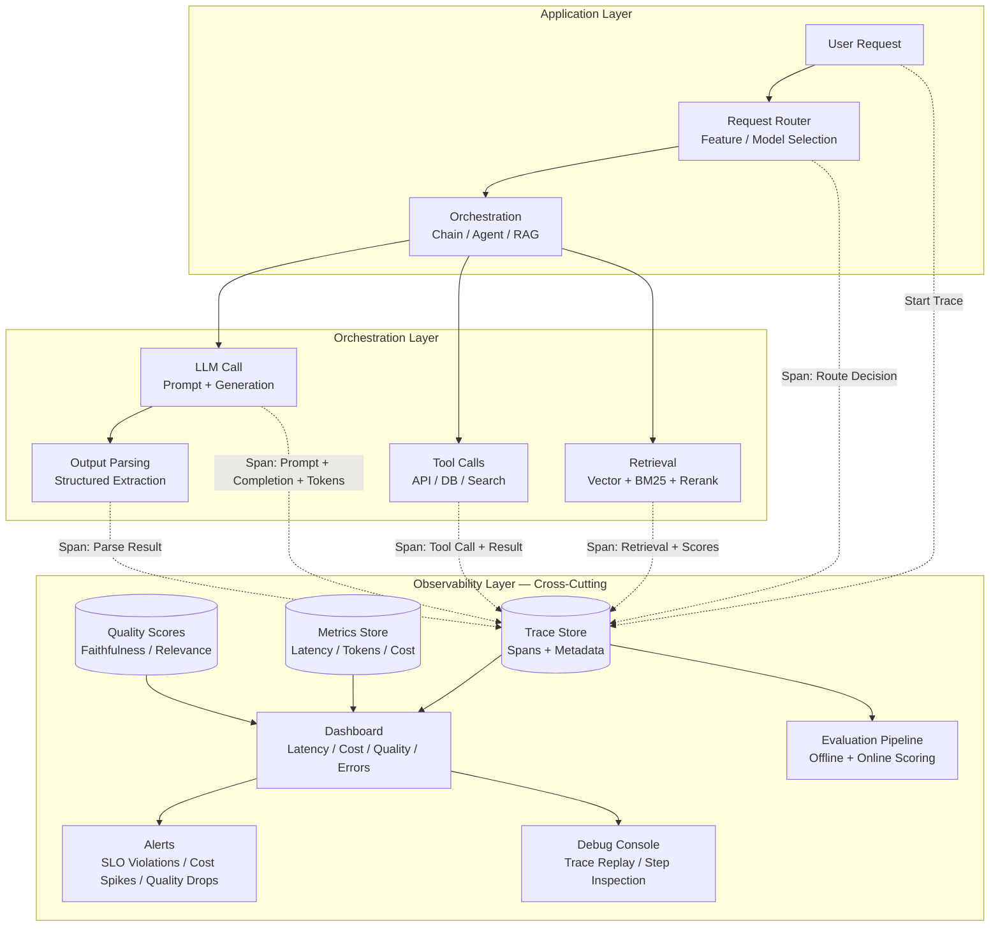
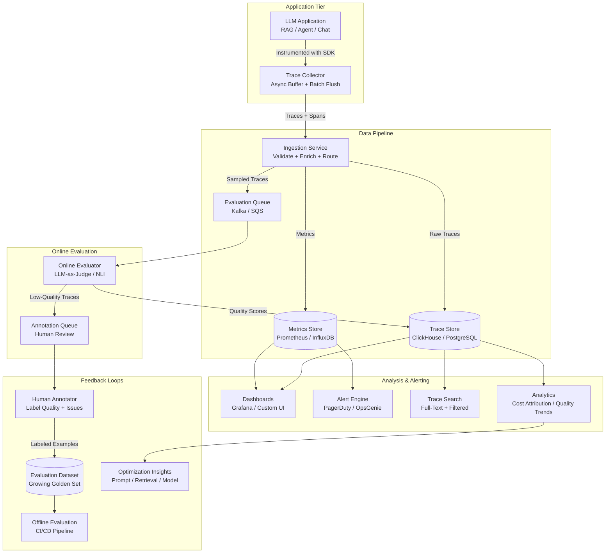
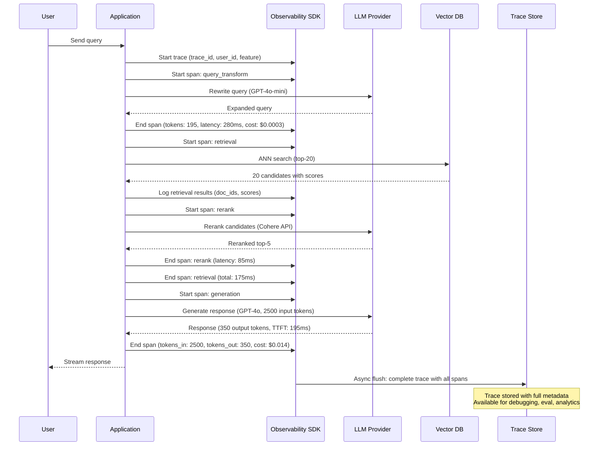

# LLM Observability

## 1. Overview

LLM observability is the discipline of making the internal behavior of LLM-powered applications visible, measurable, and debuggable in production. Unlike traditional application observability (metrics, logs, traces), LLM observability must capture dimensions unique to generative AI: token-level costs, multi-step chain reasoning, retrieval quality, prompt template versions, model configuration, and output quality scores --- all correlated within a single request trace.

For Principal AI Architects, LLM observability is not optional infrastructure --- it is the foundation on which evaluation, debugging, cost management, and continuous improvement are built. Without it, you are flying blind: you cannot measure whether a prompt change improved quality, you cannot attribute a cost spike to a specific feature, you cannot debug why a particular user received a hallucinated response, and you cannot detect quality degradation before users complain.

**Key numbers that shape observability architecture decisions:**
- Trace storage per request: 1--10 KB (metadata + I/O) to 50--500 KB (with full prompt/completion text)
- Storage cost at scale: 10M traces/month at 10 KB/trace = 100 GB/month; at 100 KB = 1 TB/month
- Tracing overhead: < 1ms for span creation, 5--20ms for async flush (non-blocking)
- Key latency metrics: TTFT (Time to First Token) 200--800ms, TPS (Tokens Per Second) 30--80, E2E (End-to-End) 1--10s
- Cost visibility gap: 60--80% of organizations lack per-feature LLM cost attribution (Andreessen Horowitz survey, 2024)
- Quality degradation detection: Without observability, mean time to detect quality regressions is 3--14 days (user complaints); with online evaluation, 1--4 hours
- Typical observability platform cost: 5--15% of LLM inference cost for cloud-hosted platforms; self-hosted reduces to infrastructure cost only

The LLM observability market has fragmented into several categories: LangChain-native platforms (LangSmith), open-source alternatives (Langfuse, Arize Phoenix), ML platform extensions (Weights & Biases Weave), and enterprise APM vendors adding LLM support (Datadog, New Relic). The choice depends on your stack, data sovereignty requirements, and the depth of LLM-specific features you need.

---

## 2. Where It Fits in GenAI Systems

LLM observability sits as a cross-cutting concern that instruments every layer of the GenAI application stack. It collects data from the application layer (user requests, routing decisions), the orchestration layer (chain execution, tool calls, retrieval), and the inference layer (model calls, token usage, latency).



LLM observability connects to these adjacent systems:
- **Evaluation frameworks** (consumer): Evaluation platforms consume trace data to score quality. LangSmith and TruLens directly integrate tracing with evaluation. See [Eval Frameworks](./01-eval-frameworks.md).
- **Hallucination detection** (consumer): Hallucination detection systems use traces to access the retrieved context and generated output for verification. See [Hallucination Detection](./02-hallucination-detection.md).
- **Traditional monitoring** (complement): LLM observability extends, not replaces, traditional APM. HTTP latency, error rates, and infrastructure metrics still matter. See [Monitoring](../../traditional-system-design/10-observability/01-monitoring.md).
- **Traditional logging** (complement): Application logs capture events; LLM traces capture reasoning chains. Both are needed. See [Logging](../../traditional-system-design/10-observability/02-logging.md).
- **Cost optimization** (enabler): Cost attribution requires token-level observability to identify which features, models, and prompt templates drive spend. See [Cost Optimization](../11-performance/03-cost-optimization.md).
- **Latency optimization** (enabler): Latency breakdown (TTFT, generation, retrieval) requires per-span timing. See [Latency Optimization](../11-performance/01-latency-optimization.md).

---

## 3. Core Concepts

### 3.1 Tracing Architecture: Spans, Traces, and Metadata

LLM tracing extends the OpenTelemetry distributed tracing model with LLM-specific span types and attributes.

**Trace structure:**
A single user request produces a trace --- a tree of spans representing the execution flow.

```
Trace: user_query_12345 (E2E: 2,340ms, Total tokens: 4,521, Cost: $0.018)
├── Span: query_router (12ms)
│   └── metadata: route=rag, model=gpt-4o-mini (classifier)
├── Span: query_transform (340ms)
│   ├── Span: llm_call (320ms)
│   │   └── input: "Rewrite this query...", output: "expanded query...",
│   │       tokens_in: 150, tokens_out: 45, model: gpt-4o-mini
│   └── metadata: strategy=expansion, num_variants=3
├── Span: retrieval (180ms)
│   ├── Span: embedding (25ms)
│   │   └── model: text-embedding-3-small, dimensions: 1536
│   ├── Span: ann_search (45ms)
│   │   └── index: pinecone-prod, top_k: 20, namespace: tenant_abc
│   ├── Span: bm25_search (30ms)
│   │   └── index: elasticsearch-prod, top_k: 20
│   ├── Span: fusion (5ms)
│   │   └── method: rrf, k: 60
│   └── Span: rerank (75ms)
│       └── model: cohere-rerank-v3.5, input_docs: 20, output_docs: 5
├── Span: generation (1,780ms)
│   ├── Span: prompt_assembly (8ms)
│   │   └── template_version: v2.3, context_tokens: 2,100
│   ├── Span: llm_call (1,750ms)
│   │   └── model: gpt-4o, tokens_in: 2,450, tokens_out: 380,
│   │       ttft: 210ms, tps: 52, temperature: 0, cost: $0.016
│   └── Span: output_parse (22ms)
│       └── citations_extracted: 3, format: json
└── Span: quality_check (28ms)
    └── faithfulness: 0.92, relevance: 0.88, method: heuristic
```

**Span types for LLM applications:**

| Span Type | Key Attributes | Purpose |
|-----------|---------------|---------|
| `llm_call` | model, tokens_in, tokens_out, ttft, tps, temperature, cost, prompt, completion | Core LLM inference instrumentation |
| `retrieval` | index, top_k, query, results_count, scores | Vector/keyword search operations |
| `rerank` | model, input_docs, output_docs, scores | Cross-encoder reranking |
| `embedding` | model, dimensions, batch_size | Embedding generation |
| `tool_call` | tool_name, arguments, result, latency | Agent tool invocations |
| `chain` | chain_type, steps, total_tokens | LangChain/LlamaIndex chain execution |
| `evaluation` | metric, score, method | Quality scoring (online eval) |

**Metadata dimensions for analysis:**

Every trace should carry metadata that enables drill-down analysis:
- `user_id`: Enables per-user quality and cost analysis.
- `session_id`: Groups multi-turn conversations.
- `feature`: Which product feature triggered this request (search, chat, summarization).
- `model`: Which LLM was used.
- `prompt_version`: Which prompt template version was active.
- `experiment_id`: Links to A/B test or experiment.
- `tenant_id`: For multi-tenant applications, enables per-tenant cost and quality tracking.

### 3.2 Key Metrics: What to Measure

**Latency metrics:**

| Metric | Definition | Target Range | Why It Matters |
|--------|-----------|-------------|----------------|
| **TTFT** (Time to First Token) | Time from request to first token of streamed response | 200--800ms | User-perceived responsiveness; determines if the UI feels "instant" |
| **TPS** (Tokens Per Second) | Generation speed after first token | 30--80 tps | Reading speed for streamed responses; < 20 tps feels slow |
| **E2E** (End-to-End Latency) | Total time from request to complete response | 1--10s | Overall user wait time; includes retrieval, generation, post-processing |
| **Retrieval Latency** | Time for embedding + search + reranking | 100--500ms | Major latency contributor in RAG systems; should be < 30% of E2E |
| **TTLT** (Time to Last Token) | Time from request to final token | 2--15s | Total generation time for long responses |

**Token and cost metrics:**

| Metric | Definition | Why It Matters |
|--------|-----------|----------------|
| **Input tokens** | Tokens in prompt (system + context + query) | Primary cost driver for RAG (context-heavy prompts) |
| **Output tokens** | Tokens in generated response | More expensive per token than input (3--4x for most models) |
| **Total tokens per request** | Input + output | Capacity planning and cost forecasting |
| **Cost per request** | `(input_tokens * input_price) + (output_tokens * output_price)` | Unit economics; must be tracked per feature |
| **Cost per user** | Aggregated cost across all requests for a user | Identifies heavy users; informs pricing model |
| **Context utilization** | `context_tokens / model_context_window` | How much of the available context window is being used |

**Quality metrics (online):**

| Metric | Collection Method | Frequency |
|--------|------------------|-----------|
| **Faithfulness score** | LLM-as-judge on sampled traces | 1--10% of traffic |
| **Relevance score** | LLM-as-judge on sampled traces | 1--10% of traffic |
| **User satisfaction** | Thumbs up/down, explicit ratings | Every request (optional) |
| **Error rate** | API errors, parsing failures, guardrail blocks | 100% of traffic |
| **Refusal rate** | Fraction of requests where the system refuses to answer | 100% of traffic |
| **Hallucination rate** | NLI or LLM-as-judge on sampled traces | 1--10% of traffic |

**Operational metrics:**

| Metric | Definition | Alert Threshold |
|--------|-----------|-----------------|
| **Request volume** | Requests per second/minute | Sudden spikes > 3x baseline |
| **Error rate** | Failed requests / total requests | > 1% sustained |
| **Rate limit hits** | API 429 errors | > 5% of requests |
| **Model availability** | Provider API uptime | < 99.5% in 1-hour window |
| **Cache hit rate** | Cached responses / total requests | Drop > 20% from baseline |

### 3.3 LangSmith: Tracing + Evaluation + Annotation

LangSmith is the most integrated LLM observability platform, combining tracing, evaluation, annotation, and experiment management in a single product.

**Architecture:**
- **Tracing**: Automatic instrumentation for LangChain and LangGraph applications. Manual instrumentation via `@traceable` decorator for non-LangChain code. All traces are sent to LangSmith cloud (or self-hosted enterprise deployment).
- **Datasets**: Curated input-output pairs for evaluation. Created manually, from annotated production traces, or via synthetic generation.
- **Annotation queues**: Production traces are routed to human annotators based on configurable criteria (low quality score, user complaint, random sample). Annotators label traces using custom rubrics.
- **Experiments**: Named evaluation runs that execute a pipeline over a dataset and score results. Experiments are versioned and comparable.
- **Online evaluation**: Evaluators run on sampled production traffic in real-time, scoring quality dimensions without manual intervention.

**Strengths**: Deepest integration with LangChain/LangGraph ecosystem. Unified tracing + evaluation workflow. Annotation queues create a continuous improvement flywheel.

**Limitations**: Vendor lock-in to LangChain ecosystem (instrumentation is framework-specific, though manual instrumentation is supported). Cloud-hosted data (enterprise self-hosting available at premium). Cost scales with trace volume.

### 3.4 Langfuse: Open-Source Alternative

Langfuse provides LangSmith-equivalent functionality as an open-source project, with self-hosting as a first-class deployment option.

**Architecture:**
- **Tracing**: SDK-based instrumentation for Python and TypeScript. Decorators (`@observe`) and context managers for automatic span creation. Native integrations with LangChain, LlamaIndex, OpenAI SDK, and Anthropic SDK.
- **Scoring**: Attach numerical scores to traces or spans. Scores can be set programmatically (automated evaluation), via the UI (human review), or via API (external evaluation tools).
- **Prompt management**: Version-controlled prompt templates with production deployment tracking. Link specific prompt versions to traces for impact analysis.
- **Self-hosting**: Deploy via Docker Compose or Kubernetes. PostgreSQL + ClickHouse (optional, for analytics) backend. Full data sovereignty.

**Strengths**: Open-source (MIT license). Self-hosted data sovereignty. Framework-agnostic instrumentation. Growing community and integration ecosystem.

**Limitations**: Smaller feature set than LangSmith (no annotation queues as of early 2025, though in development). Self-hosting requires operational investment. Cloud-hosted option available but less mature than LangSmith cloud.

### 3.5 Arize Phoenix: Open-Source Embeddings and Trace Analysis

Arize Phoenix (open-sourced by Arize AI) specializes in embedding analysis and trace visualization for LLM applications.

**Core capabilities:**
- **Trace visualization**: Interactive trace viewer with span-level inspection, timing breakdown, and token usage.
- **Embedding analysis**: Visualize embedding spaces (UMAP projections) for retrieved documents, queries, and generated outputs. Identify clusters, outliers, and drift in embedding distributions.
- **Retrieval analysis**: Evaluate retrieval quality by visualizing which documents were retrieved, their relevance scores, and how they influenced the generation.
- **Experiments**: Compare multiple pipeline configurations on the same dataset.

**Architecture**: Runs as a local Jupyter-notebook-compatible server. Ingests OpenTelemetry traces via the `openinference` standard. Can also ingest data from LangChain, LlamaIndex, and custom applications.

**Strengths**: Best-in-class embedding visualization. Fully open-source (Apache 2.0). Lightweight deployment (pip install + local server). Strong retrieval debugging capabilities.

**Limitations**: Less mature for large-scale production monitoring (designed more for development/debugging). No built-in alerting or production dashboards. No managed cloud offering (though Arize AI's commercial platform provides this).

### 3.6 Weights & Biases Weave: ML Platform Integration

W&B Weave extends the established Weights & Biases experiment tracking platform to LLM applications.

**Core capabilities:**
- **Tracing**: Automatic instrumentation via the `@weave.op()` decorator. Captures inputs, outputs, and metadata for any Python function, including LLM calls.
- **Evaluation**: Built-in evaluation framework with configurable scorers. Runs evaluations as tracked experiments, enabling comparison across model versions, prompt versions, and pipeline configurations.
- **Model registry**: Version and deploy LLM pipeline configurations (prompt templates, model selections, hyperparameters) as tracked artifacts.
- **Dataset management**: Versioned datasets with lineage tracking.

**Strengths**: Integration with the broader W&B ecosystem (experiment tracking, model registry, artifacts). Familiar interface for teams already using W&B for traditional ML. Strong experiment comparison and reproducibility.

**Limitations**: Primarily designed for experimentation and development, not production monitoring. Less LLM-specific tracing depth than LangSmith or Langfuse. Requires W&B infrastructure (cloud or self-hosted).

### 3.7 Debugging LLM Chains: Trace Visualization and Replay

Debugging LLM applications is fundamentally different from debugging traditional applications because the "logic" is embedded in prompts and model behavior, not in code.

**Common debugging scenarios:**

**Scenario 1: Incorrect retrieval**
- Symptom: Hallucinated response.
- Debugging flow: Open the trace. Inspect the retrieval span. Check query embedding similarity scores. Examine retrieved chunks. Determine if the correct information exists in the index but wasn't retrieved (retrieval failure) or doesn't exist (ingestion failure).

**Scenario 2: Correct retrieval, incorrect generation**
- Symptom: The retrieved context contains the answer, but the LLM ignores it or distorts it.
- Debugging flow: Open the trace. Confirm retrieval returned relevant chunks. Inspect the prompt assembly span --- is the context properly formatted? Is the relevant chunk at a position the model attends to (not lost-in-the-middle)? Check the generation span --- did the model's output contradict the context?

**Scenario 3: Latency spike**
- Symptom: E2E latency exceeds SLO.
- Debugging flow: Open the trace. Inspect per-span timing. Identify the bottleneck: retrieval (ANN search slow? Reranker slow?), generation (long prompt? Slow model?), or post-processing. Check if the latency spike correlates with increased context size (more tokens = longer generation).

**Scenario 4: Cost anomaly**
- Symptom: Daily LLM cost spikes unexpectedly.
- Debugging flow: Filter traces by cost. Identify high-cost traces. Check input token counts --- are prompts growing due to conversation history accumulation? Is the context window being filled unnecessarily? Are retry loops inflating token usage?

**Trace replay**: Some platforms (LangSmith, Langfuse) support replaying a trace with modified inputs or configurations. This enables:
- "What if I had used a different prompt template?"
- "What if I had retrieved fewer chunks?"
- "What if I had used a cheaper model?"

### 3.8 Production Monitoring: Drift, Degradation, and Alerts

**Quality drift detection:**
LLM application quality can degrade without any code change. Causes include:
- **Model API changes**: Providers update models (GPT-4o-2024-08-06 to a newer checkpoint) without notice, subtly changing behavior.
- **Data distribution shift**: User queries evolve over time, moving outside the distribution the system was optimized for.
- **Retrieval index staleness**: New documents aren't ingested, or document quality degrades.
- **Conversation history accumulation**: Multi-turn conversations get longer, pushing important context out of the attention window.

**Alert design for LLM applications:**

| Alert | Condition | Severity | Action |
|-------|-----------|----------|--------|
| Latency SLO breach | p95 E2E > 5s for 15 min | Warning | Investigate model provider latency or context size growth |
| Latency SLO breach | p95 E2E > 10s for 5 min | Critical | Failover to faster model or reduce context |
| Error rate spike | Error rate > 5% for 10 min | Critical | Check API key, rate limits, model availability |
| Faithfulness drop | Online eval score < 0.80 for 1 hour | Warning | Investigate retrieval quality and prompt changes |
| Faithfulness drop | Online eval score < 0.70 for 30 min | Critical | Rollback last deployment or activate fallback |
| Cost anomaly | Daily cost > 2x 7-day average | Warning | Investigate token usage, retry loops, or traffic spike |
| Refusal rate spike | Refusal rate > 20% for 1 hour | Warning | Check if guardrails are over-triggering or context is degraded |

### 3.9 A/B Testing for LLM Applications

A/B testing LLM applications is harder than traditional A/B testing because:
1. **Output variability**: Even the same input produces different outputs across requests (unless temperature=0).
2. **Metric complexity**: Success is multidimensional (quality, latency, cost, safety), not a single conversion metric.
3. **Sample size requirements**: Subjective quality metrics require more samples for statistical significance than click-through rates.
4. **Evaluation cost**: Each sample requires LLM-as-judge evaluation or human annotation to measure quality.

**A/B testing architecture:**
1. **Traffic splitting**: Route a percentage of production traffic to each variant. Use consistent hashing by user_id to ensure the same user always sees the same variant (avoids confusing UX).
2. **Metric collection**: For each request, record the variant, all observability metrics (latency, tokens, cost), and quality scores (from online evaluation).
3. **Analysis**: After sufficient samples (typically 500--2,000 per variant for quality metrics), compare variants:
   - Latency and cost: Standard statistical tests (t-test, Mann-Whitney).
   - Quality scores: Bootstrap confidence intervals on LLM-as-judge scores.
   - User satisfaction: Thumbs up/down rates with proportion z-test.
4. **Decision**: Promote the winning variant if it improves quality without degrading latency/cost beyond acceptable thresholds.

### 3.10 Dashboard Design: What to Monitor

**Executive dashboard (daily review):**
- Total requests, total tokens, total cost (with week-over-week trends)
- Average quality score (faithfulness, relevance) with trend
- Error rate and refusal rate
- Cost per feature breakdown
- Top 5 most expensive users/tenants

**Engineering dashboard (continuous monitoring):**
- Latency percentiles (p50, p95, p99) by model, feature, and pipeline stage
- Token usage distributions (input vs. output, by feature)
- Retrieval quality metrics (precision@K, reranker scores)
- Quality score distributions with drill-down to individual traces
- Model API availability and rate limit utilization
- Cache hit rate

**On-call dashboard (incident response):**
- Real-time error rate and error types
- Latency anomaly detection
- Cost anomaly detection
- Recent quality score failures with trace links
- Model provider status (OpenAI, Anthropic, Google status pages)

---

## 4. Architecture

### 4.1 Production LLM Observability Architecture



### 4.2 Tracing Data Flow (Span-Level Detail)



---

## 5. Design Patterns

### Pattern 1: Centralized LLM Gateway with Observability
- **When**: Multi-team organization with multiple LLM applications sharing the same model providers.
- **How**: Route all LLM API calls through a centralized gateway (LiteLLM, Portkey, or custom). The gateway handles model routing, fallback, rate limiting, and observability. All traces are captured at the gateway level, providing organization-wide visibility.
- **Benefit**: Consistent observability across all applications. Centralized cost tracking and rate limit management.
- **Limitation**: Single point of failure. Adds latency (5--20ms per request).

### Pattern 2: Sidecar Evaluation (Online Quality Scoring)
- **When**: Production systems that need continuous quality monitoring without blocking responses.
- **How**: After delivering the response to the user, asynchronously send the trace to an evaluation sidecar. The sidecar runs LLM-as-judge evaluators on sampled traces (1--10%) and writes quality scores back to the trace store.
- **Cost**: LLM-as-judge evaluation on 5% of 10K daily requests = 500 evaluations/day at $0.02/eval = $10/day.
- **Benefit**: Real-time quality monitoring without latency impact.

### Pattern 3: Full-Fidelity Tracing with Sampling
- **When**: High-volume applications where storing full traces for every request is cost-prohibitive.
- **How**: Capture lightweight metrics (latency, tokens, cost, error) for 100% of traffic. Capture full traces (with complete prompt/completion text) for a configurable sample (1--10%). Always capture full traces for errors, high-cost requests, and low-quality scores.
- **Storage reduction**: 10--100x compared to full-fidelity tracing of all requests.

### Pattern 4: Multi-Layer Observability Stack
- **When**: Enterprise environments with existing APM infrastructure.
- **How**: Use traditional APM (Datadog, New Relic) for infrastructure and HTTP-level metrics. Layer LLM-specific observability (LangSmith, Langfuse) for trace-level LLM debugging and evaluation. Connect the two via correlation IDs.
- **Benefit**: Leverage existing investment in APM. LLM observability handles the AI-specific dimensions that APM tools don't cover well.

### Pattern 5: Self-Hosted Observability for Data Sovereignty
- **When**: Regulated industries (healthcare, finance, government) where sending prompt/completion data to third-party cloud services is prohibited.
- **How**: Deploy Langfuse (open-source) or Arize Phoenix on internal Kubernetes clusters. All trace data stays within the organization's network boundary.
- **Stack**: Langfuse (traces + scoring) + ClickHouse (analytics) + Grafana (dashboards) + custom alerting.

### Pattern 6: Cost Attribution by Feature
- **When**: Multiple product features share the same LLM infrastructure, and finance/product teams need per-feature cost breakdowns.
- **How**: Tag every trace with a `feature` metadata field. Aggregate token costs by feature in the analytics layer. Build dashboards showing cost per feature, cost per user, and cost trends.
- **Insight**: Often reveals that 10--20% of features drive 60--80% of LLM cost, enabling targeted optimization.

---

## 6. Implementation Approaches

### 6.1 Platform Comparison

| Platform | Type | Tracing | Evaluation | Alerting | Self-Hosted | Pricing Model |
|----------|------|---------|------------|----------|-------------|---------------|
| **LangSmith** | Commercial | Deep (LangChain-native + manual) | Built-in (datasets, experiments, annotation) | Basic | Enterprise only | Usage-based (traces) |
| **Langfuse** | Open-source | Deep (multi-framework) | Scoring API + integrations | Via integrations | Yes (Docker/K8s) | Free self-hosted; cloud usage-based |
| **Arize Phoenix** | Open-source | Good (OpenInference standard) | Experiments | No | Yes (local) | Free |
| **W&B Weave** | Commercial | Good (decorator-based) | Built-in experiments | Via W&B | Enterprise only | Usage-based |
| **Datadog LLM Obs** | Commercial (APM extension) | Basic (LLM call level) | Limited | Full APM alerting | No | Per-host + traces |
| **Helicone** | Commercial | Good (proxy-based) | Basic scoring | Basic | No | Usage-based (requests) |
| **Portkey** | Commercial | Good (gateway-based) | Basic | Basic | No | Usage-based |

### 6.2 Recommended Stack by Context

| Context | Recommended Stack | Rationale |
|---------|------------------|-----------|
| LangChain/LangGraph-heavy | LangSmith | Deepest integration, unified tracing + eval + annotation |
| Open-source preference | Langfuse + Arize Phoenix | Full self-hosted capability, strong community |
| Existing W&B users | W&B Weave + Langfuse | Leverage existing W&B infra; Langfuse for production tracing |
| Enterprise with Datadog | Datadog LLM Obs + Langfuse | Datadog for infrastructure; Langfuse for LLM-specific depth |
| Data sovereignty required | Langfuse (self-hosted) + Grafana | Full control over data, open-source stack |
| Minimal integration effort | Helicone or Portkey | Proxy-based, zero-code instrumentation |

### 6.3 Instrumentation Best Practices

1. **Instrument at the right granularity**: Create spans for each logical step (retrieval, reranking, generation, evaluation), not for every function call. Too many spans create noise; too few hide bottlenecks.
2. **Always capture token counts and model identifiers**: These are the foundation for cost attribution and capacity planning.
3. **Use async, non-blocking flush**: Never let observability increase response latency. Buffer spans in memory and flush asynchronously.
4. **Set sampling policies**: 100% metrics, sampled full traces. Always capture full traces for errors and anomalies.
5. **Tag with business metadata**: user_id, tenant_id, feature, prompt_version, experiment_id. These enable the drill-down analysis that makes observability actionable.
6. **Sanitize PII before logging**: If prompts or completions contain user PII, apply redaction before writing to the trace store. This is a compliance requirement in most regulated environments.
7. **Version your instrumentation**: When you add new spans or metadata fields, version the schema. This prevents breaking dashboard queries when old traces lack new fields.

---

## 7. Tradeoffs

### Platform Selection Tradeoffs

| Decision | Option A | Option B | Key Tradeoff |
|----------|----------|----------|--------------|
| Platform | LangSmith (commercial) | Langfuse (open-source) | Feature maturity + support vs. data sovereignty + no vendor lock-in |
| Deployment | Cloud-hosted | Self-hosted | Zero ops vs. data sovereignty + compliance |
| Integration | Framework-native (LangSmith for LangChain) | Framework-agnostic (Langfuse, Phoenix) | Depth of integration vs. flexibility to change frameworks |
| Scope | LLM-specific platform | General APM with LLM extensions | LLM depth vs. unified infrastructure view |

### Observability Architecture Tradeoffs

| Decision | Option A | Option B | Key Tradeoff |
|----------|----------|----------|--------------|
| Trace fidelity | Full traces for all requests | Sampled full traces + 100% metrics | Debugging capability vs. storage cost |
| Prompt/completion logging | Log full text | Log metadata only | Debuggability vs. PII risk + storage cost |
| Online evaluation | Skip | 5% sampled scoring | Cost savings vs. continuous quality visibility |
| Alert granularity | Aggregate alerts (overall quality) | Per-feature, per-model alerts | Simplicity vs. actionable debugging |
| Evaluation latency | Synchronous (block response) | Asynchronous (fire-and-forget) | Real-time quality gates vs. user latency |

---

## 8. Failure Modes

### 8.1 Observability Blind Spots
**Symptom**: A quality degradation goes undetected for days because the affected query type is not covered by online evaluation sampling.
**Cause**: Random sampling doesn't guarantee coverage of all query types. Rare but important query patterns may never be sampled.
**Mitigation**: Use stratified sampling by query type, feature, and model. Ensure critical query patterns have guaranteed minimum sampling rates.

### 8.2 Trace Store Overload
**Symptom**: The trace store becomes slow or unavailable, causing instrumentation failures or data loss.
**Cause**: Full-fidelity tracing at high volumes generates massive data. Long prompt/completion text inflates trace size.
**Mitigation**: Implement tiered storage (hot: 7 days, warm: 30 days, cold: archive). Set max trace size limits. Truncate long prompts/completions in the trace (store a hash for deduplication).

### 8.3 Alert Fatigue
**Symptom**: On-call engineers ignore LLM quality alerts because false positives are frequent.
**Cause**: LLM-as-judge evaluations are noisy (inherent variance). Thresholds are too aggressive. Alerts don't distinguish between transient noise and sustained degradation.
**Mitigation**: Require sustained threshold breach (e.g., 15+ minutes) before alerting. Use confidence intervals, not point estimates. Separate warning from critical alerts. Include actionable context in alerts (example failing traces).

### 8.4 Cost Attribution Gaps
**Symptom**: Total LLM cost is known, but teams cannot determine which features or users drive the cost.
**Cause**: Traces are not consistently tagged with feature and user metadata. Shared models make per-feature attribution ambiguous.
**Mitigation**: Enforce mandatory metadata tags (feature, user_id, tenant_id) at the instrumentation level. Reject untagged traces. Build cost attribution dashboards as a first-class observability feature.

### 8.5 PII Leakage in Traces
**Symptom**: Production traces contain user PII (names, emails, SSNs) in prompt/completion text, violating privacy regulations.
**Cause**: Full-fidelity tracing captures everything, including user-provided PII in queries and LLM-generated PII in responses.
**Mitigation**: Apply PII redaction at the instrumentation layer before traces are written. Use regex + NER-based PII detection. Alternatively, log only metadata (no prompt/completion text) by default and enable full text only for specific debugging sessions with audit logging.

### 8.6 Model Provider Observability Gaps
**Symptom**: You observe high latency or errors at the application level but cannot determine if the issue is in your code or the model provider's infrastructure.
**Cause**: Model providers (OpenAI, Anthropic, Google) expose limited observability into their inference infrastructure. You see request-response latency but not queuing time, compute time, or internal errors.
**Mitigation**: Instrument both the request and response boundaries of model API calls. Track provider-specific headers (e.g., `x-ratelimit-remaining`, `x-request-id`). Maintain a provider health dashboard that tracks latency percentiles and error rates per provider/model. Subscribe to provider status pages.

---

## 9. Optimization Techniques

### 9.1 Reducing Observability Cost
- **Tiered storage**: Hot storage (7 days, full fidelity) for debugging. Warm storage (30 days, compressed) for trend analysis. Cold storage (1+ year, aggregates only) for compliance.
- **Selective full-trace capture**: 100% metrics, 1--10% full traces. Always capture full traces for errors, cost anomalies, and low quality scores.
- **Prompt/completion compression**: For archived traces, store embedding hashes of prompts/completions instead of raw text. Enables similarity search without full-text storage cost.
- **Batch flush optimization**: Buffer spans in memory and flush in batches (every 100 spans or every 5 seconds). Reduces network overhead and ingestion load.

### 9.2 Improving Debugging Efficiency
- **Trace search indexing**: Index traces by metadata fields (user_id, feature, model, error_type, quality_score). Enable fast filtered search: "Show me all traces where faithfulness < 0.7 and model = gpt-4o in the last 24 hours."
- **Automated root cause analysis**: When a quality alert fires, automatically identify the trace dimensions (model, prompt version, feature) that correlate with the degradation. This reduces mean time to diagnosis.
- **Trace comparison**: Side-by-side comparison of a failing trace and a succeeding trace for the same query type. Highlights which span differs (retrieval returned different results, prompt template changed, etc.).

### 9.3 Improving Alert Quality
- **Composite SLOs**: Instead of alerting on individual metrics, define composite SLOs: "95% of requests must have faithfulness > 0.8 AND latency < 5s AND cost < $0.05." Alert only on SLO breaches.
- **Anomaly detection over static thresholds**: Use statistical anomaly detection (Z-score, IQR-based) to adapt alert thresholds to the natural variance of each metric. Reduces false positives from metrics with high baseline variance.
- **Alert correlation**: Group related alerts that fire at the same time (latency spike + cost spike + quality drop = likely model provider issue, not pipeline bug).

### 9.4 Dashboard Optimization
- **Pre-aggregated metrics**: Compute common aggregates (hourly averages, daily totals, percentiles) at ingestion time. Don't compute them on-the-fly from raw traces.
- **Drill-down hierarchy**: Top-level dashboard shows aggregates. Click to drill down by feature, model, prompt version, user segment. This avoids information overload while enabling deep investigation.
- **Bookmark common queries**: Pre-configure saved searches for common debugging patterns ("all errors in the last hour", "highest-cost traces today", "lowest quality scores this week").

---

## 10. Real-World Examples

### LangChain / LangSmith (Tracing-Native Development)
LangChain built LangSmith as the observability platform specifically for LangChain applications, then expanded to support any LLM application. Their key insight was that tracing should be a first-class development tool, not an afterthought. LangSmith captures every chain execution with full span-level detail, enabling developers to debug complex chains by inspecting each step. Their annotation queue feature creates a flywheel: production traces are routed to human reviewers, who label quality, and labeled examples feed back into evaluation datasets. Companies like Elastic, Rakuten, and Replit use LangSmith for their LLM observability stack.

### Langfuse (Open-Source Observability for Enterprise)
Langfuse has become the default open-source LLM observability platform, adopted by companies requiring data sovereignty (particularly in Europe, where GDPR compliance prohibits sending prompt data to US-hosted cloud services). Langfuse's self-hosted deployment option runs on PostgreSQL with optional ClickHouse for analytics. Their prompt management feature allows teams to version-control prompts and track which prompt version was active when a quality regression occurred. Companies including Cal.com and various European enterprises use Langfuse for production LLM monitoring.

### Braintrust (Experiment-Driven Observability at Scale)
Braintrust differentiated itself through proxy-based observability: teams route their OpenAI/Anthropic API calls through Braintrust's proxy, which transparently captures all request/response data without code changes. This achieved near-zero integration effort, enabling rapid adoption. Their experiment comparison feature enables teams to systematically compare pipeline configurations with statistical rigor. Organizations like Airtable, Notion, and Zapier use Braintrust for LLM evaluation and observability.

### Arize AI (Embedding-Centric Observability)
Arize AI pioneered embedding analysis for LLM observability. Their Phoenix open-source library enables developers to visualize query and document embeddings in 2D/3D space, identifying clusters of queries that retrieve poorly and documents that are never retrieved. This visual debugging approach complements traditional metric-based monitoring, enabling teams to discover failure patterns that aggregate metrics would miss. Arize's commercial platform extends this with production-scale monitoring, drift detection on embedding distributions, and automated performance analysis.

### Datadog (APM Integration for LLM Applications)
Datadog added LLM observability as an extension to their existing APM platform, demonstrating the enterprise pattern of extending traditional observability for AI. Their approach instruments LLM calls as a special span type within the existing distributed tracing framework, enabling teams to correlate LLM performance with infrastructure metrics (CPU, memory, network) and upstream/downstream service health. This is particularly valuable for organizations where LLM applications are components of larger systems and debugging requires cross-service trace correlation.

---

## 11. Related Topics

- [LLM Evaluation Frameworks](./01-eval-frameworks.md) --- Evaluation systems consume trace data and produce quality scores that are stored in the observability layer.
- [Hallucination Detection](./02-hallucination-detection.md) --- Hallucination detection runs on traces and feeds quality scores back into observability dashboards.
- [LLM Benchmarks](./03-benchmarks.md) --- Benchmarks measure model capability; observability measures production application performance.
- [RAG Pipeline Architecture](../04-rag/01-rag-pipeline.md) --- RAG pipelines are the primary consumers of observability infrastructure; debugging retrieval quality requires trace-level inspection.
- [Monitoring](../../traditional-system-design/10-observability/01-monitoring.md) --- Traditional infrastructure monitoring complements LLM-specific observability.
- [Logging](../../traditional-system-design/10-observability/02-logging.md) --- Application logs and LLM traces are complementary debugging tools.
- [Cost Optimization](../11-performance/03-cost-optimization.md) --- Cost attribution and optimization depend on token-level observability.
- [Latency Optimization](../11-performance/01-latency-optimization.md) --- Latency breakdown (TTFT, retrieval, generation) requires per-span timing from the observability layer.

---

## 12. Source Traceability

| Concept | Primary Source |
|---------|---------------|
| LangSmith tracing and evaluation architecture | LangSmith documentation (docs.smith.langchain.com); LangChain blog posts on observability |
| Langfuse open-source observability | Langfuse documentation (langfuse.com/docs); GitHub repository |
| Arize Phoenix embedding analysis | Arize Phoenix documentation (docs.arize.com/phoenix); GitHub repository |
| W&B Weave experiment tracking | Weights & Biases Weave documentation (docs.wandb.ai/guides/weave) |
| OpenTelemetry tracing model | OpenTelemetry specification (opentelemetry.io); OpenInference semantic conventions |
| LLM latency metrics (TTFT, TPS) | Anyscale, "LLM Performance Benchmarks" (2024); various model provider documentation |
| A/B testing methodology for AI | Kohavi et al., "Trustworthy Online Controlled Experiments" (2020); adapted for LLM context |
| Cost of LLM observability | Andreessen Horowitz, "The State of AI Infrastructure" (2024 survey) |
| SLO design for LLM applications | Google SRE Book principles adapted for LLM applications; industry best practices |
| Datadog LLM observability | Datadog LLM Monitoring documentation (docs.datadoghq.com/llm_observability) |
| Helicone proxy-based observability | Helicone documentation (docs.helicone.ai) |
| Portkey gateway observability | Portkey documentation (docs.portkey.ai) |
