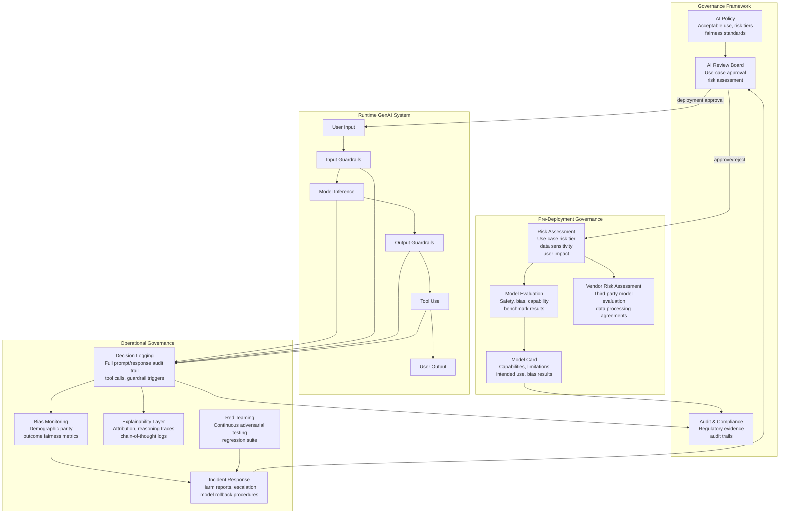
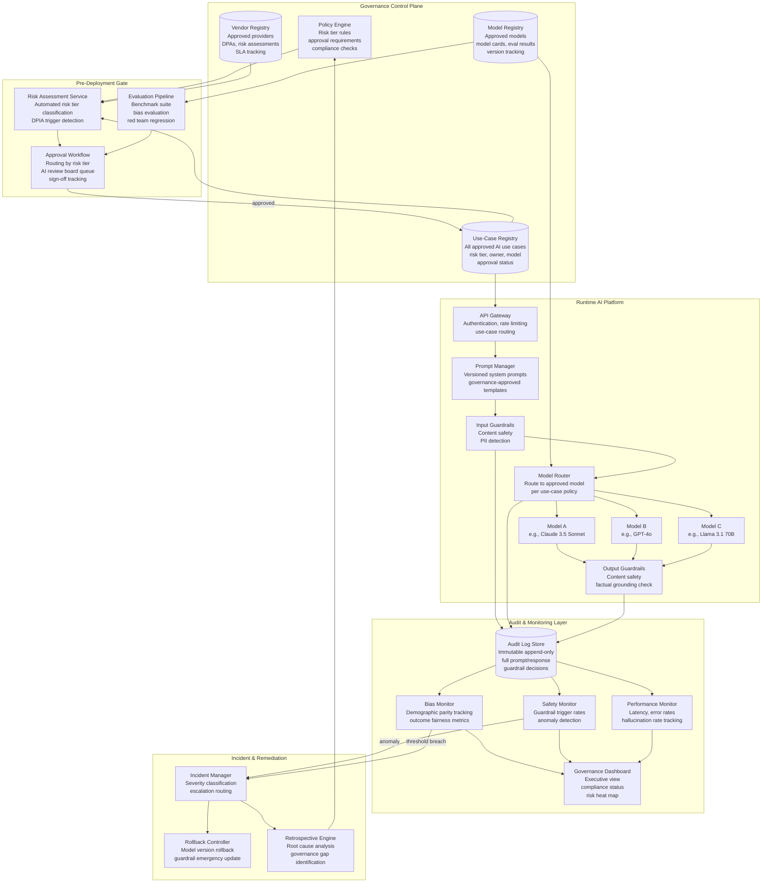
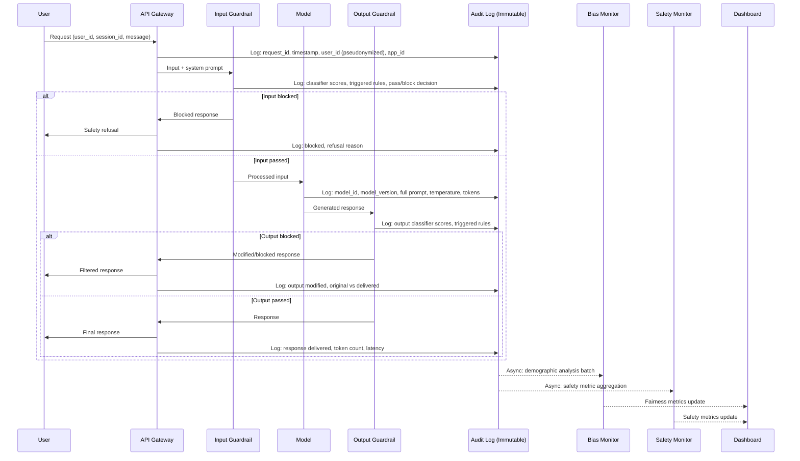

# AI Governance and Responsible AI

## 1. Overview

AI governance is the organizational, regulatory, and technical framework for ensuring that AI systems are developed, deployed, and operated in ways that are safe, fair, transparent, and accountable. For GenAI systems specifically, governance is not a compliance checkbox --- it is the structural mechanism that prevents the gap between organizational AI ambitions and real-world safety/fairness outcomes from becoming an unmanaged risk.

For Principal AI Architects, governance shapes every technical decision: which models can be deployed for which use cases, what logging and audit infrastructure must exist, how bias is measured and mitigated, what explainability requirements constrain architecture choices, how third-party model providers are evaluated, and what evidence must be produced for regulators. A weak governance framework produces AI systems that work in demos but fail under regulatory scrutiny, generate liability, or cause measurable harm to users.

**Why GenAI governance is structurally harder than traditional ML governance:**

- **Behavioral unpredictability**: Traditional ML models have bounded output spaces (classification labels, regression values). GenAI models produce unbounded natural language, making it impossible to enumerate all possible harmful outputs. Governance must address stochastic behavior, not deterministic specifications.
- **Capability generality**: A single foundation model can be used for customer support, code generation, medical summarization, and legal advice. Governance must assess risk per use case, not per model --- the same model may be low-risk in one context and high-risk in another.
- **Supply chain complexity**: Most organizations do not train their own models. They consume models from OpenAI, Anthropic, Google, Meta, or Hugging Face, often through multiple layers of abstraction (model provider -> cloud platform -> orchestration framework -> application). Governance must extend across this supply chain.
- **Rapid capability evolution**: Model capabilities change dramatically with each generation (GPT-3.5 to GPT-4 to GPT-4o, Claude 2 to Claude 3.5 to Claude 4). Governance frameworks must accommodate capability assessments that become stale within months.
- **Emergent behaviors**: Models exhibit capabilities and failure modes that were not present in training data or anticipated by developers. Governance must include mechanisms for discovering and responding to emergent risks post-deployment.

**The three pillars of AI governance for GenAI:**

| Pillar | Scope | Key Question |
|---|---|---|
| **Regulatory compliance** | External legal and regulatory requirements | "Are we lawful?" |
| **Responsible AI principles** | Internal ethical standards and fairness commitments | "Are we doing right?" |
| **Operational risk management** | Technical controls, monitoring, and incident response | "Can we detect and correct failures?" |

---

## 2. Where It Fits in GenAI Systems

AI governance is the meta-layer that constrains and shapes every other component of the GenAI architecture. It is not a runtime component --- it is the set of policies, processes, and evidence requirements that determine how every runtime component is designed, deployed, monitored, and retired.



**Key integration points with GenAI systems:**

- **Red teaming**: Provides the empirical evidence that governance decisions are based on --- deployment approvals require red team results demonstrating acceptable risk levels. See [03-red-teaming.md](03-red-teaming.md).
- **Guardrails**: Governance policies define what guardrails must enforce. The guardrail configuration is a technical implementation of governance requirements. See [01-guardrails.md](01-guardrails.md).
- **PII protection**: Data privacy governance (GDPR Article 22, CCPA) directly constrains how personal data flows through GenAI pipelines. See [02-pii-protection.md](02-pii-protection.md).
- **Evaluation frameworks**: Governance mandates which evaluations must pass before deployment. Eval results are the primary evidence artifact for audit trails. See [01-eval-frameworks.md](../09-evaluation/01-eval-frameworks.md).
- **Observability**: Governance requires logging, monitoring, and audit trails that the observability infrastructure must provide. See [04-llm-observability.md](../09-evaluation/04-llm-observability.md).

---

## 3. Core Concepts

### 3.1 EU AI Act: The Risk-Based Regulatory Framework

The EU AI Act (entered into force August 2024, with phased enforcement through August 2027) is the world's first comprehensive AI-specific regulation and establishes the regulatory template that other jurisdictions are adapting. For any organization deploying AI in the EU or serving EU users, compliance is mandatory with significant penalties (up to 35M EUR or 7% of global annual turnover).

**Risk tier classification:**

| Risk Tier | Description | GenAI Examples | Requirements |
|---|---|---|---|
| **Unacceptable** (Prohibited) | AI systems that pose a clear threat to fundamental rights | Social scoring, real-time remote biometric identification in public spaces (with exceptions), subliminal manipulation, exploitation of vulnerable groups | Banned. No deployment permitted. |
| **High Risk** | AI in areas with significant impact on health, safety, or fundamental rights | AI-assisted medical diagnosis, CV screening, credit scoring, education assessment, law enforcement, critical infrastructure management | Conformity assessment, risk management system, data governance, technical documentation, human oversight, accuracy/robustness requirements, registration in EU database |
| **Limited Risk** | AI with specific transparency obligations | Chatbots (must disclose AI nature), emotion recognition, biometric categorization, AI-generated content (deepfakes) | Transparency obligations: users must be informed they are interacting with AI. AI-generated content must be labeled. |
| **Minimal Risk** | AI with no specific regulatory requirements beyond existing law | Spam filters, AI-enhanced video games, inventory management | No AI Act-specific requirements. General consumer protection and product safety laws apply. |

**General-Purpose AI (GPAI) model obligations (Article 53+):**

The EU AI Act introduces a separate regulatory track for GPAI models (foundation models like GPT-4, Claude, Gemini, Llama). All GPAI providers must:

- Maintain technical documentation including training process, evaluation results, and known limitations
- Establish a copyright compliance policy and provide a sufficiently detailed training data summary
- Comply with the EU AI Office's codes of practice

GPAI models with **systemic risk** (defined as training compute >10^25 FLOPs, or designated by the AI Office) face additional requirements:
- Perform model evaluation including adversarial testing (red teaming)
- Assess and mitigate systemic risks
- Track and report serious incidents
- Ensure adequate cybersecurity protections

**Compliance timeline:**

| Date | Milestone |
|---|---|
| August 2024 | AI Act enters into force |
| February 2025 | Prohibited AI practices banned |
| August 2025 | GPAI obligations apply; governance structures active |
| August 2026 | High-risk AI system requirements apply (for systems in Annex III) |
| August 2027 | Full enforcement for all remaining provisions |

### 3.2 NIST AI Risk Management Framework (AI RMF 1.0)

The NIST AI RMF (published January 2023) is a voluntary, non-sector-specific framework for managing AI risks. Unlike the EU AI Act, it is not legally binding, but it has become the de facto standard for AI risk management in the US and is referenced by multiple federal agencies, procurement guidelines, and industry standards. The framework is structured around four core functions:

**GOVERN: Establish AI Risk Management Culture and Structures**

- Policies and procedures for AI risk management across the organization
- Roles, responsibilities, and accountability structures
- Training and awareness programs for AI risk
- Cross-functional governance bodies (AI review boards, ethics committees)
- Third-party and supply chain risk management policies

**MAP: Contextualize and Frame AI Risks**

- Identify and document the AI system's context: intended purpose, stakeholders, deployment environment, known limitations
- Catalog potential harms: to individuals (discrimination, privacy), to groups (systemic bias), to organizations (reputational, legal), to ecosystems (environmental, societal)
- Assess the likelihood and severity of identified harms under both normal operation and adversarial conditions
- Document assumptions, constraints, and the operational environment

**MEASURE: Assess AI Risks Quantitatively and Qualitatively**

- Define metrics for trustworthiness characteristics: accuracy, fairness, privacy, security, transparency, explainability, reliability
- Establish baselines and thresholds for each metric
- Conduct evaluations using established benchmarks, red teaming, and domain-specific testing
- Track metrics over time to detect drift and degradation

**MANAGE: Prioritize and Act on AI Risks**

- Prioritize risks based on likelihood, severity, and organizational risk appetite
- Implement risk treatments: mitigation (technical controls), transfer (insurance, contractual allocation), avoidance (do not deploy), acceptance (documented risk acceptance with rationale)
- Establish incident response procedures for AI-specific failures
- Define criteria for model retirement, rollback, and human override
- Continuously monitor and update risk assessments as the system and its environment evolve

**NIST AI RMF Companion Resources:**

- **AI RMF Playbook**: Step-by-step guidance with suggested actions for each sub-category
- **AI RMF Crosswalk**: Mapping to other frameworks (ISO 42001, EU AI Act, OECD AI Principles)
- **NIST AI 100-2e2023**: "Adversarial Machine Learning" --- taxonomy of adversarial attacks with relevance to risk assessment

### 3.3 ISO/IEC 42001: AI Management System Standard

ISO/IEC 42001 (published December 2023) is the first international standard for AI management systems. It follows the ISO management system structure (Annex SL), making it integrable with ISO 27001 (information security), ISO 9001 (quality), and ISO 14001 (environmental management). Organizations can obtain third-party certification to demonstrate conformity.

**Key requirements:**

- **AI policy**: Top management must establish an AI policy that includes commitment to responsible AI, compliance with applicable regulations, and continual improvement.
- **AI risk assessment**: Systematic identification, analysis, and evaluation of AI risks, considering both the AI system's intended purpose and foreseeable misuse.
- **AI impact assessment**: Assess the potential impact of the AI system on individuals, groups, and society, including impacts on fundamental rights and the environment.
- **Data management**: Requirements for data quality, data lineage, and data governance throughout the AI lifecycle.
- **AI system lifecycle management**: Controls for each phase --- design, development, verification, deployment, operation, and retirement.
- **Third-party management**: Due diligence requirements for AI components and services obtained from third parties.
- **Monitoring and measurement**: Ongoing monitoring of AI system performance, fairness metrics, and risk indicators.

**Why ISO/IEC 42001 matters for GenAI architects:**
- Provides a certifiable framework that demonstrates AI governance maturity to customers, regulators, and partners.
- Its Annex SL alignment means organizations with existing ISO certifications can integrate AI governance into established management system infrastructure rather than building from scratch.
- The standard is referenced in the EU AI Act's harmonized standards process, meaning conformity with ISO/IEC 42001 may provide a presumption of conformity with certain EU AI Act requirements.

### 3.4 Model Cards: Standardized Model Documentation

Model cards (Mitchell et al., 2019) are the standard documentation format for communicating a model's capabilities, limitations, intended use, and evaluation results. For GenAI systems, model cards serve both internal governance (do we understand what we're deploying?) and external transparency (can users make informed decisions about using this model?).

**Essential model card fields for GenAI:**

| Field | Content | Example |
|---|---|---|
| **Model details** | Name, version, architecture, training date, provider | Claude 3.5 Sonnet, Transformer decoder, June 2024, Anthropic |
| **Intended use** | Primary use cases, in-scope applications | Conversational AI, code generation, document analysis |
| **Out-of-scope use** | Applications the model should not be used for | Medical diagnosis without human oversight, autonomous weapons, CSAM generation |
| **Training data** | Description of training data (sources, size, date range, known gaps) | Web text, books, code; data cutoff April 2024; underrepresented: low-resource languages |
| **Evaluation results** | Performance on standard benchmarks, safety evaluations | MMLU: 88.7%, HumanEval: 92.0%, TruthfulQA: 78.3%, safety refusal rate: 97.2% on harmful prompts |
| **Bias evaluation** | Results of bias testing across demographic categories | Sentiment bias: +0.03 male vs female; stereotype association: 12% reduction vs base model |
| **Limitations** | Known failure modes, hallucination rates, language gaps | Hallucinates citations ~8% of time; weaker performance on languages with <1B training tokens |
| **Ethical considerations** | Specific risks, misuse potential, dual-use concerns | Can generate persuasive misinformation; code generation may produce insecure code |
| **Recommendations** | Deployment guidance, required guardrails, human oversight requirements | Deploy with content safety classifier; require human review for medical/legal/financial advice |

**Model card vs. system card**: A model card documents the model itself. A system card (introduced by OpenAI with GPT-4) documents the entire system including the model, guardrails, system prompt, tools, and deployment configuration. For production GenAI systems, both are necessary --- the model card for the foundation model and the system card for the deployed application.

### 3.5 AI Audit Trails: Logging Decisions for Accountability

Audit trails are the technical infrastructure that makes governance enforceable. Without comprehensive logging, governance policies are aspirational statements without evidence of compliance.

**What must be logged for GenAI audit compliance:**

| Log Category | Data Points | Retention Requirement | Storage Consideration |
|---|---|---|---|
| **Request metadata** | Timestamp, user ID (pseudonymized), session ID, application ID, model version | 1--7 years depending on regulation | Structured, indexed, low volume |
| **Full prompt** | System prompt, user message, retrieved context, conversation history | Match request metadata retention | Can be large (100K+ tokens); consider compression |
| **Model response** | Full generated text, token probabilities (if available), finish reason | Match request metadata retention | Large; sampling probability storage is expensive |
| **Guardrail decisions** | Input classifier scores, output classifier scores, triggered rules, override decisions | Match request metadata retention | Structured, moderate volume |
| **Tool calls** | Tools invoked, parameters, results, authorization context | Match request metadata retention | Structured, variable volume |
| **Human interventions** | Override decisions, escalation reasons, reviewer identity | Match request metadata retention | Low volume, high importance |
| **Feedback signals** | User ratings, flagged responses, correction submissions | Match request metadata retention | Structured, low-moderate volume |

**Audit trail design challenges for GenAI:**

- **Volume**: A high-traffic GenAI application generates gigabytes of log data per day. Full prompt/response logging at scale requires dedicated data infrastructure, not just application logs.
- **PII in logs**: Prompts and responses often contain user PII. Audit trail infrastructure must itself comply with data protection regulations (GDPR right to erasure conflicts with audit retention requirements --- this tension must be resolved in the data protection impact assessment).
- **Immutability**: Audit logs must be tamper-evident. Use append-only storage with cryptographic hashing (blockchain is unnecessary; append-only databases with periodic hash checkpoints are sufficient).
- **Queryability**: Regulators and auditors need to answer questions like "show me all cases where the model discussed medical topics for users in the EU in Q3 2025." Logs must be structured and indexed for complex queries.

### 3.6 Responsible AI Principles: The Ethical Foundation

Responsible AI principles define the ethical commitments that governance operationalizes. While every major AI organization articulates principles slightly differently, six core principles have converged across industry, government, and standards bodies:

**Fairness:**
AI systems should not create or reinforce unfair bias against individuals or groups. For GenAI, fairness requires:
- Equal quality of service across demographic groups (language, dialect, cultural context)
- Absence of discriminatory content in model outputs
- Equitable performance on tasks that affect opportunities (hiring assistance, loan assessment, educational feedback)
- Measurement: demographic parity, equalized odds, calibration across protected attributes

**Transparency:**
Users, affected parties, and oversight bodies should understand how the AI system works, what data it uses, and what its limitations are. For GenAI:
- Disclosure that users are interacting with AI (EU AI Act Article 50)
- Disclosure of AI-generated content (watermarking, labeling)
- Published model cards and system cards
- Clear communication of limitations and confidence levels

**Accountability:**
There must be identifiable humans and organizations accountable for AI system behavior. For GenAI:
- Clear ownership of each deployed AI application (product owner, AI safety lead)
- Escalation procedures for AI-related incidents
- Post-incident review processes
- Executive-level accountability for AI risk acceptance decisions

**Privacy:**
AI systems must respect user privacy and comply with data protection regulations. For GenAI:
- No memorization and regurgitation of training data PII
- User data not used for training without consent
- Compliance with data subject access requests (DSAR) and right to erasure
- Data minimization in prompts and logging

**Safety:**
AI systems must not cause harm to users or third parties. For GenAI:
- Content safety (refusal of harmful content generation)
- Behavioral safety (no autonomous actions without human oversight for high-stakes decisions)
- Operational safety (graceful degradation, fallback mechanisms, kill switches)
- Red teaming validation before deployment

**Reliability:**
AI systems should perform consistently and predictably within their intended operating conditions. For GenAI:
- Hallucination rate measurement and disclosure
- Performance monitoring across deployment conditions
- Degradation detection and alerting
- Version control and rollback capabilities

### 3.7 Bias Detection and Mitigation

Bias in GenAI systems manifests differently from traditional ML bias because the output space is unbounded natural language rather than discrete predictions.

**Types of GenAI bias:**

| Bias Type | Description | Example | Detection Method |
|---|---|---|---|
| **Representational** | Model's internal representations encode stereotypes | "Doctor" associates with male; "nurse" associates with female in embedding space | Embedding association tests (WEAT, SEAT); prompt-based stereotype elicitation |
| **Allocational** | Model provides different quality of service to different groups | Lower accuracy on African-American Vernacular English; better code generation for English-commented code than Hindi-commented | Stratified evaluation across demographic groups; performance parity testing |
| **Generative** | Model produces biased content in open-ended generation | Story generation defaulting to male protagonists; image descriptions reinforcing racial stereotypes | Statistical analysis of generated content across thousands of prompts; human evaluation |
| **Sycophancy** | Model disproportionately agrees with users from perceived authority groups | More likely to challenge assertions from non-native English speakers than from speakers using academic register | Controlled experiments with identical content in different registers/dialects |

**Bias measurement framework:**

1. **Define protected attributes** relevant to your deployment context (race, gender, age, language, disability, socioeconomic status, geographic region).
2. **Design evaluation prompts** that test for bias across protected attributes. Use both explicit tests ("write a story about a [profession]" and analyze gender distribution) and implicit tests (evaluate response quality for identical queries in different dialects).
3. **Establish baselines and thresholds**: What level of disparity is acceptable? Equalized odds within 5%? Demographic parity within 10%? These are organizational decisions documented in governance policy.
4. **Run evaluations regularly**: Bias can drift as models are updated, fine-tuned, or exposed to new data. Monthly bias evaluation for production systems.
5. **Mitigation approaches**:
   - **Pre-processing**: Balance training/fine-tuning data representation
   - **In-processing**: Fairness constraints during fine-tuning (DPO with fairness-weighted preference pairs)
   - **Post-processing**: Output filtering and rewriting (add demographic diversity instructions to system prompts)
   - **Monitoring**: Continuous production monitoring for outcome disparity

### 3.8 Explainability: Making GenAI Decisions Transparent

Explainability for GenAI systems is fundamentally different from traditional ML explainability. A logistic regression model can be fully explained by its coefficients. A 70-billion-parameter transformer cannot. GenAI explainability focuses on practical interpretability --- providing enough information for a user, auditor, or oversight body to understand why the system produced a particular output.

**Explainability techniques for GenAI:**

| Technique | How It Works | Usefulness | Limitation |
|---|---|---|---|
| **Chain-of-thought transparency** | Model outputs its reasoning before the final answer; reasoning trace is logged and reviewable | High --- directly shows the model's reasoning process | Reasoning may be post-hoc rationalization, not the actual computation path; unfaithful CoT is a known issue |
| **Feature attribution (input salience)** | Compute which input tokens most influenced the output using gradient-based methods (integrated gradients) or perturbation methods | Medium --- shows which input elements mattered | Requires model weight access; computationally expensive; attributions can be noisy and hard to interpret for long contexts |
| **Attention visualization** | Display attention weights across layers to show which tokens the model "attended to" | Low-Medium --- visually intuitive but often misleading | Attention weights do not reliably indicate causal importance; multi-head attention aggregation is lossy |
| **Retrieval attribution (for RAG)** | Show which retrieved documents contributed to the response, with relevance scores and cited passages | High for RAG systems --- directly shows evidence provenance | Only explains the retrieval component, not how the model synthesized retrieved information |
| **Contrastive explanation** | Show how the output would change if a specific input element were different (counterfactual) | High for specific decisions --- "would the outcome differ if..." | Computationally expensive; requires multiple inference passes; output is probabilistic |
| **Confidence indicators** | Aggregate token-level probabilities into a response-level confidence score | Medium --- gives users a rough signal of certainty | Calibration is poor for many models; high confidence does not guarantee correctness |

**Regulatory explainability requirements:**
- **EU AI Act** (Article 13): High-risk AI systems must be designed to be sufficiently transparent to enable users to interpret outputs and use them appropriately. This requires documentation of the system's logic, capabilities, limitations, and the degree of human oversight.
- **GDPR** (Article 22 + Recital 71): For automated decisions that significantly affect individuals, data subjects have the right to "meaningful information about the logic involved." This applies when GenAI is used for consequential decisions (credit scoring, hiring, insurance).
- **US Executive Order 14110** (October 2023): Requires federal agencies to ensure AI transparency, including documentation of AI systems used in decision-making and explanations for individuals affected by AI-assisted government decisions.

### 3.9 AI Governance Frameworks in Enterprises

Enterprise AI governance translates regulatory requirements and responsible AI principles into operational structures: review boards, approval workflows, risk assessment processes, and monitoring systems.

**AI Review Board structure:**

| Role | Responsibility | Typical Background |
|---|---|---|
| **Chief AI Officer / Head of AI** (Chair) | Strategic direction, final approval authority, executive accountability | ML engineering, product leadership |
| **AI Ethics Lead** | Fairness, bias, societal impact assessment | Ethics, social science, public policy |
| **Legal / Regulatory** | Compliance with AI regulations, data protection, liability | Technology law, regulatory affairs |
| **Security / Privacy** | Threat modeling, PII protection, adversarial risk | Information security, privacy engineering |
| **Product / Business** | Use-case risk assessment, user impact, business justification | Product management, domain expertise |
| **ML Engineering** | Technical feasibility of governance controls, model evaluation | ML engineering, MLOps |
| **Domain Expert** (rotating) | Domain-specific risk assessment (medical, financial, legal) | Relevant professional domain |

**Use-case approval workflow:**

```
1. AI Use-Case Proposal
   - Business owner submits proposal: use case, model, data, users, impact
   - Initial risk tier classification (self-service for minimal risk)

2. Risk Assessment (for limited/high risk)
   - Data protection impact assessment (DPIA) if personal data involved
   - Bias impact assessment: affected populations, fairness metrics
   - Safety assessment: harm categories, severity potential
   - Third-party risk assessment: if using external model provider

3. Technical Review
   - Model evaluation results (benchmarks, red team, bias tests)
   - Guardrail configuration review
   - Logging and monitoring plan
   - Incident response procedure

4. AI Review Board Decision
   - Approve (with conditions)
   - Request modifications
   - Reject (with rationale)

5. Post-Deployment Monitoring
   - Dashboard tracking: performance, fairness, safety metrics
   - Periodic re-assessment (quarterly for high-risk, annually for limited)
   - Triggered re-assessment on model update or incident
```

### 3.10 Third-Party AI Vendor Risk Assessment

Most enterprise GenAI deployments use third-party models (OpenAI, Anthropic, Google, AWS Bedrock, Azure OpenAI). Vendor risk assessment for AI extends traditional vendor management with AI-specific evaluation criteria.

**AI vendor risk assessment checklist:**

| Category | Assessment Questions | Evidence Required |
|---|---|---|
| **Model provenance** | What training data was used? Is there a model card? What are known limitations? | Model card, technical report, training data description |
| **Data processing** | Where is user data processed? Is it used for training? What is the retention policy? | Data processing agreement (DPA), privacy policy, SOC 2 report |
| **Safety controls** | What safety training was performed? What guardrails are included? What is the content policy? | Safety evaluation results, content policy documentation, red team reports |
| **Availability and SLA** | What uptime is guaranteed? What happens during outages? Is there fallback support? | SLA documentation, incident history, status page |
| **Model versioning** | How are model updates communicated? Can you pin to a specific version? What is the deprecation policy? | API documentation, changelog, version pinning capabilities |
| **Compliance** | What certifications does the vendor hold? SOC 2, ISO 27001, HIPAA BAA? | Compliance certifications, audit reports, BAA if applicable |
| **Subprocessor chain** | Does the vendor use sub-processors? Where is inference run? | Subprocessor list, infrastructure documentation |
| **Incident response** | How are AI-specific incidents handled? What is the notification timeline? | Incident response policy, historical incident reports |
| **Exit strategy** | Can you migrate to an alternative provider? What is the data export process? | API compatibility, data export procedures, model portability options |

---

## 4. Architecture

### 4.1 Enterprise AI Governance Architecture



### 4.2 AI Audit Trail Data Flow



---

## 5. Design Patterns

### Pattern 1: Risk-Tiered Governance (Proportional Controls)

Apply governance controls proportional to the risk tier of each AI use case. Minimal-risk use cases (spell check, email summarization) get lightweight automated approval. High-risk use cases (medical advice, financial decisions) get full review board assessment with mandatory red teaming.

| Risk Tier | Approval Process | Evaluation Requirements | Monitoring Requirements |
|---|---|---|---|
| **Minimal** | Automated (self-service registration) | Standard benchmarks | Basic logging, monthly metrics review |
| **Limited** | Manager approval + automated risk check | Standard benchmarks + bias evaluation | Full logging, weekly metrics, quarterly bias audit |
| **High** | AI Review Board approval | Full evaluation suite + red teaming + bias evaluation + domain expert review | Full logging, real-time monitoring, continuous red teaming, monthly bias audit |
| **Prohibited** | Rejected at policy engine | N/A | N/A |

### Pattern 2: Model Card-Driven Deployment Gate

No model enters production without a complete, validated model card. The deployment pipeline programmatically verifies that all required model card fields are populated, that evaluation results meet threshold requirements, and that the model card has been reviewed by the appropriate authority based on risk tier.

### Pattern 3: Federated Governance with Central Oversight

Large enterprises need to balance centralized governance standards with decentralized execution speed. The pattern: a central AI governance team defines policies, risk classification criteria, and minimum evaluation requirements. Business unit AI teams execute within those guardrails, with periodic central audits. High-risk use cases are escalated to the central review board; minimal-risk use cases are approved at the business unit level.

### Pattern 4: Continuous Compliance Monitoring

Rather than point-in-time compliance audits, implement continuous monitoring that checks governance requirements in real-time. Automated alerts fire when bias metrics exceed thresholds, when guardrail trigger rates change significantly (indicating either new attack patterns or model behavior drift), or when audit trail gaps are detected.

### Pattern 5: Governance-as-Code

Encode governance policies as machine-readable rules that can be automatically enforced by the deployment pipeline. Risk tier classification rules, evaluation threshold requirements, approval routing logic, and monitoring thresholds are all defined in configuration files (YAML/JSON), version-controlled alongside the AI platform code, and enforced programmatically. This eliminates the gap between written policy and actual enforcement.

---

## 6. Implementation Approaches

### 6.1 Implementing a Model Card System

**Minimum viable model card infrastructure:**

1. **Schema definition**: Define a JSON/YAML schema for model cards with required and optional fields. Validate against the schema in the CI/CD pipeline.
2. **Storage**: Store model cards as versioned artifacts in the model registry (MLflow, Weights & Biases, or a custom registry). Each model version has an associated model card version.
3. **Automated population**: Evaluation pipeline results (benchmark scores, bias metrics, red team ASR) automatically populate the relevant model card fields. Human authors fill in narrative sections (intended use, limitations, ethical considerations).
4. **Review workflow**: Model card changes trigger a review workflow. Reviewers are assigned based on risk tier (automated for minimal risk, AI review board for high risk).
5. **Publication**: Approved model cards are published to an internal portal accessible to all AI application developers. External model cards (for models served to customers) are published alongside API documentation.

### 6.2 Building an AI Audit Trail

**Implementation architecture:**

```
Data pipeline:
  Application --> Structured log events (JSON)
    --> Message queue (Kafka / SQS)
    --> Stream processor (enrichment, pseudonymization)
    --> Append-only store (S3 + Iceberg / BigQuery)
    --> Query layer (Athena / BigQuery)
    --> Dashboard (Grafana / custom)

Key design decisions:
  - Pseudonymize user IDs at ingestion (one-way hash with salt)
  - Encrypt PII fields at rest with per-tenant keys
  - Retain full prompt/response for high-risk use cases
  - Retain metadata-only for minimal-risk use cases (reduce storage cost)
  - Hash each log entry and chain hashes for tamper evidence
  - Separate hot storage (30 days, queryable) from cold storage (7 years, archival)
```

### 6.3 Implementing Bias Monitoring

**Step-by-step approach:**

1. **Define monitored attributes**: Select demographic dimensions relevant to your deployment (language, geographic region, inferred user persona). Direct demographic data is often unavailable; use proxies carefully and document the proxy methodology.
2. **Define fairness metrics**: Choose metrics appropriate to your use case:
   - **Customer support chatbot**: Response quality (helpfulness rating) should be equal across languages and dialects.
   - **Hiring assistant**: Recommendation rates should meet demographic parity or equalized odds thresholds.
   - **Content generation**: Representation in generated content should reflect specified distribution (e.g., gender balance in story characters).
3. **Build evaluation pipeline**: Automated pipeline that runs fairness evaluations on a scheduled basis (weekly for high-risk, monthly for limited-risk). Uses standardized prompt sets with controlled demographic variables.
4. **Set alert thresholds**: Define acceptable disparity ranges. Alert when metrics exceed thresholds. Escalate to AI review board when persistent threshold violations occur.
5. **Remediation playbook**: When bias is detected, follow a documented remediation process:
   - Immediate: Adjust system prompt to explicitly address the bias (e.g., "ensure gender-balanced representation")
   - Short-term: Add corrective examples to fine-tuning data
   - Long-term: Work with model provider on training data improvements

### 6.4 Third-Party Vendor Risk Assessment Process

**Practical implementation:**

1. **Vendor questionnaire**: Develop an AI-specific vendor questionnaire covering model provenance, data processing, safety controls, compliance certifications, and incident response. Distribute as a standardized form for all AI vendor evaluations.
2. **Technical evaluation**: Run the model through your standard evaluation pipeline (benchmarks, bias tests, safety tests) in your own environment. Do not rely solely on vendor-provided evaluation results.
3. **Legal review**: Data processing agreement covering AI-specific provisions (training data usage, model update notification, data residency, subprocessor chain).
4. **Ongoing monitoring**: Track vendor status (API availability, model version changes, policy updates). Re-assess annually or upon significant vendor changes.
5. **Exit planning**: Document migration path to alternative providers. Ensure prompt templates, evaluation data, and fine-tuning data are portable.

---

## 7. Tradeoffs

### 7.1 Governance Rigor vs. Innovation Speed

| Approach | Governance Strength | Innovation Impact | When to Use |
|---|---|---|---|
| **Heavy governance** (full review board for all use cases) | High --- every deployment is thoroughly vetted | Slow --- weeks to months for approval | Regulated industries (healthcare, finance), high-risk applications |
| **Risk-tiered governance** (proportional controls) | Medium-high --- rigorous for high-risk, lightweight for low-risk | Moderate --- minimal-risk use cases deploy quickly | Most enterprises --- balances safety and speed |
| **Governance-as-code** (automated policy enforcement) | Medium --- enforces codified rules but may miss novel risks | Fast --- automated checks don't block development | High-volume deployment environments with mature policy codification |
| **Post-hoc governance** (deploy first, audit later) | Low --- relies on monitoring to catch issues after deployment | Fastest --- no pre-deployment gate | Prototype/experimental environments only; never for user-facing production |

### 7.2 Explainability vs. Performance

| Approach | Explainability | Performance Impact | Suitable For |
|---|---|---|---|
| **Chain-of-thought logging** | High --- full reasoning trace | 10--30% more tokens generated (cost + latency) | High-risk decisions requiring audit trail |
| **Retrieval attribution (RAG)** | Medium --- shows source documents | Minimal (metadata already available) | Any RAG system --- low cost, high value |
| **Input salience (gradients)** | Medium --- shows input importance | Significant (multiple backward passes) | Offline analysis, not real-time serving |
| **Confidence scores** | Low-Medium --- rough certainty signal | Minimal (token probs already computed) | User-facing uncertainty indicators |
| **No explainability** | None | Optimal performance | Internal automation with human review of outcomes |

### 7.3 Comprehensive Logging vs. Privacy

| Approach | Audit Capability | Privacy Risk | Compliance Suitability |
|---|---|---|---|
| **Full prompt/response logging** | Complete --- can reproduce and analyze any interaction | High --- logs contain user PII, sensitive queries | Required for high-risk AI Act use cases; requires DPIA |
| **Metadata-only logging** | Limited --- know what happened but not exact content | Low --- no content stored | Sufficient for minimal-risk use cases |
| **Pseudonymized full logging** | High --- content preserved but user identity protected | Medium --- re-identification risk if pseudonymization is weak | Good balance for most regulated environments |
| **Differential privacy in logs** | Medium --- statistical analysis possible, individual queries protected | Low --- strong privacy guarantees | Emerging approach; tooling still maturing |
| **Ephemeral processing** (no logging) | None | None --- no data retained | Consumer privacy-first products; incompatible with audit requirements |

### 7.4 Centralized vs. Federated Governance

| Dimension | Centralized | Federated | Hybrid |
|---|---|---|---|
| **Consistency** | High --- one standard | Low --- varies by unit | Medium --- central policy, local implementation |
| **Speed** | Slow --- central bottleneck | Fast --- local decisions | Variable --- fast for low-risk, slow for high-risk |
| **Expertise** | Concentrated --- deep expertise | Distributed --- domain knowledge | Both --- central AI expertise + local domain expertise |
| **Scalability** | Poor --- central team becomes bottleneck | Good --- scales with organization | Good --- central team handles policy, not individual reviews |
| **Accountability** | Clear --- central team owns governance | Diffuse --- no single owner | Clear --- tiered accountability model |

---

## 8. Failure Modes

### 8.1 Governance Framework Failures

| Failure Mode | Symptoms | Root Cause | Mitigation |
|---|---|---|---|
| **Paper governance** | Policies exist but are not enforced; production systems bypass review board | Governance is a document, not a system. No technical enforcement | Governance-as-code: encode policies in deployment pipeline gates. If the policy isn't enforced by software, it isn't enforced |
| **Governance theater** | Review board approves everything; no use case has ever been rejected or sent back for modification | Board lacks authority, expertise, or incentive to push back; approval is a rubber stamp | Give board real authority including budget for remediation. Track rejection rate (0% rejection rate is a red flag, not a success metric) |
| **Compliance lag** | Organization is technically non-compliant with EU AI Act requirements that have come into force | Governance framework was built for a previous regulatory landscape and not updated | Assign regulatory monitoring responsibility to specific role. Maintain a regulatory calendar with proactive compliance deadlines |
| **Vendor lock-in without governance** | Critical application depends on a single model provider with no risk assessment, no DPA, and no exit plan | AI adoption outpaced governance establishment; shadow AI proliferation | Vendor risk assessment is mandatory for production use. Discover and assess existing deployments retroactively |
| **Audit trail gaps** | Regulator requests evidence of AI decision-making; organization cannot produce it | Logging was not implemented or was not comprehensive enough for the use case's risk tier | Define logging requirements per risk tier upfront. Validate logging completeness as a deployment gate |
| **Bias blind spots** | Model performs equitably on measured dimensions but shows significant disparity on unmeasured dimensions | Bias evaluation only covers a subset of protected attributes; intersectional bias not assessed | Expand measurement dimensions iteratively. Include intersectional analysis (e.g., race x gender, not just race and gender independently) |

### 8.2 Responsible AI Principle Failures

| Failure Mode | Symptoms | Root Cause | Mitigation |
|---|---|---|---|
| **Fairness washing** | Organization publishes fairness commitments but does not measure or enforce them | No quantitative fairness metrics, no measurement pipeline, no accountability for results | Define measurable fairness thresholds. Publish internal fairness reports with the same rigor as financial reporting |
| **Transparency without clarity** | Model card exists but is a dense technical document that neither users nor regulators can understand | Model card written by ML engineers for ML engineers; no user-facing translation | Create layered documentation: technical model card for engineers, simplified capability statement for users, compliance summary for regulators |
| **Accountability diffusion** | AI incident occurs; multiple teams point fingers; no one owns the fix | Accountability is not assigned at deployment time; shared ownership means no ownership | Every AI use case must have a named accountable individual (not a team). Accountability is a model card field, verified at deployment |
| **Explainability theater** | System provides explanations that are technically accurate but meaningless to the user | Explanations are feature attributions or attention maps that require ML expertise to interpret | User-test explanations with actual users. Explanations must be actionable --- users should be able to understand what to do differently based on the explanation |

---

## 9. Optimization Techniques

### 9.1 Governance Efficiency Optimization

- **Risk tier auto-classification**: Build a classifier that automatically assigns risk tiers based on the use-case description, data types, user populations, and deployment context. Human review is only required to override the automated classification. This reduces review board volume by 60--80% for clearly low-risk use cases.
- **Reusable governance artifacts**: When multiple use cases share the same model, guardrail configuration, and risk profile, create a "governance template" that can be instantiated for each use case without repeating the full review. The template encodes the common risk assessment; each instance only adds the use-case-specific delta.
- **Governance pipeline parallelization**: Run technical evaluation, legal review, and risk assessment in parallel rather than sequentially. Gate deployment on the conjunction of all three, but don't make each wait for the others.

### 9.2 Audit Trail Optimization

- **Tiered storage strategy**: Full prompt/response logging for high-risk use cases (hot storage, 30 days; warm storage, 1 year; cold archive, 7 years). Metadata-only logging for minimal-risk use cases (hot storage, 7 days; cold archive, 1 year). This reduces storage costs by 70--90% compared to logging everything at the highest fidelity.
- **Sampling for bias monitoring**: For high-volume applications (millions of requests/day), run bias analysis on a statistically representative sample (stratified by demographic proxy dimensions) rather than on every request. A 1% stratified sample provides sufficient statistical power for most fairness metrics.
- **Log compression**: Prompt/response pairs are highly compressible (70--85% compression ratio with standard algorithms) because natural language has high redundancy. Use column-oriented storage formats (Parquet, ORC) for analytical queries.

### 9.3 Regulatory Compliance Optimization

- **Compliance crosswalk maintenance**: Maintain a living matrix mapping each governance control to the specific regulatory requirements it satisfies (EU AI Act article, NIST AI RMF subcategory, ISO/IEC 42001 clause). When a new regulation is introduced, use the crosswalk to identify gaps rather than starting a compliance assessment from scratch.
- **Evidence reuse across regulations**: A single bias evaluation can provide evidence for EU AI Act fairness requirements, NIST AI RMF Measure function, and ISO/IEC 42001 monitoring requirements. Structure evidence artifacts to be multi-purpose rather than regulation-specific.
- **Automated compliance reporting**: Generate compliance reports programmatically from the governance data platform (use-case registry, model registry, audit logs, evaluation results). Manual report generation is error-prone and does not scale.

---

## 10. Real-World Examples

### 10.1 EU AI Act: Industry Compliance Approaches

The EU AI Act has catalyzed significant governance investment across the AI industry. Major providers are adapting their offerings for compliance:
- **Microsoft** published an EU AI Act compliance guide for Azure OpenAI Service customers and introduced AI content credentials (C2PA-based watermarking) to meet the Act's transparency obligations for AI-generated content.
- **Google** launched a Model Cards Toolkit and Responsible AI practices documentation, explicitly mapping their safety evaluation processes to EU AI Act requirements for GPAI model providers.
- **Hugging Face** introduced model card enforcement in their Hub, requiring minimum documentation for publicly hosted models, and developed an open-source EU AI Act compliance tool that helps organizations classify their AI systems by risk tier.

The Frontier Model Forum (OpenAI, Anthropic, Google DeepMind, Microsoft) has published shared best practices for frontier model safety evaluations that align with the EU AI Act's GPAI systemic risk assessment requirements.

### 10.2 NIST AI RMF: Federal and Enterprise Adoption

The NIST AI RMF has been adopted as the reference framework by multiple US federal agencies:
- The **Department of Commerce** uses the AI RMF to evaluate AI systems in export control decisions.
- The **Department of Defense** mapped its Responsible AI Strategy to AI RMF functions, requiring all DoD AI programs to demonstrate compliance with GOVERN, MAP, MEASURE, and MANAGE functions.
- **JPMorgan Chase** publicly described their AI governance framework as aligned to the NIST AI RMF, implementing a model risk management structure with dedicated AI review boards that assess every model against the AI RMF's trustworthiness characteristics.
- The **NIST AI Safety Institute** (established 2024) uses the AI RMF as the foundation for its pre-deployment evaluation program for frontier AI models, working with Anthropic, OpenAI, Google, Meta, and Microsoft to conduct structured safety assessments.

### 10.3 ISO/IEC 42001: Early Certifications

ISO/IEC 42001 certification is emerging as a competitive differentiator:
- **Microsoft** was among the first major technology companies to achieve ISO/IEC 42001 certification for its AI management system, covering Azure AI services.
- **Fujitsu** and **Samsung SDS** obtained early certifications, signaling to enterprise customers that their AI operations meet international standards.
- The **BSI (British Standards Institution)** and **Bureau Veritas** are the leading certification bodies, having developed audit methodologies specific to AI management systems.
- The standard is gaining traction in enterprise procurement: organizations in regulated industries (banking, healthcare, automotive) are beginning to require ISO/IEC 42001 certification from AI service providers in RFPs.

### 10.4 Anthropic's Responsible Scaling Policy

Anthropic's RSP is a governance innovation that ties deployment decisions to empirically measured model capabilities. Instead of subjective risk assessments, the RSP defines AI Safety Levels (ASL) with specific capability thresholds. Each ASL requires corresponding safety measures before the model can be deployed. The RSP mandates structured evaluations for dangerous capabilities (CBRN, autonomous AI research, cyber offense) at defined intervals, and commits to not deploying models that exceed capability thresholds without corresponding safety demonstrations. This approach --- governance driven by measured capabilities rather than assumed risk --- represents a significant evolution from traditional governance frameworks.

### 10.5 The OECD AI Principles and International Alignment

The OECD AI Principles (adopted 2019, updated 2024) provide the foundation for international AI governance alignment. Over 46 countries have endorsed these principles, which cover inclusive growth, human-centered values, transparency, robustness, and accountability. The OECD AI Policy Observatory tracks national AI policies and governance frameworks across member states. The Hiroshima Process International Code of Conduct for Organizations Developing Advanced AI Systems (G7, 2023) extends the OECD principles with specific guidance for frontier model developers, including risk assessment, red teaming, and incident reporting. These international frameworks provide the normative foundation upon which the EU AI Act, US Executive Orders, and national AI strategies are built.

---

## 11. Related Topics

- [03-red-teaming.md](03-red-teaming.md) --- Adversarial testing that provides the empirical evidence for governance decisions
- [01-guardrails.md](01-guardrails.md) --- Runtime policy enforcement that implements governance requirements
- [02-pii-protection.md](02-pii-protection.md) --- Data privacy governance for GenAI systems
- [01-eval-frameworks.md](../09-evaluation/01-eval-frameworks.md) --- Evaluation infrastructure that produces governance evidence artifacts
- [04-llm-observability.md](../09-evaluation/04-llm-observability.md) --- Monitoring infrastructure that enables continuous compliance
- [06-alignment.md](../01-foundations/06-alignment.md) --- Training-time safety that governance validates and relies upon

---

## 12. Source Traceability

| Concept | Primary Source |
|---|---|
| EU AI Act | Regulation (EU) 2024/1689, Official Journal of the European Union (2024) |
| EU AI Act GPAI provisions | EU AI Act Articles 51--56, Recitals 97--110 |
| EU AI Act risk classification | EU AI Act Articles 5--7, Annexes I--III |
| NIST AI Risk Management Framework | NIST AI 100-1, "AI Risk Management Framework 1.0" (January 2023) |
| NIST AI RMF Playbook | NIST, "AI RMF Playbook" (companion to AI 100-1) |
| NIST Adversarial ML Taxonomy | NIST AI 100-2e2023, "Adversarial Machine Learning: A Taxonomy and Terminology" (2024) |
| ISO/IEC 42001 | ISO/IEC 42001:2023, "AI Management System" (December 2023) |
| Model Cards | Mitchell et al., "Model Cards for Model Reporting" (2019, FAT* Conference) |
| System Cards | OpenAI, "GPT-4 System Card" (2023); "GPT-4o System Card" (2024) |
| OECD AI Principles | OECD, "Recommendation of the Council on Artificial Intelligence" (2019, updated 2024) |
| Hiroshima Process AI Code of Conduct | G7, "International Code of Conduct for Organizations Developing Advanced AI Systems" (2023) |
| US Executive Order on AI | Executive Order 14110, "Safe, Secure, and Trustworthy AI" (October 2023) |
| Anthropic Responsible Scaling Policy | Anthropic, "Responsible Scaling Policy" (2023, updated 2024) |
| Frontier Model Forum | OpenAI, Anthropic, Google DeepMind, Microsoft --- "Frontier Model Forum" (2023) |
| WEAT bias measurement | Caliskan et al., "Semantics derived automatically from language corpora contain human-like biases" (Science, 2017) |
| EU AI Act compliance timeline | European Commission, AI Act implementation guidance (2024) |
| NIST AI Safety Institute | US Department of Commerce, NIST AI Safety Institute (established 2024) |
