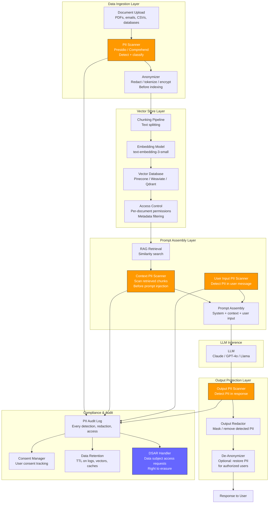
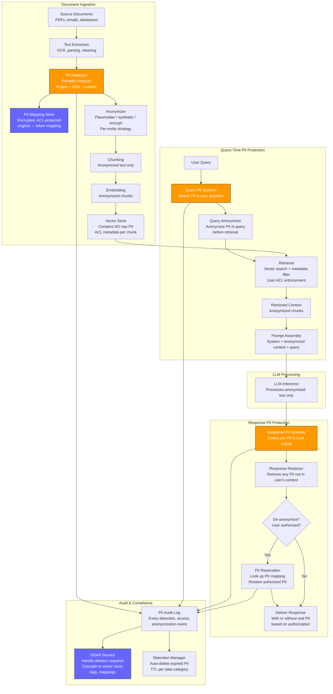
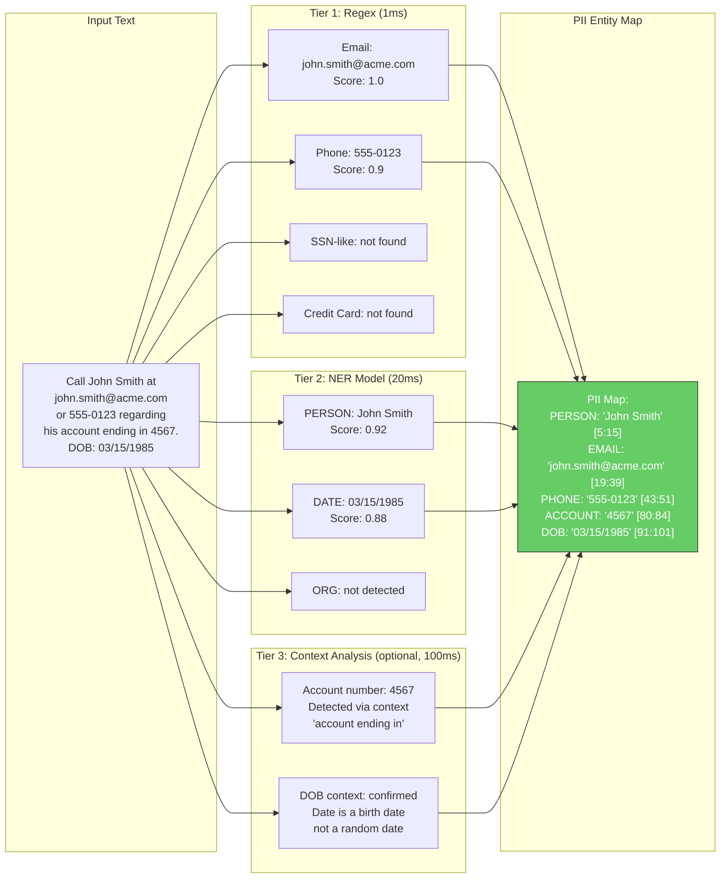
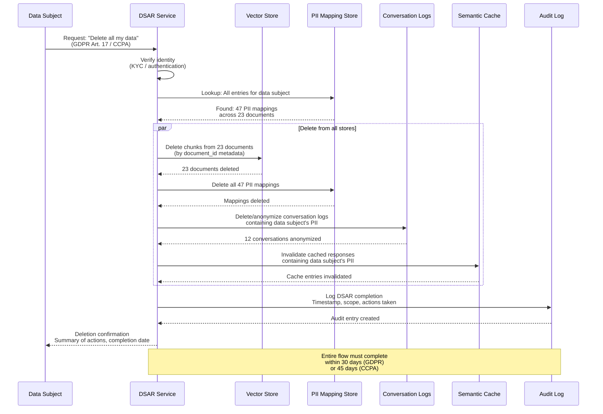

# PII Detection and Protection

## 1. Overview

PII (Personally Identifiable Information) protection in LLM systems is the discipline of detecting, classifying, and neutralizing personal data at every stage of the GenAI pipeline --- from document ingestion and vector storage through prompt assembly, model inference, and response delivery. Unlike traditional PII protection (database column masking, field-level encryption), LLM PII protection must handle unstructured text where personal data appears in arbitrary positions, formats, and languages, embedded within natural language that the model must still understand and reason over.

The challenge is unique to LLM systems for several reasons:
- **Unstructured context**: PII is not in labeled database columns --- it appears organically in documents, conversations, emails, and retrieved passages. "Call John Smith at 555-0123 about his account ending in 4567" contains four PII elements in a single sentence.
- **Model memorization**: LLMs memorize training data, including PII. A model trained on web data can reproduce phone numbers, email addresses, and other personal information verbatim when prompted with sufficient context. Carlini et al. (2021) demonstrated extraction of training data (including PII) from GPT-2.
- **RAG amplification**: RAG pipelines retrieve documents containing PII and inject them into the prompt context. Without protection, the model processes (and may reproduce) PII from documents the user should not have access to.
- **Vector store persistence**: When documents containing PII are embedded and stored in vector databases, the PII persists in the embedding space. While raw PII cannot be directly extracted from embeddings, the associated text chunks stored alongside vectors contain the original PII.
- **Cross-request leakage**: In multi-tenant systems, PII from one user's context could leak into another user's response through shared caches (KV cache, semantic cache) or context window reuse.
- **Regulatory stakes**: GDPR (EU), CCPA (California), HIPAA (US healthcare), PIPEDA (Canada), LGPD (Brazil), and POPIA (South Africa) impose fines ranging from $50K to 4% of global annual revenue for PII mishandling. In LLM systems, every prompt and response is a potential compliance surface.

**PII categories relevant to LLM systems:**

| Category | Examples | Regulatory Context | Detection Difficulty |
|---|---|---|---|
| Direct identifiers | Full name, SSN, passport number, driver's license | All regulations | Medium (format varies by country) |
| Contact information | Email, phone number, physical address | GDPR, CCPA | Low (well-defined formats) |
| Financial data | Credit card number, bank account, tax ID | PCI-DSS, GDPR, CCPA | Low (regex-catchable formats) |
| Health information (PHI) | Diagnoses, medications, treatment records, insurance IDs | HIPAA, GDPR Art. 9 | High (domain-specific, contextual) |
| Biometric data | Fingerprints, facial features, voice prints | GDPR Art. 9, BIPA (Illinois) | High (often described in text, not in fixed format) |
| Location data | GPS coordinates, home address, travel patterns | GDPR, CCPA | Medium |
| Online identifiers | IP addresses, device IDs, cookie IDs | GDPR, ePrivacy | Low (format-based) |
| Employment data | Salary, performance reviews, employee ID | GDPR, CCPA | Medium (contextual) |
| Demographic data | Age, date of birth, gender, ethnicity, religion | GDPR Art. 9 (special categories) | Medium (contextual) |

---

## 2. Where It Fits in GenAI Systems

PII protection is not a single checkpoint --- it is a cross-cutting concern that must be enforced at every stage where personal data could enter, persist within, or exit the LLM system.



PII protection interacts with these adjacent systems:

- **Guardrails** (parent framework): PII detection and redaction runs as a guardrail within the broader guardrail pipeline. The guardrail orchestrator manages PII checks alongside toxicity, injection, and other validators. See [guardrails.md](./guardrails.md).
- **Document ingestion** (upstream): PII scanning at ingestion time prevents personal data from entering the vector store. This is the most critical intervention point --- cleaning data at the source is far more reliable than cleaning it downstream. See [document-ingestion.md](../04-rag/document-ingestion.md).
- **Enterprise search** (peer): Enterprise RAG systems search across documents containing employee data, customer records, and internal communications. PII protection ensures that search results are filtered by user authorization. See [enterprise-search.md](../13-case-studies/enterprise-search.md).
- **AI governance** (governance layer): PII protection is a core technical control for AI governance frameworks. Compliance audits verify that PII is detected, anonymized, and logged according to regulatory requirements. See [ai-governance.md](./ai-governance.md).
- **Encryption** (infrastructure): PII at rest (in vector stores, logs, caches) must be encrypted. PII in transit (between services) must use TLS. Field-level encryption provides defense in depth. See [encryption.md](../../traditional-system-design/09-security/encryption.md).
- **Authentication and authorization** (access control): PII access is governed by RBAC/ABAC policies. A user should only see PII in documents they are authorized to access. See [authentication-authorization.md](../../traditional-system-design/09-security/authentication-authorization.md).

---

## 3. Core Concepts

### 3.1 PII Taxonomy for LLM Systems

PII classification must be more granular for LLM systems than for traditional databases because the model's ability to combine individually non-identifying information creates re-identification risks.

**Direct identifiers (high sensitivity):**
These uniquely identify an individual without additional context. Exposure of a single direct identifier constitutes a data breach under most regulations.
- Social Security Number (SSN), national ID numbers
- Passport number, driver's license number
- Full name + date of birth (combination is quasi-unique)
- Biometric identifiers (fingerprint template, facial recognition hash)
- Financial account numbers (credit card, bank account)

**Quasi-identifiers (medium sensitivity):**
These do not uniquely identify an individual alone, but in combination can enable re-identification. Sweeney (2000) demonstrated that 87% of the US population can be uniquely identified by zip code + date of birth + gender. LLMs are particularly dangerous here because they can reason across quasi-identifiers in context:
- Date of birth, age
- Zip code / postal code
- Gender, ethnicity
- Employer, job title
- Medical conditions (without name)
- Educational institution + graduation year

**Contextual identifiers:**
Information that becomes PII only in a specific context:
- "The CEO" is PII in a company with one CEO
- "The patient in room 302" is PII in a hospital context
- "My neighbor at 42 Oak Street" enables identification through address
- Rare medical conditions + location can identify individuals

**LLM-specific PII risks:**
- **Memorized PII**: The model may reproduce PII from its training data when given sufficient context cues (e.g., "What is the phone number of [specific person]?")
- **Inferential PII**: The model may infer PII from quasi-identifiers: "Based on the information provided (employer, job title, city, age range), this individual is likely [name]"
- **Cross-document aggregation**: RAG pipelines may retrieve multiple documents about the same individual, combining quasi-identifiers into a re-identifiable profile

### 3.2 Detection Methods

PII detection in unstructured text is a classification problem: for each span of text, determine whether it contains PII and, if so, which type. Detection methods fall into three categories with increasing accuracy and cost.

**Regex-based detection:**

Pattern matching using regular expressions. Fast, deterministic, and interpretable. Effective for PII types with well-defined formats.

```python
PII_PATTERNS = {
    "SSN": r"\b\d{3}-\d{2}-\d{4}\b",
    "CREDIT_CARD": r"\b(?:\d{4}[-\s]?){3}\d{4}\b",
    "EMAIL": r"\b[A-Za-z0-9._%+-]+@[A-Za-z0-9.-]+\.[A-Z|a-z]{2,}\b",
    "PHONE_US": r"\b(?:\+1[-.\s]?)?\(?\d{3}\)?[-.\s]?\d{3}[-.\s]?\d{4}\b",
    "IP_ADDRESS": r"\b(?:\d{1,3}\.){3}\d{1,3}\b",
    "DATE_OF_BIRTH": r"\b(?:born|DOB|date of birth)[:\s]+\d{1,2}[/-]\d{1,2}[/-]\d{2,4}\b",
    "US_PASSPORT": r"\b[A-Z]\d{8}\b",
    "IBAN": r"\b[A-Z]{2}\d{2}[A-Z0-9]{4}\d{7}([A-Z0-9]?){0,16}\b",
}
```

Strengths: Zero latency overhead, no model loading, no GPU, works on any text length. Weaknesses: Only catches PII in standard formats. Misses: misspelled emails, phone numbers in prose ("five five five zero one two three"), names, addresses in non-standard formats, contextual PII.

**NER (Named Entity Recognition) models:**

Transformer-based models fine-tuned for PII entity recognition. They understand context and can detect PII types that regex cannot.

Key models:
- **spaCy NER** (`en_core_web_trf`): Detects PERSON, ORG, GPE (geo-political entity), DATE, etc. Not specifically trained for PII but provides a foundation. Latency: 10--30ms. Accuracy: 85--90% F1 on standard NER benchmarks. Weakness: does not detect SSN, credit cards, emails (not NER entity types).
- **Flair NER**: BiLSTM-CRF models with contextual string embeddings. Models: `ner-english-ontonotes-large` (18 entity types), `ner-english-large` (4 types: PER, ORG, LOC, MISC). Latency: 20--50ms.
- **GLiNER**: Generalist NER model that accepts arbitrary entity type labels at inference time. You can specify `["person name", "phone number", "email address", "medical condition"]` as entity types without fine-tuning. Latency: 30--80ms. Strong for custom PII types.
- **Fine-tuned PII models**: Models specifically trained on PII detection datasets. `dslim/bert-base-NER-PII`, `ai4privacy/pii-ner-bert`. These achieve 90--95% F1 on PII benchmarks but may struggle with domain-specific formats.

**LLM-based detection:**

Use an LLM to detect PII with natural language instructions. The most flexible and accurate approach, but the most expensive.

```
Analyze the following text and identify ALL personally identifiable information.
For each PII element found, provide:
1. The exact text span
2. The PII type (name, email, phone, SSN, address, etc.)
3. Confidence score (HIGH/MEDIUM/LOW)

Text: """
Please contact John Smith at john.smith@acme.com or 555-0123 regarding
his account ending in 4567. His DOB is 03/15/1985 and he lives at
42 Oak Street, Springfield, IL 62704.
"""
```

Strengths: Catches all PII types including contextual identifiers. Understands meaning, not just format. Can detect quasi-identifiers and re-identification risks. Can be customized with domain-specific instructions. Weaknesses: 100--500ms latency per call. $0.005--0.02 per call. Not deterministic (may miss PII on repeated runs). Potential for the LLM itself to memorize/retain PII.

**Layered detection architecture (recommended for production):**

```
Text → Regex (1ms) → NER model (20ms) → LLM-as-judge (100ms, selective) → Aggregated PII map
```

1. Regex catches all format-based PII (SSN, email, credit card, phone).
2. NER model catches name, address, organization, and other entity-based PII.
3. LLM-as-judge is invoked only for high-sensitivity documents where comprehensive detection is required.
4. Results are merged into a unified PII map with entity type, text span, detection method, and confidence score.

### 3.3 Microsoft Presidio

[Microsoft Presidio](https://github.com/microsoft/presidio) is the most widely adopted open-source PII detection and anonymization framework. It provides a modular architecture with separate **analyzer** (detection) and **anonymizer** (protection) components.

**Analyzer component:**

The Presidio Analyzer detects PII using a pluggable recognizer architecture:

- **PatternRecognizer**: Regex-based detection for format-defined PII (SSN, credit card, email, phone, IBAN, etc.). Ships with 20+ built-in patterns.
- **SpacyRecognizer**: spaCy NER model for entity-based PII (PERSON, LOCATION, ORGANIZATION).
- **TransformersRecognizer**: Hugging Face transformer models for higher-accuracy NER. Supports any token classification model.
- **Custom recognizers**: Organizations add domain-specific recognizers (employee IDs, internal account numbers, custom document numbers).

```python
from presidio_analyzer import AnalyzerEngine, PatternRecognizer, Pattern

# Initialize analyzer with default recognizers
analyzer = AnalyzerEngine()

# Add a custom recognizer for internal employee IDs (format: EMP-XXXXX)
emp_id_recognizer = PatternRecognizer(
    supported_entity="EMPLOYEE_ID",
    patterns=[Pattern("emp_id", r"\bEMP-\d{5}\b", 0.85)],
)
analyzer.registry.add_recognizer(emp_id_recognizer)

# Analyze text
text = "Contact John Smith (EMP-12345) at john.smith@acme.com or 555-0123."
results = analyzer.analyze(
    text=text,
    language="en",
    entities=[
        "PERSON", "EMAIL_ADDRESS", "PHONE_NUMBER",
        "CREDIT_CARD", "US_SSN", "EMPLOYEE_ID",
    ],
    score_threshold=0.5,  # Minimum confidence
)

# Results: list of RecognizerResult objects
# [RecognizerResult(entity_type='PERSON', start=8, end=18, score=0.85),
#  RecognizerResult(entity_type='EMPLOYEE_ID', start=20, end=29, score=0.85),
#  RecognizerResult(entity_type='EMAIL_ADDRESS', start=34, end=54, score=1.0),
#  RecognizerResult(entity_type='PHONE_NUMBER', start=58, end=66, score=0.75)]
```

**Anonymizer component:**

The Presidio Anonymizer applies protection operators to detected PII spans:

| Operator | Behavior | Example | Reversible? |
|---|---|---|---|
| `Replace` | Replace with entity type label | "John Smith" -> `<PERSON>` | No |
| `Redact` | Remove entirely | "John Smith" -> "" | No |
| `Hash` | Replace with hash | "John Smith" -> `a3f2b91e` | No (one-way) |
| `Mask` | Partially mask | "555-0123" -> "***-**23" | No |
| `Encrypt` | AES-256 encrypt | "John Smith" -> `xK3f8...` | Yes (with key) |
| `Custom` | Any user-defined function | "John Smith" -> "Alice Johnson" (synthetic) | Depends |

```python
from presidio_anonymizer import AnonymizerEngine
from presidio_anonymizer.entities import OperatorConfig

anonymizer = AnonymizerEngine()

# Define per-entity anonymization strategies
operators = {
    "PERSON": OperatorConfig("replace", {"new_value": "<PERSON>"}),
    "EMAIL_ADDRESS": OperatorConfig("mask", {"chars_to_mask": 5, "masking_char": "*", "from_end": False}),
    "PHONE_NUMBER": OperatorConfig("redact"),
    "US_SSN": OperatorConfig("hash", {"hash_type": "sha256"}),
    "CREDIT_CARD": OperatorConfig("mask", {"chars_to_mask": 12, "masking_char": "*", "from_end": False}),
}

anonymized = anonymizer.anonymize(
    text=text,
    analyzer_results=results,
    operators=operators,
)
# Output: "Contact <PERSON> (EMP-12345) at *****ith@acme.com or ."
```

**Presidio in LLM pipelines:**

Presidio is typically deployed at three points:
1. **Document ingestion**: Scan and anonymize documents before chunking and embedding.
2. **Input guardrail**: Scan user messages for PII before prompt assembly.
3. **Output guardrail**: Scan model responses for PII before delivery.

For RAG pipelines, Presidio at ingestion time is the most critical deployment point. Anonymizing before embedding ensures that PII never enters the vector store.

### 3.4 AWS Comprehend PII Detection

Amazon Comprehend provides managed PII detection as part of its NLP service. It supports two modes:

**Real-time PII detection** (`DetectPiiEntities`):
- Supports 20+ PII entity types: NAME, ADDRESS, AGE, DATE_TIME, BANK_ACCOUNT_NUMBER, CREDIT_DEBIT_NUMBER, SSN, PASSPORT_NUMBER, PHONE, EMAIL, URL, IP_ADDRESS, etc.
- Returns entity type, start/end offsets, and confidence score.
- Latency: 50--200ms per request.
- Pricing: $0.0001 per unit (100 characters).

**Redaction mode** (`ContainsPiiEntities` + `DetectPiiEntities`):
- Comprehend can classify entire documents for PII presence (fast binary check) or detect specific entities.
- Redaction must be implemented by the caller using the detected offsets.

**Comprehend vs. Presidio:**

| Dimension | AWS Comprehend | Microsoft Presidio |
|---|---|---|
| Deployment | Managed API (AWS) | Self-hosted (open source) |
| Latency | 50--200ms (network + inference) | 10--50ms (local inference) |
| Cost | $0.0001/100 chars (~$1 per 1M chars) | GPU hosting cost only |
| Customization | Limited (predefined entity types) | Highly extensible (custom recognizers) |
| Language support | 10+ languages | Depends on NER model (spaCy: 20+) |
| Data privacy | Data sent to AWS | Data stays on-premises |
| HIPAA compliance | BAA available | Self-managed compliance |
| Best for | AWS-native architectures, quick setup | On-premises, custom requirements, high volume |

### 3.5 Google Cloud DLP (Data Loss Prevention)

Google Cloud DLP is Google's PII detection and de-identification service. It is the most comprehensive managed service, supporting 150+ built-in infoTypes (PII categories).

**Key capabilities for LLM systems:**

- **InfoType detection**: Detects PII across 150+ categories (PERSON_NAME, PHONE_NUMBER, EMAIL_ADDRESS, CREDIT_CARD_NUMBER, US_SOCIAL_SECURITY_NUMBER, MEDICAL_RECORD_NUMBER, CANADA_SIN, etc.).
- **Custom infoTypes**: Define custom PII patterns using regex, dictionaries, or stored infoTypes.
- **De-identification transforms**: Masking, redaction, replacement, crypto-hashing, bucketing, date shifting, tokenization (format-preserving encryption).
- **Inspection jobs**: Batch scanning of Cloud Storage, BigQuery, or Datastore for PII discovery. Useful for auditing existing document corpora before RAG ingestion.
- **Likelihood scoring**: Each detection includes a likelihood score (VERY_UNLIKELY to VERY_LIKELY) enabling threshold-based filtering.
- **Risk analysis**: K-anonymity, l-diversity, and k-map analysis for re-identification risk assessment.

**De-identification transforms relevant to LLM pipelines:**

| Transform | Description | Use Case |
|---|---|---|
| Masking | Replace characters with a mask (`***-**-1234`) | Display redacted data with partial visibility |
| Redaction | Remove PII entirely | Strictest protection, data loss acceptable |
| Replacement | Replace with a placeholder (`[PERSON_NAME]`) | Maintain text structure for LLM processing |
| Crypto replacement | Replace with a cryptographic token (reversible) | Need to restore PII after LLM processing |
| Date shifting | Shift dates by a random delta (consistent per entity) | Preserve temporal relationships while protecting dates |
| Bucketing | Replace exact values with ranges (`age: 30-40`) | Preserve utility while generalizing |

**Google Cloud DLP in LLM architectures:**

Cloud DLP is particularly powerful for document ingestion pipelines:
1. Scan uploaded documents with DLP inspection jobs.
2. Apply de-identification transforms before chunking.
3. Store both the anonymized chunks (for RAG) and the original-to-anonymized mapping (for authorized de-anonymization).
4. Use DLP's risk analysis to assess whether the anonymized corpus has re-identification risks.

### 3.6 Redaction Strategies

The choice of redaction strategy determines the balance between data utility (how much the LLM can still reason over the text) and privacy protection (how difficult re-identification becomes).

**Strategy 1: Placeholder replacement**

Replace PII with typed placeholders: "Call [PERSON_1] at [PHONE_1] about account [ACCOUNT_1]."

- Preserves text structure and semantic relationships.
- The LLM can still reason about the sentence ("someone should be contacted about an account").
- No risk of re-identification from the placeholder itself.
- De-anonymization is straightforward: maintain a mapping `{PERSON_1: "John Smith", PHONE_1: "555-0123"}`.
- Weakness: Numbered placeholders leak entity count. An attacker knows there are exactly N persons mentioned.

**Strategy 2: Masking (partial redaction)**

Reveal partial information: "Call J*** S**** at ***-0123 about account ****4567."

- Preserves some utility (last 4 digits of phone/account for verification).
- Common in customer support contexts where agents need partial identifiers.
- Not suitable for LLM processing --- the model may hallucinate the masked portions.
- Non-reversible.

**Strategy 3: Synthetic replacement**

Replace real PII with realistic but fake PII: "Call Alice Johnson at 555-9876 about account 8765."

- Preserves full text fluency --- the LLM processes it as normal text.
- Best for maintaining LLM reasoning quality (the model does not see `[PLACEHOLDER]` tokens that may confuse it).
- Requires a synthetic data generator (Faker library, custom generator).
- De-anonymization: maintain a mapping `{generated_id: real_value}`.
- Risk: If the synthetic data accidentally matches real PII, it creates a false association.

```python
from faker import Faker

fake = Faker()
fake.seed_instance(42)  # Reproducible for consistent de-anonymization

def synthetic_replace(entity_type: str) -> str:
    generators = {
        "PERSON": fake.name,
        "EMAIL_ADDRESS": fake.email,
        "PHONE_NUMBER": fake.phone_number,
        "ADDRESS": fake.address,
        "CREDIT_CARD": fake.credit_card_number,
        "SSN": fake.ssn,
        "DATE_OF_BIRTH": lambda: fake.date_of_birth().isoformat(),
        "COMPANY": fake.company,
    }
    generator = generators.get(entity_type, lambda: f"[{entity_type}]")
    return generator()
```

**Strategy 4: Tokenization (format-preserving encryption)**

Replace PII with a cryptographic token that preserves the format: SSN `123-45-6789` becomes `789-01-2345` (looks like a valid SSN but is not the real one).

- Preserves format for downstream systems that validate format (e.g., phone number field validation).
- Reversible with the encryption key.
- Used in regulated industries (banking, healthcare) where audit trails require re-identification capability.
- Implementation: AES-FF1 or AES-FF3 (NIST SP 800-38G format-preserving encryption).
- Higher implementation complexity than placeholder replacement.

**Strategy 5: Differential privacy**

Add calibrated noise to numeric PII values (ages, salaries, scores) to protect individuals while preserving statistical properties of the dataset.

- Primarily useful for aggregate analytics, not individual document processing.
- Provides formal privacy guarantees (epsilon-differential privacy).
- Not applicable to non-numeric PII (names, emails).
- Relevant when LLM systems perform analytics over datasets containing PII.

### 3.7 Anonymization vs. Pseudonymization

This distinction has critical legal implications under GDPR and other regulations.

**Anonymization** (GDPR Recital 26): Processing that renders data permanently non-identifiable. If data is truly anonymized, it is no longer "personal data" and GDPR does not apply. The key test: is re-identification reasonably possible using any means likely to be used? If no, it is anonymized.

Requirements for true anonymization:
- Direct identifiers removed or generalized beyond re-identification.
- Quasi-identifiers generalized or suppressed (k-anonymity with k >= 5, l-diversity).
- No mapping exists between anonymized and original data.
- Singleton detection: if a combination of quasi-identifiers matches only one individual, the record must be suppressed.

**Pseudonymization** (GDPR Article 4(5)): Processing that replaces identifiers with pseudonyms (tokens, codes, encrypted values) such that the data can no longer be attributed to a specific individual without additional information (the mapping/key). Pseudonymized data is still personal data under GDPR, but pseudonymization is recognized as a risk-reduction measure and can enable processing under certain legal bases.

The key difference: anonymized data has no path back to the individual. Pseudonymized data has a path back (the mapping) that must be secured.

**Decision framework for LLM systems:**

| Scenario | Strategy | Rationale |
|---|---|---|
| Training data curation | Anonymization | Data will be used broadly; no need to link back |
| RAG document ingestion (internal) | Pseudonymization (placeholder) | May need to restore PII for authorized users |
| RAG document ingestion (public) | Anonymization | No legitimate need to re-identify |
| User conversation logging | Pseudonymization (tokenization) | May need logs for incident investigation |
| Analytics and reporting | Anonymization (aggregation) | Individual-level data not needed |
| Healthcare LLM (HIPAA) | Pseudonymization (encryption) | PHI must be recoverable for treatment |

### 3.8 PII in RAG Pipelines

RAG pipelines introduce three specific PII risk surfaces that do not exist in simple chatbot architectures:

**Risk 1: PII in the vector store**

When documents containing PII are chunked and embedded, the PII persists in the stored text chunks. Even if the embeddings themselves do not directly encode PII, the associated metadata and raw text do.

Mitigation architecture:
```
Document → PII Detection → Anonymize → Chunk → Embed → Store anonymized chunks
                        ↓
               PII Mapping Store (encrypted, ACL-protected)
                        ↓
               De-anonymize at response time (authorized users only)
```

The PII mapping store is a separate, encrypted database that maps anonymized tokens to real PII values. Access is controlled by RBAC. Only when the requesting user has the appropriate permission is the de-anonymized text returned.

**Risk 2: Cross-document PII aggregation**

A RAG query retrieves multiple chunks from different documents that, when combined, reveal more PII than any single document contains.

Example: Document A says "Employee in Seattle office, Engineering team." Document B says "Only one woman on the Seattle Engineering team." Combined: the individual is identifiable.

Mitigation:
- Apply re-identification risk analysis (k-anonymity check) on the combined retrieved context.
- If the combined context could re-identify an individual (k < 5), suppress the most identifying chunks.
- This is computationally expensive and typically only implemented for high-sensitivity domains (healthcare, HR).

**Risk 3: PII leakage through retrieval**

A user queries the RAG system with a question that causes retrieval of documents they should not have access to. Without access control, the RAG pipeline may inject another employee's performance review into the context for a question about "team performance."

Mitigation:
- **Metadata filtering**: Every document chunk carries access control metadata (department, classification level, owner). At retrieval time, filter results to only include chunks the requesting user is authorized to access.
- **Pre-retrieval authorization**: Before the vector search, resolve the user's permissions and construct a metadata filter.
- **Post-retrieval authorization**: After vector search, filter results against the user's ACL. Less efficient (retrieves and discards unauthorized chunks) but simpler to implement.

### 3.9 Compliance Requirements

**GDPR (EU General Data Protection Regulation):**
- **Article 5**: Personal data must be processed lawfully, fairly, and transparently. Processed for specified purposes. Minimized (only collect what is needed). Accurate. Stored only as long as necessary. Protected with appropriate security.
- **Article 6**: Legal basis for processing (consent, contract, legitimate interest, legal obligation, vital interest, public task).
- **Article 9**: Special categories (health, biometric, racial/ethnic, political, religious, sexual orientation) require explicit consent or specific legal basis.
- **Article 17**: Right to erasure ("right to be forgotten"). Data subjects can request deletion of their personal data. In LLM systems, this means: delete from vector stores, delete from logs, delete from training data (if applicable), and verify deletion from caches.
- **Article 22**: Right not to be subject to automated decision-making. If the LLM system makes decisions affecting individuals, there must be human oversight.
- **Article 25**: Data protection by design and by default. PII protection must be built into the system architecture, not bolted on.
- **Fines**: Up to EUR 20M or 4% of global annual turnover, whichever is higher.

**CCPA (California Consumer Privacy Act):**
- Right to know: Consumers can request disclosure of what personal information is collected.
- Right to delete: Consumers can request deletion of personal information.
- Right to opt-out of sale: Consumers can opt out of the sale of their personal information.
- Private right of action: Consumers can sue for data breaches involving unencrypted PII.
- Relevant to LLM systems: If user conversations are used for model training or improvement, this may constitute "sale" or "sharing" under CCPA.

**HIPAA (US Health Insurance Portability and Accountability Act):**
- Applies to "covered entities" (healthcare providers, insurers) and their "business associates."
- Protected Health Information (PHI) is a strict superset of general PII: includes all 18 HIPAA identifiers (name, DOB, SSN, medical record number, etc.) plus any information about health status, care provision, or payment for care.
- **Safe Harbor de-identification**: Remove all 18 HIPAA identifiers and attest that there is no reasonable basis to believe the remaining information can identify an individual.
- **Expert determination**: A statistical expert certifies that re-identification risk is "very small."
- BAA (Business Associate Agreement) required with any vendor processing PHI --- this includes LLM API providers (OpenAI, Anthropic) if PHI is sent in prompts.
- Fines: $100--$50,000 per violation, up to $1.5M/year per category.

**SOC 2 (System and Organization Controls 2):**
- Not a law but an audit framework for service providers.
- Trust Services Criteria: Security, Availability, Processing Integrity, Confidentiality, Privacy.
- PII protection is a core control for the Privacy and Confidentiality criteria.
- LLM systems processing customer data must demonstrate: access controls on PII, encryption at rest and in transit, audit logging of PII access, data retention policies, and incident response procedures.

---

## 4. Architecture

### 4.1 End-to-End PII Protection Architecture for RAG Systems



### 4.2 PII Detection Pipeline Detail



### 4.3 DSAR (Data Subject Access Request) Flow for LLM Systems



---

## 5. Design Patterns

### 5.1 Anonymize-at-Ingestion Pattern

Anonymize all PII at document ingestion time, before any data enters the vector store. Store the PII mapping separately in an encrypted, access-controlled store. This is the strongest protection pattern because PII never touches the vector database, embedding model, or LLM.

Flow:
1. Detect PII in the raw document.
2. Generate anonymized replacements (placeholders or synthetic data).
3. Store the mapping `{document_id, entity_id, original_value, anonymized_value}` in the PII mapping store.
4. Chunk and embed the anonymized text.
5. At query time, the LLM processes anonymized text. If the user is authorized, de-anonymize the response using the mapping store.

Tradeoff: The LLM sees placeholders like `[PERSON_1]` instead of real names, which may reduce response quality in some contexts (e.g., "Please draft an email to [PERSON_1]" is less natural than "Please draft an email to John Smith").

### 5.2 Just-in-Time Anonymization Pattern

Anonymize PII only at the moment it would be exposed to an unauthorized party. Raw PII is stored (encrypted) in the vector store and only anonymized during prompt assembly, based on the requesting user's authorization level.

Flow:
1. Store documents with original PII (encrypted at rest).
2. At retrieval time, check the user's authorization for each retrieved chunk.
3. For authorized chunks, pass original text to the prompt.
4. For unauthorized chunks, anonymize PII before including in the prompt.
5. In the output, scan for PII and redact any that the user is not authorized to see.

Tradeoff: Higher data utility (LLM sees real names and can compose natural responses) but higher risk (PII is stored in the vector database, albeit encrypted). Requires robust access control and encryption.

### 5.3 PII Firewall Pattern

Deploy a dedicated PII protection service as a mandatory intermediary between the application and the LLM. All text flowing to and from the LLM passes through the PII firewall. The firewall detects, anonymizes, and de-anonymizes PII transparently.

Architecture:
```
Application → PII Firewall (anonymize) → LLM → PII Firewall (de-anonymize) → Application
```

The firewall maintains session-scoped PII mappings. For the duration of a conversation, it consistently maps `John Smith` to `[PERSON_1]` in every message and back. The application never sees the anonymized text; the LLM never sees the real PII.

Benefits: Centralized enforcement. No PII reaches the LLM provider's servers. Works with any LLM (no model changes needed). Audit trail for all PII processed.

### 5.4 Tiered Sensitivity Pattern

Classify PII by sensitivity level and apply different protection strategies:

| Tier | PII Types | Strategy | Rationale |
|---|---|---|---|
| Critical | SSN, passport, credit card, health records | Encrypt + never send to LLM | Legal liability, breach notification |
| High | Full name, email, phone, address | Pseudonymize (placeholder or synthetic) | Identifiable, regulated |
| Medium | Job title, employer, city | Generalize (e.g., "a tech company in the Bay Area") | Quasi-identifiers, re-identification risk |
| Low | Age range, gender | Pass through (with consent) | Low re-identification risk alone |

The tiered approach maximizes data utility (the LLM sees more useful information at lower tiers) while protecting the most sensitive data aggressively.

### 5.5 Consent-Gated PII Pattern

The user explicitly consents to PII processing at different granularities. The system enforces the consent level:

- **No consent**: All PII is fully anonymized. The LLM processes only anonymized text.
- **Partial consent**: Specific PII types are shared (e.g., name and email for personalization). Other types are anonymized.
- **Full consent**: PII is sent to the LLM as-is. The user accepts the privacy tradeoff for better personalization.

Implementation: A consent manager stores per-user consent preferences. The PII firewall consults the consent manager before anonymizing. The audit log records the consent basis for every PII processing event.

---

## 6. Implementation Approaches

### 6.1 Presidio-Based PII Pipeline for RAG

```python
from presidio_analyzer import AnalyzerEngine, RecognizerRegistry
from presidio_analyzer.nlp_engine import NlpEngineProvider
from presidio_anonymizer import AnonymizerEngine
from presidio_anonymizer.entities import OperatorConfig
from dataclasses import dataclass
from typing import Optional
import json
import hashlib

@dataclass
class PIIMapping:
    document_id: str
    entity_type: str
    original_value: str
    anonymized_value: str
    start: int
    end: int
    score: float

class PIIProtectionPipeline:
    """Production PII detection and anonymization for RAG pipelines."""

    def __init__(self, mapping_store, entities: list[str] = None):
        # Configure NLP engine with transformer model for better NER
        provider = NlpEngineProvider(nlp_configuration={
            "nlp_engine_name": "spacy",
            "models": [{"lang_code": "en", "model_name": "en_core_web_trf"}],
        })
        nlp_engine = provider.create_engine()

        self.analyzer = AnalyzerEngine(
            nlp_engine=nlp_engine,
            supported_languages=["en"],
        )
        self.anonymizer = AnonymizerEngine()
        self.mapping_store = mapping_store  # Encrypted key-value store

        self.entities = entities or [
            "PERSON", "EMAIL_ADDRESS", "PHONE_NUMBER",
            "US_SSN", "CREDIT_CARD", "IBAN_CODE",
            "IP_ADDRESS", "DATE_TIME", "LOCATION",
            "US_PASSPORT", "US_DRIVER_LICENSE",
            "MEDICAL_LICENSE", "US_BANK_NUMBER",
        ]

        # Per-entity anonymization strategies
        self.operators = {
            "PERSON": OperatorConfig("replace", {"new_value": "<PERSON>"}),
            "EMAIL_ADDRESS": OperatorConfig("replace", {"new_value": "<EMAIL>"}),
            "PHONE_NUMBER": OperatorConfig("replace", {"new_value": "<PHONE>"}),
            "US_SSN": OperatorConfig("hash", {"hash_type": "sha256"}),
            "CREDIT_CARD": OperatorConfig("mask", {
                "chars_to_mask": 12, "masking_char": "*", "from_end": False,
            }),
            "IP_ADDRESS": OperatorConfig("replace", {"new_value": "<IP_ADDRESS>"}),
            "LOCATION": OperatorConfig("replace", {"new_value": "<LOCATION>"}),
            "DATE_TIME": OperatorConfig("replace", {"new_value": "<DATE>"}),
        }

    def detect(self, text: str, score_threshold: float = 0.5) -> list:
        """Detect PII entities in text."""
        return self.analyzer.analyze(
            text=text,
            language="en",
            entities=self.entities,
            score_threshold=score_threshold,
        )

    def anonymize(self, text: str, document_id: str) -> tuple[str, list[PIIMapping]]:
        """Detect and anonymize PII. Return anonymized text and mappings."""
        results = self.detect(text)

        if not results:
            return text, []

        anonymized = self.anonymizer.anonymize(
            text=text,
            analyzer_results=results,
            operators=self.operators,
        )

        # Create mappings for de-anonymization
        mappings = []
        for result in results:
            original = text[result.start:result.end]
            mappings.append(PIIMapping(
                document_id=document_id,
                entity_type=result.entity_type,
                original_value=original,
                anonymized_value=self._get_anonymized_value(result, text),
                start=result.start,
                end=result.end,
                score=result.score,
            ))

        # Store mappings in encrypted store
        self.mapping_store.store(document_id, mappings)

        return anonymized.text, mappings

    def deanonymize(self, text: str, document_id: str, user_authorized: bool) -> str:
        """Restore PII in text if user is authorized."""
        if not user_authorized:
            return text

        mappings = self.mapping_store.retrieve(document_id)
        if not mappings:
            return text

        for mapping in reversed(mappings):  # Reverse to preserve offsets
            text = text.replace(mapping.anonymized_value, mapping.original_value, 1)

        return text

    def _get_anonymized_value(self, result, original_text: str) -> str:
        """Determine what the anonymized value will be for mapping."""
        entity = result.entity_type
        original = original_text[result.start:result.end]
        if entity in self.operators:
            op = self.operators[entity]
            if op.operator_name == "replace":
                return op.params.get("new_value", f"<{entity}>")
            elif op.operator_name == "hash":
                return hashlib.sha256(original.encode()).hexdigest()[:16]
            elif op.operator_name == "mask":
                chars = op.params.get("chars_to_mask", len(original))
                mask_char = op.params.get("masking_char", "*")
                return mask_char * chars + original[chars:]
        return f"<{entity}>"


# Usage in RAG ingestion pipeline
pipeline = PIIProtectionPipeline(mapping_store=encrypted_redis_store)

# At ingestion time
for document in documents:
    anonymized_text, mappings = pipeline.anonymize(
        text=document.text,
        document_id=document.id,
    )
    # Chunk and embed the anonymized text
    chunks = chunk_text(anonymized_text)
    embeddings = embed_chunks(chunks)
    vector_store.upsert(chunks, embeddings, metadata={"doc_id": document.id})

# At query time
retrieved_chunks = vector_store.query(user_query, filter=user_acl_filter)
response = llm.generate(context=retrieved_chunks, query=user_query)
# De-anonymize if user is authorized
final_response = pipeline.deanonymize(
    response, document_id=retrieved_doc_id, user_authorized=check_auth(user)
)
```

### 6.2 AWS Comprehend PII Integration

```python
import boto3

class ComprehendPIIDetector:
    """AWS Comprehend PII detection for LLM guardrails."""

    def __init__(self, region: str = "us-east-1"):
        self.client = boto3.client("comprehend", region_name=region)

    def detect_pii(self, text: str, language: str = "en") -> list[dict]:
        """Detect PII entities using AWS Comprehend."""
        # Comprehend has a 100KB text limit per request
        if len(text.encode("utf-8")) > 100_000:
            return self._detect_chunked(text, language)

        response = self.client.detect_pii_entities(
            Text=text,
            LanguageCode=language,
        )

        entities = []
        for entity in response["Entities"]:
            entities.append({
                "type": entity["Type"],
                "score": entity["Score"],
                "start": entity["BeginOffset"],
                "end": entity["EndOffset"],
                "text": text[entity["BeginOffset"]:entity["EndOffset"]],
            })

        return entities

    def contains_pii(self, text: str, language: str = "en") -> dict:
        """Quick binary PII check (faster than full detection)."""
        response = self.client.contains_pii_entities(
            Text=text,
            LanguageCode=language,
        )
        labels = response.get("Labels", [])
        return {
            "contains_pii": any(l["Score"] > 0.5 for l in labels),
            "labels": [
                {"name": l["Name"], "score": l["Score"]}
                for l in labels if l["Score"] > 0.5
            ],
        }

    def _detect_chunked(self, text: str, language: str) -> list[dict]:
        """Handle texts exceeding Comprehend's size limit."""
        chunk_size = 90_000  # Leave margin for UTF-8 expansion
        entities = []
        offset = 0

        while offset < len(text):
            chunk = text[offset:offset + chunk_size]
            chunk_entities = self.detect_pii(chunk, language)
            for entity in chunk_entities:
                entity["start"] += offset
                entity["end"] += offset
                entities.append(entity)
            offset += chunk_size

        return entities


# Usage as a guardrail
detector = ComprehendPIIDetector()

# Input guardrail
input_pii = detector.detect_pii(user_message)
if input_pii:
    # Anonymize user input before sending to LLM
    anonymized = redact_entities(user_message, input_pii)
    # Alternatively, warn user: "Your message contains PII. Are you sure?"

# Output guardrail
output_pii = detector.detect_pii(llm_response)
if output_pii:
    # Redact PII from LLM output before returning to user
    safe_response = redact_entities(llm_response, output_pii)
```

### 6.3 Google Cloud DLP Integration

```python
from google.cloud import dlp_v2

class CloudDLPProtector:
    """Google Cloud DLP integration for LLM PII protection."""

    def __init__(self, project_id: str):
        self.client = dlp_v2.DlpServiceClient()
        self.project = f"projects/{project_id}"

    def inspect(self, text: str, info_types: list[str] = None) -> list[dict]:
        """Detect PII using Cloud DLP."""
        if info_types is None:
            info_types = [
                "PERSON_NAME", "EMAIL_ADDRESS", "PHONE_NUMBER",
                "CREDIT_CARD_NUMBER", "US_SOCIAL_SECURITY_NUMBER",
                "STREET_ADDRESS", "DATE_OF_BIRTH",
            ]

        inspect_config = {
            "info_types": [{"name": t} for t in info_types],
            "min_likelihood": dlp_v2.Likelihood.POSSIBLE,
            "include_quote": True,
        }

        item = {"value": text}
        response = self.client.inspect_content(
            request={
                "parent": self.project,
                "inspect_config": inspect_config,
                "item": item,
            }
        )

        findings = []
        for finding in response.result.findings:
            findings.append({
                "info_type": finding.info_type.name,
                "likelihood": finding.likelihood.name,
                "quote": finding.quote,
                "location": {
                    "start": finding.location.byte_range.start,
                    "end": finding.location.byte_range.end,
                },
            })

        return findings

    def deidentify(self, text: str, strategy: str = "replace") -> str:
        """De-identify text using Cloud DLP transforms."""
        deidentify_config = self._build_deidentify_config(strategy)

        inspect_config = {
            "info_types": [
                {"name": "PERSON_NAME"},
                {"name": "EMAIL_ADDRESS"},
                {"name": "PHONE_NUMBER"},
                {"name": "CREDIT_CARD_NUMBER"},
                {"name": "US_SOCIAL_SECURITY_NUMBER"},
            ],
        }

        response = self.client.deidentify_content(
            request={
                "parent": self.project,
                "deidentify_config": deidentify_config,
                "inspect_config": inspect_config,
                "item": {"value": text},
            }
        )

        return response.item.value

    def _build_deidentify_config(self, strategy: str) -> dict:
        if strategy == "replace":
            return {
                "info_type_transformations": {
                    "transformations": [{
                        "primitive_transformation": {
                            "replace_with_info_type_config": {},
                        }
                    }]
                }
            }
        elif strategy == "mask":
            return {
                "info_type_transformations": {
                    "transformations": [{
                        "primitive_transformation": {
                            "character_mask_config": {
                                "masking_character": "*",
                                "number_to_mask": 0,  # Mask all
                            }
                        }
                    }]
                }
            }
        elif strategy == "crypto":
            return {
                "info_type_transformations": {
                    "transformations": [{
                        "primitive_transformation": {
                            "crypto_replace_ffx_fpe_config": {
                                "crypto_key": {
                                    "kms_wrapped": {
                                        "wrapped_key": self.wrapped_key,
                                        "crypto_key_name": self.kms_key_name,
                                    }
                                },
                                "common_alphabet": "ALPHA_NUMERIC",
                            }
                        }
                    }]
                }
            }
```

### 6.4 DSAR (Right to Erasure) Implementation

```python
import logging
from datetime import datetime

class DSARHandler:
    """Handle data subject access requests for LLM systems."""

    def __init__(self, vector_store, pii_mapping_store, log_store, cache_store):
        self.vector_store = vector_store
        self.pii_mapping = pii_mapping_store
        self.log_store = log_store
        self.cache_store = cache_store
        self.logger = logging.getLogger("dsar")

    async def handle_erasure_request(
        self,
        data_subject_id: str,
        verified: bool = False,
    ) -> dict:
        """Process a right-to-erasure (GDPR Art. 17) request."""
        if not verified:
            raise ValueError("Identity must be verified before processing DSAR")

        results = {
            "request_id": f"DSAR-{datetime.utcnow().strftime('%Y%m%d%H%M%S')}",
            "data_subject_id": data_subject_id,
            "timestamp": datetime.utcnow().isoformat(),
            "actions": [],
        }

        # 1. Find all documents containing this data subject's PII
        document_ids = await self.pii_mapping.find_documents_for_subject(
            data_subject_id
        )
        results["documents_found"] = len(document_ids)

        # 2. Delete document chunks from vector store
        for doc_id in document_ids:
            deleted = await self.vector_store.delete_by_metadata(
                filter={"document_id": doc_id}
            )
            results["actions"].append({
                "store": "vector_store",
                "action": "delete_chunks",
                "document_id": doc_id,
                "chunks_deleted": deleted,
            })

        # 3. Delete PII mappings
        mappings_deleted = await self.pii_mapping.delete_for_subject(
            data_subject_id
        )
        results["actions"].append({
            "store": "pii_mapping",
            "action": "delete_mappings",
            "count": mappings_deleted,
        })

        # 4. Anonymize conversation logs
        logs_anonymized = await self.log_store.anonymize_for_subject(
            data_subject_id
        )
        results["actions"].append({
            "store": "conversation_logs",
            "action": "anonymize",
            "conversations_affected": logs_anonymized,
        })

        # 5. Invalidate cache entries
        cache_invalidated = await self.cache_store.invalidate_for_subject(
            data_subject_id
        )
        results["actions"].append({
            "store": "semantic_cache",
            "action": "invalidate",
            "entries_removed": cache_invalidated,
        })

        # 6. Audit log the DSAR completion
        self.logger.info(
            "DSAR completed",
            extra={
                "request_id": results["request_id"],
                "data_subject_id": data_subject_id,
                "documents_deleted": len(document_ids),
                "mappings_deleted": mappings_deleted,
                "logs_anonymized": logs_anonymized,
            },
        )

        return results
```

---

## 7. Tradeoffs

### 7.1 PII Detection Service Selection

| Dimension | Microsoft Presidio | AWS Comprehend | Google Cloud DLP | Llama Guard + NER | LLM-as-Judge |
|---|---|---|---|---|---|
| Deployment | Self-hosted | Managed API | Managed API | Self-hosted | Any LLM API |
| Latency | 10--50ms | 50--200ms | 50--200ms | 50--200ms | 100--500ms |
| Cost (1M requests) | GPU hosting (~$100) | ~$100 | ~$150 | GPU hosting (~$200) | ~$5,000--$20,000 |
| Entity types | 20+ built-in, extensible | 20+ fixed | 150+ built-in, extensible | Customizable via prompt | Unlimited |
| Customization | High (custom recognizers) | Low | Medium (custom infoTypes) | High (prompt-based) | Highest (instruction-based) |
| Accuracy (English) | 88--93% F1 | 90--95% F1 | 92--97% F1 | 85--92% F1 | 93--98% F1 |
| Data residency | On-premises | AWS regions | GCP regions | On-premises | Depends on provider |
| Best for | On-prem, custom needs | AWS-native, quick start | Comprehensive coverage | Self-hosted, LLM-native | Highest accuracy, low volume |

### 7.2 Redaction Strategy Selection

| Strategy | Data Utility for LLM | Privacy Strength | Reversibility | Implementation Complexity | Best For |
|---|---|---|---|---|---|
| Placeholder replacement | Medium (LLM sees `[PERSON]`) | High | Yes (with mapping) | Low | Standard RAG, most use cases |
| Masking | Low (LLM sees `J*** S****`) | Medium | No | Low | Customer-facing displays |
| Synthetic replacement | High (LLM sees "Alice Johnson") | High | Yes (with mapping) | Medium | When LLM output quality is critical |
| Tokenization (FPE) | High (format preserved) | Very High | Yes (with key) | High | Regulated industries, banking |
| Full redaction | None (text removed) | Highest | No | Low | When PII context is irrelevant |
| Generalization | Medium (LLM sees "a person in Seattle") | Medium | No | Medium | Analytics, aggregations |

### 7.3 Anonymization vs. Pseudonymization

| Dimension | Anonymization | Pseudonymization |
|---|---|---|
| GDPR status | Not personal data (GDPR does not apply) | Still personal data (GDPR applies) |
| Reversibility | Impossible (no mapping exists) | Possible (mapping/key exists) |
| Data utility | Lower (information lost) | Higher (can restore for authorized use) |
| Implementation cost | Higher (must verify irreversibility) | Lower (replace + store mapping) |
| Compliance burden | None after anonymization | Ongoing (must protect the mapping) |
| Audit requirements | Prove anonymization is robust | Prove mapping is secured |
| Use when | Data shared externally, training data, analytics | Internal RAG, conversation logs, regulated processing |

### 7.4 Protection Placement Strategy

| Placement | What It Protects | Tradeoff |
|---|---|---|
| Ingestion-time only | Vector store, LLM never sees PII | Reduced data utility; PII context lost for all users |
| Query-time only | LLM context per-request | PII persists in vector store (encryption required) |
| Both ingestion + query | Defense in depth | Higher complexity, potential double-anonymization |
| Output-only | Prevents PII in responses | LLM processes raw PII (provider sees it) |
| Full pipeline (all stages) | Maximum protection | Highest latency and complexity; necessary for regulated industries |

---

## 8. Failure Modes

### 8.1 Undetected PII (False Negatives)

**Symptom**: PII reaches the LLM or appears in responses despite detection being enabled.

**Root cause**: PII in non-standard formats (phone numbers written as "five five five zero one two three"), misspelled names, PII in languages not supported by the detector, PII embedded in code comments or JSON strings, PII in images or tables extracted via OCR with errors.

**Mitigation**: Layer multiple detection methods (regex + NER + LLM). Use LLM-as-judge for high-sensitivity documents. Maintain a test suite of non-standard PII formats and validate detector coverage. Add custom regex patterns for domain-specific PII formats discovered during testing.

### 8.2 Over-Redaction (False Positives)

**Symptom**: Non-PII text is redacted, degrading LLM response quality. "The patient's temperature was 98.6" has "98.6" redacted as a numeric identifier. Product names are redacted as person names ("John Deere" the company vs. "John Deere" the person).

**Root cause**: Low confidence thresholds, ambiguous entity types (names that are also common words), numbers that match PII patterns (dates, product codes, measurements).

**Mitigation**: Tune confidence thresholds per entity type (raise thresholds for entity types with high false positive rates). Use context-aware detection (NER models that understand surrounding text). Implement an allowlist for known non-PII patterns (product names, company names, technical terms). Monitor false positive rates and collect user feedback on over-redaction.

### 8.3 PII Reconstruction from Anonymized Data

**Symptom**: A determined attacker combines quasi-identifiers in anonymized data to re-identify individuals.

**Root cause**: Anonymization was insufficient --- only direct identifiers were removed, but quasi-identifiers (zip code, age, job title, department) remained. In RAG pipelines, multiple chunks from different documents may combine to provide re-identification cues.

**Mitigation**: Apply k-anonymity analysis on anonymized datasets. Generalize quasi-identifiers (exact age -> age range, exact zip code -> first 3 digits). Implement cross-document aggregation checks at retrieval time. For high-sensitivity data, use differential privacy techniques on numeric fields.

### 8.4 PII in Model Memorization

**Symptom**: The LLM generates PII from its training data (not from the current context) in response to targeted prompts.

**Root cause**: The model memorized PII during pre-training on web data, books, or code repositories. Larger models memorize more. Low-frequency but high-specificity queries can trigger memorized PII retrieval.

**Mitigation**: This is not solvable at the application layer --- it is a model property. Output PII detection is the defense: scan all LLM outputs for PII regardless of whether the input contained PII. Llama Guard and output PII scanners catch memorized PII in responses. For maximum safety, use models fine-tuned with PII removal from training data (not commonly available).

### 8.5 PII Mapping Store Compromise

**Symptom**: The encrypted PII mapping store is breached, exposing the link between anonymized and real PII.

**Root cause**: Insufficient access controls, encryption key compromise, or insider threat.

**Mitigation**: Encrypt the mapping store with a KMS-managed key (AWS KMS, GCP KMS, Azure Key Vault). Implement strict RBAC on mapping access (only the de-anonymization service, not developers or admins). Audit all access to the mapping store. Rotate encryption keys periodically. Consider splitting the mapping across multiple stores (no single store contains the full mapping).

### 8.6 DSAR Cascade Failure

**Symptom**: A data subject access request (deletion) fails to propagate to all data stores. PII persists in vector stores, caches, or logs after the DSAR was reportedly completed.

**Root cause**: The DSAR handler does not have a complete inventory of all data stores containing PII. New stores (a semantic cache, a debug log) were added after the DSAR handler was implemented. Asynchronous deletion jobs fail silently.

**Mitigation**: Maintain a PII data map --- a registry of all systems that store or process PII. When a new data store is added, the DSAR handler must be updated. Use distributed transactions or saga patterns for DSAR processing. Verify deletion completeness by querying all stores after DSAR execution. Run periodic audits: search all stores for PII belonging to subjects who have submitted DSARs.

---

## 9. Optimization Techniques

### 9.1 Detection Performance

- **Regex first, NER second**: Run regex patterns first (1ms). Only invoke NER models for text that passes regex without detections and is in a high-sensitivity category. This skips the NER model for 60--70% of text that has obvious PII caught by regex alone.
- **Batch NER inference**: Accumulate multiple text segments and process them in a single batch through the NER model. GPU utilization improves from 20% (single-request) to 80% (batched). Throughput: 5x improvement.
- **Cached PII maps**: For documents that are processed multiple times (re-indexed, re-chunked), cache the PII detection results. If the document has not changed, reuse the cached PII map.
- **Model distillation**: Distill a large NER model (RoBERTa-large, 350M params) into a smaller model (DistilBERT, 66M params) fine-tuned on PII data. Retains 92--95% accuracy at 3x throughput.
- **GPU co-location**: Run the PII NER model on the same GPU as the embedding model. Both are transformer-based and can share GPU memory with dynamic batching.

### 9.2 Anonymization Performance

- **Stream anonymization**: For large documents, anonymize in a streaming fashion (paragraph by paragraph) rather than loading the entire document into memory. Reduces memory usage from O(document_size) to O(paragraph_size).
- **Pre-compiled regex**: Compile regex patterns once at initialization, not per-request. Python `re.compile()` is 5--10x faster than repeated `re.search()` with raw patterns.
- **Parallel entity processing**: When anonymizing, process independent entities in parallel. Entity spans that do not overlap can be replaced concurrently.
- **Anonymization at ingestion (not query) time**: The single most impactful optimization. Anonymizing once at ingestion avoids repeated detection and anonymization at query time. For a document retrieved 1000 times, ingestion-time anonymization reduces total detection work by 1000x.

### 9.3 Compliance Automation

- **Automated PII inventory**: Run periodic scans across all data stores (vector databases, log stores, caches, message queues) to maintain an up-to-date PII inventory. Use Cloud DLP inspection jobs or custom Presidio scans.
- **DSAR automation**: Automate the DSAR workflow end-to-end: identity verification, PII lookup, deletion/anonymization across stores, confirmation email. Manual DSAR handling does not scale beyond ~100 requests/year.
- **Retention-based auto-deletion**: Tag all PII with a retention TTL. A background job deletes expired PII from all stores. This ensures compliance with GDPR's storage limitation principle (Article 5(1)(e)) without manual intervention.
- **Consent version tracking**: When consent requirements change (new regulation, updated privacy policy), automatically re-evaluate all stored PII against the new consent level. Anonymize PII that no longer has valid consent.

### 9.4 RAG-Specific Optimizations

- **PII-aware chunking**: When chunking documents for RAG, ensure that PII entities are not split across chunks. A name split across two chunks ("John" in chunk 1, "Smith" in chunk 2) is harder to detect and anonymize consistently.
- **Metadata-based PII filtering**: Instead of scanning every retrieved chunk for PII at query time, tag chunks with PII metadata at ingestion time. At retrieval time, filter chunks based on the user's PII access authorization and the chunk's PII metadata.
- **Embedding-space PII leakage testing**: Periodically test whether PII can be reconstructed from embedding vectors. Generate embeddings for PII-containing text, then use nearest-neighbor search with PII-like queries. If PII-containing chunks are retrieved by PII-like queries with high specificity, the embeddings may be leaking PII signals. This is a defense-in-depth check, not a primary protection mechanism.

---

## 10. Real-World Examples

### Microsoft (Presidio, Azure AI)

Microsoft developed Presidio as an open-source PII framework, originally for internal use in Microsoft 365 and Azure AI products. Presidio powers PII detection in **Microsoft Purview** (data governance), **Azure AI Content Safety** (PII detection as part of content moderation), and **Microsoft Copilot** (PII filtering in enterprise AI assistant responses). Presidio's architecture --- separate analyzer and anonymizer with pluggable recognizers --- was designed to handle the diversity of PII formats across Microsoft's global user base (180+ countries, 100+ languages). Azure OpenAI Service integrates Presidio-based PII detection as an optional content filter: when enabled, PII in prompts and completions is automatically detected and logged, with optional redaction. Microsoft's enterprise customers in healthcare (HIPAA) and finance (SOX, PCI-DSS) rely on Presidio for compliance-grade PII protection in their AI deployments.

### Amazon (AWS Comprehend, Amazon Bedrock)

AWS Comprehend PII detection is integrated into **Amazon Bedrock Guardrails**, the managed guardrail service for foundation models on AWS. Bedrock Guardrails allows customers to configure PII detection as an automatic filter: PII in user prompts can be blocked or redacted before reaching the model, and PII in model responses can be masked before delivery. AWS Comprehend supports PII detection for healthcare-specific entities (under HIPAA BAA) through **Amazon Comprehend Medical**, which detects PHI entities (patient names, medical record numbers, dosages, procedures). Amazon's internal AI systems (Alexa, Amazon Q, CodeWhisperer) use Comprehend for PII scanning at scale. AWS HealthLake uses Comprehend Medical for de-identification of clinical documents before they are made available for analytics.

### Google (Cloud DLP, Vertex AI)

Google Cloud DLP is the most mature PII detection service, with origins in Google's internal content moderation systems. It powers PII protection in **Vertex AI** (Google's ML platform), **Google Workspace** (Gmail, Docs PII scanning), and **Google Cloud Healthcare API** (HIPAA-compliant PHI de-identification). Cloud DLP's unique strength is **re-identification risk analysis**: it can compute k-anonymity, l-diversity, and k-map metrics on datasets, enabling organizations to mathematically assess whether their anonymization is sufficient. Google DeepMind's Gemini models use DLP-based filtering in their safety pipeline for both input and output PII protection. For enterprise customers, Google offers **Sensitive Data Protection** as a managed service that automatically scans Cloud Storage buckets, BigQuery datasets, and Datastore databases for PII, generating compliance reports.

### Apple (On-Device PII Protection)

Apple's approach to PII protection in AI systems is architecturally distinct: perform PII detection and anonymization on-device before any data reaches Apple's servers. **Apple Intelligence** (2024) uses on-device transformer models to detect and redact PII before sending queries to Apple's cloud LLM infrastructure ("Private Cloud Compute"). Siri processes voice transcriptions locally, detects PII (names, addresses, phone numbers), and anonymizes them before any server-side processing. This approach eliminates the need for server-side PII detection because PII never leaves the device. The tradeoff: on-device models are smaller and less accurate than cloud models, and the approach requires significant on-device compute.

### Databricks (Unity Catalog, AI Functions)

Databricks provides PII protection through **Unity Catalog** data governance and **AI Functions** for LLM-based PII detection. Unity Catalog tags columns containing PII with sensitivity labels and enforces access controls. Databricks' AI Functions allow users to call LLMs (via SQL) for PII detection in unstructured text columns. Their approach is unique in that PII detection is integrated into the data lakehouse layer, enabling PII scanning at ingestion time across petabytes of data. When enterprises build RAG systems on Databricks, Unity Catalog ensures that PII in source documents is governed throughout the pipeline --- from raw storage through vectorization to LLM inference.

### Privafy / Private AI / Protecto (Specialized Vendors)

A growing ecosystem of specialized PII protection vendors targets the LLM use case specifically. **Private AI** offers a PII detection and redaction API optimized for LLM pipelines, supporting 50+ entity types and 50+ languages. **Protecto** provides a "PII vault" architecture: PII is extracted, tokenized, and stored in a vault; the LLM only processes tokenized text; de-tokenization happens at response time based on authorization. **Nightfall AI** provides DLP for LLM applications, scanning prompts and responses for PII, secrets, and sensitive data across ChatGPT, Slack, and custom LLM integrations. These vendors fill the gap between general-purpose PII tools (Presidio, Comprehend, DLP) and the specific requirements of LLM pipelines (streaming detection, session-scoped anonymization, LLM-aware entity types).

---

## 11. Related Topics

- **[Guardrails](./guardrails.md)**: PII detection is a core guardrail component. The guardrail framework orchestrates PII scanning alongside toxicity, injection, and other safety checks.
- **[Enterprise Search](../13-case-studies/enterprise-search.md)**: Enterprise RAG systems must protect PII in internal documents while maintaining search utility across organizational boundaries.
- **[AI Governance](./ai-governance.md)**: PII protection is a key technical control for AI governance frameworks, audited under GDPR, CCPA, HIPAA, and SOC 2.
- **[Document Ingestion](../04-rag/document-ingestion.md)**: PII scanning at document ingestion time is the most critical intervention point for RAG pipeline protection.
- **[Encryption](../../traditional-system-design/09-security/encryption.md)**: PII at rest must be encrypted. PII mappings, vector stores containing PII, and audit logs require encryption at rest and in transit.
- **[Authentication and Authorization](../../traditional-system-design/09-security/authentication-authorization.md)**: PII access is governed by RBAC/ABAC policies. De-anonymization requires explicit authorization checks.
- **[Prompt Injection](../06-prompt-engineering/prompt-injection.md)**: Prompt injection can be used to exfiltrate PII from the system prompt or retrieved context. PII protection and injection defense are complementary.
- **[Red-Teaming](./red-teaming.md)**: Red-teaming exercises test PII protection by attempting to extract, infer, or reconstruct personal information from the LLM system.
- **[RAG Pipeline](../04-rag/rag-pipeline.md)**: PII in RAG pipelines requires protection at ingestion (vector store), retrieval (access control), and generation (output filtering).
- **[Alignment](../01-foundations/alignment.md)**: Model alignment training can reduce PII memorization and regurgitation, but cannot eliminate it. Runtime PII protection is still required.

---

## 12. Source Traceability

| Concept | Primary Source |
|---|---|
| Microsoft Presidio | Microsoft, "Presidio: Data Protection and De-identification SDK," GitHub (2019--present) |
| AWS Comprehend PII | AWS, "Detecting PII Entities," Amazon Comprehend Documentation (2021--present) |
| Amazon Comprehend Medical | AWS, "Amazon Comprehend Medical Documentation," (2018--present) |
| Google Cloud DLP | Google Cloud, "Sensitive Data Protection (Cloud DLP) Documentation," (2017--present) |
| GDPR PII definitions | European Parliament, "General Data Protection Regulation (GDPR)," Regulation (EU) 2016/679 (2016) |
| GDPR anonymization | Article 29 Working Party, "Opinion 05/2014 on Anonymisation Techniques," (2014) |
| CCPA | California Legislature, "California Consumer Privacy Act," AB-375 (2018, amended 2020) |
| HIPAA de-identification | HHS, "Guidance Regarding Methods for De-identification of PHI," 45 CFR 164.514 (2012) |
| k-anonymity | Sweeney, "k-Anonymity: A Model for Protecting Privacy," International Journal of Uncertainty, Fuzziness and Knowledge-Based Systems (2002) |
| LLM training data extraction | Carlini et al., "Extracting Training Data from Large Language Models," USENIX Security (2021) |
| PII in language models | Lukas et al., "Analyzing Leakage of Personally Identifiable Information in Language Models," IEEE S&P (2023) |
| Format-preserving encryption | Bellare et al., "The FFX Mode of Operation for Format-Preserving Encryption," NIST SP 800-38G (2016) |
| Differential privacy | Dwork and Roth, "The Algorithmic Foundations of Differential Privacy," Foundations and Trends in Theoretical Computer Science (2014) |
| Llama Guard (PII category) | Inan et al., "Llama Guard: LLM-based Input-Output Safeguard for Human-AI Conversations," Meta (2023) |
| Apple Private Cloud Compute | Apple, "Private Cloud Compute: A New Frontier for AI Privacy in the Cloud," Apple Security Research (2024) |
| NIST AI RMF | NIST, "Artificial Intelligence Risk Management Framework (AI RMF 1.0)," (2023) |
| MLCommons AI Safety | MLCommons AI Safety Working Group, "AI Safety Benchmark v0.5," (2024) |
| OWASP LLM Top 10 (sensitive information disclosure) | OWASP Foundation, "OWASP Top 10 for LLM Applications," v1.1 (2024) |
