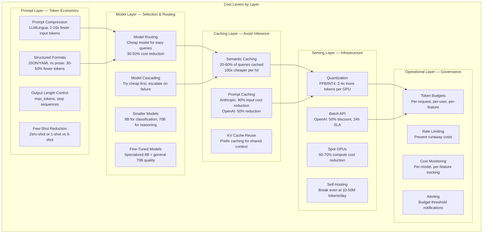
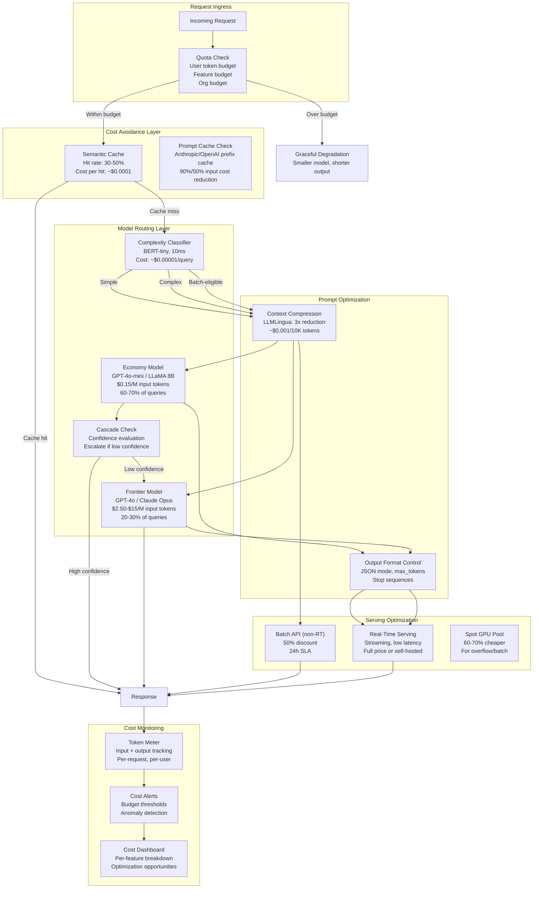
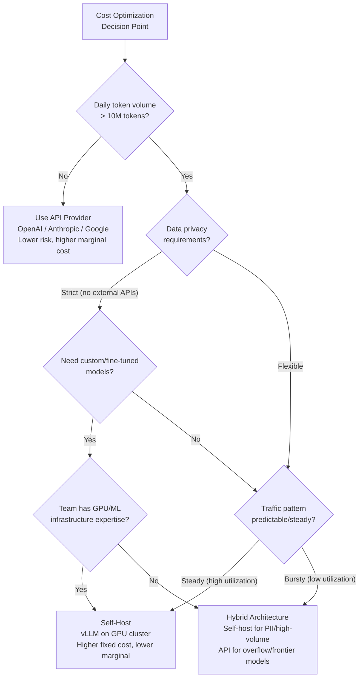
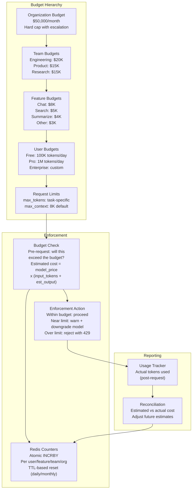

# Cost Optimization for GenAI

## 1. Overview

Cost optimization for GenAI systems is the discipline of minimizing the total cost of ownership (TCO) for LLM-powered applications while maintaining acceptable quality and latency. Unlike traditional software where compute costs are relatively fixed and predictable, GenAI costs are usage-driven and highly variable: a single poorly designed prompt can cost 10-100x more than a well-optimized one, and the difference between the cheapest and most expensive model for equivalent task quality can be 200x. For Principal AI Architects, cost optimization is not a post-launch exercise -- it is a fundamental architectural concern that must be designed in from day one, because cost structure determines whether a GenAI feature is commercially viable at scale.

The core tension in GenAI cost optimization is the quality-cost-latency trilemma. Higher-quality models cost more per token and are slower. Lower-cost models are faster but may produce inferior results. The architect's job is to find the Pareto frontier -- the set of configurations where no dimension can be improved without degrading another -- and then select the right point on that frontier for each use case.

**Key numbers that frame cost optimization decisions (as of early 2026):**

- **Frontier models**: GPT-4o: $2.50/$10.00 per 1M input/output tokens. Claude Opus: $15/$75 per 1M tokens. Gemini 2.0 Ultra: ~$5/$15 per 1M tokens.
- **Mid-tier models**: GPT-4o-mini: $0.15/$0.60 per 1M tokens. Claude Sonnet: $3/$15 per 1M tokens. Gemini 2.0 Flash: $0.10/$0.40 per 1M tokens.
- **Economy models**: LLaMA 3.1 8B (self-hosted, 1x A100): ~$0.05-$0.15 per 1M tokens. Gemini Flash 8B: $0.0375/$0.15 per 1M tokens.
- **Cost multipliers**: Input tokens cost 2-5x less than output tokens. Cached input tokens cost 50-90% less. Batch API pricing is 50% off.
- **Self-hosting breakeven**: Typically at 10-50M tokens/day for a 70B model on 4x A100/H100, depending on GPU rental/purchase costs and utilization.
- **A 1M queries/day application** at 1K input + 500 output tokens per query costs ~$3,750/day with GPT-4o, ~$225/day with GPT-4o-mini, or ~$75/day with self-hosted LLaMA 3.1 70B. The 50x cost difference is the optimization opportunity.

---

## 2. Where It Fits in GenAI Systems

Cost optimization is a cross-cutting concern that affects every layer of the GenAI stack. It is not a single component but a set of strategies applied at the prompt level, model selection level, serving level, and operational level.



**Upstream impact:** Prompt design and model selection are the highest-leverage cost levers. A prompt that uses 2K tokens instead of 500 tokens costs 4x more, regardless of any downstream optimization.

**Downstream impact:** Infrastructure choices (self-hosted vs API, GPU type, quantization) set the per-token cost floor. Operational controls (budgets, rate limits) prevent cost overruns.

**Key insight:** The optimization priority order is: (1) Avoid unnecessary LLM calls (caching), (2) Use the cheapest model that meets quality requirements (routing), (3) Minimize tokens per call (prompt optimization), (4) Reduce per-token cost (quantization, batch API, self-hosting).

---

## 3. Core Concepts

### 3.1 Token Economics

Understanding how LLM providers price tokens is the foundation of cost optimization.

**Input vs output token pricing:**
- Output tokens cost 2-5x more than input tokens across all major providers
- Reason: Output tokens require autoregressive generation (one forward pass per token), while input tokens are processed in a single prefill pass
- Implication: Reducing output length is 2-5x more cost-effective than reducing input length on a per-token basis

**Context length impact on cost:**
- Longer context = more input tokens = higher cost
- But longer context also increases prefill compute, which affects throughput and thus per-token cost for self-hosted models
- The "lost in the middle" effect means that adding more context often does not improve quality -- it just adds cost
- For self-hosted models: per-token cost increases with context length because KV cache memory limits batch size

**Token counting nuances:**
- Tokenizers differ across models: GPT-4o (cl100k_base) vs LLaMA (SentencePiece) vs Gemini (custom)
- Non-English text and code typically use more tokens per character (1.5-4x for CJK languages)
- System prompts count as input tokens for every request (amortize via caching)
- Function/tool definitions are input tokens (often 200-500 tokens per tool definition)
- Structured output (JSON mode) may generate formatting tokens that increase output length by 20-50%

### 3.2 Model Routing and Cascading

Model routing is the highest-impact cost optimization after caching. The insight is that 60-80% of queries in a typical application do not require a frontier model.

**Simple queries** (greetings, FAQs, classification, extraction): A $0.10/M token model performs identically to a $10/M token model. Routing these to the cheap model saves 100x.

**Complex queries** (multi-step reasoning, creative writing, nuanced analysis): Only these require the frontier model. Typically 20-40% of traffic.

**Routing strategies:**
1. **Rule-based**: Route by query length, endpoint, or user tier. Simplest, but brittle.
2. **Classifier-based**: Train a small classifier (BERT, logistic regression) to predict query complexity. Cost of classification: <$0.001 per query.
3. **Cascading**: Try the cheap model first, evaluate confidence. If confidence is low, re-run with the expensive model. Saves money when the cheap model's success rate is high.
4. **LLM-based routing**: Use a cheap LLM to assess query difficulty and route accordingly. More flexible but adds latency and cost.

**Cost impact:** With 70% of queries routed to a model costing 10x less, total cost is: 0.7 x C_cheap + 0.3 x C_expensive = 0.7 x 0.1 + 0.3 x 1.0 = 0.37x. A 63% reduction.

### 3.3 Prompt Optimization

Every unnecessary token in a prompt directly increases cost. Prompt optimization is systematic reduction of token count without degrading output quality.

**Techniques:**

1. **Remove verbose instructions**: "Please carefully consider all aspects of the question and provide a thorough, well-reasoned response" (~20 tokens) vs "Answer concisely" (~3 tokens). The verbose version rarely improves output quality for capable models.

2. **Use structured formats for structured data**: Instead of describing data in prose ("The customer's name is John Smith, they are 35 years old, and they live in New York"), use JSON (`{"name": "John Smith", "age": 35, "city": "New York"}`). Typically 30-50% token reduction for structured data.

3. **Reduce few-shot examples**: Zero-shot or 1-shot prompting often matches 5-shot quality on capable models. Each few-shot example costs 100-500 tokens. For 1M requests/day with 5 examples at 200 tokens each: 1B extra input tokens/day = $2,500/day with GPT-4o.

4. **Context pruning in RAG**: Don't pass all retrieved chunks. Use a relevance threshold and only pass top-3 instead of top-10. Use LLMLingua to compress retained context by 2-10x.

5. **System prompt compression**: System prompts are repeated for every request. A 2K-token system prompt across 1M requests/day = 2B input tokens/day. Compressing to 500 tokens saves 1.5B tokens/day = $3,750/day with GPT-4o.

6. **Output format control**: Specify exact output format to prevent verbose explanations. "Return JSON only, no explanation" can reduce output tokens by 50-80%.

### 3.4 Caching for Cost Reduction

Caching eliminates LLM inference entirely for cached queries, providing the most dramatic cost reduction.

**Semantic caching**: Embed queries and return cached responses for similar queries. 20-60% cache hit rate for typical applications. Cost per cache hit: ~$0.0001 vs ~$0.01-0.10 for LLM inference.

**Provider-side prompt caching**: Anthropic and OpenAI cache KV state for repeated prefixes. Does not eliminate inference but reduces input token cost:
- Anthropic: 90% discount on cached input tokens. A 2K-token system prompt cached across 1M requests saves ~$4,500/day.
- OpenAI: 50% discount, automatic caching for prompts >1024 tokens.
- Google: 75% discount on cached input tokens.

**KV cache reuse (self-hosted)**: Prefix caching in vLLM/SGLang. The shared system prompt's KV cache is computed once and reused. Saves prefill compute (not token cost, since self-hosted), improving throughput and thus reducing per-token amortized cost.

### 3.5 Batch Inference

For non-real-time workloads, batch inference offers significant cost savings.

**OpenAI Batch API:**
- 50% discount on all models
- 24-hour SLA (results returned within 24 hours)
- Ideal for: data labeling, content generation, evaluation runs, nightly report generation
- Limitation: No streaming, no real-time use

**Self-hosted batch processing:**
- Accumulate requests and process in large batches during off-peak hours
- Higher GPU utilization (larger batch sizes = better throughput)
- Can use spot/preemptible instances (60-70% cheaper) since batch jobs tolerate interruption
- Process overnight when GPU demand and spot prices are lowest

**Cost impact example:** 1M batch classification queries per day:
- Real-time GPT-4o-mini: $0.15/M input + $0.60/M output x 500 tokens avg = $450/day
- Batch API GPT-4o-mini: $225/day (50% discount)
- Self-hosted LLaMA 8B on spot instances: ~$30-50/day

### 3.6 Rate Limiting and Quota Management

Rate limiting prevents runaway costs from bugs, abuse, or unexpected traffic spikes.

**Per-user token budgets:**
- Set a daily/monthly token budget per user (e.g., 100K output tokens/day for free tier, 1M for paid)
- Track usage in real-time (Redis counter per user_id)
- Return HTTP 429 with retry-after header when budget is exceeded
- Provide usage dashboard so users can self-monitor

**Per-feature budgets:**
- Allocate a monthly budget per product feature (e.g., $5,000/month for chat, $2,000/month for search, $1,000/month for summarization)
- Alert at 80% of budget, hard-cap at 100% with graceful degradation
- Enables cost attribution and prioritization of optimization efforts

**Organizational cost controls:**
- Set a monthly total budget with escalating alerts (50%, 80%, 95%, 100%)
- Implement automatic model downgrade when approaching budget limits (switch from GPT-4o to GPT-4o-mini at 80% budget)
- Require approval for new features that exceed projected cost thresholds

### 3.7 Self-Hosting vs API: Breakeven Analysis

The decision to self-host depends on volume, latency requirements, data privacy needs, and operational capability.

**API advantages:**
- Zero infrastructure management
- Pay-per-use (no idle cost)
- Always latest models
- Built-in scaling
- Lower initial investment

**Self-hosting advantages:**
- Lower marginal cost at scale
- Full data privacy (no external API calls)
- Custom model support (fine-tuned, specialized)
- No rate limits or quota restrictions
- Full control over latency and throughput

**Breakeven calculation (approximate):**

For LLaMA 3.1 70B on 4x A100 80GB (cloud rental ~$12/hour):
- Throughput: ~2,000 output tokens/s (continuous batching, FP16)
- Hourly capacity: 7.2M output tokens
- Cost per 1M output tokens: $12 / 7.2 = ~$1.67/M output tokens
- Compare to GPT-4o: $10/M output tokens
- Breakeven: Self-hosting is cheaper if you sustain >1.67M output tokens/hour utilization (to justify the fixed GPU cost)
- With spot instances ($4/hour for 4x A100): breakeven drops to ~600K output tokens/hour

**Critical factor: utilization.** Self-hosted GPUs cost money whether they are processing requests or idle. If average utilization is 30% (typical for bursty workloads), effective per-token cost triples. API pricing only charges for actual usage.

### 3.8 Token Budget Management

Token budgets are the runtime enforcement mechanism for cost controls.

**Per-request limits:**
- Set `max_tokens` on every LLM call based on expected output length
- A summarization task should not allow 4096 output tokens when 500 is sufficient
- Over-allocating max_tokens does not directly cost money (you pay for actual tokens generated), but it allows longer-than-necessary responses if the model is verbose
- Use stop sequences to terminate generation at logical boundaries

**Per-user quotas:**
- Track cumulative token usage per user (input + output, weighted by cost)
- Implement tiered limits: free tier (100K tokens/day), pro tier (1M tokens/day), enterprise (unlimited with billing)
- Provide real-time usage API so clients can self-regulate

**Per-conversation limits:**
- Long conversations accumulate context tokens. Each message in a conversation re-sends the full history as input.
- A 50-turn conversation with 200 tokens/turn sends ~50x200/2 = 5K tokens per message on average (growing linearly)
- Implement conversation summarization: after N turns, summarize the history into a compact context (~500 tokens) and continue with the summary
- Alert when a single conversation exceeds a cost threshold

### 3.9 Cost Monitoring and Alerting

**What to track:**

| Metric | Granularity | Purpose |
|--------|------------|---------|
| **Total spend** | Hourly, daily, monthly | Budget tracking |
| **Cost per request** | Per-request | Identify expensive requests |
| **Cost per user** | Per-user, daily | Detect abuse, inform tier decisions |
| **Cost per feature** | Per-feature, daily | Prioritize optimization efforts |
| **Cost per model** | Per-model, daily | Evaluate model routing effectiveness |
| **Input tokens per request** | Per-request | Identify prompt bloat |
| **Output tokens per request** | Per-request | Identify verbose responses |
| **Cache hit rate** | Hourly | Measure caching effectiveness |
| **Token waste ratio** | Per-request | max_tokens_allocated / actual_tokens_generated |

**Alerting thresholds:**
- Daily spend > 120% of 30-day moving average: anomaly alert
- Single request cost > $1: investigate (likely a bug with excessive context or output)
- Feature cost > 80% of monthly budget: proactive alert
- Cache hit rate drops below 15%: caching system may be degraded

### 3.10 Context Compression

Context compression reduces the number of input tokens sent to the LLM by removing low-information tokens while preserving the semantic content.

**LLMLingua / LongLLMLingua (Microsoft):**
- Uses a small model (GPT-2 or LLaMA 7B) to compute perplexity of each token in the prompt
- Removes low-perplexity tokens (easily predictable, low information content)
- Achieves 2-10x compression with <5% quality loss on many benchmarks
- Particularly effective for RAG contexts where retrieved passages contain redundant information
- Cost of compression: ~$0.001 per 10K tokens (small model inference) vs $0.025 savings per 10K tokens (GPT-4o input) = 25x ROI

**Output length control:**
- Explicit instruction: "Answer in 2-3 sentences" vs open-ended generation
- `max_tokens` parameter: Hard cap on output length
- Stop sequences: Terminate at `\n\n`, `---`, or custom delimiters
- Structured output (JSON mode): Inherently constrains output to the schema

---

## 4. Architecture

### 4.1 Cost-Optimized GenAI Architecture



### 4.2 Self-Hosting vs API Decision Flow



### 4.3 Token Budget Enforcement Architecture



---

## 5. Design Patterns

### Pattern 1: Cost-Aware Model Routing

**When to use:** Any application where query complexity varies. This is the single most impactful cost optimization pattern.

**Architecture:** A lightweight classifier (BERT-tiny, logistic regression, or rule-based) evaluates each query and routes to the cheapest model that can handle it. Route 60-80% of queries to an economy model and 20-40% to a frontier model.

**Implementation:**
1. Label a sample of production queries by required model tier (can use the frontier model to generate these labels)
2. Train a small classifier on the labeled data
3. Route queries based on classifier output
4. Monitor quality metrics per tier and adjust routing thresholds
5. Periodically re-evaluate: as economy models improve, more queries can be down-routed

**Cost impact:** Typically 50-70% total cost reduction with <3% quality degradation on aggregate metrics.

### Pattern 2: Progressive Cost Escalation (Cascade)

**When to use:** When the success rate of the cheap model is uncertain or variable.

**Architecture:**
1. Send every query to the cheap model first
2. Evaluate the response confidence (calibrated probability, self-consistency check, or LLM-as-judge)
3. If confidence > threshold, return the cheap model's response
4. If confidence < threshold, re-run with the expensive model
5. The expensive model only processes the 20-40% of queries where the cheap model fails

**Cost model:** Total cost = C_cheap + (1 - success_rate) x C_expensive. If C_cheap = 0.1, C_expensive = 1.0, success_rate = 0.70: Total = 0.1 + 0.3 x 1.0 = 0.40. 60% reduction vs always using the expensive model.

**Risk:** Added latency for failed cascades (two LLM calls instead of one). Mitigate by running both in parallel and canceling the expensive call if the cheap model succeeds.

### Pattern 3: Conversation Cost Management

**When to use:** Multi-turn chatbot applications where conversation context grows linearly with turns.

**Architecture:**
1. Track cumulative token usage per conversation
2. After N turns (e.g., 10), automatically summarize the conversation history into a condensed context (~500 tokens)
3. Continue the conversation using the summary instead of the full history
4. Store the full history for audit/analytics, but don't send it to the LLM
5. Alert users when their conversation is approaching the cost limit

**Cost impact:** Without summarization, a 50-turn conversation sends ~250K cumulative input tokens. With summarization every 10 turns, it sends ~60K cumulative tokens. 76% reduction.

### Pattern 4: Batch + Real-Time Hybrid

**When to use:** Applications with both real-time and background LLM workloads.

**Architecture:**
- **Real-time path**: User-facing queries processed immediately. Use caching, model routing, and prompt optimization. Full price or self-hosted.
- **Batch path**: Background tasks (evaluation, content generation, data labeling, report generation) accumulated and processed via batch API (50% discount) or on spot GPU instances (60-70% discount) during off-peak hours.
- **Priority queue**: Classify incoming requests as real-time or batch-eligible. Batch-eligible criteria: no user waiting, result needed within hours not seconds, tolerates higher latency.

### Pattern 5: Cost-Governed Autonomous Agents

**When to use:** Agentic applications where the agent decides how many LLM calls to make (tool use, multi-step reasoning).

**Architecture:** Without cost governance, an agent can make unbounded LLM calls (each tool call costs tokens, each reasoning step costs tokens). Implement:
1. **Step budget**: Maximum number of LLM calls per agent invocation (e.g., 10 steps max)
2. **Token budget**: Maximum total tokens (input + output) per agent invocation (e.g., 50K tokens)
3. **Cost accumulator**: Track running cost during agent execution. Abort and return partial results when budget is exhausted.
4. **Diminishing returns detection**: If the last 3 agent steps did not change the output, terminate early.
5. **Tool call deduplication**: Prevent the agent from calling the same tool with the same arguments multiple times.

---

## 6. Implementation Approaches

### 6.1 Model Router with Cost Awareness

```python
# Cost-aware model router using a lightweight classifier
from dataclasses import dataclass
from enum import Enum
import numpy as np

class ModelTier(Enum):
    ECONOMY = "economy"        # GPT-4o-mini, LLaMA 8B
    STANDARD = "standard"      # Claude Sonnet, GPT-4o
    FRONTIER = "frontier"      # Claude Opus, GPT-4o (complex)

@dataclass
class ModelConfig:
    model_id: str
    input_cost_per_m: float    # $ per 1M input tokens
    output_cost_per_m: float   # $ per 1M output tokens
    avg_quality_score: float   # 0-1, from eval suite

MODEL_REGISTRY = {
    ModelTier.ECONOMY: ModelConfig("gpt-4o-mini", 0.15, 0.60, 0.78),
    ModelTier.STANDARD: ModelConfig("gpt-4o", 2.50, 10.00, 0.92),
    ModelTier.FRONTIER: ModelConfig("claude-opus", 15.00, 75.00, 0.97),
}

class CostAwareRouter:
    def __init__(self, classifier, quality_threshold: float = 0.85):
        self.classifier = classifier  # Pre-trained complexity classifier
        self.quality_threshold = quality_threshold

    def route(self, query: str, max_budget_per_request: float = 0.10) -> ModelTier:
        # Step 1: Classify query complexity
        complexity_score = self.classifier.predict_proba(query)  # 0=simple, 1=complex

        # Step 2: Select cheapest model that meets quality threshold
        if complexity_score < 0.3:
            return ModelTier.ECONOMY
        elif complexity_score < 0.7:
            return ModelTier.STANDARD
        else:
            return ModelTier.FRONTIER

    def estimate_cost(self, tier: ModelTier, input_tokens: int,
                      est_output_tokens: int) -> float:
        config = MODEL_REGISTRY[tier]
        return (
            config.input_cost_per_m * input_tokens / 1_000_000
            + config.output_cost_per_m * est_output_tokens / 1_000_000
        )
```

### 6.2 Token Budget Enforcement Middleware

```python
# FastAPI middleware for token budget enforcement
import redis
import time
from fastapi import Request, HTTPException

class TokenBudgetMiddleware:
    def __init__(self, redis_client: redis.Redis):
        self.redis = redis_client
        self.limits = {
            "free": {"daily_tokens": 100_000, "max_tokens_per_request": 1024},
            "pro": {"daily_tokens": 1_000_000, "max_tokens_per_request": 4096},
            "enterprise": {"daily_tokens": 50_000_000, "max_tokens_per_request": 8192},
        }

    async def check_budget(self, user_id: str, tier: str,
                           estimated_tokens: int) -> bool:
        limit = self.limits[tier]

        # Check per-request limit
        if estimated_tokens > limit["max_tokens_per_request"]:
            raise HTTPException(
                status_code=400,
                detail=f"Request exceeds max token limit "
                       f"({estimated_tokens} > {limit['max_tokens_per_request']})"
            )

        # Check daily budget (atomic increment + check)
        day_key = f"budget:{user_id}:{time.strftime('%Y-%m-%d')}"
        current_usage = self.redis.incrby(day_key, estimated_tokens)

        # Set expiry if this is the first request of the day
        if current_usage == estimated_tokens:
            self.redis.expire(day_key, 86400)

        if current_usage > limit["daily_tokens"]:
            # Rollback the increment
            self.redis.decrby(day_key, estimated_tokens)
            raise HTTPException(
                status_code=429,
                detail=f"Daily token budget exceeded. "
                       f"Used: {current_usage - estimated_tokens}, "
                       f"Limit: {limit['daily_tokens']}",
                headers={"Retry-After": "3600"},
            )

        return True

    async def record_actual_usage(self, user_id: str, estimated: int, actual: int):
        """Reconcile estimated vs actual token usage."""
        if actual != estimated:
            day_key = f"budget:{user_id}:{time.strftime('%Y-%m-%d')}"
            diff = actual - estimated
            self.redis.incrby(day_key, diff)  # Adjust counter
```

### 6.3 Cost Monitoring with Prometheus

```python
# Prometheus metrics for LLM cost tracking
from prometheus_client import Counter, Histogram, Gauge

# Cost counters
llm_cost_total = Counter(
    "llm_cost_dollars_total",
    "Total LLM cost in dollars",
    ["model", "feature", "team", "tier"],
)
llm_tokens_total = Counter(
    "llm_tokens_total",
    "Total tokens processed",
    ["model", "direction", "feature"],  # direction: input/output
)
llm_cache_hits = Counter(
    "llm_cache_hits_total",
    "Semantic cache hits",
    ["cache_tier"],  # exact, semantic
)
llm_cost_per_request = Histogram(
    "llm_cost_per_request_dollars",
    "Cost per LLM request in dollars",
    ["model", "feature"],
    buckets=[0.0001, 0.001, 0.01, 0.05, 0.1, 0.5, 1.0, 5.0, 10.0],
)

# Usage tracking function
def track_llm_cost(model: str, feature: str, team: str, tier: str,
                   input_tokens: int, output_tokens: int,
                   input_cost_per_m: float, output_cost_per_m: float):
    cost = (
        input_cost_per_m * input_tokens / 1_000_000
        + output_cost_per_m * output_tokens / 1_000_000
    )
    llm_cost_total.labels(model=model, feature=feature, team=team, tier=tier).inc(cost)
    llm_tokens_total.labels(model=model, direction="input", feature=feature).inc(input_tokens)
    llm_tokens_total.labels(model=model, direction="output", feature=feature).inc(output_tokens)
    llm_cost_per_request.labels(model=model, feature=feature).observe(cost)
```

### 6.4 Conversation Summarization for Cost Control

```python
# Automatic conversation summarization to control context growth
SUMMARIZE_PROMPT = """Summarize the following conversation into a concise context
that preserves all key information, decisions, and user preferences. The summary
will be used as context for continuing the conversation.

Conversation:
{conversation}

Summary (max 500 tokens):"""

class ConversationCostManager:
    def __init__(self, summarize_every_n_turns: int = 10,
                 max_context_tokens: int = 4096):
        self.summarize_every_n = summarize_every_n_turns
        self.max_context = max_context_tokens

    def build_context(self, conversation: list[dict],
                      summary: str | None = None) -> list[dict]:
        """Build cost-efficient conversation context."""
        if summary and len(conversation) > self.summarize_every_n:
            # Use summary + recent turns only
            recent_turns = conversation[-self.summarize_every_n:]
            return [
                {"role": "system", "content": f"Previous conversation summary: {summary}"},
                *recent_turns,
            ]
        return conversation

    def should_summarize(self, turn_count: int, total_tokens: int) -> bool:
        return (
            turn_count > 0
            and turn_count % self.summarize_every_n == 0
        ) or total_tokens > self.max_context
```

---

## 7. Tradeoffs

### Model Selection Cost-Quality Matrix

| Model Tier | Cost (per 1M output tokens) | Quality (avg benchmark) | Latency (TTFT) | Best Use Cases |
|-----------|---------------------------|----------------------|----------------|----------------|
| **Economy** ($0.15-$0.60) | Lowest | 70-80% | Fastest | Classification, extraction, simple Q&A, formatting |
| **Mid-tier** ($3-$15) | Moderate | 85-92% | Moderate | General knowledge, summarization, code generation |
| **Frontier** ($10-$75) | Highest | 93-97% | Slowest | Complex reasoning, creative writing, multi-step analysis |
| **Self-hosted 8B** ($0.05-$0.15) | Lowest | 65-75% | Fastest | High-volume classification, PII-sensitive workloads |
| **Self-hosted 70B** ($0.30-$1.50) | Low-Moderate | 80-90% | Moderate | Privacy-sensitive, high-volume general tasks |

### API vs Self-Hosting Decision

| Decision Factor | API Provider | Self-Hosted | Hybrid |
|----------------|-------------|------------|--------|
| **Marginal cost** | Higher ($2.50-$75/M tokens) | Lower ($0.05-$1.50/M tokens) | Mixed |
| **Fixed cost** | None | High ($2,000-$15,000/month per GPU node) | Medium |
| **Breakeven volume** | Always cheaper below breakeven | Cheaper above ~10-50M tokens/day | -- |
| **Utilization sensitivity** | None (pay per use) | High (idle GPUs still cost money) | Medium |
| **Operational complexity** | None | High (GPU management, model updates, monitoring) | Medium |
| **Data privacy** | Data sent to provider | Full control | PII to self-hosted, rest to API |
| **Model freshness** | Always latest | Manual updates | Mixed |
| **Scaling flexibility** | Instant (API handles scaling) | 2-10 minutes (GPU provisioning) | Good |

### Caching vs Generation Tradeoff

| Decision Factor | Always Generate | Semantic Caching | Aggressive Caching |
|----------------|----------------|------------------|--------------------|
| **Cost per query** | $0.01-$0.10 | $0.004-$0.04 (blended) | $0.001-$0.01 (blended) |
| **Response freshness** | Always fresh | Mixed (TTL-dependent) | Often stale |
| **Response diversity** | Full diversity | Reduced for cached queries | Low diversity |
| **Latency** | 2-10s | Mixed (10ms hits, 2-10s misses) | Mostly 10-50ms |
| **Infrastructure cost** | LLM only | LLM + cache infra | LLM + larger cache infra |
| **Best for** | Creative tasks, low volume | General production | High-volume FAQ, documentation |

### Batch vs Real-Time

| Decision Factor | Real-Time | Batch API | Self-Hosted Batch |
|----------------|-----------|-----------|-------------------|
| **Latency** | 200ms-10s | Up to 24 hours | Minutes to hours |
| **Cost** | Full price | 50% discount | 60-80% discount (spot GPUs) |
| **Reliability** | Synchronous, immediate feedback | Async, may fail silently | Full control |
| **Use cases** | User-facing, interactive | Reports, labeling, eval | High-volume processing |

---

## 8. Failure Modes

| Failure Mode | Symptom | Root Cause | Mitigation |
|-------------|---------|------------|------------|
| **Runaway cost spike** | Daily spend 10x normal. Monthly budget consumed in days. | Bug causing infinite retry loops, agent making unbounded tool calls, prompt injection triggering long outputs | Implement per-request cost caps, agent step limits, max_tokens on all calls, real-time cost monitoring with auto-kill for anomalies |
| **Model routing quality degradation** | User complaints increase, quality metrics drop despite stable models | Router sending complex queries to economy model. Classifier training data stale or biased. | Monitor per-tier quality metrics, implement human-in-the-loop evaluation for routed queries, retrain classifier monthly |
| **Budget exhaustion mid-month** | Feature disabled or degraded for remaining days of month | Underestimated usage growth, traffic spike (viral feature), or cost estimation error | Set budgets with 20% headroom, implement graceful degradation (model downgrade) instead of hard cutoff, alert at 50% and 80% |
| **Prompt bloat over time** | Cost per request gradually increases without code changes | RAG retrieving more chunks (index growth), conversation context growing, system prompt additions by product team | Track avg input tokens per request, alert on 20%+ increase, implement periodic prompt audits, enforce max context length |
| **Cache invalidation storm** | Cache hit rate drops to 0%, LLM traffic spikes 2-5x, potential cost spike | Mass document update triggers invalidation of all cache entries simultaneously | Implement gradual invalidation (stagger over minutes), stale-while-revalidate pattern, rate-limit invalidation events |
| **Self-hosting underutilization** | Per-token cost higher than API despite self-hosting | Bursty traffic with long idle periods. GPUs running 24/7 but utilized 20% of the time. | Implement cluster autoscaling (scale to zero during idle), use spot instances, consolidate workloads onto fewer nodes, consider hybrid (self-host baseline, API for burst) |
| **Token estimation inaccuracy** | Budget enforcement is too loose (overspend) or too tight (unnecessary rejections) | Estimated tokens before inference differ from actual tokens generated | Use tiktoken/tokenizer for accurate input counting, estimate output from historical averages per query type, reconcile estimated vs actual post-request |
| **Cost attribution failure** | Cannot determine which feature or team is driving cost increases | Missing or incorrect labels on LLM requests, shared model endpoints without tagging | Require feature/team tags on all LLM calls, implement cost attribution middleware, reject untagged requests in production |

---

## 9. Optimization Techniques

### 9.1 Quick Wins (< 1 week to implement)

| Technique | Cost Reduction | Quality Impact | Effort |
|-----------|---------------|----------------|--------|
| **Set max_tokens on all calls** | 10-30% (prevents over-generation) | None | 1 hour |
| **Enable provider prompt caching** | 20-50% on input tokens | None | 1 day |
| **Remove unnecessary few-shot examples** | 10-30% on input tokens | <2% degradation | 1 day |
| **Add "respond concisely" to system prompt** | 20-40% on output tokens | Depends on task | 1 hour |
| **Set up cost monitoring dashboard** | Enables all other optimizations | None | 2-3 days |
| **Enable semantic caching for FAQ-like queries** | 20-50% for applicable traffic | <1% for cached queries | 3-5 days |

### 9.2 Medium-Term Optimizations (1-4 weeks)

| Technique | Cost Reduction | Quality Impact | Effort |
|-----------|---------------|----------------|--------|
| **Implement model routing** | 40-60% | <3% on aggregate | 2-3 weeks |
| **Deploy context compression (LLMLingua)** | 20-40% on input tokens | <5% for RAG tasks | 1-2 weeks |
| **Switch to batch API for non-RT workloads** | 50% on batch workloads | None (same models) | 1 week |
| **Implement conversation summarization** | 30-50% for multi-turn apps | 5-10% on long conversations | 1-2 weeks |
| **Per-user token budgets** | Prevents abuse, enables tiered pricing | UX impact for limited users | 1-2 weeks |
| **Prompt optimization audit** | 20-40% on input tokens | Often improves quality | 1-2 weeks |

### 9.3 Strategic Optimizations (1-3 months)

| Technique | Cost Reduction | Quality Impact | Effort |
|-----------|---------------|----------------|--------|
| **Self-hosting for high-volume workloads** | 50-80% above breakeven volume | Depends on model choice | 4-8 weeks |
| **Fine-tune small model to replace large model** | 80-90% (8B replaces 70B for specific task) | Task-specific, verify with eval | 4-8 weeks |
| **Distillation pipeline** | 70-90% (student model matches teacher) | <5% on target task | 6-12 weeks |
| **Multi-tier caching with warming** | 40-70% for high-traffic apps | <2% from caching artifacts | 3-4 weeks |
| **Agent cost governance framework** | 30-50% for agentic workloads | Limits agent capability | 2-4 weeks |

---

## 10. Real-World Examples

### Notion -- Model Routing for AI Features

Notion's AI features (summarization, Q&A, writing assistance) use a model routing architecture that classifies queries by complexity and routes to different model tiers. Simple tasks (formatting, short summaries) route to GPT-4o-mini, while complex tasks (long document analysis, creative writing) route to GPT-4o or Claude Sonnet. Notion has reported that model routing reduced their average per-query cost by approximately 60% while maintaining user satisfaction scores. They use a combination of rule-based routing (by feature type) and classifier-based routing (by query complexity within features).

### Anthropic -- Prompt Caching Economics

Anthropic's prompt caching feature demonstrates the economics of caching at scale. For applications with a 4K-token system prompt (common for enterprise chatbots), prompt caching reduces input costs for those tokens by 90% and TTFT by ~80%. Anthropic's pricing model makes this transparent: first request with a new prefix pays full price and a small cache-write premium, subsequent requests pay 10% of input cost for cached tokens. For a customer sending 1M requests/day with a 4K-token system prompt, caching saves ~$9,000/day in input token costs while simultaneously improving latency.

### Databricks -- Self-Hosting at Scale

Databricks operates one of the largest self-hosted LLM inference platforms for their AI/BI and Genie products. By deploying open-weight models (LLaMA, Mixtral, DBRX) on their own GPU clusters, they achieve per-token costs 5-10x lower than API providers for their high-volume workloads. Their key insight: self-hosting economics require >70% GPU utilization to beat API pricing. Databricks achieves this by consolidating multiple internal workloads onto shared GPU clusters with dynamic model loading and by using their Spark-based batch processing for offline workloads.

### Cursor -- Cascading for Code Generation

Cursor (AI code editor) uses a cascading architecture for code completions. Their fast autocomplete feature uses a small, self-hosted model for single-line completions (latency-critical, high-volume, low-cost). For multi-line completions and chat-based code generation, they use Claude Sonnet or GPT-4o. For complex refactoring tasks, they escalate to Claude Opus. This tiered approach allows them to serve millions of completions per day at viable unit economics while maintaining high code quality for complex tasks.

### Together AI -- Batch Processing Economics

Together AI offers batch inference pricing at 50% discount (matching OpenAI's batch API) for offline processing. Their enterprise customers use batch processing for: (1) fine-tuning data generation -- using a frontier model to generate training data for smaller models at batch pricing, (2) evaluation runs -- running thousands of eval prompts against multiple models overnight, (3) content generation -- producing product descriptions, marketing copy, and documentation at scale. Together reports that 30-40% of their total inference volume uses batch pricing, indicating significant demand for cost-optimized non-real-time workloads.

---

## 11. Related Topics

- **[Model Routing and Cascading](04-model-routing.md):** The primary mechanism for reducing cost through intelligent model selection per query
- **[Semantic Caching](02-semantic-caching.md):** Caching strategies that eliminate LLM inference entirely for repeated or similar queries
- **[Latency Optimization](01-latency-optimization.md):** Cost and latency optimizations are deeply intertwined -- faster inference means more throughput per GPU dollar
- **[Model Selection Criteria](../03-model-strategies/01-model-selection.md):** How to evaluate models on the cost-quality-latency frontier
- **[Quantization](../02-llm-architecture/03-quantization.md):** FP8 and INT4 quantization that doubles or quadruples tokens-per-GPU, directly reducing serving cost
- **[Fine-Tuning](../03-model-strategies/02-fine-tuning.md):** Fine-tuning a small model to match a large model's quality on specific tasks is a powerful cost optimization
- **[Distillation](../03-model-strategies/03-distillation.md):** Training a smaller student model to replicate a larger teacher model's behavior at a fraction of the inference cost
- **[Model Serving Infrastructure](../02-llm-architecture/01-model-serving.md):** Serving framework choices that affect throughput and thus per-token cost
- **[Rate Limiting](../../traditional-system-design/08-resilience/01-rate-limiting.md):** Rate limiting as a cost control mechanism to prevent budget overruns
- **[Context Window Management](../06-prompt-engineering/03-context-management.md):** Context optimization directly reduces input token cost

---

## 12. Source Traceability

| Concept | Primary Source | Year |
|---------|---------------|------|
| LLM token pricing models | OpenAI, Anthropic, Google pricing pages (API documentation) | 2024-2026 |
| Model routing / cascading | Chen et al., "FrugalGPT: How to Use Large Language Models While Reducing Cost and Improving Performance" (Stanford) | 2023 |
| LLMLingua prompt compression | Jiang et al., "LLMLingua: Compressing Prompts for Accelerated Inference of Large Language Models" (Microsoft) | 2023 |
| LongLLMLingua | Jiang et al., "LongLLMLingua: Accelerating and Enhancing LLMs in Long Context Scenarios via Prompt Compression" (Microsoft) | 2024 |
| Prompt caching (Anthropic) | Anthropic, "Prompt Caching" (API documentation) | 2024 |
| Prompt caching (OpenAI) | OpenAI, "Prompt Caching" (API documentation) | 2024 |
| Batch API pricing | OpenAI, "Batch API" (API documentation) | 2024 |
| GPT-4o-mini cost-efficiency | OpenAI, "GPT-4o mini: advancing cost-efficient intelligence" (blog) | 2024 |
| Self-hosting economics | Anyscale, "Serving LLMs at Scale: A Cost Analysis" (blog) | 2024 |
| Token budget management | Martian, "Cost Controls for LLM Applications" (engineering blog) | 2024 |
| Cost-aware routing | Ding et al., "Hybrid LLM: Cost-Efficient and Quality-Aware Query Routing" (arXiv) | 2024 |
| Spot instance pricing | AWS, GCP, Azure spot/preemptible VM pricing documentation | 2024-2026 |
| Conversation summarization for cost | LangChain, "Conversation Summary Memory" (documentation) | 2023 |
| Agent cost governance | AutoGPT / BabyAGI community, "Token Budget Management for Autonomous Agents" | 2023 |
