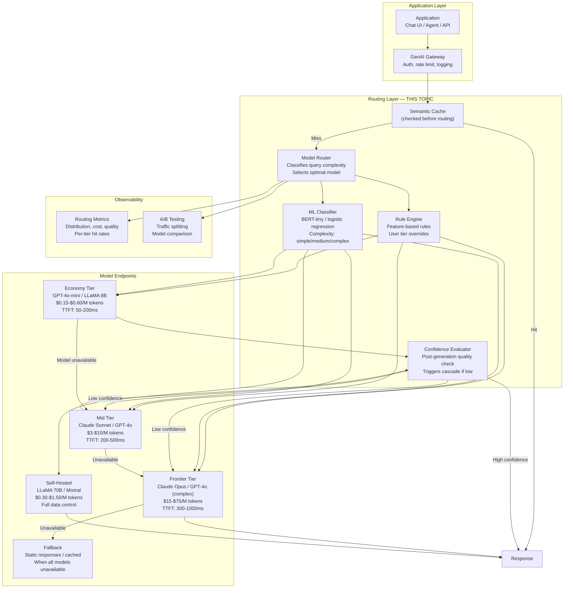
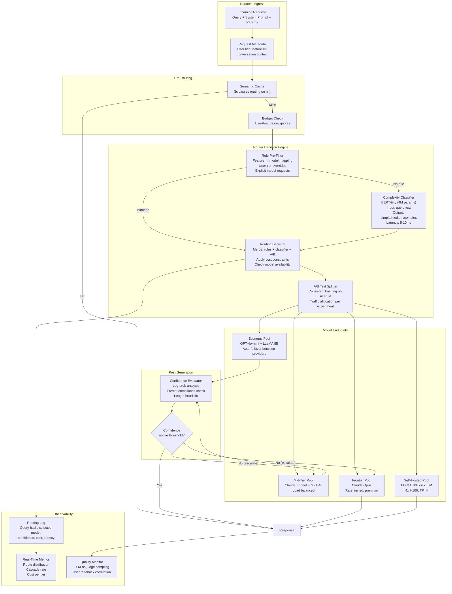
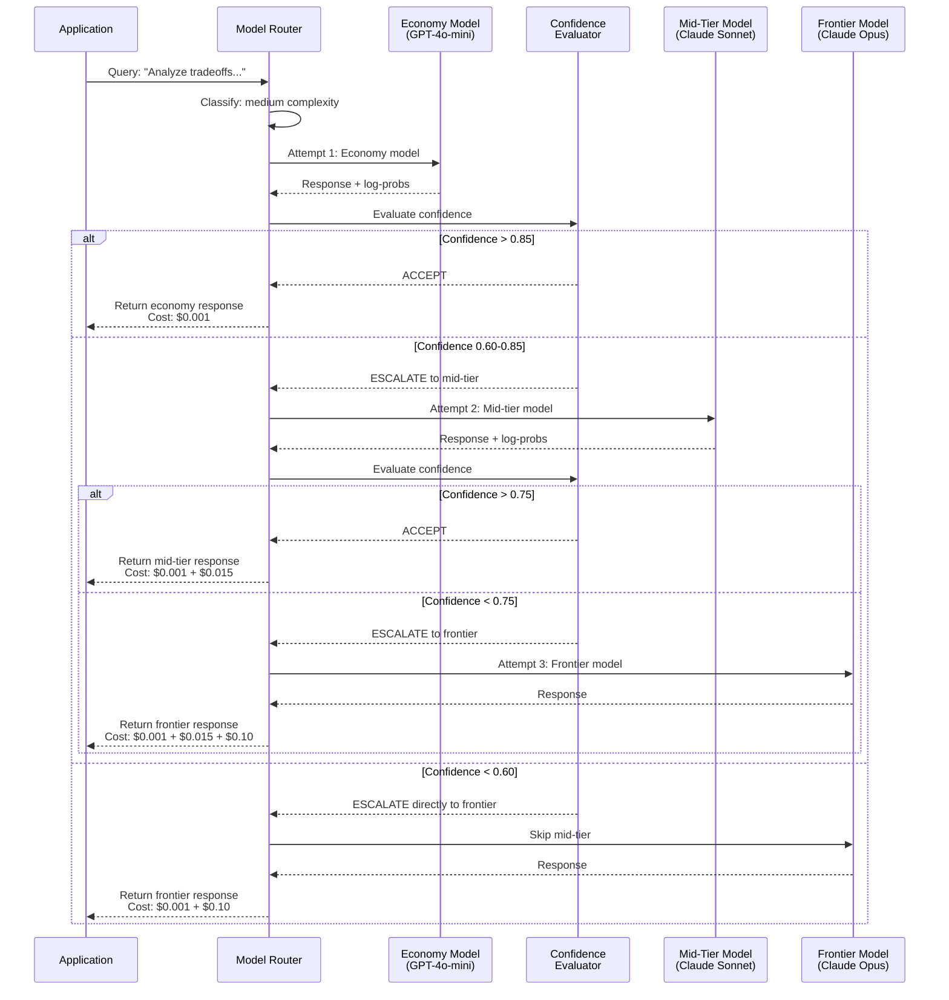
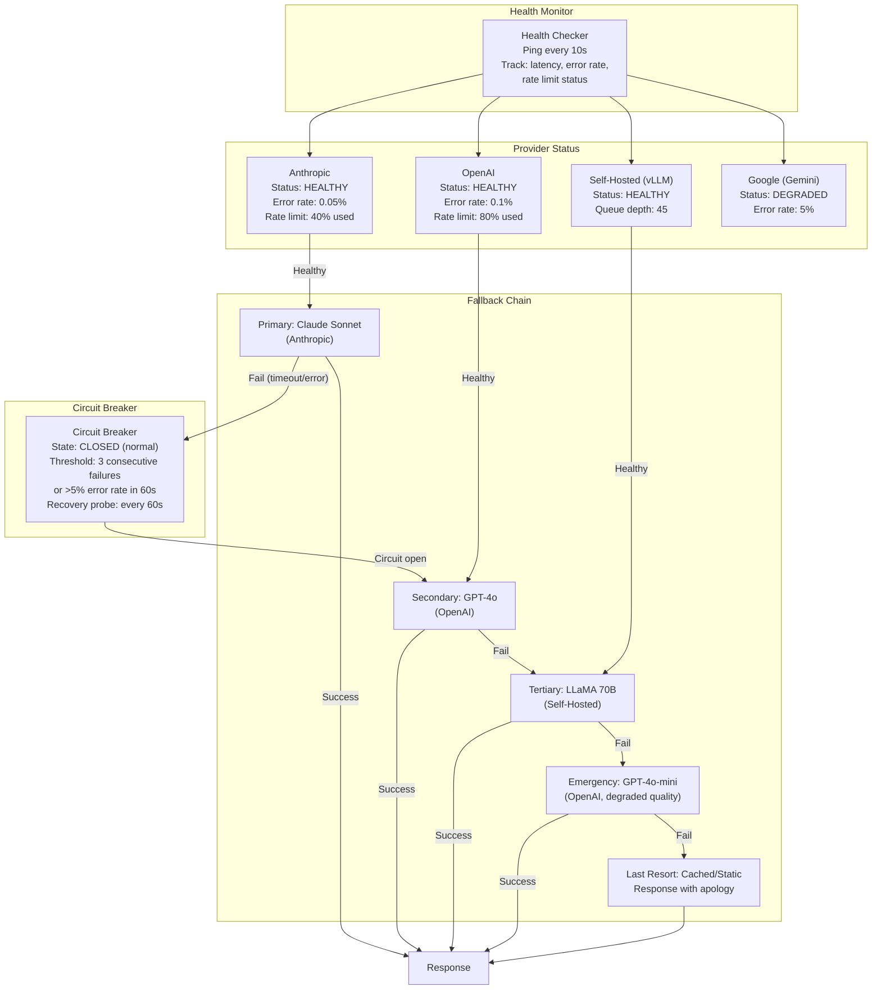

# Model Routing and Cascading

## 1. Overview

Model routing is the architectural practice of dynamically selecting which LLM serves each incoming request based on query characteristics, cost constraints, latency requirements, and quality thresholds. Rather than routing all traffic to a single model, a model router classifies each request and directs it to the optimal model on the cost-quality-latency Pareto frontier. For Principal AI Architects, model routing is the single most impactful technique for reducing GenAI costs at scale while maintaining quality -- it operationalizes the insight that 60-80% of queries in a typical application do not require a frontier model.

The core insight is that LLM quality requirements are not uniform across queries. A greeting ("Hi, how are you?") does not need GPT-4o at $10/M output tokens -- GPT-4o-mini at $0.60/M delivers an identical response at 17x lower cost. A complex multi-step reasoning query ("Analyze the tradeoffs between microservices and monoliths for a healthcare startup with HIPAA requirements") genuinely benefits from a frontier model. The router's job is to make this classification automatically, accurately, and with minimal overhead.

**Key numbers that frame model routing decisions:**

- Cost spread: Cheapest to most expensive model spans 200x ($0.15/M to $75/M output tokens)
- Quality gap: Economy models score 70-80% on benchmarks vs 93-97% for frontier models. But on simple tasks, the gap is <2%.
- Router overhead: A classifier-based router adds ~5-15ms and ~$0.00001 per request
- Typical routing distribution: 60-70% economy, 20-30% mid-tier, 5-10% frontier
- Cost impact: 50-70% total cost reduction with <3% aggregate quality degradation
- Cascade success rate: Cheap model succeeds on 65-80% of queries without escalation
- Fallback chain latency: Each cascade step adds the cheap model's full latency (~200-500ms) before escalation
- A/B testing velocity: With routing, you can evaluate new models on 5% of traffic before full rollout

---

## 2. Where It Fits in GenAI Systems

Model routing sits in the orchestration layer between the application/gateway and the model serving infrastructure. It intercepts every LLM request, classifies it, and forwards it to the appropriate model endpoint. It is tightly coupled with cost optimization, latency optimization, and the model serving layer.



**Upstream dependencies:** The semantic cache is checked before routing -- cache hits bypass routing entirely. The gateway provides authentication and user tier information used for routing rules.

**Downstream dependencies:** Model serving endpoints must expose health checks and queue depth metrics so the router can make availability-aware decisions. The confidence evaluator provides feedback for cascade decisions.

**Key interface contract:** The router accepts a request (query, system prompt, parameters, user metadata) and returns a model endpoint selection. The routing decision is logged for cost attribution and quality analysis. The router must add minimal latency (<20ms) to be viable.

---

## 3. Core Concepts

### 3.1 Why Route: The Quality-Cost Spectrum

Different models occupy different positions on the quality-cost spectrum:

| Model Category | Representative Models | Cost (output/M) | Quality (aggregate) | Latency (TTFT) |
|---------------|----------------------|-----------------|---------------------|----------------|
| **Nano** | Gemini Flash 8B, Phi-3 Mini | $0.04-$0.15 | 60-70% | 20-100ms |
| **Economy** | GPT-4o-mini, LLaMA 3.1 8B, Gemini Flash | $0.15-$0.60 | 72-82% | 50-200ms |
| **Mid-tier** | Claude 3.5 Sonnet, GPT-4o, Gemini Pro | $3-$15 | 85-92% | 200-500ms |
| **Frontier** | Claude Opus, GPT-4o (complex), Gemini Ultra | $15-$75 | 93-97% | 300-1000ms |
| **Specialized** | Fine-tuned LLaMA 8B, domain-specific | $0.05-$0.30 | 85-95% (on domain) | 50-200ms |

The key insight: on simple tasks (classification, extraction, FAQ), economy models match frontier models. Quality differences only emerge on complex reasoning, nuanced judgment, and creative tasks. A router that correctly classifies query complexity captures 80% of the cost savings with <3% quality degradation.

### 3.2 Router Architectures

#### Rule-Based Routing

The simplest router uses static rules to map requests to models.

**Rules based on:**
- **Feature type**: Chat -> mid-tier, search -> economy, analysis -> frontier
- **User tier**: Free users -> economy, paid users -> mid-tier, enterprise -> frontier
- **Query length**: Short queries (<50 tokens) -> economy, long queries (>500 tokens) -> frontier
- **Endpoint**: /v1/completions -> economy, /v1/chat -> mid-tier
- **Explicit annotations**: Application code specifies model tier per call site

**Advantages:** Zero latency overhead, deterministic, easy to understand and debug.
**Limitations:** Cannot adapt to query content, misroutes complex short queries and simple long queries, requires manual maintenance.

#### Classifier-Based Routing

A trained ML classifier predicts query complexity and routes accordingly.

**Architecture:**
1. Collect a labeled dataset of queries annotated with the minimum model tier that produces acceptable output
2. Train a lightweight classifier (BERT-tiny: 4M params, logistic regression on TF-IDF, or a small transformer)
3. At inference time, classify the query (5-15ms) and route to the predicted tier

**Training data generation:**
The most practical approach: use the frontier model to generate labels. For each query in a sample:
1. Send to economy model, evaluate quality (LLM-as-judge or automated metrics)
2. Send to mid-tier model, evaluate quality
3. Send to frontier model, evaluate quality
4. Label the query with the cheapest tier that exceeds the quality threshold

**Classifier features:**
- Query text (tokenized, embedded, or TF-IDF)
- Query length (strong signal: longer queries correlate with complexity)
- Keyword indicators (presence of "compare", "analyze", "tradeoffs", "step by step")
- Historical data (how similar queries were routed and their quality scores)

**Advantages:** Content-aware, adapts to query semantics, low overhead (<15ms).
**Limitations:** Requires labeled training data, needs periodic retraining, classification errors cause quality degradation or cost waste.

#### LLM-Based Routing

Use a cheap, fast LLM to assess query difficulty and make routing decisions.

**Architecture:**
1. Send the query to a nano/economy model with a routing prompt: "Rate the complexity of this query on a scale of 1-5. 1=simple factual question, 5=complex multi-step reasoning."
2. Parse the complexity score
3. Route: score 1-2 -> economy, 3-4 -> mid-tier, 5 -> frontier

**Advantages:** Most flexible, can handle nuanced complexity assessment, no labeled training data needed.
**Limitations:** Adds 50-200ms latency (a full LLM call for routing), adds cost (the routing call itself), unreliable scoring (LLMs are inconsistent at self-assessment).

#### Hybrid Routing

Production systems typically combine multiple routing strategies:

1. **Rule pre-filter**: Hardcoded rules handle obvious cases (greetings -> economy, /admin -> frontier)
2. **Classifier**: ML classifier handles the remaining traffic
3. **Confidence check**: If classifier confidence is low (<70%), default to mid-tier
4. **Override layer**: User tier, A/B test assignments, and manual overrides take precedence

### 3.3 Cascading: Try Cheap First, Escalate on Failure

Cascading is a sequential routing strategy where the cheap model is tried first, and the request is escalated to a more expensive model only if the cheap model's response does not meet a quality threshold.

**How cascading works:**

1. Send query to economy model
2. Evaluate the response:
   - **Self-consistency**: Generate 2-3 responses and check agreement. High agreement = high confidence.
   - **Calibrated confidence**: If the model provides token-level probabilities, use average log-probability as a confidence signal.
   - **LLM-as-judge**: Use a separate cheap model to evaluate whether the response adequately answers the query.
   - **Rule-based checks**: Response length, presence of key phrases, format compliance.
3. If confidence > threshold: return the economy model's response
4. If confidence < threshold: send the query to the mid-tier or frontier model

**Cascading economics:**

| Scenario | Cascade Cost | Direct-to-Frontier Cost | Savings |
|----------|-------------|------------------------|---------|
| **70% success at economy** | 1.0 x C_economy + 0.30 x C_frontier | 1.0 x C_frontier | ~65% |
| **80% success at economy** | 1.0 x C_economy + 0.20 x C_frontier | 1.0 x C_frontier | ~75% |
| **50% success at economy** | 1.0 x C_economy + 0.50 x C_frontier | 1.0 x C_frontier | ~45% |

**The latency penalty:** When escalation occurs, the user pays the latency of both the economy model and the frontier model. For real-time applications, this can double E2E latency on escalated requests.

**Mitigation: Parallel cascade.** Run both the economy and frontier models simultaneously. Return the economy model's response if it passes the confidence check; otherwise, return the frontier model's response (which is already generating). This eliminates the latency penalty but wastes the frontier model's compute on easy queries. Cost-effective only if the economy model's success rate is very high (>85%).

### 3.4 Fallback Chains

Fallback chains handle model availability failures, not quality failures. When the primary model is unavailable (overloaded, rate-limited, down), the router falls through to secondary and tertiary models.

**Typical fallback chain:**
1. **Primary**: Claude Sonnet (preferred model, best quality for the task)
2. **Secondary**: GPT-4o (different provider, similar quality)
3. **Tertiary**: Self-hosted LLaMA 70B (no external dependency)
4. **Emergency**: GPT-4o-mini (degraded quality, but always available)
5. **Last resort**: Static/cached response or error with retry guidance

**Provider diversity** is critical. If your primary and fallback are both OpenAI models, an OpenAI outage takes down your entire chain. Use models from at least 2-3 different providers.

**Fallback configuration:**
- Health check interval: 10-30 seconds
- Failure threshold: 3 consecutive failures or >5% error rate in 60s
- Recovery: Retry primary after 60-300 seconds
- Circuit breaker: Open circuit after failure threshold, half-open for probe requests

### 3.5 AI Gateway Platforms

Several platforms provide model routing and management as a service or library.

#### LiteLLM

**Architecture:** Python SDK and proxy server that provides a unified OpenAI-compatible API across 100+ LLM providers. Acts as a translation layer.

**Key features:**
- Unified API: `completion(model="claude-3-sonnet", ...)` works identically to `completion(model="gpt-4o", ...)`
- Load balancing: Round-robin, least-connections, or weighted distribution across model deployments
- Fallback: Automatic fallback to secondary model on failure
- Rate limit handling: Automatic retry with exponential backoff across providers
- Budget management: Set spend limits per model, per user, per team
- Logging: Structured logging of all LLM calls with cost, latency, tokens

**Limitations:** No built-in semantic routing (complexity classification). Routing is provider-level (which endpoint), not intelligence-level (which model tier for this query).

#### Portkey

**Architecture:** AI gateway (SaaS or self-hosted) that sits between the application and LLM providers. Provides caching, routing, observability, and guardrails.

**Key features:**
- Semantic caching: Built-in exact and semantic response caching
- Conditional routing: Route based on metadata, user properties, or custom logic
- Automatic retries and fallbacks: With configurable strategies
- Guardrails: Content filtering, PII detection before/after LLM calls
- Analytics dashboard: Cost, latency, quality metrics per model/feature/user
- A/B testing: Traffic splitting across model variants with metric collection

#### OpenRouter

**Architecture:** Model marketplace and API that provides access to multiple LLM providers through a single API. Can automatically route to the cheapest model that meets quality requirements.

**Key features:**
- Unified API across 100+ models from OpenAI, Anthropic, Google, Meta, Mistral, and others
- Dynamic pricing: Prices update based on provider pricing changes
- Auto-routing: Experimental feature that selects the best model based on query characteristics
- Fallback: Automatic retry with alternative providers
- Community rankings: User-submitted quality ratings per model per task type

### 3.6 Confidence-Based Routing

Confidence-based routing uses the LLM's own confidence signals to make routing and cascade decisions.

**Confidence signals:**

1. **Token-level log-probabilities**: Average log-probability of output tokens. Lower average log-prob = less confident response. Available in OpenAI API, vLLM, TGI.
2. **Self-consistency (SC)**: Generate N responses (N=3-5) with temperature>0 and check agreement. If all N agree, confidence is high. If they diverge, confidence is low.
3. **Verbalized confidence**: Ask the model to rate its own confidence ("On a scale of 1-10, how confident are you in this answer?"). Unreliable -- models are poorly calibrated for self-assessment.
4. **Format compliance**: If the model fails to produce the expected output format (JSON, specific fields), it may be struggling with the task.
5. **Length heuristics**: Very short responses for complex queries may indicate failure. Very long responses for simple queries may indicate confusion.

**Calibration is critical:** Raw log-probabilities are not calibrated across models. A score of -0.5 means different things for GPT-4o vs LLaMA 8B. Calibrate thresholds per model using a held-out validation set.

### 3.7 Cost-Quality Pareto Optimization

The goal of model routing is to find and operate on the cost-quality Pareto frontier: the set of routing configurations where you cannot reduce cost without reducing quality, and vice versa.

**Methodology:**

1. **Evaluation**: Run a representative query set through all available models. Score each response on quality (automated metrics + LLM-as-judge).
2. **Frontier construction**: Plot cost vs quality for each model on each query. Identify the cheapest model that meets the quality threshold per query.
3. **Router training**: Train the router to predict the Pareto-optimal model for each query type.
4. **Continuous optimization**: As new models become available or pricing changes, re-evaluate and retrain the router.

**The Pareto trap:** Optimizing purely on cost-quality ignores latency. A model that is cheap and high-quality but slow may not be suitable for real-time applications. The optimization must be three-dimensional: cost, quality, and latency.

### 3.8 A/B Testing Model Variants

Model routing naturally enables A/B testing of model variants.

**Implementation:**
1. **Traffic splitting**: Route 5-10% of traffic to a new model variant (candidate)
2. **Metric collection**: Track quality (LLM-as-judge scores, user feedback, task-specific metrics), cost (tokens, price), and latency (TTFT, E2E) for both control and candidate
3. **Statistical significance**: Wait for sufficient sample size (typically 1000-5000 requests per variant) to achieve 95% confidence
4. **Rollout or rollback**: If the candidate is superior on the target metrics (usually quality-at-equal-or-lower-cost), gradually increase its traffic share

**What to A/B test:**
- New model versions (GPT-4o vs GPT-4o-2025-02)
- Model tier changes (can we downgrade this feature from mid-tier to economy?)
- Prompt optimizations (do shorter prompts maintain quality with the same model?)
- Provider switches (is Anthropic or OpenAI better for this task type?)

---

## 4. Architecture

### 4.1 Complete Model Routing Architecture



### 4.2 Cascade Execution Flow



### 4.3 Fallback Chain with Health Monitoring



---

## 5. Design Patterns

### Pattern 1: Feature-Based Static Routing

**When to use:** Applications with well-defined features where each feature has known complexity requirements. Simplest to implement and operate.

**Architecture:**
- Chat autocomplete -> nano model (Gemini Flash 8B)
- FAQ / documentation search -> economy model (GPT-4o-mini)
- General conversation -> mid-tier model (Claude Sonnet)
- Code generation / analysis -> mid-tier or frontier (GPT-4o or Claude Opus)
- Safety-critical responses (medical, legal, financial) -> frontier model only

**Implementation:** A routing table (config file or database) maps feature IDs to model endpoints. No ML classifier needed. Feature developers specify the required model tier when integrating with the LLM service.

**Advantages:** Zero runtime overhead, deterministic, easy to audit.
**Limitations:** Cannot adapt to within-feature complexity variation. A simple coding question and a complex refactoring task both route to the same model.

### Pattern 2: Complexity-Classified Routing

**When to use:** Applications with diverse query complexity within features. The default recommendation for production systems.

**Architecture:**
1. Train a lightweight complexity classifier on labeled production data
2. Classify every query at runtime (5-15ms overhead)
3. Route to the cheapest model that meets the quality threshold for the predicted complexity

**Classifier training pipeline:**
1. Sample 10K-50K queries from production traffic
2. Run each through economy, mid-tier, and frontier models
3. Score each response (automated metrics + LLM-as-judge)
4. Label each query with the cheapest model that exceeds the quality threshold
5. Train BERT-tiny or distilBERT classifier on the labeled data
6. Retrain monthly as query distribution shifts

### Pattern 3: Parallel Cascade with Early Termination

**When to use:** Latency-sensitive applications where cascade latency is unacceptable, but cost savings are still desired.

**Architecture:**
1. Send the query to both the economy and frontier models simultaneously
2. The economy model's response arrives first (lower latency)
3. Evaluate the economy response's confidence
4. If confidence is high, return the economy response and cancel the frontier request
5. If confidence is low, wait for the frontier response and return it

**Cost model:** Average cost = C_economy + (1 - cancel_rate) x C_frontier. If the economy model succeeds 75% of the time: 0.25 x C_frontier is wasted on easy queries. But latency is always = max(economy_latency, frontier_latency) instead of economy_latency + frontier_latency.

**When it makes sense:** When latency SLOs are strict and the economy model's success rate is high enough that the wasted frontier compute is cheaper than the latency penalty of sequential cascading.

### Pattern 4: Multi-Provider Load Balancing with Affinity

**When to use:** Applications that use multiple LLM providers for redundancy and want to optimize for cost and latency across providers.

**Architecture:**
1. Maintain a pool of provider endpoints (OpenAI, Anthropic, Google, self-hosted)
2. Route based on: provider cost, current latency (measured), rate limit headroom, provider health
3. Implement provider affinity: for multi-turn conversations, route all turns to the same provider (model-specific prompt formatting, consistent behavior)
4. Use consistent hashing on conversation_id for affinity

**Dynamic pricing optimization:** Monitor per-provider costs and shift traffic toward cheaper providers when quality is comparable. Example: if Gemini 2.0 Flash achieves 95% of GPT-4o's quality at 20x lower cost, gradually shift compatible traffic.

### Pattern 5: Model Routing as A/B Testing Infrastructure

**When to use:** Teams that ship model changes frequently and need to validate quality/cost/latency before full rollout.

**Architecture:**
1. The model router includes an experimentation layer
2. Experiments define: traffic split, candidate model, control model, success metrics, minimum sample size
3. The router assigns each request to control or candidate using consistent hashing (deterministic per user)
4. Metrics are collected per variant: quality scores, cost, latency, user feedback
5. An automated analysis pipeline determines statistical significance and recommends rollout/rollback

---

## 6. Implementation Approaches

### 6.1 LiteLLM Routing Configuration

```python
# LiteLLM router with fallback, load balancing, and budget limits
from litellm import Router

router = Router(
    model_list=[
        {
            "model_name": "gpt-4o-mini",         # Alias used in application code
            "litellm_params": {
                "model": "gpt-4o-mini",           # Actual model
                "api_key": "sk-...",
            },
            "model_info": {"id": "gpt-4o-mini-primary"},
        },
        {
            "model_name": "gpt-4o-mini",         # Second deployment (load balancing)
            "litellm_params": {
                "model": "azure/gpt-4o-mini",     # Azure deployment
                "api_key": "...",
                "api_base": "https://my-deployment.openai.azure.com/",
            },
            "model_info": {"id": "gpt-4o-mini-azure"},
        },
        {
            "model_name": "claude-sonnet",
            "litellm_params": {
                "model": "claude-3-5-sonnet-20241022",
                "api_key": "sk-ant-...",
            },
            "model_info": {"id": "claude-sonnet-primary"},
        },
        {
            "model_name": "claude-opus",
            "litellm_params": {
                "model": "claude-3-opus-20240229",
                "api_key": "sk-ant-...",
            },
            "model_info": {"id": "claude-opus-primary"},
        },
    ],
    routing_strategy="least-busy",  # Route to deployment with lowest queue
    fallbacks=[
        {"gpt-4o-mini": ["claude-sonnet"]},       # If GPT-4o-mini fails, try Sonnet
        {"claude-sonnet": ["gpt-4o-mini"]},        # Cross-provider fallback
        {"claude-opus": ["claude-sonnet", "gpt-4o-mini"]},  # Tiered fallback
    ],
    set_verbose=True,
    num_retries=2,
    timeout=30,
)

# Application usage
response = await router.acompletion(
    model="claude-sonnet",                         # Request Sonnet
    messages=[{"role": "user", "content": "..."}],
    metadata={"user_id": "u123", "feature": "chat"},
)
```

### 6.2 Custom Complexity Classifier

```python
# Train a lightweight complexity classifier for model routing
from sklearn.pipeline import Pipeline
from sklearn.feature_extraction.text import TfidfVectorizer
from sklearn.linear_model import LogisticRegression
import joblib

class ComplexityClassifier:
    """Classifies queries into complexity tiers for model routing.
    Trained on production data labeled by model quality evaluation."""

    def __init__(self):
        self.pipeline = Pipeline([
            ("tfidf", TfidfVectorizer(
                max_features=10000,
                ngram_range=(1, 2),
                sublinear_tf=True,
            )),
            ("classifier", LogisticRegression(
                C=1.0,
                class_weight="balanced",
                max_iter=1000,
            )),
        ])
        self.tier_map = {0: "economy", 1: "mid-tier", 2: "frontier"}

    def train(self, queries: list[str], labels: list[int]):
        """Train on labeled data. Labels: 0=economy, 1=mid-tier, 2=frontier."""
        self.pipeline.fit(queries, labels)

    def predict(self, query: str) -> dict:
        """Predict complexity tier with confidence score."""
        proba = self.pipeline.predict_proba([query])[0]
        predicted_class = proba.argmax()
        return {
            "tier": self.tier_map[predicted_class],
            "confidence": float(proba[predicted_class]),
            "probabilities": {
                self.tier_map[i]: float(p) for i, p in enumerate(proba)
            },
        }

    def save(self, path: str):
        joblib.dump(self.pipeline, path)

    def load(self, path: str):
        self.pipeline = joblib.load(path)


# Label generation using frontier model as judge
async def generate_routing_labels(
    queries: list[str],
    models: dict[str, str],  # {"economy": "gpt-4o-mini", "mid": "gpt-4o", ...}
    quality_threshold: float = 0.8,
) -> list[int]:
    """Generate routing labels by evaluating each query across model tiers."""
    labels = []
    for query in queries:
        best_tier = 2  # Default to frontier
        for tier_idx, (tier_name, model_id) in enumerate(models.items()):
            response = await generate(model=model_id, query=query)
            quality = await evaluate_quality(query, response)  # LLM-as-judge
            if quality >= quality_threshold:
                best_tier = tier_idx
                break  # Cheapest sufficient model found
        labels.append(best_tier)
    return labels
```

### 6.3 Confidence-Based Cascade

```python
import numpy as np
from dataclasses import dataclass

@dataclass
class CascadeResult:
    response: str
    model_used: str
    confidence: float
    cascade_depth: int  # 0 = first model, 1 = escalated once, etc.
    total_cost: float
    total_latency_ms: float

class CascadeRouter:
    """Implements confidence-based model cascading."""

    def __init__(self, model_chain: list[dict], confidence_threshold: float = 0.80):
        # model_chain: [{"model": "gpt-4o-mini", "cost_per_m_out": 0.60}, ...]
        self.chain = model_chain
        self.threshold = confidence_threshold

    async def route(self, query: str, system_prompt: str = "") -> CascadeResult:
        total_cost = 0.0
        total_latency = 0.0

        for depth, model_config in enumerate(self.chain):
            start = time.monotonic()
            response, logprobs = await generate_with_logprobs(
                model=model_config["model"],
                query=query,
                system_prompt=system_prompt,
            )
            latency = (time.monotonic() - start) * 1000
            total_latency += latency

            # Calculate cost
            cost = self._estimate_cost(model_config, query, response)
            total_cost += cost

            # Evaluate confidence
            confidence = self._compute_confidence(logprobs, response, query)

            # Check if this is the last model in the chain (always accept)
            if depth == len(self.chain) - 1 or confidence >= self.threshold:
                return CascadeResult(
                    response=response,
                    model_used=model_config["model"],
                    confidence=confidence,
                    cascade_depth=depth,
                    total_cost=total_cost,
                    total_latency_ms=total_latency,
                )

        # Should not reach here due to last-model acceptance above
        raise RuntimeError("Cascade chain exhausted")

    def _compute_confidence(self, logprobs: list[float],
                            response: str, query: str) -> float:
        """Compute confidence score from log-probabilities."""
        if not logprobs:
            return 0.5  # No logprobs available, default to mid-confidence

        # Average log-probability (higher = more confident)
        avg_logprob = np.mean(logprobs)
        # Convert to 0-1 scale using sigmoid-like transformation
        confidence = 1.0 / (1.0 + np.exp(-10 * (avg_logprob + 0.5)))

        # Penalize very short responses (may indicate failure)
        if len(response.split()) < 10 and len(query.split()) > 20:
            confidence *= 0.7

        return float(np.clip(confidence, 0.0, 1.0))
```

### 6.4 Portkey AI Gateway Configuration

```python
# Portkey gateway configuration for routing, caching, and fallbacks
from portkey_ai import Portkey

portkey = Portkey(
    api_key="pk-...",
    config={
        "strategy": {
            "mode": "fallback",  # Try models in order
            "on_status_codes": [429, 500, 502, 503],  # Fallback triggers
        },
        "targets": [
            {
                "provider": "anthropic",
                "api_key": "sk-ant-...",
                "override_params": {"model": "claude-3-5-sonnet-20241022"},
                "weight": 1.0,
                "cache": {
                    "mode": "semantic",
                    "max_age": 3600,  # 1 hour TTL
                },
            },
            {
                "provider": "openai",
                "api_key": "sk-...",
                "override_params": {"model": "gpt-4o"},
                "weight": 0.5,  # Lower weight = fallback priority
            },
            {
                "provider": "openai",
                "api_key": "sk-...",
                "override_params": {"model": "gpt-4o-mini"},
                "weight": 0.25,  # Last resort (cheapest)
            },
        ],
        "retry": {"attempts": 2, "on_status_codes": [429, 500]},
    },
)

# Usage - Portkey handles routing, fallback, caching transparently
response = portkey.chat.completions.create(
    messages=[{"role": "user", "content": "Explain distributed consensus"}],
    max_tokens=1024,
    metadata={
        "user_id": "u123",
        "feature": "chat",
        "_portkey_trace_id": "trace-abc",
    },
)
```

---

## 7. Tradeoffs

### Router Architecture Selection

| Decision Factor | Rule-Based | Classifier-Based | LLM-Based | Hybrid |
|----------------|-----------|-----------------|-----------|--------|
| **Routing accuracy** | Low-Medium | High | Highest | Highest |
| **Latency overhead** | 0ms | 5-15ms | 50-200ms | 5-15ms |
| **Cost overhead** | $0 | ~$0.00001/req | $0.001-$0.01/req | ~$0.00001/req |
| **Adaptability** | None (static rules) | Adapts via retraining | Fully adaptive | Good |
| **Implementation effort** | Low | Medium (ML pipeline) | Low (prompt design) | Medium-High |
| **Maintenance** | Rule updates | Monthly retraining | Prompt maintenance | Both |
| **Best for** | Known feature-model mapping | General production | Low-volume, exploration | High-stakes production |

### Cascade vs Direct Routing

| Decision Factor | Direct Routing (classifier) | Sequential Cascade | Parallel Cascade |
|----------------|---------------------------|-------------------|-----------------|
| **Latency (easy queries)** | Low (single model) | Low (cheap model only) | Low (cheap model only) |
| **Latency (hard queries)** | Low (direct to frontier) | High (cheap + frontier) | Low (both run in parallel) |
| **Cost (easy queries)** | Optimal (cheapest model) | Optimal (cheapest model) | Suboptimal (both models run) |
| **Cost (hard queries)** | Optimal (frontier only) | Suboptimal (cheap + frontier) | Suboptimal (both models run) |
| **Quality risk** | Classifier errors | Confidence evaluator errors | Lowest (frontier always runs) |
| **Implementation complexity** | Medium (ML classifier) | Medium (confidence eval) | High (parallel execution, cancellation) |
| **Best for** | Stable query distributions | Cost-optimized, latency-flexible | Latency-critical applications |

### Fallback Strategy Selection

| Decision Factor | Single Provider | Multi-Provider Fallback | Self-Hosted Fallback |
|----------------|----------------|----------------------|---------------------|
| **Availability** | Provider-dependent (~99.9%) | ~99.99% (uncorrelated failures) | ~99.95% (own ops) |
| **Consistency** | Highest (same model) | Lower (different model behaviors) | Medium |
| **Cost** | Single contract | Multiple contracts | Fixed + variable |
| **Data privacy** | Single provider agreement | Multiple data agreements | Full control for self-hosted |
| **Operational complexity** | Lowest | Medium | Highest |
| **Best for** | Non-critical applications | Production systems | PII-sensitive applications |

### Confidence Evaluation Method

| Method | Accuracy | Latency | Cost | Availability |
|--------|----------|---------|------|-------------|
| **Log-probability analysis** | Medium (poorly calibrated) | 0ms (from response) | $0 | Most frameworks |
| **Self-consistency (N=3)** | High | 3x single-call latency | 3x single-call cost | All models |
| **LLM-as-judge** | Highest | +200-500ms | +$0.001-$0.01 | All models |
| **Format/length heuristics** | Low (but fast) | 0ms | $0 | All |
| **Hybrid (logprob + heuristics)** | Medium-High | 0ms | $0 | Most frameworks |

---

## 8. Failure Modes

| Failure Mode | Symptom | Root Cause | Mitigation |
|-------------|---------|------------|------------|
| **Router misclassification (under-route)** | Complex queries sent to economy model; quality drops, user complaints increase | Classifier undertrained, query distribution shifted since last training, new query types not in training data | Monitor per-tier quality metrics, retrain classifier monthly, implement confidence threshold (low-confidence -> default to mid-tier) |
| **Router misclassification (over-route)** | Simple queries sent to frontier model; cost 10-50x higher than necessary with no quality benefit | Conservative classifier, biased training data, threshold too low | Monitor cost per request by tier, analyze frontier-tier queries for simplicity, A/B test routing thresholds |
| **Cascade infinite loop** | Request bounces between models, neither accepted; latency explodes, cost multiplies | Confidence threshold too high for the query type, all models produce low-confidence responses for ambiguous queries | Set maximum cascade depth (3 steps), accept the best response after max depth, log cascade failures for analysis |
| **Provider outage with inadequate fallback** | 500 errors, requests timing out, no responses returned | Primary provider down, fallback provider also experiencing issues (correlated failure, e.g., cloud region outage) | Use providers in different cloud regions, maintain self-hosted fallback, implement static response fallback for emergency |
| **Stale classifier after model update** | Routing distribution changes unexpectedly, cost or quality shifts | New model version has different capability profile; classifier was trained on old model behavior | Retrain classifier whenever model versions change, implement shadow evaluation (run both old and new model on sample traffic) |
| **Rate limit cascade** | Primary model rate-limited, all traffic shifts to secondary, secondary also rate-limited | Traffic spike exceeds both providers' rate limits | Pre-negotiate rate limits, implement backpressure (queue requests instead of overwhelming fallback), use self-hosted for overflow |
| **A/B test contamination** | Experiment results unreliable, cannot determine which model is better | Non-deterministic user assignment (same user sees different models across sessions), confounding variables (time-of-day effects) | Use consistent hashing on user_id for assignment, run experiments for full weeks (cover all traffic patterns), control for confounders |
| **Confidence evaluator bias** | Certain query types always escalate (false negatives) or never escalate (false positives) | Log-probability thresholds not calibrated per query type. Short factual responses have high logprob but may be wrong. | Calibrate confidence thresholds per query category, use multiple confidence signals (logprob + length + format), evaluate on labeled holdout set |

---

## 9. Optimization Techniques

### 9.1 Routing Accuracy Optimization

| Technique | Accuracy Improvement | Effort |
|-----------|---------------------|--------|
| **Larger training dataset** (10K -> 50K labeled queries) | +5-10% | Medium (labeling cost) |
| **Feature engineering** (query length, keywords, entity counts, question type) | +3-8% | Medium |
| **Ensemble classifier** (logistic regression + BERT-tiny, vote) | +2-5% | Medium |
| **Active learning** (human-label queries where classifier is uncertain) | +5-10% over time | High (ongoing) |
| **Query type detection** (factual, analytical, creative, conversational) | +5-8% | Medium |
| **Production feedback loop** (user feedback -> classifier retraining) | +3-7% over time | Medium |

### 9.2 Cascade Efficiency Optimization

| Technique | Impact | Description |
|-----------|--------|-------------|
| **Selective cascading** | Reduce unnecessary escalations by 20-40% | Only cascade for query types where the cheap model is known to struggle |
| **Confidence calibration** | Reduce false escalations by 15-30% | Per-model, per-query-type threshold tuning |
| **Draft-verify cascade** | Reduce cascade latency by 50% | Economy model generates draft, frontier model verifies (faster than full generation) |
| **Cascade analytics** | Identify optimization targets | Track cascade rate by query type, model, and confidence band |
| **Parallel speculative cascade** | Eliminate cascade latency | Run both tiers in parallel, cancel the expensive one on cheap success |

### 9.3 Cost Efficiency Optimization

| Technique | Cost Reduction | Quality Impact |
|-----------|---------------|----------------|
| **Down-route 5% more traffic to economy** | 5-10% total cost reduction | <1% quality degradation (monitor closely) |
| **Switch economy provider** (e.g., Gemini Flash vs GPT-4o-mini) | 10-30% on economy tier | Re-evaluate quality for the new model |
| **Negotiate volume discounts** | 10-20% across all tiers | None |
| **Cache routing decisions** (same query -> same model) | Eliminates re-classification cost | None (deterministic) |
| **Batch routing classification** (classify N queries per GPU call) | Reduces per-query classifier cost | None |
| **Time-based routing** (off-peak -> cheaper models) | 10-20% | Quality varies by time-of-day traffic |

---

## 10. Real-World Examples

### Martian -- Router as a Product

Martian (YC-backed startup) builds a model router as its core product. Their "Model Router" classifies queries and routes to the optimal model from a pool of 100+ options. Martian's approach uses a learned routing function trained on millions of query-quality pairs across models. They claim 40-60% cost reduction compared to always using the frontier model, with <2% quality degradation. Their router considers: query complexity, required capabilities (math, code, creative writing), cost constraints, and latency requirements. Martian's key insight: the optimal model for a query depends not just on complexity but on the specific capability required.

### Unify AI -- Benchmark-Driven Routing

Unify AI provides a routing platform that selects the optimal model-provider combination based on benchmarks, cost, and latency. Their system maintains a continuously updated quality-cost matrix across all major providers. When a customer specifies quality and cost constraints, Unify routes to the cheapest model-provider combination that meets the quality threshold for the specific query type. They report that routing across providers (not just models) provides an additional 10-20% cost savings because the same model (e.g., LLaMA 70B) has different pricing across providers (Together AI, Fireworks, Anyscale).

### OpenRouter -- Marketplace with Auto-Routing

OpenRouter operates a model marketplace providing unified API access to 200+ models across all major providers. Their auto-routing feature (opt-in) selects models based on the query characteristics. OpenRouter's approach is market-driven: model pricing on their platform is dynamic, and their router factors in real-time pricing alongside quality estimates. Enterprise customers report 30-50% cost savings from auto-routing compared to static model selection. OpenRouter also provides model quality rankings based on community voting (Arena-style ELO scores), which feed into the routing algorithm.

### Anthropic -- Tiered Model Offering as Routing Enabler

Anthropic's model lineup (Claude 3.5 Haiku, Claude 3.5 Sonnet, Claude Opus) is explicitly designed for tiered routing. Haiku is positioned for high-volume, low-complexity tasks at $0.25/$1.25 per 1M tokens. Sonnet covers the broad middle ground at $3/$15. Opus handles the most complex reasoning at $15/$75. Anthropic's documentation explicitly recommends routing strategies, and their pricing structure incentivizes it: the 60x price difference between Haiku and Opus creates a massive optimization opportunity for applications that implement routing.

### Vercel -- Feature-Based Routing in v0

Vercel's v0 (AI-powered UI generation) uses feature-based routing internally. Quick UI suggestions and component naming use a smaller, faster model. Full UI generation and complex layout decisions route to a larger model. Code refactoring and architecture decisions use the frontier model. This tiered approach allows v0 to serve high-volume autocomplete suggestions at low cost while maintaining quality for complex generation tasks. Vercel has shared that their multi-model approach reduced inference costs by approximately 60% compared to their initial single-model architecture.

---

## 11. Related Topics

- **[Cost Optimization](cost-optimization.md):** Model routing is the highest-impact lever for cost optimization, providing 50-70% cost reduction in typical deployments
- **[Latency Optimization](latency-optimization.md):** Routing to smaller models for simple queries also reduces latency; cascade patterns affect end-to-end latency
- **[Model Selection Criteria](../03-model-strategies/model-selection.md):** The evaluation framework for comparing models that feeds into routing decisions
- **[Semantic Caching](semantic-caching.md):** Caching is checked before routing -- cache hits bypass the router entirely
- **[GenAI Gateway](../13-case-studies/genai-gateway.md):** The infrastructure component where routing logic typically lives (LiteLLM, Portkey, custom gateway)
- **[GenAI Design Patterns](../12-patterns/genai-design-patterns.md):** Model routing is one of the core GenAI architectural patterns alongside RAG, agents, and guardrails
- **[Model Serving Infrastructure](../02-llm-architecture/model-serving.md):** The serving endpoints that the router selects between
- **[Load Balancing](../../traditional-system-design/02-scalability/load-balancing.md):** Traditional load balancing concepts (round-robin, least-connections, health checks) that apply to multi-model routing
- **[Circuit Breaker](../../traditional-system-design/08-resilience/circuit-breaker.md):** Circuit breaker pattern applied to model provider health monitoring in fallback chains
- **[Rate Limiting](../../traditional-system-design/08-resilience/rate-limiting.md):** Rate limit awareness in routing decisions to prevent cascading rate limit failures

---

## 12. Source Traceability

| Concept | Primary Source | Year |
|---------|---------------|------|
| FrugalGPT (model cascading) | Chen et al., "FrugalGPT: How to Use Large Language Models While Reducing Cost and Improving Performance" (Stanford) | 2023 |
| Hybrid LLM routing | Ding et al., "Hybrid LLM: Cost-Efficient and Quality-Aware Query Routing" (arXiv) | 2024 |
| RouteLLM | Ong et al., "RouteLLM: Learning to Route LLMs with Preference Data" (LMSYS, UC Berkeley) | 2024 |
| LiteLLM | BerriAI, "LiteLLM: Call 100+ LLMs using the same Input/Output Format" (GitHub) | 2023 |
| Portkey AI Gateway | Portkey AI, "AI Gateway" (product documentation) | 2024 |
| OpenRouter | OpenRouter, "Unified API for LLMs" (product documentation) | 2023 |
| Martian Model Router | Martian, "Model Router" (product documentation) | 2024 |
| Unify AI | Unify AI, "Route to the Best LLM" (product documentation) | 2024 |
| Anthropic model tiering | Anthropic, "Claude Model Comparison" (documentation) | 2024 |
| Confidence calibration for LLMs | Kadavath et al., "Language Models (Mostly) Know What They Know" (Anthropic) | 2022 |
| Self-consistency prompting | Wang et al., "Self-Consistency Improves Chain of Thought Reasoning in Language Models" (Google) | 2023 |
| LLM-as-judge | Zheng et al., "Judging LLM-as-a-Judge with MT-Bench and Chatbot Arena" (LMSYS) | 2023 |
| Circuit breaker pattern | Nygard, "Release It! Design and Deploy Production-Ready Software" (Pragmatic Bookshelf) | 2007 |
| A/B testing at scale | Kohavi et al., "Trustworthy Online Controlled Experiments: A Practical Guide to A/B Testing" | 2020 |
