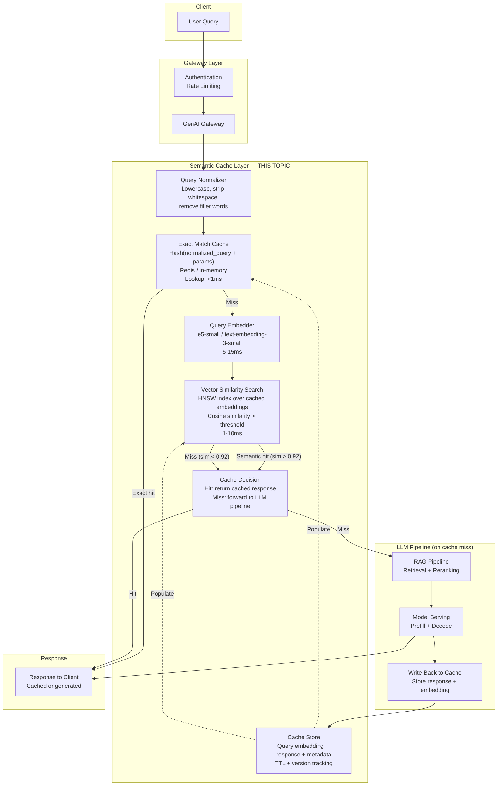
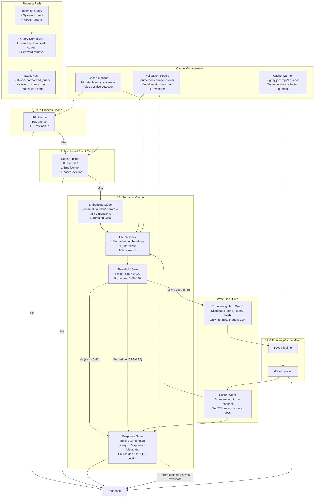
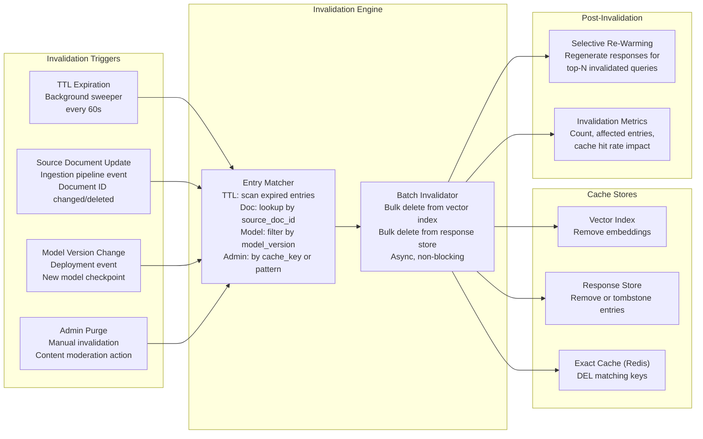
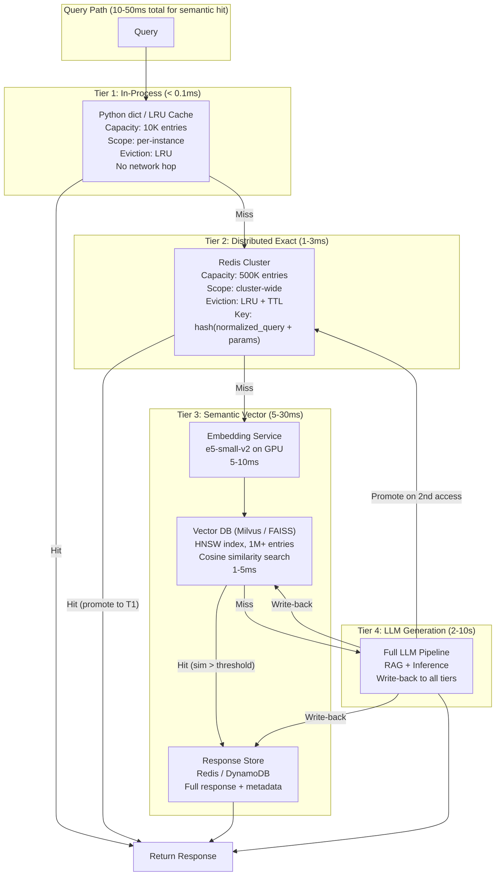

# Semantic Caching

## 1. Overview

Semantic caching is the practice of caching LLM responses and retrieving them for semantically similar (not just lexically identical) future queries. Unlike traditional caching where the cache key is an exact hash of the request, semantic caching embeds the query into a vector space and returns a cached response when a sufficiently similar query is found. This technique addresses three fundamental costs of LLM inference: latency (cached responses return in 10-50ms vs 2-10s for generation), cost (cached responses cost zero inference tokens), and consistency (identical or similar questions always get the same answer).

For Principal AI Architects, semantic caching is a system-level optimization that sits between the application layer and the model serving layer. It is architecturally analogous to a CDN for LLM responses -- a read-through cache that intercepts requests before they reach the expensive compute layer. The design challenge is unique to LLMs: cache key design must account for the fact that "What is the capital of France?" and "Tell me France's capital city" should be cache hits, while "What is the capital of Germany?" must be a cache miss despite high lexical similarity.

**Key numbers that frame semantic caching decisions:**

- Cache hit latency: 10-50ms (embedding + vector similarity + cache lookup) vs 2-10s for LLM generation
- Cost per cache hit: $0.0001-0.001 (embedding + vector search) vs $0.01-0.10 for LLM generation (100-1000x cheaper)
- Typical cache hit rates: 15-25% for general chatbots, 40-60% for customer support, 60-80% for FAQ/documentation bots
- Embedding latency: 5-15ms for a small embedding model (e5-small, 33M params) on GPU
- Vector similarity search: 1-10ms for 100K cached entries using HNSW (in-memory)
- Similarity threshold tuning: 0.90-0.95 cosine similarity for high-precision hits (low false positive rate), 0.85-0.90 for broader matching (higher hit rate, some quality risk)
- Cache invalidation complexity: The hardest problem -- stale responses from updated knowledge bases or model changes can silently degrade quality

---

## 2. Where It Fits in GenAI Systems

Semantic caching sits in the orchestration layer as an interceptor between the application/gateway and the model serving infrastructure. It is checked early in the request path (after authentication and before RAG retrieval) to short-circuit the entire inference pipeline when a cache hit occurs.



**Upstream dependencies:** The gateway/router layer must route requests through the semantic cache before the RAG pipeline or model serving layer. The cache check adds 10-50ms to every request (even misses), so it must be fast enough that the overhead is justified by the hit rate.

**Downstream dependencies:** On cache miss, the full LLM pipeline (RAG + inference) executes and the response is written back to the cache. The write-back path must handle concurrent writes for duplicate queries (thundering herd) and enforce cache size limits.

**Key interface contract:** The semantic cache returns either a cache hit (response + similarity score + cache metadata) or a cache miss (with the computed query embedding passed downstream to avoid re-computation). The cache hit response must include a flag indicating it is cached, so downstream monitoring can track cache hit rates and cached response quality.

---

## 3. Core Concepts

### 3.1 Why Cache LLM Responses

LLM inference has three properties that make caching exceptionally valuable:

1. **High marginal cost**: Each LLM call costs $0.01-$0.10+ in compute. For high-traffic applications (1M+ queries/day), even a 20% cache hit rate saves $2,000-$20,000/day.
2. **High latency**: LLM generation takes 2-10 seconds. A cache hit returns in 10-50ms -- a 50-200x improvement that fundamentally changes the user experience.
3. **Deterministic responses are acceptable**: For many use cases (FAQs, documentation, factual queries), the "correct" answer doesn't change between requests. Serving a cached response is not just acceptable but preferable (consistency, reduced variance).

**When NOT to cache:**
- Creative/generative tasks where variety is desired (storytelling, brainstorming)
- Personalized responses that depend on user-specific context not captured in the query
- Rapidly changing information (stock prices, live events) where staleness is unacceptable
- Multi-turn conversations where context evolves (though individual turns can be cached if context-independent)

### 3.2 Exact Match Caching

The simplest caching strategy: hash the request and look up an exact match.

**Cache key design:**
```
key = hash(normalize(query) + system_prompt_hash + model_id + temperature + top_p + max_tokens)
```

**Normalization steps:**
1. Lowercase the query
2. Strip leading/trailing whitespace
3. Collapse multiple spaces to single space
4. Remove filler phrases ("um", "uh", "please", "can you")
5. Optionally: lemmatize words ("running" -> "run")

**When exact match works well:**
- API-driven applications where queries are programmatically constructed (structured, predictable)
- Temperature=0 with deterministic sampling (identical input always produces identical output)
- High-frequency repeated queries (search autocompletions, common customer support questions)

**Limitations:**
- "What is the capital of France?" and "what's france's capital" are misses despite being semantically identical
- Hit rate is typically low (5-15%) for free-form natural language queries
- Normalization helps but cannot bridge semantic equivalence

### 3.3 Semantic Caching Architecture

Semantic caching extends exact-match caching by embedding queries into a vector space and finding similar cached queries using vector similarity search.

**Pipeline:**

1. **Query normalization**: Apply the same normalization as exact-match caching
2. **Query embedding**: Encode the normalized query using an embedding model (e.g., `text-embedding-3-small`, `e5-small-v2`, `bge-small-en-v1.5`). Latency: 5-15ms on GPU.
3. **Similarity search**: Search the cache's vector index for the nearest cached query embedding. Use cosine similarity with HNSW index. Latency: 1-10ms for up to 1M entries.
4. **Threshold check**: If the highest similarity score exceeds the threshold (e.g., 0.92), it is a cache hit. Return the cached response.
5. **Cache miss path**: If no cached query exceeds the threshold, forward the request to the LLM pipeline. After generation, store the query embedding + response in the cache.

**Critical parameters:**

| Parameter | Typical Range | Impact |
|-----------|--------------|--------|
| **Similarity threshold** | 0.85 - 0.95 | Lower = higher hit rate, more false positives. Higher = lower hit rate, fewer false positives. |
| **Embedding model** | 33M - 330M params | Larger models produce better embeddings but add latency. Small models (e5-small, 33M) are usually sufficient. |
| **Embedding dimension** | 256 - 1536 | Higher dimensions capture more nuance but increase storage and search cost. 384-768 is the sweet spot. |
| **Max cache size** | 10K - 10M entries | Bounded by memory (vector index) and storage (responses). 100K entries at 768 dimensions = ~300 MB for embeddings alone. |

### 3.4 GPTCache Architecture

GPTCache (open-source by Zilliz) is the most widely referenced semantic caching library. Its architecture provides a useful reference for building custom semantic caches.

**Components:**

1. **Pre-processor**: Normalizes and prepares the query. Can extract key phrases, apply spell correction, or rewrite the query for better embedding quality.
2. **Embedding generator**: Converts the query to a vector. Supports OpenAI, Hugging Face, Cohere, and local embedding models.
3. **Cache manager**: Manages the vector store (Milvus, FAISS, ChromaDB) and the scalar store (Redis, SQLite, DynamoDB) that holds the actual responses.
4. **Similarity evaluator**: Computes similarity between the query embedding and cached embeddings. Supports cosine, L2, and custom evaluators. Can also use a secondary LLM-based evaluation for borderline cases.
5. **Post-processor**: Applies transformations to the cached response before returning (e.g., personalizing a cached template).

**Eviction strategies:**
- **LRU (Least Recently Used)**: Default. Evicts entries that haven't been accessed recently.
- **LFU (Least Frequently Used)**: Evicts entries accessed least often. Better for workloads with stable popularity distributions.
- **TTL (Time-to-Live)**: Evicts entries after a fixed time regardless of access pattern. Essential for time-sensitive information.
- **FIFO (First In, First Out)**: Simplest. Evicts oldest entries. Poor cache performance but predictable behavior.

### 3.5 Cache Key Design

The cache key must capture all factors that affect the LLM's response. Missing a factor creates false cache hits (returning inappropriate cached responses).

**Complete cache key components:**

| Component | Why It Matters | How to Include |
|-----------|---------------|----------------|
| **User query** | The primary semantic content | Embed after normalization |
| **System prompt** | Different system prompts produce different responses | Hash and include in the composite key |
| **Model ID** | Different models produce different responses | Include as metadata filter, not in embedding |
| **Temperature** | temperature=0 responses are deterministic; temperature=1 should not be cached | Only cache when temperature=0 or very low |
| **RAG context** | If the response depends on retrieved documents, the cache must account for them | Option A: Include retrieved doc IDs in key. Option B: Cache at the query level (pre-RAG) and invalidate when source docs change. |
| **User identity** | If responses are personalized (user preferences, history) | Include user segment or persona ID, not individual user ID (too sparse) |
| **Output format** | JSON vs prose vs markdown may produce different responses | Include in metadata filter |

**Cache key anti-patterns:**
- Including timestamps (every request is unique)
- Including request IDs or session IDs (creates per-request uniqueness)
- Embedding the full RAG context (too variable, no cache hits)
- Including conversation history for context-independent queries (inflates key space)

### 3.6 Cache Invalidation

Cache invalidation is the hardest problem in semantic caching. Stale cached responses silently degrade quality without any error signal.

**Invalidation triggers:**

1. **TTL expiration**: Set a maximum age for cached entries. TTL depends on content volatility:
   - Static knowledge (math, geography): TTL = 7-30 days
   - Moderately dynamic (product info, documentation): TTL = 1-7 days
   - Highly dynamic (news, prices, availability): TTL = 1-60 minutes or do not cache
2. **Source document updates**: When RAG source documents are updated (re-indexed, modified, deleted), invalidate all cache entries that were generated from those documents. This requires storing source document IDs as cache metadata.
3. **Model version changes**: When the serving model is updated (new version, different model), invalidate the entire cache or the subset for that model. Cached responses from the old model may be incorrect or stylistically inconsistent with the new model.
4. **Manual invalidation**: Admin-triggered purge for known incorrect responses, policy changes, or content moderation actions.
5. **Confidence-based invalidation**: If the cache hit similarity score is in a "borderline" range (e.g., 0.90-0.93), mark the entry for revalidation: return the cached response but also send the query to the LLM in the background, and update the cache if the new response differs significantly.

**The staleness-freshness tradeoff:**
Aggressive invalidation (short TTL, broad source-change propagation) keeps the cache fresh but reduces hit rate. Lenient invalidation (long TTL, lazy propagation) maximizes hit rate but risks serving stale responses. The right balance depends on the cost of a stale response in your domain.

### 3.7 Cache Hit Rate Optimization

**Query normalization quality**: Better normalization directly improves hit rates by collapsing semantically identical but lexically different queries. Advanced normalization includes:
- Spell correction ("whats the captial of france" -> "what is the capital of france")
- Acronym expansion ("NYC" -> "New York City")
- Synonym resolution (domain-specific: "EKS" -> "Amazon Elastic Kubernetes Service")

**Embedding model selection**: The embedding model's quality determines how well semantic similarity in vector space maps to actual semantic equivalence. Models trained on sentence-level similarity tasks (e5, bge, GTE) outperform general-purpose embeddings for cache key generation.

**Threshold tuning methodology:**
1. Collect a sample of query pairs from production traffic
2. Label each pair as "should hit" or "should miss"
3. Compute embedding similarity for all pairs
4. Plot precision-recall curve at different thresholds
5. Select threshold that maximizes F1 or that achieves target precision (e.g., 99% precision for zero tolerance for false hits)

### 3.8 Hybrid Caching: Exact + Semantic

The optimal caching strategy layers exact-match caching in front of semantic caching:

1. **Layer 1 -- Exact match (in-memory/Redis)**: O(1) lookup, <1ms latency. Catches identical repeated queries.
2. **Layer 2 -- Semantic match (vector DB)**: O(log N) HNSW lookup, 5-30ms latency. Catches semantically similar queries.
3. **Layer 3 -- LLM generation**: Full inference pipeline on cache miss.

This layered approach ensures that the most common queries (exact repeats) are served with minimal overhead, while semantic caching catches the longer tail of paraphrased queries.

### 3.9 Cache Warming

Pre-populate the cache with responses to anticipated queries before traffic arrives. This is especially valuable for:

- **Product launches**: Generate and cache responses for expected FAQ queries
- **Documentation updates**: When source documents change, proactively regenerate and cache responses for the most common queries about those documents
- **Seasonal traffic**: Before peak periods (Black Friday, tax season), warm the cache with historically common queries

**Implementation:**
1. Extract top-N queries from historical logs (by frequency)
2. Send each query through the full LLM pipeline
3. Store the response in the cache with a fresh TTL
4. Schedule cache warming as a cron job (e.g., nightly for documentation bots, hourly for news-based systems)

### 3.10 Multi-Tier Caching

For high-traffic systems, implement a multi-tier cache hierarchy:

| Tier | Storage | Latency | Capacity | Cost | Content |
|------|---------|---------|----------|------|---------|
| **L1: In-process** | Application memory (dict/LRU) | <0.1ms | 1K-10K entries | Free | Hot queries (top 1%) |
| **L2: In-memory distributed** | Redis / Memcached | 1-5ms | 100K-1M entries | $$ | Warm queries (top 10%) |
| **L3: Vector DB** | Milvus / Pinecone / Weaviate | 5-30ms | 1M-100M entries | $$$ | Full semantic cache |

Lookup proceeds through tiers: L1 -> L2 -> L3 -> LLM. Writes propagate back: store in L3, promote to L2 on second access, promote to L1 on Nth access.

---

## 4. Architecture

### 4.1 Complete Semantic Caching System



### 4.2 Cache Invalidation Flow



### 4.3 Multi-Tier Cache Hierarchy



---

## 5. Design Patterns

### Pattern 1: Read-Through Semantic Cache

**When to use:** Default pattern for any application fronting an LLM API.

**Architecture:** The semantic cache is a transparent proxy between the application and the LLM. On cache hit, it returns the cached response. On cache miss, it forwards the request to the LLM, caches the response, and returns it. The application code is unaware of the cache.

**Key implementation detail:** The write-back must include a thundering herd guard (distributed lock on query hash) to prevent N identical concurrent queries from all triggering LLM inference. Only the first miss triggers inference; subsequent identical queries wait for the result.

### Pattern 2: Stale-While-Revalidate

**When to use:** When cache freshness matters but latency is the top priority.

**Architecture:** When a cached entry is accessed and its TTL has expired (or it is in the "borderline" similarity range), return the stale cached response immediately but trigger an asynchronous background revalidation. The background job sends the query to the LLM, compares the new response with the cached response, and updates the cache if they differ.

**Tradeoff:** The user gets the fastest possible response (always cached), but may receive slightly stale information. The next user gets the updated response.

### Pattern 3: Context-Aware Caching for RAG

**When to use:** RAG applications where the LLM response depends on retrieved context that may change.

**Architecture:**
1. **Pre-retrieval caching**: Cache at the query level (before RAG). Simple but requires invalidation when source documents change. Effective when the same query always retrieves the same documents.
2. **Post-retrieval caching**: Cache at the (query + retrieved_doc_ids) level (after retrieval, before LLM). More precise but lower hit rate because document sets vary.
3. **Hybrid**: Pre-retrieval caching with source document tracking. Store the IDs of documents that contributed to each cached response. When a document is updated, invalidate all cache entries that reference it.

### Pattern 4: Segmented Caching by Query Type

**When to use:** Applications serving diverse query types with different caching characteristics.

**Architecture:** Route queries through a classifier that determines the caching strategy:
- **Factual queries** (e.g., "What is X?"): High cache hit rate, long TTL (7+ days). Use semantic caching aggressively.
- **Analytical queries** (e.g., "Compare X and Y"): Moderate hit rate. Cache with medium TTL (1-3 days). Parameter-sensitive (same question, different context = different answer).
- **Creative queries** (e.g., "Write a poem about X"): Low/zero cache hit rate. Do not cache or cache only for deduplication (exact match, short TTL).
- **Personalized queries** (e.g., "Recommend X for me"): Do not cache with semantic matching (user context varies). Consider user-segment-level caching.

### Pattern 5: Distributed Semantic Cache with Regional Affinity

**When to use:** Global applications with multi-region deployment.

**Architecture:** Each region maintains its own cache instance (Redis + vector DB). Cache entries are not replicated across regions (too expensive and responses may be region-specific). Instead:
1. Each region builds its cache independently from local traffic
2. Cache warming propagates the top-N global queries to all regions
3. Cache invalidation events are broadcast globally (a document update invalidates entries in all regions)
4. Embedding model is deployed in each region to avoid cross-region embedding latency

---

## 6. Implementation Approaches

### 6.1 GPTCache Integration

```python
# GPTCache setup with Redis + FAISS + OpenAI embeddings
from gptcache import cache as gptcache_instance
from gptcache.adapter import openai as gptcache_openai
from gptcache.embedding import OpenAI as OpenAIEmbedding
from gptcache.manager import CacheBase, VectorBase, get_data_manager
from gptcache.similarity_evaluation.distance import SearchDistanceEvaluation

# Configure embedding model
embedding = OpenAIEmbedding(model="text-embedding-3-small")

# Configure cache storage (scalar) and vector index
cache_base = CacheBase("redis", redis_config={"host": "localhost", "port": 6379})
vector_base = VectorBase(
    "faiss",
    dimension=embedding.dimension,  # 1536 for text-embedding-3-small
    top_k=3,  # Return top 3 similar cached queries
)
data_manager = get_data_manager(cache_base, vector_base)

# Configure similarity evaluation
similarity_evaluation = SearchDistanceEvaluation(max_distance=0.12)  # ~0.88 cosine sim

# Initialize cache
gptcache_instance.init(
    pre_embedding_func=lambda kwargs: kwargs["messages"][-1]["content"],
    embedding_func=embedding.to_embeddings,
    data_manager=data_manager,
    similarity_evaluation=similarity_evaluation,
)

# Usage: drop-in replacement for OpenAI client
response = gptcache_openai.ChatCompletion.create(
    model="gpt-4o",
    messages=[{"role": "user", "content": "What is the capital of France?"}],
)
# First call: cache miss -> calls OpenAI -> caches response
# Second call with "Tell me France's capital": cache hit -> returns cached response
```

### 6.2 Custom Semantic Cache with Redis + FAISS

```python
import hashlib
import json
import time
import numpy as np
import faiss
import redis
from sentence_transformers import SentenceTransformer

class SemanticCache:
    def __init__(
        self,
        embedding_model: str = "intfloat/e5-small-v2",
        similarity_threshold: float = 0.92,
        ttl_seconds: int = 86400,  # 24 hours
        max_entries: int = 100_000,
    ):
        self.model = SentenceTransformer(embedding_model)
        self.dim = self.model.get_sentence_embedding_dimension()
        self.threshold = similarity_threshold
        self.ttl = ttl_seconds
        self.max_entries = max_entries

        # FAISS HNSW index for semantic search
        self.index = faiss.IndexHNSWFlat(self.dim, 32)  # 32 neighbors
        self.index.hnsw.efSearch = 64

        # Redis for exact cache + response storage
        self.redis = redis.Redis(host="localhost", port=6379, decode_responses=True)

        # In-memory mapping: FAISS index position -> cache key
        self.index_to_key: list[str] = []

    def _normalize_query(self, query: str) -> str:
        query = query.lower().strip()
        # Remove common filler words
        fillers = ["please", "can you", "could you", "tell me", "i want to know"]
        for filler in fillers:
            query = query.replace(filler, "")
        return " ".join(query.split())  # Collapse whitespace

    def _exact_key(self, query: str, system_prompt: str, model: str) -> str:
        content = f"{query}|{system_prompt}|{model}"
        return f"cache:exact:{hashlib.sha256(content.encode()).hexdigest()}"

    def _semantic_key(self, idx: int) -> str:
        return self.index_to_key[idx]

    def lookup(self, query: str, system_prompt: str = "", model: str = "gpt-4o"):
        normalized = self._normalize_query(query)

        # Layer 1: Exact match
        exact_key = self._exact_key(normalized, system_prompt, model)
        cached = self.redis.get(exact_key)
        if cached:
            entry = json.loads(cached)
            if time.time() < entry["expires_at"]:
                return {"hit": True, "type": "exact", "response": entry["response"]}

        # Layer 2: Semantic match
        embedding = self.model.encode([f"query: {normalized}"], normalize_embeddings=True)
        embedding = np.array(embedding, dtype=np.float32)

        if self.index.ntotal > 0:
            distances, indices = self.index.search(embedding, k=1)
            similarity = 1 - distances[0][0]  # Convert L2 distance to cosine sim

            if similarity >= self.threshold and indices[0][0] >= 0:
                sem_key = self._semantic_key(indices[0][0])
                cached = self.redis.get(sem_key)
                if cached:
                    entry = json.loads(cached)
                    if time.time() < entry["expires_at"]:
                        return {
                            "hit": True,
                            "type": "semantic",
                            "similarity": float(similarity),
                            "response": entry["response"],
                        }

        return {"hit": False, "embedding": embedding}

    def store(self, query: str, response: str, system_prompt: str = "",
              model: str = "gpt-4o", source_doc_ids: list[str] = None,
              embedding: np.ndarray = None):
        normalized = self._normalize_query(query)

        if embedding is None:
            embedding = self.model.encode(
                [f"query: {normalized}"], normalize_embeddings=True
            )
            embedding = np.array(embedding, dtype=np.float32)

        entry = {
            "query": normalized,
            "response": response,
            "model": model,
            "source_doc_ids": source_doc_ids or [],
            "created_at": time.time(),
            "expires_at": time.time() + self.ttl,
        }
        entry_json = json.dumps(entry)

        # Store in exact cache
        exact_key = self._exact_key(normalized, system_prompt, model)
        self.redis.setex(exact_key, self.ttl, entry_json)

        # Store in semantic index
        sem_key = f"cache:semantic:{hashlib.sha256(normalized.encode()).hexdigest()}"
        self.redis.setex(sem_key, self.ttl, entry_json)
        self.index.add(embedding)
        self.index_to_key.append(sem_key)
```

### 6.3 Cache Invalidation on Source Document Update

```python
# Event-driven cache invalidation when RAG source documents are updated
import json

class CacheInvalidator:
    """Listens for document update events and invalidates affected cache entries."""

    def __init__(self, cache: SemanticCache, redis_client: redis.Redis):
        self.cache = cache
        self.redis = redis_client

    def on_document_updated(self, event: dict):
        """Called when a source document is created, updated, or deleted."""
        doc_id = event["document_id"]
        action = event["action"]  # "created", "updated", "deleted"

        # Find all cache entries that reference this document
        # (stored as source_doc_ids in cache metadata)
        affected_keys = self.redis.smembers(f"cache:doc_index:{doc_id}")

        if affected_keys:
            # Delete affected cache entries
            pipeline = self.redis.pipeline()
            for key in affected_keys:
                pipeline.delete(key)
            pipeline.delete(f"cache:doc_index:{doc_id}")
            pipeline.execute()

            # Log invalidation metrics
            print(f"Invalidated {len(affected_keys)} cache entries "
                  f"for document {doc_id} ({action})")

            # Optionally: trigger re-warming for high-frequency queries
            if action in ("updated", "created"):
                self._schedule_rewarm(affected_keys)

    def on_model_version_changed(self, old_version: str, new_version: str):
        """Invalidate all cache entries generated by the old model version."""
        pattern = f"cache:*:model:{old_version}:*"
        keys = list(self.redis.scan_iter(match=pattern, count=1000))
        if keys:
            self.redis.delete(*keys)
            print(f"Invalidated {len(keys)} entries for model version {old_version}")
```

---

## 7. Tradeoffs

### Caching Strategy Selection

| Decision Factor | Exact Match Only | Semantic Only | Hybrid (Exact + Semantic) |
|----------------|-----------------|---------------|--------------------------|
| **Hit rate** | Low (5-15%) | High (20-60%) | Highest (25-65%) |
| **Latency overhead (miss)** | <1ms | 10-30ms (embedding + search) | 10-30ms |
| **False positive rate** | 0% (exact match) | 1-5% (threshold-dependent) | 1-5% for semantic tier |
| **Implementation complexity** | Low | Medium | Medium-High |
| **Storage cost** | Low (hash → response) | Medium (embeddings + index) | Medium-High |
| **Best for** | Programmatic APIs, temperature=0 | Natural language queries | Production systems |

### Similarity Threshold Selection

| Threshold | Hit Rate | False Positive Rate | Use Case |
|-----------|----------|--------------------|---------|
| **0.95+** | Low (5-15%) | <0.5% | Safety-critical, medical, legal |
| **0.92** | Medium (15-35%) | 1-2% | General production (recommended default) |
| **0.88** | High (25-50%) | 3-5% | Cost-optimized, with human review fallback |
| **0.85** | Highest (35-60%) | 5-10% | Internal tools, low-stakes applications |

### Embedding Model for Cache Keys

| Model | Dimensions | Latency (GPU) | Quality | Cost |
|-------|-----------|---------------|---------|------|
| **e5-small-v2 (33M)** | 384 | 3-5ms | Good | Lowest (self-hosted) |
| **bge-small-en-v1.5 (33M)** | 384 | 3-5ms | Good | Lowest (self-hosted) |
| **e5-base-v2 (109M)** | 768 | 5-10ms | Better | Low (self-hosted) |
| **text-embedding-3-small (OpenAI)** | 1536 | 10-20ms | Best | $0.02/1M tokens |
| **text-embedding-3-large (OpenAI)** | 3072 | 15-30ms | Best+ | $0.13/1M tokens |
| **Recommendation** | -- | -- | -- | e5-small for cost; text-embedding-3-small if using OpenAI |

### Cache Storage Backend

| Decision Factor | In-Memory (FAISS) | Redis + RediSearch | Milvus | Pinecone |
|----------------|-------------------|-------------------|--------|----------|
| **Latency** | <1ms | 1-5ms | 3-10ms | 5-20ms |
| **Persistence** | No (lost on restart) | Yes | Yes | Yes (managed) |
| **Max entries** | ~1M (per node, memory-bound) | ~10M | 100M+ | Unlimited (managed) |
| **Operational burden** | None (in-process) | Low | Medium | None (SaaS) |
| **Distributed** | No | Yes (cluster mode) | Yes | Yes |
| **Best for** | Single-instance, <1M entries | Production, <10M entries | Large-scale, >10M entries | Managed, any scale |

---

## 8. Failure Modes

| Failure Mode | Symptom | Root Cause | Mitigation |
|-------------|---------|------------|------------|
| **False positive cache hit** | User receives incorrect/irrelevant cached response | Similarity threshold too low. Embedding model conflates semantically different queries (e.g., "capital of France" vs "capital of Germany"). | Raise similarity threshold, add metadata filters (topic, entity extraction), implement user feedback loop for false-hit detection |
| **Cache poisoning** | Incorrect response permanently served from cache | A hallucinated or wrong LLM response was cached and served for all similar queries. | Implement quality checks before caching (hallucination detector, confidence score threshold), add manual purge capability, set reasonable TTLs |
| **Thundering herd** | Hundreds of identical requests simultaneously trigger LLM inference | Popular query arrives for the first time; all concurrent instances see a cache miss. | Implement distributed lock on query hash; only first miss triggers LLM inference, others wait for result |
| **Cache staleness** | Users receive outdated information (e.g., old pricing, deprecated features) | Long TTL with no invalidation on source document updates. | Implement event-driven invalidation on document updates, reduce TTL for volatile content, add staleness detection |
| **Embedding service failure** | All requests bypass semantic cache, 100% cache misses, LLM traffic spikes | Embedding model service is down or overloaded. | Fall back to exact-match-only caching, implement embedding service health check with circuit breaker, cache embeddings to avoid re-computation |
| **Vector index corruption** | Semantic cache returns wrong entries or crashes | FAISS index exceeds memory, concurrent writes without locking, index build failure. | Use persistent vector DB (Milvus, Pinecone) instead of in-memory FAISS for production, implement index snapshots and restore |
| **Cache memory exhaustion** | OOM on Redis or vector DB, service degradation | Unbounded cache growth, no eviction policy, large responses stored without size limits. | Set max memory with eviction policy (Redis maxmemory + allkeys-lru), implement response size limits, monitor cache size |
| **Inconsistent cache across instances** | Different app instances return different responses for the same query | Each instance has a local L1 cache that is populated independently. | Use shared L2/L3 cache as source of truth, implement L1 cache with short TTL (60s), or use consistent hashing for request routing |

---

## 9. Optimization Techniques

### 9.1 Hit Rate Optimization

| Technique | Hit Rate Improvement | Effort |
|-----------|---------------------|--------|
| **Advanced query normalization** (spell-correct, synonym expansion) | +5-15% | Medium |
| **Cluster-based caching** (cluster similar queries, cache per cluster) | +10-20% | High |
| **Cache warming** (pre-populate with historical top queries) | +10-30% at startup | Low |
| **Prefix-aware caching** (cache system prompt + common query patterns) | +5-10% | Low |
| **Embedding model upgrade** (e5-small -> e5-large) | +3-8% | Low |
| **Threshold tuning** (data-driven threshold selection) | +5-15% | Medium |

### 9.2 Latency Optimization

| Technique | Latency Reduction | Impact |
|-----------|-------------------|--------|
| **In-process L1 cache** (avoid network hop for hot queries) | 5-30ms per hit | High for hot queries |
| **Smaller embedding model** (e5-small vs e5-large) | 5-15ms per lookup | Moderate |
| **Quantized embedding model** (INT8 embedding inference) | 2-5ms per lookup | Small |
| **Pre-computed embeddings** (for known system prompts) | Eliminates embedding step for cache key | High for templated apps |
| **HNSW parameter tuning** (ef_search, ef_construction) | 1-5ms per search | Small-Moderate |
| **Batch embedding** (embed multiple queries per GPU call) | Amortized cost per query | High at scale |

### 9.3 Cost Optimization

| Technique | Cost Reduction | Trade-off |
|-----------|---------------|-----------|
| **Self-hosted embedding model** (e5-small on GPU) | Eliminates embedding API cost (~$0.02/M tokens) | Operational overhead |
| **Aggressive caching** (lower threshold, longer TTL) | Higher hit rate = fewer LLM calls | More false positives, staleness risk |
| **Response compression** (gzip cached responses in Redis) | 50-70% storage reduction | 1-2ms decompression overhead |
| **Tiered storage** (hot entries in Redis, cold in disk/S3) | 60-80% storage cost reduction | Higher latency for cold entries |
| **Embedding dimension reduction** (Matryoshka embeddings, PCA) | 50-75% vector storage reduction | Slight quality degradation |

---

## 10. Real-World Examples

### GPTCache by Zilliz -- Open-Source Semantic Caching

GPTCache is the most widely used open-source semantic caching library. Developed by Zilliz (the company behind Milvus), it provides a modular architecture with pluggable embedding models, vector stores, and similarity evaluators. In production deployments, GPTCache has demonstrated 30-60% cache hit rates for customer support bots and 20-40% for general-purpose chatbots. Key design choice: GPTCache uses a two-stage evaluation -- vector similarity first, then an optional LLM-based secondary evaluation for borderline cases -- which reduces false positive rates to <1% at the cost of additional latency for borderline hits.

### Langchain CacheBackedEmbeddings -- Embedding Caching

LangChain's caching framework implements both exact and semantic caching at the embedding level. Their `CacheBackedEmbeddings` wrapper caches embedding computations to avoid re-embedding identical text chunks during RAG ingestion. For semantic response caching, LangChain's `GPTCache` integration provides transparent caching for any LLM call. Production users (including Notion, Replit, and various enterprise deployments) report 25-45% cost reduction from LangChain's caching layers in RAG-heavy applications.

### Anthropic and OpenAI -- Provider-Side Prompt Caching

Both Anthropic and OpenAI implement server-side prefix caching (a form of KV cache reuse, not response caching). Anthropic's prompt caching (launched 2024) caches the KV cache for marked prompt sections server-side, offering 90% input token cost reduction and significant TTFT improvement for repeated prefixes. OpenAI's automatic caching provides 50% input cost reduction. Google's Gemini API offers context caching with 75% discount. These are not semantic caches (they cache KV state, not responses), but they serve a similar cost/latency optimization purpose for applications with repetitive system prompts.

### Redis -- Vector Search for Semantic Caching

Redis 7.2+ with the RediSearch module supports vector similarity search natively, making it a popular choice for semantic caching infrastructure. Redis combines exact-match caching (hash lookup) and semantic caching (vector search) in a single system, eliminating the need for a separate vector database. Companies like Chegg and Quizlet use Redis-based semantic caching for their AI tutoring products, reporting 40-55% cache hit rates and 100x latency reduction on cache hits (5ms vs 500ms). Redis's atomic operations and pub/sub make it well-suited for cache invalidation and thundering herd protection.

### Portkey -- AI Gateway with Built-In Caching

Portkey's AI gateway includes both exact and semantic caching as built-in features. Their caching layer sits between the application and LLM providers, transparently caching responses with configurable similarity thresholds and TTLs. Portkey reports that enterprise customers achieve 20-35% cost reduction through their caching layer, with cache hit responses served in <50ms. Their implementation includes automatic cache invalidation on model version changes and a dashboard for monitoring cache hit rates and estimated cost savings.

---

## 11. Related Topics

- **[Latency Optimization](latency-optimization.md):** Semantic caching is one of the highest-impact latency optimization techniques, eliminating LLM inference entirely for cached queries
- **[Cost Optimization](cost-optimization.md):** Caching is the primary cost reduction mechanism for high-traffic LLM applications, reducing per-query cost by 100-1000x on cache hits
- **[Vector Databases](../05-vector-search/vector-databases.md):** The vector similarity search infrastructure that powers the semantic matching layer of the cache
- **[Embedding Models](../05-vector-search/embedding-models.md):** Embedding model selection directly affects cache hit quality and false positive rates
- **[Context Window Management](../06-prompt-engineering/context-management.md):** Context assembly and prompt design affect cache key design and hit rates
- **[Model Routing](model-routing.md):** Model routing decisions interact with caching -- cached responses bypass routing entirely
- **[Caching Fundamentals](../../traditional-system-design/04-caching/caching.md):** General caching principles (TTL, eviction, consistency) that apply to semantic caching
- **[Redis](../../traditional-system-design/04-caching/redis.md):** The most common infrastructure component for both exact-match and semantic cache storage
- **[RAG Pipeline](../04-rag/rag-pipeline.md):** RAG-aware caching must account for retrieved document changes in its invalidation strategy

---

## 12. Source Traceability

| Concept | Primary Source | Year |
|---------|---------------|------|
| GPTCache | Zilliz / Bang Liu, "GPTCache: An Open-Source Semantic Cache for LLM Applications" (GitHub) | 2023 |
| Semantic similarity caching for LLMs | Zhu et al., "Scalable and Effective Semantic Cache for LLM Queries" (arXiv) | 2024 |
| Embedding-based similarity search | Johnson et al., "Billion-scale similarity search with GPUs" (FAISS, Meta) | 2019 |
| HNSW algorithm | Malkov & Yashunin, "Efficient and robust approximate nearest neighbor using Hierarchical Navigable Small World graphs" | 2018 |
| Anthropic prompt caching | Anthropic, "Prompt Caching" (API documentation) | 2024 |
| OpenAI automatic caching | OpenAI, "Prompt Caching" (API documentation) | 2024 |
| Redis vector search | Redis Ltd., "Redis Vector Similarity Search" (documentation) | 2023 |
| Milvus vector database | Zilliz / LF AI, "Milvus: A Purpose-Built Vector Data Management System" | 2021 |
| LangChain caching | LangChain, "Caching" (documentation) | 2023 |
| Portkey AI gateway | Portkey AI, "AI Gateway with Caching" (product documentation) | 2024 |
| E5 embedding models | Wang et al., "Text Embeddings by Weakly-Supervised Contrastive Pre-training" (Microsoft) | 2022 |
| BGE embedding models | Xiao et al., "C-Pack: Packaged Resources To Advance General Chinese Embedding" (BAAI) | 2023 |
| Matryoshka embeddings | Kusupati et al., "Matryoshka Representation Learning" | 2022 |
| Cache replacement policies (LRU, LFU) | Megiddo & Modha, "ARC: A Self-Tuning, Low Overhead Replacement Cache" (IBM) | 2003 |
