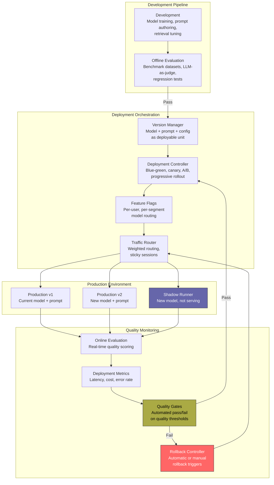
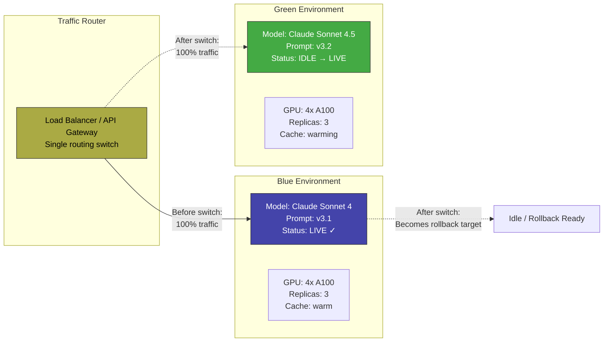
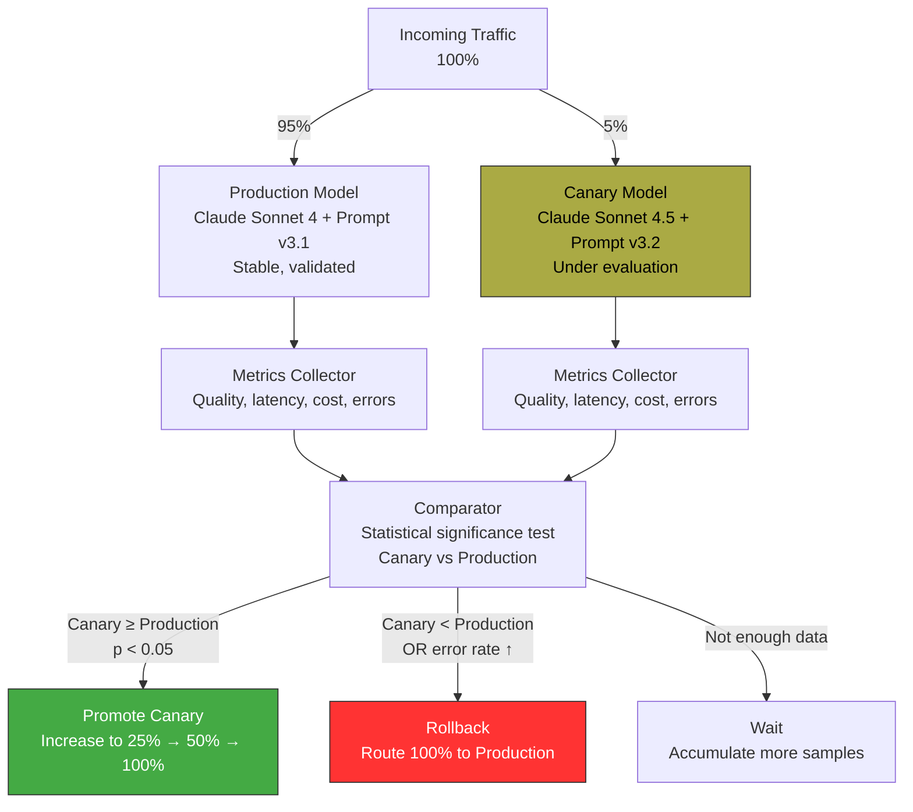
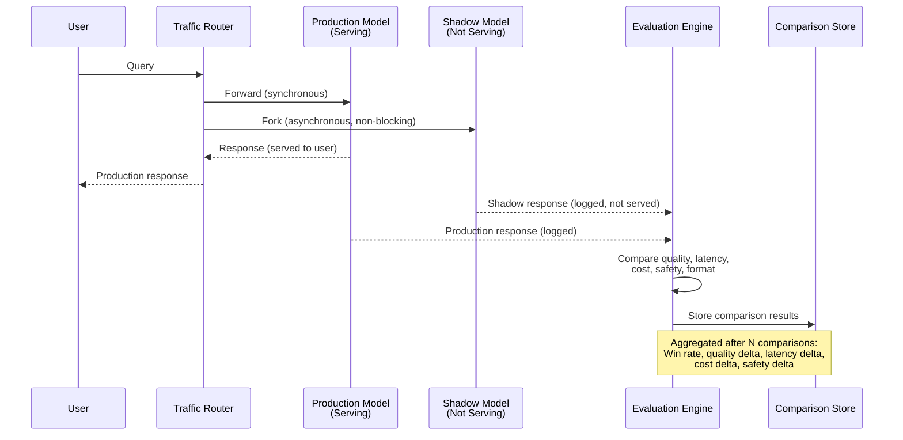
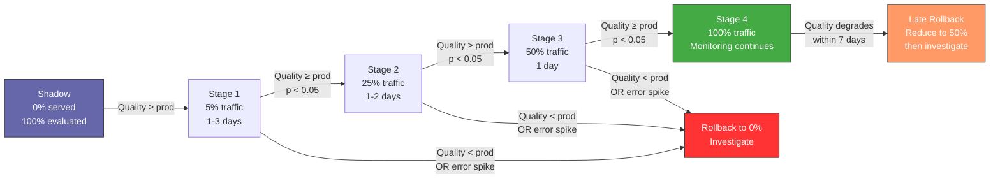
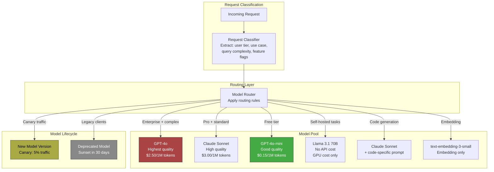
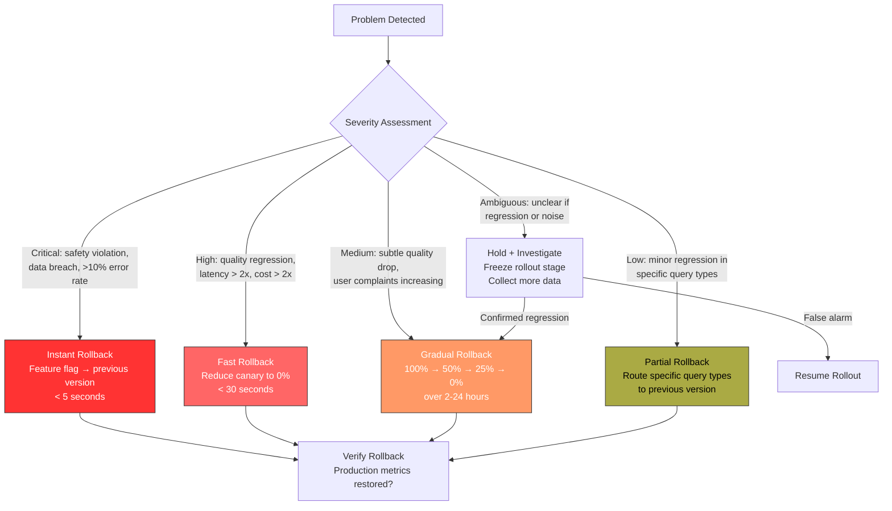
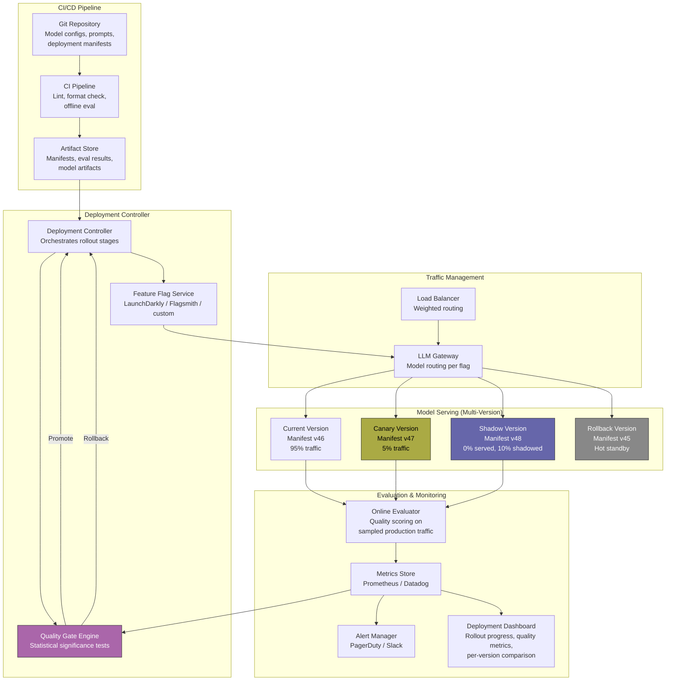
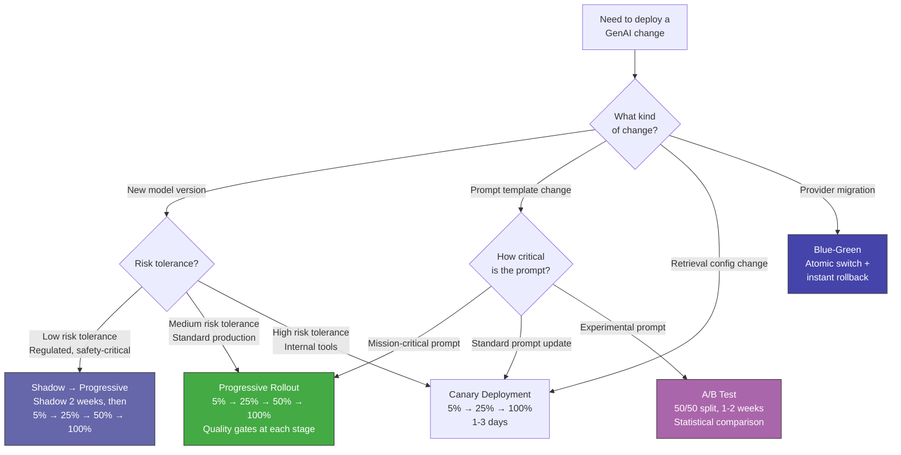

# Deployment Patterns for GenAI

## 1. Overview

Deploying GenAI systems is fundamentally different from deploying traditional software. In traditional deployments, "correctness" is binary --- the code either works or it does not, and a rollback restores the previous behavior exactly. In GenAI deployments, "correctness" is a spectrum. A new model version might improve quality for 95% of queries while degrading it for 5%. A prompt change might increase helpfulness while subtly increasing hallucination rate. A retrieval configuration change might improve recall while adding 50ms of latency. These tradeoffs are invisible without sophisticated evaluation infrastructure, and a naive rollback may sacrifice real improvements to avoid minor regressions.

GenAI deployment introduces three dimensions that traditional deployment patterns were not designed for:

- **Quality is probabilistic and multi-dimensional**: A model change cannot be validated with unit tests. You need statistical evaluation across hundreds or thousands of examples, measuring accuracy, faithfulness, toxicity, latency, cost, and user satisfaction simultaneously.
- **The deployable unit is a composite**: A GenAI "deployment" is not a single binary. It is a model version + prompt template version + retrieval configuration + guardrail thresholds + feature flags, all of which must be versioned and deployed as a coordinated unit.
- **Rollback is lossy**: Rolling back a model version restores the previous model, but the new model may have been better for most queries. You need partial rollback strategies --- quality-gated rollback that preserves improvements while eliminating regressions.

**Key numbers that shape deployment decisions:**

- Minimum sample size for detecting a 5% quality difference at p < 0.05: 400--800 samples per variant
- Time to accumulate 800 samples at 1K requests/day with 10% canary traffic: ~1 day
- Time to accumulate 800 samples at 100 requests/day with 10% canary traffic: ~10 days
- Model swap latency (warm cache, same provider): <100ms (routing change only)
- Model swap latency (cold start, self-hosted): 30--120 seconds (model loading)
- Cost of shadow deployment: 100% cost increase during shadow period
- Cost of A/B test: proportional to traffic split (50/50 split = same as production cost)
- Rollback time with feature flags: <5 seconds (config change)
- Rollback time with blue-green: <30 seconds (traffic routing change)
- Rollback time with Kubernetes deployment: 1--5 minutes (pod replacement)

---

## 2. Where It Fits in GenAI Systems

Deployment patterns sit at the intersection of infrastructure management, model serving, and quality evaluation. They orchestrate how model versions, prompt templates, and retrieval configurations are promoted from staging to production, how traffic is routed during transitions, and how rollback is triggered when quality degrades.



These deployment patterns interact with the following adjacent systems:

- **[GenAI Design Patterns](genai-design-patterns.md)** (peer): The Gateway, Circuit Breaker, and Shadow Mode patterns provide the runtime infrastructure that deployment patterns operate on.
- **[Model Routing](../11-performance/model-routing.md)** (peer): Deployment patterns determine which model versions are available; model routing determines which version handles a given request.
- **[Eval Frameworks](../09-evaluation/eval-frameworks.md)** (upstream): Evaluation frameworks provide the quality metrics that deployment gates use to promote or roll back model versions.
- **[LLM Observability](../09-evaluation/llm-observability.md)** (cross-cutting): Observability provides the real-time metrics (latency, cost, error rate, quality scores) that deployment controllers monitor.
- **[Feature Flags](../../traditional-system-design/08-resilience/feature-flags.md)** (foundation): Feature flags are the runtime mechanism for traffic routing in canary, A/B, and progressive rollout patterns.
- **[Kubernetes for GenAI](../13-case-studies/kubernetes-genai.md)** (infrastructure): Container orchestration platforms provide the deployment primitives (rolling updates, replica sets, service mesh) on which these patterns are implemented.

---

## 3. Patterns

### 3.1 Blue-Green for Models

**Problem**: You need to switch from one model version to another (or one provider to another) atomically, with zero downtime and instant rollback capability. A rolling deployment is unacceptable because during the transition, some users would hit the old model and some the new, creating inconsistent behavior.

**Solution**: Maintain two identical production environments ("blue" and "green"). At any time, one is live (serving traffic) and the other is idle (pre-loaded with the new model version). To deploy, load the new model into the idle environment, validate it, and atomically switch the traffic router from the live environment to the idle one. The previously live environment becomes the rollback target.



**GenAI-specific considerations for blue-green:**

| Consideration | Detail |
|---|---|
| Model warm-up | Self-hosted models need 30--120s to load weights into GPU memory. The green environment must be fully warmed before the switch. For API-based providers, warm-up means priming the semantic cache and connection pool. |
| Cache invalidation | Semantic cache entries may be model-version-specific. After switching, stale cache entries might serve responses generated by the old model. Either invalidate the cache on switch or use model-version-tagged cache keys. |
| Prompt co-versioning | The model and prompt template must switch together. A new model with an old prompt (or vice versa) may produce degraded results. Version them as a single deployable unit. |
| Evaluation before switch | Run the full evaluation suite against the green environment on live-mirrored traffic (shadow mode) before switching. This is not a simple health check --- it requires statistical quality validation. |
| Cost | Maintaining two environments doubles GPU cost during the transition period. For API-based providers, cost is near-zero (just the routing configuration). |

**When to use**: Model migrations where you need atomic switchover and instant rollback. Provider migrations (switching from OpenAI to Anthropic). Major prompt revisions that change output format or behavior. Any deployment where inconsistent behavior during transition is unacceptable (financial, medical, legal applications).

**Tradeoffs**:

| Advantage | Disadvantage |
|---|---|
| Zero-downtime deployment | Doubles infrastructure cost during transition |
| Instant rollback (seconds) | Both environments must be identically configured |
| Atomic switchover: all users get new version simultaneously | No gradual validation on production traffic |
| Simple mental model | Self-hosted model warm-up adds deployment time |

---

### 3.2 Canary Deployment

**Problem**: Blue-green deployments are all-or-nothing --- you switch 100% of traffic at once. If the new model has a subtle quality regression that your offline evaluation missed, all users are affected simultaneously. You want to validate on a small percentage of real production traffic before committing to a full rollout.

**Solution**: Deploy the new model version alongside the production version. Route a small percentage of traffic (1--10%) to the new version ("canary"). Monitor quality, latency, cost, and error metrics on the canary traffic. If metrics are acceptable, gradually increase the canary percentage. If metrics degrade, route all traffic back to the production version.



**Canary evaluation metrics for GenAI:**

| Metric | How to Measure | Alert Threshold |
|---|---|---|
| Quality score | LLM-as-judge on sampled responses | >5% drop vs. production |
| Faithfulness (RAG) | NLI groundedness on sampled responses | >3% drop vs. production |
| Latency (TTFT) | Instrumented timing | >20% increase in p95 |
| Latency (total) | End-to-end timing | >20% increase in p95 |
| Error rate | HTTP 5xx + timeout rate | >2x production rate |
| Cost per request | Token count * price | >30% increase |
| Guardrail violation rate | Output guardrail trigger rate | >2x production rate |
| User feedback | Thumbs up/down ratio | >10% decrease |

**Statistical rigor for canary evaluation:**

Canary decisions must be statistically valid. With small traffic percentages and LLM output variability, you need:
- Minimum 400--800 samples per variant for detecting a 5% quality difference (two-proportion z-test, p < 0.05, power > 0.80).
- At 5% canary traffic and 10K requests/day, the canary receives 500 requests/day --- enough for daily evaluation.
- At 5% canary traffic and 500 requests/day, the canary receives 25 requests/day --- you need 16--32 days for significance. Consider increasing canary percentage or accepting higher risk with fewer samples.

**Canary promotion schedule (typical):**

| Stage | Traffic % | Duration | Gate |
|---|---|---|---|
| Initial canary | 5% | 1--3 days | Quality >= production, no error spikes |
| Expanded canary | 25% | 1--2 days | Quality confirmed with higher statistical power |
| Majority canary | 50% | 1 day | Final validation |
| Full rollout | 100% | Permanent | Production monitoring continues |
| Rollback window | Keep old version hot | 7 days | Instant rollback if delayed issues emerge |

**When to use**: The default deployment strategy for any model, prompt, or retrieval change in production. Use canary deployments whenever you can tolerate the 2--7 day rollout timeline.

**Tradeoffs**:

| Advantage | Disadvantage |
|---|---|
| Limits blast radius of quality regressions | Slower rollout (days vs. seconds for blue-green) |
| Statistical validation on real production traffic | Requires evaluation infrastructure (metrics, comparators) |
| Gradual confidence building | Small canary % may not catch rare failure modes |
| Automatic rollback on metric degradation | Users in canary may experience inconsistent quality |

---

### 3.3 A/B Testing

**Problem**: You want to compare two (or more) model configurations and determine which is objectively better, with statistical rigor. Unlike canary deployment (which validates "is the new version at least as good?"), A/B testing answers "which version is better, and by how much?"

**Solution**: Split traffic evenly (or in a controlled ratio) between variants. Assign users to variants deterministically (by user ID hash) to ensure each user sees a consistent experience. Collect evaluation metrics on both variants. Run a statistical significance test to determine if the difference is real, not noise.

**Key difference from canary deployment**: In canary, you have a "production" version and a "challenger." The goal is to validate the challenger is not worse. In A/B testing, both versions are equal candidates. The goal is to determine which is better. A/B testing typically runs for longer (1--4 weeks) and uses more rigorous statistical methods.

**A/B test design for GenAI:**

```
Experiment: "claude-sonnet-4.5 vs gpt-4o for customer support"
├─ Variant A (control): Claude Sonnet 4 + Prompt v3.1
├─ Variant B (treatment): GPT-4o + Prompt v4.0
├─ Traffic split: 50/50
├─ Assignment: Hash(user_id) mod 2 → deterministic, sticky
├─ Primary metric: User satisfaction (thumbs up rate)
├─ Secondary metrics: Faithfulness, latency, cost, guardrail violation rate
├─ Sample size calculation: 2,000 per variant (detecting 3% difference, p < 0.05)
├─ Duration: 14 days at 300 requests/day = 4,200 samples (sufficient)
└─ Guardrails: Automatic halt if either variant's error rate exceeds 5%
```

**User assignment and sticky sessions**: Users must always see the same variant during the experiment. If a user sees Variant A for their first message and Variant B for their second, the experiment is contaminated. Assignment methods:

| Method | How | Pros | Cons |
|---|---|---|---|
| User ID hash | `hash(user_id + experiment_id) % num_variants` | Deterministic, no state needed | Cannot reassign mid-experiment |
| Feature flag platform | LaunchDarkly, Flagsmith assign per user | Flexible targeting, real-time control | Platform dependency |
| Session cookie | Assign on first request, store in cookie | Works for anonymous users | Lost on cookie clear |
| Server-side assignment table | Store user -> variant mapping in Redis | Full control, auditable | Storage and lookup overhead |

**Statistical analysis for GenAI A/B tests:**

LLM output quality metrics are noisy. A response might be rated "good" by one judge and "mediocre" by another. This noise inflates the required sample size.

- **Binary metrics** (thumbs up/down, guardrail pass/fail): Use a two-proportion z-test or chi-squared test. Sample size for detecting a 3% absolute difference at p < 0.05, power 0.80: ~1,700 per variant.
- **Continuous metrics** (quality score 1--5, latency, cost): Use a two-sample t-test or Mann-Whitney U test. Sample size depends on variance; for typical quality scores (mean 3.8, std 0.8): ~450 per variant for detecting a 0.2-point difference.
- **Multiple comparisons correction**: If testing multiple metrics simultaneously (quality, latency, cost, faithfulness), apply Bonferroni or Benjamini-Hochberg correction to avoid false positives. With 5 metrics, the effective significance level becomes 0.05/5 = 0.01 per metric.

**When to use**: When you have a genuine decision between two approaches and need data to choose. Model selection (which provider for a use case), prompt strategy comparison (chain-of-thought vs. direct), retrieval strategy comparison (BM25 vs. dense vs. hybrid). Not suitable for urgent deployments or when one variant is clearly the "next version."

**Tradeoffs**:

| Advantage | Disadvantage |
|---|---|
| Rigorous, statistically grounded comparison | Requires larger sample sizes (longer duration) |
| Answers "which is better?" not just "is it broken?" | 50% of users see potentially inferior variant |
| Captures user satisfaction, not just automated metrics | Complex analysis (multiple comparisons, confounders) |
| Deterministic user assignment ensures consistency | Must run for full duration even if one variant is clearly better (unless using sequential testing) |

---

### 3.4 Shadow Deployment

**Problem**: You want to evaluate a new model or configuration on live production traffic, but you cannot expose any user to the untested variant. Even a 1% canary is too risky for regulated environments, major model changes, or when the new variant is fundamentally different (e.g., switching from a retrieval-based to a generative architecture).

**Solution**: Deploy the new model alongside production. Fork every request (or a sample) to both models. Serve only the production model's response to the user. Log the shadow model's response for offline comparison. Users are never affected.

For the pattern description and implementation details, see [Shadow Mode Pattern](genai-design-patterns.md#310-shadow-mode-pattern) in the GenAI Design Patterns catalog.

**Shadow deployment architecture:**



**Shadow deployment sampling strategies:**

| Strategy | Shadow % | Cost Multiplier | When to Use |
|---|---|---|---|
| Full shadow | 100% | 2.0x | Short validation period (1--3 days), high confidence needed |
| Sampled shadow | 10--25% | 1.1--1.25x | Longer validation (1--2 weeks), cost-conscious |
| Triggered shadow | Variable | 1.0--1.5x | Only shadow on specific query types (e.g., queries that historically cause problems) |
| Off-peak shadow | 100% off-peak, 0% peak | ~1.3x | When shadow adds infrastructure load that could affect production during peak |

**When to use**: Before any major model migration, provider switch, or architectural change (RAG to fine-tuning, single-model to cascade). In regulated industries where even canary exposure carries risk. When the new model is so different from production that even a small canary could confuse users (different output format, different language style, different capabilities).

**Tradeoffs**:

| Advantage | Disadvantage |
|---|---|
| Zero user risk | 100% cost increase during shadow period (if full shadow) |
| Evaluates on real production traffic distribution | Cannot measure user satisfaction (users never see the shadow response) |
| Catches regressions on the exact traffic mix that matters | Shadow model's performance may differ from production (no cache warmth, different load profile) |
| Applicable in regulated environments | Adds 1--2 weeks to deployment timeline |

---

### 3.5 Feature Flags for Models

**Problem**: You need fine-grained control over which users see which model version, without deploying new code. Requirements include: route internal testers to the new model, route enterprise customers to a specific model tier, enable a new model for a specific geographic region, and instantly disable a model that starts producing poor results.

**Solution**: Use feature flags (see [Feature Flags](../../traditional-system-design/08-resilience/feature-flags.md) for the general pattern) to control model routing at the application level. Each model version, prompt template, and configuration variant is behind a feature flag that determines which users see it.

**Feature flag dimensions for GenAI:**

| Flag Type | What It Controls | Example |
|---|---|---|
| Model version flag | Which model handles the request | `model_version: "claude-sonnet-4.5"` vs. `"claude-sonnet-4"` |
| Prompt template flag | Which prompt template is used | `prompt_template: "customer-support-v3.2"` vs. `"v3.1"` |
| RAG configuration flag | Retrieval parameters (top-k, reranker, chunk size) | `rag_config: "v2-hybrid-search"` vs. `"v1-dense-only"` |
| Guardrail strictness flag | Guard rail thresholds | `guardrail_mode: "strict"` vs. `"standard"` |
| Feature capability flag | Whether a feature is enabled | `agent_mode: true` vs. `false` |
| Kill switch | Disable an entire LLM-powered feature | `llm_feature_enabled: false` (fall back to non-LLM path) |

**Flag targeting rules:**

```
Flag: "use-claude-sonnet-4.5"
Rules (evaluated in order):
  1. IF user.email ENDS_WITH "@ourcompany.com" → TRUE    (internal dogfooding)
  2. IF user.plan == "enterprise" AND user.region == "us-east" → TRUE (enterprise early access)
  3. IF user.id IN [explicit_beta_list] → TRUE             (opt-in beta testers)
  4. IF percentage_rollout(user.id, 10%) → TRUE            (10% gradual rollout)
  5. DEFAULT → FALSE                                        (everyone else: production model)
```

**GenAI-specific kill switch patterns:**

Kill switches for LLM features must be fast (sub-second propagation) and tested regularly. Unlike traditional feature flags, LLM kill switches must handle the "graceful degradation" path --- what does the application do when the LLM feature is disabled?

| Kill Switch | Trigger | Graceful Degradation |
|---|---|---|
| LLM feature off | Quality below threshold, cost spike, provider outage | Fall back to keyword search, static FAQ, or "human agent" routing |
| Specific model off | One model producing poor results | Route to fallback model via gateway |
| Agent mode off | Agent loop runaway detected | Fall back to single-turn RAG |
| Guardrails off | Guardrail service down, high false positive rate | Fail-open with enhanced logging (risky, time-limited) |

**When to use**: Always. Feature flags are table stakes for production GenAI systems. They provide the runtime control that canary, A/B, and progressive rollout patterns depend on.

**Tradeoffs**:

| Advantage | Disadvantage |
|---|---|
| Instant rollback (seconds, not minutes) | Flag complexity accumulates; stale flags must be cleaned up |
| Per-user, per-segment targeting | Application code becomes harder to reason about with many flags |
| Decouples deployment from release | Flag evaluation on every request adds 1--5ms |
| Enables all other deployment patterns | Requires a feature flag platform (LaunchDarkly, Flagsmith, or custom) |

---

### 3.6 Progressive Rollout

**Problem**: You have validated a new model version through shadow deployment and initial canary testing. You want to roll it out to production, but you want to do so gradually, with automatic rollback at each stage if quality degrades. A binary "ship it or don't" decision is too coarse for the nuanced quality tradeoffs in GenAI.

**Solution**: Define a multi-stage rollout schedule with quality gates at each stage. Traffic to the new version increases only when the previous stage's quality metrics pass. If any stage fails its quality gate, traffic automatically rolls back to the previous stage (or to the stable production version).



**Quality gate definition:**

Each stage evaluates the new version against a set of quality criteria. All criteria must pass for promotion to the next stage.

```
Quality Gate Configuration:
  metrics:
    - name: "quality_score"
      type: "continuous"
      test: "two-sample-t-test"
      threshold: "new >= production - 0.1"  # Allow 0.1-point tolerance
      min_samples: 400
    - name: "faithfulness"
      type: "continuous"
      test: "two-sample-t-test"
      threshold: "new >= production - 0.05"
      min_samples: 400
    - name: "error_rate"
      type: "proportion"
      test: "two-proportion-z-test"
      threshold: "new <= production * 1.5"  # No more than 50% error rate increase
      min_samples: 200
    - name: "p95_latency_ms"
      type: "continuous"
      test: "mann-whitney-u"
      threshold: "new <= production * 1.2"  # No more than 20% latency increase
      min_samples: 200
    - name: "guardrail_violation_rate"
      type: "proportion"
      test: "two-proportion-z-test"
      threshold: "new <= production * 2.0"  # No more than 2x violations
      min_samples: 200
  rollback_triggers:
    - "error_rate > 10%"        # Absolute threshold, immediate rollback
    - "guardrail_violation_rate > 5%"  # Absolute threshold, immediate rollback
```

**Rollback strategies within progressive rollout:**

| Rollback Type | Trigger | Action | Speed |
|---|---|---|---|
| Immediate rollback | Error rate spike, guardrail violation spike | Route 100% to production version | <5 seconds (flag change) |
| Staged rollback | Quality gate fails at stage N | Reduce to stage N-1 traffic %, investigate | <30 seconds |
| Graceful rollback | Delayed quality degradation (detected after 3--7 days) | Reduce traffic 50% -> 25% -> 0% over 24 hours | Hours |
| Partial rollback | New version is better for some query types, worse for others | Route specific query types to production, keep others on new version | Depends on routing complexity |

**When to use**: The recommended deployment strategy for any production GenAI change that has passed shadow evaluation. Progressive rollout combines the safety of canary with the rigor of staged quality gates.

**Tradeoffs**:

| Advantage | Disadvantage |
|---|---|
| Minimizes blast radius at every stage | Slowest rollout strategy (5--14 days typical) |
| Statistical quality gates prevent premature promotion | Requires sophisticated evaluation infrastructure |
| Automatic rollback on degradation | Users in early stages may have inconsistent experience |
| Builds organizational confidence in changes | Multiple concurrent progressive rollouts create complexity |

---

### 3.7 Multi-Model Serving

**Problem**: Your system needs to serve multiple model versions simultaneously for an extended period --- not just during a transition, but as a permanent architecture. Use cases include: different models for different quality tiers (free vs. enterprise), different models for different use cases (code generation vs. customer support), and maintaining backward compatibility during long migration periods.

**Solution**: Deploy a model serving infrastructure that hosts multiple models concurrently, with a routing layer that directs requests to the appropriate model based on request metadata (user tier, use case, feature flags, query characteristics).



**Model lifecycle states:**

| State | Description | Traffic | Duration |
|---|---|---|---|
| Shadow | Deployed, not serving, evaluating | 0% served, shadow traffic only | 1--2 weeks |
| Canary | Serving small traffic percentage | 5--10% | 1--5 days |
| Active | Fully serving assigned traffic | Varies by routing rules | Indefinite |
| Draining | Being phased out, traffic decreasing | Decreasing | 1--4 weeks |
| Deprecated | Serving only legacy clients | Minimal | 30--90 days (sunset notice) |
| Retired | Removed from serving pool | 0% | N/A |

**Resource management for multi-model serving:**

Self-hosted multi-model serving requires careful GPU memory management. Key strategies:
- **Dedicated GPU pools**: Each model gets dedicated GPUs. Simple but wastes resources when a model has low traffic.
- **Shared GPU with dynamic loading**: Use frameworks like vLLM or TGI that support loading/unloading models dynamically. Models are loaded on demand and evicted when idle. Cold start penalty: 30--120 seconds.
- **Quantized models for density**: Use INT4/INT8 quantized models to fit more models on fewer GPUs. An 8B model at INT4 fits in ~5GB VRAM; you can host 4--6 models on a single A100 (80GB).
- **Model multiplexing**: Serve multiple LoRA adapters over a single base model (vLLM supports this natively). All fine-tuned variants share the base model weights, with only adapter weights swapped per request.

**When to use**: Any system that serves multiple customer tiers, multiple use cases, or is in the middle of a long migration. Multi-model serving is the steady-state architecture for most production GenAI platforms.

**Tradeoffs**:

| Advantage | Disadvantage |
|---|---|
| Optimized cost-quality per use case | Routing complexity increases with model count |
| Graceful migration with backward compatibility | Operational overhead: monitoring, updating, deprecating multiple models |
| Enables cascade, A/B testing, canary natively | GPU memory management for self-hosted is challenging |
| Different SLAs per model tier | Each model needs its own evaluation pipeline |

---

### 3.8 Model Versioning

**Problem**: A GenAI system's behavior is determined by multiple interdependent components: model weights, prompt template, retrieval configuration, guardrail thresholds, and hyperparameters (temperature, top-p, max tokens). Changing any one of these changes the system's behavior. Without versioning the full composite, you cannot reproduce behavior, audit changes, or roll back precisely.

**Solution**: Treat the entire configuration as a single versioned, deployable unit --- a "model deployment manifest." Every change to any component creates a new version. The manifest is immutable: once created, it never changes. Rollback means deploying a previous manifest version.

**The model deployment manifest:**

```yaml
# deployment-manifest-v47.yaml
manifest_version: 47
created_at: "2026-03-15T10:30:00Z"
created_by: "ai-platform-team"

model:
  provider: "anthropic"
  model_id: "claude-sonnet-4-20250514"
  api_version: "2025-01-01"

prompt_template:
  template_id: "customer-support"
  version: "3.2"
  hash: "sha256:a1b2c3d4..."

retrieval_config:
  index: "product-docs-v12"
  top_k: 5
  reranker: "cross-encoder/ms-marco-MiniLM-L-12-v2"
  similarity_threshold: 0.75

guardrails:
  input:
    - name: "toxicity"
      model: "detoxify-v0.4"
      threshold: 0.8
    - name: "injection"
      model: "injection-classifier-v2"
      threshold: 0.9
  output:
    - name: "factuality"
      model: "nli-deberta-v3-base"
      threshold: 0.7

hyperparameters:
  temperature: 0.3
  top_p: 0.95
  max_tokens: 1024
  stream: true

evaluation:
  dataset: "cs-eval-v2"
  quality_score: 4.2   # Score when this manifest was validated
  faithfulness: 0.91
  latency_p95_ms: 850
  cost_per_request: 0.0034

lineage:
  parent_manifest: 46
  changes:
    - "Updated prompt template from v3.1 to v3.2"
    - "Increased top_k from 3 to 5"
  evaluation_results_url: "s3://ml-artifacts/eval/manifest-47/"
```

**Version control workflow:**

```mermaid
flowchart TB
    CHANGE[Component Change<br/>Model, prompt, config, guardrail]
    CHANGE --> CREATE[Create New Manifest<br/>Immutable, timestamped]
    CREATE --> EVAL[Run Evaluation Suite<br/>Offline benchmarks + regression tests]
    EVAL -->|Pass| REGISTER[Register in Manifest Store<br/>Tag: staging-ready]
    EVAL -->|Fail| REJECT[Reject Manifest<br/>Author notified]

    REGISTER --> SHADOW[Shadow Deploy<br/>Evaluate on production traffic]
    SHADOW -->|Pass| TAG_PROD[Tag: production-ready]
    SHADOW -->|Fail| REJECT

    TAG_PROD --> DEPLOY[Progressive Rollout<br/>5% → 25% → 50% → 100%]
    DEPLOY --> MONITOR[Production Monitoring<br/>Quality, latency, cost]
    MONITOR -->|Degradation| ROLLBACK[Rollback<br/>Deploy manifest v(N-1)]

    style REJECT fill:#f33,stroke:#333,color:#fff
    style ROLLBACK fill:#f96,stroke:#333,color:#fff
    style TAG_PROD fill:#4a4,stroke:#333,color:#fff
```

**Manifest storage and retrieval:**

| Storage Option | Pros | Cons |
|---|---|---|
| Git repository | Full diff history, code review workflow, branch/tag support | Not queryable, no metadata search |
| MLflow Model Registry | ML-native, experiment tracking integration, model lineage | Heavier infrastructure, ML-specific |
| Custom metadata store (Postgres + S3) | Fully customizable, queryable, API-accessible | Must build and maintain |
| DVC (Data Version Control) | Handles large model files, Git integration | Primarily for data/model artifacts, less for config |

**When to use**: Always. Model versioning is not optional for any production GenAI system that will be updated over time. The manifest is the foundation for reproducibility, auditability, and rollback.

**Tradeoffs**:

| Advantage | Disadvantage |
|---|---|
| Full reproducibility of any past behavior | Adds process overhead for every change |
| Precise rollback to any previous version | Manifest proliferation (dozens of versions per month) |
| Audit trail for compliance and debugging | Requires discipline: no "quick fixes" without a new manifest |
| Enables correlation between changes and quality shifts | Inter-component dependencies can make manifest creation complex |

---

### 3.9 Rollback Strategies

**Problem**: A deployed model version is causing problems (quality degradation, error spikes, cost overruns, safety violations). You need to revert to a known-good state, but "rollback" in GenAI is not as simple as reverting a code deployment. The model, prompt, retrieval config, and guardrails may all need to revert together. And a full rollback may sacrifice genuine improvements.

**Solution**: Implement multiple rollback strategies with different speed-safety tradeoffs. The right strategy depends on the severity of the problem and the granularity of the regression.

**Rollback strategy ladder:**



**Rollback strategy details:**

| Strategy | Speed | Mechanism | When to Use | Risk |
|---|---|---|---|---|
| Instant rollback | <5 seconds | Feature flag switch, kill switch | Safety violations, data breaches, critical errors | May lose genuine improvements |
| Fast rollback | <30 seconds | Reduce canary/rollout to 0%, route to previous version | Quality regressions detected by automated gates | Brief period of mixed traffic during transition |
| Gradual rollback | 2--24 hours | Staged traffic reduction: 100 -> 50 -> 25 -> 0% | Subtle quality drops where full rollback may be premature | Users continue to experience degradation during rollback |
| Partial rollback | Minutes | Route specific query types or user segments to previous version | Regression affects only specific use cases | Complex routing logic, harder to maintain |
| Quality-gated rollback | Hours--days | Hold traffic split, collect more evaluation data, decide based on statistical evidence | Ambiguous metrics, possible false alarm | Delay in action if it is a real regression |

**Quality-gated rollback in detail:**

Quality-gated rollback is the most sophisticated strategy. Instead of a binary "roll back or don't," it evaluates whether the regression is statistically significant, whether it affects all query types or only specific ones, and whether the regression in one dimension is offset by improvements in others.

```
Quality-gated rollback decision process:
  1. Freeze current traffic split (do not promote or roll back)
  2. Collect 500+ additional samples per variant
  3. Run statistical tests on all quality dimensions:
     - Quality score: new 4.15 vs production 4.20 → p = 0.08 (not significant)
     - Faithfulness: new 0.92 vs production 0.90 → p = 0.03 (new is better, significant)
     - Latency p95: new 920ms vs production 850ms → p = 0.01 (new is worse, significant)
  4. Decision matrix:
     - Quality: tie (not significant) → neutral
     - Faithfulness: new is better → keep new
     - Latency: new is worse → investigate
  5. Action: Investigate latency regression. If fixable (prompt optimization, cache tuning),
     fix and resume rollout. If inherent to new model, decide if faithfulness improvement
     justifies the latency tradeoff.
```

**When to use**: Every production GenAI system must have rollback strategies pre-defined and tested. Instant rollback (via kill switch or feature flag) is the minimum. The full rollback ladder is recommended for mature systems.

**Tradeoffs**:

| Advantage | Disadvantage |
|---|---|
| Multiple options for different severity levels | Requires pre-built infrastructure (flags, routing, monitoring) |
| Quality-gated rollback preserves improvements | Complex decision logic, requires human judgment for ambiguous cases |
| Partial rollback minimizes user impact | Maintaining multiple active versions increases operational complexity |
| Instant rollback prevents safety incidents | False rollbacks waste the effort invested in the new version |

---

## 4. Architecture

### 4.1 End-to-End Deployment Architecture



### 4.2 Pattern Selection Flowchart



---

## 5. Implementation Approaches

### 5.1 Progressive Rollout Controller (Python)

```python
import time
from dataclasses import dataclass, field
from enum import Enum
from typing import Optional

class RolloutStage(Enum):
    SHADOW = "shadow"
    CANARY_5 = "canary_5"
    CANARY_25 = "canary_25"
    CANARY_50 = "canary_50"
    FULL = "full"
    ROLLED_BACK = "rolled_back"

@dataclass
class QualityMetrics:
    quality_score: float
    faithfulness: float
    error_rate: float
    latency_p95_ms: float
    cost_per_request: float
    guardrail_violation_rate: float
    sample_count: int

@dataclass
class RolloutConfig:
    stages: list[dict] = field(default_factory=lambda: [
        {"stage": RolloutStage.SHADOW, "traffic_pct": 0, "min_duration_hours": 48, "min_samples": 500},
        {"stage": RolloutStage.CANARY_5, "traffic_pct": 5, "min_duration_hours": 24, "min_samples": 400},
        {"stage": RolloutStage.CANARY_25, "traffic_pct": 25, "min_duration_hours": 24, "min_samples": 400},
        {"stage": RolloutStage.CANARY_50, "traffic_pct": 50, "min_duration_hours": 12, "min_samples": 400},
        {"stage": RolloutStage.FULL, "traffic_pct": 100, "min_duration_hours": 0, "min_samples": 0},
    ])
    # Quality gate thresholds (relative to production baseline)
    max_quality_drop: float = 0.1           # Max acceptable quality score drop
    max_faithfulness_drop: float = 0.05     # Max acceptable faithfulness drop
    max_error_rate_multiplier: float = 1.5  # Max error rate relative to production
    max_latency_multiplier: float = 1.2     # Max p95 latency relative to production
    max_cost_multiplier: float = 1.3        # Max cost relative to production
    # Instant rollback triggers (absolute thresholds)
    critical_error_rate: float = 0.10       # 10% error rate → instant rollback
    critical_violation_rate: float = 0.05   # 5% guardrail violations → instant rollback


class ProgressiveRolloutController:
    """Orchestrates multi-stage progressive rollout with quality gates."""

    def __init__(self, config: RolloutConfig, flag_service, metrics_service, eval_service):
        self.config = config
        self.flag_service = flag_service        # Feature flag service
        self.metrics_service = metrics_service  # Metrics collection
        self.eval_service = eval_service        # Quality evaluation
        self.current_stage_index = 0
        self.stage_started_at = time.time()

    @property
    def current_stage(self) -> dict:
        return self.config.stages[self.current_stage_index]

    async def evaluate_and_advance(self):
        """Called periodically (e.g., every 15 minutes) to check quality gates."""
        stage = self.current_stage

        # Check instant rollback triggers
        canary_metrics = await self.metrics_service.get_canary_metrics()
        if canary_metrics.error_rate > self.config.critical_error_rate:
            await self._rollback("Critical error rate exceeded")
            return
        if canary_metrics.guardrail_violation_rate > self.config.critical_violation_rate:
            await self._rollback("Critical guardrail violation rate exceeded")
            return

        # Check if minimum duration and sample count are met
        elapsed_hours = (time.time() - self.stage_started_at) / 3600
        if elapsed_hours < stage["min_duration_hours"]:
            return  # Too early to evaluate
        if canary_metrics.sample_count < stage["min_samples"]:
            return  # Not enough data

        # Compare canary vs production quality
        prod_metrics = await self.metrics_service.get_production_metrics()
        gate_result = self._check_quality_gate(canary_metrics, prod_metrics)

        if gate_result["passed"]:
            await self._promote()
        else:
            await self._rollback(f"Quality gate failed: {gate_result['reason']}")

    def _check_quality_gate(self, canary: QualityMetrics, prod: QualityMetrics) -> dict:
        """Check all quality gate conditions."""
        checks = []

        # Quality score
        if prod.quality_score - canary.quality_score > self.config.max_quality_drop:
            checks.append(f"Quality drop: {canary.quality_score:.2f} vs {prod.quality_score:.2f}")

        # Faithfulness
        if prod.faithfulness - canary.faithfulness > self.config.max_faithfulness_drop:
            checks.append(f"Faithfulness drop: {canary.faithfulness:.2f} vs {prod.faithfulness:.2f}")

        # Error rate
        if canary.error_rate > prod.error_rate * self.config.max_error_rate_multiplier:
            checks.append(f"Error rate: {canary.error_rate:.3f} vs {prod.error_rate:.3f}")

        # Latency
        if canary.latency_p95_ms > prod.latency_p95_ms * self.config.max_latency_multiplier:
            checks.append(f"Latency: {canary.latency_p95_ms:.0f}ms vs {prod.latency_p95_ms:.0f}ms")

        # Cost
        if canary.cost_per_request > prod.cost_per_request * self.config.max_cost_multiplier:
            checks.append(f"Cost: ${canary.cost_per_request:.4f} vs ${prod.cost_per_request:.4f}")

        return {"passed": len(checks) == 0, "reason": "; ".join(checks) if checks else "All gates passed"}

    async def _promote(self):
        """Advance to next rollout stage."""
        if self.current_stage_index >= len(self.config.stages) - 1:
            return  # Already at full rollout
        self.current_stage_index += 1
        self.stage_started_at = time.time()
        next_stage = self.current_stage
        await self.flag_service.set_traffic_percentage(
            flag="new-model-version",
            percentage=next_stage["traffic_pct"],
        )

    async def _rollback(self, reason: str):
        """Roll back to stable production version."""
        self.current_stage_index = 0
        await self.flag_service.set_traffic_percentage(
            flag="new-model-version",
            percentage=0,
        )
        await self.metrics_service.record_rollback(reason=reason)
```

### 5.2 Model Deployment Manifest Manager

```python
import hashlib
import json
from datetime import datetime, timezone

class ManifestManager:
    """Manages versioned deployment manifests for GenAI systems."""

    def __init__(self, store):
        self.store = store  # Manifest storage (DB, S3, Git)

    def create_manifest(
        self,
        model_config: dict,
        prompt_template: dict,
        retrieval_config: dict,
        guardrail_config: dict,
        hyperparameters: dict,
        parent_version: Optional[int] = None,
        changes: list[str] = None,
    ) -> dict:
        """Create an immutable deployment manifest."""
        manifest = {
            "model": model_config,
            "prompt_template": prompt_template,
            "retrieval_config": retrieval_config,
            "guardrails": guardrail_config,
            "hyperparameters": hyperparameters,
            "created_at": datetime.now(timezone.utc).isoformat(),
            "lineage": {
                "parent_version": parent_version,
                "changes": changes or [],
            },
        }

        # Compute content hash for integrity verification
        content_hash = hashlib.sha256(
            json.dumps(manifest, sort_keys=True).encode()
        ).hexdigest()
        manifest["content_hash"] = content_hash

        # Assign version number
        version = self.store.next_version()
        manifest["version"] = version

        # Store immutably
        self.store.save(version, manifest)
        return manifest

    def get_manifest(self, version: int) -> dict:
        """Retrieve a specific manifest version."""
        return self.store.get(version)

    def diff_manifests(self, version_a: int, version_b: int) -> dict:
        """Compare two manifest versions to identify changes."""
        a = self.get_manifest(version_a)
        b = self.get_manifest(version_b)
        diffs = {}
        for key in ["model", "prompt_template", "retrieval_config", "guardrails", "hyperparameters"]:
            if a.get(key) != b.get(key):
                diffs[key] = {"old": a.get(key), "new": b.get(key)}
        return diffs

    def rollback_to(self, version: int) -> dict:
        """Deploy a previous manifest version (creates a new version pointing to old config)."""
        old_manifest = self.get_manifest(version)
        return self.create_manifest(
            model_config=old_manifest["model"],
            prompt_template=old_manifest["prompt_template"],
            retrieval_config=old_manifest["retrieval_config"],
            guardrail_config=old_manifest["guardrails"],
            hyperparameters=old_manifest["hyperparameters"],
            parent_version=old_manifest["version"],
            changes=[f"Rollback to manifest v{version}"],
        )
```

### 5.3 A/B Test Framework Integration

```python
import hashlib
from scipy import stats

class ABTestRouter:
    """Deterministic A/B test assignment for GenAI experiments."""

    def __init__(self, experiment_id: str, variants: list[dict], traffic_split: list[float]):
        """
        variants: [{"name": "control", "manifest_version": 46}, {"name": "treatment", "manifest_version": 47}]
        traffic_split: [0.5, 0.5] (must sum to 1.0)
        """
        self.experiment_id = experiment_id
        self.variants = variants
        self.traffic_split = traffic_split
        assert abs(sum(traffic_split) - 1.0) < 0.001

    def assign_variant(self, user_id: str) -> dict:
        """Deterministic variant assignment based on user ID hash."""
        hash_input = f"{self.experiment_id}:{user_id}"
        hash_value = int(hashlib.sha256(hash_input.encode()).hexdigest(), 16)
        bucket = (hash_value % 10000) / 10000  # 0.0 to 1.0

        cumulative = 0.0
        for variant, split in zip(self.variants, self.traffic_split):
            cumulative += split
            if bucket < cumulative:
                return variant
        return self.variants[-1]  # Fallback to last variant


class ABTestAnalyzer:
    """Statistical analysis for GenAI A/B test results."""

    @staticmethod
    def analyze_binary_metric(
        control_successes: int, control_total: int,
        treatment_successes: int, treatment_total: int,
        alpha: float = 0.05,
    ) -> dict:
        """Two-proportion z-test for binary metrics (thumbs up rate, pass rate)."""
        p_control = control_successes / control_total
        p_treatment = treatment_successes / treatment_total

        # Pooled proportion
        p_pool = (control_successes + treatment_successes) / (control_total + treatment_total)
        se = (p_pool * (1 - p_pool) * (1/control_total + 1/treatment_total)) ** 0.5

        if se == 0:
            return {"significant": False, "reason": "Zero standard error"}

        z_stat = (p_treatment - p_control) / se
        p_value = 2 * (1 - stats.norm.cdf(abs(z_stat)))

        return {
            "control_rate": p_control,
            "treatment_rate": p_treatment,
            "absolute_difference": p_treatment - p_control,
            "relative_difference": (p_treatment - p_control) / p_control if p_control > 0 else None,
            "z_statistic": z_stat,
            "p_value": p_value,
            "significant": p_value < alpha,
            "winner": "treatment" if z_stat > 0 and p_value < alpha else
                      "control" if z_stat < 0 and p_value < alpha else "neither",
        }

    @staticmethod
    def analyze_continuous_metric(
        control_values: list[float],
        treatment_values: list[float],
        alpha: float = 0.05,
    ) -> dict:
        """Two-sample t-test for continuous metrics (quality score, latency)."""
        t_stat, p_value = stats.ttest_ind(control_values, treatment_values)
        import numpy as np
        return {
            "control_mean": float(np.mean(control_values)),
            "treatment_mean": float(np.mean(treatment_values)),
            "difference": float(np.mean(treatment_values) - np.mean(control_values)),
            "t_statistic": float(t_stat),
            "p_value": float(p_value),
            "significant": p_value < alpha,
            "winner": "treatment" if t_stat > 0 and p_value < alpha else
                      "control" if t_stat < 0 and p_value < alpha else "neither",
            "control_n": len(control_values),
            "treatment_n": len(treatment_values),
        }

    @staticmethod
    def required_sample_size(
        baseline_rate: float,
        minimum_detectable_effect: float,
        alpha: float = 0.05,
        power: float = 0.80,
    ) -> int:
        """Calculate required sample size per variant for a binary metric."""
        p1 = baseline_rate
        p2 = baseline_rate + minimum_detectable_effect
        z_alpha = stats.norm.ppf(1 - alpha / 2)
        z_beta = stats.norm.ppf(power)
        n = ((z_alpha * (2 * p1 * (1 - p1)) ** 0.5 +
              z_beta * (p1 * (1 - p1) + p2 * (1 - p2)) ** 0.5) ** 2) / (p2 - p1) ** 2
        return int(n) + 1
```

---

## 6. Tradeoffs

### 6.1 Deployment Pattern Selection Matrix

| Pattern | Rollout Speed | Risk Level | Infrastructure Cost | Evaluation Rigor | Best For |
|---|---|---|---|---|---|
| Blue-Green | Instant | Medium (all-or-nothing) | High (2x during transition) | Pre-switch only | Provider migrations, atomic changes |
| Canary | Days | Low (small blast radius) | Low (small canary %) | Moderate (real traffic) | Default strategy for most changes |
| A/B Testing | Weeks | Medium (50% exposed) | Moderate | Highest (statistical rigor) | Model comparison, prompt experiments |
| Shadow | Pre-deployment | Zero | High (2x during shadow) | High (real traffic, no risk) | Major changes, regulated environments |
| Feature Flags | Instant | Configurable | Low | Varies | Runtime control, kill switches |
| Progressive Rollout | Days--weeks | Lowest | Low--moderate | Highest (gates at each stage) | Production changes with quality gates |
| Multi-Model Serving | Continuous | Low | Higher (multiple models) | Per-model evaluation | Permanent multi-tier architecture |

### 6.2 Rollback Strategy Decision Matrix

| Scenario | Recommended Strategy | Speed | Trade-off |
|---|---|---|---|
| Safety violation detected | Instant rollback (kill switch) | <5 seconds | May lose improvements, but safety is non-negotiable |
| >10% error rate spike | Instant rollback | <5 seconds | Fast response to clear failure signal |
| 5--10% quality regression | Fast rollback to previous stage | <30 seconds | Moderate urgency, limited exposure |
| 2--5% quality regression | Quality-gated investigation | Hours | Preserves improvements if regression is acceptable |
| Regression on specific query type only | Partial rollback (query-type routing) | Minutes | Complex routing, but preserves improvements for unaffected queries |
| Ambiguous metrics, unclear if regression | Hold + investigate | Hours--days | Risk of continued exposure vs. premature rollback |

### 6.3 Evaluation Infrastructure Cost vs. Deployment Safety

| Evaluation Level | Infrastructure Required | Monthly Cost Estimate | What It Catches |
|---|---|---|---|
| None (YOLO) | Nothing | $0 | Nothing |
| Basic monitoring | Latency + error rate dashboards | $50--200 | Outages and crashes |
| Quality sampling | LLM-as-judge on 5% of traffic | $200--1,000 | Quality regressions |
| Full quality gates | LLM-as-judge + statistical tests + automated rollback | $1,000--5,000 | All measurable regressions |
| Shadow + full gates | Shadow deployment + full quality gates | $5,000--20,000 (+ 2x LLM cost during shadow) | Maximum risk reduction |

---

## 7. Failure Modes

### 7.1 Evaluation-Deployment Mismatch

**Symptom**: A model passes all offline evaluations and shadow deployment but degrades in canary. Alternatively, a model that appears worse in offline evaluation actually performs better in production.

**Root cause**: Offline evaluation datasets do not represent the actual production traffic distribution. The eval set may over-represent easy queries, miss adversarial inputs, or not reflect recent shifts in user behavior. Shadow deployment measures quality but cannot measure user satisfaction (users never see the shadow response).

**Mitigation**: Continuously update evaluation datasets with sampled production traffic. Include adversarial and edge-case queries in the eval set. During shadow deployment, use automated quality metrics that correlate with user satisfaction (measured from canary feedback). Run "eval set freshness" audits quarterly.

### 7.2 Canary Statistical Noise

**Symptom**: The canary's quality metrics fluctuate wildly between evaluation windows. The quality gate alternates between "pass" and "fail," preventing promotion. The rollout stalls indefinitely.

**Root cause**: Insufficient sample size. LLM output quality has high variance, and with 5% canary traffic, it may take days to accumulate enough samples for statistical significance. The quality gate is too sensitive, triggering on noise rather than signal.

**Mitigation**: Increase canary traffic percentage to accumulate samples faster. Use larger significance windows (24 hours instead of 1 hour). Implement sequential testing (CUSUM, Bayesian approaches) that can detect changes earlier than fixed-window tests. Set a minimum sample count before the gate evaluates.

### 7.3 Rollback Cascade

**Symptom**: Rolling back to the previous version reveals that the previous version has also degraded (because the underlying data, provider, or user behavior changed while the new version was in canary). The "known good" rollback target is no longer good.

**Root cause**: The rollback target is validated against historical metrics, not current conditions. In GenAI systems, quality depends on external factors (provider model updates, data freshness, seasonal traffic patterns) that evolve independently of your deployments.

**Mitigation**: Continuously evaluate the rollback target against current traffic (not just historical metrics). Maintain a "rollback readiness" score that degrades over time if the rollback version is not re-evaluated. When rolling back, immediately re-run quality evaluation to confirm the rollback target is still acceptable.

### 7.4 Feature Flag Configuration Drift

**Symptom**: Different environments (staging, production, regional deployments) have inconsistent feature flag configurations. A model that was supposed to be rolled back is still active in one region. A new model is live in production but not in staging, making it impossible to reproduce production behavior in staging.

**Root cause**: Feature flags are managed manually, without synchronization across environments. Flags are set for a deployment and never cleaned up. Flag count grows over time, with stale flags creating unexpected interactions.

**Mitigation**: Implement a flag lifecycle policy: every flag has an owner, creation date, and planned removal date. Flag audits run monthly. All flag changes are logged with the deployment manifest version. Staging environment mirrors production flags automatically (with an override mechanism for testing).

### 7.5 Multi-Model Routing Inconsistency

**Symptom**: Users experience inconsistent quality or behavior within a single session. One message is handled by Model A (detailed, formal) and the next by Model B (concise, casual), creating a jarring experience.

**Root cause**: The model router assigns requests per-message, not per-session. Load balancing, canary traffic splits, or dynamic routing can send consecutive messages from the same user to different models.

**Mitigation**: Implement sticky routing --- all messages within a user session route to the same model version. Use session-ID-based hashing for router assignment. If a model becomes unavailable mid-session, switch to the fallback with a transitional message ("I'm switching to a different assistant to help you").

### 7.6 Shadow Deployment Resource Contention

**Symptom**: During shadow deployment, production latency increases. The shadow model's requests compete for the same GPU, network, or provider rate limit resources as production.

**Root cause**: The shadow model is deployed on the same infrastructure as production, sharing GPU memory, network bandwidth, or provider rate limit budget. The shadow requests are not truly isolated.

**Mitigation**: Deploy shadow models on dedicated infrastructure (separate GPU pool, separate provider API key with its own rate limit). Use the Bulkhead pattern to isolate shadow traffic from production traffic. Throttle shadow request rate if it approaches resource limits.

---

## 8. Optimization Techniques

### 8.1 Deployment Speed Optimization

- **Pre-bake model artifacts**: For self-hosted models, pre-download and cache model weights in a shared artifact store (S3, GCS). Model loading from a warm cache: 10--30 seconds vs. 2--5 minutes from cold download.
- **Warm standby for blue-green**: Keep the idle environment loaded and warm (but not serving). A warm environment switches in <5 seconds; a cold environment needs 30--120 seconds.
- **Parallel evaluation**: Run evaluation against the new version in parallel with the current canary stage. By the time the canary stage completes its minimum duration, the evaluation for the next stage is already done.
- **Automated quality gates**: Replace human review gates with automated statistical tests. Human review adds hours to days; automated gates add minutes.

### 8.2 Cost Optimization

- **Shadow on sample, not all traffic**: Shadow 10--25% of traffic instead of 100%. Reduces shadow deployment cost by 75--90% while still providing enough samples for evaluation (assuming sufficient total traffic).
- **Off-peak shadow execution**: Route shadow requests to off-peak GPU capacity or use spot instances. Shadow evaluation does not have latency requirements, so it can tolerate interruptions and delays.
- **Share evaluation infrastructure**: Use the same LLM-as-judge infrastructure for shadow evaluation, canary quality gates, and A/B test analysis. One evaluation pipeline, multiple deployment patterns.
- **Progressive rollout reduces A/B testing need**: If progressive rollout with quality gates is rigorous enough, you may not need separate A/B tests, saving the 1--4 weeks of 50/50 traffic split.

### 8.3 Quality Gate Optimization

- **Bayesian evaluation for faster decisions**: Instead of requiring a fixed sample size for significance, use Bayesian approaches (Thompson Sampling, Bayesian credible intervals) that update continuously and can reach decisions faster when the effect is large.
- **Multi-armed bandit for model selection**: For ongoing multi-model serving, use Thompson Sampling or Upper Confidence Bound to dynamically allocate traffic to the best-performing model. This combines A/B testing with deployment in a single mechanism.
- **Hierarchical quality gates**: Use cheap metrics (error rate, latency, format validation) as fast pre-screens. Only run expensive metrics (LLM-as-judge quality scoring) if cheap metrics pass. This reduces evaluation cost by 60--80%.

### 8.4 Rollback Speed Optimization

- **Feature flag pre-configuration**: Before starting a rollout, pre-configure the rollback flag value. Rollback then requires a single flag toggle, not a flag creation + configuration.
- **Keep N-1 version hot**: Always maintain the previous production version in a warm, ready-to-serve state. Do not decommission it until the new version has been stable for at least 7 days.
- **Automated rollback triggers**: Connect quality gate failures directly to the feature flag service. No human in the loop for critical rollbacks (error rate > 10%, guardrail violation rate > 5%). Human approval for non-critical rollbacks (subtle quality regressions).

---

## 9. Real-World Examples

### OpenAI (Model Deployment at Scale)

OpenAI deploys model updates to the GPT-4o family using a multi-stage process. New model checkpoints go through internal evaluation, red-teaming, and safety testing before any external deployment. External deployment follows a staged pattern: API model identifiers like `gpt-4o-2024-11-20` represent specific checkpoints, while `gpt-4o` (the alias) points to the latest stable checkpoint. This is a form of blue-green deployment --- the alias switch is atomic. OpenAI also uses progressive rollout for ChatGPT, where new model behavior is tested on a percentage of ChatGPT sessions before full deployment. Their "model spec" document serves as a deployment manifest, defining the model's expected behavior, boundaries, and safety properties.

### Anthropic (Claude Version Management)

Anthropic manages Claude deployments using model version identifiers (e.g., `claude-sonnet-4-20250514`) that pin to specific model checkpoints. The API supports both pinned versions (for reproducibility) and floating aliases (for always-latest). This versioning scheme enables customers to implement their own blue-green and canary patterns --- pin to the current version in production, test the new version in staging, and switch when ready. Anthropic's internal deployment process includes extensive red-teaming and safety evaluation before any model reaches the API. Their Constitutional AI evaluation suite serves as the quality gate for deployment promotion.

### Netflix (ML Model Deployment Platform)

Netflix's internal ML platform, used for recommendation models and content understanding, implements progressive rollout with automated quality gates. New model versions are deployed to an "A/B test cell" (canary equivalent) where they are compared against the production model on real traffic. Quality metrics include engagement signals (clicks, watch time), business metrics (retention), and operational metrics (latency, error rate). The platform supports automatic promotion when quality gates pass and automatic rollback when they fail. Netflix's "shadow scoring" (shadow deployment) runs new recommendation models against production traffic without serving results, collecting offline evaluation data before any live exposure. Their system processes billions of recommendations per day, making even a 0.1% quality regression detectable within hours.

### Spotify (Gradual Model Rollout)

Spotify deploys ML models for podcast recommendations, search ranking, and personalization using a progressive rollout system. New models are first tested offline against historical data, then deployed in shadow mode to log predictions without serving them. After shadow validation, models enter a canary phase where they serve 1--5% of traffic. Spotify's quality gates include both automated metrics (engagement, latency) and human evaluation (content quality reviews). Their system supports partial rollback --- if a new model regresses on podcast recommendations but improves music recommendations, they can route differently per surface. Spotify's "model registry" tracks model lineage, hyperparameters, training data versions, and evaluation results --- a deployment manifest system.

### Google (Gemini Deployment Infrastructure)

Google's deployment infrastructure for Gemini models uses a multi-tier validation process. Models are evaluated on internal benchmarks, safety tests (including red-teaming and adversarial evaluation), and capability assessments before reaching the deployment pipeline. The deployment itself uses a combination of progressive rollout (gradual traffic increase) and feature flags (per-region, per-product enablement). Google's infrastructure supports multi-model serving natively --- different Gemini sizes (Flash, Pro, Ultra) serve simultaneously, with intelligent routing based on query complexity. Their Vertex AI platform exposes these deployment patterns to enterprise customers, offering canary deployments, traffic splitting, and model monitoring as managed services.

### Uber (ML Platform Michelangelo)

Uber's Michelangelo ML platform, while originally designed for traditional ML, has been extended for GenAI deployments. Their canary deployment system routes a configurable percentage of requests to a new model version, comparing prediction quality, latency, and cost against the production baseline. Michelangelo's key innovation is automated rollback: if the canary model's error rate exceeds a configured threshold for a sustained period, traffic is automatically routed back to the stable version without human intervention. Their model versioning system tracks the full model lineage, including training data version, feature engineering pipeline version, hyperparameters, and evaluation results.

---

## 10. Related Topics

- **[GenAI Design Patterns](genai-design-patterns.md)**: The Gateway, Circuit Breaker, Shadow Mode, and other runtime patterns that deployment patterns build upon.
- **[Model Routing](../11-performance/model-routing.md)**: Dynamic model selection at request time, which is the runtime mechanism that deployment patterns configure.
- **[Eval Frameworks](../09-evaluation/eval-frameworks.md)**: RAGAS, DeepEval, and other frameworks that provide the quality metrics used in deployment quality gates.
- **[LLM Observability](../09-evaluation/llm-observability.md)**: Tracing, metrics, and dashboards that provide the visibility needed to evaluate deployments and detect regressions.
- **[Feature Flags](../../traditional-system-design/08-resilience/feature-flags.md)**: The runtime control mechanism for traffic routing, kill switches, and gradual rollout. Foundation for most deployment patterns.
- **[Kubernetes for GenAI](../13-case-studies/kubernetes-genai.md)**: Container orchestration primitives (rolling updates, replica sets, service mesh) that implement blue-green, canary, and multi-model serving at the infrastructure layer.
- **[Model Selection](../03-model-strategies/model-selection.md)**: Criteria for choosing models, which informs the model comparison done during A/B testing and shadow deployment.
- **[Guardrails](../10-safety/guardrails.md)**: Guard rail violation rate is a key deployment metric. Guardrail configuration is part of the deployment manifest.

---

## 11. Source Traceability

| Concept | Primary Source |
|---|---|
| Blue-green deployment | Humble and Farley, "Continuous Delivery," Addison-Wesley (2010) |
| Canary deployment | Sato, "Canary Release," martinfowler.com (2014) |
| A/B testing for ML | Kohavi, Tang, and Xu, "Trustworthy Online Controlled Experiments," Cambridge University Press (2020) |
| Shadow deployment / dark launching | Sato, "Feature Toggles (Feature Flags)," martinfowler.com (2017) |
| Feature flags | Hodgson, "Feature Toggles," martinfowler.com (2017); LaunchDarkly documentation (2023--present) |
| Progressive rollout | Google SRE Book, "Canarying Releases," (2016); adapted for GenAI |
| Multi-model serving | vLLM, "Serving Multiple Models with vLLM," documentation (2024) |
| Model versioning / ML registries | MLflow, "Model Registry," documentation (2023--present) |
| Rollback strategies | Nygard, "Release It! Design and Deploy Production-Ready Software," 2nd ed. (2018) |
| Netflix ML deployment | Netflix Tech Blog, "Machine Learning at Netflix," various posts (2020--2024) |
| Spotify model rollout | Spotify Engineering, "Lessons Learned from Building ML Infrastructure," (2023) |
| Google Vertex AI deployment | Google Cloud, "Vertex AI Model Deployment," documentation (2024) |
| Uber Michelangelo | Hermann and Del Balso, "Meet Michelangelo: Uber's Machine Learning Platform," Uber Engineering Blog (2017, updated 2023) |
| OpenAI model versioning | OpenAI, "Model Deprecation," API documentation (2024--present) |
| Statistical testing for A/B | Kohavi et al., "Online Controlled Experiments at Large Scale," KDD (2013) |
| Sequential testing | Johari et al., "Always Valid Inference: Continuous Monitoring of A/B Tests," (2017) |
