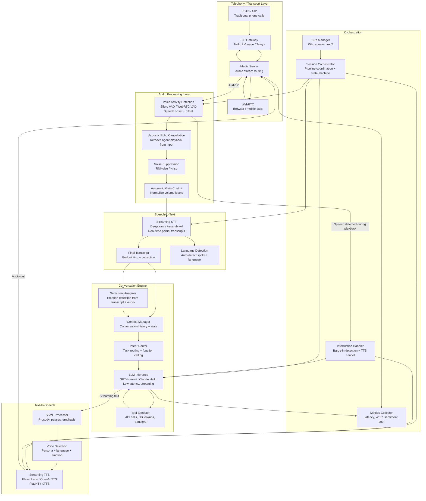

# Voice AI Agents

## 1. Overview

A Voice AI agent is a system that conducts spoken conversations with humans in real time: it listens to speech, understands intent, reasons about a response, and speaks back --- all within a latency budget that makes the interaction feel like a natural phone call. The architecture is a pipeline of three ML-intensive stages --- Speech-to-Text (STT), LLM processing, and Text-to-Speech (TTS) --- connected by a real-time audio transport layer, with each stage operating under strict latency constraints that together must sum to less than the human tolerance for conversational pause.

For Principal AI Architects, Voice AI is the most latency-constrained GenAI system to build. In text-based chatbots, users tolerate 1--3 seconds of delay because they are reading, not waiting. In voice conversations, any pause beyond 500ms feels unnatural, and beyond 1 second, users begin to suspect the system is broken or has lost the connection. This 500ms end-to-end budget must be divided across audio capture, STT inference, LLM generation, TTS synthesis, and audio delivery --- leaving each component roughly 100--150ms to complete its work. The architecture is fundamentally a real-time streaming pipeline where every component must support incremental processing: STT must transcribe while the user is still speaking, the LLM must begin generating before the full transcript is available, and TTS must synthesize while the LLM is still generating.

**Key numbers that shape Voice AI architecture:**

- End-to-end response latency target: <500ms (conversational) to <1000ms (acceptable). Beyond 1s, the experience degrades noticeably.
- Speech-to-Text latency: 100--300ms for streaming STT (Whisper streaming, Deepgram, AssemblyAI). 500ms--2s for batch STT (Whisper large, offline).
- LLM Time-to-First-Token: 100--300ms for optimized inference. This is the bottleneck for most voice agents.
- Text-to-Speech latency: 100--400ms TTFA (Time to First Audio byte). Streaming TTS is essential --- do not wait for the full text.
- Voice Activity Detection (VAD): 50--150ms to detect speech onset and offset. Determines when the user starts and stops talking.
- Interruption handling: The system must detect when the user speaks over the AI's response within 200ms and stop TTS playback.
- Audio frame size: 20ms per frame (standard for WebRTC and telephony). Processing must complete within 20ms to avoid audio glitches.
- Telephony connection: 100--200ms round-trip for PSTN via SIP/media gateways. WebRTC: 50--150ms.
- Concurrent calls: A single GPU (A100) can serve 50--200 concurrent STT streams (Whisper) and 100--500 TTS streams (XTTS/StyleTTS), depending on model size.

---

## 2. Requirements

### Functional Requirements

| Requirement | Description |
|---|---|
| Real-time speech conversation | Bidirectional spoken dialogue with natural turn-taking. |
| Speech recognition | Accurate transcription of user speech, including noisy environments, accents, and domain-specific vocabulary. |
| LLM-powered reasoning | Natural language understanding and generation powered by a frontier LLM. |
| Speech synthesis | Natural-sounding voice output with appropriate prosody, pacing, and emotion. |
| Interruption handling | User can interrupt the AI mid-response. The system stops speaking and begins processing the interruption. |
| Telephony integration | Connect via SIP/PSTN for phone calls and WebRTC for browser-based interactions. |
| Conversation management | Multi-turn context, session state, and conversation history across the voice session. |
| Emotion/sentiment detection | Detect user emotion (frustration, satisfaction) and adapt response tone. |
| Multilingual support | Support multiple languages with language detection and switching. |

### Non-Functional Requirements

| Requirement | Target | Rationale |
|---|---|---|
| End-to-end response latency (p50) | <500ms | Conversational pace requires sub-second response. |
| End-to-end response latency (p99) | <1000ms | Tail latency beyond 1s breaks conversational flow. |
| STT word error rate (WER) | <10% (clean audio), <15% (noisy) | Transcription errors propagate to incorrect LLM responses. |
| TTS naturalness (MOS) | >4.0 / 5.0 | Unnatural speech reduces user trust and engagement. |
| Concurrent calls | 1000+ per deployment | Enterprise contact center scale. |
| Availability | 99.95% | Voice is synchronous; downtime = dropped calls. |
| Interruption detection | <200ms | Users expect immediate response to their interruption. |

---

## 3. Architecture

### 3.1 End-to-End Voice AI Architecture



### 3.2 Latency Budget Breakdown

```mermaid
gantt
    title Voice AI Response Latency Budget (500ms target)
    dateFormat X
    axisFormat %L ms

    section Audio Input
    VAD + Endpointing        :0, 100
    Audio Preprocessing      :100, 130

    section STT
    Streaming Transcription  :130, 250

    section LLM
    Context Assembly         :250, 270
    LLM TTFT                 :270, 400

    section TTS
    TTS First Audio Byte     :400, 500

    section Playback
    Audio Delivery           :500, 530
```



---

## 4. Core Components

### 4.1 Voice Activity Detection (VAD)

VAD is the component that determines when the user is speaking and when they have stopped. It is the trigger for the entire pipeline: STT processing begins when VAD detects speech onset, and the system waits for VAD to detect speech offset (silence) before finalizing the transcript and triggering LLM inference.

**VAD implementations:**

| VAD | Approach | Latency | Accuracy | Deployment |
|---|---|---|---|---|
| **Silero VAD** | Small neural network (8MB) | 30--50ms | 95--98% | Self-hosted, runs on CPU |
| **WebRTC VAD** | GMM-based energy detection | 10--20ms | 85--90% | Built into WebRTC, very fast |
| **Deepgram VAD** | Integrated with STT | 50--100ms | 96--99% | Cloud API |
| **Custom (energy + model)** | Hybrid: energy threshold + neural | 20--50ms | 92--96% | Self-hosted |

**Endpointing:** The hardest part of VAD is determining when the user has finished their utterance (endpointing), as opposed to a natural mid-sentence pause. Too aggressive endpointing (short silence threshold, e.g., 300ms) cuts the user off mid-thought. Too conservative (long threshold, e.g., 1500ms) adds dead time before the system responds.

**Adaptive endpointing:** Use a two-threshold approach:
- **Short threshold (300--500ms):** If the accumulated transcript forms a complete sentence (detected by punctuation model or LLM), finalize immediately.
- **Long threshold (800--1200ms):** If the transcript is incomplete, wait longer for the user to continue.

This reduces average response latency while avoiding premature cutoff on complex utterances.

### 4.2 Speech-to-Text (STT)

STT converts the user's spoken audio into text. In a voice agent, STT must operate in streaming mode --- producing partial transcripts as the user speaks, with a final corrected transcript once the utterance is complete.

**STT providers and models:**

| Provider/Model | Mode | Latency | WER (clean) | WER (noisy) | Languages | Cost |
|---|---|---|---|---|---|---|
| **Deepgram (Nova-2)** | Streaming | 100--200ms | 5--8% | 10--15% | 30+ | $0.0043/min |
| **AssemblyAI (Universal-2)** | Streaming | 150--300ms | 5--8% | 10--15% | 12+ | $0.0065/min |
| **OpenAI Whisper (large-v3)** | Batch | 500ms--2s | 3--5% | 8--12% | 99 | Self-hosted (GPU) |
| **Whisper (turbo)** | Batch | 200--500ms | 5--7% | 10--14% | 99 | Self-hosted (GPU) |
| **Google Cloud STT (Chirp 2)** | Streaming | 100--200ms | 4--7% | 8--12% | 100+ | $0.006/min |
| **Azure Speech (Whisper)** | Streaming | 150--300ms | 5--7% | 10--14% | 100+ | $0.006/min |

**Streaming vs batch tradeoff:** Streaming STT (Deepgram, AssemblyAI, Google) produces partial transcripts with 100--300ms latency, enabling the LLM to begin processing before the user finishes speaking. Batch STT (Whisper) waits for the full utterance, producing higher accuracy but adding 500ms+ to the pipeline. For voice agents with <500ms latency targets, streaming STT is required.

**Keyword boosting:** Enterprise voice agents use domain-specific vocabulary (product names, technical terms, person names) that general STT models may misrecognize. Most STT providers support keyword boosting --- providing a list of expected terms with boosted recognition probability. This can reduce WER on domain terms by 30--50%.

### 4.3 LLM Processing

The LLM is the reasoning engine of the voice agent. It receives the transcribed user utterance, conversation history, and task context, and generates a response. The critical metric is TTFT (Time to First Token) --- the first token must be generated within ~150ms of receiving the transcript to stay within the latency budget.

**LLM selection for voice agents:**

The model must be fast, not necessarily the largest or most capable. A 500ms TTFT from GPT-4o might produce a better answer than a 150ms TTFT from GPT-4o-mini, but the user experiences 350ms of awkward silence.

| Model | TTFT | Quality | Cost/1K tokens | Voice Agent Suitability |
|---|---|---|---|---|
| GPT-4o-mini | 100--200ms | Good | $0.15 input / $0.60 output | Excellent --- default choice |
| Claude 3.5 Haiku | 100--200ms | Good | $0.25 input / $1.25 output | Excellent |
| GPT-4o | 300--600ms | Excellent | $2.50 input / $10 output | Marginal --- too slow for voice |
| Llama 3.1 8B (self-hosted) | 50--100ms | Moderate | GPU cost | Excellent for latency-critical |
| Groq (Llama 3.1 70B) | 100--200ms | Very good | $0.59 input / $0.79 output | Good (fast inference provider) |

**Streaming LLM output to TTS:** The LLM generates text token by token. Rather than waiting for the full response, the system streams tokens to the TTS engine as they are produced. The TTS engine begins synthesizing audio from the first sentence fragment. This pipelined approach overlaps LLM generation time with TTS synthesis time, reducing end-to-end latency.

**Sentence boundary detection for TTS streaming:** TTS models produce better prosody when given complete sentences rather than fragments. The system buffers LLM output until a sentence boundary is detected (period, question mark, comma for natural pause points), then sends the sentence to TTS. This balances latency (smaller chunks = faster response) with quality (complete sentences = better prosody).

### 4.4 Text-to-Speech (TTS)

TTS converts the LLM's text response into spoken audio. For voice agents, TTS must produce natural-sounding speech with appropriate prosody, support streaming (begin synthesis before the full text is available), and operate at low latency.

**TTS providers and models:**

| Provider/Model | Naturalness (MOS) | TTFA | Streaming | Voice Cloning | Cost |
|---|---|---|---|---|---|
| **ElevenLabs (Turbo v2.5)** | 4.5/5.0 | 150--300ms | Yes | Yes (instant + fine-tuned) | $0.18/1K chars |
| **OpenAI TTS (tts-1)** | 4.2/5.0 | 200--400ms | Yes | No (6 preset voices) | $15/1M chars |
| **OpenAI TTS (tts-1-hd)** | 4.5/5.0 | 400--800ms | Yes | No | $30/1M chars |
| **PlayHT (Play3.0)** | 4.4/5.0 | 100--200ms | Yes | Yes | $0.10/1K chars |
| **Deepgram Aura** | 4.0/5.0 | 100--200ms | Yes | No (preset voices) | $0.015/1K chars |
| **XTTS v2 (Coqui, open-source)** | 4.0/5.0 | 200--500ms | Yes | Yes (zero-shot) | Self-hosted (GPU) |
| **Cartesia (Sonic)** | 4.3/5.0 | 90--150ms | Yes | Yes | $0.05/1K chars |

**Voice selection and personalization:** The voice should match the agent's persona. A banking assistant should sound professional and calm; a children's education app should sound warm and enthusiastic. Most TTS providers offer voice customization through: preset voice selection (choose from a library), voice cloning (upload audio samples to create a custom voice), and SSML control (adjust pitch, rate, volume, emphasis, and pauses).

**SSML for voice agent control:**

```xml
<speak>
  <prosody rate="medium" pitch="medium">
    I found <emphasis level="moderate">three</emphasis> available flights.
    <break time="300ms"/>
    The best option departs at
    <say-as interpret-as="time">14:30</say-as>
    and costs
    <say-as interpret-as="currency">$299</say-as>.
  </prosody>
</speak>
```

### 4.5 Interruption Handling (Barge-In)

Interruption handling is what separates a voice agent from a voice menu. When the user speaks while the AI is responding, the system must: (1) detect the interruption within 200ms, (2) stop TTS audio playback immediately, (3) process the user's interruption as a new utterance, and (4) resume the conversation with the interruption context.

**Interruption detection pipeline:**

1. **VAD on input audio during playback.** While TTS audio is playing, the VAD continuously monitors the input audio stream. However, the input audio contains both the user's voice and the echo of the agent's TTS playback (via speaker-to-microphone coupling).

2. **Acoustic Echo Cancellation (AEC).** Before VAD analysis, the AEC module subtracts the known TTS output signal from the input audio, isolating the user's voice. Without AEC, the agent would "hear" its own voice and falsely detect an interruption.

3. **Speech threshold.** After AEC, apply a speech energy threshold and VAD model. If sustained speech (>200ms) is detected, classify as an interruption.

4. **Cancel TTS playback.** Immediately stop sending TTS audio frames to the media server. Clear the TTS synthesis buffer.

5. **Process interruption.** The partial utterance is transcribed by STT. The conversation context includes the agent's partial response (what was said before the interruption) so the LLM can understand the conversational state.

### 4.6 Telephony Integration

Voice agents connect to users via two primary transport mechanisms: telephony (PSTN/SIP) for traditional phone calls and WebRTC for browser and mobile app calls.

**Telephony stack:**

```
User's Phone → PSTN → SIP Trunk Provider (Twilio/Vonage/Telnyx)
    → SIP Gateway → Media Server → Voice AI Pipeline
```

| Component | Function | Key Providers |
|---|---|---|
| SIP trunk provider | PSTN ↔ SIP conversion, phone number provisioning | Twilio, Vonage, Telnyx, Bandwidth |
| SIP gateway | SIP signaling (INVITE, BYE, etc.) | FreeSWITCH, Asterisk, Opalstack |
| Media server | RTP audio stream handling, codec transcoding | Janus, Jitsi, FreeSWITCH |
| Audio codec | Audio encoding/decoding | G.711 (PSTN), Opus (WebRTC) |

**WebRTC stack:**

```
User's Browser → WebRTC (Opus codec, DTLS-SRTP) → TURN/STUN
    → Media Server → Voice AI Pipeline
```

WebRTC provides: lower latency (50--150ms vs 100--200ms for PSTN), higher audio quality (Opus codec at 48kHz vs G.711 at 8kHz), native echo cancellation, and encryption by default (DTLS-SRTP).

**Audio codec considerations for ML models:**

| Codec | Sample Rate | Bitrate | Quality | STT Compatibility |
|---|---|---|---|---|
| G.711 u-law (PSTN) | 8 kHz | 64 kbps | Telephone quality | Good (models trained on telephony data) |
| G.711 A-law | 8 kHz | 64 kbps | Telephone quality | Good |
| Opus (WebRTC) | 48 kHz | 6--510 kbps | HD quality | Excellent (higher quality input) |
| PCM 16-bit (internal) | 16 kHz | 256 kbps | STT standard | Native (most STT models expect 16kHz) |

Most STT models expect 16kHz mono PCM audio. The media server must resample from the transport codec (8kHz G.711 or 48kHz Opus) to 16kHz PCM before feeding to the STT engine.

### 4.7 Emotion Detection and Adaptive Response

Voice AI agents can detect user emotion from both the transcribed text (sentiment analysis) and the audio signal (prosodic features: pitch, speaking rate, volume).

**Text-based sentiment (from transcript):**
- Frustration indicators: "I already told you", "this is the third time", "can I speak to a human"
- Satisfaction indicators: "thank you", "that's exactly what I needed", "great"
- Confusion indicators: "I don't understand", "what does that mean", repeated questions

**Audio-based emotion (from speech signal):**
- Elevated pitch and increased speaking rate → anger or frustration
- Flat pitch and slow rate → boredom or resignation
- Wavering pitch and irregular pauses → uncertainty or distress

**Adaptive response strategies:**

| Detected Emotion | Response Adaptation |
|---|---|
| Frustration | Acknowledge frustration, apologize, escalate to human if persistent |
| Confusion | Simplify language, offer to explain differently, ask clarifying question |
| Urgency | Increase response speed (shorter answers), prioritize actionable information |
| Satisfaction | Reinforce positive experience, offer additional assistance |

---

## 5. Data Flow

### Step-by-Step Voice Interaction Lifecycle

1. **Call initiation.** User dials a phone number (PSTN) or clicks "Call" in a web app (WebRTC). The SIP gateway or WebRTC endpoint establishes the audio session.

2. **Audio stream begins.** The media server routes the bidirectional audio stream. Inbound audio (user's microphone) is sent to the voice AI pipeline. Outbound audio (agent's TTS) is sent to the user.

3. **Voice Activity Detection.** The VAD module processes inbound audio frames (20ms each). It detects speech onset and begins buffering audio.

4. **Audio preprocessing.** The buffered audio passes through: noise suppression (remove background noise), acoustic echo cancellation (remove agent's TTS echo if in full-duplex mode), and automatic gain control (normalize volume).

5. **Streaming Speech-to-Text.** Preprocessed audio frames are streamed to the STT engine. Partial transcripts are produced in real time (every 100--300ms). The orchestrator displays partial transcripts for monitoring/logging.

6. **Endpointing.** The VAD detects speech offset (silence). The STT engine produces the final transcript with corrections.

7. **Context assembly.** The conversation engine assembles: system prompt (agent persona, task instructions, tool definitions), conversation history (prior turns), current user transcript, and any retrieved context (knowledge base, customer record).

8. **LLM inference (streaming).** The assembled prompt is sent to the LLM. Tokens stream back beginning at TTFT (~100--200ms).

9. **Sentence buffering.** LLM output tokens are accumulated until a sentence boundary is detected.

10. **TTS synthesis (streaming).** The completed sentence is sent to the TTS engine. Audio synthesis begins immediately. First audio bytes are available within 100--300ms.

11. **Audio delivery.** TTS audio frames are streamed to the media server, which delivers them to the user's device. The user hears the agent speaking.

12. **Concurrent monitoring.** While the agent speaks, the VAD continues monitoring inbound audio for interruptions. If the user speaks, the interruption handler triggers.

13. **Turn completion.** When the LLM finishes generating and TTS finishes playing, the system transitions to listening mode. The cycle repeats.

---

## 6. Key Design Decisions / Tradeoffs

### STT Selection

| Decision Factor | Deepgram | AssemblyAI | Whisper (self-hosted) | Google Cloud STT |
|---|---|---|---|---|
| Streaming latency | 100--200ms | 150--300ms | 300--800ms (batch) | 100--200ms |
| Accuracy (WER clean) | 5--8% | 5--8% | 3--5% | 4--7% |
| Language support | 30+ | 12+ | 99 | 100+ |
| Cost (per minute) | $0.0043 | $0.0065 | GPU cost (~$0.002) | $0.006 |
| Custom vocabulary | Yes (keywords) | Yes | No (requires fine-tune) | Yes (phrases) |
| Deployment | Cloud API | Cloud API | Self-hosted | Cloud API |
| Best for | Low-latency voice agents | High-accuracy transcription | Multilingual, self-hosted | Google Cloud ecosystems |

### TTS Selection

| Decision Factor | ElevenLabs | OpenAI TTS | Deepgram Aura | Cartesia Sonic | XTTS (self-hosted) |
|---|---|---|---|---|---|
| TTFA | 150--300ms | 200--400ms | 100--200ms | 90--150ms | 200--500ms |
| Naturalness | 4.5/5 | 4.2/5 (tts-1) | 4.0/5 | 4.3/5 | 4.0/5 |
| Voice cloning | Yes | No | No | Yes | Yes |
| Cost / 1K chars | $0.18 | $15/1M chars | $0.015 | $0.05 | GPU cost |
| Streaming | Yes | Yes | Yes | Yes | Yes |
| Best for | Premium quality, cloned voices | Simple integration | Lowest latency + cost | Low latency + cloning | Self-hosted, full control |

### Latency vs Quality Trade-Off

| Configuration | E2E Latency | Speech Quality | LLM Quality | Cost/Min | Use Case |
|---|---|---|---|---|---|
| Deepgram + GPT-4o-mini + Cartesia | 300--500ms | Good | Good | ~$0.03 | Real-time customer service |
| Deepgram + Llama 3.1 8B + Deepgram Aura | 200--400ms | Good | Moderate | ~$0.01 | High-volume, cost-sensitive |
| AssemblyAI + GPT-4o + ElevenLabs | 600--1200ms | Excellent | Excellent | ~$0.10 | Premium advisory, low-volume |
| Whisper + Claude Haiku + XTTS | 500--800ms | Good | Good | ~$0.02 | Self-hosted, privacy-critical |

### Architecture Pattern

| Pattern | Description | Latency | Complexity | Best For |
|---|---|---|---|---|
| **Sequential pipeline** | STT → LLM → TTS (each waits for prior) | 800ms--2s | Low | Prototyping, batch scenarios |
| **Overlapping pipeline** | STT streams → LLM starts on partial → TTS on partial LLM | 300--600ms | Medium | Production voice agents |
| **Full-duplex** | All three run concurrently, interruption-aware | 200--500ms | High | Premium conversational AI |
| **Speech-to-speech model** | Single model: audio in → audio out (GPT-4o Realtime) | 200--400ms | Low (from application perspective) | Native multimodal support |

---

## 7. Failure Modes

### 7.1 Endpointing Errors (Premature Cutoff)

**Symptom:** The agent responds before the user finishes their sentence. The user says "I want to book a flight to---" and the agent starts answering about flights before the destination is specified.

**Root cause:** The silence threshold is too aggressive (too short). Or the user paused mid-sentence to think.

**Mitigation:** Adaptive endpointing that uses linguistic cues (is the transcript a complete sentence?) alongside silence duration. Increase the silence threshold for mid-sentence pauses. Use a small language model to predict sentence completion probability.

### 7.2 Echo Loop (Self-Triggering)

**Symptom:** The agent detects its own TTS output as user speech, triggers STT, processes its own words, and generates a response to itself --- creating a feedback loop.

**Root cause:** Acoustic Echo Cancellation (AEC) failed to suppress the TTS echo. Common in speakerphone mode, high-volume playback, or when the echo path changes (user moves the phone).

**Mitigation:** Robust AEC implementation (WebRTC's built-in AEC is a good baseline). Add a secondary check: if the STT transcript matches the recent TTS output (fuzzy match), discard it as echo. Implement half-duplex mode as a fallback (mute input during playback).

### 7.3 LLM Latency Spike

**Symptom:** Occasional calls experience 2--3 second pauses before the agent responds, while most calls are responsive.

**Root cause:** LLM inference provider experiences a p99 latency spike (queue depth, GPU contention, rate limiting). Or the conversation context has grown large, increasing prefill time.

**Mitigation:** Set a hard timeout on LLM inference (500ms). On timeout, use a filler response ("Let me look into that...") while retrying. Implement multi-provider failover (primary: OpenAI, secondary: Anthropic or Groq). Monitor LLM latency per-request and shift traffic away from degraded providers.

### 7.4 Interruption Handling Failure

**Symptom:** The user tries to interrupt the agent but the agent keeps talking. The user must wait for the agent to finish before being heard.

**Root cause:** AEC is not subtracting the TTS output from the input stream effectively, so VAD cannot distinguish user speech from echo. Or the interruption threshold is too high.

**Mitigation:** Tune VAD sensitivity during playback. Use energy-based detection with a lower threshold during TTS playback. Implement a "double-talk detector" that uses spectral analysis to distinguish user speech from echo. As a fallback, implement a keypad-based interrupt (user presses * to interrupt).

### 7.5 Transcription Error Cascade

**Symptom:** The agent misunderstands the user and responds to something they did not say. The user corrects themselves, but the agent's response is based on the incorrect transcription.

**Root cause:** STT misrecognizes a critical word (name, number, address). The error propagates to the LLM, which generates a confident but wrong response.

**Mitigation:** Display the transcript (for visual interfaces) so users can spot errors. Implement confirmation for critical information: "I heard your flight is to Boston on March 15th. Is that correct?" Use keyword boosting for domain-specific vocabulary. For numbers and addresses, use specialized post-processing (number normalization, address validation).

---

## 8. Real-World Examples

### Vapi

Vapi is a voice AI platform that provides the full orchestration layer between telephony and AI models. Developers specify the LLM, STT, TTS, and tools via API, and Vapi handles: SIP/WebRTC transport, audio streaming between components, interruption handling, turn management, and tool execution during calls. Vapi supports Twilio, Vonage, and custom SIP trunks for telephony, and integrates with OpenAI, Anthropic, Deepgram, ElevenLabs, and PlayHT. The platform abstracts the complexity of real-time audio pipeline coordination.

### Retell AI

Retell AI provides an end-to-end voice agent platform with emphasis on low latency (sub-500ms response time). Their architecture includes a proprietary orchestration layer that optimizes the STT-LLM-TTS pipeline for minimal latency, including pre-buffering and speculative TTS synthesis. Retell supports custom LLM backends and provides a conversation design interface for building agent workflows with branching logic, tool calls, and human handoff.

### OpenAI Realtime API

OpenAI's Realtime API (2024) introduces a speech-to-speech model that processes audio input and produces audio output natively, bypassing the traditional STT → LLM → TTS pipeline. The model (GPT-4o Realtime) processes audio directly, maintaining conversational context in the audio domain. This eliminates the latency overhead of cascading three separate models and enables more natural prosody (the model "hears" tone and "speaks" with matching emotion). The API uses WebSocket for bidirectional audio streaming with native interruption handling.

### Google Dialogflow CX + CCAI

Google's Contact Center AI (CCAI) combines Dialogflow CX (conversation flow design) with Google Cloud STT and TTS for enterprise voice agents. The architecture includes: Dialogflow CX for deterministic conversation flows with NLU intents and slots, integration with Google STT (Chirp) and TTS for speech processing, Agent Assist for real-time agent coaching during human-handled calls, and CCAI Insights for post-call analytics. The platform is designed for enterprise contact centers with thousands of concurrent calls.

### Bland AI

Bland AI operates a voice agent platform focused on outbound calling at scale (sales, appointment scheduling, surveys). Their architecture handles: mass concurrent calls (thousands simultaneously), PSTN integration via SIP trunks, custom LLM backends with low-latency inference, and call analytics (sentiment, outcome tracking). Bland demonstrates the pattern of voice AI as a scaled-out platform for specific business workflows rather than a general-purpose assistant.

---

## 9. Related Topics

- [Multimodal Models](../01-foundations/05-multimodal-models.md) --- Speech-to-speech models (GPT-4o Realtime) that process audio natively without the STT → LLM → TTS cascade.
- [Latency Optimization](../11-performance/01-latency-optimization.md) --- TTFT optimization, streaming inference, and pipeline parallelization techniques critical for voice agent latency budgets.
- [Chatbot Architecture](./01-chatbot-architecture.md) --- Conversation management, session state, and context handling patterns shared between text and voice chatbots.
- [Model Serving](../02-llm-architecture/01-model-serving.md) --- Low-latency inference infrastructure (vLLM, TensorRT-LLM, SGLang) for serving the LLM component of the voice pipeline.
- [Guardrails](../10-safety/01-guardrails.md) --- Content moderation for voice agents: filtering both STT input and LLM output for safety.
- [Agent Architecture](../07-agents/01-agent-architecture.md) --- Tool use and function calling patterns used by voice agents to perform actions (book appointments, look up accounts, transfer calls).
- [Model Routing](../11-performance/04-model-routing.md) --- Selecting between fast/cheap models (voice) and capable/slow models (complex queries) based on task complexity.

---

## 10. Source Traceability

| Concept | Primary Source |
|---|---|
| Whisper (STT) | Radford et al., "Robust Speech Recognition via Large-Scale Weak Supervision" (OpenAI, 2023) |
| Deepgram Nova | Deepgram documentation and benchmarks (2024--2025) |
| AssemblyAI Universal | AssemblyAI documentation and benchmarks (2024--2025) |
| ElevenLabs TTS | ElevenLabs documentation, "Turbo v2.5" (2024--2025) |
| OpenAI TTS | OpenAI, "Text-to-Speech API" documentation (2024) |
| OpenAI Realtime API | OpenAI, "Introducing the Realtime API" (2024) |
| XTTS v2 (Coqui) | Casanova et al., "XTTS: A Massively Multilingual Zero-Shot Text-to-Speech Model" (2024) |
| Silero VAD | Silero Team, "Silero VAD" (GitHub, 2021--present) |
| WebRTC | W3C, "WebRTC 1.0: Real-Time Communication Between Browsers" (2021) |
| SIP protocol | RFC 3261, "SIP: Session Initiation Protocol" (2002) |
| RTP protocol | RFC 3550, "RTP: A Transport Protocol for Real-Time Applications" (2003) |
| Vapi architecture | Vapi documentation (2024--2025) |
| Retell AI | Retell AI documentation (2024--2025) |
| Google CCAI | Google Cloud, "Contact Center AI" documentation (2023--2025) |
| Acoustic Echo Cancellation | Haykin, "Adaptive Filter Theory" (2002); WebRTC AEC implementation |
| Cartesia Sonic | Cartesia documentation (2024--2025) |
| PlayHT | PlayHT documentation, "Play3.0" (2024--2025) |
| Voice emotion detection | Schuller et al., "Speech Emotion Recognition: Two Decades in a Nutshell" (2018) |
